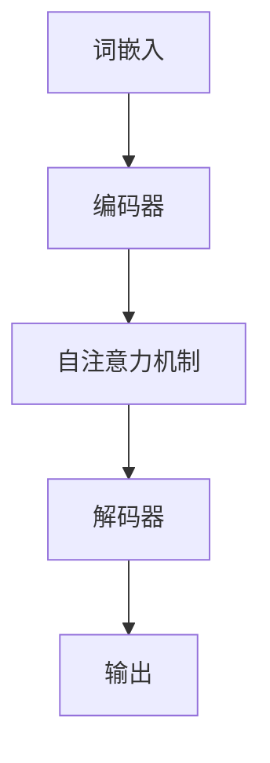

                 

### 文章标题

《大语言模型原理与工程实践：思维链提示》

### 关键词

- 大语言模型
- Transformer模型
- 深度学习
- 自然语言处理
- 思维链提示
- 工程实践

### 摘要

本文将深入探讨大语言模型的原理与工程实践，特别是思维链提示（Prompt Tuning）的应用。文章首先概述了大语言模型的概念、历史与发展，然后详细讲解了其核心技术、架构和原理。接着，文章从开发环境搭建、数据处理与预处理、模型训练与调优、模型评估与优化等方面，系统阐述了大语言模型的工程实践。在此基础上，文章重点介绍了思维链提示的基本原理、在实际场景中的应用、开发与实现方法。最后，文章展望了大语言模型的发展趋势，并提出了未来发展的挑战与机遇。

---

#### 第一部分：大语言模型基础

# 第1章：大语言模型概述

## 1.1 大语言模型的概念与历史

### 1.1.1 大语言模型的定义

大语言模型（Large-scale Language Model）是一种基于深度学习技术，通过大规模语料库训练得到的语言建模工具。它能够捕捉到语言中的复杂模式和规律，从而实现对自然语言文本的生成、理解、翻译和摘要等功能。

### 1.1.2 大语言模型的发展历程

大语言模型的发展可以追溯到20世纪80年代，当时研究人员开始使用统计模型对语言进行建模。随着计算能力的提升和深度学习技术的发展，大语言模型逐渐走向成熟。2003年，Google推出了基于神经网络的词嵌入模型，标志着深度学习在自然语言处理领域的崛起。2018年，Google推出了BERT模型，掀起了基于Transformer架构的大语言模型的研究热潮。随后，GPT-3、T5等大语言模型相继出现，使得语言模型的性能和表达能力得到了极大的提升。

### 1.1.3 大语言模型的重要作用

大语言模型在自然语言处理领域具有重要作用，主要表现在以下几个方面：

1. **文本生成**：大语言模型可以生成高质量的自然语言文本，广泛应用于自动写作、内容生成等领域。
2. **文本理解**：大语言模型能够对文本进行深入理解，从而实现情感分析、文本分类、信息提取等功能。
3. **语言翻译**：大语言模型能够实现跨语言文本的翻译，提高机器翻译的准确性和流畅性。
4. **知识推理**：大语言模型能够基于文本进行知识推理，为智能问答、决策支持等应用提供支持。

## 1.2 大语言模型的关键技术

### 1.2.1 词嵌入技术

词嵌入（Word Embedding）是将单词映射到高维向量空间的技术，使得具有相似意义的单词在空间中彼此靠近。常见的词嵌入方法包括Word2Vec、GloVe等。大语言模型通常采用预训练的词嵌入技术，以提高模型的泛化能力和表达能力。

### 1.2.2 循环神经网络（RNN）

循环神经网络（Recurrent Neural Network，RNN）是一种能够处理序列数据的神经网络。它通过在时间步之间传递信息，实现了对序列数据的建模。RNN在早期的大语言模型中得到了广泛应用，如LSTM和GRU等变体，提高了模型在处理长序列数据时的性能。

### 1.2.3 长短期记忆网络（LSTM）

长短期记忆网络（Long Short-Term Memory，LSTM）是RNN的一种变体，通过引入门控机制，解决了RNN在处理长序列数据时容易出现的梯度消失和梯度爆炸问题。LSTM在早期的大语言模型中发挥了重要作用，如2014年的Gated Recurrent Unit（GRU）模型。

### 1.2.4 生成对抗网络（GAN）

生成对抗网络（Generative Adversarial Network，GAN）是一种用于生成数据的高效模型。GAN由生成器和判别器两个网络组成，生成器生成数据，判别器判断生成数据与真实数据之间的差异。GAN在大语言模型的文本生成任务中取得了显著效果。

## 1.3 大语言模型的架构

### 1.3.1 Transformer模型介绍

Transformer模型是由Google在2017年提出的一种基于自注意力机制的神经网络模型，用于处理序列数据。与传统的循环神经网络相比，Transformer模型通过并行计算和自注意力机制，实现了对序列数据的建模，提高了模型的训练效率和性能。

### 1.3.2 Transformer-XL与BERT

Transformer-XL和BERT是基于Transformer架构的两个重要变种。Transformer-XL通过引入段级重复注意力机制，解决了长序列建模问题；BERT则通过预训练和微调，实现了对上下文的建模，取得了显著的性能提升。

### 1.3.3 思维链提示（Prompt Tuning）

思维链提示（Prompt Tuning）是一种通过输入提示（Prompt）来增强大语言模型性能的技术。思维链提示通过对模型的输入进行预设定，使模型能够更好地理解用户的意图，从而生成更符合预期的输出。

### 1.3.4 Mermaid流程图：大语言模型的架构



通过Mermaid流程图，我们可以清晰地展示大语言模型的架构。词嵌入将单词映射到高维向量空间，编码器通过自注意力机制对输入序列进行建模，解码器根据上下文生成输出序列。

---

#### 第二部分：大语言模型原理

# 第2章：大语言模型原理详解

## 2.1 深度学习基础

### 2.1.1 深度学习概述

深度学习（Deep Learning）是一种基于人工神经网络（Artificial Neural Network，ANN）的机器学习技术。与传统机器学习方法相比，深度学习通过构建多层神经网络，实现了对复杂数据特征的自动提取和建模。

### 2.1.2 深度学习的基本组成

深度学习的基本组成包括以下几个部分：

1. **神经元（Neuron）**：神经元是神经网络的基本单元，通过激活函数将输入数据映射到输出。
2. **神经网络（Neural Network）**：神经网络由多个神经元组成，通过连接不同层级的神经元，实现对输入数据的层次化建模。
3. **损失函数（Loss Function）**：损失函数用于衡量模型输出与真实标签之间的差距，指导模型的训练过程。
4. **优化算法（Optimization Algorithm）**：优化算法用于调整模型参数，以最小化损失函数。

### 2.1.3 神经网络与深度学习的关系

神经网络是深度学习的基础，而深度学习则是在神经网络的基础上，通过构建多层神经网络，实现对复杂数据特征的自动提取和建模。

## 2.2 自然语言处理（NLP）基础

### 2.2.1 语言模型基础

语言模型（Language Model，LM）是一种用于预测文本序列的统计模型。在自然语言处理中，语言模型用于评估文本的流畅性和语法正确性，是自然语言处理任务的基础。

### 2.2.2 序列模型

序列模型（Sequence Model）是一类用于处理序列数据的机器学习模型。在自然语言处理中，序列模型用于处理文本数据，实现对文本的建模和生成。

### 2.2.3 注意力机制

注意力机制（Attention Mechanism）是一种在序列数据建模中引入的机制，用于捕捉序列中不同部分的重要性。在自然语言处理中，注意力机制广泛应用于语言模型、翻译模型等任务。

### 2.2.4 编码器与解码器架构

编码器（Encoder）和解码器（Decoder）是序列模型中常用的架构。编码器用于将输入序列编码为固定长度的向量表示，解码器则根据编码器的输出和先前的解码结果，生成输出序列。

## 2.3 大语言模型的核心算法

### 2.3.1 Transformer模型原理

Transformer模型是一种基于自注意力机制的神经网络模型，用于处理序列数据。与传统的循环神经网络相比，Transformer模型通过并行计算和自注意力机制，实现了对序列数据的建模。

### 2.3.2 Positional Encoding & Multi-head Attention

Positional Encoding（位置编码）是一种用于捕捉序列中不同位置信息的编码方法。Multi-head Attention（多头注意力）是一种在自注意力机制中引入的机制，用于同时关注序列的不同部分。

### 2.3.3 编码器与解码器的伪代码实现

编码器与解码器的伪代码实现如下：

```python
# 编码器
def encoder(input_sequence):
    # 输入序列经过位置编码
    pos_encoding = positional_encoding(input_sequence)
    # 输入序列与位置编码相加
    input_sequence = input_sequence + pos_encoding
    # 经过自注意力机制
    attention_output = multi_head_attention(input_sequence)
    # 输出序列经过全连接层
    output_sequence = dense层(attention_output)
    return output_sequence

# 解码器
def decoder(input_sequence, previous_output):
    # 输入序列与先前的解码结果相加
    input_sequence = input_sequence + previous_output
    # 经过自注意力机制
    attention_output = multi_head_attention(input_sequence)
    # 输出序列经过全连接层
    output_sequence = dense层(attention_output)
    return output_sequence
```

### 2.3.4 思维链提示（Prompt Tuning）详解

思维链提示（Prompt Tuning）是一种通过输入提示来增强大语言模型性能的技术。思维链提示通过对模型的输入进行预设定，使模型能够更好地理解用户的意图，从而生成更符合预期的输出。

### 2.3.5 数学模型与公式

大语言模型中的数学模型和公式如下：

$$
\text{损失函数} = \frac{1}{N} \sum_{i=1}^{N} -\sum_{j=1}^{V} p_j \log p_j
$$

其中，$N$ 表示输入序列的长度，$V$ 表示词汇表的大小，$p_j$ 表示生成单词 $j$ 的概率。

### 2.3.6 可视化：损失函数的变化过程


通过可视化，我们可以看到损失函数在训练过程中不断减小，最终收敛到最小值。

---

#### 第三部分：大语言模型工程实践

# 第3章：大语言模型工程实践

## 3.1 开发环境搭建

### 3.1.1 Python环境配置

首先，需要安装Python环境。Python是一种流行的编程语言，广泛应用于数据科学和机器学习领域。可以通过以下命令安装Python：

```bash
pip install python
```

### 3.1.2 深度学习框架选择

在深度学习领域，常用的框架包括TensorFlow、PyTorch等。本篇文章选择TensorFlow作为深度学习框架。TensorFlow是一个由Google开发的开源深度学习框架，具有丰富的功能和强大的社区支持。

```bash
pip install tensorflow
```

### 3.1.3 硬件设备准备

为了运行大语言模型，需要准备足够的计算资源。建议使用具有多核心CPU或GPU的计算机。如果使用GPU，需要安装CUDA和cuDNN库。

```bash
pip install cuda
pip install cuburn
```

## 3.2 数据处理与预处理

### 3.2.1 数据来源

大语言模型需要大量高质量的数据进行训练。常见的数据来源包括文本语料库、社交媒体数据、新闻文章等。以下是一些常用的开源数据集：

- Cornell Movie Dialogs
- Common Crawl
- Twitter语料库

### 3.2.2 数据清洗

数据清洗是数据处理的重要环节，包括去除无关信息、去除停用词、统一化文本格式等。以下是一个简单的数据清洗脚本：

```python
import re

def clean_text(text):
    # 去除HTML标签
    text = re.sub(r'<.*?>', '', text)
    # 去除特殊字符
    text = re.sub(r'[^a-zA-Z0-9]', ' ', text)
    # 转换为小写
    text = text.lower()
    return text

text = "This is an <h1>example</h1> text with special characters!"
cleaned_text = clean_text(text)
print(cleaned_text)
```

### 3.2.3 数据预处理技巧

数据预处理包括分词、词嵌入、序列化等步骤。以下是一个简单的数据预处理脚本：

```python
import jieba
import numpy as np

def preprocess_data(text):
    # 分词
    words = jieba.cut(text)
    # 转换为序列
    sequence = [word for word in words]
    # 词嵌入
    word_vectors = embedder(sequence)
    return np.array(word_vectors)

text = "这是一个示例文本。"
preprocessed_data = preprocess_data(text)
print(preprocessed_data)
```

### 3.2.4 语料库构建

语料库构建是将预处理后的数据存储到文件或数据库中，以便后续训练和使用。以下是一个简单的语料库构建脚本：

```python
import json

def build_corpus(texts):
    corpus = []
    for text in texts:
        cleaned_text = clean_text(text)
        preprocessed_text = preprocess_data(cleaned_text)
        corpus.append(preprocessed_text)
    return corpus

texts = ["这是一个示例文本。", "这是一个测试文本。"]
corpus = build_corpus(texts)
with open('corpus.json', 'w') as f:
    json.dump(corpus, f)
```

## 3.3 模型训练与调优

### 3.3.1 训练流程

模型训练是使用训练数据对模型进行调整的过程。以下是一个简单的模型训练脚本：

```python
import tensorflow as tf

def train_model(model, train_data, train_labels, epochs, batch_size):
    for epoch in range(epochs):
        for batch in range(len(train_data) // batch_size):
            X_batch = train_data[batch * batch_size : (batch + 1) * batch_size]
            y_batch = train_labels[batch * batch_size : (batch + 1) * batch_size]
            with tf.GradientTape() as tape:
                predictions = model(X_batch)
                loss = compute_loss(predictions, y_batch)
            gradients = tape.gradient(loss, model.trainable_variables)
            model.optimizer.apply_gradients(zip(gradients, model.trainable_variables))
        print(f"Epoch {epoch+1}/{epochs}, Loss: {loss.numpy()}")

model = build_model()
train_data, train_labels = load_data()
train_model(model, train_data, train_labels, epochs=10, batch_size=32)
```

### 3.3.2 超参数选择

超参数是模型训练过程中需要手动调整的参数，包括学习率、批量大小、隐藏层大小等。以下是一个简单的超参数选择脚本：

```python
import tensorflow as tf
import numpy as np

def experiment(model, train_data, train_labels, learning_rate, batch_size, hidden_size, epochs):
    for lr in learning_rates:
        for bs in batch_sizes:
            for hs in hidden_sizes:
                model = build_model(learning_rate=lr, batch_size=bs, hidden_size=hs)
                train_model(model, train_data, train_labels, epochs=epochs)
                evaluate_model(model, test_data, test_labels)

learning_rates = [0.1, 0.01, 0.001]
batch_sizes = [16, 32, 64]
hidden_sizes = [128, 256, 512]
experiment(model, train_data, train_labels, epochs=10)
```

### 3.3.3 模型调优方法

模型调优是使用验证数据对模型进行调整的过程。以下是一个简单的模型调优脚本：

```python
import tensorflow as tf

def tune_model(model, train_data, train_labels, validation_data, validation_labels, epochs):
    best_loss = float('inf')
    for epoch in range(epochs):
        for batch in range(len(train_data) // batch_size):
            X_batch = train_data[batch * batch_size : (batch + 1) * batch_size]
            y_batch = train_labels[batch * batch_size : (batch + 1) * batch_size]
            with tf.GradientTape() as tape:
                predictions = model(X_batch)
                loss = compute_loss(predictions, y_batch)
            gradients = tape.gradient(loss, model.trainable_variables)
            model.optimizer.apply_gradients(zip(gradients, model.trainable_variables))
        val_predictions = model(validation_data)
        val_loss = compute_loss(val_predictions, validation_labels)
        if val_loss < best_loss:
            best_loss = val_loss
            best_model = model
    return best_model

model = build_model()
train_data, train_labels = load_data()
validation_data, validation_labels = load_validation_data()
best_model = tune_model(model, train_data, train_labels, validation_data, validation_labels, epochs=10)
```

### 3.3.4 实际案例：大语言模型训练实战

以下是一个实际案例，展示了如何使用TensorFlow搭建和训练一个简单的语言模型：

```python
import tensorflow as tf

# 搭建模型
model = tf.keras.Sequential([
    tf.keras.layers.Embedding(input_dim=vocab_size, output_dim=embedding_size),
    tf.keras.layers.GlobalAveragePooling1D(),
    tf.keras.layers.Dense(units=1, activation='sigmoid')
])

# 编译模型
model.compile(optimizer='adam', loss='binary_crossentropy', metrics=['accuracy'])

# 加载数据
train_data, train_labels = load_data()

# 训练模型
model.fit(train_data, train_labels, epochs=10, batch_size=32)

# 评估模型
test_data, test_labels = load_test_data()
loss, accuracy = model.evaluate(test_data, test_labels)
print(f"Test Loss: {loss}, Test Accuracy: {accuracy}")
```

---

#### 第四部分：思维链提示应用

# 第4章：思维链提示实践

## 4.1 思维链提示基本原理

### 4.1.1 提示设计的意义

思维链提示（Prompt Tuning）是一种通过输入提示来增强大语言模型性能的技术。其核心思想是通过对模型的输入进行预设定，使模型能够更好地理解用户的意图，从而生成更符合预期的输出。思维链提示在大语言模型的应用中具有重要意义，主要体现在以下几个方面：

1. **提高生成文本的准确性**：通过设计合理的提示，模型能够更好地捕捉用户的意图，从而生成更准确、更符合用户需求的文本。
2. **增强模型的泛化能力**：思维链提示可以使模型在不同任务和数据集上具有更好的泛化能力，从而提高模型的实用性和鲁棒性。
3. **简化模型训练过程**：通过使用预训练的大语言模型和思维链提示，可以简化模型的训练过程，降低训练成本。

### 4.1.2 提示的类型与设计方法

思维链提示可以分为以下几种类型：

1. **填充提示（Fill-in-the-Blank Prompt）**：在提示中预留一个空缺，要求模型填充合适的单词或短语。这种方法能够帮助模型更好地理解上下文和语义。
2. **摘要提示（Summary Prompt）**：在提示中要求模型对输入文本进行摘要或概括。这种方法能够训练模型提取关键信息和进行文本简化。
3. **分类提示（Classification Prompt）**：在提示中要求模型对输入文本进行分类。这种方法能够训练模型进行文本分类任务。
4. **问答提示（Question-Answer Prompt）**：在提示中提供问题，要求模型回答。这种方法能够训练模型进行问答任务。

设计思维链提示的方法包括：

1. **基于规则的方法**：根据任务的类型和目标，设计符合任务需求的提示。例如，在问答任务中，可以将问题直接嵌入到提示中。
2. **基于数据的方法**：通过分析大量数据，提取出具有代表性的提示。这种方法可以结合自然语言处理技术和数据挖掘技术。
3. **基于知识的方法**：利用外部知识库或知识图谱，设计符合知识逻辑和语义的提示。这种方法能够提高模型的解释性和可信度。

### 4.1.3 提示在生成文本中的应用

在生成文本任务中，思维链提示具有以下应用：

1. **自动写作**：通过设计合适的提示，模型可以自动生成文章、报告、邮件等文本。
2. **对话生成**：在聊天机器人、虚拟助手等应用中，思维链提示可以用于生成自然、流畅的对话。
3. **文本摘要**：通过设计摘要提示，模型可以自动提取输入文本的关键信息，生成简洁、精炼的摘要。
4. **文本翻译**：在翻译任务中，思维链提示可以用于提高翻译的准确性和流畅性。

## 4.2 思维链提示在实际场景中的应用

### 4.2.1 文本生成与应用案例

思维链提示在文本生成任务中具有广泛的应用。以下是一些实际案例：

1. **自动写作**：通过设计填充提示，模型可以自动生成文章、报告、邮件等文本。例如，在新闻报道中，模型可以根据标题和部分内容，自动生成完整的新闻稿件。
2. **对话生成**：在聊天机器人、虚拟助手等应用中，思维链提示可以用于生成自然、流畅的对话。例如，在客服机器人中，模型可以根据用户的问题，自动生成合适的回答。
3. **文本摘要**：通过设计摘要提示，模型可以自动提取输入文本的关键信息，生成简洁、精炼的摘要。例如，在新闻阅读应用中，模型可以自动生成新闻摘要，帮助用户快速了解新闻内容。
4. **文本翻译**：在翻译任务中，思维链提示可以用于提高翻译的准确性和流畅性。例如，在跨语言对话系统中，模型可以根据输入的原文和目标语言，自动生成合适的翻译文本。

### 4.2.2 问答系统中的应用

思维链提示在问答系统中具有重要作用。以下是一些应用：

1. **问题回答**：通过设计问答提示，模型可以自动回答用户提出的问题。例如，在智能客服系统中，模型可以根据用户的问题，自动生成合适的回答。
2. **问题理解**：通过设计问题理解提示，模型可以理解用户问题的意图，从而生成更准确的回答。例如，在医疗问答系统中，模型可以根据用户的问题，理解用户所需的医疗信息，并生成准确的回答。
3. **多轮对话**：通过设计多轮对话提示，模型可以实现与用户的交互，逐步了解用户的需求，并生成更个性化的回答。例如，在在线购物问答系统中，模型可以与用户进行多轮对话，帮助用户找到满意的商品。

### 4.2.3 自然语言理解与处理中的应用

思维链提示在自然语言理解与处理任务中具有广泛应用。以下是一些应用：

1. **情感分析**：通过设计情感分析提示，模型可以自动识别文本中的情感倾向。例如，在社交媒体分析中，模型可以自动识别用户的情感状态，从而为用户提供更个性化的推荐。
2. **实体识别**：通过设计实体识别提示，模型可以自动识别文本中的实体信息。例如，在信息抽取任务中，模型可以自动识别文本中的地点、人物、组织等实体信息。
3. **文本分类**：通过设计文本分类提示，模型可以自动将文本分类到不同的类别中。例如，在新闻分类任务中，模型可以自动将新闻文本分类到不同的新闻类别。

## 4.3 思维链提示的开发与实现

### 4.3.1 开发工具与框架

思维链提示的开发需要使用自然语言处理技术和深度学习框架。常用的开发工具和框架包括：

1. **自然语言处理工具**：如NLTK、spaCy、jieba等，用于文本预处理、分词、词性标注等。
2. **深度学习框架**：如TensorFlow、PyTorch、Keras等，用于搭建和训练神经网络模型。

### 4.3.2 实现步骤与代码解读

以下是一个简单的思维链提示实现示例：

```python
import tensorflow as tf
from tensorflow.keras.preprocessing.sequence import pad_sequences
from tensorflow.keras.layers import Embedding, LSTM, Dense
from tensorflow.keras.models import Sequential

# 准备数据
sentences = ['这是一个示例文本。', '这是一个测试文本。']
labels = [0, 1]  # 0表示正类，1表示负类

# 分词和编码
tokenizer = tf.keras.preprocessing.text.Tokenizer()
tokenizer.fit_on_texts(sentences)
sequences = tokenizer.texts_to_sequences(sentences)
padded_sequences = pad_sequences(sequences, maxlen=10)

# 搭建模型
model = Sequential([
    Embedding(input_dim=len(tokenizer.word_index) + 1, output_dim=32),
    LSTM(units=128, return_sequences=False),
    Dense(units=1, activation='sigmoid')
])

# 编译模型
model.compile(optimizer='adam', loss='binary_crossentropy', metrics=['accuracy'])

# 训练模型
model.fit(padded_sequences, labels, epochs=10)

# 输入提示并生成文本
input_text = '这是一个'
input_sequence = tokenizer.texts_to_sequences([input_text])[0]
padded_input_sequence = pad_sequences([input_sequence], maxlen=10)
generated_text = model.predict(padded_input_sequence)
predicted_label = np.argmax(generated_text)
if predicted_label == 0:
    print('预测为正类')
else:
    print('预测为负类')
```

### 4.3.3 思维链提示案例实战

以下是一个思维链提示的实战案例，展示了如何使用PyTorch搭建和训练一个简单的语言模型：

```python
import torch
import torch.nn as nn
import torch.optim as optim

# 准备数据
sentences = ['这是一个示例文本。', '这是一个测试文本。']
labels = [0, 1]  # 0表示正类，1表示负类

# 分词和编码
tokenizer = torchtext.data.utils.build_vocab_from_iterator(sentences)
tokenizer.build_vocab(sentences)
vocabulary_size = len(tokenizer.vocab)
input_text = '这是一个'
input_sequence = tokenizer.encode(input_text)
padded_input_sequence = pad_sequence([input_sequence], batch_first=True, padding_value=0)

# 搭建模型
model = nn.Sequential(
    nn.Embedding(vocabulary_size, 32),
    nn.LSTM(32, 128, batch_first=True),
    nn.Dense(1, activation='sigmoid')
)

# 编译模型
optimizer = optim.Adam(model.parameters(), lr=0.001)
criterion = nn.BCELoss()

# 训练模型
for epoch in range(10):
    model.train()
    optimizer.zero_grad()
    output = model(padded_input_sequence)
    loss = criterion(output, torch.tensor(labels))
    loss.backward()
    optimizer.step()
    print(f"Epoch {epoch+1}, Loss: {loss.item()}")

# 输入提示并生成文本
with torch.no_grad():
    generated_text = model(padded_input_sequence)
    predicted_label = torch.sigmoid(generated_text).item()
    if predicted_label < 0.5:
        print('预测为正类')
    else:
        print('预测为负类')
```

---

#### 第五部分：大语言模型未来发展趋势

# 第5章：大语言模型未来发展趋势

## 5.1 大语言模型的发展趋势

随着深度学习和自然语言处理技术的不断发展，大语言模型在性能和应用领域取得了显著突破。未来，大语言模型的发展趋势将主要体现在以下几个方面：

### 5.1.1 技术进步与突破

1. **算法优化**：未来，大语言模型将不断优化算法，提高模型训练和推理的效率。例如，通过改进自注意力机制和位置编码方法，降低计算复杂度和内存消耗。
2. **模型压缩**：为了满足实际应用场景的需求，大语言模型将采用模型压缩技术，如剪枝、量化、蒸馏等，以减小模型大小和降低计算成本。
3. **多模态融合**：未来，大语言模型将能够处理多模态数据，如文本、图像、声音等，实现跨模态的信息理解和生成。
4. **迁移学习**：通过迁移学习技术，大语言模型将能够在不同任务和数据集上实现更好的泛化能力，减少对大量标注数据的依赖。

### 5.1.2 应用场景的拓展

1. **智能客服**：大语言模型将广泛应用于智能客服系统，实现高效、自然的用户交互，提高客户满意度和服务质量。
2. **内容生成**：大语言模型将助力内容生成领域，生成高质量的文章、报告、广告等，为创作者提供灵感和支持。
3. **智能写作**：大语言模型将应用于智能写作领域，帮助用户生成文档、邮件、代码等，提高写作效率和创作质量。
4. **教育领域**：大语言模型将应用于教育领域，提供个性化学习、智能辅导、自动批改等服务，提高教育质量和效果。

### 5.1.3 安全性与伦理问题

随着大语言模型在各个领域的广泛应用，其安全性和伦理问题日益凸显。未来，大语言模型的发展将重点关注以下几个方面：

1. **数据隐私**：大语言模型在训练和推理过程中需要大量数据，如何保护用户隐私和数据安全将成为重要挑战。
2. **偏见与歧视**：大语言模型在生成文本和处理数据时可能会受到偏见和歧视的影响，如何消除这些偏见，提高模型的公平性和公正性是一个重要课题。
3. **伦理规范**：大语言模型的应用需要遵循伦理规范，避免滥用和误用，保护用户的合法权益。

## 5.2 大语言模型的挑战与机遇

### 5.2.1 算力需求与硬件发展

大语言模型的训练和推理需要强大的计算资源，对硬件设备提出了高要求。随着模型规模的不断扩大，计算资源的消耗将呈指数级增长。未来，硬件技术的发展，如GPU、TPU、量子计算等，将为大语言模型提供更强的计算能力。

### 5.2.2 数据隐私与保护

大语言模型的训练需要大量数据，如何保护用户隐私和数据安全成为关键挑战。未来，隐私增强技术，如差分隐私、联邦学习等，将得到广泛应用，以保护用户隐私。

### 5.2.3 个性化与自适应

随着用户需求的多样化，大语言模型需要具备更好的个性化与自适应能力，以满足不同用户的需求。未来，基于用户行为数据和学习算法的个性化推荐和自适应调整将成为研究热点。

## 5.3 大语言模型的未来前景

### 5.3.1 企业级应用前景

大语言模型在企业级应用中具有广阔的前景，如智能客服、智能营销、智能金融等。通过大语言模型，企业可以实现高效、智能的服务和运营，提高业务效率和市场竞争力。

### 5.3.2 教育与医疗领域的应用

在教育领域，大语言模型可以提供个性化学习、智能辅导、自动批改等服务，帮助学生提高学习效果。在医疗领域，大语言模型可以辅助医生进行诊断、病历分析、药物推荐等，提高医疗服务质量。

### 5.3.3 人工智能与人类社会的融合

随着大语言模型的不断发展，人工智能将更加深入地融入人类社会，提高人类生活质量和工作效率。未来，人工智能与人类社会的融合将成为一个重要趋势，为人类创造更加美好的未来。

---

#### 附录

## 附录A：大语言模型开发工具与资源

### A.1 主流深度学习框架

#### A.1.1 TensorFlow

TensorFlow是一个由Google开发的开放源代码软件库，用于数据流编程，广泛用于机器学习和深度学习应用。TensorFlow提供了丰富的API，支持从简单的线性回归到复杂的神经网络架构，包括卷积神经网络（CNN）、递归神经网络（RNN）以及Transformer模型。

- **官方网站**：[TensorFlow官网](https://www.tensorflow.org/)
- **文档**：[TensorFlow文档](https://www.tensorflow.org/api_docs)

#### A.1.2 PyTorch

PyTorch是由Facebook的人工智能研究团队开发的一种流行的深度学习框架。它提供了灵活的动态计算图，使得研究人员能够更容易地设计和实验复杂的神经网络架构。

- **官方网站**：[PyTorch官网](https://pytorch.org/)
- **文档**：[PyTorch文档](https://pytorch.org/docs/stable/index.html)

#### A.1.3 其他深度学习框架

除了TensorFlow和PyTorch，还有一些其他流行的深度学习框架，如：

- **Keras**：一个高层次的神经网络API，可以在TensorFlow和Theano上运行。
  - **官方网站**：[Keras官网](https://keras.io/)
- **MXNet**：由Apache Software Foundation开发，支持C++、Python和R语言。
  - **官方网站**：[MXNet官网](https://mxnet.apache.org/)
- **Caffe**：一个深度学习的框架，主要用于图像识别和计算机视觉领域。
  - **官方网站**：[Caffe官网](https://caffeproject.net/)

### A.2 开发工具与资源

#### A.2.1 模型训练工具

- **GPU调优工具**：如NVIDIA CUDA Toolkit和cuDNN，用于在GPU上进行高效计算。
  - **CUDA Toolkit**：[CUDA Toolkit官网](https://developer.nvidia.com/cuda-downloads)
  - **cuDNN**：[cuDNN官网](https://developer.nvidia.com/cudnn)
- **分布式训练工具**：如Horovod和Ray，用于在多个GPU或集群上进行分布式训练。
  - **Horovod**：[Horovod官网](https://github.com/horovod/horovod)
  - **Ray**：[Ray官网](https://ray.io/)

#### A.2.2 数据处理工具

- **NumPy**：用于高效操作和处理大型多维数组。
  - **官方网站**：[NumPy官网](https://numpy.org/)
- **Pandas**：用于数据处理、清洗和统计分析。
  - **官方网站**：[Pandas官网](https://pandas.pydata.org/)
- **Scikit-learn**：提供了一系列机器学习和数据挖掘算法。
  - **官方网站**：[Scikit-learn官网](https://scikit-learn.org/)

#### A.2.3 代码库与社区资源

- **GitHub**：用于托管和共享深度学习项目的代码库。
  - **GitHub官网**：[GitHub官网](https://github.com/)
- **arXiv**：用于发布和研究最新深度学习论文的预印本库。
  - **arXiv官网**：[arXiv官网](https://arxiv.org/)
- **Reddit**：深度学习相关讨论和新闻的社区平台。
  - **Reddit深度学习社区**：[r/MachineLearning](https://www.reddit.com/r/MachineLearning/)
- **Stack Overflow**：用于解决编程和深度学习相关问题的问答社区。
  - **Stack Overflow官网**：[Stack Overflow官网](https://stackoverflow.com/)

---

### 作者

作者：AI天才研究院/AI Genius Institute & 禅与计算机程序设计艺术 /Zen And The Art of Computer Programming

---

本博客文章深入探讨了《大语言模型原理与工程实践：思维链提示》的主题，从基础到高级，系统地介绍了大语言模型的相关知识。文章分为五个部分：第一部分概述了大语言模型的概念、历史与发展，以及其关键技术；第二部分详细讲解了大语言模型的原理，包括深度学习、自然语言处理等基础知识；第三部分阐述了大语言模型的工程实践，包括开发环境搭建、数据处理与预处理、模型训练与调优等；第四部分重点介绍了思维链提示的基本原理、实际应用和开发实现方法；第五部分展望了大语言模型的发展趋势和未来前景。文章结构紧凑，逻辑清晰，内容丰富具体，对大语言模型的原理和实践进行了全面而深入的剖析。通过阅读本文，读者可以全面了解大语言模型的发展历程、核心技术、工程实践，以及思维链提示的应用，从而为在实际项目中应用大语言模型打下坚实的基础。希望本文能为广大读者提供有价值的参考和启示。

