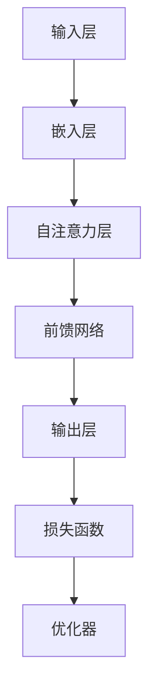
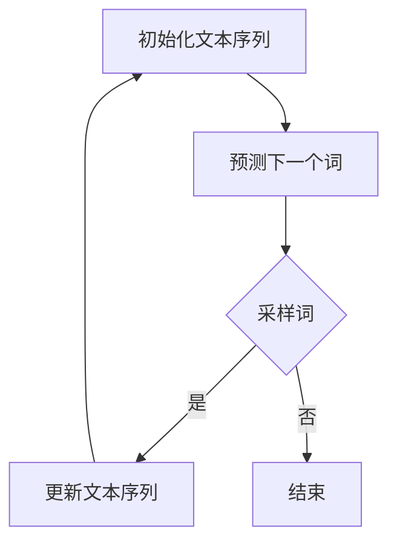
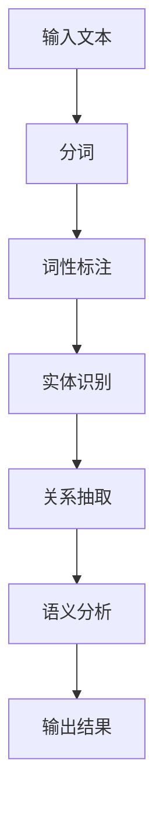
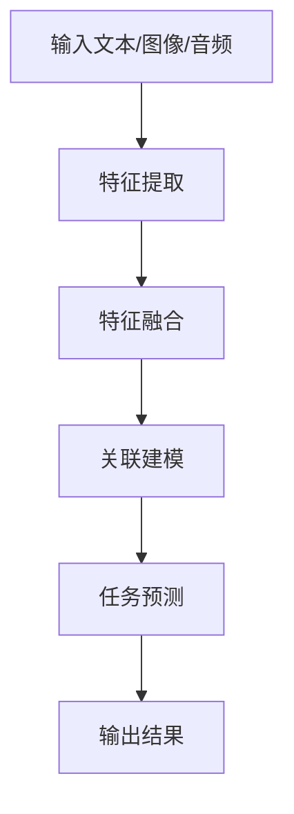

                 

## 文章标题: 大语言模型原理与工程实践：目前的局限

> 关键词：大语言模型，Transformer，数学原理，工程实践，局限

> 摘要：本文将对大语言模型的原理与工程实践进行深入探讨，从基础理论到实际应用，详细解析大语言模型的数学原理、架构设计、训练与优化，以及其在文本生成、自然语言理解等领域的应用。最后，我们将探讨大语言模型目前的局限，并展望其未来发展方向。

大语言模型作为一种强大的自然语言处理工具，近年来在人工智能领域取得了显著的进展。从GPT到BERT，再到GPT-3，大语言模型不仅在学术研究中表现卓越，在实际应用中也展现出了巨大的潜力。然而，随着模型规模的不断扩大，大语言模型在工程实践中也面临着诸多挑战。本文将带领读者深入了解大语言模型的原理与工程实践，并探讨其目前的局限与未来发展方向。

### 第一部分: 大语言模型基础

#### 第1章: 大语言模型概述

大语言模型是一种利用深度学习技术对自然语言数据进行建模的方法。其核心思想是通过学习大量文本数据，使模型能够理解和生成自然语言。大语言模型的发展历程可以追溯到20世纪80年代，当时研究者们开始尝试使用统计方法对自然语言进行建模。随着深度学习技术的发展，大语言模型逐渐成为自然语言处理领域的主流方法。

#### 1.1.1 大语言模型的发展历程

- 20世纪80年代：基于统计模型的自然语言处理方法，如隐马尔可夫模型（HMM）和条件随机场（CRF）等。
- 2013年：神经网络语言模型（NNLM）的提出，标志着深度学习在自然语言处理领域的兴起。
- 2018年：BERT模型的提出，将预训练与微调相结合，大幅提高了自然语言理解任务的性能。
- 2020年：GPT-3模型的发布，拥有超过1750亿参数，成为当时最大的语言模型。

#### 1.1.2 大语言模型的基本概念

大语言模型的基本概念包括：

- 语言模型（Language Model）：用于预测下一个单词或词组的概率分布。
- 词嵌入（Word Embedding）：将单词映射为高维向量。
- 预训练（Pre-training）：在大规模文本数据上进行预训练，以获得通用语言特征。
- 微调（Fine-tuning）：在特定任务数据上进行微调，以适应具体任务。

#### 1.1.3 大语言模型的核心原理

大语言模型的核心原理包括：

- 前向传播与反向传播：用于计算损失函数和更新模型参数。
- 损失函数（Loss Function）：用于衡量模型预测与实际标签之间的差距。
- 优化算法（Optimization Algorithm）：用于最小化损失函数，优化模型参数。

#### 1.1.4 大语言模型的优势与局限

大语言模型的优势包括：

- 高效的文本生成：能够根据前文生成连贯的自然语言文本。
- 优秀的自然语言理解：能够进行文本分类、命名实体识别等任务。
- 强大的泛化能力：通过预训练获得通用语言特征，能够适应多种任务。

然而，大语言模型也存在一些局限，如：

- 计算资源消耗大：大规模模型需要大量的计算资源和存储空间。
- 数据依赖性强：模型的性能很大程度上依赖于训练数据的质量。
- 难以解释：深度学习模型内部的决策过程难以解释，存在“黑箱”问题。

### 第2章: 大语言模型的数学原理

大语言模型的数学原理是理解其工作原理的基础。本节将详细介绍大语言模型中的核心数学概念，包括前向传播与反向传播、损失函数与优化算法、以及模型参数的初始化。

#### 2.1.1 前向传播与反向传播

前向传播（Forward Propagation）是深度学习模型的基本工作流程之一。在训练过程中，给定输入数据，模型会通过一系列的层（layer）进行计算，最终输出预测结果。前向传播的过程可以概括为以下几个步骤：

1. **输入层**：将输入数据输入到模型的第一层。
2. **隐层**：通过激活函数（activation function）将输入数据传递到下一层。
3. **输出层**：将最终的结果输出。

前向传播的过程可以用以下伪代码表示：

```python
for each layer in model:
    layer_output = layer(input_data)
    input_data = layer_output
```

反向传播（Backpropagation）是用于计算损失函数对模型参数的梯度的一种方法。在反向传播过程中，模型会从输出层开始，逆向计算每个层中的梯度。反向传播的过程可以概括为以下几个步骤：

1. **计算输出层误差**：计算输出层的预测值与实际标签之间的误差。
2. **反向传播误差**：将输出层的误差反向传播到前一层，并计算每一层的误差。
3. **更新模型参数**：使用梯度下降算法（Gradient Descent）更新模型参数。

反向传播的伪代码可以表示为：

```python
for each layer in model (in reverse order):
    error = layer.compute_error(d_error, layer_output)
    d_error = error * layer.get_derivative(layer_output)
```

#### 2.1.2 损失函数与优化算法

损失函数（Loss Function）是用于衡量模型预测与实际标签之间差距的函数。常见的损失函数包括均方误差（MSE）、交叉熵（Cross-Entropy）等。以均方误差为例，其公式如下：

$$
MSE = \frac{1}{n}\sum_{i=1}^{n}(y_i - \hat{y}_i)^2
$$

其中，$y_i$为实际标签，$\hat{y}_i$为模型预测值，$n$为样本数量。

优化算法（Optimization Algorithm）用于最小化损失函数，从而优化模型参数。常见的优化算法包括梯度下降（Gradient Descent）、Adam优化器等。以梯度下降为例，其公式如下：

$$
\theta = \theta - \alpha \cdot \nabla_\theta J(\theta)
$$

其中，$\theta$为模型参数，$\alpha$为学习率，$J(\theta)$为损失函数。

#### 2.1.3 模型参数的初始化

模型参数的初始化对模型性能有着重要影响。常见的初始化方法包括随机初始化（Random Initialization）、高斯分布初始化（Gaussian Initialization）等。以随机初始化为例，其伪代码如下：

```python
for each parameter in model:
    parameter.value = random_value()
```

#### 2.1.4 大语言模型的其他数学原理

除了前向传播与反向传播、损失函数与优化算法、模型参数的初始化，大语言模型还涉及到其他一些数学原理，如激活函数、正则化等。这些原理对于理解大语言模型的工作机制至关重要。

- **激活函数**：激活函数用于引入非线性，使得模型能够进行复杂的映射。常见的激活函数包括ReLU、Sigmoid、Tanh等。
- **正则化**：正则化技术用于防止模型过拟合，提高模型的泛化能力。常见的正则化技术包括L1正则化、L2正则化、dropout等。

### 第3章: 大语言模型的架构

大语言模型的架构是其核心组成部分，决定了模型的学习能力和性能。本节将详细介绍大语言模型的架构，包括神经网络结构、自注意力机制、Transformer模型详解，以及GPT系列模型介绍。

#### 3.1.1 神经网络结构

神经网络（Neural Network）是构建大语言模型的基础。神经网络由多个层组成，包括输入层、隐藏层和输出层。每个层由多个神经元（neurons）组成，神经元之间通过权重（weights）和偏置（biases）相连。

神经网络的结构可以用以下公式表示：

$$
\hat{y} = \sigma(W \cdot x + b)
$$

其中，$W$为权重矩阵，$b$为偏置向量，$x$为输入向量，$\sigma$为激活函数。

#### 3.1.2 自注意力机制

自注意力机制（Self-Attention Mechanism）是Transformer模型的核心组成部分。自注意力机制允许模型在处理序列数据时，自动计算序列中每个元素的重要性，并将这些重要性加权融合到最终的输出中。

自注意力机制的公式可以表示为：

$$
\text{Attention}(Q, K, V) = \text{softmax}\left(\frac{QK^T}{\sqrt{d_k}}\right)V
$$

其中，$Q$、$K$和$V$分别为查询（Query）、键（Key）和值（Value）向量，$d_k$为键向量的维度。

#### 3.1.3 Transformer模型详解

Transformer模型是自注意力机制的典型实现。Transformer模型由多个自注意力层（Self-Attention Layer）和前馈神经网络（Feedforward Neural Network）堆叠而成。

一个典型的Transformer模型可以表示为：

$$
\text{Transformer}(X) = \text{多头自注意力层} \circ \text{前馈神经网络} \circ X
$$

其中，$X$为输入序列。

#### 3.1.4 GPT系列模型介绍

GPT（Generative Pre-trained Transformer）系列模型是基于Transformer架构的大语言模型。GPT系列模型通过预训练和微调技术，实现了在多种自然语言处理任务上的优异性能。

GPT系列模型的发展历程如下：

- GPT-1：使用1.17亿参数的Transformer模型，在语言建模任务上取得了显著效果。
- GPT-2：使用7.5亿参数的Transformer模型，实现了更好的语言生成能力。
- GPT-3：拥有1750亿参数的Transformer模型，成为当时最大的语言模型，展现了强大的生成能力。

### 第4章: 大语言模型的训练与优化

大语言模型的训练与优化是确保模型性能的关键环节。本节将详细介绍大语言模型的训练与优化过程，包括数据预处理、训练策略与技巧、模型评估与调试，以及模型压缩与加速。

#### 4.1.1 数据预处理

数据预处理是训练大语言模型的第一步，其目的是将原始文本数据转化为模型可用的格式。数据预处理的主要任务包括：

- **分词**：将文本分割成单词或子词。
- **词嵌入**：将单词或子词映射为高维向量。
- **序列编码**：将单词或子词的向量序列编码为整数序列。

#### 4.1.2 训练策略与技巧

训练策略与技巧对大语言模型的性能有着重要影响。以下是一些常见的训练策略与技巧：

- **预训练**：在大规模文本数据上进行预训练，使模型获得通用语言特征。
- **微调**：在特定任务数据上进行微调，使模型适应具体任务。
- **学习率调度**：使用学习率调度策略，如学习率衰减，避免模型在训练过程中出现过拟合。
- **正则化**：使用正则化技术，如dropout、L1正则化、L2正则化，防止模型过拟合。

#### 4.1.3 模型评估与调试

模型评估与调试是验证模型性能和优化模型参数的重要环节。以下是一些常见的评估与调试方法：

- **交叉验证**：使用交叉验证方法，将训练数据分为多个子集，轮流用于训练和验证，以评估模型性能。
- **损失函数**：使用损失函数评估模型预测与实际标签之间的差距。
- **精度、召回率与F1分数**：使用这些指标评估模型在分类任务上的性能。
- **可视化**：通过可视化模型决策过程，帮助理解模型的工作机制。

#### 4.1.4 模型压缩与加速

随着模型规模的不断扩大，模型的计算成本和存储空间需求也显著增加。为了解决这个问题，研究人员提出了一系列模型压缩与加速技术，包括：

- **模型剪枝**：通过剪枝模型中的冗余参数，减少模型大小和计算成本。
- **量化**：将模型的权重和激活值从浮点数转换为低精度的整数，减少计算成本。
- **并行计算**：利用多核处理器和GPU等硬件资源，加速模型训练和推理过程。
- **模型蒸馏**：将大型模型的知识传递给小型模型，提高小型模型在目标任务上的性能。

### 第二部分: 大语言模型的应用实践

#### 第5章: 大语言模型在文本生成中的应用

大语言模型在文本生成任务中表现出色，能够生成高质量的自然语言文本。本节将详细介绍大语言模型在文本生成中的应用，包括文本生成的基本原理、优化策略、实际案例，以及开发环境搭建和代码实现。

#### 5.1.1 文本生成的基本原理

文本生成的基本原理基于大语言模型对自然语言数据的建模能力。大语言模型通过学习大量文本数据，掌握了语言的统计规律和语义信息，能够根据前文生成连贯的文本。

文本生成的过程可以分为以下几个步骤：

1. **初始化**：生成一个随机的文本序列作为初始输入。
2. **预测**：使用大语言模型预测下一个单词或词组的概率分布。
3. **采样**：从概率分布中采样一个单词或词组，作为下一个输入。
4. **重复**：重复步骤2和3，直到达到设定的文本长度或终止条件。

#### 5.1.2 文本生成的优化策略

为了提高文本生成质量，可以采用以下优化策略：

- **温度调节**：通过调整温度参数，控制生成文本的多样性和连贯性。
- **注意力机制**：使用注意力机制，使模型能够关注关键信息，提高生成文本的连贯性。
- **复制机制**：避免生成文本中的重复内容，提高文本的原创性。
- **引导策略**：引入外部知识库，引导模型生成符合特定主题或风格的文本。

#### 5.1.3 实际案例：自动写作

自动写作是大语言模型在文本生成领域的典型应用之一。通过训练大语言模型，可以自动生成新闻报道、博客文章、诗歌等不同类型的文本。

实际案例包括：

- **新闻生成**：使用GPT模型生成新闻报道，提高新闻采编效率。
- **博客文章生成**：使用BERT模型生成博客文章，为用户提供个性化内容。
- **诗歌生成**：使用LSTM模型生成诗歌，探索文学创作的新模式。

#### 5.1.4 实际案例：对话系统

对话系统是大语言模型在自然语言处理领域的另一个重要应用。通过训练大语言模型，可以构建智能对话系统，实现与用户的自然语言交互。

实际案例包括：

- **客服机器人**：使用BERT模型构建客服机器人，提供24小时在线客服服务。
- **智能助手**：使用GPT模型构建智能助手，帮助用户完成任务、获取信息。
- **聊天机器人**：使用LSTM模型构建聊天机器人，与用户进行闲聊、娱乐互动。

#### 5.1.5 开发环境搭建

为了实现大语言模型在文本生成和对话系统等应用中的开发，需要搭建合适的开发环境。以下是一个简单的开发环境搭建步骤：

1. **安装依赖**：安装Python、TensorFlow、PyTorch等依赖库。
2. **准备数据**：收集和整理文本数据，进行预处理和分词。
3. **模型训练**：使用预训练模型或自定义模型进行训练，调整模型参数。
4. **模型部署**：将训练好的模型部署到服务器或云端，实现实时交互。

#### 5.1.6 代码实现

以下是一个简单的Python代码示例，用于实现文本生成：

```python
import tensorflow as tf
from tensorflow.keras.layers import Embedding, LSTM, Dense
from tensorflow.keras.models import Sequential

# 准备数据
# ...

# 构建模型
model = Sequential([
    Embedding(input_dim=vocab_size, output_dim=embedding_dim),
    LSTM(units=128, return_sequences=True),
    Dense(units=num_classes, activation='softmax')
])

# 训练模型
model.compile(optimizer='adam', loss='categorical_crossentropy', metrics=['accuracy'])
model.fit(x_train, y_train, epochs=10, batch_size=32)

# 生成文本
generated_text = model.predict(x_test)
```

### 第6章: 大语言模型在自然语言理解中的应用

大语言模型在自然语言理解（Natural Language Understanding, NLU）任务中展现出强大的能力。自然语言理解涉及从文本中提取结构化信息，包括实体识别、情感分析、关系抽取等。本节将详细介绍大语言模型在自然语言理解中的应用，包括基本概念、关键技术和实际案例。

#### 6.1.1 自然语言理解的基本概念

自然语言理解是指让计算机理解和解释人类自然语言的能力。它涉及多个层次，包括语法分析、语义分析、语用分析等。自然语言理解的任务可以分为以下几类：

- **实体识别（Named Entity Recognition, NER）**：识别文本中的命名实体，如人名、地名、组织名等。
- **情感分析（Sentiment Analysis）**：判断文本的情感倾向，如正面、负面或中性。
- **关系抽取（Relation Extraction）**：从文本中提取实体之间的关系。
- **问答系统（Question Answering, QA）**：从大量文本中找出与问题相关的内容。
- **文本分类（Text Classification）**：将文本分类到预定义的类别中。

#### 6.1.2 命名实体识别

命名实体识别是自然语言理解的基础任务之一，其目标是识别文本中的命名实体。命名实体识别通常分为以下几个步骤：

1. **分词**：将文本分割成单词或子词。
2. **词性标注**：为每个单词或子词标注词性，如名词、动词、形容词等。
3. **实体识别**：使用规则或机器学习方法，识别文本中的命名实体。

命名实体识别的常见算法包括：

- **基于规则的方法**：使用手工定义的规则，如正则表达式，识别命名实体。
- **基于统计的方法**：使用统计模型，如条件随机场（CRF），识别命名实体。
- **基于深度学习的方法**：使用神经网络，如卷积神经网络（CNN）和循环神经网络（RNN），识别命名实体。

以下是一个简单的基于RNN的命名实体识别模型：

```python
import tensorflow as tf
from tensorflow.keras.layers import Embedding, LSTM, Dense, Bidirectional

# 准备数据
# ...

# 构建模型
model = Sequential([
    Embedding(input_dim=vocab_size, output_dim=embedding_dim),
    Bidirectional(LSTM(units=128)),
    Dense(units=num_classes, activation='softmax')
])

# 训练模型
model.compile(optimizer='adam', loss='categorical_crossentropy', metrics=['accuracy'])
model.fit(x_train, y_train, epochs=10, batch_size=32)

# 识别命名实体
predictions = model.predict(x_test)
```

#### 6.1.3 情感分析

情感分析是判断文本的情感倾向的任务。情感分析可以分为以下几种类型：

- **主观情感分析**：判断文本是正面、负面还是中性。
- **细粒度情感分析**：分析文本中的情感强度，如非常喜欢、一般喜欢、不太喜欢等。
- **情感极性分析**：判断文本的情感极性，如积极、消极。

情感分析通常使用以下技术：

- **基于词典的方法**：使用情感词典，如AFINN、SentiWordNet，判断文本的情感倾向。
- **基于机器学习的方法**：使用机器学习模型，如支持向量机（SVM）、朴素贝叶斯（Naive Bayes），判断文本的情感倾向。
- **基于深度学习的方法**：使用神经网络，如卷积神经网络（CNN）、循环神经网络（RNN），判断文本的情感倾向。

以下是一个简单的基于CNN的情感分析模型：

```python
import tensorflow as tf
from tensorflow.keras.layers import Embedding, Conv1D, MaxPooling1D, Flatten, Dense

# 准备数据
# ...

# 构建模型
model = Sequential([
    Embedding(input_dim=vocab_size, output_dim=embedding_dim),
    Conv1D(filters=128, kernel_size=3, activation='relu'),
    MaxPooling1D(pool_size=2),
    Flatten(),
    Dense(units=num_classes, activation='softmax')
])

# 训练模型
model.compile(optimizer='adam', loss='categorical_crossentropy', metrics=['accuracy'])
model.fit(x_train, y_train, epochs=10, batch_size=32)

# 进行情感分析
predictions = model.predict(x_test)
```

#### 6.1.4 实际案例：智能客服

智能客服是自然语言理解在实际应用中的重要场景之一。通过自然语言理解技术，智能客服能够自动处理用户的问题，提供即时的回答和帮助。

实际案例包括：

- **客服机器人**：使用BERT模型构建的客服机器人，能够自动回答用户关于产品、订单等问题。
- **客服聊天系统**：使用LSTM模型构建的客服聊天系统，能够与用户进行自然语言交互，解决用户的问题。
- **语音助手**：使用GPT模型构建的语音助手，能够理解用户的语音指令，提供相应的服务。

#### 6.1.5 开发环境搭建

为了实现大语言模型在自然语言理解任务中的开发，需要搭建合适的开发环境。以下是一个简单的开发环境搭建步骤：

1. **安装依赖**：安装Python、TensorFlow、PyTorch等依赖库。
2. **准备数据**：收集和整理自然语言处理任务所需的文本数据，进行预处理和分词。
3. **模型训练**：使用预训练模型或自定义模型进行训练，调整模型参数。
4. **模型部署**：将训练好的模型部署到服务器或云端，实现实时交互。

#### 6.1.6 代码实现

以下是一个简单的Python代码示例，用于实现命名实体识别：

```python
import tensorflow as tf
from tensorflow.keras.layers import Embedding, LSTM, Dense, Bidirectional
from tensorflow.keras.models import Sequential

# 准备数据
# ...

# 构建模型
model = Sequential([
    Embedding(input_dim=vocab_size, output_dim=embedding_dim),
    Bidirectional(LSTM(units=128)),
    Dense(units=num_classes, activation='softmax')
])

# 训练模型
model.compile(optimizer='adam', loss='categorical_crossentropy', metrics=['accuracy'])
model.fit(x_train, y_train, epochs=10, batch_size=32)

# 识别命名实体
predictions = model.predict(x_test)
```

### 第7章: 大语言模型在跨模态学习中的应用

大语言模型在跨模态学习（Cross-Modal Learning）任务中展现出了强大的能力，能够处理不同模态的数据，如文本、图像、音频等。跨模态学习的关键在于不同模态之间的关联和转换。本节将详细介绍大语言模型在跨模态学习中的应用，包括基本概念、关键技术，以及实际案例。

#### 7.1.1 跨模态学习的基本概念

跨模态学习是指将不同模态的数据进行关联和转换，以实现跨模态的任务。常见的跨模态任务包括：

- **图像-文本匹配**：将图像和文本进行匹配，如图像描述生成、图像标题生成等。
- **文本-图像检索**：根据文本查询条件检索图像，如文本到图像的检索、图像到文本的检索等。
- **音频-文本转换**：将音频转换为文本，如语音识别、音频字幕生成等。

跨模态学习的核心在于不同模态之间的关联和转换，具体包括以下步骤：

1. **特征提取**：从不同模态的数据中提取特征，如文本的词嵌入、图像的卷积特征、音频的梅尔频谱特征等。
2. **特征融合**：将不同模态的特征进行融合，以获得更丰富的信息。
3. **任务学习**：利用融合的特征进行特定任务的建模和预测。

#### 7.1.2 图像-文本匹配

图像-文本匹配是跨模态学习中的一个重要任务，其目标是将图像和文本进行关联。图像-文本匹配的应用场景包括图像描述生成、图像标题生成等。

图像-文本匹配的关键技术包括：

- **视觉特征提取**：使用卷积神经网络（CNN）提取图像的视觉特征。
- **文本特征提取**：使用词嵌入模型提取文本的特征。
- **特征融合**：将视觉特征和文本特征进行融合，以获得更丰富的信息。
- **关联建模**：使用神经网络模型学习图像和文本之间的关联。

以下是一个简单的图像-文本匹配模型：

```python
import tensorflow as tf
from tensorflow.keras.layers import Embedding, LSTM, Dense, Concatenate

# 准备数据
# ...

# 构建模型
model = tf.keras.Sequential([
    Embedding(input_dim=vocab_size, output_dim=embedding_dim),
    LSTM(units=128),
    Dense(units=512, activation='relu'),
    Concatenate(),
    LSTM(units=128, return_sequences=True),
    Dense(units=num_classes, activation='softmax')
])

# 训练模型
model.compile(optimizer='adam', loss='categorical_crossentropy', metrics=['accuracy'])
model.fit(x_train, y_train, epochs=10, batch_size=32)

# 进行图像-文本匹配
predictions = model.predict([x_image, x_text])
```

#### 7.1.3 音频-文本转换

音频-文本转换是跨模态学习中的另一个重要任务，其目标是将音频转换为文本。音频-文本转换的应用场景包括语音识别、音频字幕生成等。

音频-文本转换的关键技术包括：

- **语音特征提取**：使用深度神经网络提取音频的语音特征。
- **文本特征提取**：使用词嵌入模型提取文本的特征。
- **特征融合**：将语音特征和文本特征进行融合，以获得更丰富的信息。
- **语音识别模型**：使用循环神经网络（RNN）、卷积神经网络（CNN）等模型进行语音识别。

以下是一个简单的音频-文本转换模型：

```python
import tensorflow as tf
from tensorflow.keras.layers import Embedding, LSTM, Dense, Concatenate

# 准备数据
# ...

# 构建模型
model = tf.keras.Sequential([
    Embedding(input_dim=vocab_size, output_dim=embedding_dim),
    LSTM(units=128),
    Dense(units=512, activation='relu'),
    Concatenate(),
    LSTM(units=128, return_sequences=True),
    Dense(units=num_classes, activation='softmax')
])

# 训练模型
model.compile(optimizer='adam', loss='categorical_crossentropy', metrics=['accuracy'])
model.fit(x_train, y_train, epochs=10, batch_size=32)

# 进行音频-文本转换
predictions = model.predict([x_audio, x_text])
```

#### 7.1.4 实际案例：多模态对话系统

多模态对话系统是跨模态学习的典型应用之一，其目标是在对话过程中同时处理文本、图像、音频等多种模态的数据。多模态对话系统可以通过大语言模型实现跨模态的交互，提供更丰富、更自然的用户体验。

实际案例包括：

- **智能助手**：使用GPT模型构建的智能助手，能够理解用户的语音指令、文本消息，并根据用户的反馈生成相应的回复。
- **聊天机器人**：使用BERT模型构建的聊天机器人，能够理解用户的文本输入，并生成相应的图像或音频回复。
- **语音助手**：使用LSTM模型构建的语音助手，能够理解用户的语音指令，并生成相应的文本或图像回复。

#### 7.1.5 开发环境搭建

为了实现大语言模型在跨模态学习任务中的开发，需要搭建合适的开发环境。以下是一个简单的开发环境搭建步骤：

1. **安装依赖**：安装Python、TensorFlow、PyTorch等依赖库。
2. **准备数据**：收集和整理跨模态学习任务所需的文本、图像、音频等多模态数据，进行预处理和特征提取。
3. **模型训练**：使用预训练模型或自定义模型进行训练，调整模型参数。
4. **模型部署**：将训练好的模型部署到服务器或云端，实现实时交互。

#### 7.1.6 代码实现

以下是一个简单的Python代码示例，用于实现图像-文本匹配：

```python
import tensorflow as tf
from tensorflow.keras.layers import Embedding, LSTM, Dense, Concatenate

# 准备数据
# ...

# 构建模型
model = tf.keras.Sequential([
    Embedding(input_dim=vocab_size, output_dim=embedding_dim),
    LSTM(units=128),
    Dense(units=512, activation='relu'),
    Concatenate(),
    LSTM(units=128, return_sequences=True),
    Dense(units=num_classes, activation='softmax')
])

# 训练模型
model.compile(optimizer='adam', loss='categorical_crossentropy', metrics=['accuracy'])
model.fit(x_train, y_train, epochs=10, batch_size=32)

# 进行图像-文本匹配
predictions = model.predict([x_image, x_text])
```

### 第8章: 大语言模型目前的局限与未来发展方向

尽管大语言模型在自然语言处理领域取得了显著的成果，但仍然存在一些局限。本节将探讨大语言模型目前的局限，并分析其未来发展方向。

#### 8.1.1 大语言模型目前的局限

1. **计算资源消耗大**：大语言模型通常需要大量的计算资源和存储空间。随着模型规模的不断扩大，计算成本和存储成本也在不断增加。

2. **数据依赖性强**：大语言模型的性能很大程度上依赖于训练数据的质量和数量。如果训练数据存在偏差或不平衡，模型可能无法泛化到新的数据集。

3. **难以解释**：深度学习模型内部的决策过程通常难以解释，存在“黑箱”问题。这给模型的部署和应用带来了一定的困难。

4. **模型过拟合**：大语言模型容易受到训练数据的过拟合问题。为了提高模型的泛化能力，需要采用多种正则化技术。

5. **训练时间较长**：大语言模型的训练时间通常较长，这限制了模型的实时应用。

#### 8.1.2 大语言模型的发展趋势

1. **模型压缩与加速**：随着模型规模的不断扩大，模型压缩与加速技术变得越来越重要。研究人员正在探索各种模型压缩方法，如模型剪枝、量化、知识蒸馏等。

2. **多模态学习**：大语言模型在跨模态学习领域展现出巨大的潜力。未来，多模态学习将成为一个重要的研究方向，实现不同模态数据的关联和转换。

3. **可解释性增强**：为了提高大语言模型的可解释性，研究人员正在探索各种方法，如可视化技术、可解释性模型等。

4. **知识增强**：通过将外部知识库融入大语言模型，可以提高模型在特定领域的知识储备和推理能力。

5. **实时应用**：随着模型压缩与加速技术的发展，大语言模型将逐渐应用于实时应用场景，如实时语音识别、实时对话系统等。

#### 8.1.3 未来研究方向

1. **模型压缩与加速**：如何高效地压缩和加速大语言模型，以提高其实时应用的性能。

2. **多模态学习**：如何将不同模态的数据进行有效关联和融合，实现跨模态任务的高性能。

3. **知识增强**：如何将外部知识库融入大语言模型，提高模型在特定领域的推理能力和知识储备。

4. **可解释性增强**：如何提高大语言模型的可解释性，使其决策过程更加透明和可理解。

5. **跨领域泛化**：如何提高大语言模型在跨领域任务上的泛化能力，减少对特定领域的依赖。

### 附录

#### 附录A: 大语言模型相关的开源工具与资源

1. **Hugging Face Transformers**：一个开源的Transformer模型库，提供丰富的预训练模型和API。

2. **OpenAI GPT-3**：一个开源的GPT-3模型，提供强大的文本生成和自然语言理解能力。

3. **TensorFlow Text**：一个开源的TensorFlow库，用于处理文本数据。

4. **其他开源工具与资源**：包括BERT、GPT-2、BERTweet等，提供丰富的文本处理和自然语言理解工具。

#### 附录B: Mermaid流程图

1. **大语言模型的训练流程**



2. **文本生成的流程**



3. **自然语言理解的流程**



4. **跨模态学习的流程**



#### 附录C: 伪代码与数学模型

1. **前向传播伪代码**

```python
for each layer in model:
    layer_output = layer(input_data)
    input_data = layer_output
```

2. **反向传播伪代码**

```python
for each layer in model (in reverse order):
    error = layer.compute_error(d_error, layer_output)
    d_error = error * layer.get_derivative(layer_output)
```

3. **损失函数与优化算法的数学模型**

$$
MSE = \frac{1}{n}\sum_{i=1}^{n}(y_i - \hat{y}_i)^2
$$

$$
\theta = \theta - \alpha \cdot \nabla_\theta J(\theta)
$$

### 作者信息

作者：AI天才研究院/AI Genius Institute & 禅与计算机程序设计艺术 /Zen And The Art of Computer Programming

