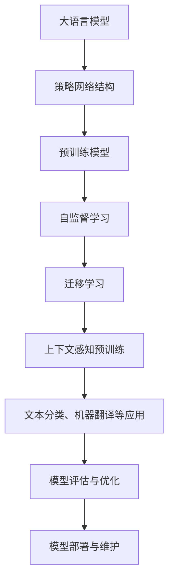

                 

# 大语言模型原理与工程实践：策略网络的结构

> 关键词：大语言模型，策略网络，预训练模型，神经网络，自然语言处理，工程实践

> 摘要：本文将详细探讨大语言模型的基本原理与工程实践，特别是策略网络的结构。我们将从大语言模型的发展历程、核心原理、大规模预训练模型等方面进行深入剖析，并通过实际应用场景、数据准备与处理、开发与部署等环节，展现大语言模型的实际运用。同时，本文还将探讨策略网络的高级特性、未来发展趋势，并提供相关工具与资源的附录。

## 《大语言模型原理与工程实践：策略网络的结构》目录大纲

### 第一部分: 大语言模型基础

#### 第1章: 大语言模型概述

##### 1.1 大语言模型的发展历程

##### 1.2 大语言模型的定义与分类

##### 1.3 大语言模型的关键特性

##### 1.4 大语言模型在自然语言处理中的应用

#### 第2章: 大语言模型的核心原理

##### 2.1 语言模型的基本概念

##### 2.2 词嵌入技术

##### 2.3 神经网络基础

##### 2.4 循环神经网络（RNN）

#### 第3章: 大规模预训练模型

##### 3.1 预训练模型概述

##### 3.2 自监督学习

##### 3.3 迁移学习

##### 3.4 上下文感知的预训练

#### 第4章: 策略网络结构

##### 4.1 策略网络的基本概念

##### 4.2 策略网络的设计原则

##### 4.3 策略网络的常见架构

##### 4.4 策略网络在实际应用中的优化与调整

### 第二部分: 大语言模型的工程实践

#### 第5章: 大语言模型的应用场景

##### 5.1 文本分类

##### 5.2 机器翻译

##### 5.3 问答系统

##### 5.4 自然语言生成

#### 第6章: 大语言模型的数据准备与处理

##### 6.1 数据采集与清洗

##### 6.2 数据预处理

##### 6.3 数据增强

##### 6.4 数据质量控制

#### 第7章: 大语言模型的开发与部署

##### 7.1 模型开发环境搭建

##### 7.2 模型训练

##### 7.3 模型评估与优化

##### 7.4 模型部署与维护

### 第三部分: 策略网络的深入探讨

#### 第8章: 策略网络的高级特性

##### 8.1 多模态策略网络

##### 8.2 强化学习在策略网络中的应用

##### 8.3 策略网络的并行化与分布式训练

##### 8.4 策略网络的可解释性

#### 第9章: 策略网络的未来发展趋势

##### 9.1 新型策略网络结构

##### 9.2 策略网络在新兴领域中的应用

##### 9.3 策略网络的伦理与社会影响

##### 9.4 策略网络的可持续性与可扩展性

### 附录

#### 附录 A: 大语言模型与策略网络常用工具与资源

##### A.1 深度学习框架

##### A.2 数据处理工具

##### A.3 模型评估工具

##### A.4 学习资源与参考文献

## 核心概念与联系流程图

### Mermaid 图



### 核心算法原理讲解

#### 2.2 词嵌入技术

```plaintext
# 词嵌入伪代码

# 输入：单词列表word_list，预训练的词向量模型word_vectors
# 输出：词嵌入结果word_embeddings

function word_embedding(word_list, word_vectors):
    for word in word_list:
        if word in word_vectors:
            word_embeddings[word] = word_vectors[word]
        else:
            word_embeddings[word] = generate_random_vector()
    return word_embeddings
```

#### 2.3 神经网络基础

```plaintext
# 神经网络训练伪代码

# 输入：神经网络模型neural_network，训练数据集training_data，损失函数loss_function
# 输出：训练后的神经网络模型

function train_neural_network(neural_network, training_data, loss_function):
    for epoch in range(num_epochs):
        for data in training_data:
            predict = neural_network(data.input)
            loss = loss_function(data.target, predict)
            neural_network.backward(loss)
            neural_network.update_weights()
    return neural_network
```

## 数学模型与公式

### 3.1 预训练模型的损失函数

$$ L = -\sum_{i=1}^{N} \sum_{j=1}^{V} y_j^{(i)} \log(p_j^{(i)}), $$

其中，$N$ 是训练样本的数量，$V$ 是词汇表的大小，$y_j^{(i)}$ 是第 $i$ 个样本中单词 $j$ 的目标分布，$p_j^{(i)}$ 是神经网络预测的概率分布。

## 项目实战

### 6.1 数据预处理实战

```python
# 数据预处理代码示例

import pandas as pd
from sklearn.model_selection import train_test_split

# 读取数据
data = pd.read_csv('data.csv')

# 数据清洗
data.dropna(inplace=True)
data = data[data['label'] != 'unknown']

# 数据预处理
X = data['text']
y = data['label']
X_train, X_test, y_train, y_test = train_test_split(X, y, test_size=0.2, random_state=42)

# 向量表示
word_embeddings = word_embedding(X_train.tolist(), pre_trained_word_vectors)

# 训练模型
model = train_neural_network(pre_trained_neural_network, word_embeddings, cross_entropy_loss)

# 模型评估
accuracy = model.evaluate(X_test, y_test)
print(f"Model accuracy: {accuracy}")
```

以上是《大语言模型原理与工程实践：策略网络的结构》的完整目录大纲，以及附加材料中的核心概念与联系流程图、核心算法原理讲解伪代码、数学模型与公式以及项目实战代码及解读。这些内容将帮助读者全面理解大语言模型和策略网络的原理与实践。接下来，我们将逐步深入这些主题，进行详细的探讨和讲解。

