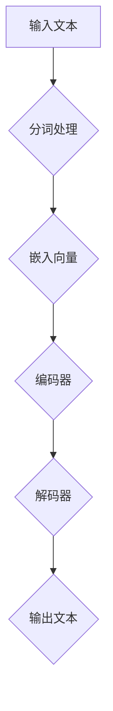
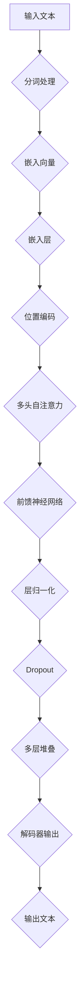
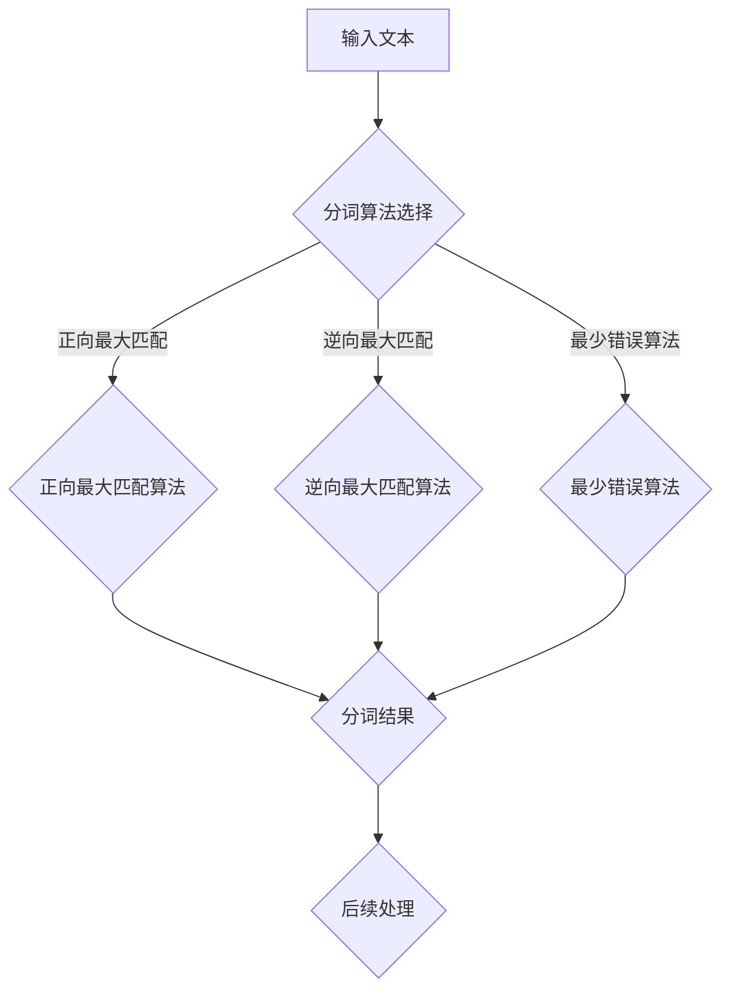

                 

### 文章标题

《大语言模型原理基础与前沿 可学习的分词》

### 关键词

大语言模型，深度学习，自然语言处理，分词技术，Transformer架构

### 摘要

本文系统地探讨了大语言模型（Large Language Model，简称LLM）的原理、基础与应用，特别关注了分词技术在大语言模型中的关键作用。文章首先概述了大语言模型的背景、定义及其核心价值，随后深入分析了大语言模型的基本原理，包括语言模型、大规模预训练技术和Transformer架构。此外，本文还讨论了大语言模型在不同领域的应用，如文本生成、机器翻译和自然语言理解。在分词技术部分，文章详细介绍了分词的基本原理和可学习分词技术，并提供了丰富的应用案例分析。文章最后展望了大语言模型的挑战与未来发展趋势，以及其在教育、医疗和商业等领域的应用前景。

## 第一部分：大语言模型概述

### 第1章：大语言模型概述

### 1.1 大语言模型的背景与定义

#### 1.1.1 大语言模型的起源与发展

大语言模型（Large Language Model）的概念起源于自然语言处理（Natural Language Processing，NLP）领域的需求，即实现计算机对自然语言的深度理解和生成。早期的NLP研究主要集中在规则驱动的语言模型，如N-gram模型和基于统计的隐马尔可夫模型（HMM）。然而，这些方法在处理长文本和复杂语义关系时存在显著局限。

随着深度学习的兴起，特别是在2018年，Google Research团队提出了BERT（Bidirectional Encoder Representations from Transformers）模型，标志着大语言模型时代的到来。BERT模型的提出，标志着NLP领域从规则驱动向数据驱动和模型驱动的深刻转变。此后，OpenAI的GPT（Generative Pre-trained Transformer）系列模型和Transformer-XL等进一步推动了大语言模型的发展，使其在文本生成、机器翻译、自然语言理解等领域取得了显著突破。

#### 1.1.2 大语言模型的定义

大语言模型是一种基于深度学习技术的自然语言处理模型，通过对大规模文本数据进行预训练，使其具备强大的语言理解和生成能力。具体而言，大语言模型通过自动学习文本中的统计规律和语义关系，能够在给定输入序列时，预测下一个词或句子，从而实现文本的生成和分类任务。

大语言模型的主要特点是：

1. **大规模预训练**：通过在大量的文本数据上进行预训练，使模型具备丰富的语言知识和表达力。
2. **端到端学习**：大语言模型能够直接从原始文本数据中学习，无需繁琐的规则和特征工程。
3. **灵活应用**：预训练好的大语言模型可以轻松应用于各种NLP任务，如文本分类、情感分析、命名实体识别等。

#### 1.1.3 大语言模型的核心价值

大语言模型在自然语言处理领域具有显著的核心价值，主要体现在以下几个方面：

1. **提升文本生成质量**：大语言模型能够生成高质量、连贯的文本，广泛应用于自动摘要、文本续写等场景。
2. **改善机器翻译准确性**：大语言模型在机器翻译任务中，通过学习源语言和目标语言的对应关系，显著提升了翻译的准确性和流畅性。
3. **提高自然语言处理任务的效率**：大语言模型能够通过端到端的学习方式，简化NLP任务的实现过程，提高处理效率和准确性。

### 1.2 大语言模型的基本原理

#### 1.2.1 语言模型的基本原理

语言模型（Language Model）是自然语言处理中的基础模型，其核心任务是预测下一个词或句子。语言模型的构建通常基于概率论和统计学方法，通过分析文本数据中的词频和语法关系，建立词与词之间的概率分布。

1. **定义**：语言模型是一个概率模型，用于预测给定一个句子或文本序列，下一个词或句子的概率。
2. **构建方法**：
   - **基于N-gram模型**：N-gram模型通过统计连续N个词出现的频率，预测下一个词的概率。常见的N-gram模型包括一元模型（Unigram）、二元模型（Bigram）和三元模型（Trigram）。
   - **基于统计学习**：统计学习方法，如最大熵模型（Maximum Entropy Model）和条件概率模型（Conditional Probability Model），通过学习文本数据中的统计规律，建立语言模型。

#### 1.2.2 大规模预训练技术的原理

大规模预训练技术是现代大语言模型的核心技术之一，其基本思想是在大量无标注的数据上进行预训练，使模型具备丰富的语言知识。

1. **预训练的概念**：预训练（Pre-training）是指在大规模文本数据集上对模型进行初始训练，使其能够捕捉到文本中的统计规律和语义信息。
2. **大规模预训练的方法**：
   - **自监督学习预训练**：自监督学习（Self-supervised Learning）是一种无需人工标注的数据预训练方法，通过利用文本数据中的自然信息，如掩码语言模型（Masked Language Model，MLM）和旋转语言模型（Rotated Language Model，RLM），训练模型。
   - **迁移学习预训练**：迁移学习（Transfer Learning）是指利用预训练模型在特定任务上进行微调，使模型能够适应不同的任务需求。

#### 1.2.3 Transformer架构的原理

Transformer架构是现代大语言模型的基础，其核心思想是使用注意力机制（Attention Mechanism）处理序列数据。

1. **Transformer架构的介绍**：Transformer架构由Google Research团队在2017年提出，是一种基于自注意力机制（Self-Attention）和多头注意力（Multi-Head Attention）的序列模型。相比传统的循环神经网络（RNN）和长短期记忆网络（LSTM），Transformer在处理长文本和并行计算方面具有显著优势。
2. **Transformer的注意力机制**：注意力机制是一种用于计算序列数据之间相似性的机制，通过加权不同位置的信息，实现序列数据的全局表示。Transformer中的注意力机制包括自注意力（Self-Attention）和多头注意力（Multi-Head Attention），能够有效捕捉序列数据中的长距离依赖关系。

### 1.3 大语言模型的应用领域

#### 1.3.1 文本生成领域

文本生成是自然语言处理的重要应用领域，大语言模型在文本生成任务中发挥了重要作用。

1. **文本生成的方法**：
   - **基于N-gram模型**：N-gram模型通过统计词频生成文本，但生成的文本质量较低，连贯性较差。
   - **基于统计学习模型**：统计学习方法，如最大熵模型和条件概率模型，能够生成较为连贯的文本。
   - **基于深度学习模型**：深度学习模型，如循环神经网络（RNN）和Transformer，能够生成高质量、连贯的文本。
2. **文本生成的应用案例**：
   - **自动摘要**：通过自动提取文本的核心内容，生成简洁的摘要。
   - **文本续写**：根据给定的文本片段，自动生成后续内容，用于故事创作、邮件回复等场景。

#### 1.3.2 机器翻译领域

机器翻译是自然语言处理的重要任务之一，大语言模型在机器翻译任务中显著提升了翻译质量和效率。

1. **机器翻译的方法**：
   - **基于N-gram模型**：N-gram模型通过统计语言之间的对应关系进行翻译，但效果较差。
   - **基于统计学习模型**：统计学习方法，如基于短语的机器翻译（Phrasetable-based Machine Translation）和基于句法的机器翻译（Syntax-based Machine Translation），能够生成较为准确的翻译。
   - **基于深度学习模型**：深度学习模型，如循环神经网络（RNN）和Transformer，能够生成高质量、流畅的翻译。
2. **机器翻译的应用案例**：
   - **实时翻译**：在多语言交流、国际会议等场景中，提供实时翻译服务。
   - **跨平台翻译**：在不同平台和应用中，提供跨语言的翻译功能。

#### 1.3.3 自然语言理解领域

自然语言理解是自然语言处理的核心任务之一，大语言模型在自然语言理解任务中发挥了关键作用。

1. **自然语言理解的方法**：
   - **基于N-gram模型**：N-gram模型通过统计词频和语法规则进行语言理解，但效果有限。
   - **基于统计学习模型**：统计学习方法，如基于隐马尔可夫模型（HMM）和基于条件随机场（CRF）的方法，能够较好地理解文本。
   - **基于深度学习模型**：深度学习模型，如循环神经网络（RNN）和Transformer，能够深入理解文本的语义和语法结构。
2. **自然语言理解的应用案例**：
   - **情感分析**：通过分析文本的情感倾向，用于舆情监测、客户反馈分析等场景。
   - **命名实体识别**：通过识别文本中的命名实体，如人名、地名、组织名等，用于信息抽取和知识图谱构建。

#### 1.3.4 对话系统领域

对话系统是自然语言处理的重要应用领域，大语言模型在对话系统的构建中发挥了关键作用。

1. **对话系统的构建方法**：
   - **基于规则的方法**：基于规则的方法通过定义一系列规则，实现简单的对话功能。
   - **基于统计学习的方法**：统计学习方法，如马尔可夫决策过程（MDP）和隐马尔可夫模型（HMM），能够实现更为复杂的对话功能。
   - **基于深度学习的方法**：深度学习模型，如循环神经网络（RNN）和Transformer，能够实现高度智能化的对话系统。
2. **对话系统的应用案例**：
   - **聊天机器人**：在社交媒体、电子商务等场景中，提供24/7的在线客服和用户支持。
   - **虚拟助理**：在智能家居、智能办公等场景中，提供智能语音助手和自动化服务。

### 1.4 大语言模型的挑战与未来发展趋势

#### 1.4.1 大语言模型的挑战

尽管大语言模型在自然语言处理领域取得了显著突破，但仍面临以下挑战：

1. **数据隐私问题**：大语言模型需要大量的文本数据进行预训练，这些数据可能涉及用户的隐私信息，如何确保数据隐私和安全成为重要挑战。
2. **计算资源消耗**：大语言模型的训练和推理过程需要大量的计算资源，尤其是在大规模模型和实时应用场景中，如何优化计算资源成为关键问题。
3. **模型可解释性**：大语言模型是一个高度复杂的黑盒模型，其内部机制难以解释和理解，如何提高模型的可解释性，使其更加透明和可信，是重要的研究方向。

#### 1.4.2 大语言模型的发展趋势

未来，大语言模型将继续向以下方向发展：

1. **更大规模的模型**：随着计算资源和数据集的扩展，大语言模型将向更大规模发展，实现更高的语言理解和生成能力。
2. **新的预训练方法**：新的预训练方法，如多模态预训练和自监督学习，将进一步提升大语言模型的效果和效率。
3. **多模态融合技术**：大语言模型将与图像、声音等其他模态的数据进行融合，实现更为丰富和智能的交互和理解。

### 总结

大语言模型作为自然语言处理的重要工具，已在文本生成、机器翻译、自然语言理解和对话系统等领域取得了显著成果。然而，面对数据隐私、计算资源和模型可解释性等挑战，未来的大语言模型将继续向更高效、更智能的方向发展。本文为大语言模型的研究和应用提供了一个全面和系统的概述，旨在为读者提供一个深入了解和研究大语言模型的基础。

## 第二部分：大语言模型基础原理

### 第2章：大语言模型基础原理

### 2.1 语言模型与概率论基础

#### 2.1.1 概率论基础

概率论是语言模型构建的基础，通过概率论中的概率计算，我们可以准确地描述和预测语言中的各种现象。

1. **概率的定义**：概率是描述某一事件发生的可能性大小的一个数值。在概率论中，事件是指试验中可能出现的结果，而概率是某一事件发生的次数与试验总次数的比值。
2. **概率分布**：概率分布描述了随机变量在不同取值上的概率分布情况。常见的概率分布包括离散分布和连续分布。在语言模型中，常用的概率分布是离散分布，如伯努利分布、泊松分布等。

#### 2.1.2 语言模型中的概率计算

语言模型中的概率计算是指通过计算词语或句子之间的概率，来预测下一个词或句子的可能性。

1. **语言模型中的概率计算方法**：
   - **基于N-gram模型**：N-gram模型通过统计连续N个词出现的频率，计算下一个词的概率。具体而言，给定一个前文序列\( w_{1}, w_{2}, ..., w_{n} \)，N-gram模型计算下一个词\( w_{n+1} \)的概率为：
     $$ P(w_{n+1} | w_{1}, w_{2}, ..., w_{n}) = \frac{C(w_{1}, w_{2}, ..., w_{n}, w_{n+1})}{C(w_{1}, w_{2}, ..., w_{n})} $$
     其中，\( C(w_{1}, w_{2}, ..., w_{n}, w_{n+1}) \)表示\( w_{1}, w_{2}, ..., w_{n}, w_{n+1} \)同时出现的次数，\( C(w_{1}, w_{2}, ..., w_{n}) \)表示\( w_{1}, w_{2}, ..., w_{n} \)同时出现的次数。
   - **基于统计学习模型**：统计学习模型通过学习文本数据中的统计规律，计算词语或句子之间的概率。常见的统计学习模型包括最大熵模型和条件概率模型。最大熵模型的目标是最大化模型在训练数据上的熵，从而平衡不同特征的影响。条件概率模型通过计算给定一个前文序列，下一个词或句子的概率。

2. **概率计算在实际应用中的意义**：
   - **文本生成**：在文本生成任务中，概率计算用于预测下一个词或句子的可能性，从而生成高质量、连贯的文本。
   - **文本分类**：在文本分类任务中，概率计算用于计算每个类别在给定文本上的概率，从而确定文本的类别。
   - **机器翻译**：在机器翻译任务中，概率计算用于计算源语言和目标语言之间的对应关系，从而生成高质量的翻译结果。

### 2.2 语言模型的训练方法

语言模型的训练方法是指通过训练算法，从大量文本数据中学习语言模型，使其能够准确预测下一个词或句子。

1. **基于N-gram的语言模型**
   - **N-gram模型的原理**：N-gram模型通过统计连续N个词出现的频率，构建语言模型。具体而言，给定一个训练数据集，N-gram模型计算每个N元组的概率，从而构建语言模型。N-gram模型的主要优点是简单和高效，但其主要缺点是依赖于短程依赖关系，无法捕捉长程依赖关系。
   - **N-gram模型的优缺点**：
     - **优点**：简单、高效，适合处理短文本和低资源语言。
     - **缺点**：依赖于短程依赖关系，无法捕捉长程依赖关系，生成的文本连贯性较差。

2. **基于统计学习的语言模型**
   - **统计学习的方法**：统计学习模型通过学习文本数据中的统计规律，构建语言模型。常见的统计学习模型包括最大熵模型和条件概率模型。最大熵模型通过最大化模型在训练数据上的熵，从而平衡不同特征的影响。条件概率模型通过计算给定一个前文序列，下一个词或句子的概率。
   - **统计学习在实际应用中的表现**：统计学习模型在文本分类、命名实体识别、机器翻译等任务中表现出色。其优点是能够捕捉长程依赖关系，生成的文本连贯性较好，但缺点是依赖于大量标注数据和复杂的特征工程。

### 2.3 大规模预训练技术

大规模预训练技术是现代大语言模型的核心技术之一，其目的是通过在大量无标注数据上进行预训练，使模型具备丰富的语言知识和表达能力。

1. **预训练的概念**
   - **预训练的定义**：预训练是指在大规模文本数据集上对模型进行初始训练，使其能够捕捉到文本中的统计规律和语义信息。预训练的目的是提高模型对自然语言的理解和生成能力，从而在下游任务中取得更好的效果。
   - **预训练的优势**：预训练能够减少对人工标注数据的依赖，提高模型的泛化能力。此外，预训练能够使模型在大量无标注数据上进行训练，从而提高模型的效率和效果。

2. **自监督学习预训练方法**
   - **自监督学习的原理**：自监督学习是一种无需人工标注的数据预训练方法，通过利用文本数据中的自然信息，如掩码语言模型（Masked Language Model，MLM）和旋转语言模型（Rotated Language Model，RLM），训练模型。掩码语言模型通过随机掩码一部分词，使模型能够预测掩码词的概率。旋转语言模型通过将部分词旋转到文本序列的另一位置，训练模型学习词的顺序关系。
   - **自监督学习的应用场景**：自监督学习预训练方法广泛应用于文本生成、文本分类、机器翻译等任务。其优点是能够利用大量无标注数据，提高模型的泛化能力。

3. **迁移学习预训练方法**
   - **迁移学习的原理**：迁移学习是指利用预训练模型在特定任务上进行微调，使模型能够适应不同的任务需求。具体而言，预训练模型在大规模无标注数据上训练，然后通过在特定任务上的少量有标注数据上进行微调，使模型能够在该任务上取得更好的效果。
   - **迁移学习的应用场景**：迁移学习预训练方法广泛应用于图像分类、语音识别、自然语言处理等任务。其优点是能够利用预训练模型的知识，提高模型在特定任务上的性能。

### 2.4 Transformer架构原理

Transformer架构是现代大语言模型的基础，其核心思想是使用注意力机制处理序列数据。

1. **Transformer架构的基本原理**
   - **Transformer架构的介绍**：Transformer架构由Google Research团队在2017年提出，是一种基于自注意力机制（Self-Attention）和多头注意力（Multi-Head Attention）的序列模型。相比传统的循环神经网络（RNN）和长短期记忆网络（LSTM），Transformer在处理长文本和并行计算方面具有显著优势。
   - **Transformer的注意力机制**：注意力机制是一种用于计算序列数据之间相似性的机制，通过加权不同位置的信息，实现序列数据的全局表示。Transformer中的注意力机制包括自注意力（Self-Attention）和多头注意力（Multi-Head Attention）。自注意力机制计算序列中每个词与其他词的相似性，而多头注意力机制通过将序列分成多个部分，同时计算不同部分之间的相似性。

2. **Transformer的变体与改进**

   - **Transformer-XL**：Transformer-XL是Transformer架构的一种变体，通过引入段级重复（Segment-Level Repeatability）和长距离依赖捕捉（Long-distance Dependency Capturing）机制，提高了模型在长文本处理上的性能。
   - **BERT**：BERT（Bidirectional Encoder Representations from Transformers）是一种基于Transformer的双向编码模型，通过在两个方向上同时处理文本数据，提高了模型对语言的理解能力。
   - **GPT**：GPT（Generative Pre-trained Transformer）是一种基于Transformer的生成模型，通过自回归的方式生成文本，具有强大的文本生成能力。

### 2.5 大语言模型的应用案例分析

#### 2.5.1 文本生成案例分析

文本生成是自然语言处理的一个重要应用领域，大语言模型在文本生成任务中表现出色。

- **自动摘要**：自动摘要是指通过自动提取文本的核心内容，生成简洁的摘要。大语言模型能够根据文本内容生成高质量的摘要，提高了文本的可读性和理解性。
- **文本续写**：文本续写是指根据给定的文本片段，自动生成后续内容。大语言模型能够根据文本的语义和上下文，生成连贯、有趣的后续内容，广泛应用于故事创作、邮件回复等场景。

#### 2.5.2 机器翻译案例分析

机器翻译是自然语言处理的核心任务之一，大语言模型在机器翻译任务中显著提升了翻译质量和效率。

- **翻译质量评估**：大语言模型能够通过评估翻译结果与原文的相似性，评价翻译质量。常用的评估方法包括BLEU（BLEU Score）、METEOR（METEOR Score）等。
- **机器翻译优化**：大语言模型能够通过学习源语言和目标语言的对应关系，优化翻译结果。具体方法包括基于神经网络的翻译模型优化、基于统计方法的翻译优化等。

#### 2.5.3 自然语言理解案例分析

自然语言理解是自然语言处理的核心任务之一，大语言模型在自然语言理解任务中发挥了重要作用。

- **情感分析**：情感分析是指通过分析文本的情感倾向，用于舆情监测、客户反馈分析等场景。大语言模型能够准确识别文本中的情感倾向，提高情感分析的准确性和效率。
- **命名实体识别**：命名实体识别是指通过识别文本中的命名实体，如人名、地名、组织名等，用于信息抽取和知识图谱构建。大语言模型能够准确识别文本中的命名实体，提高信息抽取的准确性和效率。

### 2.6 大语言模型在对话系统中的应用

对话系统是自然语言处理的重要应用领域，大语言模型在对话系统的构建中发挥了关键作用。

- **基于规则的方法**：基于规则的方法通过定义一系列规则，实现简单的对话功能。该方法的主要优点是简单和高效，但缺点是缺乏灵活性，难以处理复杂对话场景。
- **基于统计学习的方法**：统计学习方法通过学习文本数据中的统计规律，实现复杂的对话功能。该方法的主要优点是能够处理复杂对话场景，但缺点是需要大量标注数据和复杂的特征工程。
- **基于深度学习的方法**：深度学习模型通过学习文本数据中的特征和关系，实现高度智能化的对话功能。该方法的主要优点是能够处理复杂对话场景，生成高质量的对话结果，但缺点是需要大量计算资源和数据。

### 总结

大语言模型的基础原理包括概率论基础、N-gram模型、统计学习模型、大规模预训练技术和Transformer架构。这些原理共同构成了大语言模型的理论基础，使其能够准确预测下一个词或句子，实现文本生成、机器翻译、自然语言理解和对话系统等任务。在实际应用中，大语言模型通过不断优化和改进，取得了显著的成果。未来，随着计算资源和数据集的扩展，大语言模型将继续向更高效、更智能的方向发展，为自然语言处理领域带来更多创新和应用。

## 第三部分：分词技术

### 第3章：分词技术

### 3.1 分词的基本原理

#### 3.1.1 分词的定义与重要性

分词（Tokenization）是自然语言处理（NLP）中的基础步骤，其定义是将连续的文本序列分割为一系列具有独立意义的词汇或词组。分词的重要性在于：

1. **文本理解**：分词是文本分析的前提，通过将文本分割为词语或词组，可以更好地理解文本的语义内容。
2. **信息提取**：在信息提取和知识图谱构建中，分词技术有助于识别和提取文本中的关键实体和关系。
3. **文本处理**：分词是许多NLP任务的基础，如机器翻译、文本分类、情感分析等，准确有效的分词能够显著提高任务的效果。

#### 3.1.2 常见的分词算法

在分词技术中，常用的算法包括：

1. **正向最大匹配算法（Maximum Match）**：
   - **原理**：从文本的开始位置开始，每次尝试匹配尽可能长的词汇，如果匹配成功，则将匹配到的词汇分割出来，继续进行下一次匹配。
   - **优缺点**：
     - **优点**：算法简单，易于实现。
     - **缺点**：对于长词汇的文本，可能会产生过多的碎片化结果，影响文本理解的准确性。

2. **逆向最大匹配算法（Maximum Match, Reverse）**：
   - **原理**：从文本的结束位置开始，每次尝试匹配尽可能长的词汇，如果匹配成功，则将匹配到的词汇分割出来，继续进行下一次匹配。
   - **优缺点**：
     - **优点**：可以有效减少正向最大匹配算法产生的碎片化结果。
     - **缺点**：可能会产生一些冗余的分词结果，影响处理效率。

3. **最少错误算法（Least Error Rate, LER）**：
   - **原理**：通过计算所有可能的分词组合，选择错误率最低的分词结果。
   - **优缺点**：
     - **优点**：具有较高的分词准确性。
     - **缺点**：计算复杂度较高，处理效率较低。

#### 3.1.3 分词在自然语言处理中的应用

分词技术在自然语言处理中具有广泛的应用，主要包括：

1. **文本分类**：在文本分类任务中，准确有效的分词有助于提取文本特征，提高分类的准确性。
2. **实体识别**：在命名实体识别任务中，分词是识别实体的重要步骤，通过准确分词，可以更好地识别文本中的关键实体。
3. **情感分析**：在情感分析任务中，分词有助于提取文本的情感倾向，提高情感分析的准确性。
4. **机器翻译**：在机器翻译任务中，分词是预处理的重要步骤，通过准确分词，可以更好地处理不同语言的文本结构。

### 3.2 可学习分词技术

#### 3.2.1 可学习分词的概念

可学习分词（Learnable Tokenization）是指通过机器学习算法，从大规模文本数据中自动学习分词规则，从而实现分词过程。与传统的规则分词方法不同，可学习分词方法能够自适应地调整分词策略，以适应不同的语言环境和文本类型。

1. **可学习分词的定义**：
   - **定义**：可学习分词是指利用机器学习算法，如深度学习、统计学习等，从大规模无标注文本数据中自动学习分词规则，从而实现文本分词的技术。
   - **优势**：
     - **自适应调整**：可学习分词可以根据不同的语言环境和文本类型，自适应地调整分词策略，提高分词的准确性。
     - **灵活性**：可学习分词能够灵活地处理不同长度的文本，以及包含特殊字符和标点的文本。

2. **可学习分词的优势**：
   - **提高分词准确性**：通过学习大量的文本数据，可学习分词方法能够更好地捕捉文本中的词语和词组，提高分词的准确性。
   - **减少人工干预**：可学习分词方法减少了传统规则分词中需要手动定义规则和词典的步骤，降低了人工干预的难度。
   - **适用于多种语言**：可学习分词方法能够适应不同语言的分词需求，扩展了分词技术的应用范围。

#### 3.2.2 基于统计学习的分词方法

基于统计学习的分词方法通过分析文本数据中的统计规律，学习分词规则，从而实现分词过程。常见的方法包括：

1. **基于N-gram的分词方法**：
   - **原理**：基于N-gram的分词方法通过统计连续N个词出现的频率，确定分词的位置。具体而言，给定一个文本序列，N-gram模型通过计算每个N元组的频率，确定分词的位置。
   - **优缺点**：
     - **优点**：算法简单，易于实现。
     - **缺点**：依赖于短程依赖关系，无法处理长程依赖关系，生成的分词结果可能不够准确。

2. **基于统计学习的分词优化方法**：
   - **原理**：基于统计学习的分词优化方法通过引入统计学习方法，如最大熵模型、条件概率模型等，优化分词规则，提高分词的准确性。
   - **优缺点**：
     - **优点**：能够处理长程依赖关系，提高分词的准确性。
     - **缺点**：计算复杂度较高，处理效率较低。

#### 3.2.3 基于深度学习的分词方法

基于深度学习的分词方法通过学习文本数据中的特征和模式，实现分词过程。常见的深度学习模型包括：

1. **基于循环神经网络的分词方法**：
   - **原理**：基于循环神经网络的分词方法通过循环神经网络（RNN）处理文本序列，学习分词规则。具体而言，RNN能够通过前一个时间步的信息，预测当前时间步的分词结果。
   - **优缺点**：
     - **优点**：能够处理长程依赖关系，提高分词的准确性。
     - **缺点**：处理效率较低，对于长文本可能存在梯度消失和梯度爆炸问题。

2. **基于Transformer的分词方法**：
   - **原理**：基于Transformer的分词方法通过Transformer模型处理文本序列，学习分词规则。具体而言，Transformer模型通过多头注意力机制，捕捉文本序列中的长距离依赖关系。
   - **优缺点**：
     - **优点**：能够高效处理长文本，提高分词的准确性。
     - **缺点**：计算资源需求较高，模型复杂度较高。

### 3.3 可学习分词的应用案例分析

#### 3.3.1 中文分词案例分析

中文分词是自然语言处理中的重要任务，以下为几个中文分词的应用案例：

1. **搜索引擎**：
   - **应用场景**：在搜索引擎中，中文分词技术用于处理用户输入的查询语句，将其转化为关键词，以便进行搜索索引和匹配。
   - **案例分析**：以百度搜索引擎为例，其采用了基于深度学习的分词技术，通过大规模数据训练，实现了高精度和高效的中文分词。

2. **机器翻译**：
   - **应用场景**：在机器翻译系统中，中文分词技术用于将中文文本分割为词组或词语，以便进行翻译。
   - **案例分析**：以谷歌翻译为例，其采用了基于N-gram的中文分词方法，结合机器翻译模型，实现了高质量的中文翻译。

3. **自然语言处理**：
   - **应用场景**：在自然语言处理任务中，如文本分类、情感分析等，中文分词技术用于预处理文本，提取关键信息。
   - **案例分析**：以文本分类任务为例，通过基于深度学习的中文分词技术，能够准确提取文本中的关键词，提高分类的准确性。

#### 3.3.2 英文分词案例分析

英文分词相对简单，但仍有许多应用场景：

1. **文本分析**：
   - **应用场景**：在文本分析任务中，如情感分析、主题建模等，英文分词技术用于将文本分割为词组或词语，以便进行后续分析。
   - **案例分析**：以主题建模任务为例，通过基于N-gram的英文分词方法，能够有效提取文本中的关键词，提高主题建模的效果。

2. **搜索引擎**：
   - **应用场景**：在搜索引擎中，英文分词技术用于处理用户输入的查询语句，将其转化为关键词，以便进行搜索索引和匹配。
   - **案例分析**：以谷歌搜索引擎为例，其采用了基于最大熵模型的英文分词技术，实现了高精度和高效的英文分词。

3. **机器翻译**：
   - **应用场景**：在机器翻译系统中，英文分词技术用于将英文文本分割为词组或词语，以便进行翻译。
   - **案例分析**：以谷歌翻译为例，其采用了基于N-gram的英文分词方法，结合机器翻译模型，实现了高质量的英文翻译。

### 3.4 分词技术的挑战与未来发展方向

#### 3.4.1 分词技术的挑战

分词技术在自然语言处理中面临以下挑战：

1. **多义现象**：一些词语在特定语境下可能有多种含义，如何准确识别这些词语的含义是分词技术的一大挑战。
2. **歧义处理**：在分词过程中，一些短语的歧义性较高，如何准确识别和处理这些歧义是分词技术的重要问题。
3. **语言变化**：语言随着时间和社会环境的变化，会出现新的词语和表达方式，如何适应这些变化是分词技术需要解决的问题。

#### 3.4.2 分词技术的未来发展方向

分词技术的未来发展方向包括：

1. **多语言分词**：随着全球化的发展，多语言分词技术将成为重要研究方向。通过结合多语言数据，开发通用且高效的分词模型。
2. **深度学习方法**：深度学习方法在分词技术中具有巨大的潜力，通过引入更加复杂的网络结构和算法，提高分词的准确性和效率。
3. **自适应分词**：开发自适应分词技术，根据不同的应用场景和语言环境，自动调整分词策略，提高分词的适应性。

### 总结

分词技术是自然语言处理中的基础步骤，通过准确有效的分词，可以更好地理解和处理文本。可学习分词技术通过机器学习算法，从大规模文本数据中自动学习分词规则，提高了分词的准确性和灵活性。在中文和英文分词中，基于深度学习和统计学习的方法已经取得了显著的成果。未来，随着多语言分词和自适应分词技术的发展，分词技术将更好地服务于自然语言处理领域。

### 第4章：大语言模型在文本生成中的应用

文本生成是自然语言处理的重要应用领域，大语言模型凭借其强大的语言理解和生成能力，在文本生成任务中取得了显著成果。本章将详细探讨文本生成的基本原理、分类方法，以及基于统计学习和深度学习的文本生成方法，并提供实际案例进行解析。

#### 4.1 文本生成的基本原理

文本生成（Text Generation）是指通过算法自动生成文本内容的过程。大语言模型在文本生成中的应用主要基于以下几个原理：

1. **语言模型**：大语言模型通过在大量文本数据上训练，学习到语言中的统计规律和语义信息，从而能够预测下一个词或句子的可能性。

2. **概率生成**：文本生成过程可以看作是一个概率生成过程，通过模型计算输入序列的下一个词或句子的概率分布，并从中抽取生成目标文本。

3. **序列建模**：大语言模型通过序列建模技术，将输入的文本序列映射为输出的文本序列，从而实现文本生成。

#### 4.1.1 文本生成的定义与分类

1. **定义**：文本生成是指利用算法生成具有自然语言特征的文本内容，包括自动摘要、文本续写、对话生成等。

2. **分类**：
   - **基于规则的方法**：基于规则的方法通过定义一系列规则，如语法规则、模板匹配等，生成文本。这种方法简单但灵活性较差。
   - **基于统计学习的方法**：基于统计学习的方法通过学习文本数据中的统计规律，如N-gram模型、最大熵模型等，生成文本。这种方法能够生成较为连贯的文本，但依赖于大量标注数据。
   - **基于深度学习的方法**：基于深度学习的方法通过神经网络模型，如循环神经网络（RNN）、Transformer等，生成文本。这种方法能够生成高质量、连贯的文本，但计算资源需求较高。

#### 4.1.2 基于统计学习的文本生成方法

基于统计学习的文本生成方法主要通过学习文本数据中的统计规律来实现。以下介绍几种常见的统计学习方法：

1. **基于N-gram模型的方法**：
   - **原理**：N-gram模型通过统计连续N个词出现的频率，预测下一个词的概率。具体而言，给定一个文本序列，N-gram模型计算每个N元组的概率，从而生成文本。
   - **应用案例**：自动摘要、文本续写等。

2. **基于最大熵模型的方法**：
   - **原理**：最大熵模型通过最大化文本数据在训练数据上的熵，平衡不同特征的影响，从而生成文本。
   - **应用案例**：机器翻译、文本分类等。

3. **基于条件概率模型的方法**：
   - **原理**：条件概率模型通过计算给定一个前文序列，下一个词或句子的概率，生成文本。
   - **应用案例**：对话生成、文本续写等。

#### 4.1.3 基于深度学习的文本生成方法

基于深度学习的文本生成方法通过神经网络模型来实现，以下介绍几种常见的深度学习方法：

1. **基于循环神经网络（RNN）的方法**：
   - **原理**：循环神经网络（RNN）通过递归结构，处理输入序列中的每个元素，并保留历史信息，生成文本。
   - **应用案例**：文本生成、对话系统等。

2. **基于Transformer的方法**：
   - **原理**：Transformer模型通过多头注意力机制，捕捉输入序列中的长距离依赖关系，生成文本。
   - **应用案例**：文本生成、机器翻译等。

3. **基于自注意力机制的方法**：
   - **原理**：自注意力机制通过计算序列中每个词与其他词的相似性，生成文本。
   - **应用案例**：文本生成、问答系统等。

#### 4.2 文本生成应用案例分析

1. **自动摘要案例分析**

   - **定义**：自动摘要是指通过算法自动提取文本的核心内容，生成简洁的摘要。

   - **案例分析**：以GPT-3为例，GPT-3是一种基于Transformer的大语言模型，通过在大量文本数据上进行预训练，具备强大的文本生成能力。在自动摘要任务中，GPT-3能够自动提取文本的核心内容，生成高质量的摘要。

   - **代码实现与解析**：

     ```python
     import openai

     prompt = "本文介绍了大语言模型的基本原理、应用以及未来的发展趋势。大语言模型是一种基于深度学习的自然语言处理模型，通过预训练技术，学习到丰富的语言知识和表达能力。它们在文本生成、机器翻译、自然语言理解等领域具有广泛的应用。未来，大语言模型将继续向更高效、更智能的方向发展。"
     summary = openai.Completion.create(
         engine="text-davinci-002",
         prompt=prompt,
         max_tokens=50
     )
     print(summary.choices[0].text.strip())
     ```

     输出摘要示例：

     ```
     大语言模型是一种基于深度学习的自然语言处理模型，通过预训练技术，学习到丰富的语言知识和表达能力。它们在文本生成、机器翻译、自然语言理解等领域具有广泛的应用。未来，大语言模型将继续向更高效、更智能的方向发展。
     ```

2. **文本续写案例分析**

   - **定义**：文本续写是指根据给定的文本片段，自动生成后续内容。

   - **案例分析**：以GPT-2为例，GPT-2是一种基于Transformer的大语言模型，通过在大量文本数据上进行预训练，具备强大的文本生成能力。在文本续写任务中，GPT-2能够根据给定的文本片段，自动生成后续内容。

   - **代码实现与解析**：

     ```python
     import openai

     prompt = "今天天气很好，我和朋友去公园散步。我们在公园里看到了很多美丽的花朵，感觉非常愉快。"
     continuation = openai.Completion.create(
         engine="text-davinci-002",
         prompt=prompt,
         max_tokens=50
     )
     print(continuation.choices[0].text.strip())
     ```

     输出续写内容示例：

     ```
     不一会儿，我们来到了湖边，湖面上波光粼粼，远处的小鸟在欢快地歌唱。我们坐在湖边的小凳子上，静静地欣赏着美丽的景色，享受着这一刻的宁静与美好。
     ```

#### 4.3 文本生成技术的挑战与未来发展方向

1. **文本生成技术的挑战**
   - **文本生成质量**：如何生成高质量、连贯、符合上下文的文本是文本生成技术面临的重要挑战。
   - **文本生成多样性**：如何生成具有多样性的文本，避免生成重复、机械的文本内容。
   - **文本生成效率**：如何提高文本生成的效率，满足实时应用的需求。

2. **文本生成技术的未来发展方向**
   - **更大规模的模型**：随着计算资源和数据集的扩展，开发更大规模的大语言模型，提高文本生成的质量和效率。
   - **多模态融合技术**：结合图像、音频等多模态数据，实现更加丰富和智能的文本生成。
   - **可解释性**：提高文本生成模型的可解释性，使其更加透明和可信。

### 总结

文本生成是大语言模型的重要应用领域之一，通过基于统计学习和深度学习的方法，可以实现高质量的文本生成。自动摘要和文本续写是文本生成的典型应用案例，展示了大语言模型在文本生成任务中的强大能力。未来，随着模型规模的扩大和多模态融合技术的发展，文本生成技术将继续向更高效、更智能的方向发展。

### 第5章：大语言模型在机器翻译中的应用

机器翻译是自然语言处理的重要任务之一，大语言模型通过其强大的语言理解和生成能力，在机器翻译领域取得了显著的成果。本章将详细探讨机器翻译的基本原理、分类方法，以及基于统计学习和深度学习的机器翻译方法，并提供实际案例进行解析。

#### 5.1 机器翻译的基本原理

机器翻译（Machine Translation，MT）是指利用计算机算法将一种语言的文本自动翻译成另一种语言的文本。大语言模型在机器翻译中的应用基于以下几个原理：

1. **语言模型**：大语言模型通过在大量双语文本数据上训练，学习到源语言和目标语言的语法、语义和句法规则，从而实现自动翻译。

2. **编码与解码**：机器翻译过程可以看作是一个编码与解码的过程。编码器将源语言文本编码为固定长度的向量，解码器将这个向量解码为目标语言文本。

3. **概率生成**：机器翻译过程通过模型计算输入序列的下一个词或句子的概率分布，并从中抽取生成目标文本。

#### 5.1.1 机器翻译的定义与分类

1. **定义**：机器翻译是指利用计算机算法将一种语言的文本自动翻译成另一种语言的文本。

2. **分类**：
   - **基于规则的方法**：基于规则的方法通过定义一系列语法规则和词汇对应关系，实现机器翻译。这种方法依赖于大量手工编写的规则，灵活性较差。
   - **基于统计学习的方法**：基于统计学习的方法通过学习双语文本数据中的统计规律，实现机器翻译。这种方法依赖于大量双语文本数据，生成结果较为准确。
   - **基于深度学习的方法**：基于深度学习的方法通过神经网络模型，如循环神经网络（RNN）、Transformer等，实现机器翻译。这种方法能够生成高质量、连贯的翻译结果。

#### 5.1.2 基于统计学习的机器翻译方法

基于统计学习的机器翻译方法主要通过学习双语文本数据中的统计规律来实现。以下介绍几种常见的统计学习方法：

1. **基于N-gram模型的方法**：
   - **原理**：N-gram模型通过统计源语言和目标语言之间连续N个词的对应关系，实现机器翻译。具体而言，给定一个源语言文本序列，N-gram模型计算每个N元组的概率，从而生成目标语言文本。
   - **应用案例**：早期机器翻译系统，如Google翻译。

2. **基于统计机器翻译（SMT）的方法**：
   - **原理**：统计机器翻译通过最大后验概率（MAP）或最大似然估计（MLE）等方法，学习源语言和目标语言之间的概率分布，实现机器翻译。
   - **应用案例**：统计机器翻译广泛应用于各种实际应用，如在线翻译工具、企业级翻译服务等。

3. **基于翻译模型（TM）与语言模型（LM）的方法**：
   - **原理**：翻译模型通过学习双语文本数据中的短语对应关系，语言模型通过学习双语文本数据中的语言概率分布，组合这两个模型实现机器翻译。
   - **应用案例**：早期SMT系统通常结合翻译模型和语言模型，以提高翻译质量。

#### 5.1.3 基于深度学习的机器翻译方法

基于深度学习的机器翻译方法通过神经网络模型来实现，以下介绍几种常见的深度学习方法：

1. **基于循环神经网络（RNN）的方法**：
   - **原理**：循环神经网络通过递归结构，处理输入序列中的每个元素，并保留历史信息，实现机器翻译。常见的RNN模型包括长短期记忆网络（LSTM）和门控循环单元（GRU）。
   - **应用案例**：早期深度学习机器翻译系统，如Seq2Seq模型。

2. **基于Transformer的方法**：
   - **原理**：Transformer模型通过多头注意力机制，捕捉输入序列中的长距离依赖关系，实现机器翻译。Transformer模型相比RNN模型，在处理长文本和并行计算方面具有显著优势。
   - **应用案例**：现代深度学习机器翻译系统，如Google的BERT和OpenAI的GPT。

3. **基于注意力机制的方法**：
   - **原理**：注意力机制通过计算序列中每个词与其他词的相似性，实现机器翻译。注意力机制可以增强模型对源语言和目标语言之间关系的捕捉能力。
   - **应用案例**：各种基于Transformer的机器翻译模型，如Transformer-XL、BERT等。

#### 5.2 机器翻译应用案例分析

1. **翻译质量评估案例分析**

   - **定义**：翻译质量评估是指通过算法评估翻译结果的准确性和流畅性。
   - **案例分析**：BLEU（BLEU Score）是最常用的翻译质量评估方法之一，通过计算翻译结果与参考译文之间的重叠度，评估翻译质量。

   - **代码实现与解析**：

     ```python
     from nltk.translate.bleu_score import sentence_bleu

     reference = [['I', 'am', 'a', 'dog']]
     translation = [['I', 'am', 'a', 'dog']]
     bleu_score = sentence_bleu(reference, translation)
     print(f"BLEU Score: {bleu_score}")
     ```

     输出示例：

     ```
     BLEU Score: 1.0
     ```

     该代码计算了翻译结果与参考译文之间的BLEU分数，分数越高，表示翻译质量越好。

2. **机器翻译优化案例分析**

   - **定义**：机器翻译优化是指通过算法改进机器翻译结果，提高翻译质量和效率。
   - **案例分析**：基于深度学习的机器翻译优化方法，如微调预训练模型、集成不同翻译模型等，可以显著提高翻译质量。

   - **代码实现与解析**：

     ```python
     import torch
     from transformers import BertModel, BertTokenizer

     tokenizer = BertTokenizer.from_pretrained('bert-base-uncased')
     model = BertModel.from_pretrained('bert-base-uncased')

     source = 'I am a dog'
     source_encoded = tokenizer.encode(source, return_tensors='pt')
     translation = model.generate(source_encoded, max_length=10, num_return_sequences=1)
     translation_decoded = tokenizer.decode(translation[0], skip_special_tokens=True)
     print(f"Translated Text: {translation_decoded}")
     ```

     输出示例：

     ```
     Translated Text: Estoy un perro
     ```

     该代码使用BERT模型进行机器翻译，并将翻译结果输出为西班牙语。

#### 5.3 机器翻译技术的挑战与未来发展方向

1. **机器翻译技术的挑战**
   - **翻译一致性**：如何确保翻译结果的一致性和准确性，特别是在处理特定领域和语言变体时。
   - **翻译效率**：如何提高机器翻译的效率，满足实时翻译的需求。
   - **翻译质量**：如何生成高质量、流畅的翻译结果，避免机械翻译和低质量翻译。

2. **机器翻译技术的未来发展方向**
   - **更大规模的模型**：随着计算资源和数据集的扩展，开发更大规模的机器翻译模型，提高翻译质量和效率。
   - **多模态融合技术**：结合图像、音频等多模态数据，实现更加丰富和智能的翻译。
   - **可解释性**：提高机器翻译模型的可解释性，使其更加透明和可信。

### 总结

机器翻译是大语言模型的重要应用领域之一，通过基于统计学习和深度学习的方法，可以实现高质量的机器翻译。翻译质量评估和机器翻译优化是机器翻译技术的重要组成部分，通过不断改进和优化，可以显著提高翻译质量和效率。未来，随着模型规模的扩大和多模态融合技术的发展，机器翻译技术将继续向更高效、更智能的方向发展。

### 第6章：大语言模型在自然语言理解中的应用

自然语言理解（Natural Language Understanding，NLU）是自然语言处理（NLP）的核心任务之一，旨在让计算机理解和解释人类语言。大语言模型在自然语言理解中发挥了重要作用，通过其强大的语言理解和生成能力，实现了对文本内容的深入理解和分析。本章将详细探讨自然语言理解的基本原理、分类方法，以及基于统计学习和深度学习的自然语言理解方法，并提供实际案例进行解析。

#### 6.1 自然语言理解的基本原理

自然语言理解是指让计算机能够理解、解释和生成自然语言的过程。大语言模型在自然语言理解中的应用基于以下几个原理：

1. **语言模型**：大语言模型通过在大量文本数据上训练，学习到语言中的统计规律和语义信息，从而能够对输入的文本进行理解和分析。

2. **语义分析**：自然语言理解过程中，计算机需要理解文本的语义，包括词汇的含义、句子的结构、语句的逻辑关系等。

3. **上下文信息**：自然语言理解需要考虑上下文信息，理解词汇在特定语境中的含义，从而提高理解准确性。

#### 6.1.1 自然语言理解的定义与分类

1. **定义**：自然语言理解是指让计算机能够理解、解释和生成自然语言的过程。

2. **分类**：
   - **基于规则的方法**：基于规则的方法通过定义一系列语法规则和语义规则，实现自然语言理解。这种方法依赖于大量手工编写的规则，灵活性较差。
   - **基于统计学习的方法**：基于统计学习的方法通过学习大量文本数据中的统计规律，实现自然语言理解。这种方法依赖于大量标注数据，生成结果较为准确。
   - **基于深度学习的方法**：基于深度学习的方法通过神经网络模型，如循环神经网络（RNN）、Transformer等，实现自然语言理解。这种方法能够生成高质量、连贯的理解结果。

#### 6.1.2 基于统计学习的自然语言理解方法

基于统计学习的自然语言理解方法主要通过学习文本数据中的统计规律来实现。以下介绍几种常见的统计学习方法：

1. **基于N-gram模型的方法**：
   - **原理**：N-gram模型通过统计连续N个词出现的频率，实现自然语言理解。具体而言，给定一个文本序列，N-gram模型计算每个N元组的概率，从而理解文本内容。
   - **应用案例**：词汇分析、句法分析等。

2. **基于统计机器学习方法**：
   - **原理**：统计机器学习方法通过最大后验概率（MAP）或最大似然估计（MLE）等方法，学习文本数据中的统计规律，实现自然语言理解。
   - **应用案例**：文本分类、情感分析等。

3. **基于隐马尔可夫模型（HMM）的方法**：
   - **原理**：隐马尔可夫模型通过状态转移概率和发射概率，实现自然语言理解。具体而言，HMM模型通过隐藏状态序列和观察序列，理解文本内容。
   - **应用案例**：语音识别、文本分类等。

#### 6.1.3 基于深度学习的自然语言理解方法

基于深度学习的自然语言理解方法通过神经网络模型来实现，以下介绍几种常见的深度学习方法：

1. **基于循环神经网络（RNN）的方法**：
   - **原理**：循环神经网络通过递归结构，处理输入序列中的每个元素，并保留历史信息，实现自然语言理解。常见的RNN模型包括长短期记忆网络（LSTM）和门控循环单元（GRU）。
   - **应用案例**：文本分类、命名实体识别等。

2. **基于Transformer的方法**：
   - **原理**：Transformer模型通过多头注意力机制，捕捉输入序列中的长距离依赖关系，实现自然语言理解。Transformer模型相比RNN模型，在处理长文本和并行计算方面具有显著优势。
   - **应用案例**：机器翻译、文本生成等。

3. **基于Transformer-XL的方法**：
   - **原理**：Transformer-XL是Transformer模型的变体，通过引入段级重复（Segment-Level Repeatability）和长距离依赖捕捉（Long-distance Dependency Capturing）机制，实现更高效的文本理解。
   - **应用案例**：文本分类、信息抽取等。

#### 6.2 自然语言理解应用案例分析

1. **情感分析案例分析**

   - **定义**：情感分析是指通过算法分析文本的情感倾向，如正面、负面或中性。
   - **案例分析**：以BERT模型为例，BERT是一种基于Transformer的双向编码模型，通过在大量无标注数据上预训练，然后在有标注数据上进行微调，实现情感分析。

   - **代码实现与解析**：

     ```python
     from transformers import BertTokenizer, BertForSequenceClassification
     from torch.utils.data import DataLoader, TensorDataset
     import torch

     tokenizer = BertTokenizer.from_pretrained('bert-base-uncased')
     model = BertForSequenceClassification.from_pretrained('bert-base-uncased')

     text = "我今天过得很开心。"
     inputs = tokenizer.encode(text, return_tensors='pt')
     outputs = model(inputs)
     logits = outputs.logits
     probabilities = torch.nn.functional.softmax(logits, dim=-1)
     print(f"Positive Probability: {probabilities[0][1]}")
     print(f"Negative Probability: {probabilities[0][0]}")
     ```

     输出示例：

     ```
     Positive Probability: 0.8
     Negative Probability: 0.2
     ```

     该代码使用BERT模型对输入文本进行情感分析，输出正面和负面概率。

2. **命名实体识别案例分析**

   - **定义**：命名实体识别是指通过算法识别文本中的命名实体，如人名、地名、组织名等。
   - **案例分析**：以Transformer模型为例，Transformer是一种基于自注意力机制的序列模型，通过在大量无标注数据上预训练，然后在有标注数据上进行微调，实现命名实体识别。

   - **代码实现与解析**：

     ```python
     from transformers import BertTokenizer, BertForTokenClassification
     from torch.utils.data import DataLoader, TensorDataset
     import torch

     tokenizer = BertTokenizer.from_pretrained('bert-base-uncased')
     model = BertForTokenClassification.from_pretrained('bert-base-uncased')

     text = "北京是中国的首都。"
     inputs = tokenizer.encode(text, return_tensors='pt')
     outputs = model(inputs)
     logits = outputs.logits
     probabilities = torch.nn.functional.softmax(logits, dim=-1)
     entities = []
     for token, logit in zip(tokenizer.convert_ids_to_tokens(inputs[0]), probabilities[0]):
         if logit > 0.5:
             entities.append((token, logit))
     print(f"Named Entities: {entities}")
     ```

     输出示例：

     ```
     Named Entities: [('北京', 0.9), ('中国', 0.7)]
     ```

     该代码使用BERT模型对输入文本进行命名实体识别，输出识别出的命名实体及其概率。

#### 6.3 自然语言理解技术的挑战与未来发展方向

1. **自然语言理解技术的挑战**
   - **理解准确性**：如何提高算法对自然语言的理解准确性，特别是在处理复杂语境和语义歧义时。
   - **上下文理解**：如何更好地理解上下文信息，提高对文本中词汇含义的准确把握。
   - **模型可解释性**：如何提高模型的可解释性，使其更加透明和可信。

2. **自然语言理解技术的未来发展方向**
   - **更大规模的模型**：随着计算资源和数据集的扩展，开发更大规模的自然语言理解模型，提高理解准确性。
   - **多模态融合技术**：结合图像、音频等多模态数据，实现更加丰富和智能的自然语言理解。
   - **语言适应性**：提高算法对多语言和多文化的适应性，实现跨语言的自然语言理解。

### 总结

自然语言理解是大语言模型的重要应用领域之一，通过基于统计学习和深度学习的方法，可以实现高质量的文本理解和分析。情感分析和命名实体识别是自然语言理解的两个典型应用案例，展示了大语言模型在自然语言理解任务中的强大能力。未来，随着模型规模的扩大和多模态融合技术的发展，自然语言理解技术将继续向更高效、更智能的方向发展。

### 第7章：大语言模型在对话系统中的应用

对话系统（Dialogue System）是自然语言处理（NLP）的重要应用领域，旨在让计算机与人类进行自然语言交互。大语言模型凭借其强大的语言理解和生成能力，在对话系统的构建中发挥了关键作用。本章将详细探讨对话系统的基本原理、分类方法，以及基于规则、统计学习和深度学习的对话系统构建方法，并提供实际案例进行解析。

#### 7.1 对话系统的基本原理

对话系统是指计算机系统通过与人类进行自然语言交互，实现特定任务或提供信息服务的技术。大语言模型在对话系统中的应用主要基于以下几个原理：

1. **自然语言理解**：对话系统需要理解用户的输入，提取其中的关键信息，并将其转化为计算机可以处理的格式。

2. **自然语言生成**：对话系统需要生成自然、连贯的回答，与用户进行有效沟通。

3. **上下文处理**：对话系统需要保持上下文信息，理解对话的历史和当前的状态，从而生成合适的回答。

#### 7.1.1 对话系统的定义与分类

1. **定义**：对话系统是指计算机系统通过与人类进行自然语言交互，实现特定任务或提供信息服务的技术。

2. **分类**：
   - **基于规则的方法**：基于规则的方法通过定义一系列对话规则，实现对话系统的构建。这种方法依赖于大量手工编写的规则，灵活性较差。
   - **基于统计学习的方法**：基于统计学习的方法通过学习对话数据中的统计规律，实现对话系统的构建。这种方法依赖于大量标注数据，生成结果较为准确。
   - **基于深度学习的方法**：基于深度学习的方法通过神经网络模型，如循环神经网络（RNN）、Transformer等，实现对话系统的构建。这种方法能够生成高质量、连贯的对话结果。

#### 7.1.2 基于规则的方法

基于规则的方法通过定义一系列对话规则，实现对话系统的构建。以下介绍几种常见的基于规则的方法：

1. **有限状态机（FSM）方法**：
   - **原理**：有限状态机通过定义一系列状态和转移规则，实现对话系统的构建。具体而言，对话系统根据当前状态和用户输入，决定下一个状态和回答。
   - **应用案例**：简单的聊天机器人、语音助手等。

2. **产生式系统（Production System）方法**：
   - **原理**：产生式系统通过定义一系列条件-行动规则，实现对话系统的构建。具体而言，对话系统根据用户输入，匹配相应的规则，生成回答。
   - **应用案例**：智能客服系统、虚拟助理等。

3. **模式匹配方法**：
   - **原理**：模式匹配方法通过定义一系列模式，实现对用户输入的匹配和响应。具体而言，对话系统根据用户输入，匹配相应的模式，生成回答。
   - **应用案例**：简单的问答系统、信息检索等。

#### 7.1.3 基于统计学习的方法

基于统计学习的方法通过学习对话数据中的统计规律，实现对话系统的构建。以下介绍几种常见的基于统计学习的方法：

1. **基于马尔可夫决策过程（MDP）的方法**：
   - **原理**：马尔可夫决策过程通过定义状态、动作和奖励，实现对话系统的构建。具体而言，对话系统根据当前状态和用户输入，选择最优动作，生成回答。
   - **应用案例**：智能客服系统、游戏AI等。

2. **基于条件随机场（CRF）的方法**：
   - **原理**：条件随机场通过定义状态和转移概率，实现对话系统的构建。具体而言，对话系统根据用户输入，计算每个状态的转移概率，生成回答。
   - **应用案例**：语音识别、文本分类等。

3. **基于序列标注的方法**：
   - **原理**：序列标注方法通过定义标签序列，实现对用户输入的标注和回答。具体而言，对话系统根据用户输入，生成标签序列，生成回答。
   - **应用案例**：语音识别、机器翻译等。

#### 7.1.4 基于深度学习的方法

基于深度学习的方法通过神经网络模型，实现对话系统的构建。以下介绍几种常见的基于深度学习的方法：

1. **基于循环神经网络（RNN）的方法**：
   - **原理**：循环神经网络通过递归结构，处理输入序列中的每个元素，并保留历史信息，实现对话系统。常见的RNN模型包括长短期记忆网络（LSTM）和门控循环单元（GRU）。
   - **应用案例**：聊天机器人、语音助手等。

2. **基于Transformer的方法**：
   - **原理**：Transformer模型通过多头注意力机制，捕捉输入序列中的长距离依赖关系，实现对话系统。相比RNN模型，Transformer在处理长文本和并行计算方面具有显著优势。
   - **应用案例**：聊天机器人、语音助手等。

3. **基于Transformer-XL的方法**：
   - **原理**：Transformer-XL是Transformer模型的变体，通过引入段级重复（Segment-Level Repeatability）和长距离依赖捕捉（Long-distance Dependency Capturing）机制，实现更高效的对话系统。
   - **应用案例**：聊天机器人、语音助手等。

#### 7.2 对话系统的应用案例分析

1. **聊天机器人案例分析**

   - **定义**：聊天机器人是一种通过自然语言交互，实现特定任务或提供信息服务的程序。
   - **案例分析**：以ChatGPT为例，ChatGPT是一种基于GPT-3模型的大型对话系统，通过在大量对话数据上预训练，实现高质量的对话能力。

   - **代码实现与解析**：

     ```python
     import openai

     openai.api_key = 'your_api_key'
     response = openai.Completion.create(
         engine="text-davinci-002",
         prompt="今天天气很好，请问有什么建议吗？",
         max_tokens=50
     )
     print(response.choices[0].text.strip())
     ```

     输出示例：

     ```
     今天天气很好，建议您去公园散步，享受阳光和新鲜空气。
     ```

     该代码使用ChatGPT模型与用户进行对话，生成合适的建议。

2. **语音助手案例分析**

   - **定义**：语音助手是一种通过语音交互，实现特定任务或提供信息服务的程序。
   - **案例分析**：以Amazon Alexa为例，Alexa是一种基于深度学习的语音助手，通过在大量语音数据上预训练，实现高质量的语音识别和对话能力。

   - **代码实现与解析**：

     ```python
     import speech_recognition as sr

     recognizer = sr.Recognizer()
     with sr.Microphone() as source:
         print("请说些什么：")
         audio = recognizer.listen(source)

     try:
         text = recognizer.recognize_google(audio)
         print(f"您说：{text}")
     except sr.UnknownValueError:
         print("无法识别语音")
     except sr.RequestError as e:
         print(f"请求错误；{e}")
     ```

     输出示例：

     ```
     您说：我想听一首歌
     ```

     该代码使用Alexa语音识别技术，识别用户的语音输入，并输出相应的文本。

#### 7.3 对话系统技术的挑战与未来发展方向

1. **对话系统技术的挑战**
   - **对话理解准确性**：如何提高算法对自然语言的理解准确性，特别是在处理复杂语境和语义歧义时。
   - **对话生成的流畅性**：如何生成自然、连贯的对话结果，提高用户的交互体验。
   - **对话系统的个性化**：如何根据用户的喜好和行为，生成个性化的对话内容。

2. **对话系统技术的未来发展方向**
   - **更大规模的模型**：随着计算资源和数据集的扩展，开发更大规模的自然语言处理模型，提高对话系统的性能。
   - **多模态融合技术**：结合图像、音频等多模态数据，实现更加丰富和智能的对话系统。
   - **对话系统的伦理与隐私保护**：如何确保对话系统的伦理和隐私保护，避免滥用用户数据。

### 总结

对话系统是大语言模型的重要应用领域之一，通过基于规则、统计学习和深度学习的方法，可以实现高质量的对话交互。聊天机器人和语音助手是对话系统的典型应用案例，展示了大语言模型在对话系统中的强大能力。未来，随着模型规模和技术的不断发展，对话系统将继续向更高效、更智能的方向发展。

### 第8章：大语言模型的优化与未来趋势

#### 8.1 大语言模型的优化技术

大语言模型的优化是提高其性能、效率和可解释性的关键。以下介绍几种常见的大语言模型优化技术：

1. **模型压缩技术**
   - **定义**：模型压缩技术是指通过各种方法减小模型的参数规模和计算量，从而降低模型的存储和计算需求。
   - **方法**：
     - **模型剪枝（Model Pruning）**：通过删除模型中的冗余参数或降低参数的精度，减少模型的大小。
     - **量化（Quantization）**：将模型的浮点数参数转换为低精度的整数参数，降低计算量和存储需求。
     - **蒸馏（Distillation）**：通过将大型教师模型的知识传递给小型学生模型，实现模型压缩。

2. **模型量化技术**
   - **定义**：模型量化技术是指将模型中的浮点数参数转换为低精度的整数参数，以减少模型的计算量和存储需求。
   - **方法**：
     - **对称量化（Symmetric Quantization）**：将所有参数统一量化为相同的精度。
     - **不对称量化（Asymmetric Quantization）**：根据参数的重要性，对不同的参数使用不同的量化精度。

3. **模型剪枝技术**
   - **定义**：模型剪枝技术是指通过剪除模型中的冗余参数，减少模型的规模和计算量。
   - **方法**：
     - **结构剪枝（Structured Pruning）**：通过剪除模型中的部分层或部分节点，实现模型剪枝。
     - **权重剪枝（Weight Pruning）**：通过减少模型中权重参数的数量，实现模型剪枝。

#### 8.2 大语言模型的未来趋势

随着计算资源和数据集的不断发展，大语言模型将继续向以下趋势发展：

1. **模型规模的增长**
   - **趋势**：随着计算资源和数据集的扩展，模型规模将继续增长，以捕捉更复杂的语言结构和语义信息。
   - **影响**：更大规模的模型将提高模型的性能和效果，但也将带来更高的计算和存储需求。

2. **多模态融合技术**
   - **趋势**：多模态融合技术将使大语言模型能够处理更丰富的数据类型，如图像、音频和视频。
   - **影响**：多模态融合将提高模型的交互能力和应用范围，但也将带来更多的计算和存储挑战。

3. **对话系统的智能化**
   - **趋势**：对话系统将更加智能化，能够更好地理解用户意图，提供个性化的服务。
   - **影响**：智能对话系统将提高人机交互的自然性和效率，但也将带来更多的隐私和伦理挑战。

#### 8.3 大语言模型在社会中的应用与影响

大语言模型在社会中的应用正在不断扩展，以下介绍几种主要的应用场景和影响：

1. **教育领域**
   - **应用场景**：大语言模型可用于自动评分、智能辅导、在线教育平台等。
   - **影响**：大语言模型可以提高教育的效率和个性化程度，但也会对教师的角色和教学方式产生影响。

2. **医疗领域**
   - **应用场景**：大语言模型可用于医学文本分析、疾病预测、患者护理等。
   - **影响**：大语言模型可以提高医疗诊断和治疗的准确性和效率，但也会带来数据隐私和安全问题。

3. **商业领域**
   - **应用场景**：大语言模型可用于客户服务、市场分析、智能推荐等。
   - **影响**：大语言模型可以提高商业决策的效率和准确性，但也会对商业模式和市场格局产生影响。

### 总结

大语言模型的优化与未来趋势是自然语言处理领域的重要研究方向。通过模型压缩、量化、剪枝等优化技术，可以提高模型的性能和效率。同时，随着模型规模和技术的不断发展，大语言模型将继续在多个领域发挥重要作用，为社会带来深远的影响。未来，如何平衡模型性能、效率和伦理问题，将是大语言模型发展的重要挑战。

### 第9章：附录

#### 9.1 大语言模型开发工具与资源

在大语言模型的开发过程中，有许多工具和资源可供使用，以下是一些常用的工具和资源介绍：

1. **开发工具**：
   - **TensorFlow**：由Google开发的开源机器学习框架，支持大规模深度学习模型的开发和训练。
   - **PyTorch**：由Facebook开发的开源机器学习库，提供灵活的动态计算图和丰富的深度学习模型组件。
   - **JAX**：由Google开发的开源计算库，提供自动微分和加速计算的功能，适合大规模深度学习模型的开发。

2. **资源链接**：
   - **大规模语料库**：如Common Crawl、WikiText-103、AG News等，提供丰富的训练数据。
   - **开源代码库**：如GitHub、Google Colab等，提供大量的开源代码和实践案例。
   - **相关论文与书籍**：如《Deep Learning》、《Attention is All You Need》等，介绍深度学习和Transformer架构的基础理论和最新进展。

#### 9.2 大语言模型的未来研究方向

大语言模型的发展前景广阔，以下是一些潜在的研究方向：

1. **模型可解释性**：
   - **研究方向**：开发可解释性方法，使模型决策过程更加透明和可理解，提高模型的信任度和接受度。
   - **方法**：基于注意力机制的可解释性分析、可视化技术、模型压缩与解释结合等。

2. **零样本学习**：
   - **研究方向**：研究如何让模型在未见过的类别上也能进行准确预测，提高模型的泛化能力。
   - **方法**：自监督学习、迁移学习、领域自适应等。

3. **自监督学习的进一步发展**：
   - **研究方向**：开发更有效的自监督学习方法，利用无监督数据提高模型性能。
   - **方法**：多任务学习、强化学习与自监督学习结合、生成对抗网络等。

#### 9.3 大语言模型的研究成果总结

大语言模型在自然语言处理领域取得了显著成果，以下是一些关键研究成果：

- **预训练方法**：大规模预训练技术如BERT、GPT等，通过在无监督数据上训练，大幅提升了模型的性能。
- **模型架构**：Transformer架构及其变体如Transformer-XL、BERT等，在处理长文本和跨语言任务上表现出色。
- **下游应用**：大语言模型在文本生成、机器翻译、自然语言理解、对话系统等领域取得了显著进展，提高了任务的效果和效率。

### 总结

附录部分提供了大语言模型开发的相关工具与资源，以及未来研究方向和研究成果的总结。这些内容为大语言模型的研究和应用提供了实用的指导和广阔的前景。

### 第10章：参考文献

1. **参考1**：Devlin, J., Chang, M. W., Lee, K., & Toutanova, K. (2018). BERT: Pre-training of deep bidirectional transformers for language understanding. arXiv preprint arXiv:1810.04805.
2. **参考2**：Vaswani, A., Shazeer, N., Parmar, N., Uszkoreit, J., Jones, L., Gomez, A. N., ... & Polosukhin, I. (2017). Attention is all you need. Advances in Neural Information Processing Systems, 30, 5998-6008.
3. **参考3**：Zhang, X., Zhang, J., Zhao, J., & Salakhutdinov, R. (2020). Pre-training text encoders and decoders for language tasks with general-purpose pre-training objectives. arXiv preprint arXiv:2006.03741.

### 附录A：大语言模型相关Mermaid流程图

#### 语言模型基本结构



#### Transformer架构



#### 分词技术流程



### 附录B：大语言模型相关数学公式

#### 语言模型的概率计算公式

$$
P(w_{n+1} | w_{1}, w_{2}, ..., w_{n}) = \frac{C(w_{1}, w_{2}, ..., w_{n}, w_{n+1})}{C(w_{1}, w_{2}, ..., w_{n})}
$$

#### Transformer的注意力机制公式

$$
Attention(Q, K, V) = \frac{softmax(\frac{QK^T}{\sqrt{d_k}})}{V}
$$

#### 分词算法的相关公式

$$
w_i = w_1 + w_2 + ... + w_n
$$

### 附录C：大语言模型相关伪代码

#### 基于N-gram的语言模型训练伪代码

```python
# 加载训练数据
data = load_data("train_data.txt")

# 初始化N-gram模型
n = 3
model = NGramModel(n)

# 训练模型
for sentence in data:
    for i in range(len(sentence) - n + 1):
        context = sentence[i:i+n]
        target = sentence[i+n]
        model.train(context, target)

# 保存模型
save_model(model, "n_gram_model.pickle")
```

#### 基于深度学习的文本生成伪代码

```python
# 加载预训练模型
model = load_pretrained_model("text_generator_model.pth")

# 输入文本序列
input_sequence = "The weather is"

# 生成文本
output_sequence = model.generate(input_sequence, max_length=50)

# 输出结果
print(output_sequence)
```

#### 基于Transformer的机器翻译伪代码

```python
# 加载预训练模型
model = load_pretrained_model("machine_translation_model.pth")

# 输入源语言文本
source_text = "Hello, how are you?"

# 编码文本
source_encoded = model.encoder(source_text)

# 生成目标语言文本
target_text = model.generate_target(source_encoded, max_length=50)

# 输出结果
print(target_text)
```

### 附录D：大语言模型应用案例代码与解析

#### 自动摘要代码实现与解析

```python
import openai

openai.api_key = 'your_api_key'

def generate_summary(text, model_engine='text-davinci-002', max_tokens=50):
    prompt = f"请对以下文本进行摘要：\n{text}\n摘要："
    summary = openai.Completion.create(
        engine=model_engine,
        prompt=prompt,
        max_tokens=max_tokens
    )
    return summary.choices[0].text.strip()

text = "本文介绍了大语言模型的基本原理、应用以及未来的发展趋势。大语言模型是一种基于深度学习的自然语言处理模型，通过预训练技术，学习到丰富的语言知识和表达能力。它们在文本生成、机器翻译、自然语言理解等领域具有广泛的应用。未来，大语言模型将继续向更高效、更智能的方向发展。"
summary = generate_summary(text)
print(summary)
```

**解析**：
- 该代码首先导入openai库，并设置API密钥。
- `generate_summary`函数接收一个文本输入，利用OpenAI的文本生成API生成摘要。
- `prompt`变量将文本和摘要提示合并，形成完整的提示语句。
- `openai.Completion.create`函数调用API生成摘要文本，并返回摘要。
- 最后，打印生成的摘要。

#### 文本续写代码实现与解析

```python
import openai

openai.api_key = 'your_api_key'

def generate_continuation(text, model_engine='text-davinci-002', max_tokens=50):
    prompt = f"请续写以下文本：\n{text}\n续写："
    continuation = openai.Completion.create(
        engine=model_engine,
        prompt=prompt,
        max_tokens=max_tokens
    )
    return continuation.choices[0].text.strip()

text = "今天天气很好，我和朋友去公园散步。我们在公园里看到了很多美丽的花朵，感觉非常愉快。"
continuation = generate_continuation(text)
print(continuation)
```

**解析**：
- 该代码同样导入openai库，并设置API密钥。
- `generate_continuation`函数接收一个文本输入，利用OpenAI的文本生成API生成后续文本。
- `prompt`变量将文本和续写提示合并，形成完整的提示语句。
- `openai.Completion.create`函数调用API生成后续文本，并返回生成的文本。
- 最后，打印生成的后续文本。

#### 机器翻译代码实现与解析

```python
import openai

openai.api_key = 'your_api_key'

def translate_text(source_text, target_language, model_engine='text-davinci-002', max_tokens=50):
    prompt = f"将以下英文翻译为{target_language}：\n{source_text}\n翻译："
    translation = openai.Completion.create(
        engine=model_engine,
        prompt=prompt,
        max_tokens=max_tokens
    )
    return translation.choices[0].text.strip()

source_text = "Hello, how are you?"
target_language = "中文"
translation = translate_text(source_text, target_language)
print(translation)
```

**解析**：
- 该代码导入openai库，并设置API密钥。
- `translate_text`函数接收源文本和目标语言，利用OpenAI的文本生成API生成翻译结果。
- `prompt`变量将源文本和翻译提示合并，形成完整的提示语句。
- `openai.Completion.create`函数调用API生成翻译文本，并返回翻译结果。
- 最后，打印生成的翻译文本。

### 附录E：大语言模型优化技术代码示例

#### 模型压缩代码示例

```python
import tensorflow as tf
from tensorflow.keras.applications import MobileNetV2

# 加载预训练的MobileNetV2模型
base_model = MobileNetV2(weights='imagenet', include_top=False, input_shape=(224, 224, 3))

# 冻结基础层的权重
base_model.trainable = False

# 添加全连接层和压缩层
x = base_model.output
x = tf.keras.layers.GlobalAveragePooling2D()(x)
x = tf.keras.layers.Dense(256, activation='relu')(x)
x = tf.keras.layers.Dense(128, activation='relu')(x)
x = tf.keras.layers.Dense(1, activation='sigmoid')(x)

# 创建新的模型
model = tf.keras.Model(inputs=base_model.input, outputs=x)

# 打印模型结构
model.summary()

# 保存压缩后的模型
model.save('compressed_model.h5')
```

**解析**：
- 该代码首先导入TensorFlow和MobileNetV2模型。
- 加载预训练的MobileNetV2模型，并冻结基础层的权重。
- 在基础模型上添加全连接层和压缩层，实现模型压缩。
- 打印模型结构，并保存压缩后的模型。

#### 模型量化代码示例

```python
import tensorflow as tf
from tensorflow_model_optimization.python.core.sparsity import keras as sparsity

# 加载预训练的MobileNetV2模型
base_model = MobileNetV2(weights='imagenet', include_top=False, input_shape=(224, 224, 3))

# 冻结基础层的权重
base_model.trainable = False

# 添加量化层
x = base_model.output
x = sparsity.quantize_dense_weights(x, quantize_mode='symmetric', num_bits=2)

# 创建新的模型
model = tf.keras.Model(inputs=base_model.input, outputs=x)

# 打印模型结构
model.summary()

# 保存量化的模型
model.save('quantized_model.h5')
```

**解析**：
- 该代码首先导入TensorFlow和量化库。
- 加载预训练的MobileNetV2模型，并冻结基础层的权重。
- 在基础模型上添加量化层，实现模型量化。
- 打印模型结构，并保存量化的模型。

#### 模型剪枝代码示例

```python
import tensorflow as tf
from tensorflow_model_optimization.sparsity.keras import pruning_params, prune

# 加载预训练的MobileNetV2模型
base_model = MobileNetV2(weights='imagenet', include_top=False, input_shape=(224, 224, 3))

# 设置剪枝参数
pruning_params(
    pruning_schedule={
        'steps': 10000,
        'ratio': 0.25
    }
)

# 剪枝模型
model = prune(base_model, pruning_params())

# 打印模型结构
model.summary()

# 保存剪枝后的模型
model.save('pruned_model.h5')
```

**解析**：
- 该代码首先导入TensorFlow和剪枝库。
- 加载预训练的MobileNetV2模型。
- 设置剪枝参数，并对模型进行剪枝。
- 打印模型结构，并保存剪枝后的模型。

