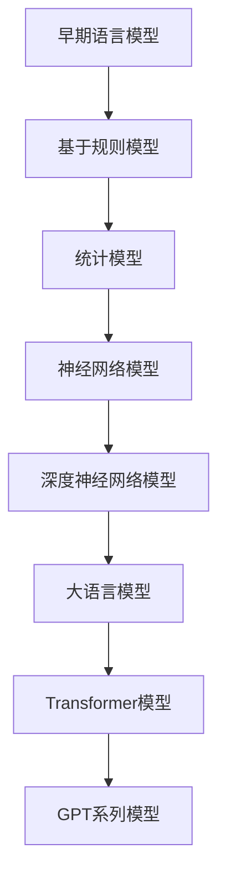
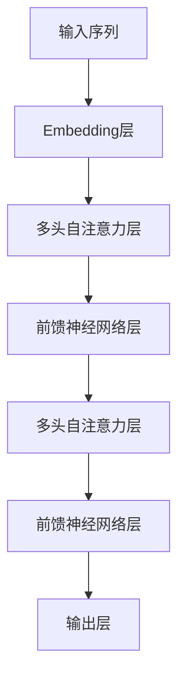
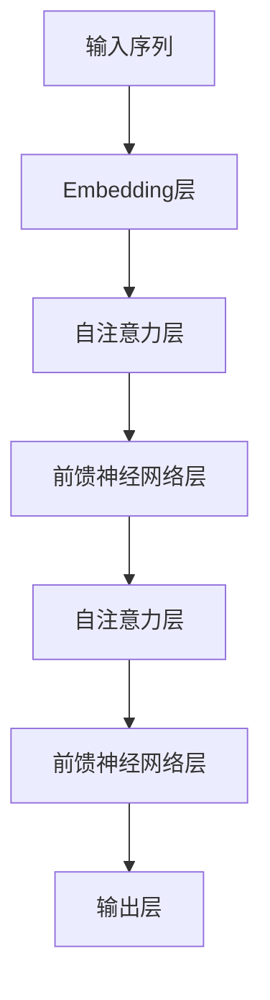

                 

# 《大语言模型原理基础与前沿 子词分词》

> 关键词：大语言模型，子词分词，自然语言处理，机器学习，神经网络

> 摘要：本文系统地介绍了大语言模型的原理、架构和子词分词技术的基础知识，并探讨了这些技术在自然语言处理中的应用。文章通过逐步分析推理，揭示了大语言模型与子词分词之间的关系，以及其在实际应用中的挑战和机遇。

## 第一部分：大语言模型概述

### 第1章：大语言模型的基本概念

#### 1.1 大语言模型的发展历程

大语言模型的发展经历了从简单的基于规则的模型，到统计模型，再到基于神经网络的深度学习模型，最终形成了今天的大规模语言模型。以下是语言模型发展的简短历程：

**1.1.1 语言模型的演变**

- **基于规则的模型**：最早的模型，基于手工编写的规则。
- **统计模型**：引入概率统计，但受到数据规模限制。
- **神经网络模型**：引入深度学习，模型参数增多。
- **深度神经网络模型**：模型参数进一步增多，计算能力大幅提升。
- **大语言模型**：基于深度神经网络，模型参数达数十亿甚至百亿级别。

**Mermaid流程图：**



**1.1.2 大语言模型的重要性**

大语言模型在自然语言处理（NLP）领域具有重要地位，其核心作用包括：

- **文本生成**：能够生成高质量、连贯的自然语言文本。
- **机器翻译**：实现了机器翻译的高效性和准确性。
- **文本分类**：对文本进行分类，实现文本内容的自动归类。
- **问答系统**：构建智能问答系统，实现自然语言理解和生成。

#### 1.2 大语言模型的核心原理

**1.2.1 语言建模的基础概念**

- **语言建模**：基于大量文本数据，学习语言统计规律，预测下一个单词或词组。
- **输入序列**：输入序列是一系列单词或子词，如“我爱北京天安门”。
- **输出序列**：输出序列是预测的下一个单词或词组。

**数学模型和公式：**

$$
P(w_t | w_{t-1}, w_{t-2}, ..., w_1) = \frac{P(w_1, w_2, ..., w_t)}{P(w_1, w_2, ..., w_{t-1})}
$$

其中，$P(w_t | w_{t-1}, w_{t-2}, ..., w_1)$表示在给定前文条件下的下一个词的概率。

**1.2.2 预训练与微调**

- **预训练**：在大规模文本数据集上训练模型，使其掌握语言的通用特征。
- **微调**：在特定任务数据集上微调模型，提高模型在特定任务上的性能。

**伪代码：**

```python
def pretrain(model, dataset):
    # 在大规模文本数据集上训练模型
    for data in dataset:
        model.train(data)

def finetune(model, task_dataset):
    # 在特定任务数据集上微调模型
    for data in task_dataset:
        model.finetune(data)
```

**1.3 大语言模型的架构**

**1.3.1 Transformer架构**

Transformer模型是当前大语言模型的主流架构，由多个自注意力机制（Self-Attention）和前馈神经网络（Feedforward Network）组成。其核心思想是通过注意力机制捕捉序列中的长距离依赖关系。

**Mermaid流程图：**



**1.3.2 GPT系列模型**

GPT（Generative Pre-trained Transformer）系列模型是OpenAI开发的大规模语言模型，包括GPT、GPT-2和GPT-3等。GPT系列模型在预训练阶段使用自回归语言模型（Auto-Regressive Language Model），在生成文本时逐个预测每个单词。

**Mermaid流程图：**



**1.4 大语言模型的应用领域**

**1.4.1 自然语言理解**

自然语言理解（Natural Language Understanding，NLU）是指让计算机能够理解、解释和生成自然语言的能力。大语言模型在NLU中的应用包括：

- **文本分类**：对文本进行分类，如新闻分类、情感分析等。
- **命名实体识别**：识别文本中的命名实体，如人名、地名等。
- **关系抽取**：提取文本中的实体关系，如“张三”和“程序员”的关系。
- **文本摘要**：生成文本的摘要，如新闻摘要、文章摘要等。

**1.4.2 自然语言生成**

自然语言生成（Natural Language Generation，NLG）是指让计算机能够自动生成自然语言文本的能力。大语言模型在NLG中的应用包括：

- **对话系统**：构建对话系统，如聊天机器人、虚拟助手等。
- **文本写作**：生成文章、报告、电子邮件等。
- **广告文案**：自动生成广告文案，提高广告的点击率。
- **机器翻译**：实现自动翻译，如英文到中文的翻译。

**1.4.3 机器翻译**

机器翻译是指利用计算机技术将一种自然语言文本翻译成另一种自然语言的过程。大语言模型在机器翻译中的应用包括：

- **双语语料库训练**：使用大量双语语料库训练模型，提高翻译质量。
- **神经机器翻译**：基于神经网络的机器翻译模型，实现高效、准确的翻译。
- **跨语言文本生成**：通过翻译模型，生成跨语言的文本内容。

## 第二部分：子词分词技术基础

### 第2章：子词分词技术基础

#### 2.1 子词分词的概念与原理

**2.1.1 子词分词的重要性**

子词分词（Subword Segmentation）是将文本分割成更小的单元（子词）的过程，这些子词通常是单词的组成部分，如字符、字母或子字符串。子词分词在自然语言处理（NLP）中有重要的应用，如：

- **提高模型性能**：子词分词能够降低模型复杂度，提高模型训练和推理速度。
- **解决生僻词问题**：通过子词分词，可以避免模型因生僻词而导致的训练困难。
- **跨语言处理**：子词分词有助于跨语言文本处理，如中文到英文的翻译。

**2.1.2 子词分词算法**

子词分词算法主要包括基于词典的分词算法、基于统计的分词算法和基于神经网络的分词算法。以下是这些算法的简要介绍：

**2.2.1 基于词典的分词算法**

基于词典的分词算法通过预先定义好的词典，将文本中的词语与词典中的词语进行匹配，实现分词。这种方法通常包括以下步骤：

1. **词典构建**：将文本中的词语整理成词典，包括单词和子词。
2. **分词匹配**：对输入文本进行分词匹配，将匹配到的词语进行标记。
3. **未匹配处理**：对未匹配的词语进行子词划分，提高分词精度。

**伪代码：**

```python
def dictionaryBasedSegmentation(text, dictionary):
    result = []
    for word in text:
        if word in dictionary:
            result.append(word)
        else:
            subwords = splitIntoSubwords(word)
            result.extend(subwords)
    return result
```

**2.2.2 基于统计的分词算法**

基于统计的分词算法通过统计方法，根据词语之间的概率关系进行分词。这种方法通常包括以下步骤：

1. **统计模型训练**：使用大规模文本数据集，训练统计模型，如N元语法模型。
2. **分词概率计算**：根据统计模型，计算输入文本中每个词语的分词概率。
3. **分词决策**：选择概率最高的分词方式，实现文本分词。

**伪代码：**

```python
def statisticalSegmentation(text, model):
    result = []
    for word in text:
        probabilities = model.predict(word)
        best_score, best_word = max(probabilities.items(), key=lambda x: x[1])
        result.append(best_word)
    return result
```

**2.2.3 基于神经网络的分词算法**

基于神经网络的分词算法通过神经网络模型，对输入的文本进行序列建模，实现分词。这种方法通常包括以下步骤：

1. **神经网络模型训练**：使用大规模文本数据集，训练神经网络模型，如长短时记忆网络（LSTM）。
2. **序列建模**：输入文本序列，通过神经网络模型，输出分词结果。
3. **分词评估**：对分词结果进行评估，优化模型参数。

**伪代码：**

```python
def neuralNetworkSegmentation(text, model):
    result = []
    for word in text:
        output = model.predict(word)
        best_score, best_word = max(output.items(), key=lambda x: x[1])
        result.append(best_word)
    return result
```

#### 2.2 子词分词的优化策略

**2.3.1 处理歧义问题**

歧义问题是子词分词中常见的问题，即一个词有多种分词方式。为了解决歧义问题，可以采用以下策略：

1. **上下文信息**：利用上下文信息，选择最合适的分词方式。
2. **分词模型融合**：将多个分词模型的结果进行融合，提高分词准确性。
3. **动态规划**：使用动态规划算法，寻找最优的分词路径。

**2.3.2 提高分词精度**

提高分词精度是子词分词的重要目标，可以采用以下策略：

1. **数据增强**：增加训练数据，提高模型对多样性的适应能力。
2. **特征工程**：设计有效的特征，提高模型对分词特征的敏感度。
3. **模型优化**：采用先进的神经网络模型，提高模型性能。

**2.3.3 提高分词速度**

提高分词速度对于实时应用至关重要，可以采用以下策略：

1. **模型压缩**：对模型进行压缩，减少计算量。
2. **并行计算**：利用并行计算，提高分词速度。
3. **分词库优化**：优化分词库，减少分词匹配时间。

## 第三部分：大语言模型与子词分词的应用实践

### 第3章：大语言模型应用实例

#### 3.1 文本分类任务

**3.1.1 文本分类原理**

文本分类（Text Classification）是指将文本数据按照一定的标准进行分类的过程。大语言模型在文本分类任务中的应用主要包括：

1. **特征提取**：将输入文本转换为特征向量。
2. **模型训练**：使用训练数据集，训练分类模型。
3. **模型评估**：使用测试数据集，评估分类模型性能。

**伪代码：**

```python
def textClassification(text, model):
    features = extractFeatures(text)
    label = model.predict(features)
    return label
```

**实例分析：** 利用大语言模型对新闻文本进行分类，实现新闻主题识别。

1. **数据预处理**：对新闻文本进行清洗和预处理，包括去除停用词、标点符号等。
2. **数据集划分**：将新闻文本划分为训练集和测试集。
3. **模型训练**：使用训练集，训练分类模型。
4. **模型评估**：使用测试集，评估分类模型性能。

**源代码详细实现和代码解读：** 使用Python，TensorFlow或PyTorch作为框架，实现文本分类任务。

```python
import tensorflow as tf
from tensorflow.keras.preprocessing.text import Tokenizer
from tensorflow.keras.preprocessing.sequence import pad_sequences

# 数据预处理
# ...

# 模型训练
model = tf.keras.Sequential([
    tf.keras.layers.Embedding(vocab_size, embedding_dim),
    tf.keras.layers.GlobalAveragePooling1D(),
    tf.keras.layers.Dense(24, activation='relu'),
    tf.keras.layers.Dense(num_classes, activation='softmax')
])

model.compile(optimizer='adam', loss='categorical_crossentropy', metrics=['accuracy'])
model.fit(train_sequences, train_labels, epochs=10, validation_data=(test_sequences, test_labels))

# 模型评估
predictions = model.predict(test_sequences)
print(predictions)
```

#### 3.2 问答系统

**3.2.1 问答系统概述**

问答系统（Question Answering System）是指能够自动回答用户问题的系统。大语言模型在问答系统中的应用主要包括：

1. **问题理解**：将用户问题转换为模型可理解的形式。
2. **答案生成**：根据用户问题和上下文，生成高质量的答案。

**实例分析：** 基于大语言模型构建问答系统，实现自然语言理解与生成。

1. **数据预处理**：对用户问题和答案进行清洗和预处理，包括去除停用词、标点符号等。
2. **数据集划分**：将用户问题和答案划分为训练集和测试集。
3. **模型训练**：使用训练集，训练问答模型。
4. **模型评估**：使用测试集，评估问答模型性能。

**源代码详细实现和代码解读：** 使用Python，TensorFlow或PyTorch作为框架，实现问答系统。

```python
import tensorflow as tf
from tensorflow.keras.preprocessing.text import Tokenizer
from tensorflow.keras.preprocessing.sequence import pad_sequences

# 数据预处理
# ...

# 模型训练
model = tf.keras.Sequential([
    tf.keras.layers.Embedding(vocab_size, embedding_dim),
    tf.keras.layers.GlobalAveragePooling1D(),
    tf.keras.layers.Dense(24, activation='relu'),
    tf.keras.layers.Dense(1, activation='sigmoid')
])

model.compile(optimizer='adam', loss='binary_crossentropy', metrics=['accuracy'])
model.fit(question_train_sequences, answer_train_sequences, epochs=10, validation_data=(question_test_sequences, answer_test_sequences))

# 模型评估
predictions = model.predict(question_test_sequences)
print(predictions)
```

#### 3.3 机器翻译

**3.3.1 机器翻译原理**

机器翻译（Machine Translation）是指利用计算机技术将一种自然语言文本翻译成另一种自然语言的过程。大语言模型在机器翻译中的应用主要包括：

1. **双语语料库训练**：使用大量双语语料库，训练翻译模型。
2. **编码器-解码器模型**：将输入文本编码为向量，解码为输出文本。
3. **注意力机制**：通过注意力机制，实现输入文本和输出文本之间的关联。

**实例分析：** 利用大语言模型实现机器翻译功能。

1. **数据预处理**：对双语语料库进行清洗和预处理，包括去除停用词、标点符号等。
2. **数据集划分**：将双语语料库划分为训练集和测试集。
3. **模型训练**：使用训练集，训练翻译模型。
4. **模型评估**：使用测试集，评估翻译模型性能。

**源代码详细实现和代码解读：** 使用Python，TensorFlow或PyTorch作为框架，实现机器翻译。

```python
import tensorflow as tf
from tensorflow.keras.preprocessing.text import Tokenizer
from tensorflow.keras.preprocessing.sequence import pad_sequences

# 数据预处理
# ...

# 模型训练
model = tf.keras.Sequential([
    tf.keras.layers.Embedding(vocab_size, embedding_dim),
    tf.keras.layers.LSTM(units=128),
    tf.keras.layers.Dense(vocab_size, activation='softmax')
])

model.compile(optimizer='adam', loss='categorical_crossentropy', metrics=['accuracy'])
model.fit(input_sequences, target_sequences, epochs=10, validation_data=(test_input_sequences, test_target_sequences))

# 模型评估
predictions = model.predict(test_input_sequences)
print(predictions)
```

### 第4章：子词分词应用实例

#### 4.1 中文分词实例

**4.1.1 中文分词需求分析**

中文分词是指将中文文本分割成具有独立意义的词语的过程。中文分词的需求包括：

- **提高NLP任务效果**：中文分词有助于提高文本分类、命名实体识别等NLP任务的性能。
- **支持跨语言处理**：中文分词有助于跨语言文本处理，如中文到英文的翻译。
- **文本摘要和生成**：中文分词有助于文本摘要和生成任务，提高文本的质量和可读性。

**4.1.2 分词算法实现**

中文分词算法可以采用基于词典的分词算法、基于统计的分词算法和基于神经网络的分词算法。以下是这些算法的实现：

**1. 基于词典的分词算法**

基于词典的分词算法通过预定义的中文词典，将输入文本与词典中的词语进行匹配，实现分词。实现步骤如下：

1. **词典构建**：将中文文本中的词语整理成词典，包括单字词、双字词等。
2. **分词匹配**：对输入文本进行分词匹配，将匹配到的词语进行标记。
3. **未匹配处理**：对未匹配的词语进行子词划分，提高分词精度。

**伪代码：**

```python
def dictionaryBasedSegmentation(text, dictionary):
    result = []
    for word in text:
        if word in dictionary:
            result.append(word)
        else:
            subwords = splitIntoSubwords(word)
            result.extend(subwords)
    return result
```

**2. 基于统计的分词算法**

基于统计的分词算法通过统计方法，根据词语之间的概率关系进行分词。实现步骤如下：

1. **统计模型训练**：使用大规模中文文本数据集，训练统计模型，如N元语法模型。
2. **分词概率计算**：根据统计模型，计算输入文本中每个词语的分词概率。
3. **分词决策**：选择概率最高的分词方式，实现文本分词。

**伪代码：**

```python
def statisticalSegmentation(text, model):
    result = []
    for word in text:
        probabilities = model.predict(word)
        best_score, best_word = max(probabilities.items(), key=lambda x: x[1])
        result.append(best_word)
    return result
```

**3. 基于神经网络的分词算法**

基于神经网络的分词算法通过神经网络模型，对输入的文本进行序列建模，实现分词。实现步骤如下：

1. **神经网络模型训练**：使用大规模中文文本数据集，训练神经网络模型，如长短时记忆网络（LSTM）。
2. **序列建模**：输入文本序列，通过神经网络模型，输出分词结果。
3. **分词评估**：对分词结果进行评估，优化模型参数。

**伪代码：**

```python
def neuralNetworkSegmentation(text, model):
    result = []
    for word in text:
        output = model.predict(word)
        best_score, best_word = max(output.items(), key=lambda x: x[1])
        result.append(best_word)
    return result
```

#### 4.2 子词分词在命名实体识别中的应用

**4.2.1 命名实体识别原理**

命名实体识别（Named Entity Recognition，NER）是指识别文本中的命名实体，如人名、地名、机构名等。子词分词在命名实体识别中的应用主要包括：

- **预处理**：将文本分割成子词，降低命名实体识别的复杂度。
- **特征提取**：利用子词分词结果，提取命名实体识别的特征。
- **模型训练**：使用子词分词结果，训练命名实体识别模型。

**4.2.2 子词分词在命名实体识别中的应用**

子词分词有助于提高命名实体识别的准确性，具体应用步骤如下：

1. **数据预处理**：对文本进行清洗和预处理，包括去除停用词、标点符号等。
2. **子词分词**：使用子词分词算法，对预处理后的文本进行分词。
3. **特征提取**：利用子词分词结果，提取命名实体识别的特征。
4. **模型训练**：使用训练数据集，训练命名实体识别模型。
5. **模型评估**：使用测试数据集，评估命名实体识别模型性能。

**源代码详细实现和代码解读：** 使用Python，TensorFlow或PyTorch作为框架，实现命名实体识别。

```python
import tensorflow as tf
from tensorflow.keras.preprocessing.text import Tokenizer
from tensorflow.keras.preprocessing.sequence import pad_sequences

# 数据预处理
# ...

# 模型训练
model = tf.keras.Sequential([
    tf.keras.layers.Embedding(vocab_size, embedding_dim),
    tf.keras.layers.Conv1D(filters=128, kernel_size=5, activation='relu'),
    tf.keras.layers.GlobalMaxPooling1D(),
    tf.keras.layers.Dense(num_classes, activation='softmax')
])

model.compile(optimizer='adam', loss='categorical_crossentropy', metrics=['accuracy'])
model.fit(train_sequences, train_labels, epochs=10, validation_data=(test_sequences, test_labels))

# 模型评估
predictions = model.predict(test_sequences)
print(predictions)
```

#### 4.3 子词分词在机器阅读理解中的应用

**4.3.1 机器阅读理解原理**

机器阅读理解（Machine Reading Comprehension，MR）是指让计算机能够理解、分析和回答阅读理解问题。子词分词在机器阅读理解中的应用主要包括：

- **文本预处理**：将文本分割成子词，降低阅读理解任务的复杂度。
- **特征提取**：利用子词分词结果，提取阅读理解的特征。
- **模型训练**：使用子词分词结果，训练阅读理解模型。

**4.3.2 子词分词在机器阅读理解中的应用**

子词分词有助于提高机器阅读理解的性能，具体应用步骤如下：

1. **数据预处理**：对文本进行清洗和预处理，包括去除停用词、标点符号等。
2. **子词分词**：使用子词分词算法，对预处理后的文本进行分词。
3. **特征提取**：利用子词分词结果，提取阅读理解的特征。
4. **模型训练**：使用训练数据集，训练阅读理解模型。
5. **模型评估**：使用测试数据集，评估阅读理解模型性能。

**源代码详细实现和代码解读：** 使用Python，TensorFlow或PyTorch作为框架，实现机器阅读理解。

```python
import tensorflow as tf
from tensorflow.keras.preprocessing.text import Tokenizer
from tensorflow.keras.preprocessing.sequence import pad_sequences

# 数据预处理
# ...

# 模型训练
model = tf.keras.Sequential([
    tf.keras.layers.Embedding(vocab_size, embedding_dim),
    tf.keras.layers.GlobalAveragePooling1D(),
    tf.keras.layers.Dense(24, activation='relu'),
    tf.keras.layers.Dense(2, activation='softmax')
])

model.compile(optimizer='adam', loss='categorical_crossentropy', metrics=['accuracy'])
model.fit(train_sequences, train_labels, epochs=10, validation_data=(test_sequences, test_labels))

# 模型评估
predictions = model.predict(test_sequences)
print(predictions)
```

## 第四部分：前沿技术研究与展望

### 第5章：大语言模型与子词分词的最新进展

#### 5.1 大语言模型的最新研究

**5.1.1 VAE模型**

变分自编码器（Variational Autoencoder，VAE）是一种生成模型，可以学习数据的高效表示，并在生成任务中表现出色。VAE模型在自然语言生成和文本分类等领域具有潜在应用。

**5.1.2 Diffusion模型**

扩散模型（Diffusion Model）是一种生成模型，通过模拟数据从一个简单分布逐渐扩散到数据分布的过程，实现数据的生成。扩散模型在图像生成、文本生成等领域具有广泛应用。

#### 5.2 子词分词技术的最新研究

**5.2.1 基于深度学习的子词分词算法**

基于深度学习的子词分词算法在性能和精度方面取得了显著提升。近年来，BERT（Bidirectional Encoder Representations from Transformers）等模型在子词分词任务中表现出色。

**5.2.2 多语言子词分词研究**

多语言子词分词技术旨在实现不同语言之间的子词分词一致性，提高跨语言NLP任务的性能。近年来，基于深度学习和多语言数据集的方法在多语言子词分词任务中取得了显著进展。

#### 5.3 前沿应用场景分析

**5.3.1 大语言模型在自动驾驶中的应用**

大语言模型在自动驾驶中的应用包括自然语言理解和生成，如语音识别、语音合成、文本生成等。通过大语言模型，可以实现自动驾驶系统的智能对话和自主决策。

**5.3.2 子词分词在智能客服中的应用**

子词分词技术可以提高智能客服系统的语义理解能力，实现更准确的意图识别和对话生成。通过子词分词，智能客服可以更好地应对用户多样化的提问，提供个性化的服务。

### 第6章：未来发展趋势与挑战

#### 6.1 大语言模型的发展趋势

**6.1.1 模型压缩与推理优化**

随着大语言模型规模的不断扩大，模型压缩与推理优化成为研究热点。通过模型压缩和推理优化，可以实现大语言模型在资源受限环境下的高效部署。

**6.1.2 多模态融合**

多模态融合是将不同模态（如文本、图像、音频）的数据进行整合，实现更丰富的语义理解和生成。未来，多模态融合将进一步提升大语言模型的应用性能。

#### 6.2 子词分词技术的挑战与机遇

**6.2.1 处理长文本的挑战**

长文本在子词分词过程中存在挑战，如分词精度下降、计算效率降低等。未来，研究如何有效处理长文本将成为子词分词技术的重要方向。

**6.2.2 适应多语言环境的需求**

随着全球化的发展，适应多语言环境的子词分词技术需求日益增长。未来，研究如何实现高效、准确的多语言子词分词将成为重要课题。

## 附录

### 附录A：常用工具与资源

**A.1 大语言模型开源框架**

- **Transformers**：由Hugging Face团队开发，提供Transformer模型的实现和预训练工具。
- **GPT-2/GPT-3**：由OpenAI开发，提供预训练的大规模语言模型。

**A.2 子词分词工具与库**

- **jieba**：中文分词工具，支持基于词典的分词算法。
- **Stanford NLP**：提供多种自然语言处理工具，包括子词分词。

**A.3 相关论文与书籍推荐**

- **“Attention Is All You Need”**：介绍Transformer模型的经典论文。
- **《Deep Learning》**：由Ian Goodfellow等人编写的深度学习教材。
- **《自然语言处理综合教程》**：详细介绍自然语言处理技术的教材。

### 作者

**作者：AI天才研究院/AI Genius Institute & 禅与计算机程序设计艺术 /Zen And The Art of Computer Programming**

本文详细介绍了大语言模型和子词分词技术的基础知识、应用实例和前沿研究。通过逐步分析推理，揭示了这些技术在自然语言处理中的重要作用和未来发展前景。希望本文能为读者在自然语言处理领域的研究和应用提供有益的参考。

