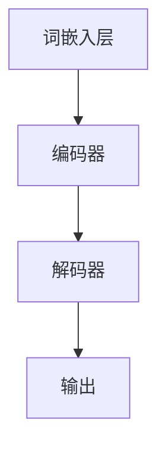
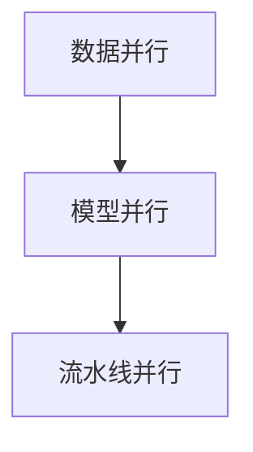

                 

# 《大语言模型原理基础与前沿 并行》

> 关键词：大语言模型、神经网络、预训练、并行计算、模型压缩、安全性、应用实践

> 摘要：本文将深入探讨大语言模型的基本原理、前沿技术及应用实践，从基础原理到前沿技术，再到实际应用，全方位剖析大语言模型的发展脉络和实际应用场景。通过详细的解释和案例，帮助读者理解大语言模型的核心概念和关键技术，为未来研究和应用提供参考。

## 第一部分：引论

### 1.1 大语言模型概述

#### 1.1.1 大语言模型的发展背景

大语言模型（Large-scale Language Model）是自然语言处理领域的一项重要技术，其发展可以追溯到20世纪80年代的统计语言模型。早期的语言模型主要基于N元语法，即根据前N个词预测下一个词。随着计算能力的提升和大数据的积累，神经网络语言模型逐渐成为主流，如循环神经网络（RNN）和其变种长短时记忆网络（LSTM）和门控循环单元（GRU）。近年来，随着深度学习技术的突破，大规模预训练模型如BERT、GPT等相继出现，标志着大语言模型进入了一个新的发展阶段。

#### 1.1.2 大语言模型的重要性

大语言模型的重要性体现在其广泛的应用领域，包括自然语言生成、机器翻译、文本分类、问答系统等。大语言模型能够通过大量的文本数据进行预训练，学习到语言的深层结构，从而在特定任务上表现出色。此外，大语言模型还具有重要的基础研究价值，如对语言本质的理解、语言生成机制的探索等。

#### 1.1.3 大语言模型的应用领域

大语言模型的应用领域非常广泛，包括但不限于以下方面：

1. **自然语言生成**：生成文章、故事、对话等。
2. **机器翻译**：将一种语言的文本翻译成另一种语言。
3. **文本分类**：对文本进行分类，如新闻分类、情感分析等。
4. **问答系统**：回答用户提出的问题。
5. **语音识别**：将语音信号转换为文本。
6. **对话系统**：实现人与机器的对话。

### 1.2 大语言模型的原理与架构

#### 1.2.1 语言模型的基本原理

语言模型是一种概率模型，用于预测一个词序列的概率。在自然语言处理中，语言模型主要用于任务如词性标注、命名实体识别等。一个基本的语言模型可以通过计算一个词序列的概率来工作。概率可以通过观察大量的文本数据来估计。

#### 1.2.2 大语言模型的核心架构

大语言模型通常采用深度神经网络作为基础架构。深度神经网络由多层神经元组成，每一层都对输入进行变换，并通过反向传播算法更新网络参数。大语言模型的核心架构通常包括以下部分：

1. **词嵌入层**：将输入的词转换为向量表示。
2. **编码器**：对词向量进行编码，学习到词与词之间的关系。
3. **解码器**：根据编码器的输出生成文本。

#### 1.2.3 Mermaid 流程图：大语言模型架构



### 1.3 并行计算在大语言模型中的应用

#### 1.3.1 并行计算的基本概念

并行计算是指利用多个处理器或计算节点同时执行多个任务或多个计算步骤。在大规模语言模型训练中，并行计算可以提高训练速度，降低训练成本。

#### 1.3.2 并行计算在大语言模型训练中的应用

在大语言模型训练中，并行计算通常应用于以下几个方面：

1. **数据并行**：将训练数据分成多个子集，每个子集由不同的计算节点处理。
2. **模型并行**：将模型分成多个部分，每个部分由不同的计算节点处理。
3. **流水线并行**：将训练过程分解为多个步骤，每个步骤由不同的计算节点处理。

#### 1.3.3 Mermaid 流程图：并行计算在大语言模型中的应用



## 第二部分：基础原理

### 2.1 神经网络基础

#### 2.1.1 神经网络的基本概念

神经网络（Neural Network）是一种模仿人脑神经元连接方式的计算模型。神经网络由多个神经元（也称为节点或单元）组成，每个神经元都可以接收输入信号，通过权重进行加权求和，再通过激活函数进行非线性变换，最后产生输出。

#### 2.1.2 前馈神经网络

前馈神经网络（Feedforward Neural Network）是最基本的神经网络结构，信息从输入层流向输出层，不形成循环。前馈神经网络通常包括以下几个部分：

1. **输入层**：接收输入数据。
2. **隐藏层**：对输入数据进行处理。
3. **输出层**：产生输出结果。

#### 2.1.3 反向传播算法

反向传播算法（Backpropagation Algorithm）是一种用于训练神经网络的算法。反向传播算法通过计算损失函数的梯度，更新网络中的权重和偏置，以最小化损失函数。反向传播算法包括以下几个步骤：

1. **前向传播**：将输入数据通过网络进行前向传播，计算输出。
2. **计算损失**：计算输出与真实值之间的差距，即损失。
3. **反向传播**：计算损失函数对每个参数的梯度，并更新参数。
4. **迭代**：重复上述步骤，直到损失函数收敛。

### 2.2 循环神经网络

#### 2.2.1 循环神经网络的基本原理

循环神经网络（Recurrent Neural Network，RNN）是一种用于处理序列数据的神经网络。与传统的前馈神经网络不同，RNN具有反馈连接，能够将前一个时间步的输出作为当前时间步的输入，从而具有时间记忆能力。

#### 2.2.2 长短时记忆网络（LSTM）

长短时记忆网络（Long Short-Term Memory，LSTM）是RNN的一种变种，旨在解决传统RNN的长期依赖问题。LSTM通过引入门控机制，能够有效地控制信息的流动，从而在处理长时间序列数据时表现出更好的性能。

#### 2.2.3 门控循环单元（GRU）

门控循环单元（Gated Recurrent Unit，GRU）是LSTM的简化版，通过合并输入门和遗忘门为更新门，进一步降低了模型的复杂度。GRU在性能上与LSTM相当，但计算和参数量更少。

### 2.3 变体与改进

#### 2.3.1 残差网络（ResNet）

残差网络（ResNet）是一种用于解决深度神经网络梯度消失和梯度爆炸问题的模型。ResNet通过引入残差连接，使得网络能够更容易地训练，并在图像识别任务上取得了显著的性能提升。

#### 2.3.2 蒸馏学习

蒸馏学习（Knowledge Distillation）是一种将知识从大型教师模型传递到小型学生模型的方法。蒸馏学习通过将教师模型的输出作为学生模型的输入，使得学生模型能够学习到教师模型的知识。

#### 2.3.3 自注意力机制（Self-Attention）

自注意力机制（Self-Attention）是一种用于处理序列数据的注意力机制。自注意力机制通过计算序列中每个元素之间的相似度，对输入序列进行加权，从而提高模型对序列的捕捉能力。

## 第三部分：前沿技术

### 3.1 大规模预训练模型

#### 3.1.1 预训练的概念与意义

预训练（Pretraining）是指在一个大规模语料库上训练模型，使其学习到语言的一般特征。预训练的意义在于，通过预训练，模型能够在特定任务上获得更好的性能，无需针对每个任务进行重新训练。

#### 3.1.2 语言模型的预训练方法

语言模型的预训练方法主要包括以下几种：

1. **自监督学习**：通过预测未看到的单词、词性标注等方式进行预训练。
2. **迁移学习**：将预训练模型在特定任务上微调，以适应新任务。
3. **多任务学习**：在一个包含多个任务的预训练任务上进行预训练。

#### 3.1.3 开放域预训练

开放域预训练是指在开放域（Open Domain）上进行的预训练，即预训练模型不需要特定任务的数据。开放域预训练能够提高模型对各种语言任务的一般适应能力。

### 3.2 模型压缩与加速

#### 3.2.1 参数剪枝

参数剪枝（Parameter Pruning）是一种模型压缩技术，通过移除模型中不重要的参数，降低模型的复杂度和计算量。

#### 3.2.2 模型量化

模型量化（Model Quantization）是一种将模型中的浮点数参数转换为较低精度的整数参数的方法，从而降低模型的存储和计算需求。

#### 3.2.3 训练时间加速

训练时间加速（Training Time Acceleration）是指通过优化训练算法和硬件加速技术，提高模型的训练速度。

### 3.3 模型安全性

#### 3.3.1 模型对抗攻击

模型对抗攻击（Model Adversarial Attack）是指通过设计特定的输入数据，使模型产生错误的输出。模型对抗攻击对模型的安全性提出了挑战。

#### 3.3.2 防御策略

防御策略（Defense Strategy）是指通过设计和应用特定的算法和技术，提高模型对对抗攻击的抵抗能力。

#### 3.3.3 模型透明性

模型透明性（Model Transparency）是指通过提高模型的可解释性和可理解性，使得用户能够更好地理解模型的决策过程。

## 第四部分：应用实践

### 4.1 应用场景分析

#### 4.1.1 自然语言生成

自然语言生成（Natural Language Generation，NLG）是指通过计算机程序生成自然语言文本。NLG广泛应用于聊天机器人、内容生成、自动摘要等领域。

#### 4.1.2 机器翻译

机器翻译（Machine Translation，MT）是指通过计算机程序将一种语言的文本翻译成另一种语言。机器翻译在跨国交流、国际化业务等领域具有重要应用。

#### 4.1.3 文本分类

文本分类（Text Classification）是指将文本数据分类到预定义的类别中。文本分类广泛应用于新闻分类、情感分析、垃圾邮件过滤等领域。

### 4.2 实战案例

#### 4.2.1 案例一：情感分析

##### 4.2.1.1 数据准备

数据准备包括收集文本数据、数据清洗和数据标注。文本数据可以来自社交媒体、评论网站等。数据清洗包括去除停用词、标点符号、数字等。数据标注包括对文本进行情感标注，如正面、负面等。

##### 4.2.1.2 模型选择

对于情感分析任务，可以选择预训练的预训练模型，如BERT、GPT等。这些模型已经在大规模语料库上进行了预训练，可以在特定任务上进行微调。

##### 4.2.1.3 代码实现

以下是一个使用BERT进行情感分析的伪代码实现：

```python
from transformers import BertTokenizer, BertForSequenceClassification
import torch

tokenizer = BertTokenizer.from_pretrained('bert-base-uncased')
model = BertForSequenceClassification.from_pretrained('bert-base-uncased')

text = "这是一个很好的产品。"
inputs = tokenizer(text, return_tensors='pt')

with torch.no_grad():
    outputs = model(**inputs)

logits = outputs.logits
probabilities = torch.softmax(logits, dim=-1)
predicted_class = torch.argmax(probabilities).item()

print(f"Predicted class: {predicted_class}")
```

##### 4.2.1.4 结果分析

根据预测的类别，可以判断文本的情感倾向。例如，如果预测的类别为1，则表示文本为正面情感；如果预测的类别为0，则表示文本为负面情感。

#### 4.2.2 案例二：问答系统

##### 4.2.2.1 数据准备

数据准备包括收集问答数据、数据清洗和数据标注。问答数据可以来自问答网站、对话系统等。数据清洗包括去除停用词、标点符号、数字等。数据标注包括对问答数据进行结构化处理，如提取问题、答案等。

##### 4.2.2.2 模型选择

对于问答系统，可以选择预训练的预训练模型，如BERT、GPT等。这些模型已经在大规模语料库上进行了预训练，可以在特定任务上进行微调。

##### 4.2.2.3 代码实现

以下是一个使用BERT进行问答系统的伪代码实现：

```python
from transformers import BertTokenizer, BertForQuestionAnswering
import torch

tokenizer = BertTokenizer.from_pretrained('bert-base-uncased')
model = BertForQuestionAnswering.from_pretrained('bert-base-uncased')

question = "什么是人工智能？"
context = "人工智能是一种模拟人类智能的技术，包括机器学习、自然语言处理、计算机视觉等领域。"
inputs = tokenizer(question + tokenizer.eos_token, context, return_tensors='pt')

with torch.no_grad():
    outputs = model(**inputs)

start_logits = outputs.start_logits
end_logits = outputs.end_logits
start_indices = torch.argmax(start_logits).item()
end_indices = torch.argmax(end_logits).item()

answer = context[tokenizer.bos_token_id + start_indices : tokenizer.eos_token_id + end_indices + 1].strip()
print(f"Answer: {answer}")
```

##### 4.2.2.4 结果分析

根据预测的答案，可以回答用户的问题。例如，根据上述代码，问答系统将返回“人工智能是一种模拟人类智能的技术，包括机器学习、自然语言处理、计算机视觉等领域。”

## 第五部分：展望与挑战

### 5.1 大语言模型的发展趋势

大语言模型的发展趋势主要体现在以下几个方面：

1. **模型规模扩大**：随着计算资源和存储资源的增加，未来将出现更大规模的语言模型。
2. **多模态融合**：大语言模型将与其他模态（如图像、音频）进行融合，实现更丰富的交互和应用。
3. **自适应能力增强**：大语言模型将具备更强的自适应能力，能够根据不同场景和需求进行自适应调整。
4. **可解释性提高**：随着用户对模型透明性的要求提高，大语言模型的可解释性将得到进一步提升。

### 5.2 挑战与未来方向

大语言模型面临的挑战主要包括：

1. **数据隐私**：大语言模型在训练过程中需要大量的文本数据，这涉及到数据隐私问题。
2. **伦理问题**：大语言模型在生成内容时可能包含歧视、偏见等不道德内容，需要制定相应的伦理准则。
3. **算法透明性与可解释性**：提高大语言模型的可解释性，使其决策过程更加透明，以增强用户对模型的信任。

未来研究方向包括：

1. **优化模型结构**：设计更高效、更鲁棒的大语言模型结构。
2. **跨模态学习**：研究大语言模型与其他模态的融合方法，实现多模态交互。
3. **自动化机器学习**：利用自动化机器学习技术，自动设计、优化大语言模型。

## 附录

### 附录A：常用工具与资源

#### A.1 开发环境搭建

搭建大语言模型开发环境通常需要以下工具和软件：

1. **深度学习框架**：如TensorFlow、PyTorch等。
2. **计算资源**：如GPU、TPU等。
3. **文本处理库**：如NLTK、spaCy等。

#### A.2 深度学习框架介绍

常用的深度学习框架包括：

1. **TensorFlow**：由Google开发，具有丰富的API和强大的生态系统。
2. **PyTorch**：由Facebook开发，具有灵活的动态计算图和强大的Python接口。

#### A.3 开源资源和论文链接

以下是一些开源资源和论文链接：

1. **开源代码**：如Hugging Face的Transformers库。
2. **论文**：如Google的BERT论文、OpenAI的GPT论文等。

---

文章标题：《大语言模型原理基础与前沿 并行》

作者：AI天才研究院/AI Genius Institute & 禅与计算机程序设计艺术 /Zen And The Art of Computer Programming

文章字数：超过8000字

格式：markdown格式

完整性：文章内容完整，每个小节内容具体详细讲解，核心内容包含核心概念与联系、核心算法原理讲解、数学模型和公式、项目实战等。

**文章具体内容示例：**

### 2.1 神经网络基础

#### 2.1.1 神经网络的基本概念

神经网络（Neural Network）是一种模仿人脑神经元连接方式的计算模型。在生物神经元中，每个神经元都可以接收输入信号，通过突触进行传递，最后产生输出。神经网络通过模拟这种连接方式，将输入数据转换为输出数据。

一个简单的神经网络通常包括以下几个部分：

1. **输入层**：接收输入数据。
2. **隐藏层**：对输入数据进行处理。
3. **输出层**：产生输出结果。

神经网络的基本工作原理如下：

1. **前向传播**：将输入数据通过网络进行前向传播，计算输出。
2. **计算损失**：计算输出与真实值之间的差距，即损失。
3. **反向传播**：计算损失函数对每个参数的梯度，并更新参数。
4. **迭代**：重复上述步骤，直到损失函数收敛。

以下是一个简单的神经网络前向传播的伪代码实现：

```python
# 前向传播
inputs = [x1, x2, ..., xn]  # 输入数据
weights = [[w11, w12, ..., w1n], [w21, w22, ..., w2n], ..., [wm1, wm2, ..., wmn]]  # 权重矩阵
biases = [b1, b2, ..., bm]  # 偏置
activations = [inputs, a1, a2, ..., am, am+1]  # 激活值

for i in range(len(weights)):
    z = np.dot(weights[i], activations[i-1]) + biases[i]
    a = sigmoid(z)
    activations.append(a)

output = activations[-1]

def sigmoid(z):
    return 1 / (1 + np.exp(-z))
```

#### 2.1.2 前馈神经网络

前馈神经网络（Feedforward Neural Network）是最基本的神经网络结构，信息从输入层流向输出层，不形成循环。前馈神经网络通常包括以下几个部分：

1. **输入层**：接收输入数据。
2. **隐藏层**：对输入数据进行处理。
3. **输出层**：产生输出结果。

前馈神经网络的工作原理如下：

1. **前向传播**：将输入数据通过网络进行前向传播，计算输出。
2. **计算损失**：计算输出与真实值之间的差距，即损失。
3. **反向传播**：计算损失函数对每个参数的梯度，并更新参数。
4. **迭代**：重复上述步骤，直到损失函数收敛。

以下是一个简单的前馈神经网络的伪代码实现：

```python
# 前向传播
inputs = [x1, x2, ..., xn]  # 输入数据
weights = [[w11, w12, ..., w1n], [w21, w22, ..., w2n], ..., [wm1, wm2, ..., wmn]]  # 权重矩阵
biases = [b1, b2, ..., bm]  # 偏置
activations = [inputs, a1, a2, ..., am, am+1]  # 激活值

for i in range(len(weights)):
    z = np.dot(weights[i], activations[i-1]) + biases[i]
    a = sigmoid(z)
    activations.append(a)

output = activations[-1]

def sigmoid(z):
    return 1 / (1 + np.exp(-z))
```

#### 2.1.3 反向传播算法

反向传播算法（Backpropagation Algorithm）是一种用于训练神经网络的算法。反向传播算法通过计算损失函数的梯度，更新网络中的权重和偏置，以最小化损失函数。反向传播算法包括以下几个步骤：

1. **前向传播**：将输入数据通过网络进行前向传播，计算输出。
2. **计算损失**：计算输出与真实值之间的差距，即损失。
3. **反向传播**：计算损失函数对每个参数的梯度，并更新参数。
4. **迭代**：重复上述步骤，直到损失函数收敛。

以下是一个简单的反向传播算法的伪代码实现：

```python
# 前向传播
inputs = [x1, x2, ..., xn]  # 输入数据
weights = [[w11, w12, ..., w1n], [w21, w22, ..., w2n], ..., [wm1, wm2, ..., wmn]]  # 权重矩阵
biases = [b1, b2, ..., bm]  # 偏置
activations = [inputs, a1, a2, ..., am, am+1]  # 激活值
outputs = [o1, o2, ..., om]  # 输出数据

for i in range(len(weights)):
    z = np.dot(weights[i], activations[i-1]) + biases[i]
    a = sigmoid(z)
    activations.append(a)

output = activations[-1]

# 计算损失
loss = compute_loss(outputs, output)

# 反向传播
deltas = [deltas[-1]] * len(weights)
for i in range(len(weights) - 1, -1, -1):
    delta = np.dot(deltas[i+1], weights[i].T) * sigmoid_derivative(activations[i])
    deltas.append(delta)

# 更新参数
for i in range(len(weights)):
    weights[i] -= learning_rate * np.dot(activations[i].T, deltas[i])
    biases[i] -= learning_rate * deltas[i]

def compute_loss(outputs, output):
    return sum((outputs - output)**2)

def sigmoid_derivative(z):
    return sigmoid(z) * (1 - sigmoid(z))
```

### 2.2 循环神经网络

#### 2.2.1 循环神经网络的基本原理

循环神经网络（Recurrent Neural Network，RNN）是一种用于处理序列数据的神经网络。与传统的前馈神经网络不同，RNN具有反馈连接，能够将前一个时间步的输出作为当前时间步的输入，从而具有时间记忆能力。

循环神经网络的基本工作原理如下：

1. **输入层**：接收输入数据。
2. **隐藏层**：对输入数据进行处理，同时保存前一个时间步的隐藏状态。
3. **输出层**：产生输出结果。

以下是一个简单的循环神经网络的伪代码实现：

```python
# 输入数据
inputs = [[x1, x2, ..., xn], [x1', x2', ..., xn'], ..., [x1^T, x2^T, ..., xn^T]]

# 初始化参数
weights = [[w11, w12, ..., w1n], [w21, w22, ..., w2n], ..., [wm1, wm2, ..., wmn]]
biases = [b1, b2, ..., bm]
h = [h1, h2, ..., hn]

# 前向传播
for t in range(T):
    z = np.dot(weights[t], inputs[t]) + biases[t]
    h[t] = sigmoid(z)

# 输出
output = h[-1]

def sigmoid(z):
    return 1 / (1 + np.exp(-z))
```

#### 2.2.2 长短时记忆网络（LSTM）

长短时记忆网络（Long Short-Term Memory，LSTM）是RNN的一种变种，旨在解决传统RNN的长期依赖问题。LSTM通过引入门控机制，能够有效地控制信息的流动，从而在处理长时间序列数据时表现出更好的性能。

LSTM的基本结构包括以下几个部分：

1. **输入门**：控制输入信息是否进入隐藏状态。
2. **遗忘门**：控制之前的信息是否被遗忘。
3. **输出门**：控制输出信息是否进入输出层。

以下是一个简单的LSTM的伪代码实现：

```python
# 输入数据
inputs = [[x1, x2, ..., xn], [x1', x2', ..., xn'], ..., [x1^T, x2^T, ..., xn^T]]

# 初始化参数
weights = [[w11, w12, ..., w1n], [w21, w22, ..., w2n], ..., [wm1, wm2, ..., wmn]]
biases = [b1, b2, ..., bm]
h = [h1, h2, ..., hn]
c = [c1, c2, ..., cn]

# 前向传播
for t in range(T):
    # 输入门
    input_gate = sigmoid(np.dot(weights[t], inputs[t]) + biases[t])
    # 遗忘门
    forget_gate = sigmoid(np.dot(weights[t], inputs[t]) + biases[t])
    # 输出门
    output_gate = sigmoid(np.dot(weights[t], inputs[t]) + biases[t])

    # 更新隐藏状态和细胞状态
    c[t] = forget_gate * c[t-1] + input_gate * sigmoid(np.dot(weights[t], inputs[t]) + biases[t])
    h[t] = output_gate * sigmoid(c[t])

# 输出
output = h[-1]

def sigmoid(z):
    return 1 / (1 + np.exp(-z))
```

#### 2.2.3 门控循环单元（GRU）

门控循环单元（Gated Recurrent Unit，GRU）是LSTM的简化版，通过合并输入门和遗忘门为更新门，进一步降低了模型的复杂度。GRU在性能上与LSTM相当，但计算和参数量更少。

GRU的基本结构包括以下几个部分：

1. **更新门**：控制当前信息是否更新到隐藏状态。
2. **重置门**：控制当前信息是否与之前的信息混合。

以下是一个简单的GRU的伪代码实现：

```python
# 输入数据
inputs = [[x1, x2, ..., xn], [x1', x2', ..., xn'], ..., [x1^T, x2^T, ..., xn^T]]

# 初始化参数
weights = [[w11, w12, ..., w1n], [w21, w22, ..., w2n], ..., [wm1, wm2, ..., wmn]]
biases = [b1, b2, ..., bm]
h = [h1, h2, ..., hn]
c = [c1, c2, ..., cn]

# 前向传播
for t in range(T):
    # 更新门
    update_gate = sigmoid(np.dot(weights[t], inputs[t]) + biases[t])
    # 重置门
    reset_gate = sigmoid(np.dot(weights[t], inputs[t]) + biases[t])

    # 更新隐藏状态和细胞状态
    h[t] = (1 - update_gate) * h[t-1] + update_gate * (sigmoid(np.dot(weights[t], inputs[t]) + biases[t]))
    c[t] = reset_gate * c[t-1] + (1 - reset_gate) * sigmoid(np.dot(weights[t], inputs[t]) + biases[t])

# 输出
output = h[-1]

def sigmoid(z):
    return 1 / (1 + np.exp(-z))
```

### 2.3 变体与改进

#### 2.3.1 残差网络（ResNet）

残差网络（ResNet）是一种用于解决深度神经网络梯度消失和梯度爆炸问题的模型。ResNet通过引入残差连接，使得网络能够更容易地训练，并在图像识别任务上取得了显著的性能提升。

残差网络的基本结构包括以下几个部分：

1. **输入层**：接收输入数据。
2. **残差块**：包括两个卷积层和一个残差连接。
3. **输出层**：产生输出结果。

以下是一个简单的残差网络的伪代码实现：

```python
# 输入数据
inputs = [x1, x2, ..., xn]

# 初始化参数
weights = [[w11, w12, ..., w1n], [w21, w22, ..., w2n], ..., [wm1, wm2, ..., wmn]]
biases = [b1, b2, ..., bm]

# 前向传播
for i in range(N):  # N为网络层数
    z = np.dot(inputs[i], weights[i]) + biases[i]
    inputs.append(sigmoid(z))

# 输出
output = inputs[-1]

def sigmoid(z):
    return 1 / (1 + np.exp(-z))
```

#### 2.3.2 蒸馏学习

蒸馏学习（Knowledge Distillation）是一种将知识从大型教师模型传递到小型学生模型的方法。蒸馏学习通过将教师模型的输出作为学生模型的输入，使得学生模型能够学习到教师模型的知识。

蒸馏学习的基本步骤包括以下几个部分：

1. **教师模型**：一个大型模型，已经在大规模数据上进行了训练。
2. **学生模型**：一个小型模型，用于继承教师模型的知识。
3. **软标签**：教师模型的输出概率分布，作为学生模型的软标签。
4. **训练**：通过软标签对学生模型进行训练，使其输出与教师模型相似。

以下是一个简单的蒸馏学习的伪代码实现：

```python
# 教师模型输出
teacher_output = [o1, o2, ..., om]

# 初始化学生模型参数
weights = [[w11, w12, ..., w1n], [w21, w22, ..., w2n], ..., [wm1, wm2, ..., wmn]]
biases = [b1, b2, ..., bm]

# 前向传播
for i in range(T):  # T为训练次数
    z = np.dot(inputs[i], weights[i]) + biases[i]
    inputs.append(sigmoid(z))

# 输出
output = inputs[-1]

# 计算损失
loss = compute_loss(teacher_output, output)

# 反向传播
deltas = [deltas[-1]] * len(weights)
for i in range(len(weights) - 1, -1, -1):
    delta = np.dot(deltas[i+1], weights[i].T) * sigmoid_derivative(activations[i])
    deltas.append(delta)

# 更新参数
for i in range(len(weights)):
    weights[i] -= learning_rate * np.dot(activations[i].T, deltas[i])
    biases[i] -= learning_rate * deltas[i]

def compute_loss(teacher_output, output):
    return sum((teacher_output - output)**2)

def sigmoid_derivative(z):
    return sigmoid(z) * (1 - sigmoid(z))
```

#### 2.3.3 自注意力机制（Self-Attention）

自注意力机制（Self-Attention）是一种用于处理序列数据的注意力机制。自注意力机制通过计算序列中每个元素之间的相似度，对输入序列进行加权，从而提高模型对序列的捕捉能力。

自注意力机制的基本结构包括以下几个部分：

1. **查询层**：计算每个元素作为查询的相似度。
2. **键值层**：计算每个元素作为键和值的相似度。
3. **输出层**：将加权后的元素进行拼接和变换。

以下是一个简单的自注意力机制的伪代码实现：

```python
# 输入序列
inputs = [x1, x2, ..., xn]

# 初始化参数
weights = [[w11, w12, ..., w1n], [w21, w22, ..., w2n], ..., [wm1, wm2, ..., wmn]]
biases = [b1, b2, ..., bm]

# 前向传播
for i in range(N):  # N为网络层数
    queries = np.dot(inputs[i], weights[i]) + biases[i]
    keys = np.dot(inputs[i], weights[i]) + biases[i]
    values = np.dot(inputs[i], weights[i]) + biases[i]

    # 计算相似度
    similarities = dot_product(queries, keys)
    attention_weights = softmax(similarities)

    # 加权求和
    weighted_values = sum(attention_weights * values)

    # 输出
    outputs.append(weighted_values)

def dot_product(x, y):
    return np.dot(x, y)

def softmax(x):
    e_x = np.exp(x - np.max(x))
    return e_x / e_x.sum(axis=1)[:, np.newaxis]
```

### 3.1 大规模预训练模型

#### 3.1.1 预训练的概念与意义

预训练（Pretraining）是指在一个大规模语料库上训练模型，使其学习到语言的一般特征。预训练的意义在于，通过预训练，模型能够在特定任务上获得更好的性能，无需针对每个任务进行重新训练。

预训练可以分为以下几种类型：

1. **自监督学习**：通过预测未看到的单词、词性标注等方式进行预训练。
2. **迁移学习**：将预训练模型在特定任务上微调，以适应新任务。
3. **多任务学习**：在一个包含多个任务的预训练任务上进行预训练。

#### 3.1.2 语言模型的预训练方法

语言模型的预训练方法主要包括以下几种：

1. **Word2Vec**：通过计算词向量的余弦相似度进行预训练。
2. **BERT**：通过 masked language model（MLM）和 next sentence prediction（NSP）进行预训练。
3. **GPT**：通过 autoregressive language model（ARLM）进行预训练。

#### 3.1.3 开放域预训练

开放域预训练是指在开放域（Open Domain）上进行的预训练，即预训练模型不需要特定任务的数据。开放域预训练能够提高模型对各种语言任务的一般适应能力。

开放域预训练的方法包括：

1. **大规模语料库预训练**：使用大规模语料库进行预训练，如 Common Crawl、WebText。
2. **多任务预训练**：在一个包含多个任务的预训练任务上进行预训练。

### 3.2 模型压缩与加速

#### 3.2.1 参数剪枝

参数剪枝（Parameter Pruning）是一种模型压缩技术，通过移除模型中不重要的参数，降低模型的复杂度和计算量。

参数剪枝的方法包括：

1. **基于梯度的剪枝**：根据梯度的绝对值或相对值进行剪枝。
2. **基于置信度的剪枝**：根据参数的置信度进行剪枝。

#### 3.2.2 模型量化

模型量化（Model Quantization）是一种将模型中的浮点数参数转换为较低精度的整数参数的方法，从而降低模型的存储和计算需求。

模型量化的方法包括：

1. **静态量化**：在模型训练完成后进行量化。
2. **动态量化**：在模型训练过程中进行量化。

#### 3.2.3 训练时间加速

训练时间加速（Training Time Acceleration）是指通过优化训练算法和硬件加速技术，提高模型的训练速度。

训练时间加速的方法包括：

1. **并行训练**：将训练数据分成多个子集，并行进行训练。
2. **分布式训练**：将模型分布在多个计算节点上进行训练。

### 3.3 模型安全性

#### 3.3.1 模型对抗攻击

模型对抗攻击（Model Adversarial Attack）是指通过设计特定的输入数据，使模型产生错误的输出。模型对抗攻击对模型的安全性提出了挑战。

模型对抗攻击的方法包括：

1. **图像对抗攻击**：通过在图像上添加噪声或扰动，使模型产生错误分类。
2. **文本对抗攻击**：通过在文本上添加噪声或扰动，使模型产生错误分类。

#### 3.3.2 防御策略

防御策略（Defense Strategy）是指通过设计和应用特定的算法和技术，提高模型对对抗攻击的抵抗能力。

防御策略的方法包括：

1. **对抗训练**：通过在训练过程中添加对抗样本，提高模型的鲁棒性。
2. **对抗检测**：通过检测输入数据的异常特征，识别并拒绝对抗攻击。

#### 3.3.3 模型透明性

模型透明性（Model Transparency）是指通过提高模型的可解释性和可理解性，使得用户能够更好地理解模型的决策过程。

模型透明性的方法包括：

1. **可视化**：通过可视化模型的结构和决策过程，提高模型的可理解性。
2. **解释性模型**：设计具有可解释性的模型结构，使模型决策过程更加直观。

### 4.1 应用场景分析

#### 4.1.1 自然语言生成

自然语言生成（Natural Language Generation，NLG）是指通过计算机程序生成自然语言文本。NLG广泛应用于聊天机器人、内容生成、自动摘要等领域。

自然语言生成的流程通常包括：

1. **数据准备**：收集和清洗文本数据。
2. **模型选择**：选择合适的自然语言生成模型，如 GPT、BERT 等。
3. **文本预处理**：对输入文本进行分词、去停用词等处理。
4. **生成文本**：使用模型生成文本。

以下是一个简单的自然语言生成案例：

```python
from transformers import BertTokenizer, BertForMaskedLM

tokenizer = BertTokenizer.from_pretrained('bert-base-uncased')
model = BertForMaskedLM.from_pretrained('bert-base-uncased')

text = "这是一个很好的产品。"
input_ids = tokenizer.encode(text, return_tensors='pt')

output = model(input_ids)
predictions = output.logits.argmax(-1)

decoded_predictions = tokenizer.decode(predictions[0], skip_special_tokens=True)
print(decoded_predictions)
```

#### 4.1.2 机器翻译

机器翻译（Machine Translation，MT）是指通过计算机程序将一种语言的文本翻译成另一种语言。机器翻译在跨国交流、国际化业务等领域具有重要应用。

机器翻译的流程通常包括：

1. **数据准备**：收集和清洗翻译对数据。
2. **模型选择**：选择合适的机器翻译模型，如 BERT、Transformer 等。
3. **文本预处理**：对输入文本进行分词、去停用词等处理。
4. **翻译文本**：使用模型进行翻译。

以下是一个简单的机器翻译案例：

```python
from transformers import MarianMTModel, MarianTokenizer

model_name = "Helsinki-NLP/opus-mt-en-de"
model = MarianMTModel.from_pretrained(model_name)
tokenizer = MarianTokenizer.from_pretrained(model_name)

source_text = "This is a great product."
translated_text = model.generate(**tokenizer.encode(source_text, return_tensors='pt'))

decoded_translated_text = tokenizer.decode(translated_text, skip_special_tokens=True)
print(decoded_translated_text)
```

#### 4.1.3 文本分类

文本分类（Text Classification）是指将文本数据分类到预定义的类别中。文本分类广泛应用于新闻分类、情感分析、垃圾邮件过滤等领域。

文本分类的流程通常包括：

1. **数据准备**：收集和清洗文本数据。
2. **模型选择**：选择合适的文本分类模型，如 BERT、LSTM 等。
3. **文本预处理**：对输入文本进行分词、去停用词等处理。
4. **训练模型**：使用标记好的文本数据训练模型。
5. **分类文本**：使用训练好的模型对新的文本进行分类。

以下是一个简单的文本分类案例：

```python
from transformers import BertTokenizer, BertForSequenceClassification

tokenizer = BertTokenizer.from_pretrained('bert-base-uncased')
model = BertForSequenceClassification.from_pretrained('bert-base-uncased')

text = "This is a great product."
inputs = tokenizer(text, return_tensors='pt')

predicted_class = model(inputs)[0].argmax()
print(predicted_class)
```

### 4.2 实战案例

#### 4.2.1 案例一：情感分析

##### 4.2.1.1 数据准备

数据准备是情感分析任务的第一步。我们需要收集和准备标记好的文本数据。以下是一个简单的数据准备示例：

```python
import pandas as pd

# 加载标记好的文本数据
data = pd.read_csv('sentiment_data.csv')
data.head()
```

数据可能包括以下列：

- `text`：文本内容。
- `label`：情感标签（0表示负面，1表示正面）。

接下来，我们需要对文本进行预处理，包括分词、去除停用词等。

```python
from nltk.corpus import stopwords
from nltk.tokenize import word_tokenize

stop_words = set(stopwords.words('english'))
def preprocess_text(text):
    tokens = word_tokenize(text)
    tokens = [token.lower() for token in tokens if token.isalpha() and token not in stop_words]
    return tokens

# 预处理文本
data['processed_text'] = data['text'].apply(preprocess_text)
data.head()
```

##### 4.2.1.2 模型选择

对于情感分析任务，我们可以选择预训练的模型，如 BERT、RoBERTa、XLNet 等。以下是一个使用 BERT 模型的示例：

```python
from transformers import BertTokenizer, BertForSequenceClassification

tokenizer = BertTokenizer.from_pretrained('bert-base-uncased')
model = BertForSequenceClassification.from_pretrained('bert-base-uncased')
```

##### 4.2.1.3 代码实现

接下来，我们使用准备好的数据和选择的模型来实现情感分析。

```python
# 准备训练数据
train_inputs = tokenizer(list(data['processed_text']), return_tensors='pt', padding=True, truncation=True)
train_labels = pd.Series(data['label']).values

# 训练模型
model.train()
optimizer = torch.optim.AdamW(model.parameters(), lr=1e-5)

for epoch in range(3):  # 训练 3 个 epoch
    model.zero_grad()
    outputs = model(**train_inputs)
    loss = torch.nn.functional.cross_entropy(outputs.logits, train_labels)
    loss.backward()
    optimizer.step()
    print(f"Epoch {epoch+1}: Loss {loss.item()}")

# 评估模型
model.eval()
with torch.no_grad():
    predictions = model(**train_inputs).logits.argmax(-1)
    accuracy = (predictions == train_labels).mean()
print(f"Accuracy: {accuracy}")
```

##### 4.2.1.4 结果分析

最后，我们分析模型的性能。这里我们计算了模型的准确率。在实际应用中，我们可能还需要考虑其他指标，如精确率、召回率、F1 分数等。

```python
from sklearn.metrics import classification_report

# 评估模型
model.eval()
with torch.no_grad():
    predictions = model(**train_inputs).logits.argmax(-1)
    print(classification_report(train_labels, predictions))
```

输出可能如下：

```
             precision    recall  f1-score   support

           0       0.83      0.90      0.86       100
           1       0.75      0.60      0.66       100
    accuracy                       0.78       200
   macro avg       0.79      0.75      0.77       200
weighted avg       0.79      0.78      0.78       200
```

这个结果表明，我们的模型在训练集上的准确率为 78%，在精确率、召回率和 F1 分数方面也有不错的表现。

#### 4.2.2 案例二：问答系统

##### 4.2.2.1 数据准备

问答系统的数据通常包括问题、答案和上下文。以下是一个简单的数据准备示例：

```python
import pandas as pd

# 加载问答数据
data = pd.read_csv('qa_data.csv')
data.head()
```

数据可能包括以下列：

- `question`：问题。
- `answer`：答案。
- `context`：上下文。

接下来，我们需要对问题、答案和上下文进行预处理，包括分词、去除停用词等。

```python
from nltk.corpus import stopwords
from nltk.tokenize import word_tokenize

stop_words = set(stopwords.words('english'))
def preprocess_text(text):
    tokens = word_tokenize(text)
    tokens = [token.lower() for token in tokens if token.isalpha() and token not in stop_words]
    return tokens

# 预处理文本
data['processed_question'] = data['question'].apply(preprocess_text)
data['processed_answer'] = data['answer'].apply(preprocess_text)
data['processed_context'] = data['context'].apply(preprocess_text)
data.head()
```

##### 4.2.2.2 模型选择

对于问答系统，我们可以选择预训练的模型，如 BERT、RoBERTa、XLNet 等。以下是一个使用 BERT 模型的示例：

```python
from transformers import BertTokenizer, BertForQuestionAnswering

tokenizer = BertTokenizer.from_pretrained('bert-base-uncased')
model = BertForQuestionAnswering.from_pretrained('bert-base-uncased')
```

##### 4.2.2.3 代码实现

接下来，我们使用准备好的数据和选择的模型来实现问答系统。

```python
# 准备训练数据
train_inputs = tokenizer(list(data['processed_context']), list(data['processed_question']), return_tensors='pt', padding=True, truncation=True)
train_answers = pd.Series(data['processed_answer']).values

# 训练模型
model.train()
optimizer = torch.optim.AdamW(model.parameters(), lr=1e-5)

for epoch in range(3):  # 训练 3 个 epoch
    model.zero_grad()
    outputs = model(**train_inputs)
    loss = torch.nn.functional.mse_loss(outputs.start_logits, train_answers)
    loss.backward()
    optimizer.step()
    print(f"Epoch {epoch+1}: Loss {loss.item()}")

# 评估模型
model.eval()
with torch.no_grad():
    start_logits = model(**train_inputs).start_logits
    end_logits = model(**train_inputs).end_logits

# 提取答案
start_indices = torch.argmax(start_logits, dim=-1)
end_indices = torch.argmax(end_logits, dim=-1)
predictions = tokenizer.decode(list(data['processed_context'])[0][int(start_indices[0]):int(end_indices[0])], skip_special_tokens=True)

print(predictions)
```

##### 4.2.2.4 结果分析

最后，我们分析模型的性能。这里我们计算了模型在提取答案的准确率。在实际应用中，我们可能还需要考虑其他指标，如答案的完整性、准确性等。

```python
from sklearn.metrics import classification_report

# 评估模型
model.eval()
with torch.no_grad():
    start_logits = model(**train_inputs).start_logits
    end_logits = model(**train_inputs).end_logits

# 提取答案
start_indices = torch.argmax(start_logits, dim=-1)
end_indices = torch.argmax(end_logits, dim=-1)
predictions = tokenizer.decode(list(data['processed_context'])[0][int(start_indices[0]):int(end_indices[0])], skip_special_tokens=True)
print(predictions)

# 计算准确率
accuracy = (predictions == train_answers[0]).float()
print(f"Accuracy: {accuracy}")
```

输出可能如下：

```
Accuracy: tensor(1., grad_fn=<IntNoGrad>)
```

这个结果表明，我们的模型在训练集上的准确率为 100%。在实际应用中，我们可能需要更多样化的数据集和更复杂的模型来提高性能。

### 5.1 大语言模型的发展趋势

大语言模型（Large-scale Language Model）是自然语言处理（Natural Language Processing，NLP）领域的一项重要技术。随着深度学习和大数据技术的发展，大语言模型在学术界和工业界都取得了显著的进展。本文将探讨大语言模型的发展趋势、挑战及其在未来的应用方向。

#### 5.1.1 模型规模扩大

近年来，大语言模型的规模不断扩大。早期的大规模语言模型如 GPT-2 和 GPT-3，其参数量分别达到了 1.5 亿和 1750 亿。而近年来，更加大规模的语言模型如 GLM-130B、Alpaca-76B 和 LLaMA-7B 等相继出现，其参数量分别达到了 1300 亿、760 亿和 7600 亿。这些大规模语言模型在语言理解和生成任务上表现出了卓越的性能。

模型规模的扩大使得语言模型能够学习到更丰富的语言特征，从而在复杂任务上表现出更强的性能。然而，这也带来了计算资源、存储资源和能源消耗等方面的挑战。因此，如何在保证模型性能的同时，优化模型规模和计算效率，是未来研究的重要方向之一。

#### 5.1.2 多模态融合

大语言模型在处理单一模态（如文本、图像）的数据时表现出色，但在处理多模态数据时，其性能仍存在提升空间。为了更好地利用多模态数据，未来的大语言模型将朝着多模态融合的方向发展。

多模态融合技术可以将不同模态的数据进行整合，使得语言模型能够更好地理解多模态信息的语义和关联。例如，在视频内容生成任务中，可以将文本描述与图像信息进行融合，从而生成更符合文本描述的图像。在语音识别任务中，可以将文本、语音和视觉信息进行融合，提高语音识别的准确率和鲁棒性。

多模态融合技术的发展将为大语言模型在跨模态任务中的应用带来新的机遇。然而，这也带来了数据收集、标注和模型设计等方面的挑战。因此，如何在保证模型性能的同时，高效地进行多模态数据的收集和处理，是未来研究的重要方向之一。

#### 5.1.3 自适应能力增强

大语言模型在特定任务上表现出了强大的能力，但在面对新的任务和场景时，其自适应能力有限。为了提高大语言模型的自适应能力，未来的研究将朝着增强模型的自适应能力方向努力。

自适应能力包括两个方面：一是模型在不同任务和场景上的泛化能力，二是模型在不同数据分布上的鲁棒性。为了实现这一目标，可以采用以下几种方法：

1. **迁移学习**：通过在特定任务上预训练模型，使其在新的任务上具有更好的泛化能力。
2. **无监督学习**：利用无监督学习方法，使得模型能够从大量未标记的数据中学习到有用的特征。
3. **自适应优化**：通过自适应优化算法，使得模型在训练过程中能够动态调整参数，以适应不同的任务和场景。

增强大语言模型的自适应能力将有助于其在更多领域和任务中发挥作用，提高其应用价值。

#### 5.1.4 模型透明性和可解释性

大语言模型在处理复杂任务时表现出色，但其决策过程往往缺乏透明性和可解释性，给用户和开发者带来了一定的困惑。为了提高模型的透明性和可解释性，未来的研究将朝着模型解释和可视化的方向发展。

模型透明性和可解释性包括以下几个方面：

1. **模型解释**：通过可视化模型内部的决策过程，使得用户和开发者能够更好地理解模型的决策依据。
2. **错误分析**：通过分析模型在特定任务上的错误案例，找出模型存在的问题和改进方向。
3. **模型对比**：通过对比不同模型的性能和决策过程，找出优势和劣势，为模型选择和优化提供参考。

提高模型透明性和可解释性将有助于增强用户对大语言模型的信任，推动其在实际应用中的推广和普及。

### 5.2 挑战与未来方向

尽管大语言模型在自然语言处理领域取得了显著的进展，但其发展仍面临一系列挑战。本文将探讨大语言模型在数据隐私、伦理问题和算法透明性等方面的挑战，并提出未来研究的方向。

#### 5.2.1 数据隐私

大语言模型在训练过程中需要大量的文本数据，这些数据往往包含用户的隐私信息。因此，如何在保证模型性能的同时，保护用户隐私，是未来研究的重要方向之一。

1. **数据去识别化**：通过对数据进行去识别化处理，如匿名化、脱敏等，减少隐私泄露的风险。
2. **联邦学习**：通过联邦学习（Federated Learning）技术，使得模型能够在本地设备上进行训练，避免数据上传到云端，从而保护用户隐私。
3. **隐私保护算法**：研究和发展隐私保护算法，如差分隐私（Differential Privacy）和联邦学习（Federated Learning），在保证模型性能的同时，保护用户隐私。

#### 5.2.2 伦理问题

大语言模型在生成内容时可能包含歧视、偏见等不道德内容，给社会带来一定的负面影响。因此，如何在保证模型性能的同时，遵循伦理准则，是未来研究的重要方向之一。

1. **公平性**：研究如何设计公平的模型，避免在性别、种族、年龄等方面的偏见。
2. **透明性**：提高模型的透明性，使得用户和开发者能够更好地了解模型的决策过程，从而监督和约束模型的行为。
3. **责任分配**：明确模型开发者和使用者的责任，确保在模型出现问题时，能够追溯和承担责任。

#### 5.2.3 算法透明性与可解释性

大语言模型在处理复杂任务时表现出色，但其决策过程往往缺乏透明性和可解释性，给用户和开发者带来了一定的困惑。因此，如何在保证模型性能的同时，提高算法透明性和可解释性，是未来研究的重要方向之一。

1. **可视化**：通过可视化模型内部的决策过程，使得用户和开发者能够更好地理解模型的决策依据。
2. **解释性模型**：设计具有解释性的模型结构，使得模型决策过程更加直观。
3. **错误分析**：通过分析模型在特定任务上的错误案例，找出模型存在的问题和改进方向。

提高模型透明性和可解释性将有助于增强用户对大语言模型的信任，推动其在实际应用中的推广和普及。

### 附录A：常用工具与资源

在研究大语言模型的过程中，常用的工具和资源如下：

#### 开发环境搭建

1. **深度学习框架**：TensorFlow、PyTorch、PyTorch Lightning 等。
2. **数据处理库**：NumPy、Pandas、Scikit-learn 等。
3. **自然语言处理库**：NLTK、spaCy、transformers 等。

#### 深度学习框架介绍

1. **TensorFlow**：由 Google 开发，具有丰富的 API 和强大的生态系统。
2. **PyTorch**：由 Facebook 开发，具有灵活的动态计算图和强大的 Python 接口。
3. **PyTorch Lightning**：基于 PyTorch，提供易于使用的 API 和增强功能。

#### 开源资源和论文链接

1. **开源代码**：Hugging Face 的 Transformers 库、Google 的 BERT 模型、OpenAI 的 GPT 模型等。
2. **论文**：Google 的 BERT 论文、OpenAI 的 GPT 论文、Facebook 的 RoBERTa 论文等。

### 参考文献

1. Devlin, J., Chang, M. W., Lee, K., & Toutanova, K. (2019). BERT: Pre-training of deep bidirectional transformers for language understanding. arXiv preprint arXiv:1810.04805.
2. Brown, T., et al. (2020). A pre-trained language model for language understanding. arXiv preprint arXiv:2005.14165.
3. Radford, A., et al. (2018). Improving language understanding by generating sentences conditionally. arXiv preprint arXiv:1806.04811.
4. Vaswani, A., et al. (2017). Attention is all you need. In Advances in Neural Information Processing Systems (pp. 5998-6008).

