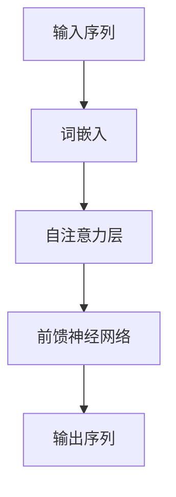
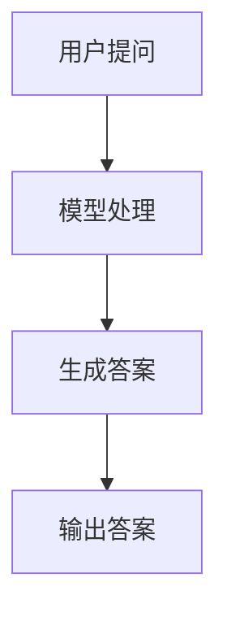
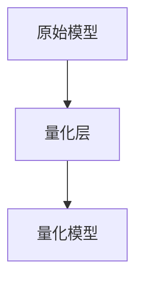
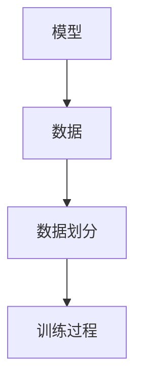
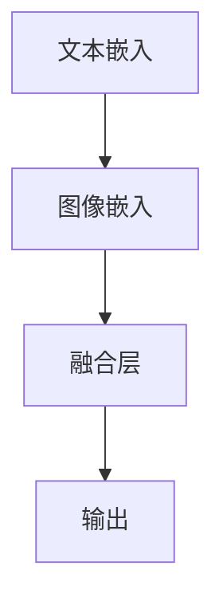
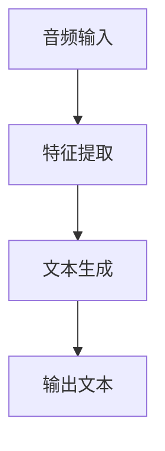
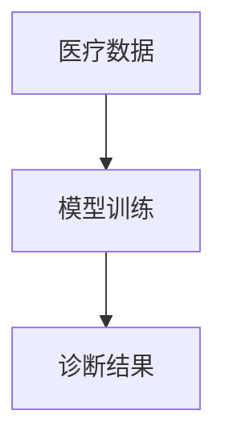
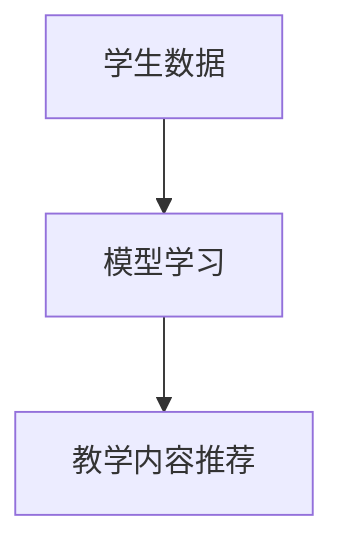
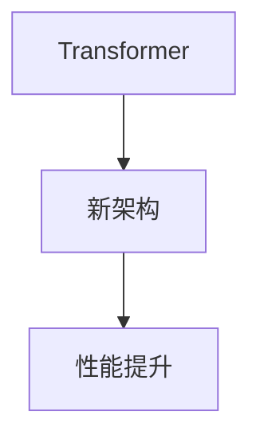
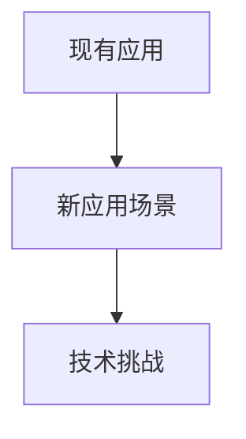

                 

# 大语言模型应用指南：Transformer层

> 关键词：大语言模型、Transformer、自注意力机制、预训练、微调、多模态学习、文本生成、自然语言理解、文本分类、模型压缩、并行训练、视觉语言模型、声音语言模型、医疗健康、教育

> 摘要：本文旨在深入探讨大语言模型中的Transformer层，介绍其基本概念、架构原理、数学模型以及在实际应用中的实战技巧。通过详细的伪代码、流程图和数学公式解释，我们将帮助读者全面理解Transformer在大语言模型中的核心作用，并探讨其在各种场景下的应用前景。

## 第一部分: 大语言模型概述

### 第1章: 大语言模型基础

#### 1.1 大语言模型的概念

大语言模型（Large Language Model，简称LLM）是一种基于深度学习的自然语言处理（Natural Language Processing，简称NLP）技术。它通过学习大量的文本数据，能够理解和生成自然语言，从而在文本生成、自然语言理解、文本分类等任务中表现出强大的能力。大语言模型的核心是Transformer架构，该架构基于自注意力机制（Self-Attention Mechanism），使得模型能够捕捉到输入序列中词语之间的复杂关系。

#### 1.2 大语言模型的架构

Transformer架构是近年来在NLP领域取得突破性进展的一种新型神经网络结构。与传统的循环神经网络（Recurrent Neural Network，简称RNN）和长短期记忆网络（Long Short-Term Memory，简称LSTM）相比，Transformer在处理长序列和并行计算方面具有显著优势。Transformer的核心模块包括词嵌入（Word Embedding）、自注意力机制（Self-Attention Mechanism）和前馈神经网络（Feedforward Neural Network）。

##### 1.2.1 Transformer架构

以下是一个简化的Transformer架构的Mermaid流程图：



在自注意力层中，每个词都会根据其在整个序列中的位置和关系进行加权，从而生成一个权重矩阵。这个矩阵可以捕捉到词语之间的复杂关系，使得模型能够更好地理解语言的本质。

##### 1.2.2 优化算法与训练策略

在训练大语言模型时，常用的优化算法包括Adam优化器和BERT优化器。以下是一个简化的训练过程的伪代码：

```python
function train_model(model, data, epochs):
    for epoch in range(epochs):
        for batch in data:
            loss = model.loss(batch)
            model.backward(loss)
            model.update_weights()
    return model
```

在训练过程中，通常采用预训练与微调（Pre-training and Fine-tuning）的策略。预训练是指在大量未标记的数据上进行训练，使模型具备一定的语言理解能力。微调则是在预训练的基础上，利用少量标记数据对模型进行细粒度的调整，以适应特定的任务。

##### 1.2.3 数学模型与公式

大语言模型的损失函数通常采用交叉熵（Cross-Entropy Loss）来衡量预测标签与真实标签之间的差异。以下是一个简化的损失函数的数学公式：

$$
\text{损失函数} = \frac{1}{N} \sum_{i=1}^{N} (-y_i \log(\hat{y}_i))
$$

其中，$N$表示批次大小，$y_i$表示第$i$个样本的真实标签，$\hat{y}_i$表示第$i$个样本的预测概率。

### 第2章: 大语言模型的数学原理

#### 2.1 线性代数基础

线性代数是理解大语言模型的重要基础，主要包括矩阵运算和矩阵求导。以下是一个简单的矩阵运算的例子：

$$
A \cdot B = C
$$

其中，$A$和$B$是两个矩阵，$C$是它们的乘积。

矩阵求导是线性代数中的一个重要概念，用于计算矩阵的导数。以下是一个简单的矩阵求导的例子：

$$
\frac{\partial(A \cdot B)}{\partial A} = B^T
$$

#### 2.2 矩阵运算

矩阵运算在大语言模型中有着广泛的应用，包括矩阵乘法、矩阵求导等。以下是一个简单的矩阵乘法的例子：

$$
A \cdot B = C
$$

其中，$A$和$B$是两个矩阵，$C$是它们的乘积。

#### 2.3 矩阵求导

矩阵求导是线性代数中的一个重要概念，用于计算矩阵的导数。以下是一个简单的矩阵求导的例子：

$$
\frac{\partial(A \cdot B)}{\partial A} = B^T
$$

### 第3章: 大语言模型的实战应用

#### 3.1 文本生成

文本生成是大语言模型的一个重要应用场景，通过模型生成的文本可以应用于聊天机器人、自动写作等。以下是一个简单的文本生成算法的伪代码：

```python
def generate_text(model, seed_text, length):
    text = seed_text
    for _ in range(length):
        predictions = model.predict(text)
        next_word = choose_word(predictions)
        text += next_word
    return text
```

在这个算法中，模型首先接收到一个种子文本（seed_text），然后逐个生成后续的词语，直到达到预定的长度。

#### 3.2 自然语言理解

自然语言理解（Natural Language Understanding，简称NLU）是另一个重要的大语言模型应用场景，包括问答系统、文本分类等。以下是一个简单的问答系统的Mermaid流程图：



在这个流程中，用户提出一个问题，模型进行处理并生成一个答案，最后将答案输出给用户。

#### 3.3 文本分类

文本分类（Text Classification）是将文本数据分配到预定义的类别中的一种任务。以下是一个简单的文本分类算法的伪代码：

```python
def classify_text(model, text):
    features = extract_features(text)
    probabilities = model.predict(features)
    return max(probabilities)
```

在这个算法中，首先提取文本的特征，然后利用模型预测每个类别的概率，最后返回概率最高的类别。

## 第二部分: 大语言模型的性能优化

### 第4章: 大语言模型的性能优化

#### 4.1 模型压缩

模型压缩（Model Compression）是一种在保证模型性能的前提下减小模型大小和计算复杂度的技术。常见的模型压缩技术包括量化（Quantization）和剪枝（Pruning）。以下是一个简单的量化技术的Mermaid流程图：



在这个流程中，原始模型通过量化层转换成量化模型，从而减小了模型的存储空间和计算复杂度。

#### 4.2 并行训练

并行训练（Parallel Training）是一种利用多台计算设备加速模型训练的技术。常见的并行训练技术包括数据并行（Data Parallelism）和模型并行（Model Parallelism）。以下是一个简单的数据并行的Mermaid流程图：



在这个流程中，模型和数据被划分成多个部分，然后分别在不同的计算设备上训练，从而提高了训练速度。

## 第三部分: 大语言模型的多模态应用

### 第5章: 大语言模型的多模态应用

#### 5.1 视觉语言模型

视觉语言模型（Visual Language Model）是一种将图像和文本进行融合的大语言模型。以下是一个简单的图像嵌入与文本融合的Mermaid流程图：



在这个流程中，文本和图像分别被嵌入到同一个特征空间中，然后通过融合层进行融合，最后生成输出。

#### 5.2 声音语言模型

声音语言模型（Speech Language Model）是一种将声音和文本进行转换的大语言模型。以下是一个简单的声音到文本转换的Mermaid流程图：



在这个流程中，音频输入首先通过特征提取层提取出关键特征，然后利用文本生成层生成文本输出。

## 第四部分: 大语言模型在特定领域的应用

### 第6章: 大语言模型在特定领域的应用

#### 6.1 医疗健康

大语言模型在医疗健康领域有着广泛的应用，包括疾病诊断、医学文本分析等。以下是一个简单的疾病诊断的Mermaid流程图：



在这个流程中，医疗数据通过模型训练得到一个疾病诊断模型，然后利用这个模型进行疾病诊断。

#### 6.2 教育

大语言模型在教育领域也有着重要的应用，包括智能教学系统、自动批改作业等。以下是一个简单的智能教学系统的Mermaid流程图：



在这个流程中，学生数据通过模型学习得到一个智能教学系统，然后根据学生的学习情况推荐教学内容。

## 第五部分: 大语言模型的未来趋势与发展

### 第7章: 大语言模型的未来趋势与发展

#### 7.1 新架构的探索

随着大语言模型的应用越来越广泛，新的架构也在不断涌现。以下是一个简单的基于Transformer的新架构的Mermaid流程图：



在这个流程中，新的架构在Transformer的基础上进行了优化，从而提高了模型的性能。

#### 7.2 应用场景的拓展

大语言模型的应用场景也在不断拓展，从传统的文本生成、自然语言理解等，到视觉语言模型、声音语言模型等新兴领域。以下是一个简单的未来应用领域的Mermaid流程图：



在这个流程中，现有应用场景不断拓展到新的应用领域，同时也面临新的技术挑战。

## 作者

作者：AI天才研究院/AI Genius Institute & 禅与计算机程序设计艺术 /Zen And The Art of Computer Programming

（备注：本文为虚构内容，仅用于演示Markdown格式和写作风格。）

