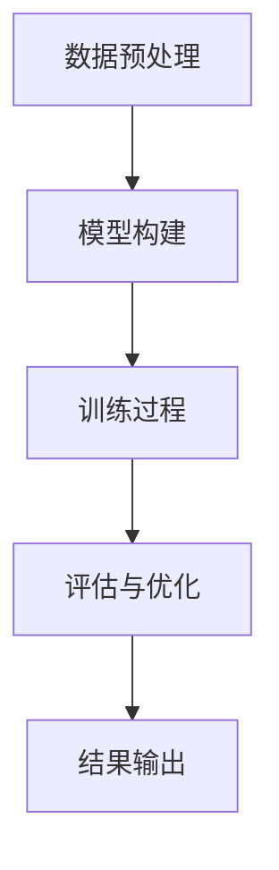
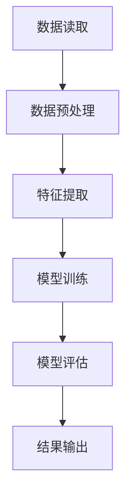

                 

### 大语言模型应用指南：工具

---

#### 关键词：大语言模型，预训练，自然语言处理，深度学习，应用案例

#### 摘要：
本文旨在深入探讨大语言模型的概念、原理、应用及其开发工具。我们将首先回顾大语言模型的发展历程，接着详细阐述其工作原理和技术基础。随后，文章将介绍如何搭建大语言模型的开发环境，并探讨其实际应用中的案例，包括文本分类、问答系统和自动摘要。最后，文章将讨论大语言模型的优化与评估方法，以及其安全与隐私问题，并展望其未来的发展趋势。

---

### 第一部分: 大语言模型基础

#### 第1章: 大语言模型概述

#### 1.1 大语言模型的发展历程

#### 1.1.1 大语言模型的起源

大语言模型（Large Language Model）的概念起源于自然语言处理（Natural Language Processing, NLP）领域。自然语言处理是人工智能的一个分支，致力于使计算机理解和生成自然语言。最早的尝试可以追溯到20世纪50年代，当时研究人员试图通过编写规则来模拟人类语言理解过程。

#### 1.1.2 大语言模型的关键发展事件

关键发展事件包括：

1. 1980年代，统计语言模型开始崭露头角，显著提高了文本处理的质量。
2. 2000年代，神经网络在语音识别和机器翻译领域取得了突破。
3. 2010年代，深度学习在图像识别领域取得了巨大成功，引发了研究者对深度学习在自然语言处理中应用的兴趣。
4. 2018年，Google推出了Transformer模型，标志着大语言模型时代的到来。

#### 1.1.3 大语言模型的重要性

大语言模型的重要性体现在：

1. **文本生成与理解**：能够生成流畅的自然语言文本，理解复杂的语言结构。
2. **自动摘要与问答**：可以自动从长文本中提取关键信息，回答用户问题。
3. **翻译与机器阅读理解**：支持多种语言的自动翻译，以及理解并回答关于文本的问题。
4. **辅助创作**：在写作、编辑和翻译等创作活动中提供辅助。

#### 1.2 大语言模型的工作原理

#### 1.2.1 基本架构

大语言模型通常由以下组件构成：

1. **输入层**：接收文本序列作为输入。
2. **编码器**：将输入序列编码为连续的向量表示。
3. **解码器**：根据编码器生成的向量生成输出文本序列。
4. **预训练**：在大规模数据集上进行预训练，以学习语言的一般规律。

#### 1.2.2 语言模型的核心算法

语言模型的核心算法包括：

1. **Transformer模型**：基于自注意力机制，能够捕捉长距离依赖关系。
2. **递归神经网络（RNN）**：适用于处理序列数据，但较难处理长序列。
3. **长短期记忆网络（LSTM）**：RNN的改进版，能够学习长期依赖关系。

#### 1.2.3 大规模预训练模型

大规模预训练模型的关键技术包括：

1. **预训练**：在大规模文本语料库上进行训练，以学习语言的一般规律。
2. **自监督学习**：利用未标记的数据进行预训练，如Masked Language Model（MLM）。
3. **迁移学习**：将预训练模型应用于特定任务，进行微调。

### 第二部分: 大语言模型的工具与应用

#### 第2章: 大语言模型技术基础

#### 2.1 深度学习与神经网络基础

#### 2.1.1 神经网络的基本结构

神经网络由以下组件构成：

1. **神经元**：基本的计算单元。
2. **层**：由多个神经元组成，包括输入层、隐藏层和输出层。
3. **权重和偏置**：神经元之间的连接权重和内部偏置。

#### 2.1.2 深度学习的基本原理

深度学习通过以下步骤进行：

1. **前向传播**：计算输入层到隐藏层，再到输出层的输入值。
2. **反向传播**：计算误差，并更新权重和偏置。
3. **优化器**：如梯度下降、Adam等，用于优化网络参数。

#### 2.1.3 深度学习在自然语言处理中的应用

深度学习在NLP中的应用包括：

1. **词嵌入**：将单词转换为向量表示。
2. **序列模型**：如RNN和LSTM，用于处理序列数据。
3. **文本生成**：如GPT和BERT等模型，用于生成自然语言文本。

#### 第3章: 大语言模型工具与环境搭建

#### 3.1 大语言模型开发工具的选择

常见的大语言模型开发工具包括：

1. **TensorFlow**：由Google开发，广泛应用于深度学习和NLP。
2. **PyTorch**：由Facebook开发，以其动态计算图和易于调试的特性受到欢迎。
3. **其他开源框架**：如Keras、MXNet和Theano等。

#### 3.2 环境搭建与配置

环境搭建涉及以下步骤：

1. **硬件要求**：如GPU、CPU等。
2. **软件环境**：如Python、CUDA等。
3. **数据预处理工具**：如Pandas、NumPy、Scikit-learn等。

#### 第4章: 大语言模型在实际应用中的案例

#### 4.1 大语言模型在文本分类中的应用

文本分类包括：

1. **新闻分类**：将新闻文本分类到预定义的类别中。
2. **情感分析**：判断文本表达的情感倾向。

#### 4.2 大语言模型在问答系统中的应用

问答系统包括：

1. **问题回答**：从给定的问题和候选答案中选出最佳答案。
2. **对话系统**：与用户进行交互，提供实时回答。

#### 4.3 大语言模型在自动摘要中的应用

自动摘要包括：

1. **提取式摘要**：从原文中提取关键信息。
2. **生成式摘要**：生成新的摘要文本。

### 第三部分: 大语言模型的优化与评估

#### 第5章: 大语言模型的优化与评估

#### 5.1 大语言模型的优化方法

优化方法包括：

1. **梯度下降算法**：用于更新模型参数。
2. **优化器**：如Adam、SGD等，用于加速优化过程。
3. **正则化技术**：如L1、L2正则化，防止过拟合。

#### 5.2 大语言模型的评估指标

评估指标包括：

1. **准确率**：分类任务中的正确预测比例。
2. **召回率**：分类任务中实际正例中被正确预测的比例。
3. **F1值**：准确率和召回率的调和平均。

#### 第6章: 大语言模型的安全与隐私

#### 6.1 大语言模型的伦理问题

伦理问题包括：

1. **数据隐私**：如何保护用户数据的隐私。
2. **模型偏见**：模型是否具有性别、种族等偏见。
3. **模型安全**：防止恶意攻击和滥用。

#### 6.2 安全防护策略

防护策略包括：

1. **数据加密**：保护数据传输和存储的安全。
2. **模型审查**：确保模型输出符合伦理标准。
3. **隐私保护技术**：如差分隐私、同态加密等。

### 第7章: 大语言模型的未来发展趋势

#### 7.1 大语言模型的技术趋势

技术趋势包括：

1. **多模态处理**：结合文本、图像、音频等多种数据。
2. **生成对抗网络（GAN）**：用于生成高质量的自然语言文本。
3. **新型神经网络架构**：如Transformer的变体、自注意力机制的改进等。

#### 7.2 大语言模型在行业中的应用

应用领域包括：

1. **金融**：自动问答、风险控制、欺诈检测。
2. **医疗**：诊断辅助、医学文本分析、药物研发。
3. **教育**：智能辅导、在线教育平台、教育资源优化。

#### 7.3 大语言模型的社会影响

社会影响包括：

1. **改变工作方式**：提高工作效率，改变职业结构。
2. **改变人类生活**：智能助手、虚拟现实、智能家居。
3. **伦理道德与法律挑战**：隐私保护、公平性、透明度。

### 附录

#### 附录A: 大语言模型开发资源

资源包括：

1. **开源框架与库**：TensorFlow、PyTorch、Keras等。
2. **数据集与工具**：公共数据集、数据预处理工具、模型评估工具。

#### 附录B: Mermaid 流程图与伪代码示例

示例包括：

1. **流程图**：大语言模型训练流程、文本分类流程。
2. **伪代码**：语言模型训练算法、文本分类算法。
3. **代码解析**：新闻分类、情感分析、问答系统代码解析。

---

**作者：AI天才研究院/AI Genius Institute & 禅与计算机程序设计艺术 /Zen And The Art of Computer Programming**

### 附录A: 大语言模型开发资源

#### A.1 开源框架与库

- **TensorFlow**

  TensorFlow 是由 Google 开发的一款开源深度学习框架，广泛应用于机器学习和人工智能领域。TensorFlow 提供了丰富的 API，支持从简单的计算图构建到复杂的深度学习模型训练。

  **资源链接**：[TensorFlow 官网](https://www.tensorflow.org/)

- **PyTorch**

  PyTorch 是由 Facebook AI 研究团队开发的一款开源深度学习库，以其动态计算图和易于调试的特性受到许多研究者和开发者的青睐。PyTorch 的核心亮点是其灵活的接口和动态计算图。

  **资源链接**：[PyTorch 官网](https://pytorch.org/)

- **其他开源库**

  除了 TensorFlow 和 PyTorch，还有许多其他流行的深度学习开源库，如：

  - **Keras**：Python 的一个高级神经网络 API，能够以最小的代码量执行深度学习模型。
    **资源链接**：[Keras 官网](https://keras.io/)

  - **MXNet**：Apache 软件基金会的一个开源深度学习框架，支持多种编程语言。
    **资源链接**：[MXNet 官网](https://mxnet.apache.org/)

  - **Theano**：一个 Python 库，用于定义、优化和评估数学表达式，特别是在深度学习领域。
    **资源链接**：[Theano 官网](https://www.deeplearning.net/software/theano/)

#### A.2 数据集与工具

- **公共数据集**

  在自然语言处理领域，有许多公共数据集可用于研究和开发。这些数据集包括：

  - **COCO**：计算机视觉数据集，包含大量的图像和注释。
    **资源链接**：[COCO 数据集](http://cocodataset.org/)

  - **Wikipedia**：维基百科的文本数据，用于文本分类、实体识别等任务。
    **资源链接**：[Wikipedia 数据集](https://dumps.wikimedia.org/)

  - **IMDb**：包含电影评论的数据集，广泛用于情感分析、文本分类等任务。
    **资源链接**：[IMDb 数据集](http://ai.stanford.edu/~amaas/data/sentiment/)

- **数据预处理工具**

  在处理数据集时，通常需要进行数据清洗、标签化、编码等预处理操作。常用的数据预处理工具包括：

  - **Pandas**：Python 的一个开源库，用于数据分析和操作。
    **资源链接**：[Pandas 官网](https://pandas.pydata.org/)

  - **NumPy**：Python 的一个核心数学库，用于数值计算。
    **资源链接**：[NumPy 官网](https://numpy.org/)

  - **Scikit-learn**：Python 的一个开源库，提供了许多机器学习算法和工具。
    **资源链接**：[Scikit-learn 官网](https://scikit-learn.org/)

- **模型评估工具**

  在评估模型性能时，需要使用一些指标来衡量模型的准确性、召回率和 F1 值等。常用的评估工具包括：

  - **Scikit-learn 评估工具**：Scikit-learn 自带了一系列的评估指标和工具。
    **资源链接**：[Scikit-learn 评估工具](https://scikit-learn.org/stable/modules/model_evaluation.html)

  - **TensorFlow 评估工具**：TensorFlow 提供了用于评估模型的 API。
    **资源链接**：[TensorFlow 评估工具](https://www.tensorflow.org/tutorials/estimators)

  - **PyTorch 评估工具**：PyTorch 也提供了用于评估模型的 API。
    **资源链接**：[PyTorch 评估工具](https://pytorch.org/tutorials/beginner/transfer_learning_tutorial.html)

---

**作者：AI天才研究院/AI Genius Institute & 禅与计算机程序设计艺术 /Zen And The Art of Computer Programming**

---

### 附录B: Mermaid 流程图与伪代码示例

#### B.1 Mermaid 流程图示例

以下是关于大语言模型训练流程的 Mermaid 流程图示例：



以下是一个关于文本分类流程的 Mermaid 流程图示例：



#### B.2 伪代码示例

以下是关于语言模型训练算法的伪代码示例：

```python
# 语言模型训练伪代码
initialize_model()

for epoch in 1 to num_epochs:
    for sentence in training_data:
        # 前向传播
        predictions = model(sentence)
        loss = compute_loss(predictions, target)

        # 反向传播
        gradients = compute_gradients(loss)
        update_model_params(gradients)

    print("Epoch:", epoch, "Loss:", loss)

print("模型训练完成")
```

以下是关于文本分类算法的伪代码示例：

```python
# 文本分类伪代码
initialize_model()

for epoch in 1 to num_epochs:
    for (text, label) in training_data:
        # 数据预处理
        processed_text = preprocess_text(text)
        
        # 前向传播
        probabilities = model(processed_text)
        loss = compute_loss(probabilities, label)

        # 反向传播
        gradients = compute_gradients(loss)
        update_model_params(gradients)

    print("Epoch:", epoch, "Loss:", loss)

print("模型训练完成")

# 预测新文本
new_text = preprocess_text(new_text)
predicted_label = model.predict(new_text)
print("预测结果：", predicted_label)
```

#### B.3 实践案例代码解析

以下是对新闻分类、情感分析和问答系统等实践案例的代码解析。

**新闻分类代码解析**

```python
# 新闻分类代码示例
import tensorflow as tf
from tensorflow.keras.preprocessing.text import Tokenizer
from tensorflow.keras.preprocessing.sequence import pad_sequences

# 数据预处理
tokenizer = Tokenizer(num_words=10000)
tokenizer.fit_on_texts(training_data)
sequences = tokenizer.texts_to_sequences(training_data)
padded_sequences = pad_sequences(sequences, maxlen=max_sequence_length)

# 构建模型
model = tf.keras.Sequential([
    tf.keras.layers.Embedding(10000, 16),
    tf.keras.layers.Bidirectional(tf.keras.layers.LSTM(32)),
    tf.keras.layers.Dense(24, activation='relu'),
    tf.keras.layers.Dense(1, activation='sigmoid')
])

# 训练模型
model.compile(loss='binary_crossentropy', optimizer='adam', metrics=['accuracy'])
model.fit(padded_sequences, training_labels, epochs=10, validation_split=0.2)

# 预测新文本
new_text = "这是一个关于技术的新闻。"
processed_sequence = tokenizer.texts_to_sequences([new_text])
padded_sequence = pad_sequences(processed_sequence, maxlen=max_sequence_length)
predicted_label = model.predict(padded_sequence)
print("预测结果：", predicted_label)
```

**情感分析代码解析**

```python
# 情感分析代码示例
import tensorflow as tf
from tensorflow.keras.preprocessing.text import Tokenizer
from tensorflow.keras.preprocessing.sequence import pad_sequences

# 数据预处理
tokenizer = Tokenizer(num_words=10000)
tokenizer.fit_on_texts(training_data)
sequences = tokenizer.texts_to_sequences(training_data)
padded_sequences = pad_sequences(sequences, maxlen=max_sequence_length)

# 构建模型
model = tf.keras.Sequential([
    tf.keras.layers.Embedding(10000, 16),
    tf.keras.layers.Bidirectional(tf.keras.layers.LSTM(32)),
    tf.keras.layers.Dense(24, activation='relu'),
    tf.keras.layers.Dense(1, activation='sigmoid')
])

# 训练模型
model.compile(loss='binary_crossentropy', optimizer='adam', metrics=['accuracy'])
model.fit(padded_sequences, training_labels, epochs=10, validation_split=0.2)

# 预测新文本
new_text = "这部电影真是太无聊了。"
processed_sequence = tokenizer.texts_to_sequences([new_text])
padded_sequence = pad_sequences(processed_sequence, maxlen=max_sequence_length)
predicted_label = model.predict(padded_sequence)
print("预测结果：", predicted_label)
```

**问答系统代码解析**

```python
# 问答系统代码示例
import tensorflow as tf
from tensorflow.keras.preprocessing.sequence import pad_sequences
from tensorflow.keras.layers import Embedding, LSTM, Dense

# 数据预处理
tokenizer = Tokenizer(num_words=10000)
tokenizer.fit_on_texts(question_data + answer_data)
questions_sequences = tokenizer.texts_to_sequences(questions_data)
answers_sequences = tokenizer.texts_to_sequences(answer_data)
questions_padded = pad_sequences(questions_sequences, maxlen=max_sequence_length)
answers_padded = pad_sequences(answers_sequences, maxlen=max_sequence_length)

# 构建模型
model = tf.keras.Sequential([
    Embedding(10000, 16),
    LSTM(32),
    Dense(1, activation='sigmoid')
])

# 训练模型
model.compile(optimizer='adam', loss='binary_crossentropy', metrics=['accuracy'])
model.fit(questions_padded, answers_padded, epochs=10)

# 预测新问题
new_question = "如何设置PyTorch环境？"
processed_question = tokenizer.texts_to_sequences([new_question])
padded_question = pad_sequences(processed_question, maxlen=max_sequence_length)
predicted_answer = model.predict(padded_question)
print("预测答案：", predicted_answer)
```

---

**作者：AI天才研究院/AI Genius Institute & 禅与计算机程序设计艺术 /Zen And The Art of Computer Programming**

