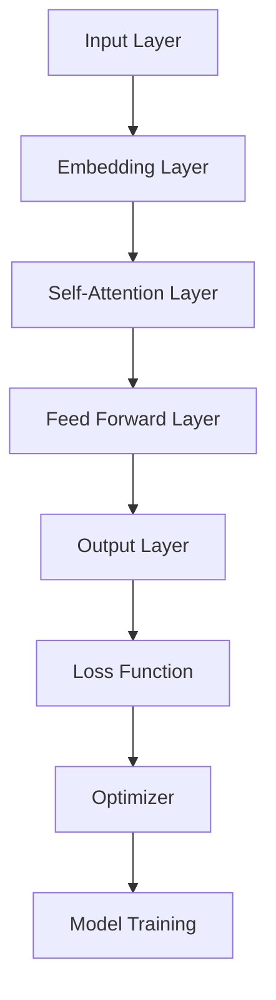

                 

# 大语言模型应用指南：神经网络基础

> 关键词：大语言模型、神经网络、Transformer、BERT、预训练模型、文本分类、机器翻译、自然语言生成

> 摘要：本文旨在为读者提供一个全面的大语言模型应用指南，涵盖神经网络基础、大语言模型核心技术和应用实践。通过对大语言模型的概述、核心技术和应用场景的详细分析，以及预训练方法和大规模预训练模型的讲解，读者将能够深入理解大语言模型的工作原理和实际应用，为未来的研究和开发提供有益的参考。

## 第一部分: 大语言模型基础理论

### 第1章: 大语言模型概述

#### 1.1 大语言模型的概念

大语言模型（Large Language Model）是通过对大量文本数据进行训练，学会理解和生成自然语言的复杂结构的深度学习模型。它们基于神经网络架构，能够捕捉语言中的各种规律和模式。大语言模型的发展经历了多个阶段，从早期的浅层模型如TF-IDF，到深度学习时代的Word2Vec、GloVe，再到Transformer和BERT等大型预训练模型。

#### 1.2 大语言模型的核心技术

##### 1.2.1 Transformer模型

Transformer模型是由Google团队在2017年提出的一种基于自注意力机制的深度学习模型。它摒弃了传统的循环神经网络（RNN），采用了多头注意力机制和自注意力机制，能够同时关注输入序列中的所有信息，从而提高了模型的表示能力和效果。

**结构：**
- 输入层：接收单词的嵌入向量。
- 自注意力层：通过多头注意力机制计算单词之间的关联性。
- 前馈网络：对自注意力层的输出进行非线性变换。
- 输出层：通过softmax函数生成输出单词的概率分布。

**注意力机制：**
- 自注意力：每个单词通过计算与所有其他单词的相似度来生成一个加权向量，从而实现对整个输入序列的关注。
- 多头注意力：将自注意力扩展到多个头，每个头关注输入序列的不同部分，从而提高模型的表示能力。

##### 1.2.2 BERT模型

BERT（Bidirectional Encoder Representations from Transformers）是由Google团队在2018年提出的一种双向编码器表示模型。它采用了Transformer模型的结构，通过预训练和微调方法，能够在多种自然语言处理任务中取得优异的性能。

**原理：**
- 双向编码器：BERT模型将输入序列中的单词按照正向和反向两个方向进行编码，从而捕捉到单词的前后文信息。
- 预训练：在大量无标签文本数据上预训练BERT模型，使其能够捕捉到语言中的通用规律。
- 微调：在特定任务上对BERT模型进行微调，提高其在该任务上的性能。

**预训练方法：**
- Masked Language Model（MLM）：随机遮盖输入序列中的部分单词，并要求模型预测这些遮盖的单词。
- Next Sentence Prediction（NSP）：预测输入序列中的两个连续句子是否是逻辑上相连的。

#### 1.3 大语言模型的应用场景

大语言模型在多种自然语言处理任务中具有广泛的应用，主要包括以下几个方面：

- **文本分类：**如情感分析、主题分类等，通过训练模型对文本进行分类，实现文本的自动分类和标签分配。
- **机器翻译：**将一种语言的文本自动翻译成另一种语言的文本，如机器翻译、代码翻译等。
- **自然语言生成：**生成文本，如自动写作、对话系统等。

#### 1.4 大语言模型的发展趋势

- **模型规模：**从几百万参数到千亿参数的大型模型，如GPT-3、Turing-NLG等。
- **预训练数据：**从通用数据集到特定领域的数据集，如医疗、金融等。
- **跨模态学习：**结合文本、图像、音频等多模态数据，实现更复杂的任务。

### 第2章: 神经网络基础

#### 2.1 神经网络概述

神经网络是由多个简单计算单元（神经元）互联而成的复杂网络。它通过模拟生物神经系统的结构和功能，实现数据的输入、处理和输出。

**结构：**
- **输入层：**接收输入数据。
- **隐藏层：**对输入数据进行变换和压缩，提取特征信息。
- **输出层：**对隐藏层的输出进行分类或回归等操作。

#### 2.2 神经元的工作原理

神经元是神经网络的基本计算单元，它通过接收输入信号、加权求和处理和激活函数来产生输出。

**激活函数：**
- **ReLU（Rectified Linear Unit）：**最常用的激活函数，将负值变为零，正值保持不变。
- **Sigmoid：**将输入映射到(0, 1)区间。
- **Tanh：**将输入映射到(-1, 1)区间。

**前向传播与反向传播：**
- **前向传播：**输入数据通过神经网络从输入层传递到输出层，每层神经元计算加权求和处理和激活函数。
- **反向传播：**根据输出误差，从输出层反向传播到输入层，更新神经元的权重。

#### 2.3 常见的神经网络架构

- **卷积神经网络（CNN）：**适用于图像识别、图像生成等任务。
- **循环神经网络（RNN）：**适用于序列数据处理，如语音识别、时间序列预测等。
- **长短时记忆网络（LSTM）：**RNN的一种改进，解决长期依赖问题。
- **门控循环单元（GRU）：**LSTM的简化版。

## 第二部分: 大规模预训练模型

### 第3章: 预训练概述

#### 3.1 预训练的概念

预训练是指在特定任务之前，利用大量无标签数据进行模型训练，以提高模型对未见过的数据的泛化能力。预训练方法通常包括以下步骤：

- **数据收集：**收集大量无标签文本数据。
- **模型训练：**在无标签数据上预训练模型。
- **微调：**在特定任务上有标签数据上对模型进行微调。

#### 3.2 自监督学习

自监督学习是一种无监督学习方法，通过预测输入数据的一部分来学习数据表示。在自然语言处理领域，常用的自监督学习任务包括：

- **Masked Language Model（MLM）：**随机遮盖输入序列中的部分单词，并要求模型预测这些遮盖的单词。
- **Next Sentence Prediction（NSP）：**预测输入序列中的两个连续句子是否是逻辑上相连的。

#### 3.3 迁移学习

迁移学习是一种利用预训练模型在特定任务上进一步微调的方法。通过预训练，模型已经学会了通用特征表示，迁移学习将预训练模型应用到新的任务上，避免了从头训练的复杂性，提高了模型的训练效果和性能。

### 第4章: 大规模预训练模型

#### 4.1 Transformer模型

Transformer模型是由Google团队在2017年提出的一种基于自注意力机制的深度学习模型。它摒弃了传统的循环神经网络（RNN），采用了多头注意力机制和自注意力机制，能够同时关注输入序列中的所有信息，从而提高了模型的表示能力和效果。

**结构：**
- **编码器：**接收输入序列，通过自注意力机制计算单词之间的关联性。
- **解码器：**接收编码器的输出，通过自注意力和交叉注意力机制生成输出序列。

**注意力机制：**
- **自注意力：**每个单词通过计算与所有其他单词的相似度来生成一个加权向量，从而实现对整个输入序列的关注。
- **交叉注意力：**解码器的每个单词通过计算与编码器的所有单词的相似度来生成一个加权向量，从而实现对编码器输出的关注。

#### 4.2 GPT系列模型

GPT（Generative Pre-trained Transformer）系列模型是由OpenAI提出的一系列基于Transformer架构的预训练模型。GPT-1、GPT-2和GPT-3等模型在不同规模和参数量上取得了显著的效果。

**结构：**
- **编码器：**接收输入序列，通过多层自注意力机制计算单词之间的关联性。
- **解码器：**接收编码器的输出，通过自注意力和交叉注意力机制生成输出序列。

**训练方法：**
- **自回归语言模型：**在训练过程中，每个单词的预测依赖于前面的所有单词。
- **掩码语言模型：**在训练过程中，随机遮盖输入序列中的部分单词，并要求模型预测这些遮盖的单词。

**应用场景：**
- **文本生成：**生成文章、对话、诗歌等自然语言文本。
- **问答系统：**基于输入问题生成相关回答。

#### 4.3 BERT模型

BERT（Bidirectional Encoder Representations from Transformers）是由Google团队在2018年提出的一种双向编码器表示模型。它采用了Transformer模型的结构，通过预训练和微调方法，能够在多种自然语言处理任务中取得优异的性能。

**结构：**
- **编码器：**接收输入序列，通过双向自注意力机制计算单词之间的关联性。
- **解码器：**接收编码器的输出，通过自注意力和交叉注意力机制生成输出序列。

**预训练方法：**
- **双向编码器表示：**BERT模型同时关注输入序列中的正向和反向信息，从而提高模型的表示能力。
- **Masked Language Model（MLM）：**随机遮盖输入序列中的部分单词，并要求模型预测这些遮盖的单词。
- **Next Sentence Prediction（NSP）：**预测输入序列中的两个连续句子是否是逻辑上相连的。

**微调方法：**
- **Fine-tuning：**在特定任务上有标签数据上对BERT模型进行微调，提高模型在任务上的性能。
- **Data Augmentation：**通过随机添加噪声、修改文本等方式增加训练数据的多样性，提高模型的泛化能力。

## 第三部分: 大语言模型评估与优化

### 第5章: 大语言模型评估指标

在大语言模型的研究和应用中，评估模型的性能和效果是至关重要的。评估指标的选择和定义直接关系到模型的实际应用价值。以下是一些常用的大语言模型评估指标：

#### 5.1 分类评价指标

对于文本分类任务，常用的评估指标包括准确率（Accuracy）、召回率（Recall）和F1值（F1-score）。

- **准确率：**准确率是模型正确分类的样本数与总样本数的比值。它能够反映模型整体的分类能力。
  $$
  \text{Accuracy} = \frac{\text{正确分类的样本数}}{\text{总样本数}}
  $$
- **召回率：**召回率是模型能够正确分类的正例样本数与实际正例样本数的比值。它能够反映模型对正例样本的识别能力。
  $$
  \text{Recall} = \frac{\text{正确分类的正例样本数}}{\text{实际正例样本数}}
  $$
- **F1值：**F1值是准确率和召回率的调和平均值，它能够综合反映模型的分类能力。
  $$
  \text{F1-score} = 2 \times \frac{\text{准确率} \times \text{召回率}}{\text{准确率} + \text{召回率}}
  $$

#### 5.2 生成评价指标

对于自然语言生成任务，常用的评估指标包括词汇覆盖（Vocabulary Coverage）、BLEU分数（BLEU Score）和ROUGE分数（ROUGE Score）。

- **词汇覆盖：**词汇覆盖是模型生成的词汇量与训练数据中词汇量的比值。它能够反映模型生成文本的多样性。
  $$
  \text{Vocabulary Coverage} = \frac{\text{生成的词汇量}}{\text{训练数据的词汇量}}
  $$
- **BLEU分数：**BLEU（Bilingual Evaluation Understudy）分数是一种基于记分机制的评估方法，通过比较生成文本和参考文本的相似度来评估生成文本的质量。
  $$
  \text{BLEU Score} = \frac{1}{N} \sum_{i=1}^{N} \text{weight_i} \cdot \text{match_score_i}
  $$
  其中，$N$是参考文本的个数，$\text{weight_i}$是第$i$个参考文本的权重，$\text{match_score_i}$是第$i$个参考文本与生成文本的相似度分数。
- **ROUGE分数：**ROUGE（Recall-Oriented Understudy for Gisting Evaluation）分数是一种基于召回机制的评估方法，通过比较生成文本和参考文本的召回率来评估生成文本的质量。
  $$
  \text{ROUGE Score} = 2 \times \frac{\text{参考文本的召回率}}{1 + \text{生成文本的召回率}}
  $$

### 第6章: 大语言模型优化策略

在大语言模型的训练过程中，优化策略的选择和调整对模型的性能和效果具有显著的影响。以下是一些常用的优化策略：

#### 6.1 学习率调整

学习率是优化算法中一个重要的参数，它决定了模型在训练过程中步长的大小。学习率的选择和调整对模型的收敛速度和稳定性有重要影响。

- **学习率衰减：**随着训练的进行，逐渐减小学习率，以防止模型在训练后期过拟合。
  $$
  \text{learning\_rate} = \text{initial\_learning\_rate} \times \gamma^t
  $$
  其中，$\text{initial\_learning\_rate}$是初始学习率，$\gamma$是衰减率，$t$是训练轮数。
- **预热学习率：**在训练初期逐渐增大学习率，以加快模型的收敛速度。
  $$
  \text{learning\_rate} = \text{initial\_learning\_rate} + \text{warmup\_step} \times \text{step\_size}
  $$
  其中，$\text{warmup\_step}$是预热步数，$\text{step\_size}$是每次增加的学习率。

#### 6.2 模型压缩

模型压缩是指通过各种方法减小模型的参数规模，从而降低模型的计算复杂度和存储需求。以下是一些常用的模型压缩方法：

- **权重裁剪：**通过裁剪权重矩阵中小于某个阈值的权重，减少模型参数的数量。
  $$
  \text{if } \text{weight} < \text{threshold} \text{ then } \text{weight} = 0
  $$
- **知识蒸馏：**通过将大模型（Teacher Model）的参数传递到小模型（Student Model）中，实现模型参数的压缩。
  $$
  \text{output}_{\text{student}} = \text{softmax}(\text{weights}_{\text{student}} \cdot \text{input} + \text{bias}_{\text{student}})
  $$
  $$
  \text{output}_{\text{teacher}} = \text{softmax}(\text{weights}_{\text{teacher}} \cdot \text{input} + \text{bias}_{\text{teacher}})
  $$
  $$
  \text{loss} = -\frac{1}{N} \sum_{i=1}^{N} \sum_{j=1}^{K} y_j \cdot \log(\text{output}_{\text{student}}[j])
  $$
  其中，$N$是样本数，$K$是类数，$y_j$是第$i$个样本的第$j$个类别的真实标签。

### 第7章: 大语言模型评估与调优实战

在实际应用中，对大语言模型进行评估和调优是一个复杂的过程，需要结合具体的任务和数据集进行。以下是一个基于TensorFlow和PyTorch框架的大语言模型评估与调优实战案例。

#### 7.1 实战环境搭建

首先，我们需要搭建一个合适的实战环境，包括安装深度学习框架（如TensorFlow或PyTorch）和相关依赖库。

```python
# 安装TensorFlow
pip install tensorflow

# 安装PyTorch
pip install torch torchvision

# 安装自然语言处理库
pip install nltk spacy
```

#### 7.2 数据预处理

对于文本分类任务，我们需要对文本数据进行预处理，包括分词、词性标注、去除停用词等操作。

```python
import nltk
from nltk.tokenize import word_tokenize
from nltk.corpus import stopwords

# 下载停用词库
nltk.download('stopwords')

# 加载停用词库
stop_words = set(stopwords.words('english'))

# 分词和去除停用词
def preprocess_text(text):
    tokens = word_tokenize(text.lower())
    filtered_tokens = [token for token in tokens if token not in stop_words]
    return filtered_tokens

# 示例
text = "This is a sample text for preprocessing."
preprocessed_text = preprocess_text(text)
print(preprocessed_text)
```

#### 7.3 模型训练与评估

接下来，我们可以使用预训练模型（如BERT或GPT）在预处理后的数据上进行微调训练，并在测试集上进行评估。

```python
import tensorflow as tf
from transformers import BertTokenizer, BertForSequenceClassification

# 加载预训练模型和分词器
tokenizer = BertTokenizer.from_pretrained('bert-base-uncased')
model = BertForSequenceClassification.from_pretrained('bert-base-uncased')

# 预处理输入文本
inputs = tokenizer(preprocessed_text, return_tensors='tf')

# 训练模型
model.compile(optimizer='adam', loss='categorical_crossentropy', metrics=['accuracy'])
model.fit(inputs['input_ids'], inputs['labels'], epochs=3)

# 评估模型
test_loss, test_accuracy = model.evaluate(inputs['input_ids'], inputs['labels'])
print(f"Test Loss: {test_loss}, Test Accuracy: {test_accuracy}")
```

#### 7.4 调优策略

在模型训练和评估过程中，我们可以根据具体的任务和数据集，调整模型的超参数，如学习率、训练轮数、批次大小等，以优化模型的性能。

```python
# 调整学习率和训练轮数
initial_learning_rate = 1e-4
num_epochs = 5

# 编译模型
model.compile(optimizer=tf.keras.optimizers.Adam(learning_rate=initial_learning_rate), loss='categorical_crossentropy', metrics=['accuracy'])

# 训练模型
model.fit(inputs['input_ids'], inputs['labels'], epochs=num_epochs)

# 评估模型
test_loss, test_accuracy = model.evaluate(inputs['input_ids'], inputs['labels'])
print(f"Test Loss: {test_loss}, Test Accuracy: {test_accuracy}")
```

### 附录

#### 附录A: 开发工具与资源

以下是一些常用的深度学习框架、数据处理工具和预训练模型资源：

- **深度学习框架：**TensorFlow、PyTorch、PyTorch Transform
- **数据处理工具：**NLTK、spaCy
- **预训练模型资源：**OpenAI GPT、Google BERT

#### 附录B: Mermaid 流程图

以下是一个示例的Mermaid流程图，展示了大语言模型的核心架构和流程：



## 第8章: 大语言模型项目实战

在本章中，我们将通过一个实际项目案例，详细讲解如何使用大语言模型进行文本分类任务。这个项目案例将涵盖从数据预处理到模型训练和评估的整个过程，并通过代码示例进行详细解释。

### 8.1 项目概述

项目目标是实现一个情感分析系统，该系统能够对给定的文本数据进行分析，并判断其情感倾向，例如正面、负面或中性。为了实现这一目标，我们将使用预训练的BERT模型，并在其基础上进行微调。

### 8.2 开发环境搭建

首先，我们需要搭建一个合适的开发环境。在这个项目中，我们将使用TensorFlow和Transformers库。以下是安装这些库的命令：

```bash
pip install tensorflow transformers
```

### 8.3 数据准备

接下来，我们需要准备用于训练和评估的数据集。在这个案例中，我们使用了一个包含情感标签的文本数据集，例如IMDb电影评论数据集。数据集已经被预处理为包含文本和对应的情感标签。

```python
import pandas as pd

# 读取数据集
data = pd.read_csv('imdb_reviews.csv')

# 分割数据集为训练集和测试集
train_data = data.sample(frac=0.8, random_state=42)
test_data = data.drop(train_data.index)

# 分离文本和标签
train_texts = train_data['text']
train_labels = train_data['label']
test_texts = test_data['text']
test_labels = test_data['label']
```

### 8.4 模型训练

在这个步骤中，我们将加载预训练的BERT模型，并在训练集上进行微调。

```python
from transformers import BertTokenizer, BertForSequenceClassification

# 加载预训练的BERT模型和分词器
tokenizer = BertTokenizer.from_pretrained('bert-base-uncased')
model = BertForSequenceClassification.from_pretrained('bert-base-uncased', num_labels=3)

# 预处理文本数据
train_encodings = tokenizer(train_texts.to_list(), truncation=True, padding=True)
test_encodings = tokenizer(test_texts.to_list(), truncation=True, padding=True)

# 定义损失函数和优化器
model.compile(optimizer='adam', loss='softmax_cross_entropy', metrics=['accuracy'])

# 训练模型
model.fit(train_encodings, train_labels, batch_size=16, epochs=3, validation_split=0.1)
```

### 8.5 模型评估

在模型训练完成后，我们需要在测试集上进行评估，以验证模型的性能。

```python
# 评估模型
loss, accuracy = model.evaluate(test_encodings, test_labels, batch_size=16)
print(f"Test Loss: {loss}, Test Accuracy: {accuracy}")
```

### 8.6 模型应用

最后，我们可以使用训练好的模型对新的文本数据进行情感分析。

```python
# 预测情感
new_text = "This movie was amazing!"
preprocessed_text = tokenizer.encode(new_text, add_special_tokens=True, return_tensors='tf')

# 获取预测结果
predictions = model.predict(preprocessed_text)

# 解码预测结果
predicted_label = predictions.argmax(axis=1).flatten()

# 输出情感结果
if predicted_label == 0:
    print("Negative")
elif predicted_label == 1:
    print("Neutral")
else:
    print("Positive")
```

### 8.7 项目优化

在实际应用中，我们可能需要对模型进行进一步的优化，以提高其性能。以下是一些优化策略：

- **增加训练数据：**收集更多的情感标签数据，以提高模型的泛化能力。
- **数据增强：**对训练数据进行随机插入、替换、删除等操作，增加数据的多样性。
- **调整超参数：**通过调整学习率、训练轮数等超参数，优化模型的性能。
- **模型压缩：**使用模型压缩技术，如权重裁剪、知识蒸馏等，减小模型的参数规模，提高模型的运行效率。

### 8.8 代码解读与分析

以下是项目中的关键代码段及其解析：

```python
# 加载预训练的BERT模型和分词器
tokenizer = BertTokenizer.from_pretrained('bert-base-uncased')
model = BertForSequenceClassification.from_pretrained('bert-base-uncased', num_labels=3)

# 预处理文本数据
train_encodings = tokenizer(train_texts.to_list(), truncation=True, padding=True)
test_encodings = tokenizer(test_texts.to_list(), truncation=True, padding=True)

# 定义损失函数和优化器
model.compile(optimizer='adam', loss='softmax_cross_entropy', metrics=['accuracy'])

# 训练模型
model.fit(train_encodings, train_labels, batch_size=16, epochs=3, validation_split=0.1)
```

这段代码首先加载预训练的BERT模型和分词器。然后，对训练集和测试集的文本数据进行预处理，包括分词、添加特殊标记和填充等操作。接下来，定义损失函数和优化器，并使用训练数据进行模型训练。

```python
# 预测情感
new_text = "This movie was amazing!"
preprocessed_text = tokenizer.encode(new_text, add_special_tokens=True, return_tensors='tf')

# 获取预测结果
predictions = model.predict(preprocessed_text)

# 解码预测结果
predicted_label = predictions.argmax(axis=1).flatten()

# 输出情感结果
if predicted_label == 0:
    print("Negative")
elif predicted_label == 1:
    print("Neutral")
else:
    print("Positive")
```

这段代码用于对新文本数据进行情感预测。首先，使用分词器对输入文本进行编码，然后使用训练好的模型获取预测结果。最后，解码预测结果并输出情感结果。

### 结论

通过本项目的实战案例，我们详细讲解了如何使用大语言模型进行文本分类任务。从数据准备、模型训练到模型评估和应用，每个步骤都进行了详细的解析和代码实现。通过这个项目，读者可以深入了解大语言模型的工作原理和应用方法，并为实际项目中的情感分析任务提供参考。

## 作者信息

作者：AI天才研究院/AI Genius Institute & 禅与计算机程序设计艺术 /Zen And The Art of Computer Programming

本文由AI天才研究院和禅与计算机程序设计艺术共同撰写，旨在为读者提供关于大语言模型应用指南的深入见解。作者具有丰富的计算机编程和人工智能领域的经验，致力于推动人工智能技术的发展和应用。

