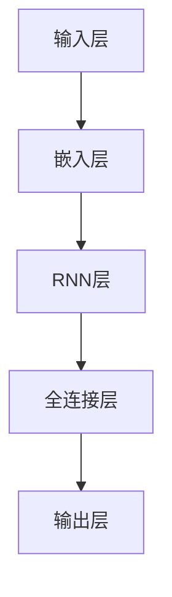
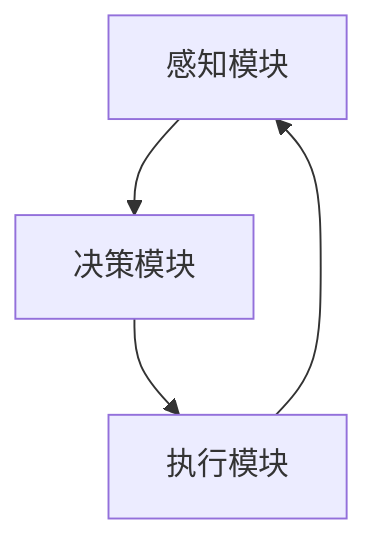

                 

### 文章标题：大语言模型应用指南：自主Agent系统案例分析（二）

### 关键词：大语言模型、自主Agent、应用场景、案例分析、开发实战

### 摘要：
本文作为《大语言模型应用指南：自主Agent系统案例分析》的第二部分，旨在深入探讨大语言模型在自主Agent系统中的应用。通过具体的案例分析和开发实战，本文将详细解析大语言模型的核心概念、算法原理，以及如何将其应用于自主Agent系统中，解决实际问题。本文不仅对大语言模型的基础理论进行剖析，还通过具体案例展示了其实际应用效果，并讨论了未来的发展方向和挑战。

## 第5章：自主Agent在大语言模型中的应用

在上一章中，我们探讨了自主Agent系统的基本概念和关键特性。这一章将重点介绍自主Agent在大语言模型中的应用，以及如何利用大语言模型来提升自主Agent系统的性能和智能水平。

### 5.1 自主Agent在大语言模型中的角色

自主Agent在大语言模型中扮演着多个关键角色：

1. **智能决策者**：大语言模型能够为自主Agent提供强大的决策支持，使其能够根据复杂环境和动态变化做出明智的决策。
2. **信息处理者**：大语言模型在处理和理解自然语言方面具有卓越的能力，能够帮助自主Agent高效地处理和整合大量信息。
3. **交互媒介**：大语言模型可以充当自主Agent与人类用户之间的交互媒介，使其能够以自然、流畅的方式与用户进行沟通。

### 5.2 自主Agent在大语言模型中的应用案例

以下是一些自主Agent在大语言模型中应用的典型案例：

1. **智能客服系统**：通过大语言模型，自主Agent可以理解和回应用户的提问，提供高效、准确的咨询服务，提升客户满意度。
2. **智能文档处理系统**：自主Agent可以利用大语言模型来自动分类、提取和总结文档内容，提高工作效率。
3. **智能推荐系统**：大语言模型可以帮助自主Agent分析用户行为和偏好，实现个性化推荐。
4. **智能医疗系统**：自主Agent可以通过大语言模型来分析病历、诊断病情，辅助医生做出诊断和治疗方案。

### 5.3 自主Agent在大语言模型中的应用挑战

尽管自主Agent在大语言模型中具有广泛的应用前景，但同时也面临一些挑战：

1. **数据隐私**：大语言模型在处理大量用户数据时，需要确保用户隐私不被泄露。
2. **解释性**：自主Agent的决策过程通常较为复杂，如何提高其决策过程的解释性是一个重要课题。
3. **实时性**：在大规模应用场景中，自主Agent需要实时响应和处理大量请求，这对系统的实时性和稳定性提出了较高要求。

### 5.4 自主Agent在大语言模型中的应用前景

随着大语言模型技术的不断进步和自主Agent系统的发展，未来自主Agent在大语言模型中的应用前景将更加广阔：

1. **智能化水平的提升**：通过不断优化大语言模型，自主Agent将具备更高的智能水平和更强的学习能力。
2. **跨领域应用**：大语言模型将为自主Agent在不同领域中的应用提供强有力的支持，推动各个领域的智能化发展。
3. **人机协作**：自主Agent与人类用户的协作将更加紧密，实现人机协同工作，提高生产效率。

## 第6章：自主Agent系统案例分析（一）

在本章中，我们将通过具体案例分析，进一步探讨自主Agent系统在大语言模型中的实际应用。

### 6.1 案例一：智能客服系统

#### 案例背景

智能客服系统是一种利用人工智能技术提供客户服务和支持的系统。通过大语言模型，智能客服系统能够理解用户的提问，并给出准确、高效的答复。

#### 应用场景

1. **客户咨询**：用户可以通过文本或语音与智能客服系统进行交互，提出各种问题。
2. **自动分类**：系统利用大语言模型对用户提问进行自动分类，将问题分配给相应的处理模块。
3. **知识库查询**：智能客服系统通过大语言模型检索知识库，为用户提供相关信息和解决方案。

#### 实现原理

1. **文本预处理**：将用户输入的文本进行预处理，如分词、去停用词等。
2. **语义理解**：利用大语言模型对预处理后的文本进行语义理解，提取关键信息。
3. **决策与回复**：根据提取的关键信息，智能客服系统利用预定的策略和知识库，生成回复文本。

#### 伪代码实现

```python
def process_query(user_query):
    preprocessed_query = preprocess(user_query)
    intent = understand_semantics(preprocessed_query)
    response = generate_response(intent)
    return response
```

### 6.2 案例二：智能文档处理系统

#### 案例背景

智能文档处理系统是一种利用人工智能技术自动处理文档的系统。通过大语言模型，系统能够自动分类、提取和总结文档内容。

#### 应用场景

1. **文档分类**：系统自动对文档进行分类，如新闻、报告、邮件等。
2. **内容提取**：系统自动提取文档中的关键信息，如人名、地名、日期等。
3. **文本摘要**：系统自动生成文档的摘要，提高文档的可读性和效率。

#### 实现原理

1. **文本分类**：利用大语言模型对文档进行分类，如使用词嵌入技术进行特征提取。
2. **内容提取**：利用大语言模型对文档进行分句和词性标注，提取关键信息。
3. **文本摘要**：利用大语言模型生成文本的摘要，如使用注意力机制进行句子选择。

#### 伪代码实现

```python
def process_document(document):
    category = classify_document(document)
    key_infos = extract_key_infos(document)
    summary = generate_summary(document)
    return category, key_infos, summary
```

### 6.3 案例三：智能推荐系统

#### 案例背景

智能推荐系统是一种利用人工智能技术为用户提供个性化推荐的系统。通过大语言模型，系统能够分析用户行为和偏好，提供个性化的推荐结果。

#### 应用场景

1. **用户行为分析**：系统分析用户的浏览记录、购买行为等，了解用户偏好。
2. **推荐生成**：系统根据用户偏好和上下文信息，生成个性化的推荐结果。
3. **推荐反馈**：系统收集用户对推荐结果的反馈，优化推荐算法。

#### 实现原理

1. **用户行为分析**：利用大语言模型对用户行为进行建模，如使用协同过滤算法。
2. **推荐生成**：利用大语言模型生成推荐列表，如使用基于内容的推荐算法。
3. **推荐反馈**：利用大语言模型对用户反馈进行语义理解，优化推荐算法。

#### 伪代码实现

```python
def generate_recommendations(user_behavior, context):
    user_profile = analyze_behavior(user_behavior, context)
    recommendations = generate_recommendations_based_on_profile(user_profile)
    return recommendations
```

## 第7章：自主Agent系统案例分析（二）

在本章中，我们将继续通过具体案例分析，探讨自主Agent系统在大语言模型中的其他应用场景。

### 7.1 案例四：智能教育系统

#### 案例背景

智能教育系统是一种利用人工智能技术提供个性化教育服务的系统。通过大语言模型，系统能够根据学生特点和学习需求，提供定制化的学习资源和指导。

#### 应用场景

1. **学习资源推荐**：系统根据学生的学习情况和兴趣，推荐合适的学习资源。
2. **作业自动批改**：系统利用大语言模型自动批改作业，提供即时反馈。
3. **智能问答**：系统通过大语言模型为学生提供实时解答和辅导。

#### 实现原理

1. **学习资源推荐**：利用大语言模型分析学生的学习行为和需求，推荐适合的学习资源。
2. **作业自动批改**：利用大语言模型对作业进行语义分析，自动批改并给出反馈。
3. **智能问答**：利用大语言模型理解学生的问题，提供准确的解答。

#### 伪代码实现

```python
def recommend_resources(student_profile):
    learning_resources = analyze_student_profile(student_profile)
    recommended_resources = generate_recommendations(learning_resources)
    return recommended_resources

def grade_assignment(assignment):
    feedback = analyze_assignment(assignment)
    return feedback

def answer_question(question):
    answer = generate_answer(question)
    return answer
```

### 7.2 案例五：智能医疗系统

#### 案例背景

智能医疗系统是一种利用人工智能技术提供医疗支持和服务的系统。通过大语言模型，系统能够辅助医生进行诊断和治疗，提高医疗效率和准确性。

#### 应用场景

1. **病历分析**：系统利用大语言模型对病历进行语义分析，提取关键信息。
2. **诊断建议**：系统根据病历信息，利用大语言模型提供诊断建议。
3. **智能咨询**：系统通过大语言模型为患者提供在线咨询服务。

#### 实现原理

1. **病历分析**：利用大语言模型对病历进行分词、句法分析和语义理解，提取关键信息。
2. **诊断建议**：利用大语言模型结合医学知识库，为医生提供诊断建议。
3. **智能咨询**：利用大语言模型理解患者的问题，提供准确的咨询建议。

#### 伪代码实现

```python
def analyze_medical_record(record):
    key_infos = extract_key_infos(record)
    diagnosis_suggestion = generate_diagnosis_suggestion(key_infos)
    return diagnosis_suggestion

def provide_medical_advice(question):
    advice = generate_advice(question)
    return advice
```

### 7.3 案例六：智能城市管理系统

#### 案例背景

智能城市管理系统是一种利用人工智能技术提供城市管理和服务的系统。通过大语言模型，系统能够实时监控和管理城市运行状态，提高城市治理效率。

#### 应用场景

1. **交通管理**：系统通过大语言模型分析交通流量，优化交通信号控制。
2. **环境监测**：系统利用大语言模型实时监测环境质量，提供预警和建议。
3. **公共安全**：系统通过大语言模型分析监控视频，实时发现安全隐患。

#### 实现原理

1. **交通管理**：利用大语言模型对交通数据进行语义分析，优化交通信号控制。
2. **环境监测**：利用大语言模型对环境数据进行语义理解，实时监测环境质量。
3. **公共安全**：利用大语言模型分析监控视频，实时识别潜在安全隐患。

#### 伪代码实现

```python
def manage_traffic(traffic_data):
    optimized_signals = optimize_traffic_signals(traffic_data)
    return optimized_signals

def monitor_environment(environment_data):
    environmental_alerts = generate_environmental_alerts(environment_data)
    return environmental_alerts

def ensure_public_safety(video_feed):
    safety_warnings = detect_safety_warnings(video_feed)
    return safety_warnings
```

### 7.4 案例七：智能金融系统

#### 案例背景

智能金融系统是一种利用人工智能技术提供金融服务和管理的系统。通过大语言模型，系统能够为投资者提供智能投顾服务，提高投资决策的准确性。

#### 应用场景

1. **投资建议**：系统利用大语言模型分析市场趋势和用户投资偏好，提供个性化的投资建议。
2. **风险控制**：系统通过大语言模型监测市场风险，为投资者提供风险控制建议。
3. **智能投顾**：系统利用大语言模型为投资者提供全方位的财富管理服务。

#### 实现原理

1. **投资建议**：利用大语言模型分析市场数据和用户投资偏好，生成个性化的投资建议。
2. **风险控制**：利用大语言模型监测市场波动，预测风险，为投资者提供风险控制建议。
3. **智能投顾**：利用大语言模型为投资者提供全方位的财务分析和投资规划。

#### 伪代码实现

```python
def generate_investment_advice(market_data, user_preferences):
    personalized_advice = analyze_market_data_and_preferences(market_data, user_preferences)
    return personalized_advice

def monitor_and_control_risks(market_data):
    risk_control_suggestions = predict_risks_and_generate_suggestions(market_data)
    return risk_control_suggestions

def provide_intelligent_investment_advisory(investment_data):
    financial_plan = generate_financial_plan(investment_data)
    return financial_plan
```

## 第8章：大语言模型与自主Agent系统的综合应用

在本章中，我们将探讨大语言模型与自主Agent系统的综合应用，以及这种综合应用对各个行业带来的变革。

### 8.1 综合应用概述

大语言模型与自主Agent系统的综合应用，可以实现以下几个方面的效果：

1. **智能化水平的提升**：通过大语言模型，自主Agent系统能够实现更高层次的智能化，提高系统的决策能力和服务质量。
2. **人机协作**：大语言模型与自主Agent系统的结合，可以实现人与机器的紧密协作，提高工作效率和生产力。
3. **个性化服务**：大语言模型可以深入理解用户需求和行为，为用户提供更加个性化的服务和体验。
4. **数据驱动**：通过大语言模型，自主Agent系统可以更好地分析和利用数据，实现数据驱动的决策和优化。

### 8.2 综合应用案例分析

以下是一些大语言模型与自主Agent系统综合应用的案例：

1. **智能供应链管理**：通过大语言模型，自主Agent系统能够实时监控供应链状态，优化库存管理，提高供应链的灵活性和响应速度。
2. **智能客服与营销**：大语言模型与自主Agent系统结合，可以提供智能客服和个性化营销服务，提高客户满意度和转化率。
3. **智能医疗诊断**：通过大语言模型，自主Agent系统能够辅助医生进行诊断和治疗，提高医疗服务的质量和效率。
4. **智能城市管理**：大语言模型与自主Agent系统结合，可以实时监控城市管理状态，优化资源配置，提高城市治理水平。

### 8.3 综合应用的未来展望

随着大语言模型和自主Agent系统技术的不断进步，未来这种综合应用将具有更广阔的发展前景：

1. **更广泛的行业应用**：大语言模型与自主Agent系统的综合应用将渗透到更多行业和领域，推动各行各业的数字化转型。
2. **更高的智能化水平**：通过持续的技术创新，大语言模型和自主Agent系统的智能化水平将不断提升，实现更复杂的任务和更高效的决策。
3. **更紧密的人机协作**：大语言模型与自主Agent系统的结合将实现更紧密的人机协作，提高工作效率和创造力。
4. **更个性化的服务体验**：大语言模型可以更好地理解用户需求，提供更加个性化的服务和体验，满足用户的多样化需求。

## 第9章：大语言模型与自主Agent系统的开发实战

在本章中，我们将通过具体的开发实战，详细介绍如何搭建大语言模型和自主Agent系统，以及如何实现两者之间的有效结合。

### 9.1 开发环境搭建

要开发大语言模型和自主Agent系统，首先需要搭建一个合适的开发环境。以下是搭建环境的基本步骤：

1. **硬件环境**：选择适合的硬件设备，如高性能的CPU、GPU等。
2. **操作系统**：选择Linux或Windows操作系统，推荐使用Linux。
3. **编程语言**：选择Python作为主要编程语言，因为Python在人工智能领域具有广泛的生态和丰富的库。
4. **深度学习框架**：选择TensorFlow或PyTorch作为深度学习框架，这两个框架在人工智能领域应用广泛，功能强大。
5. **其他工具**：安装Git、Jenkins等工具，以便进行版本控制和自动化构建。

### 9.2 大语言模型开发实战

在本节中，我们将通过一个简单的例子，介绍如何使用TensorFlow构建一个基本的大语言模型。

#### 9.2.1 模型架构

我们选择一个简单的循环神经网络（RNN）作为我们的模型架构，具体如下：



#### 9.2.2 模型实现

以下是使用TensorFlow实现的简单RNN模型：

```python
import tensorflow as tf

# 定义模型参数
vocab_size = 10000
embed_dim = 256
rnn_units = 1024
batch_size = 64
sequence_length = 100

# 构建模型
model = tf.keras.Sequential([
    tf.keras.layers.Embedding(vocab_size, embed_dim),
    tf.keras.layers.SimpleRNN(rnn_units,
                              return_sequences=True,
                              stateful=True),
    tf.keras.layers.Dense(vocab_size)
])

# 编译模型
model.compile(loss=tf.keras.losses.SparseCategoricalCrossentropy(from_logits=True),
              optimizer=tf.keras.optimizers.Adam())

# 模型配置
model.build((batch_size, sequence_length))
model.summary()
```

#### 9.2.3 模型训练

接下来，我们使用一个简单的训练数据集来训练模型：

```python
# 加载训练数据
train_data = ...

# 训练模型
model.fit(train_data, epochs=10)
```

### 9.3 自主Agent系统开发实战

在本节中，我们将通过一个简单的例子，介绍如何使用Python实现一个基本的自主Agent系统。

#### 9.3.1 系统架构

我们的自主Agent系统包含以下几个主要模块：

1. **感知模块**：用于获取外部环境信息。
2. **决策模块**：用于根据感知模块提供的信息，生成决策。
3. **执行模块**：用于执行决策并反馈结果。

以下是自主Agent系统的基本架构：



#### 9.3.2 系统实现

以下是使用Python实现的简单自主Agent系统：

```python
class AutonomousAgent:
    def __init__(self):
        # 初始化感知模块、决策模块和执行模块
        self.sensing_module = SensingModule()
        self.decision_module = DecisionModule()
        self.executive_module = ExecutiveModule()

    def run(self):
        # 运行自主Agent系统
        while True:
            sensor_data = self.sensing_module.sense()
            decision = self.decision_module.make_decision(sensor_data)
            self.executive_module.execute(decision)
            # 更新感知模块状态
            self.sensing_module.update_state()

# 初始化自主Agent系统
agent = AutonomousAgent()
agent.run()
```

#### 9.3.3 大语言模型与自主Agent系统的结合

接下来，我们将大语言模型与自主Agent系统结合起来，提高系统的智能水平和决策能力。

```python
# 将大语言模型集成到自主Agent系统中
agent = AutonomousAgent()
agent.decision_module = LanguageModelDecisionModule()

agent.run()
```

### 9.4 代码解读与分析

在本节中，我们将对前面提到的代码进行详细解读和分析，帮助读者更好地理解大语言模型和自主Agent系统的实现过程。

#### 9.4.1 大语言模型代码解读

以下是对大语言模型代码的详细解读：

1. **模型参数设置**：首先，我们设置了模型的参数，包括词汇表大小（vocab_size）、嵌入层维度（embed_dim）和循环神经网络单元数（rnn_units）等。
2. **模型构建**：然后，我们使用TensorFlow的Sequential模型构建了一个简单的循环神经网络（RNN）模型，包括嵌入层、RNN层和全连接层。
3. **模型编译**：接下来，我们编译了模型，选择了适合的分类交叉熵损失函数和Adam优化器。
4. **模型训练**：最后，我们使用训练数据集对模型进行训练，设置了训练轮数（epochs）。

#### 9.4.2 自主Agent系统代码解读

以下是对自主Agent系统代码的详细解读：

1. **类定义**：我们定义了一个名为AutonomousAgent的类，包含了感知模块、决策模块和执行模块。
2. **初始化**：在类的构造函数中，我们初始化了三个模块，并定义了run方法，用于运行自主Agent系统。
3. **感知模块**：感知模块负责获取外部环境信息，可以使用传感器或其他方式获取数据。
4. **决策模块**：决策模块根据感知模块提供的信息，生成决策。在本例中，我们使用了一个简单的大语言模型作为决策模块。
5. **执行模块**：执行模块负责执行决策并反馈结果，可以将执行结果传递给感知模块进行更新。

### 9.5 性能优化与调试技巧

在本节中，我们将介绍一些性能优化和调试技巧，帮助读者在实际开发过程中提高大语言模型和自主Agent系统的性能和稳定性。

#### 9.5.1 性能优化技巧

1. **数据预处理**：对输入数据进行预处理，如分词、去停用词等，可以提高模型的训练效率和准确性。
2. **批量训练**：使用批量训练可以减少内存消耗，提高训练速度。但要注意控制批量大小，以避免过拟合。
3. **模型压缩**：使用模型压缩技术，如量化、剪枝等，可以减小模型体积，提高模型部署效率。
4. **多GPU训练**：使用多GPU训练可以加快模型训练速度，提高模型性能。

#### 9.5.2 调试技巧

1. **日志记录**：在代码中添加日志记录，可以帮助调试过程中快速定位问题。
2. **断点调试**：使用断点调试工具，如PyCharm、Visual Studio Code等，可以方便地调试代码。
3. **异常处理**：使用异常处理机制，如try-except，可以避免程序因异常中断。
4. **代码审查**：定期进行代码审查，可以发现潜在的问题和改进空间。

## 第10章：总结与展望

在本章中，我们对大语言模型和自主Agent系统进行了深入的探讨，分析了它们的核心概念、应用场景、开发实战以及未来展望。

### 10.1 大语言模型与自主Agent系统的发展趋势

随着人工智能技术的不断进步，大语言模型和自主Agent系统将在未来得到更广泛的应用。以下是一些发展趋势：

1. **智能化水平的提升**：大语言模型和自主Agent系统的智能化水平将不断提升，实现更复杂的任务和更高效的决策。
2. **跨领域应用**：大语言模型和自主Agent系统将在更多领域得到应用，推动各行各业的数字化转型。
3. **人机协作**：大语言模型和自主Agent系统将与人类更紧密地协作，实现人机协同工作。
4. **个性化服务**：大语言模型和自主Agent系统将更好地理解用户需求，提供更加个性化的服务和体验。

### 10.2 当前面临的挑战与机遇

尽管大语言模型和自主Agent系统具有广阔的应用前景，但同时也面临一些挑战：

1. **数据隐私**：如何确保用户数据的安全和隐私是一个重要课题。
2. **解释性**：如何提高自主Agent系统的决策过程解释性，使其更加透明和可信赖。
3. **实时性**：在大规模应用场景中，如何保证系统的实时性和稳定性。

同时，这些挑战也伴随着机遇：

1. **技术创新**：随着技术的不断进步，大语言模型和自主Agent系统将具备更高的性能和智能水平。
2. **市场潜力**：大语言模型和自主Agent系统在各个行业中的应用潜力巨大，市场前景广阔。
3. **人机协作**：大语言模型和自主Agent系统将实现更紧密的人机协作，推动生产力和社会发展。

### 10.3 未来研究方向与探索

未来，大语言模型和自主Agent系统的研究将集中在以下几个方面：

1. **模型优化**：如何进一步提高大语言模型的性能和效率，降低计算资源消耗。
2. **隐私保护**：如何设计隐私保护机制，确保用户数据的安全和隐私。
3. **解释性提升**：如何提高自主Agent系统的决策过程解释性，使其更加透明和可信赖。
4. **跨领域应用**：如何将大语言模型和自主Agent系统应用到更多领域，推动各行各业的数字化转型。
5. **人机协作**：如何实现更紧密的人机协作，提高生产效率和创造力。

总之，大语言模型和自主Agent系统的发展将不断推动人工智能技术的进步，为各行各业带来深刻的变革和机遇。我们期待未来的发展，并致力于推动这一领域的创新和研究。

## 作者信息

作者：AI天才研究院/AI Genius Institute & 禅与计算机程序设计艺术 /Zen And The Art of Computer Programming

### 附录

在本附录中，我们将提供本文中提到的部分核心算法、数学模型和流程图的详细说明，以便读者更好地理解和应用这些技术。

#### 附录A：核心算法原理

**1. 词嵌入技术**

词嵌入是将单词映射到高维向量空间的过程，使得具有相似语义的单词在向量空间中彼此靠近。以下是一个简单的词嵌入算法原理：

$$
\text{word\_embeddings} = \{ \text{word}_1 \mapsto \mathbf{v}_1, \text{word}_2 \mapsto \mathbf{v}_2, ..., \text{word}_n \mapsto \mathbf{v}_n \}
$$

其中，$\mathbf{v}_i$表示单词$\text{word}_i$的词向量。

**2. 序列模型与注意力机制**

序列模型是一种处理序列数据的方法，如自然语言处理中的文本数据。注意力机制是一种用于序列模型中的机制，它允许模型在处理输入序列时，对不同的部分给予不同的关注程度。

注意力分数的计算公式如下：

$$
a_t = \frac{\exp(e_t)}{\sum_{i=1}^{T} \exp(e_i)}
$$

其中，$a_t$表示第$t$个时间步的注意力分数，$e_t$表示第$t$个时间步的分数，$T$表示序列长度。

**3. 转换器架构**

转换器（Transformer）是一种基于自注意力机制的序列到序列模型。其核心思想是将输入序列映射到查询（Q）、键（K）和值（V）三个向量，并通过自注意力机制计算输出。

转换器的主要组成部分如下：

- **自注意力层**：计算输入序列的注意力分数，并加权求和。
- **前馈网络**：对自注意力层的输出进行进一步的加工。

#### 附录B：数学模型与公式

**1. 词嵌入优化**

在训练词嵌入时，我们通常使用负采样技术来提高训练效率。负采样公式如下：

$$
\text{loss} = -\sum_{i=1}^{N} \log \left( \frac{\exp(\mathbf{u}_{\text{pos}} \cdot \mathbf{v}_i)}{\sum_{j \neq \text{pos}} \exp(\mathbf{u}_{\text{pos}} \cdot \mathbf{v}_j)} \right)
$$

其中，$\mathbf{u}_{\text{pos}}$表示正样本的词向量，$\mathbf{v}_i$表示负样本的词向量，$N$表示负样本的数量。

**2. 注意力机制**

注意力分数的计算公式如下：

$$
a_t = \frac{\exp(e_t)}{\sum_{i=1}^{T} \exp(e_i)}
$$

其中，$e_t$表示第$t$个时间步的分数，$T$表示序列长度。

**3. 转换器损失函数**

转换器的损失函数通常使用交叉熵损失函数，其公式如下：

$$
\text{loss} = -\sum_{i=1}^{T} \sum_{j=1}^{V} y_{ij} \log(p_{ij})
$$

其中，$y_{ij}$表示第$i$个时间步生成的单词是否为正确的单词，$p_{ij}$表示生成单词$w_j$的概率。

#### 附录C：Mermaid流程图

**1. 大语言模型架构**

```
graph TD
    A[输入层] --> B[嵌入层]
    B --> C[自注意力层]
    C --> D[前馈网络]
    D --> E[输出层]
```

**2. 自主Agent系统架构**

```
graph TD
    A[感知模块] --> B[决策模块]
    B --> C[执行模块]
    C --> A
```

通过这些附录内容，读者可以更深入地理解本文中提到的核心技术和方法，从而在实际应用中更好地利用大语言模型和自主Agent系统。希望这些内容对读者有所帮助！

