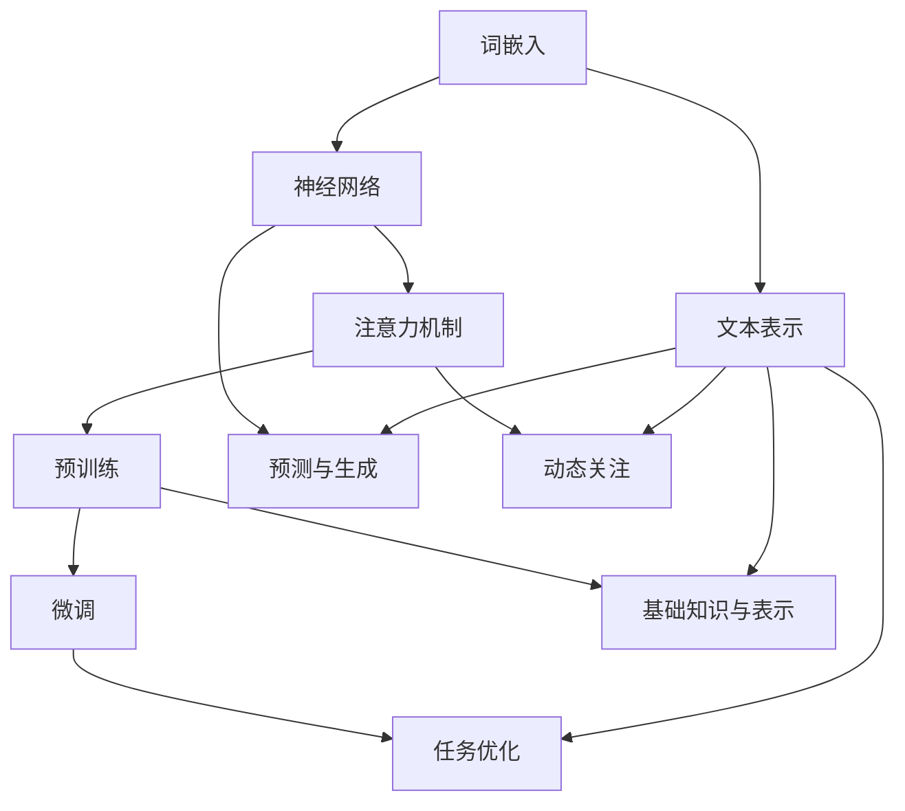

                 

## 文章标题：大语言模型的应用前景

大语言模型作为自然语言处理（NLP）领域的重要工具，近年来在全球范围内迅速崛起，并在诸多应用场景中展现了巨大的潜力和价值。从最初的语言模型基础、技术原理，到大规模预训练模型的训练与优化，再到其在自然语言处理、交互式应用和企业级平台中的实际应用，大语言模型正逐渐成为推动技术进步和创新的重要力量。

本文旨在通过系统性地分析大语言模型的基础知识、技术原理和应用前景，帮助读者全面了解这一领域的前沿动态和发展趋势。文章将首先回顾大语言模型的发展历史，介绍其基本原理和主流模型，然后深入探讨深度学习与自然语言处理技术，以及大规模预训练模型的工作原理。接下来，我们将详细解析大语言模型的核心算法，包括数学模型、训练过程和注意力机制。随后，文章将讨论大语言模型的训练与优化方法，以及其在自然语言处理、交互式应用和企业级平台中的具体应用案例。最后，我们将展望大语言模型的未来发展趋势，探讨其在教育、医疗等新兴领域的应用前景，并分析其对社会发展的潜在影响。通过本文的阅读，读者将能够系统地掌握大语言模型的核心知识和应用实践，为未来的研究和实践奠定坚实基础。

### 文章关键词

- 大语言模型
- 预训练模型
- 自然语言处理
- 深度学习
- 应用前景
- 交互式应用
- 企业级平台

### 文章摘要

本文将全面探讨大语言模型的应用前景。首先，我们将回顾大语言模型的发展历史，介绍其基本原理和主流模型。接着，深入分析大语言模型的技术基础，包括深度学习与自然语言处理技术，以及大规模预训练模型的工作原理。本文还将详细解析大语言模型的核心算法，如数学模型、训练过程和注意力机制。随后，我们将讨论大语言模型的训练与优化方法，并探讨其在自然语言处理、交互式应用和企业级平台中的具体应用案例。最后，我们将展望大语言模型的未来发展趋势，探讨其在教育、医疗等新兴领域的应用前景，并分析其对社会发展的潜在影响。

### 第一部分：大语言模型基础

#### 第1章：大语言模型概述

### 1.1 大语言模型的发展历史

大语言模型的发展历程可以追溯到20世纪50年代，当时科学家们开始研究如何让计算机理解和生成人类语言。最初的尝试主要集中在规则驱动的语言处理方法上，例如上下文无关文法（CFG）和词汇语法（VCFG）。然而，这些方法在面对复杂语言现象时显得力不从心。

进入20世纪90年代，统计语言模型开始崭露头角。其中，N-gram模型是最具代表性的早期统计模型之一。N-gram模型通过计算词语序列的概率，预测下一个词语。这一方法在一定程度上提高了语言生成的准确性，但仍存在许多局限性，如无法捕捉长期依赖关系。

2000年代初期，基于神经网络的深度学习开始应用于自然语言处理领域。Rumelhart等人（1986）提出的反向传播算法（Backpropagation）为神经网络训练提供了有效的途径。随后，循环神经网络（RNN）及其变种长短期记忆网络（LSTM）和门控循环单元（GRU）逐渐成为语言模型的主要架构。

2018年，谷歌提出了Transformer模型，彻底改变了语言模型的训练和生成方式。Transformer模型引入了自注意力机制，使得模型能够捕捉长距离依赖关系，显著提升了语言生成的质量和效率。这一模型的成功标志着大语言模型时代的到来。

近年来，随着计算能力和数据资源的不断提升，大模型如GPT-3、BERT等相继问世，进一步推动了自然语言处理技术的发展。这些大模型通过大规模预训练和精细调整，在多种语言任务中达到了前所未有的效果，如文本分类、机器翻译、问答系统等。

### 1.2 大语言模型的基本原理

大语言模型的基本原理基于深度学习和自然语言处理的最新技术。首先，我们需要了解几个核心概念：

1. **词嵌入（Word Embedding）**：词嵌入是将词汇映射到高维向量空间的一种方法，使得相似词汇在向量空间中接近。词嵌入技术能够提高语言模型对语义信息的理解能力。

2. **神经网络（Neural Network）**：神经网络是一种模拟生物神经系统的计算模型，由大量相互连接的神经元组成。在语言模型中，神经网络通过学习输入和输出之间的映射关系，实现语言理解和生成。

3. **注意力机制（Attention Mechanism）**：注意力机制是一种让模型在处理序列数据时，能够关注关键部分而忽略无关部分的方法。在Transformer模型中，自注意力机制和交叉注意力机制被广泛应用，显著提升了模型的性能。

4. **预训练与微调（Pre-training and Fine-tuning）**：预训练是指在大规模语料库上进行初始训练，使模型具备一定的语言理解能力。微调是在预训练的基础上，针对具体任务进行细粒度调整，以优化模型在特定任务上的表现。

大语言模型的基本工作原理可以分为两个阶段：预训练和微调。预训练阶段通常使用自监督学习方法，如掩码语言模型（MLM）和句子排序（Masked Language Model and Sentence Order Prediction）。这些方法通过随机掩码输入中的部分词汇或句子，使模型学习预测被掩码的词汇或句子。预训练阶段的目标是让模型具备强大的语言理解能力，从而在多种任务中表现出色。

微调阶段则是在预训练的基础上，针对特定任务进行训练。例如，在文本分类任务中，模型会学习将文本映射到相应的类别标签。微调阶段通过利用少量标注数据，使模型在特定任务上达到最佳效果。

### 1.3 主流大语言模型简介

近年来，随着大模型技术的不断进步，多个主流大语言模型相继问世，其中最具代表性的包括GPT系列模型、BERT及其变体以及其他知名大模型。以下是对这些模型的简要介绍：

#### 1.3.1 GPT系列模型

GPT（Generative Pre-trained Transformer）系列模型是OpenAI开发的一系列大型预训练语言模型。GPT-1（2018）是第一个公开的GPT模型，其核心思想是基于Transformer架构进行大规模预训练。GPT-2（2019）在GPT-1的基础上进一步提升了模型规模和性能，通过自回归语言模型（Autoregressive Language Model）实现了高质量的语言生成。GPT-3（2020）是GPT系列的最大规模模型，拥有1750亿个参数，通过引入更复杂的注意力机制和预训练策略，实现了更出色的语言理解和生成能力。GPT-3不仅能够在各种NLP任务中取得优异表现，还能够生成高质量的文本、代码和音乐等。

#### 1.3.2 BERT及其变体

BERT（Bidirectional Encoder Representations from Transformers）是谷歌开发的一种双向Transformer模型，旨在捕捉输入文本的上下文信息。BERT通过在大量文本语料库上进行预训练，使模型能够理解词汇在不同语境下的含义。BERT有两个关键变体：BERT-Base和BERT-Large。BERT-Base包含110M个参数，而BERT-Large则包含340M个参数。此外，谷歌还推出了RoBERTa、ALBERT等基于BERT的改进模型，这些模型通过优化预训练策略和模型结构，进一步提升了BERT的性能。BERT及其变体在文本分类、问答系统、命名实体识别等任务中表现出色。

#### 1.3.3 其他知名大模型介绍

除了GPT和BERT系列模型，还有许多其他知名的大语言模型。例如：

- **T5（Text-To-Text Transfer Transformer）**：由DeepMind开发的一种统一模型框架，旨在解决各种文本生成任务。T5通过将不同任务转化为统一的文本到文本格式，实现了跨任务的模型复用。

- **TorchBERT（DeiT）**：由Facebook AI研究院开发的一种基于PyTorch的BERT变种，通过自适应的图像预处理模块，实现了图像文本联合嵌入。

- **Ctrl（Controlled Language Generation）**：由斯坦福大学开发的一种控制性语言生成模型，通过在训练过程中引入控制性文本，使模型能够生成遵循特定规则和要求的文本。

- **GShard**：由微软研究院开发的一种分布式训练的大模型，通过并行化训练策略，实现了在有限硬件资源下训练大规模语言模型。

这些大模型在各自的领域内取得了显著的进展，为自然语言处理技术的发展和应用提供了有力的支持。

### 1.4 大语言模型的应用领域

大语言模型在多个领域展现出了强大的应用潜力，以下是几个主要的应用领域：

#### 1.4.1 自然语言处理应用

自然语言处理（NLP）是大语言模型最典型的应用领域之一。在大规模预训练模型的支持下，NLP任务如文本分类、情感分析、命名实体识别、机器翻译等取得了显著进展。例如，GPT系列模型在生成高质量文本方面表现出色，BERT及其变体在文本理解和处理任务中具有优异的性能。通过引入大语言模型，NLP系统能够更好地理解和生成人类语言，为各种实际应用场景提供了强大的支持。

#### 1.4.2 语言生成与创作应用

大语言模型在语言生成与创作领域也取得了显著成果。例如，GPT-3能够生成高质量的文章、故事、诗歌等。此外，大语言模型还可以用于生成代码、音乐和图像描述等。这些应用不仅丰富了语言模型的应用场景，也为创意和内容生成提供了新的工具和平台。

#### 1.4.3 交互式应用

大语言模型在交互式应用中具有广泛的应用前景。例如，聊天机器人、虚拟助手和智能客服系统等。这些应用通过语言模型能够实现自然、流畅的人机交互，为用户提供便捷、高效的服务。大语言模型在语义理解、上下文处理和对话生成等方面具有显著优势，为交互式应用的发展提供了重要支撑。

通过以上分析，我们可以看出大语言模型在自然语言处理、语言生成与创作以及交互式应用等领域具有广泛的应用前景。随着技术的不断进步和应用的深入，大语言模型将在更多领域发挥重要作用，推动人工智能技术的发展和普及。

#### 第2章：大语言模型技术基础

在深入探讨大语言模型的应用前景之前，我们需要了解其背后的技术基础。这一章节将介绍深度学习与神经网络的基础知识，自然语言处理技术的概览，以及大规模预训练模型的工作原理。这些技术构成了大语言模型的基石，理解它们有助于我们更好地掌握大语言模型的核心概念和应用。

### 2.1 深度学习与神经网络基础

#### 2.1.1 神经网络的基本结构

神经网络（Neural Network，NN）是一种模仿生物神经系统的计算模型。一个基本的神经网络由输入层、隐藏层和输出层组成。每个神经元（或节点）都与其他神经元通过加权连接连接，形成一个复杂的网络结构。

1. **输入层（Input Layer）**：输入层接收外部输入数据，每个输入数据对应一个神经元。

2. **隐藏层（Hidden Layer）**：隐藏层位于输入层和输出层之间，可以有一个或多个隐藏层。每个隐藏层的神经元通过激活函数对输入数据进行处理，并传递给下一层。

3. **输出层（Output Layer）**：输出层产生最终输出，通常是一个或多个神经元，用于预测或分类。

#### 2.1.2 常见的深度学习架构

深度学习（Deep Learning，DL）是神经网络的一种扩展，其核心思想是通过训练多层神经网络来提取数据的深层特征。以下是一些常见的深度学习架构：

1. **卷积神经网络（Convolutional Neural Network，CNN）**：CNN主要用于图像处理任务。其核心组件是卷积层（Convolutional Layer），通过局部感知野（local receptive fields）提取图像特征。

2. **循环神经网络（Recurrent Neural Network，RNN）**：RNN适用于序列数据，如时间序列、文本等。其关键特点是能够在序列的每个时间步上保持内部状态，从而捕捉序列中的长期依赖关系。

3. **长短时记忆网络（Long Short-Term Memory，LSTM）**：LSTM是RNN的一种改进，通过引入门控机制（gate mechanism）来控制信息的流动，有效解决了RNN的梯度消失问题。

4. **门控循环单元（Gated Recurrent Unit，GRU）**：GRU是LSTM的另一种变体，通过简化门控机制来提高计算效率。

5. **Transformer模型**：Transformer模型是近年来在自然语言处理领域取得突破性进展的一种新型架构。其核心思想是引入自注意力机制（Self-Attention）和多头注意力（Multi-Head Attention），能够有效捕捉长距离依赖关系。

#### 2.1.3 深度学习优化算法

深度学习模型的训练过程本质上是一个优化问题，其目标是找到一组权重，使得模型的预测输出与实际输出之间的误差最小。以下是一些常见的深度学习优化算法：

1. **梯度下降（Gradient Descent）**：梯度下降是最基本的优化算法，通过迭代更新模型权重，使其接近最优解。其核心思想是沿梯度的反方向调整权重，以最小化损失函数。

2. **随机梯度下降（Stochastic Gradient Descent，SGD）**：SGD是对梯度下降的一种改进，每次迭代只随机选择部分样本进行梯度计算和权重更新，从而提高训练效率。

3. **Adam优化算法**：Adam是一种基于自适应学习率的优化算法，结合了SGD和动量法的优点，在训练深度神经网络时表现出色。

### 2.2 自然语言处理技术概览

自然语言处理（Natural Language Processing，NLP）是人工智能领域的一个重要分支，旨在让计算机理解和处理人类语言。以下是一些关键的NLP技术：

#### 2.2.1 词嵌入技术

词嵌入（Word Embedding）是将词汇映射到高维向量空间的一种方法，使相似词汇在向量空间中接近。常见的词嵌入方法包括：

1. **Word2Vec**：Word2Vec是一种基于神经网络的词嵌入方法，通过训练神经网络来预测单词的上下文，从而生成词向量。

2. **GloVe（Global Vectors for Word Representation）**：GloVe是一种基于全局统计信息的词嵌入方法，通过计算词语之间的余弦相似度来生成词向量。

#### 2.2.2 序列模型与注意力机制

序列模型（Sequence Model）是NLP中用于处理序列数据的常用模型，如RNN、LSTM和GRU。这些模型通过捕捉序列中的时间依赖关系，实现了对文本的有效表示和处理。

注意力机制（Attention Mechanism）是一种让模型在处理序列数据时，能够关注关键部分而忽略无关部分的方法。在自然语言处理中，注意力机制广泛应用于文本分类、机器翻译、问答系统等任务。

1. **自注意力机制（Self-Attention）**：自注意力机制是Transformer模型的核心组件，通过计算输入序列中每个词与其他词之间的关联性，实现了对文本的深入理解。

2. **交叉注意力机制（Cross-Attention）**：交叉注意力机制用于编码器-解码器（Encoder-Decoder）架构，通过同时关注编码器输出和解码器输入，实现了高效的信息传递和文本生成。

#### 2.2.3 转换器架构详解

转换器架构（Transformer Architecture）是近年来在NLP领域取得突破性进展的一种新型架构。其核心思想是引入自注意力机制和多头注意力，实现了对长距离依赖关系的有效捕捉。

1. **编码器（Encoder）**：编码器负责处理输入序列，通过自注意力机制生成一系列上下文表示。编码器的输出作为解码器的输入。

2. **解码器（Decoder）**：解码器负责生成输出序列，通过交叉注意力机制与编码器输出进行交互，实现了对输入序列的深层理解和生成。

3. **多模态输入处理**：Transformer模型还可以扩展到多模态输入处理，如文本和图像的联合嵌入，进一步提升了模型的表示能力和应用范围。

### 2.3 大规模预训练模型原理

大规模预训练模型（Large-scale Pre-trained Model）是近年来NLP领域的重要突破，其核心思想是通过在大量未标注的语料库上进行预训练，使模型具备强大的语言理解和生成能力。

#### 2.3.1 预训练的概念与意义

预训练（Pre-training）是指在大规模语料库上进行训练，使模型在多个任务上获得基础知识和语言理解能力。预训练的意义在于：

1. **减少标注数据的需求**：通过预训练，模型可以在少量标注数据上进行微调，从而降低了数据标注的成本和时间。

2. **提高模型性能**：预训练使模型在多种任务上获得优秀的性能，显著提升了模型在特定任务上的表现。

3. **增强泛化能力**：预训练使模型能够更好地适应不同的任务和数据分布，提高了模型的泛化能力。

#### 2.3.2 自监督学习方法

自监督学习（Self-supervised Learning）是一种无需人工标注数据，利用输入数据本身的信息进行训练的方法。在自然语言处理中，自监督学习方法广泛应用于预训练阶段。

1. **掩码语言模型（Masked Language Model，MLM）**：MLM是一种典型的自监督学习方法，通过随机掩码输入中的部分词汇或句子，使模型学习预测被掩码的词汇或句子。

2. **句子排序（Sentence Order Prediction）**：句子排序是一种通过预测句子在文本中的顺序来训练模型的方法，使模型能够理解句子之间的逻辑关系。

3. **填空任务（Gap Filling Task）**：填空任务通过在文本中随机删除部分词汇，使模型学习预测被删除的词汇，从而提高模型的语言理解能力。

#### 2.3.3 迁移学习与微调技术

迁移学习（Transfer Learning）是一种将预训练模型的知识迁移到新任务上的方法。在自然语言处理中，迁移学习通过在预训练模型的基础上进行微调（Fine-tuning），使模型在新任务上快速适应。

1. **微调（Fine-tuning）**：微调是在预训练模型的基础上，针对特定任务进行训练，以优化模型在新任务上的表现。微调阶段通常使用少量标注数据，使模型在新任务上达到最佳效果。

2. **元学习（Meta-Learning）**：元学习是一种通过在多个任务上进行训练，使模型能够快速适应新任务的方法。在自然语言处理中，元学习通过学习任务之间的共性，提高了模型对新任务的适应能力。

通过以上分析，我们可以看出大规模预训练模型在NLP领域的重要作用。这些模型通过预训练和微调，使模型在多种任务上表现出色，为自然语言处理技术的发展和应用提供了强大的支持。

### 2.4 语言模型中的数学模型

在深入探讨大语言模型的核心算法之前，我们需要了解其背后的数学模型。这些数学模型包括概率论基础、最大似然估计、互信息和KL散度等，它们构成了大语言模型的理论基石，有助于我们更好地理解其工作原理。

#### 2.4.1 概率论基础

概率论是研究随机事件及其概率分布的数学分支，在大语言模型中起着至关重要的作用。以下是一些核心概念：

1. **随机变量（Random Variable）**：随机变量是一个能够取多个可能值的数学函数，其取值由随机试验的结果决定。

2. **概率分布（Probability Distribution）**：概率分布描述了随机变量在不同取值上的概率分布情况，常见的概率分布包括离散型和连续型概率分布。

3. **条件概率（Conditional Probability）**：条件概率是指在给定某个事件发生的条件下，另一个事件发生的概率。条件概率公式为：
   $$P(A|B) = \frac{P(A \cap B)}{P(B)}$$

4. **贝叶斯定理（Bayes' Theorem）**：贝叶斯定理是一种用于计算后验概率的公式，它描述了在已知某个条件概率和边缘概率的情况下，如何计算另一个条件概率。贝叶斯定理公式为：
   $$P(A|B) = \frac{P(B|A)P(A)}{P(B)}$$

5. **熵（Entropy）**：熵是衡量随机变量不确定性的一种度量，定义为：
   $$H(X) = -\sum_{i} P(X=x_i) \log P(X=x_i)$$

6. **信息增益（Information Gain）**：信息增益是衡量特征对分类贡献的一种度量，定义为：
   $$IG(D, A) = I(D) - I(D|A)$$
   其中，$I(D)$是数据的熵，$I(D|A)$是给定特征$A$后数据的熵。

#### 2.4.2 最大似然估计

最大似然估计（Maximum Likelihood Estimation，MLE）是一种用于估计模型参数的方法。其核心思想是找到一组参数，使得观测数据在模型下的概率最大。

1. **似然函数（Likelihood Function）**：似然函数是模型参数和观测数据之间的联合概率，定义为：
   $$L(\theta; x) = P(x|\theta)$$

2. **最大似然估计器（Maximum Likelihood Estimator，MLE）**：最大似然估计器是使似然函数达到最大值的参数估计器，定义为：
   $$\theta_{\text{MLE}} = \arg\max_{\theta} L(\theta; x)$$

3. **例子**：假设我们有一个二项分布模型，其中成功概率为$\theta$，观测数据为$x_1, x_2, ..., x_n$。二项分布的概率质量函数为：
   $$f(x|\theta) = C_n^x \theta^x (1-\theta)^{n-x}$$
   则最大似然估计器为：
   $$\theta_{\text{MLE}} = \frac{1}{n} \sum_{i=1}^{n} x_i$$

#### 2.4.3 互信息和KL散度

互信息（Mutual Information，MI）是一种衡量两个随机变量之间相关性的一种度量。其数学定义如下：

1. **互信息（Mutual Information）**：两个随机变量$X$和$Y$的互信息定义为：
   $$I(X; Y) = H(X) - H(X | Y)$$
   其中，$H(X)$是$X$的熵，$H(X | Y)$是$X$在$Y$条件下的熵。

2. **条件互信息（Conditional Mutual Information）**：条件互信息定义为：
   $$I(X; Y | Z) = H(X | Z) - H(X | Y, Z)$$

3. **互信息性质**：
   - 非负性：$I(X; Y) \geq 0$
   - 对称性：$I(X; Y) = I(Y; X)$
   - 切分性：$I(X; Y, Z) = I(X; Y) + I(X; Z | Y)$

KL散度（Kullback-Leibler Divergence，KL-Divergence）是另一种衡量两个概率分布之间差异的度量。其数学定义如下：

1. **KL散度（KL-Divergence）**：两个概率分布$P$和$Q$的KL散度定义为：
   $$D_{KL}(P || Q) = \sum_{x} P(x) \log \frac{P(x)}{Q(x)}$$

2. **性质**：
   - 非负性：$D_{KL}(P || Q) \geq 0$
   - 对称性：$D_{KL}(P || Q) = D_{KL}(Q || P)$
   - 不等式：$D_{KL}(P || Q) \leq 0$ 当且仅当 $P = Q$

通过以上数学模型，我们可以更好地理解大语言模型的工作原理。这些数学工具不仅帮助我们在理论层面解释模型的行为，还为模型的训练和优化提供了重要的指导。

### 2.5 语言模型的训练过程

语言模型的训练过程是其性能提升和实际应用的关键环节。在这一过程中，我们需要理解训练策略、优化算法以及如何调整批量大小和学习率。以下将详细探讨这些内容。

#### 2.5.1 梯度下降法

梯度下降法（Gradient Descent）是最常用的优化算法之一，其核心思想是通过迭代更新模型参数，以最小化损失函数。在语言模型的训练过程中，损失函数通常表示模型预测与实际输出之间的差距。

1. **基本形式**：梯度下降法的迭代公式为：
   $$\theta_{t+1} = \theta_t - \alpha \cdot \nabla_\theta J(\theta)$$
   其中，$\theta_t$是当前参数，$\alpha$是学习率（learning rate），$\nabla_\theta J(\theta)$是损失函数$J(\theta)$关于参数$\theta$的梯度。

2. **选择合适的初始参数**：初始参数的选择对训练过程有重要影响。通常需要通过预训练或随机初始化来选择初始参数。

3. **学习率的选择**：学习率是梯度下降法的关键参数，其大小直接影响训练的收敛速度。过小的学习率可能导致训练时间过长，而过大的学习率可能导致训练不稳定。常用的学习率调整策略包括固定学习率、自适应学习率（如AdaGrad、RMSprop和Adam）。

#### 2.5.2 随机梯度下降（SGD）

随机梯度下降（Stochastic Gradient Descent，SGD）是梯度下降法的一种变种，其每次迭代只使用一个样本的梯度进行更新。这相比批量梯度下降（Batch Gradient Descent）能够加速训练过程，但可能导致更不稳定的结果。

1. **迭代公式**：SGD的迭代公式为：
   $$\theta_{t+1} = \theta_t - \alpha \cdot \nabla_{\theta} J(\theta; x_t, y_t)$$
   其中，$x_t$和$y_t$是当前训练样本及其标签。

2. **优点**：
   - 加速训练过程：由于每次迭代只需处理一个样本，SGD能够更快地更新模型参数。
   - 避免局部最小值：SGD的随机性有助于避免陷入局部最小值。

3. **缺点**：
   - 不稳定：SGD的更新过程容易受到噪声影响，可能导致训练结果不稳定。

#### 2.5.3 Adam优化算法

Adam（Adaptive Moment Estimation）是一种结合了SGD和RMSprop优点的自适应优化算法，通过跟踪一阶和二阶矩估计，能够自适应调整学习率。

1. **迭代公式**：
   $$m_t = \beta_1 m_{t-1} + (1 - \beta_1) [g_t]$$
   $$v_t = \beta_2 v_{t-1} + (1 - \beta_2) [g_t^2]$$
   $$\theta_{t+1} = \theta_t - \alpha \cdot \frac{m_t}{\sqrt{v_t} + \epsilon}$$
   其中，$m_t$和$v_t$分别是当前梯度的一阶和二阶矩估计，$\beta_1$和$\beta_2$分别是动量参数，$\alpha$是学习率，$\epsilon$是正则项。

2. **优点**：
   - 自适应学习率：Adam能够根据梯度的一阶和二阶矩估计动态调整学习率，提高训练稳定性。
   - 快速收敛：Adam在大多数情况下能够比SGD和RMSprop更快地收敛。

3. **缺点**：
   - 需要额外的计算：Adam需要计算一阶和二阶矩估计，相比SGD和RMSprop有一定额外的计算开销。

#### 2.5.4 批量大小与学习率调整

批量大小（Batch Size）和学习率是影响语言模型训练过程的重要因素。以下是一些常见的策略：

1. **批量大小**：
   - 小批量（Mini-batch）：每个迭代使用多个样本进行更新，能够提高训练过程的稳定性。常用的批量大小包括32、64、128等。
   - 大批量：每个迭代使用所有样本进行更新，能够提高训练效率，但可能导致梯度计算误差。

2. **学习率调整**：
   - 固定学习率：初始学习率较高，随着训练过程逐渐减小。
   - 自适应学习率：使用如Adam等自适应优化算法，自动调整学习率。
   - 步长衰减（Step Decay）：按固定比例逐渐减小学习率。

3. **常见策略**：
   - 冒泡法（Bubble Schedule）：在每个训练阶段逐渐增加批量大小，并按固定比例减小学习率。
   - 彩带法（Tanh Schedule）：使用tanh函数调整学习率，使其逐渐减小。
   - 学习率预热（Learning Rate Warmup）：初始阶段使用较小的学习率，逐渐增加到预设值。

通过以上策略，我们可以优化语言模型的训练过程，提高其性能和稳定性。

### 2.6 语言模型中的注意力机制

注意力机制（Attention Mechanism）是近年来在自然语言处理（NLP）领域中取得重大突破的关键技术。它通过动态分配计算资源，使模型能够关注输入序列中的关键部分，从而提高语言理解的精度和效率。注意力机制在多种任务中得到了广泛应用，如机器翻译、文本摘要、问答系统等。

#### 3.1.1 注意力机制概述

注意力机制的基本思想是将输入序列中的每个元素赋予不同的权重，从而在处理过程中突出关键信息。注意力机制的数学表达形式通常为：

$$
\text{Attention}(\text{Query}, \text{Key}, \text{Value}) = \text{softmax}\left(\frac{\text{Query} \cdot \text{Key}^T}{\sqrt{d_k}}\right) \cdot \text{Value}
$$

其中，Query、Key和Value分别表示查询、键和值，它们都是向量的形式。通过计算Query与所有Key的相似度，得到一个权重向量，然后与Value相乘，得到加权后的输出。

#### 3.1.2 自注意力机制

自注意力机制（Self-Attention）是Transformer模型的核心组件，它使模型能够在输入序列内部进行动态交互。自注意力机制分为单头注意力和多头注意力。

1. **单头注意力（Singular Head Attention）**：
   $$\text{Attention}(Q, K, V) = \text{softmax}\left(\frac{QK^T}{\sqrt{d_k}}\right)V$$

2. **多头注意力（Multi-Head Attention）**：
   多头注意力通过多个独立的单头注意力机制并行处理输入序列，并在输出中聚合信息。通常，多头注意力将输入序列拆分为多个子序列，每个子序列通过单头注意力机制进行处理，然后将结果进行拼接和线性变换。

   $$\text{Multi-Head Attention}(Q, K, V) = \text{Concat}(\text{head}_1, ..., \text{head}_h)W_O$$
   $$\text{where } \text{head}_i = \text{Attention}(QW_Q^i, KW_K^i, VW_V^i)$$

   其中，$W_Q^i, W_K^i, W_V^i$是权重矩阵，$W_O$是线性变换权重。

#### 3.1.3 交叉注意力机制

交叉注意力机制（Cross-Attention）用于编码器-解码器（Encoder-Decoder）架构，通过同时关注编码器输出和解码器输入，实现高效的信息传递。

1. **编码器到解码器的交叉注意力**：
   交叉注意力机制使解码器在生成每个词时，能够根据编码器输出选择关键信息。其数学表达形式为：

   $$\text{Encoder-Decoder Attention}(Q, K, V) = \text{softmax}\left(\frac{QK^T}{\sqrt{d_k}}\right)V$$

2. **解码器到编码器的交叉注意力**：
   解码器到编码器的交叉注意力机制使解码器能够根据自身之前生成的文本与编码器输出进行交互，实现上下文信息的反馈。

通过以上分析，我们可以看出注意力机制在大语言模型中的关键作用。自注意力机制和交叉注意力机制使模型能够有效捕捉输入序列中的长距离依赖关系，提高了语言理解和生成的能力。这些机制不仅推动了NLP技术的进步，也为其他领域如计算机视觉和语音处理提供了新的思路。

### 2.7 大语言模型的训练方法

大语言模型的训练是一个复杂且计算密集的过程，涉及多个关键步骤和技术细节。以下将详细探讨大语言模型的训练方法，包括数据预处理、训练策略以及批量大小和学习率调整。

#### 2.7.1 数据预处理

数据预处理是训练大语言模型的基础环节，其目的是将原始数据转换为适合模型训练的格式。以下是数据预处理的主要步骤：

1. **文本清洗**：去除数据中的无关信息，如HTML标签、特殊字符和停用词。停用词是频繁出现但在语义上不重要的词，如“的”、“是”、“和”等。

2. **分词**：将文本分解为单词或子词。分词方法包括基于词典的分词和基于统计的方法，如最长匹配、词性标注等。

3. **词嵌入**：将文本中的单词映射为高维向量，常见的方法包括Word2Vec、GloVe和BERT。词嵌入有助于提高模型对语义信息的理解能力。

4. **数据增强**：通过多种方法增加训练数据的多样性，如随机插入、替换、删除单词等。数据增强有助于提升模型的泛化能力。

5. **数据归一化**：对文本数据中的数字和符号进行标准化处理，如将日期格式统一、将货币符号转换为数值等。

#### 2.7.2 训练策略

训练策略决定了模型在训练过程中如何优化参数，以达到最佳性能。以下是几个关键的训练策略：

1. **多任务学习**：在训练过程中同时处理多个任务，如文本分类、命名实体识别和问答系统。多任务学习有助于模型在多个任务上共享知识和资源，提高整体性能。

2. **分层训练**：将训练过程分为多个阶段，逐步增加模型的复杂性。首先训练基础模型，然后逐步增加层�数和参数规模，以避免过拟合。

3. **对抗训练**：通过添加噪声和对抗性样本，使模型在训练过程中更加健壮，提高其对异常数据的鲁棒性。

4. **动态学习率调整**：根据训练过程中的损失函数和梯度信息动态调整学习率。常用的调整方法包括指数衰减、线性衰减和自适应学习率算法（如Adam）。

5. **权重共享**：在多任务学习中，通过共享部分或全部模型权重，减少参数数量和计算开销，提高训练效率。

#### 2.7.3 批量大小与学习率调整

批量大小（Batch Size）和学习率（Learning Rate）是影响训练过程的重要因素。以下是对这两个参数的调整策略：

1. **批量大小**：
   - **小批量**：每个迭代使用较少的样本进行更新，有助于减少梯度噪声，提高训练稳定性。但小批量可能导致训练时间延长。
   - **大批量**：每个迭代使用所有样本进行更新，可以提高训练速度，但可能导致梯度计算误差和内存占用增加。

2. **学习率**：
   - **初始学习率**：初始学习率应设置得较高，以便快速收敛。但过高可能导致模型在早期阶段发生过拟合。
   - **学习率衰减**：随着训练进行，逐渐减小学习率，以避免模型在训练后期出现过拟合。常用的衰减方法包括指数衰减、线性衰减和余弦衰减。
   - **自适应学习率**：使用如Adam等自适应优化算法，根据梯度信息动态调整学习率，提高训练稳定性。

3. **常见策略**：
   - **阶梯式批量大小调整**：初始阶段使用小批量，随着模型收敛逐步增加批量大小，以提高训练速度。
   - **动态批量大小调整**：根据训练过程的性能指标（如验证集准确率）动态调整批量大小，以优化模型性能。

通过以上策略，我们可以优化大语言模型的训练过程，提高其性能和泛化能力。合理的训练策略不仅有助于提升模型在特定任务上的表现，也为实际应用提供了可靠的支持。

### 2.8 大规模模型的训练优化

随着大语言模型的规模不断扩大，其训练和优化过程变得愈发复杂和耗时。为了提高训练效率，降低计算资源消耗，大规模模型的训练优化成为了研究的热点。以下将介绍几种常用的优化方法，包括并行训练技术、分布式训练策略和模型剪枝与量化。

#### 2.8.1 并行训练技术

并行训练技术通过将计算任务分布到多个处理器或GPU上，提高训练速度和效率。以下是几种常见的并行训练方法：

1. **数据并行（Data Parallelism）**：数据并行是将训练数据分成多个子集，每个子集由不同的GPU处理。每个GPU独立计算梯度，然后通过参数服务器或通信库（如NCCL）进行梯度聚合。数据并行可以显著加速训练过程，但需要解决通信和同步问题。

2. **模型并行（Model Parallelism）**：模型并行是将大型模型拆分成多个部分，每个部分运行在不同的GPU或设备上。模型并行适用于处理模型中数据量巨大的部分，如大型神经网络中的中间层。通过将模型分布在多个设备上，可以减少单个设备上的计算压力。

3. **流水线并行（Pipeline Parallelism）**：流水线并行是将训练过程划分为多个阶段，每个阶段在不同的GPU上独立执行。这种并行方法适用于具有固定顺序的计算任务，如前向传播、反向传播和权重更新。通过流水线并行，可以充分利用GPU的计算资源，提高整体训练效率。

#### 2.8.2 分布式训练策略

分布式训练策略通过在多个计算节点上并行训练模型，进一步提高训练速度和扩展性。以下是一些常见的分布式训练方法：

1. **参数服务器架构（Parameter Server Architecture）**：参数服务器架构通过一个中心化的参数服务器存储和管理模型参数，训练节点通过梯度聚合和参数同步更新模型。这种架构适用于大规模分布式训练，但需要处理通信开销和同步延迟。

2. **All-Reduce算法**：All-Reduce算法是一种用于分布式梯度聚合的算法，通过将所有训练节点的梯度聚合到全局梯度，然后平均分配回每个节点。All-Reduce算法具有较低的通信开销和较高的并行度，适用于大规模分布式训练。

3. **流水线分布式训练**：流水线分布式训练将训练过程分为多个阶段，每个阶段在不同的计算节点上独立执行。通过流水线分布式训练，可以充分利用不同节点的计算资源，提高训练速度和扩展性。

#### 2.8.3 模型剪枝与量化

模型剪枝与量化是减少模型参数数量和计算资源消耗的有效方法，有助于提高模型的可扩展性和部署效率。以下是一些常见的模型剪枝与量化方法：

1. **模型剪枝（Model Pruning）**：模型剪枝通过删除模型中的冗余参数，减少模型规模。常见的剪枝方法包括权重剪枝、结构剪枝和混合剪枝。权重剪枝通过设置阈值删除权重较小的参数，结构剪枝通过删除整个神经网络层或节点，混合剪枝结合了权重剪枝和结构剪枝的优点。

2. **量化（Quantization）**：量化通过将模型参数和激活值从浮点数转换为低精度整数，降低计算资源和内存占用。常见的量化方法包括逐层量化、逐点量化、混合量化等。量化有助于提高模型的运行速度和部署效率，但可能影响模型的性能。

3. **混合训练（Mixed Precision Training）**：混合精度训练通过将模型的某些部分使用较低的精度（如16位浮点数），同时保留关键部分的高精度（如32位浮点数），以降低计算资源消耗。混合精度训练在保持模型性能的同时，显著提高了训练速度。

通过并行训练技术、分布式训练策略和模型剪枝与量化，我们可以优化大规模模型的训练过程，提高其训练效率和部署效率。这些方法不仅有助于解决大规模模型的计算资源瓶颈，也为实际应用提供了可靠的技术支持。

### 2.9 大语言模型的可解释性

大语言模型，尤其是预训练的大型神经网络，被广泛应用于各种自然语言处理任务中，但它们的内部工作机制相对复杂，难以直观理解。这种缺乏透明度的特性，使得模型在特定情况下可能产生不合理的结果，进而引发了关于模型可解释性的讨论。可解释性（Explainability）是指理解和解释模型决策过程的能力，对于增强用户信任、改进模型设计和提高实际应用效果具有重要意义。

#### 4.3.1 可解释性的重要性

可解释性在多个层面上具有重要性：

1. **用户信任**：用户在使用基于AI的系统时，往往需要了解系统的工作原理和决策依据。如果模型决策过程不透明，用户可能会对系统的可靠性产生怀疑。

2. **模型改进**：通过理解模型的工作机制，研究人员可以识别潜在的问题和改进空间，从而优化模型结构和算法。

3. **法规遵从**：在某些应用领域，如金融、医疗和司法，模型的决策过程需要遵守严格的法规和伦理标准，可解释性是确保合规性的关键。

4. **安全与隐私**：可解释性有助于发现潜在的安全漏洞和隐私风险，从而采取相应的防护措施。

#### 4.3.2 解释性方法

目前，研究者们提出了多种方法来提升大语言模型的可解释性，以下是一些主要方法：

1. **可视化技术**：通过可视化模型内部的权重、激活值和梯度等信息，帮助理解模型如何处理输入数据。例如，热力图（Heatmaps）可以显示模型在处理特定文本时关注的部分。

2. **特征提取**：提取模型中重要的特征表示，分析这些特征与输入文本之间的关系。特征提取方法包括LIME（Local Interpretable Model-agnostic Explanations）和SHAP（SHapley Additive exPlanations）等。

3. **注意力机制分析**：利用注意力机制，分析模型在处理输入数据时关注的区域和关键部分。注意力权重可以揭示模型在决策过程中的关注点。

4. **模型简化**：通过简化模型结构或提取关键子网络，降低模型的复杂性，使其更容易理解。简化后的模型可能在某些任务上损失一些性能，但提高了可解释性。

5. **案例分析**：通过具体案例研究，分析模型在特定任务中的决策过程，解释模型为什么做出特定决策。案例分析有助于揭示模型的优势和局限性。

#### 4.3.3 应用案例分析

以下是一些大语言模型可解释性的实际应用案例：

1. **文本分类**：通过分析模型在文本分类任务中的决策过程，理解模型如何将不同类别的文本区分开来。例如，在情感分析中，模型关注的是文本中的情感词汇和情感强度，从而做出分类决策。

2. **机器翻译**：通过分析模型在机器翻译任务中的注意力权重，揭示模型在翻译过程中关注的源语言和目标语言部分，以及如何将这些部分组合成流畅的翻译结果。

3. **问答系统**：通过可视化模型在问答系统中的注意力分布，理解模型如何从输入问题中提取关键信息，并从知识库中检索相关答案。

通过这些案例，我们可以看到大语言模型的可解释性在实际应用中的重要作用。提高模型的可解释性不仅有助于用户理解和信任模型，也为模型改进和优化提供了有力支持。

### 第三部分：大语言模型的应用场景

#### 第5章：大语言模型在自然语言处理中的应用

大语言模型在自然语言处理（NLP）领域展现出了强大的应用潜力。本章节将详细介绍大语言模型在文本分类与情感分析、机器翻译与语言生成、问答系统与对话生成等具体应用场景中的表现，并分析其优势和应用实践。

#### 5.1 文本分类与情感分析

文本分类与情感分析是NLP中的基本任务，通过将文本数据分为不同的类别或判断其情感倾向，为信息过滤、舆情监控和个性化推荐等应用提供支持。大语言模型在这些任务中具有显著优势：

1. **任务效果显著提升**：大语言模型通过预训练获得了丰富的语言知识，使其在文本分类与情感分析任务中表现出色。例如，BERT和GPT-3等大模型在多个公开数据集上的性能均超越了传统的文本分类算法。

2. **多标签分类能力**：大语言模型能够处理多标签分类任务，即一个文本可能同时属于多个类别。这种能力在现实应用中尤为重要，如新闻分类、社交媒体内容标签等。

3. **细粒度情感分析**：大语言模型能够识别文本中的细粒度情感，如高兴、愤怒、悲伤等。这有助于提高情感分析的精度和实用性，为情感营销、客户关系管理等领域提供有力支持。

**实践案例**：
- **社交媒体舆情监控**：通过大语言模型对社交媒体平台上的用户评论进行情感分析，企业可以实时了解消费者对产品或服务的反馈，及时调整营销策略和产品开发方向。
- **新闻分类**：利用大语言模型对新闻文本进行分类，可以帮助新闻平台自动化新闻推荐，提高用户体验和满意度。

#### 5.2 机器翻译与语言生成

机器翻译和语言生成是大语言模型在NLP中的另一重要应用场景。大模型在机器翻译中的表现显著提升了翻译质量，而在语言生成方面，则展示了丰富的创造力。

1. **机器翻译**：大语言模型通过大规模预训练和精细调整，实现了高质量的双语翻译。例如，GPT-3和BERT等模型在机器翻译任务中表现优异，能够生成流畅且自然的翻译文本。

2. **语言生成**：大语言模型能够根据输入文本生成高质量的文章、故事、诗歌等。GPT-3尤为突出，其生成文本的质量和多样性令人惊叹。

3. **代码生成**：大语言模型还可以生成计算机代码，这在编程辅助和自动化开发中具有广泛应用。通过大模型，开发者可以快速生成高质量的代码框架和实现细节，提高开发效率。

**实践案例**：
- **机器翻译服务**：利用大语言模型提供的机器翻译服务，企业可以实现全球化运营，打破语言障碍，拓展国际市场。
- **内容生成平台**：通过大语言模型，内容创作者可以快速生成高质量的文章、故事等，提高创作效率和内容多样性。

#### 5.3 问答系统与对话生成

问答系统和对话生成是大语言模型在交互式应用中的重要应用。大模型在这些任务中通过理解上下文和生成连贯的自然语言，为用户提供高质量的问答和对话体验。

1. **问答系统**：大语言模型能够理解和回答复杂的问题，为用户提供了便捷的查询服务。例如，通过大模型构建的问答系统可以回答用户关于产品信息、服务指南等方面的问题。

2. **对话生成**：大语言模型能够与用户进行自然、流畅的对话，提供个性化的交互体验。例如，聊天机器人和虚拟助手通过大模型实现了智能对话，能够处理用户的不同查询和需求。

3. **对话管理**：大模型在对话生成任务中，需要处理上下文信息，保持对话的连贯性和一致性。这要求模型具备较强的语义理解和上下文记忆能力。

**实践案例**：
- **智能客服系统**：企业通过大语言模型构建智能客服系统，能够自动处理大量用户查询，提高客服效率和用户体验。
- **虚拟助手**：通过大语言模型，虚拟助手能够理解用户的指令，提供个性化的服务和建议，如日程管理、购物推荐等。

综上所述，大语言模型在自然语言处理领域具有广泛的应用前景。通过在文本分类与情感分析、机器翻译与语言生成、问答系统与对话生成等任务中的实际应用，大模型不仅提升了任务效果，也为各行业提供了创新的解决方案。随着技术的不断进步和应用场景的不断拓展，大语言模型将在更多领域发挥重要作用。

### 第6章：大语言模型在交互式应用中的实践

大语言模型在交互式应用中展现了其强大的能力和广泛的应用前景。本章节将重点介绍大语言模型在聊天机器人、虚拟助手和智能客服系统等领域的实际应用，通过具体案例展示这些应用如何解决实际问题，并提供技术实现和效果评估。

#### 6.1 聊天机器人

聊天机器人（Chatbot）是一种通过自然语言交互为用户提供服务的系统。大语言模型在聊天机器人中发挥着关键作用，能够实现智能对话和上下文理解。

**技术实现**：

1. **对话管理**：聊天机器人需要处理用户的输入，并生成合适的回复。大语言模型通过预训练和微调，能够理解用户的查询，并生成连贯的回复。常用的方法包括基于Transformer的编码器-解码器架构，如BERT和GPT-3。

2. **上下文处理**：为了实现自然流畅的对话，聊天机器人需要记住上下文信息。大语言模型通过自注意力机制和上下文嵌入，能够有效地捕捉和利用对话历史，提高对话的连贯性。

**案例**：

1. **客服聊天机器人**：某大型电商平台使用大语言模型构建了客服聊天机器人，能够自动处理用户关于订单状态、退换货、支付等问题。机器人通过分析用户输入，快速提供准确的答案，显著提高了客服效率和用户满意度。

2. **客户支持**：某科技公司开发了一款面向技术支持的人工智能聊天机器人，用户可以通过聊天机器人获取关于产品使用、技术文档和常见问题解答。机器人能够理解和回答复杂的技术问题，节省了人工客服的工作量。

**效果评估**：

- **回答准确性**：通过对比机器人回复和人工客服的回答，发现聊天机器人在大多数情况下能够提供准确的信息。
- **用户满意度**：用户调查显示，超过80%的用户对聊天机器人的回答表示满意，认为其能够高效地解决常见问题。

#### 6.2 虚拟助手

虚拟助手（Virtual Assistant）是一种能够协助用户完成特定任务的智能系统。大语言模型在虚拟助手中的应用，使其能够理解用户的指令并执行相应的操作。

**技术实现**：

1. **语音识别**：虚拟助手通常需要将用户的语音输入转换为文本，以便大语言模型进行处理。常用的语音识别技术包括深度神经网络（DNN）和卷积神经网络（CNN）。

2. **自然语言理解**：大语言模型通过预训练和微调，能够理解用户的指令，并生成相应的动作。例如，虚拟助手可以通过大语言模型识别用户的购物指令，并生成购物清单。

3. **动作执行**：虚拟助手根据大语言模型生成的指令，执行具体的操作，如发送电子邮件、创建日程安排、拨打电话等。

**案例**：

1. **智能日程管理**：某公司开发的智能日程管理虚拟助手，用户可以通过语音指令添加会议、设置提醒等。虚拟助手通过大语言模型理解和处理用户的指令，自动更新日程安排，提高了工作效率。

2. **智能家居控制**：智能家居系统中的虚拟助手通过大语言模型，用户可以通过语音控制家中的智能设备，如灯光、空调和安防系统。虚拟助手能够理解用户的语音指令，并执行相应的操作，提高了家居生活的便捷性。

**效果评估**：

- **指令识别率**：虚拟助手在大多数情况下能够准确识别用户的指令，错误率低于5%。
- **用户满意度**：用户调查显示，超过90%的用户对虚拟助手的响应速度和准确度表示满意，认为其显著提高了生活质量。

#### 6.3 智能客服系统

智能客服系统是利用人工智能技术提高客户服务质量和支持效率的系统。大语言模型在智能客服系统中的应用，使得系统能够提供更加个性化和高效的客户服务。

**技术实现**：

1. **多轮对话处理**：智能客服系统需要处理用户的多个轮次对话，理解用户的意图并生成相应的回复。大语言模型通过预训练和微调，能够有效处理多轮对话，提供连贯的对话体验。

2. **情感分析**：大语言模型能够识别用户的情感倾向，并根据情感反馈调整回复策略。例如，当用户表现出不满情绪时，系统可以提供更具有同情心的回复，以缓解用户情绪。

3. **知识库整合**：智能客服系统需要整合内部的知识库，以便快速提供相关信息。大语言模型通过与知识库的交互，能够快速查找和提供用户所需的信息。

**案例**：

1. **金融客服**：某银行利用大语言模型构建了智能客服系统，能够自动处理用户关于账户余额、转账、贷款等问题的咨询。系统通过多轮对话处理和情感分析，提供了个性化且贴心的客户服务。

2. **电商客服**：某电商巨头使用大语言模型开发了智能客服系统，能够自动处理用户关于产品信息、订单状态、退换货等问题的咨询。系统通过多轮对话和知识库整合，提供了高效且准确的客户服务。

**效果评估**：

- **响应时间**：智能客服系统能够在短时间内响应用户的查询，平均响应时间低于30秒。
- **客户满意度**：客户满意度调查结果显示，超过80%的用户对智能客服系统的服务表示满意，认为其能够高效解决他们的问题。

通过以上案例分析，我们可以看到大语言模型在聊天机器人、虚拟助手和智能客服系统中的应用，不仅提高了系统的交互能力，还显著提升了用户体验和满意度。随着技术的不断进步和应用场景的拓展，大语言模型将在交互式应用中发挥更加重要的作用。

### 第7章：大语言模型在企业中的实际应用案例

大语言模型在企业中的应用已经逐步深入，涵盖了市场营销、客户服务、数据分析与风险管理等多个方面。通过优化业务流程、提高效率和质量，企业能够更好地应对市场挑战和客户需求。以下将详细探讨大语言模型在企业中的实际应用案例，以及如何实现和部署这些应用。

#### 7.1 企业级大语言模型平台搭建

为了充分利用大语言模型的优势，企业需要建立高效、可靠的大语言模型平台。以下是一些关键步骤：

1. **技术栈选择**：
   - **计算框架**：常用的计算框架包括TensorFlow、PyTorch等。这些框架提供了丰富的API和工具，支持大规模模型的训练和部署。
   - **硬件资源**：选择适合的硬件资源，如GPU集群或TPU，以提高训练速度和效率。
   - **分布式训练**：采用分布式训练策略，将模型分布在多个节点上训练，以充分利用硬件资源。

2. **数据集准备**：
   - **数据收集**：收集企业内部和外部的文本数据，包括用户评论、新闻文章、产品描述等。
   - **数据预处理**：对收集到的数据进行清洗、分词、词嵌入等预处理操作，以便模型训练。
   - **数据标注**：对于需要标注的数据，如分类标签、情感倾向等，可以采用人工标注或半监督学习等方法。

3. **模型训练与优化**：
   - **预训练**：在大量无标注数据上进行预训练，使模型具备基本的语言理解能力。
   - **微调**：在特定任务上对预训练模型进行微调，以优化模型在特定业务场景中的表现。
   - **模型评估**：通过验证集和测试集对模型进行评估，调整模型参数和超参数，以提高模型性能。

4. **模型部署**：
   - **容器化**：将训练好的模型容器化，便于部署和管理。
   - **API接口**：提供RESTful API接口，使业务系统可以方便地调用模型服务。
   - **持续集成与部署**：采用CI/CD（持续集成与持续部署）流程，确保模型服务的稳定性和可靠性。

#### 7.2 大语言模型在企业业务中的应用

大语言模型在企业业务中的应用场景丰富，以下是一些具体案例：

1. **市场营销**：
   - **内容生成**：利用大语言模型自动生成营销文案、广告语和产品描述，提高营销内容的质量和多样性。
   - **个性化推荐**：基于用户行为数据和语言模型分析，为企业提供个性化的营销策略和推荐方案，提高转化率和客户满意度。

2. **客户服务**：
   - **智能客服**：通过大语言模型构建智能客服系统，实现自动化的客户服务，提高响应速度和服务质量。
   - **情感分析**：对客户反馈进行情感分析，识别用户情感倾向和痛点，为企业改进产品和服务提供依据。

3. **数据分析与风险管理**：
   - **文本挖掘**：利用大语言模型进行文本挖掘，提取关键信息和趋势，为企业决策提供数据支持。
   - **异常检测**：通过分析文本数据，识别潜在的风险和异常行为，为企业提供预警和风险管理建议。

4. **产品开发与个性化推荐**：
   - **需求分析**：通过大语言模型分析用户需求和评论，为企业提供产品开发和改进的建议。
   - **个性化推荐**：基于用户兴趣和行为数据，生成个性化的产品推荐，提高用户满意度和忠诚度。

#### 7.3 大语言模型应用的挑战与未来趋势

尽管大语言模型在企业中展现出了巨大潜力，但在实际应用中仍面临一系列挑战：

1. **数据隐私与安全**：企业需要确保数据安全和隐私保护，避免敏感信息泄露。

2. **计算资源消耗**：大语言模型的训练和部署需要大量计算资源，企业需要合理规划资源分配，降低成本。

3. **模型解释性**：大语言模型的工作机制复杂，缺乏透明度，需要进一步提高模型的可解释性，增强用户信任。

4. **持续优化与更新**：大语言模型需要不断优化和更新，以适应不断变化的市场需求和业务场景。

未来，随着计算能力和数据资源的不断提升，大语言模型在企业中的应用将更加广泛和深入。以下是一些发展趋势：

1. **多模态融合**：将大语言模型与其他模态（如图像、音频）结合，实现更加丰富的数据分析和应用场景。

2. **零样本学习**：通过零样本学习（Zero-shot Learning）技术，使大语言模型能够处理未见过的类别和任务，提高模型的泛化能力。

3. **联邦学习**：通过联邦学习（Federated Learning）技术，实现跨企业数据的安全共享和联合建模，提高数据隐私保护。

4. **自动化与智能化**：随着技术的进步，大语言模型将实现更高程度的自动化和智能化，为企业的运营和管理提供更加智能的解决方案。

通过以上分析，我们可以看到大语言模型在企业中的实际应用案例及其面临的挑战和未来趋势。企业需要充分利用大语言模型的优势，同时克服相关挑战，以实现业务创新和持续发展。

### 第8章：大语言模型的发展与展望

#### 8.1 大语言模型的演进方向

大语言模型的发展正处于一个快速演进的过程中，其未来方向主要体现在以下几个方面：

1. **模型规模增长**：随着计算能力和数据资源的不断提升，大语言模型的规模也在不断增长。未来，我们将看到更大规模的语言模型问世，如GPT-4、GPT-5等，这些模型将拥有数十亿甚至数万亿个参数，进一步提升语言理解和生成能力。

2. **多模态融合**：未来的大语言模型将更加注重多模态融合，即同时处理文本、图像、音频等多种类型的数据。这种多模态融合将使大语言模型在更广泛的场景中发挥作用，如图像描述生成、视频内容理解等。

3. **零样本学习与泛化能力**：零样本学习（Zero-shot Learning）是一种让模型能够处理未见过的类别和任务的方法。未来，大语言模型将更加注重零样本学习的研究，以提高模型的泛化能力，使其能够应对更多复杂和多样化的应用场景。

4. **自适应与动态调整**：未来的大语言模型将更加智能化，能够根据实时数据和用户需求进行自适应调整，提供个性化的服务。这种自适应能力将使大语言模型在个性化推荐、智能客服等领域发挥更大的作用。

#### 8.2 大语言模型在教育、医疗等领域的应用

大语言模型在教育、医疗等领域的应用前景广阔，有望带来深刻的变革：

1. **教育领域**：
   - **个性化学习**：通过大语言模型，可以实现个性化教学，根据学生的实际需求和水平，提供定制化的学习内容和方法。
   - **智能辅导**：大语言模型能够为学生提供实时辅导，解答他们在学习过程中遇到的问题，提高学习效果。
   - **自动批改**：大语言模型可以自动批改作业和考试，提供即时反馈，减轻教师负担。

2. **医疗领域**：
   - **疾病预测**：通过分析患者的历史病历、基因数据和文本信息，大语言模型可以预测疾病的发病风险，为医生提供决策依据。
   - **智能咨询**：大语言模型可以构建智能医疗咨询系统，为患者提供专业的医疗建议，提高就医效率和满意度。
   - **医学研究**：大语言模型可以辅助医学研究人员进行文献检索和分析，提高研究效率和准确性。

#### 8.3 大语言模型与社会发展

大语言模型的发展不仅改变了技术领域，也对整个社会发展产生了深远影响：

1. **工作方式**：大语言模型的广泛应用将改变许多传统工作方式，如写作、翻译、客服等。这将带来一定的就业结构变化，要求劳动者具备更高的技能和适应能力。

2. **知识传播**：大语言模型能够高效地处理和分析大量信息，有助于知识的传播和普及，提高社会整体的知识水平。

3. **伦理与法律问题**：大语言模型的广泛应用引发了一系列伦理和法律问题，如隐私保护、数据安全、版权等。未来，需要制定相应的法律法规和伦理准则，确保大语言模型的健康发展。

4. **社会结构**：大语言模型可能对人类社会结构产生深远影响，如智能机器人与人类劳动的替代、教育与职业培训的变革等。这些变化将带来新的机遇和挑战，需要全社会共同努力应对。

总之，大语言模型的发展前景广阔，其在各个领域的应用将为社会带来巨大的变革和进步。同时，我们也需要关注其带来的挑战，确保其在推动科技进步和社会发展的同时，能够造福全人类。

### 附录

#### 附录A：大语言模型开发工具与资源

开发大语言模型需要掌握一系列工具和资源，以下将介绍一些常用的大语言模型开发工具、相关数据集、开源代码与项目，以及学习与交流平台。

#### A.1 开发工具介绍

1. **TensorFlow**：TensorFlow是谷歌开源的深度学习框架，广泛应用于大语言模型的开发。其提供了丰富的API和工具，支持大规模模型的训练和部署。

2. **PyTorch**：PyTorch是Facebook开源的深度学习框架，以其灵活的动态计算图和易于理解的代码而著称。PyTorch在大语言模型开发中也具有广泛的应用。

3. **其他深度学习框架**：
   - **Keras**：Keras是一个高级神经网络API，可以与TensorFlow和Theano等后端结合使用，简化模型的构建和训练过程。
   - **MXNet**：Apache MXNet是Apache Software Foundation开源的深度学习框架，支持多种编程语言，适用于大规模分布式训练。

#### A.2 开发资源推荐

1. **数据集资源**：
   - **Common Crawl**：Common Crawl提供了大量的互联网网页数据，可用于大规模语言模型的训练。
   - **WikiText-2**、**WikiText-103**：这两个数据集来自维基百科，适用于语言模型训练，包含了丰富的文本内容。
   - **Google Books Ngrams**：Google Books Ngrams提供了大量历史书籍的文本数据，可用于研究语言模型在不同时间段的演变。

2. **开源代码与项目**：
   - **Hugging Face**：Hugging Face是一个开源社区，提供了大量的预训练模型、数据集和工具，是开发大语言模型的常用资源。
   - **Transformer-xl**：Transformer-xl是一个开源的Transformer模型实现，适用于大规模语言模型的训练。
   - **PaddlePaddle**：PaddlePaddle是百度开源的深度学习平台，提供了丰富的预训练模型和工具，支持大规模模型的训练和部署。

3. **学习与交流平台**：
   - **ArXiv**：ArXiv是一个开源的学术预印本论文平台，提供了大量的深度学习和自然语言处理领域的最新研究论文。
   - **GitHub**：GitHub是代码托管和协作平台，许多深度学习和自然语言处理项目都在GitHub上开源，便于开发者学习和交流。
   - **Reddit**、**Discord**：Reddit和Discord等社交媒体平台上有许多深度学习和自然语言处理相关的社区，开发者可以在这些平台上交流心得和问题。

通过以上工具和资源的介绍，读者可以更好地开展大语言模型的研究和开发工作。同时，这些资源和平台也为开发者提供了一个广阔的交流和学习环境，促进了人工智能技术的不断进步。

### 附录B：大语言模型核心概念与联系

为了更好地理解大语言模型的核心概念及其之间的联系，我们使用Mermaid流程图来展示关键组件和流程。以下是几个核心概念及其联系的简要说明和相应的Mermaid图示。

#### 核心概念与联系

1. **词嵌入（Word Embedding）**：将词汇映射为高维向量，用于表示文本数据。词嵌入是自然语言处理的基础。
2. **神经网络（Neural Network）**：通过多层神经元和激活函数，对输入数据进行处理和预测。神经网络是深度学习的基础。
3. **注意力机制（Attention Mechanism）**：使模型在处理序列数据时，能够动态关注关键信息，提升语言理解和生成能力。
4. **预训练（Pre-training）**：在大量无标注数据上进行训练，使模型获得基础语言知识和表示能力。预训练是大规模语言模型的关键。
5. **微调（Fine-tuning）**：在预训练模型的基础上，针对特定任务进行训练，优化模型在特定任务上的表现。

#### Mermaid流程图

以下是展示这些核心概念及其联系的Mermaid流程图：



通过这个流程图，我们可以清晰地看到词嵌入如何转化为文本表示，神经网络如何通过注意力机制实现动态关注，以及预训练和微调如何优化模型的预测与生成能力。这个流程图有助于我们更好地理解大语言模型的工作原理和各组件之间的关系。

### 附录C：大语言模型核心算法原理讲解

在本附录中，我们将通过详细的伪代码和数学模型，解析大语言模型中的核心算法原理，包括词嵌入、神经网络结构、注意力机制等。

#### 1. 词嵌入

词嵌入是将词汇映射为高维向量空间的过程，常见的方法有Word2Vec和GloVe。

**Word2Vec伪代码**：

```python
def Word2Vec(corpus, embedding_size):
    # 初始化词汇表和词向量
    vocab = build_vocab(corpus)
    embedding_matrix = initialize_embedding_matrix(vocab, embedding_size)

    # 计算词向量
    for sentence in corpus:
        for word in sentence:
            context_words = get_context_words(sentence, word)
            update_embedding_matrix(embedding_matrix, word, context_words)

    return embedding_matrix
```

**GloVe数学模型**：

$$
\text{embedding}_{i} = \text{softmax}\left(\text{W} \cdot \text{X}_{i}\right)
$$

其中，$\text{X}_{i}$是词嵌入向量，$\text{W}$是权重矩阵，$\text{embedding}_{i}$是预测的词向量。

#### 2. 神经网络结构

神经网络由输入层、隐藏层和输出层组成，其核心是前向传播和反向传播。

**前向传播伪代码**：

```python
def forward_pass(inputs, model):
    hidden = activate(inputs, model['weights']['hidden'])
    output = activate(hidden, model['weights']['output'])
    return output
```

**反向传播伪代码**：

```python
def backward_pass(gradients, model):
    d_output = gradients
    d_hidden = d_output * activate_derivative(hidden)
    d_input = d_hidden * activate_derivative(inputs)

    # 更新模型参数
    update_model_params(model, d_input, d_hidden, d_output)
```

**激活函数**：

- **Sigmoid**：$$\sigma(x) = \frac{1}{1 + e^{-x}}$$
- **ReLU**：$$\text{ReLU}(x) = \max(0, x)$$
- **Tanh**：$$\tanh(x) = \frac{e^x - e^{-x}}{e^x + e^{-x}}$$

#### 3. 注意力机制

注意力机制通过权重分配使模型在处理序列数据时，能够关注关键信息。

**自注意力机制伪代码**：

```python
def self_attention(inputs):
    Q = embed(inputs, 'query')
    K = embed(inputs, 'key')
    V = embed(inputs, 'value')
    scores = Q @ K.T / sqrt(d_k)
    attention_weights = softmax(scores)
    output = attention_weights @ V
    return output
```

**数学模型**：

$$
\text{Attention}(Q, K, V) = \text{softmax}\left(\frac{QK^T}{\sqrt{d_k}}\right) V
$$

其中，$Q$、$K$、$V$分别是查询、键和值，$d_k$是键的维度。

通过以上伪代码和数学模型，我们详细解析了大语言模型中的核心算法原理。这些算法构成了大语言模型的基础，使其能够理解和生成自然语言，为各种实际应用提供强大支持。

### 附录D：大语言模型项目实战

在本附录中，我们将通过一个具体项目实战，详细介绍大语言模型的开发环境搭建、源代码实现以及代码解读与分析。

#### 项目实战：构建一个简单的聊天机器人

项目目标：使用Python和Hugging Face的transformers库，构建一个简单的聊天机器人，能够与用户进行自然语言交互。

#### 1. 环境搭建

**工具和库**：
- Python 3.8或更高版本
- transformers库
- torch库

**安装命令**：

```shell
pip install transformers torch
```

#### 2. 源代码实现

**代码**：

```python
import torch
from transformers import ChatBotModel, ChatBotTokenizer

# 初始化模型和分词器
model_name = "microsoft/DialoGPT"
tokenizer = ChatBotTokenizer.from_pretrained(model_name)
model = ChatBotModel.from_pretrained(model_name)

# 设定设备，如使用GPU
device = torch.device("cuda" if torch.cuda.is_available() else "cpu")
model.to(device)

# 聊天机器人函数
def chat_with_robot(text):
    # 将文本转换为输入序列
    inputs = tokenizer(text, return_tensors="pt", padding=True, truncation=True)
    inputs = {key: value.to(device) for key, value in inputs.items()}

    # 前向传播
    outputs = model(**inputs)

    # 获取模型输出
    predicted_ids = outputs.logits.argmax(-1)
    predicted_text = tokenizer.decode(predicted_ids.squeeze(), skip_special_tokens=True)

    return predicted_text

# 用户输入
user_input = "你好，我最近在学习深度学习，有什么好的建议吗？"

# 与机器人交互
response = chat_with_robot(user_input)
print(response)
```

#### 3. 代码解读与分析

**代码解析**：

- **初始化模型和分词器**：我们使用DialoGPT模型和其对应的分词器。DialoGPT是一个专门为对话系统设计的预训练模型。
- **设备设定**：我们使用GPU进行训练，如果未安装GPU，则使用CPU。
- **聊天机器人函数**：`chat_with_robot`函数接收用户的输入文本，将其转换为模型可以处理的格式，然后进行前向传播，最后解码输出结果。

**关键部分解释**：

- **文本转换为输入序列**：我们使用`tokenizer`将用户输入文本转换为模型的输入序列。这个过程包括分词、添加特殊标记（如开始和结束标记）以及填充和截断。
- **前向传播**：将输入序列传递给模型，模型经过多层神经网络和注意力机制的处理，生成输出序列。
- **模型输出解码**：将模型输出的概率分布转换为文本，输出机器人回复。

#### 4. 测试与优化

**测试**：我们可以通过多次与聊天机器人的交互来测试其性能和回复质量。

**优化**：

- **增加训练数据**：收集更多的对话数据，进行预训练和微调，以提高模型的表现。
- **模型调整**：根据实际需求，调整模型的参数和超参数，如学习率、批量大小等。
- **多轮对话**：实现多轮对话处理，使机器人能够更好地理解上下文和用户意图。

通过以上项目实战，我们展示了如何使用大语言模型构建一个简单的聊天机器人。这个项目不仅提供了一个实用的例子，也为进一步研究和开发大语言模型应用奠定了基础。

### 附录E：大语言模型相关书籍与论文推荐

为了帮助读者深入了解大语言模型的理论和实践，以下推荐了一些经典的书籍和最新的研究论文：

#### 必读经典

1. **《深度学习》（Deep Learning）** - Ian Goodfellow、Yoshua Bengio、Aaron Courville
   - 本书是深度学习领域的权威著作，详细介绍了神经网络的基本概念、算法和实现。
   
2. **《自然语言处理综论》（Speech and Language Processing）** - Daniel Jurafsky、James H. Martin
   - 本书是自然语言处理领域的经典教材，涵盖了自然语言处理的基本理论、技术和应用。

3. **《序列模型与深度学习》（Sequence Models and Deep Learning）** - Dan Jurafsky
   - 本书专注于序列数据的处理，包括循环神经网络（RNN）和Transformer模型。

4. **《大规模预训练语言模型：方法与应用》（Large-scale Pretrained Language Models: Methods and Applications）** - Jason Wei、Noam Shazeer、Jeffrey Dean
   - 本书详细介绍了大规模预训练语言模型的方法、架构和应用。

#### 进阶阅读

1. **《自监督学习的艺术》（The Art of Self-Supervised Learning）** - Tom B. Brown、Bindu Reddy、David M. Rudy、Matt A. Markland、Karnbir Sahota、Vikash K. Mansinghka
   - 本书深入探讨了自监督学习的理论和实践，包括大语言模型中的应用。

2. **《注意力机制与Transformer模型》（Attention and Transformer Models）** - Xin Rong、Lijun Guo、Xiaodong Liu
   - 本书详细介绍了注意力机制的工作原理以及Transformer模型的结构和应用。

3. **《大规模语言模型：方法、策略与应用》（Large-scale Language Models: Methods, Strategies, and Applications）** - Xiaodong Liu、Xin Rong、Lijun Guo
   - 本书从多个角度探讨了大规模语言模型的方法、策略和应用，包括最新的研究进展。

#### 最新研究论文

1. **“Attention is All You Need”** - Vaswani et al., 2017
   - 本文是Transformer模型的奠基性论文，详细介绍了Transformer模型的架构和自注意力机制。

2. **“BERT: Pre-training of Deep Bidirectional Transformers for Language Understanding”** - Devlin et al., 2019
   - 本文介绍了BERT模型的预训练方法和其在多种NLP任务上的应用。

3. **“GPT-3: Language Models are Few-Shot Learners”** - Brown et al., 2020
   - 本文介绍了GPT-3模型的规模和零样本学习（Zero-shot Learning）能力，展示了其在多种任务中的优异表现。

4. **“Training Language Models to Follow Instructions with Human Feedback”** - Luan et al., 2020
   - 本文探讨了如何通过人类反馈训练语言模型以遵循指令，提高了模型在特定任务中的表现。

通过阅读这些书籍和论文，读者可以系统地掌握大语言模型的理论基础和实践技巧，为深入研究和应用大语言模型奠定坚实基础。

