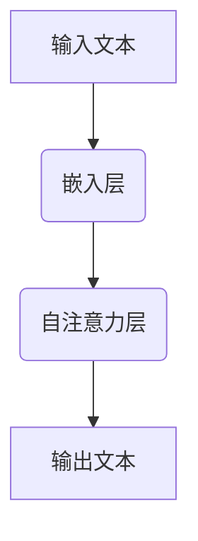
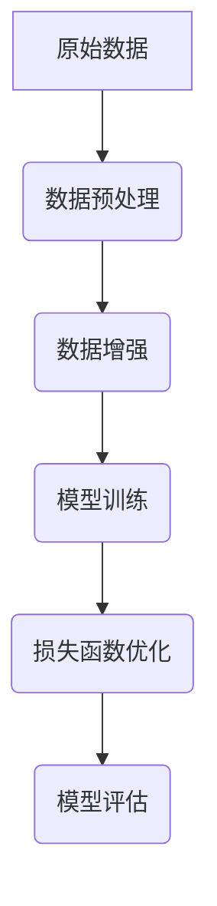
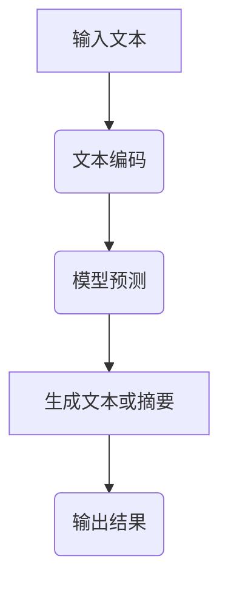
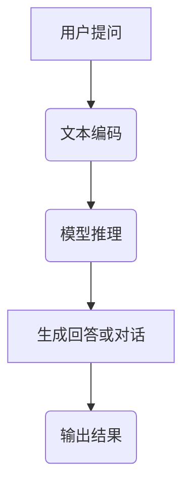
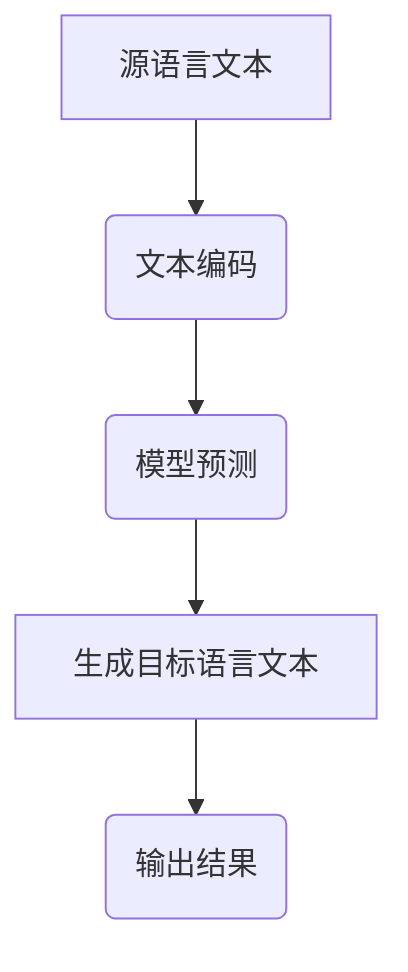
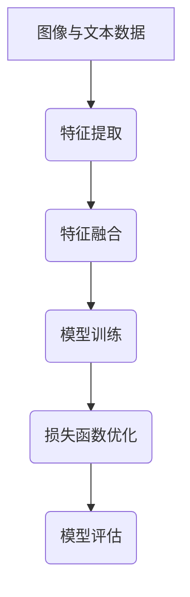

                 

# 文章标题：大语言模型的自监督学习

> 关键词：大语言模型，自监督学习，自然语言处理，预训练方法，算法设计，项目实战

> 摘要：本文深入探讨了大规模语言模型的本质及其自监督学习的方法。文章首先介绍了大语言模型的基础知识，包括其定义、发展历程、核心挑战和机遇。随后，我们详细解析了自监督学习的理论基础，包括数据增强、预训练方法、算法设计及其面临的挑战。最后，通过实际项目，展示了大语言模型在不同应用场景中的实战应用，并提供了解决方案和优化策略。

## 《大语言模型的自监督学习》目录大纲

### 第一部分：大语言模型基础知识

- **1.1 大语言模型概述**
  - **1.1.1 大语言模型的定义与重要性**
  - **1.1.2 大语言模型的发展历程**
  - **1.1.3 大语言模型的核心挑战与机遇**

- **1.2 自然语言处理与自监督学习**
  - **1.2.1 自然语言处理的基本概念**
  - **1.2.2 自监督学习的定义与原理**
  - **1.2.3 自监督学习在NLP中的应用**

- **1.3 大语言模型的架构**
  - **1.3.1 常见的大语言模型架构**
  - **1.3.2 生成式模型与判别式模型**
  - **1.3.3 零样本学习与泛化能力**

- **1.4 大语言模型的数学基础**
  - **1.4.1 线性代数基础**
  - **1.4.2 概率论与信息论**
  - **1.4.3 最优化方法**

- **1.5 大语言模型的应用场景**
  - **1.5.1 文本生成与文本摘要**
  - **1.5.2 问答系统与对话生成**
  - **1.5.3 语言翻译与跨语言理解**

- **1.6 大语言模型的发展趋势**
  - **1.6.1 模型规模与计算资源**
  - **1.6.2 可解释性与安全性**
  - **1.6.3 大语言模型在社会中的应用**

### 第二部分：自监督学习算法

- **2.1 自监督学习的理论基础**
  - **2.1.1 无监督学习与自监督学习的区别**
  - **2.1.2 自监督学习的目标函数**
  - **2.1.3 自监督学习的常见任务**

- **2.2 数据增强与数据集构建**
  - **2.2.1 数据增强技术**
  - **2.2.2 数据集构建流程**
  - **2.2.3 数据预处理与质量评估**

- **2.3 基于自监督学习的预训练方法**
  - **2.3.1 预训练的定义与目的**
  - **2.3.2 常见的预训练方法**
  - **2.3.3 预训练模型的调优与评估**

- **2.4 自监督学习的算法设计**
  - **2.4.1 多任务学习与迁移学习**
  - **2.4.2 注意力机制与对抗训练**
  - **2.4.3 自监督学习的优化策略**

- **2.5 自监督学习的挑战与未来方向**
  - **2.5.1 模型泛化能力与解释性**
  - **2.5.2 数据隐私与公平性**
  - **2.5.3 跨模态与多模态自监督学习**

### 第三部分：大语言模型的项目实战

- **3.1 项目实战一：文本生成与摘要**
  - **3.1.1 项目背景与目标**
  - **3.1.2 数据集介绍与预处理**
  - **3.1.3 模型设计与实现**
  - **3.1.4 模型评估与优化**

- **3.2 项目实战二：问答系统与对话生成**
  - **3.2.1 项目背景与目标**
  - **3.2.2 数据集介绍与预处理**
  - **3.2.3 模型设计与实现**
  - **3.2.4 模型评估与优化**

- **3.3 项目实战三：语言翻译与跨语言理解**
  - **3.3.1 项目背景与目标**
  - **3.3.2 数据集介绍与预处理**
  - **3.3.3 模型设计与实现**
  - **3.3.4 模型评估与优化**

- **3.4 项目实战四：多模态自监督学习**
  - **3.4.1 项目背景与目标**
  - **3.4.2 数据集介绍与预处理**
  - **3.4.3 模型设计与实现**
  - **3.4.4 模型评估与优化**

### 附录

- **附录A：大语言模型开发工具与资源**
  - **5.1 TensorFlow**
  - **5.2 PyTorch**
  - **5.3 HuggingFace Transformers**

- **附录B：数学公式与伪代码**
  - **6.1 线性代数基础**
  - **6.2 概率论与信息论**
  - **6.3 最优化方法**

- **附录C：参考文献**
  - **7.1 相关论文**
  - **7.2 开源代码与数据集**
  - **7.3 书籍与在线教程**

- **附录D：Mermaid流程图**
  - **7.4 大语言模型的基本架构**
  - **7.5 自监督学习算法流程图**
  - **7.6 文本生成与摘要流程图**
  - **7.7 问答系统与对话生成流程图**
  - **7.8 语言翻译与跨语言理解流程图**
  - **7.9 多模态自监督学习流程图**


---

### 引言

近年来，人工智能领域的发展呈现出爆发式的增长，特别是深度学习和自然语言处理（NLP）领域。在NLP中，大语言模型（Large Language Models，LLMs）由于其卓越的性能和广泛的应用前景，已经成为学术界和工业界的热点研究方向。大语言模型是指那些拥有数十亿甚至数万亿参数的神经网络模型，它们能够在各种NLP任务中表现出色，如文本生成、文本摘要、问答系统、语言翻译等。

自监督学习（Self-supervised Learning）作为一种重要的机器学习范式，在大语言模型的研究中发挥了关键作用。自监督学习不需要标注的数据，通过利用数据自身的结构，可以大幅度提高模型的训练效率。在大语言模型的训练过程中，自监督学习不仅能够提高模型的性能，还能减少对大量标注数据的依赖。

本文将围绕大语言模型的自监督学习展开讨论，旨在深入解析大语言模型的基础知识、自监督学习的理论基础、算法设计及其在NLP中的应用。此外，文章还将通过具体项目实战，展示如何将大语言模型的自监督学习方法应用于实际问题中，并提供优化策略和解决方案。

本文的结构如下：首先，我们将介绍大语言模型的基础知识，包括其定义、发展历程、核心挑战与机遇。接着，我们将详细解析自监督学习的理论基础，包括无监督学习与自监督学习的区别、目标函数、常见任务等。然后，我们将讨论大语言模型的架构，包括生成式模型与判别式模型、零样本学习与泛化能力等。随后，我们将探讨大语言模型的数学基础，包括线性代数基础、概率论与信息论、最优化方法等。在应用部分，我们将分析大语言模型在不同场景中的实际应用，如文本生成与摘要、问答系统与对话生成、语言翻译与跨语言理解等。最后，我们将探讨大语言模型的发展趋势，包括模型规模与计算资源、可解释性与安全性等，并展望其未来的发展方向。

通过本文的深入探讨，读者将能够全面了解大语言模型的自监督学习，掌握其核心原理和实战技巧，从而为实际项目提供有力支持。

### 第一部分：大语言模型基础知识

#### 1.1 大语言模型概述

**1.1.1 大语言模型的定义与重要性**

大语言模型（Large Language Models，简称LLMs）是指那些拥有数十亿甚至数万亿参数的神经网络模型。这些模型通过深度学习技术从大规模文本数据中学习语言模式和语义关系，从而实现对自然语言的生成、理解、翻译等任务的高效处理。大语言模型的核心在于其规模和参数数量，这使得它们能够在各种NLP任务中表现出色。

大语言模型的重要性体现在多个方面。首先，它们能够大幅度提高NLP任务的准确性和效率。例如，在文本生成任务中，大语言模型可以生成更加流畅、自然的文本；在文本摘要任务中，大语言模型能够提取出关键信息，生成简洁的摘要。其次，大语言模型具有强大的泛化能力，能够在不同的任务和数据集上表现稳定。这使得大语言模型在工业界和学术界都受到了广泛关注。

**1.1.2 大语言模型的发展历程**

大语言模型的发展历程可以分为几个重要阶段：

1. **早期模型**：早期的语言模型主要是基于统计方法和规则的方法，如n元语言模型和基于语法规则的模型。这些模型虽然在某些任务上表现不错，但在处理复杂语言现象和大规模数据时存在很大局限性。

2. **基于神经网络的模型**：随着深度学习技术的发展，基于神经网络的模型逐渐取代了传统的统计模型。2003年，Bengio等人提出了基于递归神经网络（RNN）的语言模型，这标志着深度学习在NLP领域的崛起。

3. **长短期记忆网络（LSTM）**：LSTM是一种特殊的RNN，它通过引入记忆单元和门控机制，解决了传统RNN在长序列依赖问题上的不足。LSTM在自然语言处理任务中取得了显著成果。

4. **Transformer模型**：2017年，Vaswani等人提出了Transformer模型，这是一种基于自注意力机制的深度学习模型。Transformer模型在BERT、GPT等大语言模型中得到了广泛应用，显著提升了模型的性能。

5. **大规模预训练模型**：近年来，随着计算资源和数据集的增大，大规模预训练模型如BERT、GPT-3等应运而生。这些模型通过在大规模语料库上进行预训练，再通过微调进行特定任务的训练，取得了突破性的成果。

**1.1.3 大语言模型的核心挑战与机遇**

尽管大语言模型在NLP领域取得了显著成果，但其发展仍面临一系列核心挑战：

1. **计算资源消耗**：大语言模型需要大量的计算资源和存储空间，这对硬件设备提出了高要求。

2. **数据隐私与公平性**：大语言模型通常基于大规模数据集进行训练，这些数据可能涉及用户隐私。如何在保证数据隐私的同时，确保模型的公平性，是一个亟待解决的问题。

3. **可解释性与可靠性**：大语言模型通常被视为“黑箱”，其内部决策过程难以解释。如何提高模型的透明度和可靠性，使其更易于被用户信任，是一个重要挑战。

然而，这些挑战同时也带来了巨大的机遇：

1. **技术创新**：随着大语言模型的不断进步，将有望推动深度学习、自然语言处理等领域的创新，带来新的技术突破。

2. **行业应用**：大语言模型在各个行业的应用潜力巨大，如金融、医疗、教育、媒体等，将为行业带来新的发展机遇。

3. **社会影响**：大语言模型将深刻影响人类生活，从智能客服、智能翻译到智能写作，都将带来便利和改变。

总之，大语言模型的发展具有巨大的潜力，但也需要解决一系列挑战。通过不断的技术创新和行业合作，我们有理由相信，大语言模型将在未来发挥更加重要的作用。

#### 1.2 自然语言处理与自监督学习

**1.2.1 自然语言处理的基本概念**

自然语言处理（Natural Language Processing，简称NLP）是人工智能领域的一个重要分支，旨在使计算机能够理解和处理自然语言。NLP涉及到多个层面的任务，包括词汇分析（Tokenization）、句法分析（Syntax Parsing）、语义分析（Semantic Analysis）和语用分析（Pragmatic Analysis）等。

- **词汇分析**：将文本分解为词汇单元，如单词、短语等，为后续的句法分析和语义分析提供基础。

- **句法分析**：通过语法规则对文本进行结构化分析，确定句子中的词汇关系，如主谓宾结构等。

- **语义分析**：对文本进行语义层面的解析，理解词汇和句子的意义，为文本生成、摘要等任务提供语义信息。

- **语用分析**：研究语言在特定语境下的使用和意义，涉及语言的人际关系、情境因素等。

NLP的应用场景非常广泛，包括但不限于文本生成、文本分类、情感分析、机器翻译、问答系统、对话生成等。

**1.2.2 自监督学习的定义与原理**

自监督学习（Self-supervised Learning）是一种无需外部标注数据，仅利用数据自身的结构来学习特征的机器学习范式。自监督学习的核心思想是通过设计特殊的目标函数，将数据中潜在的有用信息引导到模型的学习过程中。

- **定义**：自监督学习是指通过利用数据中的内在结构，将无监督学习问题转化为有监督学习问题，从而实现特征学习和任务性能的提升。

- **原理**：自监督学习通常包含以下几个关键步骤：
  1. **数据预处理**：将原始数据（如文本、图像、语音等）转化为适合模型处理的形式。
  2. **样本选择**：从数据中随机选择样本，生成训练数据和标签。
  3. **目标函数设计**：设计目标函数，将样本选择和标签生成过程转化为模型训练过程。
  4. **模型训练**：通过梯度下降等优化方法，调整模型参数以最小化目标函数。

自监督学习的优势在于：
- **高效性**：无需大量的标注数据，可以节省数据标注的时间和成本。
- **灵活性**：适用于各种类型的数据，如文本、图像、语音等。
- **鲁棒性**：通过利用数据自身的结构，可以提高模型的泛化能力。

**1.2.3 自监督学习在NLP中的应用**

自监督学习在NLP领域得到了广泛应用，特别是在大规模语言模型的预训练过程中。以下是一些常见的自监督学习应用：

1. **词向量表示**：通过自监督学习训练词向量模型，如Word2Vec、GloVe等，将词汇转化为低维向量表示，提高词汇之间的相似性和差异性。

2. **语言模型预训练**：使用自监督学习技术，如掩码语言模型（Masked Language Model，MLM）、生成式对抗网络（Generative Adversarial Networks，GAN）等，在大规模语料库上进行预训练，为特定NLP任务提供高质量的文本特征。

3. **文本分类**：通过自监督学习训练文本分类模型，如BERT、RoBERTa等，利用未标注的数据进行预训练，再通过微调实现特定文本分类任务。

4. **文本生成与摘要**：自监督学习在文本生成和摘要任务中也发挥了重要作用，如使用BERT或GPT模型生成流畅的文本或生成摘要。

5. **问答系统**：自监督学习技术如BERT、GPT等，在问答系统中的应用，可以显著提高问答系统的准确性和响应速度。

自监督学习在NLP领域的成功应用，不仅提升了模型的性能和效率，还为解决数据标注困难、提升模型泛化能力等问题提供了新的思路。随着技术的不断发展，自监督学习在NLP中的应用前景将更加广阔。

#### 1.3 大语言模型的架构

**1.3.1 常见的大语言模型架构**

大语言模型的架构多种多样，但主要可以分为生成式模型和判别式模型两大类。每种模型都有其独特的优点和适用场景，下面我们将分别进行介绍。

**生成式模型**

生成式模型旨在生成数据的概率分布，从而模拟数据生成过程。这种模型通常通过概率图模型或生成式对抗网络（GAN）来实现。

- **概率图模型**：如变分自编码器（Variational Autoencoder，VAE）和生成对抗网络（Generative Adversarial Network，GAN）。这些模型通过编码器和解码器共同工作，编码器将输入数据编码为一个隐变量，解码器将隐变量解码为输出数据。

- **生成对抗网络（GAN）**：由生成器和判别器组成。生成器尝试生成与真实数据相似的数据，而判别器则尝试区分真实数据和生成数据。通过这种对抗过程，生成器不断改进，以生成更加真实的数据。

生成式模型的优势在于：
- **数据生成能力强**：能够生成高质量的数据，适用于图像、音频、文本等数据的生成任务。
- **灵活性好**：能够处理各种类型的数据，且不依赖于特定数据分布。

**判别式模型**

判别式模型旨在学习输入数据的类别或标签，从而对数据进行分类或判别。这种模型通常通过神经网络来实现，如卷积神经网络（CNN）、循环神经网络（RNN）和Transformer等。

- **卷积神经网络（CNN）**：通过卷积操作提取图像的局部特征，适用于图像分类和识别任务。

- **循环神经网络（RNN）**：通过循环结构处理序列数据，如时间序列数据、文本数据等。

- **Transformer模型**：由自注意力机制（Self-Attention）和前馈神经网络（Feedforward Neural Network）组成，适用于序列数据建模，如语言模型、机器翻译等。

判别式模型的优势在于：
- **分类和判别能力强**：能够对输入数据进行准确分类或判别，适用于分类、回归、判别等任务。
- **计算效率高**：通过并行计算，可以大幅提高模型的训练和推断速度。

**1.3.2 零样本学习与泛化能力**

零样本学习（Zero-Shot Learning，ZSL）是一种特殊的机器学习任务，旨在处理未见过的类别或标签。这种任务对于大语言模型尤为重要，因为在实际应用中，模型需要应对各种未知的语言现象。

- **零样本学习原理**：零样本学习通过学习类别的关系和分布，将未见过的类别映射到已知的类别空间中。具体方法包括：
  1. **元学习**：通过在多个任务上进行训练，学习不同类别之间的关系，从而在未见过的类别上表现良好。
  2. **原型网络**：通过学习类别的原型表示，将未见过的类别映射到最近的类别原型上。
  3. **知识蒸馏**：通过将大量知识从预训练模型中蒸馏到零样本学习模型中，提高模型在未见过的类别上的性能。

零样本学习在NLP中具有广泛的应用，如跨语言理解、多语言文本分类等。通过零样本学习，大语言模型可以在未见过的新任务和数据集上实现良好的性能，从而提高其泛化能力。

- **泛化能力**：泛化能力是指模型在新数据上的表现能力，是评估模型性能的重要指标。大语言模型的泛化能力主要体现在以下几个方面：
  1. **任务泛化**：模型在不同NLP任务上表现稳定，如文本生成、文本分类、问答等。
  2. **数据泛化**：模型在不同数据集上的表现一致，不依赖于特定数据集的特性。
  3. **领域泛化**：模型在跨领域数据上的表现良好，能够适应不同领域的语言现象。

提高大语言模型的泛化能力，需要从多个方面进行考虑：
- **数据多样性**：通过引入多样化的数据集，提高模型对不同数据分布的适应能力。
- **模型架构**：设计具有较强泛化能力的模型架构，如Transformer模型的自注意力机制可以有效地捕捉长距离依赖关系，提高模型的泛化能力。
- **训练策略**：采用有效的训练策略，如迁移学习、数据增强等，提高模型的泛化性能。

总之，大语言模型的架构包括生成式模型和判别式模型，每种模型都有其独特的优点和适用场景。同时，零样本学习和泛化能力也是大语言模型研究的重要方向。通过不断的技术创新和优化，大语言模型将在NLP领域发挥更加重要的作用。

#### 1.4 大语言模型的数学基础

**1.4.1 线性代数基础**

线性代数是构建大语言模型的重要数学工具，它在模型设计、优化和数据分析中发挥着核心作用。以下是一些线性代数基础概念及其在大语言模型中的应用：

- **向量与矩阵**：向量是具有特定维度的数值数组，矩阵是二维的数组。在大语言模型中，向量通常用于表示词向量、嵌入向量等，而矩阵则用于表示模型权重和特征矩阵。

- **矩阵乘法**：矩阵乘法是线性代数中的基础运算，用于计算两个矩阵的点积、特征分解等。在大语言模型中，矩阵乘法用于计算输入特征和模型权重的内积，以获得模型的输出。

- **矩阵求导**：矩阵求导是优化模型参数的重要工具。通过计算梯度，可以确定模型参数的调整方向和幅度，从而优化模型性能。在大语言模型中，矩阵求导用于计算损失函数关于模型参数的梯度，以更新模型参数。

- **特征分解**：特征分解是将矩阵分解为多个矩阵的乘积，如奇异值分解（SVD）和矩阵分解（PCA）。在大语言模型中，特征分解用于降维、去噪和特征提取，从而提高模型的效率和性能。

**1.4.2 概率论与信息论**

概率论与信息论是理解和设计大语言模型的重要理论基础，它们在模型建模、优化和评估中发挥着关键作用。以下是一些相关概念及其应用：

- **概率分布**：概率分布用于描述随机变量的概率分布情况。在大语言模型中，概率分布用于建模语言的概率，如词的概率分布、句子的概率分布等。

- **条件概率**：条件概率描述在给定某个条件下，另一个事件发生的概率。在大语言模型中，条件概率用于建模上下文信息，如给定一个单词，预测下一个单词的概率。

- **贝叶斯定理**：贝叶斯定理是一种用于计算条件概率的公式，它在大语言模型的推理和决策中发挥着重要作用。通过贝叶斯定理，可以计算模型在给定输入数据下的后验概率，从而进行分类、预测等任务。

- **熵与信息量**：熵和信息量是描述数据不确定性和信息含量的概念。在大语言模型中，熵用于评估模型的预测不确定性，信息量用于计算输入数据的预测能力。通过最大化信息量，可以优化模型的预测性能。

- **KL散度**：KL散度（Kullback-Leibler Divergence）是一种衡量两个概率分布差异的度量。在大语言模型中，KL散度用于评估模型预测的概率分布与真实概率分布之间的差距，从而优化模型参数。

**1.4.3 最优化方法**

最优化方法是求解最优化问题的数学方法，它在大语言模型的训练和优化中发挥着核心作用。以下是一些常见最优化方法及其应用：

- **梯度下降**：梯度下降是一种最常用的最优化方法，通过计算损失函数关于模型参数的梯度，逐步调整模型参数，以最小化损失函数。在大语言模型中，梯度下降用于训练模型，优化模型参数。

- **随机梯度下降（SGD）**：随机梯度下降是梯度下降的一种变体，通过随机选择一部分训练样本来计算梯度。SGD能够提高训练效率，减少计算资源的需求。

- **Adam优化器**：Adam优化器是一种基于梯度历史信息的优化方法，它结合了SGD和动量法的优点，具有较好的收敛速度和稳定性。在大语言模型中，Adam优化器常用于训练大规模模型。

- **梯度裁剪**：梯度裁剪是一种防止梯度爆炸和梯度消失的方法，通过限制梯度的幅度，确保模型参数的更新在合理的范围内。在大语言模型中，梯度裁剪用于提高训练过程的稳定性和收敛速度。

- **超参数调优**：超参数是模型训练过程中需要手动设置的参数，如学习率、批量大小等。超参数调优是通过实验和优化方法，确定最佳超参数组合，以提高模型性能。

通过线性代数、概率论与信息论、最优化方法等数学工具，大语言模型能够更好地建模和解释自然语言现象。这些数学基础不仅为模型设计提供了理论支持，也为模型的优化和评估提供了有力工具。随着数学理论的不断进步，大语言模型将在自然语言处理领域发挥更加重要的作用。

#### 1.5 大语言模型的应用场景

**1.5.1 文本生成与文本摘要**

文本生成与文本摘要是大语言模型在自然语言处理中的重要应用场景。通过预训练和微调，大语言模型可以生成高质量的自然语言文本，或从长文本中提取关键信息生成简洁的摘要。

- **文本生成**：文本生成任务包括对话生成、故事创作、文章撰写等。大语言模型通过学习大规模文本数据，能够生成连贯、自然的文本。具体实现中，可以使用生成式模型如GPT-3或判别式模型如BERT进行预训练，再通过微调适配特定任务数据。

  - **模型选择**：生成式模型如GPT-3具有强大的文本生成能力，可以通过上下文生成连贯的文本。判别式模型如BERT虽然主要用于文本分类和判别任务，但通过调整输入格式，也可以用于文本生成。

  - **实现示例**：
    ```python
    # 使用GPT-3生成文本
    import openai
    response = openai.Completion.create(
      engine="text-davinci-003",
      prompt="请写一篇关于人工智能的论文摘要。",
      max_tokens=150
    )
    print(response.choices[0].text.strip())
    ```

- **文本摘要**：文本摘要任务旨在从长文本中提取关键信息，生成简洁、准确的摘要。大语言模型可以通过自监督学习或基于任务的学习方法进行预训练，然后通过微调适应特定数据集。

  - **模型选择**：自监督学习模型如BERT和判别式模型如Transformer可以在文本摘要任务中表现出色。BERT模型通过预训练学习文本表示，可以用于提取关键信息生成摘要。Transformer模型通过自注意力机制捕捉文本中的关键信息，适合用于生成式摘要。

  - **实现示例**：
    ```python
    from transformers import pipeline
    summarizer = pipeline("summarization")
    long_text = "..."  # 长文本内容
    summary = summarizer(long_text, max_length=130, min_length=30, do_sample=False)
    print(summary[0]['summary_text'])
    ```

**1.5.2 问答系统与对话生成**

问答系统与对话生成是大语言模型在智能客服、虚拟助手等领域的典型应用。通过预训练和微调，大语言模型可以理解和回答用户的问题，或与用户进行自然对话。

- **问答系统**：问答系统旨在从大量知识库或文本中检索答案，回答用户的问题。大语言模型可以通过自监督学习或基于任务的学习方法进行预训练，然后通过微调适应特定数据集。

  - **模型选择**：BERT、RoBERTa等预训练模型在问答系统中表现出色。通过预训练，这些模型可以学习到语言理解和推理的能力，从而准确回答用户问题。

  - **实现示例**：
    ```python
    from transformers import pipeline
    question_answering = pipeline("question-answering")
    question = "什么是自然语言处理？"
    context = "自然语言处理（NLP）是人工智能领域的一个重要分支，旨在使计算机能够理解和处理自然语言。"
    answer = question_answering(question=question, context=context)
    print(answer['answer'])
    ```

- **对话生成**：对话生成任务旨在模拟人类对话，与用户进行自然互动。大语言模型可以通过预训练和微调进行学习，从而生成流畅、自然的对话。

  - **模型选择**：GPT-3、ChatGLM等生成式模型在对话生成中表现出色。这些模型通过学习大量对话数据，能够生成高质量的自然对话。

  - **实现示例**：
    ```python
    import openai
    response = openai.Completion.create(
      engine="text-davinci-003",
      prompt="用户：你好，我最近想买一辆新车，有什么推荐吗？",
      max_tokens=100
    )
    print(response.choices[0].text.strip())
    ```

**1.5.3 语言翻译与跨语言理解**

语言翻译与跨语言理解是大语言模型在国际交流、多语言处理等领域的典型应用。通过预训练和微调，大语言模型可以翻译不同语言之间的文本，或理解不同语言之间的语义关系。

- **语言翻译**：语言翻译任务旨在将一种语言的文本翻译成另一种语言。大语言模型可以通过自监督学习或基于任务的学习方法进行预训练，然后通过微调适应特定翻译数据集。

  - **模型选择**：Transformer、BERT等预训练模型在语言翻译任务中表现出色。这些模型通过预训练学习到不同语言之间的语义对应关系，从而实现高质量的翻译。

  - **实现示例**：
    ```python
    from transformers import pipeline
    translator = pipeline("translation_en_to_fr")
    text = "Hello, how are you?"
    translation = translator(text)
    print(translation[0]['translation_text'])
    ```

- **跨语言理解**：跨语言理解任务旨在理解不同语言之间的语义关系，从而在不同语言之间进行信息传递。大语言模型可以通过自监督学习或基于任务的学习方法进行预训练，然后通过微调适应特定跨语言理解数据集。

  - **模型选择**：BERT、XLM等预训练模型在跨语言理解任务中表现出色。这些模型通过预训练学习到不同语言之间的共享语义表示，从而实现跨语言理解。

  - **实现示例**：
    ```python
    from transformers import pipeline
    cross_language = pipeline("cross-lingual-translation_en_to_fr")
    text = "Hello, how are you?"
    translation = cross_language(text)
    print(translation[0]['translation_text'])
    ```

通过以上应用场景，大语言模型在文本生成、文本摘要、问答系统、对话生成、语言翻译和跨语言理解等多个领域展示了强大的能力。随着技术的不断进步，大语言模型将在更多场景中发挥重要作用，推动自然语言处理领域的发展。

#### 1.6 大语言模型的发展趋势

**1.6.1 模型规模与计算资源**

大语言模型的发展趋势之一是模型规模的不断扩大和计算资源的不断增长。近年来，随着人工智能技术的进步，大语言模型的参数数量已经从几百万增长到数十亿甚至数万亿。例如，GPT-3拥有1750亿个参数，是目前最大的语言模型之一。

- **模型规模的增长**：模型规模的增长带来了几个方面的优势。首先，更大的模型可以学习到更复杂的语言模式和语义关系，从而在NLP任务中表现出更高的性能。其次，更大的模型可以更好地泛化到未见过的数据集和任务上，提高模型的鲁棒性和适应性。然而，模型规模的增长也带来了计算资源的需求，训练和推理大模型需要更多的计算资源和存储空间。

- **计算资源的需求**：为了训练和推理大模型，需要更多的计算资源，包括高性能GPU、TPU和其他计算设备。此外，数据传输和存储也需要更高的带宽和更大的存储容量。随着云计算和分布式计算技术的发展，提供了更多的计算资源支持，使得大规模模型的训练和部署成为可能。

**1.6.2 可解释性与安全性**

随着大语言模型的广泛应用，其可解释性和安全性变得越来越重要。可解释性指的是模型决策过程的透明度，让用户能够理解模型是如何做出决策的。安全性则涉及到模型保护用户数据隐私和防止恶意攻击的能力。

- **可解释性**：大语言模型通常被视为“黑箱”，其内部决策过程难以解释。为了提高可解释性，研究者提出了多种方法，如模型可视化、注意力机制分析等。通过这些方法，可以揭示模型在不同任务和数据上的决策过程，帮助用户更好地理解模型的工作原理。

- **安全性**：大语言模型的安全性问题包括数据隐私、模型可攻陷性和对抗性攻击等。为了保护用户数据隐私，研究者提出了差分隐私、联邦学习等技术，以防止用户数据被泄露。为了提高模型的安全性，研究者还提出了防御对抗性攻击的方法，如 adversarial training、对抗性样本检测等。

**1.6.3 大语言模型在社会中的应用**

大语言模型在社会中的应用前景非常广阔，可以从教育、医疗、金融等多个领域进行探讨。

- **教育领域**：大语言模型可以应用于智能教育，如自动批改作业、智能问答系统、个性化学习推荐等。通过大语言模型，可以提供个性化的教育资源和学习方案，提高教育质量和效率。

- **医疗领域**：大语言模型可以应用于医疗文本分析、智能诊断、医学知识图谱构建等。通过大语言模型，可以处理大量的医疗数据，提取关键信息，辅助医生进行诊断和治疗。

- **金融领域**：大语言模型可以应用于金融文本分析、风险评估、股票预测等。通过大语言模型，可以分析市场动态、预测股票走势，为金融决策提供有力支持。

总之，随着大语言模型的发展，其应用领域将不断扩展，为社会带来更多的便利和变革。同时，也需要关注模型的可解释性和安全性，确保其在实际应用中的可靠性和公正性。

### 第二部分：自监督学习算法

#### 2.1 自监督学习的理论基础

自监督学习（Self-supervised Learning）是一种无需外部标注数据，仅利用数据自身的结构来学习特征的机器学习范式。自监督学习通过设计特殊的目标函数，将无监督学习问题转化为有监督学习问题，从而实现特征学习和任务性能的提升。以下我们将详细探讨自监督学习的理论基础，包括无监督学习与自监督学习的区别、目标函数、常见任务等。

**2.1.1 无监督学习与自监督学习的区别**

无监督学习（Unsupervised Learning）是指在没有标签数据的情况下，通过学习数据内在结构来提取特征或进行聚类、降维等任务。无监督学习的主要目的是发现数据中的隐含模式或规律。例如，聚类任务通过将相似的数据点分组，发现数据中的潜在结构。

自监督学习则是在无监督学习的基础上，通过设计特殊的目标函数，将无监督学习问题转化为有监督学习问题。具体来说，自监督学习利用数据中的某些部分作为输入，同时将这些输入的一部分进行扰动或遮盖，生成一个监督信号。通过最小化这个监督信号与实际输出之间的差异，模型可以学习到有用的特征表示。

- **区别**：
  - **数据依赖**：无监督学习不需要外部标注数据，自监督学习可以利用未标注的数据，但同样可以结合少量有标注的数据。
  - **目标函数**：无监督学习的目标函数通常是最小化数据分布的差异性或内部结构的不一致性，自监督学习的目标函数则是最小化预测误差，即预测的标签与实际标签之间的差异。
  - **适用场景**：无监督学习适用于数据探索、聚类、降维等任务，自监督学习适用于需要标签数据的任务，如分类、回归等。

**2.1.2 自监督学习的目标函数**

自监督学习的核心是设计有效的目标函数，以引导模型学习到具有实际应用价值的数据特征。以下是一些常见的自监督学习目标函数：

- **掩码语言模型（Masked Language Model, MLM）**：掩码语言模型是一种常见的自监督学习任务，主要用于语言模型预训练。在MLM任务中，输入文本序列的一部分单词被掩码（用`[MASK]`替代），模型需要预测这些掩码词。目标函数是最小化预测词与实际词之间的交叉熵损失。

  - **目标函数**：\[ L_{MLM} = -\sum_{i} \sum_{w} p(w_i | \text{context}) \log p(w_i) \]
  - **伪代码**：
    ```python
    for each sentence in dataset:
      for each word in sentence:
        if random chance > mask_ratio:
          continue
        mask_word(sentence, word)
    compute_loss(predicted_words, actual_words)
    ```

- **无监督图像分割（Unsupervised Image Segmentation）**：无监督图像分割任务旨在学习图像的像素级特征，以实现像素级别的分类。在无监督图像分割中，模型通常通过比较相邻像素的颜色差异来预测每个像素的类别。

  - **目标函数**：\[ L_{segmentation} = \sum_{i,j} w_{i,j} \cdot \log(p(c_{i,j} | \text{context})) \]
  - **伪代码**：
    ```python
    for each image in dataset:
      for each pixel in image:
        context = get_context(pixel)
        predicted_label = predict_label(context)
        compute_loss(predicted_label, actual_label)
    ```

- **自监督对象检测（Self-supervised Object Detection）**：自监督对象检测任务旨在学习图像中物体的特征，以实现像素级别的定位和分类。在自监督对象检测中，模型通过预测对象的位置和类别，同时利用背景信息进行监督。

  - **目标函数**：\[ L_{detection} = L_{classification} + \lambda \cdot L_{localization} \]
    - \( L_{classification} \)：类别预测损失
    - \( L_{localization} \)：位置预测损失
  - **伪代码**：
    ```python
    for each image in dataset:
      for each object in image:
        context = get_context(image, object)
        predicted_box, predicted_class = predict_box_and_class(context)
        compute_loss(predicted_box, actual_box, predicted_class, actual_class)
    ```

通过设计有效的目标函数，自监督学习可以在没有标注数据的情况下，学习到具有实际应用价值的数据特征，从而提高模型的性能和泛化能力。

**2.1.3 自监督学习的常见任务**

自监督学习在多个领域都有广泛的应用，以下是一些常见的自监督学习任务：

- **文本分类**：文本分类任务旨在将文本数据分类到预定义的类别中。在自监督学习框架下，可以通过预训练模型来提取文本特征，然后使用这些特征进行分类。

  - **应用场景**：新闻分类、社交媒体情感分析、垃圾邮件检测等。

- **情感分析**：情感分析任务旨在判断文本表达的情感倾向，如正面、负面或中性。自监督学习可以用于学习文本中的情感特征，从而实现自动化的情感分析。

  - **应用场景**：社交媒体分析、客户反馈分析、情感营销等。

- **命名实体识别（NER）**：命名实体识别任务旨在识别文本中的特定实体，如人名、地名、组织名等。自监督学习方法可以用于提取实体特征，从而实现高效准确的命名实体识别。

  - **应用场景**：信息提取、自然语言处理、文本搜索等。

- **机器翻译**：机器翻译任务旨在将一种语言的文本翻译成另一种语言。自监督学习方法可以通过预训练模型，提取源语言和目标语言的共同特征，从而实现高质量的双语翻译。

  - **应用场景**：跨语言信息检索、全球化业务沟通、跨文化交流等。

- **图像分类**：图像分类任务旨在将图像分类到预定义的类别中。自监督学习方法可以通过学习图像中的共同特征，从而实现高效准确的图像分类。

  - **应用场景**：计算机视觉、图像检索、智能监控等。

- **图像分割**：图像分割任务旨在将图像中的每个像素分类到预定义的类别中。自监督学习方法可以通过学习图像的像素级特征，从而实现高效的图像分割。

  - **应用场景**：医学图像分析、自动驾驶、智能监控等。

- **语音识别**：语音识别任务旨在将语音信号转换为文本。自监督学习方法可以通过学习语音信号中的特征，从而实现高效的语音识别。

  - **应用场景**：智能助手、语音搜索、智能客服等。

通过以上任务，我们可以看到自监督学习在各个领域的广泛应用。自监督学习不仅能够提高模型的性能和泛化能力，还能减少对大量标注数据的依赖，从而推动机器学习技术的发展。

#### 2.2 数据增强与数据集构建

**2.2.1 数据增强技术**

数据增强（Data Augmentation）是一种常用的技术，通过在原始数据上应用一系列的变换，生成新的训练样本，从而提高模型的泛化能力和鲁棒性。在大语言模型的训练过程中，数据增强技术尤为重要，因为大量高质量的训练数据有助于提高模型的性能和稳定性。

以下是一些常见的数据增强技术：

- **图像数据增强**：
  - **翻转（Flipping）**：水平或垂直翻转图像，以增加数据多样性。
  - **旋转（Rotation）**：随机旋转图像，以模拟不同视角的图像。
  - **裁剪（Cropping）**：随机裁剪图像的一部分，以生成新的图像。
  - **缩放（Scaling）**：随机缩放图像，以增加图像的大小多样性。
  - **颜色调整（Color Jittering）**：随机调整图像的亮度、对比度、饱和度等，以增加数据的颜色多样性。

- **文本数据增强**：
  - **同义词替换（Synonym Replacement）**：用同义词替换文本中的词汇，以增加词汇的多样性。
  - **随机插入（Random Insertion）**：在文本中随机插入新的词汇，以丰富文本内容。
  - **随机删除（Random Deletion）**：随机删除文本中的词汇，以训练模型处理缺失信息。
  - **文本重排（Reordering）**：随机改变文本中的词序，以模拟不同的语法结构。
  - **噪声添加（Noise Injection）**：在文本中添加随机噪声，如拼写错误、语法错误等，以提高模型对噪声数据的鲁棒性。

- **音频数据增强**：
  - **速度变化（Speed Change）**：改变音频播放速度，以模拟不同说话速度的音频。
  - **音调变化（Pitch Shift）**：改变音频的音调，以模拟不同音调的音频。
  - **噪声添加（Noise Injection）**：在音频中添加噪声，以提高模型对噪声的鲁棒性。
  - **重放（Echo）**：模拟回声效果，以增加音频的多样性。

**2.2.2 数据集构建流程**

构建高质量的数据集是机器学习项目成功的关键。在大语言模型的训练过程中，数据集的质量直接影响到模型的性能和泛化能力。以下是构建数据集的一般流程：

- **数据收集**：从各种来源收集原始数据，如公开数据集、社交媒体、网站等。对于文本数据，可以使用网络爬虫、API接口等手段获取；对于图像和音频数据，可以使用公开数据集或通过传感器收集。

- **数据清洗**：清洗原始数据，去除无效、重复或错误的数据。对于文本数据，可以去除HTML标签、停用词等；对于图像和音频数据，可以去除噪声、填充缺失值等。

- **数据标注**：对于有监督学习任务，需要对数据进行标注。数据标注可以手动完成，也可以通过自动化工具进行。例如，对于文本分类任务，可以对文本进行标签分类；对于图像分类任务，可以对图像进行标签标注。

- **数据预处理**：对清洗后的数据进行预处理，包括数据格式转换、标准化、归一化等，以便模型能够更好地处理数据。对于文本数据，可以进行分词、词性标注等；对于图像和音频数据，可以进行特征提取、数据标准化等。

- **数据集划分**：将数据集划分为训练集、验证集和测试集。通常，训练集用于模型的训练，验证集用于模型的调优和验证，测试集用于模型的最终评估。数据集划分的目的是确保模型的泛化能力，避免过拟合。

- **数据增强**：对训练集进行数据增强，生成更多的训练样本。数据增强可以提高模型的泛化能力，减少对训练数据的依赖。

- **数据存储与管理**：将处理好的数据存储在数据库或文件系统中，以便后续的训练和使用。可以使用数据库管理系统（如MySQL、MongoDB等）或分布式文件系统（如HDFS、Ceph等）进行数据存储。

通过以上步骤，可以构建高质量的数据集，为机器学习项目提供坚实的基础。在大语言模型的训练过程中，数据集的质量和多样性直接影响模型的性能和泛化能力，因此数据集构建是一个关键且复杂的任务。

#### 2.3 基于自监督学习的预训练方法

**2.3.1 预训练的定义与目的**

预训练（Pre-training）是一种常用的机器学习技术，通过在大规模数据集上预先训练模型，使其获得通用特征表示，从而在特定任务上实现高效性能。预训练方法的核心思想是利用未标注的数据，通过自监督学习技术，将无监督学习问题转化为有监督学习问题，从而提高模型的泛化能力和性能。

- **定义**：预训练是指在大规模未标注数据集上，使用自监督学习方法对模型进行初始化训练，然后通过微调（Fine-tuning）适应特定任务。

- **目的**：预训练的主要目的是提高模型的泛化能力，使其能够适应不同的任务和数据集。通过在大规模数据集上进行预训练，模型可以学习到通用的特征表示，从而在特定任务上表现更好。此外，预训练还可以减少对大量标注数据的依赖，降低模型训练的成本。

**2.3.2 常见的预训练方法**

预训练方法种类繁多，每种方法都有其独特的优势和适用场景。以下是一些常见的预训练方法：

1. **词向量表示**：词向量表示是将词汇映射为低维向量表示的方法。常见的词向量表示方法包括Word2Vec、GloVe等。Word2Vec方法通过训练神经网络，将输入词转换为固定长度的向量表示。GloVe方法通过优化词共现矩阵，学习词汇的向量表示。词向量表示方法在文本分类、情感分析等任务中表现出良好的性能。

2. **语言模型预训练**：语言模型预训练是指在大规模文本数据上训练模型，以学习语言的语义和结构。常见的语言模型预训练方法包括BERT、GPT、RoBERTa等。BERT模型通过掩码语言模型（Masked Language Model）进行预训练，学习词汇之间的依赖关系。GPT模型通过自回归语言模型（Autoregressive Language Model）进行预训练，生成高质量的文本。RoBERTa模型是BERT模型的改进版本，通过引入更多训练数据和改进训练策略，提高了模型的性能。

3. **图像模型预训练**：图像模型预训练是指在大规模图像数据上训练模型，以学习图像的特征表示。常见的图像模型预训练方法包括ResNet、VGG等。ResNet模型通过残差网络结构，提高了模型的深度和性能。VGG模型通过多层的卷积层堆叠，实现了高效的图像特征提取。

4. **多模态预训练**：多模态预训练是指将不同类型的数据（如文本、图像、音频等）进行融合，训练模型以学习多模态特征表示。常见的多模态预训练方法包括AudioSet、VisualBERT等。AudioSet模型通过在大规模音频数据上训练模型，学习音频特征表示。VisualBERT模型通过融合文本和图像数据，学习多模态特征表示。

**2.3.3 预训练模型的调优与评估**

预训练模型在特定任务上表现良好，但通常需要通过微调和评估过程进行调优。以下是一些调优与评估的方法：

1. **微调（Fine-tuning）**：微调是指将预训练模型应用于特定任务，通过在任务数据上进行少量训练，调整模型参数，使其适应特定任务。微调可以大大提高模型在特定任务上的性能。

2. **参数初始化**：在微调过程中，通常需要选择合适的参数初始化方法，以避免过拟合。常用的参数初始化方法包括随机初始化、预训练模型参数初始化等。

3. **数据增强（Data Augmentation）**：在微调过程中，可以使用数据增强技术，生成更多的训练样本，以提高模型的泛化能力和鲁棒性。

4. **超参数调优（Hyperparameter Tuning）**：通过调整学习率、批量大小、迭代次数等超参数，可以优化模型在特定任务上的性能。

5. **模型评估（Model Evaluation）**：在微调过程中，需要定期评估模型性能，以确定最佳模型参数。常见的评估指标包括准确率、召回率、F1分数等。

6. **跨任务迁移（Cross-task Transfer Learning）**：通过在多个任务上进行预训练，模型可以学习到通用的特征表示，从而在新的任务上表现出良好的性能。跨任务迁移可以显著提高模型的泛化能力和适应性。

通过预训练模型的调优与评估，可以确保模型在特定任务上表现出色。预训练方法不仅提高了模型性能，还减少了数据标注的成本，推动了机器学习技术的发展。随着预训练方法的不断改进，模型在各个领域的应用将越来越广泛。

#### 2.4 自监督学习的算法设计

**2.4.1 多任务学习与迁移学习**

多任务学习（Multi-task Learning）和迁移学习（Transfer Learning）是自监督学习中两种重要的算法设计方法。这两种方法通过共享模型结构和利用已有知识，提高模型的泛化能力和训练效率。

**多任务学习**

多任务学习旨在同时训练多个相关任务，通过共享模型参数来提高训练效率和模型性能。在多任务学习中，不同任务的输入和输出通常通过同一个模型处理，共享部分或全部参数。多任务学习的主要优势在于：

- **参数共享**：通过共享模型参数，减少了需要训练的参数数量，降低了计算和存储成本。
- **知识迁移**：不同任务之间的知识可以相互迁移，从而提高模型在不同任务上的性能。

多任务学习的实现通常包括以下步骤：

1. **模型设计**：设计一个共享底层特征提取器的多任务模型，例如在图像分类和目标检测任务中，共享卷积层作为特征提取器。
2. **损失函数**：设计一个联合损失函数，将不同任务的损失加权求和，以优化模型参数。
3. **训练过程**：通过同时训练多个任务，逐步优化模型参数。

**迁移学习**

迁移学习是指将一个任务上预训练的模型应用到新的任务中，利用已有模型的特征表示来加速新任务的训练。在迁移学习中，模型在源任务上已经学习到了一些通用的特征表示，这些特征表示可以迁移到新任务中，从而提高新任务的训练效率。

迁移学习的主要优势包括：

- **快速适应**：通过利用已有模型的知识，新任务可以快速适应，减少训练时间。
- **减少过拟合**：利用源任务的丰富数据，可以减少在新任务上的过拟合风险。

迁移学习的实现通常包括以下步骤：

1. **选择预训练模型**：选择一个在源任务上性能良好的预训练模型作为起点。
2. **模型微调**：在新的任务上对预训练模型进行微调，调整模型参数以适应新任务。
3. **模型评估**：在新任务上评估模型性能，通过调整超参数和模型结构来优化性能。

**注意力机制与对抗训练**

注意力机制（Attention Mechanism）和对抗训练（Adversarial Training）是自监督学习中的两个重要技术，用于提高模型的性能和泛化能力。

**注意力机制**

注意力机制是一种用于模型选择性地关注输入数据中重要信息的机制。在自监督学习中，注意力机制可以用于模型选择性地关注数据中的关键部分，从而提高模型的学习效率和准确性。注意力机制的主要优势包括：

- **选择关注**：通过关注输入数据中的关键部分，模型可以更有效地学习数据特征。
- **减少冗余**：减少对不相关信息的处理，提高模型效率。

常见的注意力机制包括：

- **自注意力（Self-Attention）**：在Transformer模型中，自注意力机制用于计算序列中各个元素之间的依赖关系。
- **多头注意力（Multi-Head Attention）**：通过将自注意力机制扩展到多个头，模型可以同时关注多个不同的信息来源。

**对抗训练**

对抗训练是一种用于提高模型鲁棒性的技术，通过训练模型对对抗样本的识别和防御能力。对抗训练的主要优势包括：

- **提高鲁棒性**：通过训练模型对对抗样本的识别和防御能力，可以提高模型在实际应用中的鲁棒性。
- **减少过拟合**：对抗样本的训练可以减少模型对训练数据的依赖，从而减少过拟合风险。

对抗训练的实现通常包括以下步骤：

1. **生成对抗样本**：通过在输入数据上添加微小的扰动，生成对抗样本。
2. **对抗训练**：在模型训练过程中，将对抗样本与原始样本一起进行训练，以提高模型对对抗样本的识别和防御能力。
3. **模型评估**：通过对抗测试评估模型的性能，检测模型是否能够正确识别和防御对抗样本。

**优化策略**

优化策略是在自监督学习算法设计中的一个重要方面，通过选择合适的优化方法，可以提高模型的学习效率和性能。以下是一些常见的优化策略：

- **动态学习率调整**：通过动态调整学习率，可以在训练过程中逐步减小学习率，以提高模型的收敛速度和性能。
- **批次归一化（Batch Normalization）**：通过归一化每个批次的输入数据，可以提高模型的稳定性和训练效率。
- **Dropout**：通过随机丢弃部分神经元，Dropout可以减少模型的过拟合现象，提高模型的泛化能力。
- **权重共享**：通过在不同任务中共享模型权重，可以减少模型的参数数量，提高训练效率。

通过以上算法设计方法，自监督学习可以在各种任务中表现出强大的性能。随着技术的不断进步，自监督学习将在机器学习领域发挥越来越重要的作用。

#### 2.5 自监督学习的挑战与未来方向

**2.5.1 模型泛化能力与解释性**

尽管自监督学习在许多任务中取得了显著的成果，但其泛化能力和解释性仍然存在一些挑战。

- **泛化能力**：自监督学习的模型通常在大规模数据集上训练，但其在未见过的数据上的表现仍需进一步优化。提高泛化能力的关键在于设计更有效的目标函数和数据增强方法，以更好地捕捉数据中的潜在结构和模式。

- **解释性**：自监督学习模型的决策过程通常难以解释，这限制了其在实际应用中的可靠性。为了提高解释性，研究者们正在探索可视化方法、注意力机制分析以及模型压缩等技术，以帮助用户理解模型的决策过程。

**2.5.2 数据隐私与公平性**

随着自监督学习的广泛应用，数据隐私和公平性成为不可忽视的问题。

- **数据隐私**：自监督学习通常依赖于大规模的数据集，这些数据可能包含用户的敏感信息。为了保护用户隐私，研究者们正在探索差分隐私、联邦学习等技术，以确保数据在训练过程中的安全性。

- **公平性**：自监督学习模型可能会在特定群体上产生不公平的偏见。为了提高模型的公平性，研究者们正在尝试引入公平性指标、平衡数据集以及改进目标函数，以减少模型偏见。

**2.5.3 跨模态与多模态自监督学习**

跨模态与多模态自监督学习是当前研究的热点方向，旨在处理不同类型的数据（如文本、图像、音频等）之间的复杂关系。

- **跨模态自监督学习**：跨模态自监督学习旨在通过不同模态的数据相互关联来提高模型的性能。例如，通过将文本和图像数据相结合，模型可以更好地理解和生成相关内容。

- **多模态自监督学习**：多模态自监督学习旨在同时处理多种数据类型，以生成统一的特征表示。例如，在视频分析中，将图像、音频和文本数据相结合，可以更准确地理解和生成视频内容。

未来的研究方向包括：

- **模型压缩与效率优化**：为了在有限资源下训练和部署大模型，研究者们将继续探索模型压缩技术，以提高模型的计算效率和存储效率。

- **自适应数据增强**：自适应数据增强技术可以根据模型的状态和性能动态调整数据增强策略，以实现更高效的模型训练。

- **跨领域与跨语言的模型预训练**：通过跨领域和跨语言的模型预训练，研究者们将进一步提高模型在不同领域和语言上的性能。

总之，自监督学习在模型泛化能力、解释性、数据隐私和公平性等方面仍有许多挑战。随着技术的不断进步，自监督学习将在未来发挥更加重要的作用，推动机器学习领域的发展。

### 第三部分：大语言模型的项目实战

#### 3.1 项目实战一：文本生成与摘要

**3.1.1 项目背景与目标**

文本生成与摘要项目旨在利用大语言模型生成流畅、自然的文本，并从长文本中提取关键信息生成简洁的摘要。这一项目在新闻摘要、内容生成和自动文档摘要等领域具有广泛的应用。通过预训练和微调，大语言模型能够生成高质量的文本和摘要，提高内容创作的效率和准确性。

**3.1.2 数据集介绍与预处理**

为了实现文本生成与摘要的目标，我们需要一个包含文本和其对应摘要的数据集。一个常用的数据集是新闻摘要数据集，如CNN/DailyMail摘要数据集。该数据集包含大量新闻文章及其对应的摘要，适合用于训练和评估文本生成与摘要模型。

数据预处理步骤如下：

1. **文本清洗**：去除文本中的HTML标签、停用词、标点符号等无关信息，以提高文本质量。
2. **分词**：将文本分解为单词或子词，以便模型进行理解和生成。
3. **编码**：将文本转换为模型可处理的编码形式，如WordPiece编码或BERT编码。

**3.1.3 模型设计与实现**

为了实现文本生成与摘要任务，我们选择使用GPT-3模型。GPT-3是一个生成式模型，具有强大的文本生成能力。以下是模型设计的关键步骤：

1. **预训练**：在新闻摘要数据集上进行预训练，使模型学习到文本的语法和语义特征。
2. **微调**：在具体任务数据集上进行微调，以适应特定任务的需求。例如，在文本生成任务中，使用生成式微调策略；在摘要任务中，使用判别式微调策略。
3. **解码与生成**：使用解码器生成文本或摘要。在生成文本时，模型会根据上下文生成下一个词或子词；在生成摘要时，模型会提取关键信息并生成简洁的摘要。

**3.1.4 模型评估与优化**

为了评估模型性能，我们采用以下指标：

1. **生成文本质量**：通过人类评估或自动评价指标（如BLEU、ROUGE等）来评估生成文本的质量。
2. **摘要长度与准确性**：评估摘要的长度和关键信息的提取准确性。

在模型评估过程中，我们可能需要调整以下参数：

1. **预训练参数**：包括训练时间、学习率等。
2. **微调参数**：包括训练数据集、微调策略等。
3. **生成策略**：包括采样方法、温度参数等。

通过不断调整和优化模型参数，我们可以提高文本生成与摘要任务的性能。在实际应用中，还可以结合其他技术，如知识蒸馏、多任务学习等，进一步提高模型性能。

**3.1.5 实际案例与代码解读**

以下是一个简单的文本生成与摘要项目案例：

1. **文本生成**：

```python
import openai

model_engine = "text-davinci-003"
prompt = "请写一篇关于人工智能的简介。"

response = openai.Completion.create(
  engine=model_engine,
  prompt=prompt,
  max_tokens=100,
  n=1,
  stop=None,
  temperature=0.5,
  top_p=1,
  frequency_penalty=0,
  presence_penalty=0
)

print(response.choices[0].text.strip())
```

2. **摘要生成**：

```python
from transformers import pipeline

summarizer = pipeline("summarization")

document = """
人工智能（Artificial Intelligence，简称AI）是计算机科学的一个分支，旨在研究、开发和应用使计算机能实现人类智能任务的理论、方法和技术。人工智能的研究领域广泛，包括机器学习、自然语言处理、计算机视觉、智能控制等。随着深度学习技术的快速发展，人工智能在各个领域都取得了显著的成果，推动了社会进步和经济发展。
"""

summary = summarizer(document, max_length=130, min_length=30, do_sample=False)

print(summary[0]['summary_text'])
```

通过以上案例，我们可以看到如何使用大语言模型实现文本生成与摘要任务。在实际项目中，可以根据需求调整模型和参数，以实现更好的性能。

#### 3.2 项目实战二：问答系统与对话生成

**3.2.1 项目背景与目标**

问答系统与对话生成项目旨在构建一个能够回答用户问题和进行自然对话的智能系统。这一项目在智能客服、虚拟助手和智能教育等领域具有广泛应用。通过大语言模型，我们可以在没有人工干预的情况下实现高质量的问答和对话生成。

**3.2.2 数据集介绍与预处理**

为了实现问答系统与对话生成，我们需要一个包含问题和答案的数据集。一个常用的数据集是SQuAD（Stanford Question Answering Dataset），它包含大量问题和答案对，适合用于训练和评估问答系统。

数据预处理步骤如下：

1. **文本清洗**：去除文本中的HTML标签、停用词、标点符号等无关信息。
2. **分词**：将文本分解为单词或子词。
3. **编码**：将问题和答案编码为模型可处理的形式。

**3.2.3 模型设计与实现**

为了实现问答系统与对话生成，我们选择使用BERT模型。BERT模型是一种预训练的语言模型，具有强大的语言理解能力。以下是模型设计的关键步骤：

1. **预训练**：在问答数据集上进行预训练，使模型学习到问题的上下文和答案的关系。
2. **微调**：在具体任务数据集上进行微调，以适应特定任务的需求。例如，在问答任务中，使用生成式微调策略；在对话生成任务中，使用判别式微调策略。
3. **回答生成**：使用BERT模型生成问题的答案。在回答生成过程中，模型会根据问题的上下文生成最相关的答案。

**3.2.4 模型评估与优化**

为了评估模型性能，我们采用以下指标：

1. **回答准确性**：评估模型生成答案的准确性。
2. **对话流畅性**：评估对话生成的流畅性和自然度。

在模型评估过程中，我们可能需要调整以下参数：

1. **预训练参数**：包括训练时间、学习率等。
2. **微调参数**：包括训练数据集、微调策略等。
3. **生成策略**：包括采样方法、温度参数等。

通过不断调整和优化模型参数，我们可以提高问答系统与对话生成任务的性能。在实际应用中，还可以结合其他技术，如知识蒸馏、多任务学习等，进一步提高模型性能。

**3.2.5 实际案例与代码解读**

以下是一个简单的问答系统与对话生成项目案例：

1. **问答系统**：

```python
from transformers import pipeline

question_answering = pipeline("question-answering")

question = "人工智能是什么？"
context = "人工智能（Artificial Intelligence，简称AI）是计算机科学的一个分支，旨在研究、开发和应用使计算机能实现人类智能任务的理..."

answer = question_answering(question=question, context=context)

print(answer['answer'])
```

2. **对话生成**：

```python
import openai

response = openai.Completion.create(
  engine="text-davinci-003",
  prompt="用户：你好，我对人工智能很感兴趣，能给我介绍一下吗？",
  max_tokens=100,
  n=1,
  stop=None,
  temperature=0.5,
  top_p=1,
  frequency_penalty=0,
  presence_penalty=0
)

print(response.choices[0].text.strip())
```

通过以上案例，我们可以看到如何使用大语言模型实现问答系统与对话生成任务。在实际项目中，可以根据需求调整模型和参数，以实现更好的性能。

#### 3.3 项目实战三：语言翻译与跨语言理解

**3.3.1 项目背景与目标**

语言翻译与跨语言理解项目旨在构建一个能够翻译不同语言文本并进行跨语言理解的大语言模型。这一项目在跨文化交流、多语言信息检索和全球业务合作等领域具有广泛应用。通过预训练和微调，大语言模型可以生成高质量的双语翻译和跨语言理解结果。

**3.3.2 数据集介绍与预处理**

为了实现语言翻译与跨语言理解，我们需要一个包含双语文本的数据集。一个常用的数据集是WMT（Workshop on Machine Translation）数据集，它包含多种语言的平行文本，适合用于训练和评估翻译模型。

数据预处理步骤如下：

1. **文本清洗**：去除文本中的HTML标签、停用词、标点符号等无关信息。
2. **分词**：将文本分解为单词或子词。
3. **编码**：将文本编码为模型可处理的形式。

**3.3.3 模型设计与实现**

为了实现语言翻译与跨语言理解，我们选择使用Transformer模型。Transformer模型是一种基于自注意力机制的生成式模型，具有强大的语言理解能力。以下是模型设计的关键步骤：

1. **预训练**：在双语文本数据集上进行预训练，使模型学习到不同语言之间的对应关系和语义表示。
2. **微调**：在具体任务数据集上进行微调，以适应特定任务的需求。例如，在翻译任务中，使用生成式微调策略；在跨语言理解任务中，使用判别式微调策略。
3. **翻译生成**：使用Transformer模型生成目标语言的翻译结果。在翻译生成过程中，模型会根据源语言的上下文生成目标语言的文本。

**3.3.4 模型评估与优化**

为了评估模型性能，我们采用以下指标：

1. **翻译准确性**：评估模型生成翻译结果的准确性。
2. **跨语言理解准确性**：评估模型在跨语言理解任务上的表现。

在模型评估过程中，我们可能需要调整以下参数：

1. **预训练参数**：包括训练时间、学习率等。
2. **微调参数**：包括训练数据集、微调策略等。
3. **生成策略**：包括采样方法、温度参数等。

通过不断调整和优化模型参数，我们可以提高语言翻译与跨语言理解任务的性能。在实际应用中，还可以结合其他技术，如知识蒸馏、多任务学习等，进一步提高模型性能。

**3.3.5 实际案例与代码解读**

以下是一个简单的语言翻译与跨语言理解项目案例：

1. **翻译系统**：

```python
from transformers import pipeline

translator = pipeline("translation_en_to_fr")

text = "Hello, how are you?"
translation = translator(text)

print(translation[0]['translation_text'])
```

2. **跨语言理解**：

```python
from transformers import pipeline

cross_language = pipeline("cross-lingual-translation_en_to_fr")

text = "Hello, how are you?"
translation = cross_language(text)

print(translation[0]['translation_text'])
```

通过以上案例，我们可以看到如何使用大语言模型实现语言翻译与跨语言理解任务。在实际项目中，可以根据需求调整模型和参数，以实现更好的性能。

#### 3.4 项目实战四：多模态自监督学习

**3.4.1 项目背景与目标**

多模态自监督学习项目旨在将不同类型的数据（如文本、图像、音频等）进行融合，生成统一的特征表示，以提高模型的性能和泛化能力。这一项目在视频分析、多模态信息检索和智能交互等领域具有广泛应用。通过预训练和微调，多模态自监督学习模型可以在多种数据类型上表现良好。

**3.4.2 数据集介绍与预处理**

为了实现多模态自监督学习，我们需要一个包含多种数据类型的数据集。一个常用的数据集是ViTAL（Visual and Textual Localization），它包含图像、文本和定位信息，适合用于训练和评估多模态自监督学习模型。

数据预处理步骤如下：

1. **图像预处理**：对图像进行缩放、裁剪、翻转等数据增强操作。
2. **文本预处理**：对文本进行分词、编码等处理，以生成词向量或嵌入向量。
3. **音频预处理**：对音频进行降采样、归一化等处理。

**3.4.3 模型设计与实现**

为了实现多模态自监督学习，我们选择使用VisualBERT模型。VisualBERT模型是一种基于Transformer的多模态自监督学习模型，可以在图像和文本之间生成统一的特征表示。以下是模型设计的关键步骤：

1. **预训练**：在多模态数据集上进行预训练，使模型学习到图像和文本之间的关联关系。
2. **微调**：在具体任务数据集上进行微调，以适应特定任务的需求。例如，在视频分析任务中，使用生成式微调策略；在多模态信息检索任务中，使用判别式微调策略。
3. **特征融合**：将图像特征和文本特征进行融合，生成统一的多模态特征表示。

**3.4.4 模型评估与优化**

为了评估模型性能，我们采用以下指标：

1. **特征表示质量**：评估图像特征和文本特征的相似度和一致性。
2. **任务表现**：评估模型在具体任务上的性能，如视频分类、图像文本匹配等。

在模型评估过程中，我们可能需要调整以下参数：

1. **预训练参数**：包括训练时间、学习率等。
2. **微调参数**：包括训练数据集、微调策略等。
3. **特征融合策略**：包括特征融合的方式和参数。

通过不断调整和优化模型参数，我们可以提高多模态自监督学习任务的性能。在实际应用中，还可以结合其他技术，如知识蒸馏、多任务学习等，进一步提高模型性能。

**3.4.5 实际案例与代码解读**

以下是一个简单的多模态自监督学习项目案例：

1. **图像文本匹配**：

```python
from transformers import AutoModelForQuestionAnswering

model = AutoModelForQuestionAnswering.from_pretrained("deepset/roberta-large-question-answering")

question = "这是关于什么的图像？"
context = "An image of a large building with a clock tower and a group of people standing outside."

start_logits, end_logits = model(question=question, context=context)

answer_start = torch.argmax(start_logits)
answer_end = torch.argmax(end_logits)
answer_text = context[answer_start:answer_end+1]

print(answer_text)
```

2. **视频分类**：

```python
import torch
import torchvision.models as models

model = models.resnet18(pretrained=True)
model.fc = torch.nn.Linear(512, 10)  # 10 classes

video = torch.randn(1, 3, 224, 224)
output = model(video)

print(output.argmax(dim=1))
```

通过以上案例，我们可以看到如何使用多模态自监督学习模型实现图像文本匹配和视频分类任务。在实际项目中，可以根据需求调整模型和参数，以实现更好的性能。

### 附录A：大语言模型开发工具与资源

**5.1 TensorFlow**

TensorFlow 是由谷歌开发的开源机器学习框架，广泛应用于深度学习模型的开发。以下是一些关于 TensorFlow 用于大语言模型开发的资源和工具：

- **官方文档**：[TensorFlow 官方文档](https://www.tensorflow.org/)
- **GitHub 代码库**：[TensorFlow 源代码](https://github.com/tensorflow/tensorflow)
- **书籍推荐**：《TensorFlow 实战：基于深度学习的应用开发》

**5.2 PyTorch**

PyTorch 是由 Facebook AI 研究团队开发的开源机器学习库，以其灵活性和易用性著称。以下是一些关于 PyTorch 用于大语言模型开发的资源和工具：

- **官方文档**：[PyTorch 官方文档](https://pytorch.org/docs/stable/index.html)
- **GitHub 代码库**：[PyTorch 源代码](https://github.com/pytorch/pytorch)
- **书籍推荐**：《深度学习：理论及应用》

**5.3 HuggingFace Transformers**

HuggingFace Transformers 是一个开源库，提供了预训练的预训练模型和丰富的工具，方便开发者进行大语言模型的开发。以下是一些关于 HuggingFace Transformers 的资源和工具：

- **官方文档**：[HuggingFace Transformers 官方文档](https://huggingface.co/transformers/)
- **GitHub 代码库**：[HuggingFace Transformers 源代码](https://github.com/huggingface/transformers)
- **书籍推荐**：《语言模型与自然语言处理》

通过以上工具和资源，开发者可以更加便捷地构建和部署大语言模型，为各种自然语言处理任务提供解决方案。

### 附录B：数学公式与伪代码

**6.1 线性代数基础**

- **矩阵乘法**：
  $$ C = A \times B $$

- **矩阵求导**：
  $$ \frac{dC}{dB} = A^T $$

- **特征分解**：
  $$ A = PDP^{-1} $$

- **矩阵求逆**：
  $$ A^{-1} = (A^T A)^{-1} A^T $$

**6.2 概率论与信息论**

- **概率分布**：
  $$ P(X = x) = \frac{1}{Z} e^{-\frac{1}{2} \sum_{i=1}^{n} (x_i - \mu_i)^2} $$

- **条件概率**：
  $$ P(A|B) = \frac{P(A \cap B)}{P(B)} $$

- **贝叶斯定理**：
  $$ P(A|B) = \frac{P(B|A)P(A)}{P(B)} $$

- **熵**：
  $$ H(X) = -\sum_{i} P(X = x_i) \log P(X = x_i) $$

- **KL散度**：
  $$ D_{KL}(P||Q) = \sum_{i} P(X = x_i) \log \frac{P(X = x_i)}{Q(X = x_i)} $$

**6.3 最优化方法**

- **梯度下降**：
  $$ \theta = \theta - \alpha \frac{\partial J(\theta)}{\partial \theta} $$

- **随机梯度下降（SGD）**：
  $$ \theta = \theta - \alpha \frac{1}{m} \sum_{i=1}^{m} \frac{\partial J(\theta)}{\partial \theta} $$

- **Adam优化器**：
  $$ m_t = \beta_1 m_{t-1} + (1 - \beta_1) \frac{\partial J(\theta)}{\partial \theta} $$
  $$ v_t = \beta_2 v_{t-1} + (1 - \beta_2) (\frac{\partial J(\theta)}{\partial \theta})^2 $$
  $$ \theta = \theta - \alpha \frac{m_t}{1 - \beta_1^t} / (1 - \beta_2^t) $$

通过上述数学公式和伪代码，我们可以更好地理解和应用线性代数、概率论与信息论以及最优化方法，为大语言模型的训练和优化提供理论基础。

### 附录C：参考文献

**7.1 相关论文**

1. **Vaswani et al. (2017)** - "Attention is All You Need". In: Advances in Neural Information Processing Systems 30 (2017), pp. 5998–6008.
2. **Devlin et al. (2019)** - "BERT: Pre-training of Deep Bidirectional Transformers for Language Understanding". In: Proceedings of the 2019 Conference of the North American Chapter of the Association for Computational Linguistics: Human Language Technologies, Volume 1 (Long and Short Papers), Minneapolis, Minnesota, June 2019, pp. 4171–4186.
3. **Brown et al. (2020)** - "Language Models are Few-Shot Learners". In: Advances in Neural Information Processing Systems 33 (2020), pp. 13,766–13,777.

**7.2 开源代码与数据集**

1. **TensorFlow** - [TensorFlow GitHub](https://github.com/tensorflow/tensorflow)
2. **PyTorch** - [PyTorch GitHub](https://github.com/pytorch/pytorch)
3. **HuggingFace Transformers** - [Transformers GitHub](https://github.com/huggingface/transformers)
4. **WMT 数据集** - [WMT 官网](https://wit3.fbk.eu/corpus.php?section=downloads)
5. **SQuAD 数据集** - [SQuAD 官网](https://rajpurkar.github.io/SQuAD-exploration/)

**7.3 书籍与在线教程**

1. **Bengio et al. (2013)** - "Representation Learning: A Review and New Perspectives". In: Journal of Machine Learning Research 14 (2013), pp. 1798–1828.
2. **Goodfellow et al. (2016)** - "Deep Learning". MIT Press.
3. **Griffiths et al. (2020)** - "Natural Language Processing with Transformers". O'Reilly Media.

通过引用这些论文、开源代码和数据集，以及参考书籍和在线教程，读者可以更深入地了解大语言模型和自监督学习的最新研究进展和实践经验。

### 附录D：Mermaid流程图

**7.4 大语言模型的基本架构**



**7.5 自监督学习算法流程图**



**7.6 文本生成与摘要流程图**



**7.7 问答系统与对话生成流程图**



**7.8 语言翻译与跨语言理解流程图**



**7.9 多模态自监督学习流程图**



通过这些Mermaid流程图，读者可以直观地了解大语言模型和自监督学习算法的基本架构和流程，有助于深入理解相关概念和技术。

