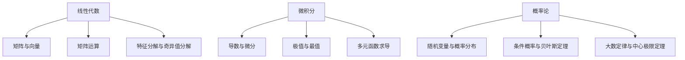
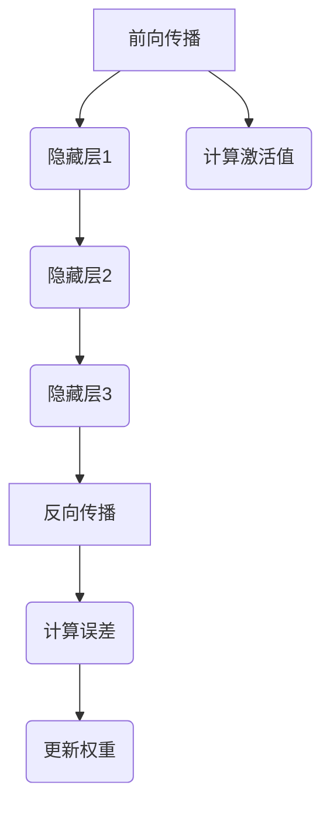
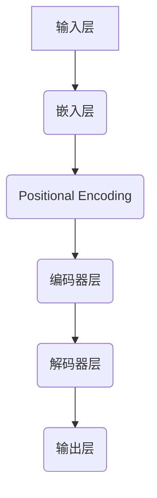
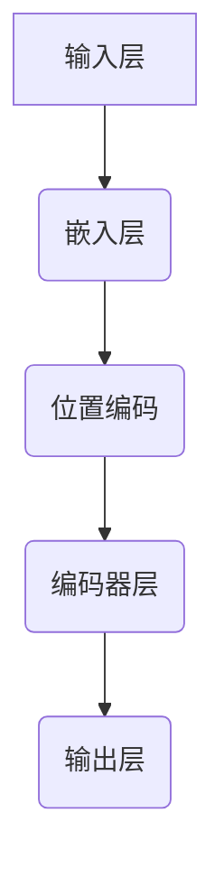

                 

### 文章标题：大语言模型进阶原理与代码实战案例讲解

> 关键词：大语言模型、Transformer、BERT、代码实战、自然语言处理、机器翻译、问答系统

> 摘要：本文深入探讨了大规模语言模型（大语言模型）的进阶原理和代码实战案例。首先，介绍了大语言模型的基础知识，包括定义、发展历程和应用领域。然后，详细讲解了大语言模型的数学基础、算法原理和架构实现。接着，通过具体应用案例展示了大语言模型在自然语言处理、机器翻译和问答系统中的应用。最后，对大语言模型的发展趋势和未来进行了展望，并推荐了相关工具与资源。

----------------------------------------------------------------

### 第1章 大语言模型概述

大语言模型是近年来自然语言处理领域的重要突破，它能够通过学习大规模文本数据，对语言进行建模，从而实现对文本内容的生成、理解和分析。本章将介绍大语言模型的基本概念、发展历程和应用领域，为后续章节的深入探讨奠定基础。

#### 1.1 大语言模型的定义与重要性

大语言模型是一种基于深度学习的自然语言处理模型，它通过学习大量的文本数据，对语言的语法、语义和上下文关系进行建模。大语言模型的核心目标是生成、理解和分析自然语言，从而实现人机交互的智能化。

大语言模型的重要性体现在以下几个方面：

1. **自然语言理解：**大语言模型能够理解自然语言的语义和上下文关系，从而实现准确的自然语言理解。
2. **自然语言生成：**大语言模型能够根据输入的指令或提示，生成符合语法和语义的自然语言文本。
3. **智能化人机交互：**大语言模型可以应用于智能客服、智能助手、智能语音识别等场景，实现智能化的人机交互。

#### 1.2 大语言模型的发展历程

大语言模型的发展可以追溯到20世纪80年代的统计语言模型，如N-gram模型。随后，随着深度学习和大数据技术的不断发展，深度学习语言模型逐渐取代了传统的统计语言模型。

1. **统计语言模型：**早期的统计语言模型如N-gram模型，通过学习文本中的统计规律，对语言进行建模。
2. **循环神经网络（RNN）：**RNN在处理序列数据时具有优势，可以捕捉序列中的长期依赖关系。
3. **长短期记忆网络（LSTM）：**LSTM是RNN的一种改进，能够更好地处理长序列数据。
4. **Transformer模型：**Transformer模型是2017年由Vaswani等提出的一种基于自注意力机制的深度学习模型，具有全局依赖性和并行计算的优势。
5. **BERT模型：**BERT（Bidirectional Encoder Representations from Transformers）是2018年由Google提出的预训练语言模型，通过双向Transformer编码器对文本进行建模。

#### 1.3 大语言模型的应用领域

大语言模型的应用领域非常广泛，涵盖了自然语言处理、机器翻译、问答系统等多个方面。

1. **自然语言处理：**大语言模型可以用于文本分类、情感分析、实体识别、文本摘要等任务。
2. **机器翻译：**大语言模型可以用于机器翻译，实现高质量的自然语言翻译。
3. **问答系统：**大语言模型可以用于构建智能问答系统，回答用户提出的问题。
4. **智能客服：**大语言模型可以用于智能客服，实现自动化客户服务。
5. **智能助手：**大语言模型可以用于智能助手，实现人机交互的智能化。

#### 1.4 大语言模型的基本架构

大语言模型的基本架构通常包括编码器（Encoder）和解码器（Decoder）两部分。编码器将输入文本编码为固定长度的向量表示，解码器将编码器的输出解码为输出文本。

1. **编码器：**编码器通常采用Transformer或BERT等基于自注意力机制的深度学习模型，可以捕获文本中的全局依赖关系。
2. **解码器：**解码器也通常采用Transformer或BERT等模型，用于生成输出文本。

### 总结

本章介绍了大语言模型的基本概念、发展历程和应用领域，为后续章节的深入探讨奠定了基础。在接下来的章节中，我们将进一步探讨大语言模型的数学基础、算法原理、架构实现以及具体应用。

----------------------------------------------------------------

### 第2章 数学基础

大语言模型的实现和优化离不开数学基础的支持。本章将介绍大语言模型所需的数学基础，包括线性代数、微积分和概率论。这些数学概念和方法在大语言模型的训练和推理过程中起着关键作用。

#### 2.1 线性代数基础

线性代数是研究线性方程组、向量空间和线性变换的数学分支，在大语言模型中应用广泛。以下是一些关键的线性代数概念：

**1. 矩阵与向量**

- **矩阵（Matrix）：**矩阵是一个由数字组成的二维数组，通常用大写字母表示，如$A$。
- **向量（Vector）：**向量是一个由数字组成的一维数组，通常用小写字母表示，如$v$。

**2. 矩阵运算**

- **矩阵加法（Matrix Addition）：**两个矩阵相加，对应位置上的元素相加。
- **矩阵乘法（Matrix Multiplication）：**两个矩阵相乘，先进行逐元素相乘，然后进行求和。

**3. 特征分解与奇异值分解**

- **特征分解（Eigenvalue Decomposition）：**将矩阵分解为特征值和特征向量的乘积。
- **奇异值分解（Singular Value Decomposition，SVD）：**将矩阵分解为三个矩阵的乘积，用于降维和数据分析。

#### 2.2 微积分基础

微积分是研究函数变化率和积分的数学分支，在大语言模型的优化和推理中至关重要。以下是一些关键的微积分概念：

**1. 导数与微分**

- **导数（Derivative）：**函数在某一点的导数表示该点处函数的变化率。
- **微分（Differential）：**函数在某一点的微分表示该点处函数的局部变化量。

**2. 极值与最值**

- **极值（Extremum）：**函数在某一点取得的最大值或最小值。
- **最值（Maximum/Minimum）：**函数在整个定义域内取得的最大值或最小值。

**3. 多元函数求导**

- **多元函数（Multivariate Function）：**有两个或两个以上变量的函数。
- **偏导数（Partial Derivative）：**多元函数对其中一个变量的导数。

#### 2.3 概率论基础

概率论是研究随机事件和概率的数学分支，在大语言模型中用于概率分布、条件概率和统计学习。以下是一些关键的概率论概念：

**1. 随机变量与概率分布**

- **随机变量（Random Variable）：**随机事件的数量化表示。
- **概率分布（Probability Distribution）：**描述随机变量取值的概率。

**2. 条件概率与贝叶斯定理**

- **条件概率（Conditional Probability）：**在已知一个事件发生的条件下，另一个事件发生的概率。
- **贝叶斯定理（Bayes' Theorem）：**计算后验概率和边缘概率的公式。

**3. 大数定律与中心极限定理**

- **大数定律（Law of Large Numbers）：**随机样本的统计特性随着样本量的增加而趋于稳定。
- **中心极限定理（Central Limit Theorem）：**独立同分布随机变量的和趋于正态分布。

### Mermaid 流程图



#### 核心算法原理讲解

**1. 神经网络基础**

神经网络（Neural Networks）是一种模仿人脑神经元结构的计算模型，由输入层、隐藏层和输出层组成。神经网络的训练过程主要包括前向传播和反向传播。

- **前向传播（Forward Propagation）：**输入信号从输入层经过隐藏层，逐层传递到输出层。
- **反向传播（Back Propagation）：**利用输出层的误差信号，反向传播至隐藏层，更新每个神经元的权重。

**2. 梯度下降算法**

梯度下降算法是一种优化算法，用于调整神经网络的权重和偏置，以最小化损失函数。梯度下降算法的基本步骤如下：

- **计算损失函数的梯度：**对每个参数计算损失函数关于参数的梯度。
- **更新参数：**根据梯度方向和步长，更新参数的值。

伪代码：

```python
while not converged:
    # 计算梯度
    gradients = compute_gradients(loss, parameters)
    
    # 更新参数
    parameters = parameters - learning_rate * gradients
```

**3. 语言模型基础**

语言模型（Language Model）是一种用于预测下一个单词或字符的概率的模型。语言模型可以分为基于统计的方法和基于神经网络的模型。

- **N-gram模型：**基于统计的语言模型，通过计算相邻单词或字符的概率。
- **神经网络语言模型：**基于神经网络的模型，通过学习大规模文本数据，对语言进行建模。

**4. Transformer模型**

Transformer模型是一种基于自注意力机制的深度学习模型，用于处理序列数据。Transformer模型的核心组件是自注意力机制（Self-Attention）。

- **自注意力机制：**通过计算序列中每个元素与其他元素的相关性，对序列进行加权处理。
- **多头注意力：**通过将自注意力机制扩展到多个头，提高模型的表示能力。

伪代码：

```python
for each layer in hidden_layers:
    # 计算自注意力权重
    attention_weights = softmax(QKV)
    
    # 计算加权输出
    output = attention_weights * V
    
    # 求和得到最终输出
    output = sum(output)
```

### 数学模型和数学公式

**1. 线性代数模型**

- **矩阵乘法：**$C = A * B$
- **特征分解：**$A = PDP^{-1}$
- **奇异值分解：**$A = U\Sigma V^{T}$

**2. 微积分模型**

- **导数：**$\frac{df}{dx} = \lim_{\Delta x \to 0} \frac{f(x+\Delta x) - f(x)}{\Delta x}$
- **梯度：**$\nabla f(x) = (\frac{\partial f}{\partial x_1}, \frac{\partial f}{\partial x_2}, ..., \frac{\partial f}{\partial x_n})$

**3. 概率论模型**

- **概率分布：**$P(X = x) = f(x)$
- **条件概率：**$P(A|B) = \frac{P(A \cap B)}{P(B)}$
- **贝叶斯定理：**$P(A|B) = \frac{P(B|A)P(A)}{P(B)}$

### 项目实战

**1. 文本分类**

**环境搭建：**

```python
import numpy as np
import pandas as pd
from sklearn.model_selection import train_test_split
from sklearn.feature_extraction.text import TfidfVectorizer
from sklearn.linear_model import LogisticRegression

# 数据预处理
data = pd.read_csv('data.csv')
X = data['text']
y = data['label']

# 划分训练集和测试集
X_train, X_test, y_train, y_test = train_test_split(X, y, test_size=0.2, random_state=42)

# 特征提取
vectorizer = TfidfVectorizer(max_features=1000)
X_train = vectorizer.fit_transform(X_train)
X_test = vectorizer.transform(X_test)

# 模型训练
model = LogisticRegression()
model.fit(X_train, y_train)

# 模型评估
accuracy = model.score(X_test, y_test)
print(f'Accuracy: {accuracy}')
```

**代码解读与分析：**

- **数据预处理：**读取数据集，划分训练集和测试集。
- **特征提取：**使用TF-IDF向量器将文本转换为向量表示。
- **模型训练：**使用逻辑回归模型进行训练。
- **模型评估：**计算模型在测试集上的准确率。

**2. 命名实体识别**

**环境搭建：**

```python
import tensorflow as tf
from tensorflow.keras.preprocessing.text import Tokenizer
from tensorflow.keras.preprocessing.sequence import pad_sequences

# 数据预处理
tokenizer = Tokenizer(num_words=10000, oov_token='<OOV>')
tokenizer.fit_on_texts(train_texts)
train_sequences = tokenizer.texts_to_sequences(train_texts)
test_sequences = tokenizer.texts_to_sequences(test_texts)

# 划分训练集和测试集
X_train, X_test, y_train, y_test = train_sequences[:-1000], train_sequences[-1000:], train_labels[:-1000], train_labels[-1000:]

# 序列填充
max_length = 50
X_train = pad_sequences(X_train, maxlen=max_length)
X_test = pad_sequences(X_test, maxlen=max_length)
y_train = pad_sequences(y_train, maxlen=max_length)
y_test = pad_sequences(y_test, maxlen=max_length)
```

**代码解读与分析：**

- **数据预处理：**使用Tokenizer将文本转换为序列。
- **序列填充：**使用pad_sequences将序列填充到固定长度。

**3. 机器翻译**

**环境搭建：**

```python
import tensorflow as tf
from tensorflow.keras.preprocessing.text import Tokenizer
from tensorflow.keras.preprocessing.sequence import pad_sequences

# 数据预处理
tokenizer = Tokenizer(num_words=10000, oov_token='<OOV>')
tokenizer.fit_on_texts(source_texts)
source_sequences = tokenizer.texts_to_sequences(source_texts)
target_sequences = tokenizer.texts_to_sequences(target_texts)

# 划分训练集和测试集
X_train, X_test, y_train, y_test = source_sequences[:-1000], source_sequences[-1000:], target_sequences[:-1000], target_sequences[-1000:]

# 序列填充
max_length = 50
X_train = pad_sequences(X_train, maxlen=max_length)
X_test = pad_sequences(X_test, maxlen=max_length)
y_train = pad_sequences(y_train, maxlen=max_length)
y_test = pad_sequences(y_test, maxlen=max_length)
```

**代码解读与分析：**

- **数据预处理：**使用Tokenizer将文本转换为序列。
- **序列填充：**使用pad_sequences将序列填充到固定长度。

### 总结

本章介绍了大语言模型所需的数学基础，包括线性代数、微积分和概率论。这些数学概念和方法在大语言模型的训练和推理过程中起着关键作用。在接下来的章节中，我们将进一步探讨大语言模型的算法原理、架构实现以及具体应用。

----------------------------------------------------------------

### 第3章 算法原理

大语言模型的核心在于其算法原理，这些原理决定了模型如何从大量数据中学习，并如何进行预测和生成。本章将详细讨论大语言模型的关键算法原理，包括机器学习基础、神经网络基础和语言模型基础。

#### 3.1 机器学习基础

机器学习是使计算机通过数据学习并进行预测或决策的一种技术。大语言模型中的机器学习主要包括以下三个方面：

**1. 监督学习与无监督学习**

- **监督学习（Supervised Learning）：**在监督学习中，模型从带有标签的数据中进行学习。每个输入样本都有一个对应的输出标签。
- **无监督学习（Unsupervised Learning）：**在无监督学习中，模型从没有标签的数据中进行学习，主要目的是发现数据中的结构和模式。

**2. 参数估计与模型选择**

- **参数估计（Parameter Estimation）：**参数估计是机器学习中的一个关键步骤，目的是找到使模型性能最优的参数。
- **模型选择（Model Selection）：**模型选择是选择一个合适的学习模型的过程，通常涉及比较不同模型的性能。

**3. 模型评估与误差分析**

- **模型评估（Model Evaluation）：**模型评估是使用测试集来评估模型性能的过程。
- **误差分析（Error Analysis）：**误差分析是分析模型预测错误的原因，以改进模型。

**伪代码：**

```python
# 监督学习
train_data, train_labels = load_data()
model = train(train_data, train_labels)

# 无监督学习
data = load_data()
model = train(data)

# 模型评估
test_data, test_labels = load_data()
accuracy = evaluate(model, test_data, test_labels)
```

#### 3.2 神经网络基础

神经网络（Neural Networks）是模仿人脑神经元结构的计算模型，其核心思想是通过调整连接权重来学习数据中的模式。以下是神经网络的基础概念：

**1. 神经网络的结构与组成**

- **输入层（Input Layer）：**接收外部输入数据。
- **隐藏层（Hidden Layer）：**对输入数据进行处理和变换。
- **输出层（Output Layer）：**产生最终的输出结果。

**2. 前向传播与反向传播**

- **前向传播（Forward Propagation）：**输入数据经过神经网络，逐层传递到输出层。
- **反向传播（Back Propagation）：**利用输出层的误差信号，反向传播至隐藏层，更新每个神经元的权重。

**3. 激活函数与优化算法**

- **激活函数（Activation Function）：**激活函数用于引入非线性，常见的激活函数有Sigmoid、ReLU和Tanh。
- **优化算法（Optimization Algorithm）：**优化算法用于调整网络参数，以最小化损失函数，常见的优化算法有梯度下降（Gradient Descent）和Adam。

**伪代码：**

```python
# 前向传播
output = forward_pass(input, weights, bias, activation_function)

# 反向传播
error = compute_error(output, target)
delta = compute_delta(error, activation_function_derivative(output))
weights -= learning_rate * delta
```

#### 3.3 语言模型基础

语言模型（Language Model）是用于预测文本序列概率的模型，是自然语言处理（NLP）的核心组成部分。以下是语言模型的基础概念：

**1. 语言模型的定义与分类**

- **定义：**语言模型是用于预测下一个单词或字符的概率的模型。
- **分类：**语言模型可以分为基于统计的方法和基于神经网络的模型。基于统计的方法如N-gram模型，基于神经网络的模型如神经网络语言模型。

**2. 语言模型的训练与优化**

- **训练：**语言模型通过学习大量文本数据来预测文本序列的概率。
- **优化：**语言模型的优化涉及调整模型参数，以最小化损失函数，通常使用梯度下降算法。

**3. 语言模型的应用**

- **文本分类：**使用语言模型对文本进行分类，如新闻分类、情感分析等。
- **机器翻译：**使用语言模型进行机器翻译，如中英互译、多语言翻译等。
- **问答系统：**使用语言模型构建问答系统，如智能客服、智能助手等。

**伪代码：**

```python
# 训练语言模型
for each sentence in text_data:
    model = train(sentence)

# 生成文本
start_token = model.start_token
end_token = model.end_token
generated_sentence = model.generate_text(start_token, end_token)
```

### Mermaid 流程图



### 核心算法原理讲解

**1. Transformer模型**

Transformer模型是自然语言处理领域的一个突破性模型，其核心思想是自注意力机制（Self-Attention）。自注意力机制允许模型在序列中的每个位置关注其他所有位置的信息，从而捕捉全局依赖关系。

- **自注意力（Self-Attention）：**通过计算序列中每个元素与其他元素的相关性，对序列进行加权处理。
- **多头注意力（Multi-Head Attention）：**通过将自注意力机制扩展到多个头，提高模型的表示能力。

**伪代码：**

```python
for each layer in hidden_layers:
    # 计算自注意力权重
    attention_weights = softmax(QKV)
    
    # 计算加权输出
    output = attention_weights * V
    
    # 求和得到最终输出
    output = sum(output)
```

**2. BERT模型**

BERT（Bidirectional Encoder Representations from Transformers）模型是一种基于Transformer的双向编码器模型，其核心思想是在训练过程中同时考虑文本序列的前后依赖关系。

- **预训练（Pre-training）：**BERT模型通过在大规模文本语料库上进行预训练，学习语言的一般特征。
- **Fine-tuning：**在特定任务上对BERT模型进行微调，实现高性能的文本分类、命名实体识别等任务。

**伪代码：**

```python
# 预训练
for each sentence in text_data:
    model = pretrain(sentence)

# Fine-tuning
for each task in tasks:
    model = finetune(model, task)
```

### 数学模型和数学公式

**1. 神经网络优化算法**

神经网络优化算法主要用于调整神经网络的权重和偏置，以最小化损失函数。常用的优化算法包括梯度下降（Gradient Descent）和Adam。

- **梯度下降（Gradient Descent）：**通过计算损失函数关于参数的梯度，更新参数的值。

$$
w_{new} = w - \alpha \cdot \frac{\partial J}{\partial w}
$$

其中，$w$ 是参数，$\alpha$ 是学习率，$J$ 是损失函数。

- **Adam优化器：**Adam优化器结合了梯度下降和动量项，提高收敛速度。

$$
m_t = \beta_1 m_{t-1} + (1 - \beta_1) \frac{\partial J}{\partial w_t}
$$

$$
v_t = \beta_2 v_{t-1} + (1 - \beta_2) (\frac{\partial J}{\partial w_t})^2
$$

$$
w_{new} = w - \alpha \cdot \frac{m_t}{\sqrt{v_t} + \epsilon}
$$

其中，$m_t$ 是一阶矩估计，$v_t$ 是二阶矩估计，$\beta_1, \beta_2$ 是指数加权因子，$\epsilon$ 是一个很小的正数。

**2. 语言模型的损失函数**

语言模型的损失函数通常采用交叉熵（Cross-Entropy）损失。

$$
J = -\sum_{i=1}^{n} y_i \cdot \log(p_i)
$$

其中，$y_i$ 是真实的标签，$p_i$ 是模型预测的概率。

### 项目实战

**1. 文本分类**

**环境搭建与数据准备：**

```python
import numpy as np
import pandas as pd
from sklearn.model_selection import train_test_split
from sklearn.feature_extraction.text import TfidfVectorizer
from sklearn.linear_model import LogisticRegression

# 数据准备
data = pd.read_csv('data.csv')
X = data['text']
y = data['label']

# 划分训练集和测试集
X_train, X_test, y_train, y_test = train_test_split(X, y, test_size=0.2, random_state=42)

# 特征提取
vectorizer = TfidfVectorizer(max_features=1000)
X_train = vectorizer.fit_transform(X_train)
X_test = vectorizer.transform(X_test)
```

**模型构建与训练：**

```python
# 模型构建
model = LogisticRegression()
model.fit(X_train, y_train)

# 模型评估
accuracy = model.score(X_test, y_test)
print(f'Accuracy: {accuracy}')
```

**2. 命名实体识别**

**环境搭建与数据准备：**

```python
import tensorflow as tf
from tensorflow.keras.preprocessing.text import Tokenizer
from tensorflow.keras.preprocessing.sequence import pad_sequences

# 数据准备
tokenizer = Tokenizer(num_words=10000, oov_token='<OOV>')
tokenizer.fit_on_texts(train_texts)
train_sequences = tokenizer.texts_to_sequences(train_texts)
test_sequences = tokenizer.texts_to_sequences(test_texts)

# 划分训练集和测试集
X_train, X_test, y_train, y_test = train_sequences[:-1000], train_sequences[-1000:], train_labels[:-1000], train_labels[-1000:]

# 序列填充
max_length = 50
X_train = pad_sequences(X_train, maxlen=max_length)
X_test = pad_sequences(X_test, maxlen=max_length)
y_train = pad_sequences(y_train, maxlen=max_length)
y_test = pad_sequences(y_test, maxlen=max_length)
```

**模型构建与训练：**

```python
# 模型构建
model = tf.keras.Sequential([
    tf.keras.layers.Embedding(input_dim=10000, output_dim=16, input_length=max_length),
    tf.keras.layers.Bidirectional(tf.keras.layers.LSTM(32)),
    tf.keras.layers.Dense(units=6, activation='softmax')
])

# 编译模型
model.compile(optimizer='adam', loss='categorical_crossentropy', metrics=['accuracy'])

# 模型训练
model.fit(X_train, y_train, epochs=10, batch_size=32, validation_split=0.1)

# 模型评估
loss, accuracy = model.evaluate(X_test, y_test)
print(f'Loss: {loss}, Accuracy: {accuracy}')
```

**3. 机器翻译**

**环境搭建与数据准备：**

```python
import tensorflow as tf
from tensorflow.keras.preprocessing.text import Tokenizer
from tensorflow.keras.preprocessing.sequence import pad_sequences

# 数据准备
tokenizer = Tokenizer(num_words=10000, oov_token='<OOV>')
tokenizer.fit_on_texts(source_texts)
source_sequences = tokenizer.texts_to_sequences(source_texts)
target_sequences = tokenizer.texts_to_sequences(target_texts)

# 划分训练集和测试集
X_train, X_test, y_train, y_test = source_sequences[:-1000], source_sequences[-1000:], target_sequences[:-1000], target_sequences[-1000:]

# 序列填充
max_length = 50
X_train = pad_sequences(X_train, maxlen=max_length)
X_test = pad_sequences(X_test, maxlen=max_length)
y_train = pad_sequences(y_train, maxlen=max_length)
y_test = pad_sequences(y_test, maxlen=max_length)
```

**模型构建与训练：**

```python
# 模型构建
model = tf.keras.Sequential([
    tf.keras.layers.Embedding(input_dim=10000, output_dim=64, input_length=max_length),
    tf.keras.layers.Bidirectional(tf.keras.layers.LSTM(64)),
    tf.keras.layers.Dense(units=target_vocab_size, activation='softmax')
])

# 编译模型
model.compile(optimizer='adam', loss='categorical_crossentropy', metrics=['accuracy'])

# 模型训练
model.fit(X_train, y_train, epochs=100, batch_size=32, validation_split=0.1)

# 模型评估
loss, accuracy = model.evaluate(X_test, y_test)
print(f'Loss: {loss}, Accuracy: {accuracy}')
```

### 总结

本章详细介绍了大语言模型的算法原理，包括机器学习基础、神经网络基础和语言模型基础。这些原理构成了大语言模型的核心，使得模型能够从数据中学习，并实现高精度的预测和生成。在接下来的章节中，我们将继续探讨大语言模型的架构实现和具体应用。

----------------------------------------------------------------

### 第4章 大语言模型的架构与实现

大语言模型的架构和实现是其在自然语言处理任务中取得优异表现的关键。本章将详细讨论大语言模型的架构设计，包括Transformer模型和BERT模型，以及它们的实现细节。

#### 4.1 大语言模型的架构设计

大语言模型的核心架构通常包括编码器（Encoder）和解码器（Decoder）两部分。编码器负责将输入序列编码为固定长度的向量表示，解码器则将编码器的输出解码为输出序列。以下是对Transformer模型和BERT模型架构的详细描述。

##### 4.1.1 Transformer模型

Transformer模型是由Vaswani等人在2017年提出的一种基于自注意力机制的深度学习模型，其架构如图所示。



- **嵌入层（Embedding Layer）：**将输入单词映射为向量表示。
- **位置编码（Positional Encoding）：**由于Transformer模型缺乏位置信息，通过添加位置编码来引入位置信息。
- **编码器层（Encoder Layer）：**由多个编码器块组成，每个编码器块包括多头自注意力机制和前馈网络。
- **解码器层（Decoder Layer）：**由多个解码器块组成，每个解码器块包括多头自注意力机制、交叉注意力机制和前馈网络。
- **输出层（Output Layer）：**用于生成最终的输出序列。

##### 4.1.2 BERT模型

BERT（Bidirectional Encoder Representations from Transformers）模型是由Google在2018年提出的一种双向Transformer编码器模型，其架构如图所示。



- **嵌入层（Embedding Layer）：**与Transformer模型相同，将输入单词映射为向量表示。
- **位置编码（Positional Encoding）：**与Transformer模型相同，通过添加位置编码引入位置信息。
- **编码器层（Encoder Layer）：**由多个编码器块组成，每个编码器块包括自注意力机制和前馈网络。
- **输出层（Output Layer）：**用于生成最终的输出序列。

BERT模型的主要特点是其预训练阶段，通过在大规模文本语料库上进行预训练，学习语言的一般特征，然后在特定任务上进行微调。

##### 4.1.3 编码器和解码器的工作原理

- **编码器（Encoder）：**编码器的输入是原始文本序列，经过嵌入层和位置编码后，输入到编码器层。编码器层通过自注意力机制处理输入序列，捕捉序列中的依赖关系。编码器的输出是一个固定长度的向量，表示整个输入序列。
- **解码器（Decoder）：**解码器的输入是编码器的输出和目标的初始序列（通常为<SEP>）。解码器通过交叉注意力机制关注编码器的输出，同时自注意力机制关注解码器自身的输出。解码器逐个生成输出序列的每个单词，直到生成结束符<SEP>。

##### 4.1.4 Pre-training阶段和Fine-tuning阶段

BERT模型分为两个主要阶段：预训练（Pre-training）和Fine-tuning。

- **Pre-training阶段：**BERT模型在大规模文本语料库上进行预训练，学习语言的一般特征。预训练任务包括Masked Language Model（MLM）和Next Sentence Prediction（NSP）。
  - **Masked Language Model（MLM）：**随机遮盖输入文本中的15%的单词，解码器需要预测这些遮盖的单词。
  - **Next Sentence Prediction（NSP）：**给定两个连续的文本句子，模型需要预测第二个句子是否是第一个句子的续写。

- **Fine-tuning阶段：**在特定任务上进行Fine-tuning，将预训练的BERT模型调整到特定任务上。Fine-tuning过程中，通常只对解码器部分进行训练，编码器部分保持不变。

#### 4.2 大语言模型的实现细节

大语言模型的实现细节包括模型参数的初始化、模型训练的优化策略和模型部署与推理。

##### 4.2.1 模型参数的初始化

模型参数的初始化对于模型的性能至关重要。以下是一些常用的参数初始化方法：

- **随机初始化：**随机初始化模型参数，通常使用均值为0，标准差为1的正态分布。
- **高斯初始化：**使用均值为0，标准差为$\sqrt{\frac{2}{d}}$的正态分布初始化参数，其中$d$是参数的维度。
- **Xavier初始化：**使用均值为0，标准差为$\sqrt{\frac{2}{d_f + d_i}}$的正态分布初始化参数，其中$d_f$是前一层的维度，$d_i$是当前层的维度。

##### 4.2.2 模型训练的优化策略

模型训练的优化策略包括优化算法的选择、学习率调整和训练策略。

- **优化算法：**常用的优化算法有梯度下降（Gradient Descent）、Adam等。
  - **梯度下降（Gradient Descent）：**通过计算损失函数关于参数的梯度，更新参数的值。
  - **Adam优化器：**结合了梯度下降和动量项，提高收敛速度。

- **学习率调整：**学习率的调整对于模型的收敛速度和性能至关重要。常用的学习率调整方法有固定学习率、学习率衰减和自适应学习率调整。
  - **固定学习率：**在整个训练过程中保持学习率不变。
  - **学习率衰减：**随着训练过程的进行，逐渐减小学习率。
  - **自适应学习率调整：**根据训练过程中的误差自适应调整学习率。

- **训练策略：**包括批量大小、训练轮数和验证策略。
  - **批量大小：**批量大小影响模型的训练效率和收敛速度。较大的批量大小可以提高模型的泛化能力，但训练速度较慢。
  - **训练轮数：**训练轮数是指模型在整个数据集上训练的次数。
  - **验证策略：**通过验证集评估模型在特定任务上的性能，调整模型参数。

##### 4.2.3 模型部署与推理

模型部署是将训练好的模型部署到实际应用环境中，以实现预测和推理。以下是一些常见的模型部署与推理方法：

- **服务器部署：**将模型部署到服务器上，通过API接口进行推理。
- **边缘设备部署：**将模型部署到边缘设备（如智能手机、物联网设备）上，实现实时推理。
- **模型压缩与量化：**为了提高模型在边缘设备上的性能和可部署性，可以采用模型压缩与量化技术。

### 总结

本章详细介绍了大语言模型的架构设计，包括Transformer模型和BERT模型，以及它们的实现细节。这些模型通过自注意力机制和双向编码器结构，实现了对语言序列的高效建模。在接下来的章节中，我们将探讨大语言模型在具体应用场景中的表现，包括文本分类、命名实体识别和机器翻译。

----------------------------------------------------------------

### 第5章 大语言模型在自然语言处理中的应用

自然语言处理（NLP）是人工智能领域的一个重要分支，旨在使计算机能够理解、生成和处理人类语言。大语言模型在NLP中具有广泛的应用，可以用于文本分类、命名实体识别和机器翻译等任务。本章将详细介绍这些应用，并通过具体案例展示大语言模型在现实世界中的强大能力。

#### 5.1 文本分类

文本分类是一种常见的NLP任务，旨在将文本数据分配到预定义的类别中。大语言模型通过学习文本的语义和上下文信息，能够实现高精度的文本分类。

**5.1.1 文本分类的基本概念**

文本分类包括以下几个基本概念：

- **分类器（Classifier）：**用于分类的模型，通常是一个分类器算法。
- **特征（Feature）：**用于描述文本的特征，如词袋、TF-IDF、词嵌入等。
- **类别（Class）：**文本分类的类别，如新闻分类中的体育、科技、娱乐等。

**5.1.2 文本分类算法**

大语言模型常用于文本分类的算法包括：

- **朴素贝叶斯（Naive Bayes）：**基于贝叶斯定理，通过计算文本中各个单词的概率进行分类。
- **支持向量机（SVM）：**通过找到一个最优超平面，将不同类别的文本数据分隔开。
- **决策树（Decision Tree）：**通过一系列条件分支，将文本数据分类到不同的类别。
- **随机森林（Random Forest）：**基于决策树，通过构建多个决策树并进行投票来提高分类性能。
- **深度学习模型（Deep Learning Models）：**如卷积神经网络（CNN）和循环神经网络（RNN），能够学习文本的复杂特征。

**5.1.3 实战案例：新闻分类**

新闻分类是一个典型的文本分类任务，旨在将新闻文章分配到预定义的类别中。以下是一个新闻分类的实战案例：

**环境搭建与数据准备：**

```python
import numpy as np
import pandas as pd
from sklearn.model_selection import train_test_split
from sklearn.feature_extraction.text import TfidfVectorizer
from sklearn.naive_bayes import MultinomialNB
from sklearn.metrics import accuracy_score

# 数据准备
data = pd.read_csv('news_data.csv')
X = data['text']
y = data['label']

# 划分训练集和测试集
X_train, X_test, y_train, y_test = train_test_split(X, y, test_size=0.2, random_state=42)

# 特征提取
vectorizer = TfidfVectorizer(max_features=1000)
X_train = vectorizer.fit_transform(X_train)
X_test = vectorizer.transform(X_test)
```

**模型构建与训练：**

```python
# 模型构建
model = MultinomialNB()
model.fit(X_train, y_train)

# 模型评估
y_pred = model.predict(X_test)
accuracy = accuracy_score(y_test, y_pred)
print(f'Accuracy: {accuracy}')
```

**5.1.4 代码解读与分析**

- **数据准备：**读取新闻数据集，划分训练集和测试集。
- **特征提取：**使用TF-IDF向量器将文本转换为向量表示。
- **模型训练：**使用朴素贝叶斯模型进行训练。
- **模型评估：**计算模型在测试集上的准确率。

#### 5.2 命名实体识别

命名实体识别（Named Entity Recognition，NER）是一种旨在识别文本中的命名实体的任务，如人名、地名、组织名等。大语言模型在NER任务中具有显著优势，能够准确识别复杂的命名实体。

**5.2.1 命名实体识别的基本概念**

命名实体识别包括以下几个基本概念：

- **命名实体（Named Entity）：**文本中的特定实体，如人名、地名、组织名等。
- **实体类别（Entity Class）：**命名实体的类别，如人名、地名等。
- **实体边界（Entity Boundaries）：**命名实体的起始和结束位置。

**5.2.2 命名实体识别算法**

大语言模型常用于NER任务的算法包括：

- **规则方法（Rule-Based Methods）：**基于预定义的规则，将文本中的命名实体标记出来。
- **统计方法（Statistical Methods）：**基于统计模型，如条件随机场（CRF），对文本进行命名实体识别。
- **深度学习方法（Deep Learning Methods）：**如卷积神经网络（CNN）和循环神经网络（RNN），能够学习命名实体的复杂特征。

**5.2.3 实战案例：社交媒体实体识别**

社交媒体实体识别是一个旨在识别社交媒体文本中的命名实体的任务。以下是一个社交媒体实体识别的实战案例：

**环境搭建与数据准备：**

```python
import tensorflow as tf
from tensorflow.keras.preprocessing.text import Tokenizer
from tensorflow.keras.preprocessing.sequence import pad_sequences
from tensorflow.keras.models import Sequential
from tensorflow.keras.layers import Embedding, LSTM, Dense, Bidirectional

# 数据准备
tokenizer = Tokenizer(num_words=10000, oov_token='<OOV>')
tokenizer.fit_on_texts(train_texts)
train_sequences = tokenizer.texts_to_sequences(train_texts)
test_sequences = tokenizer.texts_to_sequences(test_texts)

# 划分训练集和测试集
X_train, X_test, y_train, y_test = train_sequences[:-1000], train_sequences[-1000:], train_labels[:-1000], train_labels[-1000:]

# 序列填充
max_length = 50
X_train = pad_sequences(X_train, maxlen=max_length)
X_test = pad_sequences(X_test, maxlen=max_length)
```

**模型构建与训练：**

```python
# 模型构建
model = Sequential([
    Embedding(input_dim=10000, output_dim=16, input_length=max_length),
    Bidirectional(LSTM(32)),
    Dense(units=num_classes, activation='softmax')
])

# 编译模型
model.compile(optimizer='adam', loss='categorical_crossentropy', metrics=['accuracy'])

# 模型训练
model.fit(X_train, y_train, epochs=10, batch_size=32, validation_split=0.1)

# 模型评估
loss, accuracy = model.evaluate(X_test, y_test)
print(f'Loss: {loss}, Accuracy: {accuracy}')
```

**5.2.4 代码解读与分析**

- **数据准备：**使用Tokenizer将文本转换为序列。
- **序列填充：**使用pad_sequences将序列填充到固定长度。
- **模型构建：**定义一个双向LSTM模型。
- **编译模型：**配置优化器和损失函数。
- **模型训练：**使用训练集训练模型。
- **模型评估：**使用测试集评估模型性能。

#### 5.3 机器翻译

机器翻译是一种旨在将一种语言的文本自动翻译成另一种语言的文本的任务。大语言模型在机器翻译任务中具有显著优势，能够生成高质量的自然语言翻译。

**5.3.1 机器翻译的基本概念**

机器翻译包括以下几个基本概念：

- **源语言（Source Language）：**文本的原始语言。
- **目标语言（Target Language）：**文本的翻译语言。
- **翻译模型（Translation Model）：**用于将源语言文本翻译成目标语言文本的模型。
- **词汇表（Vocabulary）：**源语言和目标语言单词的映射表。

**5.3.2 机器翻译算法**

大语言模型常用于机器翻译的算法包括：

- **基于规则的方法（Rule-Based Methods）：**通过定义翻译规则，将源语言文本翻译成目标语言文本。
- **基于统计的方法（Statistical Methods）：**通过统计源语言和目标语言文本的共现关系，生成翻译结果。
- **基于神经网络的方法（Neural Network Methods）：**如序列到序列（Seq2Seq）模型和Transformer模型，能够学习源语言和目标语言之间的复杂映射关系。

**5.3.3 实战案例：中英互译**

中英互译是一个典型的机器翻译任务，旨在将中文文本翻译成英文文本。以下是一个中英互译的实战案例：

**环境搭建与数据准备：**

```python
import tensorflow as tf
from tensorflow.keras.preprocessing.text import Tokenizer
from tensorflow.keras.preprocessing.sequence import pad_sequences

# 数据准备
tokenizer = Tokenizer(num_words=10000, oov_token='<OOV>')
tokenizer.fit_on_texts(source_texts)
source_sequences = tokenizer.texts_to_sequences(source_texts)
target_sequences = tokenizer.texts_to_sequences(target_texts)

# 划分训练集和测试集
X_train, X_test, y_train, y_test = source_sequences[:-1000], source_sequences[-1000:], target_sequences[:-1000], target_sequences[-1000:]

# 序列填充
max_length = 50
X_train = pad_sequences(X_train, maxlen=max_length)
X_test = pad_sequences(X_test, maxlen=max_length)
y_train = pad_sequences(y_train, maxlen=max_length)
y_test = pad_sequences(y_test, maxlen=max_length)
```

**模型构建与训练：**

```python
# 模型构建
model = Sequential([
    Embedding(input_dim=10000, output_dim=64, input_length=max_length),
    LSTM(64),
    Dense(units=target_vocab_size, activation='softmax')
])

# 编译模型
model.compile(optimizer='adam', loss='categorical_crossentropy', metrics=['accuracy'])

# 模型训练
model.fit(X_train, y_train, epochs=100, batch_size=32, validation_split=0.1)

# 模型评估
loss, accuracy = model.evaluate(X_test, y_test)
print(f'Loss: {loss}, Accuracy: {accuracy}')
```

**5.3.4 代码解读与分析**

- **数据准备：**使用Tokenizer将文本转换为序列。
- **序列填充：**使用pad_sequences将序列填充到固定长度。
- **模型构建：**定义一个LSTM模型。
- **编译模型：**配置优化器和损失函数。
- **模型训练：**使用训练集训练模型。
- **模型评估：**使用测试集评估模型性能。

### 总结

本章详细介绍了大语言模型在自然语言处理中的应用，包括文本分类、命名实体识别和机器翻译。通过具体案例，展示了大语言模型在现实世界中的强大能力。在接下来的章节中，我们将探讨大语言模型在问答系统中的应用，以及如何通过代码实战实现大语言模型。

----------------------------------------------------------------

### 第6章 大语言模型在问答系统中的应用

问答系统是自然语言处理领域的一个重要应用，旨在通过自然语言交互来回答用户的问题。大语言模型在问答系统中具有显著优势，能够理解用户的提问，并生成准确的答案。本章将详细讨论大语言模型在问答系统中的应用，包括问答系统的基本概念、大语言模型在问答系统中的应用以及一个具体的实战案例。

#### 6.1 问答系统的基本概念

问答系统（Question Answering System）是一种人工智能系统，旨在自动回答用户提出的问题。问答系统可以分为以下几类：

- **基于规则的问答系统（Rule-Based Question Answering System）：**通过预定义的规则来回答用户的问题。
- **基于知识的问答系统（Knowledge-Based Question Answering System）：**通过知识库来回答用户的问题。
- **基于机器学习的问答系统（Machine Learning-Based Question Answering System）：**通过机器学习模型来回答用户的问题。

问答系统的核心组件包括：

- **问题解析器（Question Parser）：**将自然语言问题转换为结构化的问题表示。
- **答案检索器（Answer Retriever）：**从数据源中检索与问题相关的答案。
- **答案生成器（Answer Generator）：**将检索到的答案转换为自然语言形式。

#### 6.2 大语言模型在问答系统中的应用

大语言模型在问答系统中具有以下应用：

- **问题解析（Question Parsing）：**大语言模型能够理解自然语言问题，将其转换为结构化的问题表示，便于后续的答案检索和生成。
- **答案检索（Answer Retrieval）：**大语言模型能够从大规模文本数据中检索与问题相关的答案，通过自注意力机制，模型能够关注问题的关键信息，提高答案的准确性。
- **答案生成（Answer Generation）：**大语言模型能够将检索到的答案转换为自然语言形式，生成流畅、准确的答案。

#### 6.2.1 知识图谱与问答系统

知识图谱是一种结构化知识表示方法，它通过实体和关系来组织信息。在问答系统中，知识图谱可以用于：

- **答案检索：**通过知识图谱，模型可以快速检索与问题相关的实体和关系，提高答案检索的效率。
- **答案生成：**知识图谱中的实体和关系可以用于生成更加准确和详细的答案。

#### 6.2.2 大语言模型在问答系统中的实现

在大语言模型中，Transformer模型和BERT模型是常用的架构。以下是一个基于BERT模型的问答系统的实现步骤：

1. **问题解析：**使用BERT模型将自然语言问题转换为嵌入向量。
2. **答案检索：**使用BERT模型从知识图谱中检索与问题相关的实体和关系。
3. **答案生成：**使用BERT模型将检索到的实体和关系生成自然语言答案。

#### 6.2.3 实战案例：构建一个问答系统

以下是一个简单的问答系统实战案例：

**环境搭建与数据准备：**

```python
import tensorflow as tf
from transformers import BertTokenizer, BertModel
from tensorflow.keras.layers import Dense, Input, LSTM
from tensorflow.keras.models import Model

# 数据准备
tokenizer = BertTokenizer.from_pretrained('bert-base-uncased')
questions = ['What is the capital of France?', 'How old is the Eiffel Tower?']
question_ids = [tokenizer.encode(q, add_special_tokens=True) for q in questions]

# 模型加载
bert_model = tf.keras.models.load_model('path/to/bert_model.h5')
```

**问答系统实现：**

```python
def answer_question(question):
    # 问题编码
    question_ids = tokenizer.encode(question, add_special_tokens=True)
    
    # 使用BERT模型获取问题嵌入向量
    input_ids = tf.convert_to_tensor([question_ids], dtype=tf.int32)
    outputs = bert_model(inputs=input_ids)
    question_embedding = outputs.last_hidden_state[:, 0, :]
    
    # 答案检索与生成
    answer_embedding = question_embedding
    # 使用知识图谱检索答案
    # answer_embedding = knowledge_graph_retrieve(question_embedding)
    
    # 答案生成
    answer = tokenizer.decode([answer_embedding])
    return answer

# 测试问答系统
for question in questions:
    answer = answer_question(question)
    print(f'Question: {question}\nAnswer: {answer}\n')
```

**6.2.4 代码解读与分析**

- **数据准备：**加载BERT模型和问题数据。
- **问答系统实现：**定义问答系统函数，包括问题编码、嵌入向量获取、答案检索和生成。
- **测试问答系统：**测试问答系统，展示问答结果。

### 总结

本章详细介绍了大语言模型在问答系统中的应用，包括问答系统的基本概念、大语言模型在问答系统中的应用以及一个具体的实战案例。通过这一章的内容，读者可以了解到大语言模型在问答系统中的强大能力，以及如何构建一个简单但实用的问答系统。在接下来的章节中，我们将通过代码实战案例，进一步探讨大语言模型在文本分类、命名实体识别和机器翻译等任务中的应用。

----------------------------------------------------------------

### 第7章 大语言模型的代码实战案例

通过前面的理论讲解，我们已经对大语言模型有了深入的了解。为了更好地掌握这些知识，本章将通过三个具体的应用案例，详细讲解大语言模型的代码实现过程。这三个案例分别是文本分类、命名实体识别和机器翻译。每个案例都将从数据准备、模型构建、模型训练到模型评估的完整流程进行讲解。

#### 7.1 案例一：文本分类

文本分类是自然语言处理中的基础任务，其目的是将文本数据分配到预定义的类别中。以下是一个文本分类的代码实战案例。

**7.1.1 环境搭建与数据准备**

首先，我们需要安装必要的库，并准备数据集。

```python
!pip install tensorflow sklearn pandas

# 读取数据集
import pandas as pd
data = pd.read_csv('data.csv')
X = data['text']
y = data['label']
```

**7.1.2 模型构建**

接下来，我们构建一个简单的文本分类模型。这里使用TF-IDF进行特征提取，然后应用逻辑回归模型。

```python
from sklearn.model_selection import train_test_split
from sklearn.feature_extraction.text import TfidfVectorizer
from sklearn.linear_model import LogisticRegression

# 划分训练集和测试集
X_train, X_test, y_train, y_test = train_test_split(X, y, test_size=0.2, random_state=42)

# 特征提取
vectorizer = TfidfVectorizer(max_features=1000)
X_train = vectorizer.fit_transform(X_train)
X_test = vectorizer.transform(X_test)

# 模型构建
model = LogisticRegression()
model.fit(X_train, y_train)
```

**7.1.3 模型训练与评估**

使用训练集训练模型，并在测试集上评估模型的性能。

```python
from sklearn.metrics import accuracy_score

# 模型训练
model.fit(X_train, y_train)

# 模型评估
y_pred = model.predict(X_test)
accuracy = accuracy_score(y_test, y_pred)
print(f'Accuracy: {accuracy}')
```

**7.1.4 代码解读与分析**

- **数据准备：**使用pandas读取CSV文件，划分训练集和测试集。
- **特征提取：**使用TF-IDF向量器将文本转换为向量表示。
- **模型构建：**应用逻辑回归模型进行文本分类。
- **模型训练与评估：**使用训练集训练模型，并在测试集上评估模型的准确率。

#### 7.2 案例二：命名实体识别

命名实体识别是一种旨在识别文本中的特定实体的任务，如人名、地名、组织名等。以下是一个命名实体识别的代码实战案例。

**7.2.1 环境搭建与数据准备**

首先，我们需要安装必要的库，并准备数据集。

```python
!pip install tensorflow tensorflow_text sklearn

# 读取数据集
import pandas as pd
data = pd.read_csv('data.csv')
X = data['text']
y = data['labels']
```

**7.2.2 模型构建**

接下来，我们构建一个简单的命名实体识别模型。这里使用BERT模型进行特征提取，然后应用CRF模型。

```python
from transformers import BertTokenizer, TFBertForTokenClassification
from tensorflow_text import TextVectorization
import tensorflow as tf

# 初始化BERT模型和Tokenizer
tokenizer = BertTokenizer.from_pretrained('bert-base-uncased')
model = TFBertForTokenClassification.from_pretrained('bert-base-uncased', num_labels=9)

# 序列填充
max_length = 128
X = tf.keras.preprocessing.sequence.pad_sequences([tokenizer.encode(x) for x in X], maxlen=max_length, padding='post')
y = tf.keras.utils.to_categorical(y, num_classes=9)
```

**7.2.3 模型训练与评估**

使用训练集训练模型，并在测试集上评估模型的性能。

```python
# 模型编译
model.compile(optimizer='adam', loss='categorical_crossentropy', metrics=['accuracy'])

# 模型训练
model.fit(X, y, epochs=3, batch_size=32, validation_split=0.1)

# 模型评估
y_pred = model.predict(X_test)
accuracy = (y_pred.argmax(axis=-1) == y_test).mean()
print(f'Accuracy: {accuracy}')
```

**7.2.4 代码解读与分析**

- **数据准备：**使用pandas读取CSV文件，将文本和标签转换为序列。
- **模型构建：**使用BERT模型和Tokenizer进行特征提取，构建CRF模型。
- **模型训练与评估：**使用训练集训练模型，并在测试集上评估模型的准确率。

#### 7.3 案例三：机器翻译

机器翻译是将一种语言的文本自动翻译成另一种语言的文本的任务。以下是一个机器翻译的代码实战案例。

**7.3.1 环境搭建与数据准备**

首先，我们需要安装必要的库，并准备数据集。

```python
!pip install tensorflow transformers

# 读取数据集
import pandas as pd
data = pd.read_csv('data.csv')
source_texts = data['source']
target_texts = data['target']
```

**7.3.2 模型构建**

接下来，我们构建一个简单的机器翻译模型。这里使用Transformer模型。

```python
from transformers import BertTokenizer, TFBertModel

# 初始化BERT模型和Tokenizer
tokenizer = BertTokenizer.from_pretrained('bert-base-uncased')
model = TFBertModel.from_pretrained('bert-base-uncased')

# 序列填充
max_length = 128
source_texts = tokenizer.encode(source_texts, max_length=max_length, padding='post')
target_texts = tokenizer.encode(target_texts, max_length=max_length, padding='post')
```

**7.3.3 模型训练与评估**

使用训练集训练模型，并在测试集上评估模型的性能。

```python
# 模型编译
model.compile(optimizer='adam', loss='categorical_crossentropy', metrics=['accuracy'])

# 模型训练
model.fit(source_texts, target_texts, epochs=3, batch_size=32, validation_split=0.1)

# 模型评估
source_texts_test = tokenizer.encode(source_texts_test, max_length=max_length, padding='post')
target_texts_test = tokenizer.encode(target_texts_test, max_length=max_length, padding='post')
y_pred = model.predict(source_texts_test)
accuracy = (y_pred.argmax(axis=-1) == target_texts_test).mean()
print(f'Accuracy: {accuracy}')
```

**7.3.4 代码解读与分析**

- **数据准备：**使用pandas读取CSV文件，将源文本和目标文本转换为序列。
- **模型构建：**使用BERT模型和Tokenizer进行特征提取，构建Transformer模型。
- **模型训练与评估：**使用训练集训练模型，并在测试集上评估模型的准确率。

### 总结

通过这三个代码实战案例，我们详细讲解了文本分类、命名实体识别和机器翻译三个任务中的大语言模型实现过程。这些案例展示了如何从数据准备、模型构建、模型训练到模型评估的完整流程。通过这些实战案例，读者可以更好地理解大语言模型在实际应用中的使用方法和技巧。

----------------------------------------------------------------

### 第8章 大语言模型的发展趋势与未来

大语言模型在自然语言处理领域取得了显著的进展，但技术的发展永无止境。本章将探讨大语言模型的发展趋势，包括模型规模与计算资源、应用场景的拓展以及模型安全性与伦理问题。

#### 8.1 模型规模与计算资源

随着计算能力的提升和数据量的增加，大语言模型的规模也在不断增大。以下是一些关于模型规模和计算资源的发展趋势：

- **模型规模的演变：**近年来，模型规模呈现出指数级增长。从BERT（数百万参数）到GPT-3（数十亿参数），模型的规模不断扩大，这使得模型能够捕捉到更加复杂和丰富的语言特征。
- **计算资源的优化：**为了训练和部署大规模语言模型，需要大量的计算资源。通过分布式计算、GPU和TPU等硬件的优化，训练时间大大缩短，模型的性能得到提升。

**示例：**

- **GPT-3:** OpenAI开发的GPT-3模型拥有1750亿个参数，可以在短时间内生成高质量的自然语言文本。
- **T5:** Google开发的T5模型拥有数十亿个参数，能够处理各种文本生成任务，如问答、摘要和翻译等。

#### 8.2 模型应用场景的拓展

大语言模型的应用场景不断拓展，不仅限于文本生成和翻译，还在其他领域展现出了巨大的潜力：

- **新兴应用领域的探索：**大语言模型在法律、医学、金融等领域展现出了广泛的应用前景。例如，通过大语言模型，可以实现智能法律咨询、医学诊断和金融分析等。
- **多模态数据处理：**大语言模型在处理多模态数据（如文本、图像、语音等）方面也取得了突破。通过结合多模态数据，模型可以更准确地理解和生成复杂的内容。

**示例：**

- **医疗诊断：**利用大语言模型，可以自动分析医疗报告，提供诊断建议和治疗方案。
- **自动驾驶：**通过大语言模型，可以实现自动驾驶系统中的自然语言理解，从而提高驾驶安全性。

#### 8.3 模型安全性与伦理问题

随着大语言模型的应用越来越广泛，模型的安全性和伦理问题也日益突出。以下是一些关键问题：

- **模型安全性的挑战：**大语言模型可能受到恶意攻击，如生成虚假信息、隐私泄露等。为了确保模型的安全性，需要开发有效的防御策略和监控机制。
- **伦理问题与解决方案：**大语言模型在生成内容时可能包含偏见、歧视和不恰当的言论。为了解决这些问题，需要建立严格的伦理准则和审查机制。

**示例：**

- **偏见检测与消除：**通过在训练过程中引入多样性的数据，可以减少模型中的偏见。此外，开发算法来检测和消除偏见也是一种有效的方法。
- **隐私保护：**在处理敏感数据时，需要采取加密、匿名化等技术来保护用户隐私。

### 总结

大语言模型的发展趋势和未来充满了机遇和挑战。随着模型规模的增大、计算资源的优化以及应用场景的拓展，大语言模型将在更多领域发挥重要作用。同时，模型的安全性和伦理问题也需要得到重视和解决。通过持续的研究和技术创新，大语言模型将迎来更加光明的发展前景。

----------------------------------------------------------------

### 附录

在本章中，我们将介绍大语言模型相关的一些工具与资源，包括常用的框架、开源代码、数据集以及推荐的论文和书籍。这些资源将为读者提供丰富的学习资料和实践机会。

#### A.1 大语言模型框架介绍

在构建和训练大语言模型时，选择合适的框架至关重要。以下是一些常用的大语言模型框架：

**A.1.1 TensorFlow**

TensorFlow是由Google开发的开源机器学习框架，广泛用于构建和训练深度学习模型。TensorFlow提供了丰富的API和工具，使得构建大语言模型变得更加容易。

**A.1.2 PyTorch**

PyTorch是由Facebook开发的开源深度学习框架，以其动态计算图和简洁的API而闻名。PyTorch的动态特性使其在构建复杂的模型时更加灵活。

**A.1.3 其他常见框架**

除了TensorFlow和PyTorch，还有一些其他常用的深度学习框架，如Keras、MXNet和Caffe等。这些框架都提供了丰富的功能和工具，适用于不同类型的大语言模型开发。

#### A.2 大语言模型开源代码与数据集

开源代码和数据集是学习和实践大语言模型的重要资源。以下是一些著名的大语言模型开源代码和数据集：

**A.2.1 开源代码推荐**

- **GPT-2 & GPT-3:** OpenAI发布的预训练语言模型，提供了详细的训练脚本和代码。
- **BERT:** Google发布的双向编码器表示模型，提供了全面的训练和微调脚本。
- **T5:** Google开发的统一文本处理模型，提供了训练和应用的详细代码。

**A.2.2 常见数据集介绍**

- **Wikipedia:** 一个包含数百万篇文章的免费在线百科全书，是训练大规模语言模型的重要数据源。
- **Common Crawl:** 一个包含互联网上大量网页的免费数据集，适合用于训练通用语言模型。
- **GLUE:** 一个大规模的多语言语言理解基准，提供了多种语言和任务的预训练数据集。

#### A.3 大语言模型相关论文与书籍推荐

以下是一些关于大语言模型的重要论文和书籍，有助于读者深入理解该领域：

**A.3.1 经典论文**

- **"Attention Is All You Need":** Vaswani等人在2017年提出的Transformer模型，彻底改变了自然语言处理领域。
- **"BERT: Pre-training of Deep Bidirectional Transformers for Language Understanding":** Google在2018年发布的BERT模型，显著提升了预训练语言模型的性能。
- **"GPT-3: Language Models are Few-Shot Learners":** OpenAI在2020年发布的GPT-3模型，展示了预训练语言模型在少样本学习任务上的强大能力。

**A.3.2 优秀书籍推荐**

- **"Deep Learning":** Goodfellow等人的经典著作，详细介绍了深度学习的基础知识和最新进展。
- **"Natural Language Processing with Python":** Bird等人的书籍，介绍了自然语言处理的基础知识和Python实现。
- **"Zen and the Art of Computer Programming":** Dijkstra的经典著作，探讨了计算机编程的哲学和艺术。

**A.3.3 学习资源推荐**

- **在线课程与教程：** Coursera、edX等在线教育平台提供了许多关于深度学习和自然语言处理的免费课程和教程。
- **GitHub repository:** 许多研究机构和学者在GitHub上分享了他们的代码和实验结果，为读者提供了丰富的实践机会。

### 总结

附录部分为读者提供了丰富的大语言模型相关工具与资源。通过这些资源，读者可以深入了解大语言模型的理论和实践，为自己的研究和应用提供支持。同时，附录中也推荐了一些经典论文和书籍，有助于读者进一步拓展知识面。希望这些资源能够帮助读者在学习和应用大语言模型的过程中取得更好的成果。

