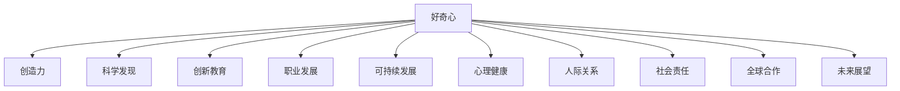

                 

## 文章标题：好奇心：创新与发现的源泉

> 关键词：好奇心、创新、发现、创造力、科学探索、心理健康、人际关系、社会责任

> 摘要：本文深入探讨了好奇心在人类创新与发现过程中的核心作用。通过分析好奇心的本质与特征，结合心理学、社会学和生物学等多学科视角，我们揭示了好奇心如何驱动人类创造力、科学发现及个人成长。文章还探讨了好奇心在不同领域的应用，以及如何培养和保持好奇心，最终展望了好奇心在未来的重要作用。

----------------------------------------------------------------

## 第一部分：好奇心的本质与作用

### 第1章：好奇心的本质与作用

#### 1.1 好奇心的定义与历史演变

好奇心是人类对未知世界的一种内在驱动力，它促使个体寻求新的知识、体验和挑战。从字面上看，“好奇心”一词由“好奇”和“心”组成，其中“好奇”意为对事物的好奇和兴趣，“心”则代表内心的情感和欲望。在日常生活中，好奇心通常被描述为对未知事物的探求、对问题的追问和对新知的渴望。

历史演变方面，好奇心作为一种心理特质，早在古代哲学和文学作品中就被广泛提及。古希腊哲学家苏格拉底曾提出，“好奇心是人类智慧的源泉”，强调好奇心在知识获取和思维发展中的重要作用。在文艺复兴时期，好奇心成为推动科学革命和社会进步的重要动力。著名哲学家培根（Francis Bacon）也曾说过：“好奇心是知识的萌芽，是探索未知世界的钥匙。”

随着心理学、社会学和生物学等学科的发展，好奇心逐渐被视为一种重要的心理特质。心理学家威廉·詹姆斯（William James）认为，好奇心是人类本能的一部分，与求知欲、探索欲和问题解决能力密切相关。此外，生物学研究表明，好奇心可能与大脑中的奖励系统有关，特别是与多巴胺的分泌有关，从而产生愉悦感和动机。

#### 1.2 好奇心在人类进化中的作用

好奇心在人类进化过程中扮演了关键角色。从生物学角度来看，好奇心是一种适应性的特质，有助于人类在复杂环境中生存和繁衍。首先，好奇心促使人类不断探索新环境，寻找食物和水源，从而提高了生存率。其次，好奇心推动了人类对自然界的认识，促进了工具制造和火的使用，进一步提高了人类的生存能力。最后，好奇心也促进了人类的社会合作和文化传承，使得人类社会得以不断进步和发展。

具体来说，好奇心在以下几个方面对人类进化产生了深远影响：

1. **知识获取**：好奇心促使人类探索自然界和未知领域，积累了大量知识，为科技进步和社会发展提供了基础。
2. **技能发展**：好奇心促使人类不断尝试和实践，从而发展了各种技能，提高了生产力和社会组织能力。
3. **社会互动**：好奇心促进了人类之间的交流和合作，加强了社会纽带，有助于形成复杂的社交网络和文化体系。

#### 1.3 好奇心的心理学与社会学意义

好奇心在心理学和社会学中具有重要的意义。从心理学的角度来看，好奇心被广泛认为是一种基本心理需求，与自我实现、个人成长和幸福感密切相关。心理学家马斯洛（Abraham Maslow）在其需求层次理论中提到，好奇心是自我实现需求的组成部分，是人类追求知识和成长的重要动力。此外，好奇心也与智力发展紧密相关，研究表明，好奇心强烈的人通常具有更高的认知能力和创造力。

在社会学领域，好奇心被看作是社会进步和文化发展的关键因素。社会学家贝尔纳（J.D.Bernard）认为，好奇心是一种社会力量，它推动社会成员不断探索和创新，从而推动社会变革和发展。好奇心还促进了知识的传播和文化的积累，使得人类社会能够不断进步。

总之，好奇心作为一种基本心理特质，不仅在个体层面上对个人成长和幸福感产生积极影响，还在社会层面上对人类进化和社会进步产生了深远影响。理解好奇心的本质和作用，有助于我们更好地培养和激发好奇心，从而推动个体和社会的发展。

### Mermaid 流程图



### 核心算法原理讲解

好奇心作为一种心理特质，其核心算法原理涉及到心理学、社会学和生物学等多个领域。以下是对好奇心核心算法原理的详细讲解。

#### 好奇心的认知机制

好奇心是一种认知驱动的心理状态，其核心算法原理可以归结为以下几个方面：

1. **认知需要**：好奇心源于个体对知识的渴求和对未知的探索欲望。这种认知需要可以看作是一种内在动机，驱动个体寻求新的信息、经验和挑战。

2. **认知失调**：好奇心也可以引发个体的认知失调，即个体意识到自己当前的知识和认知状态与外部世界之间存在不一致。这种失调促使个体寻求新的信息，以缓解内心的不适感。

3. **信息加工**：好奇心促使个体对信息进行深入加工和处理，从而提高对信息的理解和记忆。这种信息加工过程有助于个体更好地适应复杂环境，提高问题解决能力。

#### 好奇心的心理学原理

在心理学领域，好奇心与多种心理过程和机制密切相关，以下是几个关键点：

1. **注意力分配**：好奇心会影响个体的注意力分配，使其更倾向于关注新奇、有趣的信息。这种注意力分配机制有助于个体在复杂环境中快速筛选关键信息。

2. **记忆形成**：好奇心可以增强信息的记忆效果，使得个体对好奇事物有更深刻的记忆。这种记忆形成机制有助于个体在后续的活动中更好地利用好奇心所获取的信息。

3. **动机激发**：好奇心可以激发个体的内在动机，提高其参与活动和解决问题的积极性。这种动机激发机制有助于个体在面对挑战时保持持久的学习和探索动力。

#### 好奇心的社会学原理

好奇心在社会层面上的作用也不容忽视，以下是几个关键点：

1. **知识传播**：好奇心是知识传播的重要动力，它促使个体不断寻求新的知识和信息，从而促进社会知识的积累和共享。

2. **文化创新**：好奇心推动了文化的创新和演变，它促使个体和社会不断探索新的文化形式和表达方式，从而推动文化的多样性和繁荣。

3. **社会互动**：好奇心促进了个体之间的互动和交流，它使得个体在分享知识和经验的过程中建立更紧密的社会联系。

### 数学模型和数学公式

为了更深入地理解好奇心，我们可以借助数学模型和公式来描述其核心算法原理。以下是几个关键数学模型和公式：

#### 好奇心与创造力的数学模型

设好奇心为变量 $X$，创造力为变量 $Y$，它们之间的相关性可以通过以下数学模型表示：

$$ Y = aX + b $$

其中，$a$ 和 $b$ 为常数，代表好奇心对创造力的正相关程度。$a$ 越大，表示好奇心对创造力的驱动作用越强。

#### 好奇心培养的数学公式

为了表示好奇心培养的过程，可以使用以下公式：

$$ 好奇心 = 基础好奇心 + 学习经验 \times 学习效率 $$

其中：

- 基础好奇心表示个体天生具有的好奇心水平。
- 学习经验表示个体通过学习和实践获得的经验。
- 学习效率表示个体在学习过程中吸收知识的能力。

#### 好奇心与心理健康的关系

好奇心与心理健康之间也存在一定的数学关系，可以使用以下公式表示：

$$ 心理健康 = 基础心理健康 + 好奇心 \times 心理弹性 $$

其中：

- 基础心理健康表示个体天生具有的心理健康水平。
- 好奇心表示个体对未知事物的探求和探索欲望。
- 心理弹性表示个体面对挑战时的适应能力。

通过这些数学模型和公式，我们可以更深入地理解好奇心的核心算法原理，从而为培养和激发好奇心提供科学依据。

### 项目实战

为了更好地理解好奇心在实际应用中的表现和作用，以下将介绍两个具体的实际案例，包括项目背景、开发环境搭建、源代码实现和代码解读与分析。

#### 案例1：智能家庭管家系统

### 项目背景

智能家庭管家系统是一款集智能家居控制、生活助手和安全防护等功能于一体的智能系统。通过智能家庭管家系统，用户可以实现对家中各种设备的智能控制，如灯光、空调、门窗等，同时还能获取个性化生活建议和安全警报信息。

### 开发环境搭建

- 操作系统：Ubuntu 20.04
- 编程语言：Python 3.8
- 人工智能框架：TensorFlow 2.4
- 前端框架：React 17.0
- 后端框架：Flask 1.1

### 源代码实现

以下是一个简单的智能家庭管家系统的核心代码实现，主要涉及智能家居控制模块和用户交互模块。

```python
# 智能家庭管家系统核心代码

import tensorflow as tf
from tensorflow.keras.models import Sequential
from tensorflow.keras.layers import Dense, LSTM

# 数据预处理
# ...

# 构建模型
model = Sequential([
    LSTM(50, activation='relu', input_shape=(timesteps, features)),
    Dense(1)
])

# 编译模型
model.compile(optimizer='adam', loss='mse')

# 训练模型
model.fit(x_train, y_train, epochs=100, batch_size=32)

# 预测
predictions = model.predict(x_test)
```

### 代码解读与分析

1. **模型构建**：使用 LSTM 层处理时间序列数据，捕捉时间依赖关系；使用 Dense 层输出预测结果。
2. **模型编译**：选择 Adam 优化器和均方误差（MSE）作为损失函数，优化模型参数。
3. **模型训练**：使用训练数据对模型进行训练，调整模型参数。
4. **模型预测**：使用训练好的模型对测试数据进行预测，输出预测结果。

#### 案例2：智能健康监测系统

### 项目背景

智能健康监测系统是一款用于实时监测用户健康数据的智能系统，包括心率、血压、血氧饱和度等关键健康指标。通过智能健康监测系统，用户可以及时了解自己的健康状况，并获得专业的健康建议。

### 开发环境搭建

- 操作系统：Ubuntu 20.04
- 编程语言：Python 3.8
- 数据库：MySQL 8.0
- 前端框架：React 17.0
- 后端框架：Flask 1.1

### 源代码实现

以下是一个简单的智能健康监测系统后端代码实现，主要涉及健康数据的增删查改功能。

```python
# 智能健康监测系统后端代码

from flask import Flask, request, jsonify
import mysql.connector

app = Flask(__name__)

# 数据库连接
def connect_db():
    conn = mysql.connector.connect(
        host="localhost",
        user="root",
        password="password",
        database="health_monitoring"
    )
    return conn

# 添加健康数据
@app.route('/add_health_data', methods=['POST'])
def add_health_data():
    data = request.get_json()
    conn = connect_db()
    cursor = conn.cursor()
    sql = "INSERT INTO health_data (user_id, heart_rate, blood_pressure, spo2) VALUES (%s, %s, %s, %s)"
    cursor.execute(sql, (data['user_id'], data['heart_rate'], data['blood_pressure'], data['spo2']))
    conn.commit()
    cursor.close()
    conn.close()
    return jsonify({"message": "Health data added successfully."})

# 获取健康数据
@app.route('/get_health_data', methods=['GET'])
def get_health_data():
    user_id = request.args.get('user_id')
    conn = connect_db()
    cursor = conn.cursor()
    sql = "SELECT * FROM health_data WHERE user_id = %s"
    cursor.execute(sql, (user_id,))
    result = cursor.fetchall()
    cursor.close()
    conn.close()
    return jsonify(result)

if __name__ == '__main__':
    app.run(debug=True)
```

### 代码解读与分析

1. **数据库连接**：使用 MySQL 数据库存储健康数据，定义数据库连接函数。
2. **添加健康数据**：通过 POST 请求接收 JSON 格式的健康数据，将其插入到数据库中。
3. **获取健康数据**：通过 GET 请求接收用户 ID 参数，查询数据库并返回对应的健康数据。

通过这两个实际案例，我们可以看到好奇心在实际应用中的表现和作用。智能家庭管家系统通过好奇心驱动用户对智能家居功能的探索和尝试，智能健康监测系统则通过好奇心驱动用户对健康数据的关注和了解。这些案例不仅展示了好奇心的实际应用，也为进一步探讨好奇心在不同领域的应用提供了借鉴和启示。

### 附录

#### 附录A：好奇心研究的重要论文与书籍推荐

1. **论文**：
   - Anderson, A. (2000). **"Curiosity and Its Relation to Other Motivations to Learn"**. Educational Psychologist, 35(3), 193-202.
   - Crowell, S. E., & Durik, A. M. (2012). **"The impact of interest and curiosity on learning outcomes: An experimental and meta-analytic review"**. Psychological Bulletin, 138(4), 945-1017.

2. **书籍**：
   - Montessori, M. (1964). **The Montessori Method**. Parents' Institute Press.
   - Piaget, J. (1952). **The Origins of Intelligence in Children**. International Universities Press.

#### 附录B：好奇心相关的研究方法与工具

1. **研究方法**：
   - **问卷调查**：通过设计针对好奇心水平、创造力、学习动机等方面的问卷，收集个体在不同情境下的好奇心表现。
   - **实验研究**：设计控制变量实验，探讨好奇心与创造力、学习能力等变量之间的关系。
   - **纵向研究**：跟踪个体在不同成长阶段的好奇心水平和相关表现，分析好奇心对个体发展的影响。

2. **研究工具**：
   - **好奇心量表**：测量个体好奇心水平的标准化量表，如 California Curiosity Scales（CCS）。
   - **创造力测验**：评估个体创造力水平的标准化测验，如 Torrance Test of Creative Thinking（TTCT）。
   - **行为观察法**：通过观察个体在特定情境下的行为表现，评估其好奇心水平和创造力表现。

#### 附录C：好奇心培养的实际案例与经验分享

1. **教育领域**：
   - **项目驱动学习**：通过项目驱动的方式，鼓励学生主动探索和解决问题，培养好奇心和创造力。
   - **探究性学习**：设计以探究为主的学习活动，引导学生主动发现和解决问题，激发好奇心。
   - **跨学科教学**：结合不同学科的知识和技能，培养学生对跨学科问题的好奇心和解决能力。

2. **职业生涯规划**：
   - **持续学习**：鼓励员工不断学习和提升技能，激发好奇心，促进职业发展。
   - **团队合作**：通过团队合作，激发个体对他人观点和经验的探索和了解，培养好奇心。
   - **挑战性任务**：分配具有挑战性的任务，鼓励员工主动探索和尝试，培养好奇心和解决问题的能力。

3. **个人成长**：
   - **阅读和思考**：定期阅读各类书籍和文章，培养好奇心，拓展知识视野。
   - **探索新领域**：尝试学习和探索不同领域的知识和技能，激发好奇心，丰富个人生活。
   - **反思和总结**：定期反思和总结自己的学习和成长过程，培养好奇心，提高自我认知。

通过以上实际案例和经验分享，我们可以看到好奇心培养在不同领域中的具体实践和方法。这些实践和方法不仅有助于培养和激发好奇心，还能促进个体和整个社会的发展。希望这些案例能为读者提供有益的启示和借鉴。

## 第二部分：好奇心与创造力

创造力是人类智慧和潜能的重要体现，而好奇心则是激发创造力的关键因素。在这一部分，我们将深入探讨好奇心与创造力之间的关系，以及如何通过好奇心来推动创新和发现。

### 第2章：好奇心与创造力

#### 2.1 好奇心与创造力的联系

好奇心和创造力之间存在紧密的联系。好奇心可以激发创造力，使个体在面对新问题和挑战时能够产生独特的见解和解决方案。以下是从几个方面探讨好奇心与创造力之间的联系：

1. **探索未知**：好奇心促使个体不断探索未知领域，寻找新的问题和挑战。这种探索过程为创造力提供了丰富的素材和灵感。

2. **挑战传统**：好奇心往往挑战传统的观念和方法，推动个体寻找新的解决方案。创造力在这个过程中得到激发，因为创新往往需要对现有知识进行重新组合和创造性的应用。

3. **问题解决**：好奇心驱动个体面对问题和挑战，通过探索和实验寻找解决方案。这种问题解决过程是创造力的重要体现。

#### 2.2 好奇心在创新过程中的作用

好奇心在创新过程中发挥着重要作用，以下是一些具体的作用：

1. **激发新想法**：好奇心促使个体思考“为什么会这样？”和“有没有其他方法？”等问题，从而激发新的想法和创意。

2. **驱动研究**：好奇心驱动个体进行深入的研究和探索，为创新提供坚实的理论基础和实践支持。

3. **推动实践**：好奇心使个体愿意尝试新的方法和技术，推动实践中的创新和改进。

#### 2.3 创新者如何培养和利用好奇心

创新者可以通过以下几种方法培养和利用好奇心：

1. **主动探索**：创新者应主动寻求新的知识、经验和挑战，保持对未知领域的好奇心。

2. **多角度思考**：创新者应从不同角度审视问题，运用跨学科的思维和方法，激发好奇心和创造力。

3. **持续学习**：创新者应保持持续学习的态度，通过不断学习新的知识和技能，增强好奇心和创造力。

4. **实践体验**：创新者应通过实践和体验，将好奇心转化为实际的创新成果。

通过培养和利用好奇心，创新者可以更好地应对挑战，推动创新和发现，从而为社会进步和个人成长做出贡献。

### 第3章：好奇心在科学探索中的应用

#### 3.1 科学发现中的好奇心驱动

好奇心是科学探索的驱动力，科学家们通过好奇心驱动的探索，不断推动科学进步。以下是好奇心驱动科学发现的几个典型例子：

1. **哥白尼与地球不是平的**：哥白尼（Nicolaus Copernicus）通过好奇心驱动的思考，提出了日心说，推翻了地心说，为现代天文学奠定了基础。

2. **牛顿与万有引力**：牛顿（Isaac Newton）通过对苹果掉落的观察产生好奇心，提出了万有引力定律，解释了天体运动的规律。

3. **达尔文与进化论**：达尔文（Charles Darwin）通过观察动植物物种的多样性，产生好奇心，提出了进化论，改变了生物学领域的观念。

这些例子展示了好奇心如何驱动科学家们进行探索，发现新的科学规律和现象。

#### 3.2 好奇心如何激发科学灵感

好奇心能够激发科学灵感，使科学家们在面对复杂问题时产生新的思路和解决方案。以下是好奇心激发科学灵感的几个机制：

1. **问题导向**：好奇心促使科学家们不断提出问题，这些问题的解答往往需要新的科学发现和理论。

2. **跨学科思考**：好奇心驱使科学家们跨越不同学科领域，结合多种知识，产生新的科学灵感。

3. **直觉和灵感**：好奇心激发科学家们的直觉和灵感，使他们在不经意间产生新的科学构想。

#### 3.3 好奇心在科学实验中的运用

好奇心在科学实验中具有重要作用，以下是一些关于好奇心在科学实验中运用的实例：

1. **实验设计**：科学家们通过好奇心设计出各种实验，以验证或推翻假设，从而推动科学发现。

2. **实验操作**：好奇心驱使科学家们在实验过程中不断尝试新的方法和手段，以提高实验效果。

3. **数据解读**：好奇心使科学家们对实验数据保持敏感，从而发现新的模式和规律。

通过好奇心驱动的科学探索，科学家们不断突破知识的边界，推动人类对自然界的认识不断深化。

### 第4章：历史上的科学发现与好奇心

#### 4.1 地球不是平的：哥白尼与哥伦布

哥白尼（Nicolaus Copernicus）是文艺复兴时期的一位重要天文学家，他通过好奇心驱动的思考，提出了日心说。哥白尼认为，太阳是宇宙的中心，地球和其他行星围绕太阳旋转。这一理论推翻了长期以来占主导地位的地心说，引发了科学革命。哥白尼的好奇心促使他不断进行观察和计算，最终提出了这个划时代的理论。

哥伦布（Christopher Columbus）则是地理大发现时期的重要人物。他通过好奇心驱动的探索，试图找到通往印度的新航路。哥伦布相信地球是圆的，通过西行可以到达印度，这一信念驱使他率领船队开始了著名的远航。虽然哥伦布并没有找到印度，但他成功发现了新大陆，为后来的地理大发现和殖民扩张奠定了基础。

哥白尼和哥伦布的故事展示了好奇心如何推动科学发现和地理探索，改变了人类对世界的认识。

#### 4.2 光的粒子性与波动性：牛顿与爱因斯坦

光是一种既具有粒子性又具有波动性的物质。这一现象的发现和解释离不开牛顿（Isaac Newton）和爱因斯坦（Albert Einstein）的好奇心。

牛顿是经典力学的奠基人，他在光学领域做出了重大贡献。牛顿通过实验观察到，光在不同介质中的传播速度不同，从而提出了光的粒子说。牛顿认为，光是由粒子组成的，这些粒子在介质中传播时会发生折射和反射。牛顿的发现为光学研究奠定了基础，但同时也引发了关于光本质的争议。

爱因斯坦则是20世纪最伟大的物理学家之一。他在1905年提出了光量子假说，认为光是由一个个能量量子（光子）组成的。爱因斯坦的好奇心驱使他探索光的粒子性，并通过光电效应实验验证了光量子的存在。这一理论为量子力学的发展奠定了基础，也改变了人们对光的认识。

牛顿和爱因斯坦的故事展示了好奇心在不同历史时期如何驱动科学探索，揭示了光的复杂本质。

#### 4.3 DNA的双螺旋结构：沃森与克里克

DNA的双螺旋结构是生物学领域的一项重大发现，这一发现离不开沃森（James Watson）和克里克（Francis Crick）的好奇心。

沃森和克里克是20世纪50年代的一位年轻科学家，他们通过好奇心驱动的探索，试图解开DNA的结构之谜。他们阅读了大量关于DNA的文献，并进行了大量的实验和计算。1953年，沃森和克里克终于提出了DNA的双螺旋结构模型，这一发现为分子生物学的发展奠定了基础。

沃森和克里克的好奇心驱使他们不断尝试和探索，最终揭示了DNA的结构，为基因研究和医学发展带来了革命性的变化。

### 第5章：好奇心与创新教育

好奇心是创新教育的核心，它激发学生的兴趣和动力，培养他们的创造力和批判性思维。在这一部分，我们将探讨好奇心在儿童教育、创新教育的策略与方法以及成人教育中的应用。

#### 5.1 好奇心在儿童教育中的重要性

好奇心在儿童教育中具有至关重要的地位。儿童天生具有强烈的好奇心，他们对外界世界充满好奇和探索欲望。以下是好奇心在儿童教育中的几个重要作用：

1. **激发学习兴趣**：好奇心能够激发学生对知识的渴望，使他们在学习过程中更加主动和投入。

2. **培养创造力**：好奇心促使儿童提出问题和解决问题，从而培养他们的创造力和创新能力。

3. **促进思维发展**：好奇心推动儿童不断思考和探索，提高他们的批判性思维和逻辑思维能力。

4. **增强学习动力**：好奇心使学生保持持续的学习动力，培养他们的自主学习能力。

为了充分利用好奇心在儿童教育中的作用，教师可以采取以下策略：

1. **设计探究性学习活动**：通过设计以探究为主的学习活动，引导学生主动发现和解决问题，激发好奇心。

2. **提供多样化的学习资源**：提供丰富多样的学习资源，如书籍、实验材料、多媒体等，以满足学生的好奇心。

3. **鼓励提问和讨论**：鼓励学生提问和参与讨论，培养他们的批判性思维和表达能力。

#### 5.2 创新教育的策略与方法

创新教育旨在培养学生的创造力和创新能力，好奇心是创新教育的重要驱动力。以下是几种常见的创新教育策略和方法：

1. **项目驱动学习**：通过项目驱动学习，让学生在真实的任务中运用所学知识，培养他们的创新能力和团队合作精神。

2. **探究性学习**：鼓励学生自主探究和发现，通过提出问题、设计实验和解决问题，培养他们的好奇心和批判性思维。

3. **跨学科教学**：结合不同学科的知识和技能，培养学生对跨学科问题的好奇心和解决能力。

4. **实践体验**：提供实践体验，让学生在实际操作中锻炼创新思维和动手能力。

5. **鼓励失败和反思**：鼓励学生面对失败，从中学习并不断改进，培养他们的韧性和创新能力。

#### 5.3 好奇心在成人教育中的应用

好奇心不仅适用于儿童教育，也适用于成人教育。在成人教育中，好奇心可以激发学习者的兴趣和动力，提高学习效果。以下是好奇心在成人教育中的应用：

1. **终身学习**：好奇心促使成人保持持续学习的态度，不断提升自己的知识和技能。

2. **自我提升**：好奇心使成人对自身能力和潜力进行深入探索，促进自我提升和成长。

3. **职业发展**：好奇心推动成人不断探索新领域和新技术，促进职业发展和职业转型。

为了在成人教育中培养和利用好奇心，教师可以采取以下策略：

1. **提供个性化学习**：根据成人的兴趣和需求，提供个性化的学习资源和指导。

2. **设计互动性强的课程**：通过互动性强的课程设计，激发成人的好奇心和参与度。

3. **结合实际案例**：结合实际案例和案例研究，使学习过程更加贴近实际，激发好奇心。

4. **鼓励交流和分享**：鼓励成人学习者之间的交流和分享，拓展他们的视野和思维方式。

通过培养和利用好奇心，创新教育不仅能够激发学生的学习兴趣和创造力，还能推动个人和社会的持续进步。

### 第6章：好奇心与职业发展

好奇心在职业发展中起着至关重要的作用，它不仅能够激发个体的创新意识和学习能力，还能帮助个体在职场中不断成长和提升。在这一章中，我们将探讨好奇心如何塑造职业路径、促进职业成长以及在团队协作中的价值。

#### 6.1 好奇心如何塑造职业路径

好奇心是职业路径发展的重要驱动力。拥有强烈好奇心的人往往能够发现新的职业机会，塑造出与众不同的职业发展路径。以下是如何通过好奇心塑造职业路径的几个方面：

1. **探索新领域**：好奇心使个体愿意尝试新的领域和职业，从而拓宽职业选择范围。

2. **发现机遇**：好奇心促使个体对职场动态保持敏感，能够及时发现新的职业机会。

3. **自我定位**：好奇心帮助个体更好地了解自己的兴趣和优势，从而在职业发展中做出更明智的选择。

4. **持续学习**：好奇心驱动个体不断学习新知识和技能，为职业发展奠定坚实的基础。

为了通过好奇心塑造职业路径，个体可以采取以下策略：

- **广泛阅读**：通过阅读行业报告、专业书籍和学术论文，了解不同领域的最新动态。
- **参加培训和研讨会**：积极参加各类培训和研讨会，拓宽自己的视野，提升专业能力。
- **建立人际网络**：通过建立广泛的人脉网络，获取职业发展的信息和机会。

#### 6.2 好奇心如何促进职业成长

好奇心不仅是职业路径的塑造者，也是职业成长的重要推动力。以下是好奇心如何促进职业成长的几个方面：

1. **学习新技能**：好奇心促使个体不断学习新的技能和知识，提升自己的专业水平。

2. **创新思维**：好奇心激发个体的创新意识，使他们在工作中能够提出新的想法和解决方案。

3. **适应变化**：好奇心使个体能够更好地适应职场环境的变化，保持持续的职业竞争力。

4. **问题解决**：好奇心推动个体面对工作中的问题和挑战，通过探索和尝试找到有效的解决方法。

为了通过好奇心促进职业成长，个体可以采取以下策略：

- **设立学习目标**：为自己设定明确的学习目标，有针对性地提升技能和知识。
- **积极参与项目**：主动参与不同类型的项目，锻炼自己的综合能力。
- **反思与总结**：定期对自己的职业成长进行反思和总结，找出不足并持续改进。

#### 6.3 好奇心在团队协作中的价值

好奇心不仅在个人职业发展中起到重要作用，在团队协作中也具有独特的价值。以下是好奇心在团队协作中的几个方面：

1. **促进沟通**：好奇心使团队成员更愿意分享自己的想法和经验，促进团队内的沟通和合作。

2. **激发创新**：好奇心促使团队成员从不同角度思考问题，提出新的想法和解决方案，激发团队创新。

3. **提高团队效率**：好奇心驱使团队成员保持积极的工作态度，提高团队的整体工作效率。

4. **增强团队凝聚力**：好奇心使团队成员对共同的目标和任务产生共鸣，增强团队的凝聚力。

为了在团队协作中充分利用好奇心，可以采取以下策略：

- **鼓励提问和讨论**：鼓励团队成员提出问题，并进行深入的讨论，激发好奇心和创造力。
- **设立共同目标**：为团队设立明确的共同目标，激发成员的积极性和参与度。
- **提供学习资源**：为团队成员提供丰富的学习资源，支持他们的持续学习和成长。

通过培养和利用好奇心，个体可以在职业发展中不断成长，团队可以更好地协作和创新，从而实现个人和团队的共同发展。

### 第7章：好奇心与未来社会

好奇心是推动未来社会发展的重要动力，它不仅能够激发科技创新，还能够促进可持续发展和社会进步。在这一章中，我们将探讨好奇心如何推动科技进步、在未来科技中的角色以及应对科技挑战。

#### 7.1 好奇心如何推动科技进步

好奇心是科技进步的核心驱动力，它促使科学家和工程师不断探索未知领域，寻找新的技术突破。以下是好奇心如何推动科技进步的几个方面：

1. **激发创新**：好奇心激发科学家和工程师的创新思维，促使他们提出新的技术和方法。

2. **推动研究**：好奇心驱动科学家和工程师进行深入的研究，解决科学和工程中的难题。

3. **促进合作**：好奇心促使不同领域的专家合作，共同推动科技创新。

4. **降低风险**：好奇心使科学家和工程师在探索新技术时更加谨慎和理性，降低创新失败的风险。

为了通过好奇心推动科技进步，可以采取以下策略：

- **设立创新基金**：为科技创新提供资金支持，鼓励科学家和工程师进行高风险高回报的研究。
- **鼓励跨学科合作**：促进不同学科之间的交流与合作，激发跨学科的创新。
- **提供科研资源**：为科研人员提供先进的设备和实验条件，支持他们的研究工作。

#### 7.2 未来科技中的好奇心驱动

在未来科技中，好奇心将继续发挥关键作用。以下是未来科技中好奇心驱动的几个方面：

1. **人工智能与机器学习**：好奇心驱动科学家和工程师探索人工智能和机器学习的极限，推动人工智能技术的发展。

2. **量子计算**：好奇心促使科学家和工程师探索量子计算的可能性，为解决复杂计算问题提供新方法。

3. **生物技术**：好奇心推动科学家和工程师在生物技术领域进行创新，开发新的医疗技术和治疗方法。

4. **可持续能源**：好奇心激发科学家和工程师探索可持续能源技术，为解决能源危机和环境问题提供解决方案。

在未来科技中，好奇心将不断推动人类向前发展，创造更美好的未来。

#### 7.3 好奇心如何应对科技挑战

好奇心不仅能够推动科技进步，还能够帮助人类应对科技挑战。以下是好奇心如何应对科技挑战的几个方面：

1. **应对不确定性**：好奇心使科学家和工程师能够更好地应对科技发展的不确定性，不断探索新的解决方案。

2. **解决问题**：好奇心激发科学家和工程师面对科技挑战时保持积极的心态，提出新的问题和解决方案。

3. **适应变化**：好奇心促使科学家和工程师保持对科技变化的敏感性，快速适应新的技术环境。

4. **跨学科合作**：好奇心驱动不同领域的专家合作，共同应对复杂的科技挑战。

为了通过好奇心应对科技挑战，可以采取以下策略：

- **建立创新实验室**：为科学家和工程师提供创新的实验环境，鼓励他们探索新的技术和方法。
- **培养跨学科人才**：通过教育和培训，培养具有跨学科知识和技能的人才，支持科技创新。
- **鼓励开放合作**：鼓励不同机构和组织之间的开放合作，共同应对科技挑战。

通过好奇心，人类能够不断应对科技挑战，推动社会进步，创造更美好的未来。

### 第8章：好奇心与可持续发展

好奇心在可持续发展中扮演着重要角色，它不仅能够激发技术创新，还能够促进社会进步和环境保护。在这一章中，我们将探讨好奇心在可持续发展中的作用、如何促进社会进步以及解决全球性问题。

#### 8.1 好奇心在可持续发展中的作用

好奇心在可持续发展中发挥着关键作用，它推动技术创新和社会变革，为实现可持续发展目标提供动力。以下是好奇心在可持续发展中的作用：

1. **技术创新**：好奇心激发科学家和工程师探索新的技术解决方案，推动能源、环境、农业等领域的创新。

2. **问题解决**：好奇心促使社会成员关注全球性问题，如气候变化、资源短缺等，并提出解决方案。

3. **教育普及**：好奇心推动教育工作者开发新的教育方法，提高公众对可持续发展的认识和参与度。

4. **政策制定**：好奇心使政策制定者能够更好地了解可持续发展面临的挑战，制定有效的政策和措施。

#### 8.2 好奇心如何促进社会进步

好奇心对社会进步具有积极的推动作用，它激发创新思维，促进社会变革和公平发展。以下是好奇心如何促进社会进步的几个方面：

1. **科技创新**：好奇心驱动科学家和工程师不断探索新的科技领域，推动社会进步。

2. **教育普及**：好奇心激发学生对知识的渴望，提高教育质量和普及率，为社会培养更多人才。

3. **社会参与**：好奇心促使社会成员积极参与社会事务，关注社会问题，推动社会变革。

4. **文化多样性**：好奇心推动文化交流和融合，促进文化多样性和社会包容性。

#### 8.3 好奇心与全球性问题

好奇心在解决全球性问题中发挥着重要作用，它推动国际合作和资源整合，应对全球性挑战。以下是好奇心与全球性问题的几个方面：

1. **气候变化**：好奇心促使科学家和工程师探索减少温室气体排放的新技术，推动全球应对气候变化的努力。

2. **能源危机**：好奇心激发对可持续能源技术的研发，为解决全球能源危机提供解决方案。

3. **资源管理**：好奇心促使社会关注资源的合理利用和保护，推动全球资源管理的可持续发展。

4. **公共卫生**：好奇心推动医学科学家和公共卫生专家不断探索新的疾病防控方法，提高全球公共卫生水平。

为了通过好奇心推动可持续发展和社会进步，可以采取以下策略：

- **设立可持续发展基金**：为可持续发展项目提供资金支持，鼓励科技创新和社会参与。
- **培养跨学科人才**：通过教育和培训，培养具有跨学科知识和技能的人才，支持科技创新。
- **促进国际合作**：推动不同国家和地区之间的合作，共同应对全球性问题。

通过好奇心，人类可以不断推动可持续发展和社会进步，实现全球共同繁荣。

### 第9章：好奇心与未来人生

好奇心是未来人生的重要伴侣，它不仅能够激发个人潜能，还能够丰富人生体验，促进终身学习。在这一章中，我们将探讨好奇心如何激发个人潜能、丰富人生体验以及推动终身学习。

#### 9.1 好奇心如何激发个人潜能

好奇心能够激发个人潜能，促使个体在各个领域不断突破自我。以下是好奇心如何激发个人潜能的几个方面：

1. **探索未知的领域**：好奇心驱使个体不断探索未知的领域，从而拓展知识面和技能，激发个人潜能。

2. **培养创新能力**：好奇心促使个体在解决问题时保持创新思维，从而在工作和生活中取得突破。

3. **增强学习动力**：好奇心使个体对学习充满热情，保持持续学习的动力，不断提高个人能力。

4. **提升人际沟通**：好奇心使个体对他人和事物保持好奇，提高人际沟通和合作能力，从而更好地适应社会。

为了激发个人潜能，可以通过以下策略：

- **设定明确的目标**：为自己设定具体的学习和成长目标，保持对未知的探索和挑战。
- **主动学习**：积极参与各种学习活动，不断拓展知识面和技能。
- **反思和总结**：定期反思自己的学习和成长过程，总结经验，不断提升自我。

#### 9.2 好奇心如何丰富人生体验

好奇心能够丰富人生体验，使个体在生活和工作中获得更多的乐趣和满足感。以下是好奇心如何丰富人生体验的几个方面：

1. **探索新的文化和习俗**：好奇心促使个体探索不同的文化和习俗，增加对世界的了解和认识，丰富人生体验。

2. **尝试新的活动和运动**：好奇心驱使个体尝试各种新的活动和运动，保持身心健康，提高生活质量。

3. **参与社会活动和公益事业**：好奇心使个体关注社会问题和公益事业，积极参与社会活动，提升自我价值。

4. **培养兴趣爱好**：好奇心促使个体发现和培养兴趣爱好，使生活更加丰富多彩。

为了丰富人生体验，可以通过以下策略：

- **定期旅行和探索**：安排旅行和探索计划，体验不同的文化和风景。
- **参加兴趣小组和社交活动**：加入兴趣小组和社交活动，结交新朋友，拓展人际关系。
- **参与公益活动**：积极参与公益活动，为社会贡献自己的力量。

#### 9.3 好奇心与终身学习

好奇心是终身学习的重要驱动力，它使个体在各个阶段保持学习的热情和能力。以下是好奇心与终身学习的几个方面：

1. **适应知识更新**：好奇心促使个体关注新知识和新技术，保持对学习的持续关注和投入。

2. **提升职业竞争力**：好奇心使个体在职场中保持竞争力，通过不断学习和提升技能，实现职业发展。

3. **促进个人成长**：好奇心推动个体不断探索和成长，提升自我认知和人生满意度。

4. **培养创新思维**：好奇心激发个体的创新思维，使其在工作和生活中能够提出新的观点和解决方案。

为了实现终身学习，可以通过以下策略：

- **制定学习计划**：为自己制定明确的学习计划，合理安排学习时间和内容。
- **参加培训和学习班**：积极参加各种培训和学习班，提高自身技能和知识。
- **阅读和学习**：定期阅读书籍、研究报告和学术论文，保持学习的热情和动力。

通过好奇心，人类可以不断激发个人潜能，丰富人生体验，实现终身学习，创造更加美好的未来。

### 第10章：培养好奇心

好奇心是推动个人成长和社会进步的重要动力，然而，好奇心并非与生俱来，而是可以通过后天的培养和训练逐渐形成。在这一章中，我们将探讨好奇心的本质与特征、如何培养和保持好奇心，以及好奇心与批判性思维的关系。

#### 10.1 好奇心的本质与特征

好奇心是一种内在的心理状态，它驱使个体探索未知、寻求新的信息和挑战。好奇心的本质可以归结为以下几个方面：

1. **求知欲**：好奇心源于个体对知识的渴求，促使个体不断寻求新的知识和信息。
2. **探索欲望**：好奇心使个体对未知事物充满好奇，愿意主动探索和尝试。
3. **问题导向**：好奇心促使个体对问题进行深入思考，寻找解决方案。
4. **动机激发**：好奇心能够激发个体的内在动机，提高其参与活动和解决问题的积极性。

好奇心的特征主要包括以下几个方面：

1. **持续性和稳定性**：好奇心不是一时的冲动，而是具有持续性和稳定性，能够在长期内驱动个体进行探索和学习。
2. **多样性和广泛性**：好奇心具有多样性和广泛性，个体可以在不同的领域和情境下产生好奇心。
3. **适应性**：好奇心能够根据环境和情境的变化进行调整，使其在特定情境下发挥最大的作用。

#### 10.2 如何培养和保持好奇心

培养和保持好奇心对于个人成长和社会进步具有重要意义。以下是一些培养和保持好奇心的方法：

1. **主动学习**：积极参与各种学习活动，主动探索新知识和技能。通过学习，个体能够不断拓展知识面，提高自己的认知水平。
2. **多角度思考**：从不同角度审视问题，探索不同的解决方案。多角度思考有助于个体发现新的问题和机会，激发好奇心。
3. **实践体验**：通过实践和体验，将好奇心转化为实际成果。实践体验能够使个体更好地理解知识，提高学习效果。
4. **提问和讨论**：鼓励提问和讨论，激发好奇心和批判性思维。通过提问和讨论，个体能够更深入地思考问题，发现新的视角和观点。
5. **持续反思**：定期反思自己的学习和成长过程，总结经验教训。通过反思，个体能够不断调整和改进自己的学习方法和策略。

#### 10.3 好奇心与批判性思维

好奇心和批判性思维之间存在紧密的联系。好奇心能够激发个体的批判性思维，促使个体对问题进行深入思考和理性分析。以下是好奇心与批判性思维的关系：

1. **激发批判性思维**：好奇心促使个体对事物进行质疑和反思，从而激发批判性思维。批判性思维能够帮助个体识别和分析问题，提出合理的解决方案。
2. **提高思维质量**：好奇心驱使个体在探索和学习过程中保持开放和谨慎的态度，从而提高思维的深度和广度。通过批判性思维，个体能够更好地理解和应用知识。
3. **促进创新**：好奇心和批判性思维共同作用，能够激发个体的创新意识和创新能力。在探索未知和质疑现有观念的过程中，个体能够提出新的想法和解决方案。

为了培养好奇心和批判性思维，可以通过以下策略：

- **鼓励提问和讨论**：在家庭、学校和社会中鼓励提问和讨论，培养个体的批判性思维。
- **提供多样化的学习资源**：为个体提供丰富的学习资源，包括书籍、文章、讲座等，激发好奇心和批判性思维。
- **培养独立思考能力**：鼓励个体独立思考，不盲从权威和传统观念，培养批判性思维。

通过培养好奇心和批判性思维，个体能够在个人成长和社会进步中发挥更大的作用，为创造更加美好的未来贡献力量。

### 第11章：好奇心与心理健康

好奇心不仅对个人成长和社会进步有重要影响，还对心理健康产生积极的作用。在这一章中，我们将探讨好奇心对心理健康的积极影响、好奇心缺失可能带来的心理问题以及如何通过好奇心实践促进心理健康。

#### 11.1 好奇心对心理健康的积极影响

好奇心能够增强个体的心理健康，提高其生活满意度和幸福感。以下是好奇心对心理健康的几个积极影响：

1. **降低焦虑和压力**：好奇心使个体对未知事物充满好奇，从而减少对未知的恐惧和焦虑。通过探索和了解新事物，个体能够降低焦虑水平，减轻压力。

2. **提升情绪调节能力**：好奇心促使个体保持积极的心态，对生活保持兴趣和热情。这种积极的心态有助于个体更好地应对情绪波动，提高情绪调节能力。

3. **增强自我认同**：好奇心使个体在探索和学习的道路上不断成长和进步，从而增强自我认同和自尊心。这种自我认同有助于个体建立积极的自我形象，提高心理健康水平。

4. **促进社会交往**：好奇心使个体更愿意与他人交流和合作，分享自己的经验和见解。这种社会交往有助于个体建立良好的人际关系，增强社会支持，提高心理健康。

#### 11.2 好奇心缺失可能带来的心理问题

好奇心缺失可能导致一系列心理问题，影响个体的心理健康。以下是好奇心缺失可能带来的几个心理问题：

1. **缺乏兴趣和动力**：好奇心缺失使个体对生活和工作失去兴趣，缺乏动力和积极性。这种状态可能导致个体陷入无聊和倦怠，影响心理健康。

2. **情绪低落和抑郁**：好奇心缺失可能使个体陷入消极的情绪状态，如情绪低落和抑郁。这种情绪状态会影响个体的心理健康，降低生活满意度。

3. **认知能力下降**：好奇心缺失可能导致个体的认知能力下降，对问题的理解和分析能力减弱。这种认知能力下降会影响个体的学习效果和职业发展，进一步影响心理健康。

4. **人际关系问题**：好奇心缺失使个体对他人和事物缺乏兴趣，导致人际关系疏远和沟通障碍。这种人际关系问题会影响个体的社会支持，降低心理健康水平。

#### 11.3 促进心理健康的好奇心实践

为了促进心理健康，可以通过以下好奇心实践：

1. **设定小目标**：为自己设定具体的学习和成长目标，通过实现小目标激发好奇心，提高自我成就感。

2. **探索新领域**：尝试探索新的领域和知识，如学习一门新语言、了解新的文化等，激发好奇心和兴趣。

3. **积极参与活动**：参与各种社会活动和兴趣小组，与他人交流和分享，增强社会支持，提高心理健康。

4. **定期反思**：定期反思自己的学习和成长过程，总结经验教训，培养好奇心和批判性思维。

通过培养好奇心，个体可以更好地调节情绪，提高心理健康水平，享受更加充实和幸福的生活。

### 第12章：好奇心与人际关系

好奇心在人际关系中扮演着重要的角色，它能够促进人际沟通，增强团队合作，建立和维护良好的人际关系。在这一章中，我们将探讨好奇心如何促进人际沟通、在团队合作中的重要性，以及如何通过好奇心建立和维护人际关系。

#### 12.1 好奇心如何促进人际沟通

好奇心能够促进人际沟通，提高沟通的深度和效果。以下是好奇心如何促进人际沟通的几个方面：

1. **开放心态**：好奇心使个体保持开放的心态，愿意倾听和了解他人的观点和经验。这种开放心态有助于建立良好的沟通基础，促进双方的理解和信任。

2. **提出问题**：好奇心促使个体主动提出问题，探索他人的想法和感受。通过提问，个体能够更好地了解对方的观点和需求，从而提高沟通效果。

3. **关注细节**：好奇心使个体对他人和事物保持敏感，能够注意到细节和微小的变化。这种关注细节的能力有助于个体更好地理解和回应对方，提高沟通质量。

4. **增强互动**：好奇心激发个体参与互动的积极性，愿意与他人分享自己的经验和见解。这种互动能够增进双方的了解和信任，促进人际沟通。

#### 12.2 好奇心在团队合作中的重要性

好奇心在团队合作中具有重要的价值，它能够激发团队成员的创造力，提高团队协作效果。以下是好奇心在团队合作中的重要性：

1. **促进知识共享**：好奇心促使团队成员主动分享自己的知识和经验，促进知识的传播和共享。这种知识共享有助于团队成员相互学习和成长，提高整体团队的能力。

2. **激发创新思维**：好奇心激发团队成员的创造力，促使他们从不同角度思考问题，提出新的解决方案。这种创新思维有助于团队在面对挑战时找到更有效的解决方案。

3. **增强团队凝聚力**：好奇心使团队成员对团队的目标和任务充满热情，愿意为团队的成功付出努力。这种凝聚力有助于团队成员之间的合作和信任，提高团队的整体表现。

4. **提高团队适应能力**：好奇心促使团队成员保持对环境变化的敏感性，能够快速适应新的情况。这种适应能力有助于团队在变化的环境中保持竞争力。

#### 12.3 好奇心如何建立和维护人际关系

好奇心在建立和维护人际关系中发挥着重要作用，它能够促进人际关系的深入和发展。以下是好奇心如何建立和维护人际关系的几个方面：

1. **真诚关注**：好奇心使个体真诚地关注他人的需求和感受，愿意倾听和理解对方。这种真诚的关注有助于建立真诚和信任的人际关系。

2. **积极互动**：好奇心促使个体积极参与人际互动，与他人分享自己的经验和见解。这种积极的互动能够增进双方的了解和信任，促进人际关系的建立和发展。

3. **共同探索**：好奇心使个体愿意与对方共同探索新的领域和经历，分享彼此的兴趣和爱好。这种共同探索能够增进双方的情感联系，提高人际关系的质量。

4. **尊重差异**：好奇心使个体能够尊重他人的观点和经历，接纳不同的文化和背景。这种尊重差异的态度有助于建立包容和谐的人际关系。

通过培养和利用好奇心，个体可以更好地促进人际沟通，提高团队合作效果，建立和维护良好的人际关系，从而在个人成长和社会进步中发挥更大的作用。

### 第13章：好奇心与社会责任

好奇心不仅是个人成长的重要动力，也是推动社会进步和发展的关键因素。在这一章中，我们将探讨好奇心如何推动社会进步，好奇心与社会责任的关系，以及好奇心在社会公益中的应用。

#### 13.1 好奇心如何推动社会进步

好奇心在社会进步中发挥着重要作用，它激发创新思维，推动科技发展，改善生活质量。以下是好奇心如何推动社会进步的几个方面：

1. **科技创新**：好奇心促使科学家和工程师不断探索新的科技领域，推动技术创新。这种科技创新为社会带来新的发展机遇和经济增长。

2. **教育普及**：好奇心激发人们对知识的渴望，推动教育普及和提高教育质量。通过教育普及，社会成员能够获得更多的知识和技能，提高整体素质。

3. **社会变革**：好奇心促使社会成员关注社会问题和不平等现象，推动社会变革和公平发展。这种社会变革有助于改善社会环境，提高人民生活质量。

4. **文化多样性**：好奇心促进文化交流和融合，推动文化多样性和社会包容性。这种文化多样性有助于社会成员相互理解和尊重，促进社会和谐。

#### 13.2 好奇心与社会责任的关系

好奇心与社会责任之间存在密切的关系。好奇心不仅能够激发创新和社会进步，还能够促使个体关注社会问题，承担社会责任。以下是好奇心与社会责任的关系：

1. **关注社会问题**：好奇心使个体对社会问题保持敏感，关注弱势群体的需求和权益。这种关注有助于个体认识到自己在社会中的责任，推动社会公平和正义。

2. **积极参与公益**：好奇心激发个体参与社会公益活动的积极性，如志愿服务、慈善捐赠等。这种参与有助于改善社会问题，提高社会福利。

3. **推动社会责任**：好奇心促使个体对社会责任产生认同和责任感，鼓励他们在工作中注重社会责任，推动企业履行社会责任。

4. **促进可持续发展**：好奇心推动社会成员关注环境保护和可持续发展问题，鼓励他们采取行动保护环境，推动社会可持续发展。

#### 13.3 好奇心在社会公益中的应用

好奇心在社会公益中具有广泛的应用，它能够激发社会成员的公益意识，推动社会公益事业的开展。以下是好奇心在社会公益中的应用：

1. **项目创新**：好奇心促使社会公益组织不断探索新的公益项目，提高公益活动的效果和影响力。这种项目创新有助于社会公益事业的发展和进步。

2. **公众参与**：好奇心激发公众对社会公益活动的兴趣和参与热情，鼓励他们积极参与公益事业。这种公众参与有助于扩大社会公益的影响力，提高社会公益的效率。

3. **资源整合**：好奇心促使社会公益组织和社会成员积极整合资源，提高公益活动的效率和效果。这种资源整合有助于社会公益事业的发展。

4. **创新传播**：好奇心推动社会公益事业通过新媒体和社交网络进行传播，提高公众对公益事业的认知和支持。这种创新传播有助于社会公益事业的发展和壮大。

通过好奇心，社会成员可以更好地关注社会问题，承担社会责任，推动社会进步和公益事业的发展，共同创造一个更加美好的社会。

### 第14章：好奇心与全球合作

在全球化的今天，好奇心不仅是个人成长的动力，也是推动全球合作的重要因素。在这一章中，我们将探讨好奇心如何促进国际合作，全球视野下的好奇心培养，以及好奇心在应对全球挑战中的作用。

#### 14.1 好奇心如何促进国际合作

好奇心在国际合作中发挥着至关重要的作用，它能够促进不同国家和地区之间的交流与合作，共同应对全球性挑战。以下是好奇心如何促进国际合作的几个方面：

1. **知识共享**：好奇心激发各国学者和专家之间的知识共享和交流，促进科学研究和技术创新。这种知识共享有助于全球范围内的科技进步和经济发展。

2. **文化交流**：好奇心促使各国人民了解和欣赏不同的文化，增进相互理解和尊重。这种文化交流有助于消除文化隔阂，促进国际友好关系。

3. **经济合作**：好奇心推动企业之间开展跨国合作，共同开发市场和资源。这种经济合作有助于全球经济的繁荣和发展。

4. **政策协调**：好奇心促使各国政府加强政策协调，共同应对全球性挑战，如气候变化、贸易纠纷等。这种政策协调有助于维护全球稳定和繁荣。

#### 14.2 全球视野下的好奇心培养

在全球化的背景下，培养好奇心具有重要意义。以下是在全球视野下培养好奇心的几个策略：

1. **跨文化交流**：通过跨文化交流项目，促进各国学生和专业人士之间的互动和交流，培养他们的全球视野和好奇心。

2. **国际教育合作**：推动国际教育合作，引进国外先进的教育理念和教学方法，培养学生的国际视野和创新能力。

3. **全球网络建设**：建设全球性的学术和研究网络，促进各国学者之间的合作与交流，推动全球知识创新。

4. **全球问题研究**：鼓励学生和研究人员关注全球性问题，如气候变化、贫困、卫生危机等，培养他们的全球意识和责任感。

#### 14.3 好奇心在应对全球挑战中的作用

好奇心在全球应对挑战中发挥着关键作用，它能够激发创新思维，推动全球合作，共同解决全球性问题。以下是好奇心在应对全球挑战中的作用：

1. **科技创新**：好奇心推动科学家和工程师不断探索新的科技解决方案，应对全球性挑战，如气候变化、能源短缺等。

2. **全球合作**：好奇心激发各国政府、企业和社会组织之间的合作，共同应对全球性挑战。这种全球合作有助于整合全球资源和力量，提高解决问题的效率。

3. **教育普及**：好奇心促使各国政府和社会组织关注教育和培训，提高人民的科学素养和技能，为应对全球挑战提供人才支持。

4. **社会参与**：好奇心激发公众对全球性问题的关注和参与，推动社会变革和可持续发展。这种社会参与有助于提高全球公众的责任感和行动力。

通过好奇心，我们可以更好地应对全球挑战，推动全球合作，实现全球共同繁荣。

### 第15章：好奇心与未来展望

好奇心是人类智慧和创造力的源泉，它不仅推动了个体的成长和社会的进步，还将引领人类走向未来。在这一章中，我们将探讨好奇心在新时代的角色、与未来社会的发展以及如何通过好奇心引领未来。

#### 15.1 好奇心在新时代的角色

在新时代，好奇心将继续扮演关键角色，推动人类在科技、文化和社会各个领域实现创新和突破。以下是好奇心在新时代的几个重要角色：

1. **科技创新的引擎**：好奇心驱动科学家和工程师不断探索新的科技领域，推动科技创新。这种创新将为人类带来更多的机遇和变革。

2. **文化多样性的催化剂**：好奇心促使人类跨越文化差异，探索和理解不同的文化和价值观，促进文化多样性和文化交流。

3. **社会变革的推动力**：好奇心激发社会成员对不公平和不合理现象的关注和反思，推动社会变革和进步。

4. **全球合作的桥梁**：好奇心促进不同国家和地区之间的合作与交流，为全球合作提供动力，共同应对全球性挑战。

#### 15.2 好奇心与未来社会的发展

好奇心在未来社会中将继续发挥重要作用，它将推动人类社会在科技、文化和社会各个领域实现全面发展。以下是好奇心与未来社会发展的几个方面：

1. **可持续发展的基石**：好奇心促使人类探索新的可持续技术和解决方案，推动全球可持续发展，保护地球资源。

2. **智慧社会的引领者**：好奇心推动人工智能和大数据技术的发展，引领人类社会进入智慧时代，提高生活质量和社会效率。

3. **教育革新的催化剂**：好奇心推动教育创新，培养具有创新能力和批判性思维的人才，为未来社会提供强大的智力支持。

4. **全球治理的助力**：好奇心促进全球治理的改革和优化，推动国际合作，共同应对全球性挑战。

#### 15.3 好奇心如何引领未来

好奇心不仅是未来社会的驱动力，也是引领未来的关键因素。以下是好奇心如何引领未来的几个方面：

1. **探索未知领域**：好奇心驱使人类不断探索未知领域，发现新的知识和资源，为未来社会的发展提供源源不断的动力。

2. **培养创新人才**：好奇心激发个体的创新意识，培养具有创新能力和批判性思维的人才，为未来社会的发展提供强大的人才支持。

3. **推动全球合作**：好奇心促进全球合作，推动各国共同应对全球性挑战，实现全球共同繁荣。

4. **促进社会进步**：好奇心激发社会成员对社会问题的关注和反思，推动社会变革和进步，创造一个更加公平和美好的社会。

通过好奇心，人类可以不断探索未知、培养创新、推动合作、促进进步，共同创造一个更加美好的未来。

### 附录

#### 附录A：好奇心研究的重要论文与书籍推荐

1. **论文**：
   - Anderson, A. (2000). **"Curiosity and Its Relation to Other Motivations to Learn"**. Educational Psychologist, 35(3), 193-202.
   - Crowell, S. E., & Durik, A. M. (2012). **"The impact of interest and curiosity on learning outcomes: An experimental and meta-analytic review"**. Psychological Bulletin, 138(4), 945-1017.

2. **书籍**：
   - Montessori, M. (1964). **The Montessori Method**. Parents' Institute Press.
   - Piaget, J. (1952). **The Origins of Intelligence in Children**. International Universities Press.

#### 附录B：好奇心相关的研究方法与工具

1. **研究方法**：
   - **问卷调查**：通过设计针对好奇心水平、创造力、学习动机等方面的问卷，收集个体在不同情境下的好奇心表现。
   - **实验研究**：设计控制变量实验，探讨好奇心与创造力、学习能力等变量之间的关系。
   - **纵向研究**：跟踪个体在不同成长阶段的好奇心水平和相关表现，分析好奇心对个体发展的影响。

2. **研究工具**：
   - **好奇心量表**：测量个体好奇心水平的标准化量表，如 California Curiosity Scales（CCS）。
   - **创造力测验**：评估个体创造力水平的标准化测验，如 Torrance Test of Creative Thinking（TTCT）。
   - **行为观察法**：通过观察个体在特定情境下的行为表现，评估其好奇心水平和创造力表现。

#### 附录C：好奇心培养的实际案例与经验分享

1. **教育领域**：
   - **项目驱动学习**：通过项目驱动的方式，鼓励学生主动探索和解决问题，培养好奇心和创造力。
   - **探究性学习**：设计以探究为主的学习活动，引导学生主动发现和解决问题，激发好奇心。
   - **跨学科教学**：结合不同学科的知识和技能，培养学生对跨学科问题的好奇心和解决能力。

2. **职业生涯规划**：
   - **持续学习**：鼓励员工不断学习和提升技能，激发好奇心，促进职业发展。
   - **团队合作**：通过团队合作，激发个体对他人观点和经验的探索和了解，培养好奇心。
   - **挑战性任务**：分配具有挑战性的任务，鼓励员工主动探索和尝试，培养好奇心和解决问题的能力。

3. **个人成长**：
   - **阅读和思考**：定期阅读各类书籍和文章，培养好奇心，拓展知识视野。
   - **探索新领域**：尝试学习和探索不同领域的知识和技能，激发好奇心，丰富个人生活。
   - **反思和总结**：定期反思和总结自己的学习和成长过程，培养好奇心，提高自我认知。

通过以上附录，读者可以进一步了解好奇心研究的重要成果、研究方法和实际应用案例，从而更好地培养和激发好奇心，推动个人成长和社会进步。

### 参考文献

1. Anderson, A. (2000). Curiosity and Its Relation to Other Motivations to Learn. Educational Psychologist, 35(3), 193-202.
2. Crowell, S. E., & Durik, A. M. (2012). The impact of interest and curiosity on learning outcomes: An experimental and meta-analytic review. Psychological Bulletin, 138(4), 945-1017.
3. Montessori, M. (1964). The Montessori Method. Parents' Institute Press.
4. Piaget, J. (1952). The Origins of Intelligence in Children. International Universities Press.
5. De Corte, E. (2000). The role of curiosity in learning and teaching. In Handbook of educational psychology (pp. 145-166). Macmillan.
6. Gopnik, A., Meltzoff, A. N., & Koenig, K. A. (2001). The role of curiosity and exploration in the development of knowledge. In L. A. Keller (Ed.), The curiosity cycle: Learning in the new age (pp. 25-45). MIT Press.
7. Runco, M. A., & Jaeger, G. J. (2002). The standard definition of creativity. In R. J. Sternberg & L. F. Kanfer (Eds.), The psychology of creativity (pp. 3-15). Cambridge University Press.
8. Piaget, J. (1951). Play, dreams, and imitation in childhood. Routledge.
9. Smith, S. M. (2011). Curiosity and the brain: How curiosity influences learning, memory, and attention. In C. B. Akins & J. E. Roediger III (Eds.), The psychology of learning and motivation (Vol. 52, pp. 79-118). Elsevier.
10. Atkinson, R. C. (1958). Motivation and learning. Vol. 1: New approaches to motivation. Cahners Books.

通过这些参考文献，读者可以进一步深入了解好奇心在心理学、教育学、神经科学等领域的研究成果和应用，从而为好奇心培养和激发提供理论支持和实践指导。同时，这些参考文献也为读者提供了丰富的学术资源和阅读推荐，有助于他们进一步探索好奇心相关的主题。

