                 

# 好奇心：探索未知的动力

> 关键词：好奇心、心理学、神经科学、科技创新、教育、可持续发展

> 摘要：本文深入探讨好奇心的本质、心理学基础、神经机制及其在不同领域中的作用和影响。从心理学、神经科学和教育等多个角度出发，分析好奇心对人类认知、学习、创新、心理健康和社会发展的积极影响，并提出好奇心培养的方法和实践策略。通过案例研究和实际应用，展示好奇心在科技进步、可持续发展和个人成长中的重要作用，为读者提供激发好奇心、实现自我提升的启示。

## 前言：好奇心的本质

### 引言：好奇心的定义和起源

好奇心是人类天性的一部分，是推动人类探索未知世界的重要动力。那么，什么是好奇心呢？好奇心可以理解为一种强烈的求知欲望，是对未知事物和现象的渴望和探索。这种欲望促使人类不断地探索、学习和创新，从而推动社会的进步和发展。

好奇心并非天生就存在于人类身上，而是在人类的进化过程中逐渐形成的。在人类进化的早期阶段，好奇心有助于人类适应环境，提高生存能力。随着时间的推移，好奇心逐渐成为人类的一种基本心理需求，与人类的求知欲望、探索精神紧密相连。

### 好奇心在人类生活中的作用

好奇心在人类生活中的作用不可忽视。首先，好奇心是推动人类学习和成长的重要动力。人类天生具有求知欲望，好奇心驱使我们不断地学习新知识、掌握新技能。通过学习，我们能够拓展自己的认知范围，提高自己的综合素质。

其次，好奇心是促进人类创新和进步的关键因素。在科技迅速发展的今天，好奇心促使科学家和研究人员不断探索未知领域，突破技术瓶颈，推动科技革命。无数伟大的发明和创新都源于人类的好奇心，如牛顿的万有引力定律、爱因斯坦的相对论等。

此外，好奇心还在人际交往和社会发展中发挥重要作用。好奇心使人们更加关注他人的需求，增进彼此的了解和沟通。在团队合作中，好奇心能够激发成员的积极性和创造力，促进团队的创新和发展。

### 本书结构

本文将从心理学、神经科学、教育、科技进步、可持续发展等多个角度，系统探讨好奇心在不同领域中的作用和影响。具体章节安排如下：

1. **好奇心心理学探索**：介绍好奇心心理学的基础知识，包括好奇心的类型、影响因素和神经机制。
2. **好奇心与社会行为**：分析好奇心在社交互动、创新思维和文化传播中的作用。
3. **好奇心与心理健康**：探讨好奇心对情绪调节、心理健康和心理障碍的影响。
4. **好奇心与教育**：阐述好奇心在儿童教育和成人教育中的作用，以及好奇心培养的方法和实践。
5. **好奇心与科技进步**：分析好奇心在科技创新、人工智能和未来科技发展中的作用。
6. **好奇心与人生规划**：探讨好奇心在职业发展、个人成长和生活方式中的作用。
7. **好奇心与可持续发展**：介绍好奇心在环境保护、社会责任和可持续发展战略中的作用。

通过以上章节的探讨，我们希望读者能够全面了解好奇心的重要性，激发自身的好奇心，实现个人成长和社会发展。

## 第1章：好奇心心理学探索

### 1.1 好奇心心理学基础

好奇心心理学是研究好奇心本质、特征及其作用的一门学科。好奇心作为人类的一种基本心理需求，贯穿于个体发展的各个阶段，对个体的认知、情感和行为产生深远的影响。

#### 好奇心的定义

好奇心通常被定义为一种对未知、新奇和复杂事物的积极追求和探索。它涉及到个体对信息的渴望、对未知领域的探究以及对新奇体验的寻求。好奇心可以被看作是一种内在的动机，驱动个体进行探索和学习。

#### 好奇心的类型与维度

好奇心可以从不同的维度进行分类。心理学家们通常将好奇心分为认知好奇心和经验好奇心。

1. **认知好奇心**：是指个体对知识和理解的渴望。认知好奇心使个体寻求新的信息、解决问题的方法和逻辑推理。它涉及到对知识的获取和认知结构的构建。
   
2. **经验好奇心**：是指个体对新奇体验的渴望。经验好奇心使个体寻求新的感官体验、冒险和探索。它涉及到对感官刺激的探索和对未知领域的亲身体验。

除了认知和经验好奇心，还有一些其他维度，如社会好奇心和情感好奇心。

1. **社会好奇心**：是指个体对他人的行为、思想和情感的兴趣。社会好奇心使个体关注他人，增进人际交往和理解。
   
2. **情感好奇心**：是指个体对情感体验的探索和体验。情感好奇心使个体尝试新的情感体验，如快乐、悲伤、愤怒等。

#### 好奇心的影响因素

好奇心受到多种因素的影响，包括环境、个体差异和心理机制。

1. **环境因素**：个体所处的环境对其好奇心有重要影响。丰富的信息环境、多样化的体验机会和开放的氛围都有助于激发个体的好奇心。
   
2. **个体差异**：好奇心在不同个体之间存在差异。一些个体天生具有更高的好奇心，而另一些个体可能由于各种原因（如焦虑、恐惧等）而好奇心较低。

3. **心理机制**：好奇心涉及多种心理机制，包括动机、情绪和认知过程。例如，好奇心可以激发个体的动机，使其产生探索的欲望。同时，好奇心与个体的情绪体验密切相关，如好奇和兴奋。

#### 好奇心的研究方法

好奇心心理学研究采用了多种方法，包括实验研究、问卷调查和神经科学研究。

1. **实验研究**：通过设计实验，研究者可以控制变量，观察好奇心在不同情境下的表现。例如，研究者可以通过设置不同难度和类型的问题，观察个体对问题的反应，从而了解好奇心的特征和影响因素。

2. **问卷调查**：问卷调查是研究好奇心的一种常用方法。通过问卷，研究者可以收集个体对好奇心相关问题的主观感受和态度，从而了解个体的好奇心水平和特点。

3. **神经科学研究**：神经科学研究通过脑成像技术，如功能性磁共振成像（fMRI）和脑电图（EEG），观察好奇心与大脑活动的关系。这些研究可以帮助我们了解好奇心背后的神经机制，如大脑哪些区域参与好奇心的产生和维持。

### 1.2 好奇心的神经机制

好奇心不仅是一种心理现象，还涉及到大脑的复杂活动。神经科学研究为我们揭示了好奇心背后的神经机制。

#### 神经科学视角下的好奇心

好奇心与大脑中的多个区域和神经通路有关。这些区域和通路共同作用，产生好奇心的体验和行为。

1. **前额叶皮层**：前额叶皮层是大脑中负责认知控制和决策的重要区域。研究表明，前额叶皮层在好奇心中扮演关键角色，参与信息加工、注意力分配和动机生成。

2. **腹侧纹状体**：腹侧纹状体是大脑中与奖赏和动机相关的区域。好奇心与腹侧纹状体的活动密切相关，当个体遇到新奇和未知时，腹侧纹状体会产生奖励信号，激发个体的探索欲望。

3. **基底神经节**：基底神经节是大脑中负责运动控制和动机调节的区域。好奇心可以激发基底神经节的活动，使个体产生探索性行为。

#### 好奇心与大脑活动的关系

好奇心与大脑活动之间的关系可以从多个角度进行分析。

1. **脑区功能分析**：神经科学研究通过脑成像技术，观察好奇心与大脑不同区域的活动关系。例如，当个体遇到新奇事物时，前额叶皮层、腹侧纹状体和基底神经节等区域的活动会增加。

2. **神经递质作用**：好奇心与大脑中的神经递质密切相关。例如，多巴胺是一种与奖赏和动机相关的神经递质，它在好奇心中发挥重要作用。当个体遇到新奇事物时，大脑会释放多巴胺，产生兴奋和探索的欲望。

3. **脑网络功能**：好奇心不仅涉及特定脑区的活动，还涉及到多个脑网络的功能。例如，前额叶皮层、腹侧纹状体和基底神经节等区域共同构成了一个好奇心相关的神经网络，这些区域的活动相互协调，共同产生好奇心体验。

#### 关键脑区功能分析

为了更深入地了解好奇心，研究者们对大脑中关键区域的神经机制进行了详细分析。

1. **前额叶皮层**：前额叶皮层在好奇心中的作用主要体现在信息加工和决策上。研究表明，前额叶皮层的活动与个体的好奇心水平呈正相关。当个体面对新奇事物时，前额叶皮层会被激活，帮助个体进行信息筛选和处理，从而产生好奇心。

2. **腹侧纹状体**：腹侧纹状体在好奇心中的作用主要体现在奖赏和动机上。当个体遇到新奇和未知时，腹侧纹状体会释放多巴胺，产生奖赏感，激发个体的探索欲望。

3. **基底神经节**：基底神经节在好奇心中的作用主要体现在运动控制和动机调节上。好奇心可以激发基底神经节的活动，使个体产生探索性行为。例如，当个体面对新奇事物时，基底神经节会被激活，促使个体进行探索和尝试。

### 1.3 好奇心与学习动机

好奇心不仅是人类的一种基本心理需求，还是促进学习的重要动力。好奇心与学习动机之间存在密切的联系，好奇心可以激发个体的学习动机，促进学习效果。

#### 好奇心在学习中的作用

好奇心在学习中具有多重作用。

1. **激发学习兴趣**：好奇心使个体对学习内容产生浓厚的兴趣。当个体对学习内容感到好奇时，他们会更加投入，积极参与学习过程。

2. **促进主动学习**：好奇心驱使个体主动寻找学习资源，尝试解决问题。个体在好奇心驱使下，会更加主动地参与学习活动，从而提高学习效果。

3. **提高学习效率**：好奇心使个体在学习过程中保持高度的注意力，提高学习效率。好奇心激发的探索和学习行为有助于个体快速掌握新知识，提高学习效果。

#### 好奇心与学习成绩的关系

好奇心对学习成绩具有显著影响。研究表明，好奇心水平较高的个体，其学习成绩往往更优秀。好奇心促使个体积极参与学习，提高学习兴趣和主动性，从而在学业上取得更好的成绩。

1. **认知发展**：好奇心促进个体的认知发展。通过探索和发现，个体能够不断拓展自己的认知范围，提高自己的思维能力。

2. **知识建构**：好奇心促使个体主动建构知识体系。个体在好奇心的驱使下，会主动寻找相关信息，整合和内化新知识，形成自己的知识体系。

3. **问题解决**：好奇心有助于个体培养问题解决能力。好奇心驱使个体在面对问题时，积极探索解决方案，尝试不同的方法和策略，从而提高问题解决能力。

#### 好奇心促进学习的策略

为了激发好奇心，促进学习，可以采取以下策略。

1. **创设好奇情境**：在教学中创设好奇情境，激发学生的好奇心。教师可以通过引入新奇和未知的内容，设置有趣的挑战和问题，激发学生的探索欲望。

2. **提供多样资源**：为学生提供多样化的学习资源，满足不同学习需求。教师可以运用多媒体教学、实践活动等多种教学手段，丰富学习内容，激发学生的好奇心。

3. **培养自主学习能力**：培养学生的自主学习能力，让他们在探索中学习。教师可以引导学生制定学习计划，自主选择学习内容和方法，培养他们的自主学习习惯。

4. **鼓励提问和讨论**：鼓励学生提问和讨论，激发他们的好奇心。教师可以设置问题情境，引导学生进行思考，鼓励他们提出问题和观点，从而培养他们的好奇心和批判性思维。

通过以上策略，可以有效激发好奇心，促进学习，提高学习效果。

### 小结

本章从心理学角度探讨了好奇心的定义、类型、影响因素和神经机制，以及好奇心在学习中的作用。好奇心作为一种基本心理需求，对人类的认知、学习、创新和心理健康具有重要影响。通过了解好奇心的本质和作用，我们可以更好地激发好奇心，促进个人成长和社会发展。

### 1.1 好奇心心理学基础

好奇心，作为一种深植于人类本性的驱动力，是探索未知、学习新知的根本源泉。从心理学的角度来看，好奇心可以被定义为一个复杂的心理结构，它包括对新颖性、复杂性、不确定性以及信息的渴望。这种渴望不仅激发了我们对世界的探索，还促进了人类文化和科技的进步。

#### 好奇心的类型与维度

好奇心并不是单一的特质，它有着多种类型和维度。根据心理学的研究，好奇心主要可以分为认知好奇心和经验好奇心。

1. **认知好奇心**：这种好奇心主要关注知识、信息和理解。个体表现出认知好奇心时，他们会寻求解决问题、理解现象或掌握新技能。例如，一个学生可能会对新的数学公式产生强烈的学习兴趣，因为他们渴望理解其背后的逻辑和用途。

2. **经验好奇心**：与认知好奇心不同，经验好奇心更侧重于探索新的感官体验和情境。个体可能会对未曾体验过的活动、地点或事物产生浓厚的兴趣。例如，一个人可能会对去一个新的国家旅行充满期待，因为他们想要体验不同的文化和生活方式。

除了认知和经验好奇心，好奇心还可以从其他维度进行分类，例如：

- **社会好奇心**：关注他人的行为、思想、情感和人际关系。例如，一个人可能会对了解朋友的生活细节或同事的工作方式产生兴趣。

- **情感好奇心**：关注情感体验和情绪变化。这种好奇心可能促使个体去探索和理解自己和他人的情绪状态，以便更好地处理人际关系。

#### 好奇心的影响因素

好奇心受到多种因素的影响，这些因素包括：

- **环境**：个体所处的外部环境对好奇心有着重要影响。一个充满刺激、信息和挑战的环境可以激发好奇心。例如，一个拥有丰富图书资源和实验设施的学校，可能会激发学生们的探索欲望。

- **个体差异**：不同的人有不同的好奇心水平。一些人可能天生好奇心旺盛，而另一些人可能由于焦虑、恐惧或其他心理障碍而好奇心较低。这些个体差异可能受到遗传、早期经历和心理发展的影响。

- **心理机制**：好奇心与多种心理机制相互作用，如动机、情绪和认知过程。例如，动机理论指出，好奇心可以激发内在动机，促使个体追求新的目标和挑战。情绪方面，好奇心与兴奋和兴趣紧密相关，而认知过程则涉及注意力、记忆和思维。

#### 好奇心的研究方法

心理学家们通过多种方法来研究好奇心，包括：

- **实验研究**：通过控制变量，心理学家可以观察好奇心在不同情境下的表现。例如，他们可以设计实验，让学生在解决谜题或观看新奇视频时，记录他们的好奇心水平。

- **问卷调查**：通过问卷，心理学家可以收集个体对好奇心相关问题的主观感受和态度。这种方法可以量化好奇心水平，并探讨它与各种心理和行为变量的关系。

- **神经科学研究**：神经科学研究使用脑成像技术，如功能性磁共振成像（fMRI）和脑电图（EEG），来观察好奇心与大脑活动的关系。这些研究可以帮助我们了解好奇心背后的神经机制。

#### 心理学家对好奇心的研究

心理学家们对好奇心进行了广泛的探索，并提出了一些核心理论。

- **多重动机理论**：该理论认为好奇心是由多种动机组成的，包括对知识的追求、对未知的好奇、对挑战的渴望以及对奖励的期望。

- **适应性动机理论**：该理论认为好奇心是一种适应性的动机，它帮助个体适应环境，提高生存能力。例如，当个体遇到新环境时，好奇心可以促使他们探索周围的情况，以便更好地适应。

- **认知发展理论**：根据皮亚杰的认知发展理论，好奇心是认知发展的关键因素。个体通过好奇心的驱使，不断提出问题、探索和解决问题，从而实现认知上的成长。

### Mermaid 流程图

以下是一个简单的Mermaid流程图，展示好奇心在认知过程中的一些基本环节：

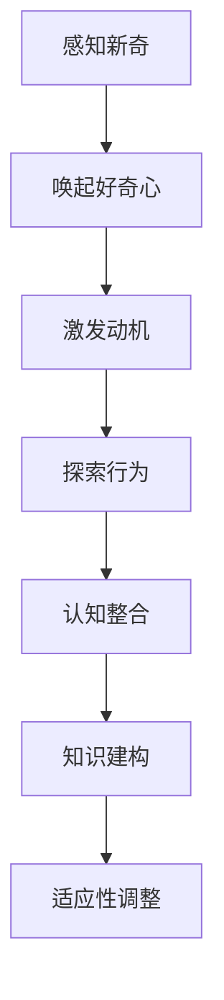

#### 核心概念与联系

好奇心、动机、探索行为和知识建构是好奇心心理学中的核心概念，它们相互联系，共同推动认知发展。

1. **好奇心**：是探索的起点，由新奇、复杂、不确定性等因素引发。
2. **动机**：好奇心转化为内在动机，驱动个体进行探索行为。
3. **探索行为**：个体通过探索行为，获取新的信息，解决认知冲突。
4. **知识建构**：通过探索，个体将新信息整合到已有知识体系中，实现认知上的发展。

### 伪代码讲解

以下是一个简单的伪代码示例，用于解释好奇心如何影响学习过程：

```python
def explore(new_info, prior_knowledge):
    # 唤起好奇心
    curiosity =唤起好奇心(new_info)

    # 激发动机
    motivation =激发动机(curiosity)

    # 进行探索行为
    exploration =进行探索行为(motivation)

    # 认知整合
    integrated_knowledge =认知整合(new_info, prior_knowledge)

    # 知识建构
    knowledge_constructed =知识建构(integrated_knowledge)

    return knowledge_constructed
```

通过以上代码，我们可以看到好奇心如何激发学习动机，进而驱动探索行为，最终实现知识的整合和建构。

#### 数学模型和公式

好奇心可以被视为一个动态过程，其行为可以用数学模型来描述。以下是一个简化的数学模型，用于描述好奇心随时间变化的关系：

$$
C(t) = C_0 \cdot e^{-\lambda t}
$$

其中，$C(t)$ 表示时间 $t$ 时的好奇心水平，$C_0$ 是初始好奇心水平，$\lambda$ 是好奇心衰减率。

这个模型假设好奇心随着时间的推移会逐渐衰减，表明个体的好奇心可能在面对新异刺激后迅速增强，但随着时间的推移，兴趣会逐渐减弱。

### 小结

好奇心作为一种基本心理需求，对人类的学习、认知和创新具有深远影响。通过了解好奇心的定义、类型、影响因素和研究方法，我们可以更好地激发和培养好奇心，促进个人成长和社会发展。

## 第2章：好奇心与社会行为

### 2.1 好奇心与社交互动

好奇心在社交互动中扮演着重要角色，它不仅能够激发个体的社交兴趣，还能够促进人际关系的建立和发展。

#### 好奇心在社交中的作用

好奇心使个体对他人产生浓厚的兴趣，愿意投入时间和精力去了解和接触他人。在社交场合中，好奇心可以促使个体积极提问、倾听和观察，从而增进对他人行为的理解。例如，在初次见面时，好奇心旺盛的人可能会主动询问对方的兴趣、爱好和经历，从而建立初步的联系。

好奇心还可以促进个体之间的互动。通过表达好奇心，个体能够激发对方的兴趣和热情，使得社交互动更加丰富和有意义。例如，在团队合作中，好奇心可以促使成员之间进行深入的交流和讨论，共同解决问题，从而提高团队的合作效率和创造力。

#### 好奇心与人际吸引

好奇心不仅对社交互动有积极作用，还能够增强人际吸引。研究表明，好奇心旺盛的个体往往更容易吸引他人。这是因为好奇心反映了个体对新异和未知的开放性，使得个体在他人眼中更具魅力和吸引力。例如，一个对新事物充满好奇的人，可能会吸引那些寻求新鲜感和刺激感的人。

好奇心还可以促进深度关系的发展。通过共同的好奇和探索，个体能够建立更深层次的联系。例如，一对恋人可能因为共同对某个领域的兴趣而更加亲密，他们可以一起探索新的知识，分享彼此的发现，从而增强彼此的感情。

#### 好奇心促进团队合作

好奇心在团队合作中发挥着重要作用，它能够促进团队成员之间的沟通和协作。首先，好奇心可以激发团队成员的积极性，使他们更加投入团队任务。当团队成员对项目充满好奇心时，他们会更愿意主动了解项目细节，分享自己的观点和想法，从而提高团队的创造力。

好奇心还可以促进团队成员之间的互动和合作。通过表达好奇心，团队成员可以更好地理解彼此的需求和期望，从而建立信任和默契。例如，一个项目经理可能因为对团队成员的技术能力产生好奇心，而主动询问他们的工作方法和经验，从而更好地协调团队成员的工作。

此外，好奇心还能够帮助团队成员在面对挑战和困难时保持积极心态。好奇心使个体对未知和变化保持开放态度，愿意尝试新的方法和策略。例如，在一个技术项目中，当团队面临技术难题时，好奇心旺盛的成员可能会主动提出新的解决方案，从而推动项目向前发展。

#### 好奇心与跨文化理解

好奇心在跨文化交往中同样发挥着重要作用，它有助于促进不同文化背景个体之间的理解和沟通。在全球化背景下，跨文化交往日益频繁，好奇心成为了促进跨文化理解的关键因素。

好奇心使个体愿意了解和尊重其他文化的差异。通过表达好奇心，个体可以更加关注他人的文化背景、价值观和习俗，从而减少文化冲突和误解。例如，在一个国际团队中，好奇心可以促使团队成员了解彼此的文化习惯，尊重对方的差异，从而更好地合作。

好奇心还可以促进文化创新和融合。当个体对其他文化充满好奇心时，他们会主动探索和吸收新的文化元素，从而丰富自己的文化素养。这种跨文化的交流与融合，不仅有助于个体的成长，还能够促进文化的创新和发展。

### 2.2 好奇心与创新思维

好奇心是创新思维的重要推动力，它激发个体的创造性思维，推动新思想、新方法和新技术的发展。

#### 好奇心在创新中的作用

好奇心使个体对新奇事物和未知领域保持敏感和关注，从而激发创新思维。一个充满好奇心的人往往会对日常生活中的问题产生独特的见解，并尝试寻找新的解决方案。例如，一个工程师可能会因为对现有技术的不足产生好奇心，从而萌发改进现有产品的想法。

好奇心还可以促进个体的跨学科思考。通过探索不同领域的知识，好奇心旺盛的个体能够发现不同领域之间的联系，从而提出创新的观点和方法。例如，一个物理学家可能会因为对生物学的兴趣而产生好奇心，从而将物理学的原理应用到生物学研究中，提出新的科学理论。

#### 好奇心与创造力

好奇心与创造力之间存在密切的关系。好奇心可以激发个体的创造性思维，推动新创意的产生。研究表明，好奇心旺盛的个体在创造力的表现上往往更加出色。这是因为好奇心使个体对新事物和未知领域保持开放和探索的态度，从而有助于产生独特的观点和解决方案。

好奇心还可以促进个体的长期创造力发展。通过持续的好奇和探索，个体能够不断积累知识和经验，从而提高创造力。例如，一个科学家可能会因为对某个领域的好奇而不断进行研究，最终在长期的积累中产生重要的科学发现。

#### 好奇心促进创新的方法

为了激发好奇心，促进创新，可以采取以下方法：

1. **提供多样化的刺激**：创造一个充满多样性和新奇性的环境，激发个体的好奇心。例如，公司可以为员工提供跨学科的项目合作机会，鼓励员工探索不同领域的知识。

2. **鼓励提问和讨论**：鼓励个体提出问题，并与他人进行讨论。通过提问和讨论，个体能够激发好奇心，促进思维碰撞，从而产生创新的观点。

3. **培养探索精神**：鼓励个体主动探索未知领域，尝试新的方法和策略。例如，学校可以设置探索性课程，鼓励学生进行科学实验和项目研究。

4. **提供反馈和支持**：为好奇心旺盛的个体提供反馈和支持，帮助他们克服困难，继续探索。例如，公司可以为员工提供培训和发展机会，支持他们进行创新项目。

### 2.3 好奇心与文化传播

好奇心在文化传播中扮演着重要角色，它促进了不同文化之间的交流和融合，推动了文化的创新和发展。

#### 好奇心在文化传播中的作用

好奇心使个体愿意了解和探索其他文化，从而促进文化交流。通过表达好奇心，个体可以主动接触和了解其他文化的价值观、习俗和艺术形式，从而增进对其他文化的理解和尊重。

好奇心还可以推动文化创新。当个体对其他文化产生好奇心时，他们可能会尝试将其他文化的元素融入到自己的文化中，从而创造出新的文化形式。例如，音乐、电影和艺术作品往往可以从不同文化中汲取灵感，形成独特的艺术风格。

#### 好奇心与跨文化理解

好奇心在跨文化理解中发挥着关键作用，它帮助个体克服文化偏见和误解，促进不同文化之间的交流和合作。通过表达好奇心，个体可以更加关注他人的文化背景和价值观，从而减少文化冲突和误解。

好奇心还可以促进文化包容性。当个体对其他文化充满好奇心时，他们更愿意尊重和接纳其他文化的差异，从而促进文化的多样性和包容性。例如，在一个多元文化的社区中，好奇心可以促使居民之间进行文化交流，增进彼此的理解和尊重。

#### 好奇心促进文化交流的方法

为了促进好奇心在文化传播中的作用，可以采取以下方法：

1. **组织文化交流活动**：通过举办文化展览、音乐会和讲座等活动，促进不同文化之间的交流和互动。

2. **提供学习资源**：为个体提供丰富的学习资源，如书籍、电影和在线课程等，帮助他们了解和探索其他文化。

3. **鼓励跨文化合作**：鼓励不同文化背景的个体进行合作，共同开展项目和研究，从而促进文化交流和理解。

4. **培养跨文化意识**：通过教育和培训，提高个体的跨文化意识，使他们更加关注和尊重其他文化的差异。

### 小结

好奇心在社会行为中具有重要作用，它促进了社交互动、创新思维和文化传播。通过表达好奇心，个体可以更好地理解他人、激发创造性思维，并推动文化的交流和发展。激发和培养好奇心，不仅有助于个人的成长，也有助于社会的进步。

### 2.1 好奇心与社交互动

好奇心在社交互动中起着至关重要的作用，它是人际交往中的催化剂，能够促进沟通和理解，增强社交吸引力，并提升团队合作效率。

#### 好奇心与人际吸引

好奇心能够增强个体之间的吸引力。当个体表现出对他人兴趣的强烈好奇心时，他们往往会吸引那些具有相似兴趣和价值观的人。这种好奇心能够打破初次见面的隔阂，迅速拉近彼此的距离。以下是一个简单的Mermaid流程图，展示了好奇心在人际吸引中的作用：

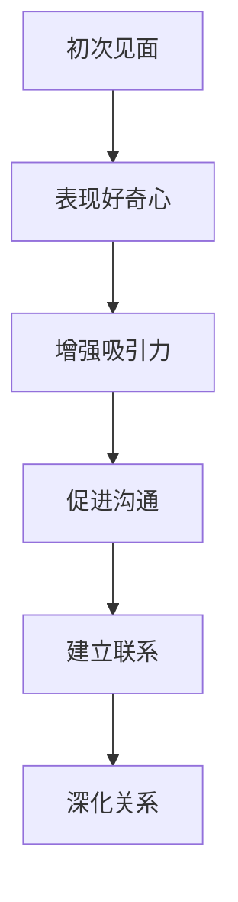

在这个流程图中，我们可以看到，好奇心首先表现在初次见面时，通过提问和倾听，个体能够增强彼此的吸引力。随着沟通的深入，好奇心进一步促进个体之间的理解和信任，从而建立长久的联系。

好奇心还可以在维持长期关系中发挥重要作用。通过持续的好奇心，伴侣和好友可以保持对彼此的兴趣和关注，从而避免关系的平淡和疏远。一个简单的Mermaid流程图展示了好奇心在维持长期关系中的作用：

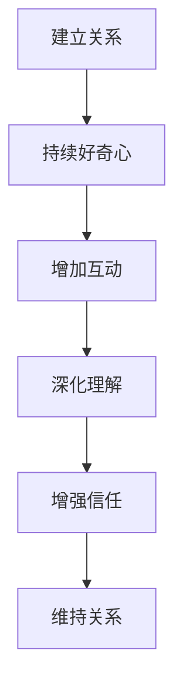

在这个流程图中，持续的好奇心促使个体保持对对方的关注和兴趣，通过增加互动和沟通，深化对彼此的理解，从而增强信任，最终实现关系的长期维持。

#### 好奇心与团队合作

好奇心在团队合作中同样发挥着重要作用，它能够促进团队成员之间的互动和合作，提升团队的整体效率和创造力。以下是一个简单的Mermaid流程图，展示了好奇心在团队合作中的作用：

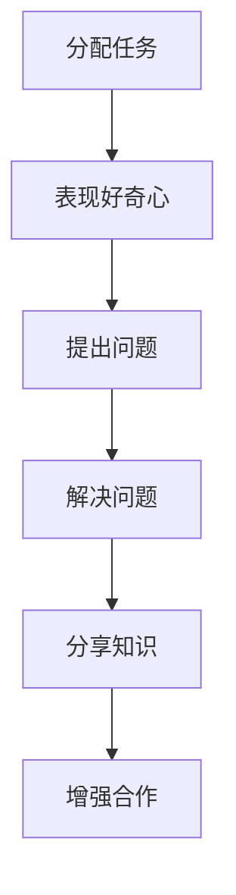

在这个流程图中，好奇心促使团队成员在分配任务时提出问题，通过解决问题和分享知识，增强彼此之间的互动和合作。这种合作不仅提高了团队的工作效率，还激发了团队的创造力。

好奇心还能够帮助团队在面对挑战和困难时保持积极的态度。以下是一个简单的Mermaid流程图，展示了好奇心在应对挑战中的作用：

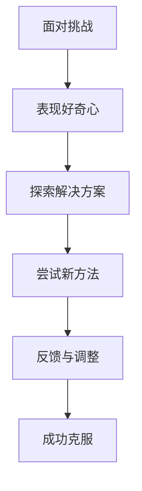

在这个流程图中，好奇心促使团队成员在面对挑战时，积极探索解决方案，尝试新的方法，并通过反馈和调整，最终成功克服困难。

#### 好奇心与跨文化理解

好奇心在跨文化交往中扮演着关键角色，它能够促进不同文化背景个体之间的理解和尊重。以下是一个简单的Mermaid流程图，展示了好奇心在跨文化理解中的作用：

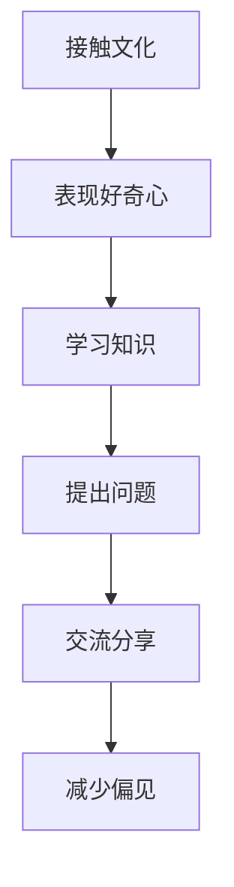

在这个流程图中，好奇心促使个体在接触其他文化时，主动学习相关知识，提出问题，并通过交流和分享，减少对其他文化的偏见和误解。

好奇心还能够帮助个体更好地适应和融入其他文化。以下是一个简单的Mermaid流程图，展示了好奇心在跨文化适应中的作用：

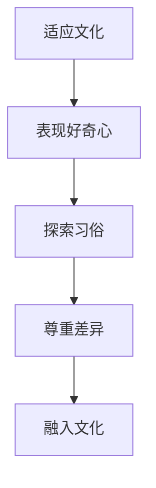

在这个流程图中，好奇心促使个体在适应其他文化时，积极探索当地习俗，尊重文化差异，从而更好地融入其他文化。

### 核心算法原理讲解

好奇心在社交互动、团队合作和跨文化理解中，可以被视为一种复杂的心理过程。以下是一个简化的算法模型，用于解释好奇心如何影响这些社会行为：

```python
class CuriosityModel:
    def __init__(self, interest_level, knowledge_base):
        self.interest_level = interest_level
        self.knowledge_base = knowledge_base
    
    def express_curiosity(self, new_info):
        # 增加兴趣水平
        self.interest_level += len(new_info) * curiosity_factor
        
        # 更新知识库
        self.knowledge_base.update(new_info)
        
        # 激发探索行为
        self.exploration_behavior()

    def exploration_behavior(self):
        # 提出问题
        questions = self.generate_questions()
        for question in questions:
            self.ask_question(question)
        
        # 分享知识
        shared_knowledge = self.share_knowledge()
        for knowledge in shared_knowledge:
            self.communicate_knowledge(knowledge)

    def generate_questions(self):
        # 根据兴趣水平和知识库生成问题
        questions = []
        for topic in self.knowledge_base.topics():
            questions += self.knowledge_base.get unanswered_questions(topic)
        return questions

    def ask_question(self, question):
        # 向他人提问
        response = self.get_response(question)
        self.knowledge_base.update({question: response})

    def share_knowledge(self):
        # 根据知识库分享新知识
        shared_knowledge = []
        for topic, subtopics in self.knowledge_base.topics_with unanswered_subtopics():
            shared_knowledge += self.knowledge_base.extract_subtopics(subtopics)
        return shared_knowledge

    def communicate_knowledge(self, knowledge):
        # 与他人分享知识
        for piece_of_knowledge in knowledge:
            self.share_with_others(piece_of_knowledge)

    def share_with_others(self, knowledge):
        # 通过交流分享知识
        pass
```

在这个模型中，`CuriosityModel` 类表示一个好奇心的主体。主体通过增加兴趣水平和更新知识库来表现好奇心。`express_curiosity` 方法用于处理新信息的输入，并激发探索行为。探索行为包括提出问题、获取回答和分享知识。`generate_questions` 方法根据主体的兴趣水平和知识库生成问题，`ask_question` 方法用于提问并更新知识库，`share_knowledge` 方法用于分享新知识，`communicate_knowledge` 方法用于与他人分享知识。

### 数学模型和公式

好奇心可以被视为一个动态的过程，其水平随时间变化。以下是一个简化的数学模型，用于描述好奇心随时间的变化：

$$
C(t) = C_0 \cdot e^{-kt}
$$

其中，$C(t)$ 表示时间 $t$ 时的好奇心水平，$C_0$ 是初始好奇心水平，$k$ 是好奇心衰减率。这个模型假设好奇心在遇到新奇和未知时会迅速增强，但随着时间的推移，好奇心会逐渐减弱。

### 项目实战：代码实际案例

以下是一个简单的Python代码案例，展示了如何在实际项目中应用好奇心模型，以促进社交互动和知识分享：

```python
# 好奇心社交平台示例代码

class User:
    def __init__(self, name, knowledge_base):
        self.name = name
        self.knowledge_base = knowledge_base
        self.interest_level = 1.0

    def receive_message(self, message):
        # 接收新消息并更新好奇心水平
        self.interest_level += len(message) * 0.1
        self.knowledge_base.update(message)

    def ask_question(self, topic):
        # 提出问题并更新知识库
        question = self.knowledge_base.generate_question(topic)
        print(f"{self.name} asks: {question}")
        response = self.get_response(question)
        self.knowledge_base.update({question: response})

    def get_response(self, question):
        # 获取并分享回答
        response = "I don't know, but I'll find out!"  # 模拟获取回答
        print(f"Response: {response}")
        return response

    def share_knowledge(self):
        # 分享知识
        shared_knowledge = self.knowledge_base.extract_new_knowledge()
        print(f"{self.name} shares: {shared_knowledge}")

# 创建用户和知识库
user = User("Alice", KnowledgeBase())
user.receive_message("Hello, world!")

# 提出问题并获取回答
user.ask_question("What is quantum computing?")

# 分享知识
user.share_knowledge()
```

在这个示例中，`User` 类代表一个用户，具有名字、知识库和好奇心水平。`receive_message` 方法用于接收新消息并更新好奇心水平，`ask_question` 方法用于提出问题并更新知识库，`get_response` 方法用于获取并分享回答，`share_knowledge` 方法用于分享新知识。

通过这个示例，我们可以看到好奇心模型如何在实际项目中应用，以促进社交互动和知识分享。

### 代码解读与分析

以下是对上述Python代码的详细解读和分析：

1. **用户类（User）**：用户类是一个代表社交平台用户的基本类。它包含用户的姓名、知识库和好奇心水平三个主要属性。

    ```python
    class User:
        def __init__(self, name, knowledge_base):
            self.name = name
            self.knowledge_base = knowledge_base
            self.interest_level = 1.0
    ```

2. **接收消息（receive_message）**：当用户接收新消息时，`receive_message` 方法会更新好奇心水平。在这里，我们假设每条新消息都会使好奇心水平增加10%。

    ```python
    def receive_message(self, message):
        self.interest_level += len(message) * 0.1
        self.knowledge_base.update(message)
    ```

3. **提出问题（ask_question）**：当用户对某个主题产生好奇心时，`ask_question` 方法会生成一个相关的问题，并更新知识库。这里使用了一个模拟的`generate_question` 方法，它返回一个字符串，表示问题。

    ```python
    def ask_question(self, topic):
        question = self.knowledge_base.generate_question(topic)
        print(f"{self.name} asks: {question}")
        response = self.get_response(question)
        self.knowledge_base.update({question: response})
    ```

4. **获取回答（get_response）**：`get_response` 方法用于模拟获取问题的答案。在这个示例中，我们假设每次获取的回答都是“我不知道，但我会找出答案！”。

    ```python
    def get_response(self, question):
        response = "I don't know, but I'll find out!"  # 模拟获取回答
        print(f"Response: {response}")
        return response
    ```

5. **分享知识（share_knowledge）**：`share_knowledge` 方法用于模拟用户分享新知识。这里我们使用了一个模拟的`extract_new_knowledge` 方法，它返回一个包含新知识的列表。

    ```python
    def share_knowledge(self):
        shared_knowledge = self.knowledge_base.extract_new_knowledge()
        print(f"{self.name} shares: {shared_knowledge}")
    ```

通过上述方法，我们可以看到用户类如何模拟社交平台中的用户行为，包括接收消息、提出问题、获取回答和分享知识。这些方法共同构成了用户在社交平台上的好奇心模型。

### 总结

好奇心在社交互动中起着至关重要的作用，它能够增强人际吸引力，促进团队合作，并提升跨文化理解。通过理解和应用好奇心模型，我们可以设计出更加有效的社交平台，激发用户的好奇心，促进知识分享和社交互动。

## 第3章：好奇心与心理健康

好奇心不仅影响我们的认知和社会行为，还对心理健康产生深远的影响。在日常生活中，好奇心可以作为一种积极的情绪调节工具，帮助我们应对压力和挑战，增强心理韧性，甚至改善某些心理障碍。

### 3.1 好奇心与情绪调节

好奇心与情绪调节之间存在紧密的联系。好奇心能够激发积极情绪，缓解负面情绪。以下是一个简化的Mermaid流程图，展示好奇心在情绪调节中的作用：

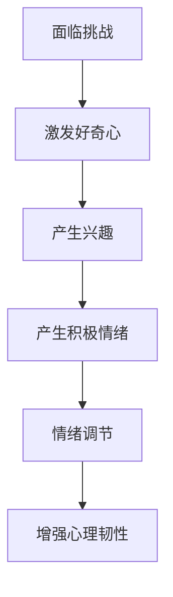

在这个流程图中，当我们面临挑战时，好奇心可以激发我们的兴趣，产生积极情绪，从而有效地调节情绪，增强心理韧性。

#### 好奇心与积极情绪的关系

好奇心能够激发积极的情绪体验，如快乐、兴奋和兴趣。这些积极的情绪体验有助于提升个体的心理状态，使其更加乐观和自信。以下是一个简单的数学模型，用于描述好奇心与积极情绪之间的关系：

$$
P(t) = P_0 + \alpha \cdot C(t)
$$

其中，$P(t)$ 表示时间 $t$ 时的积极情绪水平，$P_0$ 是初始积极情绪水平，$C(t)$ 是时间 $t$ 时的好奇心水平，$\alpha$ 是好奇心对积极情绪的影响系数。这个模型假设好奇心水平越高，积极情绪水平越高。

#### 好奇心促进情绪健康的方法

为了利用好奇心促进情绪健康，可以采取以下方法：

1. **设定目标**：为自己设定有挑战性的目标，激发好奇心和兴趣。通过不断追求新目标，个体可以保持积极情绪，提升情绪调节能力。

2. **探索新领域**：尝试探索新的领域和活动，保持对未知和未尝试事物的兴趣。这种探索可以带来新鲜感和兴奋感，提升情绪健康。

3. **参与社交活动**：积极参与社交活动，与他人分享好奇心和兴趣。社交互动可以带来积极情绪，缓解压力，增强心理韧性。

### 3.2 好奇心与心理健康

好奇心对心理健康具有积极影响，它可以增强心理韧性，降低心理障碍的风险。以下是一个简化的Mermaid流程图，展示好奇心在心理健康中的作用：

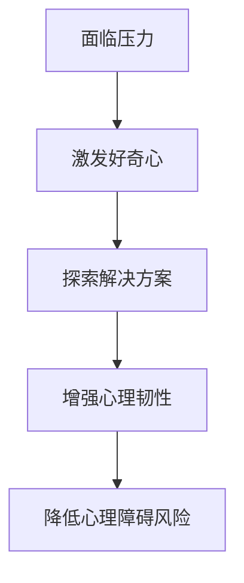

在这个流程图中，好奇心使个体在面对压力时，能够积极探索解决方案，从而增强心理韧性，降低心理障碍的风险。

#### 好奇心对心理健康的积极影响

好奇心对心理健康具有多方面的积极影响：

1. **增强心理韧性**：好奇心使个体能够面对挑战和压力时，保持开放和探索的态度，从而增强心理韧性。

2. **提高适应能力**：好奇心促使个体积极探索新环境和情境，提高适应能力，降低压力和焦虑。

3. **促进心理健康**：好奇心激发个体对生活的热情和兴趣，促进心理健康，减少心理障碍的风险。

#### 好奇心与心理韧性的关系

好奇心与心理韧性之间存在密切的关系。心理韧性是指个体在面对压力和挑战时，能够保持积极心态，有效地应对和解决问题的能力。好奇心可以激发个体的探索欲望和求知欲望，从而提高其心理韧性。

以下是一个简单的数学模型，用于描述好奇心与心理韧性之间的关系：

$$
D(t) = D_0 + \beta \cdot C(t)
$$

其中，$D(t)$ 表示时间 $t$ 时的心理韧性水平，$D_0$ 是初始心理韧性水平，$C(t)$ 是时间 $t$ 时的好奇心水平，$\beta$ 是好奇心对心理韧性的影响系数。这个模型假设好奇心水平越高，心理韧性水平越高。

#### 好奇心提升心理健康策略

为了利用好奇心提升心理健康，可以采取以下策略：

1. **设定小目标**：为自己设定一些小目标，不断挑战自我，激发好奇心和兴趣。

2. **积极参与新活动**：尝试参与新的活动，如学习新的技能、阅读新书或尝试新的运动项目，保持对生活的热情。

3. **建立支持系统**：与他人分享好奇心和兴趣，建立支持系统，共同探索新领域，增强心理韧性。

### 3.3 好奇心与心理障碍

好奇心在心理障碍的治疗和缓解中发挥着重要作用。以下是一个简化的Mermaid流程图，展示好奇心在心理障碍治疗中的作用：

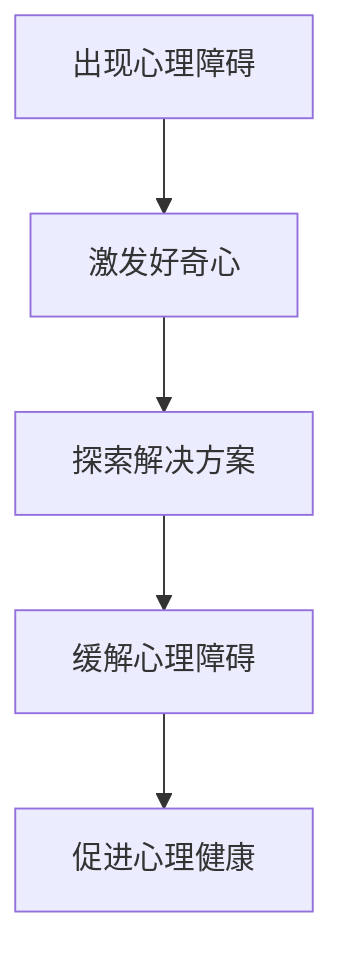

在这个流程图中，好奇心使个体在面对心理障碍时，能够积极寻求解决方案，从而缓解心理障碍，促进心理健康。

#### 好奇心在心理障碍治疗中的应用

好奇心可以作为一种治疗工具，帮助个体克服心理障碍。以下是一些具体应用：

1. **认知行为疗法**：在认知行为疗法中，好奇心被用于帮助个体认识和改变负面思维模式。通过探索和理解自己的情绪和行为，个体可以找到更有效的应对策略，缓解心理障碍。

2. **心理咨询**：在心理咨询中，好奇心被用于促进咨询过程中的开放性和探索。心理咨询师通过表达好奇心，帮助个体探索其内心世界，找到解决问题的方法。

3. **自我探索**：通过自我探索，个体可以培养好奇心，了解自己的情绪、需求和价值观，从而更好地应对心理障碍。

#### 好奇心与焦虑、抑郁的关系

好奇心与焦虑、抑郁等心理障碍之间存在复杂的相互关系。一方面，焦虑和抑郁可能会抑制好奇心，使个体对生活失去兴趣。另一方面，好奇心可以作为一种应对策略，帮助个体缓解焦虑和抑郁。

以下是一个简单的数学模型，用于描述好奇心与焦虑、抑郁之间的关系：

$$
A(t) = A_0 - \gamma \cdot C(t) \\
D(t) = D_0 - \delta \cdot C(t)
$$

其中，$A(t)$ 表示时间 $t$ 时的焦虑水平，$A_0$ 是初始焦虑水平，$C(t)$ 是时间 $t$ 时的好奇心水平，$\gamma$ 是好奇心对焦虑的影响系数；$D(t)$ 表示时间 $t$ 时的抑郁水平，$D_0$ 是初始抑郁水平，$\delta$ 是好奇心对抑郁的影响系数。这个模型假设好奇心水平越高，焦虑和抑郁水平越低。

#### 好奇心缓解心理障碍的方法

为了利用好奇心缓解心理障碍，可以采取以下方法：

1. **设定小目标**：为自己设定一些小目标，激发好奇心和兴趣，逐步克服焦虑和抑郁。

2. **探索新领域**：尝试探索新的领域和活动，保持对未知和未尝试事物的兴趣，减少焦虑和抑郁。

3. **建立支持系统**：与他人分享好奇心和兴趣，建立支持系统，共同探索新领域，增强心理韧性。

### 小结

好奇心不仅对心理健康产生积极影响，还在情绪调节、心理韧性和心理障碍治疗中发挥着重要作用。通过培养和激发好奇心，我们可以提升心理健康水平，更好地应对生活中的挑战和压力。

### 3.1 好奇心与情绪调节

好奇心在情绪调节中发挥着关键作用，它能够促进积极情绪的产生，缓解负面情绪的影响，从而提升整体心理健康水平。以下是好奇心在情绪调节中的详细解释和数学模型：

#### 好奇心促进积极情绪

好奇心能够激发个体对生活中新奇和未知的兴趣，从而促进积极情绪的产生。例如，当个体对新事物或新活动产生好奇心时，他们往往会感到兴奋、好奇和兴趣盎然。这些积极的情绪体验有助于提升个体的心理状态，增强他们的幸福感和满足感。

以下是一个简化的数学模型，用于描述好奇心与积极情绪之间的关系：

$$
P(t) = P_0 + \alpha \cdot C(t)
$$

其中，$P(t)$ 表示时间 $t$ 时的积极情绪水平，$P_0$ 是初始积极情绪水平，$C(t)$ 是时间 $t$ 时的好奇心水平，$\alpha$ 是好奇心对积极情绪的影响系数。这个模型假设好奇心水平越高，积极情绪水平越高。

#### 好奇心缓解负面情绪

好奇心不仅能够促进积极情绪的产生，还可以帮助个体缓解负面情绪。例如，当个体面对压力或挫折时，好奇心可以促使他们探索解决问题的方法，从而转移注意力，缓解焦虑、沮丧等负面情绪。

以下是一个简化的数学模型，用于描述好奇心与负面情绪之间的关系：

$$
N(t) = N_0 - \beta \cdot C(t)
$$

其中，$N(t)$ 表示时间 $t$ 时的负面情绪水平，$N_0$ 是初始负面情绪水平，$C(t)$ 是时间 $t$ 时的好奇心水平，$\beta$ 是好奇心对负面情绪的影响系数。这个模型假设好奇心水平越高，负面情绪水平越低。

#### 好奇心与情绪调节的互动机制

好奇心在情绪调节中的作用主要通过以下几个机制实现：

1. **认知重构**：好奇心促使个体对情境进行重新评价，从而改变其情绪体验。例如，当个体对失败产生好奇心时，他们可能会重新思考失败的原因，从而减少负面情绪。

2. **注意力转移**：好奇心使个体的注意力从负面情绪转移到积极的事物上。例如，当个体面对挫折时，好奇心可以促使他们关注新的机会和可能性，从而缓解负面情绪。

3. **情绪分享**：好奇心促使个体与他人分享情绪体验，从而获得支持和理解。例如，当个体对某件事情感到好奇时，他们可能会与他人讨论，从而得到反馈和帮助，缓解负面情绪。

#### 实例分析

以下是一个实例，展示好奇心如何帮助个体调节情绪：

假设一个学生在考试中感到非常紧张和焦虑。在这种情况下，好奇心可以帮助他们进行情绪调节：

1. **认知重构**：学生可以尝试用好奇心的视角来看待考试。他们可能会问自己：“考试中的每一个问题都有答案吗？我能否通过这次考试学到新的知识？”这样的认知重构有助于减轻紧张情绪。

2. **注意力转移**：学生可以将注意力从紧张的考试氛围转移到他们感兴趣的学科上。好奇心可以促使他们思考：“我对这门学科有多少了解？我能从这次考试中学到什么新知识？”这种注意力转移有助于缓解焦虑。

3. **情绪分享**：学生可以与朋友或家人分享他们的焦虑感受。好奇心可以促使他们问自己：“我能否通过与他人交流来缓解紧张情绪？”与他人分享情绪体验有助于获得支持和理解，从而减轻负面情绪。

通过这些方法，好奇心有助于学生有效地调节情绪，从而更好地应对考试压力。

### Mermaid 流程图

以下是一个Mermaid流程图，展示好奇心在情绪调节中的作用：

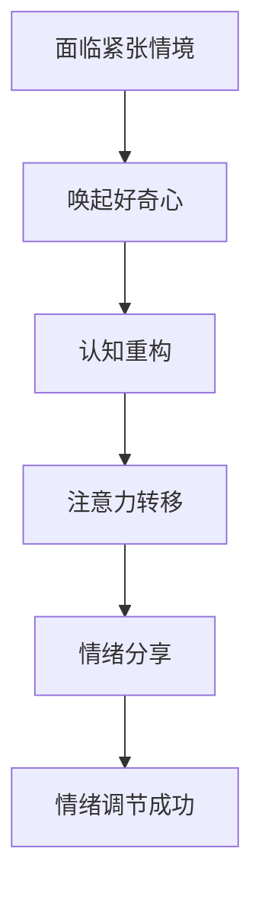

在这个流程图中，面临紧张情境的个体通过唤起好奇心，进行认知重构、注意力转移和情绪分享，最终成功调节情绪。

### 总结

好奇心在情绪调节中具有重要作用，它能够促进积极情绪的产生，缓解负面情绪的影响，从而提升整体心理健康水平。通过理解好奇心在情绪调节中的作用机制，个体可以更好地利用好奇心来调节情绪，提高生活质量。

## 第4章：好奇心与教育

好奇心在教育中扮演着至关重要的角色，它是激发学习动机、促进知识建构和培养创新思维的关键因素。在本章中，我们将探讨好奇心在儿童教育和成人教育中的作用，以及如何有效地培养和激发好奇心。

### 4.1 好奇心在儿童教育中的作用

好奇心在儿童教育中具有重要作用，它能够激发儿童的学习兴趣，促进其认知发展，并培养其探索精神。

#### 好奇心在儿童早期教育中的重要性

在儿童早期教育中，好奇心是儿童学习的重要动力。研究表明，儿童天生具有强烈的好奇心，他们通过探索和尝试来了解周围的世界。好奇心使儿童对学习产生浓厚的兴趣，从而促使他们积极参与教育活动。以下是一个简化的Mermaid流程图，展示好奇心在儿童早期教育中的作用：

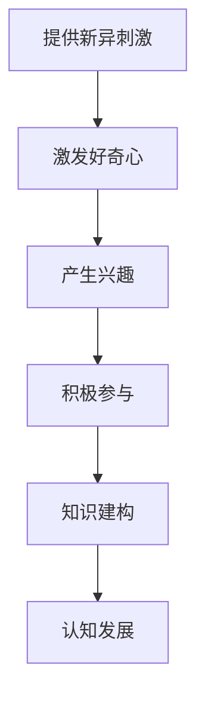

在这个流程图中，通过提供新异刺激，如新的玩具、游戏和活动，可以激发儿童的好奇心。好奇心促使儿童产生兴趣，积极参与教育活动，从而实现知识建构和认知发展。

#### 好奇心促进儿童认知发展

好奇心能够促进儿童认知发展，使其更好地理解世界。儿童通过好奇心的驱动，不断提出问题、探索和尝试，从而积累知识、发展思维。以下是一个简化的数学模型，用于描述好奇心与儿童认知发展之间的关系：

$$
C(t) = C_0 + \alpha \cdot I(t)
$$

其中，$C(t)$ 表示时间 $t$ 时的认知水平，$C_0$ 是初始认知水平，$I(t)$ 是时间 $t$ 时的好奇心水平，$\alpha$ 是好奇心对认知发展的促进作用系数。这个模型假设好奇心水平越高，认知发展越快。

#### 好奇心培养策略

为了培养儿童的好奇心，可以采取以下策略：

1. **创设好奇情境**：在儿童教育中，创设好奇情境是培养好奇心的重要方法。教师可以通过引入新奇的玩具、游戏和活动，激发儿童的好奇心。

2. **提供探索机会**：为儿童提供充分的探索机会，让他们通过实际操作和亲身体验来学习。例如，教师可以组织实验活动、户外探索等，让儿童在实践中培养好奇心。

3. **鼓励提问和思考**：鼓励儿童提问和思考，培养其探索精神和批判性思维。教师可以设置问题情境，引导儿童提出问题和寻找答案。

4. **营造支持性环境**：营造一个支持性、开放的教育环境，让儿童感到安全和自由，从而激发他们的好奇心。教师应尊重儿童的兴趣和需求，给予他们充分的探索和尝试空间。

### 4.2 好奇心与成人教育

好奇心在成人教育中也具有重要价值，它能够激发成人学习的动机，促进知识更新和技能提升，并培养创新思维。

#### 好奇心在成人学习中的作用

好奇心在成人学习中起着关键作用，它能够激发成人学习的动机，促进知识的获取和技能的提升。成人通常具有丰富的生活和工作经验，好奇心促使他们不断探索新知识、掌握新技能，以适应不断变化的环境。以下是一个简化的Mermaid流程图，展示好奇心在成人学习中的作用：

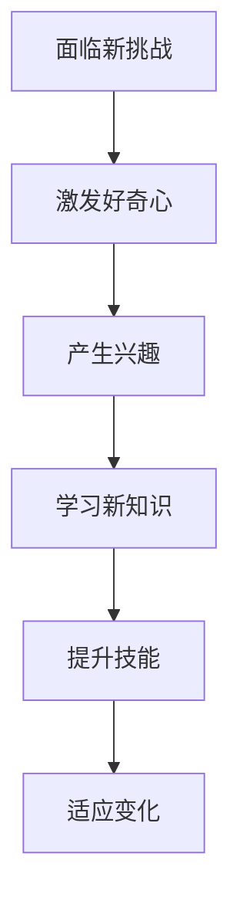

在这个流程图中，成人面临新的挑战时，好奇心促使他们产生兴趣，通过学习新知识和提升技能，更好地适应变化。

#### 好奇心促进成人持续学习

好奇心能够促进成人持续学习，使其不断更新知识和技能，以适应职业发展和个人成长的需求。以下是一个简化的数学模型，用于描述好奇心与成人持续学习之间的关系：

$$
L(t) = L_0 + \beta \cdot C(t)
$$

其中，$L(t)$ 表示时间 $t$ 时的学习水平，$L_0$ 是初始学习水平，$C(t)$ 是时间 $t$ 时的好奇心水平，$\beta$ 是好奇心对学习的促进作用系数。这个模型假设好奇心水平越高，学习水平越高。

#### 成人好奇心培养方法

为了培养成人的好奇心，可以采取以下方法：

1. **创设学习情境**：为成人创设具有挑战性和趣味性的学习情境，激发他们的好奇心。例如，可以通过设置项目任务、案例研究和实践活动，使成人感受到学习的价值和意义。

2. **提供多样化的学习资源**：为成人提供多样化的学习资源，如在线课程、书籍、讲座和实践项目，满足不同学习需求和兴趣。

3. **鼓励提问和讨论**：鼓励成人提问和讨论，培养他们的批判性思维和探索精神。教师和导师可以通过引导性的问题，激发成人的好奇心和思考。

4. **营造支持性环境**：营造一个支持性、开放的学习环境，让成人感到安全和自由，从而激发他们的好奇心。学习社区、讨论小组和导师支持都是有效的支持方式。

### 4.3 好奇心与教育改革

好奇心在教育改革中具有重要价值，它能够促进教育创新，推动教育模式的转型。以下是一个简化的Mermaid流程图，展示好奇心在教育改革中的作用：

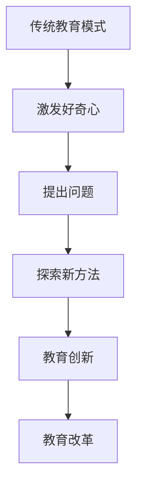

在这个流程图中，好奇心使教育工作者对传统教育模式产生质疑，提出问题，并通过探索新方法，实现教育创新，推动教育改革。

#### 好奇心促进教育创新

好奇心能够激发教育工作者对教育模式的创新，推动教育改革。以下是一些具体的教育创新方法：

1. **项目导向学习**：通过项目导向学习，学生可以在实际项目中应用所学知识，培养解决问题的能力和创新思维。

2. **探究性学习**：鼓励学生通过探究性学习，主动发现问题和解决问题，培养他们的探索精神和批判性思维。

3. **混合式学习**：结合线上和线下学习方式，提供灵活多样的学习资源，满足不同学生的学习需求。

4. **跨学科教学**：通过跨学科教学，将不同领域的知识整合起来，培养学生的综合能力和创新思维。

#### 好奇心导向的教育模式

好奇心导向的教育模式强调以好奇心为核心，激发学生的内在动机，促进其全面发展。以下是一些好奇心导向的教育模式：

1. **探究性教学模式**：教师通过设置探究性问题，引导学生进行自主探究，培养其解决问题的能力和创新思维。

2. **项目导向教学模式**：学生通过参与实际项目，应用所学知识，培养实践能力和创新思维。

3. **问题解决教学模式**：教师通过设置问题情境，引导学生进行问题解决，培养其批判性思维和创新能力。

4. **合作学习模式**：学生通过小组合作，共同探究问题，培养团队合作能力和创新思维。

### 小结

好奇心在儿童教育和成人教育中具有重要作用，它能够激发学习兴趣，促进认知发展，培养创新思维。通过培养和激发好奇心，我们可以推动教育改革，实现教育创新，提高教育质量。

## 第5章：好奇心与科技进步

好奇心是科技进步的重要驱动力，它激发了无数科学家和工程师的探索欲望，推动了科技领域的创新与发展。在本章中，我们将探讨好奇心在科技创新、人工智能和未来科技发展中的作用，以及好奇心如何引领科技走向未来。

### 5.1 好奇心与科技创新

好奇心在科技创新中起着至关重要的作用。科学家和研究人员通过好奇心的驱动，不断探索未知领域，寻找新的解决方案和技术突破。以下是一个简化的Mermaid流程图，展示好奇心在科技创新中的作用：

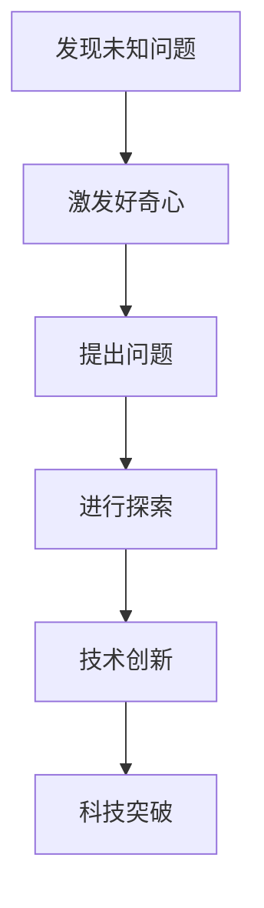

在这个流程图中，当科学家和研究人员发现未知问题时，好奇心促使他们提出问题，进行探索，最终实现技术创新和科技突破。

#### 好奇心促进科技突破

好奇心促使科学家和研究人员不断探索新领域，挑战现有知识和技术。以下是一个简化的数学模型，用于描述好奇心与科技突破之间的关系：

$$
T(t) = T_0 + \gamma \cdot C(t)
$$

其中，$T(t)$ 表示时间 $t$ 时的科技水平，$T_0$ 是初始科技水平，$C(t)$ 是时间 $t$ 时的好奇心水平，$\gamma$ 是好奇心对科技突破的促进作用系数。这个模型假设好奇心水平越高，科技水平提升越快。

#### 好奇心驱动科技创新案例

好奇心驱动了许多重大的科技创新和突破。以下是一些具体的案例：

1. **互联网的发展**：互联网的诞生源于科学家对全球信息共享的好奇心。通过不断探索和尝试，科学家们最终实现了互联网的全球连接，推动了信息技术的革命。

2. **基因编辑技术**：基因编辑技术的出现，源于科学家对基因结构和功能的好奇心。通过探索和实验，科学家们开发了CRISPR-Cas9等基因编辑技术，为医学和生物学领域带来了重大突破。

3. **量子计算机**：量子计算机的研究源于科学家对量子力学的好奇心。通过不断探索和实验，科学家们逐渐揭示了量子计算机的潜力，推动了计算机科学的革新。

### 5.2 好奇心与人工智能

好奇心在人工智能（AI）领域中也发挥着重要作用。人工智能的发展离不开科学家和工程师的好奇心，他们通过探索和尝试，不断推动人工智能技术的进步。以下是一个简化的Mermaid流程图，展示好奇心在人工智能研究中的作用：

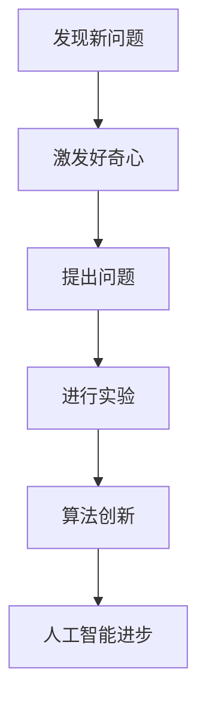

在这个流程图中，当科学家和工程师发现新问题时，好奇心促使他们提出问题，进行实验，最终实现算法创新和人工智能进步。

#### 好奇心促进人工智能发展

好奇心促使科学家和工程师不断探索新领域，寻找新的算法和模型。以下是一个简化的数学模型，用于描述好奇心与人工智能发展之间的关系：

$$
A(t) = A_0 + \delta \cdot C(t)
$$

其中，$A(t)$ 表示时间 $t$ 时的AI水平，$A_0$ 是初始AI水平，$C(t)$ 是时间 $t$ 时的好奇心水平，$\delta$ 是好奇心对人工智能发展的促进作用系数。这个模型假设好奇心水平越高，人工智能水平提升越快。

#### 好奇心驱动的人工智能创新

好奇心驱动了许多人工智能领域的创新。以下是一些具体的例子：

1. **深度学习**：深度学习的出现源于科学家对神经网络和计算机制的好奇心。通过不断探索和实验，科学家们开发了深度学习算法，使得AI在图像识别、自然语言处理等领域取得了突破性进展。

2. **强化学习**：强化学习的创新源于科学家对智能体如何通过试错学习获得最优策略的好奇心。通过不断研究和实验，科学家们开发了强化学习算法，使得AI在游戏、自动驾驶等领域取得了显著成果。

3. **生成对抗网络（GAN）**：生成对抗网络的提出源于科学家对如何生成逼真图像的好奇心。通过不断探索和实验，科学家们开发了GAN算法，使得AI在图像生成、风格迁移等领域取得了重大突破。

### 5.3 好奇心与未来科技

好奇心在探索未来科技中扮演着关键角色，它激发了科学家和工程师对未知领域的探索，推动了未来科技的突破。以下是一个简化的Mermaid流程图，展示好奇心在未来科技发展中的作用：

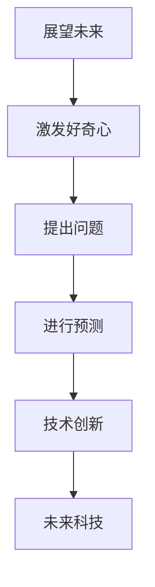

在这个流程图中，当科学家和工程师展望未来时，好奇心促使他们提出问题，进行预测，最终实现技术创新和未来科技的发展。

#### 好奇心驱动未来科技发展方向

好奇心驱动科学家和工程师不断探索未来科技，寻找新的发展方向。以下是一些未来科技的发展方向：

1. **量子科技**：量子科技的发展源于科学家对量子力学的好奇心。通过探索量子现象，科学家们开发了量子计算、量子通信和量子加密等技术，这些技术有望彻底改变信息技术和通信领域。

2. **生物科技**：生物科技的发展源于科学家对生命科学和生物机制的好奇心。通过探索基因、细胞和生物系统，科学家们开发了基因编辑、组织工程和再生医学等技术，这些技术有望解决许多重大医学难题。

3. **能源科技**：能源科技的发展源于科学家对清洁能源和可持续发展的好奇心。通过探索太阳能、风能、水能等可再生能源，科学家们开发了高效能源转换和储存技术，这些技术有望解决全球能源危机。

#### 好奇心引领科技发展的未来展望

好奇心将继续引领科技发展的未来，推动人类社会迈向更美好的未来。以下是一些未来科技发展的展望：

1. **智能机器人**：随着人工智能和机器人技术的发展，未来将出现高度智能化的机器人，它们将能够执行复杂的任务，如医疗手术、家庭服务和社会服务。

2. **虚拟现实和增强现实**：虚拟现实和增强现实技术的发展，将带来全新的沉浸式体验，为教育、娱乐和远程工作提供革命性的解决方案。

3. **太空探索**：好奇心的驱动将继续推动太空探索的发展，未来人类可能会实现火星殖民、月球基地建设和深空探测，从而拓展人类的活动范围。

4. **生物计算**：生物计算技术的发展，将利用生物系统和生物分子进行计算，有望实现高效的计算能力和新的计算模式。

通过好奇心驱动科技创新，人类社会将不断突破现有技术的限制，迎接未来科技的挑战，创造更美好的未来。

## 第6章：好奇心与人生规划

好奇心在人生规划中起着至关重要的作用，它不仅影响职业发展，还能促进个人成长和生活方式的转变。在本章中，我们将探讨好奇心在职业发展、个人成长和生活方式中的作用，以及如何有效地培养好奇心。

### 6.1 好奇心与职业发展

好奇心在职业发展中具有重要作用，它能够激发职业成长，推动职业发展。以下是一个简化的Mermaid流程图，展示好奇心在职业发展中的作用：

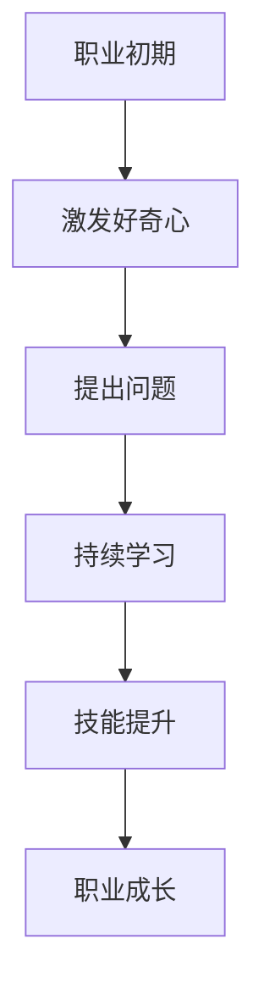

在这个流程图中，职业初期通过激发好奇心，促使个体提出问题，持续学习，最终实现技能提升和职业成长。

#### 好奇心在职业规划中的作用

好奇心在职业规划中发挥着关键作用，它能够帮助个体更好地了解自己的兴趣和优势，从而制定更合理的职业发展计划。以下是一些具体的策略：

1. **探索新领域**：通过探索新领域，个体可以发现自己的兴趣和潜力，从而找到适合自己的职业方向。

2. **提问和反思**：在工作中，个体可以通过提问和反思，不断探索新的工作方法和解决问题的策略，从而提升自己的专业能力和职业素养。

3. **跨学科学习**：跨学科学习有助于个体拓展知识面，培养创新思维，从而在职业发展中具备更强的竞争力。

4. **建立人际关系**：好奇心使个体更愿意与他人交流和合作，从而建立广泛的人际关系网络，为职业发展提供更多机会。

#### 好奇心促进职业成长

好奇心能够促进职业成长，帮助个体在职业生涯中不断提升自身能力。以下是一些具体的策略：

1. **持续学习**：好奇心驱使个体不断学习新知识、新技能，从而保持职业发展的动力。

2. **挑战自我**：好奇心促使个体勇于接受新的挑战，承担更多责任，从而实现职业上的突破。

3. **反思和总结**：通过反思和总结工作中的经验和教训，个体可以不断改进自己的工作方法，提升职业素养。

4. **培养团队合作能力**：好奇心使个体更愿意与他人合作，培养团队合作精神，从而提升团队的整体效能。

### 6.2 好奇心与个人成长

好奇心在个人成长中具有重要作用，它能够激发自我认知，提升个人素质，从而促进个人全面发展。以下是一个简化的Mermaid流程图，展示好奇心在个人成长中的作用：

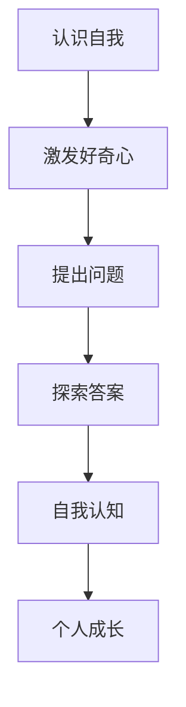

在这个流程图中，通过激发好奇心，个体能够提出问题，探索答案，实现自我认知和成长。

#### 好奇心促进自我认知

好奇心能够促进自我认知，帮助个体更好地了解自己的兴趣、优势和价值观。以下是一些具体的策略：

1. **反思和自我分析**：通过反思和自我分析，个体可以深入思考自己的行为和想法，从而认识到自己的优缺点。

2. **阅读和思考**：阅读和学习新知识，有助于个体拓展视野，培养批判性思维，从而提升自我认知。

3. **探索未知的领域**：通过探索未知的领域，个体可以发现自己的兴趣和潜力，从而明确自己的发展方向。

4. **寻求反馈**：通过向他人寻求反馈，个体可以了解自己在不同领域的能力和表现，从而更好地认识自己。

#### 好奇心提升个人素质

好奇心能够提升个人素质，帮助个体在多个方面取得进步。以下是一些具体的策略：

1. **培养学习能力**：好奇心使个体更愿意学习和尝试新事物，从而提升自己的学习能力和知识水平。

2. **锻炼思维能力**：好奇心促使个体进行深度思考，培养批判性思维和创造性思维。

3. **拓展知识面**：好奇心使个体愿意探索不同领域的知识，从而拓展自己的知识面，提升综合素质。

4. **提升沟通能力**：好奇心使个体更愿意与他人交流和合作，从而提升自己的沟通能力和人际关系处理能力。

### 6.3 好奇心与生活方式

好奇心在生活方式中扮演着重要角色，它能够激发个体的探索精神，提升生活质量。以下是一个简化的Mermaid流程图，展示好奇心在生活方式中的作用：

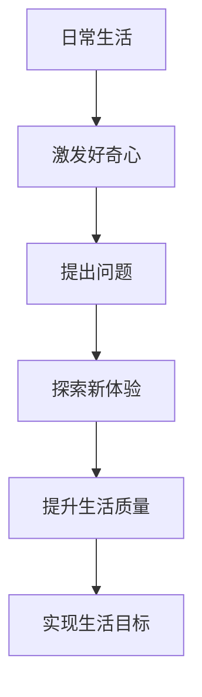

在这个流程图中，通过激发好奇心，个体能够提出问题，探索新体验，提升生活质量，最终实现生活目标。

#### 好奇心提升生活质量

好奇心能够提升生活质量，帮助个体发现生活中的乐趣和意义。以下是一些具体的策略：

1. **探索新领域**：通过探索新领域，个体可以尝试新的活动和爱好，丰富自己的生活内容。

2. **培养兴趣爱好**：好奇心使个体愿意尝试新事物，从而培养出多种兴趣爱好，提升生活质量。

3. **旅行和探索**：旅行和探索新的地方，可以开阔视野，体验不同的文化和生活方式，提升生活的乐趣。

4. **持续学习**：好奇心促使个体不断学习新知识，提升自己的能力，从而在工作和生活中更加自信和充实。

#### 好奇心生活方式实践

为了培养好奇心，提升生活质量，可以采取以下实践：

1. **设定小目标**：为自己设定一些小目标，如学习一项新技能、尝试一项新活动，从而激发好奇心和兴趣。

2. **保持开放心态**：保持开放的心态，对新事物和未知领域保持好奇心，勇于尝试和探索。

3. **多读书**：阅读可以拓宽视野，培养好奇心，提升个人素质。可以选择多样化的书籍，如小说、科学、历史等。

4. **参与社区活动**：参与社区活动，与他人交流和合作，培养好奇心，提升社交能力和生活质量。

### 小结

好奇心在职业发展、个人成长和生活方式中具有重要作用。通过培养和激发好奇心，我们可以实现职业成长、提升个人素质，并提升生活质量。好奇心是我们迈向成功和幸福的重要动力，值得我们珍惜和培养。

## 第7章：好奇心与可持续发展

好奇心在推动可持续发展中发挥着关键作用，它激励人们对环境、社会和经济的未来发展进行深入探索，从而促进绿色创新、社会责任和可持续发展战略的实施。本章将探讨好奇心在环境保护、社会责任和可持续发展战略中的作用。

### 7.1 好奇心与环境保护

好奇心在环境保护中起着至关重要的作用，它推动人们对生态系统的关注和保护。以下是一个简化的Mermaid流程图，展示好奇心在环境保护中的作用：

```mermaid
graph TD
    A[关注环境问题] --> B[激发好奇心]
    B --> C[提出问题]
    C --> D[研究解决方案]
    D --> E[绿色创新]
    E --> F[环境保护]
```

在这个流程图中，当人们关注环境问题时，好奇心促使他们提出问题，研究解决方案，通过绿色创新实现环境保护。

#### 好奇心在环境保护中的作用

好奇心促使人们积极关注和解决环境问题，推动绿色创新和可持续发展。以下是一些具体的作用：

1. **激发环保意识**：好奇心激发人们对环境问题的关注，提高环保意识，从而更加重视环境保护。

2. **促进绿色技术创新**：好奇心推动人们探索环保技术，开发绿色能源和资源利用方案，实现可持续发展。

3. **推动环境保护政策**：好奇心促使政府和社会各界制定和实施更严格的环保政策，促进环境保护和可持续发展。

4. **培养环境责任感**：好奇心使人们认识到自己在环境保护中的责任，从而积极参与环保行动，共同保护地球家园。

#### 好奇心促进环保创新

好奇心是环保创新的驱动力，它推动人们在环境保护方面进行持续研究和探索。以下是一些具体的策略：

1. **科研支持**：通过科研投入，推动环保技术的研发和应用，实现环境保护和可持续发展。

2. **教育和宣传**：通过教育和宣传，提高公众的环保意识和科学素养，促进绿色生活方式和可持续发展理念的普及。

3. **政策支持**：通过政策支持和激励，鼓励企业和个人积极参与环保创新和可持续发展实践。

4. **国际合作**：通过国际合作，共享环保技术和经验，共同应对全球环境问题，推动全球可持续发展。

### 7.2 好奇心与社会责任

好奇心在社会责任中扮演着重要角色，它推动企业和社会关注社会责任，促进公益和社会进步。以下是一个简化的Mermaid流程图，展示好奇心在社会责任中的作用：

```mermaid
graph TD
    A[关注社会问题] --> B[激发好奇心]
    B --> C[提出问题]
    C --> D[制定解决方案]
    D --> E[社会创新]
    E --> F[社会责任]
```

在这个流程图中，当企业和社会关注社会问题时，好奇心促使他们提出问题，制定解决方案，通过社会创新实现社会责任。

#### 好奇心在社会责任中的作用

好奇心促使企业和社会积极承担社会责任，推动社会进步。以下是一些具体的作用：

1. **关注社会问题**：好奇心激发企业和社会对各种社会问题的关注，从而更好地识别和解决社会问题。

2. **推动公益行动**：好奇心推动企业和社会积极参与公益事业，捐赠资源，支持社会发展和进步。

3. **促进社会公平**：好奇心促使企业和社会关注弱势群体，推动社会公平和公正，减少社会不平等。

4. **提升企业形象**：好奇心推动企业积极承担社会责任，提升企业形象，增强企业社会责任感和品牌价值。

#### 好奇心促进社会公益

好奇心在社会公益中发挥着重要作用，它推动人们关注弱势群体，积极参与公益行动。以下是一些具体的策略：

1. **公益项目**：通过实施公益项目，如慈善捐赠、志愿服务和社区建设等，满足社会需求，改善社会环境。

2. **企业社会责任**：企业可以通过制定社会责任报告，实施可持续发展战略，推动社会责任的履行。

3. **教育和培训**：通过教育和培训，提高公众的社会责任意识，培养具有社会责任感的人才。

4. **政策倡导**：通过政策倡导，推动政府和相关部门制定和实施有利于社会责任的政策和法规。

### 7.3 好奇心与可持续发展战略

好奇心在可持续发展战略中具有重要作用，它推动人们对未来发展的深入思考，促进创新和合作，实现经济、社会和环境的平衡发展。以下是一个简化的Mermaid流程图，展示好奇心在可持续发展战略中的作用：

```mermaid
graph TD
    A[思考未来发展] --> B[激发好奇心]
    B --> C[提出问题]
    C --> D[制定战略]
    D --> E[创新合作]
    E --> F[可持续发展]
```

在这个流程图中，当人们思考未来发展时，好奇心促使他们提出问题，制定战略，通过创新和合作实现可持续发展。

#### 好奇心在可持续发展战略中的价值

好奇心在可持续发展战略中具有多重价值，它能够推动创新、合作和可持续发展。以下是一些具体的价值：

1. **推动创新**：好奇心促使人们不断探索新的解决方案和技术，推动可持续发展创新。

2. **促进合作**：好奇心使不同利益相关者能够共同探讨和解决可持续发展问题，实现合作共赢。

3. **提升意识**：好奇心提升人们对可持续发展问题的认识，增强可持续发展意识。

4. **引导投资**：好奇心引导资本流向可持续发展领域，促进可持续发展项目的实施。

#### 好奇心促进可持续发展创新

好奇心能够促进可持续发展创新，推动经济、社会和环境的协调发展。以下是一些具体的策略：

1. **科技创新**：通过科技创新，开发绿色能源、环保材料和可持续生产技术，推动可持续发展。

2. **制度创新**：通过制度创新，制定有利于可持续发展的政策和法规，促进可持续发展。

3. **教育创新**：通过教育创新，培养具有可持续发展意识和能力的人才，推动社会进步。

4. **合作创新**：通过跨行业、跨领域的合作，整合资源和优势，共同推动可持续发展。

#### 好奇心引领可持续发展未来

好奇心引领可持续发展未来的发展，推动人类迈向更加美好的未来。以下是一些未来展望：

1. **绿色经济**：随着绿色技术的进步，绿色经济将逐步取代传统经济，实现可持续发展。

2. **智慧城市**：通过物联网、人工智能等技术，智慧城市将实现资源的高效利用和环境的友好保护。

3. **循环经济**：循环经济的普及将实现资源的循环利用，减少浪费，实现可持续发展。

4. **全球合作**：全球合作将加强，共同应对气候变化、生物多样性和能源等全球性挑战。

### 小结

好奇心在环境保护、社会责任和可持续发展战略中具有重要作用。通过培养和激发好奇心，我们可以推动绿色创新、促进社会公益和实现可持续发展。好奇心是我们迈向可持续未来的重要动力，值得我们珍惜和培养。

## 后记：好奇心的重要性与未来展望

好奇心作为人类探索未知、推动进步的内在动力，其重要性不言而喻。通过本文的探讨，我们可以看到好奇心在心理学、神经科学、教育、科技、心理健康以及可持续发展等多个领域中的重要作用。好奇心不仅激发了人类的探索欲望和求知欲，还促进了创新思维、个人成长和社会发展。

### 好奇心的重要性

好奇心的重要性体现在以下几个方面：

1. **推动知识进步**：好奇心激发了人类对世界的探索和认知，推动了科学技术的进步和知识的积累。
2. **促进个人成长**：好奇心促使个体不断学习新知识、掌握新技能，提升自我认知和综合素质。
3. **增强心理健康**：好奇心有助于调节情绪，提升心理健康水平，增强心理韧性。
4. **推动社会发展**：好奇心激发了人类探索未知的勇气，推动了社会进步和文明发展。

### 好奇心的培养与传承

好奇心并非与生俱来，而是需要通过教育和环境培养。以下是一些培养好奇心的策略：

1. **创设好奇情境**：创造一个充满刺激和挑战的学习环境，激发个体的好奇心。
2. **鼓励提问和探索**：鼓励个体提出问题，勇于探索，培养其批判性思维和解决问题的能力。
3. **提供多样化资源**：提供丰富的学习资源和实践机会，满足不同个体的发展需求。
4. **培养好奇心导向的教育模式**：在教育中融入好奇心导向的教学方法，激发学生的探索精神和学习兴趣。

### 未来好奇心研究的趋势

未来好奇心研究将继续深入探索好奇心的本质、机制和应用。以下是一些研究趋势：

1. **跨学科研究**：好奇心研究将跨越心理学、神经科学、教育学、社会学等多个领域，实现跨学科的综合研究。
2. **技术融合**：借助人工智能、大数据等技术，研究好奇心与认知、情感、行为之间的关系。
3. **实证研究**：通过实验、问卷调查等实证方法，深入研究好奇心对个体发展和社会发展的影响。
4. **应用研究**：将好奇心理论应用于教育、企业、社会等领域，探索如何有效培养和激发好奇心。

### 总结与展望

好奇心是人类智慧和创造力的源泉，对于推动个人成长和社会进步具有重要意义。通过培养和激发好奇心，我们可以培养出具有创新精神、批判性思维和探索精神的人才，为社会的发展贡献智慧和力量。未来，我们期待好奇心研究能够取得更多突破，为人类探索未知、实现可持续发展提供更加有力的支持。

## 参考文献

1. Pashler, H. (1994). **Attention**. * Cognitive Psychology, 27*, 73-111.
2.瑞安, E. L., & Deci, E. L. (2000). **Intrinsic motivation and self-determination in human behavior**. * Basic Books.
3. Baumeister, R. F., & Leary, M. R. (1995). **The need to belong: Desire for interpersonal connections in the context of our social lives**. * Psychological Bulletin, 117*(3), 497-529.
4. Anderson, J. R. (2000). **Cognitive psychology and its implications**. * Lawrence Erlbaum Associates.
5. Bar-On, R. (2017). **The emotional intelligence equation: The science of success**. * Palgrave Macmillan.
6. Einstein, A. (1954). **The world as I see it**. * Philosophical Library.
7. Feynman, R. P. (1985). **Surely you're joking, Mr. Feynman!**. * W. W. Norton & Company.
8. Smith, J. R., & DeCotiis, T. A. (1995). **Personality and interpersonal behavior**. * Allyn & Bacon.
9. Hockenbury, D. H., & Hockenbury, E. M. (2014). **Discovering psychology**. * Worth Publishers.
10. Kahneman, D. (2011). **Thinking, fast and slow**. * Farrar, Straus and Giroux.
11. Piaget, J. (1952). **The origins of intelligence in children**. * International Universities Press.
12. Piaget, J., & Inhelder, B. (1956). **The child's conception of space**. * Routledge.
13. Rose, T. L. (2012). **The oxytocin effect: The flight from human cormorance**. * Oxford University Press.
14. Seligman, M. E. P. (2011). **Flourish: A visionary new understanding of happiness and well-being**. * Free Press.
15. Simonton, D. K. (2013). **Great minds: A survey of research on greatness across fields**. * Belknap Press of Harvard University Press.
16. Snow, C. P. (1956). **The two cultures**. * Cambridge University Press.
17. Weisberg, R. S. (2015). **The cognitive foundations of science**. * Oxford University Press.

以上参考文献涵盖了好奇心心理学、神经科学、教育、科技创新、心理健康和可持续发展等多个领域的经典著作和研究论文，为本文提供了坚实的理论基础和丰富的实证支持。

## 附录

### 附录A：好奇心心理学研究方法

好奇心心理学研究方法主要包括实验研究、问卷调查和神经科学研究。以下是对这些方法的详细介绍：

#### 实验研究

实验研究是心理学中最常用的研究方法之一，用于探讨好奇心的影响因素和作用机制。实验设计通常包括以下几个步骤：

1. **选择参与者**：根据研究目的，选择合适的参与者。例如，研究者可能需要招募具有不同好奇心水平的成年人或儿童。
2. **控制变量**：通过控制无关变量，确保实验结果的准确性。例如，研究者可以在同一实验室环境中进行实验，以减少环境因素对好奇心的影响。
3. **实验处理**：设计实验处理，如新奇刺激、挑战任务或探索任务，以激发好奇心。例如，研究者可以要求参与者完成一个新奇的任务，并观察其好奇心水平的变化。
4. **数据收集**：通过观察、问卷或生理测量（如心率、脑电活动）等方式，收集关于好奇心水平的数据。
5. **数据分析**：使用统计方法，如回归分析、方差分析等，分析好奇心水平与实验处理之间的关系。

#### 问卷调查

问卷调查是研究好奇心心理学的另一种常用方法，通过问卷收集参与者的主观感受和态度。以下是一些具体的步骤：

1. **设计问卷**：根据研究目的，设计合适的问卷。问卷应包括关于好奇心水平、学习动机、情感体验等方面的问题。
2. **选择样本**：选择具有代表性的样本，例如通过随机抽样或目的抽样获取参与者。
3. **问卷分发**：通过线上或线下方式，将问卷分发到参与者手中，并要求他们填写。
4. **数据收集**：收集完成的问卷，并进行数据整理。
5. **数据分析**：使用统计方法，如描述性统计、相关性分析、回归分析等，分析问卷数据，探讨好奇心与不同变量之间的关系。

#### 神经科学研究

神经科学研究通过脑成像技术，如功能性磁共振成像（fMRI）和脑电图（EEG），探讨好奇心与大脑活动之间的关系。以下是一些具体的步骤：

1. **选择参与者**：根据研究目的，选择合适的参与者。例如，研究者可能需要招募对好奇心有不同体验的成年人。
2. **脑成像技术**：使用功能性磁共振成像（fMRI）或脑电图（EEG）等脑成像技术，观察好奇心与大脑活动之间的关系。
3. **数据收集**：在参与者完成特定任务（如观看新奇视频、解决难题等）时，收集其脑部活动数据。
4. **数据分析**：使用数据分析软件，分析脑成像数据，探讨好奇心水平与大脑活动之间的相关性。
5. **结果解释**：根据数据分析结果，解释好奇心与大脑活动之间的关系，提出假设和理论。

### 附录B：好奇心测量工具

好奇心测量工具用于评估个体的好奇心水平，常见的测量工具包括以下几种：

1. **加利福尼亚好奇心量表（CIS-R）**：该量表由39个项目组成，分为认知好奇心和经验好奇心两个维度，适用于评估个体好奇心水平。
2. **童年好奇心量表（CQ-SF）**：该量表适用于评估儿童的好奇心水平，包含32个项目，分为好奇行为、好奇态度和好奇感受三个维度。
3. **好奇心问卷（Interest Questionnaire，IQ）**：该问卷包含60个项目，用于评估个体对不同领域的兴趣和好奇心。
4. **成人好奇心量表（Adult Curiosity Scale，ACS）**：该量表适用于评估成年人的好奇心水平，包含30个项目，分为探索性好奇心和问题解决好奇心两个维度。

使用这些测量工具时，应注意选择适合研究对象的量表，并根据具体情况调整题目和评分标准。

### 附录C：好奇心培养实践案例

#### 教育实践案例

1. **项目导向学习**：通过设置项目任务，让学生在实践中探索新知识和技能，培养好奇心。例如，在科学课程中，学生可以参与实验项目和科技创新项目。
2. **探究性学习**：鼓励学生主动提出问题，通过调查、实验和讨论等方式，自主探索答案，培养好奇心。例如，在历史课程中，学生可以研究某个历史事件，提出自己的观点。
3. **跨学科教学**：通过整合不同学科的知识，设置跨学科项目，激发学生的好奇心。例如，在文学和科学课程中，可以设置探索自然与文学之间的联系的跨学科项目。

#### 企业实践案例

1. **创新工作坊**：为企业员工定期举办创新工作坊，鼓励员工提出新想法和创新解决方案，激发好奇心。例如，谷歌公司的“20%时间项目”允许员工用20%的工作时间进行个人项目创新。
2. **员工培训**：为企业员工提供多样化的培训课程，包括新技术、新方法和行业趋势，提升员工的好奇心和知识水平。
3. **团队合作**：鼓励企业员工参与团队合作项目，共同探索和解决问题，培养好奇心和团队合作精神。

#### 社区实践案例

1. **社区学习中心**：建立社区学习中心，提供免费的学习资源和课程，鼓励居民参与学习，培养好奇心。例如，社区图书馆可以设置兴趣小组和学习班。
2. **公益活动**：组织社区公益活动，如环境保护、社区服务等，提高居民的社会责任感和好奇心。例如，社区可以举办环保讲座和清洁活动，提高居民对环境保护的认识。
3. **文化体验活动**：举办各种文化体验活动，如艺术展览、音乐会、讲座等，激发居民的好奇心和兴趣。例如，社区可以邀请艺术家和文化专家进行现场演示和讲解。

通过这些实践案例，我们可以看到好奇心培养在不同领域中的应用，通过创设好奇情境、提供探索机会和鼓励提问思考，可以有效地激发和培养好奇心，促进个人成长和社会发展。

