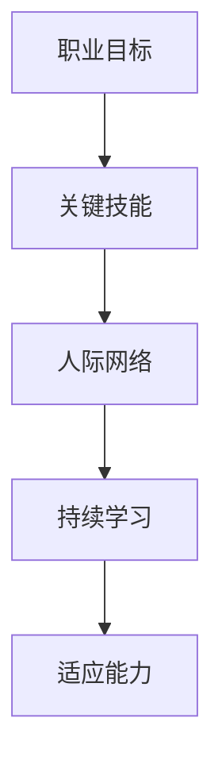

                 

### 文章标题：如何在领域中脱颖而出

#### 关键词：
职业发展、技能提升、个人品牌建设、持续学习、适应能力

#### 摘要：
在当今快速变化的技术领域，要想脱颖而出，成为一名优秀的专业人士，不仅需要掌握扎实的技术技能，还需要具备卓越的软技能和持续学习的能力。本文将详细探讨如何在职业发展中脱颖而出，包括关键技能的培养、个人品牌的构建、持续学习的方法以及适应变化的策略。

### 目录大纲

#### 第一部分：核心概念与联系

- **第1章：背景与核心概念**
  - 1.1 职业发展领域的挑战
  - 1.2 如何在领域中脱颖而出
  - 1.3 核心概念联系与架构

- **第2章：关键技能培养与提升**
  - 2.1 技能评估与定位
  - 2.2 技能培养方法
  - 2.3 技能提升与优化

- **第3章：数学模型与公式应用**
  - 3.1 数学模型基础
  - 3.2 数学公式解析
  - 3.3 数学模型举例

#### 第二部分：核心算法原理讲解

- **第4章：个人品牌建设与推广**
  - 4.1 个人品牌定位
  - 4.2 品牌内容创作
  - 4.3 品牌推广实战

#### 第三部分：项目实战

- **第5章：持续学习策略与方法**
  - 5.1 学习资源筛选
  - 5.2 学习方法优化
  - 5.3 适应能力提升

#### 第四部分：案例分析与经验总结

- **第6章：职业发展案例研究**
  - 6.1 成功案例介绍
  - 6.2 经验总结与启示
  - 6.3 持续学习与发展的路径

#### 第五部分：总结与展望

- **第7章：职业发展的未来趋势与展望**
  - 7.1 趋势分析
  - 7.2 未来展望
  - 7.3 结语

#### 附录

- **附录A：资源与工具推荐**
  - A.1 学习资源推荐
  - A.2 工具与应用推荐
  - A.3 专业书籍推荐

### 第一部分：核心概念与联系

#### 第1章：背景与核心概念

##### 1.1 职业发展领域的挑战

在当今的职场环境中，专业人士面临的挑战愈发严峻。首先，职场竞争日益激烈。随着全球化的推进和科技的飞速发展，各行各业对高素质专业人才的需求不断增加，但与此同时，可供职位的数量并未相应增长。这使得求职者在寻找理想工作机会时面临巨大的压力。

其次，技能需求不断变化。信息技术、人工智能、大数据等新兴领域的兴起，使得传统的职业技能不断被淘汰，新的技能需求不断涌现。专业人士必须不断学习新技能，以保持自己的市场竞争力。这种技能更新速度的加快，对个人学习能力和适应能力提出了更高的要求。

最后，个人品牌建设的重要性日益凸显。在信息爆炸的时代，个人品牌成为了职业成功的关键因素。一个强有力的个人品牌不仅能提升个人的知名度，还能增强职业竞争力，为个人带来更多的机会和资源。

##### 1.2 如何在领域中脱颖而出

要在职业发展中脱颖而出，专业人士需要采取以下策略：

1. **明确个人职业目标**：首先，明确个人职业目标是职业发展的基础。个人目标应与市场需求和自身兴趣相结合，这样才能在职业道路上保持动力和方向。

2. **培养关键技能**：关键技能是指那些能够显著提升个人竞争力的技能。例如，在软件开发领域，编程技能、系统设计能力、代码审查和项目管理能力都是关键技能。

3. **构建强大的人际网络**：人际网络是职业发展的重要资源。通过参加行业活动、加入专业社群，专业人士可以结识同行，建立合作关系，从而拓宽职业发展渠道。

4. **持续学习和适应**：在不断变化的技术环境中，持续学习和适应能力是至关重要的。专业人士应积极参与培训和学习，不断提升自己的技能水平，以应对新的挑战。

##### 1.3 核心概念联系与架构

为了更好地理解上述核心概念，我们可以使用一个职业发展路径图（使用Mermaid流程图）来展示这些概念之间的联系。

这张图清晰地展示了职业发展路径中的关键环节，以及这些环节之间的相互关系。职业目标为导向，关键技能是基础，人际网络是支持，持续学习和适应能力是保障。通过这张图，我们可以更直观地理解职业发展的核心概念和其相互联系。

### 第一部分总结

在本部分中，我们详细探讨了职业发展领域的挑战，明确了在领域中脱颖而出的策略，并使用Mermaid流程图展示了核心概念之间的联系。在接下来的章节中，我们将进一步深入讨论关键技能的培养与提升、数学模型的应用、个人品牌建设与推广以及持续学习与适应的策略，帮助您在职业生涯中实现持续成长与成功。让我们继续深入探讨，开启这一职业发展的旅程。

#### 第二部分：核心算法原理讲解

##### 第2章：关键技能培养与提升

在当今快速变化的技术领域，专业技能是职场成功的基石。为了在竞争激烈的职场中脱颖而出，培养和提升关键技能至关重要。本章节将详细探讨如何进行技能评估与定位、技能培养方法以及技能提升与优化。

##### 2.1 技能评估与定位

首先，技能评估与定位是培养关键技能的第一步。一个全面的技能评估可以帮助个人了解自己的优势和短板，从而制定有针对性的提升计划。

**技能评估工具介绍：**

1. **自我评估工具**：自我评估工具包括在线问卷、能力测评平台等，例如LinkedIn的技能评估工具和Coursera的技能评测功能。

2. **技能图谱分析**：技能图谱通过可视化方式展示各个技能之间的关系和重要程度，帮助个人更清晰地了解自己的技能构成。

3. **职业发展定位**：通过职业发展定位，个人可以明确自己的职业目标，从而有针对性地培养相关技能。

**案例：**

假设一位软件工程师想要评估自己的编程技能。他可以通过在线技能评估工具评估自己的编程能力，并使用技能图谱了解不同的编程语言和框架的重要性。在此基础上，他可以明确自己的职业目标，例如成为全栈开发者，并针对性地提升相关技能。

##### 2.2 技能培养方法

接下来，我们需要探讨如何通过有效的技能培养方法来提升个人技能。

**系统性学习策略：**

1. **基础知识巩固**：任何技能的培养都离不开基础知识。对于软件工程师来说，编程语言的基础语法和算法数据结构是必须掌握的。

2. **在线课程与教材**：利用在线课程和教材进行系统学习是一个高效的方法。例如，Coursera、edX等在线教育平台提供了大量的专业课程和教材，涵盖了从入门到高级的各种技能。

3. **项目实践**：通过实际项目来应用所学知识，是提升技能的重要途径。项目实践不仅能巩固知识，还能锻炼解决实际问题的能力。

**实践项目经验积累：**

1. **个人项目**：个人项目可以是自己的兴趣项目，也可以是为了解决实际问题而设计的。通过个人项目，可以积累实战经验，提升技能。

2. **开源项目参与**：参与开源项目，可以与全球的开发者合作，学习到先进的开发方法和经验。

3. **实习经历**：实习是了解企业工作流程、提升实际操作能力的重要途径。通过实习，可以深入了解行业需求，为未来职业发展打下基础。

**专业认证与培训：**

1. **专业认证**：通过获得专业认证，可以证明个人具备某种技能。例如，PMP项目管理认证、CISSP网络安全认证等。

2. **培训课程**：参加专业培训课程，可以系统地学习某一领域的知识。例如，数据分析培训、机器学习培训等。

##### 2.3 技能提升与优化

一旦基础技能得到提升，接下来就是技能的优化和提升。

**技能地图构建：**

技能地图是一种用于展示个人技能和知识结构的工具。通过构建技能地图，个人可以更清晰地了解自己的技能短板，并制定相应的提升计划。

**技能竞赛与挑战：**

1. **技术竞赛**：参加技术竞赛，可以锻炼解题能力，同时也能与全球的顶尖开发者交流，学习最新的技术动态。

2. **挑战项目**：设定具有挑战性的项目，例如开发高性能的算法或者解决复杂的技术问题，通过挑战来提升技能。

**跨学科学习与应用：**

在快速变化的技术领域，跨学科学习变得越来越重要。通过学习其他领域的知识，可以拓宽视野，提升创新能力。

1. **交叉学科项目**：参与跨学科项目，例如将人工智能应用于医疗领域，可以提升综合解决问题的能力。

2. **研讨会与讲座**：参加跨学科的研讨会和讲座，可以了解其他领域的最新研究成果和趋势，启发创新思维。

**持续反馈与改进：**

1. **自我反馈**：定期进行自我评估，了解技能提升的效果，并根据评估结果进行调整。

2. **反馈机制**：建立有效的反馈机制，通过导师、同事或用户反馈，不断改进自己的技能。

通过以上步骤，个人可以在职业生涯中不断提升自己的技能，从而在职场中脱颖而出。

##### 总结

在本章节中，我们详细探讨了如何评估和定位个人技能，介绍了系统性的学习策略和实践项目经验积累的方法，以及如何通过技能竞赛、跨学科学习和持续反馈来提升技能。这些方法不仅适用于软件开发领域，也可以广泛应用于其他技术领域。通过不断学习和提升，专业人士可以在职业生涯中保持竞争力，实现持续成长。

#### 第三部分：数学模型与公式应用

##### 第3章：数学模型与公式应用

在技术领域中，数学模型和公式是理解和解决复杂问题的重要工具。它们不仅在理论研究中占据核心地位，而且在实际应用中具有极高的价值。本章节将介绍数学模型的基础知识，解析常见的数学公式，并举例说明这些公式在实际项目中的应用。

##### 3.1 数学模型基础

数学模型是用于描述现实世界现象或系统的数学表示形式。它可以帮助我们理解和预测复杂系统的行为。在技术领域中，常见的数学模型包括概率论模型、统计学模型和机器学习模型。

**函数与极限：**

函数是数学模型的基础。一个函数描述了自变量和因变量之间的关系。极限是函数分析中的核心概念，用于研究函数在某个点的行为。例如，函数f(x)在x趋近于a时的极限可以表示为：

$$
\lim_{{x \to a}} f(x) = L
$$

**导数与微分：**

导数用于描述函数的变化率。在物理学中，导数常用于描述速度、加速度等物理量。微分是导数的线性近似，用于计算函数在某个点的局部变化。例如，函数f(x)在x=a处的导数可以表示为：

$$
f'(a) = \lim_{{h \to 0}} \frac{f(a+h) - f(a)}{h}
$$

**积分与微积分：**

积分是导数的反操作，用于计算函数在区间上的累积效果。微积分是研究函数和其导数、积分的数学分支。在工程和科学中，积分常用于计算面积、体积等。例如，函数f(x)在区间[a, b]上的定积分可以表示为：

$$
\int_{a}^{b} f(x) \, dx
$$

##### 3.2 数学公式解析

在技术领域中，常见的数学公式包括概率论公式、统计学公式和机器学习相关公式。以下是一些重要的公式及其应用。

**概率论公式：**

1. **条件概率**：

$$
P(A|B) = \frac{P(B|A) \cdot P(A)}{P(B)}
$$

条件概率描述了事件A在事件B发生的条件下发生的概率。这个公式在机器学习和数据科学中广泛应用，例如用于贝叶斯网络和朴素贝叶斯分类器。

2. **全概率公式**：

$$
P(A) = \sum_{i=1}^{n} P(A|B_i) \cdot P(B_i)
$$

全概率公式用于计算一个事件的总体概率，通过将事件划分为若干互斥且穷尽的子事件，并利用条件概率来计算。

**统计学公式：**

1. **均值**：

$$
\mu = \frac{1}{n} \sum_{i=1}^{n} x_i
$$

均值是统计学中最基本的描述统计量，用于表示一组数据的平均水平。

2. **方差**：

$$
\sigma^2 = \frac{1}{n} \sum_{i=1}^{n} (x_i - \mu)^2
$$

方差用于描述数据的离散程度，是衡量数据分散性的重要指标。

**机器学习相关公式：**

1. **损失函数**：

$$
J(\theta) = -\frac{1}{m} \sum_{i=1}^{m} [y^{(i)} \cdot \log(h_\theta(x^{(i)})) + (1 - y^{(i)}) \cdot \log(1 - h_\theta(x^{(i)}))]
$$

损失函数是机器学习模型中用于衡量预测值与真实值之间差异的函数。例如，逻辑回归中的交叉熵损失函数用于优化模型的参数。

2. **梯度下降**：

$$
\theta_j := \theta_j - \alpha \cdot \frac{\partial J(\theta)}{\partial \theta_j}
$$

梯度下降是一种优化算法，用于最小化损失函数。它通过计算损失函数关于模型参数的梯度，并沿梯度方向进行迭代，以逐步优化模型参数。

##### 3.3 数学模型举例

数学模型在数据分析、机器学习、优化等领域有广泛的应用。以下是一个数据分析和机器学习模型的具体例子。

**数据分析示例：**

假设我们有一个关于客户购买行为的数据库，包含客户的年龄、收入、购买历史等信息。我们可以使用回归模型来预测客户的购买概率。

1. **建立模型**：

$$
h(x) = \theta_0 + \theta_1 \cdot x_1 + \theta_2 \cdot x_2
$$

其中，$x_1$代表年龄，$x_2$代表收入，$\theta_0, \theta_1, \theta_2$是模型参数。

2. **训练模型**：

通过梯度下降算法训练模型参数，以最小化损失函数。

3. **预测应用**：

使用训练好的模型预测新客户是否购买特定产品。

**机器学习算法模型：**

假设我们使用决策树算法来分类电子邮件是否为垃圾邮件。

1. **建立模型**：

决策树通过一系列条件判断来划分数据集，直到达到停止条件（如最大深度或最小叶子节点样本数）。

2. **训练模型**：

使用训练数据集，构建决策树模型。

3. **预测应用**：

对新到达的电子邮件进行分类，判断其是否为垃圾邮件。

通过上述例子，我们可以看到数学模型在技术领域的实际应用。这些模型不仅帮助我们理解和解决复杂问题，还为我们提供了强大的工具来优化算法、提升性能。

##### 总结

在本章节中，我们介绍了数学模型的基础知识，解析了概率论、统计学和机器学习中的重要公式，并举例说明了这些公式在实际项目中的应用。数学模型和公式是技术领域中不可或缺的工具，通过深入理解和灵活应用，我们可以更有效地解决复杂问题，提升技术水平。

#### 第四部分：项目实战

##### 第4章：个人品牌建设与推广

在信息技术和社交媒体高度发展的今天，个人品牌建设已成为职业发展的重要组成部分。一个强大的个人品牌不仅能够提升个人在职场中的竞争力，还能为个人的职业发展带来更多的机会和资源。本章节将详细探讨个人品牌建设与推广的方法和策略。

##### 4.1 个人品牌定位

个人品牌定位是品牌建设的第一步，它关乎个人品牌的形象和核心价值。一个明确的品牌定位有助于在受众中形成一致的认知，提升品牌的辨识度。

**明确个人品牌形象：**

1. **个人愿景与使命**：明确个人愿景和使命，这将成为个人品牌的核心价值。例如，一位数据科学家可能将其品牌形象定位为“用数据驱动决策，助力企业增长”。

2. **专业领域与专长**：明确自己的专业领域和专长，这有助于在特定领域内建立权威。例如，一位专注于大数据分析的专家可以将其品牌定位为“大数据分析专家”。

3. **个人风格与价值观**：个人风格和价值观也是品牌形象的重要组成部分。一个积极向上、乐于分享的形象能够吸引更多的关注和支持。

**确定目标受众：**

1. **目标群体**：明确自己的目标受众，这有助于集中资源进行精准营销。例如，如果目标是吸引企业的C-level高管，那么品牌内容应更注重专业性和深度。

2. **需求与痛点**：了解目标受众的需求和痛点，这有助于提供更有针对性的内容。例如，如果目标受众是软件开发者，可以提供技术教程和实战经验分享。

**制定品牌传播策略：**

1. **内容规划**：制定内容规划，包括内容类型、发布频率和传播渠道。内容应具有专业性和吸引力，能够持续吸引目标受众。

2. **传播渠道**：选择适合的品牌传播渠道，例如社交媒体平台、博客、LinkedIn等。根据目标受众的活跃时间和习惯，选择最佳传播渠道。

3. **互动与反馈**：积极与受众互动，收集反馈，不断优化品牌内容。通过互动，能够建立更深层次的联系，增强品牌忠诚度。

##### 4.2 品牌内容创作

内容创作是品牌建设的重要环节，高质量的原创内容能够吸引受众，提升个人品牌的知名度。

**内容营销策略：**

1. **原创性**：确保内容具有原创性，这有助于在信息爆炸的环境中脱颖而出。

2. **专业性**：内容应具有专业性，展示个人的专业知识和实践经验。这有助于在目标受众中建立权威。

3. **多样性**：内容形式应多样化，包括博客文章、视频教程、案例研究、访谈等。多样化的内容能够吸引更广泛的受众。

**社交媒体运营：**

1. **平台选择**：选择适合的社交媒体平台，如LinkedIn、Twitter、YouTube等。根据目标受众的活跃平台，选择最佳运营渠道。

2. **内容发布**：制定内容发布计划，确保内容在关键时间点发布，吸引更多关注。

3. **互动与分享**：积极与受众互动，回复评论，分享有价值的信息。通过互动，能够建立更紧密的联系，增强品牌忠诚度。

**线上线下活动策划：**

1. **线上线下结合**：策划线上线下活动，如线上研讨会、线下沙龙、技术分享会等。线上线下结合能够覆盖更广泛的受众。

2. **活动宣传**：提前宣传活动，利用社交媒体、邮件列表、合作伙伴等渠道进行宣传，吸引更多参与者。

3. **活动反馈**：活动结束后，收集参与者反馈，了解活动效果，不断优化活动策划。

##### 4.3 品牌推广实战

个人品牌推广需要系统性和持续性的努力。以下是一些实用的推广策略。

**KOL合作与影响：**

1. **选择合适的KOL**：选择与个人品牌定位相符的KOL，如技术领域的权威专家、行业领袖等。

2. **内容合作**：与KOL合作创作内容，如联合撰写文章、共同举办线上研讨会等。通过KOL的影响力和权威性，提升个人品牌的知名度。

**媒体报道与宣传：**

1. **新闻媒体**：积极寻求媒体报道，如技术博客、行业媒体、新闻网站等。

2. **公关活动**：策划公关活动，如技术发布会、行业峰会等，吸引媒体关注。

3. **媒体合作**：与知名媒体建立合作关系，通过媒体平台进行内容传播。

**个人品牌评估与优化：**

1. **品牌评估**：定期对个人品牌进行评估，了解品牌在受众中的认知度和影响力。

2. **数据分析**：通过数据分析，了解受众的行为和偏好，优化品牌内容和推广策略。

3. **持续优化**：根据评估和数据分析结果，持续优化个人品牌，不断提升品牌价值和影响力。

##### 总结

在本章节中，我们详细探讨了个人品牌建设与推广的方法和策略，包括品牌定位、内容创作、社交媒体运营、线上线下活动策划以及KOL合作和媒体报道等。通过系统性和持续性的努力，个人品牌建设将为您在职业生涯中带来更多机会和资源。接下来，我们将进一步探讨持续学习与适应的策略，帮助您在快速变化的技术领域中保持竞争力。

#### 第四部分总结

在本部分中，我们深入探讨了个人品牌建设与推广的策略，包括品牌定位、内容创作、社交媒体运营、线上线下活动策划以及KOL合作和媒体报道等。通过这些策略，个人可以提升品牌知名度，吸引更多的职业机会和资源。接下来，我们将进一步探讨持续学习与适应的策略，帮助您在快速变化的技术领域中保持竞争力。持续学习和适应是职业成功的关键，让我们继续前行，开启新的篇章。

#### 第五部分：持续学习与适应

##### 第5章：持续学习策略与方法

在快速变化的技术领域中，持续学习和适应是保持竞争力的关键。本章节将详细探讨学习资源筛选、学习方法优化以及适应能力提升的策略。

##### 5.1 学习资源筛选

在信息爆炸的时代，选择合适的学习资源是提高学习效率的关键。

**学术文献与论文：**

1. **来源**：学术文献和论文是获取专业知识和前沿研究成果的重要来源。可以通过学术数据库如Google Scholar、PubMed、IEEE Xplore等进行检索。

2. **筛选标准**：选择高引用量、高影响因子的文章，这些文章通常具有更高的学术价值和可靠性。

**在线课程与讲座：**

1. **平台**：在线教育平台如Coursera、edX、Udacity等提供了丰富的课程资源，涵盖了从基础知识到高级技术的各种课程。

2. **评价标准**：选择评价高、课程内容系统、讲解清晰的课程，可以确保学习效果。

**专业书籍：**

1. **选择**：专业书籍是深入学习和系统掌握某一领域的知识的重要资源。选择权威、经典的书籍，如《人工智能：一种现代的方法》、《深度学习》等。

2. **评估**：通过书评、读者评论等评估书籍的质量，选择适合自己学习水平的书籍。

**行业报告与资讯：**

1. **来源**：行业报告和资讯可以从专业网站、研究机构、行业协会等获取。

2. **内容**：关注行业趋势、技术动态、市场分析等内容，可以及时了解行业动向。

##### 5.2 学习方法优化

优化学习方法能够提高学习效率，帮助专业人士更快地掌握新技能。

**分享式学习：**

1. **小组学习**：与同行或同事组成学习小组，通过讨论和合作，共同解决学习中遇到的问题。

2. **知识分享**：定期组织知识分享会，将所学知识分享给他人，通过讲授来加深理解和记忆。

**反思式学习：**

1. **定期反思**：学习后进行反思，总结学习过程中的收获和不足，明确下一步的学习目标。

2. **实践反思**：将所学知识应用于实际项目中，通过实践反思，发现并解决问题，提升实践能力。

**交互式学习：**

1. **在线讨论**：参与在线课程和论坛的讨论，与他人互动，获取不同的观点和见解。

2. **虚拟实验室**：利用虚拟实验室进行模拟实验，通过实际操作来加深对理论知识的理解。

##### 5.3 适应能力提升

在技术快速发展的环境中，适应能力是职业成功的关键。

**应对变化的心态：**

1. **开放心态**：保持开放心态，对新技术和新观点持欢迎态度，避免固步自封。

2. **灵活应对**：在面对变化时，能够迅速调整策略，灵活应对新的挑战。

**跨领域学习能力：**

1. **知识融合**：学习跨学科知识，将不同领域的知识进行融合，形成新的见解和解决方案。

2. **交叉训练**：通过参与不同领域的项目和任务，提升跨领域学习的能力。

**创新思维培养：**

1. **创造性思维**：通过思维导图、头脑风暴等工具，激发创造性思维。

2. **实践创新**：在实际项目中尝试新的方法和思路，通过实践来检验和创新。

##### 总结

在本章节中，我们详细探讨了持续学习和适应能力提升的策略，包括学习资源筛选、学习方法优化以及适应能力提升的方法。通过这些策略，专业人士可以在快速变化的技术领域中保持竞争力，实现持续成长。接下来，我们将通过案例分析和经验总结，进一步探讨如何在实际职业发展中应用这些策略。

#### 第五部分总结

在本部分中，我们深入探讨了持续学习与适应能力提升的策略，包括学习资源筛选、学习方法优化以及适应能力提升的方法。通过这些策略，专业人士可以在快速变化的技术领域中保持竞争力，实现持续成长。接下来，我们将通过案例分析和经验总结，进一步探讨如何在实际职业发展中应用这些策略，并从成功案例中汲取经验，为职业发展提供实际指导。让我们继续前行，探索更多职业发展的智慧。

#### 第六部分：案例分析与经验总结

##### 第6章：职业发展案例研究

在本章节中，我们将通过研究一些成功职业发展的案例，探讨个人品牌建设、技能提升和学习适应策略在职业发展中的实际应用。这些案例将为我们提供宝贵的经验和启示，帮助我们更好地理解如何在技术领域中脱颖而出。

##### 6.1 成功案例介绍

**案例一：数据科学家张晓磊的成长历程**

张晓磊是一位数据科学家，他的职业发展历程充满了挑战和机遇。起初，张晓磊在一家初创公司担任数据分析员，主要负责数据处理和报表生成。然而，随着公司的业务发展，张晓磊意识到，仅仅掌握基础的数据分析技能已经不足以满足职业发展的需求。

**技能提升：**

1. **系统性学习**：张晓磊通过在线课程和教材，系统地学习了机器学习、深度学习等相关技术，提升了自己的技术深度。

2. **实践项目**：他积极参与公司内部的项目，通过实际操作，将所学知识应用于解决实际问题。

3. **专业认证**：为了证明自己的专业能力，张晓磊参加了数据分析认证考试，并成功获得了认证。

**个人品牌建设：**

1. **内容创作**：张晓磊在技术博客上分享了自己的学习心得和项目经验，通过高质量的内容，吸引了大量关注。

2. **社交媒体运营**：他在LinkedIn和GitHub上积极发布技术文章和代码，与同行互动，扩大了自己的影响力。

**适应能力提升：**

1. **跨学科学习**：张晓磊开始学习编程语言，如Python和R，以便更好地处理复杂数据分析任务。

2. **创新思维**：通过参与跨学科项目，张晓磊学会了如何将数据分析应用于其他领域，如金融和医疗。

**结果与启示：**

张晓磊通过不断学习和提升，成功转型为一名高级数据科学家。他的成功经验告诉我们，系统性学习、实践项目和跨学科学习是职业发展的重要策略。

**案例二：AI创业公司CEO李晓红的经验分享**

李晓红是一位AI创业公司的CEO，她在新兴行业的快速发展中，积累了丰富的经验和见解。

**技能提升：**

1. **领导力培养**：李晓红通过参加领导力培训，提升了管理团队和领导项目的能力。

2. **市场洞察**：她定期阅读行业报告和市场分析，保持对市场动态的敏锐洞察。

3. **技术学习**：尽管作为CEO，她不是直接的技术人员，但她通过参与技术会议和学习最新的AI技术，确保公司技术方向的正确性。

**个人品牌建设：**

1. **公开演讲**：李晓红经常在各种技术会议上发表演讲，分享公司的经验和见解。

2. **媒体合作**：她与知名媒体合作，通过媒体报道提升了公司的知名度。

3. **社区贡献**：李晓红积极参与开源项目，通过贡献代码和撰写技术文章，提升了个人品牌。

**适应能力提升：**

1. **快速响应**：李晓红培养了快速响应市场变化的能力，通过敏捷管理，确保公司能够迅速调整战略。

2. **创新思维**：她鼓励团队成员提出创新想法，并建立了一套创新机制，确保公司持续创新。

**结果与启示：**

李晓红的成功经验表明，领导力培养、市场洞察和技术学习是新兴行业创业者的关键能力。通过个人品牌建设和快速适应能力，她带领公司取得了显著的成功。

**案例三：软件工程师王伟的职业转型**

王伟是一位有着多年软件开发经验的工程师，他成功实现了从软件工程师到产品经理的职业转型。

**技能提升：**

1. **产品思维**：王伟通过学习产品管理课程，培养了产品思维，了解了产品的全生命周期管理。

2. **沟通技巧**：他提升了沟通技巧，学会了如何与团队成员、客户和利益相关者有效沟通。

3. **项目管理**：王伟参加了项目管理培训，掌握了项目管理的知识和技能。

**个人品牌建设：**

1. **博客写作**：王伟在个人博客上分享了自己的转型经历和心得，吸引了大量关注。

2. **社交媒体**：他在LinkedIn和Twitter上积极发布产品管理和项目管理相关的文章和动态。

3. **网络课程**：他制作了一系列产品管理和项目管理课程，并通过网络平台进行分享。

**适应能力提升：**

1. **学习能力**：王伟通过不断学习新的知识和技能，快速适应了产品经理的角色。

2. **反思与调整**：他定期反思自己的工作，根据反馈进行调整，不断提升自己的能力。

**结果与启示：**

王伟的职业转型成功，展示了通过学习新技能、建立个人品牌和不断提升适应能力，可以在职业生涯中实现华丽转身。

##### 6.2 经验总结与启示

**个人品牌建设的关键要素：**

1. **内容创作**：通过博客、社交媒体等平台，持续创作高质量的内容，展示专业知识和经验。

2. **社交媒体运营**：积极参与行业讨论，扩大影响力，建立个人品牌。

3. **公开演讲**：通过参加行业会议和演讲，提升个人知名度。

**技能提升的有效途径：**

1. **系统性学习**：通过在线课程、专业书籍和学术文献，系统性地提升专业技能。

2. **实践项目**：通过实际项目，将理论知识应用于实践，提升解决实际问题的能力。

3. **专业认证**：通过获得专业认证，证明自己的专业能力。

**学习与适应的策略：**

1. **跨学科学习**：学习跨学科的知识，提升综合解决问题的能力。

2. **快速适应**：通过不断学习和实践，快速适应新的环境和需求。

3. **反思与调整**：定期反思自己的工作，根据反馈进行调整。

##### 6.3 持续学习与发展的路径

**职业规划的调整：**

1. **定期评估**：定期评估自己的职业目标和技能水平，根据市场变化和个人发展需求进行调整。

2. **长期规划**：制定长期职业规划，明确自己的职业发展路径。

**学习资源的管理：**

1. **资源筛选**：选择高质量的学习资源，确保学习效果。

2. **时间管理**：合理安排学习时间，确保学习效率。

**适应新环境的策略：**

1. **主动学习**：积极学习新知识和技能，适应新技术和环境。

2. **灵活应变**：在面对变化时，灵活调整策略，快速适应。

3. **持续反馈**：通过反馈机制，不断调整和优化自己的能力和策略。

##### 总结

通过以上案例分析和经验总结，我们可以看到，在职业发展中，个人品牌建设、技能提升和适应能力是至关重要的。通过不断学习和实践，我们可以不断提升自己的竞争力，实现职业目标。在接下来的章节中，我们将进一步探讨职业发展的未来趋势与展望，为我们的职业规划提供更多的指导。

#### 第六部分总结

在本章节中，我们通过分析几个成功职业发展的案例，探讨了个人品牌建设、技能提升和学习适应策略的实际应用。这些案例为我们提供了宝贵的经验和启示，帮助我们理解如何在技术领域中实现职业发展。通过这些成功经验，我们可以更好地规划自己的职业路径，提升自身竞争力。在接下来的章节中，我们将进一步探讨职业发展的未来趋势与展望，为我们的职业规划提供更多指导。

#### 第七部分：总结与展望

##### 第7章：职业发展的未来趋势与展望

在科技不断进步、行业迅速变革的背景下，职业发展面临着前所未有的机遇和挑战。本章节将探讨职业发展的未来趋势，分析技术革新对职业发展的影响，探讨跨界融合与职业多样化，并展望职业教育与培训的发展方向。

##### 7.1 趋势分析

**技术革新对职业发展的影响：**

1. **人工智能与自动化**：人工智能和自动化技术的快速发展，正在改变传统行业的运作模式。许多重复性、低技能的工作被机器取代，这要求职业人士不断提升自身的技术能力。

2. **数据科学与大数据**：随着数据量的爆炸性增长，数据科学和分析技能变得越来越重要。数据驱动的决策已成为企业运营的关键，这为具备数据分析能力的人才提供了广阔的发展空间。

3. **可持续发展和绿色科技**：全球对可持续发展的关注日益增加，绿色科技和环保产业成为新兴职业领域。环保工程师、可持续发展顾问等职业需求增长迅速。

**跨界融合与职业多样化：**

1. **多学科融合**：跨学科知识的融合成为趋势，如数据科学与生物技术的结合，数据科学家与医学专家的合作等。这种融合推动了新兴职业的出现。

2. **职业多样化**：随着技术的进步，许多传统职业正在演变为多样化的新职业。例如，软件开发人员可能转型为全栈开发者、云架构师或人工智能工程师。

**职业教育与培训的发展方向：**

1. **终身学习**：在快速变化的技术环境中，终身学习成为职业发展的必要条件。职业人士需要持续学习新技术和知识，以保持竞争力。

2. **个性化培训**：基于个人兴趣和职业目标的个性化培训将越来越受到重视。在线教育和定制化学习方案为职业人士提供了更多的学习选择。

3. **技能认证**：专业认证和技能认证将成为职业发展的重要标志。通过获得权威认证，职业人士能够证明自己的专业能力和技术水平。

##### 7.2 未来展望

**职业发展的新机遇：**

1. **数字化转型**：随着数字化转型的深入推进，职业人士将在数字化转型项目中扮演关键角色，如数据分析师、云计算工程师、网络安全专家等。

2. **新兴领域创业**：在新兴领域创业将成为职业发展的新机遇。例如，区块链、物联网、生物科技等领域的创业公司为职业人士提供了广阔的发展空间。

3. **全球化视野**：全球化带来的不仅仅是市场竞争，更是职业发展的新机遇。跨国公司和国际项目为职业人士提供了更广泛的职业选择。

**技能需求的变化：**

1. **软技能的重要性**：随着技术的进步，软技能如沟通能力、团队合作、领导力等变得越来越重要。这些技能将成为职业成功的关键因素。

2. **新技能的涌现**：随着新技术的发展，新的技能需求不断涌现。例如，数据隐私保护、人工智能伦理等新兴领域需要具备特定技能的专业人士。

**职业规划的建议：**

1. **长期规划**：制定长期的职业规划，明确职业目标和发展路径。

2. **持续学习**：保持持续学习的习惯，不断提升自己的技能和知识。

3. **灵活适应**：面对快速变化的市场环境，保持灵活适应的能力，及时调整职业策略。

##### 7.3 结语

职业发展是一场持久战，需要不断努力和适应。通过深入分析未来趋势和技能需求，我们可以更好地规划自己的职业道路，抓住新机遇，应对新挑战。持续学习、积极适应和灵活应对是职业成功的关键。让我们把握机遇，迎接未来的挑战，实现职业目标。

#### 附录

##### 附录A：资源与工具推荐

为了帮助专业人士在职业发展中更好地学习和应用新技术，以下是一些学习资源和工具的推荐。

##### A.1 学习资源推荐

1. **在线学习平台**：
   - Coursera：提供高质量的在线课程，涵盖各种技术领域。
   - edX：由哈佛大学和麻省理工学院创办的在线教育平台，提供丰富的课程资源。
   - Udemy：提供广泛的在线课程，适合不同技能水平的用户。

2. **学术期刊与论文库**：
   - IEEE Xplore：电气电子工程师协会的期刊和论文数据库。
   - ACM Digital Library：计算机科学领域的重要学术资源库。

3. **行业报告与资讯**：
   - Gartner：提供全面的行业报告和咨询服务。
   - Forrester：提供市场研究和分析报告。

##### A.2 工具与应用推荐

1. **个人品牌建设工具**：
   - LinkedIn：建立职业社交网络，展示个人成就。
   - Personal Branding Blog：提供个人品牌建设策略和资源。

2. **项目管理与协作工具**：
   - Trello：简单易用的项目管理和协作工具。
   - Asana：用于团队协作和任务管理的工具。

3. **数据分析与可视化工具**：
   - Tableau：数据可视化工具，用于创建交互式的数据仪表板。
   - Power BI：由微软推出的商业智能工具，用于数据分析。

##### A.3 专业书籍推荐

1. **职业发展经典书籍**：
   - 《职业规划：如何规划自己的职业生涯》（What Color Is Your Parachute?）- Richard N. Bolles。
   - 《成功之路：职业规划指南》（The Career Toolkit）- Donald Asher。

2. **技能提升实用指南**：
   - 《数据科学实战指南》（Data Science from Scratch）- Joel Grus。
   - 《深度学习》（Deep Learning）- Ian Goodfellow、Yoshua Bengio和Aaron Courville。

3. **人力资源与管理书籍**：
   - 《变革之舞：领导力和企业文化》（The Dance of Change）- Warren Bennis和Burt Nanus。
   - 《敏捷开发：实践指南》（Agile Project Management）- Jim Highsmith。

这些资源与工具将为您的职业发展提供有力的支持和指导，帮助您在快速变化的技术领域中不断成长和进步。希望这些推荐能够对您有所帮助。

