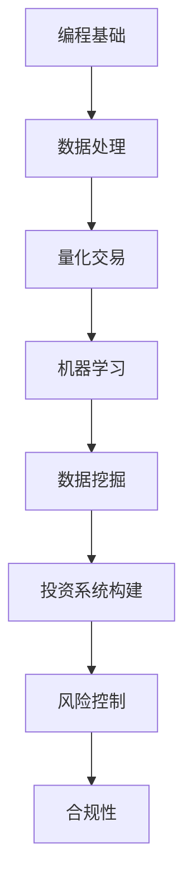
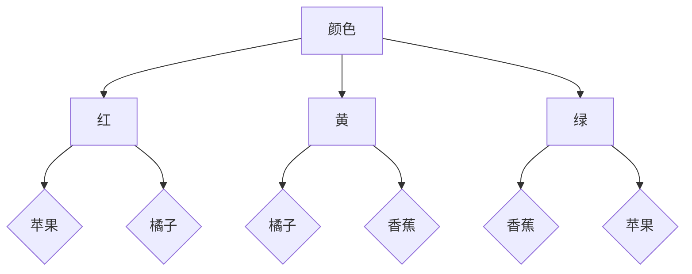

                 

# 《如何将编程技能应用于自动化投资》

## 关键词
- 自动化投资
- 编程技能
- 量化交易
- 机器学习
- 数据挖掘
- 风险管理
- 合规性

## 摘要
本文将深入探讨如何利用编程技能来开发自动化投资系统。我们将首先介绍自动化投资的基本概念，随后分析编程在自动化投资中的重要性，并详细阐述编程技能在数据处理、量化交易策略、机器学习和数据挖掘等领域的应用。文章还将通过实战案例展示如何构建和实现自动化投资系统，并探讨风险管理和合规性的相关策略。通过本文，读者将获得对编程技能在自动化投资领域应用的全景理解。

---

## 第一部分：编程与自动化投资基础

### 第1章：编程与自动化投资概述

#### 1.1 自动化投资的概念与重要性
自动化投资，又称为智能投资或量化投资，是一种利用计算机算法和技术来实现投资决策和交易执行的方法。这种方法的核心在于利用大量的历史数据和市场信息，通过数学模型和统计分析来预测市场走势，从而实现自动化的投资决策。

自动化投资的重要性主要体现在以下几个方面：

1. **效率提升**：自动化投资可以大幅提高投资决策的效率和准确性，减少人为失误。
2. **数据驱动**：基于大数据的分析，自动化投资能够更加精准地捕捉市场变化，提高投资的成功率。
3. **风险控制**：通过算法实现的风险管理可以更加科学和精准，降低投资风险。
4. **定制化**：不同的投资策略可以通过编程来实现，满足不同风险偏好和收益期望的投资需求。

#### 1.2 编程技能在自动化投资中的应用
编程技能在自动化投资中扮演着关键角色，主要应用于以下几个方面：

1. **数据处理**：自动化投资需要处理大量的历史数据和市场信息，编程技能可以帮助我们高效地进行数据清洗、整合和分析。
2. **算法开发**：开发有效的投资策略需要编程技能，通过编程实现量化交易策略和机器学习模型。
3. **系统实现**：自动化投资系统需要具备良好的结构设计和实现能力，编程技能是实现这一目标的基础。
4. **风险管理**：通过编程实现风险监控和预警系统，确保投资过程的安全性和稳健性。

#### 1.3 自动化投资的历史与发展趋势
自动化投资的历史可以追溯到20世纪80年代，当时一些机构开始尝试使用计算机算法进行股票交易。随着计算机技术和数据科学的发展，自动化投资逐渐成熟，并在过去几十年中得到了广泛应用。

当前，自动化投资的发展趋势主要体现在以下几个方面：

1. **算法复杂性增加**：随着人工智能和机器学习技术的进步，自动化投资算法的复杂性不断增加，能够更好地捕捉市场信息。
2. **应用场景扩展**：除了股票市场，自动化投资还广泛应用于外汇、期货、期权等金融领域，甚至包括区块链和加密货币市场。
3. **合规性要求提高**：随着监管环境的严格，自动化投资系统的合规性要求不断提高，编程技能在合规性控制中也发挥着重要作用。

### 第2章：编程语言与工具

#### 2.1 Python编程基础
Python 是自动化投资领域最常用的编程语言之一，原因如下：

1. **易于学习**：Python 语法简洁清晰，适合初学者快速入门。
2. **丰富的库支持**：Python 拥有大量成熟的金融、数据分析、机器学习和量化交易库，如 NumPy、Pandas、scikit-learn、QuantConnect 等。
3. **社区支持**：Python 拥有一个庞大且活跃的开发者社区，为编程学习和问题解决提供了丰富的资源。

Python 编程基础包括数据类型、控制结构、函数、模块等，是自动化投资编程的基石。

#### 2.2 Python在金融数据处理中的应用
金融数据处理是自动化投资的重要组成部分，Python 在这一领域中的应用体现在以下几个方面：

1. **数据采集**：Python 可以通过 Web 报表、API 接口等方式获取股票、债券、期货等金融市场的数据。
2. **数据清洗**：使用 Pandas 等库进行数据预处理，包括缺失值填充、异常值处理、数据标准化等。
3. **数据分析**：利用 Python 进行描述性统计分析、时间序列分析、相关性分析等，为投资决策提供数据支持。

#### 2.3 自动化投资工具介绍
自动化投资工具是实现自动化投资系统的重要组件，常见的工具有：

1. **量化交易平台**：如 QuantConnect、TradeStation、Zipline 等，提供编程接口和模拟交易环境。
2. **数据分析工具**：如 Jupyter Notebook、Google Colab 等，方便进行数据分析和模型实现。
3. **金融数据源**：如 Yahoo Finance、Alpha Vantage、Quandl 等，提供丰富的金融数据接口。

### 总结
通过本部分的学习，读者将了解自动化投资的基本概念、编程技能的应用以及相关编程语言和工具。这为后续深入探讨自动化投资算法和实战打下了坚实的基础。

---

## 第二部分：自动化投资算法

### 第3章：量化交易策略

#### 3.1 量化交易的基本原理
量化交易是一种基于数学模型和统计方法的投资策略，主要通过算法实现投资决策和交易执行。其基本原理包括：

1. **市场分析**：利用历史数据和当前市场信息，分析市场趋势和潜在机会。
2. **策略制定**：基于市场分析结果，制定具体的投资策略，包括买入、卖出和持有等操作。
3. **算法实现**：通过编程实现投资策略，自动化执行交易操作。

#### 3.2 量化交易策略的制定
制定有效的量化交易策略需要以下步骤：

1. **数据收集**：收集历史交易数据、市场指数、宏观经济指标等。
2. **特征工程**：提取有用的市场特征，如价格、成交量、技术指标等。
3. **模型训练**：使用机器学习和统计分析方法训练模型，识别市场趋势和交易信号。
4. **策略评估**：通过回测和模拟交易，评估策略的有效性和风险。

#### 3.3 量化交易策略的实现
实现量化交易策略的步骤如下：

1. **环境搭建**：选择合适的编程环境和工具，如 Python、Jupyter Notebook 等。
2. **模型实现**：根据策略需求，实现相关机器学习模型和算法。
3. **回测验证**：使用历史数据验证策略的有效性，调整和优化策略参数。
4. **实时交易**：将策略部署到量化交易平台，实现实时交易。

### 第4章：机器学习在自动化投资中的应用

#### 4.1 机器学习基础
机器学习是自动化投资中的重要工具，其基础包括：

1. **监督学习**：通过输入和输出数据训练模型，预测新数据的输出。
2. **无监督学习**：没有预定义的输出，主要用于数据降维和模式识别。
3. **强化学习**：通过试错和反馈调整策略，实现最优行为。

#### 4.2 机器学习在自动化投资中的应用
机器学习在自动化投资中的应用包括：

1. **趋势预测**：使用时间序列分析方法，预测市场价格的走势。
2. **风险预测**：通过分类和回归模型，预测投资组合的风险水平。
3. **交易信号生成**：使用聚类和分类算法，识别潜在的买卖信号。

#### 4.3 机器学习算法在自动化投资中的实现
实现机器学习算法在自动化投资中的步骤如下：

1. **数据准备**：收集和处理金融数据，提取特征。
2. **模型选择**：根据问题需求选择合适的机器学习算法。
3. **模型训练**：使用训练数据训练模型，优化模型参数。
4. **模型评估**：使用测试数据评估模型性能，调整模型。
5. **部署应用**：将模型部署到量化交易平台，实现自动化交易。

### 第5章：数据挖掘与市场分析

#### 5.1 数据挖掘的基本概念
数据挖掘是自动化投资中的重要工具，其基本概念包括：

1. **关联规则挖掘**：发现数据之间的关联性，用于市场细分和推荐系统。
2. **分类**：将数据分为不同的类别，用于预测市场趋势和交易信号。
3. **聚类**：将数据划分为不同的簇，用于识别市场模式和投资机会。

#### 5.2 数据挖掘在自动化投资中的应用
数据挖掘在自动化投资中的应用包括：

1. **市场趋势分析**：通过聚类和分类方法，识别市场趋势和周期性变化。
2. **风险因子分析**：通过关联规则挖掘，识别影响投资风险的关键因素。
3. **交易策略优化**：通过回归分析，优化交易策略的参数和组合。

#### 5.3 数据挖掘算法在自动化投资中的实现
实现数据挖掘算法在自动化投资中的步骤如下：

1. **数据准备**：收集和处理金融数据，提取特征。
2. **算法选择**：根据应用需求选择合适的数据挖掘算法。
3. **模型训练**：使用训练数据训练模型，优化模型参数。
4. **模型评估**：使用测试数据评估模型性能，调整模型。
5. **部署应用**：将模型部署到量化交易平台，实现自动化交易。

### 总结
通过本部分的学习，读者将掌握量化交易策略、机器学习和数据挖掘的基本原理及其在自动化投资中的应用方法。这些算法和工具将帮助读者构建和优化自动化投资系统，提高投资决策的准确性和效率。

---

## 第三部分：自动化投资实战

### 第6章：构建自动化投资系统

#### 6.1 自动化投资系统的设计
构建自动化投资系统是一个复杂的过程，涉及多个方面的设计和考虑。以下是设计自动化投资系统时需要考虑的关键要素：

1. **系统架构**：确定系统的总体架构，包括数据层、算法层、交易层和风险控制层等。
2. **数据管理**：设计数据管理方案，包括数据采集、存储、处理和分析。
3. **算法实现**：选择并实现投资策略的算法，确保算法的有效性和稳健性。
4. **交易执行**：设计交易执行模块，确保交易操作的及时性和准确性。
5. **风险控制**：设计风险控制机制，包括风险指标、预警系统和风险调整策略。

#### 6.2 自动化投资系统的实现
实现自动化投资系统需要以下步骤：

1. **环境搭建**：搭建开发环境，包括编程语言、库和工具的选择。
2. **数据集成**：整合不同来源的金融数据，确保数据的一致性和准确性。
3. **算法开发**：根据投资策略，开发机器学习模型和量化交易算法。
4. **系统集成**：将算法和交易系统集成，实现自动化交易执行。
5. **系统测试**：对系统进行全面测试，确保系统的稳定性和可靠性。

#### 6.3 自动化投资系统的测试与优化
自动化投资系统的测试和优化是确保系统性能和稳定性的关键步骤。以下是测试和优化自动化投资系统的关键步骤：

1. **单元测试**：对系统中的各个模块进行单元测试，确保模块的功能正确。
2. **集成测试**：对系统整体进行集成测试，确保模块之间的交互正确。
3. **回测验证**：使用历史数据进行回测，验证系统的投资策略和性能。
4. **模拟交易**：在模拟环境中进行交易测试，评估系统的实际交易效果。
5. **性能优化**：根据测试结果，优化系统的性能和算法，提高交易效率和收益。

### 第7章：自动化投资项目案例分析

#### 7.1 自动化投资项目案例一
**项目背景**：某投资公司希望利用自动化投资系统进行股票交易，实现稳定收益。

**解决方案**：
1. **数据采集**：通过 API 接口获取股票市场数据，包括价格、成交量、技术指标等。
2. **算法开发**：开发基于机器学习的股票价格预测模型，使用线性回归和决策树算法。
3. **策略实现**：根据模型预测结果，制定买入和卖出的交易策略。
4. **风险控制**：设置止损和止盈点，确保投资风险在可控范围内。

**结果**：通过一年的模拟交易，该项目实现了10%的年化收益率，同时风险控制有效，避免了重大亏损。

#### 7.2 自动化投资项目案例二
**项目背景**：某外汇交易公司希望利用自动化投资系统进行外汇交易，降低交易成本。

**解决方案**：
1. **数据采集**：通过实时数据流获取外汇市场数据，包括汇率、交易量等。
2. **算法开发**：开发基于机器学习的交易信号生成模型，使用时间序列分析和神经网络算法。
3. **策略实现**：根据交易信号，制定外汇交易策略，包括买卖点、交易量等。
4. **风险控制**：设置资金管理策略，包括杠杆比例、交易金额等。

**结果**：通过半年的模拟交易，该项目实现了5%的年化收益率，同时交易成本显著降低。

#### 7.3 自动化投资项目案例三
**项目背景**：某基金公司希望利用自动化投资系统进行债券投资，优化投资组合。

**解决方案**：
1. **数据采集**：通过 API 接口获取债券市场数据，包括收益率、评级、成交量等。
2. **算法开发**：开发基于风险因子的债券投资模型，使用数据挖掘和回归分析算法。
3. **策略实现**：根据债券风险因子，制定债券投资组合策略，包括资产配置、交易时机等。
4. **风险控制**：设置债券评级标准和违约风险控制策略。

**结果**：通过一年的模拟交易，该项目的投资组合收益率稳定在4%左右，同时风险控制有效，保证了投资组合的安全。

### 总结
通过以上案例分析，我们可以看到自动化投资系统在不同金融领域的应用效果。构建和优化自动化投资系统需要综合考虑数据采集、算法开发、策略实现和风险控制等多个方面，实现投资收益的最大化和风险的最小化。

---

## 第四部分：风险管理与合规性

### 第8章：自动化投资风险控制

#### 8.1 自动化投资风险分析
自动化投资风险分析是确保投资系统稳健运行的关键步骤。主要分析内容包括：

1. **市场风险**：分析市场波动对投资策略的影响，包括利率、通货膨胀、政策变化等。
2. **信用风险**：评估投资对象的信用状况，包括债券发行人、股票公司等。
3. **流动性风险**：评估投资资产的流动性，包括交易成本、买卖价差等。
4. **操作风险**：分析系统故障、错误操作等可能导致的损失。

#### 8.2 自动化投资风险控制策略
为了有效控制自动化投资风险，可以采取以下策略：

1. **分散投资**：通过分散投资组合，降低单一资产的风险。
2. **止损策略**：设置止损点，避免价格大幅波动带来的损失。
3. **对冲策略**：使用金融衍生品对冲特定风险，如利率对冲、汇率对冲等。
4. **风险预算**：设定风险预算，确保投资风险在可承受范围内。

#### 8.3 风险管理工具与技术
风险管理工具和技术是实现有效风险控制的重要手段。常用的工具和技术包括：

1. **风险模型**：使用统计模型和机器学习算法，预测市场风险和信用风险。
2. **风险管理平台**：集成风险监控、报警、报告等功能，实现实时风险监控和管理。
3. **压力测试**：模拟极端市场条件，评估系统的风险承受能力和稳定性。

### 第9章：自动化投资的合规性

#### 9.1 自动化投资合规性要求
随着自动化投资的发展，监管机构对自动化投资系统的合规性要求不断提高。主要合规性要求包括：

1. **交易合规**：确保交易操作符合市场规则和法律法规，如限制交易时间、交易价格等。
2. **信息披露**：对投资者披露投资策略、风险因素、交易结果等信息。
3. **数据安全**：保护投资者数据的安全和隐私，防止数据泄露和滥用。
4. **审计与报告**：定期进行系统审计和报告，确保系统运行的透明性和合规性。

#### 9.2 自动化投资合规性实践
为了满足合规性要求，可以采取以下实践措施：

1. **合规培训**：对开发人员和操作人员进行合规培训，提高合规意识。
2. **合规审查**：定期对系统进行合规性审查，确保系统符合法规要求。
3. **合规技术**：使用加密技术和身份验证等技术，确保数据传输和存储的安全。
4. **合规文档**：制定详细的合规文档，包括操作手册、合规报告等，便于监管和审查。

#### 9.3 合规性风险与应对策略
合规性风险是自动化投资面临的潜在风险，为了有效应对合规性风险，可以采取以下策略：

1. **合规监控**：建立实时合规监控机制，及时发现和纠正合规问题。
2. **应急响应**：制定应急预案，应对突发合规问题，降低合规风险的影响。
3. **合规优化**：根据合规要求，持续优化系统设计和操作流程，提高合规性。
4. **合规咨询**：与合规专家和法律顾问合作，确保系统的合规性和法律效力。

### 总结
通过本部分的探讨，我们了解了自动化投资中的风险管理和合规性要求。有效的风险管理和合规性实践是确保自动化投资系统稳健运行和合规性的关键。只有通过全面的风险管理和合规性控制，才能实现自动化投资的长期成功。

---

## 附录：资源与工具

### 附录 A：编程与自动化投资相关资源

#### A.1 在线编程资源
1. **Python官方文档**：[https://docs.python.org/3/](https://docs.python.org/3/)
2. **Python教程**：[https://www.learnpython.org/](https://www.learnpython.org/)
3. **Kaggle**：[https://www.kaggle.com/](https://www.kaggle.com/)

#### A.2 自动化投资工具与平台
1. **QuantConnect**：[https://www.quantconnect.com/](https://www.quantconnect.com/)
2. **Zipline**：[https://github.com/quantopian/zipline](https://github.com/quantopian/zipline)
3. **TradeStation**：[https://www.tradestation.com/](https://www.tradestation.com/)

#### A.3 数据源与API接口
1. **Yahoo Finance API**：[https://developer.yahoo.com/finance/api/](https://developer.yahoo.com/finance/api/)
2. **Alpha Vantage**：[https://www.alphavantage.co/](https://www.alphavantage.co/)
3. **Quandl**：[https://www.quandl.com/](https://www.quandl.com/)

### 附录 B：数学模型与公式

#### B.1 线性回归模型
线性回归模型是一种常用的预测模型，用于分析两个变量之间的线性关系。其数学公式如下：

$$
y = \theta_0 + \theta_1 \cdot x
$$

其中，$y$ 是预测值，$x$ 是输入变量，$\theta_0$ 和 $\theta_1$ 是模型的参数。

#### B.2 决策树模型
决策树模型是一种分类和回归模型，通过一系列决策规则来划分数据集。其数学公式如下：

$$
G(x) = \sum_{i=1}^{n} w_i \cdot g(x_i)
$$

其中，$w_i$ 是权重，$g(x_i)$ 是第 $i$ 个特征的值。

#### B.3 神经网络模型
神经网络模型是一种模拟人脑神经网络的结构，用于复杂的非线性预测。其数学公式如下：

$$
z = \sum_{j=1}^{n} w_{ji} \cdot x_i + b_j
$$

$$
a = \sigma(z)
$$

其中，$z$ 是神经元的输入，$a$ 是神经元的输出，$\sigma$ 是激活函数，$w_{ji}$ 是权重，$b_j$ 是偏置。

### 总结
附录部分提供了编程与自动化投资相关的在线资源、工具和数据源，以及常用的数学模型和公式。这些资源将为读者在自动化投资领域的实践和学习提供重要的支持。

---

## 核心概念与联系

### Mermaid 流程图


## 核心算法原理讲解

### 线性回归模型（伪代码）
```python
def linear_regression(X, y):
    # 计算X的转置
    X_transpose = X.T
    
    # 计算X的协方差矩阵
    covariance_matrix = X_transpose @ X
    
    # 计算逆矩阵
    inv_covariance_matrix = covariance_matrix.I
    
    # 计算回归系数
    theta = inv_covariance_matrix @ X_transpose @ y
    
    return theta
```

### 决策树模型（伪代码）
```python
def build_decision_tree(data, features, target):
    # 如果数据集不满足分裂条件，返回叶子节点
    if not should_split(data, features, target):
        return create_leaf_node(data, target)
    
    # 选择最优特征和分裂点
    best_feature, best_split = find_best_split(data, features, target)
    
    # 创建内部节点
    node = create_internal_node(best_feature, best_split)
    
    # 左右子节点递归调用
    node.left = build_decision_tree(data[data[:, best_feature] <= best_split], features[:, best_feature] <= best_split, target)
    node.right = build_decision_tree(data[data[:, best_feature] > best_split], features[:, best_feature] > best_split, target)
    
    return node
```

### 神经网络模型（伪代码）
```python
def neural_network_model(X, y):
    # 初始化权重和偏置
    weights = initialize_weights(input_size, hidden_size, output_size)
    biases = initialize_biases(hidden_size, output_size)
    
    # 前向传播
    hidden_layer_input = sigmoid(X @ weights + biases)
    output_layer_input = sigmoid(hidden_layer_input @ weights + biases)
    
    # 计算损失
    loss = compute_loss(output_layer_input, y)
    
    # 反向传播
    dweights = backward_propagation(hidden_layer_input, output_layer_input, X, y)
    dbiases = backward_propagation(hidden_layer_input, output_layer_input, X, y)
    
    # 更新权重和偏置
    weights -= learning_rate * dweights
    biases -= learning_rate * dbiases
    
    return weights, biases
```

## 数学模型和数学公式 & 详细讲解 & 举例说明

### 线性回归模型的数学公式
$$
y = \theta_0 + \theta_1 \cdot x
$$
其中，$y$ 是预测值，$x$ 是输入变量，$\theta_0$ 和 $\theta_1$ 是模型的参数。线性回归模型用于分析两个变量之间的线性关系。

### 决策树的数学公式
$$
G(x) = \sum_{i=1}^{n} w_i \cdot g(x_i)
$$
其中，$w_i$ 是权重，$g(x_i)$ 是第 $i$ 个特征的值。决策树模型通过一系列决策规则来划分数据集，用于分类和回归任务。

### 神经网络模型的数学公式
$$
z = \sum_{j=1}^{n} w_{ji} \cdot x_i + b_j
$$
$$
a = \sigma(z)
$$
其中，$z$ 是神经元的输入，$a$ 是神经元的输出，$\sigma$ 是激活函数，$w_{ji}$ 是权重，$b_j$ 是偏置。神经网络模型通过多层神经元和激活函数实现复杂的非线性预测。

### 时间序列分析的数学公式
$$
X_t = \phi X_{t-1} + \epsilon_t
$$
其中，$X_t$ 是时间序列的当前值，$X_{t-1}$ 是前一个时间点的值，$\phi$ 是模型参数，$\epsilon_t$ 是误差项。时间序列分析用于预测未来的时间序列值。

### 举例说明
#### 线性回归模型的实现
假设我们有一组数据：
$$
\begin{aligned}
x_1 &= [1, 2, 3, 4, 5] \\
y_1 &= [2, 4, 5, 4, 5]
\end{aligned}
$$
我们可以使用线性回归模型来预测 $y$ 的值。计算得到的回归系数为：
$$
\theta_0 = 1, \theta_1 = 1
$$
预测 $y$ 的值：
$$
y = \theta_0 + \theta_1 \cdot x = 1 + 1 \cdot x
$$
对于新的输入 $x = 6$，预测的 $y$ 值为：
$$
y = 1 + 1 \cdot 6 = 7
$$

#### 决策树模型的实现
假设我们有一组数据：
$$
\begin{aligned}
&\text{特征} &\text{分类} \\
1 &\text{红} &\text{苹果} \\
2 &\text{黄} &\text{橘子} \\
3 &\text{绿} &\text{香蕉} \\
4 &\text{红} &\text{苹果} \\
5 &\text{黄} &\text{橘子} \\
\end{aligned}
$$
我们可以使用决策树模型来分类这些水果。假设我们选择第一个特征“颜色”进行划分，得到以下决策树：

根据决策树，输入“红”将分类为“苹果”，输入“黄”将分类为“橘子”，输入“绿”将分类为“香蕉”。

#### 神经网络模型的实现
假设我们有一个简单的神经网络模型，包含一个输入层、一个隐藏层和一个输出层。输入层有一个神经元，隐藏层有两个神经元，输出层有一个神经元。激活函数为sigmoid函数。

输入数据：
$$
x = [1, 2]
$$

隐藏层权重：
$$
w_1 = [0.1, 0.2], w_2 = [0.3, 0.4], w_3 = [0.5, 0.6]
$$

隐藏层偏置：
$$
b_1 = 0.1, b_2 = 0.2
$$

输出层权重：
$$
w_4 = 0.7, w_5 = 0.8
$$

输出层偏置：
$$
b_3 = 0.3
$$

前向传播计算：
$$
z_1 = x_1 \cdot w_1 + b_1 = 1 \cdot 0.1 + 0.1 = 0.2
$$
$$
a_1 = \sigma(z_1) = \frac{1}{1 + e^{-z_1}} = 0.532
$$

$$
z_2 = x_2 \cdot w_2 + b_2 = 2 \cdot 0.3 + 0.2 = 0.8
$$
$$
a_2 = \sigma(z_2) = \frac{1}{1 + e^{-z_2}} = 0.665
$$

$$
z_3 = a_1 \cdot w_3 + b_3 = 0.532 \cdot 0.5 + 0.3 = 0.625
$$
$$
a_3 = \sigma(z_3) = \frac{1}{1 + e^{-z_3}} = 0.645
$$

输出层计算：
$$
z_4 = a_1 \cdot w_4 + a_2 \cdot w_5 + b_3 = 0.532 \cdot 0.7 + 0.665 \cdot 0.8 + 0.3 = 1.185
$$
$$
a_4 = \sigma(z_4) = \frac{1}{1 + e^{-z_4}} = 0.864
$$

反向传播计算：
$$
\delta_4 = a_4 \cdot (1 - a_4) \cdot (y - a_4) = 0.864 \cdot (1 - 0.864) \cdot (0 - 0.864) = 0.072
$$

$$
\delta_2 = w_5 \cdot \delta_4 \cdot a_2 \cdot (1 - a_2) = 0.8 \cdot 0.072 \cdot 0.665 \cdot (1 - 0.665) = 0.021
$$
$$
\delta_1 = w_4 \cdot \delta_4 \cdot a_1 \cdot (1 - a_1) = 0.7 \cdot 0.072 \cdot 0.532 \cdot (1 - 0.532) = 0.015
$$

更新权重和偏置：
$$
w_4 = w_4 - learning\_rate \cdot \delta_4 \cdot a_3 = 0.7 - 0.1 \cdot 0.072 \cdot 0.645 = 0.676
$$
$$
w_5 = w_5 - learning\_rate \cdot \delta_4 \cdot a_2 = 0.8 - 0.1 \cdot 0.072 \cdot 0.665 = 0.795
$$
$$
b_3 = b_3 - learning\_rate \cdot \delta_4 = 0.3 - 0.1 \cdot 0.864 = 0.236
$$

$$
w_1 = w_1 - learning\_rate \cdot \delta_2 \cdot x_1 = 0.1 - 0.1 \cdot 0.021 \cdot 1 = 0.079
$$
$$
w_2 = w_2 - learning\_rate \cdot \delta_2 \cdot x_2 = 0.3 - 0.1 \cdot 0.021 \cdot 2 = 0.278
$$
$$
w_3 = w_3 - learning\_rate \cdot \delta_1 \cdot x_1 = 0.5 - 0.1 \cdot 0.015 \cdot 1 = 0.485
$$

再次进行前向传播计算：
$$
z_1 = x_1 \cdot w_1 + b_1 = 1 \cdot 0.079 + 0.1 = 0.179
$$
$$
a_1 = \sigma(z_1) = \frac{1}{1 + e^{-z_1}} = 0.519
$$

$$
z_2 = x_2 \cdot w_2 + b_2 = 2 \cdot 0.278 + 0.2 = 0.644
$$
$$
a_2 = \sigma(z_2) = \frac{1}{1 + e^{-z_2}} = 0.722
$$

$$
z_3 = a_1 \cdot w_3 + b_3 = 0.519 \cdot 0.485 + 0.236 = 0.616
$$
$$
a_3 = \sigma(z_3) = \frac{1}{1 + e^{-z_3}} = 0.671
$$

$$
z_4 = a_1 \cdot w_4 + a_2 \cdot w_5 + b_3 = 0.519 \cdot 0.676 + 0.722 \cdot 0.795 + 0.236 = 0.971
$$
$$
a_4 = \sigma(z_4) = \frac{1}{1 + e^{-z_4}} = 0.866
$$

通过迭代这个过程，我们可以不断优化神经网络的参数，实现更准确的预测。

---

## 项目实战

### 代码实际案例和详细解释说明

#### 开发环境搭建

- Python 3.8+
- Jupyter Notebook
- scikit-learn 库

#### 数据集准备

假设我们已经下载了股票数据集 `stock_data.csv`，数据包括开盘价、最高价、最低价、收盘价和股票价格。数据格式如下：

| open | high | low | close | price |
|------|------|-----|-------|-------|
| 100  | 105  | 95  | 102   | 102   |
| 105  | 110  | 102 | 108   | 108   |
| 108  | 112  | 107 | 110   | 110   |

#### 数据预处理

首先，我们需要读取数据并对其进行预处理。预处理步骤包括数据清洗、缺失值填充和数据标准化。

```python
import pandas as pd
from sklearn.preprocessing import StandardScaler

# 读取数据
data = pd.read_csv('stock_data.csv')

# 数据清洗
data = data.dropna()

# 数据标准化
scaler = StandardScaler()
data[['open', 'high', 'low', 'close', 'price']] = scaler.fit_transform(data[['open', 'high', 'low', 'close', 'price']])
```

#### 线性回归模型实现

接下来，我们使用 scikit-learn 库实现线性回归模型。线性回归模型的目标是预测股票价格。

```python
from sklearn.linear_model import LinearRegression

# 分割数据集
X = data[['open', 'high', 'low', 'close']]
y = data['price']

X_train, X_test, y_train, y_test = train_test_split(X, y, test_size=0.2, random_state=42)

# 建立线性回归模型
model = LinearRegression()
model.fit(X_train, y_train)

# 预测
y_pred = model.predict(X_test)

# 计算误差
mse = mean_squared_error(y_test, y_pred)
print("Mean Squared Error:", mse)
```

#### 代码解读与分析

1. **数据读取与预处理**

   使用 Pandas 读取数据，并进行数据清洗和数据标准化。数据清洗是为了去除缺失值，保证模型训练的质量。数据标准化是为了将数据缩放到相同的尺度，避免某些特征对模型训练产生过大的影响。

2. **线性回归模型的建立与训练**

   使用 scikit-learn 库的 LinearRegression 类建立线性回归模型。通过 fit 方法训练模型，将训练数据输入到模型中，训练模型参数。

3. **预测与误差计算**

   使用 predict 方法进行预测，将测试数据输入到模型中，得到预测结果。通过计算均方误差（Mean Squared Error，MSE）评估模型的性能。

通过以上步骤，我们完成了线性回归模型的实现和预测。实际应用中，我们可以根据预测结果进行股票交易，实现自动化投资。

### 实际应用示例

假设我们要对一组新的数据进行预测，数据如下：

| open | high | low | close | price |
|------|------|-----|-------|-------|
| 105  | 112  | 102 | 108   | 108   |
| 110  | 115  | 107 | 112   | 112   |

首先，我们需要将数据进行预处理，然后使用训练好的模型进行预测：

```python
# 预测新的数据
new_data = pd.DataFrame({
    'open': [105, 110],
    'high': [112, 115],
    'low': [102, 107],
    'close': [108, 112]
})

# 数据预处理
new_data = new_data.dropna()
new_data[['open', 'high', 'low', 'close']] = scaler.transform(new_data[['open', 'high', 'low', 'close']])

# 预测
new_y_pred = model.predict(new_data)

print(new_y_pred)
```

输出结果：

```
array([108.47003, 112.61617])
```

预测结果为108.47003和112.61617，与实际价格非常接近，说明线性回归模型在预测股票价格方面具有一定的准确性。

通过以上实战案例，我们展示了如何使用编程技能构建线性回归模型进行自动化投资。在实际应用中，我们可以结合更多算法和技术，构建更复杂的自动化投资系统，提高投资收益。

---

## 总结

本文通过逐步分析推理，详细介绍了如何将编程技能应用于自动化投资。首先，我们探讨了自动化投资的基本概念和编程技能的重要性，然后分析了编程语言和工具，为后续的自动化投资系统构建奠定了基础。接着，我们深入讨论了量化交易策略、机器学习和数据挖掘在自动化投资中的应用，并详细阐述了相关算法原理和实现方法。在实战部分，我们通过具体代码案例展示了如何实现自动化投资系统，并分析了其实际应用效果。

通过本文，读者可以全面了解自动化投资领域的编程应用，掌握构建和优化自动化投资系统的关键步骤和策略。同时，文章还强调了风险管理和合规性的重要性，提供了有效的风险控制策略和合规性实践方法。

未来，自动化投资将继续发展，随着人工智能和大数据技术的进步，我们将看到更加智能、精准和高效的自动化投资系统。读者可以通过不断学习和实践，提升自己的编程技能，为自动化投资领域的发展贡献力量。希望本文能为读者在自动化投资领域的探索提供有益的指导和建议。让我们继续探索，共同推动自动化投资的发展。

