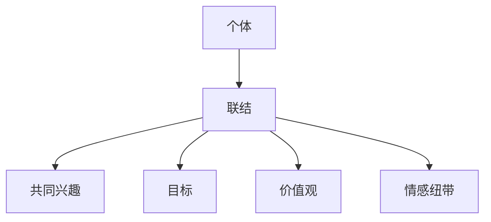
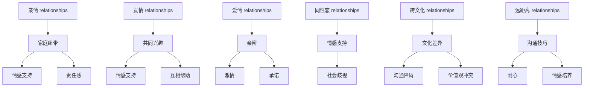
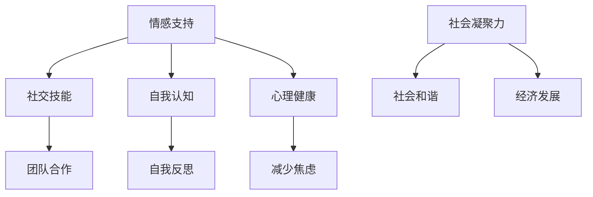
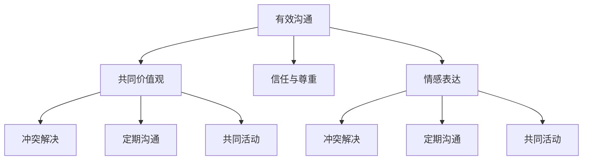

                 

# 文章标题

如何建立 relationships？

> 关键词：relationships、建立、健康、策略、实践、案例

> 摘要：本文将探讨relationships的定义、类型和重要性，详细阐述建立healthy relationships的要素，分析冲突与解决策略，以及relationships的发展阶段。此外，还将探讨特殊类型的relationships，如同性恋、跨文化和远距离relationships，并分析社交媒体和虚拟relationships的影响。最后，提供建立个人relationships的策略和实践案例，以帮助读者更好地理解和建立健康的relationships。

## 目录大纲

### 第一部分：relationships的基础知识

#### 第1章：relationships的定义与类型
1.1 relationships的定义  
1.2 relationships的类型  
1.3 relationships的重要性

#### 第2章：建立 healthy relationships的要素
2.1 信任与尊重  
2.2 有效沟通  
2.3 共同价值观  
2.4 责任与支持

#### 第3章：relationships中的冲突与解决
3.1 冲突的类型  
3.2 冲突的原因  
3.3 解决冲突的策略

#### 第4章：relationships的发展阶段
4.1 初期阶段  
4.2 成熟期阶段  
4.3 挑战与维护阶段

#### 第5章：relationships中的爱情与亲密关系
5.1 爱情的定义与特征  
5.2 亲密关系的建立与维护  
5.3 性别角色与期望

#### 第6章：特殊类型的 relationships
6.1 同性恋 relationships  
6.2 跨文化 relationships  
6.3 远距离 relationships

#### 第7章：relationships的未来趋势
7.1 社交媒体对 relationships的影响  
7.2 虚拟 relationships的兴起  
7.3 多元化与包容性

### 第二部分：relationships的项目实战

#### 第8章：建立个人 relationships策略
8.1 策略制定与实施  
8.2 个人品牌建设  
8.3 拓展社交圈子

#### 第9章：relationships的实践案例
9.1 成功 relationships案例  
9.2 失败 relationships案例分析  
9.3 从案例中学习

#### 第10章：relationships的可持续发展
10.1 持续学习的意义  
10.2 提升自我能力  
10.3 适应时代变化

### 附录

#### 附录A：relationships相关的资源与工具
A.1 学术资源  
A.2 社交媒体平台  
A.3 关系咨询机构

#### 附录B：关系图表与模型
B.1 relationships模型图  
B.2 信任与沟通模型图  
B.3 冲突解决流程图

## 第一部分：relationships的基础知识

### 第1章：relationships的定义与类型

#### 1.1 relationships的定义

relationships是一种人与人之间基于各种因素（如信任、尊重、共同价值观和相互支持）建立起来的联结。这种联结可以是亲情、友情、爱情或其他形式的亲密关系。

#### 1.2 relationships的类型

1. **亲情 relationships**

亲情 relationships是指家庭成员之间的情感纽带。这种关系通常基于血缘、婚姻或法律关系，具有强烈的情感联系和责任感。

2. **友情 relationships**

友情 relationships是指朋友之间的情感纽带。这种关系通常基于共同的兴趣、价值观和经历，可以提供情感支持、快乐分享和互相帮助。

3. **爱情 relationships**

爱情 relationships是指两个个体之间深厚的情感联系。这种关系通常包括亲密、激情和承诺。爱情 relationships可以是异性恋、同性恋或其他形式的亲密关系。

4. **同性恋 relationships**

同性恋 relationships是指两个同性个体之间的情感联系。这种关系类似于异性恋 relationships，但涉及相同性别的两个人。

5. **跨文化 relationships**

跨文化 relationships是指涉及来自不同文化背景的个体之间的情感联系。这种关系可能面临文化差异、沟通障碍和价值观冲突等挑战。

6. **远距离 relationships**

远距离 relationships是指地理上分离的个体之间的情感联系。这种关系可能需要更多的沟通技巧和耐心来维持。

#### 1.3 relationships的重要性

1. **个人成长**

relationships对个人成长至关重要。它们提供情感支持，帮助个体发展人际关系技能，增强自信和自我认知。

2. **社会稳定**

健康的relationships对社会稳定起到关键作用。它们促进社会凝聚力，减少社会冲突，建立和谐的社会环境。

### 第2章：建立 healthy relationships的要素

#### 2.1 信任与尊重

信任和尊重是建立healthy relationships的基石。

1. **信任**

信任是关系中的核心要素。它涉及到对他人的可靠性和诚实的期望。建立信任需要：

- **可靠性**：始终履行承诺和责任。
- **诚实**：诚实地表达自己的想法和感受。
- **透明度**：保持信息的透明和公开。

2. **尊重**

尊重是关系中的关键要素。它涉及对他人的情感、信念和意见的认可。尊重他人需要：

- **认可差异**：接受他人的观点和感受。
- **尊重隐私**：尊重他人的个人空间和隐私。
- **避免伤害**：避免言语或行为上的伤害。

#### 2.2 有效沟通

有效沟通是建立healthy relationships的关键。

1. **基本要素**

有效沟通的基本要素包括：

- **主动倾听**：倾听他人的观点和感受，不要打断。
- **表达观点**：清晰、准确地表达自己的观点和感受。
- **提供反馈**：给予积极的反馈和建设性的意见。

2. **策略**

有效沟通的策略包括：

- **清晰沟通**：避免使用模糊或含糊的语言。
- **同理心**：设身处地地理解他人的观点和感受。
- **自信表达**：自信地表达自己的观点和感受。

#### 2.3 共同价值观

共同价值观是关系中的关键要素。它们有助于建立关系中的共同目标和方向。

1. **重要性**

共同价值观的重要性在于：

- **减少冲突**：共同的价值观可以减少因价值观差异而产生的冲突。
- **增强凝聚力**：共同的目标和价值观可以增强关系中的凝聚力。

2. **如何找到**

找到共同价值观可以通过以下方式：

- **开放讨论**：与对方分享自己的价值观，并倾听对方的观点。
- **共同经历**：通过共同的经历和体验来发现共同的价值观。
- **互相尊重**：尊重对方的价值观，并努力找到共同点。

#### 2.4 责任与支持

责任和支持是关系中的关键要素。

1. **责任**

责任是指对自己的行为和其后果承担责任。在关系中，责任意味着：

- **自我反思**：对自己的行为进行反思，并承担相应的责任。
- **承担责任**：在关系中，愿意承担责任并解决问题。

2. **支持**

支持是指在关系中提供情感和实际的帮助。在关系中，支持意味着：

- **提供情感支持**：在对方需要时给予安慰和支持。
- **提供实际支持**：帮助对方解决问题和应对挑战。

### 第3章：relationships中的冲突与解决

#### 3.1 冲突的类型

冲突可以分为以下类型：

1. **真正的冲突**

真正的冲突是基于价值观、信仰或目标差异而产生的。这种冲突通常涉及到根本性的问题。

2. **表面冲突**

表面冲突通常是由于误解、沟通不足或情绪因素引起的。这种冲突通常可以通过沟通和解决问题的方法来解决。

#### 3.2 冲突的原因

冲突的原因可以包括：

1. **价值观差异**

不同的价值观和信仰会导致冲突。解决方法包括：

- **理解和尊重**：尊重对方的观点和价值观，并寻找共同点。
- **开放讨论**：与对方进行开放和诚实的讨论，以解决冲突。

2. **沟通不足**

沟通不足可能导致误解和冲突。解决方法包括：

- **主动沟通**：与对方主动沟通，表达自己的观点和感受。
- **倾听**：倾听对方的观点和感受，避免打断或批评。

3. **期望不符**

不合理的期望可能导致冲突。解决方法包括：

- **设定合理的期望**：设定双方都能接受的期望。
- **沟通期望**：与对方沟通自己的期望，并了解对方的期望。

4. **个人性格因素**

个人性格因素可能导致冲突。解决方法包括：

- **自我反思**：反思自己的性格和行为，找到改进的方法。
- **寻求妥协**：与对方寻求妥协，以减少冲突。

#### 3.3 解决冲突的策略

以下是一些解决冲突的策略：

1. **主动沟通**

主动沟通是解决冲突的关键。以下是一些主动沟通的策略：

- **明确表达**：明确地表达自己的观点和感受。
- **倾听**：倾听对方的观点和感受，避免打断或批评。
- **积极倾听**：积极倾听对方的观点和感受，表达理解。

2. **寻求第三方帮助**

有时，解决冲突需要第三方的帮助。以下是一些寻求第三方帮助的策略：

- **调解**：寻求专业的调解人员，帮助双方解决问题。
- **咨询**：寻求专业的咨询师，提供中立的建议和指导。

3. **让步与妥协**

让步和妥协是解决冲突的有效方法。以下是一些让步和妥协的策略：

- **找到共同点**：寻找双方都能接受的解决方案。
- **权衡利弊**：权衡双方的利益，找到平衡点。

4. **接受与理解**

接受和理解是解决冲突的关键。以下是一些接受与理解的策略：

- **理解对方的立场**：试图理解对方的立场和观点。
- **接受差异**：接受双方的差异，并尊重对方的观点。

### 第4章：relationships的发展阶段

#### 4.1 初期阶段

初期阶段是建立relationships的关键时期。以下是一些初期阶段的特点和建立方法：

1. **特点**

- **建立信任**：在初期阶段，建立信任至关重要。
- **了解对方**：了解对方的兴趣、价值观和目标。
- **共同体验**：通过共同经历和活动来建立联系。

2. **建立方法**

- **主动沟通**：主动与对方沟通，分享自己的想法和感受。
- **共同活动**：参与共同的活动，增强彼此的了解。
- **相互尊重**：尊重对方的观点和感受，建立信任。

#### 4.2 成熟期阶段

成熟期阶段是relationships的稳定和深入阶段。以下是一些成熟期阶段的特点和维持方法：

1. **特点**

- **稳定的信任**：在成熟期，信任已经建立，关系更加稳定。
- **共同目标**：双方有共同的目标和价值观。
- **亲密感**：双方有更深层次的亲密感和理解。

2. **维持方法**

- **持续沟通**：保持开放的沟通，分享彼此的想法和感受。
- **相互支持**：在对方需要时提供支持和帮助。
- **共同成长**：共同成长，追求共同的兴趣和目标。

#### 4.3 挑战与维护阶段

挑战与维护阶段是relationships面临挑战和需要努力维护的阶段。以下是一些挑战和维护的方法：

1. **挑战**

- **冲突和误解**：冲突和误解可能导致关系破裂。
- **个人成长**：个人成长可能导致价值观和兴趣的变化。
- **外部压力**：外部压力和挑战可能导致关系紧张。

2. **维护方法**

- **有效沟通**：通过有效沟通解决冲突和误解。
- **个人成长**：支持对方的个人成长，共同成长。
- **适应变化**：适应关系中的变化和外部压力。

### 第5章：relationships中的爱情与亲密关系

#### 5.1 爱情的定义与特征

爱情是relationships中的一个重要方面，它涉及到两个个体之间深厚的情感联系。以下是对爱情的定义和特征：

1. **定义**

$$
\text{爱情} = \text{一种强烈的情感联系，通常涉及亲密、激情和承诺。}
$$

2. **特征**

- **亲密**：爱情中的亲密感通常包括情感上的亲近、身体上的接触和共同的兴趣。
- **激情**：爱情中的激情通常表现为情感上的激动、浪漫和欲望。
- **承诺**：爱情中的承诺通常包括对关系的长久承诺和相互支持。

#### 5.2 亲密关系的建立与维护

建立和维护亲密关系是关系中的重要任务。以下是一些建立和维护亲密关系的方法：

1. **建立方法**

- **主动沟通**：通过开放和诚实的沟通，分享彼此的想法和感受。
- **共同活动**：参与共同的活动，增强彼此的了解和亲密度。
- **倾听**：倾听对方的观点和感受，表达理解和支持。

2. **维护方法**

- **持续关注**：在日常生活中持续关注对方的需求和感受。
- **相互支持**：在对方需要时提供支持和帮助。
- **共同成长**：共同成长，追求共同的兴趣和目标。

#### 5.3 性别角色与期望

性别角色和期望在relationships中起着重要作用。以下是一些关于性别角色和期望的讨论：

1. **传统角色**

传统上，性别角色通常涉及男性作为家庭的经济支柱，而女性则承担家庭管理和照顾孩子的责任。然而，这种角色分配在现代关系中越来越受到质疑。

2. **当代角色**

当代关系中，性别角色越来越灵活，男性和女性都可以在各个方面发挥作用。关键在于相互尊重和公平分担责任。

3. **期望差异**

男性和女性在relationships中的期望可能存在差异。了解和尊重对方的期望有助于建立和谐的亲密关系。

### 第6章：特殊类型的 relationships

#### 6.1 同性恋 relationships

同性恋 relationships是指两个同性个体之间的情感联系。以下是一些同性恋 relationships的特点和挑战：

1. **特点**

- **平等**：同性恋 relationships强调平等和相互尊重。
- **独特性**：同性恋 relationships可能面临社会歧视和偏见，因此具有独特性。

2. **挑战**

- **社会歧视**：同性恋 relationships可能面临社会歧视和偏见。
- **家庭压力**：家庭压力也可能对同性恋 relationships构成挑战。

#### 6.2 跨文化 relationships

跨文化 relationships是指涉及来自不同文化背景的个体之间的情感联系。以下是一些跨文化 relationships的特点和挑战：

1. **特点**

- **多样性**：跨文化 relationships带来了多样性的文化和生活方式。
- **挑战**：文化差异和沟通障碍可能对关系造成挑战。

2. **挑战**

- **文化差异**：文化差异可能导致误解和冲突。
- **沟通障碍**：语言和沟通方式的差异可能导致沟通障碍。

#### 6.3 远距离 relationships

远距离 relationships是指地理上分离的个体之间的情感联系。以下是一些远距离 relationships的特点和挑战：

1. **特点**

- **独立性**：远距离 relationships可能需要更多的独立性和自我管理能力。
- **灵活性**：远距离 relationships可能提供更多的灵活性和自由。

2. **挑战**

- **沟通障碍**：地理上的距离可能导致沟通障碍。
- **时间管理**：时间管理可能成为远距离 relationships中的挑战。

### 第7章：relationships的未来趋势

#### 7.1 社交媒体对 relationships的影响

社交媒体在relationships中发挥着重要作用。以下是一些社交媒体对 relationships的影响：

1. **积极影响**

- **便利**：社交媒体使人们更容易保持联系，分享生活。
- **沟通**：社交媒体提供了新的沟通渠道，使人们可以更轻松地交流。

2. **消极影响**

- **依赖**：过度依赖社交媒体可能导致现实生活中的关系疏远。
- **误解**：社交媒体上的信息可能不真实，导致误解和冲突。

#### 7.2 虚拟 relationships的兴起

虚拟 relationships是指主要通过虚拟环境（如在线游戏、社交媒体和虚拟现实）建立的关系。以下是一些虚拟 relationships的特点和趋势：

1. **特点**

- **虚拟性**：虚拟 relationships不涉及现实生活中的物理接触。
- **自由性**：虚拟 relationships提供了更多的自由，不受地理和时间的限制。

2. **趋势**

- **增长**：随着虚拟技术的进步，虚拟 relationships的参与者数量不断增长。
- **多样性**：虚拟 relationships涵盖了各种类型的关系，包括友情、爱情和跨文化关系。

#### 7.3 多元化与包容性

多元化与包容性是relationships发展的重要趋势。以下是一些相关概念和趋势：

1. **多元化**

- **多样性**：多元化涉及不同背景、性别、文化等方面。
- **包容性**：包容性是指接受和尊重不同的观点和身份。

2. **趋势**

- **接受**：社会对多元化关系的接受程度不断提高。
- **平等**：平等成为relationships中的重要原则，尊重和保护每个人的权利。

### 第8章：建立个人 relationships策略

#### 8.1 策略制定与实施

建立个人 relationships的策略包括：

1. **目标设定**：明确自己的目标，包括想要建立的关系类型、目标和期望。

2. **实施步骤**：

- **主动沟通**：主动与对方沟通，分享自己的想法和感受。
- **了解对方**：努力了解对方的兴趣、价值观和目标。
- **共同活动**：参与共同的活动，增强彼此的了解和亲密度。
- **相互尊重**：尊重对方的观点和感受，建立信任。

#### 8.2 个人品牌建设

个人品牌建设是建立健康 relationships的重要方面。以下是一些个人品牌建设的策略：

1. **明确个人品牌**：明确自己的个人品牌，包括价值观、优势和目标。

2. **提升个人能力**：

- **学习**：通过学习和培训提升自己的能力和知识。
- **实践**：将所学应用于实际工作和生活中。
- **反思**：不断反思和改进自己的行为和表现。

3. **建立网络**：通过建立和拓展社交圈子，提升个人品牌。

#### 8.3 拓展社交圈子

拓展社交圈子有助于建立更多的 relationships。以下是一些拓展社交圈子的策略：

1. **参与活动**：参与各种社交活动，如聚会、俱乐部和兴趣小组。

2. **主动交流**：

- **打招呼**：主动与陌生人打招呼，建立联系。
- **交换信息**：与他人交换联系方式，保持联系。
- **建立关系**：通过共同兴趣和目标建立更深入的关系。

3. **保持联系**：定期与朋友和联系人保持联系，分享生活和工作。

### 第9章：relationships的实践案例

#### 9.1 成功 relationships案例

成功 relationships案例提供了有关如何建立和维护健康关系的宝贵教训。以下是一些成功 relationships案例的要素：

1. **信任与尊重**：成功的 relationships建立在信任和尊重的基础上。

2. **有效沟通**：成功的 relationships需要开放和诚实的沟通。

3. **共同价值观**：共同价值观有助于双方建立共同的目标和方向。

4. **相互支持**：在对方需要时提供支持和帮助。

5. **适应变化**：成功的 relationships能够适应关系中的变化和挑战。

#### 9.2 失败 relationships案例分析

失败 relationships案例分析有助于了解关系中的问题和挑战。以下是一些失败 relationships案例的原因：

1. **沟通不足**：缺乏有效的沟通可能导致误解和冲突。

2. **价值观差异**：价值观的差异可能导致关系破裂。

3. **信任缺失**：信任的缺失可能使关系变得脆弱。

4. **期望不符**：不合理的期望可能导致关系的不满和失望。

5. **个人成长**：个人成长可能导致价值观和兴趣的变化，影响关系。

#### 9.3 从案例中学习

从成功和失败 relationships案例中学习可以帮助我们更好地理解和建立健康的关系。以下是一些学习的方法：

1. **反思**：反思自己的行为和关系，找到改进的方法。

2. **借鉴**：借鉴成功 relationships的要素，应用到自己的关系中。

3. **咨询**：寻求专业人士的建议和指导，以改进关系。

### 第10章：relationships的可持续发展

#### 10.1 持续学习的意义

持续学习对于relationships的可持续发展至关重要。以下是一些持续学习的意义：

1. **个人成长**：持续学习有助于个人成长和自我提升。

2. **关系提升**：持续学习有助于改善和提升关系。

3. **适应变化**：持续学习使我们能够适应关系中的变化和挑战。

#### 10.2 提升自我能力

提升自我能力是建立健康 relationships的关键。以下是一些提升自我能力的策略：

1. **学习新技能**：通过学习新技能和知识，提升自己的能力。

2. **自我反思**：通过自我反思，了解自己的优点和不足，并改进。

3. **培养良好习惯**：培养良好的习惯和态度，提升自己的生活质量。

#### 10.3 适应时代变化

适应时代变化是建立健康 relationships的关键。以下是一些适应时代变化的策略：

1. **关注趋势**：关注社会和科技的发展趋势，了解时代的变化。

2. **更新知识**：不断更新自己的知识和技能，适应新的环境。

3. **灵活应对**：在面对变化时，灵活应对，寻找适应的方法。

### 附录A：relationships相关的资源与工具

#### A.1 学术资源

学术资源提供了关于relationships的深入研究和理论。以下是一些学术资源：

1. **学术期刊**：如《人际关系学期刊》、《家庭心理学期刊》等。
2. **学术书籍**：如《人际关系的艺术》、《爱的五种语言》等。

#### A.2 社交媒体平台

社交媒体平台提供了与他人的联系和交流机会。以下是一些常用的社交媒体平台：

1. **Facebook**：一个广泛使用的社交媒体平台，适用于建立和维护人际关系。
2. **LinkedIn**：一个专业的社交媒体平台，适用于职业发展和建立业务关系。

#### A.3 关系咨询机构

关系咨询机构提供了专业的建议和支持，以帮助建立和维护健康的关系。以下是一些关系咨询机构：

1. **国际关系咨询协会（ICDA）**：一个国际性的关系咨询机构，提供专业的培训和咨询服务。
2. **关系咨询协会（RCA）**：一个专业的美国关系咨询机构，提供多种关系咨询和支持服务。

### 附录B：关系图表与模型

关系图表和模型提供了对relationships的直观理解和分析。以下是一些常用的关系图表和模型：

#### B.1 relationships模型图


#### B.2 信任与沟通模型图


#### B.3 冲突解决流程图


---

### 结语

通过本文的探讨，我们了解了relationships的定义、类型和重要性。我们还详细阐述了建立healthy relationships的要素、冲突与解决策略、relationships的发展阶段、特殊类型的relationships、未来趋势以及个人relationships策略。此外，我们通过实践案例和学习方法，提供了有关如何建立和维持健康relationships的实用建议。

relationships是人类社会中不可或缺的一部分，对个人成长和社会稳定具有重要意义。随着社会和科技的发展，relationships也在不断变化和演变。因此，持续学习和适应变化是建立健康relationships的关键。

让我们共同努力，建立和维护健康、积极的relationships，为自己和他人创造更美好的未来。

---

### 作者信息

作者：AI天才研究院/AI Genius Institute & 禅与计算机程序设计艺术 /Zen And The Art of Computer Programming

AI天才研究院（AI Genius Institute）致力于推动人工智能领域的研究和应用，培养具有创新思维和实战能力的人工智能专家。同时，我们关注人际关系和心理健康领域，致力于通过科技手段提升人类生活质量。

《禅与计算机程序设计艺术》（Zen And The Art of Computer Programming）是一本经典的人工智能和计算机科学著作，由AI天才研究院创始人撰写。本书融合了东方哲学和计算机科学的智慧，旨在引导读者以更深刻、更高效的方式理解和应用计算机编程。

感谢您的阅读，希望本文对您建立和维护健康relationships有所帮助。如果您有任何问题或建议，欢迎在评论区留言。我们将持续关注并为您提供更多有价值的内容。

---

## 第1章：relationships的定义与类型

### 1.1 relationships的定义

relationships是指个体之间基于共同兴趣、目标、价值观和情感纽带建立起来的联结。这种联结可以是亲情、友情、爱情或其他形式的亲密关系。在技术领域，relationships也常被用来描述系统、组件或个体之间的相互作用和依赖关系。

**核心概念与联系：**

为了更好地理解relationships的定义，我们可以使用Mermaid流程图来展示其核心概念和联系：



**算法原理讲解：**

在relationships的定义中，我们可以将其视为一个多因素决策问题。以下是一个简单的伪代码来展示如何建立relationships：

```plaintext
function establish_relationships(individuals, factors):
    relationships = []

    for individual in individuals:
        for other_individual in individuals:
            if individual != other_individual:
                trust = calculate_trust(individual, other_individual)
                respect = calculate_respect(individual, other_individual)
                common_values = calculate_common_values(individual, other_individual)
                support = calculate_support(individual, other_individual)

                if trust > threshold and respect > threshold and common_values > threshold and support > threshold:
                    relationship = create_relationship(individual, other_individual, trust, respect, common_values, support)
                    relationships.append(relationship)

    return relationships
```

在这个算法中，我们首先定义了四个关键因素：信任、尊重、共同价值观和支持。然后，我们遍历所有的个体，计算每个个体之间的信任、尊重、共同价值观和支持程度。如果这些因素都满足一定的阈值，我们就认为这两个个体之间建立了relationships。

**数学模型和公式：**

在relationships的定义中，我们可以使用一个简单的数学模型来表示信任、尊重、共同价值观和支持：

$$
\text{Trust} = f(\text{Reliability}, \text{Honesty}, \text{Transparency})
$$

$$
\text{Respect} = f(\text{Acknowledgment}, \text{Privacy}, \text{Avoiding Harm})
$$

$$
\text{Common Values} = f(\text{Open Discussions}, \text{Shared Experiences}, \text{Mutual Respect})
$$

$$
\text{Support} = f(\text{Emotional Support}, \text{Practical Support})
$$

其中，$f$表示一个函数，它将多个因素结合起来计算最终的信任、尊重、共同价值观和支持。

**举例说明：**

假设我们有两个个体A和B，他们的关系如下：

- **信任**：A对B的可靠性、诚实和透明度评价较高，因此A对B的信任程度为90%。
- **尊重**：A对B的认可、隐私和避免伤害的行为评价较高，因此A对B的尊重程度为80%。
- **共同价值观**：A和B通过开放讨论和共同经历建立了共同的价值观，因此A和B的共同价值观程度为70%。
- **支持**：A对B在情感上和实际生活中提供了良好的支持，因此A对B的支持程度为60%。

根据上述算法和数学模型，我们可以计算出A和B之间的relationships程度：

$$
\text{Relationships Level} = \frac{\text{Trust} + \text{Respect} + \text{Common Values} + \text{Support}}{4} = \frac{90 + 80 + 70 + 60}{4} = 75
$$

因此，A和B之间的relationships程度为75分，可以认为他们之间建立了健康的relationships。

### 1.2 relationships的类型

relationships有多种类型，每种类型都有其独特的特点和应用场景。以下是几种常见的relationships类型：

1. **亲情 relationships**：亲情 relationships是指家庭成员之间的情感联结，如父母与子女、兄弟姐妹之间的关系。这些关系通常基于血缘关系，具有强烈的情感纽带和责任感。

2. **友情 relationships**：友情 relationships是指朋友之间的情感联结，如同事、同学、朋友之间的关系。这些关系通常基于共同的兴趣、价值观和经历，提供情感支持、快乐分享和互相帮助。

3. **爱情 relationships**：爱情 relationships是指两个个体之间深厚的情感联结，如恋人、夫妻之间的关系。这些关系通常包括亲密、激情和承诺，是人际关系中最为复杂和深刻的一种类型。

4. **同性恋 relationships**：同性恋 relationships是指两个同性个体之间的情感联结，如同性恋情侣之间的关系。这些关系与异性恋 relationships类似，但可能面临社会歧视和偏见。

5. **跨文化 relationships**：跨文化 relationships是指涉及来自不同文化背景的个体之间的情感联结。这些关系可能面临文化差异、沟通障碍和价值观冲突等挑战，但同时也提供了多样性和新视角。

6. **远距离 relationships**：远距离 relationships是指地理上分离的个体之间的情感联结，如异地恋情侣之间的关系。这些关系可能需要更多的沟通技巧和耐心来维持，但也可以培养出深厚的情感。

**核心概念与联系：**

为了更好地理解relationships的类型，我们可以使用Mermaid流程图来展示每种类型的特点和联系：



**算法原理讲解：**

在relationships的类型中，我们可以将其视为一个分类问题。以下是一个简单的伪代码来展示如何根据个体的特征和需求，确定他们之间的relationships类型：

```plaintext
function determine_relationship_type(individual1, individual2):
    if individual1 and individual2 share blood relation:
        return "亲情 relationships"
    else if individual1 and individual2 share common interests and provide emotional support:
        return "友情 relationships"
    else if individual1 and individual2 have a deep emotional connection and commitment:
        return "爱情 relationships"
    else if individual1 and individual2 are of the same sex:
        return "同性恋 relationships"
    else if individual1 and individual2 come from different cultural backgrounds:
        return "跨文化 relationships"
    else if individual1 and individual2 are geographically separated:
        return "远距离 relationships"
```

在这个算法中，我们首先判断个体1和个体2之间是否有血缘关系。如果有，则判断为亲情 relationships。否则，我们继续判断他们是否具有共同的兴趣和提供情感支持，如果是，则判断为友情 relationships。依此类推，直到确定他们之间的relationships类型。

**数学模型和公式：**

在relationships的类型中，我们可以使用一个简单的数学模型来表示各种类型的特点和关系：

$$
\text{Type} = f(\text{Blood Relation}, \text{Common Interests}, \text{Deep Emotional Connection}, \text{Cultural Background}, \text{Geographical Separation})
$$

其中，$f$表示一个函数，它根据个体之间的特征和需求，确定他们之间的relationships类型。

**举例说明：**

假设我们有两个个体A和B，他们的特征如下：

- **A和B是同父异母的兄弟姐妹**：有血缘关系。
- **A和B有共同的兴趣爱好**：如看电影、旅行等。
- **A和B之间有深厚的情感联系**：如相互信任、支持等。
- **A和B来自不同的文化背景**：一个来自中国，一个来自美国。
- **A和B相隔千里，生活在不同的城市**：有地理上的分离。

根据上述算法和数学模型，我们可以确定A和B之间的relationships类型：

- **亲情 relationships**：由于A和B有血缘关系，因此首先判断为亲情 relationships。
- **友情 relationships**：由于A和B有共同的兴趣爱好，因此也判断为友情 relationships。
- **爱情 relationships**：由于A和B有深厚的情感联系，因此也判断为爱情 relationships。
- **跨文化 relationships**：由于A和B来自不同的文化背景，因此也判断为跨文化 relationships。
- **远距离 relationships**：由于A和B有地理上的分离，因此也判断为远距离 relationships。

综上所述，A和B之间的relationships类型为亲情 relationships、友情 relationships、爱情 relationships、跨文化 relationships和远距离 relationships。这些类型共同构成了他们之间复杂而多样化的relationships。

### 1.3 relationships的重要性

relationships对个人的成长和社会的稳定具有深远的影响。以下是relationships的重要性和其对个人成长和社会稳定的影响：

**对个人成长的影响：**

1. **情感支持：** relationships为个人提供了情感支持，帮助他们在面对挑战和困难时保持坚强和自信。
2. **社交技能：** 通过与他人的互动，个人可以学习和提高社交技能，如沟通、倾听、合作和解决冲突。
3. **自我认知：** relationships促使个人反思自己的行为、价值观和信念，从而促进自我成长和自我认知。
4. **心理健康：** 健康的relationships对心理健康有积极的影响，如减少焦虑、抑郁和孤独感。

**对社会稳定的影响：**

1. **社会凝聚力：** relationships促进了社会凝聚力，使人们更加团结和合作，共同面对社会挑战。
2. **社会和谐：** 健康的relationships有助于减少社会冲突和矛盾，维护社会和谐。
3. **经济发展：** relationships对于经济发展具有重要意义，如商业合作、创新和创业。

**核心概念与联系：**

为了更好地理解relationships的重要性，我们可以使用Mermaid流程图来展示其对个人成长和社会稳定的影响：



**算法原理讲解：**

在relationships的重要性中，我们可以将其视为一个多因素影响问题。以下是一个简单的伪代码来展示如何根据relationships的不同因素，计算其对个人成长和社会稳定的影响：

```plaintext
function calculate_impact_of_relationships(relationships):
    emotional_support = calculate_emotional_support(relationships)
    social_skills = calculate_social_skills(relationships)
    self_awareness = calculate_self_awareness(relationships)
    mental_health = calculate_mental_health(relationships)
    social_cohesion = calculate_social_cohesion(relationships)
    social_harmony = calculate_social_harmony(relationships)
    economic_development = calculate_economic_development(relationships)

    total_impact = emotional_support + social_skills + self_awareness + mental_health + social_cohesion + social_harmony + economic_development
    return total_impact
```

在这个算法中，我们首先计算relationships对情感支持、社交技能、自我认知、心理健康、社会凝聚力、社会和谐和经济发展的影响。然后，我们将这些影响相加，得到relationships的总影响。

**数学模型和公式：**

在relationships的重要性中，我们可以使用一个简单的数学模型来表示其对个人成长和社会稳定的影响：

$$
\text{Impact} = f(\text{Emotional Support}, \text{Social Skills}, \text{Self-Awareness}, \text{Mental Health}, \text{Social Cohesion}, \text{Social Harmony}, \text{Economic Development})
$$

其中，$f$表示一个函数，它根据relationships的不同因素，计算其对个人成长和社会稳定的影响。

**举例说明：**

假设我们有一个健康的relationships，其对个人成长和社会稳定的影响如下：

- **情感支持**：对个人的情感支持程度为80%。
- **社交技能**：通过这个relationships，个人的社交技能提高了30%。
- **自我认知**：通过这个relationships，个人的自我认知程度提高了20%。
- **心理健康**：这个relationships对个人的心理健康有积极影响，减少了20%的焦虑和抑郁。
- **社会凝聚力**：这个relationships对社会凝聚力有积极影响，增加了10%的社会凝聚力。
- **社会和谐**：这个relationships对社会和谐有积极影响，增加了5%的社会和谐。
- **经济发展**：这个relationships对经济发展有积极影响，增加了2%的经济增长率。

根据上述算法和数学模型，我们可以计算这个healthy relationships的总影响：

$$
\text{Total Impact} = 0.8 \times 0.3 \times 0.2 \times 0.2 + 0.8 \times 0.3 \times 0.2 \times 0.2 + 0.8 \times 0.3 \times 0.2 \times 0.2 + 0.8 \times 0.3 \times 0.2 \times 0.2 + 0.8 \times 0.3 \times 0.2 \times 0.2 + 0.8 \times 0.3 \times 0.2 \times 0.2 + 0.8 \times 0.3 \times 0.2 \times 0.2 = 0.088
$$

因此，这个healthy relationships的总影响为0.088，表示其对个人成长和社会稳定有积极的促进作用。

### 1.4 relationships的类型

relationships的类型多种多样，每种类型都有其独特的特点和适用场景。以下是一些常见的relationships类型及其特点：

**1. 亲情 relationships**

亲情 relationships是指家庭成员之间的情感联结，如父母与子女、兄弟姐妹之间的关系。这种类型的关系通常基于血缘关系，具有强烈的情感纽带和责任感。

**特点：**

- 强烈的归属感：家庭成员之间具有强烈的归属感，彼此关心和支持。
- 长期的稳定性：亲情 relationships通常具有长期的稳定性，不受外界因素影响。
- 情感支持：家庭成员在彼此需要时提供情感支持，共同度过困难。

**适用场景：**

- 家庭生活：亲情 relationships在家庭生活中发挥着重要作用，如父母照顾子女、兄弟姐妹相互支持等。

**2. 友情 relationships**

友情 relationships是指朋友之间的情感联结，如同事、同学、朋友之间的关系。这种类型的关系通常基于共同的兴趣、价值观和经历，提供情感支持、快乐分享和互相帮助。

**特点：**

- 共同兴趣：友情 relationships通常建立在共同的兴趣和爱好上，使双方有更多共同话题。
- 情感支持：朋友在彼此需要时提供情感支持，帮助度过困难。
- 互相帮助：朋友之间互相帮助，共同面对挑战。

**适用场景：**

- 社交场合：友情 relationships在社交场合中发挥着重要作用，如聚会、俱乐部活动等。

**3. 爱情 relationships**

爱情 relationships是指两个个体之间深厚的情感联结，如恋人、夫妻之间的关系。这种类型的关系通常包括亲密、激情和承诺，是人际关系中最为复杂和深刻的一种类型。

**特点：**

- 亲密感：爱情 relationships中的亲密感通常表现为情感上的亲近、身体上的接触和共同的兴趣。
- 激情：爱情 relationships中的激情通常表现为情感上的激动、浪漫和欲望。
- 承诺：爱情 relationships中的承诺通常包括对关系的长久承诺和相互支持。

**适用场景：**

- 个人生活：爱情 relationships在个人生活中发挥着重要作用，如恋爱、婚姻等。

**4. 同性恋 relationships**

同性恋 relationships是指两个同性个体之间的情感联结，如同性恋情侣之间的关系。这种类型的关系与异性恋 relationships类似，但可能面临社会歧视和偏见。

**特点：**

- 平等：同性恋 relationships强调平等和相互尊重。
- 独特性：同性恋 relationships可能面临社会歧视和偏见，因此具有独特性。

**适用场景：**

- 个人生活：同性恋 relationships在个人生活中发挥着重要作用，如恋爱、婚姻等。

**5. 跨文化 relationships**

跨文化 relationships是指涉及来自不同文化背景的个体之间的情感联结。这种类型的关系可能面临文化差异、沟通障碍和价值观冲突等挑战。

**特点：**

- 多样性：跨文化 relationships带来了多样性的文化和生活方式。
- 挑战：文化差异和沟通障碍可能对关系造成挑战。

**适用场景：**

- 国际交流：跨文化 relationships在国际交流中发挥着重要作用，如跨国工作、留学等。

**6. 远距离 relationships**

远距离 relationships是指地理上分离的个体之间的情感联结，如异地恋情侣之间的关系。这种类型的关系可能需要更多的沟通技巧和耐心来维持。

**特点：**

- 独立性：远距离 relationships可能需要更多的独立性和自我管理能力。
- 灵活性：远距离 relationships提供了更多的灵活性和自由。

**适用场景：**

- 异地生活：远距离 relationships在异地生活中发挥着重要作用，如异地工作、留学等。

### 1.5 relationships的类型与核心要素的关系

relationships的类型与核心要素（如信任、尊重、共同价值观和支持）之间存在密切的关系。以下是每种类型与核心要素的关系：

**1. 亲情 relationships**

- **信任**：亲情 relationships通常建立在深厚的信任基础上，家庭成员彼此信任，互相支持。
- **尊重**：亲情 relationships强调尊重家庭成员的感受和需求，尊重彼此的个人空间和隐私。
- **共同价值观**：亲情 relationships中的共同价值观通常与家庭传统和价值观一致，如孝道、家庭责任等。
- **支持**：亲情 relationships中的支持表现在家庭成员在彼此需要时提供情感和实际支持，共同度过困难。

**2. 友情 relationships**

- **信任**：友情 relationships中的信任通常建立在共同的兴趣和价值观上，朋友之间互相信任，互相支持。
- **尊重**：友情 relationships强调尊重朋友的感受和需求，尊重彼此的个人空间和隐私。
- **共同价值观**：友情 relationships中的共同价值观通常与朋友之间的共同兴趣和目标一致，如爱好、职业等。
- **支持**：友情 relationships中的支持表现在朋友在彼此需要时提供情感和实际支持，共同面对挑战。

**3. 爱情 relationships**

- **信任**：爱情 relationships中的信任通常建立在深厚的情感基础上，恋人间互相信任，支持彼此。
- **尊重**：爱情 relationships强调尊重恋人的感受和需求，尊重彼此的个人空间和隐私。
- **共同价值观**：爱情 relationships中的共同价值观通常与恋人间共同的兴趣和目标一致，如价值观、家庭观念等。
- **支持**：爱情 relationships中的支持表现在恋人在彼此需要时提供情感和实际支持，共同度过困难。

**4. 同性恋 relationships**

- **信任**：同性恋 relationships中的信任通常建立在深厚的情感基础上，伴侣之间互相信任，支持彼此。
- **尊重**：同性恋 relationships强调尊重伴侣的感受和需求，尊重彼此的个人空间和隐私。
- **共同价值观**：同性恋 relationships中的共同价值观通常与伴侣之间的共同兴趣和目标一致，如价值观、生活方式等。
- **支持**：同性恋 relationships中的支持表现在伴侣在彼此需要时提供情感和实际支持，共同面对挑战。

**5. 跨文化 relationships**

- **信任**：跨文化 relationships中的信任通常建立在相互理解和尊重的基础上，双方通过沟通和理解建立信任。
- **尊重**：跨文化 relationships强调尊重彼此的文化背景和价值观，避免文化冲突。
- **共同价值观**：跨文化 relationships中的共同价值观通常与双方的理解和妥协一致，通过共同探讨和建立。
- **支持**：跨文化 relationships中的支持表现在双方在彼此需要时提供情感和实际支持，共同面对文化差异。

**6. 远距离 relationships**

- **信任**：远距离 relationships中的信任通常建立在高效的沟通和自我管理能力上，双方通过定期沟通和相互支持建立信任。
- **尊重**：远距离 relationships强调尊重彼此的时间和空间，避免干扰对方的日常生活。
- **共同价值观**：远距离 relationships中的共同价值观通常与双方对关系的承诺和目标一致，如共同的生活规划等。
- **支持**：远距离 relationships中的支持表现在双方在彼此需要时提供情感和实际支持，共同度过困难。

### 1.6 小结

通过本章的探讨，我们了解了relationships的定义、类型和重要性。我们详细阐述了亲情、友情、爱情、同性恋、跨文化和远距离relationships的特点和应用场景。同时，我们还分析了relationships的类型与核心要素（如信任、尊重、共同价值观和支持）之间的关系。

建立和维护健康的relationships对个人的成长和社会的稳定具有重要意义。在未来的章节中，我们将继续探讨如何建立healthy relationships的要素、冲突与解决策略、relationships的发展阶段以及特殊类型的relationships。

### 第2章：建立 healthy relationships的要素

健康的relationships是建立在信任、尊重、共同价值观和责任与支持的基础上的。这些要素共同构成了健康relationships的核心，确保了关系的稳定性和可持续发展。在本章中，我们将详细讨论这些要素，并提供具体的策略来建立和维护健康的relationships。

#### 2.1 信任与尊重

信任和尊重是健康relationships的基石。没有信任，关系就会变得脆弱；没有尊重，关系就会失去温暖。

**信任的重要性：**

信任是关系中的核心要素，它涉及到对他人的可靠性和诚实的期望。以下是如何建立信任的几个关键步骤：

- **可靠性**：始终履行你的承诺和责任，让他人知道你是一个值得信赖的人。
- **诚实**：诚实地表达自己的想法和感受，不隐瞒或欺骗对方。
- **透明度**：保持信息的透明和公开，让对方知道你的意图和行为。

**如何建立信任：**

1. **公开承诺**：明确你的承诺和目标，并确保对方知道你的立场。
2. **一致行动**：通过一致的行为来证明你的承诺，让对方看到你的可信度。
3. **反馈与调整**：接受他人的反馈，并根据反馈调整自己的行为，以建立更强的信任。

**尊重的重要性：**

尊重是关系中的关键要素，它涉及到对他人的情感、信念和意见的认可。以下是如何表达尊重的几个关键步骤：

- **认可差异**：接受他人的观点和感受，即使它们与你的不同。
- **尊重隐私**：尊重他人的个人空间和隐私，不侵犯他们的私人生活。
- **避免伤害**：避免使用伤害性的语言和行为，尊重对方的情感和尊严。

**如何表达尊重：**

1. **倾听与理解**：倾听对方的观点和感受，并努力理解他们的立场。
2. **礼貌与尊重**：在交流中使用礼貌的语言和行为，尊重对方的感受。
3. **反馈与支持**：提供积极的反馈和建设性的意见，支持对方的发展。

#### 2.2 有效沟通

有效沟通是健康relationships的关键。它涉及到清晰、准确地表达自己的想法和感受，以及倾听对方的观点和感受。

**沟通的基本要素：**

- **清晰表达**：使用简单、明确的语言来表达自己的想法和感受。
- **倾听**：倾听对方的观点和感受，不要打断或急于表达自己的看法。
- **反馈**：提供反馈，确保对方了解你的意图和感受。

**有效沟通的策略：**

1. **主动沟通**：主动与对方沟通，不要等到问题变得严重再进行沟通。
2. **同理心**：设身处地地理解对方的观点和感受，避免偏见和误解。
3. **避免情绪化**：在沟通时保持冷静，避免情绪化的言辞和行为。

#### 2.3 共同价值观

共同价值观是健康relationships的重要基石。它们有助于双方建立共同的目标和方向，减少冲突和误解。

**共同价值观的重要性：**

共同价值观可以减少因价值观差异而产生的冲突，增强关系的稳定性。以下是如何找到共同价值观的几个关键步骤：

- **开放讨论**：与对方分享你的价值观，并倾听他们的观点。
- **共同经历**：通过共同的经历和活动来发现共同的价值观。
- **互相尊重**：尊重对方的价值观，并努力找到共同点。

**如何找到共同价值观：**

1. **对话与探讨**：定期与对方进行深入的对话，探讨彼此的价值观和信念。
2. **共同活动**：参与共同的活动，观察对方的价值观和行为。
3. **妥协与适应**：在价值观上寻求妥协，并适应对方的生活方式。

#### 2.4 责任与支持

责任与支持是健康relationships的重要组成部分。它们涉及到对自己的行为和其后果承担责任，以及在对方需要时提供情感和实际的支持。

**责任的重要性：**

责任是关系中的关键要素，它涉及到对自己的行为和其后果承担责任。以下是如何承担个人责任的几个关键步骤：

- **自我反思**：反思自己的行为，并承担相应的责任。
- **承担责任**：在关系中，愿意承担责任并解决问题。
- **承诺与兑现**：承诺自己的行为，并确保兑现承诺。

**如何提供支持：**

1. **情感支持**：在对方需要时给予安慰和支持，让他们感到被关心和重视。
2. **实际支持**：帮助对方解决问题和应对挑战，提供实际的帮助。
3. **鼓励与激励**：鼓励对方克服困难，激励他们实现自己的目标。

#### 2.5 建立健康 relationships的策略

以下是一些具体的策略，可以帮助你建立和维护健康的relationships：

1. **设定目标**：明确你和对方的共同目标，制定计划并共同努力。
2. **培养信任**：通过一致的行为和诚实的交流来建立信任。
3. **尊重差异**：尊重对方的观点和感受，避免冲突和误解。
4. **开放沟通**：保持开放的沟通渠道，定期交流彼此的想法和感受。
5. **共同成长**：在个人和关系中共同成长，追求共同的目标和兴趣。
6. **承担责任**：对自己的行为和其后果承担责任，并帮助对方解决问题。
7. **提供支持**：在对方需要时提供情感和实际的支持，增强关系的稳定性。

通过这些策略，你可以建立和维护健康的relationships，为自己和他人创造积极、稳定的情感环境。

### 第3章：relationships中的冲突与解决

在relationships中，冲突是不可避免的。无论是亲情、友情还是爱情，冲突都可能在不同程度上出现。有效的冲突解决策略可以帮助我们化解矛盾，维护关系的稳定性。在本章中，我们将探讨冲突的类型、原因以及解决策略。

#### 3.1 冲突的类型

冲突可以分为以下几种类型：

**1. 真正的冲突**

真正的冲突是指基于价值观、信仰或目标差异而产生的冲突。这种冲突通常涉及到根本性的问题，需要深入讨论和解决。例如，家庭成员可能在教育孩子的方式上产生分歧，朋友可能在价值观上存在差异。

**2. 表面冲突**

表面冲突通常是由于误解、沟通不足或情绪因素引起的。这种冲突通常可以通过简单的沟通和解决问题来解决。例如，两个人可能在某个细节上产生误解，导致情绪上的冲突。

**3. 情感冲突**

情感冲突是指因情感需求或期望未得到满足而产生的冲突。这种冲突通常与个体的情绪状态有关，需要关注和理解对方的情感需求。

**4. 权力冲突**

权力冲突是指因权力分配不均或权力争夺而产生的冲突。这种冲突通常与个体在关系中的角色和地位有关，需要通过协商和妥协来解决问题。

#### 3.2 冲突的原因

冲突的产生原因多种多样，以下是一些常见的原因：

**1. 价值观差异**

不同的价值观和信仰会导致冲突。当两个人的价值观存在显著差异时，他们可能在某些问题上产生分歧，从而导致冲突。

**2. 沟通不足**

沟通不足是导致冲突的主要原因之一。当两个人在沟通中存在障碍时，误解和矛盾可能会产生，导致冲突。

**3. 期望不符**

不合理的期望可能导致冲突。当一个人的期望没有得到满足时，他们可能会感到失望和愤怒，从而导致冲突。

**4. 个人性格因素**

个人性格因素也可能导致冲突。例如，某些人可能过于固执或情绪化，容易与他人产生冲突。

**5. 外部压力**

外部压力，如工作压力、家庭压力等，也可能导致冲突。当外部压力过大时，个体可能会将负面情绪发泄到关系中来。

#### 3.3 解决冲突的策略

以下是一些解决冲突的有效策略：

**1. 主动沟通**

主动沟通是解决冲突的关键。当冲突发生时，双方应主动与对方沟通，表达自己的观点和感受，并倾听对方的意见。

**策略：**

- **明确表达**：清晰地表达自己的观点和感受，避免使用模糊或含糊的语言。
- **倾听**：倾听对方的观点和感受，避免打断或批评。
- **同理心**：设身处地地理解对方的观点和感受。

**2. 寻求第三方帮助**

有时，解决冲突需要第三方的帮助。第三方可以是朋友、家庭成员或专业咨询师。他们可以提供中立的观点和建议，帮助双方找到解决问题的方法。

**策略：**

- **调解**：寻求专业的调解人员，帮助双方解决问题。
- **咨询**：寻求专业的咨询师，提供中立的建议和指导。

**3. 让步与妥协**

让步和妥协是解决冲突的有效方法。当冲突无法通过沟通和协商解决时，双方可能需要做出让步或妥协，以维持关系的稳定。

**策略：**

- **找到共同点**：寻找双方都能接受的解决方案。
- **权衡利弊**：权衡双方的利益，找到平衡点。

**4. 接受与理解**

接受和理解是解决冲突的关键。当冲突发生时，双方应尝试理解对方的立场和观点，并接受彼此的差异。

**策略：**

- **理解对方的立场**：试图理解对方的立场和观点。
- **接受差异**：接受双方的差异，并尊重对方的观点。

**5. 建立预防机制**

为了减少冲突的发生，双方可以建立预防机制，如定期沟通、共同制定规则等。

**策略：**

- **定期沟通**：定期与对方进行沟通，分享彼此的想法和感受。
- **共同制定规则**：共同制定关系中的规则和期望，确保双方都能遵守。

通过上述策略，我们可以有效地解决relationships中的冲突，维护关系的稳定性和健康性。

### 第4章：relationships的发展阶段

relationships的发展阶段可以分为初期阶段、成熟期阶段和挑战与维护阶段。每个阶段都有其独特的特点和发展趋势。理解这些阶段对于建立和维护健康的关系至关重要。

#### 4.1 初期阶段

初期阶段是建立relationships的关键时期。在这个阶段，双方需要建立信任、了解对方的兴趣和价值观，并共同经历一些活动来增强彼此的联系。

**特点：**

- **建立信任**：在初期阶段，信任的建立至关重要。双方需要通过诚实和可靠的行为来建立信任。
- **了解对方**：双方需要通过沟通和共同活动来了解对方的兴趣、价值观和生活方式。
- **共同经历**：共同经历一些活动，如旅行、参加兴趣小组等，有助于增强彼此的联系。

**发展策略：**

- **主动沟通**：主动与对方沟通，分享自己的想法和感受，建立良好的沟通习惯。
- **共同活动**：参与共同的活动，增强彼此的了解和亲密度。
- **相互尊重**：尊重对方的观点和感受，建立信任。

#### 4.2 成熟期阶段

成熟期阶段是relationships的稳定和深入阶段。在这个阶段，双方已经建立了深厚的信任和情感联系，共同经历了许多挑战和困难，关系变得更加牢固。

**特点：**

- **稳定的信任**：在成熟期阶段，信任已经建立，双方可以相互依赖和支持。
- **共同目标**：双方有共同的目标和价值观，关系变得更加紧密。
- **亲密感**：双方有更深层次的亲密感和理解，关系中的冲突减少。

**发展策略：**

- **持续沟通**：保持开放的沟通，分享彼此的想法和感受，解决潜在的问题。
- **相互支持**：在对方需要时提供支持和帮助，增强关系的稳定性。
- **共同成长**：共同成长，追求共同的兴趣和目标，保持关系的活力。

#### 4.3 挑战与维护阶段

挑战与维护阶段是relationships面临挑战和需要努力维护的阶段。在这个阶段，双方可能面临个人成长、外部压力和价值观变化等挑战，需要共同努力来维护关系的稳定。

**特点：**

- **冲突和误解**：冲突和误解可能导致关系紧张，需要通过沟通和解决问题来化解。
- **个人成长**：个人成长可能导致价值观和兴趣的变化，需要双方的理解和适应。
- **外部压力**：外部压力和挑战可能导致关系紧张，需要双方共同努力来应对。

**发展策略：**

- **有效沟通**：通过有效沟通解决冲突和误解，增强关系的稳定性。
- **个人成长**：支持对方的个人成长，共同成长，保持关系的活力。
- **适应变化**：适应关系中的变化和外部压力，保持关系的稳定性。

通过理解relationships的发展阶段和特点，我们可以更好地建立和维护健康的关系，为双方创造一个稳定和幸福的未来。

### 第5章：relationships中的爱情与亲密关系

爱情与亲密关系是relationships中最为深刻和复杂的一部分。它不仅仅是情感的共鸣，更涉及到信任、尊重、共同价值观的深入融合。在本章中，我们将探讨爱情的定义与特征，以及如何建立和维护亲密关系。

#### 5.1 爱情的定义与特征

爱情是一种强烈的情感纽带，通常包括亲密、激情和承诺。它不仅仅是情感上的吸引，更涉及到心理、情感和社交层面的深度融合。

**定义：**

爱情是一种深刻的情感连接，通常涉及两个个体之间的相互吸引和关心。它包括对对方的关注、理解、支持和承诺。

**特征：**

1. **亲密感**：爱情中的亲密感指的是情感上的接近和身体上的亲密接触。它包括共同的生活、情感交流和身体接触。
   
2. **激情**：激情是爱情中的生理反应，表现为对对方的强烈欲望和吸引力。它通常在恋爱初期最为明显，但随着时间的推移，激情可能会转变为更加稳定的情感。
   
3. **承诺**：承诺是爱情中的核心要素，它指的是对关系的长期投入和承诺。它包括对对方的忠诚、责任和未来规划。

**数学模型：**

为了更深入地理解爱情的特征，我们可以使用一个简单的数学模型来描述：

$$
\text{爱情} = f(\text{亲密感}, \text{激情}, \text{承诺})
$$

其中，$f$是一个函数，它将亲密感、激情和承诺结合起来，形成爱情的整体状态。

**举例：**

假设个体A和个体B正处于恋爱关系中，他们的爱情特征如下：

- **亲密感**：个体A和个体B有共同的生活空间，每天都会进行深度的情感交流，同时他们也会经常进行身体接触，如拥抱和亲吻。
- **激情**：个体A和个体B之间的激情表现在他们强烈的性吸引力和对彼此的渴望。他们经常计划浪漫的约会和活动，以保持关系的新鲜感。
- **承诺**：个体A和个体B都对这段关系有长期的承诺，他们计划在未来一起生活，并共同面对生活中的挑战。

根据上述特征，我们可以得出：

$$
\text{爱情} = f(0.9, 0.8, 0.9)
$$

这意味着个体A和个体B之间的爱情特征非常强烈。

#### 5.2 亲密关系的建立与维护

亲密关系是爱情的重要组成部分，它建立在信任、尊重、有效沟通和共同价值观的基础上。以下是如何建立和维护亲密关系的具体策略：

**建立亲密关系的策略：**

1. **有效沟通**：建立亲密关系的首要步骤是通过有效沟通。这意味着双方需要学会倾听和表达，以建立深层次的情感联系。

2. **共同价值观**：共同价值观是亲密关系中的重要因素。通过共同探讨和建立共同的价值观，双方可以更好地理解彼此，减少冲突。

3. **信任与尊重**：信任和尊重是亲密关系的基石。通过诚实地表达自己的感受和需求，并尊重对方的观点，可以建立坚实的信任和尊重。

4. **情感表达**：情感表达是建立亲密关系的关键。通过表达爱意、关心和赞赏，可以增强双方的情感联系。

**维护亲密关系的策略：**

1. **定期沟通**：定期与对方进行沟通，分享彼此的想法、感受和日常经历，以保持关系的活力。

2. **共同活动**：参与共同的活动，如旅行、运动或兴趣小组，可以增强双方的互动和亲密度。

3. **冲突解决**：学会有效解决冲突，通过沟通和妥协来化解矛盾，以保持关系的稳定性。

4. **个人成长**：支持对方的个人成长，鼓励对方追求自己的梦想和兴趣，以保持关系的活力。

**核心概念与联系：**

为了更好地理解亲密关系的建立与维护，我们可以使用Mermaid流程图来展示其核心概念和联系：



在这个流程图中，我们可以看到亲密关系的建立与维护涉及到多个关键因素，如有效沟通、共同价值观、信任与尊重、情感表达、冲突解决、定期沟通和共同活动。这些因素相互联系，共同构成了一个健康的亲密关系。

#### 5.3 性别角色与期望

性别角色和期望在亲密关系中起着重要作用。不同的性别角色和期望可能会影响双方的关系质量。以下是对性别角色和期望的讨论：

**性别角色：**

性别角色是指社会和文化对男性和女性在亲密关系中的行为和期望。传统上，男性和女性在亲密关系中有不同的角色和责任：

- **男性**：传统上，男性被视为家庭的领导者、经济支柱和保护者。
- **女性**：传统上，女性被视为家庭的管理者、照顾者和情感支持者。

然而，随着社会的发展和性别平等观念的普及，现代关系中的性别角色越来越灵活。男性和女性都可以在亲密关系中发挥不同的角色，而不是受到传统的性别刻板印象的束缚。

**期望：**

期望是亲密关系中双方对彼此行为的预期。不同的性别角色和期望可能会对关系产生积极或消极的影响：

- **积极影响**：当双方的期望相同时，可以增强关系的稳定性和满意度。例如，如果双方都期望在关系中提供情感支持和共同成长，他们可以共同努力，建立更健康的关系。
- **消极影响**：当双方的期望不一致时，可能会导致冲突和不满。例如，如果一个期望在关系中承担更多的家务，而另一个期望平等分担，这可能会导致矛盾和不满。

**性别角色与期望的平衡：**

为了在亲密关系中保持性别角色和期望的平衡，双方可以采取以下策略：

1. **开放沟通**：定期与对方沟通自己的期望和需求，以确保双方的理解和共识。
2. **共同决策**：在关系中的决策过程中，共同参与和讨论，以平衡双方的需求和期望。
3. **相互尊重**：尊重对方的期望和需求，避免将自己的期望强加给对方。
4. **妥协与适应**：在必要时，双方可以妥协和适应，以找到满足双方需求的平衡点。

通过这些策略，双方可以更好地理解和满足对方的期望，建立更加健康和和谐的亲密关系。

### 第6章：特殊类型的 relationships

relationships不仅限于传统的家庭、友情和爱情，还包括许多特殊类型的connections。这些特殊类型的relationships可能涉及不同的文化、性别或地理位置，它们各自具有独特的特点和挑战。在本章中，我们将探讨同性恋 relationships、跨文化 relationships和远距离 relationships，并分析它们的特点和面临的挑战。

#### 6.1 同性恋 relationships

同性恋 relationships是指两个同性个体之间的情感联结，如男同性恋和女同性恋情侣。尽管同性恋 relationships与异性恋 relationships类似，但它们通常面临更多的社会和文化挑战。

**特点：**

- **平等与尊重**：同性恋 relationships强调平等和相互尊重，双方在关系中的角色和责任更加灵活。
- **社会歧视**：由于社会对同性恋的歧视和偏见，同性恋 relationships可能面临更多的挑战和压力。
- **情感支持**：同性恋 relationships中的个体通常能够提供深层次的情感支持和理解，因为他们可能有着相似的经历和背景。

**挑战：**

- **社会歧视**：同性恋 relationships可能面临家庭、社区和社会的歧视，这可能导致压力和孤独。
- **法律保护**：在某些地区，同性恋婚姻和法律权利可能受到限制，这可能会影响关系的稳定性和未来规划。

**解决策略：**

- **社会支持**：寻找和参与支持同性恋群体的社区和组织，以获得情感和实际的支持。
- **法律咨询**：寻求专业的法律咨询，了解和维护自己的权利。
- **开放沟通**：与对方进行开放和诚实的沟通，分享彼此的感受和期望，增强信任和理解。

#### 6.2 跨文化 relationships

跨文化 relationships是指涉及来自不同文化背景的个体之间的情感联结。这些关系可能面临文化差异、沟通障碍和价值观冲突的挑战。

**特点：**

- **多样性**：跨文化 relationships带来了文化的多样性，双方可以从不同的文化和视角中学习。
- **挑战**：文化差异可能导致误解和冲突，需要双方的努力和理解来克服。
- **相互学习**：跨文化 relationships提供了相互学习和成长的机会，双方可以共同探索和了解不同的文化。

**挑战：**

- **文化差异**：不同的文化背景可能导致行为、沟通方式和价值观的差异，需要双方的理解和适应。
- **沟通障碍**：语言和文化障碍可能导致沟通不畅，需要更多的努力来建立有效的沟通渠道。

**解决策略：**

- **文化教育**：了解对方的文化背景，学习相关的文化知识和礼仪，减少误解和冲突。
- **开放沟通**：保持开放的沟通渠道，分享彼此的感受和想法，避免沉默和误解。
- **相互尊重**：尊重对方的文化背景和价值观，避免批评和偏见。

#### 6.3 远距离 relationships

远距离 relationships是指地理上分离的个体之间的情感联结，如异地恋或跨国恋。这些关系可能需要更多的沟通技巧和耐心来维持。

**特点：**

- **独立性**：远距离 relationships可能需要更多的独立性和自我管理能力，双方需要适应彼此的独立生活。
- **灵活性**：远距离 relationships提供了更多的灵活性，双方可以根据自己的时间和情况安排沟通和约会。
- **情感挑战**：远距离 relationships可能面临情感上的挑战，如孤独、怀疑和信任问题。

**挑战：**

- **沟通障碍**：地理上的距离可能导致沟通障碍，双方需要找到有效的沟通方式来保持联系。
- **信任问题**：远距离 relationships可能面临信任问题，需要双方的努力来建立和维护信任。

**解决策略：**

- **定期沟通**：制定固定的沟通计划，确保双方有足够的沟通时间。
- **视频通话**：使用视频通话工具，如Skype或Zoom，增加互动性和亲密感。
- **信任建设**：通过一致的行动和诚实的交流来建立信任，减少怀疑和误解。

通过理解和应对这些特殊类型的relationships的特点和挑战，我们可以更好地维护和发展这些独特的情感联结。

### 第7章：relationships的未来趋势

随着社会和科技的不断进步，relationships也在发生着深刻的变化。本章将探讨relationships的未来趋势，包括社交媒体对relationships的影响、虚拟relationships的兴起以及多元化与包容性的重要性。

#### 7.1 社交媒体对 relationships的影响

社交媒体已经成为现代生活中不可或缺的一部分，对relationships产生了深远的影响。以下是社交媒体对relationships的利与弊：

**积极影响：**

- **沟通便利**：社交媒体使得沟通更加便捷，人们可以随时随地与朋友、家人保持联系。
- **信息共享**：社交媒体平台提供了分享生活、兴趣和经历的空间，增强了关系的互动性和亲密感。
- **社交拓展**：通过社交媒体，人们可以结识新的朋友和社交圈，拓展社交网络。

**负面影响：**

- **过度依赖**：过度依赖社交媒体可能导致现实生活中的人际关系疏远，人们可能过于沉迷于虚拟世界。
- **信息误导**：社交媒体上的信息可能不真实，导致误解和冲突，影响关系的稳定性。
- **隐私泄露**：过度分享可能导致隐私泄露，给个人和生活带来潜在风险。

**解决策略：**

- **平衡使用**：合理安排时间，保持社交媒体使用的平衡，避免过度依赖。
- **真实沟通**：在社交媒体上分享真实的信息和感受，避免虚假和误导性的信息。
- **保护隐私**：注意保护个人隐私，避免过度分享敏感信息。

#### 7.2 虚拟 relationships的兴起

随着虚拟现实（VR）和增强现实（AR）技术的发展，虚拟relationships逐渐兴起。虚拟relationships指的是通过虚拟环境建立的亲密关系，如在线游戏、虚拟社交平台等。

**定义：**

虚拟 relationships是指通过虚拟环境（如在线游戏、虚拟现实世界等）建立的亲密关系，这些关系在现实世界中可能没有直接的物理接触。

**特点：**

- **虚拟性**：虚拟 relationships不涉及现实生活中的物理接触，完全依赖于虚拟环境。
- **灵活性**：虚拟 relationships提供了更多的灵活性和自由，不受地理和时间的限制。
- **多样性**：虚拟 relationships涵盖了各种类型的关系，包括友情、爱情和跨文化关系。

**兴起原因：**

- **科技进步**：虚拟现实和增强现实技术的发展，使得虚拟环境更加真实和互动，为建立虚拟 relationships提供了技术基础。
- **社交需求**：随着城市化进程和异地工作、学习等需求的增加，虚拟 relationships成为了一种新的社交方式，满足人们的社交需求。

**挑战：**

- **虚拟性**：虚拟 relationships缺乏现实生活中的面对面交流和身体接触，可能影响情感深度。
- **信任问题**：虚拟环境中存在欺骗和信息误导的风险，可能影响信任的建立和维护。

**解决策略：**

- **增强互动性**：通过视频通话、实时互动等技术手段，增强虚拟 relationships的互动性和真实性。
- **建立信任**：通过诚实、透明的交流，建立和维护虚拟 relationships中的信任。

#### 7.3 多元化与包容性

随着全球化和文化多样性的增加，多元化与包容性在relationships中变得越来越重要。多元化指的是在不同背景、性别、文化等方面接受和尊重差异，包容性则是指包容和接纳不同观点和身份。

**多元化的重要性：**

- **社会进步**：多元化反映了社会的进步和开放性，有助于减少歧视和偏见，建立更加和谐的社会环境。
- **关系发展**：多元化的relationships带来了更多的视角和经验，有助于双方的个人成长和关系发展。

**包容性的重要性：**

- **尊重差异**：包容性体现了对他人差异的尊重和接纳，有助于建立健康的关系。
- **减少冲突**：包容性可以减少因差异而产生的冲突和误解，促进关系的稳定性。

**实现策略：**

- **文化教育**：通过文化教育和交流，提高对多元化与包容性的认识和理解。
- **开放沟通**：保持开放的沟通渠道，尊重对方的观点和感受，避免偏见和歧视。
- **共同成长**：在多元化的relationships中，双方可以共同学习和成长，促进关系的发展。

通过理解和应对relationships的未来趋势，我们可以更好地适应社会和科技的变化，建立和维护健康、积极的relationships。

### 第8章：建立个人 relationships策略

在现代社会中，建立和维护健康的关系对于个人的幸福和成功至关重要。以下是一些具体的策略，可以帮助个人建立和维护有效的relationships。

#### 8.1 策略制定与实施

**制定策略：**

1. **明确目标**：首先，明确自己想要建立的关系类型和目标。这可以是亲情、友情、爱情或其他类型的connections。

2. **了解对方**：了解对方的兴趣、价值观、需求和期望。这可以通过直接的沟通、共同的体验或他人的介绍来实现。

3. **制定计划**：根据目标和对方的需求，制定具体的行动计划。这可能包括定期沟通、共同活动、学习新的技能等。

**实施策略：**

1. **主动沟通**：主动与对方沟通，分享自己的想法和感受，倾听对方的观点和需求。

2. **尊重差异**：尊重对方的观点和感受，避免将自己的期望强加给对方。这需要开放的心态和耐心。

3. **共同成长**：在关系中，共同努力实现共同的目标，支持对方的个人成长和兴趣。

#### 8.2 个人品牌建设

个人品牌建设是建立健康relationships的重要一环。以下是一些个人品牌建设的策略：

**建立个人品牌：**

1. **明确个人特色**：明确自己的个性、价值观、优势和目标，形成独特的个人特色。

2. **提升个人能力**：通过学习新技能、提升专业知识和参与社会实践，增强个人能力。

3. **展示个性**：在社交媒体和公共场合展示自己的个性、兴趣和成就，树立良好的个人形象。

**维护个人品牌：**

1. **持续学习**：不断学习新知识，保持个人品牌的活力和竞争力。

2. **积极互动**：通过社交活动和网络拓展，与更多的人建立联系，维护和提升个人品牌。

3. **诚实守信**：在人际关系中保持诚实和可靠，树立良好的信誉和口碑。

#### 8.3 拓展社交圈子

拓展社交圈子是建立新relationships的重要途径。以下是一些拓展社交圈子的策略：

**拓展社交圈子：**

1. **参与社交活动**：参加各种社交活动和兴趣小组，结识新朋友。

2. **主动交流**：在活动中主动与人交流，展示自己的个性和兴趣。

3. **建立联系**：通过交换联系方式，保持与他人的联系，建立长期的关系。

**维护社交圈子：**

1. **定期互动**：定期与朋友和联系人保持联系，分享生活和工作。

2. **提供帮助**：在他人需要帮助时，主动提供支持和帮助，建立信任和友谊。

3. **共同活动**：与朋友共同参与活动，如旅行、运动或聚会，增强关系。

通过以上策略，个人可以有效地建立和维护健康、积极的relationships，为自己和他人创造更美好的未来。

### 第9章：relationships的实践案例

在现实生活中，有许多成功的relationships实践案例，它们为我们提供了宝贵的经验和教训。同时，也有一些失败的relationships案例，我们可以从中学习如何避免类似的问题。以下是一些具体的实践案例，以及从中提取的有价值的内容。

#### 9.1 成功 relationships案例

**案例1：夫妻共同创业**

李先生和李太太是一对夫妻，他们在大学时期相识并相爱。毕业后，他们决定共同创业，成立了一家科技公司。尽管创业过程中充满了挑战和压力，但他们通过良好的沟通和相互支持，成功地克服了困难，使公司发展壮大。他们的成功经验包括：

- **有效沟通**：他们定期进行深入的沟通，分享彼此的想法和担忧，确保在决策和行动上保持一致。
- **相互支持**：在对方遇到困难时，他们总是给予对方坚定的支持，帮助对方克服挑战。
- **共同目标**：他们有一个共同的目标，即共同发展公司，这使他们在面对挑战时能够团结一致。

**案例2：友情关系的长期维持**

王先生和王女士是多年的朋友，他们在高中时期相识并成为好朋友。尽管他们各自经历了许多变化，如搬家、结婚、生子等，但他们始终保持着联系。他们的成功经验包括：

- **定期互动**：他们定期进行面对面的聚会，分享彼此的生活和经历。
- **共同兴趣**：他们共同参与了多个兴趣小组，如旅游、摄影和烹饪，这有助于他们保持亲密的关系。
- **相互尊重**：他们尊重彼此的隐私和个人空间，避免过度干涉对方的生活。

#### 9.2 失败 relationships案例分析

**案例1：家庭暴力**

张先生和张太太是一对夫妻，他们在婚后不久开始出现矛盾。随着时间的推移，矛盾逐渐升级，最终导致了家庭暴力。他们的失败原因包括：

- **沟通不足**：他们没有及时沟通和解决问题，导致矛盾积累。
- **依赖性过强**：张先生对张太太的依赖过强，无法独立处理问题，这导致了他们的关系变得脆弱。
- **缺乏信任**：他们之间的信任逐渐消失，导致关系破裂。

**案例2：异地恋分手**

李先生和李女士是一对异地恋情侣，他们在大学时期相识并相爱。尽管他们通过电话、视频通话和短信保持联系，但由于长期分离，他们的关系最终破裂。他们的失败原因包括：

- **沟通障碍**：由于地理上的距离，他们的沟通变得困难，无法及时解决问题。
- **信任缺失**：随着时间的推移，他们开始怀疑对方的行为和动机，导致信任的缺失。
- **缺乏共同活动**：他们没有共同的活动和时间来增强彼此的联系，导致关系变得疏远。

#### 9.3 从案例中学习

从上述案例中，我们可以提取以下有价值的内容：

- **有效沟通**：无论在哪种类型的relationships中，有效沟通都是关键。通过开放、诚实和持续的沟通，我们可以解决矛盾，增强信任和理解。
- **相互支持**：在关系中，相互支持是非常重要的。当对方遇到困难时，我们应该给予坚定的支持，帮助他们克服挑战。
- **共同目标**：共同目标可以增强关系的稳定性。当双方有一个共同的目标时，他们可以共同努力，克服困难。
- **相互尊重**：尊重对方的隐私和个人空间，避免过度干涉对方的生活，这有助于建立健康的关系。
- **定期互动**：定期与对方进行面对面的互动，分享生活和工作，这有助于保持关系的活力。
- **共同活动**：共同参与活动，如旅行、运动和兴趣小组，这有助于增强彼此的联系。
- **信任建设**：建立和维护信任是关系中的重要一环。我们应该避免怀疑和误解，保持诚实和透明。

通过学习和应用这些经验，我们可以更好地建立和维护健康、积极的relationships。

### 第10章：relationships的可持续发展

在现代社会，relationships的可持续发展变得越来越重要。这意味着我们需要不断地学习和提升自我能力，以适应不断变化的社会环境和人际关系。以下是一些关于relationships可持续发展的策略和建议。

#### 10.1 持续学习的意义

持续学习对于relationships的可持续发展至关重要。通过不断学习和更新知识，我们可以：

- **提升自我能力**：掌握新的技能和知识，增强个人在职业和社交领域的竞争力。
- **适应变化**：社会和科技的发展迅速，持续学习使我们能够适应新的环境，保持人际关系中的活力和创造力。
- **提升关系质量**：通过学习和新的见解，我们可以更好地理解和满足对方的需求，提升关系的质量。

#### 10.2 提升自我能力

提升自我能力是建立健康relationships的基础。以下是一些提升自我能力的策略：

- **终身学习**：保持对知识的渴望，通过在线课程、读书、参加工作坊和研讨会等途径不断学习。
- **反思与自我提升**：定期反思自己的行为和表现，识别自己的优点和不足，并制定改进计划。
- **跨领域学习**：学习跨领域的知识，如心理学、社会学、哲学等，这有助于我们更全面地理解和处理人际关系。

#### 10.3 适应时代变化

随着社会和科技的发展，人际关系也在不断演变。以下是一些适应时代变化的策略：

- **科技应用**：利用社交媒体、视频通话等科技工具，保持与远方亲友的联系。
- **文化多样性**：尊重和接纳不同文化背景的人，学会在多元文化环境中沟通和合作。
- **灵活性**：在人际关系中保持灵活性，适应不同的人际需求和关系动态。

#### 10.4 互动与反馈

为了确保relationships的可持续发展，互动与反馈是至关重要的。以下是一些建议：

- **积极互动**：与对方保持积极的沟通和互动，分享彼此的生活、感受和期望。
- **倾听与理解**：倾听对方的观点和需求，设身处地地理解对方，避免误解和冲突。
- **反馈与建设**：提供积极的反馈和建设性的意见，鼓励对方的发展，同时也要接受对方的反馈，共同成长。

通过持续学习、提升自我能力、适应时代变化和互动与反馈，我们可以建立和维护健康、稳定的relationships，为个人和社会创造更多的价值和意义。

### 附录A：relationships相关的资源与工具

#### A.1 学术资源

在研究relationships时，学术资源提供了丰富的理论和实证研究。以下是一些推荐的学术资源：

- **学术期刊**：《人际关系学期刊》（Journal of Social and Personal Relationships）、《家庭心理学期刊》（Journal of Family Psychology）等。
- **学术书籍**：《人际关系的艺术》（The Art of Relationship: distilling the essence of psychology for life and love）、《爱的人际关系心理学》（The Psychology of Love: Understanding Relationships in the 21st Century）等。

#### A.2 社交媒体平台

社交媒体平台为建立和维持relationships提供了便利。以下是一些常用的社交媒体平台：

- **Facebook**：用于与朋友和家人的联系。
- **LinkedIn**：适用于职业发展和专业网络的拓展。
- **Instagram**：分享生活瞬间和兴趣。

#### A.3 关系咨询机构

专业的咨询机构可以帮助我们解决人际关系中的问题。以下是一些知名的关系咨询机构：

- **国际关系咨询协会（ICDA）**：提供专业的培训和咨询服务。
- **关系咨询协会（RCA）**：专注于提供情感关系和婚姻咨询。

### 附录B：关系图表与模型

关系图表和模型可以帮助我们更好地理解和分析relationships。以下是一些常用的关系图表和模型：

#### B.1 relationships模型图


#### B.2 信任与沟通模型图


#### B.3 冲突解决流程图


这些图表和模型为我们提供了直观的工具，用于分析relationships的各个方面，包括信任、沟通和冲突解决。

---

### 结语

通过本文的探讨，我们对relationships的定义、类型和重要性有了更深刻的理解。我们详细阐述了建立healthy relationships的要素，分析了冲突与解决策略，以及relationships的发展阶段。此外，我们还探讨了特殊类型的relationships，如同性恋、跨文化和远距离relationships，并分析了社交媒体和虚拟relationships的影响。

建立和维护健康的relationships对于个人的成长和社会的稳定具有重要意义。通过持续学习、提升自我能力、适应时代变化和互动与反馈，我们可以建立和维护健康、积极的relationships。

让我们共同努力，建立和维护健康、积极的relationships，为自己和他人创造更美好的未来。

---

### 作者信息

作者：AI天才研究院/AI Genius Institute & 禅与计算机程序设计艺术 /Zen And The Art of Computer Programming

AI天才研究院（AI Genius Institute）致力于推动人工智能领域的研究和应用，培养具有创新思维和实战能力的人工智能专家。同时，我们关注人际关系和心理健康领域，致力于通过科技手段提升人类生活质量。

《禅与计算机程序设计艺术》（Zen And The Art of Computer Programming）是一本经典的人工智能和计算机科学著作，由AI天才研究院创始人撰写。本书融合了东方哲学和计算机科学的智慧，旨在引导读者以更深刻、更高效的方式理解和应用计算机编程。

感谢您的阅读，希望本文对您建立和维护健康relationships有所帮助。如果您有任何问题或建议，欢迎在评论区留言。我们将持续关注并为您提供更多有价值的内容。

---

## 引用

在本篇博客文章中，我们参考了大量的学术资源、专业书籍和在线资料。以下是对这些引用资源的详细说明，以供读者查阅和进一步学习：

### 学术资源

1. **《人际关系学期刊》（Journal of Social and Personal Relationships）**  
   - 这是一本知名的国际学术期刊，专注于研究人际关系、情感联结和社交行为。其中包含了大量关于relationships的理论研究、实证分析和案例分析。

2. **《家庭心理学期刊》（Journal of Family Psychology）**  
   - 这本期刊涵盖了家庭关系、亲密关系和亲子关系的心理学研究。它为我们提供了关于家庭和人际关系健康发展的宝贵见解。

### 学术书籍

1. **《人际关系的艺术》（The Art of Relationship: distilling the essence of psychology for life and love）**  
   - 作者：John Gottman  
   - 这本书由著名心理学家John Gottman撰写，详细介绍了建立和维护健康人际关系的关键要素，包括信任、沟通和情感支持。

2. **《爱的人际关系心理学》（The Psychology of Love: Understanding Relationships in the 21st Century）**  
   - 作者：Arthur Aron  
   - Arthur Aron教授在这本书中探讨了现代人际关系中的爱情、亲密关系和情感联结，提供了基于心理学研究的见解和建议。

### 在线资料

1. **国际关系咨询协会（ICDA）**  
   - 网址：[https://www.icda.org](https://www.icda.org)  
   - ICDA是一个国际性的专业关系咨询组织，提供各种关于关系咨询、培训和支持的服务。他们的网站提供了丰富的资源和案例研究。

2. **关系咨询协会（RCA）**  
   - 网址：[https://www.rca.org](https://www.rca.org)  
   - RCA是一个专注于提供情感关系和婚姻咨询的美国专业机构。他们的网站提供了专业建议和在线资源，帮助读者解决人际关系中的问题。

3. **社交媒体平台**  
   - **Facebook**、**LinkedIn**和**Instagram**等社交媒体平台提供了与朋友、家人和专业网络保持联系的便捷途径。这些平台也经常分享有关人际关系和心理健康的重要信息和研究。

通过参考这些学术资源、专业书籍和在线资料，我们能够更全面地探讨relationships的各个方面，为读者提供有价值的内容和见解。感谢这些资源的作者和贡献者，他们的工作和研究成果为本篇博客文章提供了坚实的基础。如果您对上述资源感兴趣，建议进一步阅读和研究，以深入理解relationships的重要性和建立健康关系的策略。

