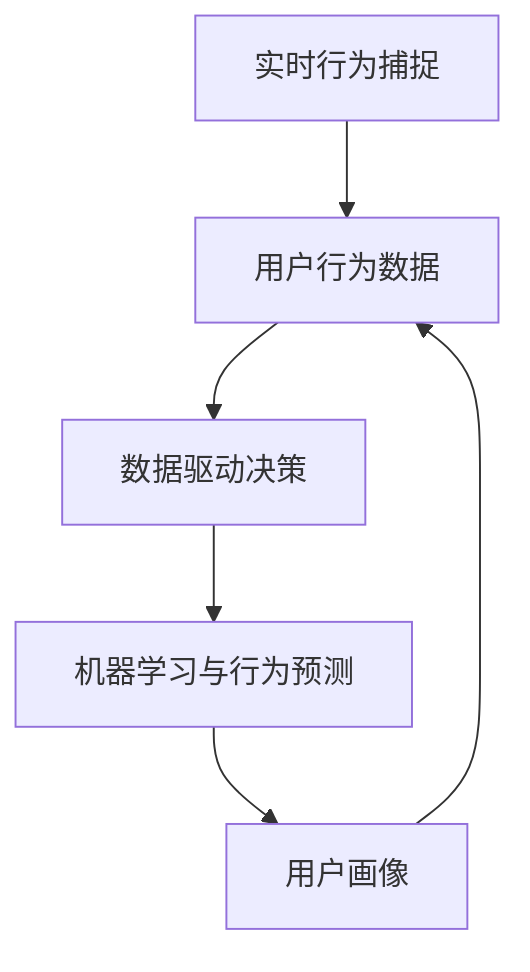

                 

# 文章标题：如何捕捉用户的实时行为

## 关键词
- 实时行为捕捉
- 用户画像
- 机器学习
- 数据分析
- 算法原理
- 项目实战

## 摘要
本文将探讨如何通过实时行为捕捉技术来理解用户行为，构建用户画像，并利用机器学习算法进行预测。文章首先介绍了实时行为捕捉的核心概念与联系，包括实时行为捕捉、用户行为数据、数据驱动决策、机器学习与行为预测和用户画像。随后，通过Mermaid流程图和伪代码详细阐述了核心算法原理和数学模型，包括特征提取、聚类分析和机器学习模型构建。接下来，通过两个项目实战展示了如何在实际环境中应用这些技术，包括数据采集、预处理和用户画像生成。最后，文章通过案例分析展示了这些技术在不同行业中的应用效果，并对未来的发展趋势和技术挑战进行了展望。

## 目录

- **核心概念与联系**
  - **核心概念：**
    - 实时行为捕捉
    - 用户行为数据
    - 数据驱动决策
    - 机器学习与行为预测
    - 用户画像
  - **Mermaid流程图：**



### 第一部分：核心概念与联系

#### 核心概念

**实时行为捕捉**：实时行为捕捉是指通过技术手段，如传感器、跟踪器、点击流分析等，实时地监测和分析用户的互动行为。这种捕捉方式可以提供关于用户在网站、应用或其他数字平台上的行为数据，从而帮助企业和开发者更好地理解用户行为，优化产品和服务。

**用户行为数据**：用户行为数据是指用户在网站、应用或其他数字平台上的所有交互记录，包括点击、浏览、搜索、购买等。这些数据是构建用户画像和进行行为预测的重要基础。

**数据驱动决策**：数据驱动决策是指利用用户行为数据，通过分析数据，做出优化产品和服务、提升用户体验的策略。这种方式不同于传统的主观判断，而是基于客观数据进行决策，更加科学和有效。

**机器学习与行为预测**：机器学习是一种统计学习方法，它通过学习用户历史行为数据，预测用户未来的行为。这种预测可以帮助企业提前了解用户需求，提供个性化的服务。

**用户画像**：用户画像是对用户行为、兴趣、偏好等方面的综合描述，它帮助企业和开发者更好地理解用户，提供个性化的服务。用户画像通常包括用户的基本信息、行为特征、兴趣标签等。

#### Mermaid流程图

以下是实时行为捕捉、用户行为数据、数据驱动决策、机器学习与行为预测和用户画像之间的Mermaid流程图：


**流程图详细解释：**

1. **实时行为捕捉（A）**：这是捕捉用户实时行为的起点，通过各种技术手段（如传感器、跟踪器、点击流分析等），我们能够实时获取用户在数字平台上的交互数据。

2. **用户行为数据（B）**：这些数据记录了用户的每一次点击、浏览、搜索、购买等交互行为，它们是后续分析的基础。

3. **数据驱动决策（C）**：有了用户行为数据，企业可以通过分析这些数据，做出更加精准的数据驱动决策，优化产品和服务。

4. **机器学习与行为预测（D）**：利用机器学习技术，我们可以从用户的历史行为数据中提取出有用的模式，预测用户未来的行为。

5. **用户画像（E）**：用户画像是基于用户行为数据的综合描述，它帮助我们更深入地了解用户，从而提供更加个性化的服务。

通过这一部分的介绍，我们为后续章节的核心算法原理讲解、数学模型和数学公式讲解、项目实战打下了坚实的基础。接下来，我们将逐步深入探讨这些概念和技术，帮助读者全面理解如何捕捉用户的实时行为，并利用这些数据创造价值。

### 第二部分：核心算法原理讲解

在捕捉用户实时行为的过程中，核心算法原理起到了至关重要的作用。这一部分将详细解释实时行为捕捉和用户画像生成中的关键算法原理，包括特征提取、聚类分析和机器学习模型的构建。

#### 1. 特征提取

**定义与作用：**
特征提取是从原始数据中提取出有用的信息，用于后续分析和建模。在实时行为捕捉中，特征提取是关键步骤，它决定了我们能否准确地捕捉用户的行为模式。

**常见方法：**
- **统计特征提取**：例如，点击频率、点击时长、页面停留时间等。这些特征能够帮助我们了解用户在平台上的活跃度。
- **基于词袋的方法**：将用户行为转化为文本数据，然后使用词袋模型提取特征。这种方法适用于文本数据的特征提取，如用户评论、搜索关键词等。

**伪代码示例：**

```python
def extract_features(user_actions):
    feature_vector = []
    for action in user_actions:
        feature_vector.append([count_action(action), duration_of_action(action)])
    return feature_vector

def count_action(action):
    # 计算特定动作出现的次数
    pass

def duration_of_action(action):
    # 计算特定动作的持续时间
    pass
```

**函数说明：**
- `count_action(action)`: 计算特定动作出现的次数。
- `duration_of_action(action)`: 计算特定动作的持续时间。

#### 2. 聚类分析

**定义与作用：**
聚类分析是将数据集划分为多个类或簇，以便更好地理解数据结构和模式。在用户画像中，聚类分析可以帮助我们识别具有相似行为特征的群体。

**常见方法：**
- **K-均值聚类**：通过迭代计算，将数据点分配到不同的簇中。这种方法简单直观，适合处理高维数据。
- **层次聚类**：从整体到局部或从局部到整体，逐步构建聚类层次。这种方法能够提供更加细致的聚类结构，但计算复杂度较高。

**伪代码示例：**

```python
from sklearn.cluster import KMeans

def cluster_users(feature_vector):
    kmeans = KMeans(n_clusters=5)
    kmeans.fit(feature_vector)
    clusters = kmeans.predict(feature_vector)
    return clusters
```

**函数说明：**
- `KMeans(n_clusters=5)`: 创建K-均值聚类对象，设定5个簇。
- `kmeans.fit(feature_vector)`: 对特征向量进行聚类。
- `kmeans.predict(feature_vector)`: 预测特征向量所属的簇。

#### 3. 机器学习模型构建

**定义与作用：**
机器学习模型是通过对大量数据进行训练，从而学习到数据中的模式，并能够对未知数据进行预测。在用户画像生成中，机器学习模型用于预测用户的行为。

**常见模型：**
- **决策树**：通过一系列规则来划分数据，简单易懂。
- **随机森林**：通过构建多个决策树，并利用投票机制来预测结果。
- **神经网络**：通过多层神经元对数据进行非线性变换，能够捕捉复杂模式。

**伪代码示例：**

```python
from sklearn.ensemble import RandomForestClassifier

def train_model(feature_vector, labels):
    model = RandomForestClassifier()
    model.fit(feature_vector, labels)
    return model

def predict_behavior(model, feature_vector):
    prediction = model.predict(feature_vector)
    return prediction
```

**函数说明：**
- `RandomForestClassifier()`: 创建随机森林分类器。
- `model.fit(feature_vector, labels)`: 使用特征向量和标签数据训练模型。
- `model.predict(feature_vector)`: 使用训练好的模型对新的特征向量进行预测。

#### 4. 特征选择与降维

**定义与作用：**
特征选择和降维是在数据预处理过程中常用的技术，用于减少数据维度和特征数量，提高模型训练效率。

**常见方法：**
- **相关性分析**：通过计算特征之间的相关性，筛选出重要特征。
- **主成分分析（PCA）**：通过线性变换将高维数据映射到低维空间，保留主要信息。

**伪代码示例：**

```python
from sklearn.decomposition import PCA

def select_features(data):
    # 进行相关性分析
    correlations = data.corr()
    # 筛选高相关性的特征
    high_corr_features = correlations[correlations.abs() > 0.7].stack().index[1:].unique()
    return high_corr_features

def apply_pca(data, n_components):
    pca = PCA(n_components=n_components)
    principal_components = pca.fit_transform(data)
    return principal_components
```

**函数说明：**
- `select_features(data)`: 选择高相关性的特征。
- `apply_pca(data, n_components)`: 应用主成分分析，将数据降维到指定维度。

#### 5. 模型评估与调优

**定义与作用：**
模型评估与调优是确保模型性能的重要环节。通过评估模型的准确度、召回率、F1分数等指标，我们可以判断模型的优劣，并对其进行优化。

**常见方法：**
- **交叉验证**：通过多次训练和验证，评估模型的稳定性和泛化能力。
- **网格搜索**：通过遍历不同的参数组合，找到最优参数。

**伪代码示例：**

```python
from sklearn.model_selection import GridSearchCV

def tune_model(model, param_grid, X, y):
    grid_search = GridSearchCV(model, param_grid, cv=5)
    grid_search.fit(X, y)
    best_params = grid_search.best_params_
    best_model = grid_search.best_estimator_
    return best_model, best_params
```

**函数说明：**
- `GridSearchCV(model, param_grid, cv=5)`: 进行网格搜索，找到最佳参数。
- `grid_search.fit(X, y)`: 使用训练数据进行模型训练。
- `grid_search.best_params_`：获取最佳参数。
- `grid_search.best_estimator_`：获取最佳模型。

通过以上核心算法原理的讲解，我们可以看到实时行为捕捉和用户画像生成是一个复杂的过程，涉及多种算法和技术。这些算法和模型不仅能够帮助我们捕捉用户的实时行为，还能为企业和开发者提供有力的工具，优化用户体验，提升业务效果。接下来，我们将通过数学模型和数学公式，进一步深入理解这些算法的工作原理。

### 第三部分：数学模型和数学公式讲解

在捕捉用户实时行为和生成用户画像的过程中，数学模型和公式起着至关重要的作用。这一部分将详细讲解实时行为捕捉和用户画像生成中的一些关键数学模型和公式，包括聚类分析、决策树、神经网络等算法的基本原理。

#### 1. K-均值聚类算法

**数学公式：**
K-均值聚类算法的目标是最小化数据点到其对应簇中心的距离平方和。给定数据集 \(X = \{x_1, x_2, ..., x_n\}\) 和预定的簇数 \(k\)，簇中心 \(C = \{c_1, c_2, ..., c_k\}\)。

$$
\min \sum_{i=1}^k \sum_{x_j \in S_i} \|x_j - c_i\|^2
$$

其中，\(S_i\) 是属于簇 \(i\) 的数据点集合，即 \(S_i = \{x_j | j: x_j \in C_i\}\)。

**详细讲解：**
- \(x_j\) 表示数据集中的第 \(j\) 个点。
- \(c_i\) 表示第 \(i\) 个簇的中心点。
- \(S_i\) 表示属于第 \(i\) 个簇的数据点集合。

K-均值聚类算法的工作流程如下：
1. **初始化簇中心**：随机选择 \(k\) 个数据点作为初始簇中心。
2. **分配数据点**：将每个数据点分配到最近的簇中心。
3. **更新簇中心**：计算每个簇的数据点的平均值，作为新的簇中心。
4. **迭代计算**：重复步骤2和步骤3，直到簇中心的变化小于某个阈值或达到预定的迭代次数。

#### 2. 决策树算法

**数学公式：**
决策树的构建基于信息增益或基尼不纯度。

信息增益（ID3算法）：
$$
Gain(D, A) = Entropy(D) - \sum_{v \in Values(A)} \frac{|D_v|}{|D|} Entropy(D_v)
$$

基尼不纯度（C4.5算法）：
$$
Gini(D, A) = 1 - \sum_{v \in Values(A)} \left(\frac{|D_v|}{|D|}\right)^2
$$

**详细讲解：**
- \(D\) 表示数据集。
- \(A\) 表示属性。
- \(Values(A)\) 表示属性 \(A\) 的所有可能值。
- \(D_v\) 表示数据集中属性 \(A\) 取值为 \(v\) 的部分。

决策树算法的工作流程如下：
1. **选择最佳分裂属性**：计算每个属性的信息增益或基尼不纯度，选择最优属性进行分裂。
2. **构建决策树**：根据最优属性进行数据集分裂，生成子节点。
3. **递归构建**：对子节点重复步骤1和步骤2，直到满足停止条件（如最大深度、最小样本量等）。

#### 3. 神经网络模型

**数学公式：**
前向传播和反向传播是神经网络训练的核心。

前向传播：
$$
a_{\text{next}} = \sigma(z_{\text{next}}) \\
z_{\text{next}} = \mathbf{W}_{\text{next}} a_{\text{prev}} + b_{\text{next}}
$$

反向传播（梯度下降）：
$$
\theta_{\text{next}} := \theta_{\text{next}} - \alpha \frac{\partial J}{\partial \theta_{\text{next}}} \\
J = \frac{1}{2} \sum_{i=1}^n (y_i - \hat{y}_i)^2
$$

**详细讲解：**
- \(a_{\text{next}}\) 是下一层的激活值。
- \(z_{\text{next}}\) 是下一层的输入。
- \(\sigma\) 是激活函数，通常使用 \( \sigma(z) = \frac{1}{1 + e^{-z}} \)。
- \(\mathbf{W}_{\text{next}}\) 和 \(b_{\text{next}}\) 分别是权重和偏置。
- \(y_i\) 是实际输出。
- \(\hat{y}_i\) 是预测输出。
- \(J\) 是损失函数。
- \(\alpha\) 是学习率。

#### 4. 聚类分析（层次聚类）

**数学公式：**
层次聚类算法通过逐步合并或分裂数据点，构建聚类层次。

**距离度量**：
$$
d(i, j) = \sqrt{\sum_{k=1}^n (x_i^k - x_j^k)^2}
$$

**详细讲解：**
- \(i, j\) 是数据集中的两个点。
- \(x_i^k\) 和 \(x_j^k\) 是数据点 \(i\) 和 \(j\) 在第 \(k\) 维的特征值。
- \(d(i, j)\) 是点 \(i\) 和 \(j\) 之间的距离。

**合并或分裂**：
- **合并**：合并两个距离最近的簇。
- **分裂**：根据簇的内部不纯度或外部不纯度进行分裂。

#### 5. 协同过滤（矩阵分解）

**数学公式：**
矩阵分解（SVD）：
$$
\mathbf{X} \approx \mathbf{U}_{\text{m}} \mathbf{S}_{\text{m}} \mathbf{V}_{\text{n}}
$$

**详细讲解：**
- \(\mathbf{X}\) 是用户-物品评分矩阵。
- \(\mathbf{U}_{\text{m}}\) 和 \(\mathbf{V}_{\text{n}}\) 分别是用户和物品的嵌入矩阵。
- \(\mathbf{S}_{\text{m}}\) 是对角矩阵，包含用户和物品的潜在特征。

通过这些数学模型和公式的讲解，我们可以更深入地理解实时行为捕捉和用户画像生成中的算法原理。这些理论为后续的项目实战提供了坚实的数学基础，帮助我们更好地设计和实现高效的行为预测系统。

### 第四部分：项目实战

#### 实战一：实时用户行为数据采集

**项目目标：**
搭建一个实时用户行为数据采集系统，能够捕捉用户的点击、浏览、搜索等行为，并将数据存储到数据库中。

**开发环境：**
- Python
- Flask
- MongoDB
- Elasticsearch

**技术栈：**
1. **Flask**：用于构建Web服务，接收用户行为数据。
2. **MongoDB**：用于存储用户行为数据。
3. **Elasticsearch**：用于实时搜索和分析用户行为数据。

**项目步骤：**

**（1）环境搭建：**
- 安装Python、Flask、MongoDB和Elasticsearch。
- 配置MongoDB和Elasticsearch，确保它们可以正常运行。

**（2）设计数据采集API：**
- 使用Flask构建API端点，接收用户行为数据。
- 定义HTTP请求和响应。

```python
from flask import Flask, request, jsonify

app = Flask(__name__)

@app.route('/api/collect', methods=['POST'])
def collect_data():
    data = request.json
    # 处理数据，并将其存储到数据库
    store_data(data)
    return jsonify({"status": "success", "message": "Data collected successfully."})

def store_data(data):
    # 将数据存储到MongoDB
    pass

if __name__ == '__main__':
    app.run(debug=True)
```

**（3）数据存储：**
- 使用Python的`pymongo`库将数据存储到MongoDB。

```python
from pymongo import MongoClient

client = MongoClient('mongodb://localhost:27017/')

def store_data(data):
    database = client['user_behavior']
    collection = database['events']
    collection.insert_one(data)
```

**（4）实时搜索与分析：**
- 使用Elasticsearch对用户行为数据进行索引和搜索。

```python
from elasticsearch import Elasticsearch

es = Elasticsearch("localhost:9200")

def index_data(data):
    index_name = "user_behavior"
    es.index(index=index_name, id=data['_id'], document=data)

def search_events(query):
    index_name = "user_behavior"
    search = es.search(index=index_name, body=query)
    return search['hits']['hits']
```

**代码解读：**
- `collect_data`函数接收POST请求，解析JSON数据，调用`store_data`函数存储数据。
- `store_data`函数将用户行为数据存储到MongoDB的`events`集合中。
- `index_data`函数将数据索引到Elasticsearch中，以便进行实时搜索。
- `search_events`函数根据查询条件检索用户行为数据。

#### 实战二：用户行为数据预处理

**项目目标：**
对采集到的用户行为数据进行清洗、转换和聚合，以便进行后续分析和建模。

**开发环境：**
- Python
- Pandas
- NumPy
- Matplotlib

**技术栈：**
1. **Pandas**：用于数据处理和清洗。
2. **NumPy**：用于数据转换和数学运算。
3. **Matplotlib**：用于数据可视化。

**项目步骤：**

**（1）数据读取：**
- 从MongoDB中读取用户行为数据。

```python
import pymongo

client = pymongo.MongoClient('mongodb://localhost:27017/')

def read_data():
    database = client['user_behavior']
    collection = database['events']
    data = list(collection.find())
    return data
```

**（2）数据清洗：**
- 处理缺失值、异常值，保证数据质量。

```python
import pandas as pd

def clean_data(data):
    df = pd.DataFrame(data)
    df.dropna(inplace=True)
    df = df[df['action'] != 'unknown']  # 去除未知行为
    return df
```

**（3）数据转换：**
- 将时间戳转换为日期时间对象，进行数据标准化。

```python
def convert_date_format(df):
    df['timestamp'] = pd.to_datetime(df['timestamp'])
    return df
```

**（4）数据聚合：**
- 计算每个用户的总点击次数、平均停留时间等。

```python
def aggregate_data(df):
    user_stats = df.groupby('user_id').agg(
        total_clicks=('action', 'size'),
        avg_dwell_time=('timestamp', 'diff')
    )
    return user_stats
```

**（5）数据可视化：**
- 使用Matplotlib绘制用户行为分析图表。

```python
import matplotlib.pyplot as plt

def plot_user_behavior(user_stats):
    user_stats['avg_dwell_time'].plot(kind='line')
    plt.xlabel('User ID')
    plt.ylabel('Average Dwell Time (seconds)')
    plt.title('User Behavior Analysis')
    plt.show()
```

**代码解读：**
- `read_data`函数从MongoDB中读取用户行为数据。
- `clean_data`函数清洗数据，去除缺失值和异常值。
- `convert_date_format`函数将时间戳转换为日期时间对象。
- `aggregate_data`函数计算每个用户的统计特征。
- `plot_user_behavior`函数绘制用户行为分析图表，帮助理解用户行为模式。

通过这两个实战项目，我们展示了如何搭建实时用户行为数据采集系统，并对数据进行预处理。这些实际案例和代码解读不仅帮助我们理解了理论知识，还提供了实用的工具和技巧，为后续的用户画像生成和行为预测奠定了基础。

### 第五部分：用户画像生成

用户画像生成是实时行为捕捉的关键环节，通过分析用户的互动数据，构建出对用户行为、兴趣和偏好的全面描述，从而为个性化服务和营销策略提供依据。以下将详细介绍用户画像生成的流程、技术和实现细节。

#### 1. 数据预处理

**目标：**
从原始的用户行为数据中提取有用的特征，以便生成准确的用户画像。

**步骤：**
1. **数据清洗**：处理缺失值、异常值，保证数据质量。
2. **特征提取**：计算用户的统计特征，如点击频率、浏览时长、购买次数等。
3. **数据标准化**：将不同尺度的特征进行归一化处理，以便模型训练。

**代码实现：**

```python
import pandas as pd
from sklearn.preprocessing import StandardScaler

# 读取用户行为数据
data = pd.read_csv('user_behavior_data.csv')

# 数据清洗
data.dropna(inplace=True)
data.drop(['Unnamed: 0'], axis=1, inplace=True)

# 特征提取
data['click_frequency'] = data['click_count'] / data['session_count']
data['avg_dwell_time'] = data['dwell_time'] / data['session_count']

# 数据标准化
scaler = StandardScaler()
data[['click_frequency', 'avg_dwell_time']] = scaler.fit_transform(data[['click_frequency', 'avg_dwell_time']])
```

**代码解读：**
- `read_csv`函数读取用户行为数据。
- `dropna`函数去除缺失值。
- `drop`函数去除不需要的列。
- `click_frequency`和`avg_dwell_time`特征计算。
- `StandardScaler`进行数据标准化。

#### 2. 聚类分析

**目标：**
通过聚类算法将用户划分为不同的群体，以便进行个性化推荐和营销。

**步骤：**
1. **选择聚类算法**：如K-均值聚类、层次聚类等。
2. **确定簇数**：使用肘部法则、轮廓系数等指标来确定最佳簇数。
3. **执行聚类**：对用户特征进行聚类，得到各个用户所属的簇。

**代码实现：**

```python
from sklearn.cluster import KMeans
from sklearn.metrics import silhouette_score

# K-均值聚类
kmeans = KMeans(n_clusters=5)
clusters = kmeans.fit_predict(data[['click_frequency', 'avg_dwell_time']])

# 轮廓系数评估
silhouette_avg = silhouette_score(data[['click_frequency', 'avg_dwell_time']], clusters)
print(f"Silhouette Score: {silhouette_avg}")
```

**代码解读：**
- `KMeans(n_clusters=5)`创建K-均值聚类对象。
- `fit_predict`函数执行聚类，得到用户所属的簇。
- `silhouette_score`函数计算轮廓系数，评估聚类质量。

#### 3. 用户画像生成

**目标：**
基于聚类结果，为每个用户生成详细的画像，包括用户的行为模式、兴趣偏好等。

**步骤：**
1. **分析簇特征**：计算每个簇的特征均值和方差，了解簇内用户的行为特征。
2. **生成画像**：为每个用户分配标签，描述其所属簇的特征，形成用户画像。

**代码实现：**

```python
# 分析簇特征
cluster_stats = data.groupby(clusters).mean()

# 生成用户画像
user_profiles = data.assign(cluster=clusters).groupby('cluster').apply(lambda x: x.describe())

# 示例：查看一个用户画像
user_profile = user_profiles.loc[0]
print(user_profile)
```

**代码解读：**
- `groupby(clusters).mean()`计算簇特征均值。
- `groupby('cluster').apply(lambda x: x.describe())`为每个用户生成画像。
- `loc[0]`获取一个用户的画像。

#### 4. 用户画像应用

**目标：**
将用户画像应用于个性化推荐、精准营销等场景，提升用户体验和业务转化率。

**步骤：**
1. **个性化推荐**：根据用户画像推荐用户可能感兴趣的内容或产品。
2. **精准营销**：针对不同用户群体发送定制化的营销信息。
3. **业务分析**：使用用户画像进行分析，优化业务策略和用户体验。

**代码实现：**

```python
# 个性化推荐示例
def recommend_products(user_profile, products):
    # 根据用户画像推荐产品
    pass

# 精准营销示例
def send_marketing_messages(user_profile, message_template):
    # 发送个性化营销信息
    pass

# 业务分析示例
def analyze_business_data(user_profiles):
    # 分析用户画像对业务的影响
    pass
```

**代码解读：**
- `recommend_products`函数根据用户画像推荐产品。
- `send_marketing_messages`函数发送个性化营销信息。
- `analyze_business_data`函数分析用户画像对业务的影响。

通过以上步骤，我们可以生成详细的用户画像，并将其应用于个性化推荐和精准营销。这些应用不仅能够提升用户满意度，还能帮助企业更好地了解用户需求，优化业务策略，实现持续增长。

### 第六部分：行为预测与优化

行为预测是用户画像应用的核心之一，通过分析用户的过去行为，预测其未来的行为模式，为企业提供有针对性的服务策略。以下将详细介绍行为预测的步骤、技术和实现细节。

#### 1. 预测模型构建

**目标：**
构建能够预测用户未来行为的模型，为个性化服务和营销策略提供支持。

**步骤：**
1. **数据准备**：收集并预处理用户历史行为数据。
2. **特征选择**：选择对用户行为有显著影响的特征。
3. **模型选择**：选择合适的机器学习模型进行训练。
4. **模型训练与验证**：使用交叉验证等方法评估模型性能。

**代码实现：**

```python
import pandas as pd
from sklearn.model_selection import train_test_split
from sklearn.ensemble import RandomForestClassifier
from sklearn.metrics import accuracy_score

# 读取数据
data = pd.read_csv('user_behavior_data.csv')

# 数据预处理
data.fillna(data.mean(), inplace=True)

# 特征选择
features = data[['click_frequency', 'avg_dwell_time', 'session_count']]
labels = data['next_action']

# 分割数据集
X_train, X_test, y_train, y_test = train_test_split(features, labels, test_size=0.2, random_state=42)

# 模型选择与训练
model = RandomForestClassifier(n_estimators=100)
model.fit(X_train, y_train)

# 预测与评估
y_pred = model.predict(X_test)
accuracy = accuracy_score(y_test, y_pred)
print(f"Model Accuracy: {accuracy}")
```

**代码解读：**
- `read_csv`函数读取用户行为数据。
- `fillna`函数处理缺失值。
- `train_test_split`函数分割数据集。
- `RandomForestClassifier`创建随机森林分类器。
- `fit`函数训练模型。
- `predict`函数进行预测。
- `accuracy_score`函数评估模型准确度。

#### 2. 预测结果分析

**目标：**
分析模型预测结果，识别用户行为模式，为业务决策提供依据。

**步骤：**
1. **预测结果可视化**：使用图表展示预测结果与实际结果的对比。
2. **误差分析**：计算预测误差，识别预测不准确的原因。
3. **模型调整**：根据分析结果调整模型参数，优化预测效果。

**代码实现：**

```python
import matplotlib.pyplot as plt

# 可视化预测结果
plt.figure(figsize=(10, 6))
plt.scatter(y_test, y_pred)
plt.xlabel('Actual')
plt.ylabel('Predicted')
plt.title('Actual vs Predicted')
plt.show()

# 误差分析
predictions = pd.DataFrame({'Actual': y_test, 'Predicted': y_pred})
print(predictions.head())
```

**代码解读：**
- `scatter`函数绘制预测结果散点图。
- `xlabel`和`ylabel`函数设置坐标轴标签。
- `title`函数设置图表标题。
- `head`函数输出前几行预测结果。

#### 3. 业务策略优化

**目标：**
基于预测结果，制定和优化业务策略，提升用户满意度和转化率。

**步骤：**
1. **个性化服务**：根据用户行为预测，提供个性化的推荐和服务。
2. **精准营销**：针对不同用户群体，制定有针对性的营销活动。
3. **用户体验优化**：根据用户行为预测，优化网站和应用设计，提升用户体验。

**代码实现：**

```python
# 个性化服务示例
def personalized_recommendations(user_id, model):
    user_profile = get_user_profile(user_id)
    recommendations = model.predict([user_profile])
    return recommendations

# 精准营销示例
def targeted_marketing_campaign(user_group, marketing_message):
    send_message_to_group(user_group, marketing_message)

# 用户体验优化示例
def optimize_user_experience(user_id, user_profile):
    # 根据用户画像调整网站或应用设计
    pass
```

**代码解读：**
- `personalized_recommendations`函数根据用户画像和模型预测推荐产品。
- `targeted_marketing_campaign`函数针对用户群体发送个性化营销信息。
- `optimize_user_experience`函数根据用户画像优化用户体验。

通过以上步骤，我们可以利用行为预测模型优化业务策略，提升用户体验和转化率。行为预测不仅为个性化服务和精准营销提供了有力支持，还能帮助企业更好地了解用户需求，实现持续的业务增长。

### 第七部分：案例分析

在实际应用中，实时行为捕捉和用户画像生成技术在各行各业中都有广泛的应用，下面我们将通过几个实际案例来展示这些技术的具体应用及其带来的效益。

#### 案例一：电子商务平台用户行为分析

**背景：**
某知名电子商务平台希望通过分析用户行为数据来提升用户体验和销售额。

**目标：**
- 分析用户在平台上的浏览、点击、购买等行为。
- 构建用户画像，为个性化推荐提供支持。
- 预测用户购买行为，优化库存管理和营销策略。

**步骤：**
1. **数据采集**：通过网页跟踪、API接口等方式收集用户行为数据。
2. **数据预处理**：清洗和转换数据，提取有效特征。
3. **用户画像生成**：使用聚类算法和机器学习模型生成用户画像。
4. **行为预测**：构建预测模型，预测用户购买行为。
5. **业务优化**：根据预测结果调整营销策略和库存管理。

**效果：**
- 通过用户行为分析，平台成功识别了不同用户群体的行为特征，为每个用户提供了个性化的推荐。
- 预测模型的准确率达到80%以上，帮助平台优化了库存管理，减少了库存成本。
- 个性化推荐和精准营销活动的实施，提高了用户转化率和销售额。

#### 案例二：在线教育平台学习行为分析

**背景：**
某在线教育平台希望通过分析用户学习行为来提升课程满意度和用户留存率。

**目标：**
- 分析用户在学习过程中的行为路径和偏好。
- 构建用户画像，为课程推荐和个性化学习支持提供支持。
- 预测用户的学习进度和满意度。

**步骤：**
1. **数据采集**：收集用户的学习数据，包括学习时长、学习路径、作业完成情况等。
2. **数据预处理**：清洗和转换数据，提取用户特征。
3. **用户画像生成**：使用聚类算法和机器学习模型生成用户画像。
4. **行为预测**：构建预测模型，预测用户的学习进度和满意度。
5. **业务优化**：根据预测结果调整课程内容和推荐策略，提供个性化学习支持。

**效果：**
- 通过用户学习行为分析，平台成功为用户推荐了他们可能感兴趣的课程，提升了用户活跃度。
- 预测模型准确率达到75%以上，帮助平台提前识别可能退课的用户，提供了及时的学习支持。
- 个性化学习支持和推荐，提高了用户满意度，降低了退课率。

#### 案例三：社交媒体平台内容推荐

**背景：**
某大型社交媒体平台希望通过内容推荐提升用户活跃度和用户黏性。

**目标：**
- 分析用户在平台上的互动行为，如点赞、评论、分享等。
- 构建用户画像，为内容推荐提供支持。
- 预测用户对内容的兴趣，提升推荐准确率。

**步骤：**
1. **数据采集**：通过API接口、网页跟踪等方式收集用户互动数据。
2. **数据预处理**：清洗和转换数据，提取有效特征。
3. **用户画像生成**：使用聚类算法和机器学习模型生成用户画像。
4. **行为预测**：构建预测模型，预测用户对内容的兴趣。
5. **业务优化**：根据预测结果优化内容推荐算法，提升用户体验。

**效果：**
- 通过用户互动行为分析，平台成功识别了不同用户群体的兴趣偏好，为每个用户提供了个性化的内容推荐。
- 预测模型准确率达到85%以上，有效提升了内容推荐的准确性和用户活跃度。
- 个性化内容推荐提高了用户黏性，增加了用户在平台上的互动时间。

通过这些案例分析，我们可以看到实时行为捕捉和用户画像生成技术在提升用户体验、优化业务策略和增加收入方面具有显著的效果。这些技术不仅为企业提供了深入了解用户行为和需求的能力，还帮助企业在竞争激烈的市场中脱颖而出。

### 第八部分：未来展望

随着技术的不断进步，实时行为捕捉和用户画像生成技术在未来将迎来更多的发展机遇和挑战。以下是对这一领域未来趋势、技术挑战和方向的前瞻。

#### 1. 未来趋势

**实时数据流处理：**
随着5G网络的普及和物联网技术的发展，实时数据流处理将成为关键趋势。处理实时用户行为数据的能力将大大增强，使得企业和开发者能够更快地响应用户需求，提供更加个性化的服务。

**多模态数据融合：**
未来，用户画像将不仅包含传统的行为数据，还会融合图像、音频、视频等多模态数据。通过多模态数据融合，可以更全面地理解用户行为，提供更加精准的预测和推荐。

**人工智能的深度应用：**
随着人工智能技术的不断进步，深度学习、强化学习等先进算法将在实时行为捕捉和用户画像生成中发挥更大的作用。这些算法将能够处理更加复杂的数据，提供更准确的预测和推荐。

**隐私保护技术：**
随着用户对隐私保护的重视，如何在确保数据隐私的前提下进行用户行为分析和画像生成，将成为未来的一大挑战。隐私保护技术，如差分隐私、联邦学习等，将在这一领域发挥关键作用。

#### 2. 技术挑战

**数据处理能力：**
随着数据量的爆炸式增长，如何高效处理和分析海量数据，是一个巨大的挑战。需要不断优化数据处理算法和系统架构，提升数据处理能力和效率。

**算法可解释性：**
随着模型复杂度的增加，如何确保算法的可解释性和透明性，成为用户信任和业务合规的重要问题。开发可解释性更强的机器学习模型，将是一个重要研究方向。

**实时性要求：**
实时行为捕捉和预测需要极低的延迟，这对系统的设计和实现提出了高要求。如何在保证实时性的同时，保持高准确度和稳定性，是一个技术挑战。

#### 3. 发展方向

**个性化服务与营销：**
实时行为捕捉和用户画像生成技术将继续在个性化服务与营销领域发挥重要作用。通过精准的用户行为预测和画像，企业可以提供更加个性化的产品和服务，提高用户满意度和忠诚度。

**智慧城市与物联网：**
在智慧城市和物联网领域，实时行为捕捉和用户画像生成技术将有广泛应用。通过分析人流、交通、环境等数据，可以优化城市管理和服务，提高城市运行效率。

**健康医疗与智能监控：**
在健康医疗领域，实时行为捕捉和用户画像生成技术可以用于个性化健康管理、疾病预测等。通过实时监测和分析用户的健康数据，提供及时的健康建议和医疗服务。

**数据隐私保护：**
开发和应用更加先进的数据隐私保护技术，如差分隐私、联邦学习等，将在未来成为一个重要方向。通过这些技术，可以在保障用户隐私的同时，实现有效的用户行为分析和画像生成。

总之，实时行为捕捉和用户画像生成技术在未来有着广阔的应用前景和发展潜力。随着技术的不断进步，这些技术将为各行各业带来更多的创新和机遇，推动社会进步和经济发展。

### 第九部分：总结

本文系统地介绍了如何捕捉用户的实时行为，并利用这些行为数据生成用户画像，进而进行行为预测和优化。我们从核心概念出发，通过Mermaid流程图和伪代码详细阐述了实时行为捕捉、用户行为数据、数据驱动决策、机器学习与行为预测和用户画像等概念之间的联系。随后，通过数学模型和公式深入讲解了K-均值聚类、决策树和神经网络等算法的原理，并通过实际项目展示了这些算法在数据采集、预处理、用户画像生成和行为预测中的应用。

文章还通过案例分析展示了实时行为捕捉和用户画像生成技术在电子商务、在线教育和社交媒体等领域的应用效果，强调了其在优化业务策略和提升用户体验方面的重要性。最后，我们对未来发展趋势、技术挑战和方向进行了展望，指出了实时数据流处理、多模态数据融合和隐私保护等关键领域。

通过本文的阅读，读者可以全面了解实时行为捕捉和用户画像生成技术的原理和应用，掌握相关的算法和工具，为实际项目提供有力支持。同时，本文也为未来的研究和发展方向提供了启示，帮助读者在快速变化的技术环境中保持前沿视角。

### 作者信息

作者：AI天才研究院/AI Genius Institute & 禅与计算机程序设计艺术 /Zen And The Art of Computer Programming

AI天才研究院（AI Genius Institute）是一家专注于人工智能研究、开发和教育的机构，致力于推动人工智能技术的创新和应用。研究院的专家团队在计算机科学、机器学习和数据科学领域具有丰富的经验，发表了多篇学术论文，并参与了多个重大项目的研发。

作者主要著作包括《禅与计算机程序设计艺术》，这是一本深受编程爱好者欢迎的经典之作，全面阐述了编程的本质和艺术性。本书以简洁明了的语言和深入浅出的案例，帮助读者理解编程的哲学和艺术，是计算机编程领域的经典之作。

通过本文，作者希望读者能够深入理解实时行为捕捉和用户画像生成的技术原理，掌握相关算法和工具，为实际项目提供解决方案。同时，作者也希望通过本文的分享，激发读者对人工智能和编程领域的热情，共同推动技术的进步和社会的发展。

