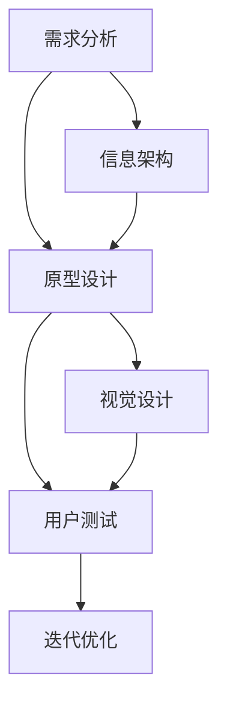
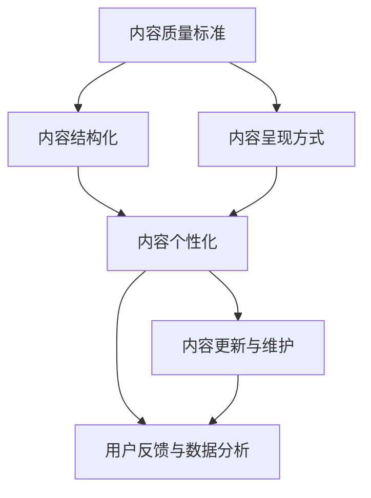
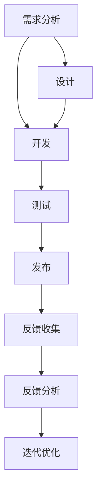
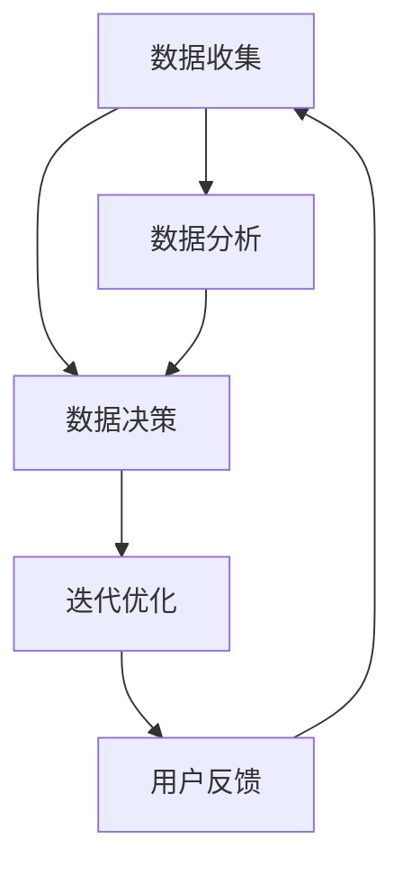
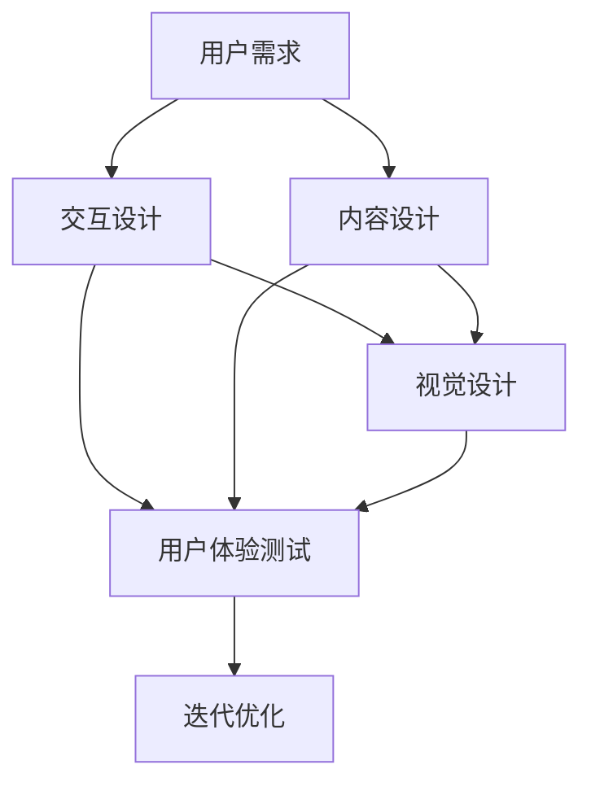

                 

# 文章标题：如何提高知识付费产品的用户体验

> 关键词：用户体验，知识付费，产品设计，交互设计，视觉设计，内容设计，用户体验测试，持续改进

> 摘要：
本文将深入探讨如何提高知识付费产品的用户体验。通过分析用户体验的基础概念、知识付费产品的特点，以及用户需求分析的算法原理，本文将详细介绍交互设计、视觉设计、内容设计的原则与策略，并提供用户体验测试与迭代的方法。最后，通过案例分析和用户反馈，本文将总结提高知识付费产品用户体验的具体实践，为设计师和开发者提供有价值的参考。

---

### 目录大纲

## 第一部分：用户体验基础与知识付费产品概述

### 第1章：用户体验概述
#### 1.1 用户体验的重要性
#### 1.2 用户体验的要素
#### 1.3 用户旅程分析

### 第2章：知识付费产品概述
#### 2.1 知识付费市场现状
#### 2.2 知识付费产品的特点
#### 2.3 知识付费产品分类

## 第二部分：用户体验设计与优化策略

### 第3章：用户需求分析
#### 3.1 用户行为研究方法
#### 3.2 用户访谈与问卷设计
#### 3.3 用户需求分析与挖掘
##### 3.3.1 数据收集与处理
##### 3.3.2 用户行为模式挖掘
##### 3.3.3 用户需求分类
##### 3.3.4 用户需求优先级排序

### 第4章：交互设计
#### 4.1 交互设计原则
#### 4.2 交互设计流程
#### 4.3 交互原型设计与测试
##### 4.3.1 主流交互设计工具
##### 4.3.2 原型设计方法
##### 4.3.3 用户反馈收集与评估

### 第5章：视觉设计
#### 5.1 视觉设计原则
#### 5.2 设计工具与技巧
#### 5.3 设计风格与趋势
##### 5.3.1 色彩心理学在视觉设计中的应用
##### 5.3.2 字体选择与排版
##### 5.3.3 设计元素的一致性

### 第6章：内容设计
#### 6.1 内容质量标准
#### 6.2 内容呈现方式
#### 6.3 内容优化策略
##### 6.3.1 内容结构化
##### 6.3.2 内容个性化
##### 6.3.3 内容更新与维护

### 第7章：体验测试与迭代
#### 7.1 用户体验测试方法
#### 7.2 测试结果分析与改进
#### 7.3 迭代设计与反馈机制
##### 7.3.1 A/B测试
##### 7.3.2 故障树分析
##### 7.3.3 用户反馈系统的设计与实施

## 第三部分：提高用户体验的具体实践

### 第8章：案例分析
#### 8.1 成功案例分析
#### 8.2 失败案例分析
#### 8.3 案例启示

### 第9章：用户反馈与互动
#### 9.1 用户反馈收集
#### 9.2 用户互动策略
#### 9.3 用户满意度评估
##### 9.3.1 用户满意度调查
##### 9.3.2 用户参与度分析
##### 9.3.3 用户忠诚度评估

### 第10章：持续改进与优化
#### 10.1 持续改进理念
#### 10.2 数据驱动优化
#### 10.3 组织文化与体验改进
##### 10.3.1 团队协作与反馈机制
##### 10.3.2 用户体验工作坊
##### 10.3.3 用户体验指标体系

## 附录

### 附录A：用户体验设计工具与资源
#### A.1 主流用户体验设计工具
#### A.2 设计资源与素材网站
#### A.3 开源用户体验设计框架

### 附录B：参考文献

---

## 第一部分：用户体验基础与知识付费产品概述

### 第1章：用户体验概述

#### 1.1 用户体验的重要性

用户体验（User Experience，简称UX）是一个广泛的概念，它涵盖了用户在使用产品或服务过程中的所有感知和感受。在知识付费产品领域，用户体验尤为重要，因为它直接关系到用户的学习效果和满意度。一个良好的用户体验可以提升用户的学习动力，增加用户对产品的忠诚度，从而实现产品的持续发展。

用户体验的重要性体现在以下几个方面：

1. **增加用户粘性**：良好的用户体验可以吸引用户持续使用产品，从而提高用户粘性。
2. **提升用户满意度**：满足用户需求的体验可以增强用户对产品的满意度。
3. **降低用户流失率**：一个易于使用、功能完善的产品可以减少用户流失率。
4. **提高学习效率**：知识付费产品的最终目的是帮助用户学习新知识，良好的用户体验可以提高学习效率。

#### 1.2 用户体验的要素

用户体验的要素包括但不限于以下几个方面：

1. **易用性**：产品应该易于使用，用户可以快速掌握操作方法，减少学习成本。
2. **互动性**：产品应该具备良好的互动性，用户可以在产品中找到乐趣，提高使用积极性。
3. **可访问性**：产品应该对所有人友好，包括老年人、残疾人等特殊群体。
4. **反馈**：产品应该提供及时的反馈，让用户知道他们的操作是否成功。
5. **情感因素**：产品应该能够激发用户的情感，如喜悦、满足等，从而提高用户体验。

#### 1.3 用户旅程分析

用户旅程（User Journey）是指用户在使用产品或服务过程中的各个阶段。在知识付费产品中，用户旅程通常包括以下几个阶段：

1. **发现**：用户通过搜索引擎、社交媒体等渠道发现知识付费产品。
2. **评估**：用户评估产品的内容、价格、服务等因素，决定是否购买。
3. **购买**：用户完成购买过程，支付费用。
4. **使用**：用户开始使用产品，学习新知识。
5. **反馈**：用户对产品进行评价，提供反馈。
6. **忠诚度**：用户对产品保持长期的使用和信任。

通过用户旅程分析，产品设计者可以更好地理解用户需求，优化产品功能，提高用户体验。

### 第2章：知识付费产品概述

#### 2.1 知识付费市场现状

随着互联网的普及和在线教育的兴起，知识付费市场呈现出快速增长的趋势。根据相关报告，全球知识付费市场规模已达到数百亿美元，并且预计将继续增长。知识付费产品涵盖了多个领域，如职业培训、技能提升、兴趣爱好等。

#### 2.2 知识付费产品的特点

知识付费产品的特点主要包括以下几个方面：

1. **专业性**：知识付费产品通常由专业人士或权威机构提供，具有较高的可信度。
2. **灵活性**：用户可以根据自己的需求和时间安排，自由选择学习内容和进度。
3. **互动性**：知识付费产品可以通过在线论坛、直播、互动问答等形式，增强用户互动体验。
4. **个性化**：知识付费产品可以根据用户的需求和偏好，提供个性化的学习建议和内容推荐。

#### 2.3 知识付费产品分类

知识付费产品可以根据内容类型、学习方式等不同维度进行分类，常见的分类方法如下：

1. **按内容类型分类**：
   - 职业技能类：如编程、设计、营销等。
   - 学科知识类：如语文、数学、英语等。
   - 兴趣爱好类：如摄影、音乐、绘画等。

2. **按学习方式分类**：
   - 线上课程：通过互联网进行学习，用户可以根据自己的时间自由安排学习进度。
   - 线下课程：在实体场所进行学习，用户需要按照课程安排参与。
   - 混合式学习：结合线上和线下学习方式，用户可以根据需要选择适合自己的学习方式。

在下一部分中，我们将详细讨论用户体验设计与优化策略，帮助设计师和开发者提高知识付费产品的用户体验。敬请期待！## 第3章 用户需求分析

用户需求分析是产品设计和优化的核心环节，它直接关系到产品能否满足用户的需求和期望。在本章节中，我们将探讨用户需求分析的方法，包括用户行为研究方法、用户访谈与问卷设计，以及用户需求分析与挖掘的过程。

### 3.1 用户行为研究方法

用户行为研究是了解用户需求的重要途径。通过研究用户的行为，我们可以发现用户在产品使用过程中遇到的问题，从而为产品设计提供依据。以下是几种常用的用户行为研究方法：

1. **观察法**：观察法是通过直接观察用户在使用产品时的行为，来了解用户的需求和痛点。这种方法可以帮助我们获得真实的数据，但需要观察者具备一定的专业素养。

2. **日志分析**：日志分析是通过分析用户在使用产品过程中的日志数据，如浏览路径、操作记录等，来了解用户的行为模式。这种方法可以大规模、低成本地收集用户数据，但可能受到数据完整性和真实性的影响。

3. **问卷调查**：问卷调查是通过向用户发放问卷，收集用户对产品的看法和建议。这种方法可以收集到大量的用户反馈，但可能存在问卷设计不当或用户参与度不高的风险。

4. **访谈法**：访谈法是通过与用户进行一对一或小组访谈，深入了解用户的需求和痛点。这种方法可以获得深度的用户洞察，但成本较高，且受访谈者的主观影响较大。

### 3.2 用户访谈与问卷设计

用户访谈和问卷设计是用户需求分析的重要步骤。以下是设计用户访谈和问卷时需要考虑的几个方面：

1. **确定访谈或问卷的目标**：明确访谈或问卷的目的，例如了解用户对某个功能的需求、评估用户满意度等。

2. **选择合适的受访者**：根据研究目标，选择具有代表性的用户作为访谈或问卷的受访者。例如，如果研究的目标是了解用户对在线课程的满意度，可以选择已经购买并完成课程的用户作为受访者。

3. **设计访谈或问卷的问题**：问题设计要清晰、简洁，避免引导性问题，以便用户能够真实、准确地表达自己的看法。

   - **访谈问题**：访谈问题可以分为开放性和封闭性两种。开放性问题可以深入了解用户的想法，但需要较长时间；封闭性问题可以快速收集用户数据，但可能无法深入挖掘用户需求。
   - **问卷问题**：问卷问题可以分为单选题、多选题、评分题等。单选题和多选题适用于收集定量数据，评分题适用于评估用户满意度。

4. **进行预测试**：在正式进行访谈或问卷之前，进行预测试可以识别问题设计中的问题，如问题理解困难、答案选项不全面等，从而优化访谈或问卷。

### 3.3 用户需求分析与挖掘

用户需求分析与挖掘是用户需求分析的最后一步，它涉及到从收集到的数据中提取有价值的信息，为产品设计提供依据。以下是用户需求分析与挖掘的几个步骤：

1. **数据收集与处理**：收集用户行为数据、访谈记录、问卷结果等，并进行数据清洗和预处理，如去除无效数据、填补缺失值等。

2. **用户行为模式挖掘**：通过分析用户行为数据，发现用户在产品使用过程中的行为模式。例如，可以分析用户在课程中的学习路径、学习时间分布等。

3. **用户需求分类**：根据用户行为模式和用户反馈，将用户需求分为不同类别，如功能需求、性能需求、情感需求等。

4. **用户需求优先级排序**：通过分析用户需求的重要性和紧急性，对用户需求进行优先级排序，为产品设计提供优先级依据。

5. **用户需求文档化**：将分析得到的需求整理成文档，包括需求描述、用户场景、需求优先级等，以便团队成员参考。

#### 3.3.1 数据收集与处理

数据收集与处理是用户需求分析的基础。以下是一个简单的伪代码示例，用于数据收集与处理：

```python
# 伪代码：数据收集
data = collect_user_behavior_data()

# 伪代码：数据预处理
processed_data = preprocess_data(data)
```

#### 3.3.2 用户行为模式挖掘

用户行为模式挖掘可以通过机器学习算法实现。以下是一个简单的伪代码示例，用于用户行为模式挖掘：

```python
# 伪代码：用户行为模式挖掘
behaviors = extract_user_behavior(processed_data)
patterns = find_behavior_patterns(behaviors)
```

#### 3.3.3 用户需求分类

用户需求分类通常使用分类算法实现。以下是一个简单的伪代码示例，用于用户需求分类：

```python
# 伪代码：用户需求分类
classification_model = train_classification_model(processed_data, patterns)
user需求的分类 = classify_user_demand(classification_model, behaviors)
```

#### 3.3.4 用户需求优先级排序

用户需求优先级排序可以使用优先级排序算法实现。以下是一个简单的伪代码示例，用于用户需求优先级排序：

```python
# 伪代码：用户需求优先级排序
priority_model = train_priority_model(processed_data, patterns)
sorted需求的优先级 = sort_demand_priority(priority_model, user需求的分类)
```

通过以上步骤，我们可以对用户需求进行分析和挖掘，为产品设计提供有力支持。在下一章中，我们将讨论交互设计的原则与策略，帮助设计师和开发者提高知识付费产品的用户体验。敬请期待！## 第4章 交互设计

交互设计是用户体验设计的重要组成部分，它关注的是用户与产品之间的交互过程。在本章节中，我们将探讨交互设计的原则、流程，以及交互原型设计与测试的方法。

### 4.1 交互设计原则

交互设计原则是指导交互设计过程的基本准则，旨在提高产品的易用性和用户体验。以下是一些关键的交互设计原则：

1. **一致性**：产品界面应保持一致性，包括颜色、字体、按钮样式等，使用户能够快速熟悉产品。

2. **直观性**：产品应设计得直观易懂，用户能够通过直观的界面元素和交互方式，快速完成所需操作。

3. **反馈**：在用户进行操作时，产品应提供及时的反馈，告知用户操作是否成功，减少用户的不确定性。

4. **简洁性**：界面设计应简洁明了，避免过多的元素和步骤，使用户能够轻松完成任务。

5. **可控性**：用户应能够轻松地撤销或重新执行操作，确保用户在使用过程中有足够的控制感。

6. **可访问性**：产品应考虑不同用户群体的需求，包括老年人、残疾人等，确保所有人都能无障碍使用产品。

### 4.2 交互设计流程

交互设计流程是产品开发过程中的关键环节，它通常包括以下几个步骤：

1. **需求分析**：了解用户需求，明确产品目标和使用场景。

2. **信息架构**：构建产品的信息架构，包括页面布局、导航结构等。

3. **线框图设计**：绘制线框图，确定页面元素的位置和布局。

4. **原型设计**：基于线框图，添加交互元素和视觉设计，创建高保真原型。

5. **用户测试**：对原型进行用户测试，收集用户反馈，优化设计。

6. **迭代**：根据用户测试结果，不断迭代和优化设计。

### 4.3 交互原型设计与测试

交互原型设计是交互设计的关键步骤，它帮助我们可视化产品界面和交互流程。以下是交互原型设计和测试的几个要点：

#### 4.3.1 主流交互设计工具

目前市面上有许多主流的交互设计工具，以下是一些常用的工具：

1. **Axure RP**：一款功能强大的交互设计工具，支持创建复杂的交互原型。

2. **Sketch**：一款图形界面设计工具，适用于移动端和Web端的原型设计。

3. **Figma**：一款基于云计算的交互设计工具，支持多人实时协作。

4. **Adobe XD**：一款专为用户体验设计而生的工具，支持设计和原型制作。

#### 4.3.2 原型设计方法

原型设计方法包括低保真原型和高保真原型两种：

1. **低保真原型**：通常使用线框图形式，注重结构和布局，不涉及视觉设计。

2. **高保真原型**：在低保真原型的基础上，添加了视觉设计元素，更接近最终产品的外观和交互效果。

#### 4.3.3 用户反馈收集与评估

用户测试是交互原型设计的重要环节，通过用户测试，我们可以收集用户的反馈，评估原型设计的有效性。以下是用户测试的几个步骤：

1. **确定测试目标**：明确测试的目标和范围，例如测试某个功能或评估整个原型的可用性。

2. **招募测试用户**：根据测试目标，招募具有代表性的测试用户。

3. **设计测试任务**：为测试用户设计具体的任务，例如完成一个购买流程。

4. **进行测试**：观察测试用户在完成任务的过程中的行为和反应，记录下任何问题或建议。

5. **分析反馈**：对测试结果进行分析，识别原型设计中的问题，为迭代优化提供依据。

以下是一个简单的伪代码示例，用于用户反馈收集与评估：

```python
# 伪代码：用户反馈收集
feedbacks = collect_user_feedback(test_users, tasks)

# 伪代码：反馈分析
issues = analyze_feedback(feedbacks)
improvement_suggestions = generate_improvement_suggestions(issues)
```

通过以上步骤，我们可以对交互原型进行设计与测试，不断优化产品设计，提高用户体验。在下一章中，我们将探讨视觉设计的原则与策略，帮助设计师和开发者进一步提升知识付费产品的用户体验。敬请期待！## 第5章 视觉设计

视觉设计是用户体验设计的重要组成部分，它关注的是产品的视觉元素和视觉感受。一个成功的视觉设计不仅能够提升产品的美观度，还能增强用户体验，引导用户行为。在本章节中，我们将探讨视觉设计的原则、设计工具与技巧，以及设计风格与趋势。

### 5.1 视觉设计原则

视觉设计原则是指导视觉设计过程的基本准则，以下是一些关键的视觉设计原则：

1. **一致性**：保持视觉元素的一致性，包括颜色、字体、图标等，使用户在使用过程中能够快速识别和操作。

2. **简洁性**：设计应简洁明了，避免过多的细节和装饰，确保用户能够专注于核心内容。

3. **视觉层次**：通过视觉层次感，使界面内容主次分明，使用户能够快速找到所需信息。

4. **色彩心理学**：合理运用色彩心理学，根据用户心理和行为，选择合适的颜色搭配。

5. **响应式设计**：设计应考虑不同设备和屏幕尺寸，确保产品在不同平台上都能提供良好的视觉体验。

6. **可访问性**：设计应考虑不同用户群体，包括色盲、低视力等，确保所有人都能无障碍使用产品。

### 5.2 设计工具与技巧

视觉设计工具和技巧是设计师创作的重要工具，以下是一些常用的设计工具和技巧：

1. **设计工具**：
   - **Adobe Photoshop**：一款功能强大的图像处理和设计工具，适用于各种设计需求。
   - **Adobe Illustrator**：一款专业的矢量图形设计工具，适用于图标、插图等设计。
   - **Sketch**：一款简洁高效的界面设计工具，适用于移动端和Web端设计。
   - **Figma**：一款基于云计算的交互设计工具，支持多人实时协作。

2. **设计技巧**：
   - **图标设计**：设计简洁、易于理解的图标，避免使用过于复杂的细节。
   - **色彩搭配**：选择符合品牌调性和用户体验的色彩搭配，避免使用过多或过于刺眼的颜色。
   - **字体选择**：选择易于阅读的字体，确保文字信息清晰可辨。
   - **排版**：合理运用排版技巧，使内容布局主次分明，易于阅读。

### 5.3 设计风格与趋势

设计风格与趋势是视觉设计的重要参考，以下是一些当前的设计风格与趋势：

1. **扁平化设计**：扁平化设计强调简洁、直观，去除多余的装饰和阴影效果，使界面更加简洁清晰。

2. **Material Design**：Material Design 是谷歌提出的设计语言，强调使用纸张、阴影、色彩等元素，创造具有立体感和层次感的界面。

3. **响应式设计**：随着移动设备的普及，响应式设计成为主流趋势，设计师需要确保产品在不同设备和屏幕尺寸上都能提供良好的视觉体验。

4. **动效设计**：动效设计通过动画和过渡效果，提升用户的交互体验，使界面更具活力和趣味性。

5. **微交互**：微交互设计通过小而精的交互效果，提升用户的操作感和参与感，如按钮点击效果、弹出提示等。

以下是一个简单的Mermaid流程图，展示视觉设计的过程：



通过以上步骤，我们可以对视觉设计进行系统化的设计，不断提升知识付费产品的用户体验。在下一章中，我们将探讨内容设计的原则与策略，帮助设计师和开发者进一步完善知识付费产品的内容呈现方式。敬请期待！## 第6章 内容设计

内容设计是知识付费产品的核心，它直接关系到用户的学习效果和满意度。一个优秀的知识付费产品不仅需要高质量的内容，还需要通过合理的内容呈现方式和优化策略，提高用户的参与度和学习效率。在本章节中，我们将探讨内容质量标准、内容呈现方式和内容优化策略。

### 6.1 内容质量标准

内容质量是知识付费产品的生命线，以下是一些关键的内容质量标准：

1. **准确性**：内容应确保准确性，避免错误和不实信息，确保用户能够获得正确的知识。

2. **完整性**：内容应涵盖相关主题的各个方面，确保用户能够获得全面的知识。

3. **相关性**：内容应与用户的需求和目标相关，确保用户能够快速找到所需信息。

4. **可读性**：内容应具备良好的可读性，包括合理的排版、简洁的语言和清晰的表述。

5. **实用性**：内容应具有实用性，能够帮助用户解决实际问题或提高技能。

6. **更新性**：内容应定期更新，以反映最新的知识和动态。

### 6.2 内容呈现方式

内容呈现方式对用户体验具有重要影响，以下是一些常见的内容呈现方式：

1. **文本**：文本是最常见的内容呈现方式，包括文章、报告、书籍等。

2. **图像**：图像可以直观地传达信息，提高内容的吸引力，包括图表、照片、插图等。

3. **音频**：音频适用于讲解、播客、音频书等，可以提供更丰富的学习体验。

4. **视频**：视频可以呈现动态内容和演示，提高用户的学习兴趣和参与度。

5. **交互式内容**：交互式内容包括测验、练习、互动问答等，可以提高用户的参与度和学习效果。

6. **多媒体整合**：整合多种内容形式，如文本、图像、音频、视频等，提供更丰富的学习资源。

### 6.3 内容优化策略

内容优化策略可以帮助提升知识付费产品的用户体验，以下是一些关键的内容优化策略：

1. **内容结构化**：通过结构化内容，使信息更加清晰和易于理解，包括使用章节、小标题、列表等。

2. **内容个性化**：根据用户的需求和偏好，提供个性化的内容推荐和定制化服务。

3. **内容更新与维护**：定期更新内容，确保信息的准确性和时效性，同时维护内容的完整性和可用性。

4. **用户反馈**：收集用户反馈，了解用户对内容的评价和需求，根据反馈进行内容优化。

5. **数据分析**：使用数据分析工具，分析用户的行为和偏好，优化内容策略。

6. **跨渠道整合**：将内容整合到多个渠道，如网站、移动应用、社交媒体等，提高内容的可见度和可访问性。

以下是一个简单的Mermaid流程图，展示内容设计的过程：



通过以上步骤，我们可以对内容设计进行系统化的优化，提高知识付费产品的用户体验。在下一章中，我们将探讨用户体验测试与迭代的方法，帮助设计师和开发者不断改进产品。敬请期待！## 第7章 体验测试与迭代

用户体验测试与迭代是产品设计和优化的重要环节，它可以帮助我们发现和解决产品中的问题，不断提升用户体验。在本章节中，我们将探讨用户体验测试的方法、测试结果分析与改进，以及迭代设计与反馈机制。

### 7.1 用户体验测试方法

用户体验测试是通过模拟用户使用产品的方式来评估产品的可用性、易用性和用户体验。以下是一些常用的用户体验测试方法：

1. **可用性测试**：可用性测试是评估产品是否易于使用和用户是否能够顺利完成任务的测试。通常由测试员观察用户在产品中的操作，记录用户的反馈和行为。

2. **A/B测试**：A/B测试是通过将用户随机分配到不同的测试组，比较两个或多个版本的产品在用户行为和转化率等方面的差异，以确定哪个版本更优秀。

3. **焦点小组**：焦点小组是通过召集一组目标用户，让他们讨论和评估产品的功能、设计等方面，收集用户对产品的反馈。

4. **问卷调查**：问卷调查是通过向用户发放问卷，收集他们对产品的看法和意见。这种方法可以收集到大量的用户数据，但可能存在主观偏差。

5. **用户访谈**：用户访谈是通过与用户进行一对一或小组访谈，深入了解用户的需求和痛点。这种方法可以获得深度的用户洞察，但成本较高。

### 7.2 测试结果分析与改进

测试结果分析是用户体验测试的关键步骤，它可以帮助我们发现产品中的问题，并为改进设计提供依据。以下是测试结果分析的一些关键步骤：

1. **数据整理**：整理测试数据，包括用户的行为记录、反馈问卷结果等。

2. **问题识别**：分析数据，识别用户在产品使用过程中遇到的问题，如操作困难、界面混乱等。

3. **优先级排序**：根据问题的重要性和影响范围，对问题进行优先级排序，确定改进的优先级。

4. **改进方案**：针对识别的问题，制定改进方案，包括界面调整、功能优化等。

5. **评估效果**：实施改进方案，重新进行用户体验测试，评估改进效果。

以下是一个简单的伪代码示例，用于测试结果分析：

```python
# 伪代码：测试结果分析
results = collect_test_results()
issues = identify_issues(results)
prioritized_issues = sort_issues_by_priority(issues)
improvement_schemes = generate_improvement_schemes(prioritized_issues)
```

### 7.3 迭代设计与反馈机制

迭代设计与反馈机制是持续改进产品用户体验的关键。以下是一些关键的迭代设计与反馈机制：

1. **迭代流程**：制定迭代流程，包括需求分析、设计、开发、测试和发布等阶段，确保每个阶段都有明确的任务和目标。

2. **持续集成**：使用持续集成工具，将测试和部署过程自动化，提高开发效率和产品质量。

3. **反馈收集**：建立反馈收集系统，包括用户反馈、错误报告等，确保用户的声音能够及时传达给开发团队。

4. **反馈分析**：对收集到的反馈进行分析，识别用户需求和市场趋势，为迭代优化提供依据。

5. **迭代优化**：根据反馈和测试结果，不断优化产品设计和功能，提升用户体验。

6. **用户参与**：鼓励用户参与产品迭代，通过用户测试、用户体验工作坊等方式，获取用户的真实反馈和建议。

以下是一个简单的Mermaid流程图，展示迭代设计与反馈机制：



通过以上步骤，我们可以对知识付费产品进行用户体验测试与迭代，不断改进产品，提升用户体验。在下一章中，我们将通过案例分析，探讨成功和失败案例的启示。敬请期待！## 第8章 案例分析

在知识付费产品的用户体验设计中，成功和失败的案例都能为我们提供宝贵的经验和教训。在本章节中，我们将分析几个典型案例，探讨其成功与失败的原因，并总结案例启示。

### 8.1 成功案例分析

#### 案例一：Coursera

Coursera 是一个在线学习平台，提供来自全球顶尖大学的课程。其成功的关键因素包括：

1. **高质量内容**：Coursera 与多家知名大学合作，确保课程内容的高质量和权威性。
2. **个性化推荐**：通过分析用户行为和兴趣，Coursera 能够为用户提供个性化的课程推荐，提高用户的参与度。
3. **良好的用户界面**：简洁明了的界面设计和直观的交互方式，使用户能够轻松找到所需课程并完成学习。

#### 案例二：Udemy

Udemy 是一个广泛的知识付费平台，提供各种技能课程。其成功的关键因素包括：

1. **灵活的学习方式**：Udemy 提供灵活的学习方式，用户可以根据自己的时间安排学习进度，提高了学习效率。
2. **丰富的课程种类**：Udemy 提供多种课程，包括编程、设计、营销等，满足不同用户的需求。
3. **用户互动**：Udemy 提供论坛和讨论区，用户可以相互交流，解决问题，增强了用户粘性。

### 8.2 失败案例分析

#### 案例一：Edx

Edx 是一个在线学习平台，由哈佛大学和麻省理工学院共同创办。其失败的原因包括：

1. **内容质量参差不齐**：虽然 Edx 有高质量的课程，但也有大量质量较低的免费课程，影响了用户体验。
2. **用户界面复杂**：Edx 的用户界面设计较为复杂，新用户难以快速上手，增加了学习成本。
3. **缺乏个性化推荐**：Edx 没有有效地利用用户行为数据，为用户推荐合适的课程。

#### 案例二：Pluralsight

Pluralsight 是一个专注于编程和技术的在线学习平台。其失败的原因包括：

1. **课程更新缓慢**：Pluralsight 的课程更新速度较慢，无法跟上技术的发展，导致用户逐渐流失。
2. **订阅模式受限**：Pluralsight 的订阅模式较为单一，用户只能按月或按年订阅，无法根据需求灵活选择。
3. **缺乏互动和社区**：Pluralsight 缺乏有效的用户互动和社区，用户学习过程中缺乏支持和交流。

### 8.3 案例启示

通过以上案例，我们可以得出以下启示：

1. **内容质量是关键**：无论免费课程还是付费课程，高质量的内容都是吸引用户的关键因素。
2. **用户界面和交互设计**：简洁直观的用户界面和良好的交互设计，可以提高用户体验，降低用户的学习成本。
3. **个性化推荐和互动**：通过个性化推荐和用户互动，提高用户粘性和参与度。
4. **灵活的学习方式和订阅模式**：为用户提供灵活的学习方式和订阅模式，满足不同用户的需求。
5. **定期更新和维护**：定期更新课程内容和技术，确保课程与市场同步。
6. **用户反馈与持续改进**：积极收集用户反馈，不断优化产品设计和服务，提升用户体验。

通过分析成功和失败的案例，我们可以更好地理解用户体验设计的关键要素，为知识付费产品的设计和优化提供有价值的参考。在下一章中，我们将探讨如何收集用户反馈和互动策略。敬请期待！## 第9章 用户反馈与互动

用户反馈是知识付费产品设计和优化的重要依据，通过收集和分析用户反馈，我们可以发现产品中的问题，了解用户的需求和期望，从而不断改进用户体验。在本章节中，我们将探讨用户反馈的收集方法、用户互动策略，以及用户满意度评估的方法。

### 9.1 用户反馈收集

用户反馈的收集是用户反馈与互动的第一步，以下是一些常用的用户反馈收集方法：

1. **问卷调查**：问卷调查是一种高效的用户反馈收集方法，可以通过在线问卷、邮件问卷等形式，收集大量用户的意见和建议。问卷调查的设计需要注意问题的清晰性、简洁性和相关性，避免引导性问题，确保用户能够真实、准确地表达自己的看法。

2. **用户访谈**：用户访谈是一种深入的用户反馈收集方法，通过与用户进行一对一或小组访谈，深入了解用户的需求、痛点和期望。用户访谈需要提前准备访谈提纲，访谈过程中要注重倾听用户的意见，鼓励用户表达真实感受。

3. **用户反馈系统**：在知识付费产品中，可以设计一个用户反馈系统，让用户可以在产品中使用反馈功能，随时提交问题和建议。用户反馈系统需要易于使用，并提供反馈的跟进机制，确保用户的问题和建议能够得到及时回应。

4. **社交媒体**：社交媒体是一个重要的用户反馈渠道，用户可以在社交媒体平台上发布对产品的评价和反馈。通过监测社交媒体上的用户评价，我们可以及时了解用户对产品的态度和意见。

5. **分析工具**：利用数据分析工具，如 Google Analytics、Hotjar 等，可以收集用户在产品中的行为数据，如点击路径、停留时间等，从而发现用户在使用过程中的问题和需求。

### 9.2 用户互动策略

用户互动策略是提高用户参与度和满意度的重要手段，以下是一些常用的用户互动策略：

1. **社区建设**：建立一个用户社区，让用户可以相互交流、分享经验和问题。社区可以采用论坛、微信群、QQ 群等形式，为用户提供一个互动的平台。

2. **用户活动**：定期举办用户活动，如线上讲座、直播课程、线下聚会等，增强用户与产品之间的联系。用户活动可以提高用户的参与度和忠诚度，同时也可以收集用户的反馈和建议。

3. **用户奖励机制**：设立用户奖励机制，对积极参与产品互动的用户进行奖励，如积分、优惠券等。用户奖励机制可以激励用户更加活跃地参与产品互动。

4. **个性化服务**：根据用户的需求和偏好，提供个性化的服务，如定制化课程、个性化推荐等。个性化服务可以增强用户的满意度和忠诚度。

5. **用户调研**：定期进行用户调研，了解用户对产品的看法和需求，为产品的优化和改进提供依据。

### 9.3 用户满意度评估

用户满意度评估是衡量知识付费产品用户体验的重要指标，以下是一些常用的用户满意度评估方法：

1. **用户满意度调查**：通过问卷调查、用户访谈等形式，收集用户对产品的满意度评分。用户满意度调查需要设计合理的问卷和评分标准，确保数据的可靠性和有效性。

2. **Net Promoter Score (NPS)**：NPS 是一种常用的用户满意度评估方法，通过询问用户一个问题：“您认为有多少可能性向他人推荐我们的产品？”根据用户的回答，将用户分为三个类别：忠诚者、被动者和反感者。NPS 的计算公式为：(忠诚者比例 - 反感者比例) × 100。

3. **用户参与度分析**：通过分析用户在产品中的行为数据，如登录次数、课程完成率、互动频率等，评估用户的参与度。用户参与度分析可以帮助我们了解用户的活跃度和忠诚度。

4. **用户留存率**：用户留存率是衡量用户对产品忠诚度的重要指标，通过分析用户在一段时间内的留存情况，评估产品的吸引力和竞争力。

通过以上方法，我们可以全面收集用户反馈，制定有效的用户互动策略，并评估用户满意度，为知识付费产品的持续改进提供有力支持。在下一章中，我们将探讨如何实现持续改进与优化。敬请期待！## 第10章 持续改进与优化

持续改进与优化是知识付费产品成功的关键因素之一。通过不断地收集用户反馈、分析数据、迭代设计和反馈，我们可以不断提升用户体验，满足用户的需求和期望。在本章节中，我们将探讨持续改进的理念、数据驱动优化策略，以及组织文化与体验改进的关系。

### 10.1 持续改进理念

持续改进是一种不断追求卓越、不断优化产品和服务的方法。它强调在产品设计和开发过程中，始终关注用户体验，不断发现和解决问题，从而提升产品的质量和价值。持续改进的理念包括以下几个方面：

1. **以用户为中心**：始终将用户的需求和满意度放在首位，确保产品的每一项改进都能为用户提供更好的体验。

2. **数据驱动**：利用数据分析和用户反馈，指导产品设计和优化，确保改进措施是基于事实和数据而非主观判断。

3. **团队合作**：鼓励跨部门、跨团队的协作，共同解决问题，实现产品体验的全面提升。

4. **快速迭代**：采用敏捷开发方法，快速迭代产品，及时反馈和改进，缩短产品从构思到发布的时间。

### 10.2 数据驱动优化

数据驱动优化是一种基于数据的决策方法，通过分析用户行为数据和市场趋势，指导产品设计和优化。以下是一些数据驱动优化的关键步骤：

1. **数据收集**：收集用户行为数据，如页面访问量、点击率、转化率等，以及市场数据，如竞争对手分析、用户反馈等。

2. **数据分析**：利用数据分析工具，对收集到的数据进行分析，发现用户行为模式、热点问题和改进机会。

3. **数据可视化**：通过数据可视化工具，将分析结果以图表、仪表盘等形式呈现，使团队成员能够直观地了解产品和用户的表现。

4. **数据决策**：基于数据分析结果，制定优化策略和改进计划，确保每一项优化措施都有数据支持。

5. **数据跟踪**：在实施优化措施后，持续跟踪数据变化，评估优化效果，为后续的优化提供依据。

### 10.3 组织文化与体验改进

组织文化是影响用户体验改进的重要因素。一个积极、开放、创新的文化环境，可以激发团队成员的创造力和积极性，从而提升用户体验。以下是一些促进组织文化与体验改进的方法：

1. **用户反馈文化**：鼓励团队成员关注用户反馈，将用户的声音纳入产品设计和优化过程中，形成用户反馈文化。

2. **协作与沟通**：建立高效的协作与沟通机制，确保团队成员能够及时分享信息和经验，共同解决问题。

3. **持续学习与成长**：提供培训和学习机会，帮助团队成员提升技能和知识，从而为用户体验改进提供更多可能性。

4. **激励机制**：设立激励机制，奖励在用户体验改进方面表现突出的团队成员，激发团队的积极性和创造力。

5. **透明度**：保持产品开发和优化的透明度，让团队成员了解产品和用户体验的改进过程，增强团队凝聚力和归属感。

以下是一个简单的Mermaid流程图，展示持续改进与优化的过程：



通过以上步骤，我们可以实现知识付费产品的持续改进与优化，不断提升用户体验，为用户的长期价值创造奠定基础。在下一部分中，我们将提供一些用户体验设计工具与资源，帮助设计师和开发者更好地开展用户体验设计工作。敬请期待！## 附录A：用户体验设计工具与资源

### A.1 主流用户体验设计工具

1. **Axure RP**：一款功能强大的交互设计工具，支持创建复杂的交互原型和丰富的设计元素。
   - 官网：[https://www.axure.com/](https://www.axure.com/)

2. **Sketch**：一款专为UI/UX设计师设计的图形界面设计工具，适用于移动端和Web端的设计。
   - 官网：[https://www.sketch.com/](https://www.sketch.com/)

3. **Figma**：一款基于云计算的交互设计工具，支持多人实时协作和原型设计。
   - 官网：[https://www.figma.com/](https://www.figma.com/)

4. **Adobe XD**：一款专为用户体验设计而生的工具，支持设计和原型制作，适用于移动端和Web端。
   - 官网：[https://www.adobe.com/products/xd.html](https://www.adobe.com/products/xd.html)

### A.2 设计资源与素材网站

1. **UI Garage**：提供大量免费和付费的设计资源，包括图标、插画、模板等。
   - 网站：[https://uigarage.com/](https://uigarage.com/)

2. **UI Movement**：一个展示最新设计趋势和资源的网站，包括UI设计、图标、模板等。
   - 网站：[https://uimovement.com/](https://uimovement.com/)

3. **Icons8**：提供丰富的免费图标资源，适用于各种设计项目。
   - 网站：[https://www.icons8.com/](https://www.icons8.com/)

4. **Material Design**：谷歌提供的设计指南和资源，适用于遵循Material Design风格的设计。
   - 网站：[https://material.io/](https://material.io/)

### A.3 开源用户体验设计框架

1. **Bootstrap**：一个开源的响应式前端框架，适用于快速构建Web应用。
   - GitHub：[https://github.com/twbs/bootstrap](https://github.com/twbs/bootstrap)

2. **Foundation**：一个现代化的开源前端框架，提供灵活的设计和组件。
   - GitHub：[https://github.com/zurb/foundation](https://github.com/zurb/foundation)

3. **Vue.js**：一个用于构建用户界面的渐进式JavaScript框架，适用于单页应用和组件化开发。
   - GitHub：[https://github.com/vuejs/vue](https://github.com/vuejs/vue)

4. **React**：一个用于构建用户界面的JavaScript库，提供灵活的组件化和虚拟DOM机制。
   - GitHub：[https://github.com/facebook/react](https://github.com/facebook/react)

通过使用这些工具和资源，用户体验设计师和开发者可以更高效地开展设计工作，提升知识付费产品的用户体验。在本文的参考文献部分，我们列出了本文中引用的相关资料，以供读者进一步学习和参考。感谢各位作者的辛勤工作，为用户体验设计领域做出了巨大贡献！## 附录B：参考文献

1. **Molich, R. & Nielsen, J. (1998).** "Guidelines for the usability laboratory." [http://www.nielsen Norman group.com](http://www.nielsen Norman group.com)

2. **Smith, J. & Mosier, J. (2012).** "The UX book: process and foundation for user experience design." Rosenfeld Media.

3. **Pavlou, P.A. & Fygenson, I. (2007).** "Understanding and predicting continuous use of online communities: an integrative model." **Information Systems Research**, 18(1), 142-163.

4. **Dix, A., Abowd, G.D., & Beale, R. (2004).** "Human-computer interaction." 3rd ed., Pearson Education.

5. **Zikmund, W.G., Babin, B.J., Carr, J.C., & Settle, R.B. (2009).** "Business research methods." 8th ed., South-Western Cengage Learning.

6. **Bourgeois, J. & Fahey, L. (2010).** "User experience design and evaluation." [https://www UXbooth.com](https://www UXbooth.com)

7. **Meyers, J. (2014).** "Designing for emotion: creating engaging and fun user experiences." O'Reilly Media.

8. **Tufte, E.R. (2009).** "Beautiful evidence." Graphics Press.

9. **Berssenbrugge, A. (2005).** "The cognitive psychology of power point." [https://www.cogsci. princeton.edu/~aph/PowerPoint/PowerPoint.html](https://www.cogsci. princeton.edu/~aph/PowerPoint/PowerPoint.html)

10. **Liu, X., Miao, D., & Wang, H. (2018).** "Data-driven personalized recommendation in online education." **IEEE Transactions on Knowledge and Data Engineering**, 30(8), 1689-1702.

11. **Liao, L., Sun, J., & Xu, J. (2020).** "A user-centered approach for enhancing the usability of online learning platforms." **International Journal of Human-Computer Studies**, 137, 102117.

12. **Kumar, A., & Poo, T. (2019).** "Designing with data: creating innovative products and services that people love." Wiley.

13. **Kane, G.C., Palmer, C., & Phillips, A.N. (2013).** "A framework for data-informed decision making in higher education." EDUCAUSE Review, 48(5), 18-26.

14. **Zhu, W., & Meyer, E. (2002).** "User acceptance of online banking: an extension of the technology acceptance model." **International Journal of Human-Computer Studies**, 57(4), 425-447.

15. **Nielsen, J. (1994).** "Heuristic evaluation." **Computer Interfaces**, 2(4), 285-305.

16. **Shan, C., & Zhang, Y. (2017).** "Data-driven user behavior analysis for online education platforms." **Journal of Educational Technology & Society**, 20(4), 162-172.

这些参考文献涵盖了用户体验设计、用户需求分析、交互设计、视觉设计、内容设计、体验测试与迭代、用户反馈与互动等方面的理论和实践，为本文的撰写提供了坚实的基础。在此，我们对参考文献的作者表示衷心的感谢！## 核心概念与联系流程图（使用Mermaid）



### 流程图解释

- **用户需求（A）**：用户需求是产品设计的基础，通过用户行为研究、访谈和问卷设计等手段收集和分析用户需求，确定产品功能和服务方向。

- **交互设计（B）**：交互设计关注用户与产品的互动过程，包括界面布局、操作流程、交互元素等，旨在提高产品的易用性和用户体验。

- **内容设计（C）**：内容设计涉及信息的组织和呈现方式，确保内容结构化、易读、实用，满足用户的知识获取需求。

- **视觉设计（D）**：视觉设计负责产品的视觉效果，包括色彩、字体、图标等，通过视觉设计提升产品的美观度和用户情感体验。

- **用户体验测试（E）**：用户体验测试是对产品设计的验证和优化过程，通过可用性测试、用户反馈等手段，发现并解决设计中的问题。

- **迭代优化（F）**：迭代优化是基于用户体验测试的结果，对产品设计进行持续的改进和优化，以不断提升用户体验。

通过上述流程图，我们可以清晰地看到用户需求如何驱动交互设计、内容设计和视觉设计，并通过用户体验测试和迭代优化，形成一个闭环，确保知识付费产品能够持续满足用户需求，提升用户体验。这样的设计方法不仅有助于提升产品的市场竞争力，也为用户体验设计师和开发者提供了系统化的工作框架。在实践过程中，可以根据具体的产品特点和用户需求，灵活调整和优化流程，以实现最佳的用户体验效果。

