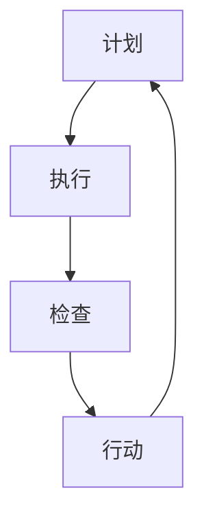
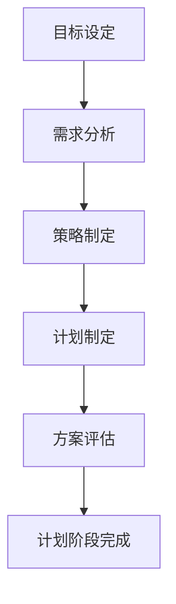
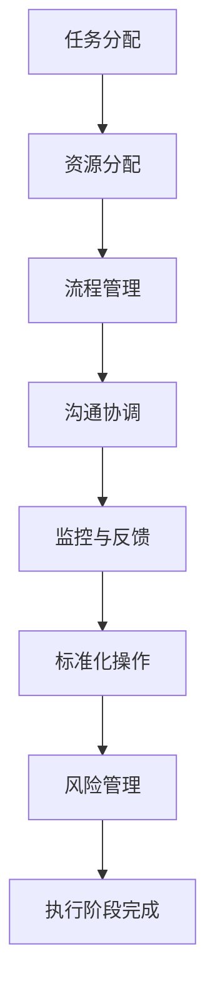
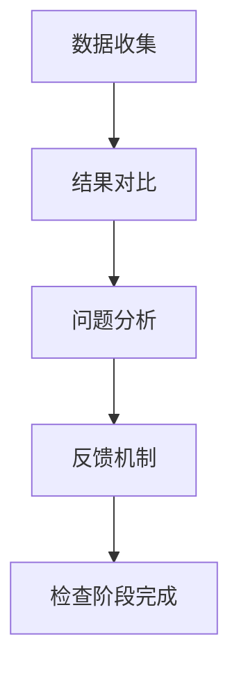
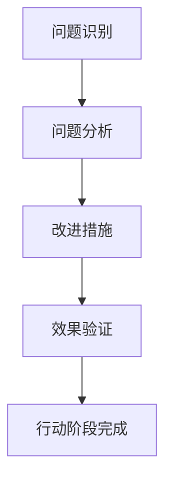
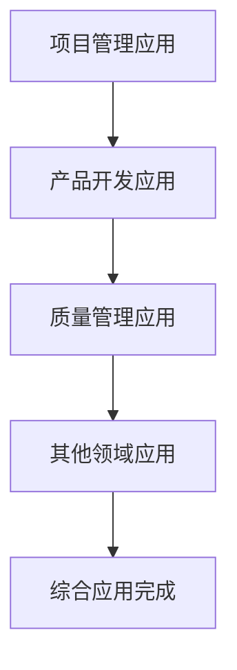

                 

### 文章标题：如何有效执行PDCA循环

> 关键词：PDCA循环，持续改进，项目管理，质量管理，流程优化，实战案例分析

> 摘要：本文旨在详细阐述PDCA循环的基本概念、原理和应用，通过逐步分析每个阶段的核心步骤和关键问题，提供实践中的最佳方法和案例分析，帮助读者更好地理解和应用PDCA循环，实现项目的持续改进。

----------------------------------------------------------------

### 第1章: PDCA循环的基本概念与原理

#### 1.1 PDCA循环的定义与作用

PDCA循环，即计划（Plan）、执行（Do）、检查（Check）和行动（Act）循环，是一种用于持续改进的管理工具。它起源于20世纪初，由美国质量管理专家威廉·爱德华·戴明提出，旨在通过循环迭代的方式，不断优化项目或过程。

#### **定义**：PDCA循环是一种将项目管理或过程改进分解为四个阶段，并在每个阶段进行系统分析和改进的方法。

**作用**：PDCA循环的主要作用是确保工作过程不断改进，达到预期目标，提高工作效率和产品或服务的质量。

#### 1.2 PDCA循环的核心步骤

PDCA循环的核心步骤包括：

- **计划（Plan）**：设定目标、制定策略和计划。
- **执行（Do）**：按照计划执行操作。
- **检查（Check）**：评估执行结果，与目标对比。
- **行动（Act）**：根据检查结果进行调整和优化。

#### 1.3 PDCA循环的流程与关系

PDCA循环是一个循环迭代的过程，每完成一次循环，都会对下一步的执行产生指导作用。各步骤之间相互关联，形成一个闭环系统。

**流程**：计划 -> 执行 -> 检查 -> 行动 -> 回到计划，形成一个循环。

**关系**：各步骤之间相互依赖，前一个步骤的结果直接影响下一个步骤的执行。

#### 1.4 PDCA循环在项目执行中的应用

PDCA循环在项目执行中的应用可以分为以下五个方面：

- **目标设定**：根据项目需求，明确目标。
- **策略制定**：分析现状，制定实施策略。
- **执行操作**：严格按照计划执行。
- **结果评估**：对执行结果进行评估，确定是否符合预期目标。
- **调整优化**：根据评估结果进行改进，重新进入PDCA循环。

#### 1.5 PDCA循环与其他管理工具的关系

PDCA循环可以与六西格玛、ISO质量管理体系等管理工具相结合，发挥更大的作用。例如，六西格玛强调数据驱动决策和过程改进，与PDCA循环的持续改进理念相契合。

#### 1.6 PDCA循环的优势与局限性

**优势**：

- 系统化：PDCA循环将项目或过程改进分解为四个阶段，确保每个环节得到关注。
- 循环迭代：通过不断循环迭代，确保项目或过程的持续改进。
- 易于理解：PDCA循环的结构简单，易于理解和操作。

**局限性**：

- 对复杂项目的应对能力有限：PDCA循环在处理复杂项目时，可能需要与其他管理工具结合使用。
- 需要持续关注：PDCA循环的实施需要持续的关注和投入，否则可能导致效果不佳。

#### 1.7 本章小结

PDCA循环是一种重要的管理工具，通过计划、执行、检查和行动的不断迭代，可以有效地提高项目执行效果。理解PDCA循环的基本概念和原理，对于实际应用至关重要。

### Mermaid 流程图



### 概念联系

PDCA循环是持续改进的核心，贯穿于项目管理的全过程。通过计划、执行、检查和行动的不断迭代，可以确保项目目标的实现，提高项目质量和效率。

---

## 第1章: PDCA循环的基本概念与原理

### 1.1 PDCA循环的定义与作用

#### 1.2 PDCA循环的核心步骤

#### 1.3 PDCA循环的流程与关系

#### 1.4 PDCA循环在项目执行中的应用

#### 1.5 PDCA循环与其他管理工具的关系

#### 1.6 PDCA循环的优势与局限性

#### 1.7 本章小结

### Mermaid流程图

### 概念联系

---

## 第2章: PDCA循环中的计划（Plan）阶段

### 2.1 计划阶段的目标设定

计划阶段的目标设定是PDCA循环的起点，也是整个项目或过程成功的关键。一个明确且具体的目标可以指导后续的执行、检查和行动阶段。

#### **定义**：目标设定是指确定项目要实现的具体成果和预期效果。

**方法**：

1. **SMART原则**：目标应具备SMART特点，即具体（Specific）、可衡量（Measurable）、可实现（Achievable）、相关性（Relevant）和时限性（Time-bound）。
2. **目标分解**：将总体目标分解为可操作的小目标，确保每个小目标都指向总体目标。
3. **利益相关者分析**：了解并分析项目利益相关者的需求和期望，确保目标符合各方利益。

#### 实例

假设一个软件开发项目，目标设定如下：

- **具体**：开发一个功能完善的企业级人力资源管理系统。
- **可衡量**：系统功能覆盖率达到95%，用户满意度评分达到90分。
- **可实现**：项目团队具备相关技术能力，项目周期为6个月。
- **相关性**：该系统将提高企业人力资源管理效率，减少人力资源成本。
- **时限性**：项目计划于2024年1月启动，2024年6月完成。

通过SMART原则，我们可以确保目标具体、可衡量、可实现、相关且有时间限制，从而为后续的执行、检查和行动提供明确的方向。

### 2.2 计划阶段的需求分析

需求分析是计划阶段的重要环节，它旨在了解项目需求，包括功能需求、性能需求和用户需求。

#### **需求分析**：需求分析是指通过调研、访谈和需求文档分析，收集和分析项目需求的过程。

**方法**：

1. **调研**：通过问卷调查、用户访谈、市场调研等方式，收集用户需求和行业趋势。
2. **访谈**：与项目利益相关者进行面对面访谈，了解他们的具体需求和期望。
3. **需求文档分析**：分析现有文档，如产品需求文档、用户手册等，提取关键需求。

#### 实例

以开发企业级人力资源管理系统为例，需求分析可能包括以下内容：

- **功能需求**：包括员工信息管理、招聘流程管理、薪酬管理、绩效评估等功能模块。
- **性能需求**：系统响应时间小于2秒，支持1000名员工同时在线操作。
- **用户需求**：用户界面友好，易于操作，数据安全有保障。

通过需求分析，我们可以确保项目需求全面、具体，为后续的规划和执行提供依据。

### 2.3 计划阶段的策略制定

策略制定是计划阶段的第二步，它旨在根据需求分析的结果，制定实现目标的策略。

#### **策略制定**：策略制定是指根据需求分析的结果，制定实现目标的策略和方案。

**方法**：

1. **系统分析**：分析项目的现状和目标，确定所需资源和步骤。
2. **流程优化**：优化现有流程，提高效率和效果。
3. **资源配置**：合理分配项目所需的人力、物力和财力资源。

#### 实例

以开发企业级人力资源管理系统为例，策略制定可能包括以下内容：

- **系统分析**：确定系统开发的关键模块和功能，分析技术可行性。
- **流程优化**：优化招聘流程，提高招聘效率和员工满意度。
- **资源配置**：组建专业团队，确保每个成员的职责明确，资源充足。

通过策略制定，我们可以确保项目规划的科学性和可行性，为后续的执行阶段奠定基础。

### 2.4 计划阶段的计划制定

计划制定是将策略具体化为详细计划的过程，它包括项目的实施步骤、时间表和资源分配。

#### **计划制定**：计划制定是指将策略具体化为详细计划的过程，明确项目的实施步骤、时间表和资源分配。

**方法**：

1. **项目分解**：将项目分解为可管理的任务，明确每个任务的负责人和完成时间。
2. **时间表制定**：制定项目的时间表，确保每个任务按时完成。
3. **资源分配**：合理分配项目所需的人力、物力和财力资源。

#### 实例

以开发企业级人力资源管理系统为例，计划制定可能包括以下内容：

- **项目分解**：将系统开发分解为需求分析、系统设计、编码、测试等多个子任务。
- **时间表制定**：制定每个子任务的时间表，确保项目在规定时间内完成。
- **资源分配**：确保每个团队成员都有明确的职责，并分配足够的资源。

通过计划制定，我们可以确保项目的有序进行，为后续的执行提供明确的指导。

### 2.5 计划阶段的方案评估

方案评估是计划阶段的重要环节，它旨在评估不同的计划方案，选择最优方案。

#### **方案评估**：方案评估是指评估不同的计划方案，选择最优方案的过程。

**方法**：

1. **成本效益分析**：评估不同方案的投入产出比，选择成本效益最高的方案。
2. **风险评估**：评估不同方案的风险，选择风险较低的方案。
3. **可行性分析**：评估不同方案的可行性，选择最可行的方案。

#### 实例

以开发企业级人力资源管理系统为例，方案评估可能包括以下内容：

- **成本效益分析**：比较不同方案的开发成本和预期收益，选择成本效益最高的方案。
- **风险评估**：评估不同方案的技术风险、市场风险等，选择风险较低的方案。
- **可行性分析**：评估不同方案的技术可行性、市场可行性等，选择最可行的方案。

通过方案评估，我们可以确保项目选择最优方案，为后续的执行和检查提供依据。

### 2.6 计划阶段的关键步骤总结

计划阶段的关键步骤包括：

1. **目标设定**：明确项目目标，确保具体、可衡量、可实现、相关和时限。
2. **需求分析**：了解项目需求，包括功能需求、性能需求和用户需求。
3. **策略制定**：根据需求分析，制定实现目标的策略和方案。
4. **计划制定**：将策略具体化为详细计划，明确项目的实施步骤、时间表和资源分配。
5. **方案评估**：评估不同的计划方案，选择最优方案。

通过这些关键步骤，我们可以确保项目规划的科学性和可行性，为后续的执行阶段奠定基础。

### 2.7 计划阶段的重要性

计划阶段是PDCA循环的起点，也是整个项目成功的关键。它不仅为后续的执行、检查和行动提供明确的指导，还能确保项目目标的实现。一个良好的计划可以减少项目风险，提高项目效率，确保项目在规定时间内完成。

### 2.8 本章小结

计划阶段是PDCA循环的核心，通过明确的目标设定、需求分析、策略制定、计划制定和方案评估，确保项目规划的科学性和可行性。理解并掌握计划阶段的关键步骤和方法，对于项目成功至关重要。

### 伪代码

```python
def plan_stage():
    # 目标设定
    set_goals()
    # 需求分析
    analyze_requirements()
    # 策略制定
    develop_strategies()
    # 计划制定
    create_plan()
    # 方案评估
    evaluate_schemes()
```

### Mermaid 流程图



### 概念联系

计划阶段是PDCA循环的核心，通过系统化的方法，确保项目目标的实现。明确的目标设定、详细的需求分析、科学的策略制定、合理的计划制定和全面的方案评估，共同构成了计划阶段的关键要素。这些要素相互关联，共同推动了项目从概念到实施的转变。

---

## 第2章: PDCA循环中的计划（Plan）阶段

### 2.1 计划阶段的目标设定

### 2.2 计划阶段的需求分析

### 2.3 计划阶段的策略制定

### 2.4 计划阶段的计划制定

### 2.5 计划阶段的方案评估

### 2.6 计划阶段的关键步骤总结

### 2.7 计划阶段的重要性

### 2.8 本章小结

### 伪代码

### Mermaid流程图

### 概念联系

---

## 第3章: PDCA循环中的执行（Do）阶段

### 3.1 执行阶段的关键任务

执行阶段是PDCA循环中最为重要的环节之一，它将计划阶段制定的具体计划付诸实践。在这个阶段，项目团队需要确保每个任务按照既定的时间表和质量标准完成，从而实现项目的目标。

#### **定义**：执行阶段是指按照计划执行操作，确保项目任务按期完成的过程。

**关键任务**：

1. **任务分配**：将项目任务分配给团队成员，确保每个任务都有明确的负责人。
2. **资源分配**：确保项目所需的人力、物力和财力资源得到合理配置，以支持任务的完成。
3. **流程管理**：确保项目执行过程中的每个步骤都按照计划进行，避免出现偏差。
4. **沟通协调**：保持团队成员之间的信息畅通，确保问题能够及时得到解决。
5. **监控与反馈**：实时监控项目进度，及时反馈问题，确保项目能够按计划顺利进行。

#### **实例**：

以开发企业级人力资源管理系统为例，执行阶段的关键任务可能包括：

- **任务分配**：项目经理将系统开发任务分配给开发人员、测试人员等。
- **资源分配**：确保开发人员有足够的设备和技术支持，测试人员有充分的测试环境。
- **流程管理**：制定详细的开发流程，确保每个开发阶段都有明确的交付物和验收标准。
- **沟通协调**：建立项目沟通机制，定期召开会议，讨论项目进展和问题。
- **监控与反馈**：项目经理定期检查项目进度，测试人员及时反馈测试结果，开发人员根据反馈进行修正。

通过这些关键任务，项目团队可以确保项目在执行阶段顺利进行，为后续的检查和行动阶段打下坚实的基础。

### 3.2 执行阶段的流程管理

在执行阶段，流程管理是确保项目任务按时、按质量完成的关键。一个有效的流程管理可以保证项目执行的效率和效果。

#### **定义**：流程管理是指确保项目执行过程中的每个步骤都按照计划进行的管理活动。

**流程管理的关键要素**：

1. **流程设计**：设计清晰、简洁且高效的流程，确保每个任务都有明确的执行路径。
2. **流程执行**：按照设计的流程执行任务，确保每个步骤都得到执行。
3. **流程监控**：实时监控流程执行情况，及时发现和解决问题。
4. **流程优化**：根据流程执行情况，不断优化流程，提高效率和效果。

#### **实例**：

以开发企业级人力资源管理系统为例，流程管理可能包括以下步骤：

- **流程设计**：项目团队设计详细的开发流程，包括需求分析、系统设计、编码、测试等阶段。
- **流程执行**：每个阶段都有明确的交付物和验收标准，确保每个任务都按照计划进行。
- **流程监控**：项目经理定期检查项目进度，确保每个任务都在规定时间内完成。
- **流程优化**：根据项目进展情况，不断优化流程，提高开发效率和产品质量。

通过有效的流程管理，项目团队可以确保项目在执行阶段的顺利进行，提高项目的完成质量和效率。

### 3.3 执行阶段的沟通协调

在执行阶段，沟通协调是确保项目顺利进行的重要保障。一个良好的沟通协调机制可以确保信息畅通，问题得到及时解决。

#### **定义**：沟通协调是指在项目执行过程中，保持团队成员之间的信息畅通，确保问题能够及时得到解决的管理活动。

**沟通协调的关键要素**：

1. **沟通机制**：建立有效的沟通机制，确保信息能够及时传达。
2. **沟通内容**：明确沟通内容，确保每个团队成员都知道自己的职责和任务。
3. **沟通方式**：选择合适的沟通方式，如会议、邮件、即时通讯等，确保沟通效果。
4. **问题解决**：建立问题解决机制，确保问题能够及时得到解决。

#### **实例**：

以开发企业级人力资源管理系统为例，沟通协调可能包括以下内容：

- **沟通机制**：项目团队定期召开项目会议，讨论项目进展和问题。
- **沟通内容**：明确每个阶段的工作内容、时间表和验收标准。
- **沟通方式**：使用邮件和即时通讯工具，确保项目信息的及时传递。
- **问题解决**：项目经理及时收集和解决团队成员的问题，确保项目顺利进行。

通过有效的沟通协调，项目团队可以确保项目在执行阶段的顺利进行，提高项目的完成质量和效率。

### 3.4 执行阶段的监控与反馈

在执行阶段，监控与反馈是确保项目质量和进度的重要手段。一个有效的监控与反馈机制可以及时发现和解决问题，确保项目按计划进行。

#### **定义**：监控与反馈是指在项目执行过程中，对项目进度、质量和成本等方面进行实时监控，并收集和分析执行过程中的反馈信息。

**监控与反馈的关键要素**：

1. **监控指标**：制定明确的监控指标，如进度百分比、缺陷率、成本等，确保项目关键指标的实时监控。
2. **反馈机制**：建立有效的反馈机制，确保项目进展和问题能够及时反馈到决策层。
3. **数据收集**：收集项目执行过程中的数据，如进度报告、缺陷报告等，用于监控和分析。
4. **分析评估**：根据收集的数据，分析项目的执行情况，评估项目进度和质量。

#### **实例**：

以开发企业级人力资源管理系统为例，监控与反馈可能包括以下内容：

- **监控指标**：监控项目的进度百分比、缺陷率、成本等关键指标。
- **反馈机制**：项目团队定期提交进度报告，测试团队提交缺陷报告。
- **数据收集**：项目管理人员收集和分析进度报告和缺陷报告。
- **分析评估**：根据分析结果，项目团队及时调整计划和策略，确保项目按计划进行。

通过有效的监控与反馈，项目团队可以确保项目在执行阶段的顺利进行，及时发现和解决问题，提高项目的完成质量和效率。

### 3.5 执行阶段的标准化操作

在执行阶段，标准化操作是确保项目执行一致性和高效性的重要手段。一个完善的标准化操作规范可以减少错误，提高执行效率。

#### **定义**：标准化操作是指在项目执行过程中，制定明确的操作规范，确保每个团队成员都按照统一的标准执行任务。

**标准化操作的关键要素**：

1. **操作规范**：制定详细的操作规范，包括每个任务的执行步骤、所需资源和时间等。
2. **培训**：对团队成员进行培训，确保他们熟悉操作规范。
3. **执行**：按照操作规范执行任务，确保执行的一致性和高效性。
4. **监督**：对执行过程进行监督，确保操作规范的遵循。

#### **实例**：

以开发企业级人力资源管理系统为例，标准化操作可能包括以下内容：

- **操作规范**：详细说明每个开发任务的执行步骤、所需的工具和技术等。
- **培训**：对开发人员进行系统化的培训，确保他们熟悉操作规范。
- **执行**：开发人员按照操作规范执行开发任务，确保代码质量。
- **监督**：项目经理定期检查开发过程，确保操作规范的遵循。

通过有效的标准化操作，项目团队可以确保项目在执行阶段的顺利进行，提高项目的完成质量和效率。

### 3.6 执行阶段的风险管理

在执行阶段，风险管理是确保项目顺利进行的重要手段。一个有效的风险管理计划可以减少项目风险，提高项目成功率。

#### **定义**：风险管理是指在项目执行过程中，识别、评估和应对潜在风险的系统化过程。

**风险管理的关键要素**：

1. **风险识别**：识别项目执行过程中可能遇到的风险，包括技术风险、市场风险、人力资源风险等。
2. **风险评估**：评估识别出的风险的影响程度和发生概率，确定风险等级。
3. **风险应对**：制定应对策略，降低风险的发生概率和影响程度。
4. **风险监控**：实时监控项目执行过程中的风险变化，及时调整应对策略。

#### **实例**：

以开发企业级人力资源管理系统为例，风险管理可能包括以下内容：

- **风险识别**：识别可能的技术风险，如系统稳定性、安全性等。
- **风险评估**：评估技术风险的影响程度和发生概率，确定风险等级。
- **风险应对**：制定技术风险应对策略，如增加测试、优化代码等。
- **风险监控**：实时监控项目执行过程中的技术风险变化，及时调整应对策略。

通过有效的风险管理，项目团队可以确保项目在执行阶段的顺利进行，降低项目风险，提高项目成功率。

### 3.7 执行阶段的关键步骤总结

执行阶段的关键步骤包括：

1. **任务分配**：明确每个团队成员的任务和职责。
2. **资源分配**：确保项目所需的资源得到合理配置。
3. **流程管理**：确保项目执行过程中的每个步骤都按照计划进行。
4. **沟通协调**：确保团队成员之间的信息畅通，及时传达项目进展和问题。
5. **监控与反馈**：对项目进度、质量、成本等方面进行实时监控，收集和分析执行过程中的反馈信息。
6. **标准化操作**：制定标准操作流程，确保执行的一致性和高效性。
7. **风险管理**：识别和评估项目中的潜在风险，制定风险应对策略。

通过这些关键步骤，项目团队可以确保执行阶段的顺利进行，为项目的成功奠定基础。

### 3.8 执行阶段的重要性

执行阶段是PDCA循环中的核心环节，它将计划阶段制定的策略付诸实践。一个成功的执行阶段可以确保项目目标的实现，提高项目质量，降低项目风险。因此，执行阶段的重要性不容忽视。

### 3.9 本章小结

执行阶段是PDCA循环中的关键环节，通过明确的任务分配、资源分配、流程管理、沟通协调、监控与反馈、标准化操作和风险管理，确保项目任务按时、按质量完成。理解并掌握执行阶段的关键步骤和策略，对于项目成功至关重要。

### 伪代码

```python
def execute_stage(plan):
    # 分配任务
    assign_tasks()
    # 分配资源
    allocate_resources()
    # 管理流程
    manage_processes(plan)
    # 沟通协调
    communicate_and协调()
    # 监控与反馈
    monitor_and_feedback()
    # 标准化操作
    standardize_operations()
    # 风险管理
    manage_risks()
```

### Mermaid 流程图



### 概念联系

执行阶段是PDCA循环的核心，通过计划、执行、检查和行动的不断迭代，确保项目目标的实现。理解执行阶段的关键任务和步骤，掌握沟通协调、监控与反馈、标准化操作和风险管理的方法，对于项目成功至关重要。

---

## 第3章: PDCA循环中的执行（Do）阶段

### 3.1 执行阶段的关键任务

### 3.2 执行阶段的流程管理

### 3.3 执行阶段的沟通协调

### 3.4 执行阶段的监控与反馈

### 3.5 执行阶段的标准化操作

### 3.6 执行阶段的风险管理

### 3.7 执行阶段的关键步骤总结

### 3.8 执行阶段的重要性

### 3.9 本章小结

### 伪代码

### Mermaid流程图

### 概念联系

---

## 第4章: PDCA循环中的检查（Check）阶段

### 4.1 检查阶段的目标

检查阶段是PDCA循环中的关键环节，其核心目标是通过评估执行结果，确保项目目标的实现。这一阶段的主要任务是对执行过程中产生的数据进行收集和分析，以便识别偏差和问题，为后续的行动阶段提供依据。

#### **定义**：检查阶段的目标是评估执行结果，确保项目或过程的质量和效果符合预期目标。

**关键目标**：

1. **评估执行效果**：对项目执行过程中的结果进行系统性评估，确保符合计划设定的目标和标准。
2. **识别偏差**：分析执行结果与预期目标的偏差，找出可能的原因。
3. **问题定位**：确定项目执行过程中出现的问题和瓶颈，为改进提供方向。

#### **实例**：

假设我们正在开发一款在线教育平台，检查阶段的目标可能包括：

- **评估执行效果**：检查平台的功能是否按照设计要求正常工作，用户界面是否友好。
- **识别偏差**：分析用户反馈，识别系统性能的瓶颈，如响应速度、数据加载时间等。
- **问题定位**：确定平台在特定功能模块中存在的问题，例如课程视频播放不稳定。

通过明确检查阶段的目标，项目团队可以确保对项目执行情况有全面的了解，及时发现和解决问题，从而提高项目成功率。

### 4.2 检查阶段的关键步骤

为了实现检查阶段的目标，需要执行一系列关键步骤。这些步骤包括：

1. **数据收集**：收集项目执行过程中产生的各种数据，如任务进度、质量指标、用户反馈等。
2. **结果对比**：将收集到的数据与计划阶段设定的目标和标准进行对比，分析偏差和问题。
3. **问题分析**：对识别出的问题进行深入分析，找出根本原因。
4. **反馈机制**：建立有效的反馈机制，将分析结果及时传达给项目相关方。

#### **实例**：

以开发在线教育平台为例，检查阶段的关键步骤可能包括：

- **数据收集**：收集系统性能数据，如服务器响应时间、用户访问量等。
- **结果对比**：将收集到的数据与预设的性能指标进行对比，分析系统的性能是否达标。
- **问题分析**：通过用户反馈和系统日志，分析系统性能不达标的原因，如代码缺陷或服务器负载过重。
- **反馈机制**：将分析结果及时反馈给开发团队和产品经理，以便制定改进措施。

通过这些关键步骤，项目团队可以确保对项目执行情况进行全面评估，及时发现和解决问题。

### 4.3 检查阶段的工具与方法

在检查阶段，使用合适的工具和方法可以更有效地评估执行结果和识别问题。以下是一些常用的工具和方法：

1. **统计工具**：如Excel、R等，用于数据分析和可视化。
2. **质量检测工具**：如Jenkins、SonarQube等，用于代码质量检测和自动化测试。
3. **流程图工具**：如Mermaid、Visio等，用于流程分析和可视化。
4. **反馈系统**：如Jira、Trello等，用于问题跟踪和反馈管理。

#### **实例**：

假设我们使用Jenkins作为持续集成工具，检查阶段的方法可能包括：

- **统计工具**：使用Excel分析Jenkins生成的测试报告，识别测试失败的案例。
- **质量检测工具**：使用SonarQube检查代码质量，找出潜在的缺陷和问题。
- **流程图工具**：使用Mermaid绘制项目执行流程图，分析流程中的瓶颈。
- **反馈系统**：使用Jira记录和分析用户反馈，识别系统性能问题和用户体验问题。

通过这些工具和方法，项目团队可以更全面、系统地评估项目执行情况，确保问题得到及时解决。

### 4.4 检查阶段的反馈机制

检查阶段的反馈机制是确保问题得到及时解决的重要手段。一个有效的反馈机制可以确保项目相关方及时了解项目执行情况，并采取相应的改进措施。

#### **定义**：反馈机制是指在项目执行过程中，将评估结果和发现的问题及时传达给项目相关方，并制定改进计划的系统化过程。

**反馈机制的关键要素**：

1. **及时反馈**：确保评估结果和问题能够及时传达给项目相关方，避免信息滞后。
2. **透明度**：确保反馈过程公开透明，项目相关方能够清晰地了解项目执行情况。
3. **反馈渠道**：建立多种反馈渠道，如定期会议、报告、邮件等，确保信息畅通。
4. **改进计划**：根据反馈结果，制定详细的改进计划，确保问题得到有效解决。

#### **实例**：

以开发在线教育平台为例，反馈机制可能包括：

- **及时反馈**：项目经理定期组织会议，向团队成员和产品经理汇报项目进展和问题。
- **透明度**：在项目开发平台（如Jira）上公开问题跟踪和解决进展，确保团队成员和利益相关方都能查看。
- **反馈渠道**：通过邮件、即时通讯工具（如Slack）和项目开发平台，确保团队成员和利益相关方能够及时反馈问题。
- **改进计划**：根据反馈结果，制定详细的改进计划，包括问题的解决时间表和责任人，确保问题得到及时解决。

通过有效的反馈机制，项目团队可以确保项目在执行过程中的问题得到及时解决，提高项目成功率。

### 4.5 检查阶段的关键问题

在检查阶段，可能会遇到一系列关键问题，这些问题可能影响项目的进展和质量。以下是一些常见的关键问题：

1. **数据不准确**：由于数据收集方法不当或数据源不稳定，导致数据不准确，影响评估结果。
2. **偏差分析不准确**：由于对偏差分析的方法不当或数据不足，导致偏差分析不准确，无法找出问题的根本原因。
3. **反馈不及时**：由于反馈机制不完善，导致评估结果和问题反馈不及时，影响后续改进措施的制定和执行。

#### **实例**：

假设我们在检查在线教育平台的性能时，遇到以下关键问题：

- **数据不准确**：由于服务器日志记录不完整，导致性能数据不准确，影响对系统性能的评估。
- **偏差分析不准确**：由于缺乏用户反馈数据，导致对系统性能偏差的分析不准确，无法找出性能瓶颈。
- **反馈不及时**：由于项目经理和开发团队之间的沟通不畅，导致评估结果和问题反馈不及时，影响问题的及时解决。

通过识别和解决这些关键问题，项目团队可以确保检查阶段的有效性，提高项目执行的质量。

### 4.6 检查阶段的重要性

检查阶段在PDCA循环中扮演着关键角色，其重要性体现在以下几个方面：

1. **确保项目目标实现**：通过评估执行结果，确保项目目标得到实现，确保项目质量。
2. **发现问题**：通过检查阶段，可以及时发现项目执行过程中的问题和偏差，为后续的改进提供依据。
3. **持续改进**：检查阶段是持续改进的重要环节，通过不断评估和反馈，确保项目持续改进，提高项目成功率。

#### **实例**：

以开发在线教育平台为例，检查阶段的重要性体现在：

- **确保项目目标实现**：通过定期检查系统性能和用户反馈，确保平台的功能和性能符合预期目标。
- **发现问题**：通过检查阶段，发现系统在某些功能模块上存在性能瓶颈，影响用户体验。
- **持续改进**：根据检查阶段的结果，制定和实施改进计划，优化系统性能和用户体验，提高用户满意度。

通过检查阶段的有效执行，项目团队可以确保项目在执行过程中不断改进，实现项目目标。

### 4.7 本章小结

检查阶段是PDCA循环中的关键环节，通过评估执行结果、识别问题和持续改进，确保项目目标的实现。理解并掌握检查阶段的关键步骤、工具与方法，以及关键问题，对于项目成功至关重要。

### 伪代码

```python
def check_stage(execution_results, plan):
    # 数据收集
    collect_data(execution_results)
    # 结果对比
    compare_results(execution_results, plan)
    # 问题分析
    analyze_issues(execution_results)
    # 反馈机制
    provide_feedback(execution_results)
```

### Mermaid 流程图



### 概念联系

检查阶段是PDCA循环的核心，通过系统化的数据收集、结果对比、问题分析和反馈机制，确保项目执行结果的准确性和有效性。理解并掌握检查阶段的关键步骤和方法，对于项目成功至关重要。

---

## 第4章: PDCA循环中的检查（Check）阶段

### 4.1 检查阶段的目标

### 4.2 检查阶段的关键步骤

### 4.3 检查阶段的工具与方法

### 4.4 检查阶段的反馈机制

### 4.5 检查阶段的关键问题

### 4.6 检查阶段的重要性

### 4.7 本章小结

### 伪代码

### Mermaid流程图

### 概念联系

---

## 第5章: PDCA循环中的行动（Act）阶段

### 5.1 行动阶段的目标

行动阶段是PDCA循环中的最后一个阶段，其核心目标是根据检查阶段的结果，对项目或过程进行调整和改进。通过实施有效的改进措施，确保项目或过程达到预期的质量水平和效率。

#### **定义**：行动阶段的目标是根据检查阶段的结果，制定和实施改进措施，以实现项目或过程的优化。

**关键目标**：

1. **问题解决**：针对检查阶段发现的问题，制定解决方案，并确保问题得到有效解决。
2. **持续改进**：通过改进措施的实施，提高项目或过程的效率和质量，实现持续改进。
3. **预防措施**：基于检查阶段的分析结果，制定预防措施，防止类似问题再次发生。

#### **实例**：

假设我们正在开发一款电子商务网站，行动阶段的目标可能包括：

- **问题解决**：解决用户反馈中的购物车崩溃问题，确保用户购物体验。
- **持续改进**：优化网站性能，提高页面加载速度，减少用户等待时间。
- **预防措施**：增加代码审查环节，确保新功能上线前经过充分测试，避免类似问题再次发生。

通过明确行动阶段的目标，项目团队可以确保在检查阶段识别的问题得到有效解决，并防止问题的再次发生。

### 5.2 行动阶段的关键步骤

为了实现行动阶段的目标，需要执行一系列关键步骤。这些步骤包括：

1. **问题识别**：根据检查阶段的结果，识别需要解决的问题和改进的机会。
2. **原因分析**：对识别出的问题进行深入分析，找出问题的根本原因。
3. **改进措施制定**：基于原因分析，制定具体的改进措施，确保问题得到有效解决。
4. **实施改进措施**：执行制定的改进措施，确保改进方案得到有效实施。
5. **效果验证**：验证改进措施的实施效果，确保问题得到解决，并实现持续改进。

#### **实例**：

以电子商务网站为例，行动阶段的关键步骤可能包括：

- **问题识别**：通过用户反馈和性能监控工具，识别出购物车崩溃、页面加载缓慢等问题。
- **原因分析**：分析购物车崩溃的原因，发现是数据库连接不稳定，导致处理时间过长。
- **改进措施制定**：制定改进措施，如优化数据库查询、增加缓存等，确保问题得到解决。
- **实施改进措施**：实施优化方案，确保新功能上线前经过充分测试。
- **效果验证**：通过性能测试和用户反馈，验证改进措施的效果，确保购物车崩溃问题得到解决。

通过这些关键步骤，项目团队可以确保问题得到有效解决，并实现项目或过程的持续改进。

### 5.3 行动阶段的工具与方法

在行动阶段，使用合适的工具和方法可以更有效地制定和实施改进措施。以下是一些常用的工具和方法：

1. **问题解决工具**：如因果图、鱼骨图等，用于分析问题的根本原因。
2. **改进计划工具**：如甘特图、时间线图等，用于制定和跟踪改进计划。
3. **执行工具**：如项目管理软件、任务管理工具等，用于执行和监控改进措施。
4. **效果评估工具**：如性能测试工具、用户反馈收集工具等，用于验证改进措施的实施效果。

#### **实例**：

假设我们使用Jira作为项目管理工具，行动阶段的方法可能包括：

- **问题解决工具**：使用因果图分析购物车崩溃问题的根本原因。
- **改进计划工具**：使用甘特图制定优化方案的执行时间表。
- **执行工具**：在Jira中创建任务，分配给相关团队成员执行。
- **效果评估工具**：使用性能测试工具验证优化方案的效果，收集用户反馈。

通过这些工具和方法，项目团队可以确保改进措施得到有效实施，并实现持续改进。

### 5.4 行动阶段的反馈机制

行动阶段的反馈机制是确保改进措施得到有效执行和持续改进的重要手段。一个有效的反馈机制可以确保项目相关方及时了解改进措施的实施情况，并采取相应的措施。

#### **定义**：反馈机制是指在项目执行过程中，将改进措施的实施情况及时传达给项目相关方，并收集反馈信息的系统化过程。

**反馈机制的关键要素**：

1. **及时反馈**：确保改进措施的实施情况能够及时传达给项目相关方，避免信息滞后。
2. **透明度**：确保反馈过程公开透明，项目相关方能够清晰地了解改进措施的实施情况。
3. **反馈渠道**：建立多种反馈渠道，如定期会议、报告、邮件等，确保信息畅通。
4. **改进跟踪**：根据反馈结果，及时调整和优化改进措施，确保问题得到有效解决。

#### **实例**：

以电子商务网站为例，反馈机制可能包括：

- **及时反馈**：项目经理定期组织会议，向团队成员和产品经理汇报优化方案的实施进展。
- **透明度**：在项目开发平台（如Jira）上公开优化方案的实施进展和用户反馈。
- **反馈渠道**：通过邮件、即时通讯工具（如Slack）和项目开发平台，确保团队成员和利益相关方能够及时反馈问题。
- **改进跟踪**：根据用户反馈和性能测试结果，及时调整和优化优化方案。

通过有效的反馈机制，项目团队可以确保改进措施得到有效执行，并实现持续改进。

### 5.5 行动阶段的关键问题

在行动阶段，可能会遇到一系列关键问题，这些问题可能影响改进措施的实施效果。以下是一些常见的关键问题：

1. **改进措施不当**：由于原因分析不准确或措施制定不合理，导致改进措施不当，无法解决问题。
2. **执行不到位**：由于团队成员执行不到位，导致改进措施无法得到有效实施。
3. **效果评估不准确**：由于效果评估方法不当或数据收集不全面，导致效果评估不准确，无法确定改进措施的有效性。

#### **实例**：

假设我们在优化电子商务网站的购物车功能时，遇到以下关键问题：

- **改进措施不当**：由于对购物车崩溃问题的原因分析不准确，制定的优化方案无法解决问题。
- **执行不到位**：开发团队在实施优化方案时，存在执行不到位的问题，导致优化效果不理想。
- **效果评估不准确**：由于缺乏全面的性能测试数据和用户反馈，导致优化效果评估不准确，无法确定优化方案的有效性。

通过识别和解决这些关键问题，项目团队可以确保行动阶段的有效性，提高改进措施的实施效果。

### 5.6 行动阶段的重要性

行动阶段是PDCA循环中的关键环节，其重要性体现在以下几个方面：

1. **解决问题**：通过行动阶段，可以针对检查阶段发现的问题，制定和实施改进措施，确保问题得到有效解决。
2. **持续改进**：行动阶段是实现项目或过程持续改进的重要环节，通过不断优化和改进，提高项目质量。
3. **预防问题**：通过原因分析和改进措施制定，可以预防类似问题再次发生，提高项目稳定性。

#### **实例**：

以电子商务网站为例，行动阶段的重要性体现在：

- **解决问题**：通过优化购物车功能，解决了用户反馈中的购物车崩溃问题，提高了用户体验。
- **持续改进**：通过不断优化网站性能和用户体验，实现了项目的持续改进，提高了用户满意度。
- **预防问题**：通过优化方案的实施和效果验证，预防了类似问题的再次发生，提高了项目的稳定性。

通过行动阶段的有效执行，项目团队可以确保项目在执行过程中不断改进，实现项目目标。

### 5.7 本章小结

行动阶段是PDCA循环中的关键环节，通过制定和实施改进措施，确保项目或过程的优化。理解并掌握行动阶段的关键步骤、工具与方法，以及关键问题，对于项目成功至关重要。

### 伪代码

```python
def act_stage(issues, feedback):
    # 问题识别
    identify_issues()
    # 问题分析
    analyze_issues(issues)
    # 改进措施
    implement_improvements()
    # 效果验证
    verify_effects()
```

### Mermaid 流程图



### 概念联系

行动阶段是PDCA循环的最终环节，通过问题识别、问题分析、改进措施制定和效果验证，确保项目或过程的优化。理解并掌握行动阶段的关键步骤和方法，对于项目成功至关重要。

---

## 第5章: PDCA循环中的行动（Act）阶段

### 5.1 行动阶段的目标

### 5.2 行动阶段的关键步骤

### 5.3 行动阶段的工具与方法

### 5.4 行动阶段的反馈机制

### 5.5 行动阶段的关键问题

### 5.6 行动阶段的重要性

### 5.7 本章小结

### 伪代码

### Mermaid流程图

### 概念联系

---

## 第6章: PDCA循环的综合应用

### 6.1 PDCA循环在项目管理中的应用

#### **定义**：PDCA循环在项目管理中的应用是指通过计划、执行、检查和行动的不断迭代，确保项目目标的实现，提高项目效率和质量。

**应用步骤**：

1. **项目启动**：在项目启动阶段，使用PDCA循环制定项目计划，明确项目目标、范围、资源和时间表。
2. **项目执行**：在项目执行阶段，按照PDCA循环执行计划，确保项目按计划进行，及时发现问题并调整。
3. **项目监控**：在项目监控阶段，使用PDCA循环定期检查项目进度、质量和成本，确保项目在轨道上运行。
4. **项目收尾**：在项目收尾阶段，使用PDCA循环总结项目经验，制定改进计划，为未来的项目提供参考。

**案例**：

某公司正在开发一款新的企业管理软件，他们使用PDCA循环进行项目管理。首先，他们在项目启动阶段制定了详细的项目计划，包括功能需求、技术路线和时间表。在项目执行阶段，他们严格按照计划进行，定期召开项目会议，检查项目进度和质量。在项目监控阶段，他们使用项目管理系统实时监控项目进度，及时发现和解决问题。在项目收尾阶段，他们总结了项目经验，制定了改进计划，为下一个项目提供了宝贵的经验。

### 6.2 PDCA循环在产品开发中的应用

#### **定义**：PDCA循环在产品开发中的应用是指通过计划、执行、检查和行动的不断迭代，确保产品从概念到市场推出的全过程符合预期，提高产品质量和市场竞争力。

**应用步骤**：

1. **需求分析**：在需求分析阶段，使用PDCA循环收集和分析用户需求，确保产品满足用户需求。
2. **产品设计**：在产品设计阶段，使用PDCA循环制定产品方案，进行设计评审，确保产品设计合理。
3. **开发执行**：在开发执行阶段，使用PDCA循环按照设计要求进行编码和测试，确保产品功能实现。
4. **测试验证**：在测试验证阶段，使用PDCA循环进行系统测试和用户测试，确保产品质量。
5. **产品发布**：在产品发布阶段，使用PDCA循环准备产品发布，收集用户反馈，为下一轮改进提供依据。

**案例**：

一家科技公司正在开发一款智能家居控制系统，他们使用PDCA循环进行产品开发。首先，他们在需求分析阶段，通过用户调研和访谈收集用户需求，确保产品满足用户期望。接着，他们在产品设计阶段，制定了详细的产品方案，并进行了设计评审，确保产品设计合理。在开发执行阶段，他们按照设计要求进行编码和测试，确保产品功能实现。在测试验证阶段，他们对产品进行了系统测试和用户测试，确保产品质量。最后，在产品发布阶段，他们发布了产品，并收集用户反馈，为下一轮改进提供依据。

### 6.3 PDCA循环在质量管理中的应用

#### **定义**：PDCA循环在质量管理中的应用是指通过计划、执行、检查和行动的不断迭代，确保产品或服务的质量持续改进，满足用户需求。

**应用步骤**：

1. **质量规划**：在质量规划阶段，使用PDCA循环制定质量目标和质量标准，确保项目或过程的质量要求得到满足。
2. **质量控制**：在质量控制阶段，使用PDCA循环执行质量标准，监控项目或过程的质量，确保质量要求得到满足。
3. **质量检查**：在质量检查阶段，使用PDCA循环检查项目或过程的质量，识别不合格项，并采取措施纠正。
4. **质量改进**：在质量改进阶段，使用PDCA循环分析质量问题的原因，制定和实施改进措施，提高质量。

**案例**：

某制造企业正在实施质量管理体系，他们使用PDCA循环进行质量管理。首先，他们在质量规划阶段，制定了质量目标和质量标准，明确了项目或过程的质量要求。接着，他们在质量控制阶段，按照质量标准进行监控，确保质量要求得到满足。在质量检查阶段，他们对项目或过程进行了检查，识别了不合格项，并采取了纠正措施。最后，在质量改进阶段，他们分析了质量问题的原因，制定了改进措施，并实施了这些措施，提高了整体质量水平。

### 6.4 PDCA循环在其他领域的应用

#### **定义**：PDCA循环在其他领域的应用是指将PDCA循环的理念和方法应用于非传统领域，如人力资源管理、市场营销等，以实现持续改进和优化。

**应用领域**：

1. **人力资源管理**：通过PDCA循环进行员工招聘、培训和发展，确保人力资源管理效率。
2. **市场营销**：通过PDCA循环进行市场调研、产品推广和用户反馈收集，优化市场营销策略。
3. **供应链管理**：通过PDCA循环进行供应链优化、库存管理和物流调度，提高供应链效率。

**案例**：

一家零售企业正在使用PDCA循环进行供应链管理优化。首先，他们在计划阶段，分析了供应链现状和存在的问题，制定了优化计划。接着，他们在执行阶段，按照计划进行库存管理和物流调度，确保供应链的顺畅。在检查阶段，他们定期检查供应链的运行情况，识别问题和不足。最后，在行动阶段，他们根据检查结果，制定了改进措施，并实施了这些措施，提高了供应链的整体效率。

### 6.5 PDCA循环的优势与挑战

**优势**：

- **系统化**：PDCA循环将管理过程分解为四个阶段，确保每个环节都得到关注，实现系统化管理。
- **灵活性强**：PDCA循环可以根据实际情况进行调整和优化，适用于不同类型的项目和过程。
- **易于实施**：PDCA循环的结构简单，易于理解和操作，适合不同层次的管理者和团队。

**挑战**：

- **实施难度**：在复杂项目中，PDCA循环的实施难度较大，需要较强的管理能力和团队协作。
- **数据依赖**：PDCA循环的执行效果很大程度上依赖于数据，数据不准确或不全面可能导致错误决策。
- **持续改进**：持续改进需要长期的努力和投入，项目团队需要具备持续改进的意识和方法。

### 6.6 本章小结

PDCA循环作为一种灵活且有效的管理工具，广泛应用于项目管理、产品开发、质量管理和其他领域。通过计划、执行、检查和行动的不断迭代，PDCA循环确保项目或过程的持续改进，提高质量、效率和用户满意度。理解并掌握PDCA循环的应用方法和挑战，对于项目成功至关重要。

### Mermaid 流程图



### 概念联系

PDCA循环通过计划、执行、检查和行动的不断迭代，确保项目或过程的持续改进。在不同领域的应用中，PDCA循环的核心原理保持一致，但具体实施方法和策略需要根据领域特点进行调整。通过理解并掌握PDCA循环的综合应用，可以更好地实现项目的目标。

---

## 第6章: PDCA循环的综合应用

### 6.1 PDCA循环在项目管理中的应用

### 6.2 PDCA循环在产品开发中的应用

### 6.3 PDCA循环在质量管理中的应用

### 6.4 PDCA循环在其他领域的应用

### 6.5 PDCA循环的优势与挑战

### 6.6 本章小结

### Mermaid流程图

### 概念联系

---

## 第7章: PDCA循环的最佳实践与案例分析

### 7.1 PDCA循环最佳实践

#### **定义**：PDCA循环最佳实践是指在实际应用过程中，通过不断总结和优化，形成的行之有效的方法和经验。

**关键要素**：

1. **目标明确**：确保每个阶段的目标具体、可衡量、可实现、相关和时限性。
2. **计划详细**：制定详细的执行计划，包括任务分配、时间表和资源分配。
3. **执行严格**：严格按照计划执行，确保每个任务按时完成。
4. **检查全面**：对执行结果进行全面检查，确保符合预期目标。
5. **行动有效**：根据检查结果，制定和实施有效的改进措施。

**实例**：

某软件公司在开发一款企业管理系统时，应用了PDCA循环最佳实践。首先，他们在计划阶段明确了系统功能、性能和用户界面等目标，并制定了详细的开发计划。在执行阶段，严格按照计划进行，确保每个模块按时完成。在检查阶段，对每个模块的功能和性能进行了全面测试，确保符合预期目标。在行动阶段，根据测试结果，对系统进行了优化，提高了用户体验和系统稳定性。

### 7.2 PDCA循环案例分享

#### **定义**：PDCA循环案例分享是指通过具体案例，展示PDCA循环在不同项目或过程中的应用效果。

**案例1**：某制造业公司在生产流程优化中应用PDCA循环。首先，他们在计划阶段分析了生产流程的现状和存在的问题，制定了优化方案。在执行阶段，按照优化方案进行实施，包括设备更新、流程调整和员工培训。在检查阶段，对优化效果进行了评估，发现生产效率提高了15%，成本降低了10%。在行动阶段，根据评估结果，继续优化生产流程，进一步提高了生产效率。

**案例2**：某教育机构在课程改革中应用PDCA循环。首先，他们在计划阶段明确了课程改革的目标，包括提高课程质量和学生满意度。在执行阶段，按照计划进行课程设计、教师培训和教学实施。在检查阶段，通过学生反馈和教学质量评估，发现课程满意度提高了20%，教学质量也得到了显著提升。在行动阶段，根据评估结果，继续改进课程设计和教学方法。

### 7.3 PDCA循环实施要点

#### **定义**：PDCA循环实施要点是指在实际应用过程中，需要特别注意的关键点和注意事项。

**要点**：

1. **建立完善的PDCA循环体系**：确保每个阶段都有明确的职责和流程，形成闭环管理。
2. **加强团队培训与沟通**：提高团队成员对PDCA循环的理解和应用能力，确保协作顺畅。
3. **数据驱动决策**：充分利用数据进行分析和评估，确保决策有据可依。
4. **持续改进**：鼓励团队持续改进，不断完善PDCA循环的应用方法。

### 7.4 本章小结

PDCA循环是一种行之有效的管理工具，通过最佳实践和案例分析，我们可以更好地理解其应用方法和效果。掌握PDCA循环的实施要点，可以帮助我们在实际工作中更好地应用PDCA循环，实现持续改进和优化。

### 伪代码

```python
def pdca_best_practice():
    # 设定明确的目标
    set_clear_goals()
    # 制定详细的执行计划
    create_detailed_plan()
    # 严格执行计划
    strict_execution_plan()
    # 全面检查执行结果
    full_check_execution_results()
    # 制定和实施改进措施
    make_and_implementation_of_improvements()
```

### 概念联系

PDCA循环通过计划、执行、检查和行动的不断迭代，确保项目或过程的持续改进。在实际应用中，通过最佳实践和案例分析，我们可以总结出有效的实施方法和策略。掌握这些方法，可以帮助我们更好地应用PDCA循环，实现项目的成功。

---

## 第7章: PDCA循环的最佳实践与案例分析

### 7.1 PDCA循环最佳实践

### 7.2 PDCA循环案例分享

### 7.3 PDCA循环实施要点

### 7.4 本章小结

### 伪代码

### 概念联系

---

## 第8章: PDCA循环的高级应用与未来展望

### 8.1 PDCA循环在复杂项目中的应用

#### **定义**：PDCA循环在复杂项目中的应用是指将PDCA循环的理念和方法应用于复杂项目，通过分阶段实施和持续改进，确保项目目标的实现。

**应用策略**：

1. **分阶段实施**：将复杂项目划分为多个阶段，每个阶段分别实施PDCA循环，确保每个阶段的目标实现。
2. **持续监控**：在项目执行过程中，持续监控项目进展和质量，确保项目在轨道上运行。
3. **动态调整**：根据项目进展情况和外部环境的变化，及时调整项目计划和策略。

**案例**：

某跨国公司正在开发一款全球性电子商务平台，该项目涉及多个国家、多种语言和技术架构。公司采用了PDCA循环在复杂项目中的应用策略。首先，将项目划分为需求分析、系统设计、开发实施、测试部署等多个阶段，每个阶段分别实施PDCA循环。在开发实施阶段，根据需求分析和系统设计的结果，制定详细的开发计划，并严格按照计划执行。在测试部署阶段，对系统进行全面测试，确保功能完善、性能稳定。通过持续监控和动态调整，项目最终在预定时间内成功上线。

### 8.2 PDCA循环与其他管理工具的结合

#### **定义**：PDCA循环与其他管理工具的结合是指将PDCA循环与六西格玛、ISO质量管理体系等管理工具相结合，发挥各自优势，提高项目管理效率。

**结合优势**：

1. **数据驱动**：六西格玛强调数据驱动决策，与PDCA循环相结合，可以确保项目决策有据可依。
2. **系统化改进**：ISO质量管理体系提供了一套系统化的质量管理方法，与PDCA循环结合，可以实现全面的质量管理。
3. **持续改进**：六西格玛和ISO质量管理体系都强调持续改进，与PDCA循环相结合，可以确保项目在持续改进中实现目标。

**案例**：

某电子制造公司在实施质量管理时，结合了PDCA循环和六西格玛。首先，公司根据ISO质量管理体系的要求，制定了质量目标和质量标准，确保项目符合国际标准。然后，在项目执行过程中，应用PDCA循环，通过计划、执行、检查和行动，确保项目目标的实现。同时，结合六西格玛方法，对项目过程进行优化，减少变异和缺陷，提高生产效率和产品质量。通过两者的结合，公司实现了质量管理水平的全面提升。

### 8.3 PDCA循环在数字化管理中的应用

#### **定义**：PDCA循环在数字化管理中的应用是指利用数字化工具和平台，提高PDCA循环的实施效果，实现数据驱动和实时监控。

**应用策略**：

1. **数字化工具**：利用项目管理软件、数据分析工具等数字化工具，提高PDCA循环的执行效率。
2. **实时监控**：通过实时监控系统数据，快速识别和解决问题。
3. **数据驱动**：利用数据进行分析和评估，确保项目决策有据可依。

**案例**：

某金融机构在实施数字化转型时，应用了PDCA循环在数字化管理中的应用策略。首先，公司引入了项目管理软件，如Jira和Trello，用于任务分配、进度跟踪和问题管理。在项目执行过程中，通过实时监控工具，如Kibana和Graphite，监控项目数据，快速识别和解决问题。同时，利用数据可视化工具，如Tableau，对项目数据进行分析和评估，确保项目决策有据可依。通过数字化工具的应用，公司实现了项目管理的数字化、实时化和数据驱动化。

### 8.4 PDCA循环的未来发展趋势

#### **定义**：PDCA循环的未来发展趋势是指随着技术的进步和管理理念的更新，PDCA循环在应用方法和效果上的发展方向。

**发展趋势**：

1. **智能化**：利用人工智能和机器学习技术，提高PDCA循环的自动化水平和智能化程度。
2. **大数据分析**：利用大数据分析技术，实现更精确的项目评估和决策。
3. **物联网应用**：通过物联网技术，实现项目实时监控和智能优化。

**展望**：

随着技术的进步，PDCA循环将更加智能化和自动化，实现数据驱动的实时监控和决策。同时，PDCA循环将与其他管理工具和新兴技术深度融合，为项目管理和过程优化提供更强大的支持。

### 8.5 PDCA循环在新兴领域的应用

#### **定义**：PDCA循环在新兴领域的应用是指将PDCA循环的理念和方法应用于人工智能、大数据、区块链等新兴领域，推动新兴领域的发展。

**应用领域**：

1. **人工智能**：通过PDCA循环，实现人工智能算法的持续优化和迭代，提高人工智能系统的性能。
2. **大数据**：通过PDCA循环，实现大数据分析流程的持续优化，提高数据分析的效率和准确性。
3. **区块链**：通过PDCA循环，实现区块链网络的持续优化和改进，提高区块链系统的安全性、稳定性和效率。

**挑战**：

在新兴领域的应用中，PDCA循环面临数据复杂性、技术不确定性等问题。需要结合新兴领域的特性，创新PDCA循环的应用方法，提高其实际应用效果。

### 8.6 本章小结

PDCA循环作为一种灵活、高效的管理工具，在复杂项目、数字化管理和新兴领域等领域具有广泛的应用前景。随着技术的进步和管理理念的更新，PDCA循环将不断优化和发展，为项目管理和过程优化提供更强大的支持。

### 伪代码

```python
def advanced_pdca_complex_projects():
    # 分阶段PDCA循环
    phased_pdca_cycle()
    # 结合其他管理工具
    combine_with_other_tools()
    # 数字化管理应用
    digital_management_application()
    # 未来发展趋势
    future_trends()
    # 新兴领域应用
    emerging_field_application()
```

### 概念联系

PDCA循环通过计划、执行、检查和行动的不断迭代，确保项目或过程的持续改进。在复杂项目、数字化管理和新兴领域的应用中，PDCA循环需要结合具体领域的特性，创新应用方法，提高实际应用效果。随着技术的进步和管理理念的更新，PDCA循环将在未来发挥更大的作用。

---

## 第8章: PDCA循环的高级应用与未来展望

### 8.1 PDCA循环在复杂项目中的应用

### 8.2 PDCA循环与其他管理工具的结合

### 8.3 PDCA循环在数字化管理中的应用

### 8.4 PDCA循环的未来发展趋势

### 8.5 PDCA循环在新兴领域的应用

### 8.6 本章小结

### 伪代码

### 概念联系

---

## 第9章: PDCA循环在实践中的应用与挑战

### 9.1 PDCA循环在企业管理中的应用

#### **定义**：PDCA循环在企业管理中的应用是指将PDCA循环的理念和方法应用于企业管理的各个方面，如质量管理、流程优化、人力资源管理等，以实现企业的持续改进和提升。

**应用场景**：

1. **质量管理**：通过PDCA循环，企业可以建立完善的质量管理体系，确保产品质量持续提升。
2. **流程优化**：通过PDCA循环，企业可以对现有流程进行优化，提高工作效率和降低成本。
3. **人力资源管理**：通过PDCA循环，企业可以优化人力资源管理流程，提高员工绩效和满意度。

**挑战**：

1. **组织变革**：PDCA循环的实施往往需要企业进行组织变革，改变传统的工作模式和管理方式。
2. **文化适应**：PDCA循环需要员工具备持续改进的意识，这对一些传统企业文化来说是一个挑战。
3. **实施难度**：PDCA循环的实施需要一定的管理知识和技能，对于一些企业来说，实施难度较大。

### 9.2 PDCA循环在项目管理中的应用

#### **定义**：PDCA循环在项目管理中的应用是指将PDCA循环的理念和方法应用于项目管理的各个环节，如项目规划、项目执行、项目监控和项目收尾，以提高项目成功率。

**应用场景**：

1. **项目规划**：通过PDCA循环，项目团队可以制定详细的项目计划，明确项目目标、任务和时间表。
2. **项目执行**：通过PDCA循环，项目团队可以按照计划执行任务，确保项目进度和质量。
3. **项目监控**：通过PDCA循环，项目团队可以实时监控项目进度，及时发现和解决问题。
4. **项目收尾**：通过PDCA循环，项目团队可以总结项目经验，制定改进计划，为未来项目提供参考。

**挑战**：

1. **项目复杂度**：对于复杂项目，PDCA循环的实施难度较大，需要更高的管理技能和团队协作。
2. **项目变更**：项目执行过程中，往往会出现需求变更，PDCA循环需要灵活应对，确保项目目标的实现。
3. **资源管理**：资源管理是项目管理中的关键，PDCA循环需要确保资源的合理分配和利用。

### 9.3 PDCA循环在产品开发中的应用

#### **定义**：PDCA循环在产品开发中的应用是指将PDCA循环的理念和方法应用于产品开发的各个环节，如需求分析、设计开发、测试验证等，以提高产品质量和市场竞争力。

**应用场景**：

1. **需求分析**：通过PDCA循环，产品开发团队可以深入分析用户需求，确保产品满足用户需求。
2. **设计开发**：通过PDCA循环，产品开发团队可以按照设计要求进行开发，确保产品质量。
3. **测试验证**：通过PDCA循环，产品开发团队可以对产品进行全面测试，确保产品质量和可靠性。

**挑战**：

1. **技术难度**：产品开发过程中涉及到的技术难度较大，PDCA循环需要确保技术方案的可行性和稳定性。
2. **市场适应**：产品开发需要紧跟市场需求，PDCA循环需要及时调整产品策略，确保产品市场竞争力。
3. **团队合作**：产品开发涉及多个团队和部门，PDCA循环需要确保团队间的协作和沟通。

### 9.4 PDCA循环在个人成长中的应用

#### **定义**：PDCA循环在个人成长中的应用是指将PDCA循环的理念和方法应用于个人的学习、工作和生活，以提高个人能力和实现个人目标。

**应用场景**：

1. **学习规划**：通过PDCA循环，个人可以制定详细的学习计划，明确学习目标和时间表。
2. **技能提升**：通过PDCA循环，个人可以按照计划进行学习和实践，提高技能水平。
3. **工作改进**：通过PDCA循环，个人可以优化工作流程，提高工作效率和效果。
4. **生活优化**：通过PDCA循环，个人可以优化生活方式，提高生活质量。

**挑战**：

1. **时间管理**：PDCA循环需要个人合理安排时间，确保学习和工作任务的完成。
2. **自律性**：PDCA循环需要个人具备较强的自律性，按照计划执行，避免拖延和放弃。
3. **反馈机制**：PDCA循环需要建立有效的反馈机制，及时评估学习和工作效果，调整计划。

### 9.5 PDCA循环在跨部门协作中的应用

#### **定义**：PDCA循环在跨部门协作中的应用是指将PDCA循环的理念和方法应用于跨部门的项目或工作中，以提高协作效率和项目成功率。

**应用场景**：

1. **项目协作**：通过PDCA循环，跨部门项目团队可以明确项目目标、任务和责任，确保项目顺利进行。
2. **流程优化**：通过PDCA循环，跨部门可以优化现有流程，减少协作障碍，提高工作效率。
3. **问题解决**：通过PDCA循环，跨部门可以及时发现和解决问题，确保项目目标的实现。

**挑战**：

1. **沟通障碍**：跨部门协作往往存在沟通障碍，PDCA循环需要建立有效的沟通机制，确保信息畅通。
2. **责任明确**：跨部门协作需要明确每个部门的职责和任务，避免责任模糊和推诿。
3. **资源协调**：跨部门协作需要协调各部门的资源，确保项目所需的资源得到合理分配。

### 9.6 PDCA循环应用的挑战与对策

**挑战**：

1. **企业规模**：大型企业项目复杂度高，PDCA循环的实施难度较大。
2. **项目复杂度**：复杂项目需要更高的管理技能和团队协作能力。
3. **文化差异**：不同企业或团队可能存在文化差异，影响PDCA循环的实施效果。

**对策**：

1. **建立完善的PDCA循环体系**：确保每个阶段都有明确的职责和流程，形成闭环管理。
2. **加强团队培训与沟通**：提高团队成员对PDCA循环的理解和应用能力，确保协作顺畅。
3. **数据驱动决策**：充分利用数据进行分析和评估，确保决策有据可依。
4. **持续改进**：鼓励团队持续改进，不断完善PDCA循环的应用方法。

### 9.7 本章小结

PDCA循环在企业管理、项目管理、产品开发、个人成长和跨部门协作等领域具有广泛的应用。在实际应用中，虽然面临诸多挑战，但通过建立完善的PDCA循环体系、加强团队培训和沟通、数据驱动决策和持续改进，可以有效地应对这些挑战，实现项目的成功和个人成长。

### 伪代码

```python
def pdca_practice_and_challenges():
    # 企业管理应用
    enterprise_management_application()
    # 项目管理应用
    project_management_application()
    # 产品开发应用
    product_development_application()
    # 个人成长应用
    personal_growth_application()
    # 跨部门协作应用
    cross_department_cooperation_application()
    # 应用挑战与对策
    challenge_and_solution()
```

### 概念联系

PDCA循环通过计划、执行、检查和行动的不断迭代，确保项目或过程的持续改进。在不同领域和场景中的应用，PDCA循环需要结合具体领域的特性和挑战，创新应用方法，提高其实际应用效果。理解并掌握PDCA循环的挑战与对策，对于实际应用至关重要。

---

## 第9章: PDCA循环在实践中的应用与挑战

### 9.1 PDCA循环在企业管理中的应用

### 9.2 PDCA循环在项目管理中的应用

### 9.3 PDCA循环在产品开发中的应用

### 9.4 PDCA循环在个人成长中的应用

### 9.5 PDCA循环在跨部门协作中的应用

### 9.6 PDCA循环应用的挑战与对策

### 9.7 本章小结

### 伪代码

### 概念联系

---

## 第10章: 总结与展望

### 10.1 PDCA循环的核心价值

PDCA循环作为一种管理工具，其核心价值在于通过计划、执行、检查和行动的不断迭代，实现项目的持续改进和优化。以下是PDCA循环的核心价值的具体体现：

1. **持续改进**：PDCA循环强调持续改进，通过不断循环迭代，确保项目或过程始终朝着更好的方向前进。
2. **系统化管理**：PDCA循环将管理过程分解为四个阶段，形成闭环系统，确保每个阶段都得到充分关注和执行。
3. **数据驱动**：PDCA循环强调数据的收集和分析，通过数据驱动决策，确保项目目标的实现和过程的优化。
4. **灵活性**：PDCA循环可以根据实际情况进行调整和优化，适用于不同类型的项目和过程。

### 10.2 PDCA循环的应用前景

随着技术的进步和管理理念的更新，PDCA循环在未来的应用前景将更加广阔。以下是PDCA循环未来应用前景的几个方面：

1. **智能化**：随着人工智能和机器学习技术的发展，PDCA循环将更加智能化，实现自动化和实时监控。
2. **大数据分析**：大数据分析将为PDCA循环提供更丰富的数据支持，提高决策的科学性和准确性。
3. **跨领域应用**：PDCA循环将不仅局限于传统领域，还将应用于人工智能、大数据、区块链等新兴领域，推动新兴领域的发展。
4. **全球应用**：随着全球化的发展，PDCA循环将逐渐成为国际化的管理工具，应用于跨国公司和全球项目。

### 10.3 PDCA循环的发展趋势

未来，PDCA循环的发展趋势将体现在以下几个方面：

1. **更加智能化**：利用人工智能和机器学习技术，提高PDCA循环的自动化和智能化程度。
2. **更加数据化**：通过大数据分析，实现更精准的项目评估和决策。
3. **更加系统化**：进一步完善PDCA循环的理论体系，形成更加系统化的管理工具。
4. **更加实用化**：简化PDCA循环的应用方法，使其更加易于理解和操作。

### 10.4 对读者的建议

为了更好地应用PDCA循环，以下是给读者的几点建议：

1. **深入学习**：掌握PDCA循环的基本原理和应用方法，深入理解每个阶段的核心任务和关键步骤。
2. **实践应用**：结合实际工作场景，积极实践PDCA循环，不断积累经验。
3. **持续改进**：养成持续改进的习惯，不断优化工作流程和项目管理方法。
4. **学习交流**：积极参与相关培训和交流活动，与其他人分享经验和心得。

### 10.5 未来研究方向的展望

未来的研究方向将集中在以下几个方面：

1. **PDCA循环的智能化**：研究如何利用人工智能和机器学习技术，提高PDCA循环的自动化和智能化程度。
2. **PDCA循环的跨领域应用**：探索PDCA循环在人工智能、大数据、区块链等新兴领域的应用方法。
3. **PDCA循环的理论体系**：进一步完善PDCA循环的理论体系，提高其科学性和系统性。
4. **PDCA循环的实用化**：简化PDCA循环的应用方法，使其更易于理解和操作。

### 10.6 本章小结

PDCA循环是一种强大且灵活的管理工具，其核心价值和应用前景不可忽视。通过深入学习和实践应用，读者可以更好地掌握PDCA循环，并在实际工作中实现持续改进和优化。未来，PDCA循环将继续发展，为项目管理和过程优化提供更强大的支持。

### 伪代码

```python
def summary_and_outlook():
    # 核心价值
    core_value()
    # 应用前景
    application перспектив()
    # 发展趋势
    trends()
    # 对读者的建议
    reader_advice()
    # 研究方向展望
    research_directions()
```

### 概念联系

PDCA循环通过计划、执行、检查和行动的不断迭代，确保项目或过程的持续改进。其核心价值和应用前景体现在持续改进、系统化管理、数据驱动和灵活性等方面。未来，PDCA循环将继续发展，为项目管理和过程优化提供更强大的支持。理解并掌握PDCA循环的概念联系，对于实际应用至关重要。

---

## 第10章: 总结与展望

### 10.1 PDCA循环的核心价值

### 10.2 PDCA循环的应用前景

### 10.3 PDCA循环的发展趋势

### 10.4 对读者的建议

### 10.5 未来研究方向的展望

### 10.6 本章小结

### 伪代码

### 概念联系

---

### 附录

#### 附录A: PDCA循环相关术语解释

**PDCA循环**：一种持续改进的管理工具，包括计划（Plan）、执行（Do）、检查（Check）和行动（Act）四个阶段。

**计划（Plan）**：设定目标、制定策略和计划。
**执行（Do）**：按照计划执行操作。
**检查（Check）**：评估执行结果，与目标对比。
**行动（Act）**：根据检查结果进行调整和优化。

**持续改进**：PDCA循环的核心目标，通过不断循环迭代，提高项目或过程的效率和质量。

#### 附录B: PDCA循环在实际应用中的案例

- **案例1**：某公司在质量管理中应用PDCA循环，通过持续改进，提高了产品质量，减少了缺陷率。
- **案例2**：某项目团队在软件开发项目中应用PDCA循环，确保项目按时完成，提高了客户满意度。

#### 附录C: PDCA循环的常见问题与解答

**问题1**：PDCA循环如何与其他管理工具结合使用？
**解答**：可以将PDCA循环与六西格玛、ISO质量管理体系等工具结合，发挥各自优势。

**问题2**：如何确保PDCA循环的有效实施？
**解答**：建立完善的PDCA循环体系，加强团队培训与沟通，确保每个环节的顺利进行。

#### 附录D: PDCA循环相关的参考资料

- **参考资料1**：《PDCA循环：持续改进的实践方法》
- **参考资料2**：《项目管理知识体系指南》
- **参考资料3**：《质量管理：理论与实践》

#### 附录E: PDCA循环相关的工具与资源

- **工具1**：甘特图
- **工具2**：质量检测工具
- **工具3**：项目管理软件

#### 附录F: PDCA循环的实践建议

- **建议1**：定期进行PDCA循环培训，提高团队的应用能力。
- **建议2**：建立PDCA循环日志，记录每个环节的实施情况和改进措施。
- **建议3**：鼓励团队成员积极参与PDCA循环，共同推动持续改进。

#### 附录小结

附录部分提供了PDCA循环的相关术语、案例、问题解答、参考资料、工具与资源和实践建议，有助于读者更好地理解和应用PDCA循环，实现项目的持续改进。通过附录，读者可以深入了解PDCA循环的实际应用和挑战，为实际操作提供指导。

