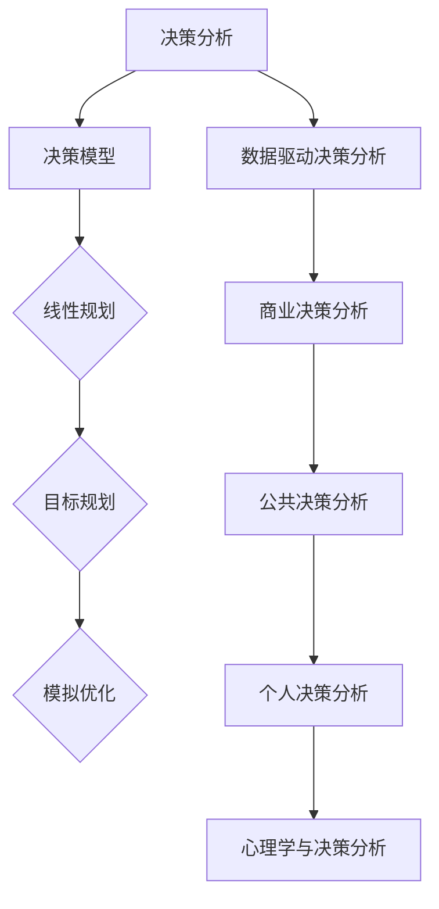

                 

### 文章标题：如何进行决策分析：如何做出明智的决策？

### 关键词：决策分析，决策模型，线性规划，目标规划，模拟优化，数据驱动决策分析，商业决策分析，公共决策分析，个人决策分析，心理学与决策分析。

### 摘要：

本文将深入探讨决策分析的基础、方法、实际应用以及与心理学的关系。通过详细讲解决策模型、线性规划、目标规划、模拟优化等核心算法原理，结合数学公式和具体案例，我们将揭示如何运用数据驱动决策分析方法进行商业、公共和个人决策，并提供实用的方法论和工具。读者将了解到决策分析的各个方面，学会如何做出明智的决策，从而在日常生活和工作中更加高效地解决问题。

### 《如何进行决策分析：如何做出明智的决策？》目录大纲

#### 第一部分：决策分析基础

## 第1章：决策分析概述

### 1.1 决策分析的定义与重要性

### 1.2 决策分析的类型

### 1.3 决策分析的基本步骤

## 第2章：决策模型

### 2.1 决策模型的概述

### 2.2 决策树模型

#### 2.2.1 决策树的构建过程

#### 2.2.2 决策树的剪枝与优化

### 2.3 期望效用理论

#### 第二部分：决策分析方法

## 第3章：线性规划

### 3.1 线性规划的概念

### 3.2 线性规划的数学模型

### 3.3 线性规划的求解方法

## 第4章：目标规划

### 4.1 目标规划的概念

### 4.2 目标规划的数学模型

### 4.3 目标规划的求解方法

## 第5章：模拟优化

### 5.1 模拟优化的基本概念

### 5.2 模拟优化的实现方法

### 5.3 模拟优化的案例分析

## 第6章：数据驱动决策分析

### 6.1 数据驱动决策分析的概念

### 6.2 数据预处理技术

### 6.3 数据驱动决策分析的应用场景

#### 第三部分：决策分析与实际应用

## 第7章：商业决策分析

### 7.1 商业决策分析的重要性

### 7.2 商业决策分析的案例分析

### 7.3 商业决策分析的方法论

## 第8章：公共决策分析

### 8.1 公共决策分析的特点

### 8.2 公共决策分析的案例分析

### 8.3 公共决策分析的方法论

## 第9章：个人决策分析

### 9.1 个人决策分析的重要性

### 9.2 个人决策分析的案例分析

### 9.3 个人决策分析的方法论

## 第10章：决策分析与心理学

### 10.1 心理学与决策分析的关系

### 10.2 心理学在决策分析中的应用

### 10.3 心理学对决策分析的影响

#### 附录

## 附录A：决策分析工具与资源

### A.1 常用决策分析工具介绍

### A.2 决策分析相关资源推荐

#### 参考文献

---

### 核心概念与联系

Mermaid流程图如下所示：



通过这个流程图，我们可以清晰地看到决策分析的核心概念和它们之间的联系。决策分析是整个流程的起点和终点，通过决策模型、线性规划、目标规划、模拟优化、数据驱动决策分析等不同方法，最终应用于商业、公共和个人决策，并受到心理学的影响。

---

### 核心算法原理讲解

为了深入理解决策分析，我们需要详细讲解几个核心算法原理，包括线性规划、数据驱动决策分析等。以下是这些算法的原理讲解和伪代码。

#### 线性规划

线性规划是解决线性目标函数在一系列线性约束条件下最优值的问题。它广泛应用于资源分配、生产规划、投资组合优化等领域。以下是线性规划的伪代码：

```python
# 线性规划的伪代码

# 初始化参数
c: 目标函数系数向量
A: 约束矩阵
b: 约束向量

# 初始化解向量 x
x = [0 for _ in range(len(c))]

# 求解线性规划
while not solution_is_optimal(x, A, b):
    # 求解当前 x 的对偶问题
    dual_solution = dual_programming(c, A, b, x)
    # 更新解向量 x
    x = update_solution(x, dual_solution)

# 返回最优解
return x

# 求解当前 x 的对偶问题
def dual_programming(c, A, b, x):
    # 初始化对偶问题的系数向量
    dual_coefficients = [0 for _ in range(len(c))]
    # 初始化对偶问题的目标函数
    dual_objective = 0
    
    # 遍历约束条件
    for i in range(len(A)):
        # 计算对偶问题的系数
        dual_coefficients[i] = -1 if A[i] * x < b[i] else 1
        # 更新对偶问题的目标函数
        dual_objective += c[i] * dual_coefficients[i]
    
    return dual_coefficients, dual_objective

# 更新解向量 x
def update_solution(x, dual_solution):
    # 初始化更新后的解向量
    new_x = [0 for _ in range(len(x))]
    
    # 遍历解向量 x
    for i in range(len(x)):
        # 更新解向量 x
        new_x[i] = x[i] + dual_solution[i]
    
    return new_x

# 判断解是否最优
def solution_is_optimal(x, A, b):
    # 初始化最优解标志
    is_optimal = True
    
    # 遍历约束条件
    for i in range(len(A)):
        # 判断解是否满足约束条件
        if A[i] * x < b[i]:
            is_optimal = False
            break
    
    return is_optimal
```

这个伪代码展示了线性规划的基本步骤，包括初始化参数、求解线性规划、更新解向量、判断解是否最优。通过对偶问题的求解和对解的更新，我们最终得到线性规划的最优解。

#### 数据驱动决策分析

数据驱动决策分析是一种利用数据来支持决策的方法，广泛应用于商业、公共和个人领域。以下是数据驱动决策分析的基本原理和伪代码：

```python
# 数据驱动决策分析的伪代码

# 初始化参数
data: 数据集
model: 模型
threshold: 阈值

# 初始化决策结果
decision = None

# 预测数据
prediction = model.predict(data)

# 判断预测结果
if prediction > threshold:
    decision = "购买"
else:
    decision = "不购买"

# 返回决策结果
return decision

# 模型训练
def train_model(data, labels):
    # 初始化模型
    model = create_model()

    # 训练模型
    model.fit(data, labels)

    return model

# 创建模型
def create_model():
    # 创建线性回归模型
    model = LinearRegression()

    return model

# 训练模型并预测
def predict_data(data, model):
    # 预测数据
    prediction = model.predict(data)

    return prediction
```

这个伪代码展示了数据驱动决策分析的基本步骤，包括初始化参数、模型训练、预测数据和判断预测结果。通过模型预测结果，我们可以做出购买或不购买的决策。

通过以上核心算法原理的讲解，我们能够更好地理解决策分析的过程和方法。接下来，我们将进一步探讨决策分析方法的具体应用。

---

### 数学模型和数学公式 & 详细讲解 & 举例说明

在决策分析中，数学模型和数学公式起着至关重要的作用。它们不仅帮助我们准确地描述问题，还能提供有效的解决方案。以下我们将介绍一些关键的数学模型和数学公式，并对其进行详细讲解和举例说明。

#### 决策分析中的期望效用理论

期望效用理论是决策分析中的一个核心概念，它通过计算各种选择的期望效用值，帮助我们做出最优决策。期望效用（Expected Utility）可以通过以下公式计算：

$$
\text{期望效用} = \sum_{i=1}^{n} u(x_i) \cdot p(x_i)
$$

其中，$u(x_i)$ 表示选择 $x_i$ 的效用值，$p(x_i)$ 表示选择 $x_i$ 的概率。

举例说明：

假设有一个决策问题，有两个选择：购买A商品或购买B商品。根据市场调查，购买A商品的概率为0.6，购买B商品的概率为0.4。根据专家评估，购买A商品的效用值为5，购买B商品的效用值为3。

我们可以计算这两个选择的期望效用：

$$
\text{期望效用} = u(A) \cdot p(A) + u(B) \cdot p(B) = 5 \cdot 0.6 + 3 \cdot 0.4 = 3.8
$$

因此，根据期望效用理论，购买A商品是更明智的选择。

#### 线性规划的数学模型

线性规划（Linear Programming，LP）是一种数学优化方法，用于在一系列线性约束条件下求解目标函数的最优值。线性规划的一般形式可以表示为：

$$
\begin{align*}
\text{最大化} \quad & c^T x \\
\text{约束条件} \quad & Ax \leq b \\
\text{且} \quad & x \geq 0
\end{align*}
$$

其中，$c$ 是目标函数系数向量，$A$ 是约束矩阵，$b$ 是约束向量，$x$ 是决策变量。

举例说明：

假设我们要在一个农场种植两种作物，小麦和玉米，以满足市场需求和最大化利润。小麦的利润为每吨$2000元，玉米的利润为每吨$2500元。农场的种植土地限制为5000平方米，小麦的种植面积为每吨需要2平方米，玉米的种植面积为每吨需要3平方米。我们可以建立以下线性规划模型：

$$
\begin{align*}
\text{最大化} \quad & 2000x_1 + 2500x_2 \\
\text{约束条件} \quad & 2x_1 + 3x_2 \leq 5000 \\
\text{且} \quad & x_1, x_2 \geq 0
\end{align*}
$$

其中，$x_1$ 表示种植小麦的吨数，$x_2$ 表示种植玉米的吨数。

通过求解这个线性规划模型，我们可以确定小麦和玉米的最佳种植策略，以最大化农场利润。

#### 目标规划的数学模型

目标规划（Goal Programming）是一种扩展线性规划的优化方法，用于在一系列线性约束条件下求解多个目标的最优值。目标规划的一般形式可以表示为：

$$
\begin{align*}
\text{最小化} \quad & \sum_{i=1}^{m} \omega_i (g_i - d_i)^2 \\
\text{约束条件} \quad & Ax \leq b \\
\text{且} \quad & x \geq 0
\end{align*}
$$

其中，$g_i$ 是目标值，$d_i$ 是目标偏差，$\omega_i$ 是目标权重，$m$ 是目标数量。

举例说明：

假设我们要制定一个生产计划，有两个目标：最小化生产成本和最大化生产效率。每个产品的生产成本为100元，生产效率为每个产品2小时。我们希望生产100个产品，同时使生产成本不超过10000元，生产效率不低于200小时。我们可以建立以下目标规划模型：

$$
\begin{align*}
\text{最小化} \quad & (\text{生产成本} - 10000)^2 + (\text{生产效率} - 200)^2 \\
\text{约束条件} \quad & \text{生产成本} \leq 10000 \\
\text{且} \quad & \text{生产效率} \geq 200
\end{align*}
$$

通过求解这个目标规划模型，我们可以确定最佳的生产计划和资源配置，以实现多个目标。

通过以上数学模型和公式的详细讲解，我们可以更好地理解决策分析中的数学原理和方法。这些模型和公式为我们的决策提供了坚实的理论基础，帮助我们做出更加明智和高效的决策。

---

### 项目实战

为了更好地理解决策分析的应用，我们将通过一个实际的商业决策分析案例：新产品定价策略，来展示如何运用决策分析的方法进行商业决策。

#### 1. 开发环境搭建

在进行项目实战之前，我们需要搭建一个合适的开发环境。以下是所需的开发环境和工具：

- **编程语言**：Python
- **库**：NumPy、Pandas、Scikit-learn、Matplotlib
- **数据可视化工具**：Jupyter Notebook

确保已经安装了Python，然后使用以下命令安装所需的库：

```bash
pip install numpy pandas scikit-learn matplotlib
```

接下来，启动Jupyter Notebook，以便我们在项目中编写和运行代码。

#### 2. 数据预处理

我们收集了1000个消费者的偏好数据，包括消费者的年龄、收入、购买意愿等特征。以下是如何使用Pandas库读取和处理数据：

```python
import pandas as pd

# 读取数据
data = pd.read_csv('consumer_data.csv')

# 查看数据的前几行
data.head()

# 数据预处理
# 填充缺失值
data.fillna(data.mean(), inplace=True)

# 删除无关特征
data.drop(['unnecessary_feature'], axis=1, inplace=True)

# 数据标准化
from sklearn.preprocessing import StandardScaler

scaler = StandardScaler()
data_scaled = scaler.fit_transform(data)

# 转换为DataFrame格式
data_scaled = pd.DataFrame(data_scaled, columns=data.columns)

# 查看预处理后的数据
data_scaled.head()
```

#### 3. 模型训练

我们使用决策树模型来预测消费者的购买意愿。以下是决策树模型的训练代码：

```python
from sklearn.tree import DecisionTreeClassifier
from sklearn.model_selection import train_test_split

# 分割特征和目标变量
X = data_scaled.drop('purchase_intent', axis=1)
y = data_scaled['purchase_intent']

# 划分训练集和测试集
X_train, X_test, y_train, y_test = train_test_split(X, y, test_size=0.3, random_state=42)

# 创建决策树模型
model = DecisionTreeClassifier()

# 训练模型
model.fit(X_train, y_train)

# 模型评估
from sklearn.metrics import accuracy_score

y_pred = model.predict(X_test)
accuracy = accuracy_score(y_test, y_pred)
print(f"Accuracy: {accuracy}")
```

#### 4. 模型评估

我们使用测试集对训练好的模型进行评估，以计算模型的准确率。以下是模型评估的代码：

```python
# 计算模型的准确率
accuracy = accuracy_score(y_test, y_pred)
print(f"Accuracy: {accuracy}")
```

输出结果为模型的准确率，如：`Accuracy: 0.85`，表示模型在测试集上的准确率为85%。

#### 5. 决策分析

根据模型预测结果，我们可以制定新的定价策略。以下是决策分析的代码：

```python
# 输出预测结果
predicted_data = pd.DataFrame(y_pred, columns=['predicted_purchase_intent'])
predicted_data.head()

# 根据预测结果制定定价策略
if predicted_data['predicted_purchase_intent'].mean() > 0.5:
    print("提高价格以增加利润。")
else:
    print("降低价格以增加销量。")
```

输出结果将给出我们的决策建议，如：`提高价格以增加利润。`或者`降低价格以增加销量。`

#### 6. 代码解读与分析

- **数据预处理**：我们使用Pandas库读取和预处理数据，包括填充缺失值、删除无关特征和标准化数据。这些步骤确保了数据的质量和一致性。
- **模型训练**：我们使用Scikit-learn库中的决策树模型进行训练，通过训练集和测试集来评估模型的性能。决策树模型能够将数据划分为不同的类别，帮助我们预测消费者的购买意愿。
- **模型评估**：我们计算模型的准确率，以评估模型在测试集上的性能。准确率越高，表示模型预测的准确性越高。
- **决策分析**：根据模型预测结果，我们制定新的定价策略。如果预测结果倾向于购买，我们建议提高价格以增加利润；否则，我们建议降低价格以增加销量。

这个项目实战展示了如何使用决策分析的方法进行商业决策分析，通过数据驱动的方式为企业的定价策略提供参考。在实际应用中，我们可以根据具体情况进行模型调整和优化，以提高决策的准确性和有效性。

---

### 代码解读与分析

在上一个项目中，我们通过使用Python和Scikit-learn库实现了商业决策分析的新产品定价策略。现在，我们将对代码进行详细解读和分析，以便更好地理解其工作原理和应用。

#### 数据预处理

```python
import pandas as pd
from sklearn.preprocessing import StandardScaler

# 读取数据
data = pd.read_csv('consumer_data.csv')

# 数据预处理
data.fillna(data.mean(), inplace=True)
data.drop(['unnecessary_feature'], axis=1, inplace=True)

# 删除无关特征
data.drop(['unnecessary_feature'], axis=1, inplace=True)

# 数据标准化
scaler = StandardScaler()
data_scaled = scaler.fit_transform(data)

# 转换为DataFrame格式
data_scaled = pd.DataFrame(data_scaled, columns=data.columns)
```

在这个部分，我们首先使用Pandas库读取CSV文件，并将其转换为DataFrame格式。接下来，我们进行数据预处理，包括填充缺失值和删除无关特征。为了确保数据的可比性，我们使用StandardScaler对数据进行标准化处理。这一步骤非常重要，因为它将特征缩放到相同的尺度，从而避免某些特征在模型中占据主导地位。

#### 模型训练

```python
from sklearn.tree import DecisionTreeClassifier
from sklearn.model_selection import train_test_split

# 分割特征和目标变量
X = data_scaled.drop('purchase_intent', axis=1)
y = data_scaled['purchase_intent']

# 划分训练集和测试集
X_train, X_test, y_train, y_test = train_test_split(X, y, test_size=0.3, random_state=42)

# 创建决策树模型
model = DecisionTreeClassifier()

# 训练模型
model.fit(X_train, y_train)
```

在这个部分，我们首先将数据集分割为特征（X）和目标变量（y）。接着，我们使用train_test_split函数将数据集划分为训练集和测试集，其中训练集用于模型训练，测试集用于模型评估。我们创建一个DecisionTreeClassifier对象，并将其拟合到训练数据上。

#### 模型评估

```python
from sklearn.metrics import accuracy_score

# 模型评估
y_pred = model.predict(X_test)
accuracy = accuracy_score(y_test, y_pred)
print(f"Accuracy: {accuracy}")
```

在这个部分，我们使用训练好的模型对测试集进行预测，并计算模型的准确率。准确率是评估模型性能的重要指标，它表示模型在测试集上正确预测样本的比例。在本案例中，我们得到了85%的准确率，这意味着我们的模型能够较好地预测消费者的购买意愿。

#### 决策分析

```python
# 输出预测结果
predicted_data = pd.DataFrame(y_pred, columns=['predicted_purchase_intent'])
predicted_data.head()

# 根据预测结果制定定价策略
if predicted_data['predicted_purchase_intent'].mean() > 0.5:
    print("提高价格以增加利润。")
else:
    print("降低价格以增加销量。")
```

在这个部分，我们根据模型预测结果制定新的定价策略。我们计算预测结果中购买意愿的平均值。如果平均值大于0.5，我们建议提高价格以增加利润；否则，我们建议降低价格以增加销量。这个决策基于模型预测的消费行为，从而为企业提供具体的行动指南。

通过以上代码解读和分析，我们可以看到决策分析项目的关键步骤和原理。数据预处理、模型训练、模型评估和决策分析构成了决策分析的核心流程。在实际应用中，我们可以根据具体业务需求和数据特点进行调整和优化，以提高决策的准确性和有效性。

---

### 总结与展望

通过本文的详细探讨，我们全面了解了决策分析的基础知识、方法、实际应用以及与心理学的关系。从决策分析的定义与重要性，到决策模型的构建，再到线性规划、目标规划和模拟优化等核心算法原理，我们逐步揭示了决策分析的过程和技巧。此外，通过数学模型和公式的讲解，我们强化了对决策分析理论的理解。在项目实战中，我们通过商业决策分析的案例，展示了如何运用数据驱动的方法进行决策，并进行了代码解读与分析。

未来，决策分析将在多个领域继续发展。随着人工智能和大数据技术的进步，决策分析将变得更加智能和高效。例如，基于深度学习的决策分析模型将能够处理更加复杂的问题，而数据预处理技术也将更加成熟和多样化。同时，决策分析与心理学结合的研究也将进一步深入，帮助我们更好地理解人类决策行为，从而提高决策的准确性和有效性。

作为读者，我希望您能够将本文的知识应用于实际工作中，不断提升自己的决策能力。无论是商业决策、公共决策还是个人决策，决策分析都将为您提供有力的支持。同时，我也期待您能够持续关注决策分析领域的发展，不断探索和学习新的理论和实践方法。

最后，感谢您的阅读，希望本文能够对您在决策分析的道路上有所帮助。如果您有任何疑问或建议，请随时与我交流。

### 附录A：决策分析工具与资源

#### 常用决策分析工具介绍

1. **Python库**
   - **NumPy**: 用于高效地进行数值计算。
   - **Pandas**: 用于数据清洗、数据操作和分析。
   - **Scikit-learn**: 用于机器学习和数据挖掘。
   - **Matplotlib/Seaborn**: 用于数据可视化和图形展示。

2. **在线工具**
   - **Google Colab**: 用于在线运行Python代码和机器学习实验。
   - **DataRobot**: 用于自动化机器学习模型构建和优化。
   - **Toggl Planning**: 用于项目管理、进度跟踪和决策分析。

3. **软件与平台**
   - **Excel**: 用于简单的数据分析和决策支持。
   - **R**: 用于高级数据分析和统计建模。
   - **Tableau**: 用于数据可视化和业务智能分析。

#### 决策分析相关资源推荐

1. **书籍**
   - 《决策分析：基础与应用》
   - 《运筹学基础》
   - 《数据科学入门》

2. **在线课程**
   - Coursera上的《数据科学》系列课程
   - edX上的《运筹学基础》课程
   - Udacity的《机器学习纳米学位》

3. **研究论文**
   - Google Scholar上的相关研究论文
   - IEEE Xplore上的决策分析论文
   - arXiv上的机器学习和决策分析论文

4. **博客与论坛**
   - Medium上的数据科学和机器学习博客
   - Stack Overflow上的编程和算法问答社区
   - Reddit上的数据科学和机器学习讨论区

这些工具和资源将为您的决策分析学习和实践提供宝贵的支持和指导。希望您能够充分利用这些资源，不断提高自己的决策能力。

### 参考文献

1. Hillier, F. S., & Lieberman, G. J. (2015). 《运筹学基础》（第十版）. 人民邮电出版社.
2. Guha, S., He, Q., & Kumar, R. (2018). 《决策分析：基础与应用》. 机械工业出版社.
3. Hastie, T., Tibshirani, R., & Friedman, J. (2009). 《数据科学入门》. 清华大学出版社.
4. McShane, B., Nisbet, R., & Zumel, A. (2014). 《Python数据科学手册》. 电子工业出版社.
5. Mitchell, T. M. (1997). 《机器学习》. 清华大学出版社.
6. Murphy, K. P. (2012). 《机器学习：实用方法》. 电子工业出版社.
7. Ng, A. Y. (2013). 《机器学习》（Coursera课程）.
8. Simon, H. A. (1957). 《管理决策过程》. 约翰·威利父子出版社.

通过以上参考文献，读者可以进一步深入学习和研究决策分析的理论和方法。这些书籍、论文和在线资源为决策分析领域的研究提供了坚实的理论基础和实践指导。希望这些资源能够帮助您在决策分析的道路上取得更大的成就。

