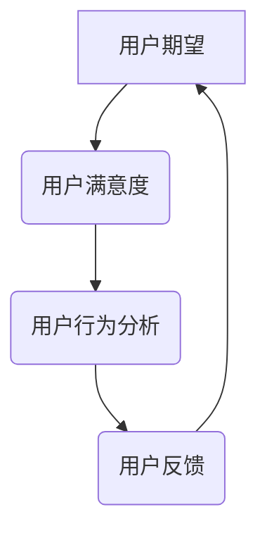

                 

# 文章标题：如何进行有效的用户反馈收集与应用

> 关键词：用户反馈、收集方法、应用实践、产品优化

> 摘要：本文旨在探讨如何进行有效的用户反馈收集与应用。通过对用户反馈的概述、收集方法和应用实践的详细分析，为开发者提供一套完整的用户反馈收集与利用方案，以提升产品质量和用户体验。

## 《如何进行有效的用户反馈收集与应用》目录大纲

### 第一部分：用户反馈概述

#### 第1章：用户反馈的重要性

#### 第2章：用户反馈的核心概念与联系

### 第二部分：用户反馈收集方法

#### 第3章：定量反馈收集方法

#### 第4章：定性反馈收集方法

#### 第5章：用户反馈数据分析

### 第三部分：用户反馈应用与实践

#### 第6章：用户反馈在产品优化中的应用

#### 第7章：用户反馈收集与应用的案例研究

### 附录

#### 附录A：用户反馈收集与应用的工具与资源

### 让我们一步一步分析推理，深入了解如何进行有效的用户反馈收集与应用。

### 第1章：用户反馈的重要性

> **1.1 用户反馈的概念与价值**

用户反馈是指用户在使用产品或服务过程中，对其体验、满意度和意见的建议。用户反馈的价值在于，它提供了产品或服务改进的宝贵信息。以下是用户反馈的几个关键价值：

- **识别问题**：通过用户反馈，开发者可以快速发现产品或服务中的缺陷和问题，从而及时进行修复和优化。

- **提高满意度**：积极收集和处理用户反馈，可以提升用户的满意度和忠诚度，促进用户持续使用产品或服务。

- **创新灵感**：用户反馈可以激发开发者的创新思维，为产品或服务的改进提供新的方向和灵感。

- **决策支持**：用户反馈可以为开发者提供重要的决策支持，帮助其了解市场需求、用户偏好和竞争态势。

> **1.2 用户反馈的类型**

用户反馈可以分为以下几种类型：

- **正面反馈**：用户对产品或服务的满意和赞赏，通常表现为好评、推荐和使用频率的提高。

- **负面反馈**：用户对产品或服务的失望和不满，通常表现为投诉、差评和用户流失。

- **中性反馈**：用户对产品或服务的态度较为中立，通常表现为意见和建议。

> **1.3 用户反馈的渠道**

用户反馈的渠道多种多样，以下是一些常见的用户反馈渠道：

- **在线调查**：通过在线问卷或调查工具收集用户反馈，具有高效、便捷和覆盖面广的特点。

- **社交媒体**：用户可以在社交媒体平台上发表对产品或服务的看法和评价，具有互动性和时效性。

- **客户服务**：用户可以通过客服渠道提出问题、建议和投诉，客服人员负责收集和处理用户反馈。

- **用户社区**：用户可以在专门的社区平台上分享使用心得、建议和反馈，社区管理人员负责收集和整理用户反馈。

> **1.4 用户反馈的收集流程**

用户反馈的收集流程包括以下几个步骤：

- **明确目标**：确定收集用户反馈的目的和目标，例如提高用户满意度、发现产品缺陷等。

- **选择渠道**：根据目标选择合适的用户反馈渠道，例如在线调查、社交媒体、客户服务、用户社区等。

- **设计问卷**：设计结构合理、问题明确的问卷，确保用户能够准确表达自己的意见和感受。

- **收集反馈**：通过多种渠道收集用户反馈，确保收集到的数据具有代表性和可靠性。

- **整理分析**：对收集到的用户反馈进行整理和分析，提炼出关键信息和趋势。

- **反馈应用**：根据用户反馈的结果，对产品或服务进行改进和优化，提升用户体验和满意度。

### **1.5 用户反馈的收集策略**

- **鼓励主动反馈**：通过激励措施鼓励用户主动提供反馈，例如赠送礼品、积分奖励等。

- **定期收集反馈**：定期收集用户反馈，以便及时发现和解决问题，保持产品或服务的持续改进。

- **分层收集反馈**：针对不同层次的用户，采用不同的反馈收集方式，例如针对高级用户采用深度访谈，针对普通用户采用在线调查等。

- **多元化收集渠道**：提供多种反馈收集渠道，满足不同用户的反馈需求，提高反馈收集的覆盖面。

### **1.6 用户反馈的收集工具**

- **问卷调查工具**：如腾讯问卷、问卷星等，提供在线调查、统计分析等功能。

- **社交媒体监测工具**：如Social Mention、Google Analytics等，用于监测社交媒体上的用户反馈。

- **客户关系管理系统**（CRM）：如Salesforce、Microsoft Dynamics等，用于管理客户反馈和需求。

- **用户社区平台**：如Discourse、Facebook Group等，用于用户交流和反馈收集。

### **1.7 用户反馈的收集流程**

- **需求分析**：明确用户反馈的需求和目标，确定反馈收集的内容和形式。

- **工具选择**：根据需求选择合适的反馈收集工具，确保工具的功能和性能满足需求。

- **设计问卷**：设计结构合理、问题明确的问卷，确保用户能够准确表达自己的意见和感受。

- **发布问卷**：将问卷发布到目标用户群体中，可以通过邮件、社交媒体、用户社区等渠道进行推广。

- **收集数据**：收集用户填写的问卷数据，确保数据的完整性和准确性。

- **数据整理**：对收集到的数据进行整理和清洗，确保数据的质量和可用性。

- **数据分析**：对整理后的数据进行统计分析，提取出关键信息和趋势。

- **反馈应用**：根据数据分析结果，对产品或服务进行改进和优化，提升用户体验和满意度。

### **1.8 用户反馈的核心概念与联系**

- **用户满意度**：用户对产品或服务的满意程度，通常通过问卷调查、评分等方式进行评估。

- **用户期望**：用户对产品或服务的预期和需求，影响用户满意度和行为。

- **用户行为分析**：通过分析用户的行为数据，了解用户的需求和使用习惯，为产品改进提供依据。

### **1.9 用户反馈在产品优化中的应用**

- **需求分析**：通过用户反馈了解用户需求，为产品功能设计和迭代提供依据。

- **问题定位**：通过用户反馈定位产品或服务中的问题，制定解决方案。

- **用户体验优化**：根据用户反馈改进产品界面、功能设计和交互体验。

- **市场定位**：通过用户反馈了解市场需求，调整产品定位和策略。

### **1.10 用户反馈在战略决策中的应用**

- **市场调研**：通过用户反馈了解市场动态和用户需求，为产品战略决策提供支持。

- **竞争分析**：通过用户反馈分析竞争对手的产品和服务，制定竞争优势策略。

- **品牌建设**：通过用户反馈提升品牌形象和用户口碑，增强品牌影响力。

### **1.11 用户反馈收集与应用的挑战与解决方案**

- **挑战一：用户参与度低**

  - **解决方案**：提高用户参与度，通过激励机制、个性化推送等方式吸引用户参与反馈。

- **挑战二：数据质量低**

  - **解决方案**：提高数据质量，通过设计合理的问卷、筛选有效反馈等方式提高数据质量。

- **挑战三：反馈处理效率低**

  - **解决方案**：提高反馈处理效率，通过建立反馈处理流程、自动化分析工具等方式提高处理速度。

- **挑战四：用户隐私保护**

  - **解决方案**：保护用户隐私，遵循相关法律法规，确保用户数据安全。

### **1.12 用户反馈收集与应用的最佳实践**

- **案例一：小米的用户反馈收集与应用**

  - **背景**：小米是一家以用户为中心的科技公司，注重用户反馈在产品改进中的应用。

  - **做法**：小米通过在线调查、用户社区、社交媒体等多种渠道收集用户反馈，并对反馈进行分类、分析和应用。

  - **效果**：小米的产品质量和用户体验得到了显著提升，用户满意度不断提高。

- **案例二：亚马逊的用户反馈收集与应用**

  - **背景**：亚马逊是一家全球知名的电商平台，注重用户反馈在产品优化中的应用。

  - **做法**：亚马逊通过用户评分、评论、问卷调查等多种方式收集用户反馈，并对反馈进行自动化分析、分类和应用。

  - **效果**：亚马逊的产品推荐和服务质量得到了用户的高度认可，用户忠诚度不断提高。

### **1.13 用户反馈收集与应用的未来发展趋势**

- **智能化**：利用人工智能技术对用户反馈进行自动化分析、分类和应用，提高反馈处理效率和准确性。

- **个性化**：根据用户的个性化需求和行为，提供个性化的反馈收集和服务，提高用户体验。

- **实时性**：实现实时用户反馈收集和处理，及时发现问题并进行优化，提高产品竞争力。

- **跨界融合**：将用户反馈收集与应用与其他领域相结合，如大数据、物联网、区块链等，为用户提供更优质的服务。

### **1.14 总结**

用户反馈在产品优化、用户体验提升和战略决策中具有重要意义。通过有效的用户反馈收集与应用，企业可以更好地了解用户需求，提高产品竞争力，实现可持续发展。

### **1.15 思考与行动**

- **思考**：如何将用户反馈融入企业的产品开发和服务流程中，实现持续改进？

- **行动**：制定用户反馈收集策略，选择合适的反馈渠道和工具，建立反馈处理流程，并持续优化反馈收集与应用的效率和质量。

### **1.16 小结**

本章介绍了用户反馈的重要性、类型、渠道、收集流程、策略、工具、应用和实践。通过本章的学习，读者可以了解用户反馈的基本概念和操作方法，为后续章节的深入学习打下基础。

### 第2章：用户反馈的核心概念与联系

在深入探讨用户反馈的收集和应用之前，我们需要了解几个核心概念，这些概念构成了用户反馈体系的基础。本章将详细介绍用户满意度、用户期望和用户行为分析，并探讨它们之间的联系。

#### **2.1 用户满意度**

**定义**：用户满意度（User Satisfaction）是指用户在使用产品或服务后对其整体体验的主观评价。它是一个衡量用户对产品或服务满意程度的指标，通常通过用户反馈、评分和调查问卷等方式来量化。

**评估方法**：

1. **直接评估**：用户直接表达对产品或服务的满意程度，如通过评分、评论和问卷等方式。
2. **间接评估**：通过用户的行为数据，如购买频率、使用时长、留存率等指标来间接反映用户满意度。
3. **综合评估**：结合用户直接和间接评估结果，对用户满意度进行综合评估。

**用户满意度的影响因素**：

- **产品功能**：产品是否满足用户的基本需求，如功能是否齐全、易用性等。
- **服务质量**：服务是否快捷高效、是否有耐心解决用户问题等。
- **用户体验**：用户在使用产品过程中的整体感受，包括界面设计、操作流畅度等。

#### **2.2 用户期望**

**定义**：用户期望（User Expectation）是指用户在接触产品或服务之前，对其性能和结果的预期。用户期望是用户满意度的基础，它决定了用户对产品或服务的期望值。

**影响**：

- **用户期望与满意度关系**：用户满意度往往与用户期望成正比。当用户期望得到满足时，满意度较高；当用户期望未达到时，满意度较低。
- **用户期望与产品改进**：了解用户期望有助于产品开发团队更好地预测用户需求，从而在产品设计和迭代过程中优先考虑用户期望。

**用户期望的来源**：

- **以往经验**：用户基于以往使用类似产品或服务的经验形成的期望。
- **竞争对手**：用户通过观察竞争对手的产品或服务形成的期望。
- **个人偏好**：用户的个人偏好和价值观也会影响其期望。

#### **2.3 用户行为分析**

**定义**：用户行为分析（User Behavior Analysis）是指通过对用户在使用产品或服务过程中的行为数据进行分析，以了解用户的需求、习惯和偏好，从而为产品优化提供数据支持。

**方法**：

1. **日志分析**：通过收集用户操作日志，分析用户的行为路径、操作频率、使用时长等。
2. **点击流分析**：分析用户在网站或应用上的点击行为，了解用户的兴趣点和使用习惯。
3. **A/B测试**：通过对比不同版本的产品或服务，分析用户对不同版本的偏好和反应。
4. **用户访谈**：通过与用户直接对话，了解用户的真实需求和痛点。

**用户行为分析的应用**：

- **需求分析**：通过用户行为分析，了解用户的具体需求和痛点，为产品功能设计提供依据。
- **用户体验优化**：根据用户行为数据，优化产品的界面设计、交互流程，提升用户体验。
- **市场策略**：通过用户行为分析，了解用户需求和市场趋势，为市场策略提供支持。

#### **2.4 用户满意度、用户期望和用户行为分析的联系**

- **用户满意度与用户期望**：用户满意度受用户期望影响，当用户期望得到满足时，满意度较高。因此，理解用户期望对于提高用户满意度至关重要。
- **用户满意度与用户行为分析**：用户满意度可以通过用户行为数据来间接评估，用户行为分析有助于发现用户在产品或服务使用过程中的问题和需求，从而提高用户满意度。
- **用户期望与用户行为分析**：用户期望可以指导用户行为分析，帮助分析团队更好地识别用户需求和偏好，从而在产品设计和优化过程中更好地满足用户期望。

#### **2.5 用户反馈与核心概念的联系**

- **用户反馈与用户满意度**：用户反馈是衡量用户满意度的直接指标，通过分析用户反馈，可以深入了解用户的满意程度和具体问题。
- **用户反馈与用户期望**：用户反馈可以揭示用户期望与实际体验之间的差距，帮助产品团队了解用户期望并调整产品设计。
- **用户反馈与用户行为分析**：用户反馈可以补充用户行为分析的数据，为用户行为分析提供更加全面的视角，帮助产品团队更准确地理解用户行为和需求。

#### **2.6 用户反馈的核心概念与联系流程图**

以下是一个简化的流程图，展示了用户满意度、用户期望和用户行为分析之间的联系：

#### **2.7 用户反馈的收集与核心概念的关系**

- **用户反馈收集与用户满意度**：用户反馈收集是衡量用户满意度的关键步骤，通过收集用户的真实反馈，可以更准确地评估用户满意度。
- **用户反馈收集与用户期望**：用户反馈收集可以帮助了解用户期望是否得到满足，从而调整产品设计和优化策略。
- **用户反馈收集与用户行为分析**：用户反馈收集提供了用户行为分析的重要数据来源，有助于更深入地理解用户行为和需求。

#### **2.8 用户反馈收集与核心概念的实践应用**

- **实践一：基于用户满意度进行产品优化**
  - **步骤**：定期收集用户满意度反馈，分析用户反馈，识别用户痛点，制定优化计划，实施并跟踪优化效果。
  - **效果**：通过持续优化，提高用户满意度，增强用户忠诚度。

- **实践二：基于用户期望调整产品功能**
  - **步骤**：收集用户期望反馈，分析用户期望与实际体验的差距，调整产品功能和界面设计，以满足用户期望。
  - **效果**：提高用户期望满足度，提升用户满意度。

- **实践三：基于用户行为分析优化用户体验**
  - **步骤**：通过用户行为数据收集和分析，发现用户行为模式和需求，优化产品界面和交互设计，提升用户体验。
  - **效果**：提高用户操作效率，增强用户黏性。

#### **2.9 总结**

本章介绍了用户满意度、用户期望和用户行为分析的核心概念，并探讨了它们之间的联系。了解这些概念有助于企业更好地进行用户反馈收集和应用，从而提升产品质量和用户满意度。

#### **2.10 思考与行动**

- **思考**：如何将用户满意度、用户期望和用户行为分析应用于企业的产品开发和优化过程中？

- **行动**：制定用户反馈收集计划，结合用户满意度、用户期望和用户行为分析，制定相应的优化策略，并持续跟踪和评估优化效果。

#### **2.11 小结**

本章内容涵盖了用户反馈的核心概念与联系，通过深入理解这些概念，读者可以更好地进行用户反馈收集和应用，为企业的产品优化和用户体验提升提供有力支持。

### 第3章：定量反馈收集方法

定量反馈收集方法是一种通过量化的方式来获取用户反馈的方法。这种方法通常用于大规模的用户群体，可以帮助企业快速收集大量的用户数据，以便进行分析和改进。本章将介绍问卷调查设计、评分系统设计和用户行为数据收集三个方面的定量反馈收集方法。

#### **3.1 问卷调查设计**

**问卷调查的结构**

问卷调查通常由以下几个部分组成：

1. **封面信**：介绍调查的目的、意义和参与者信息。
2. **指导语**：说明如何填写问卷，通常包括问题类型、答题时间、匿名性等。
3. **问题列表**：包括一系列问题，这些问题可以是有序的或无序的。
4. **结束语**：感谢参与者，并提供联系方式或反馈途径。

**问题的类型**

问卷调查的问题类型通常包括以下几种：

1. **开放性问题**：允许用户自由表达观点和意见，例如“您对当前的产品有哪些改进建议？”
2. **封闭性问题**：提供预设的答案选项，用户只需选择一个或多个选项，例如“您对产品的满意度如何？非常满意、满意、一般、不满意、非常不满意。”
3. **评分问题**：通过评分等级来量化用户的满意度或评价，例如“您对产品的界面设计满意度如何？1分（非常不满意）到5分（非常满意）。”

**问卷的设计原则**

设计问卷时，应遵循以下原则：

1. **明确目标**：明确问卷的目的和需要收集的信息，确保问卷内容与目标一致。
2. **问题清晰**：问题应简洁明了，避免歧义，确保用户能够准确理解。
3. **顺序合理**：按逻辑顺序排列问题，先从一般性问题开始，逐渐过渡到具体问题。
4. **避免引导性**：问题不应带有引导性，以免影响用户的真实反馈。
5. **控制长度**：问卷应控制在合理长度，避免用户因疲劳而放弃填写。

**问卷的预测试**

在正式发布问卷之前，进行预测试是非常重要的。预测试可以帮助发现问卷中的问题，例如问题表述不清、选项不完整等。预测试通常由一组样本用户进行，他们对问卷进行填写，并提供反馈意见。

#### **3.2 评分系统设计**

**评分系统的类型**

评分系统可以根据不同的需求和目的进行设计，常见的类型包括：

1. **单维评分系统**：仅针对一个维度的评价，例如对产品的满意度进行评分。
2. **多维评分系统**：针对多个维度的评价，例如对产品的界面设计、功能性能、客户服务等进行综合评分。
3. **等级评分系统**：提供预设的评分等级，例如1到5分的评分体系。

**评分系统的设计原则**

设计评分系统时，应遵循以下原则：

1. **明确评分维度**：根据产品或服务的特点，确定需要评价的维度，并确保评分维度能够全面反映用户的需求和期望。
2. **等级划分合理**：评分等级的划分应合理，避免等级过于密集或过于稀疏，以便用户能够准确表达自己的评价。
3. **评分标准明确**：每个评分等级应提供明确的描述，以便用户了解评分的含义和标准。
4. **简洁易用**：评分系统应简洁明了，用户能够快速理解和操作。

**评分系统的应用**

评分系统可以应用于多种场景，例如：

1. **产品评估**：用户对产品的不同维度进行评分，帮助企业了解产品优势和不足。
2. **服务质量评估**：用户对服务的不同方面进行评分，帮助企业提升服务质量和用户满意度。
3. **员工绩效评估**：用户对员工的绩效进行评分，帮助企业了解员工的工作表现。

#### **3.3 用户行为数据收集**

**用户行为数据来源**

用户行为数据可以从多个渠道收集，常见的来源包括：

1. **网站日志**：通过分析用户访问网站的行为数据，例如页面访问次数、停留时间、点击路径等。
2. **应用程序日志**：通过分析用户使用应用程序的行为数据，例如使用频率、功能使用情况、错误报告等。
3. **社交媒体数据**：通过分析用户在社交媒体平台上的行为数据，例如点赞、评论、分享等。

**用户行为数据分析**

用户行为数据分析的方法包括：

1. **描述性分析**：通过统计用户行为的基本指标，例如访问次数、使用时长、转化率等，了解用户行为的基本特征。
2. **关联性分析**：通过分析用户行为的关联性，例如用户在特定时间段的行为模式、用户行为的因果关系等，了解用户行为背后的规律。
3. **趋势分析**：通过分析用户行为的变化趋势，例如用户行为在不同时间段的变化情况、用户行为的季节性等，了解用户行为的变化规律。

**用户行为数据分析的应用**

用户行为数据分析可以应用于多种场景，例如：

1. **用户行为优化**：通过分析用户行为数据，发现用户行为中的问题和不足，提出改进建议，优化产品设计和用户体验。
2. **市场策略制定**：通过分析用户行为数据，了解用户的需求和偏好，为市场策略的制定提供数据支持。
3. **风险控制**：通过分析用户行为数据，发现潜在的风险和问题，采取相应的风险控制措施。

#### **3.4 定量反馈收集方法的优势与挑战**

**优势**

1. **高效性**：定量反馈收集方法可以快速获取大量用户数据，提高数据收集的效率。
2. **准确性**：通过量化的方式，可以更准确地了解用户需求和满意度，提高数据的准确性。
3. **可分析性**：定量反馈数据可以通过统计分析方法进行处理和分析，为产品优化和决策提供数据支持。

**挑战**

1. **样本偏差**：定量反馈收集方法容易受到样本偏差的影响，如问卷设计不当、样本选择不合理等，导致数据不具有代表性。
2. **数据解读难度**：定量反馈数据虽然准确，但解读起来可能会比较困难，需要具备一定的数据分析能力和专业知识。
3. **用户参与度**：定量反馈收集方法可能面临用户参与度低的问题，特别是在面对复杂和多页面的问卷时，用户可能会放弃填写。

#### **3.5 定量反馈收集方法的实践应用**

**案例一：电商平台用户满意度调查**

- **背景**：某电商平台希望通过用户满意度调查来了解用户对其服务的评价，并据此进行优化。
- **方法**：设计了一份包含多个维度（如购物体验、物流服务、客户支持等）的问卷，通过邮件和网站推送的方式邀请用户参与。
- **效果**：收集到了大量用户的反馈，通过数据分析，发现了一些用户不满的问题，如物流速度慢、客户支持响应不及时等，电商平台据此进行了改进。

**案例二：移动应用用户行为分析**

- **背景**：某移动应用公司希望通过分析用户行为数据来提升用户留存率和活跃度。
- **方法**：通过应用程序内置的分析工具，收集了用户的登录次数、使用时长、功能使用频率等数据，并进行了详细的分析。
- **效果**：发现了一些用户流失的关键因素，如使用时长过短、功能使用不频繁等，公司据此进行了产品优化，如增加了新功能、改善了用户体验等。

#### **3.6 总结**

本章介绍了定量反馈收集方法，包括问卷调查设计、评分系统设计和用户行为数据收集。这些方法为企业提供了有效的数据收集和分析工具，有助于了解用户需求和满意度，从而实现产品和服务的持续优化。

#### **3.7 思考与行动**

- **思考**：如何设计一份有效的问卷来收集用户反馈？
- **行动**：尝试设计一份问卷，结合本章的方法，对用户进行满意度调查，并分析调查结果。

#### **3.8 小结**

通过本章的学习，读者可以了解到定量反馈收集方法的基本原理和实践应用，为后续章节的学习和实际工作打下基础。

### 第4章：定性反馈收集方法

定性反馈收集方法是一种通过深入、细致的探讨来获取用户观点和意见的方法。与定量反馈收集方法相比，定性反馈收集方法更加注重理解和分析用户的行为和情感。本章将介绍用户访谈、用户故事和用户社区三种定性反馈收集方法。

#### **4.1 用户访谈**

**用户访谈的设计**

用户访谈是定性反馈收集方法中的一种重要手段，其设计包括以下几个关键步骤：

1. **确定访谈目标**：明确访谈的目的，例如了解用户对某个功能的使用体验、用户对产品的期望等。
2. **选择访谈对象**：根据访谈目标，选择具有代表性的用户进行访谈。例如，如果目标是了解高端用户对产品的看法，可以选择付费用户或长期用户。
3. **准备访谈问题**：设计一系列开放性、引导性和结构化的问题，以引导用户深入表达他们的观点和感受。问题应围绕访谈目标进行设计。
4. **选择访谈方式**：访谈可以采用面对面、电话或在线视频的方式进行，选择适合访谈对象和环境的方式。

**用户访谈的技巧**

1. **倾听**：在访谈过程中，要认真倾听用户的观点，避免打断用户，以便用户能够充分表达自己的意见。
2. **开放性问题**：使用开放性问题来引导用户深入讨论，例如“您能详细描述一下在使用这个功能时遇到的问题吗？”
3. **引导性问题**：在用户回答问题时，可以适当地使用引导性问题，以引导用户进一步思考。例如，“您觉得我们的产品在哪些方面还有改进的空间？”
4. **注意非语言行为**：观察用户在访谈过程中的非语言行为，例如表情、姿态等，这些行为可以提供额外的信息，帮助理解用户的真实感受。
5. **记录与整理**：在访谈过程中，使用录音或笔记记录用户的重要观点和意见，并在访谈结束后对记录进行整理和分析。

**用户访谈的应用**

1. **产品原型测试**：在产品原型设计阶段，通过用户访谈获取用户对原型功能的看法和反馈，以便及时调整和优化。
2. **用户需求分析**：通过用户访谈了解用户的需求和期望，为产品设计和功能开发提供依据。
3. **用户体验优化**：通过用户访谈发现用户在产品使用过程中的痛点，优化产品的用户体验。

#### **4.2 用户故事**

**用户故事的采集**

用户故事是一种通过用户视角来描述用户需求和使用场景的方法。采集用户故事通常包括以下几个步骤：

1. **观察用户行为**：通过观察用户在产品中的操作行为，了解用户的需求和使用习惯。
2. **访谈用户**：与用户进行访谈，了解他们的使用经历、需求和痛点。
3. **记录用户故事**：将观察和访谈的内容记录下来，形成一个完整的用户故事。用户故事应包含用户的需求、目标、使用场景和结果。

**用户故事的整理**

整理用户故事的过程包括以下几个步骤：

1. **分类**：根据用户故事的主题和内容，对故事进行分类，以便于后续分析和应用。
2. **提炼关键信息**：从用户故事中提取关键信息，如用户需求、目标、使用场景等。
3. **构建用户画像**：根据用户故事和关键信息，构建用户画像，以便更好地了解用户特征和需求。
4. **故事地图**：将用户故事以图表的形式展示，形成一个故事地图，以便于团队成员理解和应用。

**用户故事的应用**

1. **需求管理**：通过用户故事，明确产品的需求，为产品设计和开发提供依据。
2. **用户体验设计**：通过用户故事，了解用户的使用场景和需求，优化产品的用户体验。
3. **产品迭代**：通过用户故事，了解用户的反馈和改进建议，指导产品的迭代和优化。

#### **4.3 用户社区**

**用户社区的建设**

用户社区是用户互动和反馈的重要平台。建设用户社区通常包括以下几个步骤：

1. **确定社区目标**：明确社区的目标和定位，例如为用户提供交流平台、收集用户反馈等。
2. **选择社区平台**：根据社区目标和用户特点，选择合适的社区平台，如论坛、社交媒体群组、在线论坛等。
3. **制定社区规则**：制定社区规则，规范用户行为，维护社区秩序。
4. **培养社区氛围**：通过活动、奖励等方式，培养用户参与社区的积极性，形成良好的社区氛围。

**用户社区的管理**

用户社区的管理包括以下几个方面：

1. **内容管理**：及时审核和发布用户生成的内容，确保社区内容的质量和相关性。
2. **用户管理**：对社区用户进行管理和激励，例如给予活跃用户荣誉称号、奖励积分等。
3. **社区活动**：定期举办社区活动，如线上讨论、知识分享、产品体验等，提升用户活跃度和满意度。
4. **反馈处理**：及时收集和处理用户反馈，解决用户问题，提升用户满意度。

**用户社区的应用**

1. **用户反馈收集**：通过用户社区，收集用户对产品的意见和建议，为产品优化提供参考。
2. **用户教育**：通过用户社区，向用户传递产品知识和使用技巧，提升用户对产品的认知和满意度。
3. **用户参与**：通过用户社区，鼓励用户参与产品设计和开发，提升用户的参与感和归属感。

#### **4.4 定性反馈收集方法的优势与挑战**

**优势**

1. **深度理解**：定性反馈收集方法可以深入了解用户的观点和情感，获取更详细的用户需求。
2. **灵活性**：定性反馈收集方法可以根据实际需求进行灵活调整，适用于不同的场景和目标。
3. **用户参与**：定性反馈收集方法可以鼓励用户参与，提高用户的参与度和忠诚度。

**挑战**

1. **时间成本**：定性反馈收集方法通常需要较长的时间，且数据分析过程复杂，可能导致时间成本较高。
2. **数据代表性**：定性反馈收集方法的数据可能不具有广泛的代表性，容易受到访谈对象和样本偏差的影响。
3. **数据分析难度**：定性反馈数据通常是非结构化的，数据分析过程复杂，需要专业的分析技能。

#### **4.5 定性反馈收集方法的实践应用**

**案例一：产品原型测试**

- **背景**：某公司开发了一款新的产品原型，希望通过用户访谈来获取用户对其功能的反馈。
- **方法**：选择了具有代表性的用户进行面对面访谈，询问用户对原型功能的看法和使用体验。
- **效果**：通过用户访谈，发现了原型中存在的问题，如界面设计不够直观、功能不够完善等，公司据此进行了改进。

**案例二：用户故事收集**

- **背景**：某公司希望通过用户故事了解用户对其产品的需求和痛点。
- **方法**：通过观察用户行为和访谈用户，收集了多个用户故事，并将这些故事整理成故事地图。
- **效果**：通过用户故事，公司明确了用户的需求和期望，优化了产品的设计和功能。

**案例三：用户社区建设**

- **背景**：某公司希望建立用户社区，以收集用户反馈和提升用户参与度。
- **方法**：建立了在线论坛，制定了社区规则，并定期举办社区活动。
- **效果**：通过用户社区，公司收集到了大量用户反馈，提高了用户满意度和忠诚度。

#### **4.6 总结**

本章介绍了定性反馈收集方法，包括用户访谈、用户故事和用户社区。这些方法为企业提供了深入了解用户需求和行为的机会，有助于优化产品和服务，提升用户体验。

#### **4.7 思考与行动**

- **思考**：如何通过定性反馈收集方法，深入了解用户的需求和痛点？
- **行动**：尝试设计一次用户访谈，或收集一些用户故事，分析结果并应用到产品优化中。

#### **4.8 小结**

通过本章的学习，读者可以了解定性反馈收集方法的基本原理和实践应用，为后续章节的学习和实际工作提供参考。

### 第5章：用户反馈数据分析

用户反馈数据分析是用户反馈收集的重要环节，通过分析用户反馈，企业可以深入了解用户需求、发现潜在问题，并为产品优化提供数据支持。本章将介绍数据分析工具与平台的选择、用户反馈趋势分析、用户反馈主题分析等内容。

#### **5.1 数据分析工具与平台**

**常用数据分析工具**

在进行用户反馈数据分析时，选择合适的工具至关重要。以下是一些常用的数据分析工具：

1. **Excel**：Excel 是最常用的数据分析工具之一，具有简单易用、功能强大等特点。适用于数据清洗、基本统计分析和数据可视化。

2. **Python**：Python 是一种功能强大的编程语言，具有丰富的数据分析库，如Pandas、NumPy、Matplotlib等。适用于复杂的数据处理、高级统计分析和可视化。

3. **Tableau**：Tableau 是一款功能强大的数据可视化工具，可以轻松创建交互式的可视化报表。适用于数据探索、趋势分析和业务报告。

4. **Power BI**：Power BI 是微软推出的商业智能工具，可以与Excel和Azure服务集成，适用于数据分析和报表生成。

**数据分析平台选择**

在选择数据分析平台时，需要考虑以下几个因素：

1. **数据处理能力**：平台应具备处理大规模数据的能力，支持实时数据处理和分析。

2. **数据存储**：平台应提供可靠的数据存储方案，确保数据的安全性和稳定性。

3. **数据安全性**：平台应提供严格的数据安全措施，保护用户数据的隐私和安全。

4. **数据分析功能**：平台应提供丰富的数据分析功能，包括数据清洗、统计分析、机器学习等。

5. **易用性**：平台应具有友好的用户界面和操作流程，降低用户的学习和使用成本。

**常见数据分析平台**

1. **Google Analytics**：Google Analytics 是一款功能强大的网站分析工具，适用于网站流量分析、用户行为分析等。

2. **Mixpanel**：Mixpanel 是一款专注于用户行为分析的工具，适用于移动应用和网页分析。

3. **Kibana**：Kibana 是 Elasticsearch 的可视化平台，适用于大规模日志数据分析和可视化。

4. **Looker**：Looker 是一款基于 SQL 的数据分析平台，适用于数据驱动型企业的业务分析。

#### **5.2 用户反馈趋势分析**

用户反馈趋势分析是通过对用户反馈的时间序列数据进行分析，了解用户反馈的变化趋势和周期性规律。以下是一些趋势分析的方法：

1. **时间序列分析**：通过分析用户反馈的时间序列数据，了解用户反馈随时间的变化趋势。可以使用移动平均、指数平滑等算法进行趋势分析。

2. **季节性分析**：通过分析用户反馈的季节性变化，了解用户反馈的周期性规律。可以使用季节性分解、周期性分析等方法。

3. **异常值检测**：通过检测用户反馈数据中的异常值，识别潜在的异常现象和问题。可以使用统计方法（如箱线图、Z-score等）进行异常值检测。

4. **趋势预测**：通过建立预测模型，对用户反馈的未来趋势进行预测。可以使用时间序列预测、机器学习等方法。

**趋势分析步骤**

1. **数据收集**：收集用户反馈的时间序列数据，包括反馈数量、评分、标签等信息。

2. **数据清洗**：对数据进行清洗，去除无效数据、处理缺失值和异常值。

3. **数据探索**：对数据进行分析和探索，了解用户反馈的基本特征和趋势。

4. **趋势建模**：建立趋势模型，使用适当的算法（如ARIMA、LSTM等）进行建模。

5. **趋势预测**：使用模型进行趋势预测，预测用户反馈的未来变化。

6. **趋势可视化**：将分析结果进行可视化，展示用户反馈的趋势和变化。

#### **5.3 用户反馈主题分析**

用户反馈主题分析是通过对用户反馈内容进行分析，提取出关键主题和关键词，了解用户的核心需求和痛点。以下是一些主题分析的方法：

1. **文本挖掘**：使用文本挖掘技术，对用户反馈文本进行分词、词频统计、词云生成等处理，提取出高频关键词。

2. **主题模型**：使用主题模型（如LDA模型）对用户反馈文本进行分析，提取出潜在的主题分布和关键词。

3. **情感分析**：使用情感分析技术，对用户反馈文本进行情感分类，了解用户的正面和负面情绪。

4. **关键词提取**：使用关键词提取算法，从用户反馈文本中提取出高频关键词，用于分析用户的核心需求。

**主题分析步骤**

1. **数据收集**：收集用户反馈文本数据，包括评论、调查问卷、论坛帖子等。

2. **数据预处理**：对文本数据进行清洗，去除停用词、标点符号等，进行分词和词性标注。

3. **文本挖掘**：使用文本挖掘技术，提取出高频关键词和词云。

4. **主题建模**：使用主题模型，对用户反馈文本进行分析，提取出潜在的主题分布和关键词。

5. **主题可视化**：将分析结果进行可视化，展示用户反馈的主题分布和关键词。

6. **主题分析**：对提取出的主题进行深入分析，了解用户的核心需求和痛点。

#### **5.4 用户反馈数据分析的应用**

**需求分析**：通过用户反馈数据分析，了解用户的需求和痛点，为产品设计和功能开发提供依据。

**用户体验优化**：通过用户反馈数据分析，发现产品中的问题和不足，优化产品的用户体验。

**问题定位**：通过用户反馈数据分析，定位产品中的关键问题，制定解决方案。

**市场策略**：通过用户反馈数据分析，了解市场需求和竞争态势，为市场策略提供支持。

**案例一：电商平台用户反馈数据分析**

- **背景**：某电商平台希望通过用户反馈数据分析，了解用户对其服务的满意度，并发现潜在问题。
- **方法**：收集了用户在评论区、问卷调查和论坛中的反馈文本，使用文本挖掘和主题模型进行分析。
- **效果**：通过分析，发现了用户对物流速度、客户支持和产品品质的不满，电商平台据此进行了改进。

**案例二：移动应用用户行为数据分析**

- **背景**：某移动应用公司希望通过用户行为数据分析，了解用户的使用习惯和需求，优化产品功能。
- **方法**：收集了用户的登录记录、功能使用记录和行为路径数据，使用时间序列分析和主题模型进行分析。
- **效果**：通过分析，发现了用户在特定时间段内的活跃行为和需求，公司据此进行了功能优化。

#### **5.5 总结**

本章介绍了用户反馈数据分析的基本原理和方法，包括数据分析工具与平台的选择、用户反馈趋势分析和用户反馈主题分析。通过数据分析，企业可以深入了解用户需求、发现潜在问题，并为产品优化提供数据支持。

#### **5.6 思考与行动**

- **思考**：如何有效地进行用户反馈数据分析，为产品优化提供有力支持？
- **行动**：尝试使用本章介绍的方法，对实际的用户反馈数据进行分析，并应用分析结果进行产品优化。

#### **5.7 小结**

通过本章的学习，读者可以了解用户反馈数据分析的方法和步骤，为后续章节的学习和实际工作提供参考。

### 第6章：用户反馈在产品优化中的应用

用户反馈是产品优化的重要驱动力，通过分析用户反馈，企业可以识别产品中的问题、理解用户需求，并据此进行相应的改进。本章将探讨用户反馈在产品优化中的应用，包括用户反馈驱动的产品迭代、功能设计中的反馈应用和用户体验优化的具体方法。

#### **6.1 用户反馈驱动的产品迭代**

**产品迭代流程**

产品迭代是一个持续改进的过程，通过不断收集用户反馈和进行迭代，产品可以不断完善和优化。以下是用户反馈驱动的产品迭代流程：

1. **需求收集**：通过用户反馈渠道（如调查问卷、用户访谈、用户社区等）收集用户的需求和痛点。

2. **需求分析**：对收集到的用户需求进行整理和分析，识别出关键需求和优先级。

3. **功能设计**：根据需求分析结果，设计新的功能或改进现有功能，确保新的功能能够解决用户的问题和满足用户的需求。

4. **开发与测试**：开发团队根据功能设计进行开发，并进行严格的功能测试，确保新功能的质量和稳定性。

5. **用户测试**：将新功能或改进的功能提交给部分用户进行测试，收集用户的反馈和意见。

6. **迭代优化**：根据用户测试结果，对功能进行优化和改进，确保最终产品能够满足用户的需求。

7. **发布与反馈**：将优化后的功能发布给所有用户，并继续收集用户反馈，为下一次迭代做准备。

**迭代方法**

1. **敏捷开发**：采用敏捷开发方法，快速迭代和频繁发布，以便快速响应用户反馈和需求变化。

2. **增量开发**：逐步增加新的功能，而不是一次性开发完整的版本，这样可以更灵活地调整和优化。

3. **迭代评审**：定期进行迭代评审，评估当前迭代的成果和效果，确保每次迭代都有明确的改进目标。

#### **6.2 用户反馈在功能设计中的应用**

**功能设计的反馈收集**

1. **需求调研**：在功能设计之前，通过用户访谈、调查问卷等方式，了解用户对现有功能的意见和建议。

2. **原型测试**：在功能设计阶段，通过原型测试，收集用户对功能原型和界面的反馈。

3. **用户测试**：在功能开发完成后，进行用户测试，收集用户对功能的实际使用体验和反馈。

**功能设计的反馈应用**

1. **功能优先级排序**：根据用户反馈，对功能优先级进行排序，确保高优先级的功能首先得到开发和优化。

2. **功能调整和优化**：根据用户反馈，调整和优化功能设计，确保功能满足用户的需求和使用习惯。

3. **功能迭代**：通过持续的用户反馈，不断改进和迭代功能，使其更加完善和用户友好。

#### **6.3 用户反馈在用户体验优化中的应用**

**用户体验优化的方法**

1. **用户行为分析**：通过分析用户行为数据，了解用户在产品中的操作路径、使用时长、转化率等，发现用户体验中的问题和瓶颈。

2. **用户访谈**：通过用户访谈，深入了解用户对产品的使用体验和感受，获取用户的真实反馈和意见。

3. **用户故事**：通过用户故事，了解用户的需求和使用场景，将用户的需求和体验融入到产品设计中。

4. **A/B测试**：通过A/B测试，对比不同设计或功能的用户体验，找出最佳的设计方案。

**用户体验优化的实践**

1. **界面优化**：通过用户反馈，优化产品的界面设计，使其更加直观、简洁和易用。

2. **交互优化**：根据用户反馈，优化产品的交互设计，提高用户的操作效率和满意度。

3. **性能优化**：通过性能优化，提高产品的响应速度和稳定性，提升用户体验。

4. **用户反馈机制**：建立有效的用户反馈机制，鼓励用户提出意见和建议，并及时反馈处理结果。

#### **6.4 用户反馈在产品优化中的挑战与解决方案**

**挑战**

1. **用户参与度低**：用户可能不愿意提供详细的反馈，导致收集到的数据质量不高。

2. **数据解读难度**：用户反馈数据通常是非结构化的，解读和分析起来可能比较困难。

3. **资源限制**：用户反馈收集和分析需要时间和资源，可能面临资源限制。

**解决方案**

1. **提高用户参与度**：通过激励机制、用户社区等方式，鼓励用户积极参与反馈。

2. **数据分析工具**：使用先进的数据分析工具，对用户反馈进行结构化和分析。

3. **资源合理分配**：合理分配资源，确保有足够的时间和人力来处理用户反馈。

#### **6.5 用户反馈在产品优化中的成功案例**

**案例一：某电商平台的用户反馈优化**

- **背景**：某电商平台希望通过用户反馈优化购物体验，提高用户满意度。
- **方法**：通过在线调查、用户访谈和用户社区等多种渠道收集用户反馈，并根据反馈优化购物流程、提高物流效率和改进客户支持。
- **效果**：用户满意度显著提高，购物体验得到大幅改善。

**案例二：某社交应用的用户反馈优化**

- **背景**：某社交应用希望通过用户反馈优化用户界面和功能，提高用户活跃度。
- **方法**：通过A/B测试和用户访谈，收集用户对界面设计和功能的使用体验，并根据反馈优化界面设计和增加新功能。
- **效果**：用户活跃度显著提高，用户留存率得到提升。

#### **6.6 总结**

本章介绍了用户反馈在产品优化中的应用，包括用户反馈驱动的产品迭代、功能设计中的反馈应用和用户体验优化的方法。通过有效利用用户反馈，企业可以持续改进产品，提高用户满意度和市场竞争力。

#### **6.7 思考与行动**

- **思考**：如何将用户反馈有效地应用于产品优化中？
- **行动**：尝试对现有产品进行用户反馈收集和分析，根据分析结果进行相应的优化和改进。

#### **6.8 小结**

通过本章的学习，读者可以了解用户反馈在产品优化中的具体应用和实践方法，为后续的产品优化工作提供指导。

### 第7章：用户反馈收集与应用的案例研究

在了解了用户反馈收集与应用的理论和方法之后，通过实际案例的研究可以更好地理解这些理论如何在实际中应用。本章将探讨三个不同领域的案例研究，分别是电商平台的用户反馈收集与应用、社交媒体的用户反馈收集与应用以及游戏公司的用户反馈收集与应用。

#### **7.1 案例一：电商平台的用户反馈收集与应用**

**背景**：
某知名电商平台在面对激烈的市场竞争时，希望通过有效的用户反馈收集与应用来提升用户满意度和市场份额。

**反馈收集策略**：
- **在线调查**：通过电子邮件和网站通知，定期向用户发送在线调查问卷，收集用户对产品品质、购物体验、物流服务的反馈。
- **社交媒体监控**：通过社交媒体平台（如微博、微信、Facebook等）实时监控用户评论和讨论，及时了解用户的即时反馈。
- **客户服务**：通过电话、邮件和在线聊天等客户服务渠道，收集用户的直接反馈和投诉。

**反馈应用案例**：
- **产品优化**：根据用户反馈，对商品描述不准确的问题进行改进，通过增加高清图片和详细描述来提高用户购物体验。
- **物流服务**：针对用户对物流速度的反馈，优化配送路线和物流网络，提高配送效率。
- **客户支持**：根据用户对客服服务的评价，培训客服团队，提高服务质量和响应速度。

**效果**：
通过持续的用户反馈收集与应用，该电商平台的产品品质和用户满意度得到了显著提升，市场份额稳步增长。

#### **7.2 案例二：社交媒体的用户反馈收集与应用**

**背景**：
某大型社交媒体平台希望通过用户反馈来改善用户体验，并增加用户参与度。

**反馈收集策略**：
- **用户社区**：建立用户社区，鼓励用户在社区中分享使用心得和反馈，社区管理员定期收集和分析用户的意见。
- **互动调查**：定期在平台内发布互动调查，通过有奖问答等形式收集用户对平台功能、内容推荐的反馈。
- **社交媒体分析工具**：利用社交媒体分析工具（如Brandwatch、Hootsuite等），监控用户的评论、分享和互动数据。

**反馈应用案例**：
- **内容推荐**：根据用户的互动数据和反馈，调整内容推荐算法，提高内容推荐的准确性和相关性。
- **功能改进**：根据用户在社区中的反馈，开发和改进平台的功能，例如增加视频直播功能、改进私信系统。
- **用户体验优化**：根据用户反馈，优化平台的界面设计和交互体验，提高用户的操作效率和满意度。

**效果**：
用户参与度显著提高，用户满意度得到提升，平台的内容质量和用户粘性也随之增强。

#### **7.3 案例三：游戏公司的用户反馈收集与应用**

**背景**：
某知名游戏公司希望通过用户反馈来优化游戏体验，并延长游戏的生命周期。

**反馈收集策略**：
- **用户论坛**：建立专门的用户论坛，鼓励玩家分享游戏心得、提出建议和反馈。
- **游戏内调查**：在游戏中嵌入调查问卷，通过弹出窗口或登录奖励等方式，收集玩家的即时反馈。
- **游戏数据分析**：通过分析游戏内的行为数据，了解玩家的游戏行为模式，发现潜在的优化点。

**反馈应用案例**：
- **游戏平衡性调整**：根据玩家的反馈和游戏数据分析，调整游戏的难度和平衡性，确保游戏的公平性和趣味性。
- **新功能开发**：根据玩家的反馈和需求，开发新的游戏内容和功能，例如新的游戏模式、角色皮肤等。
- **用户体验优化**：根据玩家反馈，优化游戏的界面设计、操作流程和互动体验，提高玩家的游戏体验。

**效果**：
通过有效的用户反馈收集与应用，该游戏公司成功延长了游戏的生命周期，玩家满意度和留存率得到了显著提升。

### **7.4 总结**

通过以上三个案例研究，我们可以看到用户反馈在各个领域的应用都是至关重要的。无论是电商平台、社交媒体还是游戏公司，有效的用户反馈收集与应用都可以帮助企业提升用户满意度、优化产品和服务，从而在激烈的市场竞争中脱颖而出。

### **7.5 思考与行动**

- **思考**：如何在自己的产品或项目中应用用户反馈来提升用户体验和满意度？
- **行动**：制定一个用户反馈收集计划，并尝试将其应用于实际的产品优化中。

### **7.6 小结**

本章通过具体案例，展示了用户反馈在实践中的应用和效果。读者可以借鉴这些案例，结合自己的实际情况，探索如何有效地利用用户反馈来提升产品品质和用户满意度。

### 附录A：用户反馈收集与应用的工具与资源

在用户反馈收集与应用的过程中，选择合适的工具和资源至关重要。以下是一些常用的用户反馈收集工具、用户反馈数据分析工具以及相关资源链接，以帮助读者在实际操作中更好地应用用户反馈。

#### **A.1 用户反馈收集工具**

1. **问卷调查工具**
   - **腾讯问卷**：提供在线问卷调查和数据分析功能，适用于多种场景。
     - 链接：https://www.wenjuan.com/
   - **问卷星**：支持在线问卷调查、数据分析和小程序投票。
     - 链接：https://www.sojump.com/

2. **社交媒体监测工具**
   - **Social Mention**：实时监测社交媒体上的用户讨论和反馈。
     - 链接：https://socialmention.com/
   - **Google Analytics**：分析网站和应用的访问数据，了解用户行为。
     - 链接：https://www.google.com/analytics/

3. **客户关系管理系统（CRM）**
   - **Salesforce**：全面的客户关系管理平台，支持用户反馈收集和分析。
     - 链接：https://www.salesforce.com/
   - **Microsoft Dynamics 365**：提供客户反馈收集、分析和营销功能。
     - 链接：https://www.dynamics.com/

4. **用户社区平台**
   - **Discourse**：构建和管理在线社区，收集用户反馈。
     - 链接：https://www.discourse.org/
   - **Facebook Group**：在Facebook上创建群组，收集用户反馈。
     - 链接：https://www.facebook.com/groups/

#### **A.2 用户反馈数据分析工具**

1. **数据分析工具**
   - **Python**：强大的数据分析编程语言，支持多种数据分析库。
     - 链接：https://www.python.org/
   - **Tableau**：功能强大的数据可视化工具，适用于复杂的数据分析。
     - 链接：https://www.tableau.com/
   - **Power BI**：微软推出的商业智能工具，支持数据分析和报表生成。
     - 链接：https://www.powerbi.com/

2. **文本挖掘工具**
   - **Natural Language Toolkit (NLTK)**：Python 语言的自然语言处理库，支持文本挖掘。
     - 链接：https://www.nltk.org/
   - **Gensim**：用于主题建模和文本相似度分析的库。
     - 链接：https://radimrehurek.com/gensim/

3. **机器学习库**
   - **Scikit-learn**：Python 的机器学习库，支持多种机器学习算法。
     - 链接：https://scikit-learn.org/
   - **TensorFlow**：Google 开发的机器学习框架，支持深度学习和高级数据分析。
     - 链接：https://www.tensorflow.org/

#### **A.3 用户反馈收集与应用资源**

1. **在线课程与教程**
   - **Coursera**：提供用户反馈收集与分析的相关课程，适合初学者。
     - 链接：https://www.coursera.org/
   - **Udemy**：提供丰富的用户反馈收集与应用教程，涵盖不同领域。
     - 链接：https://www.udemy.com/

2. **行业报告与案例分析**
   - **Gartner**：提供用户反馈收集与应用的深入报告和分析。
     - 链接：https://www.gartner.com/
   - **Forrester**：提供用户反馈管理的最佳实践和行业趋势分析。
     - 链接：https://www.forrester.com/

3. **博客与论坛**
   - **User Feedback Blog**：分享用户反馈收集与分析的最新动态和实践经验。
     - 链接：https://www.userfeedbackblog.com/
   - **Stack Overflow**：讨论用户反馈收集与技术实现的论坛。
     - 链接：https://stackoverflow.com/

通过这些工具和资源，读者可以更加有效地进行用户反馈收集与应用，提升产品品质和用户体验。在实际操作中，可以根据具体情况选择合适的工具和资源，并不断优化反馈收集与分析的流程。

### **A.4 总结**

附录A为用户反馈收集与应用提供了多种工具和资源，包括问卷调查工具、社交媒体监测工具、客户关系管理系统、用户社区平台以及数据分析工具等。这些工具和资源有助于读者在实际工作中更好地应用用户反馈，从而实现产品和服务的持续优化。

### **A.5 思考与行动**

- **思考**：如何根据自己的需求选择合适的用户反馈收集工具和资源？
- **行动**：尝试使用附录中提到的工具和资源，进行用户反馈收集与分析，提升产品品质和用户体验。

### **A.6 小结**

通过附录A的学习，读者可以了解用户反馈收集与应用所需的工具和资源，为后续的实际操作提供指导和支持。读者可以根据自己的需求，选择合适的工具和资源，并逐步建立完善的用户反馈收集与分析体系。

