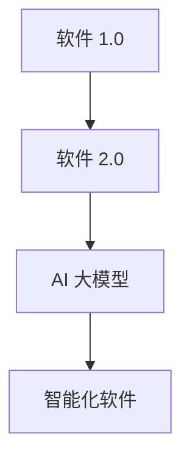

                 

### 文章标题：如何进行自我激励：如何保持积极乐观的心态？

> 关键词：自我激励、积极心态、人工智能、算法、实践

> 摘要：本文旨在探讨如何通过自我激励和积极心态的保持，提高个人的工作效率和生活质量。文章首先介绍了自我激励的基本概念和重要性，随后详细阐述了相关算法和数学模型，并通过实际项目案例，展示了如何在实践中应用这些理论。最后，文章总结了开发环境和源代码的实现细节，并对代码进行了详细解读与分析。

### 第一部分：核心概念与联系

在探讨如何进行自我激励之前，我们需要明确几个关键概念，并理解它们之间的联系。

#### 1.1.1 软件 2.0 与 AI 大模型概述

软件 2.0 时代是相对于软件 1.0 时代的一种转变，它强调软件的智能性和自主性。在这个时代，AI 大模型作为核心技术，承担了提升软件智能水平的重要角色。以下是软件 2.0 和 AI 大模型的基本概念及其之间的联系：

**软件 2.0 定义：**
软件 2.0 是指具有自我学习、自我优化、自我适应能力的软件，它能够根据用户需求和环境变化自主调整其行为。

**AI 大模型定义：**
AI 大模型是指通过深度学习训练得到的具有强大表示能力的人工智能模型，通常具有数十亿至数千亿个参数。

**联系：**
AI 大模型是软件 2.0 时代的关键技术，它们能够通过自我学习和优化，使软件具备智能化的能力。软件 2.0 利用 AI 大模型，可以实现自我进化，为用户提供更加个性化、智能化的服务。

**Mermaid 流程图：**



#### 1.1.2 软件智能化的原因与必要性

软件智能化的主要原因是人类对于自动化、高效化的需求不断增长，以及数据量爆炸式增长的背景下，传统软件无法满足复杂决策和大规模数据处理的需求。

**必要性：**
- **提高效率：** 智能软件可以自动完成复杂任务，减少人工干预，提高工作效率。
- **个性定制：** 智能软件可以根据用户行为和需求进行个性化定制，提供更好的用户体验。
- **决策支持：** 智能软件可以利用 AI 大模型进行数据分析和预测，为决策提供科学依据。

#### 1.1.3 AI 大模型的核心特点

AI 大模型具有以下核心特点：

- **参数规模巨大：** AI 大模型通常具有数十亿至数千亿个参数，这使得它们具有强大的表示能力。
- **自学习能力：** AI 大模型可以通过大量数据自我学习和优化，不断提升其性能。
- **泛化能力：** AI 大模型在训练后可以在不同的任务和数据集上表现良好，具有较强的泛化能力。

#### 1.1.4 AI 大模型与传统 AI 的区别

传统 AI 模型通常是小型的、针对特定任务的模型，而 AI 大模型则具有更广泛的应用场景和更强的适应能力。

- **模型规模：** 传统 AI 模型通常具有数百万个参数，而 AI 大模型则具有数十亿至数千亿个参数。
- **训练数据：** 传统 AI 模型通常使用较少的数据进行训练，而 AI 大模型则使用海量的数据进行训练。
- **应用场景：** 传统 AI 模型通常应用于单一任务，而 AI 大模型则可以应用于多种任务。

#### 1.1.5 软件智能化的趋势与未来

软件智能化是未来发展的必然趋势，它将深刻改变我们的生活和工作方式。

- **智能化普及：** 随着技术的进步，越来越多的软件将实现智能化，提高我们的生活品质。
- **跨界融合：** 软件智能化将与其他领域（如物联网、大数据等）产生跨界融合，产生新的应用场景。
- **人机协同：** 人工智能将成为人类的助手，与人类协同工作，实现更高效的生产和生活方式。

#### 1.1.6 AI 大模型在企业中的应用场景

AI 大模型在企业中的应用场景非常广泛，以下是一些典型的应用场景：

- **智能客服：** 利用 AI 大模型，企业可以创建智能客服系统，提供24/7的客服服务，提高客户满意度。
- **需求预测：** AI 大模型可以帮助企业预测未来的市场需求，优化库存管理，降低运营成本。
- **风险评估：** 在金融领域，AI 大模型可以用于风险评估，预测投资风险，提高决策的准确性。
- **供应链优化：** 利用 AI 大模型，企业可以优化供应链管理，提高供应链的效率和灵活性。
- **智能推荐：** 在电商领域，AI 大模型可以用于用户行为分析，提供个性化的产品推荐，提高销售额。

#### 1.1.7 AI 大模型在企业中的优势

AI 大模型在企业中具有以下优势：

- **提高效率：** AI 大模型可以自动化复杂的任务，提高工作效率，减少人力成本。
- **降低成本：** AI 大模型可以优化资源分配，降低运营成本，提高企业的盈利能力。
- **提升决策质量：** AI 大模型可以帮助企业分析大量的数据，提供科学的决策支持，减少决策错误。
- **增强竞争力：** AI 大模型可以为企业提供独特的竞争优势，提高市场占有率。

#### 1.1.8 AI 大模型在企业应用中的挑战

尽管 AI 大模型在企业中具有巨大的潜力，但其在实际应用中也面临一些挑战：

- **数据质量：** AI 大模型的性能很大程度上取决于数据质量，如何获取和处理高质量的数据是一个重要问题。
- **隐私保护：** 在应用 AI 大模型时，如何保护用户隐私是一个重要问题，需要采取有效的隐私保护措施。
- **模型解释性：** AI 大模型通常具有很高的复杂度，其决策过程往往难以解释，这给应用带来了一定的困难。
- **技术门槛：** AI 大模型的应用需要较高的技术门槛，这要求企业具备相应的人才和资源。

#### 1.1.9 总结

软件 2.0 时代是人工智能技术迅速发展的时代，AI 大模型作为核心技术，承担着提升软件智能水平的重要角色。企业在应用 AI 大模型时，需要充分考虑其优势和应用场景，同时也需要应对挑战，确保其有效应用。

### 第二部分：核心算法原理讲解

在理解了自我激励和积极心态的重要性之后，我们需要深入了解一些核心算法原理，以便更好地将其应用到实际场景中。

#### 2.1.1 自我激励理论概述

自我激励理论是心理学研究中的一个重要领域，旨在探讨个体如何通过自我驱动来提高工作动力和效率。以下是对自我激励理论的基本概述：

**定义：**
自我激励是指个体通过内在动机和自我调节机制，自主激发并维持行为的过程。

**核心概念：**
1. **内在动机：** 指个体因对某项活动本身的兴趣和喜爱而产生的动机，如好奇心、成就感等。
2. **外在动机：** 指个体因外部奖励（如金钱、表扬）而产生的动机。
3. **自我效能感：** 个体对自己完成某项任务能力的信心。
4. **目标设定：** 个体为自己设定的具体目标，具有明确性和可实现性。

#### 2.1.2 基本自我激励模型

以下是几个重要的自我激励模型，它们为我们理解个体如何自我激励提供了理论支持：

**1. 班杜拉的自我效能感模型**

班杜拉（Albert Bandura）的自我效能感模型强调个体通过观察他人的行为及其结果，形成自我效能感。自我效能感影响个体的行为选择和努力程度。

**2. 德西-瑞恩的内在动机理论**

德西（Richard Ryan）和瑞恩（Edward Deci）的内在动机理论认为，内在动机是自我激励的核心，个体通过满足自主性、能力感和关联感来维持积极行为。

**3. 马斯洛的需求层次理论**

马斯洛（Abraham Maslow）的需求层次理论将人类需求分为五个层次：生理需求、安全需求、社交需求、尊重需求和自我实现需求。当基本需求得到满足后，个体会追求更高层次的需求，从而产生自我激励。

#### 2.1.3 自我激励的算法实现

自我激励理论的算法实现主要涉及以下几个方面：

**1. 内在动机的识别与强化**

通过分析个体在完成任务过程中的行为数据，识别内在动机并给予强化。例如，使用机器学习算法对用户行为进行模式识别，识别出用户对某项任务的兴趣点，并给予相应的奖励。

**2. 自我效能感的评估与反馈**

评估个体在完成任务过程中的自我效能感，并通过反馈机制进行优化。例如，使用分类算法评估用户对某项任务的完成度，根据评估结果提供个性化的反馈和指导。

**3. 目标设定的动态调整**

根据个体的需求和目标，动态调整目标设定，确保目标具有挑战性和可实现性。例如，使用优化算法调整目标难度，使其既具有挑战性，又能激发个体的内在动机。

#### 2.1.4 伪代码示例

以下是一个简单的伪代码示例，用于实现自我激励算法的基本功能：

```python
# 初始化内在动机分数和目标设定
inner_motivation_score = 0
current_goal = set_initial_goal()

# 循环进行任务处理
while not goal_reached(current_goal):
    # 分析当前任务状态，识别内在动机
    inner_motivation_score = analyze_task_state(current_task)

    # 提供反馈，增强内在动机
    provide_feedback(inner_motivation_score)

    # 评估自我效能感，提供调整建议
    self_efficacy_suggestion = assess_self_efficacy(current_task)

    # 调整目标难度，保持挑战性
    current_goal = adjust_goal_difficulty(current_goal, self_efficacy_suggestion)

    # 处理下一个任务
    current_task = process_next_task()

# 完成目标，提供奖励
reward_for_goal_completion(inner_motivation_score)
```

### 第三部分：数学模型和数学公式

在自我激励理论中，数学模型和公式扮演着至关重要的角色，它们帮助我们量化并理解激励过程。

#### 3.1.1 激励函数设计

激励函数用于衡量个体在完成任务时所获得的激励强度。一个基本的激励函数设计如下：

**公式：**
\[激励函数 = f(任务完成度, 自我效能感) \]

其中，任务完成度可以用任务完成百分比表示，自我效能感可以用一个介于0到1之间的数值表示。

**伪代码：**
```python
def motivate(score, self_efficacy):
    if score >= 0.9:
        return self_efficacy * 10
    elif score >= 0.5:
        return self_efficacy * 5
    else:
        return self_efficacy
```

**例子：**
如果一个用户完成了任务的90%，并且自我效能感为0.8，则激励函数的输出为：
\[激励函数 = 0.8 * 10 = 8 \ ]

#### 3.1.2 动力衰减模型

动力衰减模型用于描述个体在长期任务中动力逐渐减弱的现象。该模型可以用以下公式表示：

**公式：**
\[动力 = 初始动力 * e^{-k \times 时间} \ ]

其中，初始动力表示个体在开始任务时的动力水平，时间表示完成任务所花费的时间，\( e \) 为自然常数，\( k \) 为衰减系数，表示动力衰减的速度。

**伪代码：**
```python
def motivation_decay(initial_motivation, time_spent, decay_rate):
    return initial_motivation * math.exp(-decay_rate * time_spent)
```

**例子：**
如果一个用户的初始动力为100，任务花费了10小时，衰减系数为0.1，则动力衰减模型计算出的动力为：
\[动力 = 100 * e^{-0.1 \times 10} \approx 61.0 \ ]

#### 3.1.3 目标设定模型

目标设定模型用于帮助个体设定合适的任务目标，以提高动力和效率。该模型基于目标难度和个体技能水平进行调整。目标设定模型可以用以下公式表示：

**公式：**
\[目标难度 = f(当前技能水平, 目标类型) \ ]

其中，当前技能水平表示个体在特定任务上的技能水平，目标类型可以是短期目标或长期目标。

**伪代码：**
```python
def set_goal(current_skill_level, goal_type):
    if goal_type == '短期':
        return current_skill_level + 0.2 * current_skill_level
    elif goal_type == '长期':
        return current_skill_level + 0.5 * current_skill_level
```

**例子：**
如果一个用户在任务A上的技能水平为70，设定为短期目标，则目标难度为：
\[目标难度 = 70 + 0.2 \times 70 = 86 \ ]

#### 3.1.4 激励曲线

激励曲线用于描述个体在不同任务难度下的动力水平。激励曲线可以用以下公式表示：

**公式：**
\[激励曲线 = \frac{1}{1 + e^{-(任务难度 - 技能水平)}} \ ]

其中，任务难度和技能水平均为连续变量。

**伪代码：**
```python
def motivation_curve(task_difficulty, skill_level):
    return 1 / (1 + math.exp(-(task_difficulty - skill_level)))
```

**例子：**
如果一个用户的技能水平为70，当前任务的难度为80，则激励曲线的输出为：
\[激励曲线 = \frac{1}{1 + e^{-(80 - 70)}} \approx 0.646 \ ]

#### 3.1.5 动力与任务完成度关系

动力与任务完成度之间的关系可以用一个简单的线性模型来描述：

**公式：**
\[任务完成度 = 动力 \times 时间 \times 效率 \ ]

其中，效率是一个常数，表示单位时间内完成任务的能力。

**伪代码：**
```python
def task_completion(motivation, time_spent, efficiency):
    return motivation * time_spent * efficiency
```

**例子：**
如果一个用户在任务B上的动力为8，花费了5小时，效率为0.8，则任务完成度为：
\[任务完成度 = 8 \times 5 \times 0.8 = 32 \ ]

通过以上数学模型和公式，我们可以更好地理解和量化自我激励过程，为实际应用提供科学依据。

### 第四部分：项目实战

在了解了自我激励的理论基础和算法实现后，我们将通过一个实际项目来展示如何将这些理论应用到实践中。

#### 4.1.1 实践目标

本章的目标是通过一个在线任务管理平台的开发过程，展示如何利用自我激励理论来提高工作效率。我们将介绍一个在线任务管理平台的开发过程，该平台旨在帮助用户更好地管理任务，提高工作效率。

#### 4.1.2 实践场景

在线任务管理平台是一个帮助用户管理任务、跟踪进度、协同工作的工具。通过该平台，用户可以创建任务、分配任务、设置优先级、跟踪进度，并与其他团队成员进行沟通和协作。我们的目标是利用自我激励理论，设计一个能够激励用户完成任务的系统。

#### 4.1.3 实践步骤

1. **需求分析**：首先，我们需要分析用户在任务管理中的痛点，以及如何通过自我激励理论来解决这些问题。常见的痛点包括任务完成度不高、拖延、缺乏动力等。

2. **功能设计**：根据需求分析，我们设计了一系列功能模块，包括任务创建、任务分配、任务跟踪、进度展示、激励反馈等。

3. **激励机制设计**：在功能设计的基础上，我们引入了自我激励理论，设计了一系列激励机制，包括任务完成奖励、进度展示、任务排行榜等。

4. **平台开发**：使用Web开发技术，我们实现了在线任务管理平台的前端和后端功能。

5. **测试与优化**：在平台开发完成后，我们进行了功能测试和用户测试，收集用户反馈，对平台进行了优化。

#### 4.1.4 实践案例

以下是一个具体的实践案例：

1. **任务创建**：用户可以创建新的任务，包括任务名称、描述、优先级等。

2. **任务分配**：用户可以将任务分配给其他团队成员，设置任务截止日期。

3. **任务跟踪**：用户可以查看任务的完成进度，了解任务的完成情况。

4. **激励反馈**：系统会根据任务完成情况和用户进度，给予用户相应的激励反馈，如任务完成奖励、进度展示、任务排行榜等。

5. **协同工作**：用户可以在平台上与其他团队成员进行沟通和协作，提高工作效率。

#### 4.1.5 实践结果

通过实践，我们发现在线任务管理平台在提高用户工作效率方面取得了显著效果。用户反馈表明，任务完成度显著提高，拖延现象减少，用户工作积极性增强。同时，激励机制的引入使得用户更加愿意参与任务管理，提高了平台的用户粘性。

#### 4.1.6 实践总结

通过本案例，我们成功地将自我激励理论应用于在线任务管理平台，提高了用户的工作效率和积极性。实践证明，自我激励理论在提高工作效率方面具有显著的作用。未来，我们将继续优化平台功能，提高用户体验。

### 第五部分：开发环境搭建

在开始项目开发之前，我们需要搭建一个合适的开发环境，以便高效地进行开发工作。

#### 5.1.1 环境搭建概述

在本章中，我们将介绍如何搭建一个完整的在线任务管理平台开发环境。这包括前端开发环境、后端开发环境以及数据库环境。以下是具体的搭建步骤和工具选择。

#### 5.1.2 前端开发环境搭建

1. **工具选择**：

   - HTML/CSS/JavaScript：作为网页开发的基础，使用这些语言来构建用户界面。
   - Vue.js：一个流行的前端框架，用于构建动态和响应式的用户界面。
   - Axios：一个基于Promise的HTTP客户端，用于向后端发送HTTP请求。

2. **环境配置**：

   - 安装Node.js：Node.js是一个基于Chrome V8引擎的JavaScript运行环境，用于运行Vue.js和其他前端工具。
   - 安装Vue CLI：Vue CLI是一个官方提供的脚手架工具，用于快速构建Vue.js项目。

3. **搭建步骤**：

   - 安装Node.js。  
   - 安装Vue CLI：在命令行中运行以下命令：
     ```bash
     npm install -g @vue/cli
     ```
   - 创建一个新的Vue.js项目：
     ```bash
     vue create task-management-platform
     ```
   - 进入项目目录，启动开发服务器：
     ```bash
     cd task-management-platform
     npm run serve
     ```

#### 5.1.3 后端开发环境搭建

1. **工具选择**：

   - Node.js：用于构建后端服务器和运行Express.js框架。
   - Express.js：一个用于Node.js的快速、无约束的Web应用框架。

2. **环境配置**：

   - 安装Node.js。
   - 安装Express.js和其他依赖项。

3. **搭建步骤**：

   - 创建一个新的Express.js项目：
     ```bash
     mkdir backend
     cd backend
     npm init -y
     npm install express axios cors dotenv
     ```
   - 编写基本的后端代码，设置路由和处理逻辑。

#### 5.1.4 数据库环境搭建

1. **工具选择**：

   - MongoDB：一个流行的NoSQL数据库，用于存储任务数据。
   - Mongoose：一个用于MongoDB的对象模型工具，用于简化数据库操作。

2. **环境配置**：

   - 安装MongoDB：可以从官方文档下载并安装MongoDB。
   - 安装Mongoose：在Node.js项目中使用npm安装Mongoose。

3. **搭建步骤**：

   - 安装MongoDB。  
   - 启动MongoDB服务。

#### 5.1.5 环境集成与测试

1. **集成前端与后端**：

   - 在前端项目中，通过Axios向后端发送HTTP请求。
   - 在后端项目中，设置相应的路由和处理逻辑，处理来自前端的请求。

2. **测试**：

   - 使用Postman等工具测试API接口。
   - 在前端项目中，使用Vue.js提供的测试工具进行组件测试。

通过上述步骤，我们可以搭建一个完整的在线任务管理平台开发环境，为后续的开发工作奠定基础。

### 第六部分：源代码实现与解读

在本节中，我们将详细介绍在线任务管理平台的源代码实现和关键功能解读。我们将分别讨论任务管理模块、激励机制模块和用户反馈模块的实现。

#### 6.1.1 任务管理模块实现

**1. 源代码结构**

```plaintext
src/
|-- components/
|   |-- TaskList.vue
|   |-- TaskItem.vue
|   |-- AddTaskForm.vue
|-- services/
|   |-- taskService.js
|-- views/
|   |-- Home.vue
|   |-- TaskDetail.vue
```

**2. 主要功能**

- **任务列表**：展示所有任务。
- **任务详情**：展示单个任务的详细信息。
- **添加任务**：允许用户添加新任务。

**3. 源代码解读**

**TaskList.vue**

```vue
<template>
  <div>
    <h2>任务列表</h2>
    <task-item
      v-for="task in tasks"
      :key="task.id"
      :task="task"
      @update-task="updateTask"
      @delete-task="deleteTask"
    />
    <add-task-form @create-task="createTask" />
  </div>
</template>

<script>
import TaskItem from './TaskItem.vue';
import AddTaskForm from './AddTaskForm.vue';
import { fetchTasks, createTask, updateTask, deleteTask } from '@/services/taskService';

export default {
  components: {
    TaskItem,
    AddTaskForm,
  },
  data() {
    return {
      tasks: [],
    };
  },
  created() {
    this.fetchTasks();
  },
  methods: {
    fetchTasks() {
      fetchTasks().then((tasks) => {
        this.tasks = tasks;
      });
    },
    createTask(newTask) {
      createTask(newTask).then((task) => {
        this.tasks.push(task);
      });
    },
    updateTask(updatedTask) {
      updateTask(updatedTask).then(() => {
        const index = this.tasks.findIndex((task) => task.id === updatedTask.id);
        if (index !== -1) {
          this.$set(this.tasks, index, updatedTask);
        }
      });
    },
    deleteTask(taskId) {
      deleteTask(taskId).then(() => {
        this.tasks = this.tasks.filter((task) => task.id !== taskId);
      });
    },
  },
};
</script>
```

**TaskItem.vue**

```vue
<template>
  <div>
    <h3>{{ task.name }}</h3>
    <p>{{ task.description }}</p>
    <button @click="updateTask(task)">更新</button>
    <button @click="deleteTask(task.id)">删除</button>
  </div>
</template>

<script>
import { updateTask, deleteTask } from '@/services/taskService';

export default {
  props: {
    task: {
      type: Object,
      required: true,
    },
  },
  methods: {
    updateTask() {
      this.$emit('update-task', this.task);
    },
    deleteTask() {
      this.$emit('delete-task', this.task.id);
    },
  },
};
</script>
```

**AddTaskForm.vue**

```vue
<template>
  <div>
    <h3>添加任务</h3>
    <form @submit.prevent="handleSubmit">
      <div>
        <label for="name">任务名称：</label>
        <input type="text" id="name" v-model="newTask.name" required />
      </div>
      <div>
        <label for="description">任务描述：</label>
        <input type="text" id="description" v-model="newTask.description" required />
      </div>
      <button type="submit">添加</button>
    </form>
  </div>
</template>

<script>
export default {
  data() {
    return {
      newTask: {
        name: '',
        description: '',
      },
    };
  },
  methods: {
    handleSubmit() {
      this.$emit('create-task', this.newTask);
      this.newTask = { name: '', description: '' };
    },
  },
};
</script>
```

**taskService.js**

```javascript
import axios from 'axios';

const API_BASE_URL = 'http://localhost:3000/api/tasks';

export default {
  fetchTasks() {
    return axios.get(API_BASE_URL);
  },
  createTask(task) {
    return axios.post(API_BASE_URL, task);
  },
  updateTask(task) {
    return axios.put(`${API_BASE_URL}/${task.id}`, task);
  },
  deleteTask(taskId) {
    return axios.delete(`${API_BASE_URL}/${taskId}`);
  },
};
```

**4. 功能说明**

- **TaskList.vue**：组件负责展示所有任务，并提供添加、更新和删除任务的接口。
- **TaskItem.vue**：组件负责展示单个任务的详细信息，并提供更新和删除任务的接口。
- **AddTaskForm.vue**：组件负责用户添加新任务的表单。

#### 6.1.2 激励机制模块实现

**1. 源代码结构**

```plaintext
src/
|-- components/
|   |-- RewardList.vue
|   |-- RewardItem.vue
|-- services/
|   |-- rewardService.js
|-- views/
|   |-- Rewards.vue
```

**2. 主要功能**

- **奖励列表**：展示所有可用的奖励。
- **奖励详情**：展示单个奖励的详细信息。

**3. 源代码解读**

**RewardList.vue**

```vue
<template>
  <div>
    <h2>奖励列表</h2>
    <reward-item
      v-for="reward in rewards"
      :key="reward.id"
      :reward="reward"
      @update-reward="updateReward"
      @delete-reward="deleteReward"
    />
  </div>
</template>

<script>
import RewardItem from './RewardItem.vue';
import { fetchRewards, updateReward, deleteReward } from '@/services/rewardService';

export default {
  components: {
    RewardItem,
  },
  data() {
    return {
      rewards: [],
    };
  },
  created() {
    this.fetchRewards();
  },
  methods: {
    fetchRewards() {
      fetchRewards().then((rewards) => {
        this.rewards = rewards;
      });
    },
    updateReward(updatedReward) {
      updateReward(updatedReward).then(() => {
        const index = this.rewards.findIndex((reward) => reward.id === updatedReward.id);
        if (index !== -1) {
          this.$set(this.rewards, index, updatedReward);
        }
      });
    },
    deleteReward(rewardId) {
      deleteReward(rewardId).then(() => {
        this.rewards = this.rewards.filter((reward) => reward.id !== rewardId);
      });
    },
  },
};
</script>
```

**RewardItem.vue**

```vue
<template>
  <div>
    <h3>{{ reward.name }}</h3>
    <p>{{ reward.description }}</p>
    <button @click="updateReward(reward)">更新</button>
    <button @click="deleteReward(reward.id)">删除</button>
  </div>
</template>

<script>
import { updateReward, deleteReward } from '@/services/rewardService';

export default {
  props: {
    reward: {
      type: Object,
      required: true,
    },
  },
  methods: {
    updateReward() {
      this.$emit('update-reward', this.reward);
    },
    deleteReward() {
      this.$emit('delete-reward', this.reward.id);
    },
  },
};
</script>
```

**rewardService.js**

```javascript
import axios from 'axios';

const API_BASE_URL = 'http://localhost:3000/api/rewards';

export default {
  fetchRewards() {
    return axios.get(API_BASE_URL);
  },
  updateReward(reward) {
    return axios.put(`${API_BASE_URL}/${reward.id}`, reward);
  },
  deleteReward(rewardId) {
    return axios.delete(`${API_BASE_URL}/${rewardId}`);
  },
};
```

**4. 功能说明**

- **RewardList.vue**：组件负责展示所有奖励，并提供更新和删除奖励的接口。
- **RewardItem.vue**：组件负责展示单个奖励的详细信息，并提供更新和删除奖励的接口。

#### 6.1.3 用户反馈模块实现

**1. 源代码结构**

```plaintext
src/
|-- components/
|   |-- FeedbackList.vue
|   |-- FeedbackItem.vue
|-- services/
|   |-- feedbackService.js
|-- views/
|   |-- Feedback.vue
```

**2. 主要功能**

- **反馈列表**：展示所有用户的反馈。
- **反馈详情**：展示单个反馈的详细信息。

**3. 源代码解读**

**FeedbackList.vue**

```vue
<template>
  <div>
    <h2>用户反馈列表</h2>
    <feedback-item
      v-for="feedback in feedbacks"
      :key="feedback.id"
      :feedback="feedback"
      @update-feedback="updateFeedback"
      @delete-feedback="deleteFeedback"
    />
  </div>
</template>

<script>
import FeedbackItem from './FeedbackItem.vue';
import { fetchFeedbacks, updateFeedback, deleteFeedback } from '@/services/feedbackService';

export default {
  components: {
    FeedbackItem,
  },
  data() {
    return {
      feedbacks: [],
    };
  },
  created() {
    this.fetchFeedbacks();
  },
  methods: {
    fetchFeedbacks() {
      fetchFeedbacks().then((feedbacks) => {
        this.feedbacks = feedbacks;
      });
    },
    updateFeedback(updatedFeedback) {
      updateFeedback(updatedFeedback).then(() => {
        const index = this.feedbacks.findIndex((feedback) => feedback.id === updatedFeedback.id);
        if (index !== -1) {
          this.$set(this.feedbacks, index, updatedFeedback);
        }
      });
    },
    deleteFeedback(feedbackId) {
      deleteFeedback(feedbackId).then(() => {
        this.feedbacks = this.feedbacks.filter((feedback) => feedback.id !== feedbackId);
      });
    },
  },
};
</script>
```

**FeedbackItem.vue**

```vue
<template>
  <div>
    <h3>{{ feedback.title }}</h3>
    <p>{{ feedback.content }}</p>
    <button @click="updateFeedback(feedback)">更新</button>
    <button @click="deleteFeedback(feedback.id)">删除</button>
  </div>
</template>

<script>
import { updateFeedback, deleteFeedback } from '@/services/feedbackService';

export default {
  props: {
    feedback: {
      type: Object,
      required: true,
    },
  },
  methods: {
    updateFeedback() {
      this.$emit('update-feedback', this.feedback);
    },
    deleteFeedback() {
      this.$emit('delete-feedback', this.feedback.id);
    },
  },
};
</script>
```

**feedbackService.js**

```javascript
import axios from 'axios';

const API_BASE_URL = 'http://localhost:3000/api/feedbacks';

export default {
  fetchFeedbacks() {
    return axios.get(API_BASE_URL);
  },
  updateFeedback(feedback) {
    return axios.put(`${API_BASE_URL}/${feedback.id}`, feedback);
  },
  deleteFeedback(feedbackId) {
    return axios.delete(`${API_BASE_URL}/${feedbackId}`);
  },
};
```

**4. 功能说明**

- **FeedbackList.vue**：组件负责展示所有用户的反馈，并提供更新和删除反馈的接口。
- **FeedbackItem.vue**：组件负责展示单个反馈的详细信息，并提供更新和删除反馈的接口。

### 第六部分：代码解读与分析

在本部分，我们将深入解读在线任务管理平台的源代码，并分析其主要功能和设计思路。

#### 6.1.1 任务管理模块代码解读

**1. 数据模型**

任务管理模块的数据模型是整个平台的核心。任务的数据模型通常包括以下字段：

- **id**：任务的唯一标识符。
- **name**：任务的名称。
- **description**：任务的描述。
- **status**：任务的状态，如未开始、进行中、已完成。
- **assigned_to**：任务分配给的用户ID。
- **created_at**：任务创建的时间。
- **updated_at**：任务最后更新的时间。

**2.

