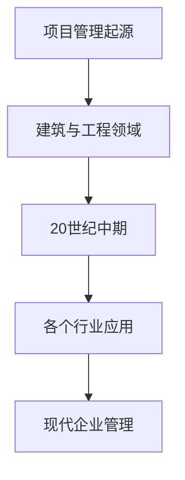
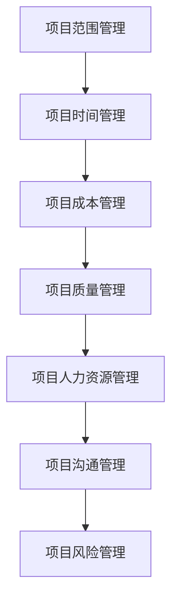
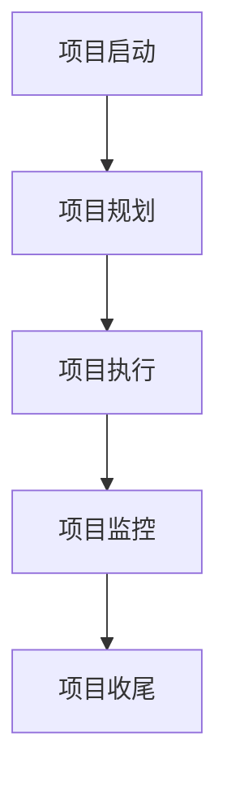
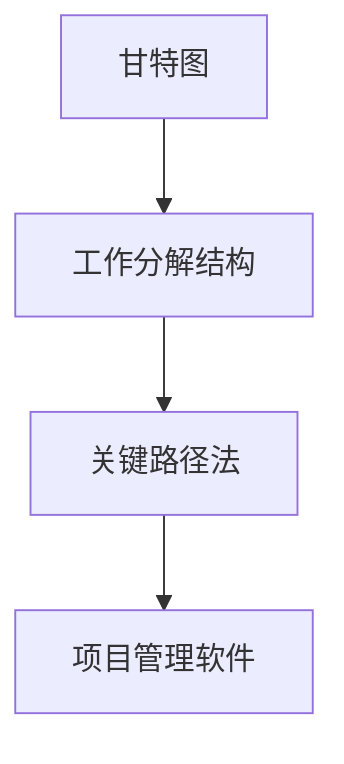
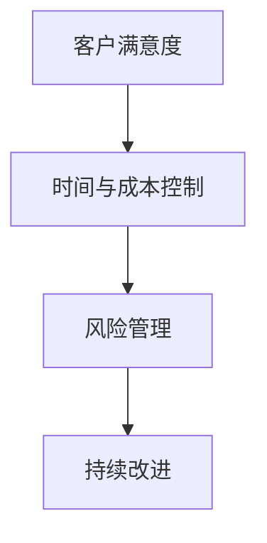
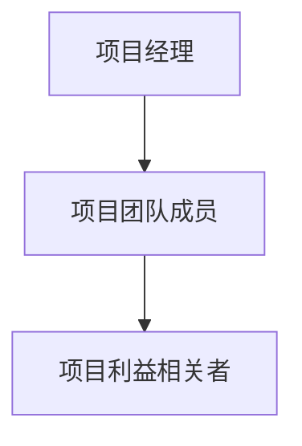
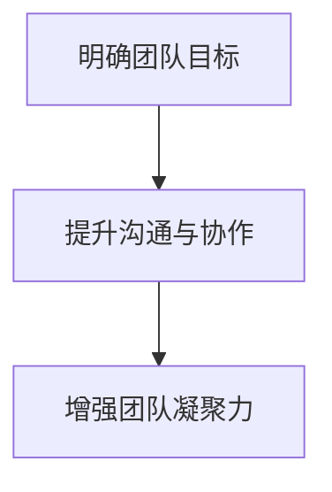
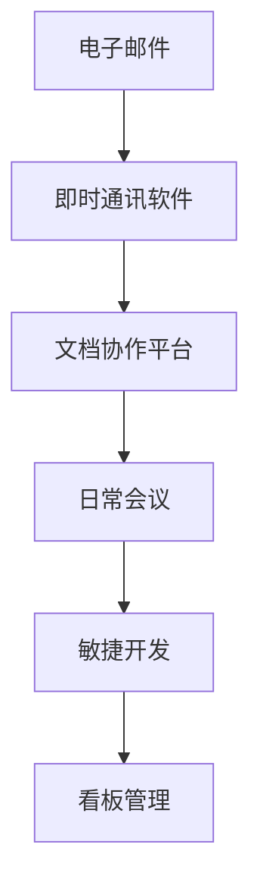
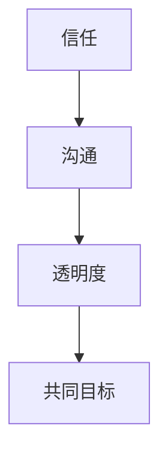
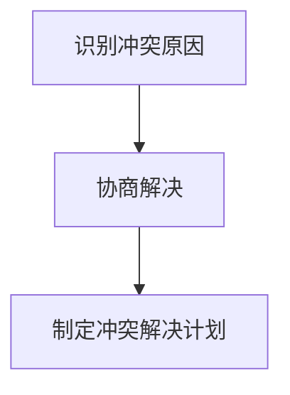

                 

## 如何进行项目管理：如何有效地管理项目和团队？

关键词：项目管理、项目团队、项目计划、时间管理、成本管理、质量管理、风险管理、沟通协调、项目收尾、最佳实践

摘要：本文深入探讨了项目管理的核心概念、原理、实际操作以及最佳实践。从项目管理的定义、组成部分、流程与方法出发，逐步分析了项目团队管理、项目计划与时间管理、项目成本管理、项目质量管理、项目风险管理、项目沟通与协调以及项目收尾与评估等方面。最后，通过项目管理证书与认证、项目管理工具与资源以及常见问题解答等附录，为项目管理者提供了全面、实用的指导。

---

### 目录大纲

1. **第一部分：项目管理基础知识**
   - **第1章：项目管理的核心概念与原理**
     - **1.1 项目管理的定义与背景**
     - **1.2 项目管理的主要组成部分**
     - **1.3 项目管理流程与方法**
     - **1.4 项目管理工具与技术**
     - **1.5 项目管理的核心原则与实践**

   - **第2章：项目团队管理与协作**
     - **2.1 项目团队的角色与职责**
     - **2.2 项目团队建设与管理策略**
     - **2.3 团队协作工具与方法**
     - **2.4 高效团队协作的关键因素**
     - **2.5 项目团队冲突管理与解决策略**

2. **第二部分：项目管理实际操作**
   - **第3章：项目计划与时间管理**
     - **3.1 项目计划编制**
     - **3.2 项目时间管理方法**
     - **3.3 时间管理工具与应用**
     - **3.4 项目进度监控与调整**
     - **3.5 时间管理最佳实践**

   - **第4章：项目成本管理与预算控制**
     - **4.1 项目成本管理概述**
     - **4.2 项目成本估算方法**
     - **4.3 项目预算编制**
     - **4.4 项目成本监控与控制**
     - **4.5 成本管理案例分析**

   - **第5章：项目质量管理与质量控制**
     - **5.1 项目质量管理概述**
     - **5.2 质量管理方法与技术**
     - **5.3 质量控制工具与应用**
     - **5.4 项目质量保证与质量改进**
     - **5.5 质量管理案例分析**

   - **第6章：项目风险管理**
     - **6.1 风险管理概述**
     - **6.2 风险识别方法**
     - **6.3 风险评估与优先级排序**
     - **6.4 风险应对策略**
     - **6.5 风险监控与报告**
     - **6.6 风险管理案例分析**

   - **第7章：项目沟通与协调**
     - **7.1 项目沟通管理概述**
     - **7.2 沟通渠道与沟通方式**
     - **7.3 沟通工具与技术**
     - **7.4 沟通策略与技巧**
     - **7.5 项目协调机制**
     - **7.6 沟通管理案例分析**

   - **第8章：项目收尾与评估**
     - **8.1 项目收尾概述**
     - **8.2 项目验收标准与流程**
     - **8.3 项目评估方法与指标**
     - **8.4 项目总结与经验教训**
     - **8.5 项目收尾案例分析**

3. **第三部分：项目管理最佳实践**
   - **第9章：项目管理最佳实践**
     - **9.1 项目管理最佳实践概述**
     - **9.2 项目管理最佳实践案例**
     - **9.3 项目管理最佳实践总结**
     - **9.4 项目管理发展趋势与未来展望**

4. **第四部分：项目管理证书与认证**
   - **第10章：项目管理证书与认证**
     - **10.1 项目管理证书概述**
     - **10.2 证书认证流程与准备**
     - **10.3 证书的价值与影响**
     - **10.4 项目管理证书案例分析**

5. **附录**
   - **附录A：项目管理工具与资源**
   - **附录B：项目模板与示例**
   - **附录C：项目管理常见问题解答**

---

### 第一部分：项目管理基础知识

#### 第1章：项目管理的核心概念与原理

**1.1 项目管理的定义与背景**

项目管理是指通过计划、组织、协调、控制和监督等手段，确保项目按照预定目标成功完成的活动。项目管理涉及到多个领域的知识，包括但不限于工程、管理、信息技术、市场营销等。其起源可以追溯到20世纪中期，当时项目管理主要应用于建筑和工程领域。随着时间的发展，项目管理逐渐扩展到各个行业，成为现代企业管理中不可或缺的一部分。

**项目管理定义与背景的 Mermaid 流程图：**



**1.2 项目管理的主要组成部分**

项目管理包括多个组成部分，每个部分都对项目的成功完成起到关键作用。主要组成部分如下：

- **项目范围管理**：定义项目的边界和范围，确保项目团队理解项目的目标和工作内容。
- **项目时间管理**：制定项目的时间表，确保项目按时完成。
- **项目成本管理**：估算和控制项目的成本，确保项目在预算范围内完成。
- **项目质量管理**：确保项目的产品或服务满足预定的质量标准。
- **项目人力资源管理**：管理和协调项目团队的工作，确保项目目标的实现。
- **项目沟通管理**：确保项目团队和相关利益相关者之间的信息传递和沟通。
- **项目风险管理**：识别、评估和控制项目中的风险，以减少对项目目标的影响。

**项目管理组成部分的 Mermaid 流程图：**



**1.3 项目管理流程与方法**

项目管理流程包括以下几个阶段：

- **项目启动**：确定项目目标和可行性，组建项目团队。
- **项目规划**：制定项目的详细计划，包括时间、成本、资源等。
- **项目执行**：按照计划执行项目任务，进行项目管理工作。
- **项目监控**：监控项目进度、成本、质量等，确保项目按计划进行。
- **项目收尾**：完成项目交付，进行项目评估和总结。

项目管理的方法包括以下几种：

- **工作分解结构（WBS）**：将项目工作分解为可管理的任务和子任务。
- **甘特图**：展示项目的时间安排和进度。
- **关键路径法（CPM）**：确定项目的关键路径和关键任务。
- **项目管理软件**：提供项目计划、跟踪和报告的工具。

**项目管理流程与方法的 Mermaid 流程图：**



**1.4 项目管理工具与技术**

项目管理中常用的工具和技术包括：

- **甘特图**：用于展示项目的时间安排和进度。
- **工作分解结构（WBS）**：用于将项目工作分解为可管理的任务。
- **关键路径法（CPM）**：用于确定项目的关键路径和关键任务。
- **项目管理软件**：如 Microsoft Project、Trello、Asana 等，用于项目计划、跟踪和报告。

**项目管理工具与技术的 Mermaid 流程图：**



**1.5 项目管理的核心原则与实践**

项目管理的核心原则包括：

- **客户满意度**：确保项目交付的产品或服务满足客户需求。
- **时间与成本控制**：确保项目按时、按预算完成。
- **风险管理**：识别和应对项目中的风险。
- **持续改进**：不断优化项目管理过程。

项目管理的实践方面，企业应制定项目规划、执行、监控和收尾的标准操作流程，确保项目管理的规范性和效率。

**项目管理的核心原则与实践的 Mermaid 流程图：**



### 第2章：项目团队管理与协作

#### 2.1 项目团队的角色与职责

项目团队由多个角色组成，每个角色都有特定的职责。以下是常见的项目团队角色及其职责：

- **项目经理**：负责整个项目的规划、执行、监控和收尾。项目经理是项目的领导者，协调团队的工作，确保项目目标的实现。
- **项目团队成员**：根据项目需要，包括开发人员、设计师、测试人员等。团队成员负责完成分配给他们的任务，为项目的成功贡献力量。
- **项目利益相关者**：包括项目的客户、供应商、投资人等。利益相关者参与项目的决策过程，对项目的结果有重要影响。

**项目团队角色的 Mermaid 流程图：**



#### 2.2 项目团队建设与管理策略

项目团队建设与管理策略包括以下几个方面：

- **明确团队目标**：确保所有团队成员都理解项目的目标，并为其努力。
- **提升团队沟通与协作**：建立良好的沟通机制，确保团队成员之间的信息流畅。
- **增强团队凝聚力**：通过团队建设活动，增强团队成员之间的信任和合作关系。

**项目团队建设与管理策略的 Mermaid 流程图：**



#### 2.3 团队协作工具与方法

团队协作工具包括：

- **电子邮件**：用于正式的沟通和文件交换。
- **即时通讯软件**：如 Slack、Telegram 等，用于实时沟通。
- **文档协作平台**：如 Google Docs、Notion 等，用于文档共享和协作。

团队协作方法包括：

- **日常会议**：定期召开会议，讨论项目进展和问题。
- **敏捷开发**：采用敏捷开发方法，快速迭代，及时调整。
- **看板管理**：使用看板（Kanban）进行工作流程管理。

**团队协作工具与方法的 Mermaid 流程图：**



#### 2.4 高效团队协作的关键因素

高效团队协作的关键因素包括：

- **信任**：团队成员之间的信任是高效协作的基础。
- **沟通**：有效的沟通确保信息的准确传递和理解。
- **透明度**：项目进展和问题对团队成员透明，有利于协调和决策。
- **共同目标**：团队成员对项目目标的共同理解，有助于协作和努力。

**高效团队协作的关键因素的 Mermaid 流程图：**



#### 2.5 项目团队冲突管理与解决策略

项目团队冲突是不可避免的，有效的冲突管理策略包括：

- **识别冲突原因**：了解冲突的根本原因，是解决冲突的第一步。
- **协商解决**：通过对话和协商，寻找双方都能接受的解决方案。
- **制定冲突解决计划**：明确解决冲突的步骤和责任，确保冲突得到有效处理。

**项目团队冲突管理与解决策略的 Mermaid 流程图：**



### 第二部分：项目管理实际操作

#### 第3章：项目计划与时间管理

**3.1 项目计划编制**

项目计划编制是项目管理中至关重要的一环。以下是项目计划编制的详细步骤：

1. **确定项目范围和目标**：明确项目的具体内容和预期目标，这是项目计划的基础。
2. **分解项目工作**：将项目目标分解为可管理的任务和子任务。
3. **定义项目交付成果**：明确项目完成时需要交付的具体成果，如文档、软件、硬件等。
4. **制定项目里程碑**：设定项目的重要时间节点，如启动会议、初步设计完成、原型开发完成等。
5. **安排项目时间表**：根据项目工作和里程碑，制定详细的时间表。
6. **分配项目资源**：确定项目所需的资源，包括人力、资金、设备等。
7. **制定项目预算**：根据项目资源和时间表，估算项目成本，并制定预算。
8. **审查和批准项目计划**：对项目计划进行审查，确保其可行性和合理性，并获得相关利益相关者的批准。

**项目计划编制的伪代码：**

```python
# 步骤1：确定项目范围和目标
define_project_scope_and_objectives()

# 步骤2：分解项目工作
decompose_project_work()

# 步骤3：定义项目交付成果
define_project_deliverables()

# 步骤4：制定项目里程碑
define_project_milestones()

# 步骤5：安排项目时间表
schedule_project_activities()

# 步骤6：分配项目资源
allocate_project_resources()

# 步骤7：制定项目预算
develop_project_budget()

# 步骤8：审查和批准项目计划
review_and_approve_project_plan()
```

**3.2 项目时间管理方法**

项目时间管理是确保项目按时完成的关键。以下是几种常见的时间管理方法：

- **工作分解结构（WBS）**：将项目工作分解为更小的任务和子任务，便于管理和跟踪。
- **甘特图**：展示项目的时间安排和进度，便于可视化项目进展。
- **关键路径法（CPM）**：确定项目的关键路径和关键任务，确保项目按时完成。

**项目时间管理方法的伪代码：**

```python
# 步骤1：创建工作分解结构
create_work_breakdown_structure()

# 步骤2：创建甘特图
create_gantt_chart()

# 步骤3：应用关键路径法
apply_critical_path_method()
```

**3.3 时间管理工具与应用**

在项目时间管理中，使用适当的工具可以提高效率。以下是几种常用的时间管理工具：

- **Microsoft Project**：用于项目计划、跟踪和报告，功能强大且用户友好。
- **Trello**：一个基于看板的任务管理工具，适合敏捷开发团队。
- **Asana**：用于任务分配、进度跟踪和团队协作，支持多种视图和报告。

**时间管理工具与应用的伪代码：**

```python
# 步骤1：选择时间管理工具
choose_time_management_tool()

# 步骤2：配置和设置工具
configure_and_set_up_tool()

# 步骤3：使用工具进行项目时间管理
use_tool_for_project_time_management()
```

**3.4 项目进度监控与调整**

项目进度监控是确保项目按计划进行的关键步骤。以下是项目进度监控与调整的步骤：

1. **定期审查项目进度**：定期检查项目进展，确保所有任务都在按计划进行。
2. **识别进度偏差**：分析项目进度数据，识别与计划相比的偏差。
3. **分析偏差原因**：调查偏差的原因，是否是由于资源不足、技术问题、外部因素等。
4. **制定调整计划**：根据偏差原因，制定调整计划，如重新分配资源、调整时间表等。
5. **执行调整计划**：实施调整计划，确保项目能够回到正轨。
6. **监控调整效果**：跟踪调整后的项目进度，确保调整措施有效。

**项目进度监控与调整的伪代码：**

```python
# 步骤1：定期审查项目进度
review_project_progress()

# 步骤2：识别进度偏差
identify_progress_variances()

# 步骤3：分析偏差原因
analyze_reasons_for_deviation()

# 步骤4：制定调整计划
develop_adjustment_plan()

# 步骤5：执行调整计划
execute_adjustment_plan()

# 步骤6：监控调整效果
monitor_adjustment_effects()
```

**3.5 时间管理最佳实践**

以下是几个时间管理的最佳实践：

- **明确时间目标**：为每个任务设定明确的时间目标，确保任务能够按时完成。
- **优化任务分配**：根据团队成员的能力和负载，合理分配任务，避免过度工作。
- **提高工作效率**：通过培训、工具和技术，提高团队成员的工作效率。

**时间管理最佳实践的伪代码：**

```python
# 步骤1：明确时间目标
define_time_targets()

# 步骤2：优化任务分配
optimize_task_allocation()

# 步骤3：提高工作效率
increase工作效率()
```

### 第三部分：项目管理实际操作

#### 第4章：项目成本管理与预算控制

**4.1 项目成本管理概述**

项目成本管理是确保项目在预算范围内完成的关键环节。以下是项目成本管理的主要任务：

1. **估算项目成本**：根据项目需求和资源需求，估算项目的总成本。
2. **制定预算**：将估算的成本分配到项目的各个阶段和任务，制定详细的预算。
3. **监控成本变化**：定期审查项目的实际成本支出，与预算进行比较，及时发现和解决问题。
4. **控制成本超支**：制定和实施措施，确保项目成本不超过预算。

**项目成本管理概述的伪代码：**

```python
# 步骤1：估算项目成本
estimate_project_costs()

# 步骤2：制定预算
develop_budget()

# 步骤3：监控成本变化
monitor_cost_variances()

# 步骤4：控制成本超支
control_cost_overruns()
```

**4.2 项目成本估算方法**

项目成本估算方法有多种，以下是常用的几种：

1. **自下而上估算**：从底层任务开始，逐级向上汇总成本。
2. **自上而下估算**：从项目总体成本开始，逐级向下分解到具体任务。
3. **类比估算**：参考类似项目的成本数据，估算当前项目的成本。

**项目成本估算方法的伪代码：**

```python
# 步骤1：自下而上估算
bottom_up_estimation()

# 步骤2：自上而下估算
top_down_estimation()

# 步骤3：类比估算
analogous_estimation()
```

**4.3 项目预算编制**

项目预算编制是项目成本管理的重要环节。以下是项目预算编制的步骤：

1. **确定项目成本要素**：列出项目所需的各类成本，如人力成本、材料成本、设备成本等。
2. **分配预算**：将成本要素分配到项目的各个阶段和任务。
3. **审核预算**：审查预算的合理性，确保预算的准确性和完整性。
4. **批准预算**：获得相关利益相关者的批准，确保预算的正式性。
5. **调整预算**：根据实际情况和需求，对预算进行调整。

**项目预算编制的伪代码：**

```python
# 步骤1：确定项目成本要素
define_cost_elements()

# 步骤2：分配预算
allocate_budget()

# 步骤3：审核预算
review_budget()

# 步骤4：批准预算
approve_budget()

# 步骤5：调整预算
adjust_budget()
```

**4.4 项目成本监控与控制**

项目成本监控与控制是确保项目成本在预算范围内的重要措施。以下是项目成本监控与控制的步骤：

1. **定期审查成本支出**：定期检查项目的实际成本支出，与预算进行比较。
2. **识别成本偏差**：分析成本支出与预算的差异，识别成本偏差。
3. **分析成本偏差原因**：调查成本偏差的原因，是否由于资源浪费、价格变动等。
4. **制定成本控制措施**：根据成本偏差原因，制定相应的成本控制措施。
5. **执行成本控制措施**：实施成本控制措施，确保项目成本不超过预算。
6. **监控成本控制效果**：跟踪成本控制措施的实施效果，确保成本控制的有效性。

**项目成本监控与控制的伪代码：**

```python
# 步骤1：定期审查成本支出
review_cost_expenditure()

# 步骤2：识别成本偏差
identify_cost_variances()

# 步骤3：分析成本偏差原因
analyze_reasons_for_cost_variances()

# 步骤4：制定成本控制措施
develop_cost_control_measures()

# 步骤5：执行成本控制措施
execute_cost_control_measures()

# 步骤6：监控成本控制效果
monitor_cost_control_effects()
```

**4.5 成本管理案例分析**

以下是某公司IT项目成本管理的案例分析：

- **成功经验**：
  - 项目团队明确了项目的目标和预算。
  - 采用自下而上的估算方法，确保预算的准确性。
  - 定期审查成本支出，及时发现和解决问题。
  - 建立了有效的成本控制机制，降低了成本超支的风险。

- **教训**：
  - 忽视成本管理的重要性，导致项目超支。
  - 缺乏有效的成本监控机制，无法及时发现成本偏差。
  - 对成本偏差的原因分析不足，导致成本控制措施无效。

### 第四部分：项目管理最佳实践

#### 第9章：项目管理最佳实践

**9.1 项目管理最佳实践概述**

项目管理最佳实践是指在项目管理过程中采用的一系列有效方法和经验，以确保项目的成功完成。以下是项目管理最佳实践的概述：

1. **项目规划**：制定详细的项目计划，包括时间、成本、资源等。
2. **项目执行**：按照计划执行项目任务，进行项目管理工作。
3. **项目监控**：定期监控项目进度、成本、质量等，确保项目按计划进行。
4. **项目收尾**：完成项目交付，进行项目评估和总结。

**项目管理最佳实践的伪代码：**

```python
# 步骤1：项目规划
plan_project()

# 步骤2：项目执行
execute_project()

# 步骤3：项目监控
monitor_project()

# 步骤4：项目收尾
close_project()
```

**9.2 项目管理最佳实践案例**

以下是某公司新产品开发项目的最佳实践案例：

- **成功实践**：
  - 采用敏捷开发方法，提高项目灵活性。
  - 制定详细的项目计划，确保项目进度和成本控制。
  - 建立有效的沟通机制，确保项目团队协作顺畅。
  - 定期进行项目评估，及时调整项目方向。

- **失败教训**：
  - 忽视项目风险管理，导致项目延期和成本超支。
  - 沟通不畅，导致项目团队协作效率低下。
  - 项目规划不够详细，导致项目进度无法按时完成。

**9.3 项目管理最佳实践总结**

项目管理最佳实践的核心要点包括：

1. **项目规划**：详细的项目规划是项目成功的关键。
2. **项目执行**：按照计划执行，确保项目目标的实现。
3. **项目监控**：定期监控项目进度、成本、质量等，确保项目按计划进行。
4. **项目收尾**：完成项目交付，进行项目评估和总结。

**项目管理最佳实践的伪代码：**

```python
# 步骤1：详细项目规划
detailed_project_planning()

# 步骤2：项目执行
execute_project_plan()

# 步骤3：项目监控
project_progress_monitoring()

# 步骤4：项目收尾
project_termination()
```

**9.4 项目管理发展趋势与未来展望**

项目管理发展趋势包括：

1. **项目管理工具的智能化**：利用人工智能和大数据分析，提高项目管理的效率和准确性。
2. **项目团队协作的数字化**：采用数字化工具和平台，实现项目团队的远程协作和高效沟通。

**项目管理发展趋势与未来展望的伪代码：**

```python
# 步骤1：智能化项目管理工具
intelligent_project_management_tools()

# 步骤2：数字化团队协作
digital_team_collaboration()
```

### 附录

#### 附录A：项目管理工具与资源

项目管理工具与资源是项目管理中不可或缺的一部分。以下是常用的项目管理工具和资源：

1. **项目管理软件对比分析**：对比不同项目管理软件的特点和优势，帮助项目管理者选择合适的工具。
2. **常用项目管理网站与论坛推荐**：推荐一些实用的项目管理网站和论坛，提供项目管理知识和经验分享。
3. **项目管理相关书籍与资料推荐**：推荐一些经典的和实用的项目管理书籍和资料，帮助项目管理者提高项目管理能力。

**附录A的伪代码：**

```python
# 步骤1：项目管理软件对比分析
compare_project_management_software()

# 步骤2：常用项目管理网站与论坛推荐
recommend_project_management_websites_and_forums()

# 步骤3：项目管理相关书籍与资料推荐
recommend_project_management_books_and_materials()
```

#### 附录B：项目模板与示例

项目模板与示例是项目管理中非常有用的工具，可以节省时间和提高效率。以下是几个常见的项目模板和示例：

1. **项目计划模板**：包括项目概述、项目目标、任务列表、时间表、资源分配等。
2. **项目报告模板**：包括项目进度、成本、质量、风险等报告内容。
3. **项目合同模板**：包括项目范围、交付成果、时间表、预算等合同条款。

**附录B的伪代码：**

```python
# 步骤1：项目计划模板
project_plan_template()

# 步骤2：项目报告模板
project_report_template()

# 步骤3：项目合同模板
project_contract_template()
```

#### 附录C：项目管理常见问题解答

在项目管理过程中，经常会遇到各种问题。以下是一些常见的问题及其解答：

1. **项目进度延误怎么办？**
   - **解答**：分析延误的原因，重新制定计划，调整资源分配，确保项目按时完成。

2. **如何优化项目成本管理？**
   - **解答**：通过精确的成本估算、定期的成本监控和有效的成本控制措施，确保项目在预算范围内完成。

3. **项目风险管理有哪些有效方法？**
   - **解答**：通过风险识别、风险评估、风险应对计划和风险监控，降低项目风险的影响。

**附录C的伪代码：**

```python
# 步骤1：解决项目进度延误问题
solve_project_progress_delays()

# 步骤2：优化项目成本管理
optimize_project_cost_management()

# 步骤3：项目风险管理方法
project_risk_management_methods()
```

---

### 结束语

本文深入探讨了项目管理的核心概念、原理、实际操作和最佳实践。从项目团队管理、项目计划与时间管理、项目成本管理、项目质量管理、项目风险管理、项目沟通与协调以及项目收尾与评估等方面，为项目管理者提供了全面的指导和实用的工具。通过附录部分的内容，进一步丰富了项目管理的方法和资源。

项目管理是一门综合性的学科，需要不断学习和实践。希望本文能帮助项目管理者提高项目管理能力，为项目的成功打下坚实的基础。在实际工作中，要不断总结经验，优化项目管理流程，提高项目执行效率，确保项目的顺利实施。让我们一起努力，成为优秀的项目管理大师！作者：AI天才研究院/AI Genius Institute & 禅与计算机程序设计艺术 /Zen And The Art of Computer Programming。

