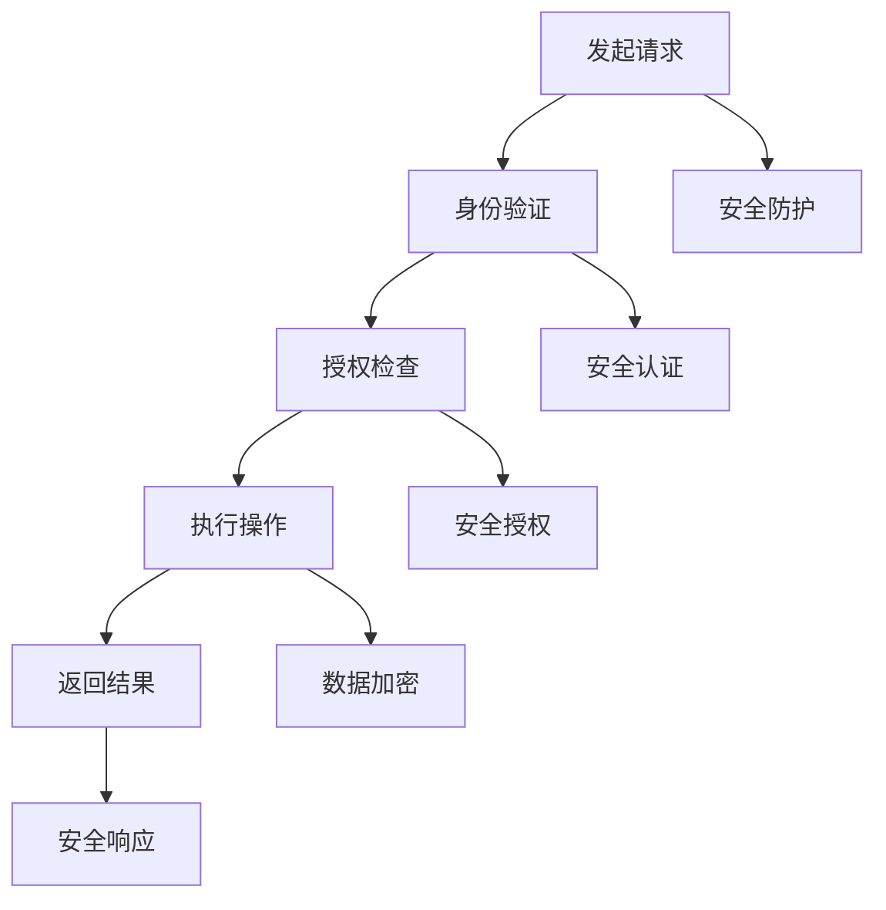
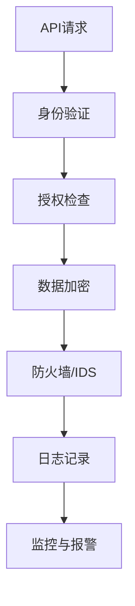
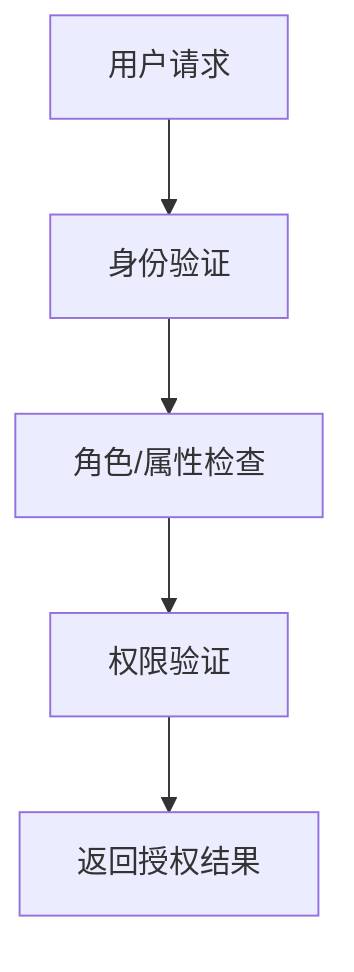
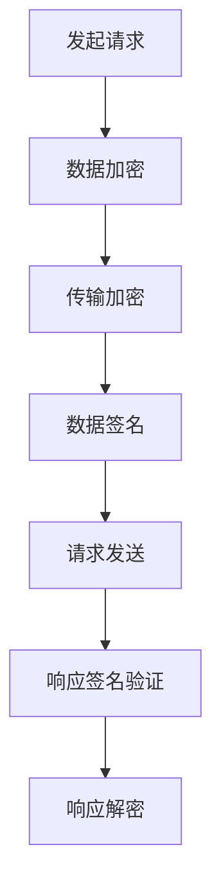
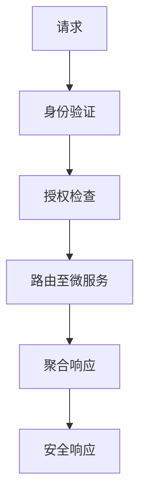
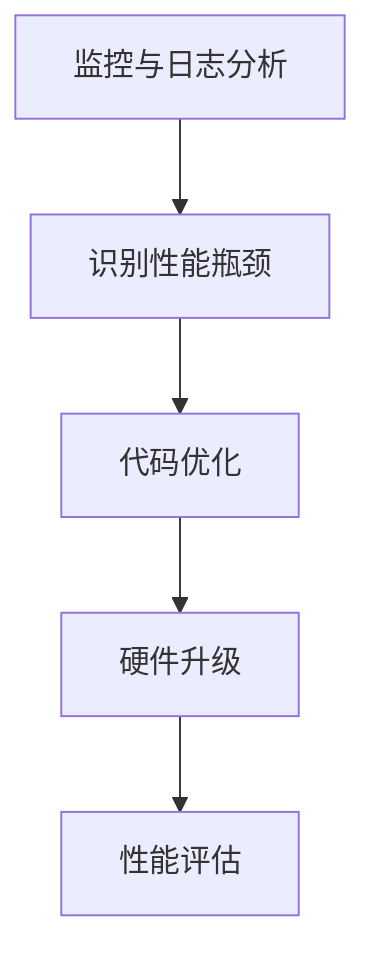
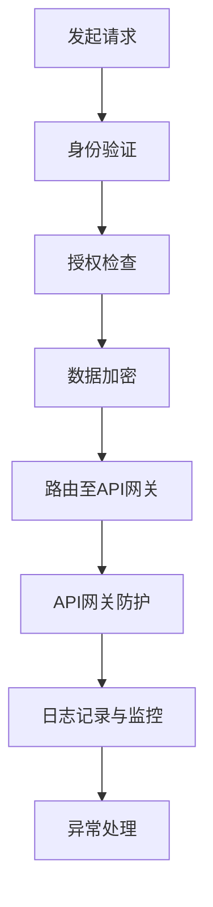
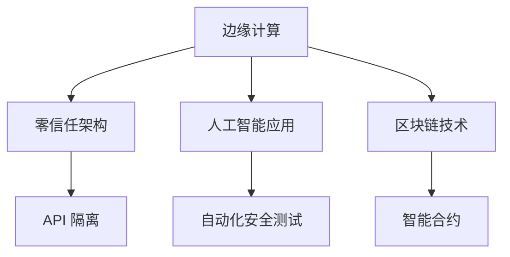

                 

# 安全 API 设计的 12 个要点

> 关键词：API安全、身份验证、授权、加密、微服务安全、性能优化、未来展望

> 摘要：随着互联网的快速发展，API（应用程序编程接口）已成为现代软件开发的核心组成部分。然而，API安全问题的频繁出现使得保护API安全变得至关重要。本文将详细介绍安全API设计的12个要点，涵盖核心概念、算法原理、性能优化和未来展望，旨在为开发者提供一套全面的API安全设计指南。

## 目录大纲

1. **核心概念与联系**
   1.1 安全 API 的定义与重要性
   1.2 安全 API 设计的原则
   1.3 API 安全威胁与防护
   1.4 安全 API 防护技术

2. **核心算法原理讲解**
   2.1 身份验证与授权
   2.2 加密与数据保护
   2.3 API 网关与微服务安全

3. **数学模型和数学公式**
   3.1 安全性与可靠性评估
   3.2 安全 API 性能优化

4. **项目实战**
   4.1 安全 API 设计实战案例
   4.2 安全 API 设计实战进阶
   4.3 安全 API 设计未来展望

5. **附录**
   5.1 安全 API 设计工具与资源
   5.2 资源推荐

---

## 第一部分：核心概念与联系

### 第1章：API设计与安全基础

#### 1.1 安全 API 的定义与重要性

API（应用程序编程接口）是现代软件开发中不可或缺的一部分，它定义了不同软件组件之间相互交互的方式。一个安全的API（安全API）不仅提供功能调用，还确保在交互过程中数据的安全性和完整性。

**定义**：安全API是一种在设计和实现过程中充分考虑安全性需求的API，它通过采用一系列安全措施来防止未经授权的访问、数据篡改和网络攻击。

**重要性**：随着API在业务流程中的广泛应用，安全性问题显得尤为重要。以下是安全API的重要性：

- **防止数据泄露**：确保敏感数据在传输过程中不被窃取或篡改。
- **防止未经授权的访问**：限制只有经过身份验证的用户才能访问特定的API资源。
- **减少攻击面**：通过最小化暴露的接口和功能，降低被攻击的风险。
- **增强用户体验**：提高系统的可用性和可靠性，提升用户满意度。

**Mermaid 流程图**：API 交互流程与安全关注点



#### 1.2 安全 API 设计的原则

设计一个安全的API需要遵循一系列原则，以确保API的安全性和可靠性。以下是安全API设计的关键原则：

- **最小权限原则**：API应该遵循最小权限原则，只授予用户执行特定任务所需的最小权限。
- **身份验证与授权分离**：身份验证和授权应该分开处理，以确保系统的安全性。
- **加密传输**：使用加密协议（如HTTPS）确保数据在传输过程中不会被窃听或篡改。
- **异常处理**：处理异常情况，确保系统在遇到攻击时能够恢复正常。
- **日志记录与监控**：记录API访问日志，并使用监控工具检测潜在的威胁和异常行为。

**伪代码**：安全 API 设计的基本步骤

```python
def design_secure_api():
    # 1. 定义API接口和功能
    # 2. 实施身份验证机制
    # 3. 实施授权机制
    # 4. 实施数据加密措施
    # 5. 实施安全防护措施
    # 6. 进行异常处理
    # 7. 记录API访问日志
    # 8. 监控API行为
```

### 第2章：API 安全威胁与防护

#### 2.1 常见 API 安全威胁

API安全问题多种多样，常见的威胁包括：

- **未经授权访问**：攻击者未经授权访问API资源，获取敏感信息。
- **数据篡改**：攻击者篡改API请求或响应数据，导致业务逻辑错误或数据泄露。
- **会话劫持**：攻击者窃取用户会话信息，冒充合法用户进行操作。
- **中间人攻击**：攻击者在通信过程中拦截和篡改数据。
- **恶意软件攻击**：通过恶意软件获取API访问权限，进行非法操作。

**伪代码**：常见 API 攻击手段与防御策略

```python
def common_api_attacks():
    # 攻击1：未经授权访问
    # 防御：实施身份验证和授权机制
    
    # 攻击2：数据篡改
    # 防御：使用加密传输和数据签名
    
    # 攻击3：会话劫持
    # 防御：使用安全的会话管理机制
    
    # 攻击4：中间人攻击
    # 防御：使用HTTPS和证书验证
    
    # 攻击5：恶意软件攻击
    # 防御：实施访问控制和安全审计
```

#### 2.2 安全 API 防护技术

为了有效防护API安全，需要采用一系列技术手段。以下是常见的安全防护技术：

- **身份验证技术**：包括密码认证、多因素认证、OAuth等。
- **授权技术**：包括基于角色的访问控制（RBAC）、基于属性的访问控制（ABAC）等。
- **加密技术**：包括数据加密、传输加密、会话加密等。
- **防火墙与入侵检测系统**：保护API免受外部攻击。
- **日志记录与监控**：实时监控API行为，及时发现异常。

**Mermaid 流程图**：API 防护技术架构



---

## 第二部分：核心算法原理讲解

### 第3章：身份验证与授权

#### 3.1 身份验证机制

身份验证是确保只有合法用户能够访问API资源的重要手段。以下是几种常见的身份验证机制：

- **密码认证**：用户使用用户名和密码进行验证，安全性较低，易受密码泄露攻击。
- **多因素认证**：结合密码、短信验证码、生物识别等多种验证方式，提高安全性。
- **OAuth**：第三方认证机制，允许用户使用已有账户（如Google、Facebook等）登录API。

**伪代码**：身份验证算法原理

```python
def authenticate_user(username, password):
    # 1. 验证用户名是否存在
    # 2. 检查密码是否正确
    # 3. 如果验证成功，生成会话令牌
    # 4. 返回会话令牌
```

#### 3.2 授权机制

授权机制确保用户有权访问特定的API资源。以下是几种常见的授权机制：

- **基于角色的访问控制（RBAC）**：根据用户的角色分配权限，角色分为管理员、普通用户等。
- **基于属性的访问控制（ABAC）**：根据用户属性（如部门、职位等）分配权限。

**Mermaid 流程图**：授权机制工作流程



---

### 第4章：加密与数据保护

#### 4.1 数据加密算法

数据加密是保护数据安全的关键技术。以下是几种常见的数据加密算法：

- **对称加密**：使用相同的密钥进行加密和解密，如AES。
- **非对称加密**：使用公钥和私钥进行加密和解密，如RSA。

**伪代码**：对称加密与非对称加密算法原理

```python
def symmetric_encrypt(data, key):
    # 1. 使用AES算法加密数据
    # 2. 返回加密后的数据

def asymmetric_encrypt(data, public_key):
    # 1. 使用RSA算法加密数据
    # 2. 返回加密后的数据
```

#### 4.2 数据保护实践

数据保护实践包括以下几个方面：

- **加密传输**：使用HTTPS协议确保数据在传输过程中被加密。
- **数据存储加密**：对存储在数据库中的敏感数据进行加密。
- **数据签名**：对API请求和响应进行签名，确保数据的完整性和真实性。

**Mermaid 流�程图**：数据保护工作流程



---

### 第5章：API 网关与微服务安全

#### 5.1 API 网关的功能与作用

API网关是微服务架构中的重要组成部分，它提供了一系列功能，如路由、聚合、安全控制等。以下是API网关的主要功能：

- **路由**：根据请求的URL或请求头，将请求转发到相应的微服务。
- **聚合**：将多个微服务的响应合并为一个统一的响应。
- **安全控制**：对请求进行身份验证、授权和访问控制。
- **限流与熔断**：防止系统过载和雪崩。

**Mermaid 流程图**：API 网关架构与安全控制



#### 5.2 微服务安全设计

微服务安全设计需要考虑以下几个方面：

- **服务间认证**：确保微服务之间的通信安全。
- **服务间授权**：确保只有经过授权的服务才能访问其他服务。
- **服务隔离**：确保一个服务的故障不会影响其他服务。

**伪代码**：微服务安全通信机制

```python
def secure_communication(service_a, service_b):
    # 1. 验证服务A的身份
    # 2. 检查服务A是否有访问服务B的权限
    # 3. 如果验证成功，允许服务A访问服务B
```

---

## 第三部分：数学模型和数学公式

### 第6章：安全性与可靠性评估

#### 6.1 安全性与可靠性指标

安全性与可靠性是评估API系统性能的重要指标。以下是常用的安全性与可靠性指标：

- **安全得分**：通过评估API系统的安全性措施，计算出一个得分。
- **可靠性得分**：通过评估API系统的稳定性、故障恢复能力等指标，计算出一个得分。

**latex 公式**：安全性评估公式

$$
安全得分 = \frac{安全措施得分}{总得分}
$$

**latex 公式**：可靠性模型与计算方法

$$
可靠性得分 = \frac{正常运行时间}{总时间}
$$

### 第7章：安全 API 性能优化

#### 7.1 性能优化算法

安全API的性能优化是提高系统效率的关键。以下是几种常见的性能优化算法：

- **负载均衡**：将请求分布到多个服务器，提高系统的处理能力。
- **缓存策略**：使用缓存减少对数据库的访问，提高响应速度。
- **异步处理**：使用异步编程模型，提高系统的并发能力。

**latex 公式**：性能优化目标与算法原理

$$
性能优化目标 = \max(\text{响应时间}, \text{吞吐量}, \text{并发能力})
$$

**latex 公式**：负载均衡算法原理

$$
\text{负载均衡系数} = \frac{\text{服务器处理能力}}{\text{总请求量}}
$$

#### 7.2 性能调优实践

性能调优实践包括以下几个方面：

- **监控与日志分析**：通过监控和日志分析，识别性能瓶颈。
- **代码优化**：优化代码结构和算法，提高执行效率。
- **硬件升级**：根据需求升级服务器和存储设备。

**Mermaid 流程图**：性能调优工作流程



---

## 第四部分：项目实战

### 第8章：安全 API 设计实战案例

#### 8.1 项目背景与目标

项目背景：某电商平台需要设计一个安全API，用于处理用户订单信息。

项目目标：
1. 确保只有经过身份验证的用户才能访问订单API。
2. 确保用户订单数据在传输和存储过程中被加密。
3. 确保API响应时间不超过500ms。

#### 8.2 系统设计与实现

系统设计：
1. 采用RESTful API架构，使用Spring Boot框架实现后端服务。
2. 使用JWT（JSON Web Token）进行身份验证。
3. 使用HTTPS协议确保数据传输加密。
4. 使用AES算法对用户订单数据进行加密存储。

实现步骤：
1. 设计API接口，包括获取订单列表、创建订单、更新订单等。
2. 实施JWT身份验证机制。
3. 实现HTTPS协议，确保数据传输加密。
4. 使用AES算法对用户订单数据进行加密存储。
5. 进行性能优化，确保响应时间不超过500ms。

**代码实现**：项目需求分析

```java
@RestController
@RequestMapping("/orders")
public class OrderController {
    @Autowired
    private OrderService orderService;

    @GetMapping
    @PreAuthorize("hasAuthority('ROLE_USER')")
    public ResponseEntity<List<Order>> getOrders() {
        List<Order> orders = orderService.getOrders();
        return ResponseEntity.ok(orders);
    }

    @PostMapping
    @PreAuthorize("hasAuthority('ROLE_USER')")
    public ResponseEntity<Order> createOrder(@RequestBody Order order) {
        Order savedOrder = orderService.createOrder(order);
        return ResponseEntity.ok(savedOrder);
    }

    @PutMapping("/{id}")
    @PreAuthorize("hasAuthority('ROLE_USER')")
    public ResponseEntity<Order> updateOrder(@PathVariable Long id, @RequestBody Order order) {
        Order updatedOrder = orderService.updateOrder(id, order);
        return ResponseEntity.ok(updatedOrder);
    }
}
```

#### 8.3 代码解读与分析

代码解读：
1. `@RestController`注解表示这是一个RESTful API控制器。
2. `@PreAuthorize`注解表示需要身份验证和授权才能访问相应的方法。
3. `getOrders()`方法获取用户订单列表，需要身份验证。
4. `createOrder()`方法创建订单，需要身份验证。
5. `updateOrder()`方法更新订单，需要身份验证。

分析：
1. 通过JWT实现身份验证，确保只有经过身份验证的用户才能访问订单API。
2. 使用HTTPS协议确保数据传输加密，防止数据泄露。
3. 使用AES算法对用户订单数据进行加密存储，确保数据安全。

---

### 第9章：安全 API 设计实战进阶

#### 9.1 高级安全防护策略

高级安全防护策略包括以下方面：

1. **API网关防护**：使用API网关进行流量控制和攻击防护。
2. **访问控制**：使用基于角色的访问控制（RBAC）和基于属性的访问控制（ABAC）进行精细访问控制。
3. **威胁检测与响应**：使用威胁检测工具和策略，及时发现和响应潜在的安全威胁。

**代码实现**：高级防护机制实现

```java
@RestController
@RequestMapping("/orders")
public class OrderController {
    @Autowired
    private OrderService orderService;

    @GetMapping
    @PreAuthorize("hasAuthority('ROLE_USER')")
    @PostAuthorize("isFullyAuthenticated()")
    public ResponseEntity<List<Order>> getOrders() {
        List<Order> orders = orderService.getOrders();
        return ResponseEntity.ok(orders);
    }

    @PostMapping
    @PreAuthorize("hasAuthority('ROLE_USER')")
    @PostAuthorize("isFullyAuthenticated()")
    public ResponseEntity<Order> createOrder(@RequestBody Order order) {
        Order savedOrder = orderService.createOrder(order);
        return ResponseEntity.ok(savedOrder);
    }

    @PutMapping("/{id}")
    @PreAuthorize("hasAuthority('ROLE_USER')")
    @PostAuthorize("isFullyAuthenticated()")
    public ResponseEntity<Order> updateOrder(@PathVariable Long id, @RequestBody Order order) {
        Order updatedOrder = orderService.updateOrder(id, order);
        return ResponseEntity.ok(updatedOrder);
    }
}
```

#### 9.2 安全 API 性能优化实践

安全 API 性能优化实践包括以下几个方面：

1. **数据库优化**：使用数据库索引、分库分表等技术提高数据库性能。
2. **缓存优化**：使用分布式缓存系统（如Redis）缓存热点数据。
3. **异步处理**：使用异步编程模型提高系统并发能力。

**代码实现**：性能优化实践案例

```java
@Autowired
private Executor executor;

@PostMapping
@PreAuthorize("hasAuthority('ROLE_USER')")
public ResponseEntity<Order> createOrder(@RequestBody Order order) {
    executor.execute(() -> {
        Order savedOrder = orderService.createOrder(order);
        sendEmailNotification(savedOrder);
    });
    return ResponseEntity.ok("Order processing in progress");
}

private void sendEmailNotification(Order order) {
    // 发送邮件通知
}
```

#### 9.3 安全 API 设计最佳实践

安全 API 设计最佳实践包括以下几个方面：

1. **最小权限原则**：确保API只提供用户执行特定任务所需的最小权限。
2. **身份验证与授权分离**：将身份验证和授权分开处理，提高系统的安全性。
3. **加密传输**：使用HTTPS协议确保数据传输加密。
4. **异常处理**：处理异常情况，确保系统在遇到攻击时能够恢复正常。
5. **日志记录与监控**：实时监控API行为，及时发现异常行为。

**Mermaid 流程图**：最佳实践工作流程



---

### 第10章：安全 API 设计未来展望

#### 10.1 安全 API 设计趋势

随着技术的发展，安全 API 设计也在不断演进。以下是安全 API 设计的趋势：

1. **零信任架构**：采用零信任架构，确保所有访问都经过严格验证。
2. **API 隔离**：通过容器化、虚拟化等技术实现 API 隔离，提高系统安全性。
3. **自动化安全测试**：采用自动化工具进行 API 安全测试，提高安全防护能力。

#### 10.2 安全 API 设计的未来机遇

安全 API 设计的未来机遇包括以下几个方面：

1. **边缘计算**：随着边缘计算的发展，安全 API 设计将面临新的挑战和机遇。
2. **人工智能**：利用人工智能技术进行威胁检测和响应，提高 API 安全性。
3. **区块链**：利用区块链技术提高 API 交易的可信度和安全性。

**Mermaid 流程图**：未来应用场景与展望



---

## 附录

### 附录 A：安全 API 设计工具与资源

**A.1 工具对比**

| 工具             | 功能描述                                                   | 优点                                                         | 缺点                                                         |
|------------------|----------------------------------------------------------|------------------------------------------------------------|------------------------------------------------------------|
| OAuth2          | 实现第三方认证与授权的协议                               | 支持多种认证方式，易于集成                                       | 需要额外的服务器资源，配置较为复杂                             |
| JWT             | 基于JSON的令牌，用于身份验证                             | 简单易用，性能高                                               | 需要妥善管理密钥，否则可能导致安全漏洞                         |
| API 网关       | 统一管理API，提供路由、聚合、安全等功能                 | 提高系统安全性，简化开发工作量                                  | 可能增加系统复杂度，性能瓶颈难以定位                         |
| Spring Security | Java平台的安全框架，提供身份验证、授权等安全功能         | 易于集成，功能强大                                             | 需要深入了解Java安全框架，配置复杂                             |
| NGINX            | 高性能的Web服务器，支持SSL加密、负载均衡等                 | 性能优秀，配置灵活                                             | 需要深入了解Nginx配置，维护成本较高                           |
| HashiCorp Vault | 安全数据存储与管理平台，提供身份验证、加密等功能         | 功能全面，易于集成                                             | 需要额外的服务器资源，配置较为复杂                           |

**A.2 资源推荐**

| 资源名            | 描述                                                         | 推荐理由                                                         |
|------------------|----------------------------------------------------------|------------------------------------------------------------|
| 《API Security》   | 一本关于API安全性的权威书籍，涵盖API安全的各个方面           | 内容全面，权威性高，适合安全领域专业人士阅读                   |
| OWASP API Security Top 10 | OWASP发布的API安全性十大风险，为API安全提供参考指南           | 详细的攻击手段和防护措施，是API安全领域的重要参考文档         |
| API Design Guide | 一本关于API设计的指南，涵盖API设计的原则、最佳实践和常见问题 | 内容全面，易于理解，适合API开发人员和架构师阅读               |
| Spring Security Reference | Spring Security官方文档，提供详细的安全配置和示例代码       | 官方文档，权威性高，适合Spring Security用户学习和使用         |
| OAuth2.0 Specification | OAuth2.0官方规范，详细描述了OAuth2.0认证与授权流程       | OAuth2.0官方文档，权威性高，是了解OAuth2.0机制的最佳资料       |

---

## 作者信息

**作者：AI天才研究院/AI Genius Institute & 禅与计算机程序设计艺术 /Zen And The Art of Computer Programming**

本文由AI天才研究院和禅与计算机程序设计艺术共同撰写，旨在为开发者提供全面的API安全设计指南。如果您对本文有任何建议或疑问，欢迎随时联系我们。期待与您共同探讨API安全的未来发展。|assistant|

