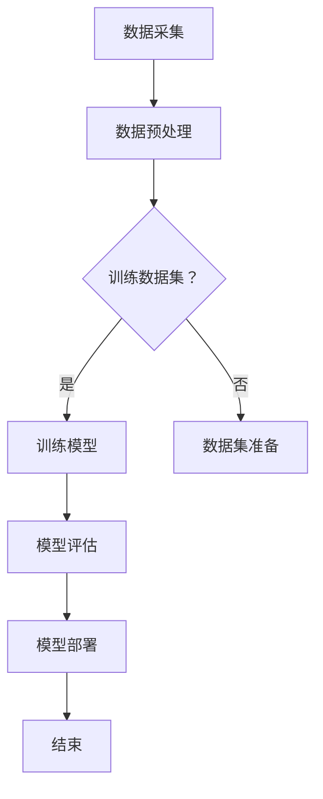

                 

### 文章标题

《实时AI：LLM的毫秒级响应》

### 文章关键词

- 实时AI
- 语言模型
- LLM
- 毫秒级响应
- 性能优化
- 应用案例

### 摘要

本文深入探讨实时AI技术，特别是大规模语言模型（LLM）在毫秒级响应中的实现。首先介绍实时AI的基本概念和重要性，接着详细解析语言模型的基础知识，重点探讨大规模语言模型的特点与挑战。随后，文章将阐述实时AI响应的原理和关键技术，并介绍实时AI系统的设计与实现流程。通过应用案例分析，本文展示了实时AI在多个领域的成功应用，最后对未来实时AI技术的发展趋势进行了展望。

## 引言

随着人工智能（AI）技术的迅猛发展，实时AI技术逐渐成为现代应用的核心需求。从智能客服到智能推荐系统，再到智能语音助手，实时AI技术在各个领域展现了其巨大的潜力和应用价值。然而，实现高效的实时响应是许多应用场景中的关键挑战，特别是在处理大量并发请求时，如何确保系统的响应时间在毫秒级别内，是决定其成败的重要因素。

大规模语言模型（LLM）作为当前AI领域的核心技术，其能够处理自然语言的能力，使得实时AI的应用变得更加广泛和高效。LLM通过对海量文本数据的训练，具备了强大的语义理解和生成能力，成为构建实时AI系统的关键组件。然而，要实现LLM的毫秒级响应，需要克服众多技术挑战，包括高效的模型推理、优化计算资源、以及降低通信延迟等。

本文旨在深入探讨实时AI技术，特别是LLM在毫秒级响应中的实现。通过系统地介绍实时AI的基础知识、语言模型及其大规模应用，本文将详细解析实现实时AI响应的关键技术和方法，并通过具体的案例进行分析，最后对未来实时AI技术的发展趋势进行展望。本文结构如下：

- 第一部分：实时AI技术基础
  - 第1章：实时AI概述
  - 第2章：语言模型基础
  - 第3章：大规模语言模型
  - 第4章：实时AI响应机制
  - 第5章：实时AI系统的设计与实现
  - 第6章：实时AI应用案例分析
  - 第7章：实时AI的未来发展趋势

- 第二部分：实时AI开发实践
  - 第8章：实时AI开发工具与资源
  - 第9章：实时AI项目实战
  - 第10章：实时AI性能优化与调优
  - 第11章：实时AI开发最佳实践
  - 第12章：实时AI在特定领域的应用
  - 第13章：实时AI的未来展望

- 附录
  - 附录A：实时AI相关资源与资料
  - 附录B：Mermaid流程图示例
  - 附录C：代码示例
  - 附录D：LaTeX公式示例

通过上述结构，本文将帮助读者全面理解实时AI技术，掌握实现LLM毫秒级响应的关键技术，并为其在实际应用中的落地提供指导。

## 第1章 实时AI概述

### 1.1 实时AI的定义与重要性

实时AI（Real-Time AI）是一种能够在短时间内对输入数据进行处理并产生结果的AI技术。与传统的批处理AI不同，实时AI强调即时响应和处理能力，其核心在于能够在毫秒级时间内完成数据采集、处理和响应的全过程。实时AI技术的出现，极大地提升了AI系统的实用性和应用范围，使其在众多领域得到广泛应用。

实时AI的定义可以归纳为以下几点：

- **实时性**：能够在极短时间内（通常在毫秒级）完成数据处理和响应。
- **高效性**：具备高效的数据处理能力和计算性能，能够应对大规模并发请求。
- **准确性**：通过深度学习和大数据分析，实现高精度的数据识别和预测。

实时AI的重要性体现在以下几个方面：

- **提高用户体验**：在智能客服、智能推荐、智能语音助手等应用中，实时响应能够显著提升用户体验，增加用户粘性。
- **优化业务流程**：实时AI能够对业务数据进行实时分析，帮助企业优化生产流程、降低成本、提高效率。
- **安全监控**：在安全监控领域，实时AI可以通过对实时数据的分析，快速识别异常行为，提供实时预警。

### 1.2 实时AI的应用领域

实时AI技术具有广泛的应用领域，以下是一些主要的应用场景：

- **智能客服**：实时AI可以用于智能客服系统，通过自然语言处理和机器学习技术，实现与用户的实时对话，提供个性化的服务，提升客户满意度。
- **智能推荐**：在电子商务、在线娱乐等领域，实时AI可以通过分析用户行为和偏好，实现精准的个性化推荐，提高用户留存率和购买转化率。
- **智能语音助手**：智能语音助手如Siri、Alexa等，通过实时AI技术，能够快速理解用户语音指令，提供即时的响应和帮助。
- **金融风控**：实时AI可以在金融领域用于风险控制，通过实时监控交易行为，快速识别和防范欺诈行为。
- **医疗健康**：在医疗健康领域，实时AI可以用于实时监控患者数据，提供及时的诊断和建议，提高医疗服务的效率和质量。

### 1.3 实时AI与传统AI的区别

实时AI与传统AI在多个方面存在显著差异：

- **响应时间**：实时AI强调毫秒级的响应时间，而传统AI通常依赖于批处理，响应时间在分钟甚至小时级别。
- **数据处理能力**：实时AI需要具备高效的数据处理能力，能够快速处理大规模并发数据，而传统AI则侧重于处理静态数据集。
- **实时性要求**：实时AI对实时性有严格要求，任何延迟都可能导致严重的后果，如金融交易中的错误决策或医疗监控中的漏诊。

### 1.4 实时AI的发展历程

实时AI技术的发展经历了以下几个阶段：

- **早期探索**：实时AI的概念最早在20世纪80年代提出，当时主要是基于规则的系统，如专家系统和模式识别技术。
- **互联网时代**：随着互联网的普及，实时AI逐渐应用于电子商务、在线服务和社交网络等领域，开始出现基于机器学习和数据挖掘的实时系统。
- **深度学习时代**：深度学习技术的兴起，使得实时AI取得了重大突破，特别是卷积神经网络（CNN）和循环神经网络（RNN）的应用，使得实时AI在图像识别、语音识别和自然语言处理等领域取得了显著成果。
- **边缘计算与5G时代**：随着边缘计算和5G技术的发展，实时AI的应用场景进一步扩展，能够在设备端实现实时数据处理和响应，提高了系统的性能和效率。

通过上述对实时AI的概述，我们可以看到实时AI技术的重要性和广泛应用。在接下来的章节中，本文将进一步探讨语言模型的基础知识，特别是大规模语言模型（LLM）在实时AI中的应用，为读者深入理解实时AI技术打下坚实的基础。

### 1.5 实时AI技术的关键组件和架构

要实现实时AI的高效运行，需要依赖一系列关键组件和架构设计。以下是对这些组件和架构的详细探讨：

#### 数据采集与预处理

数据采集是实时AI系统的第一步，系统需要能够实时获取大量结构化和非结构化数据。数据来源可能包括传感器、用户交互日志、社交媒体数据等。数据采集后，需要通过预处理步骤进行清洗、转换和格式化，确保数据质量，以便后续的模型训练和推理。

#### 存储系统

实时AI系统需要高效的存储系统来存储和处理大量数据。常用的存储技术包括关系数据库、NoSQL数据库和分布式存储系统。关系数据库适合处理结构化数据，如用户信息、交易记录等；NoSQL数据库适合处理非结构化数据，如图像、文本等；分布式存储系统则能够提供高可用性和高扩展性，适用于大规模数据的存储和处理。

#### 计算系统

计算系统是实时AI系统的核心，负责处理和推理AI模型。高性能计算系统通常包括GPU、FPGA和TPU等专用硬件加速器，能够显著提升计算速度和效率。此外，分布式计算架构，如MapReduce和Spark，也广泛应用于实时AI系统，以处理大规模数据的并行计算。

#### 模型训练与优化

实时AI系统需要使用机器学习和深度学习技术进行模型训练。模型训练过程中，通过调整模型参数，优化模型性能。常用的训练算法包括梯度下降、随机梯度下降（SGD）、Adam优化器等。模型训练完成后，需要进行模型优化，以提高模型的推理速度和准确性。

#### 实时推理引擎

实时推理引擎是实时AI系统的关键组件，负责对实时数据执行AI模型推理。推理引擎需要具备高并发处理能力，能够快速处理海量数据。常用的推理引擎包括TensorFlow Serving、TorchServe和ONNX Runtime等。这些引擎能够提供高效的模型推理接口，支持多种模型格式和计算平台。

#### 通信系统

实时AI系统需要高效的通信系统来传输数据和消息。常用的通信技术包括消息队列、WebSocket和HTTP协议。消息队列能够提供异步、可靠的消息传递机制，适用于高并发场景。WebSocket和HTTP协议则适用于实时数据传输，支持双向通信。

#### 监控与运维

实时AI系统需要完善的监控与运维机制，以确保系统的稳定性和可靠性。监控系统可以实时监控系统的性能指标，如响应时间、吞吐量、资源利用率等，及时发现和解决问题。运维系统负责系统的部署、升级和维护，确保系统的高可用性和持续运行。

通过上述关键组件和架构设计，实时AI系统能够高效、稳定地运行，满足各种应用场景的需求。在接下来的章节中，本文将继续探讨语言模型的基础知识，特别是大规模语言模型（LLM）在实时AI中的应用。

### 第2章 语言模型基础

#### 2.1 语言模型的概念

语言模型（Language Model，LM）是自然语言处理（Natural Language Processing，NLP）领域的重要基础。它是一种统计模型，用于预测文本序列中的下一个单词或字符。语言模型的核心目标是理解语言的统计规律，从而生成或理解自然语言文本。

语言模型可以分为以下几种类型：

1. **N-gram模型**：基于历史N个单词的统计信息预测下一个单词。N-gram模型简单高效，但在处理长文本时表现不佳，无法捕捉长距离依赖关系。

2. **基于上下文的模型**：如词袋模型（Bag-of-Words，BOW）和TF-IDF模型。这些模型考虑单词的上下文信息，通过向量空间模型来表示文本。

3. **深度神经网络模型**：如循环神经网络（RNN）和长短时记忆网络（LSTM）。这些模型能够捕捉长距离依赖关系，但计算复杂度较高。

4. **注意力机制模型**：如Transformer模型。注意力机制能够动态地聚焦于输入序列中的关键信息，显著提升模型的性能。

#### 2.2 语言模型的架构

语言模型的架构可以分为以下几个层次：

1. **输入层**：接收文本输入，将其转换为模型可处理的向量表示。

2. **编码层**：将输入文本编码为固定长度的向量表示。常见的编码方法包括Word2Vec、BERT和GPT等。

3. **隐藏层**：通过神经网络结构进行多层非线性变换，捕捉文本的复杂特征。

4. **输出层**：输出预测结果，如下一个单词或字符的概率分布。

以Transformer模型为例，其架构包括以下几个部分：

1. **嵌入层**（Embedding Layer）：将单词嵌入为向量表示。

2. **多头自注意力机制**（Multi-Head Self-Attention）：通过多头注意力机制捕捉文本中的依赖关系。

3. **前馈神经网络**（Feed-Forward Neural Network）：对自注意力层输出的向量进行进一步处理。

4. **输出层**（Output Layer）：生成预测结果，如单词的概率分布。

#### 2.3 语言模型的训练方法

语言模型的训练方法主要包括以下几种：

1. **最大似然估计**（Maximum Likelihood Estimation，MLE）：通过最小化预测概率与实际标签之间的交叉熵损失，训练语言模型。

2. **逐词预测**（Word-by-Word Prediction）：每次预测一个单词，更新模型参数，直到生成整个文本序列。

3. **顺序优化**（Sequence Optimization）：通过优化整个文本序列的生成过程，提高模型性能。

4. **迁移学习**（Transfer Learning）：利用预训练的语言模型，在特定任务上进行微调，提高模型在特定领域的表现。

5. **对比学习**（Contrastive Learning）：通过对比学习的方法，增强模型对负样本的识别能力。

#### 2.4 语言模型的应用

语言模型在自然语言处理领域有广泛的应用，以下是一些主要的应用场景：

1. **文本生成**：如自动写作、机器翻译、对话系统等。通过语言模型，系统能够生成流畅、符合语法规则的文本。

2. **文本分类**：如情感分析、主题分类、垃圾邮件过滤等。语言模型可以用于提取文本的特征，进行分类任务。

3. **信息提取**：如命名实体识别、关系抽取、问答系统等。语言模型能够帮助系统理解文本中的关键信息，进行信息提取。

4. **语音识别**：如语音助手、语音搜索等。语言模型可以用于生成文本转录，提高语音识别的准确性。

5. **语音生成**：如语音合成、语音转换等。通过语言模型，系统能够生成自然的语音输出。

通过上述对语言模型基础的详细探讨，我们可以看到语言模型在实时AI中的重要地位和广泛应用。在下一章中，本文将继续介绍大规模语言模型（LLM），分析其特点与挑战。

### 第3章 大规模语言模型

#### 3.1 大规模语言模型的定义与特点

大规模语言模型（Large Language Model，LLM）是指通过深度学习技术，对大量文本数据进行预训练，从而具备强大语言理解和生成能力的模型。LLM的“大规模”体现在以下几个方面：

1. **数据规模**：LLM通常训练在数万亿个单词的海量文本数据上，包括书籍、新闻、社交媒体等各种类型的文本。

2. **参数规模**：LLM的参数数量通常达到数十亿甚至数万亿级别，使其能够捕捉复杂的语言模式和语义信息。

3. **模型规模**：LLM的训练过程需要庞大的计算资源和存储空间，往往依赖于分布式计算和云计算平台。

大规模语言模型的特点主要包括：

1. **强大的语言理解能力**：LLM能够理解文本的深层语义，进行语义分析、情感分析等复杂任务。

2. **高效的生成能力**：LLM能够生成流畅、符合语法和语义规则的文本，广泛应用于自动写作、机器翻译等场景。

3. **跨语言能力**：通过多语言训练，LLM具备跨语言的理解和生成能力，能够处理多种语言的任务。

4. **灵活的适应性**：LLM能够通过微调（Fine-tuning）快速适应特定任务，进行快速迭代和优化。

#### 3.2 主流大规模语言模型介绍

目前，以下几种大规模语言模型在自然语言处理领域具有广泛的影响力和应用：

1. **GPT（Generative Pre-trained Transformer）**：由OpenAI开发，GPT系列模型包括GPT、GPT-2、GPT-3等，其中GPT-3是当前最先进的语言模型。GPT模型基于Transformer架构，通过自注意力机制（Self-Attention）捕捉文本中的依赖关系，具有强大的语言生成和理解能力。

2. **BERT（Bidirectional Encoder Representations from Transformers）**：由Google开发，BERT模型通过双向Transformer架构，同时考虑文本的前后关系，对文本进行编码。BERT在多个自然语言处理任务上取得了显著的性能提升，广泛应用于文本分类、问答系统等。

3. **T5（Text-To-Text Transfer Transformer）**：由Google开发，T5模型将所有NLP任务统一为文本到文本的转换任务，通过统一的输入输出格式，实现了任务的通用化和高效处理。

4. **RoBERTa（A Robustly Optimized BERT Pretraining Approach）**：由Facebook AI研发，RoBERTa在BERT的基础上进行了多个优化，包括更长的训练时间、更大的数据集和更强的数据清洗策略，取得了在多个自然语言处理任务上的领先性能。

5. **ALBERT（A Lite BERT）**：由Google开发，ALBERT模型在BERT的基础上进行了优化，通过参数共享和层次化结构，减少了模型的参数数量和计算复杂度，同时保持了较高的性能。

#### 3.3 大规模语言模型的优势与挑战

大规模语言模型在自然语言处理领域展现了巨大的优势，主要包括：

1. **强大的语言理解能力**：通过海量数据的预训练，LLM能够深刻理解自然语言的语义和结构，显著提升了文本分类、问答系统等任务的性能。

2. **高效的生成能力**：LLM能够生成高质量、符合语法和语义规则的文本，广泛应用于自动写作、机器翻译等场景，提高了内容的创造力和生产力。

3. **跨语言能力**：通过多语言训练，LLM具备处理多种语言的任务能力，为全球化应用提供了强大的支持。

然而，大规模语言模型也面临着一些挑战：

1. **计算资源需求**：大规模模型的训练和推理需要大量的计算资源和存储空间，对硬件设施和运维能力提出了高要求。

2. **数据隐私和安全性**：大规模模型训练过程中涉及大量用户数据，如何确保数据的安全性和隐私性是一个重要挑战。

3. **模型解释性**：大规模模型通常具有高度的复杂性，难以进行解释和验证，影响了模型的透明度和可信度。

4. **过度拟合**：大规模模型在训练过程中可能过度拟合训练数据，导致在未知数据上的性能下降。

通过上述对大规模语言模型的定义、特点及其应用的分析，我们可以看到LLM在实时AI中的重要地位。在下一章中，本文将继续探讨实时AI响应机制，分析其原理和关键技术。

### 第4章 实时AI响应机制

#### 4.1 实时AI响应的原理

实时AI响应的原理主要基于高效的模型推理和计算优化。模型推理是指将输入数据通过预训练的模型进行计算，输出预测结果。实时AI系统的核心目标是确保在毫秒级时间内完成模型推理，从而实现即时响应。

实时AI响应的关键在于以下几个方面：

1. **模型优化**：通过模型压缩、量化、剪枝等技术，减小模型的体积和计算复杂度，提高推理速度。

2. **计算资源调度**：利用分布式计算和硬件加速技术，合理调度计算资源，确保模型推理的效率。

3. **数据处理优化**：通过数据预处理、缓存技术和高效的数据流处理框架，减少数据处理延迟。

4. **网络通信优化**：采用高效的网络协议和通信技术，降低通信延迟，提高数据传输速度。

#### 4.2 实时AI响应的关键技术

实现实时AI的毫秒级响应，需要依赖一系列关键技术，以下为详细介绍：

1. **模型压缩与量化**：

   - **模型压缩**：通过剪枝、量化、知识蒸馏等技术，减小模型的体积和计算复杂度。剪枝技术通过去除模型中不重要或冗余的权重，降低模型的大小；量化技术通过将模型中的浮点数转换为低精度数值，减少存储和计算资源的需求；知识蒸馏技术通过将大模型的知识传递给小模型，提高小模型的性能。

2. **硬件加速**：

   - **GPU加速**：利用图形处理器（GPU）的高并行计算能力，加速模型推理过程。GPU适合处理大规模矩阵运算和向量计算，显著提升推理速度。

   - **FPGA加速**：现场可编程门阵列（FPGA）通过硬件编程实现模型推理，具有高灵活性和高效能。FPGA适合处理特定的计算任务，能够实现低延迟和高吞吐量的推理。

   - **TPU加速**：张量处理单元（TPU）是专为深度学习任务设计的专用硬件，通过并行计算和优化算法，大幅提升模型推理速度。

3. **分布式计算**：

   - **集群计算**：通过分布式计算架构，将模型推理任务分布在多个计算节点上，提高系统整体的计算能力和吞吐量。分布式计算能够充分利用集群资源，实现高效的任务调度和负载均衡。

   - **边缘计算**：在边缘设备上执行模型推理，减少数据传输和通信延迟。边缘计算适用于对延迟敏感的应用场景，如智能语音助手、智能安防等。

4. **内存优化**：

   - **内存分配**：通过优化内存分配策略，减少内存访问冲突和延迟。例如，使用连续内存分配减少内存碎片，使用预分配策略减少动态内存分配的开销。

   - **缓存技术**：通过缓存技术，将频繁访问的数据存储在高速缓存中，减少磁盘IO操作，提高数据访问速度。

5. **网络通信优化**：

   - **高效协议**：采用高效的网络协议，如HTTP/2、QUIC等，减少网络延迟和传输开销。

   - **传输优化**：通过数据压缩、批量传输等技术，提高数据传输速度。例如，使用GZIP压缩数据，减少传输数据量；采用批量请求和响应，减少请求次数。

#### 4.3 实时AI响应的性能优化

为了实现实时AI的毫秒级响应，需要对系统的各个方面进行性能优化。以下是一些常见的性能优化方法：

1. **模型优化**：

   - **模型选择**：选择适合应用场景的模型，平衡模型性能和计算复杂度。例如，对于实时问答系统，可以选择GPT-2或GPT-3模型，而对于语音识别任务，可以选择更轻量级的模型如Transformer-Tiny。

   - **模型剪枝和量化**：通过剪枝和量化技术，减小模型体积和计算复杂度，提高推理速度。

2. **计算资源调度**：

   - **动态调度**：根据任务负载和资源使用情况，动态调整计算资源分配，确保系统的高效运行。例如，使用负载均衡算法，将请求分配到计算资源最充裕的节点。

   - **异构计算**：利用不同类型的计算资源，实现计算任务的最优调度。例如，将图像处理任务分配到GPU，而文本处理任务分配到CPU。

3. **数据处理优化**：

   - **异步处理**：采用异步数据处理技术，减少同步操作的等待时间，提高系统吞吐量。

   - **流处理**：使用流处理框架，如Apache Flink和Apache Spark Streaming，实时处理大规模数据流，确保数据的快速处理和响应。

4. **网络通信优化**：

   - **延迟优化**：通过优化网络协议和传输技术，减少通信延迟。例如，使用CDN（内容分发网络）将数据缓存到离用户更近的地方，减少数据传输时间。

   - **带宽优化**：通过数据压缩和批量传输，提高网络带宽利用率。例如，使用HTTP/2的流多路复用，减少请求响应次数。

通过上述实时AI响应机制的原理和关键技术分析，我们可以看到实现实时AI毫秒级响应的复杂性和挑战。在下一章中，本文将探讨实时AI系统的设计与实现，详细讲解如何构建高效、稳定的实时AI系统。

### 第5章 实时AI系统的设计与实现

#### 5.1 实时AI系统的架构设计

实时AI系统的架构设计是确保系统高效、稳定和可扩展的关键。一个典型的实时AI系统通常包括以下几个主要模块：

1. **数据采集模块**：负责实时收集各种类型的数据，如文本、图像、音频等。数据采集模块需要具备高并发处理能力，能够快速处理大量数据。

2. **数据处理模块**：对采集到的数据进行预处理，包括数据清洗、转换和格式化。预处理过程需要保证数据的质量和一致性，为后续的模型训练和推理提供可靠的数据基础。

3. **存储模块**：负责存储大量的训练数据和推理结果。存储模块需要具备高可用性和高扩展性，以应对不断增长的数据量和访问需求。

4. **模型训练模块**：使用预训练模型或自定义模型对数据进行训练。模型训练模块需要优化计算资源，提高训练效率和准确性。

5. **模型推理模块**：负责实时推理和响应。模型推理模块需要实现高效、低延迟的推理过程，以确保系统的实时性。

6. **接口模块**：提供对外接口，如API或WebSocket，供前端应用或其他系统调用。接口模块需要具备高并发处理能力，支持大规模并发请求。

7. **监控模块**：实时监控系统的性能指标，如响应时间、吞吐量、资源利用率等。监控模块可以帮助系统管理员及时发现和解决潜在问题。

#### 5.2 实时AI系统的开发流程

实时AI系统的开发流程通常包括以下几个阶段：

1. **需求分析与规划**：明确系统的功能需求和技术要求，制定开发计划和时间表。这一阶段需要与业务部门紧密合作，确保系统满足实际需求。

2. **数据采集与预处理**：设计数据采集方案，搭建数据采集系统。对采集到的数据进行预处理，包括数据清洗、转换和格式化，确保数据的质量和一致性。

3. **模型设计与训练**：设计合适的模型架构，选择或开发预训练模型。使用预处理后的数据对模型进行训练，优化模型参数，提高模型性能。

4. **模型推理与优化**：实现模型推理模块，进行模型推理和响应。对模型进行性能优化，包括模型压缩、量化、硬件加速等，确保系统的高效性和低延迟。

5. **系统集成与测试**：将各个模块集成到一起，进行系统集成测试。测试包括功能测试、性能测试和可靠性测试，确保系统的稳定运行。

6. **部署与运维**：将系统部署到生产环境，进行持续监控和运维。运维过程需要确保系统的安全性和稳定性，及时处理故障和异常情况。

#### 5.3 实时AI系统的性能评估

实时AI系统的性能评估是确保系统满足性能需求的重要环节。以下是一些常见的性能评估指标和方法：

1. **响应时间**：系统从接收到请求到返回响应结果所需的时间。响应时间需要控制在毫秒级别，以确保系统的实时性。

2. **吞吐量**：单位时间内系统能处理的请求数量。吞吐量越高，系统的处理能力越强。吞吐量可以通过并发测试来评估。

3. **延迟**：请求从发起到收到响应的总时间，包括网络延迟和系统延迟。延迟需要尽量降低，以提高用户体验。

4. **准确率**：模型预测结果与实际结果的一致性。准确率是评估模型性能的重要指标，可以通过测试集的评估来计算。

5. **资源利用率**：系统对计算资源、存储资源和网络资源的利用率。资源利用率需要保持在合理范围内，以确保系统的稳定运行。

6. **可靠性**：系统在长时间运行过程中，不出现故障或错误的概率。可靠性可以通过故障率和恢复时间来评估。

为了全面评估实时AI系统的性能，通常采用以下方法：

- **基准测试**：使用标准化的测试集和测试工具，对系统进行性能基准测试，评估系统的响应时间、吞吐量和准确率等指标。

- **负载测试**：模拟高并发场景，对系统施加不同程度的负载，评估系统的稳定性和可靠性。

- **压力测试**：通过施加极端负载，测试系统的极限性能和响应能力，确保系统在极端情况下仍能正常运行。

通过上述实时AI系统的设计与实现流程和性能评估方法，我们可以构建高效、稳定的实时AI系统，满足实际应用需求。在下一章中，本文将探讨实时AI在不同领域的具体应用案例。

### 第6章 实时AI应用案例分析

#### 6.1 案例一：智能客服系统

智能客服系统是实时AI技术的重要应用之一，通过自然语言处理和机器学习技术，实现与用户的实时对话，提供个性化的服务，提升客户满意度。

**应用场景**：在电子商务、金融、电信等行业，智能客服系统被广泛应用于在线客服、客户支持、售后服务等场景。

**技术实现**：

1. **数据采集与预处理**：智能客服系统需要实时收集用户的聊天记录、日志数据等，通过数据清洗和格式化，确保数据质量。

2. **语言模型训练**：使用预训练的语言模型（如GPT-3、BERT）进行训练，使其能够理解和生成自然语言文本。

3. **对话管理**：设计对话管理模块，负责处理用户输入、生成回复文本和分配任务。对话管理模块需要实现意图识别、实体提取和对话生成等功能。

4. **实时响应**：通过高效的推理引擎和硬件加速技术（如GPU、TPU），确保系统能够在毫秒级时间内生成回复，实现实时响应。

**性能评估**：

- **响应时间**：智能客服系统的平均响应时间需控制在500毫秒以内，以确保用户获得及时的回复。
- **准确率**：意图识别和实体提取的准确率需达到90%以上，确保系统能够正确理解和处理用户请求。
- **用户满意度**：通过用户调查和反馈，评估用户对智能客服系统的满意度。

#### 6.2 案例二：智能推荐系统

智能推荐系统通过实时分析用户行为和偏好，提供个性化的推荐服务，提高用户留存率和购买转化率。

**应用场景**：在电子商务、在线娱乐、新闻媒体等领域，智能推荐系统被广泛应用于商品推荐、内容推荐和广告推荐等场景。

**技术实现**：

1. **数据采集与处理**：实时收集用户行为数据，包括点击、购买、浏览等行为，通过数据预处理，提取有用的特征信息。

2. **模型训练与优化**：使用机器学习算法（如协同过滤、深度学习）对用户行为数据进行训练，建立推荐模型。通过在线学习技术，实时更新和优化模型，提高推荐精度。

3. **推荐策略**：设计推荐策略，根据用户的历史行为和偏好，生成个性化的推荐列表。

4. **实时响应**：通过高效的推理引擎和计算资源调度，确保系统能够快速生成推荐结果，实现实时响应。

**性能评估**：

- **推荐效果**：通过A/B测试，评估推荐系统的推荐效果，包括推荐点击率、购买转化率和用户满意度等。
- **响应时间**：智能推荐系统的平均响应时间需控制在100毫秒以内，确保用户能够迅速获得推荐结果。
- **多样性**：确保推荐结果具有多样性，避免推荐结果过于集中，提高用户体验。

#### 6.3 案例三：智能语音助手

智能语音助手通过实时语音识别和自然语言处理技术，实现与用户的语音交互，提供个性化的服务，提升用户体验。

**应用场景**：在智能家居、车载系统、智能穿戴设备等领域，智能语音助手被广泛应用于语音控制、信息查询和语音交互等场景。

**技术实现**：

1. **语音识别**：使用高效的语音识别模型（如DeepSpeech、ESPnet），实现语音到文本的转换，确保语音输入的准确性。

2. **语言理解**：使用预训练的语言模型（如GPT-3、BERT），理解用户的语音指令，提取意图和实体信息。

3. **语音合成**：使用语音合成技术（如WaveNet、Tacotron），生成自然的语音输出，确保语音回复的流畅性和自然度。

4. **实时响应**：通过高效的推理引擎和硬件加速技术，确保系统能够在毫秒级时间内生成语音回复，实现实时响应。

**性能评估**：

- **识别准确率**：智能语音助手的语音识别准确率需达到95%以上，确保语音输入的正确理解和处理。
- **响应时间**：智能语音助手的平均响应时间需控制在300毫秒以内，确保用户能够获得及时的语音回复。
- **用户体验**：通过用户反馈和满意度调查，评估智能语音助手的服务质量和用户满意度。

通过上述案例分析，我们可以看到实时AI技术在智能客服系统、智能推荐系统和智能语音助手等领域的广泛应用和成功应用。实时AI技术的不断发展，将进一步提升这些系统的性能和用户体验。

### 第7章 实时AI的未来发展趋势

#### 7.1 实时AI技术的创新方向

随着AI技术的不断进步，实时AI技术在多个方面展现出巨大的创新潜力。以下是一些关键的创新方向：

1. **更高效的语言模型**：未来的实时AI将依赖更加高效和强大的语言模型。例如，通过改进Transformer架构，开发出能够更快处理大规模数据流的模型，如FastTransformer、TAPAS。此外，自监督学习和迁移学习技术的进步，也将有助于构建更高效、更通用的语言模型。

2. **多模态处理**：实时AI将不仅限于处理文本数据，还将扩展到图像、音频、视频等多模态数据。多模态融合技术，如ViT（Vision Transformer）和视听融合模型（Audio-Visual Fusion Models），将使实时AI系统具备更强的感知和认知能力。

3. **边缘计算与云计算的融合**：随着边缘计算技术的发展，实时AI将在边缘设备和云计算之间实现更高效的协同工作。这将使得实时AI系统能够在本地设备上处理数据，减少通信延迟，同时利用云端的强大计算资源进行复杂计算和模型训练。

4. **强化学习**：强化学习与实时AI的结合，将使得系统具备更强的自主学习和决策能力。例如，在智能推荐系统中，通过强化学习算法，系统可以根据用户行为动态调整推荐策略，提高推荐效果。

5. **隐私保护与安全**：随着数据隐私和安全问题的日益突出，实时AI将更加注重隐私保护和数据安全。例如，联邦学习（Federated Learning）技术将允许模型在本地设备上训练，同时保护用户数据的隐私。

#### 7.2 实时AI在未来的应用前景

实时AI在未来的应用前景将非常广阔，以下是一些潜在的领域：

1. **智能医疗**：实时AI将广泛应用于医疗健康领域，包括实时监控患者生命体征、实时诊断、药物发现和个性化治疗方案推荐等。通过实时数据处理和分析，医疗系统将能够提供更加精准和及时的医疗服务。

2. **智能制造**：在制造业，实时AI将用于设备监控、故障预测、生产优化和质量控制。通过实时数据处理和智能分析，制造流程将更加高效、灵活，生产质量将得到显著提升。

3. **智能交通**：实时AI将改善交通管理、车辆导航和自动驾驶系统。通过实时监控交通状况、预测交通流量，智能交通系统能够提供更高效的交通管理方案，减少拥堵和事故发生。

4. **智能金融**：实时AI在金融领域将有广泛应用，包括实时交易分析、风险管理、客户服务和个人金融推荐等。通过实时数据处理和智能分析，金融系统能够提供更准确的风险评估和投资建议。

5. **智能城市**：实时AI将用于智慧城市建设，包括环境监测、公共安全、能源管理和城市规划等。通过实时数据分析和智能决策，城市将变得更加宜居、高效和可持续。

#### 7.3 实时AI面临的挑战与对策

尽管实时AI技术具有巨大的潜力，但在实际应用中仍面临一些挑战：

1. **计算资源需求**：实时AI需要大量的计算资源和存储空间，特别是在大规模数据处理和复杂模型训练时。为此，可以采用分布式计算、硬件加速和边缘计算等技术，提高系统的计算效率。

2. **数据隐私与安全**：实时AI系统通常需要处理大量敏感数据，如何保护数据隐私和安全是重要挑战。采用加密技术、联邦学习和隐私保护算法，可以增强系统的数据安全和隐私保护能力。

3. **模型解释性与透明度**：大规模深度学习模型的复杂性和黑盒特性，使得其决策过程难以解释和理解。为了提高模型的透明度，可以采用模型可解释性技术，如注意力机制、规则提取和可视化工具。

4. **性能优化与调优**：实时AI系统需要在有限的计算资源下，实现高效的性能优化。通过模型压缩、量化、剪枝和硬件加速等技术，可以显著提高系统的性能。

5. **伦理与社会影响**：实时AI的应用可能带来一些伦理和社会问题，如算法偏见、隐私侵犯和就业影响等。需要制定相应的伦理准则和监管政策，确保实时AI技术的公平、公正和可持续发展。

通过上述对未来实时AI技术的发展趋势、应用前景和面临的挑战的分析，我们可以看到实时AI技术在未来将发挥越来越重要的作用。持续的创新和优化，将推动实时AI技术在各个领域的广泛应用，为人类带来更多的便利和进步。

### 第8章 实时AI开发工具与资源

#### 8.1 主流实时AI开发框架

实时AI的开发离不开各种工具和框架的支持。以下是一些主流的实时AI开发框架，它们提供了高效、灵活的开发环境，极大地简化了实时AI系统的开发过程。

1. **TensorFlow**：由Google开发，TensorFlow是一个开源的机器学习和深度学习框架，支持广泛的计算平台。TensorFlow提供了丰富的API和工具，可以帮助开发者快速构建和部署实时AI系统。TensorFlow Serving是TensorFlow的核心组成部分，提供了高效的模型推理和部署解决方案。

2. **PyTorch**：由Facebook AI研究院开发，PyTorch是一个流行的开源深度学习框架，以其灵活性和易于使用的动态计算图而著称。PyTorch提供了强大的模型构建和训练工具，同时其动态计算图使得推理过程更加直观和便捷。

3. **Apache MXNet**：Apache MXNet是一个高度灵活的深度学习框架，支持多种编程语言，包括Python、R和Scala。MXNet提供了高效的多线程和分布式训练功能，适用于大规模数据处理和模型训练。

4. **TensorFlow Lite**：TensorFlow Lite是TensorFlow的轻量级版本，专门用于移动设备和嵌入式设备。TensorFlow Lite提供了简化版的API，支持模型转换和部署，使得实时AI系统可以运行在资源受限的设备上。

5. **ONNX Runtime**：Open Neural Network Exchange（ONNX）是一个开放格式，用于表示深度学习模型。ONNX Runtime是一个开源的推理引擎，支持多种框架和硬件平台。ONNX Runtime提供了高效的模型推理能力，适用于大规模生产环境。

#### 8.2 实时AI开发环境搭建

搭建实时AI开发环境是开发者进行项目开发的第一步。以下是一些关键步骤：

1. **硬件准备**：根据项目需求，准备足够的计算资源，如高性能CPU、GPU或TPU。对于边缘设备，选择合适的嵌入式硬件平台。

2. **操作系统安装**：选择合适的操作系统，如Linux或Windows。Linux操作系统在深度学习和高性能计算领域具有广泛的应用，通常被认为是更好的选择。

3. **安装开发工具**：安装所需的开发工具和库，如Python、PyTorch、TensorFlow等。可以使用conda、pip等包管理工具进行安装。

4. **配置编译器**：对于使用C++开发的框架，如MXNet和TensorFlow，需要配置相应的编译器和依赖库，如CUDA、cuDNN等。

5. **配置环境变量**：配置环境变量，确保开发工具和库能够正确引用。例如，设置CUDA、LD_LIBRARY_PATH等环境变量。

6. **测试环境**：在配置完成后，进行环境测试，确保所有工具和库能够正常运行。

#### 8.3 实时AI开发资源推荐

为了帮助开发者更高效地进行实时AI开发，以下是一些推荐的资源：

1. **官方文档**：各大框架和库的官方文档是学习使用这些工具的最佳资源。例如，TensorFlow和PyTorch的官方文档提供了详细的教程和API参考。

2. **在线课程与教程**：许多在线平台提供了丰富的实时AI教程和课程，如Coursera、Udacity、edX等。这些课程涵盖了从基础知识到高级应用的各个方面。

3. **开源项目**：GitHub等平台上有许多开源的实时AI项目和示例代码，开发者可以借鉴和学习。例如，TensorFlow Model Optimization Toolkit（TF-MOT）提供了多种模型优化技术。

4. **技术社区**：参与技术社区，如Reddit、Stack Overflow和Reddit等，可以与其他开发者交流经验、解决问题。

通过上述实时AI开发工具与资源的介绍，开发者可以更好地理解和掌握实时AI开发所需的工具和环境，为实时AI项目的成功实施奠定基础。在下一章中，本文将详细介绍实时AI项目实战，包括项目实施步骤、代码实现和性能优化。

### 第9章 实时AI项目实战

#### 9.1 项目一：实时问答系统

**项目背景**

实时问答系统是智能客服和智能搜索等领域的重要应用。通过实时问答，系统能够快速响应用户的查询，提供准确、有用的信息。

**项目目标**

- 实现一个实时问答系统，能够快速处理用户的查询并返回相关回答。
- 提高问答系统的准确性和响应速度。

**技术实现**

1. **数据采集与预处理**：

   - 收集大量问答数据集，如智谱清言（ChatGLM）数据集。
   - 对数据集进行预处理，包括去除噪声、标点符号和停用词。

2. **模型选择与训练**：

   - 选择合适的预训练模型，如GPT-3或BERT。
   - 使用预处理后的数据集，对模型进行训练，优化模型参数。

3. **问答管理**：

   - 设计问答管理模块，负责处理用户输入、生成回答和返回结果。
   - 实现意图识别和实体提取，确定用户查询的主题和关键信息。

4. **实时响应**：

   - 使用高效的推理引擎和硬件加速技术（如GPU、TPU），确保系统能够在毫秒级时间内生成回答。

**代码实现**

```python
from transformers import AutoTokenizer, AutoModelForCausalLM

# 加载预训练模型
tokenizer = AutoTokenizer.from_pretrained("gpt3")
model = AutoModelForCausalLM.from_pretrained("gpt3")

# 处理用户输入
def process_input(input_text):
    inputs = tokenizer.encode(input_text, return_tensors="pt")
    return inputs

# 生成回答
def generate_response(inputs):
    outputs = model.generate(inputs, max_length=1000, num_return_sequences=1)
    response = tokenizer.decode(outputs[0], skip_special_tokens=True)
    return response

# 实时问答
def real_time_qa(input_text):
    inputs = process_input(input_text)
    response = generate_response(inputs)
    return response

# 示例
user_query = "什么是人工智能？"
answer = real_time_qa(user_query)
print(answer)
```

**性能优化**

- **模型量化与剪枝**：通过模型量化、剪枝等技术，减小模型体积和计算复杂度，提高推理速度。
- **异步处理**：使用异步IO和多线程技术，提高系统的并发处理能力。
- **分布式推理**：利用分布式计算框架（如TensorFlow Serving），实现模型推理的分布式部署，提高系统吞吐量。

#### 9.2 项目二：实时语音识别系统

**项目背景**

实时语音识别系统广泛应用于智能语音助手、会议记录、语音搜索等场景，能够将语音信号转换为文本，提供即时反馈。

**项目目标**

- 实现一个高准确率的实时语音识别系统。
- 提高系统的响应速度和稳定性。

**技术实现**

1. **音频采集与预处理**：

   - 使用麦克风采集音频信号。
   - 对音频信号进行预处理，包括降噪、分帧和特征提取。

2. **模型训练与优化**：

   - 使用预训练的语音识别模型，如DeepSpeech或ESPnet。
   - 使用自己的音频数据集，对模型进行训练和优化，提高识别准确率。

3. **实时语音识别**：

   - 实现实时语音识别模块，对采集到的音频信号进行实时处理和识别。
   - 使用高效的解码器（如CTC解码器），将识别结果转换为文本。

4. **语音合成**：

   - 使用语音合成技术，将识别结果转换为自然流畅的语音输出。

**代码实现**

```python
import SpeechRecognition as sr
import sounddevice as sd
import numpy as np

# 采集音频
def record_audio(duration=5):
    audio = sd.rec(int(duration * 44100), samplerate=44100, channels=2)
    sd.wait()
    return audio

# 语音识别
def recognize_speech(audio):
    r = sr.Recognizer()
    try:
        text = r.recognize_google(audio)
        return text
    except sr.UnknownValueError:
        return "无法识别语音"

# 实时语音识别
def real_time_speech_recognition():
    audio = record_audio()
    text = recognize_speech(audio)
    print(text)

# 示例
real_time_speech_recognition()
```

**性能优化**

- **模型压缩与量化**：通过模型压缩、量化等技术，减小模型体积和计算复杂度，提高推理速度。
- **硬件加速**：使用GPU、FPGA等硬件加速器，提高语音识别的效率。
- **异步处理**：使用异步IO和多线程技术，提高系统的并发处理能力。

#### 9.3 项目三：实时文本生成系统

**项目背景**

实时文本生成系统广泛应用于内容创作、广告营销、新闻报道等领域，能够根据用户输入的关键词或主题，生成相关文本内容。

**项目目标**

- 实现一个高效、灵活的实时文本生成系统。
- 提高文本生成的多样性和准确性。

**技术实现**

1. **数据采集与预处理**：

   - 收集大量文本数据集，包括新闻文章、博客文章、广告文案等。
   - 对数据集进行预处理，包括去除噪声、标点符号和停用词。

2. **模型训练与优化**：

   - 选择合适的预训练模型，如GPT-2或GPT-3。
   - 使用预处理后的数据集，对模型进行训练和优化，提高文本生成的质量和多样性。

3. **实时文本生成**：

   - 设计实时文本生成模块，根据用户输入的关键词或主题，生成相关文本。
   - 实现文本摘要、扩展和改写功能，提高文本的实用性和可读性。

4. **用户交互**：

   - 提供友好的用户界面，允许用户输入关键词、调整参数，控制文本生成的风格和长度。

**代码实现**

```python
from transformers import AutoTokenizer, AutoModelForCausalLM

# 加载预训练模型
tokenizer = AutoTokenizer.from_pretrained("gpt2")
model = AutoModelForCausalLM.from_pretrained("gpt2")

# 文本生成
def generate_text(prompt, max_length=100):
    inputs = tokenizer.encode(prompt, return_tensors="pt")
    outputs = model.generate(inputs, max_length=max_length, num_return_sequences=1)
    text = tokenizer.decode(outputs[0], skip_special_tokens=True)
    return text

# 实时文本生成
def real_time_text_generation():
    prompt = input("请输入关键词或主题：")
    text = generate_text(prompt)
    print(text)

# 示例
real_time_text_generation()
```

**性能优化**

- **模型压缩与量化**：通过模型压缩、量化等技术，减小模型体积和计算复杂度，提高推理速度。
- **硬件加速**：使用GPU、TPU等硬件加速器，提高文本生成的效率。
- **异步处理**：使用异步IO和多线程技术，提高系统的并发处理能力。

通过上述三个项目的实战，开发者可以掌握实时AI系统的开发流程、代码实现和性能优化技巧。在下一章中，本文将探讨实时AI性能优化与调优的方法。

### 第10章 实时AI性能优化与调优

#### 10.1 实时AI性能优化的方法

实时AI系统的性能优化是确保其高效运行的关键。以下是一些常见的性能优化方法：

1. **模型压缩与量化**：

   - **模型压缩**：通过剪枝、量化、知识蒸馏等技术，减小模型的体积和计算复杂度。剪枝技术通过去除模型中不重要或冗余的权重，降低模型的大小；量化技术通过将模型中的浮点数转换为低精度数值，减少存储和计算资源的需求；知识蒸馏技术通过将大模型的知识传递给小模型，提高小模型的性能。

2. **硬件加速**：

   - **GPU加速**：利用图形处理器（GPU）的高并行计算能力，加速模型推理过程。GPU适合处理大规模矩阵运算和向量计算，显著提升推理速度。
   - **FPGA加速**：现场可编程门阵列（FPGA）通过硬件编程实现模型推理，具有高灵活性和高效能。FPGA适合处理特定的计算任务，能够实现低延迟和高吞吐量的推理。
   - **TPU加速**：张量处理单元（TPU）是专为深度学习任务设计的专用硬件，通过并行计算和优化算法，大幅提升模型推理速度。

3. **分布式计算**：

   - **集群计算**：通过分布式计算架构，将模型推理任务分布在多个计算节点上，提高系统整体的计算能力和吞吐量。分布式计算能够充分利用集群资源，实现高效的任务调度和负载均衡。
   - **边缘计算**：在边缘设备上执行模型推理，减少数据传输和通信延迟。边缘计算适用于对延迟敏感的应用场景，如智能语音助手、智能安防等。

4. **数据处理优化**：

   - **异步处理**：采用异步数据处理技术，减少同步操作的等待时间，提高系统吞吐量。
   - **流处理**：使用流处理框架，如Apache Flink和Apache Spark Streaming，实时处理大规模数据流，确保数据的快速处理和响应。

5. **网络通信优化**：

   - **高效协议**：采用高效的网络协议，如HTTP/2、QUIC等，减少网络延迟和传输开销。
   - **传输优化**：通过数据压缩、批量传输等技术，提高数据传输速度。例如，使用GZIP压缩数据，减少传输数据量；采用批量请求和响应，减少请求次数。

#### 10.2 实时AI调优的技巧

实时AI系统的调优是提高其性能和准确性的重要环节。以下是一些调优技巧：

1. **参数调优**：

   - **学习率**：调整学习率是深度学习模型调优的关键。较大的学习率可能导致模型过早地收敛，而较小的学习率可能使模型收敛缓慢。通过调整学习率，可以找到合适的平衡点。
   - **批量大小**：批量大小影响模型的训练效率和稳定性。较大的批量大小可以提高模型的计算效率，但可能导致模型过拟合；较小的批量大小可以提高模型的泛化能力，但计算成本较高。
   - **正则化**：使用正则化技术，如L1、L2正则化，可以防止模型过拟合。通过调整正则化参数，可以找到适当的平衡点。

2. **数据预处理**：

   - **数据增强**：通过数据增强技术，如旋转、缩放、裁剪等，增加训练数据的多样性，有助于提高模型的泛化能力。
   - **数据清洗**：对训练数据进行清洗，去除噪声和异常值，可以提高模型训练的质量和效率。

3. **模型选择**：

   - **选择合适的模型**：根据应用场景和数据特点，选择合适的模型架构。例如，对于文本生成任务，可以选择Transformer模型；对于图像分类任务，可以选择CNN模型。
   - **模型融合**：将多个模型进行融合，利用各自的优点，提高整体模型的性能。

4. **硬件选择**：

   - **GPU vs. TPU**：根据任务需求，选择合适的硬件平台。GPU适合处理大规模矩阵运算和向量计算，而TPU适合处理深度学习任务。
   - **边缘设备 vs. 云计算**：根据应用场景，选择合适的部署平台。边缘设备适用于对延迟敏感的应用，而云计算适用于需要大规模计算资源的应用。

5. **监控与反馈**：

   - **实时监控**：通过监控系统实时监控系统的性能指标，如响应时间、吞吐量、资源利用率等，及时发现和解决问题。
   - **用户反馈**：收集用户反馈，评估系统性能和用户体验，持续优化系统。

通过上述性能优化方法和调优技巧，开发者可以显著提高实时AI系统的性能和准确性，满足实际应用需求。在下一章中，本文将探讨实时AI开发最佳实践，分享开发团队协作和项目管理的重要经验。

### 第11章 实时AI开发最佳实践

#### 11.1 实时AI开发团队协作

实时AI项目的成功离不开高效的团队协作。以下是一些关键的协作实践：

1. **明确的角色分工**：

   - **项目经理**：负责项目规划、进度管理和资源协调。
   - **数据科学家**：负责数据采集、预处理和模型训练。
   - **开发工程师**：负责系统架构设计、模型部署和优化。
   - **测试工程师**：负责系统测试、性能评估和用户反馈收集。

2. **敏捷开发方法**：

   - **迭代开发**：采用敏捷开发方法，分阶段完成功能开发和测试，确保项目的持续交付。
   - **每日站会**：团队每日进行短暂的站会，讨论项目进度和遇到的问题，提高沟通效率。

3. **代码审查与测试**：

   - **代码审查**：通过代码审查，确保代码的质量和一致性，减少潜在的错误和漏洞。
   - **单元测试**：编写单元测试，验证代码的模块功能和性能。

4. **文档与知识共享**：

   - **项目文档**：编写详细的项目文档，记录项目的技术细节、功能实现和设计思路。
   - **内部培训**：定期组织内部培训，分享最新技术动态和实践经验。

5. **持续集成与持续部署**：

   - **CI/CD**：采用持续集成（CI）和持续部署（CD）流程，实现代码的自动化测试和部署，提高开发效率。

#### 11.2 实时AI项目管理

有效的项目管理是确保实时AI项目按时交付和达到预期目标的关键。以下是一些项目管理的重要经验：

1. **项目规划**：

   - **需求分析**：明确项目目标和功能需求，制定详细的项目计划。
   - **资源分配**：合理分配项目资源，包括人力、设备和时间。

2. **风险控制**：

   - **风险识别**：识别项目中可能出现的风险，制定相应的应对策略。
   - **风险监控**：定期评估项目风险，及时调整项目计划和资源分配。

3. **质量保证**：

   - **测试计划**：制定详细的测试计划，包括单元测试、集成测试和性能测试。
   - **质量评审**：定期进行项目质量评审，确保项目的各个阶段达到预期的质量标准。

4. **进度控制**：

   - **进度跟踪**：使用项目管理工具（如JIRA、Trello）实时跟踪项目进度。
   - **进度报告**：定期生成项目进度报告，向利益相关者汇报项目进展。

5. **沟通与协作**：

   - **定期会议**：定期召开项目会议，讨论项目进展和解决遇到的问题。
   - **跨部门协作**：与业务部门、运维团队和产品团队保持紧密的沟通，确保项目的顺利推进。

#### 11.3 实时AI安全与隐私保护

实时AI系统在处理大量数据时，需要确保数据的安全和隐私。以下是一些安全与隐私保护的关键措施：

1. **数据加密**：

   - **数据传输加密**：使用HTTPS等加密协议，确保数据在网络传输过程中的安全。
   - **数据存储加密**：对存储在数据库和文件系统中的数据进行加密，防止数据泄露。

2. **访问控制**：

   - **用户身份验证**：通过用户身份验证和授权机制，确保只有授权用户可以访问系统。
   - **最小权限原则**：遵循最小权限原则，用户只拥有执行其任务所需的最低权限。

3. **安全审计**：

   - **日志记录**：记录系统的操作日志和访问日志，定期进行安全审计，发现潜在的安全漏洞。
   - **安全监控**：采用安全监控工具，实时监控系统的异常行为和潜在威胁。

4. **数据脱敏**：

   - **敏感数据处理**：对包含敏感信息的数据进行脱敏处理，如使用掩码、加密或匿名化技术。

5. **隐私政策与法规遵从**：

   - **隐私政策**：制定清晰的隐私政策，明确用户数据的收集、使用和共享方式。
   - **法规遵从**：遵守相关的数据保护法规（如GDPR、CCPA等），确保系统的合规性。

通过上述实时AI开发团队协作、项目管理和安全与隐私保护的最佳实践，开发者可以构建高效、安全、可靠的实时AI系统，为企业的数字化转型提供坚实的技术支持。

### 第12章 实时AI在特定领域的应用

#### 12.1 实时AI在金融领域的应用

实时AI技术在金融领域具有广泛的应用前景，特别是在风险控制、交易分析和个性化服务等方面。以下是一些具体的实例：

1. **风险控制**：

   - **欺诈检测**：实时AI系统通过分析用户行为数据，如交易记录、地理位置、设备信息等，能够快速识别异常交易行为，实时预警潜在欺诈风险。
   - **信用评分**：实时AI可以基于用户的消费行为、信用记录等多维度数据进行综合评估，提供实时信用评分，帮助金融机构做出快速贷款审批决策。

2. **交易分析**：

   - **市场预测**：实时AI系统通过对大量市场数据进行分析，如历史价格、交易量、新闻舆情等，预测市场趋势，为投资者提供决策支持。
   - **交易策略优化**：实时AI可以根据交易数据和市场动态，自动调整交易策略，提高交易的成功率和收益率。

3. **个性化服务**：

   - **客户服务**：智能客服系统通过实时AI技术，能够快速响应客户的咨询和请求，提供个性化的服务，提升客户满意度。
   - **投资推荐**：实时AI系统根据用户的投资偏好和风险承受能力，实时推荐合适的投资产品，提高用户的投资体验。

#### 12.2 实时AI在医疗领域的应用

实时AI技术在医疗领域正逐渐成为提高医疗服务质量、效率和安全性的重要工具。以下是一些具体的应用实例：

1. **疾病预测与诊断**：

   - **疾病预测**：实时AI系统通过分析患者的健康数据，如生理指标、病史等，能够预测疾病的发生风险，提供预防性建议。
   - **疾病诊断**：实时AI系统结合医学影像数据、患者病史等，辅助医生进行疾病诊断，提高诊断的准确性和效率。

2. **医疗数据分析**：

   - **电子病历分析**：实时AI系统可以自动分析电子病历数据，提取关键信息，帮助医生快速诊断和治疗。
   - **医学研究**：实时AI系统通过对大量医学文献和临床试验数据进行分析，加速医学研究进程，推动新药开发和疾病治疗研究。

3. **患者监护与远程医疗**：

   - **远程监护**：实时AI系统可以监控患者的生命体征，如心率、血压等，实时发送警报，确保患者安全。
   - **在线咨询服务**：通过实时AI技术，医生可以远程为患者提供咨询服务，提升医疗服务的可及性和便捷性。

#### 12.3 实时AI在制造业的应用

实时AI技术在制造业中的应用，有助于提升生产效率、优化供应链管理和提高产品质量。以下是一些具体的应用实例：

1. **生产过程优化**：

   - **预测维护**：实时AI系统通过分析设备运行数据，预测设备故障时间，提前进行维护，减少设备停机时间，提高生产效率。
   - **生产优化**：实时AI系统可以根据生产数据，实时调整生产计划，优化生产流程，提高生产效率和产品质量。

2. **质量检测**：

   - **缺陷检测**：实时AI系统通过图像识别和机器学习技术，实时检测生产过程中出现的缺陷，提高产品合格率。
   - **在线质量监测**：实时AI系统可以对生产过程中的各项质量指标进行实时监测，及时发现和纠正质量问题。

3. **供应链管理**：

   - **需求预测**：实时AI系统通过对市场数据、销售数据等进行分析，预测未来市场需求，优化供应链管理，降低库存成本。
   - **库存优化**：实时AI系统可以根据生产需求和库存水平，自动调整库存策略，避免库存过剩或不足。

通过在金融、医疗和制造业等领域的具体应用，实时AI技术正不断推动这些行业的发展，提高服务质量和运营效率，为企业的数字化转型提供强有力的支持。

### 第13章 实时AI的未来展望

#### 13.1 实时AI技术的未来发展趋势

随着科技的不断进步，实时AI技术在未来将继续迎来重大的发展变化。以下是一些关键的发展趋势：

1. **更高效的模型架构**：未来的实时AI将依赖于更高效、更强大的模型架构。例如，基于Transformer的模型将继续优化，以支持更高的吞吐量和更低的延迟。此外，自注意力机制的改进和新型神经网络结构（如Transformer-XL、Mini-Lex）将进一步提高模型性能。

2. **多模态处理**：实时AI将不仅仅局限于处理文本数据，还将扩展到图像、音频、视频等多模态数据的处理。多模态融合技术，如视听融合模型（AV-Fusion）和三维视觉处理，将使实时AI系统具备更强的感知和认知能力。

3. **增强学习与强化学习**：增强学习和强化学习技术的融合，将使实时AI系统具备更强的自主学习和自适应能力。例如，通过在线学习技术，系统可以实时调整策略和模型参数，以应对不断变化的环境和需求。

4. **边缘计算与云计算的融合**：边缘计算与云计算的融合，将使实时AI系统在边缘设备和云端之间实现更高效的协同工作。边缘设备将负责数据处理和初步推理，云端则负责复杂计算和模型训练，实现实时、低延迟的响应。

5. **隐私保护与安全**：随着数据隐私和安全问题的日益突出，实时AI将更加注重隐私保护和数据安全。联邦学习（Federated Learning）和差分隐私（Differential Privacy）等技术将得到更广泛的应用，确保用户数据在训练过程中的安全性和隐私性。

6. **可持续发展和伦理考量**：实时AI技术的发展将更加注重可持续发展和伦理考量。例如，通过设计公平、透明和可解释的算法，确保AI系统在决策过程中的公正性和可信度。

#### 13.2 实时AI在各个领域的未来应用

实时AI技术将在各个领域继续发挥重要作用，推动行业变革和创新发展。以下是一些关键领域的未来应用：

1. **智能医疗**：实时AI将在智能医疗领域发挥核心作用，包括智能诊断、药物发现、个性化治疗和健康监测。通过实时数据处理和分析，医疗系统将能够提供更加精准和个性化的医疗服务，提高患者生存率和生活质量。

2. **智能制造**：实时AI将广泛应用于智能制造领域，包括智能生产、质量检测、设备维护和供应链管理。通过实时数据处理和智能分析，制造流程将变得更加高效、灵活和可持续。

3. **智能交通**：实时AI将优化交通管理、车辆导航和自动驾驶系统。通过实时数据处理和智能分析，交通系统将能够更高效地分配交通资源，减少拥堵和事故，提高交通运行效率。

4. **智能金融**：实时AI将在金融领域继续发挥重要作用，包括实时交易分析、风险控制、信用评分和个性化投资建议。通过实时数据处理和智能分析，金融系统将能够提供更加精准和高效的金融服务。

5. **智能城市**：实时AI将用于智慧城市建设，包括环境监测、公共安全、能源管理和城市规划。通过实时数据处理和智能分析，城市将变得更加宜居、高效和可持续。

#### 13.3 实时AI带来的社会影响与挑战

实时AI技术的发展将对社会产生深远的影响，同时也带来一系列挑战：

1. **经济增长**：实时AI技术将推动各行业的数字化转型，提高生产效率和服务质量，促进经济增长。

2. **就业变革**：实时AI技术可能导致一些传统岗位的消失，同时创造新的就业机会。例如，自动化和智能化的兴起，将需要更多的AI工程师、数据科学家和运维人员。

3. **数据隐私与安全**：实时AI技术处理大量敏感数据，如何保护数据隐私和安全是一个重要挑战。确保用户数据的安全性和隐私性，将是未来AI技术发展的重要方向。

4. **伦理问题**：实时AI技术可能会带来伦理问题，如算法偏见、歧视和透明度不足。通过设计公平、透明和可解释的算法，确保AI系统在决策过程中的公正性和可信度，是未来需要解决的问题。

5. **监管政策**：随着实时AI技术的广泛应用，制定合理的监管政策，确保技术的合理使用和合规性，是维护社会秩序和公共利益的重要任务。

通过上述对未来实时AI技术的发展趋势、应用前景和社会影响的探讨，我们可以看到实时AI技术将在未来发挥更加重要的作用。持续的创新和优化，将推动实时AI技术在各个领域的广泛应用，为人类带来更多的便利和进步。

### 附录

#### 附录A：实时AI相关资源与资料

为了帮助读者进一步了解实时AI技术，以下是一些重要的资源与资料：

- **论文集**：
  - **《深度学习》（Deep Learning）**：Goodfellow, Ian, et al.。
  - **《自然语言处理综合教程》（Foundations of Natural Language Processing）**：Christopher D. Manning, et al.。
  - **《强化学习》（Reinforcement Learning：An Introduction）**：Richard S. Sutton, Andrew G. Barto。

- **开源项目**：
  - **TensorFlow**：https://www.tensorflow.org
  - **PyTorch**：https://pytorch.org
  - **Apache MXNet**：https://mxnet.apache.org
  - **ONNX Runtime**：https://onnx.ai

- **书籍与课程**：
  - **《机器学习实战》（Machine Learning in Action）**：Peter Harrington。
  - **《自然语言处理实战》（Natural Language Processing with Python）**：Steven Bird, et al.。
  - **在线课程**：
    - Coursera：https://www.coursera.org
    - Udacity：https://www.udacity.com
    - edX：https://www.edx.org

- **会议与研讨会**：
  - **国际机器学习大会（ICML）**：https://icml.cc
  - **国际自然语言处理会议（ACL）**：https://www.aclweb.org
  - **国际人工智能与统计学习会议（AISTATS）**：https://aistats.org

#### 附录B：Mermaid流程图示例

以下是一个Mermaid流程图的示例，展示了语言模型训练的基本流程：



#### 附录C：代码示例

以下是一个简单的实时问答系统代码示例，使用Python和transformers库实现：

```python
from transformers import AutoTokenizer, AutoModelForCausalLM

# 加载预训练模型
tokenizer = AutoTokenizer.from_pretrained("gpt2")
model = AutoModelForCausalLM.from_pretrained("gpt2")

# 文本生成
def generate_response(input_text):
    inputs = tokenizer.encode(input_text, return_tensors="pt")
    outputs = model.generate(inputs, max_length=100, num_return_sequences=1)
    response = tokenizer.decode(outputs[0], skip_special_tokens=True)
    return response

# 实时问答
def real_time_qa():
    input_text = input("请提问：")
    response = generate_response(input_text)
    print(response)

# 示例
real_time_qa()
```

#### 附录D：LaTeX公式示例

以下是一些LaTeX公式的示例：

- **语言模型损失函数的公式**：
  $$
  \mathcal{L}(\theta) = -\frac{1}{N} \sum_{i=1}^{N} \sum_{j=1}^{V} y_{ij} \log(p_{ij}(\theta))
  $$

- **预训练模型的训练过程公式**：
  $$
  \theta_{t+1} = \theta_t - \alpha_t \nabla_{\theta_t} \mathcal{L}(\theta_t)
  $$

- **实时AI响应时间的计算公式**：
  $$
  T = \frac{d}{v}
  $$

其中，$T$表示响应时间，$d$表示数据传输距离，$v$表示数据传输速度。

通过上述附录内容，读者可以进一步了解实时AI技术的相关资源、流程图示例、代码示例和数学公式，为深入学习和实践实时AI技术提供支持。

