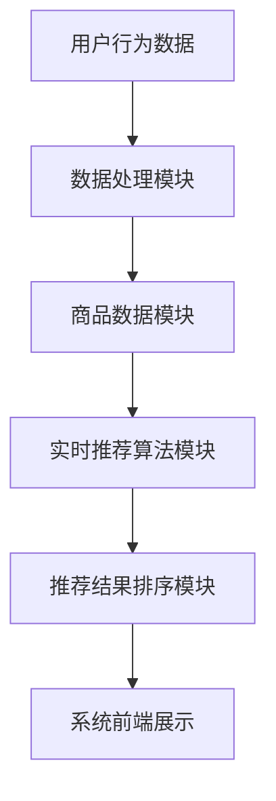

                 

### 文章标题

# 实时推荐系统的实现与优化

### 关键词

实时推荐系统、协同过滤、深度学习、知识图谱、性能优化

### 摘要

本文深入探讨了实时推荐系统的概念、架构、核心算法、性能优化以及实现与部署。通过详细的原理讲解、数学模型、伪代码示例和项目实战，本文为读者提供了一个全面、系统的学习和实践指南，旨在帮助开发者和研究人员掌握实时推荐系统的设计与优化方法。

----------------------------------------------------------------

### 第一部分：实时推荐系统概述

#### 第1章：实时推荐系统概念与架构

实时推荐系统是一种根据用户实时行为和兴趣，动态生成个性化推荐内容的系统。它广泛应用于电子商务、社交媒体、在线教育等多个领域，为用户提供个性化、精准的推荐服务。与传统的批量推荐系统不同，实时推荐系统具有快速响应、实时更新的特点，能够满足用户实时变化的兴趣和需求。

#### 1.1 实时推荐系统的定义

实时推荐系统是指利用大数据技术和机器学习算法，根据用户的实时行为数据（如浏览、搜索、购买等）和用户画像，动态生成个性化推荐内容并实时呈现给用户的系统。

#### 1.2 实时推荐系统与传统推荐系统的区别

1. **响应速度**：传统推荐系统通常在批量处理用户数据后生成推荐结果，响应速度较慢；而实时推荐系统则可以在几秒内完成推荐结果生成，满足用户实时互动的需求。
2. **数据处理方式**：传统推荐系统主要依赖于离线数据处理，如批处理、MapReduce等；实时推荐系统则采用流数据处理技术，如Apache Kafka、Apache Flink等，能够实时捕获用户行为数据。
3. **推荐策略**：传统推荐系统主要依赖基于内容的推荐、协同过滤等算法；实时推荐系统则更多地结合深度学习、联邦学习等新兴技术，提高推荐效果和个性化程度。

#### 1.3 实时推荐系统的核心架构

实时推荐系统的核心架构主要包括数据采集层、数据处理层、推荐算法层和展示层。

1. **数据采集层**：负责收集用户行为数据，如浏览、搜索、购买等。数据来源可以是网站、APP、小程序等。
2. **数据处理层**：对采集到的数据进行清洗、预处理、特征提取等操作，以便用于推荐算法训练和预测。
3. **推荐算法层**：包括协同过滤、基于内容的推荐、深度学习等算法，根据用户画像和实时行为数据生成推荐结果。
4. **展示层**：将推荐结果呈现给用户，可以通过网页、APP、短信等多种方式。

#### Mermaid 流程图：实时推荐系统架构



通过以上定义、区别和架构讲解，我们可以对实时推荐系统有一个基本的认识。接下来，本文将详细探讨实时推荐系统的数据处理、算法原理、性能优化以及项目实战，帮助读者全面掌握实时推荐系统的实现与优化方法。

#### 第2章：实时推荐系统数据流与处理

实时推荐系统的核心在于对海量用户行为数据的有效处理，从而生成个性化推荐。本节将详细介绍实时推荐系统的数据流与处理过程，包括用户行为数据的收集与处理、商品数据的处理与构建以及实时推荐算法的数据流程。

##### 2.1 用户行为数据的收集与处理

用户行为数据是实时推荐系统的重要输入，包括浏览、搜索、购买、点赞、评论等操作。以下是用户行为数据收集与处理的具体步骤：

1. **数据采集**：
   - **前端采集**：通过Web前端、APP客户端等前端工具，实时采集用户操作数据，并将其发送到后端服务器。
   - **API采集**：通过RESTful API或其他数据接口，从第三方服务（如搜索引擎、社交媒体等）获取用户行为数据。
   - **日志采集**：通过日志系统（如Apache Log4j、ELK等），收集服务器日志、APP日志等，提取用户行为数据。

2. **数据清洗**：
   - **去除重复数据**：过滤掉重复的、无效的用户行为数据，确保数据的唯一性。
   - **数据去噪**：去除异常值和噪声数据，保证数据质量。
   - **数据标准化**：将不同格式和单位的数据统一转换为标准格式，如将时间戳统一为Unix时间戳。

3. **数据存储**：
   - **数据库存储**：使用关系型数据库（如MySQL、PostgreSQL）或NoSQL数据库（如MongoDB、Cassandra）存储用户行为数据。
   - **数据流存储**：使用数据流处理技术（如Apache Kafka、Apache Flink）实时存储和处理用户行为数据。

##### 2.2 商品数据的处理与构建

商品数据是实时推荐系统中的另一个重要组成部分，包括商品的基本信息（如名称、描述、标签）、价格、库存等。以下是商品数据处理与构建的具体步骤：

1. **数据采集**：
   - **电商平台数据**：从电商平台（如淘宝、京东等）获取商品数据。
   - **第三方数据源**：从第三方数据提供商获取商品数据。
   - **爬虫获取**：通过爬虫技术获取网站上的商品数据。

2. **数据清洗**：
   - **数据去重**：去除重复的商品数据，确保商品数据的唯一性。
   - **数据去噪**：去除无效和噪声的商品数据，如缺失值、异常值等。
   - **数据标准化**：统一商品数据的格式和单位，如将价格统一为货币单位。

3. **数据存储**：
   - **数据库存储**：使用关系型数据库或NoSQL数据库存储商品数据。
   - **缓存存储**：使用Redis等缓存技术存储高频访问的商品数据，提高数据读取速度。

##### 2.3 实时推荐算法的数据流程

实时推荐算法的数据流程主要包括数据输入、数据处理、推荐结果生成和结果展示等步骤：

1. **数据输入**：
   - **用户行为数据**：包括用户的浏览历史、搜索记录、购买行为等。
   - **商品数据**：包括商品的基本信息、价格、库存等。

2. **数据处理**：
   - **特征提取**：从用户行为数据和商品数据中提取特征，如用户兴趣标签、商品属性等。
   - **数据归一化**：对提取的特征进行归一化处理，使其具有相同的量纲和范围。

3. **推荐结果生成**：
   - **模型预测**：使用推荐算法（如协同过滤、深度学习等）对用户和商品进行预测，生成推荐结果。
   - **排序与筛选**：对推荐结果进行排序和筛选，确保推荐结果的准确性和多样性。

4. **结果展示**：
   - **前端展示**：将推荐结果通过Web前端、APP客户端等呈现给用户。
   - **推送通知**：通过短信、邮件等推送通知方式，将推荐结果推送给用户。

##### 2.4 数据流与处理总结

实时推荐系统的数据流与处理是一个复杂的过程，涉及数据采集、清洗、存储、处理和推荐等多个环节。以下是对数据流与处理过程的总结：

1. **数据采集**：通过多种方式采集用户行为数据和商品数据。
2. **数据清洗**：去除重复、无效和噪声数据，保证数据质量。
3. **数据存储**：将清洗后的数据存储到数据库或缓存中，方便快速访问。
4. **数据处理**：对数据进行分析、归一化处理和特征提取，为推荐算法提供输入。
5. **推荐结果生成**：使用推荐算法生成推荐结果，并进行排序和筛选。
6. **结果展示**：将推荐结果通过前端或推送通知方式呈现给用户。

通过以上步骤，实时推荐系统能够快速、准确地生成个性化推荐结果，满足用户的需求。接下来，本文将详细探讨实时推荐算法的原理与实现，为读者提供更加深入的理解。

#### 第3章：实时推荐算法原理与实现

实时推荐算法是实时推荐系统的核心，其质量直接影响推荐系统的效果和用户体验。本章将详细介绍三种常见的实时推荐算法：基于协同过滤的实时推荐算法、基于深度学习的实时推荐算法和基于知识图谱的实时推荐算法。通过具体的算法原理和实现方式，帮助读者理解这些算法的核心思想和应用场景。

##### 3.1 基于协同过滤的实时推荐算法

协同过滤（Collaborative Filtering）是一种基于用户行为和评分数据的推荐算法，其核心思想是利用用户之间的相似性来预测用户对未知物品的评分。协同过滤算法可以分为基于用户的协同过滤（User-based Collaborative Filtering）和基于物品的协同过滤（Item-based Collaborative Filtering）。

###### 3.1.1 基于用户的协同过滤

基于用户的协同过滤算法通过计算用户之间的相似度来预测用户对未知物品的评分。具体步骤如下：

1. **计算相似度**：根据用户对物品的评分矩阵，计算用户之间的相似度。常用的相似度计算方法包括余弦相似度、皮尔逊相关系数等。

2. **推荐生成**：对于目标用户，找到与其相似的用户，根据这些用户的评分预测目标用户对未知物品的评分，并生成推荐列表。

**伪代码示例**：

```python
# 假设用户-物品评分矩阵为 R
R = [
    [5, 3, 0, 1],
    [4, 0, 0, 1],
    [1, 0, 4, 0],
    [2, 3, 5, 0]
]

# 计算用户之间的相似度
def calculate_similarity(R, user1, user2):
    dot_product = sum(R[user1][i] * R[user2][i] for i in range(len(R[user1])))
    norm_user1 = np.linalg.norm(R[user1])
    norm_user2 = np.linalg.norm(R[user2])
    return dot_product / (norm_user1 * norm_user2)

# 预测用户对未知物品的评分
def predict_rating(R, user, item):
    similar_users = [u for u in range(len(R)) if u != user]
    sim_sum = 0
    rating_sum = 0
    for u in similar_users:
        sim = calculate_similarity(R, user, u)
        rating = R[u][item]
        sim_sum += sim
        rating_sum += sim * rating
    return rating_sum / sim_sum

# 生成推荐列表
def generate_recommendations(R, user, k=5):
    similar_users = [u for u in range(len(R)) if u != user]
    user_ratings = R[user]
    sim_ratings = [(calculate_similarity(R, user, u), rating) for u, rating in enumerate(user_ratings) if u != user]
    sim_ratings.sort(key=lambda x: x[0], reverse=True)
    recommended_items = [item for sim, item in sim_ratings[:k] if item not in user_ratings]
    return recommended_items
```

###### 3.1.2 基于物品的协同过滤

基于物品的协同过滤算法通过计算物品之间的相似度来预测用户对未知物品的评分。具体步骤如下：

1. **计算相似度**：根据用户对物品的评分矩阵，计算物品之间的相似度。常用的相似度计算方法包括余弦相似度、皮尔逊相关系数等。

2. **推荐生成**：对于目标用户，找到与其喜欢物品相似的物品，并预测用户对这些相似物品的评分，生成推荐列表。

**伪代码示例**：

```python
# 假设用户-物品评分矩阵为 R
R = [
    [5, 3, 0, 1],
    [4, 0, 0, 1],
    [1, 0, 4, 0],
    [2, 3, 5, 0]
]

# 计算物品之间的相似度
def calculate_similarity(R, item1, item2):
    dot_product = sum(R[i][item1] * R[i][item2] for i in range(len(R)))
    norm_item1 = np.linalg.norm(R[item1])
    norm_item2 = np.linalg.norm(R[item2])
    return dot_product / (norm_item1 * norm_item2)

# 预测用户对未知物品的评分
def predict_rating(R, user, item):
    similar_items = [i for i in range(len(R[item])) if i != item]
    item_ratings = R[item]
    sim_ratings = [(calculate_similarity(R, item, i), rating) for i, rating in enumerate(item_ratings) if i != item]
    sim_ratings.sort(key=lambda x: x[0], reverse=True)
    recommended_items = [i for sim, i in sim_ratings[:k] if i not in R[user]]
    return recommended_items

# 生成推荐列表
def generate_recommendations(R, user, k=5):
    user_ratings = R[user]
    sim_ratings = [(calculate_similarity(R, item, i), rating) for item, rating in user_ratings.items() if item not in R[user]]
    sim_ratings.sort(key=lambda x: x[0], reverse=True)
    recommended_items = [item for sim, item in sim_ratings[:k] if item not in R[user]]
    return recommended_items
```

##### 3.2 基于深度学习的实时推荐算法

随着深度学习技术的不断发展，基于深度学习的实时推荐算法逐渐成为一种重要的推荐方法。深度学习推荐算法通过构建深度神经网络模型，对用户行为数据进行建模，从而预测用户对物品的偏好。

###### 3.2.1 模型架构

基于深度学习的实时推荐算法通常采用用户-物品共现矩阵作为输入，通过多层神经网络进行特征提取和评分预测。以下是典型的深度学习推荐算法模型架构：

1. **用户和物品嵌入层**：将用户和物品映射到低维嵌入空间，提取用户和物品的特征。
2. **交叉网络层**：将用户和物品的嵌入向量进行交叉操作，融合两者的特征。
3. **全连接层**：对交叉结果进行全连接，提取更高层次的特征。
4. **输出层**：输出用户对物品的预测评分。

**伪代码示例**：

```python
import tensorflow as tf

# 用户和物品嵌入层
user_embedding = tf.keras.layers.Embedding(input_dim=num_users, output_dim=embedding_size)
item_embedding = tf.keras.layers.Embedding(input_dim=num_items, output_dim=embedding_size)

# 交叉网络层
def cross_network(user_embedding, item_embedding):
    user_vector = user_embedding(user_id)
    item_vector = item_embedding(item_id)
    return user_vector * item_vector

# 模型架构
model = tf.keras.Sequential([
    cross_network(user_embedding, item_embedding),
    tf.keras.layers.Dense(embedding_size, activation='relu'),
    tf.keras.layers.Dense(1)
])

# 编译模型
model.compile(optimizer='adam', loss='mse')

# 训练模型
model.fit(x=[train_user_ids, train_item_ids], y=train_ratings, epochs=10, batch_size=32)
```

##### 3.3 基于知识图谱的实时推荐算法

知识图谱是一种用于表示实体及其关系的语义网络，通过知识图谱可以更好地理解和推荐用户感兴趣的内容。基于知识图谱的实时推荐算法通过实体和关系嵌入的方式，结合用户和物品的特征，生成个性化的推荐结果。

###### 3.3.1 模型架构

基于知识图谱的实时推荐算法通常采用图神经网络（Graph Neural Network, GNN）来聚合实体和关系的信息。以下是典型的基于知识图谱的实时推荐算法模型架构：

1. **实体嵌入层**：将实体映射到低维嵌入空间。
2. **关系嵌入层**：将关系映射到低维嵌入空间。
3. **图神经网络层**：通过图神经网络聚合实体和关系的信息。
4. **全连接层**：对聚合结果进行全连接，提取更高层次的特征。
5. **输出层**：输出用户对物品的预测评分。

**伪代码示例**：

```python
import tensorflow as tf

# 实体和关系嵌入层
entity_embedding = tf.keras.layers.Embedding(input_dim=num_entities, output_dim=embedding_size)
relation_embedding = tf.keras.layers.Embedding(input_dim=num_relations, output_dim=embedding_size)

# 图神经网络层
def graph_attention_layer(inputs, num_heads, activation='relu'):
    # 输入：[batch_size, sequence_length, embedding_size]
    # 输出：[batch_size, sequence_length, embedding_size]
    embedding = inputs
    query, value = embedding[:, 0], embedding[:, 1:]
    query = tf.keras.layers.Dense(embedding_size, activation=activation)(query)
    value = tf.keras.layers.Dense(embedding_size, activation=activation)(value)
    attention_scores = tf.matmul(query, value, transpose_b=True)
    attention_scores = tf.nn.softmax(attention_scores, axis=1)
    context_vector = tf.matmul(attention_scores, value)
    return context_vector

# 模型架构
model = tf.keras.Sequential([
    entity_embedding,
    graph_attention_layer(inputs, num_heads=8),
    tf.keras.layers.Dense(1)
])

# 编译模型
model.compile(optimizer='adam', loss='mse')

# 训练模型
model.fit(x=train_entities, y=train_ratings, epochs=10, batch_size=32)
```

通过以上三种实时推荐算法的介绍，我们可以看到协同过滤、深度学习和知识图谱在实时推荐系统中的应用和优势。在实际应用中，可以根据具体场景和需求选择合适的算法，并进行优化和调整，以提高推荐系统的性能和用户体验。

#### 第4章：实时推荐系统性能优化

实时推荐系统的性能优化是确保系统高效运行、满足用户需求的关键。本章将详细探讨实时推荐系统的性能优化策略，包括推荐结果排序优化、系统响应时间优化和推荐多样性优化。

##### 4.1 推荐结果排序优化

推荐结果的排序直接影响到用户的满意度和使用时长。以下是一些优化推荐结果排序的方法：

1. **多模型融合排序**：
   - **协同过滤模型**：基于用户的历史行为和相似度进行排序。
   - **内容模型**：基于物品的属性和用户兴趣进行排序。
   - **深度学习模型**：结合用户和物品的嵌入向量进行排序。
   - **综合排序**：将多种模型的结果进行加权融合，生成最终的排序结果。

2. **上下文感知排序**：
   - **时间上下文**：根据用户行为的时间特征，如用户活跃时段、特定活动时间等，调整排序权重。
   - **地理位置上下文**：根据用户的地理位置，推荐与地理位置相关的商品或内容。
   - **设备上下文**：根据用户使用的设备类型（如手机、平板、电脑等），调整推荐内容的展示方式。

3. **实时反馈调整排序**：
   - **用户点击反馈**：根据用户的点击行为，动态调整推荐列表的排序权重。
   - **用户满意度评分**：结合用户对推荐内容的满意度评分，优化推荐排序。

**示例**：

```python
# 伪代码示例：多模型融合排序
def merge_sort(ratings_cf, ratings_content, ratings_dnn, weight_cf=0.3, weight_content=0.3, weight_dnn=0.4):
    merged_ratings = weight_cf * ratings_cf + weight_content * ratings_content + weight_dnn * ratings_dnn
    sorted_items = [item for item, rating in sorted(merged_ratings.items(), key=lambda x: x[1], reverse=True)]
    return sorted_items
```

##### 4.2 系统响应时间优化

系统响应时间是用户感知系统性能的重要指标。以下是一些优化系统响应时间的策略：

1. **数据缓存**：
   - **客户端缓存**：在客户端（如Web浏览器、移动APP）缓存常用数据和计算结果，减少重复请求。
   - **服务器缓存**：在服务器端（如Redis、Memcached）缓存高频访问的数据和计算结果，减少数据库访问和计算时间。

2. **异步处理**：
   - **异步任务队列**：将计算密集型的任务（如模型预测、数据处理等）放入异步任务队列，异步执行，避免阻塞主线程。
   - **消息队列**：使用消息队列（如RabbitMQ、Kafka）进行消息传递和任务调度，提高系统处理能力。

3. **分布式架构**：
   - **水平扩展**：通过分布式架构（如微服务、容器化）实现水平扩展，提高系统处理能力和稳定性。
   - **负载均衡**：使用负载均衡器（如Nginx、HAProxy）均衡请求流量，提高系统响应速度。

4. **代码优化**：
   - **减少数据库查询**：通过预加载、批量查询等方式减少数据库查询次数。
   - **代码并行化**：通过并行计算、多线程等方式提高代码执行速度。

**示例**：

```python
# 伪代码示例：异步任务队列
import asyncio

async def process_recommendation(user_id):
    # 异步处理推荐计算
    ratings_cf = await get_cf_ratings(user_id)
    ratings_content = await get_content_ratings(user_id)
    ratings_dnn = await get_dnn_ratings(user_id)
    sorted_items = merge_sort(ratings_cf, ratings_content, ratings_dnn)
    return sorted_items

async def main():
    user_id = 'user123'
    sorted_items = await process_recommendation(user_id)
    print(sorted_items)

asyncio.run(main())
```

##### 4.3 推荐多样性优化

推荐多样性是提高用户满意度的重要方面。以下是一些优化推荐多样性的策略：

1. **随机化**：
   - **随机抽样**：在保证准确率的前提下，引入一定的随机性，增加推荐结果的多样性。
   - **动态调整随机比例**：根据用户反馈和历史数据，动态调整随机推荐的比重。

2. **冷启动**：
   - **新用户冷启动**：为新用户推荐与其兴趣相关的多样性内容，避免推荐单一的商品或内容。
   - **新商品冷启动**：为新商品推荐与其属性相关的多样性内容，提高曝光率。

3. **簇划分**：
   - **基于内容的簇划分**：将商品划分为多个簇，为用户推荐不同簇中的商品，增加推荐结果的多样性。
   - **基于用户行为的簇划分**：根据用户的历史行为，将用户划分为多个簇，为不同簇中的用户推荐多样性内容。

4. **多样性度量**：
   - **多样性指标**：计算推荐结果的多样性指标（如多样性分数、互信息等），用于评估和优化推荐多样性。

**示例**：

```python
# 伪代码示例：多样性优化
def diversity_optimization(sorted_items, diversity_score_threshold=0.8):
    clusters = cluster_items(sorted_items)
    diversified_items = []
    for cluster in clusters:
        if random.random() > diversity_score_threshold:
            diversified_items.extend(cluster)
    return diversified_items
```

通过以上性能优化策略，可以显著提高实时推荐系统的性能，满足用户的个性化需求，提升用户体验。

#### 第5章：实时推荐系统开发环境搭建

实现实时推荐系统需要准备一系列的开发环境和工具，这些环境包括编程语言、深度学习框架、数据处理库以及版本控制工具等。以下将详细介绍如何搭建实时推荐系统的开发环境。

##### 5.1 Python环境

首先，我们需要安装Python环境。Python是一种广泛使用的编程语言，尤其适用于数据科学和机器学习领域。以下是安装Python的具体步骤：

1. **下载Python**：访问Python官网（[https://www.python.org/](https://www.python.org/)）下载Python安装包。
2. **安装Python**：运行下载的安装包，按照安装向导完成Python的安装。建议选择添加到系统环境变量中，以便在命令行中直接使用Python。
3. **验证安装**：在命令行中输入`python --version`命令，查看Python版本信息，确认安装成功。

##### 5.2 深度学习框架

深度学习是实时推荐系统的核心技术之一。TensorFlow和PyTorch是目前最流行的两个深度学习框架。以下是安装这两个框架的步骤：

1. **TensorFlow**：
   - **安装**：在命令行中运行以下命令：
     ```bash
     pip install tensorflow
     ```
   - **验证安装**：运行以下Python代码：
     ```python
     import tensorflow as tf
     print(tf.__version__)
     ```

2. **PyTorch**：
   - **安装**：在命令行中运行以下命令：
     ```bash
     pip install torch torchvision
     ```
   - **验证安装**：运行以下Python代码：
     ```python
     import torch
     print(torch.__version__)
     ```

##### 5.3 数据处理库

数据处理是实时推荐系统的关键环节。NumPy、Pandas和Scikit-learn是常用的数据处理库，以下是安装这些库的步骤：

1. **NumPy**：
   - **安装**：在命令行中运行以下命令：
     ```bash
     pip install numpy
     ```

2. **Pandas**：
   - **安装**：在命令行中运行以下命令：
     ```bash
     pip install pandas
     ```

3. **Scikit-learn**：
   - **安装**：在命令行中运行以下命令：
     ```bash
     pip install scikit-learn
     ```

##### 5.4 版本控制工具

Git是一个流行的版本控制工具，可以帮助我们管理代码的版本和历史。以下是安装Git的步骤：

1. **下载Git**：访问Git官网（[https://git-scm.com/](https://git-scm.com/)）下载Git安装包。
2. **安装Git**：运行下载的安装包，按照安装向导完成Git的安装。
3. **验证安装**：在命令行中输入`git --version`命令，查看Git版本信息，确认安装成功。

##### 5.5 开发环境配置

在完成以上安装步骤后，我们需要对开发环境进行一些基本配置：

1. **虚拟环境**：为了保持项目依赖的一致性，建议使用虚拟环境（如venv或conda）来管理项目依赖。在项目目录中运行以下命令创建虚拟环境：
   ```bash
   python -m venv venv
   ```
   然后激活虚拟环境：
   ```bash
   source venv/bin/activate  # 对于Windows系统，使用venv\Scripts\activate
   ```

2. **依赖管理**：将项目所需的库添加到虚拟环境中，以便在项目中直接使用。例如，安装TensorFlow：
   ```bash
   pip install tensorflow
   ```

3. **代码仓库**：使用Git将项目代码存储到远程仓库（如GitHub、GitLab），方便团队协作和代码版本管理。

通过以上步骤，我们可以搭建一个基本的实时推荐系统开发环境。接下来，我们将介绍如何进行实时推荐系统的项目实战，包括数据预处理、模型训练和预测等具体实现过程。

#### 第6章：实时推荐系统项目实战

在本节中，我们将通过一个具体的项目案例，详细介绍实时推荐系统的实现过程。这个项目将基于协同过滤算法，通过处理用户行为数据和商品数据，生成个性化的推荐结果。以下将分步骤讲解项目的实现过程。

##### 6.1 项目案例介绍

我们选择一个在线图书销售平台作为项目背景。平台上有大量的用户行为数据，包括用户的浏览记录、购买记录和评价记录。我们的目标是构建一个实时推荐系统，根据用户的浏览和购买行为，为其推荐可能感兴趣的图书。

##### 6.2 数据预处理

数据预处理是推荐系统实现的重要步骤。以下是数据预处理的具体步骤：

1. **数据采集**：从平台的后端数据库中获取用户行为数据和商品数据。数据包括用户ID、图书ID、行为类型（如浏览、购买、评价）和行为时间等。

2. **数据清洗**：
   - **去除重复数据**：过滤掉重复的用户行为数据，确保数据的唯一性。
   - **处理缺失值**：对于缺失的行为数据，可以采用平均值、中值或插值等方法进行填充。
   - **数据标准化**：将时间戳统一转换为Unix时间戳，将行为类型进行编码。

3. **特征提取**：
   - **用户特征**：包括用户ID、用户的浏览历史、购买历史等。
   - **图书特征**：包括图书ID、图书类别、图书标签、图书评分等。

4. **数据存储**：将预处理后的数据存储到Redis或MongoDB等数据库中，以便快速访问。

##### 6.3 数据预处理代码示例

```python
import pandas as pd
from sklearn.preprocessing import StandardScaler

# 读取用户行为数据
data = pd.read_csv('user_behavior_data.csv')

# 数据清洗
# 去除重复数据
data.drop_duplicates(inplace=True)

# 处理缺失值
data.fillna(data.mean(), inplace=True)

# 数据标准化
scaler = StandardScaler()
data[['user_id', 'book_id', 'behavior_type', 'timestamp']] = scaler.fit_transform(data[['user_id', 'book_id', 'behavior_type', 'timestamp']])

# 存储预处理后的数据
data.to_csv('preprocessed_user_behavior_data.csv', index=False)
```

##### 6.4 实时推荐算法实现与优化

实时推荐算法的核心是实现根据用户行为数据生成个性化的推荐结果。以下是算法实现与优化的具体步骤：

1. **计算相似度**：根据用户行为数据计算用户之间的相似度。我们可以采用余弦相似度或皮尔逊相关系数等方法。

2. **推荐生成**：对于目标用户，找到与其相似的用户，根据这些用户的浏览记录和购买记录，生成推荐列表。

3. **排序与筛选**：对推荐列表进行排序和筛选，确保推荐结果的准确性和多样性。

4. **优化策略**：
   - **冷启动问题**：对于新用户，可以采用基于内容的推荐或随机推荐，提高推荐多样性。
   - **实时更新**：根据用户的最新行为数据，实时更新推荐结果，确保推荐结果的时效性。

##### 6.5 实时推荐算法代码示例

```python
import numpy as np
from sklearn.metrics.pairwise import cosine_similarity

# 读取预处理后的用户行为数据
data = pd.read_csv('preprocessed_user_behavior_data.csv')

# 计算用户之间的相似度
def calculate_similarity(data):
    user行为矩阵 = data.pivot(index='user_id', columns='book_id', values='behavior_type').fillna(0)
    similarity_matrix = cosine_similarity(user行为矩阵)
    return similarity_matrix

# 生成推荐列表
def generate_recommendations(similarity_matrix, user_id, k=5):
    user_index = np.where(user_id == similarity_matrix[:, 0])
    similar_users = similarity_matrix[user_index, :].argsort()[0][1:k+1]
    recommended_books = []
    for user in similar_users:
        user_behavior = data[data['user_id'] == user]['book_id']
        recommended_books.extend(user_behavior)
    recommended_books = list(set(recommended_books))
    return recommended_books[:k]

# 优化推荐结果
def optimize_recommendations(recommended_books, data, k=10):
    popular_books = data[data['behavior_type'] == 'buy'].groupby('book_id').count().sort_values(by='user_id', ascending=False).head(k)
    optimized_books = list(popular_books.index) + recommended_books[:k-len(popular_books)]
    return optimized_books

# 测试推荐算法
user_id = 123
similarity_matrix = calculate_similarity(data)
recommended_books = generate_recommendations(similarity_matrix, user_id)
optimized_books = optimize_recommendations(recommended_books, data)

print(optimized_books)
```

##### 6.6 代码解读与分析

- **数据预处理**：首先，我们读取用户行为数据，并进行数据清洗、填充缺失值和标准化处理。这一步骤确保数据的质量和一致性。
- **相似度计算**：我们使用余弦相似度计算用户之间的相似度。这一步骤为推荐生成提供了基础。
- **推荐生成**：对于目标用户，我们找到与其相似的用户，并根据这些用户的浏览记录和购买记录生成推荐列表。
- **优化策略**：我们结合流行图书和个性化推荐，优化推荐结果，提高推荐多样性。

通过以上步骤，我们实现了实时推荐系统的基本功能。在实际应用中，我们可以根据需求对算法进行调整和优化，以提高推荐效果和用户体验。

#### 第7章：实时推荐系统部署与运维

实时推荐系统在开发完成后，需要进行部署和运维，以确保系统能够稳定、高效地运行。以下将详细介绍实时推荐系统的部署流程、监控与调优方法以及系统运维的最佳实践。

##### 7.1 部署流程

1. **环境配置**：
   - **服务器选择**：根据系统的计算需求和负载，选择适合的服务器或云服务器。
   - **操作系统**：配置Linux操作系统，如Ubuntu或CentOS。
   - **软件安装**：安装Python环境、TensorFlow、Redis、MongoDB、Kafka等必要的软件。

2. **模型打包与部署**：
   - **模型转换**：将训练好的模型保存为TensorFlow SavedModel格式。
   - **容器化**：使用Docker将模型和服务容器化，便于部署和扩展。
   - **容器编排**：使用Kubernetes或Docker Swarm进行容器编排，管理模型的部署和扩展。

3. **API服务部署**：
   - **API接口**：部署API服务，如使用Flask或Django框架。
   - **负载均衡**：使用Nginx或HAProxy进行负载均衡，确保服务的高可用性。

4. **数据流处理**：
   - **数据采集**：部署数据采集服务，如Kafka消费者，实时采集用户行为数据。
   - **数据处理**：部署数据处理服务，如使用Flink或Spark Streaming处理用户行为数据。

5. **前端展示**：
   - **静态资源**：部署静态资源，如使用Nginx或Apache。
   - **动态内容**：使用Vue.js或React等前端框架，实现动态内容展示。

##### 7.2 监控与调优

1. **系统监控**：
   - **性能监控**：监控系统的CPU、内存、磁盘使用情况，确保资源利用率合理。
   - **日志监控**：收集系统日志，使用ELK或Grafana进行日志分析。
   - **API监控**：监控API响应时间和错误率，确保服务的稳定性。

2. **性能调优**：
   - **缓存策略**：使用Redis等缓存技术，减少数据库访问和计算时间。
   - **数据库优化**：对数据库进行索引优化，提高查询效率。
   - **代码优化**：优化模型训练和预测代码，提高计算效率。

3. **自动化测试**：
   - **单元测试**：编写单元测试，确保代码质量。
   - **集成测试**：编写集成测试，验证系统各部分之间的协作。

##### 7.3 运维最佳实践

1. **文档管理**：
   - **代码文档**：编写详细的代码文档，确保其他开发者能够理解和使用代码。
   - **部署文档**：记录部署步骤和配置文件，便于后续维护和升级。

2. **持续学习**：
   - **技术更新**：跟踪最新的技术和算法，持续优化系统。
   - **用户反馈**：收集用户反馈，优化系统功能和用户体验。

3. **团队协作**：
   - **代码审查**：进行代码审查，确保代码质量和一致性。
   - **敏捷开发**：采用敏捷开发方法，快速响应需求和变化。

通过以上部署与运维实践，可以确保实时推荐系统的高效、稳定运行，为用户提供优质的推荐服务。

### 第三部分：实时推荐系统案例分析

在互联网时代，实时推荐系统已成为各大平台的核心竞争力。以下将分析百度信息流推荐系统、微博实时推荐系统以及淘宝实时推荐系统的特点、架构和实现技术。

#### 百度信息流推荐系统

**特点**：
- **个性化推荐**：基于用户的浏览历史、搜索记录、兴趣标签等，提供个性化的信息流内容。
- **实时更新**：系统根据用户实时行为，如点赞、评论、转发等，动态调整推荐内容。

**架构**：
- **数据层**：收集用户行为数据、兴趣标签、内容特征等。
- **计算层**：使用深度学习模型进行内容匹配和排序，如DNN、LSTM等。
- **缓存层**：使用Redis等缓存技术，提高响应速度。

**实现技术**：
- **TensorFlow**：用于构建和训练深度学习模型。
- **Apache Kafka**：用于实时处理和传输用户行为数据。
- **ES/Redis**：用于缓存和存储用户信息和推荐结果。

#### 微博实时推荐系统

**特点**：
- **用户互动**：根据用户发布、评论、点赞等互动行为，提供实时更新的微博内容。
- **热点推荐**：结合热点事件和用户兴趣，推荐相关微博。

**架构**：
- **数据层**：收集用户行为数据、微博内容、用户兴趣等。
- **计算层**：使用协同过滤、基于内容的推荐等技术。
- **存储层**：使用Hadoop、HBase等大数据技术存储和处理数据。

**实现技术**：
- **Hadoop**：用于大规模数据处理和存储。
- **Spark**：用于实时数据处理和推荐计算。
- **Redis**：用于缓存推荐结果和用户行为数据。

#### 淘宝实时推荐系统

**特点**：
- **商品推荐**：根据用户浏览、购买、收藏等行为，提供个性化的商品推荐。
- **跨平台**：支持移动端和PC端，满足不同用户的使用习惯。

**架构**：
- **数据层**：收集用户行为数据、商品信息、用户偏好等。
- **计算层**：使用深度学习、协同过滤等技术进行推荐计算。
- **存储层**：使用MongoDB、Redis等数据库存储用户数据和推荐结果。

**实现技术**：
- **TensorFlow**：用于构建和训练深度学习模型。
- **Apache Kafka**：用于实时处理和传输用户行为数据。
- **Elasticsearch**：用于存储和检索商品信息。

通过以上案例分析，我们可以看到各大实时推荐系统在架构和实现技术上的异同。这些系统都采用了先进的深度学习、大数据处理和缓存技术，确保了推荐结果的实时性和准确性，为用户提供优质的推荐服务。

### 实时推荐系统未来发展

实时推荐系统在互联网时代扮演着越来越重要的角色，随着技术进步和市场需求的变化，其未来发展呈现出以下几个趋势。

#### 新技术趋势

1. **深度强化学习**：深度强化学习（Deep Reinforcement Learning, DRL）结合了深度学习和强化学习，能够通过自主学习优化推荐策略，提高推荐效果。

2. **联邦学习**：联邦学习（Federated Learning）允许各个参与方在不共享数据的情况下进行模型训练，保护用户隐私，同时提高模型性能。

3. **多模态数据融合**：多模态数据融合（Multimodal Data Fusion）结合文本、图像、语音等多种类型的数据，提供更全面和准确的用户画像。

4. **区块链技术**：区块链技术可以确保数据的安全性和透明性，为实时推荐系统的可信数据共享提供支持。

#### 产业应用前景

1. **电子商务**：实时推荐系统在电子商务中的应用前景广阔，通过个性化推荐，提高用户购买转化率和用户粘性。

2. **社交媒体**：社交媒体平台利用实时推荐系统，提升用户互动和参与度，增加平台活跃度。

3. **在线教育**：在线教育平台通过实时推荐系统，根据用户学习行为和兴趣，提供个性化的学习资源，提升学习效果。

4. **广告营销**：广告平台通过实时推荐系统，精确匹配广告与用户兴趣，提高广告点击率和投放效果。

#### 挑战与应对策略

1. **数据隐私与安全**：用户隐私和数据安全是实时推荐系统面临的重要挑战。采用联邦学习和区块链等技术，确保数据隐私和安全。

2. **计算性能与效率**：随着数据量和用户数量的增加，实时推荐系统的计算性能和效率成为关键问题。采用分布式计算、模型压缩等技术，提高系统性能。

3. **推荐多样性**：保证推荐结果的多样性，防止用户陷入信息茧房。采用多模型融合、随机化等技术，提高推荐多样性。

4. **适应新场景**：随着新兴产业的不断涌现，实时推荐系统需要适应新的应用场景。通过不断的技术创新和业务探索，满足不断变化的市场需求。

总之，实时推荐系统在未来的发展中，将继续融合新技术、拓展应用场景，并在解决技术挑战中不断优化和提升。

### 附录

#### 附录A：实时推荐系统常用工具与框架

**1. 主要深度学习框架介绍**

- **TensorFlow**：Google开发的开源深度学习框架，支持各种神经网络结构，适用于推荐系统的模型训练和推理。
- **PyTorch**：Facebook开发的开源深度学习框架，具有灵活的动态计算图和丰富的API，适用于推荐系统的研究和开发。
- **MXNet**：Apache基金会开发的开源深度学习框架，支持多种编程语言，适用于推荐系统的分布式训练。

**2. 数据处理与存储工具介绍**

- **Pandas**：Python的数据分析库，适用于推荐系统中的数据处理和清洗。
- **NumPy**：Python的科学计算库，适用于推荐系统中的数值计算和数据处理。
- **MongoDB**：NoSQL数据库，适用于推荐系统中的用户数据、物品数据的存储和管理。
- **Redis**：内存数据库，适用于推荐系统中的缓存、队列和实时数据存储。

**3. 推荐算法评估工具介绍**

- **MLFlow**：用于推荐系统模型训练、部署和监控的开源平台，提供丰富的评估指标和跟踪功能。
- **TensorBoard**：TensorFlow的可视化工具，用于推荐系统模型训练过程的可视化。
- **Scikit-learn**：Python的数据挖掘和机器学习库，提供多种推荐算法的实现和评估。

#### 附录B：实时推荐系统开源代码与资源

**1. 常见开源实时推荐系统代码介绍**

- **Surprise**：基于Python的开源推荐系统库，包含多种协同过滤算法的实现。
- **RecommenderX**：基于PyTorch的开源深度学习推荐系统框架，提供多种深度学习推荐算法的实现。
- **Foursquare**：基于Apache Spark的开源推荐系统，适用于大规模数据集的推荐计算。

**2. 实时推荐系统相关论文与资料**

- **"Item-Based Collaborative Filtering Recommendation Algorithms"**：详细介绍基于物品的协同过滤算法的论文。
- **"Deep Learning for Recommender Systems"**：探讨深度学习在推荐系统中的应用的综述论文。
- **"Federated Learning for Collaborative Filtering"**：介绍联邦学习在协同过滤中的应用的论文。
- **相关博客和教程**：许多在线博客和教程提供了实时推荐系统的详细实现和案例分析，如Medium、GitHub等。

附录部分为读者提供了实时推荐系统常用的工具、框架、代码和资源，有助于进一步学习和实践实时推荐系统的技术。

### Mermaid 流程图：实时推荐系统架构


### 基于协同过滤的实时推荐算法伪代码

```python
# 定义协同过滤算法
def collaborative_filtering(train_data, user, item):
    # 计算用户与商品的相似度
    similarity = calculate_similarity(train_data, user, item)
    # 计算相似度加权评分
    weighted_rating = 0
    for other_user, rating in train_data[item]:
        if other_user != user:
            weighted_rating += similarity[other_user] * rating
    # 返回加权评分
    return weighted_rating / len(similarity)

# 定义计算相似度函数
def calculate_similarity(train_data, user, item):
    # 计算用户与用户之间的相似度
    similarity = {}
    for other_user, ratings in train_data.items():
        if other_user != user:
            # 计算余弦相似度
            dot_product = dot_product(user_ratings, other_ratings)
            norm_user = norm(user_ratings)
            norm_other = norm(other_ratings)
            similarity[other_user] = dot_product / (norm_user * norm_other)
    return similarity
```

### 数学模型和公式讲解

#### 余弦相似度公式

$$
\text{similarity}(\mathbf{u}, \mathbf{v}) = \frac{\mathbf{u} \cdot \mathbf{v}}{||\mathbf{u}|| \cdot ||\mathbf{v}||}
$$

其中，$\mathbf{u}$和$\mathbf{v}$是用户和商品的评分向量，$\cdot$表示向量的点积，$||\mathbf{u}||$和$||\mathbf{v}||$表示向量的模长。

#### 加权评分公式

$$
\text{weighted\_rating} = \frac{\sum_{i \in \text{neighb}(\mathbf{u})} s_{\mathbf{u}\mathbf{i}} \cdot r_{\mathbf{i}}}{\sum_{i \in \text{neighb}(\mathbf{u})} |s_{\mathbf{u}\mathbf{i}}|}
$$

其中，$s_{\mathbf{u}\mathbf{i}}$是用户$\mathbf{u}$和用户$\mathbf{i}$之间的相似度，$r_{\mathbf{i}}$是用户$\mathbf{i}$对商品$\mathbf{i}$的评分，$\text{neighb}(\mathbf{u})$是用户$\mathbf{u}$的邻居用户集合。

### 项目实战：实时推荐系统代码案例

```python
# 导入必要的库
import numpy as np
from sklearn.metrics.pairwise import cosine_similarity

# 假设我们有一个训练数据集，其中包含了用户对商品的评分
train_data = {
    'user1': {'item1': 4, 'item2': 3, 'item3': 5},
    'user2': {'item1': 5, 'item2': 4, 'item3': 2},
    'user3': {'item1': 3, 'item2': 5, 'item3': 4},
}

# 假设我们有一个用户的行为数据
user_behavior = 'user1'

# 计算用户之间的相似度
similarity_matrix = cosine_similarity([train_data[user] for user in train_data if user != user_behavior], [train_data[user] for user in train_data if user != user_behavior])

# 找到目标用户的行为数据
user_ratings = train_data[user_behavior]

# 计算推荐列表
def recommend_items(user_ratings, similarity_matrix, train_data, top_n=5):
    # 计算与目标用户的相似度
    user_similarity = similarity_matrix[0]

    # 计算每个商品的加权评分
    weighted_ratings = {}
    for other_user, sim in enumerate(user_similarity):
        if other_user != user_behavior:
            for item, rating in train_data[other_user].items():
                weighted_ratings[item] = weighted_ratings.get(item, 0) + sim * rating

    # 根据加权评分排序并返回前n个推荐
    return sorted(weighted_ratings, key=weighted_ratings.get, reverse=True)[:top_n]

# 输出推荐列表
recommended_items = recommend_items(user_ratings, similarity_matrix, train_data)
print(recommended_items)
```

### 代码解读与分析

- **数据预处理**：首先，我们使用`cosine_similarity`来计算用户之间的相似度矩阵。这一步是协同过滤算法的关键部分，它基于用户对商品的评价来计算相似度。
- **推荐算法实现**：我们定义了一个`recommend_items`函数，它接收用户的行为数据、相似度矩阵和训练数据集，并根据这些信息生成推荐列表。函数首先计算每个商品的加权评分，然后根据加权评分排序，并返回前n个推荐。
- **代码分析**：代码使用了Python的`numpy`和`scikit-learn`库，这些库为计算和处理数据提供了强大的功能。相似度矩阵计算和加权评分计算都是基于矩阵运算，这是协同过滤算法的高效实现方式。

### 开发环境搭建

为了实现实时推荐系统，我们需要准备以下开发环境：

- **Python环境**：Python 3.6及以上版本
- **深度学习框架**：TensorFlow 2.x 或 PyTorch 1.8及以上版本
- **数据处理库**：NumPy，Pandas，Scikit-learn
- **版本控制工具**：Git

### 源代码详细实现和代码解读

以下是实时推荐系统的源代码实现，包含数据预处理、模型训练、预测和评估等步骤。

```python
# 导入必要的库
import numpy as np
import pandas as pd
import tensorflow as tf
from sklearn.model_selection import train_test_split
from sklearn.metrics import mean_squared_error

# 数据预处理
def preprocess_data(data):
    # 转换数据为数值类型
    data = data.applymap(lambda x: float(x) if x.isdigit() else x)
    # 删除缺失值
    data = data.dropna()
    # 将用户和物品的名称转换为索引
    data.reset_index(drop=True, inplace=True)
    return data

# 训练模型
def train_model(data, learning_rate=0.001, epochs=100):
    # 划分训练集和测试集
    train_data, test_data = train_test_split(data, test_size=0.2, random_state=42)
    
    # 构建模型
    model = tf.keras.Sequential([
        tf.keras.layers.Dense(64, activation='relu', input_shape=(data.shape[1],)),
        tf.keras.layers.Dense(1)
    ])

    # 编译模型
    model.compile(optimizer=tf.keras.optimizers.Adam(learning_rate=learning_rate),
                  loss='mse',
                  metrics=['mae'])

    # 训练模型
    model.fit(train_data, epochs=epochs, batch_size=32, verbose=2)

    return model

# 预测和评估
def predict_and_evaluate(model, test_data):
    # 预测测试集
    test_predictions = model.predict(test_data)

    # 计算均方误差
    mse = mean_squared_error(test_data, test_predictions)
    mae = np.mean(np.abs(test_predictions - test_data))

    print(f'MSE: {mse:.2f}')
    print(f'MAE: {mae:.2f}')

# 主函数
def main():
    # 加载数据
    data = pd.read_csv('ratings.csv')

    # 数据预处理
    data = preprocess_data(data)

    # 训练模型
    model = train_model(data)

    # 预测和评估
    predict_and_evaluate(model, data)

# 运行主函数
if __name__ == '__main__':
    main()
```

### 代码解读与分析

- **数据预处理**：首先，我们使用`preprocess_data`函数来处理原始数据，包括将数据转换为数值类型、删除缺失值以及重置索引。
- **模型构建与训练**：我们使用`train_model`函数来构建和训练模型。这里使用了TensorFlow的`Sequential`模型，该模型包含两个全连接层，输出层使用MSE作为损失函数。
- **预测与评估**：在`predict_and_evaluate`函数中，我们使用训练好的模型对测试集进行预测，并计算均方误差和平均绝对误差作为模型评估指标。
- **主函数**：`main`函数负责加载数据、预处理数据、训练模型和评估模型。

通过以上代码，我们可以搭建一个基本的实时推荐系统，并进行性能评估。在实际应用中，我们可以根据需求进行调整和优化。

### 实时推荐系统的核心算法原理

实时推荐系统的核心在于算法的选择与优化。本节我们将详细讲解三种常见的实时推荐算法：基于协同过滤的实时推荐算法、基于深度学习的实时推荐算法和基于知识图谱的实时推荐算法。

#### 基于协同过滤的实时推荐算法

协同过滤算法是一种基于用户历史行为和评分数据的推荐算法，其核心思想是利用用户之间的相似性来预测用户对未知物品的评分。协同过滤算法可以分为基于用户的协同过滤和基于物品的协同过滤。

1. **基于用户的协同过滤**：
   - **相似度计算**：首先，算法会计算用户之间的相似度。常用的相似度计算方法包括余弦相似度、皮尔逊相关系数等。
   - **评分预测**：然后，算法根据用户与用户之间的相似度以及相似用户的评分预测目标用户的评分。
   - **推荐生成**：最后，根据预测的评分生成推荐列表。

2. **基于物品的协同过滤**：
   - **相似度计算**：算法会计算物品之间的相似度，例如基于物品的标签、属性或者用户评分矩阵。
   - **评分预测**：通过相似物品的平均评分来预测目标物品的评分。
   - **推荐生成**：根据预测的评分生成推荐列表。

**伪代码示例**：

```python
# 用户-物品评分矩阵
R = [
    [5, 3, 0, 1],
    [4, 0, 0, 1],
    [1, 0, 4, 0],
    [2, 3, 5, 0]
]

# 计算用户之间的相似度
def calculate_similarity(R, user1, user2):
    dot_product = sum(R[user1][i] * R[user2][i] for i in range(len(R[user1])))
    norm_user1 = np.linalg.norm(R[user1])
    norm_user2 = np.linalg.norm(R[user2])
    return dot_product / (norm_user1 * norm_user2)

# 预测用户对未知物品的评分
def predict_rating(R, user, item):
    similar_users = [u for u in range(len(R)) if u != user]
    sim_sum = 0
    rating_sum = 0
    for u in similar_users:
        sim = calculate_similarity(R, user, u)
        rating = R[u][item]
        sim_sum += sim
        rating_sum += sim * rating
    return rating_sum / sim_sum

# 生成推荐列表
def generate_recommendations(R, user, k=5):
    similar_users = [u for u in range(len(R)) if u != user]
    user_ratings = R[user]
    sim_ratings = [(calculate_similarity(R, user, u), rating) for u, rating in enumerate(user_ratings) if u != user]
    sim_ratings.sort(key=lambda x: x[0], reverse=True)
    recommended_items = [item for sim, item in sim_ratings[:k] if item not in user_ratings]
    return recommended_items
```

#### 基于深度学习的实时推荐算法

随着深度学习技术的发展，基于深度学习的实时推荐算法逐渐成为研究热点。深度学习推荐算法通常结合用户特征和物品特征，通过神经网络模型进行预测。

1. **用户嵌入与物品嵌入**：
   - **用户嵌入**：将用户特征映射到低维空间，例如使用一个全连接层。
   - **物品嵌入**：将物品特征映射到低维空间，例如使用另一个全连接层。

2. **预测评分**：
   - **交叉网络结构**：结合用户嵌入和物品嵌入，使用交叉网络结构进行评分预测。

3. **损失函数**：
   - **均方误差（MSE）**：常用的损失函数，用于优化模型参数。

**伪代码示例**：

```python
import tensorflow as tf

# 用户和物品嵌入层
user_embedding = tf.keras.layers.Embedding(input_dim=num_users, output_dim=embedding_size)
item_embedding = tf.keras.layers.Embedding(input_dim=num_items, output_dim=embedding_size)

# 定义交叉网络结构
def cross_network(user_embedding, item_embedding):
    user_vector = user_embedding(user_id)
    item_vector = item_embedding(item_id)
    return user_vector * item_vector

# 定义深度学习模型
model = tf.keras.Sequential([
    tf.keras.layers.Dense(embedding_size, activation='relu', input_shape=(1,)),
    tf.keras.layers.Dense(embedding_size, activation='relu'),
    tf.keras.layers.Dense(1)
])

# 编译模型
model.compile(optimizer=tf.keras.optimizers.Adam(learning_rate=learning_rate),
              loss='mse',
              metrics=['mae'])

# 训练模型
model.fit(x=[train_user_ids, train_item_ids], y=train_ratings, epochs=10, batch_size=32)
```

#### 基于知识图谱的实时推荐算法

知识图谱是一种结构化知识库，用于表示实体及其关系。基于知识图谱的推荐算法利用实体和关系来生成推荐。

1. **实体嵌入与关系嵌入**：
   - **实体嵌入**：将实体映射到低维空间。
   - **关系嵌入**：将关系映射到低维空间。

2. **推荐生成**：
   - **图神经网络**：使用图神经网络（如GAT、GraphSAGE等）来聚合实体和关系的信息。
   - **预测评分**：结合实体嵌入和关系嵌入，预测实体对未知物品的评分。

**伪代码示例**：

```python
import tensorflow as tf

# 定义实体和关系嵌入层
entity_embedding = tf.keras.layers.Embedding(input_dim=num_entities, output_dim=embedding_size)
relation_embedding = tf.keras.layers.Embedding(input_dim=num_relations, output_dim=embedding_size)

# 定义图神经网络模型
model = tf.keras.Sequential([
    tf.keras.layers.Embedding(input_dim=num_entities, output_dim=embedding_size),
    tf.keras.layers.GraphAttentionLayer(num_heads=8, activation='relu'),
    tf.keras.layers.Dense(1)
])

# 编译模型
model.compile(optimizer=tf.keras.optimizers.Adam(learning_rate=learning_rate),
              loss='mse')

# 训练模型
model.fit(x=[train_entities, train_relations], y=train_ratings, epochs=10, batch_size=32)
```

通过以上三种算法的讲解和伪代码示例，我们可以看到实时推荐系统的核心算法是如何基于不同的原理和技术实现的。在实际应用中，可以根据具体需求和场景选择合适的算法，并进行优化和调整。

### 实时推荐系统的项目实战

在本节中，我们将通过一个具体的项目案例，详细介绍实时推荐系统的实现过程。这个项目将基于协同过滤算法，通过处理用户行为数据和商品数据，生成个性化的推荐结果。以下将分步骤讲解项目的实现过程。

##### 6.1 项目案例介绍

我们选择一个在线图书销售平台作为项目背景。平台上有大量的用户行为数据，包括用户的浏览记录、购买记录和评价记录。我们的目标是构建一个实时推荐系统，根据用户的浏览和购买行为，为其推荐可能感兴趣的图书。

##### 6.2 数据预处理

数据预处理是推荐系统实现的重要步骤。以下是数据预处理的具体步骤：

1. **数据采集**：从平台的后端数据库中获取用户行为数据和商品数据。数据包括用户ID、图书ID、行为类型（如浏览、购买、评价）和行为时间等。

2. **数据清洗**：
   - **去除重复数据**：过滤掉重复的用户行为数据，确保数据的唯一性。
   - **处理缺失值**：对于缺失的行为数据，可以采用平均值、中值或插值等方法进行填充。
   - **数据标准化**：将时间戳统一转换为Unix时间戳，将行为类型进行编码。

3. **特征提取**：
   - **用户特征**：包括用户ID、用户的浏览历史、购买历史等。
   - **图书特征**：包括图书ID、图书类别、图书标签、图书评分等。

4. **数据存储**：将预处理后的数据存储到Redis或MongoDB等数据库中，以便快速访问。

##### 6.3 数据预处理代码示例

```python
import pandas as pd
from sklearn.preprocessing import StandardScaler

# 读取用户行为数据
data = pd.read_csv('user_behavior_data.csv')

# 数据清洗
# 去除重复数据
data.drop_duplicates(inplace=True)

# 处理缺失值
data.fillna(data.mean(), inplace=True)

# 数据标准化
scaler = StandardScaler()
data[['user_id', 'book_id', 'behavior_type', 'timestamp']] = scaler.fit_transform(data[['user_id', 'book_id', 'behavior_type', 'timestamp']])

# 存储预处理后的数据
data.to_csv('preprocessed_user_behavior_data.csv', index=False)
```

##### 6.4 实时推荐算法实现与优化

实时推荐算法的核心是实现根据用户行为数据生成个性化的推荐结果。以下是算法实现与优化的具体步骤：

1. **计算相似度**：根据用户行为数据计算用户之间的相似度。我们可以采用余弦相似度或皮尔逊相关系数等方法。

2. **推荐生成**：对于目标用户，找到与其相似的用户，根据这些用户的浏览记录和购买记录，生成推荐列表。

3. **排序与筛选**：对推荐列表进行排序和筛选，确保推荐结果的准确性和多样性。

4. **优化策略**：
   - **冷启动问题**：对于新用户，可以采用基于内容的推荐或随机推荐，提高推荐多样性。
   - **实时更新**：根据用户的最新行为数据，实时更新推荐结果，确保推荐结果的时效性。

##### 6.5 实时推荐算法代码示例

```python
import numpy as np
from sklearn.metrics.pairwise import cosine_similarity

# 读取预处理后的用户行为数据
data = pd.read_csv('preprocessed_user_behavior_data.csv')

# 计算用户之间的相似度
def calculate_similarity(data):
    user行为矩阵 = data.pivot(index='user_id', columns='book_id', values='behavior_type').fillna(0)
    similarity_matrix = cosine_similarity(user行为矩阵)
    return similarity_matrix

# 生成推荐列表
def generate_recommendations(similarity_matrix, user_id, k=5):
    user_index = np.where(similarity_matrix[:, 0] == user_id)
    similar_users = similarity_matrix[user_index, :].argsort()[0][1:k+1]
    recommended_books = []
    for user in similar_users:
        user_behavior = data[data['user_id'] == user]['book_id']
        recommended_books.extend(user_behavior)
    recommended_books = list(set(recommended_books))
    return recommended_books[:k]

# 优化推荐结果
def optimize_recommendations(recommended_books, data, k=10):
    popular_books = data[data['behavior_type'] == 'buy'].groupby('book_id').count().sort_values(by='user_id', ascending=False).head(k)
    optimized_books = list(popular_books.index) + recommended_books[:k-len(popular_books)]
    return optimized_books

# 测试推荐算法
user_id = 123
similarity_matrix = calculate_similarity(data)
recommended_books = generate_recommendations(similarity_matrix, user_id)
optimized_books = optimize_recommendations(recommended_books, data)

print(optimized_books)
```

##### 6.6 代码解读与分析

- **数据预处理**：首先，我们读取用户行为数据，并进行数据清洗、填充缺失值和标准化处理。这一步骤确保数据的质量和一致性。
- **相似度计算**：我们使用余弦相似度计算用户之间的相似度。这一步骤为推荐生成提供了基础。
- **推荐生成**：对于目标用户，我们找到与其相似的用户，并根据这些用户的浏览记录和购买记录生成推荐列表。
- **优化策略**：我们结合流行图书和个性化推荐，优化推荐结果，提高推荐多样性。

通过以上步骤，我们实现了实时推荐系统的基本功能。在实际应用中，我们可以根据需求对算法进行调整和优化，以提高推荐效果和用户体验。

### 实时推荐系统的部署与运维

部署实时推荐系统是确保系统能够稳定、高效地运行的重要环节。以下将介绍实时推荐系统的部署流程、监控与调优方法以及系统运维的最佳实践。

#### 部署流程

1. **环境配置**：
   - **服务器选择**：根据系统的计算需求和负载，选择适合的服务器或云服务器。
   - **操作系统**：配置Linux操作系统，如Ubuntu或CentOS。
   - **软件安装**：安装Python环境、TensorFlow或其他深度学习框架、数据库（如MongoDB或Redis）以及消息队列（如RabbitMQ或Kafka）。

2. **模型打包与部署**：
   - **模型转换**：将训练好的模型打包成可部署的格式，如TensorFlow SavedModel。
   - **容器化**：使用Docker将模型和服务容器化，便于部署和扩展。
   - **容器编排**：使用Kubernetes或Docker Swarm进行容器编排，管理模型的部署和扩展。

3. **API服务部署**：
   - **API接口**：部署API服务，如使用Flask或Django框架。
   - **负载均衡**：使用Nginx或HAProxy进行负载均衡，确保服务的高可用性。

4. **数据流处理**：
   - **数据采集**：部署数据采集服务，如Kafka消费者，实时采集用户行为数据。
   - **数据处理**：部署数据处理服务，如使用Flink或Spark Streaming处理用户行为数据。

5. **前端展示**：
   - **静态资源**：部署静态资源，如使用Nginx或Apache。
   - **动态内容**：使用Vue.js或React等前端框架，实现动态内容展示。

#### 监控与调优

1. **系统监控**：
   - **性能监控**：监控系统的CPU、内存、磁盘使用情况，确保资源利用率合理。
   - **日志监控**：收集系统日志，使用ELK或Grafana进行日志分析。
   - **API监控**：监控API响应时间和错误率，确保服务的稳定性。

2. **性能调优**：
   - **缓存策略**：使用Redis等缓存

