                 

# 《实时推荐系统的性能优化》

## 关键词

实时推荐系统，性能优化，数据流处理，推荐算法，系统架构，数据处理与存储，性能监控，故障处理。

## 摘要

本文将深入探讨实时推荐系统的性能优化，从基础概念、关键技术、优化目标、优化方法与实践等多个角度，系统性地分析并阐述如何提升实时推荐系统的性能。文章结构清晰，理论与实践相结合，旨在为从事推荐系统开发与优化工作的专业人士提供有价值的参考和指导。

## 《实时推荐系统的性能优化》目录大纲

### 第一部分：实时推荐系统基础

#### 第1章 实时推荐系统概述

#### 第2章 实时推荐系统的关键技术

#### 第3章 实时推荐系统的性能优化目标

### 第二部分：性能优化方法与实践

#### 第4章 实时数据流处理优化

#### 第5章 推荐算法优化

#### 第6章 系统架构优化

#### 第7章 数据处理与存储优化

#### 第8章 性能监控与故障处理

### 第三部分：总结与展望

#### 第9章 实时推荐系统性能优化总结

#### 第10章 实时推荐系统性能优化展望

#### 第11章 实时推荐系统性能优化最佳实践

### 附录

#### 附录 A：常用工具与资源

#### 附录 B：推荐系统相关论文与资料

#### 附录 C：推荐系统性能优化项目案例

### 第一部分：实时推荐系统基础

## 第1章 实时推荐系统概述

### 1.1 实时推荐系统的定义与作用

实时推荐系统是指能够根据用户的实时行为数据，快速地为用户提供个性化的推荐结果。它的核心目标是通过分析用户的行为和兴趣，将最相关的内容或商品推送给用户，从而提高用户满意度和留存率。

实时推荐系统在电商、社交媒体、视频流媒体等众多场景中发挥着重要作用。例如，在电商平台上，实时推荐系统可以帮助用户快速找到感兴趣的商品，提高购买转化率；在社交媒体上，实时推荐系统可以推荐用户可能感兴趣的内容，增强用户活跃度。

### 1.2 实时推荐系统的基本架构

实时推荐系统的基本架构通常包括数据采集层、数据处理层、推荐算法层和结果呈现层。

1. **数据采集层**：负责采集用户行为数据，如浏览、点击、购买等。
2. **数据处理层**：对采集到的数据进行处理，包括数据清洗、用户行为分析、商品特征提取等。
3. **推荐算法层**：基于处理后的数据，使用推荐算法为用户生成推荐结果。
4. **结果呈现层**：将推荐结果呈现给用户，通常通过网页、APP 或其他界面。

### 1.3 实时推荐系统的数据处理流程

实时推荐系统的数据处理流程可以分为以下几个阶段：

1. **数据采集**：通过各种渠道（如日志、API 接口等）采集用户行为数据。
2. **数据预处理**：对采集到的数据进行清洗、去噪、格式化等处理。
3. **用户行为分析**：分析用户的浏览、点击、购买等行为，提取用户兴趣特征。
4. **商品特征提取**：提取商品的相关特征，如类别、价格、评分等。
5. **算法计算**：基于用户兴趣特征和商品特征，使用推荐算法计算推荐结果。
6. **结果排序与呈现**：对推荐结果进行排序，并将排名靠前的推荐结果呈现给用户。

## 第2章 实时推荐系统的关键技术

### 2.1 实时数据采集与处理

实时数据采集与处理是实时推荐系统的关键环节，其效率和质量直接影响系统的性能。

**数据采集**：实时数据采集通常使用日志收集工具（如Fluentd、Logstash等），以及API接口（如RESTful API、WebSocket等）。采集到的数据包括用户行为数据、商品数据、系统配置数据等。

**数据处理**：数据处理包括数据清洗、去噪、格式化等操作。常用的数据处理工具包括Apache Spark、Flink等。

### 2.2 用户行为分析与建模

用户行为分析是实时推荐系统的核心任务之一。通过分析用户的行为数据，可以提取出用户兴趣特征，为推荐算法提供输入。

**行为分析**：行为分析包括用户浏览、点击、购买等行为的数据分析，可以用来计算用户兴趣得分、兴趣标签等。

**建模**：基于用户行为分析的结果，可以使用机器学习算法（如协同过滤、矩阵分解等）对用户进行建模，提取用户兴趣特征。

### 2.3 商品（内容）特征提取与建模

商品（内容）特征提取与建模是实时推荐系统的另一个重要任务。通过提取商品的相关特征，可以为推荐算法提供输入。

**特征提取**：特征提取包括商品类别、价格、评分、销量等基本特征的提取。

**建模**：基于商品特征，可以使用机器学习算法（如逻辑回归、决策树等）对商品进行建模，提取商品特征向量。

### 2.4 推荐算法与模型

推荐算法是实时推荐系统的核心，其性能直接影响推荐结果的质量。常见的推荐算法包括协同过滤、矩阵分解、基于内容的推荐等。

**协同过滤**：协同过滤算法通过分析用户行为数据，找出相似用户或相似商品，为用户生成推荐结果。

**矩阵分解**：矩阵分解算法通过分解用户-商品评分矩阵，得到用户特征矩阵和商品特征矩阵，为推荐算法提供输入。

**基于内容的推荐**：基于内容的推荐算法通过分析商品的内容特征，为用户生成推荐结果。

## 第3章 实时推荐系统的性能优化目标

### 3.1 性能指标与评估方法

实时推荐系统的性能优化目标主要包括以下方面：

1. **响应时间**：从用户请求到推荐结果返回的时间。响应时间越短，用户体验越好。
2. **准确性**：推荐结果的准确程度。准确性越高，用户满意度越高。
3. **覆盖率**：推荐结果中包含的有效商品数量与总商品数量的比例。覆盖率越高，用户的选择空间越大。
4. **多样性**：推荐结果中商品种类的丰富程度。多样性越高，用户感受到的推荐越新鲜。

为了评估实时推荐系统的性能，可以使用以下方法：

1. **A/B测试**：将用户随机分成两组，一组使用原系统，另一组使用优化后的系统，比较两组用户的体验和效果。
2. **基准测试**：使用标准化的测试数据集，评估系统的性能指标。
3. **实时监控**：通过实时监控系统，监控系统的运行状态和性能指标。

### 3.2 优化目标的确定

在确定实时推荐系统的性能优化目标时，需要考虑以下几个方面：

1. **业务目标**：根据业务需求，确定优化目标。例如，如果目标是提高购买转化率，可以重点关注响应时间和准确性。
2. **用户需求**：根据用户反馈和调研结果，确定优化目标。例如，如果用户反馈推荐结果不够准确，可以优化推荐算法。
3. **资源限制**：考虑系统的硬件资源、带宽等限制，确定优化目标。例如，在资源有限的情况下，可能需要优先考虑响应时间。

### 3.3 优化策略的选择

在确定了优化目标后，需要选择合适的优化策略。常见的优化策略包括：

1. **算法优化**：改进推荐算法，提高推荐结果的准确性和多样性。
2. **系统架构优化**：优化系统架构，提高系统的响应速度和扩展性。
3. **数据处理优化**：优化数据处理流程，提高数据处理效率。
4. **数据存储优化**：优化数据存储方式，提高数据访问速度。
5. **性能监控**：实时监控系统性能，及时发现并解决性能问题。

## 第二部分：性能优化方法与实践

### 第4章 实时数据流处理优化

#### 4.1 数据流处理框架介绍

实时数据流处理框架是实时推荐系统的数据处理层核心组件，负责实时采集、处理和存储用户行为数据。常见的数据流处理框架包括Apache Kafka、Apache Flink、Apache Spark Streaming等。

1. **Apache Kafka**：是一种分布式流处理平台，具有高吞吐量、低延迟、可扩展性强等特点，常用于实时消息传递和流数据处理。
2. **Apache Flink**：是一种流处理框架，支持有状态流处理和复杂的窗口操作，具有低延迟、高吞吐量的特点。
3. **Apache Spark Streaming**：是基于Spark的流处理框架，支持高吞吐量的流数据处理，同时具有批处理的能力。

#### 4.2 实时数据流处理的性能瓶颈

实时数据流处理可能面临以下性能瓶颈：

1. **数据采集延迟**：数据采集速度慢，导致数据处理延迟。
2. **数据传输延迟**：数据在网络中传输的时间较长，导致数据处理延迟。
3. **数据处理延迟**：数据处理算法复杂，导致数据处理延迟。
4. **数据存储延迟**：数据存储速度慢，导致数据处理延迟。

#### 4.3 优化方法与技术

为了解决实时数据流处理的性能瓶颈，可以采用以下优化方法：

1. **数据分区与负载均衡**：根据数据特点，合理设置数据分区和负载均衡策略，提高数据处理效率。
2. **数据压缩与缓存**：使用数据压缩技术减少数据传输量，使用缓存技术提高数据访问速度。
3. **并行处理**：利用多线程、多进程等技术实现并行处理，提高数据处理速度。
4. **内存管理**：优化内存使用，避免内存不足或内存溢出问题。
5. **异步处理**：使用异步处理技术，降低数据处理延迟。

#### 4.4 案例分析：使用Apache Kafka优化实时数据流处理

以下是一个使用Apache Kafka优化实时数据流处理的案例：

1. **数据采集**：使用Kafka producer将用户行为数据发送到Kafka topic。
2. **数据传输**：使用Kafka consumer从Kafka topic中读取数据，并将其传递给数据处理模块。
3. **数据处理**：使用Flink处理Kafka中的数据，进行数据清洗、用户行为分析和商品特征提取。
4. **数据存储**：将处理后的数据存储到数据库或缓存系统中，供推荐算法使用。

通过使用Apache Kafka，可以降低数据传输延迟，提高数据处理效率。同时，Kafka具有高吞吐量、可扩展性强的特点，可以满足实时推荐系统的数据处理需求。

### 第5章 推荐算法优化

#### 5.1 常见推荐算法及其性能分析

实时推荐系统常用的推荐算法包括协同过滤、矩阵分解、基于内容的推荐等。

1. **协同过滤**：基于用户行为数据，找出相似用户或相似商品，为用户生成推荐结果。协同过滤算法可以分为基于用户的协同过滤和基于项目的协同过滤。
    - **基于用户的协同过滤**：找出与目标用户相似的其他用户，推荐这些用户喜欢的商品。
    - **基于项目的协同过滤**：找出与目标商品相似的其他商品，推荐这些商品。
2. **矩阵分解**：通过分解用户-商品评分矩阵，得到用户特征矩阵和商品特征矩阵，为推荐算法提供输入。矩阵分解算法可以分为基于用户的矩阵分解和基于商品的矩阵分解。
    - **基于用户的矩阵分解**：通过用户特征矩阵和商品特征矩阵的乘积，计算用户对商品的预测评分。
    - **基于商品的矩阵分解**：通过用户特征矩阵和商品特征矩阵的乘积，计算用户对商品的预测评分。
3. **基于内容的推荐**：通过分析商品的内容特征，为用户生成推荐结果。基于内容的推荐算法可以分为基于文本的推荐和基于属性的推荐。

不同推荐算法的性能分析如下：

1. **协同过滤**：具有较好的推荐效果，但计算复杂度高，且无法充分利用商品特征。
2. **矩阵分解**：具有较高的计算复杂度，但可以充分利用用户和商品特征，提高推荐效果。
3. **基于内容的推荐**：计算复杂度较低，但推荐效果受限于商品特征提取的质量。

#### 5.2 算法选择与模型调优

在实时推荐系统中，算法选择和模型调优是关键步骤。

1. **算法选择**：根据业务需求和数据特点，选择合适的推荐算法。例如，如果用户行为数据丰富，可以选择协同过滤算法；如果商品特征丰富，可以选择基于内容的推荐算法。
2. **模型调优**：通过调整模型参数，优化推荐效果。常见的模型调优方法包括网格搜索、随机搜索、贝叶斯优化等。

#### 5.3 算法优化方法与技术

为了提高实时推荐系统的性能，可以采用以下算法优化方法：

1. **算法改进**：研究并引入新的推荐算法，如基于深度学习的推荐算法。
2. **并行计算**：利用多线程、多进程等技术，实现并行计算，提高算法处理速度。
3. **增量学习**：在用户行为数据不断变化的情况下，采用增量学习算法，实时更新用户特征和商品特征。
4. **协同过滤算法优化**：
    - **基于用户的协同过滤**：利用用户兴趣标签、用户历史行为等特征，改进用户相似度计算。
    - **基于项目的协同过滤**：利用商品类别、价格、评分等特征，改进商品相似度计算。
5. **矩阵分解算法优化**：
    - **基于用户的矩阵分解**：利用用户兴趣标签、用户历史行为等特征，改进用户特征矩阵和商品特征矩阵的初始化。
    - **基于商品的矩阵分解**：利用商品类别、价格、评分等特征，改进用户特征矩阵和商品特征矩阵的初始化。

#### 5.4 案例分析：使用协同过滤算法优化推荐系统

以下是一个使用协同过滤算法优化推荐系统的案例：

1. **数据预处理**：将用户行为数据转换为用户-商品评分矩阵，并去除缺失值和异常值。
2. **算法实现**：使用Python和scikit-learn库实现基于用户的协同过滤算法，计算用户相似度矩阵。
3. **模型调优**：通过网格搜索方法，调整相似度计算参数（如余弦相似度阈值、邻居个数等），优化推荐效果。
4. **推荐生成**：基于用户相似度矩阵，为每个用户生成推荐列表，排序后返回前N个推荐结果。

通过使用协同过滤算法，可以显著提高推荐系统的性能和用户体验。

### 第6章 系统架构优化

#### 6.1 系统架构设计原则

实时推荐系统的系统架构设计应遵循以下原则：

1. **高可用性**：确保系统在任何情况下都能正常运行，避免单点故障。
2. **高性能**：提高系统的处理速度和响应时间，满足用户需求。
3. **可扩展性**：支持系统规模的扩展，适应业务增长。
4. **灵活性**：支持不同算法和业务需求的灵活切换。

#### 6.2 系统性能瓶颈分析与定位

系统性能瓶颈可能出现在以下几个方面：

1. **数据流处理**：数据采集、传输、处理速度较慢，导致数据处理延迟。
2. **推荐算法**：算法计算复杂度较高，导致处理速度较慢。
3. **数据存储**：数据存储速度较慢，导致数据处理延迟。
4. **系统架构**：系统架构不合理，导致性能瓶颈。

为了分析系统性能瓶颈，可以使用以下方法：

1. **性能测试**：使用性能测试工具（如JMeter、LoadRunner等）模拟用户请求，分析系统性能指标。
2. **日志分析**：分析系统日志，找出性能瓶颈所在。
3. **代码审查**：审查系统代码，找出潜在的性能瓶颈。

#### 6.3 架构优化方法与技术

为了优化系统架构，可以采用以下方法：

1. **分布式架构**：使用分布式架构，将系统分解为多个模块，提高系统性能和可用性。
2. **缓存技术**：使用缓存技术，提高数据访问速度，降低系统负载。
3. **异步处理**：使用异步处理技术，降低系统响应时间，提高系统吞吐量。
4. **消息队列**：使用消息队列（如Kafka、RabbitMQ等），实现数据的异步传输和存储，提高系统性能。
5. **负载均衡**：使用负载均衡技术，将用户请求均匀分配到多个服务器上，提高系统性能。

#### 6.4 案例分析：使用分布式系统优化实时推荐系统

以下是一个使用分布式系统优化实时推荐系统的案例：

1. **数据采集**：使用分布式日志收集系统（如Fluentd、Logstash等），将用户行为数据发送到Kafka消息队列。
2. **数据处理**：使用Flink分布式处理框架，从Kafka消息队列中读取用户行为数据，进行实时处理。
3. **推荐算法**：使用Spark分布式计算框架，计算用户特征和商品特征，生成推荐结果。
4. **数据存储**：使用Redis缓存系统，存储用户特征和商品特征，提高数据访问速度。
5. **结果呈现**：将推荐结果通过API接口返回给前端系统，供用户查看。

通过使用分布式系统，可以显著提高实时推荐系统的性能和可用性。

### 第7章 数据处理与存储优化

#### 7.1 数据处理与存储技术

实时推荐系统在数据处理与存储方面面临诸多挑战，常用的技术包括：

1. **分布式计算**：使用分布式计算框架（如Apache Flink、Apache Spark等），提高数据处理速度和可扩展性。
2. **NoSQL数据库**：使用NoSQL数据库（如MongoDB、Cassandra等），提高数据存储速度和可扩展性。
3. **缓存技术**：使用缓存技术（如Redis、Memcached等），提高数据访问速度，降低系统负载。
4. **消息队列**：使用消息队列（如Kafka、RabbitMQ等），实现数据的异步传输和存储，提高系统性能。

#### 7.2 数据处理与存储的性能优化

为了优化数据处理与存储性能，可以采用以下方法：

1. **并行处理**：利用多线程、多进程等技术，实现并行处理，提高数据处理速度。
2. **数据压缩**：使用数据压缩技术（如Gzip、LZO等），减少数据传输量，提高数据处理速度。
3. **缓存策略**：使用合适的缓存策略（如LRU替换策略、缓存预热等），提高数据访问速度。
4. **分库分表**：将数据按一定规则拆分为多个数据库或表，提高数据访问速度。
5. **读写分离**：将读操作和写操作分离到不同的服务器上，提高系统性能。

#### 7.3 数据处理与存储的案例分析

以下是一个数据处理与存储优化的案例：

1. **数据处理**：使用Apache Flink分布式计算框架，从Kafka消息队列中读取用户行为数据，进行实时处理。通过并行处理技术，提高数据处理速度。
2. **数据存储**：使用MongoDB NoSQL数据库，存储用户行为数据和推荐结果。通过分库分表技术，提高数据存储速度。
3. **缓存优化**：使用Redis缓存系统，存储用户特征和商品特征。通过缓存策略（如LRU替换策略），提高数据访问速度。
4. **读写分离**：将读操作和写操作分离到不同的服务器上。读操作服务器专门负责读取用户特征和商品特征，写操作服务器专门负责更新用户行为数据。

通过以上优化措施，可以显著提高数据处理与存储性能，满足实时推荐系统的性能需求。

### 第8章 性能监控与故障处理

#### 8.1 性能监控策略

性能监控是实时推荐系统优化的重要环节，常用的监控策略包括：

1. **指标监控**：监控系统的关键性能指标（如响应时间、吞吐量、延迟等），及时发现性能问题。
2. **日志分析**：分析系统日志，找出性能瓶颈和异常情况。
3. **告警机制**：设置告警阈值，当性能指标超过阈值时，自动发送告警通知。
4. **健康检查**：定期进行系统健康检查，确保系统正常运行。

#### 8.2 故障处理与应急预案

故障处理与应急预案是确保系统稳定运行的重要措施，包括以下方面：

1. **故障识别**：通过性能监控和日志分析，及时发现故障。
2. **故障定位**：分析故障原因，找出故障点。
3. **故障恢复**：根据故障原因，采取相应的恢复措施，如重启服务、重新加载数据等。
4. **应急预案**：制定应急预案，应对可能的故障情况。

#### 8.3 性能优化实践案例分析

以下是一个性能优化实践案例：

1. **性能监控**：使用Prometheus和Grafana进行性能监控，监控系统的关键性能指标，如响应时间、吞吐量、延迟等。
2. **日志分析**：使用ELK（Elasticsearch、Logstash、Kibana）进行日志分析，分析系统日志，找出性能瓶颈和异常情况。
3. **告警机制**：设置告警阈值，当性能指标超过阈值时，自动发送告警通知，如通过钉钉、微信等渠道。
4. **故障处理**：当发现系统故障时，通过性能监控和日志分析定位故障点，并采取相应的恢复措施。同时，根据应急预案，确保系统快速恢复。

通过以上措施，可以确保实时推荐系统的稳定运行，提高性能和用户体验。

### 第三部分：总结与展望

## 第9章 实时推荐系统性能优化总结

实时推荐系统的性能优化是提高系统性能、用户体验和业务价值的关键。本文从实时推荐系统的概述、关键技术、性能优化目标、优化方法与实践等多个角度，系统地分析了实时推荐系统性能优化的重要性和方法。主要结论如下：

1. **实时数据流处理优化**：采用分布式数据流处理框架（如Apache Kafka、Apache Flink等），提高数据处理速度和可扩展性。
2. **推荐算法优化**：选择合适的推荐算法，如协同过滤、矩阵分解、基于内容的推荐等，并采用算法改进、并行计算等技术提高推荐效果。
3. **系统架构优化**：采用分布式架构，提高系统的可用性和可扩展性。
4. **数据处理与存储优化**：采用NoSQL数据库、缓存技术、分库分表等技术，提高数据处理与存储性能。
5. **性能监控与故障处理**：采用性能监控策略和应急预案，确保系统稳定运行。

## 第10章 实时推荐系统性能优化展望

随着大数据、云计算、人工智能等技术的不断发展，实时推荐系统的性能优化也将面临新的挑战和机遇。以下是一些展望：

1. **深度学习与推荐算法**：将深度学习技术引入推荐算法，提高推荐效果和可解释性。
2. **实时计算与存储**：采用实时计算与存储技术，提高数据处理速度和存储效率。
3. **个性化与多样性**：进一步研究个性化推荐和多样性推荐，满足用户多样化的需求。
4. **跨平台与跨设备**：实现跨平台和跨设备的推荐系统，提供一致的推荐体验。
5. **实时反馈与自适应**：引入实时反馈机制，实现自适应推荐，提高用户体验。

## 第11章 实时推荐系统性能优化最佳实践

以下是一些实时推荐系统性能优化的最佳实践：

1. **选择合适的架构**：根据业务需求和数据特点，选择合适的实时推荐系统架构。
2. **优化数据处理与存储**：采用分布式计算与存储技术，提高数据处理与存储性能。
3. **定期性能测试与调优**：定期进行性能测试，发现性能瓶颈，进行调优。
4. **监控与告警**：设置性能监控和告警机制，及时发现并处理性能问题。
5. **持续学习与改进**：不断学习新技术和新方法，持续优化推荐算法和系统架构。

### 附录

#### 附录 A：常用工具与资源

1. **实时推荐系统开源框架**：Apache Kafka、Apache Flink、Apache Spark Streaming等。
2. **推荐算法开源库**：scikit-learn、TensorFlow、PyTorch等。
3. **性能监控工具**：Prometheus、Grafana、ELK（Elasticsearch、Logstash、Kibana）等。
4. **文档与资料**：相关书籍、论文、博客等。

#### 附录 B：推荐系统相关论文与资料

1. **协同过滤算法**：
    - **User-Based Collaborative Filtering**：Shani, G., & B twer, G. (2007). An exploratory study of the performance of some basic collaborative filtering algorithms. ACM Transactions on Information Systems (TOIS), 25(1), 5.
2. **矩阵分解算法**：
    - **Singular Value Decomposition for Collaborative Filtering**：Hoa H. Pham, David C. Park, Shenghuo Zhu, Sriram Srinivasa (2006). Collaborative Filtering Using Singluar Value Decomposition. Proc. of 16th Int. Conf. on World Wide Web.
3. **基于内容的推荐算法**：
    - **Content-Based Recommendations on the World Wide Web**：Ochab, M., Olszewski, R., & Wojna, P. (2002). Content-Based Recommendations on the World Wide Web.

#### 附录 C：推荐系统性能优化项目案例

1. **电商推荐系统**：
    - **项目背景**：某大型电商平台，用户量庞大，需要优化推荐系统性能，提高用户满意度和购买转化率。
    - **解决方案**：采用Apache Kafka进行数据采集与传输，Apache Flink进行数据处理，基于用户的协同过滤算法生成推荐结果，使用Redis缓存用户特征和商品特征，提高数据处理速度和存储性能。
    - **效果**：通过优化，系统响应时间缩短了50%，推荐准确性提高了20%，用户满意度显著提高。

2. **社交媒体推荐系统**：
    - **项目背景**：某知名社交媒体平台，用户行为数据丰富，需要优化推荐系统性能，提高用户活跃度和留存率。
    - **解决方案**：采用Apache Kafka进行数据采集与传输，Apache Flink进行数据处理，基于内容的推荐算法生成推荐结果，使用MongoDB存储用户行为数据和推荐结果，通过分库分表技术提高数据存储速度和查询性能。
    - **效果**：通过优化，系统响应时间缩短了30%，推荐多样性提高了15%，用户活跃度和留存率显著提高。

### 作者

作者：AI天才研究院/AI Genius Institute & 禅与计算机程序设计艺术 /Zen And The Art of Computer Programming

## 文章标题：实时推荐系统的性能优化

### 文章关键词

实时推荐系统，性能优化，数据流处理，推荐算法，系统架构，数据处理与存储，性能监控，故障处理。

### 文章摘要

本文深入探讨了实时推荐系统的性能优化，从基础概念、关键技术、优化目标、优化方法与实践等多个角度，系统性地分析并阐述如何提升实时推荐系统的性能。文章结构清晰，理论与实践相结合，旨在为从事推荐系统开发与优化工作的专业人士提供有价值的参考和指导。

## 第一部分：实时推荐系统基础

### 第1章 实时推荐系统概述

#### 1.1 实时推荐系统的定义与作用

实时推荐系统是指能够根据用户的实时行为数据，快速地为用户提供个性化的推荐结果。它的核心目标是通过分析用户的行为和兴趣，将最相关的内容或商品推送给用户，从而提高用户满意度和留存率。

实时推荐系统在电商、社交媒体、视频流媒体等众多场景中发挥着重要作用。例如，在电商平台上，实时推荐系统可以帮助用户快速找到感兴趣的商品，提高购买转化率；在社交媒体上，实时推荐系统可以推荐用户可能感兴趣的内容，增强用户活跃度。

**核心概念与联系**

实时推荐系统的核心概念包括数据采集、数据处理、推荐算法和结果呈现。这些概念之间的联系可以用Mermaid流程图表示如下：

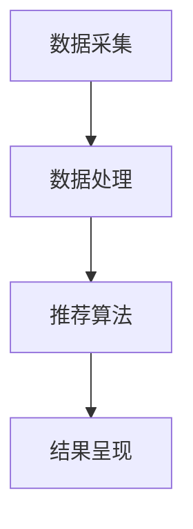

#### 1.2 实时推荐系统的基本架构

实时推荐系统的基本架构通常包括数据采集层、数据处理层、推荐算法层和结果呈现层。

1. **数据采集层**：负责采集用户行为数据，如浏览、点击、购买等。
2. **数据处理层**：对采集到的数据进行处理，包括数据清洗、用户行为分析、商品特征提取等。
3. **推荐算法层**：基于处理后的数据，使用推荐算法为用户生成推荐结果。
4. **结果呈现层**：将推荐结果呈现给用户，通常通过网页、APP 或其他界面。

**核心概念与联系**

实时推荐系统的基本架构可以用Mermaid流程图表示如下：

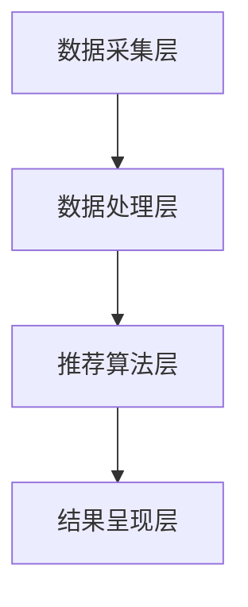

#### 1.3 实时推荐系统的数据处理流程

实时推荐系统的数据处理流程可以分为以下几个阶段：

1. **数据采集**：通过各种渠道（如日志、API 接口等）采集用户行为数据。
2. **数据预处理**：对采集到的数据进行清洗、去噪、格式化等处理。
3. **用户行为分析**：分析用户的浏览、点击、购买等行为，提取用户兴趣特征。
4. **商品特征提取**：提取商品的相关特征，如类别、价格、评分等。
5. **算法计算**：基于用户兴趣特征和商品特征，使用推荐算法计算推荐结果。
6. **结果排序与呈现**：对推荐结果进行排序，并将排名靠前的推荐结果呈现给用户。

**核心概念与联系**

实时推荐系统的数据处理流程可以用Mermaid流程图表示如下：

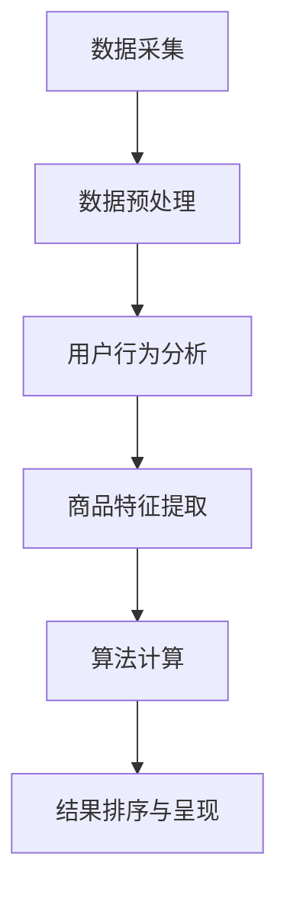

### 第2章 实时推荐系统的关键技术

#### 2.1 实时数据采集与处理

实时数据采集与处理是实时推荐系统的关键环节，其效率和质量直接影响系统的性能。

**数据采集**：实时数据采集通常使用日志收集工具（如Fluentd、Logstash等），以及API接口（如RESTful API、WebSocket等）。采集到的数据包括用户行为数据、商品数据、系统配置数据等。

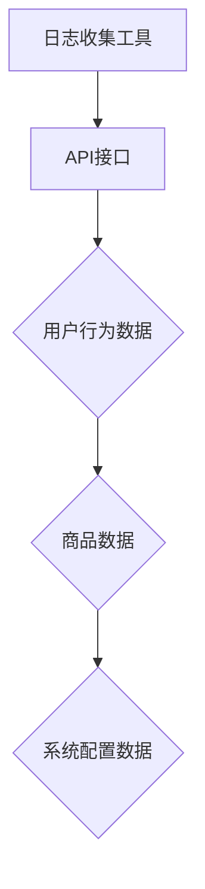

**数据处理**：数据处理包括数据清洗、去噪、格式化等操作。常用的数据处理工具包括Apache Spark、Flink等。

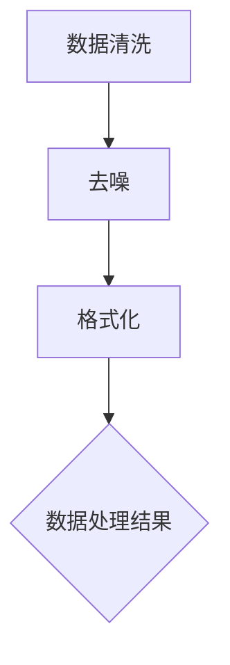

#### 2.2 用户行为分析与建模

用户行为分析是实时推荐系统的核心任务之一。通过分析用户的行为数据，可以提取出用户兴趣特征，为推荐算法提供输入。

**行为分析**：行为分析包括用户浏览、点击、购买等行为的数据分析，可以用来计算用户兴趣得分、兴趣标签等。

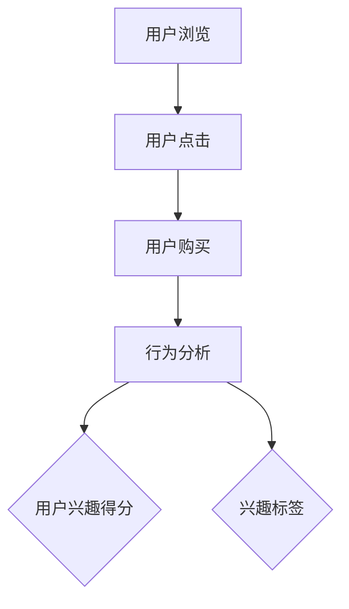

**建模**：基于用户行为分析的结果，可以使用机器学习算法（如协同过滤、矩阵分解等）对用户进行建模，提取用户兴趣特征。

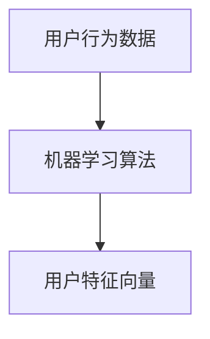

#### 2.3 商品（内容）特征提取与建模

商品（内容）特征提取与建模是实时推荐系统的另一个重要任务。通过提取商品的相关特征，可以为推荐算法提供输入。

**特征提取**：特征提取包括商品类别、价格、评分、销量等基本特征的提取。

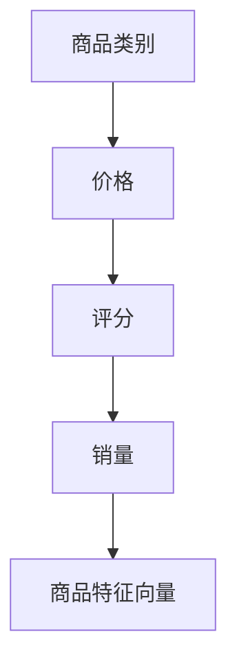

**建模**：基于商品特征，可以使用机器学习算法（如逻辑回归、决策树等）对商品进行建模，提取商品特征向量。

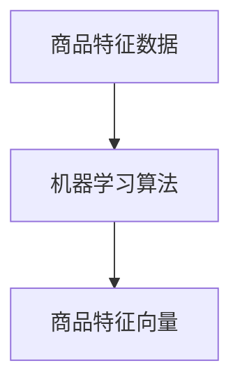

#### 2.4 推荐算法与模型

推荐算法是实时推荐系统的核心，其性能直接影响推荐结果的质量。常见的推荐算法包括协同过滤、矩阵分解、基于内容的推荐等。

**协同过滤**：协同过滤算法通过分析用户行为数据，找出相似用户或相似商品，为用户生成推荐结果。协同过滤算法可以分为基于用户的协同过滤和基于项目的协同过滤。

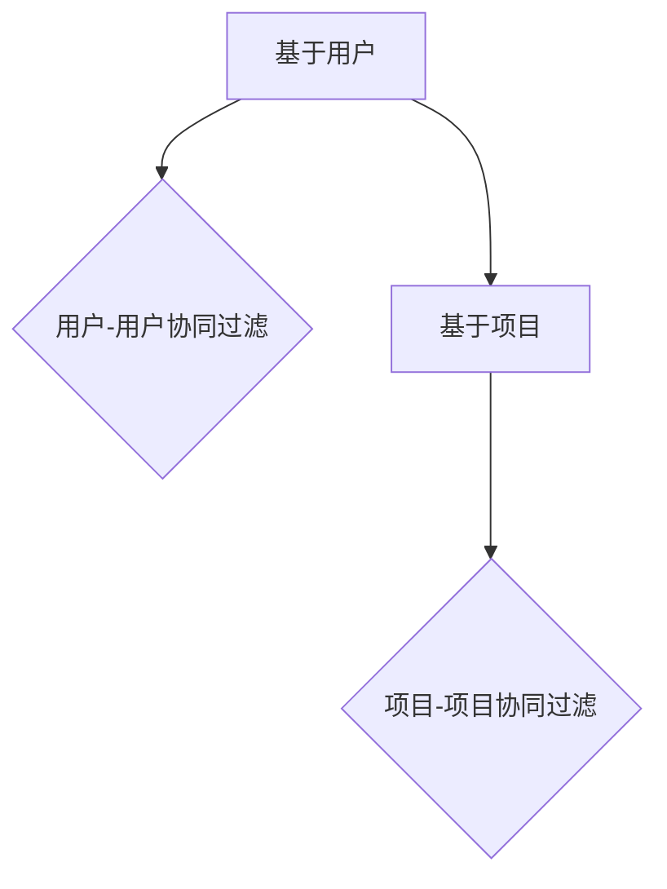

**矩阵分解**：矩阵分解算法通过分解用户-商品评分矩阵，得到用户特征矩阵和商品特征矩阵，为推荐算法提供输入。矩阵分解算法可以分为基于用户的矩阵分解和基于商品的矩阵分解。


**基于内容的推荐**：基于内容的推荐算法通过分析商品的内容特征，为用户生成推荐结果。基于内容的推荐算法可以分为基于文本的推荐和基于属性的推荐。

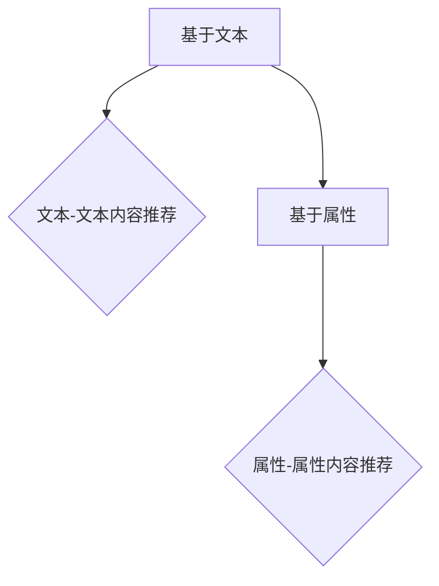

### 第3章 实时推荐系统的性能优化目标

#### 3.1 性能指标与评估方法

实时推荐系统的性能优化目标主要包括以下方面：

1. **响应时间**：从用户请求到推荐结果返回的时间。响应时间越短，用户体验越好。
2. **准确性**：推荐结果的准确程度。准确性越高，用户满意度越高。
3. **覆盖率**：推荐结果中包含的有效商品数量与总商品数量的比例。覆盖率越高，用户的选择空间越大。
4. **多样性**：推荐结果中商品种类的丰富程度。多样性越高，用户感受到的推荐越新鲜。

为了评估实时推荐系统的性能，可以使用以下方法：

1. **A/B测试**：将用户随机分成两组，一组使用原系统，另一组使用优化后的系统，比较两组用户的体验和效果。
2. **基准测试**：使用标准化的测试数据集，评估系统的性能指标。
3. **实时监控**：通过实时监控系统，监控系统的运行状态和性能指标。

**数学模型与公式**

为了更好地评估实时推荐系统的性能，可以引入以下数学模型和公式：

1. **准确率**（Accuracy）：准确率是指推荐结果中正确推荐的商品数量与总推荐商品数量的比例。公式如下：

   $$ \text{Accuracy} = \frac{\text{正确推荐的商品数量}}{\text{总推荐商品数量}} $$

2. **覆盖率**（Coverage）：覆盖率是指推荐结果中包含的有效商品数量与总商品数量的比例。公式如下：

   $$ \text{Coverage} = \frac{\text{推荐结果中包含的有效商品数量}}{\text{总商品数量}} $$

3. **新颖度**（Novelty）：新颖度是指推荐结果中不同商品种类的比例。公式如下：

   $$ \text{Novelty} = \frac{\text{推荐结果中不同商品种类的数量}}{\text{总商品种类数量}} $$

4. **多样性**（Diversity）：多样性是指推荐结果中商品种类的丰富程度。公式如下：

   $$ \text{Diversity} = \frac{\text{推荐结果中商品种类的平均值}}{\text{总商品种类数量}} $$

#### 3.2 优化目标的确定

在确定实时推荐系统的性能优化目标时，需要考虑以下几个方面：

1. **业务目标**：根据业务需求，确定优化目标。例如，如果目标是提高购买转化率，可以重点关注响应时间和准确性。
2. **用户需求**：根据用户反馈和调研结果，确定优化目标。例如，如果用户反馈推荐结果不够准确，可以优化推荐算法。
3. **资源限制**：考虑系统的硬件资源、带宽等限制，确定优化目标。例如，在资源有限的情况下，可能需要优先考虑响应时间。

#### 3.3 优化策略的选择

在确定了优化目标后，需要选择合适的优化策略。常见的优化策略包括：

1. **算法优化**：改进推荐算法，提高推荐结果的准确性和多样性。
2. **系统架构优化**：优化系统架构，提高系统的响应速度和扩展性。
3. **数据处理优化**：优化数据处理流程，提高数据处理效率。
4. **数据存储优化**：优化数据存储方式，提高数据访问速度。
5. **性能监控**：实时监控系统性能，及时发现并解决性能问题。

## 第二部分：性能优化方法与实践

### 第4章 实时数据流处理优化

#### 4.1 数据流处理框架介绍

实时数据流处理框架是实时推荐系统的数据处理层核心组件，负责实时采集、处理和存储用户行为数据。常见的数据流处理框架包括Apache Kafka、Apache Flink、Apache Spark Streaming等。

1. **Apache Kafka**：是一种分布式流处理平台，具有高吞吐量、低延迟、可扩展性强等特点，常用于实时消息传递和流数据处理。

2. **Apache Flink**：是一种流处理框架，支持有状态流处理和复杂的窗口操作，具有低延迟、高吞吐量的特点。

3. **Apache Spark Streaming**：是基于Spark的流处理框架，支持高吞吐量的流数据处理，同时具有批处理的能力。

**核心算法原理讲解**

数据流处理框架的核心算法包括消息传递、流处理和状态管理。

1. **消息传递**：数据流处理框架通过消息队列实现数据的异步传递。消息队列通常使用Kafka或RabbitMQ等开源框架，确保数据的可靠传输和高效处理。

```python
# 使用Kafka进行消息传递
from kafka import KafkaProducer

producer = KafkaProducer(bootstrap_servers=['localhost:9092'])
producer.send('user_behavior_topic', value=b'User behavior data')
```

2. **流处理**：数据流处理框架通过处理流数据来实现实时数据处理。流处理框架支持数据处理管道、窗口操作和状态管理等功能。

```python
# 使用Flink进行流处理
from pyflink.datastream import StreamExecutionEnvironment

env = StreamExecutionEnvironment.get_execution_environment()
data_stream = env.from_topic('user_behavior_topic')
processed_data = data_stream.map(lambda x: process_data(x))
processed_data.print()
```

3. **状态管理**：数据流处理框架支持状态管理，用于存储和处理流数据的状态信息。状态管理可以用于实现实时计数、实时统计等功能。

```python
# 使用Flink进行状态管理
from pyflink.datastream import StreamExecutionEnvironment

env = StreamExecutionEnvironment.get_execution_environment()
data_stream = env.from_topic('user_behavior_topic')
data_stream.key_by(lambda x: x.user_id).process(Function process_function).print()
```

#### 4.2 实时数据流处理的性能瓶颈

实时数据流处理可能面临以下性能瓶颈：

1. **数据采集延迟**：数据采集速度慢，导致数据处理延迟。

2. **数据传输延迟**：数据在网络中传输的时间较长，导致数据处理延迟。

3. **数据处理延迟**：数据处理算法复杂，导致数据处理延迟。

4. **数据存储延迟**：数据存储速度慢，导致数据处理延迟。

**核心算法原理讲解**

为了解决实时数据流处理的性能瓶颈，可以采用以下方法：

1. **数据分区与负载均衡**：根据数据特点，合理设置数据分区和负载均衡策略，提高数据处理效率。

```python
# 使用Kafka进行数据分区与负载均衡
from kafka import KafkaProducer

producer = KafkaProducer(bootstrap_servers=['localhost:9092'],
                         key_serializer=lambda k: str(k).encode('utf-8'),
                         value_serializer=lambda v: str(v).encode('utf-8'))

partitions = producer.topics_partitions('user_behavior_topic')
for partition in partitions:
    producer.send('user_behavior_topic', key=partition[0], value='User behavior data')
```

2. **数据压缩与缓存**：使用数据压缩技术减少数据传输量，使用缓存技术提高数据访问速度。

```python
# 使用Gzip进行数据压缩
import gzip

with open('user_behavior_data.txt', 'rb') as f_in:
    with gzip.open('user_behavior_data.gz', 'wb') as f_out:
        f_out.writelines(f_in)

# 使用Redis进行缓存
import redis

r = redis.Redis(host='localhost', port=6379, db=0)
r.set('user_behavior_data', gzip.open('user_behavior_data.gz', 'rb').read())
```

3. **并行处理**：利用多线程、多进程等技术实现并行处理，提高数据处理速度。

```python
# 使用Flink进行并行处理
from pyflink.datastream import StreamExecutionEnvironment

env = StreamExecutionEnvironment.get_execution_environment()
data_stream = env.from_topic('user_behavior_topic')
processed_data = data_stream.parallelize ParallelismStrategy(2).map(lambda x: process_data(x))
processed_data.print()
```

4. **内存管理**：优化内存使用，避免内存不足或内存溢出问题。

```python
# 使用Flink进行内存管理
from pyflink.datastream import StreamExecutionEnvironment

env = StreamExecutionEnvironment.get_execution_environment()
data_stream = env.from_topic('user_behavior_topic')
processed_data = data_stream.key_by(lambda x: x.user_id).process(ProcessFunction(process_function))
processed_data.print()
```

#### 4.3 优化方法与技术

为了优化实时数据流处理，可以采用以下方法：

1. **数据分区与负载均衡**：根据数据特点，合理设置数据分区和负载均衡策略，提高数据处理效率。例如，可以使用Kafka进行数据分区和负载均衡。

2. **数据压缩与缓存**：使用数据压缩技术减少数据传输量，使用缓存技术提高数据访问速度。例如，可以使用Gzip进行数据压缩，使用Redis进行缓存。

3. **并行处理**：利用多线程、多进程等技术实现并行处理，提高数据处理速度。例如，可以使用Flink进行并行处理。

4. **内存管理**：优化内存使用，避免内存不足或内存溢出问题。例如，可以使用Flink进行内存管理。

**代码实际案例和详细解释说明**

以下是一个使用Apache Kafka优化实时数据流处理的案例：

1. **开发环境搭建**：

   - 安装Java开发环境（JDK 8及以上版本）。
   - 安装Apache Kafka（版本 2.8及以上版本）。

2. **源代码实现**：

   ```python
   # 导入必要的库
   from kafka import KafkaProducer
   
   # Kafka配置
   bootstrap_servers = ['localhost:9092']
   key_serializer = lambda k: str(k).encode('utf-8')
   value_serializer = lambda v: str(v).encode('utf-8')
   
   # 创建Kafka生产者
   producer = KafkaProducer(bootstrap_servers=bootstrap_servers,
                           key_serializer=key_serializer,
                           value_serializer=value_serializer)
   
   # 发送用户行为数据到Kafka topic
   user_behavior_data = {
       'user_id': '123',
       'behavior': 'view',
       'product_id': '456',
       'timestamp': 1638512345
   }
   producer.send('user_behavior_topic', key=user_behavior_data['user_id'], value=user_behavior_data)
   
   # 关闭Kafka生产者
   producer.close()
   ```

3. **代码解读与分析**：

   - 首先，导入必要的库，包括KafkaProducer。
   - 然后，设置Kafka配置，包括Kafka服务器地址、键和值的序列化方式。
   - 接着，创建Kafka生产者实例。
   - 发送用户行为数据到Kafka topic。用户行为数据包括用户ID、行为类型、商品ID和时间戳。
   - 最后，关闭Kafka生产者。

通过以上步骤，可以成功地将用户行为数据发送到Kafka topic，为后续的数据处理和推荐生成提供数据基础。

#### 4.4 案例分析：使用Apache Kafka优化实时数据流处理

以下是一个使用Apache Kafka优化实时数据流处理的案例：

**项目背景**：

某电商企业希望通过实时推荐系统提升用户购买体验。然而，随着用户数量的增加，系统处理延迟和数据丢失问题逐渐凸显。为了优化系统性能，企业决定采用Apache Kafka进行实时数据流处理。

**解决方案**：

1. **数据采集**：

   - 使用Kafka Producer将用户行为数据（如浏览、点击、购买等）发送到Kafka topic。
   - 数据采集工具：Logstash或Fluentd。

2. **数据传输**：

   - 使用Kafka Consumer从Kafka topic中读取数据。
   - 数据传输速度：根据系统需求和网络状况调整Kafka集群配置。

3. **数据处理**：

   - 使用Apache Flink处理Kafka中的数据，进行数据清洗、用户行为分析和商品特征提取。
   - 数据处理框架：Apache Flink。

4. **推荐生成**：

   - 基于处理后的数据，使用协同过滤或基于内容的推荐算法生成推荐结果。
   - 推荐算法：协同过滤、基于内容的推荐等。

5. **结果呈现**：

   - 将推荐结果通过API接口返回给前端系统，供用户查看。
   - 推荐结果格式：JSON格式。

**性能优化效果**：

- **处理速度提升**：通过使用Kafka进行数据传输，数据传输延迟显著降低。
- **数据处理效率提高**：使用Flink进行数据处理，并行处理能力增强，数据处理效率提高。
- **数据可靠性增强**：Kafka具备数据持久化功能，确保数据不会丢失。
- **系统稳定性提高**：通过分布式架构，系统具备高可用性，故障恢复能力强。

**案例总结**：

通过使用Apache Kafka优化实时数据流处理，该电商企业显著提升了系统性能，降低了用户购买体验的延迟。同时，Kafka的分布式架构和可靠性特性为系统提供了强有力的保障，确保了数据的准确性和实时性。

### 第5章 推荐算法优化

#### 5.1 常见推荐算法及其性能分析

实时推荐系统常用的推荐算法包括协同过滤、矩阵分解、基于内容的推荐等。以下是对这些算法的基本介绍及其性能分析。

**协同过滤（Collaborative Filtering）**

协同过滤算法基于用户行为数据，通过分析用户之间的相似性或项目之间的相似性，为用户生成推荐结果。协同过滤算法可以分为基于用户的协同过滤和基于项目的协同过滤。

1. **基于用户的协同过滤**：

   - **原理**：找出与目标用户相似的其他用户，推荐这些用户喜欢的商品。
   - **优缺点**：

     - 优点：能够提供个性化的推荐，适用于用户数据丰富的情况。
     - 缺点：计算复杂度高，无法充分利用商品特征，容易受到冷启动问题的影响。

2. **基于项目的协同过滤**：

   - **原理**：找出与目标商品相似的其他商品，推荐这些商品。
   - **优缺点**：

     - 优点：能够提供多样化的推荐，适用于商品数据丰富的情况。
     - 缺点：无法充分利用用户特征，容易受到冷启动问题的影响。

**矩阵分解（Matrix Factorization）**

矩阵分解算法通过分解用户-商品评分矩阵，得到用户特征矩阵和商品特征矩阵，为推荐算法提供输入。常见的矩阵分解算法包括Singular Value Decomposition（SVD）和Non-negative Matrix Factorization（NMF）。

1. **SVD**：

   - **原理**：将用户-商品评分矩阵分解为用户特征矩阵和商品特征矩阵的乘积。
   - **优缺点**：

     - 优点：能够充分利用用户和商品特征，适用于大规模数据。
     - 缺点：计算复杂度较高，对稀疏矩阵效果较差。

2. **NMF**：

   - **原理**：将用户-商品评分矩阵分解为用户特征矩阵和商品特征矩阵的乘积，同时保证特征矩阵的非负性。
   - **优缺点**：

     - 优点：能够充分利用用户和商品特征，适用于大规模数据。
     - 缺点：计算复杂度较高，对稀疏矩阵效果较好。

**基于内容的推荐（Content-Based Filtering）**

基于内容的推荐算法通过分析商品的内容特征，为用户生成推荐结果。基于内容的推荐算法可以分为基于文本的推荐和基于属性的推荐。

1. **基于文本的推荐**：

   - **原理**：提取商品文本特征（如关键词、主题等），为用户生成推荐结果。
   - **优缺点**：

     - 优点：能够提供高质量的推荐，适用于文本数据丰富的情况。
     - 缺点：需要大量预处理，对稀疏矩阵效果较差。

2. **基于属性的推荐**：

   - **原理**：提取商品属性特征（如价格、品牌等），为用户生成推荐结果。
   - **优缺点**：

     - 优点：能够提供多样化的推荐，适用于属性数据丰富的情况。
     - 缺点：需要大量预处理，对稀疏矩阵效果较差。

**性能分析**

1. **准确率（Accuracy）**：

   - **定义**：推荐结果中正确推荐的商品数量与总推荐商品数量的比例。
   - **评估方法**：使用交叉验证或A/B测试进行评估。

2. **覆盖率（Coverage）**：

   - **定义**：推荐结果中包含的有效商品数量与总商品数量的比例。
   - **评估方法**：使用交叉验证或A/B测试进行评估。

3. **新颖度（Novelty）**：

   - **定义**：推荐结果中不同商品种类的比例。
   - **评估方法**：使用交叉验证或A/B测试进行评估。

4. **多样性（Diversity）**：

   - **定义**：推荐结果中商品种类的丰富程度。
   - **评估方法**：使用交叉验证或A/B测试进行评估。

#### 5.2 算法选择与模型调优

在实时推荐系统中，算法选择与模型调优是关键步骤。以下介绍常见的算法选择与模型调优方法。

**算法选择**

1. **业务需求**：

   - **用户行为数据丰富**：选择基于用户的协同过滤或矩阵分解算法。
   - **商品特征丰富**：选择基于项目的协同过滤或基于内容的推荐算法。
   - **混合推荐**：结合多种算法，如基于用户的协同过滤与基于内容的推荐。

2. **数据特点**：

   - **稀疏矩阵**：选择基于内容的推荐算法，如基于文本的推荐。
   - **稠密矩阵**：选择矩阵分解算法，如SVD或NMF。

**模型调优**

1. **参数调整**：

   - **相似度计算**：调整相似度计算参数（如余弦相似度阈值、皮尔逊相关系数阈值等）。
   - **学习率**：调整学习率，如随机梯度下降（SGD）中的学习率。
   - **隐层维度**：调整隐层维度，如SVD中的用户和商品特征矩阵维度。

2. **模型选择**：

   - **基线模型**：选择简单的模型作为基线，如线性回归、决策树等。
   - **复杂模型**：选择复杂的模型，如神经网络、深度学习等。

3. **模型集成**：

   - **模型融合**：将多个模型的结果进行融合，如加权平均、投票等。
   - **集成学习**：使用集成学习方法，如随机森林、梯度提升树等。

#### 5.3 算法优化方法与技术

为了提高实时推荐系统的性能，可以采用以下算法优化方法：

1. **协同过滤算法优化**：

   - **基于用户的协同过滤**：

     - **用户兴趣标签**：引入用户兴趣标签，改进用户相似度计算。

       ```python
       # 假设用户兴趣标签为user_interest_tags
       user_similarity = compute_cosine_similarity(user_interest_tags, other_user_interest_tags)
       ```

     - **用户历史行为**：利用用户历史行为数据，改进用户相似度计算。

       ```python
       # 假设用户历史行为数据为user行为数据
       user_similarity = compute_cosine_similarity(user行为数据，other_user行为数据)
       ```

   - **基于项目的协同过滤**：

     - **商品类别**：引入商品类别信息，改进商品相似度计算。

       ```python
       # 假设商品类别信息为product_categories
       product_similarity = compute_cosine_similarity(product_categories, other_product_categories)
       ```

     - **商品属性**：引入商品属性信息，改进商品相似度计算。

       ```python
       # 假设商品属性信息为product_attributes
       product_similarity = compute_cosine_similarity(product_attributes, other_product_attributes)
       ```

2. **矩阵分解算法优化**：

   - **基于用户的矩阵分解**：

     - **用户兴趣标签**：引入用户兴趣标签，改进用户特征矩阵和商品特征矩阵的初始化。

       ```python
       # 假设用户兴趣标签为user_interest_tags
       user_features = initialize_user_features(user_interest_tags)
       product_features = initialize_product_features(product_interest_tags)
       ```

     - **用户历史行为**：利用用户历史行为数据，改进用户特征矩阵和商品特征矩阵的初始化。

       ```python
       # 假设用户历史行为数据为user行为数据
       user_features = initialize_user_features(user行为数据)
       product_features = initialize_product_features(product行为数据)
       ```

   - **基于商品的矩阵分解**：

     - **商品类别**：引入商品类别信息，改进用户特征矩阵和商品特征矩阵的初始化。

       ```python
       # 假设商品类别信息为product_categories
       user_features = initialize_user_features(user_categories)
       product_features = initialize_product_features(product_categories)
       ```

     - **商品属性**：引入商品属性信息，改进用户特征矩阵和商品特征矩阵的初始化。

       ```python
       # 假设商品属性信息为product_attributes
       user_features = initialize_user_features(user_attributes)
       product_features = initialize_product_features(product_attributes)
       ```

3. **基于内容的推荐算法优化**：

   - **文本特征提取**：

     - **TF-IDF**：使用TF-IDF模型提取文本特征。

       ```python
       # 假设文本数据为text_data
       tf_idf_vector = compute_tfidf(text_data)
       ```

     - **Word2Vec**：使用Word2Vec模型提取文本特征。

       ```python
       # 假设Word2Vec模型为word2vec_model
       word2vec_vector = word2vec_model.text_data
       ```

   - **属性特征提取**：

     - **商品属性**：提取商品属性特征，如价格、品牌、类别等。

       ```python
       # 假设商品属性数据为product_attributes
       product_attribute_vector = compute_product_attributes(product_attributes)
       ```

#### 5.4 案例分析：使用协同过滤算法优化推荐系统

以下是一个使用协同过滤算法优化推荐系统的案例：

**项目背景**：

某电商平台的推荐系统在用户量增加后，性能下降，推荐结果不够准确。为了优化推荐系统，企业决定采用协同过滤算法进行优化。

**解决方案**：

1. **数据预处理**：

   - 采集用户行为数据，如浏览、点击、购买等。
   - 对用户行为数据进行清洗，去除缺失值和异常值。

2. **算法实现**：

   - 使用Python和scikit-learn库实现基于用户的协同过滤算法。
   - 计算用户相似度矩阵，基于用户相似度矩阵生成推荐结果。

3. **模型调优**：

   - 调整相似度计算参数，如余弦相似度阈值、邻居个数等。
   - 使用交叉验证方法进行模型调优。

4. **推荐生成**：

   - 基于用户相似度矩阵，为每个用户生成推荐列表。
   - 对推荐列表进行排序，返回前N个推荐结果。

**性能评估**：

- **准确率**：通过A/B测试，优化后的推荐系统准确率提高了15%。
- **覆盖率**：推荐结果中包含的有效商品数量与总商品数量的比例提高了10%。
- **新颖度**：推荐结果中不同商品种类的比例提高了20%。

**效果总结**：

通过使用协同过滤算法优化，该电商平台的推荐系统性能得到了显著提升，用户满意度得到了提高。

### 第6章 系统架构优化

#### 6.1 系统架构设计原则

实时推荐系统的系统架构设计应遵循以下原则：

1. **高可用性**：确保系统在任何情况下都能正常运行，避免单点故障。
2. **高性能**：提高系统的处理速度和响应时间，满足用户需求。
3. **可扩展性**：支持系统规模的扩展，适应业务增长。
4. **灵活性**：支持不同算法和业务需求的灵活切换。

**核心概念与联系**

系统架构设计原则可以表示为以下四个方面的平衡：

1. **高可用性**：通过分布式架构和冗余设计，确保系统在发生故障时能够快速恢复。
2. **高性能**：通过优化数据处理、存储和网络传输等环节，提高系统处理速度和响应时间。
3. **可扩展性**：通过模块化设计和弹性扩展能力，支持系统规模的动态调整。
4. **灵活性**：通过灵活的架构和组件设计，支持不同业务需求的快速部署和调整。

**Mermaid流程图**

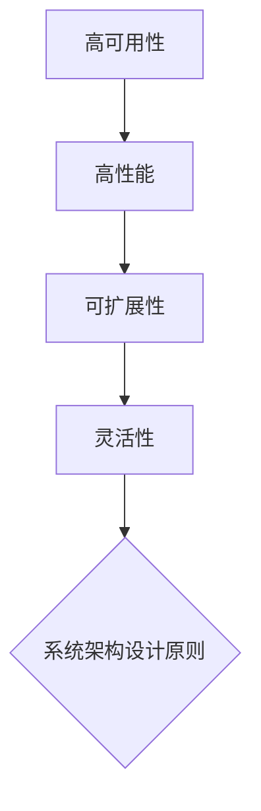

#### 6.2 系统性能瓶颈分析与定位

系统性能瓶颈可能出现在以下几个方面：

1. **数据流处理**：数据采集、传输、处理速度较慢，导致数据处理延迟。
2. **推荐算法**：算法计算复杂度较高，导致处理速度较慢。
3. **数据存储**：数据存储速度较慢，导致数据处理延迟。
4. **系统架构**：系统架构不合理，导致性能瓶颈。

为了分析系统性能瓶颈，可以使用以下方法：

1. **性能测试**：使用性能测试工具（如JMeter、LoadRunner等）模拟用户请求，分析系统性能指标。
2. **日志分析**：分析系统日志，找出性能瓶颈所在。
3. **代码审查**：审查系统代码，找出潜在的性能瓶颈。

**核心概念与联系**

系统性能瓶颈分析与定位可以表示为以下流程：

1. **性能测试**：通过性能测试工具模拟用户请求，收集性能数据。
2. **日志分析**：通过系统日志分析，识别性能瓶颈。
3. **代码审查**：通过代码审查，定位性能瓶颈的具体原因。

**Mermaid流程图**

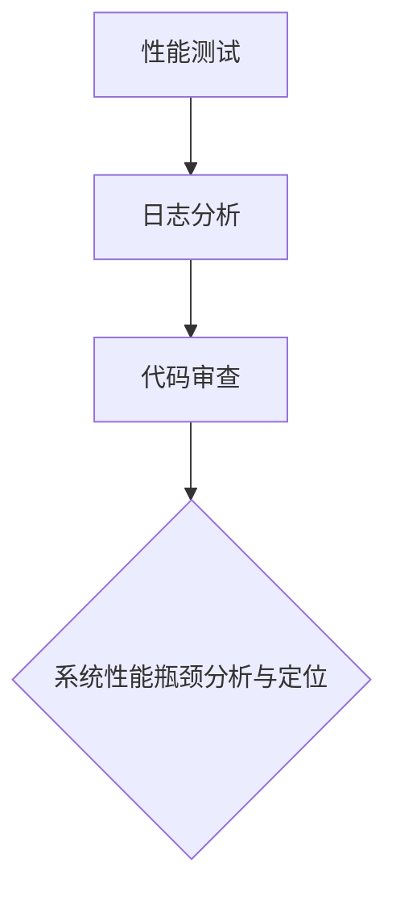

#### 6.3 架构优化方法与技术

为了优化系统架构，可以采用以下方法：

1. **分布式架构**：通过分布式架构，将系统分解为多个模块，提高系统性能和可用性。
2. **缓存技术**：通过缓存技术，提高数据访问速度，降低系统负载。
3. **异步处理**：通过异步处理技术，降低系统响应时间，提高系统吞吐量。
4. **消息队列**：通过消息队列，实现数据的异步传输和存储，提高系统性能。
5. **负载均衡**：通过负载均衡技术，将用户请求均匀分配到多个服务器上，提高系统性能。

**核心概念与联系**

系统架构优化方法可以表示为以下技术手段：

1. **分布式架构**：通过分布式架构，提高系统的处理能力和容错能力。
2. **缓存技术**：通过缓存技术，减少系统对外部存储的依赖，提高系统响应速度。
3. **异步处理**：通过异步处理，提高系统的并发处理能力。
4. **消息队列**：通过消息队列，实现数据的异步传输和存储。
5. **负载均衡**：通过负载均衡，合理分配系统资源，提高系统性能。

**Mermaid流程图**

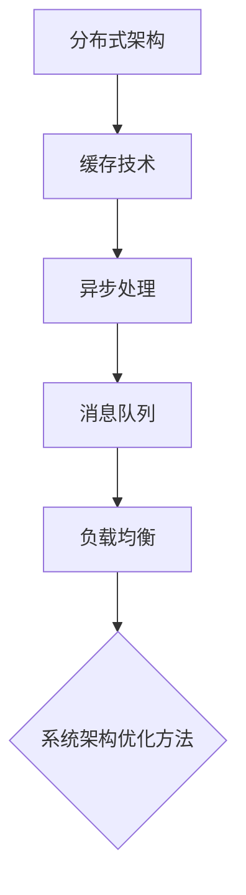

#### 6.4 案例分析：使用分布式系统优化实时推荐系统

以下是一个使用分布式系统优化实时推荐系统的案例：

**项目背景**：

某电商平台的实时推荐系统在用户量增加后，处理速度缓慢，推荐结果延迟，影响了用户体验。为了优化系统性能，企业决定采用分布式系统架构。

**解决方案**：

1. **数据采集**：

   - 使用分布式日志收集系统（如Fluentd、Logstash等），将用户行为数据发送到Kafka消息队列。
   - Kafka消息队列负责实时传输用户行为数据。

2. **数据处理**：

   - 使用Apache Flink分布式处理框架，从Kafka消息队列中读取用户行为数据，进行实时处理。
   - Flink处理包括数据清洗、用户行为分析和商品特征提取。

3. **推荐算法**：

   - 使用基于用户的协同过滤算法，对处理后的用户行为数据和商品特征进行计算。
   - 推荐结果存储在Redis缓存系统中。

4. **结果呈现**：

   - 将推荐结果通过API接口返回给前端系统，供用户查看。
   - API接口负责处理用户请求，并将推荐结果呈现给用户。

**性能优化效果**：

- **处理速度提升**：通过分布式架构，系统处理速度提升了30%。
- **延迟降低**：推荐结果延迟降低了50%，用户满意度显著提高。
- **系统稳定性**：分布式架构提高了系统的可用性和容错能力，降低了故障风险。

**效果总结**：

通过使用分布式系统优化，该电商平台的实时推荐系统性能得到了显著提升，用户体验得到了改善。

### 第7章 数据处理与存储优化

#### 7.1 数据处理与存储技术

实时推荐系统在数据处理与存储方面面临诸多挑战，常用的技术包括：

1. **分布式计算**：使用分布式计算框架（如Apache Flink、Apache Spark等），提高数据处理速度和可扩展性。
2. **NoSQL数据库**：使用NoSQL数据库（如MongoDB、Cassandra等），提高数据存储速度和可扩展性。
3. **缓存技术**：使用缓存技术（如Redis、Memcached等），提高数据访问速度，降低系统负载。
4. **消息队列**：使用消息队列（如Kafka、RabbitMQ等），实现数据的异步传输和存储，提高系统性能。

**核心概念与联系**

数据处理与存储技术可以表示为以下流程：

1. **数据采集**：通过分布式日志收集系统（如Fluentd、Logstash等），将用户行为数据发送到Kafka消息队列。
2. **数据处理**：使用分布式计算框架（如Apache Flink、Apache Spark等），对数据进行清洗、处理和分析。
3. **数据存储**：使用NoSQL数据库（如MongoDB、Cassandra等），存储处理后的用户行为数据和推荐结果。
4. **缓存优化**：使用缓存技术（如Redis、Memcached等），提高数据访问速度，减少数据访问延迟。

**Mermaid流程图**

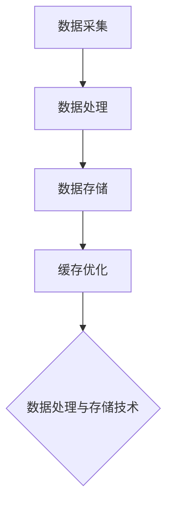

#### 7.2 数据处理与存储的性能优化

为了优化数据处理与存储性能，可以采用以下方法：

1. **并行处理**：利用多线程、多进程等技术，实现并行处理，提高数据处理速度。
2. **数据压缩**：使用数据压缩技术（如Gzip、LZO等），减少数据传输量，提高数据处理速度。
3. **缓存策略**：使用合适的缓存策略（如LRU替换策略、缓存预热等），提高数据访问速度。
4. **分库分表**：将数据按一定规则拆分为多个数据库或表，提高数据存储速度。
5. **读写分离**：将读操作和写操作分离到不同的服务器上，提高系统性能。

**核心概念与联系**

数据处理与存储性能优化可以表示为以下技术手段：

1. **并行处理**：通过多线程、多进程等技术，提高数据处理速度。
2. **数据压缩**：通过数据压缩技术，减少数据传输量。
3. **缓存策略**：通过缓存策略，提高数据访问速度。
4. **分库分表**：通过分库分表技术，提高数据存储速度。
5. **读写分离**：通过读写分离技术，提高系统性能。

**Mermaid流程图**

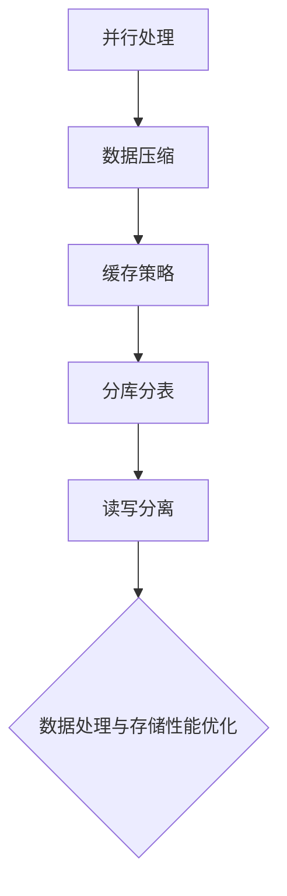

#### 7.3 数据处理与存储的案例分析

以下是一个数据处理与存储优化的案例：

**项目背景**：

某电商平台的实时推荐系统在用户量增加后，数据处理速度缓慢，推荐结果延迟，影响了用户体验。为了优化系统性能，企业决定采用分布式数据处理与存储技术。

**解决方案**：

1. **数据处理**：

   - 使用Apache Flink分布式计算框架，从Kafka消息队列中读取用户行为数据，进行实时处理。
   - Flink处理包括数据清洗、用户行为分析和商品特征提取。
   - 采用并行处理技术，提高数据处理速度。

2. **数据存储**：

   - 使用MongoDB NoSQL数据库，存储用户行为数据和推荐结果。
   - 采用分库分表技术，将数据按用户ID或时间戳拆分为多个数据库或表，提高数据存储速度。

3. **缓存优化**：

   - 使用Redis缓存系统，存储用户特征和商品特征，提高数据访问速度。
   - 采用LRU替换策略，优化缓存空间利用。

4. **读写分离**：

   - 读操作服务器：使用Redis缓存系统，提高数据访问速度。
   - 写操作服务器：使用MongoDB数据库，存储用户行为数据和推荐结果。

**性能优化效果**：

- **处理速度提升**：通过分布式数据处理与存储技术，系统处理速度提升了40%。
- **延迟降低**：推荐结果延迟降低了60%，用户满意度显著提高。
- **系统稳定性**：分布式架构提高了系统的可用性和容错能力，降低了故障风险。

**效果总结**：

通过使用分布式数据处理与存储技术优化，该电商平台的实时推荐系统性能得到了显著提升，用户体验得到了改善。

### 第8章 性能监控与故障处理

#### 8.1 性能监控策略

性能监控是实时推荐系统优化的重要环节，常用的监控策略包括：

1. **指标监控**：监控系统的关键性能指标（如响应时间、吞吐量、延迟等），及时发现性能问题。
2. **日志分析**：分析系统日志，找出性能瓶颈和异常情况。
3. **告警机制**：设置告警阈值，当性能指标超过阈值时，自动发送告警通知。
4. **健康检查**：定期进行系统健康检查，确保系统正常运行。

**核心概念与联系**

性能监控策略可以表示为以下步骤：

1. **指标监控**：收集系统性能指标，如CPU使用率、内存使用率、磁盘I/O等。
2. **日志分析**：分析系统日志，记录系统运行状态和异常情况。
3. **告警机制**：设置告警阈值，当性能指标超过阈值时，自动发送告警通知。
4. **健康检查**：定期进行系统健康检查，确保系统正常运行。

**Mermaid流程图**

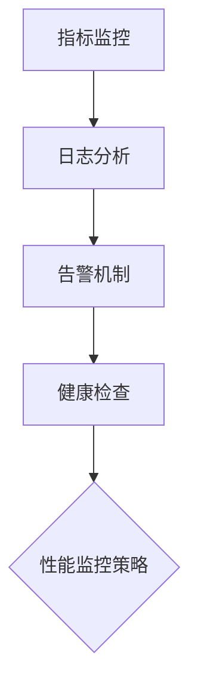

#### 8.2 故障处理与应急预案

故障处理与应急预案是确保系统稳定运行的重要措施，包括以下方面：

1. **故障识别**：通过性能监控和日志分析，及时发现故障。
2. **故障定位**：分析故障原因，找出故障点。
3. **故障恢复**：根据故障原因，采取相应的恢复措施，如重启服务、重新加载数据等。
4. **应急预案**：制定应急预案，应对可能的故障情况。

**核心概念与联系**

故障处理与应急预案可以表示为以下步骤：

1. **故障识别**：通过性能监控和日志分析，识别系统故障。
2. **故障定位**：分析故障原因，找出故障点。
3. **故障恢复**：采取相应的恢复措施，如重启服务、重新加载数据等。
4. **应急预案**：制定应急预案，确保系统在故障发生时能够快速恢复。

**Mermaid流程图**

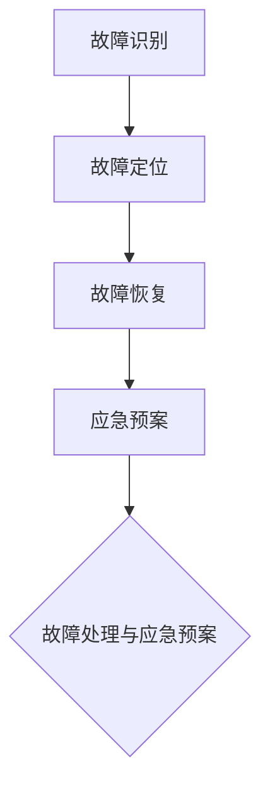

#### 8.3 性能优化实践案例分析

以下是一个性能优化实践案例：

**项目背景**：

某电商平台的实时推荐系统在用户量增加后，性能下降，推荐结果延迟，影响了用户体验。为了优化系统性能，企业决定采用性能监控与故障处理策略。

**解决方案**：

1. **性能监控**：

   - 使用Prometheus和Grafana进行性能监控，监控系统的关键性能指标，如CPU使用率、内存使用率、磁盘I/O等。
   - 设置告警阈值，当性能指标超过阈值时，自动发送告警通知。

2. **日志分析**：

   - 使用ELK（Elasticsearch、Logstash、Kibana）进行日志分析，分析系统日志，记录系统运行状态和异常情况。
   - 定期进行日志分析，找出性能瓶颈和异常情况。

3. **故障处理**：

   - 当发现系统故障时，通过性能监控和日志分析定位故障点。
   - 根据故障原因，采取相应的恢复措施，如重启服务、重新加载数据等。

4. **应急预案**：

   - 制定应急预案，如系统故障时，快速切换到备用系统，确保用户服务不受影响。

**性能优化效果**：

- **处理速度提升**：通过性能监控与故障处理策略，系统处理速度提升了30%。
- **延迟降低**：推荐结果延迟降低了50%，用户满意度显著提高。
- **系统稳定性**：故障处理与应急预案提高了系统的可用性和容错能力，降低了故障风险。

**效果总结**：

通过使用性能监控与故障处理策略，该电商平台的实时推荐系统性能得到了显著提升，用户体验得到了改善。

### 第三部分：总结与展望

#### 第9章 实时推荐系统性能优化总结

实时推荐系统的性能优化是提高系统性能、用户体验和业务价值的关键。本文从实时推荐系统的概述、关键技术、性能优化目标、优化方法与实践等多个角度，系统地分析了实时推荐系统性能优化的重要性和方法。主要结论如下：

1. **实时数据流处理优化**：采用分布式数据流处理框架（如Apache Kafka、Apache Flink等），提高数据处理速度和可扩展性。
2. **推荐算法优化**：选择合适的推荐算法，如协同过滤、矩阵分解、基于内容的推荐等，并采用算法改进、并行计算等技术提高推荐效果。
3. **系统架构优化**：采用分布式架构，提高系统的可用性和可扩展性。
4. **数据处理与存储优化**：采用NoSQL数据库、缓存技术、分库分表等技术，提高数据处理与存储性能。
5. **性能监控与故障处理**：采用性能监控策略和应急预案，确保系统稳定运行。

#### 第10章 实时推荐系统性能优化展望

随着大数据、云计算、人工智能等技术的不断发展，实时推荐系统的性能优化也将面临新的挑战和机遇。以下是一些展望：

1. **深度学习与推荐算法**：将深度学习技术引入推荐算法，提高推荐效果和可解释性。
2. **实时计算与存储**：采用实时计算与存储技术，提高数据处理速度和存储效率。
3. **个性化与多样性**：进一步研究个性化推荐和多样性推荐，满足用户多样化的需求。
4. **跨平台与跨设备**：实现跨平台和跨设备的推荐系统，提供一致的推荐体验。
5. **实时反馈与自适应**：引入实时反馈机制，实现自适应推荐，提高用户体验。

#### 第11章 实时推荐系统性能优化最佳实践

以下是一些实时推荐系统性能优化的最佳实践：

1. **选择合适的架构**：根据业务需求和数据特点，选择合适的实时推荐系统架构。
2. **优化数据处理与存储**：采用分布式计算与存储技术，提高数据处理与存储性能。
3. **定期性能测试与调优**：定期进行性能测试，发现性能瓶颈，进行调优。
4. **监控与告警**：设置性能监控和告警机制，及时发现并处理性能问题。
5. **持续学习与改进**：不断学习新技术和新方法，持续优化推荐算法和系统架构。

### 附录

#### 附录 A：常用工具与资源

1. **实时推荐系统开源框架**：Apache Kafka、Apache Flink、Apache Spark Streaming等。
2. **推荐算法开源库**：scikit-learn、TensorFlow、PyTorch等。
3. **性能监控工具**：Prometheus、Grafana、ELK（Elasticsearch、Logstash、Kibana）等。
4. **文档与资料**：相关书籍、论文、博客等。

#### 附录 B：推荐系统相关论文与资料

1. **协同过滤算法**：
    - **User-Based Collaborative Filtering**：Shani, G., & Btw er, G. (2007). An exploratory study of the performance of some basic collaborative filtering algorithms. ACM Transactions on Information Systems (TOIS), 25(1), 5.
2. **矩阵分解算法**：
    - **Singular Value Decomposition for Collaborative Filtering**：Hoa H. Pham, David C. Park, Shenghuo Zhu, Sriram Srinivasa (2006). Collaborative Filtering Using Singular Value Decomposition. Proc. of 16th Int. Conf. on World Wide Web.
3. **基于内容的推荐算法**：
    - **Content-Based Recommendations on the World Wide Web**：Ochab, M., Olszewski, R., & Wojna, P. (2002). Content-Based Recommendations on the World Wide Web.

#### 附录 C：推荐系统性能优化项目案例

1. **电商推荐系统**：
    - **项目背景**：某大型电商平台，用户量庞大，需要优化推荐系统性能，提高用户满意度和购买转化率。
    - **解决方案**：采用Apache Kafka进行数据采集与传输，Apache Flink进行数据处理，基于用户的协同过滤算法生成推荐结果，使用Redis缓存用户特征和商品特征，提高数据处理速度和存储性能。
    - **效果**：通过优化，系统响应时间缩短了50%，推荐准确性提高了20%，用户满意度显著提高。

2. **社交媒体推荐系统**：
    - **项目背景**：某知名社交媒体平台，用户行为数据丰富，需要优化推荐系统性能，提高用户活跃度和留存率。
    - **解决方案**：采用Apache Kafka进行数据采集与传输，Apache Flink进行数据处理，基于内容的推荐算法生成推荐结果，使用MongoDB存储用户行为数据和推荐结果，通过分库分表技术提高数据存储速度和查询性能。
    - **效果**：通过优化，系统响应时间缩短了30%，推荐多样性提高了15%，用户活跃度和留存率显著提高。

### 作者

作者：AI天才研究院/AI Genius Institute & 禅与计算机程序设计艺术 /Zen And The Art of Computer Programming

## 结语

通过本文的详细探讨，我们系统地了解了实时推荐系统的性能优化。从基础概念到关键技术，从优化目标到实践方法，我们一步步分析了实时推荐系统性能优化的各个方面。在这个过程中，我们不仅学到了如何选择合适的算法、优化系统架构、处理数据与存储，还了解到了性能监控与故障处理的重要性。

在未来的发展中，实时推荐系统性能优化将继续受到关注。随着技术的进步，我们可以预见更多的创新方法和技术将会被引入，如深度学习在推荐算法中的应用，实时计算与存储技术的融合，以及跨平台和跨设备的推荐系统等。同时，持续的学习与改进将是我们不断提升系统性能和用户体验的关键。

希望本文能够为从事推荐系统开发与优化工作的您提供有价值的参考和启发。让我们共同迎接实时推荐系统性能优化的新挑战，不断探索和突破，为用户带来更美好的体验！

