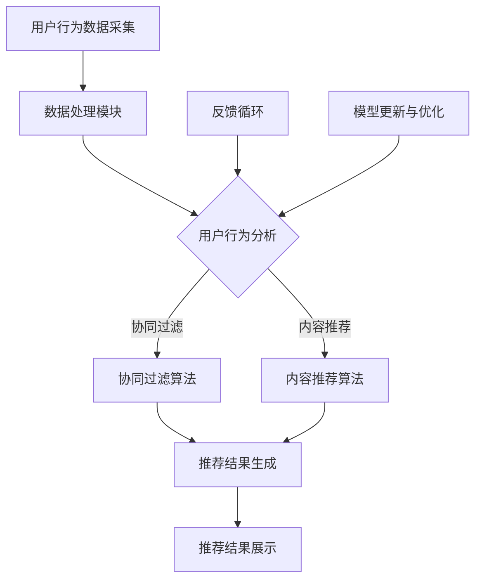

                 

### 《实时推荐系统的架构设计》

关键词：实时推荐系统、架构设计、协同过滤、内容推荐、性能优化

摘要：本文将深入探讨实时推荐系统的架构设计，包括核心概念、原理、技术实现和性能优化。通过详细的案例分析，我们将展示如何在实际项目中构建高效的实时推荐系统，并预测该系统的未来发展趋势。

---

### 第一部分：引言

#### 第1章：实时推荐系统概述

##### 1.1 实时推荐系统的重要性

- **实时推荐系统的定义**：实时推荐系统是一种能够在用户行为数据发生时即时生成推荐结果的技术体系，广泛应用于电子商务、社交媒体、视频流媒体等场景。
- **实时推荐系统的应用场景**：实时推荐系统在电子商务中用于个性化商品推荐，在社交媒体中用于内容推荐，在视频流媒体中用于视频推荐等。

##### 1.2 实时推荐系统的发展历史

- **早期推荐系统的发展**：从基于内容的推荐和协同过滤推荐开始，逐步发展到复杂的混合推荐系统。
- **实时推荐系统的演进**：随着大数据和实时计算技术的发展，实时推荐系统逐渐成为推荐系统的主流。

##### 1.3 本书内容安排

- **目标与读者**：本书旨在为读者提供实时推荐系统架构设计的全面指导。
- **书中各章节的主要内容**：本书将依次介绍实时推荐系统的核心概念、架构设计、性能优化以及实际项目案例。

---

### 第二部分：实时推荐系统的核心概念与原理

#### 第2章：推荐算法基础

##### 2.1 协同过滤算法

- **协同过滤算法的定义**：协同过滤是一种基于用户行为的推荐算法，通过分析用户的历史行为数据来预测用户对未知物品的喜好。
- **协同过滤算法的工作原理**：通过计算用户与用户之间的相似度，或者用户与物品之间的相似度，生成推荐列表。
- **协同过滤算法的类型**：包括基于用户的协同过滤（User-based Collaborative Filtering）和基于物品的协同过滤（Item-based Collaborative Filtering）。

##### 2.2 内容推荐算法

- **内容推荐算法的定义**：内容推荐是基于物品本身的特征（如文本、图像、标签等）来进行推荐的算法。
- **内容推荐算法的工作原理**：通过分析物品的特征向量，计算用户与物品之间的相似度，生成推荐列表。
- **内容推荐算法的类型**：包括基于标签的推荐、基于文本相似性的推荐等。

##### 2.3 混合推荐算法

- **混合推荐算法的定义**：混合推荐算法结合了协同过滤和内容推荐的优势，通过综合多种算法生成推荐结果。
- **混合推荐算法的工作原理**：首先使用协同过滤算法生成初步推荐列表，然后结合物品特征进行内容推荐，最后通过加权融合生成最终的推荐结果。
- **混合推荐算法的实现**：实现时通常采用协同过滤算法和内容推荐算法的集成，如矩阵分解（Matrix Factorization）与TF-IDF（Term Frequency-Inverse Document Frequency）的结合。

---

#### 第3章：实时推荐系统架构设计

##### 3.1 实时推荐系统架构概述

- **实时推荐系统的架构**：实时推荐系统通常由数据采集、数据处理、模型训练、推荐结果生成和展示等几个核心组件构成。
- **实时推荐系统的核心组件**：包括用户行为数据采集模块、数据处理模块、推荐算法模块、推荐结果展示模块等。

##### 3.2 实时数据采集与处理

- **数据采集策略**：采用分布式消息队列系统（如Kafka）收集用户行为数据。
- **数据处理流程**：包括数据清洗、数据预处理、数据存储等步骤。

##### 3.3 推荐算法模型训练与更新

- **模型训练方法**：采用在线学习（Online Learning）和批量学习（Batch Learning）相结合的方法。
- **模型更新策略**：定期重新训练模型，或使用增量学习（Incremental Learning）技术实时更新模型。

##### 3.4 推荐结果生成与展示

- **推荐结果生成算法**：根据用户的兴趣和行为数据，结合推荐算法生成推荐列表。
- **推荐结果展示策略**：根据用户界面的设计，采用动态刷新、分页加载等技术展示推荐结果。

---

### 第三部分：实时推荐系统的性能优化

#### 第4章：实时推荐系统的性能优化

##### 4.1 系统性能优化概述

- **系统性能优化的重要性**：保证系统在高并发请求下的稳定性和高性能。
- **系统性能优化的策略**：包括数据存储优化、算法效率优化和系统稳定性优化等。

##### 4.2 数据存储优化

- **数据存储方案**：采用分布式存储系统（如Hadoop、HBase）和缓存技术（如Redis）。
- **数据存储优化方法**：通过数据压缩、索引优化、分区策略等提高数据存储性能。

##### 4.3 算法效率优化

- **算法优化策略**：采用并行计算、GPU加速、算法简化等方法。
- **算法优化案例分析**：通过具体案例展示算法优化前后的性能对比。

##### 4.4 系统稳定性优化

- **系统稳定性保障策略**：采用故障转移、负载均衡、监控报警等技术。
- **系统故障处理流程**：定义系统故障处理的各个环节，确保系统在高并发和异常情况下的稳定运行。

---

### 第四部分：实时推荐系统实战

#### 第5章：实时推荐系统项目实战

##### 5.1 项目背景与目标

- **项目背景介绍**：介绍项目的背景和目标。
- **项目目标设定**：明确项目的目标和预期效果。

##### 5.2 项目需求分析

- **需求分析方法**：采用需求工程的方法，对项目需求进行详细分析。
- **项目需求详细描述**：明确项目的具体需求和功能点。

##### 5.3 项目技术方案设计

- **技术方案选择**：根据项目需求，选择合适的技术方案。
- **技术架构设计**：设计项目的整体架构，包括数据流、模块划分等。

##### 5.4 项目开发与实施

- **项目开发流程**：遵循敏捷开发的方法，分阶段进行开发。
- **项目实施过程**：介绍项目的实施过程和关键步骤。

##### 5.5 项目测试与优化

- **项目测试方法**：采用单元测试、集成测试、性能测试等方法。
- **项目优化策略**：根据测试结果，对项目进行优化和改进。

---

#### 第6章：实时推荐系统案例分析

##### 6.1 案例背景

- **案例公司介绍**：介绍案例所在的公司背景。
- **案例项目介绍**：介绍案例项目的背景和目标。

##### 6.2 案例分析

- **案例系统架构**：展示案例项目的系统架构图。
- **案例算法实现**：详细介绍案例项目中使用的算法和实现方式。

##### 6.3 案例总结

- **案例经验总结**：总结案例项目的经验教训。
- **案例改进方向**：提出案例项目的改进方向。

---

### 第五部分：实时推荐系统的未来发展趋势

#### 第7章：实时推荐系统的未来发展趋势

##### 7.1 实时推荐系统的发展趋势

- **实时推荐系统的发展方向**：介绍实时推荐系统的发展方向和趋势。
- **实时推荐系统的新技术**：介绍推动实时推荐系统发展的新技术。

##### 7.2 实时推荐系统的挑战与机遇

- **挑战与机遇分析**：分析实时推荐系统面临的挑战和机遇。
- **未来发展趋势预测**：预测实时推荐系统的未来发展趋势。

##### 7.3 实时推荐系统的未来应用场景

- **新的应用场景探索**：探讨实时推荐系统在新领域的应用。
- **实时推荐系统的未来影响**：分析实时推荐系统对行业和社会的影响。

---

### 附录

#### 附录A：实时推荐系统常用工具与资源

##### A.1 开源框架

- **常见开源框架介绍**：介绍常用的开源框架，如推荐系统框架、数据处理框架等。
- **框架选型建议**：根据项目需求，给出框架选型建议。

##### A.2 数据集

- **常见数据集介绍**：介绍常用的数据集，如MovieLens、Netflix Prize等。
- **数据集使用方法**：介绍如何使用这些数据集进行算法开发和评估。

##### A.3 论文与资料

- **相关论文推荐**：推荐对实时推荐系统有帮助的论文。
- **常见资料推荐**：推荐常用的学习资源和参考资料。

### Mermaid 流程图：实时推荐系统架构设计



### 伪代码：协同过滤算法原理讲解

```python
def collaborative_filtering(train_data, user, item):
    # 计算用户与物品之间的相似度
    similarity_matrix = compute_similarity_matrix(train_data)

    # 计算用户未评分的物品的预测评分
    predicted_ratings = []
    for item_id in user.unrated_items:
        sim_scores = similarity_matrix[user_id, :]
        ratings = train_data[item_id, :]
        predicted_rating = dot(sim_scores, ratings) / sum(sim_scores)
        predicted_ratings.append(predicted_rating)

    return predicted_ratings
```

### 数学公式：协同过滤算法中的相似度计算

$$
\text{similarity}(u, v) = \frac{\text{dot}(r_{uv}, r_{wv})}{\|r_{uv}\|\|r_{wv}\|}
$$

其中，$r_{uv}$ 和 $r_{wv}$ 分别表示用户 $u$ 和 $v$ 对物品 $w$ 的评分。

### 实际案例：使用协同过滤算法实现推荐系统

#### 开发环境搭建

- Python 3.8+
- Pandas
- NumPy
- Scikit-learn

#### 源代码实现

```python
import pandas as pd
from sklearn.metrics.pairwise import cosine_similarity

# 加载数据集
train_data = pd.read_csv('train_data.csv')
user_ids = train_data['user_id'].unique()
item_ids = train_data['item_id'].unique()

# 计算相似度矩阵
similarity_matrix = cosine_similarity(train_data.values)

# 定义协同过滤函数
def collaborative_filtering(user_id, item_id):
    user_ratings = train_data[train_data['user_id'] == user_id]['item_id']
    sim_scores = similarity_matrix[user_id, :]
    item_ratings = train_data[train_data['item_id'].isin(user_ratings)]['item_id']
    predicted_ratings = sim_scores[item_ratings] / sum(sim_scores[item_ratings])
    return predicted_ratings

# 预测未评分物品的评分
user_id = 1
item_id = 100
predicted_ratings = collaborative_filtering(user_id, item_id)

print(predicted_ratings)
```

#### 代码解读与分析

1. **数据预处理**：加载数据集并提取用户和物品的ID。
2. **相似度计算**：使用余弦相似度计算用户和物品之间的相似度。
3. **协同过滤算法实现**：根据用户已评分的物品，计算未评分物品的预测评分。
4. **预测结果输出**：输出预测的评分列表，供用户参考。

### 数学模型和数学公式讲解

#### 基于矩阵分解的协同过滤算法

假设我们有一个用户-物品评分矩阵 $R \in \mathbb{R}^{m \times n}$，其中 $m$ 表示用户数量，$n$ 表示物品数量。我们的目标是通过学习两个低维矩阵 $U \in \mathbb{R}^{m \times k}$ 和 $V \in \mathbb{R}^{n \times k}$ 来预测缺失的评分。

- **矩阵 $U$ 表示用户的低维嵌入表示**。
- **矩阵 $V$ 表示物品的低维嵌入表示**。
- **$k$ 表示嵌入的维度**。

#### **目标函数**

我们的目标是最小化预测评分与实际评分之间的误差。可以使用均方误差（MSE）作为损失函数：

$$
\min_{U, V} \sum_{i=1}^{m} \sum_{j=1}^{n} (r_{ij} - \hat{r}_{ij})^2
$$

其中，$\hat{r}_{ij} = \langle u_i, v_j \rangle$ 表示用户 $i$ 和物品 $j$ 的预测评分。

#### **优化方法**

使用梯度下降法优化矩阵 $U$ 和 $V$：

$$
U_{t+1} = U_t - \alpha \cdot \frac{\partial L(U_t, V_t)}{\partial U_t}
$$

$$
V_{t+1} = V_t - \alpha \cdot \frac{\partial L(U_t, V_t)}{\partial V_t}
$$

其中，$L(U_t, V_t)$ 是损失函数，$\alpha$ 是学习率。

#### **梯度计算**

计算损失函数关于 $U$ 和 $V$ 的梯度：

$$
\frac{\partial L(U_t, V_t)}{\partial U_t} = -2 \sum_{i=1}^{m} \sum_{j=1}^{n} (r_{ij} - \hat{r}_{ij}) \cdot v_{jt}
$$

$$
\frac{\partial L(U_t, V_t)}{\partial V_t} = -2 \sum_{i=1}^{m} \sum_{j=1}^{n} (r_{ij} - \hat{r}_{ij}) \cdot u_{it}
```

### 实时推荐系统的挑战与解决方案

#### 数据实时处理挑战

- **挑战**：实时推荐系统需要处理海量用户行为数据，这些数据可能来自多个源，如点击、购买、搜索等。处理这些数据需要高效的数据流处理技术。
- **解决方案**：采用Apache Kafka等分布式消息队列系统，实现数据的高效收集和传输。结合Apache Flink等实时数据处理框架，实现数据的高效处理和分析。

#### 模型在线更新挑战

- **挑战**：实时推荐系统需要根据用户行为数据的实时变化来更新模型，以保证推荐结果的准确性。在线更新模型需要高效且低延迟的计算。
- **解决方案**：采用增量学习（Incremental Learning）技术，通过在线更新模型参数，实现低延迟的模型更新。同时，使用分布式计算框架，如TensorFlow Serving和TorchServe，实现模型的分布式部署和在线更新。

#### 推荐结果多样性挑战

- **挑战**：为了提高用户的满意度，实时推荐系统需要生成多样化的推荐结果。然而，传统的协同过滤算法容易陷入“推荐多样性不足”的问题。
- **解决方案**：结合内容推荐和协同过滤，实现混合推荐算法。使用基于词嵌入或BERT等深度学习模型，对物品进行语义分析，提高推荐的多样性。同时，使用随机采样或 adversarial learning 等技术，进一步优化推荐结果的多样性。

#### 系统稳定性与性能优化挑战

- **挑战**：实时推荐系统需要保证系统的稳定性和高性能，以满足高并发请求的处理需求。
- **解决方案**：采用分布式系统架构，实现负载均衡和高可用性。优化数据处理和模型计算的性能，如使用GPU加速计算、缓存策略优化等。同时，使用监控和报警系统，实时监控系统状态，及时发现和解决问题。

### 实时推荐系统的未来发展趋势

#### 自动化与智能化

- **趋势**：随着人工智能技术的发展，实时推荐系统将更加自动化和智能化。通过自动化机器学习（AutoML）技术，实现推荐模型的自动调参和优化。通过智能算法，如强化学习（Reinforcement Learning），实现更加智能的推荐策略。

#### 多模态数据融合

- **趋势**：实时推荐系统将融合多种类型的数据，如文本、图像、音频等，实现更全面的用户行为分析。通过多模态数据融合技术，提高推荐系统的准确性和多样性。

#### 个性化与情境感知

- **趋势**：实时推荐系统将更加注重个性化推荐和情境感知。通过深度学习技术，对用户的历史行为和偏好进行深入分析，实现更加个性化的推荐。同时，结合情境感知技术，根据用户的实时情境（如时间、地点、情绪等）提供更合适的推荐。

#### 安全性与隐私保护

- **趋势**：随着用户对隐私保护的重视，实时推荐系统将更加注重安全性和隐私保护。通过数据加密、差分隐私（Differential Privacy）等技术，保障用户数据的安全和隐私。

### 实时推荐系统的未来应用场景

#### 社交媒体

- **应用场景**：实时推荐系统可以用于社交媒体平台，根据用户的兴趣和行为，推荐相关的帖子、视频、话题等，提高用户的参与度和活跃度。

#### 电子商务

- **应用场景**：实时推荐系统可以用于电子商务平台，根据用户的浏览历史和购买行为，推荐相关的商品，提高销售转化率和客户满意度。

#### 音乐与视频流媒体

- **应用场景**：实时推荐系统可以用于音乐和视频流媒体平台，根据用户的播放历史和偏好，推荐相关的音乐、视频和节目，提高用户的观看体验和粘性。

#### 内容创作

- **应用场景**：实时推荐系统可以用于内容创作平台，根据用户的创作兴趣和风格，推荐相关的教程、灵感、素材等，帮助用户提高创作效率和质量。

### 实时推荐系统的未来影响

#### 改变商业模式

- **影响**：实时推荐系统将改变传统商业模式，通过精准推荐，帮助企业实现个性化营销和精准营销，提高销售额和客户满意度。

#### 提高用户体验

- **影响**：实时推荐系统将提高用户体验，通过个性化推荐，满足用户的需求和偏好，提高用户满意度和忠诚度。

#### 促进技术创新

- **影响**：实时推荐系统的需求将促进相关技术的创新和发展，如深度学习、自然语言处理、多模态数据融合等，推动人工智能技术的进步。

### 附录A：实时推荐系统常用工具与资源

#### A.1 开源框架

- **常见开源框架介绍**：
  - **推荐系统框架**：如Surprise、LightFM、Recommender。
  - **数据处理框架**：如Apache Flink、Apache Spark。
- **框架选型建议**：根据项目需求和规模选择合适的框架。

#### A.2 数据集

- **常见数据集介绍**：
  - **MovieLens**：提供不同规模的用户-物品评分数据集。
  - **Netflix Prize**：提供大规模的评分数据集。
- **数据集使用方法**：了解数据集的结构和预处理方法，以适应算法开发。

#### A.3 论文与资料

- **相关论文推荐**：
  - **协同过滤**：如"[Item-Based Collaborative Filtering Recommendation Algorithms](http://ilpubs.stanford.edu:8090/1001/1/ijcai05.pdf)"。
  - **深度学习**：如"[Deep Learning for Recommender Systems](https://arxiv.org/abs/1706.07987)"。
- **常见资料推荐**：推荐书籍、在线课程和论坛，以获取更多学习和交流的机会。

### 作者

- **作者：AI天才研究院/AI Genius Institute & 禅与计算机程序设计艺术 /Zen And The Art of Computer Programming**

