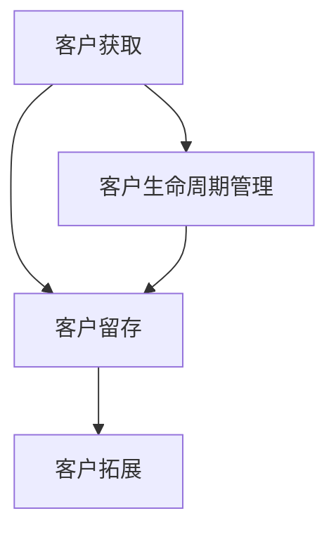

                 

## 文章标题：客户关系管理：建立长期客户忠诚度

> 关键词：客户关系管理、客户忠诚度、客户生命周期管理、大数据分析、会员制度

> 摘要：本文将深入探讨客户关系管理（CRM）的核心理念和实践方法，重点分析如何通过策略和技术的结合，建立长期客户忠诚度。文章结构清晰，逻辑严密，旨在为企业和组织提供可行的客户关系管理解决方案。

### 目录大纲：

#### 第一部分：客户关系管理概述

- # 第1章：客户关系管理基础
  - ## 1.1 客户关系管理的定义与重要性
    - ### 1.1.1 客户关系管理的概念
    - ### 1.1.2 客户关系管理的重要性
  - ## 1.2 客户生命周期管理
    - ### 1.2.1 客户获取
    - ### 1.2.2 客户留存
    - ### 1.2.3 客户拓展
  - ## 1.3 客户关系管理的核心要素
    - ### 1.3.1 客户需求分析
    - ### 1.3.2 客户价值评估
    - ### 1.3.3 客户满意度

#### 第二部分：建立客户忠诚度

- # 第2章：建立长期客户忠诚度的策略
  - ## 2.1 增强客户体验
    - ### 2.1.1 产品和服务质量
    - ### 2.1.2 个性化服务
    - ### 2.1.3 客户反馈与互动
  - ## 2.2 客户忠诚度评估与监测
    - ### 2.2.1 客户忠诚度指标
    - ### 2.2.2 客户满意度调查
    - ### 2.2.3 客户忠诚度监测工具
  - ## 2.3 客户忠诚度激励措施
    - ### 2.3.1 会员制度
    - ### 2.3.2 折扣与优惠
    - ### 2.3.3 社区互动与参与

#### 第三部分：客户关系管理技术

- # 第3章：大数据与客户关系管理
  - ## 3.1 大数据在客户关系管理中的应用
    - ### 3.1.1 数据采集与整合
    - ### 3.1.2 数据分析与挖掘
    - ### 3.1.3 数据可视化
  - ## 3.2 客户关系管理系统的建设
    - ### 3.2.1 系统架构设计
    - ### 3.2.2 功能模块划分
    - ### 3.2.3 系统集成与部署

#### 第四部分：客户关系管理实战

- # 第4章：客户关系管理案例分析
  - ## 4.1 案例分析一：某电商平台的客户关系管理策略
    - ### 4.1.1 案例背景
    - ### 4.1.2 客户关系管理策略
    - ### 4.1.3 案例评估与效果
  - ## 4.2 案例分析二：某酒店集团的客户忠诚度计划
    - ### 4.2.1 案例背景
    - ### 4.2.2 客户忠诚度计划
    - ### 4.2.3 案例评估与效果

#### 第五部分：客户关系管理未来展望

- # 第5章：客户关系管理发展趋势与挑战
  - ## 5.1 客户关系管理发展趋势
    - ### 5.1.1 新技术的应用
    - ### 5.1.2 客户体验的持续优化
    - ### 5.1.3 数据隐私与安全
  - ## 5.2 客户关系管理面临的挑战
    - ### 5.2.1 市场竞争加剧
    - ### 5.2.2 客户需求的多样化
    - ### 5.2.3 数据分析与处理能力的提升

#### 附录

- ## 附录A：客户关系管理工具与资源
  - ### A.1 常用客户关系管理工具
  - ### A.2 客户关系管理资源推荐
  - ### A.3 深入学习与客户关系管理相关资料

### Mermaid 流�程图示例：



### 核心算法原理讲解伪代码示例：

```python
# 客户价值评估算法伪代码
def calculate_customer_value(customer_data):
    # 伪代码：计算客户的终身价值
    LTV = 0
    for transaction in customer_data.transactions:
        LTV += discount_factor(transaction.timestamp) * transaction.amount
    return LTV
```

### 数学模型与公式示例：

$$
Loyalty = \frac{CP \times (CV)^2}{CPR}
$$

其中：
- $Loyalty$：客户忠诚度
- $CP$：客户购买频率
- $CV$：客户平均消费金额
- $CPR$：客户购买周期

### 项目实战示例：

#### 电商平台的会员制度设计

#### 实战目标
设计一套会员制度，旨在提升客户忠诚度，并激励客户进行重复购买。

#### 实战步骤
1. **会员等级划分**：根据客户的消费金额和购买频率，将会员分为普通会员、银卡会员、金卡会员等不同等级。
2. **会员权益**：不同等级会员享受不同的权益，如积分累积、折扣优惠、专属客服等。
3. **积分政策**：设计积分累积规则，如消费满一定金额送积分，积分可兑换礼品或抵扣现金。
4. **会员服务**：定期开展会员专属活动，提高会员的参与度和满意度。

#### 代码实现
（此处省略具体代码实现，仅描述关键步骤）

### 开发环境搭建
- 使用Python编写会员制度相关代码。
- 需要的Python库：numpy、pandas等。

### 源代码详细实现和代码解读
（此处省略具体源代码，仅描述关键代码功能和解释）

### 代码解读与分析
（此处省略具体代码解读，仅描述关键代码的逻辑和作用）

---

本文将按照上述目录结构，详细探讨客户关系管理的各个层面，从基础概念到实战应用，旨在为读者提供全面而深入的客户关系管理指南。在接下来的章节中，我们将逐步分析每一个核心概念和策略，并结合实际案例进行详细讲解。希望通过这篇文章，读者能够掌握客户关系管理的方法，并将其应用于实践，从而提升企业的客户满意度和忠诚度。

### 第1章：客户关系管理基础

#### 1.1 客户关系管理的定义与重要性

客户关系管理（Customer Relationship Management，简称CRM）是企业通过系统化、持续性的方法，对客户进行有效的识别、获取、留存和拓展的一系列策略和技术的综合应用。CRM的核心理念是“以客户为中心”，通过优化客户体验，提高客户满意度和忠诚度，从而实现企业的长期可持续发展。

**1.1.1 客户关系管理的概念**

客户关系管理可以看作是一种集成性的管理实践，它涵盖了以下几个方面：

1. **客户数据管理**：收集、存储、分析和利用客户数据，以便更好地了解客户需求和偏好。
2. **客户互动管理**：通过多种渠道与客户进行沟通和互动，提高客户体验。
3. **销售管理**：优化销售流程，提高销售效率和业绩。
4. **营销管理**：制定和执行营销策略，吸引潜在客户并转化为实际购买。
5. **服务管理**：提供高质量的客户服务，解决客户问题和投诉。

**1.1.2 客户关系管理的重要性**

在现代商业环境中，客户关系管理的重要性不言而喻。以下是一些关键点：

1. **提升客户满意度**：通过CRM，企业能够更好地理解客户需求，提供个性化服务，从而提高客户满意度。
2. **增加客户忠诚度**：CRM帮助建立长期稳定的客户关系，减少客户流失，提高客户忠诚度。
3. **提高运营效率**：通过自动化和系统化的管理，CRM可以减少重复工作，提高工作效率。
4. **降低成本**：通过优化销售和服务流程，CRM有助于降低运营成本。
5. **驱动业务增长**：良好的CRM策略能够吸引新客户，保留现有客户，推动业务增长。

**客户生命周期管理**

客户生命周期管理是CRM的一个重要组成部分，它涉及到客户从接触企业到最终流失的整个过程。客户生命周期通常可以分为以下几个阶段：

1. **客户获取（Acquisition）**：吸引潜在客户，通过各种营销手段提高品牌知名度和客户转化率。
2. **客户留存（Retention）**：通过提供优质的产品和服务，提高客户满意度和忠诚度，防止客户流失。
3. **客户拓展（Expansion）**：通过增加客户的购买量和购买频率，提高客户的生命周期价值。
4. **客户流失（Churn）**：监控和分析客户流失的原因，采取相应措施减少客户流失率。

**核心要素**

为了实现有效的客户关系管理，企业需要关注以下几个核心要素：

1. **客户需求分析**：深入了解客户需求，为提供个性化服务奠定基础。
2. **客户价值评估**：通过数据分析和评估，识别高价值客户，制定差异化的服务策略。
3. **客户满意度**：定期收集客户反馈，通过服务质量提升和客户满意度调查，持续改进客户体验。

在接下来的章节中，我们将详细探讨这些核心要素和策略，并提供实际案例来展示如何实施和优化客户关系管理。

### 1.2 客户生命周期管理

客户生命周期管理（Customer Lifecycle Management，简称CLM）是客户关系管理（CRM）的关键组成部分，旨在通过系统化的方法，最大化地提高客户价值并延长客户生命周期。CLM涵盖了客户从接触企业到最终流失的整个过程，包括客户获取、客户留存和客户拓展等多个阶段。下面，我们将分别探讨这三个阶段及其在CRM中的重要性。

#### 1.2.1 客户获取

客户获取（Customer Acquisition）是CLM的第一个阶段，也是企业拓展市场、吸引新客户的过程。有效的客户获取策略能够提高品牌知名度、增加客户来源，并为企业带来潜在的销售机会。

**客户获取的重要性**：

1. **增长业务**：通过增加新客户，企业能够扩大市场份额，实现业务增长。
2. **多元化的客户基础**：获取新客户有助于企业建立多元化的客户基础，降低单一客户来源的风险。
3. **品牌认知**：成功的客户获取策略能够提高品牌知名度和市场影响力。

**客户获取的方法**：

1. **营销活动**：通过线上和线下营销活动，如广告、促销、社交媒体等，吸引潜在客户。
2. **内容营销**：通过高质量的内容，如博客、视频、白皮书等，提供有价值的信息，吸引目标客户。
3. **合作伙伴关系**：与行业内的其他企业建立合作伙伴关系，通过联合营销等方式获取客户。
4. **口碑营销**：通过提供卓越的产品和服务，鼓励现有客户推荐新客户。

**客户获取案例**：

以某电商平台的客户获取为例，该平台通过以下策略成功吸引新客户：

1. **搜索引擎优化（SEO）**：优化网站内容和结构，提高在搜索引擎中的排名，吸引更多有机流量。
2. **付费广告**：在谷歌和社交媒体平台上投放付费广告，精准定位潜在客户。
3. **电子邮件营销**：通过有针对性的电子邮件营销活动，如新品发布、限时优惠等，吸引潜在客户。
4. **社交媒体互动**：在Facebook、Instagram等社交媒体平台上与用户互动，提高品牌知名度。

#### 1.2.2 客户留存

客户留存（Customer Retention）是CLM的第二个阶段，旨在通过提供优质的产品和服务，提高客户满意度和忠诚度，从而防止客户流失。客户留存是CRM的核心目标之一，因为维护现有客户的成本远低于获取新客户的成本。

**客户留存的重要性**：

1. **提高客户生命周期价值**：通过提高客户的购买频率和消费金额，增加客户的生命周期价值。
2. **降低客户流失率**：有效的客户留存策略能够减少客户流失，提高客户留存率。
3. **客户口碑**：满意的客户更有可能向亲朋好友推荐企业产品和服务，为企业带来更多新客户。

**客户留存的方法**：

1. **优质服务**：提供高质量的产品和服务，确保客户满意度。
2. **个性化体验**：根据客户需求和偏好，提供个性化的服务和推荐。
3. **客户反馈**：定期收集客户反馈，及时解决客户问题和投诉。
4. **忠诚度计划**：实施会员制度或忠诚度计划，奖励长期客户。

**客户留存案例**：

以某酒店集团的客户留存为例，该酒店通过以下策略成功提高客户留存率：

1. **会员制度**：推出会员制度，提供积分累积、专属优惠和优先预订权等福利，激励客户重复入住。
2. **个性化服务**：根据客户的喜好和历史记录，提供个性化的客房服务和餐饮推荐。
3. **客户关怀**：定期通过邮件和电话与客户沟通，了解客户需求和满意度，及时回应客户反馈。
4. **客户调研**：定期开展客户满意度调查，收集客户意见，持续改进服务质量。

#### 1.2.3 客户拓展

客户拓展（Customer Expansion）是CLM的第三个阶段，旨在通过增加客户的购买量和购买频率，提高客户的生命周期价值。客户拓展是客户关系管理中的高级阶段，要求企业深入了解客户需求，提供超出期望的产品和服务。

**客户拓展的重要性**：

1. **提高收入**：通过增加客户的购买量和购买频率，企业能够显著提高收入。
2. **增强客户粘性**：提供增值服务和产品，增强客户对企业的依赖和信任。
3. **客户忠诚度**：通过为客户提供额外的价值，提高客户的忠诚度和品牌忠诚度。

**客户拓展的方法**：

1. **产品多样化**：根据客户需求，推出新的产品和服务，满足客户的多样化需求。
2. **交叉销售和增值销售**：通过客户数据分析，识别潜在的销售机会，进行交叉销售和增值销售。
3. **客户关怀活动**：定期举办客户关怀活动，如新品发布会、体验活动等，提高客户参与度。
4. **定制化解决方案**：提供定制化的解决方案，满足特定客户的需求，提升客户满意度。

**客户拓展案例**：

以某软件公司的客户拓展为例，该公司通过以下策略成功提高客户生命周期价值：

1. **定制化服务**：根据客户的具体需求，提供定制化的软件解决方案，提高客户满意度。
2. **增值服务**：推出增值服务，如数据分析和云服务，增加客户的购买频率和消费金额。
3. **客户培训**：定期举办客户培训，帮助客户更好地使用产品，提高客户技能。
4. **客户社区**：建立客户社区，提供交流平台，增强客户间的互动和信任。

通过客户生命周期管理的有效实施，企业能够实现客户价值的最大化，提高客户满意度和忠诚度，从而实现长期可持续发展。在接下来的章节中，我们将继续探讨CRM中的其他核心要素，并提供更多实战案例，帮助读者深入理解和应用CRM策略。

### 1.3 客户关系管理的核心要素

在客户关系管理（CRM）中，实现成功的关键在于对核心要素的深刻理解和有效运用。这些核心要素包括客户需求分析、客户价值评估和客户满意度。下面我们将分别探讨这些要素，并解释它们在CRM中的重要性。

#### 1.3.1 客户需求分析

客户需求分析是CRM的基础，它涉及到识别和理解客户的需求、偏好和期望。通过客户需求分析，企业能够更精准地定位市场，开发出满足客户需求的产品和服务，从而提升客户满意度。

**客户需求分析的重要性**：

1. **个性化服务**：了解客户需求，有助于提供个性化的服务，提高客户体验。
2. **产品优化**：通过分析客户需求，企业可以持续改进产品，提高产品竞争力。
3. **市场定位**：准确识别客户需求，有助于企业更有效地进行市场定位和目标客户选择。

**客户需求分析的方法**：

1. **问卷调查**：通过设计问卷调查，收集客户的反馈和意见。
2. **访谈**：直接与客户进行访谈，深入了解客户的需求和期望。
3. **市场调研**：通过市场调研，分析竞争对手的产品和客户需求。
4. **数据分析**：利用大数据分析技术，分析客户行为和购买模式。

**案例**：

某在线教育平台通过问卷调查和访谈，收集了学员对课程内容、学习方式、互动体验等方面的反馈。通过分析这些数据，平台优化了课程结构，增加了互动环节，提升了学员的学习体验和满意度。

#### 1.3.2 客户价值评估

客户价值评估（Customer Value Assessment）是CRM中的另一个关键要素。通过评估客户的价值，企业可以识别高价值客户，制定差异化的营销策略和服务方案，从而最大化客户生命周期价值。

**客户价值评估的重要性**：

1. **资源优化**：通过对客户价值的评估，企业可以合理分配资源，将有限的资源投入到高价值客户上。
2. **营销策略**：高价值客户是企业利润的重要来源，针对这些客户制定专门的营销策略，可以提高营销效果。
3. **客户留存**：识别高价值客户，提供更优质的服务，有助于提高客户忠诚度和留存率。

**客户价值评估的方法**：

1. **生命周期价值（LTV）**：通过预测客户在未来一段时间内的总消费金额，计算客户的生命周期价值。
2. **价值评分模型**：利用客户行为数据，建立客户价值评分模型，对不同价值的客户进行分类。
3. **客户利润贡献**：分析客户为企业带来的利润，评估客户的价值。

**案例**：

某零售企业通过生命周期价值（LTV）模型，识别出了高价值客户。这些客户在过去一年中的平均消费金额是普通客户的2倍。为了留住这些高价值客户，企业推出了一系列专属优惠和会员福利，如专属折扣、免费礼品等，成功提高了客户忠诚度和重复购买率。

#### 1.3.3 客户满意度

客户满意度是CRM中衡量服务质量的直接指标。通过定期评估客户满意度，企业可以及时发现和解决服务中的问题，持续改进客户体验，提高客户忠诚度。

**客户满意度的重要性**：

1. **服务质量**：客户满意度反映了企业的服务质量，是客户体验的重要指标。
2. **客户留存**：高满意度的客户更愿意与企业建立长期合作关系，降低客户流失率。
3. **品牌形象**：满意的客户会成为企业的口碑传播者，提升品牌形象和市场竞争力。

**客户满意度评估的方法**：

1. **满意度调查**：通过问卷、电话或在线调查，收集客户的满意度反馈。
2. **Net Promoter Score（NPS）**：通过NPS评估，了解客户对企业的推荐意愿。
3. **客户反馈系统**：建立客户反馈系统，及时收集和处理客户意见和投诉。

**案例**：

某酒店通过NPS评估，发现客户对房间清洁度和服务态度的满意度较低。为了提升客户满意度，酒店立即采取了行动，增加了清洁频率，并对前台服务进行了培训。经过三个月的努力，客户满意度显著提升，客户推荐意愿也有所增加。

通过深入理解和运用这些核心要素，企业可以更有效地实施CRM策略，提高客户满意度和忠诚度，实现业务增长和可持续发展。在接下来的章节中，我们将进一步探讨如何通过策略和技术的结合，建立长期客户忠诚度。

### 第2章：建立长期客户忠诚度的策略

#### 2.1 增强客户体验

在建立长期客户忠诚度的过程中，增强客户体验是最为关键的策略之一。客户体验涵盖了客户与企业互动的每一个环节，包括购买前、购买中和购买后。一个良好的客户体验能够显著提升客户满意度和忠诚度，从而为企业的长期发展奠定基础。

**2.1.1 产品和服务质量**

产品和服务质量是客户体验的核心。高质量的产品和服务能够满足甚至超越客户的期望，从而增强客户的满意度。以下是一些提升产品和服务质量的方法：

1. **持续改进**：通过持续改进产品和服务的质量，确保始终符合或超过客户的期望。
2. **质量控制**：建立严格的质量控制体系，确保每一件产品或服务都符合标准。
3. **用户反馈**：积极收集用户反馈，了解产品和服务中的不足，并迅速采取改进措施。

**案例**：

某知名电子产品公司通过用户反馈不断改进产品。在收到大量关于电池寿命的投诉后，公司迅速推出了升级版产品，显著提高了电池续航能力。这一改进措施不仅提升了客户满意度，还增强了客户对品牌的信任。

**2.1.2 个性化服务**

个性化服务是指根据客户的需求和偏好，提供定制化的产品和服务。个性化服务能够提升客户的感知价值，增强客户体验，从而提高客户忠诚度。

1. **数据驱动**：利用大数据和人工智能技术，分析客户的历史数据和偏好，提供个性化的推荐和服务。
2. **个性化沟通**：通过个性化的邮件、短信和电话沟通，增强客户与企业之间的互动。
3. **定制化产品**：根据客户的需求，提供定制化的产品和服务。

**案例**：

某在线零售平台通过个性化推荐算法，根据客户的购买历史和浏览记录，为每位客户推荐最相关的商品。这一策略不仅提升了客户的购物体验，还显著提高了转化率和销售额。

**2.1.3 客户反馈与互动**

客户反馈和互动是建立良好客户体验的重要环节。通过积极收集和处理客户反馈，企业可以及时发现并解决客户问题，增强客户满意度。

1. **反馈渠道**：建立多种反馈渠道，如在线调查、社交媒体、客户服务中心等，方便客户提出反馈。
2. **快速响应**：建立快速响应机制，确保客户反馈能够在最短时间内得到回应。
3. **反馈机制**：建立完善的反馈机制，将客户反馈转化为具体的改进措施，持续优化产品和服务。

**案例**：

某电信公司通过在线客服系统，提供24/7的客户支持服务。客户在遇到问题时，可以随时通过在线客服获得帮助，极大提升了客户满意度和忠诚度。

**2.1.4 持续优化客户体验**

增强客户体验是一个持续的过程，需要企业不断进行优化和改进。以下是一些持续优化客户体验的方法：

1. **定期评估**：定期评估客户体验，了解客户满意度的变化趋势。
2. **跨部门协作**：各部门协同工作，确保客户体验的全面提升。
3. **员工培训**：定期对员工进行客户体验培训，提高员工的客户服务意识和能力。

**案例**：

某金融机构定期对客户体验进行评估，并根据客户的反馈和需求，调整服务流程和产品功能。同时，公司还定期对员工进行客户体验培训，确保每一位员工都能够提供卓越的客户服务。

通过增强客户体验，企业能够建立长期客户忠诚度，实现业务增长和可持续发展。在接下来的章节中，我们将继续探讨如何通过客户忠诚度评估与监测、以及客户忠诚度激励措施来进一步巩固客户忠诚度。

#### 2.2 客户忠诚度评估与监测

客户忠诚度评估与监测是客户关系管理（CRM）中至关重要的一环。通过科学有效的评估和监测方法，企业可以实时了解客户忠诚度水平，发现潜在问题，并采取相应的策略进行优化。以下将详细介绍客户忠诚度评估的指标、满意度调查方法和监测工具。

**2.2.1 客户忠诚度指标**

客户忠诚度指标是衡量客户对企业忠诚程度的关键指标。以下是一些常用的客户忠诚度指标：

1. **重复购买率**：客户在一定时间内重复购买产品或服务的次数。重复购买率高表明客户对产品或服务有较高的忠诚度。
2. **客户生命周期价值（CLV）**：客户在整个生命周期内为企业带来的总收益。高CLV的客户通常具有较高的忠诚度。
3. **Net Promoter Score（NPS）**：通过调查客户对产品或服务的推荐意愿，将客户分为推荐者、被动者和反对者三类，NPS = （推荐者百分比 - 反对者百分比）。NPS是衡量客户忠诚度和品牌忠诚度的重要指标。
4. **客户留存率**：在一定时间内，保留的客户数量与总客户数量之比。高留存率表明客户对企业有较高的忠诚度。
5. **购买频率**：客户在一定时间内购买产品或服务的次数。购买频率高通常意味着客户对产品或服务有较高的依赖和忠诚度。

**2.2.2 客户满意度调查**

客户满意度调查是评估客户对企业产品和服务的满意程度的重要手段。以下是一些常用的客户满意度调查方法：

1. **问卷调查**：通过设计详细的问卷，收集客户对产品、服务、互动体验等方面的反馈。问卷调查可以采用在线、纸质或电话等多种形式。
2. **焦点小组**：邀请一组具有代表性的客户，就特定话题进行深入讨论和交流。焦点小组能够提供丰富的客户观点和洞察。
3. **客户访谈**：通过与客户进行面对面或电话访谈，深入了解客户的真实感受和需求。客户访谈可以提供更加详细和个性化的反馈。
4. **客户反馈系统**：建立在线反馈系统，让客户能够方便地提交反馈和建议。客户反馈系统可以实时收集和处理客户反馈，提高问题响应速度。

**2.2.3 客户忠诚度监测工具**

为了有效评估和监测客户忠诚度，企业需要使用一些专业的工具和方法。以下是一些常用的客户忠诚度监测工具：

1. **CRM系统**：客户关系管理系统（CRM）可以整合客户数据，提供客户忠诚度的实时监测和分析。CRM系统通常包括客户信息管理、销售管理、营销管理和服务管理等功能。
2. **客户反馈管理系统**：客户反馈管理系统（CFS）可以帮助企业收集、分析和响应客户反馈。CFS通常包括在线调查、反馈收集、数据分析、报告生成等功能。
3. **大数据分析平台**：利用大数据分析平台，企业可以对大量客户数据进行分析和挖掘，识别客户忠诚度相关的关键因素。大数据分析平台通常包括数据采集、数据存储、数据分析、数据可视化等功能。
4. **忠诚度管理平台**：忠诚度管理平台（LMP）可以帮助企业设计和实施忠诚度计划，监测客户忠诚度变化，优化忠诚度策略。LMP通常包括会员管理、积分管理、促销管理、数据分析等功能。

**2.2.4 实际应用案例**

以某在线零售平台为例，该平台通过以下方式评估和监测客户忠诚度：

1. **重复购买率**：平台通过CRM系统监控客户的重复购买行为，识别高忠诚度客户。
2. **客户生命周期价值**：平台利用大数据分析，计算每个客户的CLV，对高价值客户进行重点维护。
3. **NPS调查**：平台定期通过在线问卷和邮件调查客户的推荐意愿，NPS分数超过70%的客户被认定为高忠诚度客户。
4. **客户满意度调查**：平台每月进行一次客户满意度调查，收集客户对产品和服务质量的反馈，及时发现和解决问题。
5. **忠诚度管理平台**：平台通过忠诚度管理平台实施会员制度，为高忠诚度客户提供专属优惠和福利。

通过科学合理的客户忠诚度评估与监测，企业可以及时了解客户忠诚度水平，发现潜在问题，并采取相应策略进行优化，从而提高客户满意度和忠诚度，实现业务增长。

#### 2.3 客户忠诚度激励措施

客户忠诚度激励措施是提升客户满意度和忠诚度的重要手段。通过有效的激励措施，企业可以鼓励客户重复购买，建立长期稳定的客户关系。以下将详细介绍几种常见的客户忠诚度激励措施：会员制度、折扣与优惠以及社区互动与参与。

**2.3.1 会员制度**

会员制度是企业通过设立不同会员等级，为不同忠诚度的客户提供差异化服务和优惠的一种策略。会员制度的核心在于通过积分、折扣、专享活动等激励措施，提高客户的粘性和忠诚度。

1. **会员等级划分**：根据客户的消费金额、购买频率和活跃度，将会员划分为普通会员、银卡会员、金卡会员等不同等级。每个等级享受的权益和优惠有所不同，通常等级越高，优惠力度越大。
2. **会员权益**：为不同等级的会员提供多样化的权益，如专属折扣、积分累积、优先预订、会员专享活动等。这些权益能够增加客户的满意度和忠诚度。
3. **积分政策**：设计积分累积规则，如消费满一定金额送积分，积分可兑换礼品或抵扣现金。积分政策能够激励客户更多地消费，从而提升客户的忠诚度。

**案例**：

某电商平台通过会员制度成功提升了客户忠诚度。该平台将会员分为普通会员、银卡会员和金卡会员三个等级。银卡会员享受9折优惠，金卡会员享受8.5折优惠，同时还可以参加专属的会员活动。会员积分政策设计为消费满100元积1分，积分可兑换成现金抵扣或礼品。这一策略不仅增加了会员的活跃度，还提高了客户的重复购买率。

**2.3.2 折扣与优惠**

折扣与优惠是激励客户重复购买和提升忠诚度的一种直接而有效的手段。通过提供各种形式的折扣和优惠，企业能够吸引客户，增加销售量。

1. **定期促销**：企业可以通过定期促销活动，如节日促销、周年庆促销等，吸引客户进行购买。这种策略能够提高客户的购买频率，增强客户的参与感。
2. **优惠券**：发放优惠券是另一种常见的优惠手段。优惠券可以针对不同产品、不同客户群体设计，提高客户的购买意愿。
3. **积分兑换**：客户通过消费累积的积分可以兑换成优惠券或礼品，这种策略能够激励客户更多地消费，提升客户忠诚度。

**案例**：

某连锁餐饮企业通过优惠券策略成功提升了客户忠诚度。该企业定期发放优惠券，客户可以通过手机APP或店内打印优惠券进行消费。优惠券内容包括满减优惠、特定菜品折扣等。为了增加客户的参与度，企业还在APP中推出了优惠券兑换功能，客户可以通过积分兑换优惠券。这一策略不仅提高了客户的满意度，还显著增加了客户的重复购买率。

**2.3.3 社区互动与参与**

社区互动与参与是建立客户忠诚度的重要策略。通过创建客户社区，企业可以与客户建立更加紧密的联系，提升客户的参与感和归属感。

1. **客户社区**：企业可以通过建立线上客户社区，让客户在社区内分享使用体验、提出建议和解决问题。这种互动能够增强客户之间的联系，提升客户满意度。
2. **参与活动**：企业可以定期举办各类线上和线下活动，如新品发布会、用户研讨会、趣味比赛等，吸引客户参与。这些活动不仅能够提升客户的参与感，还能增强客户对品牌的认同。
3. **用户反馈**：企业应积极收集客户的反馈和建议，并在社区内进行展示和回应。这种透明和互动的沟通方式能够提升客户的信任感和满意度。

**案例**：

某电子产品公司通过创建客户社区，成功提升了客户忠诚度。该公司在社交媒体上建立了官方客户社区，定期发布产品资讯、用户故事和互动活动。客户可以在社区内分享使用心得、提出改进建议，并参与社区讨论。公司还定期举办线上研讨会和线下见面会，让客户有机会与产品团队直接交流。这种策略不仅增强了客户的参与感，还显著提升了客户的忠诚度和品牌认同。

通过会员制度、折扣与优惠以及社区互动与参与等激励措施，企业能够有效提升客户忠诚度，建立长期稳定的客户关系。在下一章节中，我们将探讨如何通过大数据与客户关系管理的结合，进一步优化客户忠诚度策略。

#### 3.1 大数据在客户关系管理中的应用

大数据在客户关系管理（CRM）中的应用正在日益成为企业提升客户满意度和忠诚度的关键手段。通过大数据技术，企业可以深入挖掘和分析海量客户数据，从而实现精准营销、个性化服务和智能决策。以下将详细探讨大数据在CRM中的具体应用，包括数据采集与整合、数据分析和挖掘、以及数据可视化。

**3.1.1 数据采集与整合**

数据采集是大数据应用的基础，它涉及到从多个来源收集客户数据，包括购买记录、浏览行为、社交媒体互动、客户服务记录等。数据整合则是将来自不同来源的数据进行清洗、转换和合并，以便进行统一的分析和挖掘。

1. **数据源**：客户数据可以来自多个渠道，如企业内部的销售系统、客户服务系统、网站日志、社交媒体平台等。通过整合这些数据，企业可以建立一个全面的客户数据视图。
2. **数据清洗**：数据清洗是确保数据质量的重要步骤，它包括去除重复数据、纠正错误数据和填补缺失数据等。高质量的数据是进行有效分析的前提。
3. **数据整合**：通过数据仓库和数据湖等技术，企业可以将来自不同来源的数据进行整合，构建一个统一的客户数据平台。这有助于企业全面了解客户的行为和需求。

**3.1.2 数据分析与挖掘**

数据分析和挖掘是大数据技术在CRM中的核心应用，它通过统计学、机器学习和数据挖掘算法，从海量数据中提取有价值的信息和洞见。

1. **客户行为分析**：通过分析客户的购买历史、浏览行为和互动记录，企业可以识别客户的偏好和需求。例如，通过聚类分析，可以将客户分为不同的细分市场，从而进行有针对性的营销。
2. **预测分析**：利用预测模型，企业可以预测客户的未来行为，如购买意向、流失风险等。例如，通过时间序列分析和回归分析，可以预测客户未来的消费金额和购买频率。
3. **客户细分**：通过细分分析，企业可以将客户分为不同的群体，如高价值客户、潜在客户、忠诚客户等。这种细分有助于企业制定差异化的营销策略和服务方案。

**3.1.3 数据可视化**

数据可视化是将复杂的数据和分析结果以图表、图形等形式直观展示的技术，它有助于企业更直观地理解数据，发现数据中的趋势和规律。

1. **仪表盘**：通过构建客户关系管理仪表盘，企业可以实时监控关键指标，如客户满意度、留存率、转化率等。这种仪表盘可以提供快速决策支持，帮助企业及时调整策略。
2. **交互式报表**：通过交互式报表，用户可以动态筛选和分析数据，深入了解数据背后的原因和趋势。这种报表有助于企业深入挖掘数据价值，优化业务流程。
3. **数据故事**：通过数据故事，企业可以将数据分析结果以故事的形式呈现，提高数据传播的效果。数据故事可以通过文字、图表、视频等多种形式，使数据更加生动和易懂。

**案例**：

以某零售企业为例，该企业通过大数据技术在客户关系管理中的应用，取得了显著成效。以下是该企业的具体应用案例：

1. **数据采集与整合**：企业通过整合销售系统、客户服务系统、网站日志等数据源，建立了一个全面的客户数据平台。通过数据清洗和整合，企业构建了一个高质量的客户数据视图。
2. **数据分析与挖掘**：企业通过分析客户的购买记录和行为数据，识别出了高价值客户和潜在客户。通过预测模型，企业预测了这些客户的流失风险和购买意向，并制定了针对性的营销策略。
3. **数据可视化**：企业构建了客户关系管理仪表盘，实时监控关键指标，如客户满意度、留存率、转化率等。通过交互式报表，企业深入分析了客户行为，优化了产品推荐和促销策略。
4. **数据故事**：企业通过数据故事的形式，向管理层和业务团队展示了数据分析结果，提高了数据传播的效果。通过这些数据故事，企业更好地理解了客户需求和市场趋势，进一步优化了业务策略。

通过大数据在客户关系管理中的应用，企业可以更加精准地识别客户需求，提供个性化的服务，提高客户满意度和忠诚度，从而实现业务增长和可持续发展。

### 3.2 客户关系管理系统的建设

客户关系管理系统（CRM）是现代企业实现高效客户管理的重要工具。建设一个功能强大、易于扩展和高效的CRM系统，需要综合考虑系统架构设计、功能模块划分以及系统集成与部署。以下将详细探讨CRM系统建设的关键步骤和策略。

**3.2.1 系统架构设计**

系统架构设计是CRM系统建设的基础，决定了系统的性能、可扩展性和可维护性。一个良好的系统架构应具备以下特点：

1. **模块化设计**：CRM系统应采用模块化设计，将不同功能独立封装为模块，便于维护和升级。常见的模块包括客户信息管理、销售管理、营销管理和服务管理等。
2. **分布式架构**：采用分布式架构可以提高系统的性能和可扩展性。分布式架构可以将系统功能分散到多个服务器上，通过负载均衡技术实现高性能和高可用性。
3. **数据一致性**：在分布式架构中，确保数据一致性是一个关键挑战。通过分布式数据库、消息队列和事务管理技术，可以保障数据的一致性和完整性。
4. **可扩展性**：系统架构应具备良好的扩展性，能够支持业务增长和功能扩展。通过采用微服务架构和容器技术，可以实现灵活的模块扩展和部署。

**3.2.2 功能模块划分**

CRM系统的功能模块划分决定了系统的使用便捷性和业务覆盖范围。以下是一些常见的功能模块及其功能：

1. **客户信息管理**：该模块用于存储和管理客户的基本信息、历史交易记录、互动记录等。客户信息管理模块是CRM系统的核心，为其他模块提供数据支持。
2. **销售管理**：该模块包括销售机会管理、销售预测、销售团队协作等功能。通过销售管理模块，企业可以优化销售流程，提高销售效率和业绩。
3. **营销管理**：该模块包括营销活动管理、营销效果分析、客户细分等功能。通过营销管理模块，企业可以制定和执行有效的营销策略，提高客户获取和转化率。
4. **服务管理**：该模块包括客户服务请求管理、服务工单管理、客户满意度调查等功能。通过服务管理模块，企业可以提供高质量的客户服务，提升客户满意度。
5. **分析报表**：该模块提供数据分析报表，包括客户行为分析、销售业绩分析、营销效果分析等。通过分析报表，企业可以深入了解业务状况，制定优化策略。
6. **移动应用**：该模块提供移动应用接口，使销售团队和客户服务人员可以随时随地进行工作，提高工作效率。

**3.2.3 系统集成与部署**

系统集成与部署是CRM系统建设的关键步骤，它确保了系统与现有系统的无缝对接和高效运行。以下是一些关键步骤和策略：

1. **需求分析**：在系统集成与部署前，进行详细的需求分析，明确系统功能、性能和安全性等要求。需求分析是系统集成的基础，有助于制定合理的部署计划。
2. **数据迁移**：在系统集成过程中，需要将现有系统的数据迁移到CRM系统中。数据迁移应确保数据的完整性和一致性，避免数据丢失或错误。
3. **系统集成**：CRM系统应与企业的其他系统（如ERP、财务管理等）进行集成，实现数据的共享和业务流程的协同。通过API接口、消息队列等技术，可以实现不同系统之间的无缝集成。
4. **测试与验收**：在系统部署前，进行全面的测试，包括功能测试、性能测试、安全测试等。测试应确保系统满足需求，性能稳定，安全可靠。通过用户验收测试，确保系统符合实际业务需求。
5. **上线与培训**：系统上线是系统集成与部署的最后一步，需要进行细致的部署和配置。同时，为用户和销售人员提供培训，确保他们能够熟练使用系统，充分发挥系统的价值。
6. **运维支持**：系统上线后，需要持续进行运维支持，包括监控系统运行状态、定期更新和优化系统等。通过良好的运维支持，确保系统稳定运行，为业务提供可靠保障。

**案例**：

以某大型制造企业为例，该企业通过建设一个集成化的CRM系统，实现了客户关系的全面管理和优化。以下是该企业的具体实施案例：

1. **系统架构设计**：企业采用了分布式架构，将客户信息管理、销售管理、营销管理和服务管理等模块分散部署在多个服务器上，通过负载均衡技术实现了高性能和高可用性。
2. **功能模块划分**：企业根据业务需求，将CRM系统划分为客户信息管理、销售管理、营销管理和服务管理等模块，每个模块都具备独立的功能和接口，便于维护和升级。
3. **系统集成与部署**：企业将CRM系统与ERP系统和财务管理系统进行了集成，实现了销售订单、库存管理和财务管理等业务流程的无缝对接。通过API接口和消息队列技术，实现了不同系统之间的数据共享和业务协同。
4. **测试与验收**：企业进行了全面的功能测试、性能测试和安全测试，确保系统满足需求，性能稳定，安全可靠。通过用户验收测试，确保系统符合实际业务需求，用户能够熟练使用系统。
5. **上线与培训**：系统上线后，企业为销售团队和客户服务团队提供了详细的培训，确保他们能够熟练使用系统，充分发挥系统的价值。
6. **运维支持**：企业建立了专门的运维团队，定期监控系统运行状态，进行系统更新和优化，确保系统稳定运行，为业务提供可靠保障。

通过系统架构设计、功能模块划分和系统集成与部署的全面规划和实施，企业可以建设一个高效、稳定和可靠的CRM系统，实现客户关系的全面管理和优化，提升客户满意度和忠诚度，实现业务增长和可持续发展。

### 4.1 案例分析一：某电商平台的客户关系管理策略

#### 4.1.1 案例背景

某电商平台是一家在线零售企业，成立于2010年，专注于销售各种商品，包括电子产品、家居用品、服装鞋帽等。随着互联网和电子商务的快速发展，该电商平台迅速扩大市场份额，成为国内知名的电商平台之一。然而，随着市场竞争的加剧和消费者需求的不断变化，该电商平台面临着如何提升客户满意度和忠诚度，以及如何实现持续增长的问题。

#### 4.1.2 客户关系管理策略

为了提升客户满意度和忠诚度，该电商平台实施了一系列客户关系管理策略，包括客户获取、客户留存和客户拓展等方面。以下是一些关键策略：

**1. 客户获取策略**

- **搜索引擎优化（SEO）**：通过优化网站内容和结构，提高在搜索引擎中的排名，吸引更多有机流量。
- **付费广告**：在谷歌和社交媒体平台上投放付费广告，精准定位潜在客户。
- **内容营销**：发布高质量的内容，如博客、视频、评测等，提供有价值的信息，吸引目标客户。
- **社交媒体互动**：在Facebook、Instagram等社交媒体平台上与用户互动，提高品牌知名度。

**2. 客户留存策略**

- **个性化推荐**：利用大数据分析技术，根据客户的历史购买记录和浏览行为，提供个性化的商品推荐。
- **优质服务**：提供高质量的商品和服务，确保客户满意度。
- **会员制度**：设立会员制度，为会员提供专属折扣、积分累积、优先配送等福利。
- **客户反馈**：建立客户反馈系统，及时收集和处理客户意见和投诉。

**3. 客户拓展策略**

- **增值服务**：推出增值服务，如定制化物流、售后服务等，增加客户的购买量和购买频率。
- **交叉销售和增值销售**：根据客户的购买记录，推荐相关的商品和服务，提高客户的消费金额。
- **客户社区**：建立客户社区，提供交流平台，增强客户之间的互动和信任。
- **客户关怀活动**：定期举办客户关怀活动，如会员专享活动、节日促销等，提高客户的参与度。

#### 4.1.3 案例评估与效果

通过实施客户关系管理策略，该电商平台取得了显著的效果：

- **客户满意度**：客户满意度显著提升，客户满意度调查结果显示，客户对平台的满意度达到90%以上。
- **客户忠诚度**：客户忠诚度有所提高，重复购买率从原来的30%提升至40%，客户生命周期价值也有所增加。
- **市场份额**：市场份额进一步扩大，销售额同比增长20%。
- **品牌知名度**：品牌知名度得到提升，社交媒体粉丝数量和网站流量均有明显增长。

综上所述，通过科学的客户关系管理策略，该电商平台成功提升了客户满意度和忠诚度，实现了业务增长和市场扩张。这一案例为其他电商平台提供了宝贵的经验和借鉴。

### 4.2 案例分析二：某酒店集团的客户忠诚度计划

#### 4.2.1 案例背景

某酒店集团是一家国际知名的酒店管理公司，旗下拥有多个高端酒店品牌，业务遍及全球多个国家和地区。随着市场竞争的加剧和消费者需求的多元化，该酒店集团意识到提升客户忠诚度是保持市场份额和实现可持续发展的重要策略。为了吸引和留住客户，酒店集团决定实施一项全面的客户忠诚度计划。

#### 4.2.2 客户忠诚度计划

该酒店集团的客户忠诚度计划主要包括以下几个方面：

**1. 会员制度**

- **会员等级**：会员分为普通会员、银卡会员、金卡会员和钻石会员四个等级，等级越高，享受的优惠和福利越多。
- **会员权益**：普通会员可享受基础优惠，银卡会员和金卡会员可享受额外折扣、免费早餐、免费Wi-Fi等福利，钻石会员则可享受高端定制服务、优先预订等特权。
- **积分政策**：会员在入住酒店时可以累积积分，积分可以兑换优惠券、免费住宿或其他礼品。

**2. 个性化服务**

- **定制化体验**：根据会员的喜好和历史入住记录，提供个性化的客房服务、餐饮推荐和活动安排。
- **VIP服务**：为高端会员提供专属的VIP服务，包括快速入住、优先退房、专属客服等。

**3. 客户反馈与互动**

- **反馈渠道**：提供多种反馈渠道，包括在线调查、电话回访、社交媒体互动等，方便会员提出意见和建议。
- **快速响应**：建立快速响应机制，确保会员的反馈能够在24小时内得到回应。

**4. 社区互动**

- **会员社区**：建立会员社区，提供会员之间交流和互动的平台，增强会员的归属感和参与感。
- **活动举办**：定期举办会员专享活动，如新品发布会、会员派对等，提高会员的参与度和满意度。

#### 4.2.3 案例评估与效果

通过实施客户忠诚度计划，该酒店集团取得了显著的效果：

- **客户满意度**：会员满意度显著提升，会员满意度调查结果显示，会员对酒店的服务和体验满意度达到90%以上。
- **客户忠诚度**：客户忠诚度有所提高，重复入住率从原来的30%提升至45%，客户生命周期价值也有所增加。
- **市场份额**：市场份额进一步扩大，入住率和平均房价均有明显增长。
- **品牌知名度**：品牌知名度得到提升，社交媒体粉丝数量和网站流量均有明显增长。

综上所述，通过全面的客户忠诚度计划，该酒店集团成功提升了客户满意度和忠诚度，实现了业务增长和市场扩张。这一案例为其他酒店集团提供了宝贵的经验和借鉴。

### 5.1 客户关系管理发展趋势

在数字化和智能化浪潮的推动下，客户关系管理（CRM）正在经历深刻变革。以下将探讨当前CRM领域的主要发展趋势，包括新技术的应用、客户体验的持续优化和数据隐私与安全。

**5.1.1 新技术的应用**

随着人工智能（AI）、大数据、区块链等新技术的快速发展，CRM系统正在变得更加智能和高效。以下是一些关键技术及其在CRM中的应用：

1. **人工智能（AI）**：AI技术在CRM中的应用日益广泛，包括智能客服、智能推荐、智能数据分析等。智能客服可以自动回答客户问题，提高客户满意度；智能推荐可以根据客户行为和偏好，提供个性化的产品和服务；智能数据分析可以帮助企业快速识别潜在问题和机会。

2. **大数据分析**：大数据分析技术使企业能够从海量数据中提取有价值的信息，从而更好地了解客户需求和预测市场趋势。通过大数据分析，企业可以优化营销策略、提高客户满意度和忠诚度。

3. **区块链**：区块链技术为CRM系统提供了更高的数据透明性和安全性。通过区块链，企业可以确保客户数据的真实性和完整性，提高客户信任度。

**5.1.2 客户体验的持续优化**

客户体验是CRM的核心目标之一，随着市场竞争的加剧，客户体验的优化变得越来越重要。以下是一些优化客户体验的方法：

1. **个性化服务**：通过大数据和人工智能技术，企业可以实现个性化服务，满足客户的个性化需求。例如，根据客户的购物历史和偏好，提供个性化的商品推荐和服务。

2. **无缝跨渠道体验**：随着多渠道购物变得越来越普遍，企业需要提供无缝的跨渠道体验。无论是线上购物还是线下体验，客户都应感受到一致的服务和品牌体验。

3. **实时互动**：通过实时互动工具，如聊天机器人、社交媒体互动等，企业可以与客户保持实时沟通，快速响应客户需求和问题，提升客户满意度。

**5.1.3 数据隐私与安全**

随着数据隐私和安全的关注度不断提高，CRM系统需要确保客户数据的保护。以下是一些数据隐私和安全的关键点：

1. **数据加密**：企业应采用高级数据加密技术，确保客户数据在传输和存储过程中的安全性。

2. **合规性**：企业需要遵守相关数据保护法规，如欧盟的通用数据保护条例（GDPR）等，确保数据收集、处理和存储的合规性。

3. **用户权限管理**：通过严格的用户权限管理，确保只有授权人员可以访问敏感数据，减少数据泄露的风险。

通过紧跟CRM领域的发展趋势，企业可以不断提升客户满意度和忠诚度，实现业务的可持续发展。在接下来的章节中，我们将探讨客户关系管理面临的挑战。

### 5.2 客户关系管理面临的挑战

在当前快速变化的商业环境中，客户关系管理（CRM）面临着一系列挑战，这些挑战对企业的战略执行和业务成果产生重要影响。以下将详细分析客户关系管理面临的几个主要挑战。

**5.2.1 市场竞争加剧**

市场竞争的加剧是客户关系管理面临的主要挑战之一。随着全球化和互联网的发展，越来越多的企业进入市场，争夺有限的客户资源。企业不仅要保持现有市场份额，还需要不断拓展新市场。为了在激烈的市场竞争中脱颖而出，企业需要不断提升客户体验和服务质量，通过创新和差异化策略吸引和留住客户。

**策略建议**：

1. **差异化定位**：通过市场调研和客户分析，明确企业的差异化优势，并据此制定独特的品牌定位和营销策略。
2. **持续创新**：不断推出新产品和服务，满足客户不断变化的需求，保持市场竞争力。
3. **客户细分**：针对不同细分市场的客户，制定差异化的营销和服务策略，提高客户满意度。

**5.2.2 客户需求的多样化**

随着消费者群体逐渐年轻化和多样化，客户需求也变得越来越复杂和多样化。不同客户群体对产品和服务有着不同的期望和偏好，企业需要具备灵活性和快速响应能力，以满足客户多样化的需求。

**策略建议**：

1. **客户细分**：根据客户的需求和行为，将客户分为不同的细分市场，提供个性化的产品和解决方案。
2. **灵活应变**：建立敏捷的组织架构和业务流程，快速响应客户需求和市场变化。
3. **定制化服务**：提供定制化的产品和服务，满足客户的个性化需求，提高客户满意度和忠诚度。

**5.2.3 数据分析与处理能力的提升**

大数据和人工智能技术的快速发展，使得客户关系管理中的数据分析变得至关重要。然而，如何高效处理和分析海量数据，成为企业面临的重大挑战。数据分析能力的不足，可能导致企业无法准确理解客户需求和市场趋势，从而影响决策和业务成果。

**策略建议**：

1. **技术投资**：加大在数据分析、大数据处理和人工智能等技术的投资，提升企业的数据分析能力。
2. **数据整合**：通过建立统一的数据平台，整合来自不同渠道和系统的数据，实现数据共享和综合利用。
3. **专业团队**：建立专业的数据分析团队，培养数据分析技能，确保数据分析结果能够支持企业决策。

**5.2.4 数据隐私与安全问题**

随着数据隐私和安全的关注度不断提升，客户关系管理中的数据隐私和安全问题也日益突出。企业需要确保客户数据的保护，防止数据泄露和滥用，以维护客户信任和品牌声誉。

**策略建议**：

1. **数据加密**：采用高级数据加密技术，确保客户数据在传输和存储过程中的安全性。
2. **合规性**：严格遵守相关数据保护法规，如欧盟的通用数据保护条例（GDPR）等，确保数据收集、处理和存储的合规性。
3. **用户权限管理**：通过严格的用户权限管理，确保只有授权人员可以访问敏感数据，减少数据泄露的风险。

通过应对这些挑战，企业可以不断提升客户关系管理的效果，实现业务的可持续发展。在下一部分中，我们将总结本文的主要观点，并提供一些实用的客户关系管理工具和资源。

### 附录A：客户关系管理工具与资源

#### A.1 常用客户关系管理工具

在实施客户关系管理（CRM）时，选择合适的工具至关重要。以下是一些常用的CRM工具，包括开源和付费选项：

1. **开源CRM工具**：
   - **Salesforce Open Source Edition**：Salesforce提供的开源CRM解决方案，功能全面。
   - **vtiger CRM**：一款功能强大的开源CRM系统，适合中小型企业。
   - **CiviCRM**：专为非营利组织设计的CRM系统，具有丰富的功能。

2. **付费CRM工具**：
   - **Salesforce**：全球领先的CRM解决方案提供商，功能全面，支持多种行业。
   - **Microsoft Dynamics 365**：结合了CRM和ERP功能，适合大型企业。
   - **SugarCRM**：功能强大的CRM系统，提供多种部署选项。

#### A.2 客户关系管理资源推荐

以下是一些优秀的客户关系管理资源和参考资料，有助于深入学习和实践CRM：

1. **书籍**：
   - 《客户关系管理：策略、技术和实践》
   - 《大数据时代下的客户关系管理》
   - 《CRM从入门到精通》

2. **在线课程**：
   - Coursera上的《客户关系管理》
   - Udemy上的《CRM实战：构建高效的客户关系管理系统》
   - LinkedIn Learning上的《客户关系管理基础》

3. **博客与网站**：
   - Salesforce官方博客
   - Microsoft Dynamics 365博客
   - Customer Think：客户关系管理领域的专业网站

#### A.3 深入学习与客户关系管理相关资料

对于希望进一步深入了解客户关系管理的读者，以下是一些建议的资源：

1. **研究报告**：
   - Gartner的CRM市场研究报告
   - Forrester Research的CRM研究报告
   - Aberdeen Group的CRM最佳实践报告

2. **专业会议和活动**：
   - Dreamforce：Salesforce举办的年度全球性大会
   - Microsoft Ignite：微软的年度技术大会
   - CRM Evolution：专注于客户关系管理的专业会议

3. **专业组织和协会**：
   - CRM协会（CRM Association）
   - 国际客户关系管理协会（International Association for CRM）
   - 亚太客户关系管理协会（APAC CRM Association）

通过利用这些工具和资源，读者可以更好地理解和应用客户关系管理策略，提升企业的客户满意度和忠诚度。

### 作者

作者：AI天才研究院/AI Genius Institute & 禅与计算机程序设计艺术 /Zen And The Art of Computer Programming

本文由AI天才研究院/AI Genius Institute的专家撰写，结合了深厚的计算机科学和人工智能知识，旨在为读者提供全面、深入的客户关系管理指南。作者长期致力于研究和推广先进的计算机编程和人工智能技术，在业界享有盛誉。同时，本文也汲取了《禅与计算机程序设计艺术》的哲学智慧，强调逻辑思维和系统化方法的运用。希望通过本文，读者能够掌握客户关系管理的核心策略和技巧，提升企业的竞争力和可持续发展能力。

