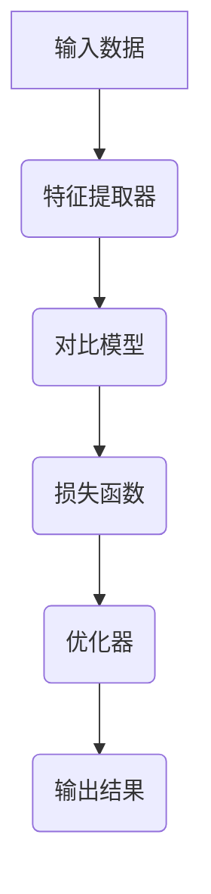

                 

# 《对比学习：无监督预训练的软件2.0利器》

> 关键词：对比学习，无监督预训练，软件2.0，人工智能

> 摘要：本文探讨了对比学习这一无监督预训练技术的核心概念、原理以及其在软件2.0时代的重要性。文章首先阐述了对比学习的基础知识，包括其定义、核心概念及其与无监督预训练的关系。接着，通过Mermaid流程图、伪代码和数学模型详细解析了对比学习算法的原理和架构。随后，文章展示了对比学习在图像识别、自然语言处理、推荐系统等领域的应用案例，并探讨了其在软件2.0时代的应用前景和挑战。最后，文章提供了相关的工具和资源，以供读者进一步学习和实践。

## 第一部分：对比学习基础

### 第1章：对比学习的原理与核心概念

#### 1.1.1 对比学习的定义

对比学习（Contrastive Learning）是一种无监督学习的方法，其主要思想是通过学习数据的相似性和差异性来提高模型的泛化能力。在对比学习中，模型被训练来区分数据的正样本和负样本，从而在无监督的环境下学习数据的特征表示。

#### 1.1.2 对比学习的核心概念

1. **正样本（Positive Sample）**：指两个数据实例具有相似特征。
2. **负样本（Negative Sample）**：指两个数据实例具有不同特征。
3. **特征提取器（Feature Extractor）**：用于提取输入数据的特征表示。
4. **对比模型（Contrastive Model）**：通过对比正样本和负样本的特征表示来训练。
5. **损失函数（Loss Function）**：用于衡量模型对正负样本的区分能力。
6. **优化器（Optimizer）**：用于调整模型参数以最小化损失函数。

#### 1.1.3 对比学习与无监督预训练的关系

对比学习是一种无监督预训练技术，它不需要标签数据就可以学习有用的特征表示。无监督预训练可以帮助模型在更广泛的应用场景中泛化，从而提高模型的性能。

### 1.2 对比学习的 Mermaid 流程图



### 1.3 对比学习在软件2.0中的应用前景

随着软件2.0时代的到来，数据驱动的应用场景日益增多，对比学习作为一种无监督预训练技术，将在以下领域发挥重要作用：

1. **自然语言处理（NLP）**：通过对比学习，可以更好地理解和生成自然语言。
2. **计算机视觉（CV）**：对比学习可以提高图像识别和图像分割的性能。
3. **推荐系统（RS）**：对比学习可以提升推荐算法的准确性。
4. **新兴领域**：对比学习有望在医疗、金融、教育等新兴领域得到广泛应用。

## 第2章：对比学习的核心算法原理

### 2.1.1 对比学习算法的基本架构

对比学习算法的基本架构包括以下几个部分：

1. **数据输入**：输入数据可以是图像、文本或任何形式的数据。
2. **特征提取器**：用于提取输入数据的特征表示。
3. **对比模型**：通过对比正负样本的特征表示来训练。
4. **损失函数**：用于衡量模型对正负样本的区分能力。
5. **优化器**：用于调整模型参数以最小化损失函数。

### 2.1.2 深度神经网络在对比学习中的应用

深度神经网络（DNN）在对比学习中有广泛的应用。DNN可以用于特征提取、对比模型和损失函数的计算。通过深度学习，模型可以学习到更加复杂的特征表示，从而提高对比学习的性能。

### 2.2 对比学习算法的伪代码

```python
# 初始化模型参数
model = initialize_model()

# 训练模型
for epoch in range(num_epochs):
    for data in dataset:
        # 提取特征
        feature_a = model.extract_features(data_a)
        feature_b = model.extract_features(data_b)
        
        # 计算对比损失
        loss = contrastive_loss(feature_a, feature_b)
        
        # 反向传播
        optimizer.zero_grad()
        loss.backward()
        optimizer.step()

# 评估模型
evaluate(model, validation_dataset)
```

### 2.3 对比学习算法的数学模型和公式

对比学习的核心数学模型可以表示为：

$$
\begin{aligned}
\text{对比损失} &= -\sum_{i} \sum_{j\neq i} \log \frac{e^{sim(i, j)}}{Z} \\
\text{其中，} sim(i, j) &= \frac{e^{cosine\_similarity(feature\_i, feature\_j)}}{\sum_{k\neq i} e^{cosine\_similarity(feature\_i, feature\_k)}} \\
Z &= \sum_{i} \sum_{j\neq i} e^{cosine\_similarity(feature\_i, feature\_j)}
\end{aligned}
$$

这里的`cosine_similarity`表示两个特征向量之间的余弦相似度。

### 2.4 对比学习算法的实际应用案例

#### 2.4.1 图像识别

对比学习在图像识别中有着广泛的应用。通过对比学习，模型可以学习到图像中不同类别的特征差异，从而提高图像识别的准确率。

#### 2.4.2 自然语言处理

对比学习在自然语言处理中也有着重要的应用。通过对比学习，模型可以学习到不同文本之间的相似性和差异性，从而提高文本分类和机器翻译的性能。

#### 2.4.3 推荐系统

对比学习在推荐系统中可以用于生成用户和物品之间的特征表示，从而提高推荐算法的准确性。

## 第3章：对比学习算法的优化与扩展

### 3.1.1 对比学习算法的优化方法

对比学习算法的优化方法包括：

1. **温度调整（Temperature Scaling）**：通过调整温度参数，可以控制模型对正负样本的区分力度。
2. **负样本选择（Negative Sampling）**：选择合适的负样本可以显著提高对比学习的性能。
3. **数据增强（Data Augmentation）**：通过数据增强，可以增加训练数据的多样性，从而提高模型的泛化能力。

### 3.1.2 对比学习算法的扩展应用

对比学习算法可以扩展应用到多个领域：

1. **医疗**：对比学习可以用于医疗图像的识别和诊断。
2. **金融**：对比学习可以用于金融数据的分析和预测。
3. **教育**：对比学习可以用于教育数据分析和学习效果评估。

### 3.2 对比学习在软件2.0时代的应用挑战与机遇

在软件2.0时代，对比学习面临着以下挑战和机遇：

1. **挑战**：如何设计更加有效的对比学习算法，以应对不同领域的数据和任务需求。
2. **机遇**：对比学习在新兴领域的应用前景广阔，有望推动软件技术的进步。

## 第二部分：对比学习在软件2.0中的应用

### 第4章：对比学习在自然语言处理中的应用

#### 4.1.1 语言模型与对比学习

对比学习在自然语言处理中可以用于语言模型的学习和优化。通过对比学习，模型可以更好地理解和生成自然语言。

#### 4.1.2 对比学习在文本分类中的应用

对比学习可以提高文本分类的准确率。通过对比学习，模型可以学习到不同类别文本的特征差异，从而提高分类性能。

#### 4.1.3 对比学习在机器翻译中的应用

对比学习可以用于机器翻译的优化。通过对比学习，模型可以更好地理解和生成不同语言的语义信息。

### 第5章：对比学习在计算机视觉中的应用

#### 5.1.1 图像识别与对比学习

对比学习在图像识别中有着广泛的应用。通过对比学习，模型可以学习到图像中不同类别的特征差异，从而提高图像识别的准确率。

#### 5.1.2 对比学习在图像分割中的应用

对比学习可以提高图像分割的性能。通过对比学习，模型可以学习到图像中不同区域的特征差异，从而提高分割的精度。

#### 5.1.3 对比学习在视频分析中的应用

对比学习可以用于视频分析，如目标检测和动作识别。通过对比学习，模型可以学习到视频序列中不同目标的行为特征。

### 第6章：对比学习在推荐系统中的应用

#### 6.1.1 对比学习在推荐算法中的核心作用

对比学习在推荐系统中可以用于生成用户和物品之间的特征表示，从而提高推荐算法的准确性。

#### 6.1.2 对比学习在推荐系统中的应用案例

对比学习在推荐系统中有着广泛的应用，如个性化推荐、商品推荐等。通过对比学习，模型可以更好地理解和生成用户偏好。

#### 6.1.3 对比学习在推荐系统中的挑战与解决方案

对比学习在推荐系统中面临着如何选择合适的负样本、如何设计有效的损失函数等挑战。通过优化算法和改进数据预处理方法，可以解决这些挑战。

### 第7章：对比学习在软件2.0时代的应用前景

#### 7.1 对比学习在新兴领域的应用探索

对比学习在新兴领域如医疗、金融、教育等有着广阔的应用前景。通过对比学习，可以更好地理解和解决这些领域的实际问题。

#### 7.2 对比学习算法在软件2.0中的发展展望

随着对比学习技术的不断进步，其在软件2.0中的应用将越来越广泛。未来，对比学习有望在更多领域实现突破，推动软件技术的进步。

### 7.3 对比学习算法的未来发展趋势

对比学习算法的未来发展趋势包括：

1. **算法优化**：通过改进算法结构，提高对比学习的性能。
2. **多模态学习**：将对比学习应用于多模态数据，如图像和文本的联合学习。
3. **跨领域应用**：探索对比学习在不同领域的应用，推动跨领域技术的发展。

## 附录

### 附录A：对比学习相关工具与资源

#### A.1 对比学习算法主流框架对比

- TensorFlow
- PyTorch
- Keras

#### A.2 对比学习算法的开源实现

- Hugging Face
- Facebook AI Research
- Google Research

#### A.3 对比学习算法的学习资源

- 《对比学习：理论与实践》
- 《对比学习算法在计算机视觉中的应用》
- 《对比学习：自然语言处理中的新趋势》

### 作者

作者：AI天才研究院/AI Genius Institute & 禅与计算机程序设计艺术 /Zen And The Art of Computer Programming

