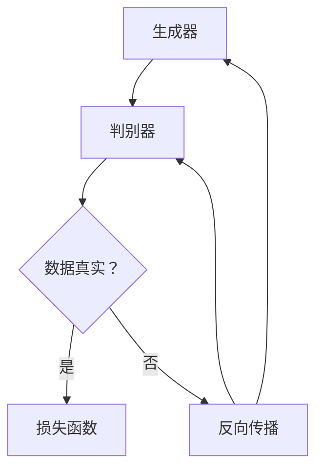
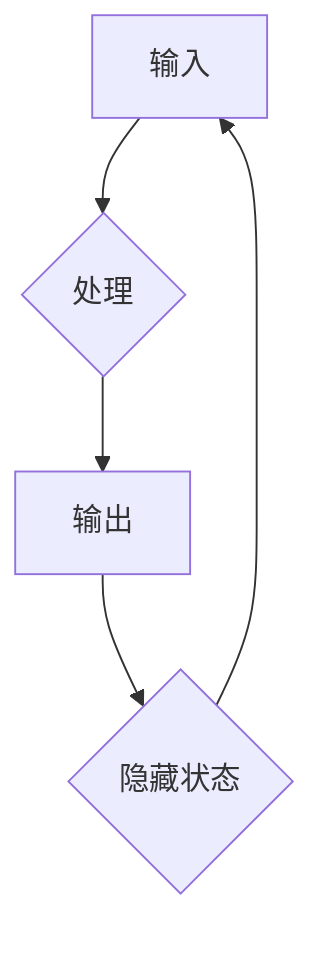
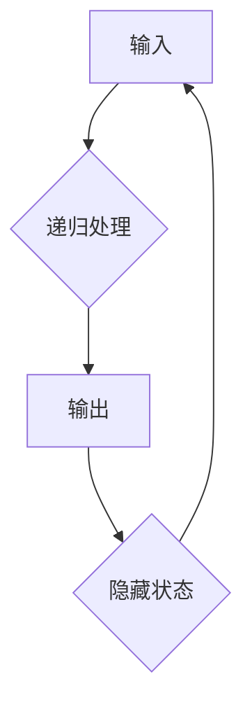
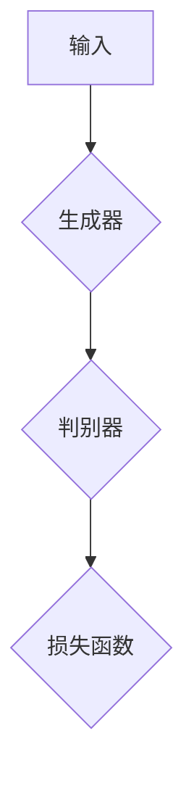
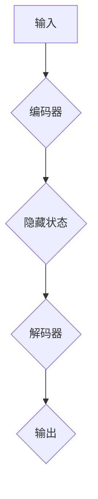
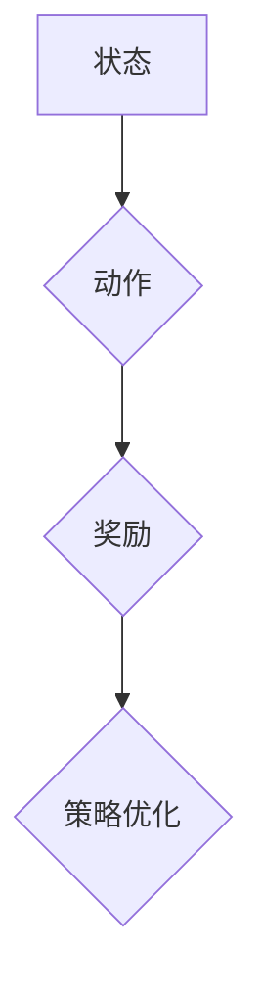
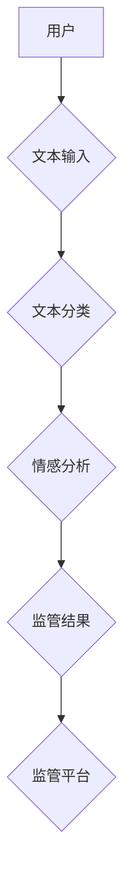

                 

# 《小说生成与内容监管》

> 关键词：小说生成、文本生成模型、内容监管、GAN、RNN、强化学习

> 摘要：本文深入探讨了小说生成与内容监管技术，分析了文本生成模型的基础知识、核心算法原理，以及GAN、RNN、强化学习在小说生成和内容监管中的应用。通过实际案例，本文展示了如何搭建基于GAN的小说生成系统、实现基于RNN的小说生成系统、以及基于强化学习的小说创作策略优化，并对文本内容监管系统进行了开发探讨。最后，展望了小说生成与内容监管技术的未来发展趋势及行业应用前景。

## 第一部分：小说创作技术基础

### 第1章：小说创作基础

#### 1.1.1 小说创作的定义与分类

小说创作是指通过虚构故事、塑造人物、构建情节等方式，创作出具有一定文学价值、艺术风格和独特个性的文学作品。根据创作风格和主题的不同，小说可以大致分为以下几类：

1. **现实主义小说**：以真实生活为背景，通过对社会现实的深入剖析，揭示社会矛盾和人物命运。
2. **浪漫主义小说**：强调个性、情感和想象，以追求自由、平等和理想为主题。
3. **科幻小说**：以科学技术的发展为背景，通过对未来世界的想象和探索，展现人类的智慧和创造力。
4. **悬疑小说**：以悬疑、惊悚、推理等元素为主，通过复杂的故事情节和紧张的氛围，引发读者的好奇心和阅读兴趣。
5. **历史小说**：以历史事件或历史人物为背景，通过虚构的情节和对话，展现历史的变迁和人物的性格。

#### 1.1.2 小说创作的基本要素

小说创作的基本要素包括：

1. **人物**：人物是小说的核心，包括主人公、配角和反派等。人物形象的塑造要鲜明、立体，具有独特的性格和命运。
2. **情节**：情节是小说发展的主线，包括开端、发展、高潮和结局。情节要紧凑、合理，引人入胜。
3. **主题**：主题是小说的核心思想，是对生活、人性、社会等方面的思考和反映。
4. **环境**：环境是小说的背景，包括自然环境和人文环境。环境要贴合故事情节，为人物提供合理的舞台。
5. **语言**：语言是小说的外衣，包括文字、对话、描写等。语言要生动、形象、富有感染力。

#### 1.1.3 创作环境的准备

创作环境的准备主要包括：

1. **工具**：选择合适的写作工具，如文字处理软件、写作平台等，可以提高写作效率。
2. **素材**：收集和整理与创作主题相关的素材，如人物原型、故事背景、历史资料等，为创作提供素材支持。
3. **阅读**：广泛阅读各类小说，了解不同风格和技巧，提高自己的写作水平。

### 第2章：文本生成模型简介

#### 2.1.1 自然语言处理基础

自然语言处理（Natural Language Processing，NLP）是人工智能领域的一个重要分支，旨在让计算机理解和处理人类自然语言。NLP的基本概念包括：

1. **文本**：文本是自然语言的书面形式，包括字母、单词、句子等。
2. **词汇**：词汇是语言的基本元素，包括单词和短语。
3. **语法**：语法是语言的组织规则，包括词法、句法和语义。
4. **语义**：语义是语言的表达意义，包括字面意义和引申意义。

#### 2.1.2 常见文本生成模型介绍

常见的文本生成模型包括：

1. **循环神经网络（RNN）**：RNN是一种能够处理序列数据的神经网络，具有记忆功能，可以捕捉序列中的依赖关系。
2. **长短时记忆网络（LSTM）**：LSTM是RNN的一种变体，能够解决RNN的梯度消失和梯度爆炸问题，更好地处理长序列数据。
3. **生成对抗网络（GAN）**：GAN是一种无监督学习模型，由生成器和判别器组成，生成器和判别器相互博弈，生成逼真的数据。
4. **变分自编码器（VAE）**：VAE是一种基于概率模型的生成模型，通过编码器和解码器生成数据。

#### 2.1.3 文本生成模型的工作原理

文本生成模型的工作原理主要包括：

1. **输入**：输入是一段文本序列，可以是单词、字符或子词。
2. **编码**：编码器将输入文本序列编码为一个低维的向量表示。
3. **生成**：生成器根据编码后的向量生成新的文本序列。
4. **解码**：解码器将生成的文本序列解码为可读的文本。

### 第3章：生成对抗网络（GAN）在小说创作中的应用

#### 3.1.1 GAN的基本概念与架构

生成对抗网络（Generative Adversarial Network，GAN）由生成器（Generator）和判别器（Discriminator）两部分组成。生成器的任务是生成逼真的数据，判别器的任务是区分生成的数据和真实数据。两者相互博弈，生成器不断优化，判别器不断提高，最终生成器生成出高质量的数据。

GAN的架构可以表示为：

#### 3.1.2 GAN在小说生成中的优势与挑战

GAN在小说生成中的优势包括：

1. **生成高质量文本**：GAN能够生成高质量的文本，具有较强的文本生成能力。
2. **无监督学习**：GAN不需要大量的标注数据，可以无监督地进行学习。

GAN在小说生成中的挑战包括：

1. **模式崩溃（Mode Collapse）**：生成器可能只生成一些特定的模式，导致多样性不足。
2. **训练难度**：GAN的训练过程不稳定，容易出现梯度消失和梯度爆炸等问题。

#### 3.1.3 GAN在小说创作中的应用实例

GAN在小说创作中的应用实例包括：

1. **小说续写**：利用GAN生成续写小说的情节和对话，为作者提供创作灵感。
2. **角色塑造**：利用GAN生成具有特定性格和命运的角色，丰富小说的人物形象。

### 第4章：递归神经网络与循环神经网络在小说生成中的应用

#### 4.1.1 递归神经网络的基本原理

递归神经网络（Recurrent Neural Network，RNN）是一种能够处理序列数据的神经网络，具有记忆功能。RNN的基本原理可以表示为：

#### 4.1.2 循环神经网络的工作机制

循环神经网络（Recursive Neural Network，RNN）是RNN的一种变体，通过递归结构来处理序列数据。RNN的基本原理可以表示为：

#### 4.1.3 RNN在小说生成中的实际应用

RNN在小说生成中的实际应用包括：

1. **情节生成**：利用RNN生成小说的情节，为作者提供创作素材。
2. **角色对话生成**：利用RNN生成小说中的人物对话，增加小说的生动性。

### 第5章：强化学习在小说创作中的应用

#### 5.1.1 强化学习的基本概念

强化学习（Reinforcement Learning，RL）是一种通过奖励信号来指导学习过程的人工智能方法。强化学习的基本概念包括：

1. **状态（State）**：环境当前的状态。
2. **动作（Action）**：智能体可以执行的动作。
3. **奖励（Reward）**：动作执行后获得的奖励信号，用于指导学习过程。
4. **策略（Policy）**：智能体根据当前状态选择动作的规则。

#### 5.1.2 强化学习在小说生成中的策略优化

强化学习在小说生成中的应用包括：

1. **情节生成**：通过强化学习生成小说的情节，使情节更加吸引人。
2. **角色塑造**：通过强化学习生成具有特定性格和命运的角色。

#### 5.1.3 强化学习在小说创作中的案例分析

强化学习在小说创作中的应用案例包括：

1. **自动续写小说**：利用强化学习生成小说的续写，为用户提供更多样化的阅读体验。
2. **创意角色塑造**：利用强化学习生成具有独特性格和命运的角色，丰富小说的文学价值。

### 第6章：小说生成模型优化与评估

#### 6.1.1 小说生成模型的优化方法

小说生成模型的优化方法包括：

1. **损失函数优化**：通过调整损失函数，优化生成模型的性能。
2. **正则化**：通过引入正则化项，防止过拟合。
3. **数据增强**：通过数据增强，提高模型的泛化能力。

#### 6.1.2 小说生成模型的评估标准

小说生成模型的评估标准包括：

1. **文本质量**：通过文本质量指标，如BLEU、ROUGE等，评估生成文本的质量。
2. **连贯性**：通过评估生成文本的连贯性，判断故事情节是否合理。
3. **创造性**：通过评估生成文本的创造性，判断模型是否能够生成新颖的情节和角色。

#### 6.1.3 实际应用中的优化策略

实际应用中的优化策略包括：

1. **多模型融合**：通过融合不同的生成模型，提高生成文本的质量。
2. **自适应学习率**：通过自适应学习率，提高模型的训练效果。
3. **注意力机制**：通过引入注意力机制，提高模型对重要信息的关注。

### 第7章：文本内容监管技术

#### 7.1.1 文本内容监管的意义

文本内容监管的意义包括：

1. **保护用户权益**：通过监管，防止不良内容对用户产生负面影响。
2. **维护社会秩序**：通过监管，维护社会秩序和道德底线。
3. **促进产业发展**：通过监管，推动文学、娱乐等产业的健康发展。

#### 7.1.2 文本分类与情感分析技术

文本分类与情感分析技术包括：

1. **文本分类**：通过对文本进行分类，识别和标记文本的主题和情感。
2. **情感分析**：通过对文本的情感进行分析，判断文本的情感倾向和强度。

#### 7.1.3 自动化内容监管系统

自动化内容监管系统包括：

1. **监管算法**：通过算法对文本进行分类和情感分析，实现自动监管。
2. **监管平台**：通过监管平台，实现内容的实时监管和举报处理。
3. **用户反馈**：通过用户反馈，不断优化监管算法和监管策略。

## 第二部分：小说生成与内容监管实战

### 第8章：实战：基于GAN的小说生成系统搭建

#### 8.1.1 实战环境准备

搭建基于GAN的小说生成系统需要以下环境准备：

1. **硬件环境**：一台具有较高计算能力的计算机或服务器。
2. **软件环境**：安装Python、TensorFlow或PyTorch等深度学习框架。

#### 8.1.2 GAN模型架构设计

基于GAN的小说生成系统架构设计包括：

1. **生成器**：生成小说的情节和对话。
2. **判别器**：判断生成的文本是否真实。

GAN模型的具体架构可以表示为：

#### 8.1.3 模型训练与优化

模型训练与优化包括：

1. **数据准备**：准备用于训练的文本数据集。
2. **模型训练**：通过训练，优化生成器和判别器的参数。
3. **模型评估**：通过评估，判断模型的生成效果。

### 第9章：实战：基于RNN的小说生成系统实现

#### 9.1.1 RNN模型设计

基于RNN的小说生成系统设计包括：

1. **编码器**：将输入文本编码为向量表示。
2. **解码器**：将编码后的向量解码为输出文本。

RNN模型的具体架构可以表示为：

#### 9.1.2 数据预处理

数据预处理包括：

1. **文本清洗**：去除文本中的特殊字符、停用词等。
2. **词向量表示**：将文本转换为词向量表示。

#### 9.1.3 模型训练与评估

模型训练与评估包括：

1. **模型训练**：通过训练，优化编码器和解码器的参数。
2. **模型评估**：通过评估，判断模型的生成效果。

### 第10章：实战：基于强化学习的小说创作策略优化

#### 10.1.1 强化学习策略设计

基于强化学习的小说创作策略优化包括：

1. **状态表示**：将小说的情节、角色等要素表示为状态。
2. **动作表示**：将小说的情节变化、角色行为等表示为动作。

强化学习策略的具体架构可以表示为：

#### 10.1.2 实验设计与实现

实验设计与实现包括：

1. **实验设计**：设计实验，包括状态、动作、奖励等。
2. **实验实现**：通过实现，训练和评估强化学习策略。

#### 10.1.3 评估与结果分析

评估与结果分析包括：

1. **评估指标**：评估生成文本的质量、连贯性、创造性等。
2. **结果分析**：分析实验结果，优化强化学习策略。

### 第11章：实战：文本内容监管系统开发

#### 11.1.1 系统架构设计

文本内容监管系统设计包括：

1. **监管算法**：实现文本分类和情感分析算法。
2. **监管平台**：实现监管系统的用户界面和后台逻辑。

系统架构的具体设计可以表示为：

#### 11.1.2 文本分类与情感分析实现

文本分类与情感分析实现包括：

1. **文本分类**：使用机器学习算法对文本进行分类。
2. **情感分析**：使用情感分析算法对文本的情感进行识别。

#### 11.1.3 系统部署与测试

系统部署与测试包括：

1. **系统部署**：将监管系统部署到服务器或云平台。
2. **系统测试**：对监管系统进行功能测试和性能测试。

## 第三部分：未来展望与拓展

### 第12章：小说生成与内容监管技术的未来发展趋势

#### 12.1.1 新技术在小说生成中的应用

未来，新技术在小说生成中的应用前景包括：

1. **生成对抗网络（GAN）**：GAN在小说生成中的应用将更加广泛，生成质量更高的文本。
2. **变分自编码器（VAE）**：VAE在小说生成中的应用将逐步成熟，生成具有多样性的文本。
3. **强化学习**：强化学习在小说生成中的应用将得到更多探索，提高文本的创造性和连贯性。

#### 12.1.2 内容监管技术的发展方向

未来，内容监管技术的发展方向包括：

1. **人工智能监管**：利用人工智能技术，实现自动化、智能化的内容监管。
2. **区块链技术**：利用区块链技术，实现内容监管的可信和透明。
3. **用户反馈**：结合用户反馈，优化内容监管策略，提高监管效果。

#### 12.1.3 未来可能的融合与创新

未来，小说生成与内容监管技术可能的融合与创新包括：

1. **多模态生成**：将文本生成与图像、音频等其他模态生成相结合，实现更丰富的创作形式。
2. **个性化生成**：结合用户兴趣和喜好，实现个性化小说生成。
3. **交互式生成**：通过用户与生成系统的交互，实现更加灵活、多样化的文本生成。

### 第13章：案例研究与行业应用

#### 13.1.1 国内外小说生成与内容监管案例

国内外小说生成与内容监管的案例包括：

1. **国外案例**：国外一些知名公司和研究机构已经开展小说生成与内容监管的研究，如OpenAI的GPT-3、Google的BERT等。
2. **国内案例**：国内一些公司和平台也在探索小说生成与内容监管技术，如腾讯、字节跳动等。

#### 13.1.2 行业应用场景与前景

小说生成与内容监管在行业中的应用场景与前景包括：

1. **文学创作**：利用小说生成技术，实现自动创作、辅助创作，提高创作效率。
2. **娱乐产业**：利用内容监管技术，实现对电影、电视剧、游戏等内容的监管，提高产业质量。
3. **新闻传媒**：利用内容监管技术，实现对新闻报道的审核，提高新闻的准确性。

#### 13.1.3 挑战与机遇

小说生成与内容监管技术面临的挑战与机遇包括：

1. **挑战**：算法的优化、模型的泛化能力、监管的平衡等。
2. **机遇**：市场的需求、技术的进步、政策的支持等。

### 第14章：总结与展望

#### 14.1.1 全书内容回顾

全书回顾了小说生成与内容监管技术的基础知识、核心算法原理、实际应用以及未来发展趋势。主要内容包括：

1. **小说创作基础**：介绍了小说创作的定义与分类、基本要素和创作环境的准备。
2. **文本生成模型**：介绍了自然语言处理基础、常见文本生成模型和工作原理。
3. **GAN在小说生成中的应用**：分析了GAN的基本概念、优势与挑战和应用实例。
4. **RNN在小说生成中的应用**：介绍了RNN的基本原理和工作机制。
5. **强化学习在小说创作中的应用**：探讨了强化学习的基本概念、策略优化和案例分析。
6. **小说生成模型优化与评估**：介绍了小说生成模型的优化方法和评估标准。
7. **文本内容监管技术**：分析了文本内容监管的意义、技术原理和系统设计。

#### 14.1.2 成果与贡献

本书的主要成果和贡献包括：

1. **系统性介绍**：全面系统地介绍了小说生成与内容监管技术的各个方面，为读者提供了系统的学习资料。
2. **深入分析**：对核心算法原理进行了深入分析，帮助读者理解技术本质。
3. **实战案例**：通过实战案例，展示了如何实现小说生成与内容监管系统，为读者提供了实践指导。
4. **展望未来**：对技术未来发展趋势进行了展望，为读者提供了研究方向。

#### 14.1.3 未来研究方向

未来，小说生成与内容监管技术的研究方向包括：

1. **算法优化**：深入研究算法，提高生成质量和监管效果。
2. **多模态融合**：探索文本、图像、音频等多模态数据的融合，实现更丰富的创作形式。
3. **个性化生成**：结合用户兴趣和喜好，实现个性化小说生成。
4. **社会影响**：研究技术对社会的影响，探讨伦理和法律问题。

