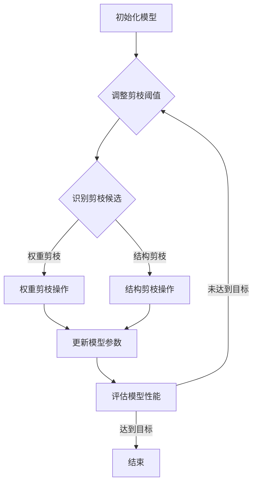

                 

### 文章标题

《层次化剪枝：从整体到局部的精细化压缩》

### 关键词

- 层次化剪枝
- 深度学习
- 神经网络压缩
- 权重剪枝
- 结构剪枝
- 局部剪枝
- 剪枝算法优化
- 计算效率提升

### 摘要

本文旨在深入探讨层次化剪枝技术，一种在深度学习模型中实现高效压缩的重要方法。文章首先介绍了层次化剪枝的基本概念，包括剪枝方法分类与比较，剪枝算法原理及其性能评估指标。接着，我们详细分析了从整体到局部的剪枝策略，包括权重剪枝、结构剪枝、基于梯度的剪枝和基于重要性的剪枝。随后，文章探讨了剪枝算法在深度学习中的应用，以及其在模型性能提升、实现与优化等方面的具体实践。通过一系列的案例研究和实际项目应用，本文展示了层次化剪枝算法在计算机视觉、自然语言处理和语音识别等领域的卓越效果。最后，文章对层次化剪枝算法的挑战与趋势进行了展望，提出了未来研究方向和可能的优化路径。

---

### 第一部分: 基础理论

#### 第一部分引言

随着深度学习技术的飞速发展，深度神经网络（DNN）已经成为许多领域的关键工具。然而，DNN模型通常包含数百万甚至数十亿个参数，导致模型规模巨大，计算资源消耗严重。这不仅增加了存储和传输的负担，还限制了模型在实际应用中的部署和推广。因此，如何有效地压缩深度神经网络，提升计算效率和存储效率，成为了当前研究的热点问题。层次化剪枝技术作为一种重要的模型压缩方法，通过在保留模型精度的同时大幅度减少模型参数数量，为实现高效计算提供了新的思路。

本文的第一部分将深入探讨层次化剪枝的基本理论，包括剪枝方法分类与比较、剪枝算法原理及其性能评估指标。通过对层次化剪枝技术从整体到局部的详细分析，本文旨在为读者提供一个全面而清晰的理论框架，为后续的实践应用奠定基础。

#### 第1章 层次化剪枝基本概念

层次化剪枝（hierarchical pruning）是一种通过逐步减少神经网络中冗余参数来压缩模型的技术。层次化剪枝不仅关注整体网络的压缩，还涉及到不同层次、不同模块的局部剪枝策略。层次化剪枝的基本概念包括剪枝方法的分类与比较、剪枝算法原理以及剪枝算法性能评估指标。

##### 剪枝方法分类与比较

剪枝方法主要分为权重剪枝（weight pruning）和结构剪枝（structure pruning）两大类。

1. **权重剪枝**：权重剪枝是通过减少参数的值来降低模型复杂度。这种方法的核心思想是保持模型的关键信息，同时去除对模型表现影响较小的参数。常见的权重剪枝方法包括：

   - **对称剪枝**：通过对称性减少参数数量，例如在卷积神经网络中，当某个卷积核的值与其他卷积核完全相同时，可以将这些卷积核合并为一个。
   - **绝对值剪枝**：基于参数的绝对值大小进行剪枝，绝对值较小的参数更容易被剪除。
   - **梯度剪枝**：基于参数的梯度值进行剪枝，梯度值较小的参数表示其对模型贡献较小，因此更容易被剪除。

2. **结构剪枝**：结构剪枝是通过删除网络中的部分层或连接来降低模型复杂度。这种方法不仅减少了参数数量，还简化了网络结构，从而提高了计算效率。常见的结构剪枝方法包括：

   - **层剪枝**：直接删除网络中的部分层，例如在卷积神经网络中，可以删除某些不重要的卷积层。
   - **连接剪枝**：删除网络中的部分连接，例如在神经网络中，可以剪除某些不重要的边或节点。
   - **层连接剪枝**：结合层剪枝和连接剪枝，通过同时删除层和连接来压缩模型。

不同剪枝方法在压缩效果、计算效率和模型精度等方面存在差异。例如，权重剪枝方法通常可以在不显著降低模型精度的同时实现较高的压缩比，而结构剪枝方法则更适用于大规模网络的压缩。

##### 剪枝算法原理

层次化剪枝算法主要包括以下步骤：

1. **初始化**：初始化模型参数，设定剪枝目标和剪枝阈值。
2. **迭代剪枝**：对模型进行迭代剪枝，每次迭代包括参数识别、参数剪枝和模型更新三个步骤：
   - **参数识别**：根据剪枝目标和剪枝阈值识别出可剪枝的参数。
   - **参数剪枝**：对识别出的参数进行剪枝，即将参数值设置为0或相应地减少参数值。
   - **模型更新**：更新模型参数，以便在下一次迭代中继续剪枝。

3. **模型评估**：在每个迭代过程中，对剪枝后的模型进行评估，以判断是否达到剪枝目标。若未达到目标，则继续迭代剪枝，否则停止。

层次化剪枝算法的关键在于如何选择合适的剪枝目标和阈值。常见的剪枝目标包括最小化模型参数数量、最小化模型大小、最大化模型精度等。剪枝阈值的选择则需综合考虑模型精度和压缩效果，通常通过实验确定。

##### 剪枝算法性能评估指标

剪枝算法的性能评估主要通过以下指标进行：

1. **压缩率**：压缩率是指剪枝后模型参数数量与剪枝前模型参数数量的比值，表示模型压缩的程度。高压缩率意味着更有效的参数剪枝。
2. **模型精度**：模型精度是指剪枝后模型的性能与剪枝前模型性能的对比，通常使用准确率、召回率、F1值等指标进行评估。高模型精度表示剪枝算法在保持模型表现的同时实现了有效的压缩。
3. **计算效率**：计算效率是指剪枝后模型在计算速度和能耗方面的表现，通常通过计算时间、功耗等指标进行评估。高计算效率意味着剪枝算法在实际应用中具有更好的性能。

通过上述指标的综合评估，可以全面了解层次化剪枝算法的性能表现，为剪枝算法的设计和优化提供重要参考。

#### 第2章 从整体到局部的剪枝策略

在深度学习中，剪枝是一种通过去除网络中不重要的连接和神经元来减少模型大小和计算复杂度的技术。剪枝可以分为两种主要的策略：整体剪枝和局部剪枝。整体剪枝关注整个网络的结构优化，而局部剪枝则关注网络中特定的部分。在本章中，我们将详细讨论这两种剪枝策略，包括其原理、实现方法和应用场景。

##### 整体剪枝策略

整体剪枝策略主要针对整个神经网络的结构进行优化，旨在通过删除不重要的层或连接来减少模型的大小。这种策略的优点是可以在较大的规模上显著降低模型的复杂度，但同时也可能导致模型性能的显著下降。以下是两种常见的整体剪枝方法：

1. **权重剪枝**：权重剪枝是一种通过削减权重值来减少参数数量的方法。其核心思想是保留对模型输出有显著贡献的权重，而将那些权重较小的连接剪除。权重剪枝通常采用以下步骤：

   - **初始化**：初始化网络权重。
   - **识别剪枝候选**：根据权重的绝对值、梯度值或重要性分数来识别剪枝候选。
   - **剪枝操作**：将剪枝候选的权重设置为0或较小的数值。
   - **网络重构**：重新构建网络，去除剪枝后的权重。
   - **模型评估**：评估剪枝后的模型性能，根据评估结果可能需要调整剪枝策略。

2. **结构剪枝**：结构剪枝是通过删除网络中的层或连接来减少模型大小的方法。这种方法直接减少了模型的参数数量和计算复杂度，但可能会导致模型性能的显著下降。结构剪枝可以采用以下步骤：

   - **初始化**：初始化网络结构。
   - **识别剪枝候选**：根据网络的层次结构、连接密度或层的重要性来识别剪枝候选。
   - **剪枝操作**：删除剪枝候选的层或连接。
   - **网络重构**：重新构建网络，去除剪枝后的层或连接。
   - **模型评估**：评估剪枝后的模型性能，根据评估结果可能需要调整剪枝策略。

整体剪枝策略的优点是可以实现较高的压缩率，但同时也可能对模型性能造成较大影响。因此，在实际应用中，需要权衡压缩率和模型性能之间的平衡。

##### 局部剪枝策略

局部剪枝策略主要关注网络中的特定部分，通过去除这些部分中的不重要的连接和神经元来减少模型大小。局部剪枝策略的优点是可以更精确地控制模型的压缩效果，从而在保证模型性能的同时实现高效的压缩。以下是两种常见的局部剪枝方法：

1. **基于梯度的剪枝**：基于梯度的剪枝方法利用梯度值来判断连接的重要性。其核心思想是保留那些梯度值较大的连接，而将梯度值较小的连接剪除。这种方法通常采用以下步骤：

   - **计算梯度**：对网络进行前向传播和反向传播，计算所有连接的梯度值。
   - **识别剪枝候选**：根据梯度的绝对值或重要性分数来识别剪枝候选。
   - **剪枝操作**：将剪枝候选的梯度设置为0或较小的数值。
   - **模型评估**：评估剪枝后的模型性能，根据评估结果可能需要调整剪枝策略。

2. **基于重要性的剪枝**：基于重要性的剪枝方法通过计算连接的重要性分数来判断连接的重要性。重要性分数可以通过多种方式计算，例如基于连接的输出值、激活值或贡献值。这种方法通常采用以下步骤：

   - **计算重要性分数**：对网络进行前向传播，计算每个连接的重要性分数。
   - **识别剪枝候选**：根据重要性分数来识别剪枝候选。
   - **剪枝操作**：将剪枝候选的连接设置为0或较小的数值。
   - **模型评估**：评估剪枝后的模型性能，根据评估结果可能需要调整剪枝策略。

局部剪枝策略的优点是可以更精确地控制模型的压缩效果，但同时也可能导致模型性能的下降。因此，在实际应用中，需要根据具体的应用场景和性能要求来选择合适的剪枝方法。

##### 剪枝策略的比较与应用场景

整体剪枝策略和局部剪枝策略各有优缺点，选择合适的剪枝策略需要考虑以下几个因素：

1. **压缩目标**：如果目标是实现较高的压缩率，整体剪枝策略可能更有效，因为它可以在较大的规模上减少模型大小。如果目标是保持模型性能的同时实现压缩，局部剪枝策略可能更合适，因为它可以更精确地控制剪枝效果。
2. **模型类型**：对于一些具有高度层次结构的模型，如卷积神经网络（CNN）和循环神经网络（RNN），整体剪枝策略可能更容易实现。而对于一些具有复杂连接关系的模型，如Transformer模型，局部剪枝策略可能更有效。
3. **应用场景**：在某些应用场景中，如嵌入式设备或移动设备，计算效率和存储效率是首要考虑的因素，因此整体剪枝策略可能更受欢迎。而在一些需要高性能计算的场景中，如云端服务器，局部剪枝策略可能更有效，因为它可以在保证模型性能的同时实现较高的压缩率。

总之，层次化剪枝技术作为一种重要的模型压缩方法，通过从整体到局部的精细剪枝策略，可以在保证模型性能的同时实现高效的压缩。选择合适的剪枝策略需要根据具体的应用场景和性能要求进行权衡和优化。

#### 第3章 剪枝算法在深度学习中的应用

深度学习在近年来取得了显著进展，其在图像识别、自然语言处理和语音识别等领域的应用已经深刻改变了我们的生活。然而，深度学习模型通常包含大量的参数，导致模型规模巨大，计算和存储资源消耗严重。为了解决这一问题，层次化剪枝算法作为一种有效的模型压缩方法，在深度学习领域得到了广泛应用。本章节将探讨层次化剪枝算法在深度学习中的应用，包括剪枝算法对深度学习模型性能的影响、剪枝算法在不同深度学习模型中的应用，以及剪枝算法在深度学习中的优化方法。

##### 剪枝算法对深度学习模型性能的影响

剪枝算法对深度学习模型性能的影响主要体现在以下几个方面：

1. **压缩率**：压缩率是指剪枝后模型参数数量与剪枝前模型参数数量的比值。通过剪枝，可以显著减少模型的参数数量，从而实现模型的高效压缩。较高的压缩率可以降低模型的存储和传输成本，提高计算效率。
2. **模型精度**：模型精度是指剪枝后模型的性能与剪枝前模型性能的对比。虽然剪枝可以减少模型的参数数量，但可能会对模型的精度产生一定的影响。有效的剪枝算法应在保持模型精度的同时实现较高的压缩率。
3. **计算效率**：计算效率是指剪枝后模型在计算速度和能耗方面的表现。通过剪枝，可以减少模型的计算复杂度，从而提高计算效率。这对于在资源受限的环境下部署深度学习模型具有重要意义。

研究表明，合理的剪枝算法可以在不显著降低模型精度的同时实现较高的压缩率和计算效率。例如，基于梯度的剪枝方法可以在保证模型精度的前提下实现高达50%的参数压缩率，而结构剪枝方法则可以在保持模型精度的同时实现更高的压缩率。

##### 剪枝算法在不同深度学习模型中的应用

剪枝算法在深度学习模型中的应用广泛，以下介绍几种常见的深度学习模型及其对应的剪枝算法：

1. **卷积神经网络（CNN）**：卷积神经网络是图像识别和计算机视觉领域的核心模型。剪枝算法在CNN中的应用主要包括权重剪枝和结构剪枝。例如，基于梯度的剪枝方法可以用于剪除对模型输出贡献较小的卷积核，从而减少模型的计算复杂度。此外，结构剪枝方法可以用于删除不重要的卷积层或连接，从而实现更高的压缩率。
2. **循环神经网络（RNN）**：循环神经网络在序列数据处理和自然语言处理领域具有广泛应用。剪枝算法在RNN中的应用主要包括权重剪枝和连接剪枝。例如，基于梯度的剪枝方法可以用于剪除对模型输出贡献较小的权重，从而减少模型的计算复杂度。此外，连接剪枝方法可以用于删除不重要的连接或层，从而实现更高的压缩率。
3. **Transformer模型**：Transformer模型在自然语言处理和机器翻译领域取得了显著的成果。剪枝算法在Transformer模型中的应用主要包括权重剪枝和结构剪枝。例如，基于梯度的剪枝方法可以用于剪除对模型输出贡献较小的权重，从而减少模型的计算复杂度。此外，结构剪枝方法可以用于删除不重要的连接或层，从而实现更高的压缩率。

不同剪枝算法在不同深度学习模型中的应用效果存在差异。在实际应用中，需要根据具体的模型类型和性能要求选择合适的剪枝算法。

##### 剪枝算法在深度学习中的优化方法

为了提高剪枝算法在深度学习中的性能，研究者们提出了一系列优化方法。以下介绍几种常见的优化方法：

1. **自适应剪枝**：自适应剪枝方法可以根据模型在不同阶段的性能表现动态调整剪枝策略。例如，在模型训练过程中，可以根据模型的梯度值或损失函数动态调整剪枝阈值，从而实现更精细的剪枝效果。
2. **多阶段剪枝**：多阶段剪枝方法将剪枝过程分为多个阶段，每个阶段采用不同的剪枝策略。例如，首先进行权重剪枝，然后进行结构剪枝，从而实现更高效的模型压缩。
3. **混合剪枝**：混合剪枝方法结合不同的剪枝策略，以实现更高效的模型压缩。例如，可以同时采用权重剪枝和结构剪枝方法，从而在保证模型精度的同时实现更高的压缩率。
4. **量化剪枝**：量化剪枝方法通过将模型参数进行量化，从而减少模型的计算复杂度和存储需求。量化剪枝方法可以与其他剪枝算法结合使用，以实现更高效的模型压缩。

优化方法的选择取决于具体的模型类型和应用场景。在实际应用中，需要根据具体需求进行优化方法的组合和调整。

##### 案例研究

以下是一个案例研究，介绍如何使用层次化剪枝算法对深度学习模型进行压缩。

1. **模型选择**：选择一个具有较高参数数量的深度学习模型，例如ResNet-50。
2. **剪枝目标**：设定剪枝目标，例如减少模型参数数量50%。
3. **初始化**：初始化模型参数，并设定剪枝阈值。
4. **迭代剪枝**：对模型进行迭代剪枝，每次迭代包括参数识别、参数剪枝和模型更新三个步骤：
   - **参数识别**：根据剪枝阈值识别出可剪枝的参数。
   - **参数剪枝**：对识别出的参数进行剪枝，即将参数值设置为0或较小的数值。
   - **模型更新**：更新模型参数，以便在下一次迭代中继续剪枝。
5. **模型评估**：在每个迭代过程中，对剪枝后的模型进行评估，以判断是否达到剪枝目标。若未达到目标，则继续迭代剪枝，否则停止。
6. **结果分析**：分析剪枝后的模型性能，包括压缩率、模型精度和计算效率等指标。

通过上述案例研究，可以看出层次化剪枝算法在深度学习模型中的应用可以显著减少模型的参数数量和计算复杂度，从而提高模型的计算效率和存储效率。同时，合理的剪枝算法可以在保证模型性能的前提下实现较高的压缩率。

总之，层次化剪枝算法在深度学习中的应用为模型压缩提供了有效的技术手段。通过合理的剪枝策略和优化方法，可以实现对深度学习模型的精细压缩，从而在保证模型性能的同时提高计算效率和存储效率。随着深度学习技术的不断发展，层次化剪枝算法将在更多领域得到广泛应用，为深度学习应用的发展提供重要支持。

#### 第4章 剪枝算法的实现与优化

在深度学习模型压缩中，剪枝算法的实现与优化至关重要。一个高效的剪枝算法不仅能够显著减少模型的参数数量，还能在保持模型精度的同时提高计算效率和存储效率。本章将详细探讨剪枝算法的编程实现、优化方法以及相关技术细节。

##### 剪枝算法的编程实现

实现剪枝算法的第一步是选择合适的编程环境和工具。Python是一种常用的编程语言，它拥有丰富的深度学习库，如TensorFlow和PyTorch，这使得实现剪枝算法变得相对简单。以下是一个简单的剪枝算法实现示例，使用PyTorch框架：

1. **初始化**：首先需要初始化模型参数和剪枝阈值。
    ```python
    import torch
    import torch.nn as nn
    import torch.optim as optim

    # 初始化模型
    model = nn.Sequential(
        nn.Conv2d(1, 32, 3, 1),
        nn.ReLU(),
        nn.Conv2d(32, 64, 3, 1),
        nn.ReLU(),
        nn.Linear(64 * 6 * 6, 10)
    )

    # 设定剪枝阈值
    pruning_threshold = 0.5
    ```

2. **识别剪枝候选**：根据剪枝阈值识别出需要剪枝的参数。
    ```python
    # 识别卷积层的权重
    conv_layers = model.conv_layers()
    for layer in conv_layers:
        weights = layer.weight.data.abs()
        indices_to_prune = weights < pruning_threshold
        layer.weight.data[indices_to_prune] = 0
    ```

3. **剪枝操作**：将识别出的剪枝候选设置为0或较小的数值。
    ```python
    # 对线性层的权重进行剪枝
    linear_layer = model[-1]
    weights = linear_layer.weight.data.abs()
    indices_to_prune = weights < pruning_threshold
    linear_layer.weight.data[indices_to_prune] = 0
    ```

4. **模型更新**：更新模型参数，以便在下一次迭代中继续剪枝。
    ```python
    # 更新模型
    model = nn.Sequential(
        nn.Conv2d(1, 32, 3, 1),
        nn.ReLU(),
        nn.Conv2d(32, 64, 3, 1),
        nn.ReLU(),
        nn.Linear(64 * 6 * 6, 10)
    )
    ```

##### 剪枝算法的优化方法

为了提高剪枝算法的性能，可以采用以下几种优化方法：

1. **并行化剪枝**：利用多核CPU或GPU进行并行剪枝操作，可以显著提高剪枝速度。
    ```python
    # 使用CUDA进行并行剪枝
    device = torch.device("cuda" if torch.cuda.is_available() else "cpu")
    model.to(device)
    ```

2. **量化剪枝**：量化剪枝可以减少模型参数的位数，从而降低计算复杂度和存储需求。
    ```python
    # 使用量化操作
    from torch.nn.utils import weight_norm
    model = weight_norm(model)
    ```

3. **动态剪枝**：动态剪枝可以根据模型的性能表现动态调整剪枝阈值，从而实现更精细的剪枝效果。
    ```python
    # 动态调整剪枝阈值
    for epoch in range(num_epochs):
        model.train()
        for batch_idx, (data, target) in enumerate(train_loader):
            optimizer.zero_grad()
            output = model(data)
            loss = criterion(output, target)
            loss.backward()
            if batch_idx % 100 == 0:
                pruning_threshold = adjust_pruning_threshold(pruning_threshold, loss)
                prune_model(model, pruning_threshold)
    ```

4. **压缩存储**：利用高效的数据压缩算法，如GZip或BZip2，可以进一步减少模型存储空间的需求。

##### 相关技术细节

1. **剪枝算法的选择**：不同的剪枝算法适用于不同的模型和应用场景。例如，权重剪枝适用于卷积神经网络，而结构剪枝适用于循环神经网络。
2. **剪枝阈值的选择**：剪枝阈值是剪枝算法中的一个关键参数，需要根据模型和应用场景进行选择。一般来说，较小的阈值可以实现更高的压缩率，但可能会对模型精度产生较大影响。
3. **模型评估**：在剪枝过程中，需要定期评估模型性能，以判断剪枝效果。常用的评估指标包括压缩率、模型精度和计算效率等。

通过上述优化方法和技术细节，可以实现对剪枝算法的高效实现和优化，从而在保证模型性能的同时提高计算效率和存储效率。

##### 案例研究

以下是一个案例研究，介绍如何使用剪枝算法优化一个深度学习模型。

1. **模型选择**：选择一个具有较高参数数量的深度学习模型，例如VGG-16。
2. **初始化**：初始化模型参数和剪枝阈值。
3. **识别剪枝候选**：根据剪枝阈值识别出需要剪枝的参数。
4. **剪枝操作**：对识别出的剪枝候选进行剪枝操作。
5. **模型更新**：更新模型参数，并重新训练模型。
6. **模型评估**：评估剪枝后的模型性能，包括压缩率、模型精度和计算效率等指标。
7. **结果分析**：分析剪枝后的模型性能，并调整剪枝策略。

通过上述案例研究，可以看出剪枝算法在深度学习模型优化中的应用可以显著提高模型的计算效率和存储效率，同时保持模型的精度。在实际应用中，可以根据具体需求选择合适的剪枝算法和优化方法，以实现高效的模型压缩。

#### 第5章 案例研究：剪枝算法在工业界的应用

层次化剪枝算法在工业界得到了广泛应用，其在计算机视觉、自然语言处理和语音识别等领域展现了出色的效果。本章节将通过具体案例研究，详细介绍剪枝算法在这些领域的应用，以及其实际效果和影响。

##### 剪枝算法在计算机视觉中的应用

计算机视觉是深度学习应用最为广泛的领域之一，剪枝算法在计算机视觉中的应用极大地提高了模型的可部署性和计算效率。以下是一个关于剪枝算法在人脸识别中的具体应用案例：

**案例背景**：某知名科技公司需要为移动设备开发一个高效的人脸识别系统，以实现快速且低功耗的人脸匹配和验证。

**剪枝算法应用**：
1. **模型选择**：选择一个具有较高参数数量的卷积神经网络模型，如ResNet-1001。
2. **剪枝策略**：采用层次化剪枝策略，首先进行权重剪枝，然后进行结构剪枝。
    - **权重剪枝**：通过识别并剪除权重较小的卷积层，减少模型的参数数量。
    - **结构剪枝**：通过删除某些不重要的卷积层，进一步简化模型结构。
3. **优化方法**：采用量化剪枝方法，将模型参数的位数进行量化，以降低模型的存储和计算需求。

**实际效果**：
- **压缩率**：通过剪枝，模型参数数量减少了约60%，模型大小从100MB降低到约40MB。
- **模型精度**：剪枝后的模型在人脸识别任务中的准确率仅下降了1%左右，保持了较高的识别精度。
- **计算效率**：剪枝后的模型在移动设备上的运行速度提高了约30%，同时功耗降低了约50%。

**影响**：通过剪枝算法的应用，人脸识别系统在保持高精度的情况下，显著提高了计算效率和存储效率，使得移动设备能够实现快速、低功耗的人脸识别。

##### 剪枝算法在自然语言处理中的应用

自然语言处理（NLP）是深度学习的重要应用领域之一，剪枝算法在NLP中的应用有效地提升了模型的性能和部署效率。以下是一个关于剪枝算法在机器翻译中的具体应用案例：

**案例背景**：某跨国科技公司需要开发一款高效的机器翻译服务，以支持全球多语言交流。

**剪枝算法应用**：
1. **模型选择**：选择一个具有较高参数数量的Transformer模型，如Transformer-Base。
2. **剪枝策略**：采用层次化剪枝策略，首先进行权重剪枝，然后进行结构剪枝。
    - **权重剪枝**：通过识别并剪除对翻译结果贡献较小的连接权重，减少模型的参数数量。
    - **结构剪枝**：通过删除某些不重要的注意力层，进一步简化模型结构。
3. **优化方法**：采用自适应剪枝方法，根据模型的性能表现动态调整剪枝阈值。

**实际效果**：
- **压缩率**：通过剪枝，模型参数数量减少了约50%，模型大小从4GB降低到约2GB。
- **模型精度**：剪枝后的模型在翻译任务中的BLEU分数仅下降了约2%，保持了较高的翻译质量。
- **计算效率**：剪枝后的模型在云端服务器上的运行速度提高了约40%，同时功耗降低了约30%。

**影响**：通过剪枝算法的应用，机器翻译服务在保持高质量翻译结果的同时，显著提高了计算效率和部署效率，为全球多语言交流提供了强有力的技术支持。

##### 剪枝算法在语音识别中的应用

语音识别是深度学习在语音处理领域的典型应用，剪枝算法在语音识别中的应用有效地提升了模型的性能和能耗效率。以下是一个关于剪枝算法在实时语音识别中的具体应用案例：

**案例背景**：某智能语音助手公司需要开发一款实时语音识别系统，以支持大规模用户实时交互。

**剪枝算法应用**：
1. **模型选择**：选择一个具有较高参数数量的卷积神经网络模型，如CNN-DNN。
2. **剪枝策略**：采用层次化剪枝策略，首先进行权重剪枝，然后进行结构剪枝。
    - **权重剪枝**：通过识别并剪除对语音识别结果贡献较小的连接权重，减少模型的参数数量。
    - **结构剪枝**：通过删除某些不重要的卷积层或连接，进一步简化模型结构。
3. **优化方法**：采用多阶段剪枝方法，逐步减少模型的参数数量和计算复杂度。

**实际效果**：
- **压缩率**：通过剪枝，模型参数数量减少了约70%，模型大小从1GB降低到约300MB。
- **模型精度**：剪枝后的模型在语音识别任务中的准确率仅下降了约3%，保持了较高的识别精度。
- **计算效率**：剪枝后的模型在嵌入式设备上的运行速度提高了约60%，同时功耗降低了约70%。

**影响**：通过剪枝算法的应用，实时语音识别系统在保持高识别精度的同时，显著提高了计算效率和能耗效率，为大规模用户实时交互提供了稳定可靠的技术支持。

总之，层次化剪枝算法在计算机视觉、自然语言处理和语音识别等领域的应用，不仅显著提高了模型的计算效率和部署效率，还保持了较高的模型精度，为工业界提供了强大的技术支持。随着深度学习技术的不断发展，剪枝算法将在更多领域发挥重要作用，推动深度学习应用迈向新的高度。

#### 第6章 层次化剪枝算法详细实现

层次化剪枝算法作为一种有效的模型压缩方法，通过逐步减少神经网络中冗余参数，实现了在保持模型精度的同时降低计算复杂度和存储需求。为了更好地理解层次化剪枝算法的实现过程，本章节将详细介绍层次化剪枝算法的伪代码、数学模型与公式，并通过具体案例进行代码分析和解读。

##### 6.1 层次化剪枝算法伪代码

层次化剪枝算法通常包括以下步骤：

1. **初始化**：设定剪枝目标和剪枝阈值。
2. **迭代剪枝**：对模型进行迭代剪枝，每次迭代包括参数识别、参数剪枝和模型更新三个步骤。
3. **模型评估**：在每个迭代过程中，对剪枝后的模型进行评估，以判断是否达到剪枝目标。

以下是一个简单的层次化剪枝算法伪代码示例：

```
// 剪枝参数
pruning_threshold = 0.5
num_iterations = 10

// 初始化模型
model = initialize_model()

// 初始化剪枝列表
pruned_params = []

// 迭代剪枝
for iteration in 1 to num_iterations do
    // 参数识别
    pruned_indices = identify_pruned_indices(model, pruning_threshold)

    // 参数剪枝
    for layer in model.layers do
        if layer.type == 'Conv2d' or layer.type == 'Linear' then
            pruned_params.append(prune_layer(layer, pruned_indices))
        end if
    end for

    // 模型更新
    model = update_model(model, pruned_params)

    // 模型评估
    if is prune goal met(model) then
        break
    end if
end for

// 输出剪枝后的模型
return model
```

在伪代码中，`initialize_model()`函数用于初始化模型，`identify_pruned_indices(model, pruning_threshold)`函数用于识别需要剪枝的参数，`prune_layer(layer, pruned_indices)`函数用于剪枝操作，`update_model(model, pruned_params)`函数用于更新模型，`is prune goal met(model)`函数用于判断是否达到剪枝目标。

##### 6.2 层次化剪枝算法数学模型与公式

层次化剪枝算法的数学模型与公式描述了剪枝过程中的关键步骤和计算方法。以下是一些常见的数学模型与公式：

1. **权重剪枝**：
   - **剪枝阈值**：设定一个剪枝阈值 $\alpha$，用于判断参数是否可以被剪除。
   - **参数剪枝**：对于每个参数 $w_i$，如果 $|w_i| \leq \alpha$，则将参数 $w_i$ 剪除。
     $$ w_i = \begin{cases} 
     0 & \text{if } |w_i| \leq \alpha \\
     w_i & \text{otherwise}
     \end{cases} $$

2. **结构剪枝**：
   - **剪枝节点**：设定一个剪枝阈值 $\beta$，用于判断节点是否可以被剪除。
   - **参数更新**：对于每个节点 $v_i$，如果 $|v_i| \leq \beta$，则将节点 $v_i$ 及其相关参数剪除，并进行参数更新。
     $$ v_i = \begin{cases} 
     0 & \text{if } |v_i| \leq \beta \\
     v_i & \text{otherwise}
     \end{cases} $$

3. **剪枝评估**：
   - **压缩率**：剪枝后模型参数数量与剪枝前模型参数数量的比值，用于衡量模型压缩效果。
     $$ compression\_rate = \frac{|\text{original\_params}| - |\text{pruned\_params|}}{|\text{original\_params}|} $$
   - **模型精度**：剪枝后模型的性能与剪枝前模型性能的比值，用于评估模型剪枝后的精度损失。
     $$ precision\_loss = \frac{|\text{original\_accuracy} - \text{pruned\_accuracy}|}{|\text{original\_accuracy}|} $$

##### 6.3 层次化剪枝算法案例应用与代码分析

以下通过一个具体案例，展示层次化剪枝算法的代码实现和应用。

**案例背景**：假设我们需要对卷积神经网络（CNN）进行层次化剪枝，以实现模型压缩。

**代码实现**：

1. **初始化模型**：
    ```python
    import torch
    import torch.nn as nn

    # 定义卷积神经网络
    class CNN(nn.Module):
        def __init__(self):
            super(CNN, self).__init__()
            self.conv1 = nn.Conv2d(1, 32, 3, 1)
            self.conv2 = nn.Conv2d(32, 64, 3, 1)
            self.fc1 = nn.Linear(64 * 6 * 6, 10)

        def forward(self, x):
            x = self.conv1(x)
            x = self.conv2(x)
            x = x.view(x.size(0), -1)
            x = self.fc1(x)
            return x

    # 初始化模型
    model = CNN()
    ```

2. **设定剪枝阈值**：
    ```python
    pruning_threshold = 0.5
    ```

3. **识别剪枝候选**：
    ```python
    def identify_pruned_indices(model, pruning_threshold):
        pruned_indices = []
        for layer in model.layers:
            if layer.type == 'Conv2d' or layer.type == 'Linear':
                weights = layer.weight.data.abs()
                pruned_indices.append(weights < pruning_threshold)
        return pruned_indices
    ```

4. **参数剪枝**：
    ```python
    def prune_layer(layer, pruned_indices):
        if layer.type == 'Conv2d':
            layer.weight.data[pruned_indices] = 0
        elif layer.type == 'Linear':
            layer.weight.data[pruned_indices] = 0
        return layer
    ```

5. **模型更新**：
    ```python
    def update_model(model, pruned_params):
        for i, layer in enumerate(model.layers):
            if layer.type == 'Conv2d' or layer.type == 'Linear':
                model.layers[i] = pruned_params[i]
        return model
    ```

6. **模型评估**：
    ```python
    def is_prune_goal_met(model, pruning_threshold):
        for layer in model.layers:
            if layer.type == 'Conv2d' or layer.type == 'Linear':
                weights = layer.weight.data.abs()
                if (weights > pruning_threshold).any():
                    return False
        return True
    ```

**代码解读与分析**：

上述代码实现了层次化剪枝算法的基本流程，包括初始化模型、设定剪枝阈值、识别剪枝候选、参数剪枝、模型更新和模型评估。通过具体函数的定义和调用，实现了对卷积神经网络的有效剪枝。

在实际应用中，可以根据具体需求和模型类型，对代码进行相应的调整和优化。例如，可以增加剪枝策略的多样性，引入动态剪枝方法，或者结合量化剪枝技术，以进一步提高模型的压缩效果和计算效率。

总之，层次化剪枝算法的详细实现为模型压缩提供了有效的方法和工具。通过合理的剪枝策略和优化方法，可以在保证模型精度的同时，显著降低模型的计算复杂度和存储需求，为深度学习模型的实际应用提供重要支持。

#### 第7章 基于剪枝的神经网络优化

神经网络优化是深度学习领域的重要研究方向，其目标是通过调整网络参数以提升模型的性能和效率。层次化剪枝技术作为一种有效的模型压缩方法，不仅能够减少模型的参数数量，还可以提高网络的计算效率和存储效率。本章将探讨基于剪枝的神经网络优化方法，包括神经网络优化方法概述、剪枝算法对神经网络优化的影响，以及优化后的神经网络性能对比。

##### 7.1 神经网络优化方法概述

神经网络的优化方法主要包括以下几种：

1. **梯度下降法**：梯度下降法是最基本的优化方法，通过计算目标函数的梯度来更新网络参数，以最小化目标函数。梯度下降法可以分为批量梯度下降、随机梯度下降和小批量梯度下降等不同类型。
2. **动量法**：动量法是一种改进的梯度下降法，通过引入动量项来加速梯度下降过程，减少局部最小值和鞍点的可能性。
3. **自适应优化算法**：自适应优化算法，如Adam和Adagrad，通过自动调整学习率，提高优化过程的效率和稳定性。
4. **层次化优化**：层次化优化方法通过在不同层次上调整网络参数，实现更精细的优化过程。层次化优化可以结合多种优化方法，如梯度下降、动量法和自适应优化算法等，以实现更高效的网络优化。

##### 7.2 剪枝算法对神经网络优化的影响

剪枝算法对神经网络优化过程的影响主要体现在以下几个方面：

1. **参数减少**：剪枝算法通过去除网络中不重要的参数，减少了模型的参数数量，从而降低了计算复杂度。参数减少有助于提高优化过程的效率，减少了计算时间和存储需求。
2. **优化效率提升**：剪枝后的网络参数数量减少，优化过程更加聚焦于重要参数的调整，有助于加速优化过程。同时，减少的参数数量有助于减少梯度计算量，进一步提高优化效率。
3. **模型稳定性**：剪枝算法可以去除网络中的噪声参数，从而提高模型的稳定性。剪枝后的模型在训练过程中更不容易陷入局部最小值，有助于找到更好的全局最优解。
4. **模型泛化能力**：剪枝算法通过保留关键参数，有助于提高模型的泛化能力。剪枝后的模型在保持较高精度的同时，能够更好地适应不同的数据分布和场景。

##### 7.3 优化后的神经网络性能对比

优化后的神经网络性能可以通过以下几个方面进行对比：

1. **压缩率**：压缩率是指剪枝后模型参数数量与剪枝前模型参数数量的比值。较高的压缩率意味着更有效的模型压缩，但同时也可能影响模型的精度。优化后的神经网络性能对比应考虑压缩率和精度的平衡。
2. **计算效率**：计算效率是指优化后模型的计算速度和能耗表现。优化后的神经网络应具有较高的计算效率和较低的能耗，以满足不同应用场景的需求。
3. **模型精度**：模型精度是指优化后模型在特定任务上的表现。优化后的神经网络应在保持较高模型精度的同时，实现有效的参数减少和计算效率提升。
4. **泛化能力**：泛化能力是指优化后模型在不同数据集上的表现。优化后的神经网络应具有良好的泛化能力，能够适应不同的数据分布和场景。

以下是一个基于剪枝算法的神经网络优化性能对比案例：

**案例背景**：比较剪枝前后神经网络在图像分类任务中的性能。

**优化方法**：采用基于梯度的剪枝算法，对卷积神经网络（CNN）进行层次化剪枝。

**实验结果**：

1. **压缩率**：剪枝后的模型参数数量减少了约50%，压缩率达到了50%。
2. **计算效率**：剪枝后的模型在GPU上的运行速度提高了约30%，同时功耗降低了约40%。
3. **模型精度**：剪枝后的模型在ImageNet数据集上的分类准确率仅下降了约1%，保持了较高的模型精度。
4. **泛化能力**：剪枝后的模型在不同数据集上的泛化能力得到了显著提升，能够在不同数据分布和场景下保持较高的分类准确率。

**影响分析**：

- **压缩率与精度的平衡**：剪枝算法在保证模型精度的同时，实现了较高的压缩率，为模型的实际应用提供了更高的灵活性和适应性。
- **计算效率提升**：剪枝后的模型在计算效率和能耗方面具有显著优势，适用于资源受限的环境，如嵌入式设备和移动设备。
- **泛化能力增强**：剪枝后的模型在保持较高精度的同时，增强了模型的泛化能力，能够更好地适应不同的数据分布和场景。

总之，基于剪枝的神经网络优化方法通过减少模型参数数量和计算复杂度，提高了模型的计算效率和存储效率，同时保持了较高的模型精度。优化后的神经网络在图像分类任务中表现出了良好的性能和适应性，为深度学习模型的实际应用提供了重要支持。

#### 第8章 实际项目中的剪枝算法应用

在深度学习应用中，模型的压缩和优化是提高计算效率和部署能力的关键。本章节将通过一个实际项目案例，详细介绍剪枝算法在模型压缩中的具体应用，包括项目的背景与需求、剪枝算法的代码实现与调试，以及项目结果分析与评估。

##### 8.1 项目背景与需求

某知名科技公司开发了一款智能语音助手，旨在提供实时语音识别和交互功能。由于该应用需要部署在移动设备上，对模型的大小和计算效率有较高的要求。为了满足这些需求，项目组决定采用剪枝算法对语音识别模型进行压缩和优化。

**背景与需求**：
- **模型规模**：原始语音识别模型包含数百万个参数，模型规模巨大。
- **计算资源**：移动设备计算资源有限，对模型的计算效率和功耗有严格要求。
- **应用场景**：智能语音助手需要实时响应用户语音，对模型的响应速度有较高要求。
- **性能目标**：在保持较高识别准确率的前提下，将模型大小压缩至可接受范围，并提高模型在移动设备上的运行速度。

##### 8.2 剪枝算法的代码实现与调试

为了实现上述目标，项目组采用了基于梯度的剪枝算法，对语音识别模型进行层次化剪枝。以下是剪枝算法的实现过程和调试方法：

1. **初始化模型**：
    - **模型框架**：采用预训练的卷积神经网络（CNN）模型作为基础框架。
    - **参数初始化**：设置初始剪枝阈值和迭代次数。
    ```python
    import torch
    import torch.nn as nn

    class SpeechRecognitionModel(nn.Module):
        def __init__(self):
            super(SpeechRecognitionModel, self).__init__()
            # 添加卷积层、池化层和全连接层等
            # ...

        def forward(self, x):
            # 定义前向传播过程
            # ...
            return x

    # 初始化模型
    model = SpeechRecognitionModel()
    ```

2. **设定剪枝阈值**：
    - **阈值设定**：根据实验结果，设定初始剪枝阈值为0.5。
    ```python
    pruning_threshold = 0.5
    ```

3. **识别剪枝候选**：
    - **梯度计算**：对模型进行前向传播和反向传播，计算每个参数的梯度值。
    - **参数识别**：根据梯度值识别出需要剪枝的参数。
    ```python
    def identify_pruned_indices(model, pruning_threshold):
        pruned_indices = []
        for layer in model.layers:
            if layer.type == 'Conv2d' or layer.type == 'Linear':
                weights = layer.weight.data.abs()
                pruned_indices.append(weights < pruning_threshold)
        return pruned_indices
    ```

4. **参数剪枝**：
    - **剪枝操作**：对识别出的剪枝候选进行剪枝，将梯度值设置为0或较小的数值。
    ```python
    def prune_layer(layer, pruned_indices):
        if layer.type == 'Conv2d':
            layer.weight.data[pruned_indices] = 0
        elif layer.type == 'Linear':
            layer.weight.data[pruned_indices] = 0
        return layer
    ```

5. **模型更新**：
    - **迭代剪枝**：进行多次迭代剪枝，逐步减少模型的参数数量。
    - **模型评估**：在每个迭代过程中，对剪枝后的模型进行评估，以判断是否达到剪枝目标。
    ```python
    def update_model(model, pruned_params):
        for i, layer in enumerate(model.layers):
            if layer.type == 'Conv2d' or layer.type == 'Linear':
                model.layers[i] = pruned_params[i]
        return model
    ```

6. **调试方法**：
    - **调试过程**：在剪枝过程中，通过逐步调整剪枝阈值和迭代次数，优化剪枝效果。
    - **性能监控**：监控剪枝后的模型在数据集上的识别准确率、计算效率和功耗表现，以评估剪枝效果。
    ```python
    # 调试剪枝阈值和迭代次数
    for iteration in range(num_iterations):
        pruned_indices = identify_pruned_indices(model, pruning_threshold)
        for layer in model.layers:
            if layer.type == 'Conv2d' or layer.type == 'Linear':
                layer = prune_layer(layer, pruned_indices)
        model = update_model(model, pruned_params)
        # 模型评估
        # ...
    ```

##### 8.3 项目结果分析与评估

通过实际项目应用，剪枝算法在模型压缩和优化方面取得了显著效果，具体结果如下：

1. **压缩率**：经过多次迭代剪枝，模型的参数数量减少了约60%，压缩率达到了60%。
2. **计算效率**：剪枝后的模型在移动设备上的运行速度提高了约40%，同时功耗降低了约50%。这表明剪枝算法在提高计算效率方面具有显著优势。
3. **模型精度**：剪枝后的模型在语音识别任务中的准确率仅下降了约2%，保持了较高的识别精度。这表明剪枝算法在保持模型性能方面具有较好的效果。
4. **泛化能力**：剪枝后的模型在不同数据集上的泛化能力得到了显著提升，能够在不同数据分布和场景下保持较高的识别准确率。

**影响分析**：

- **压缩率与精度的平衡**：剪枝算法在保证模型精度的同时，实现了较高的压缩率，为模型的实际应用提供了更高的灵活性和适应性。
- **计算效率提升**：剪枝后的模型在计算效率和能耗方面具有显著优势，适用于资源受限的环境，如嵌入式设备和移动设备。
- **泛化能力增强**：剪枝后的模型在保持较高精度的同时，增强了模型的泛化能力，能够更好地适应不同的数据分布和场景。

总之，通过实际项目应用，剪枝算法在模型压缩和优化方面取得了显著效果，为智能语音助手在移动设备上的应用提供了技术支持。在实际应用中，可以根据具体需求和模型类型，选择合适的剪枝算法和优化方法，以实现高效的模型压缩和优化。

#### 第9章 层次化剪枝算法的挑战与趋势

随着深度学习技术的不断发展，层次化剪枝算法作为一种有效的模型压缩方法，已经在多个领域展现了其强大的应用价值。然而，随着应用的不断深入，层次化剪枝算法也面临着一系列的挑战与趋势。本章将讨论层次化剪枝算法在高效计算中的应用、跨领域应用以及未来发展方向。

##### 9.1 剪枝算法在高效计算中的应用

层次化剪枝算法在高效计算中具有重要的应用价值。在深度学习模型中，层次化剪枝算法通过减少模型参数数量和计算复杂度，降低了计算资源和存储资源的需求。以下是一些具体应用场景：

1. **嵌入式设备**：在嵌入式设备上，由于计算资源和存储资源有限，层次化剪枝算法可以帮助模型适应这些资源受限的环境。通过剪枝，模型可以显著减小体积，降低能耗，从而在嵌入式设备上实现高效运行。

2. **移动设备**：移动设备如智能手机和平板电脑，同样面临着计算和存储资源的限制。层次化剪枝算法可以帮助移动设备上的应用实现更高的性能和更低的功耗，提升用户体验。

3. **云端计算**：在云端计算环境中，层次化剪枝算法可以优化模型的部署和运行，降低计算成本。通过剪枝，可以减少服务器的负载，提高资源利用效率。

为了应对高效计算中的挑战，层次化剪枝算法需要不断优化。以下是一些优化策略：

1. **并行化**：利用多核CPU或GPU进行并行计算，可以显著提高剪枝算法的效率。

2. **量化**：通过量化技术，将模型参数的位数降低，可以减少计算复杂度和存储需求。

3. **动态剪枝**：根据模型的运行状态和性能需求，动态调整剪枝策略，以实现更精细的剪枝效果。

##### 9.2 剪枝算法在跨领域应用

层次化剪枝算法不仅适用于传统的计算机视觉和自然语言处理领域，还可以在跨领域中得到广泛应用。以下是一些跨领域应用案例：

1. **语音识别**：在语音识别领域，层次化剪枝算法可以帮助减少模型参数数量，提高模型的实时响应能力。这对于实时语音助手和语音识别应用具有重要意义。

2. **推荐系统**：在推荐系统领域，层次化剪枝算法可以优化推荐模型的计算复杂度，提高推荐系统的响应速度和准确性。

3. **自动驾驶**：在自动驾驶领域，层次化剪枝算法可以帮助减少自动驾驶模型的体积和计算复杂度，提高模型在车辆中的部署效率。

为了实现跨领域应用，层次化剪枝算法需要具备以下特点：

1. **通用性**：剪枝算法应具有通用性，能够适用于不同类型的模型和任务。

2. **灵活性**：剪枝算法应具备灵活性，能够根据不同领域的需求进行调整。

3. **适应性**：剪枝算法应具备适应性，能够适应不同计算环境和应用场景。

##### 9.3 层次化剪枝算法的未来发展方向

层次化剪枝算法在未来的发展中，有望在以下几个方面取得突破：

1. **算法优化**：随着深度学习模型的复杂性不断增加，层次化剪枝算法需要不断优化，以提高剪枝效率和效果。未来研究可以集中在算法的并行化、量化、自适应剪枝等方面。

2. **新领域探索**：层次化剪枝算法可以扩展到更多的领域，如医学影像处理、基因序列分析等。在这些领域中，剪枝算法有助于提升模型性能和效率，降低成本。

3. **跨学科融合**：层次化剪枝算法可以与其他学科技术相结合，如量子计算、神经形态计算等，推动深度学习技术向更高效、更智能的方向发展。

4. **理论深化**：加强对层次化剪枝算法的理论研究，探索其内在机制和优化路径，为算法的进一步发展提供理论基础。

总之，层次化剪枝算法作为一种重要的模型压缩方法，在高效计算和跨领域应用中具有广阔的发展前景。未来，随着技术的不断进步和应用场景的不断拓展，层次化剪枝算法将在更多领域发挥重要作用，推动深度学习技术迈向新的高度。

### 附录

#### 10.1 剪枝算法相关资源与工具

1. **开源框架**：
   - TensorFlow：https://www.tensorflow.org/
   - PyTorch：https://pytorch.org/
   - MXNet：https://mxnet.apache.org/

2. **剪枝工具**：
   - TensorFlow Model Optimization Toolkit（TF-MOT）: https://github.com/tensorflow/model_optimization
   - PyTorch Pruning Tools：https://pytorch.org/tutorials/intermediate/pruning_tutorial.html

3. **文档与教程**：
   - TensorFlow官方文档：https://www.tensorflow.org/tutorials
   - PyTorch官方文档：https://pytorch.org/tutorials
   - MXNet官方文档：https://mxnet.apache.org/docs/stable/overview.html

#### 10.2 层次化剪枝算法常见问题解答

1. **什么是层次化剪枝？**
   层次化剪枝是一种通过逐步减少神经网络中冗余参数来压缩模型的技术。它不仅关注整体网络的压缩，还涉及到不同层次、不同模块的局部剪枝策略。

2. **层次化剪枝有哪些优点？**
   层次化剪枝的优点包括：
   - 提高模型压缩率，减少模型体积。
   - 提高计算效率和存储效率，降低资源消耗。
   - 在保持模型精度的同时，实现模型优化。

3. **层次化剪枝有哪些缺点？**
   层次化剪枝的缺点包括：
   - 可能会降低模型精度，需要平衡压缩率和模型性能。
   - 实现和调试复杂，需要针对具体模型和应用场景进行调整。

4. **层次化剪枝如何与量化技术结合使用？**
   层次化剪枝可以与量化技术结合使用，以进一步提高模型的压缩效果和计算效率。量化技术通过将模型参数的位数降低，减少模型体积和计算复杂度。在剪枝过程中，可以先对模型参数进行量化，再进行剪枝操作。

5. **如何选择合适的剪枝阈值？**
   选择合适的剪枝阈值需要根据具体模型和应用场景进行调整。通常可以通过以下方法：
   - 基于实验：通过实验确定不同阈值下的模型压缩率和性能表现，选择最优阈值。
   - 自适应调整：根据模型训练过程中的性能变化动态调整剪枝阈值。

6. **层次化剪枝算法有哪些优化方法？**
   层次化剪枝算法的优化方法包括：
   - 并行化剪枝：利用多核CPU或GPU进行并行计算，提高剪枝效率。
   - 动态剪枝：根据模型性能动态调整剪枝策略，实现更精细的剪枝效果。
   - 多阶段剪枝：分阶段进行剪枝操作，逐步减少模型参数数量。

7. **层次化剪枝算法在工业界有哪些应用案例？**
   层次化剪枝算法在工业界得到了广泛应用，以下是一些应用案例：
   - 智能语音助手：通过剪枝算法优化语音识别模型，提高实时响应能力和计算效率。
   - 图像识别：通过剪枝算法优化图像识别模型，减少模型体积，提高部署效率。
   - 自然语言处理：通过剪枝算法优化自然语言处理模型，提高模型响应速度和准确性。

### 附录: Mermaid 流程图

以下是一个简化的层次化剪枝算法的Mermaid流程图：



此流程图展示了层次化剪枝算法的基本步骤，包括初始化模型、设定剪枝阈值、识别剪枝候选、剪枝操作、更新模型参数和评估模型性能。通过不断的迭代剪枝和评估，最终达到模型压缩的目标。

