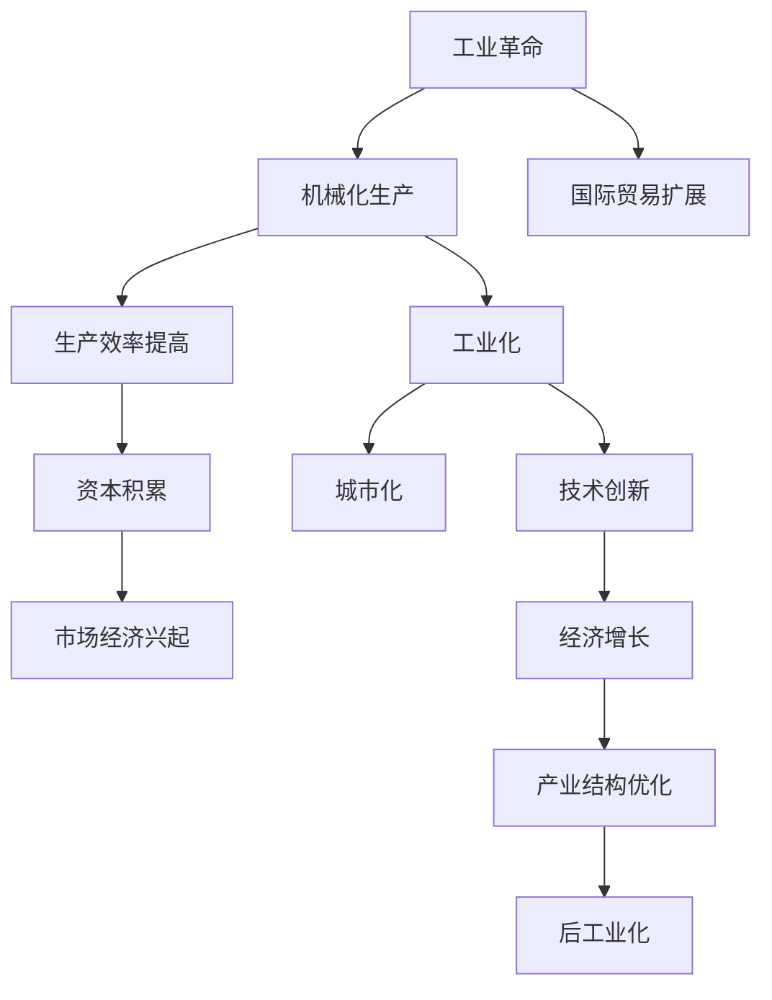
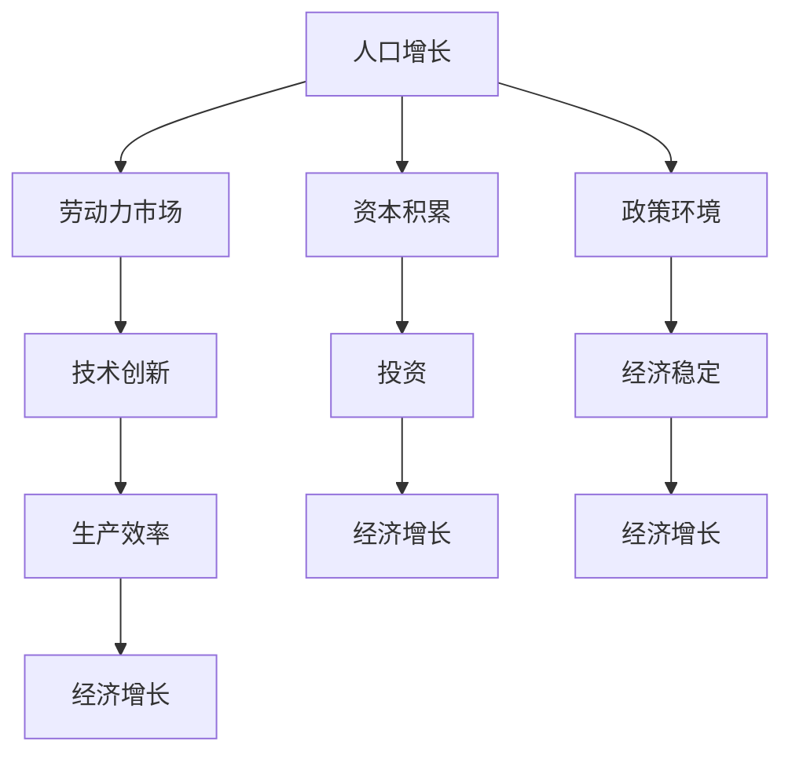

                 

### 工业革命后的经济爆发期

关键词：工业革命、经济演变、经济增长、技术驱动、经济发展模型

摘要：本文旨在探讨工业革命对世界经济的影响，及其在各个领域的具体表现。通过分析工业革命后的经济特点、核心驱动因素、数学模型和实际案例，深入剖析工业革命对经济爆发期的推动作用。本文不仅从理论上阐述了工业革命与经济发展的紧密联系，还通过实际案例展示了工业革命在不同国家和地区的经济表现，为未来经济发展提供了有益的参考。

### 引言

工业革命是18世纪末至19世纪初在英国发起的一场重大经济变革，标志着手工生产向机械化生产的转变。随着蒸汽机、纺织机等机械化设备的广泛应用，生产力得到了显著提升，经济活动日益繁荣。工业革命不仅改变了生产方式，还推动了世界经济体系的形成与发展，为现代经济的崛起奠定了基础。

本文将围绕工业革命后的经济爆发期展开探讨。首先，我们将回顾工业革命的定义与背景，分析其带来的经济特点；其次，我们将探讨经济增长的核心驱动因素，包括人口增长、技术创新、资本积累和政策环境；接着，我们将介绍经济增长的数学模型，包括洪德模型和新古典增长模型；然后，通过实际案例研究，展示工业革命在不同国家和地区的经济表现；最后，我们将总结工业革命后的经济展望，探讨未来经济发展趋势和面临的挑战与机遇。

通过本文的探讨，我们希望读者能够对工业革命后的经济有更深入的了解，从而为未来的经济发展提供有益的参考。我们将以逻辑清晰、结构紧凑、简单易懂的叙述方式，逐步分析推理，呈现一篇有深度、有思考、有见解的专业IT领域的技术博客文章。

### 目录结构

本文将分为五个主要部分，分别从核心概念与联系、核心算法原理讲解、数学模型和数学公式与举例说明、项目实战等多个角度，全面深入地剖析工业革命后的经济爆发期。

**第一部分：核心概念与联系**

- **第1章：工业革命后的经济演变**
  - 1.1 工业革命的定义与背景
  - 1.2 工业革命后的经济特点
  - 1.3 工业革命与经济发展的联系

**第二部分：核心算法原理讲解**

- **第2章：经济增长的核心驱动因素**
  - 2.1 人口增长与劳动力市场
  - 2.2 技术创新与生产效率
  - 2.3 资本积累与投资
  - 2.4 政策环境与经济稳定

**第三部分：数学模型和数学公式与举例说明**

- **第3章：经济增长的数学模型**
  - 3.1 洪德模型
    - 3.1.1 洪德模型的定义
    - 3.1.2 洪德模型的原理
    - 3.1.3 洪德模型的数学公式
    - 3.1.4 洪德模型的举例说明
  - 3.2 新古典增长模型
    - 3.2.1 新古典增长模型的定义
    - 3.2.2 新古典增长模型的原理
    - 3.2.3 新古典增长模型的数学公式
    - 3.2.4 新古典增长模型的举例说明

**第四部分：项目实战**

- **第4章：工业革命后的经济案例研究**
  - 4.1 英国工业革命后的经济发展
  - 4.2 美国工业革命后的经济崛起
  - 4.3 日本工业革命后的经济腾飞
  - 4.4 中国工业革命后的经济崛起

**第五部分：总结与展望**

- **第5章：工业革命后的经济展望**
  - 5.1 未来经济发展趋势
  - 5.2 工业革命对经济的影响
  - 5.3 经济发展中的挑战与机遇

### 第一部分：核心概念与联系

#### 第1章：工业革命后的经济演变

**1.1 工业革命的定义与背景**

工业革命（Industrial Revolution）是指18世纪末至19世纪初，以英国为中心，从手工生产向机械化生产转变的经济变革。这场变革标志着人类生产方式的重大转折，从传统的农业社会向工业社会过渡。

工业革命起源于英国，始于18世纪60年代，随着蒸汽机、纺织机等机械化设备的广泛应用，生产力得到了显著提升，经济活动日益繁荣。工业革命不仅改变了生产方式，还推动了世界经济体系的形成与发展，为现代经济的崛起奠定了基础。

**1.2 工业革命后的经济特点**

工业革命后的经济特点主要体现在以下几个方面：

1. **生产方式的变革**：工业革命使机械化生产取代了手工生产，大幅提高了生产效率和产品质量，降低了生产成本。
2. **市场经济的兴起**：工业革命推动了市场经济的兴起，商品生产和流通规模不断扩大，市场机制逐渐完善。
3. **资本积累的加速**：工业革命促进了资本积累，资本投资规模不断扩大，金融体系逐步完善，为经济发展提供了强大的资金支持。
4. **国际贸易的扩展**：工业革命后，各国之间的贸易往来日益频繁，国际贸易规模不断扩大，全球经济一体化趋势日益明显。

**1.3 工业革命与经济发展的联系**

工业革命是经济发展的关键驱动力，二者之间存在着密切的联系：

1. **技术创新与经济发展**：工业革命推动了技术创新，新技术、新工艺的应用极大地提高了生产效率，促进了经济的快速增长。
2. **工业化与城市化**：工业革命带动了工业化进程，大量人口从农村转移到城市，城市化进程加速，推动了城市经济的繁荣。
3. **市场机制与经济自由**：工业革命后，市场机制逐渐完善，经济自由度提高，市场竞争促进了资源的高效配置，为经济发展提供了动力。

#### 1.4 工业革命后的经济演变过程

工业革命后的经济演变过程可以分为以下几个阶段：

1. **初期阶段**：工业革命初期，工业化程度较低，经济增长主要依靠传统手工业和农业，生产效率较低。
2. **快速发展阶段**：随着机械化设备的广泛应用，工业化程度逐步提高，经济增长率显著上升，工业成为主导产业。
3. **成熟阶段**：工业化达到一定水平后，经济进入成熟阶段，经济增长率逐渐趋于平稳，产业结构逐渐优化。
4. **后工业化阶段**：在工业革命后期，一些国家开始进入后工业化阶段，服务业成为主导产业，经济增长主要依靠技术创新和知识经济。

通过以上分析，我们可以看出，工业革命是推动经济发展的重要力量，其带来的技术创新、生产方式变革和市场机制完善，为现代经济的崛起奠定了基础。在接下来的章节中，我们将进一步探讨工业革命后的经济增长核心驱动因素、数学模型和实际案例，深入剖析工业革命对经济爆发期的推动作用。

#### 核心概念与联系的 Mermaid 流程图

以下是一个简化的 Mermaid 流程图，展示了工业革命后的经济演变过程及其核心概念与联系：

通过这个流程图，我们可以清晰地看到工业革命后的经济演变过程及其核心概念与联系，为后续章节的详细分析奠定了基础。

### 第二部分：核心算法原理讲解

#### 第2章：经济增长的核心驱动因素

经济增长是现代经济研究的一个重要领域，其核心驱动因素主要包括人口增长、劳动力市场、技术创新、生产效率、资本积累、投资以及政策环境等方面。以下将分别对这些驱动因素进行详细讲解。

**2.1 人口增长与劳动力市场**

人口增长是经济增长的一个重要因素。一个国家或地区的总人口数量直接影响其劳动力市场的规模和结构。在工业革命后的经济爆发期，人口增长迅速，为经济发展提供了庞大的劳动力资源。人口增长主要受到出生率、死亡率和移民政策的影响。

劳动力市场是经济增长的另一个关键因素。一个高效的劳动力市场能够优化劳动力资源的配置，提高生产效率。劳动力市场的形成和发展受到劳动力供给、劳动力需求、工资水平、就业政策等因素的影响。

**2.2 技术创新与生产效率**

技术创新是推动经济增长的核心动力。通过新技术、新工艺的应用，企业可以大幅提高生产效率，降低生产成本。在工业革命后的经济爆发期，技术创新成为经济增长的主要驱动力。技术创新不仅提高了生产效率，还促进了产业结构的优化和升级。

生产效率是衡量经济增长的重要指标。一个国家的生产效率越高，其经济增长速度越快。生产效率的提高主要依赖于技术进步、资本深化、劳动力素质提升等因素。

**2.3 资本积累与投资**

资本积累是经济增长的另一个关键因素。资本积累是指一个国家或地区通过储蓄、投资等途径积累的资本存量。资本积累的规模和质量直接影响经济增长的速度和质量。

投资是资本积累的主要途径。一个国家或地区的投资水平越高，其经济增长速度越快。投资主要分为固定资产投资和流动资产投资，固定资产投资主要包括厂房、设备、基础设施等，流动资产投资主要包括原材料、能源、人力资源等。

**2.4 政策环境与经济稳定**

政策环境是影响经济增长的重要因素。一个良好的政策环境能够为企业提供稳定的发展环境，激发市场活力，促进经济增长。政策环境主要包括财政政策、货币政策、产业政策、外贸政策等方面。

经济稳定是保障经济增长的基础。经济稳定主要表现为通货膨胀率、失业率、汇率稳定等方面。一个经济稳定的国家或地区，其经济增长速度和质量通常较高。

**2.5 人口增长、劳动力市场、技术创新、生产效率、资本积累、投资与政策环境之间的关系**

人口增长、劳动力市场、技术创新、生产效率、资本积累、投资以及政策环境等因素之间存在着密切的联系。人口增长为经济增长提供了劳动力资源，劳动力市场的形成和发展依赖于人口规模和结构。技术创新和生产效率的提高可以促进经济增长，资本积累和投资是经济增长的重要驱动因素。政策环境为经济增长提供了良好的外部条件，经济稳定是保障经济增长的基础。

以下是一个简化的 Mermaid 流程图，展示了经济增长的核心驱动因素及其关系：

通过这个流程图，我们可以清晰地看到经济增长的核心驱动因素及其关系，为后续章节的详细分析提供了基础。

### 第三部分：数学模型和数学公式与举例说明

#### 第3章：经济增长的数学模型

经济增长的数学模型是经济学研究的一个重要领域，通过数学公式和模型来描述和分析经济增长的机制和规律。以下将介绍两种常用的经济增长模型：洪德模型和新古典增长模型。

#### 3.1 洪德模型

**3.1.1 洪德模型的定义**

洪德模型（Harrod-Domar Model）是由英国经济学家罗纳德·哈罗德（R.F. Harrod）和多玛（C.A. Domar）提出的，用于分析经济长期增长的基本模型。该模型主要关注储蓄率、投资率和经济增长率之间的关系。

**3.1.2 洪德模型的原理**

洪德模型的原理可以概括为以下公式：

\[ y_t = \frac{s}{v} \]

其中：
- \( y_t \) 表示经济增长率（通常以年为单位）；
- \( s \) 表示储蓄率（即储蓄占收入的比例）；
- \( v \) 表示资本产出率（即产出增量与资本增量之比）。

根据洪德模型，经济增长率取决于储蓄率和资本产出率。储蓄率越高，资本积累越快，经济增长率也越高。资本产出率较低时，经济增长率也较低。

**3.1.3 洪德模型的数学公式**

洪德模型的数学公式可以进一步展开为：

\[ y_t = \frac{s \cdot \frac{I_t}{Y_t}}{v} \]

其中：
- \( I_t \) 表示投资额（即新增加的资本存量）；
- \( Y_t \) 表示总产出（即一定时期内的总生产量）。

这个公式说明了经济增长率与投资额、总产出以及资本产出率之间的关系。

**3.1.4 洪德模型的举例说明**

假设一个国家的储蓄率为20%，资本产出率为4，投资额为1000亿元。根据洪德模型，可以计算出该国家的经济增长率：

\[ y_t = \frac{0.2 \cdot \frac{1000}{Y_t}}{4} = 50 \]

这意味着，该国家的经济增长率为50%。

#### 3.2 新古典增长模型

**3.2.1 新古典增长模型的定义**

新古典增长模型（Neoclassical Growth Model）是在20世纪50年代由罗伯特·索洛（Robert Solow）和其他经济学家发展起来的一种经济增长模型。该模型结合了生产函数、储蓄和投资等经济学基本概念，用于分析经济增长的驱动因素和长期趋势。

**3.2.2 新古典增长模型的原理**

新古典增长模型的核心是生产函数，即生产过程中投入与产出之间的关系。该模型认为，经济增长主要由技术进步、资本深化和劳动力增长等因素驱动。其基本公式为：

\[ Y_t = F(K_t, L_t) \]

其中：
- \( Y_t \) 表示总产出；
- \( K_t \) 表示资本存量；
- \( L_t \) 表示劳动力数量；
- \( F \) 表示生产函数。

新古典增长模型进一步考虑了储蓄和投资的影响，将经济增长与资本积累联系起来。其公式为：

\[ K_t = K_0 + sY_t - (d + \delta)K_{t-1} \]

其中：
- \( K_0 \) 表示初始资本存量；
- \( s \) 表示储蓄率；
- \( d \) 表示资本折旧率；
- \( \delta \) 表示劳动力增长率。

**3.2.3 新古典增长模型的数学公式**

新古典增长模型的数学公式可以进一步展开为：

\[ Y_t = AK_t^{\alpha}L_t^{1-\alpha} \]

\[ K_t = \frac{sY_t}{r + d} \]

其中：
- \( A \) 表示技术进步系数；
- \( \alpha \) 表示资本产出弹性；
- \( r \) 表示资本回报率。

**3.2.4 新古典增长模型的举例说明**

假设一个国家的生产函数为：

\[ Y_t = AK_t^{0.5}L_t^{0.5} \]

储蓄率 \( s \) 为0.2，资本折旧率 \( d \) 为0.05，资本回报率 \( r \) 为0.1。初始资本存量 \( K_0 \) 为1000亿元，初始劳动力数量 \( L_0 \) 为1000万人。

根据新古典增长模型，可以计算出该国家的经济增长率：

\[ \alpha = 0.5 \]
\[ K_t = 1000 + 0.2 \cdot AK_t^{0.5}L_t^{0.5} - (0.05 + 0.1) \cdot 1000 \]
\[ L_t = 1000 + 0.1 \cdot 1000 \]

由于技术进步系数 \( A \) 为常数，可以忽略其在计算过程中的影响。根据上述公式，可以计算出不同时期的资本存量、劳动力数量和经济增长率。

#### 洪德模型与新古典增长模型的比较

洪德模型和新古典增长模型都是经济增长的重要理论模型，但它们在假设条件、分析和结论上存在一些差异。

- **假设条件**：洪德模型假设储蓄率和资本产出率不变，主要关注储蓄和投资对经济增长的影响。新古典增长模型则假设存在技术进步，资本和劳动力对经济增长的贡献可以通过生产函数进行量化。
- **分析重点**：洪德模型主要分析储蓄率和投资率对经济增长的影响，新古典增长模型则更关注技术进步、资本深化和劳动力增长对经济增长的驱动作用。
- **结论**：洪德模型认为经济增长主要依赖于储蓄率和资本产出率，新古典增长模型则认为经济增长主要依赖于技术进步、资本深化和劳动力增长。

通过以上对洪德模型和新古典增长模型的介绍和比较，我们可以更好地理解经济增长的数学模型及其应用。这些模型为分析和预测经济增长提供了重要的理论工具。

### 第四部分：项目实战

#### 第4章：工业革命后的经济案例研究

工业革命后的经济爆发期在全球范围内产生了深远的影响，不同国家和地区在这一过程中表现出了不同的经济特点。以下我们将通过研究英国、美国、日本和中国四个代表性国家的工业革命后的经济发展，探讨其经济增长的驱动因素、主要成就和经验教训。

**4.1 英国工业革命后的经济发展**

英国是工业革命的发源地，其工业革命后的经济发展具有深远的历史影响。在18世纪末至19世纪初，英国通过机械化生产、技术创新和市场经济的兴起，实现了经济快速增长。

**驱动因素：**
1. **技术创新**：英国在工业革命期间发明了一系列重要的机械化设备，如蒸汽机、纺织机等，大幅提高了生产效率。
2. **资本积累**：英国通过殖民扩张和海外贸易积累了大量资本，为工业化提供了资金支持。
3. **市场机制**：英国的市场机制相对完善，促进了资源的有效配置和经济活力。

**主要成就：**
1. **工业生产大幅增长**：英国成为全球工业生产中心，制造业、采矿业和交通运输业等行业发展迅速。
2. **国际贸易扩展**：英国通过国际贸易，出口大量商品，成为全球贸易领导者。
3. **城市化进程**：大量人口从农村转移到城市，城市化进程加速，城市基础设施和公共服务得到显著改善。

**经验教训：**
1. **技术创新驱动**：英国的成功表明，技术创新是推动经济增长的关键因素。
2. **资本积累与市场机制**：资本积累和市场机制的完善有助于经济快速增长。
3. **应对人口流动**：城市化进程带来的挑战需要通过合理的政策和规划来解决。

**4.2 美国工业革命后的经济崛起**

美国在19世纪末至20世纪初经历了快速的工业革命，成为全球第二大经济体。美国的经济发展受到了内战（1861-1865年）后的重建和第二次工业革命（19世纪末至20世纪初）的推动。

**驱动因素：**
1. **技术创新**：美国在电力、钢铁、化学和机械制造等领域取得了重要突破，推动了工业生产的发展。
2. **资本积累**：美国的金融体系和资本市场相对成熟，为工业化提供了大量资金。
3. **政策环境**：美国通过一系列政策，如土地开垦、铁路建设等，促进了基础设施的发展。

**主要成就：**
1. **制造业领先**：美国在钢铁、机械、汽车等领域取得了全球领先地位。
2. **科技创新**：美国的科技创新推动了新兴产业的发展，如电信、计算机和互联网技术。
3. **城市化进程**：大量人口从农村转移到城市，城市化进程加速，城市基础设施和公共服务显著改善。

**经验教训：**
1. **科技创新**：科技创新是推动经济增长的重要动力。
2. **政策环境**：合理的政策环境有助于经济的稳定和发展。
3. **基础设施投资**：基础设施投资是经济发展的基础。

**4.3 日本工业革命后的经济腾飞**

日本在20世纪中叶通过快速的工业化和现代化进程，实现了经济腾飞。战后日本经济的迅速恢复和持续增长，成为全球瞩目的焦点。

**驱动因素：**
1. **技术创新**：日本在制造业、电子技术、汽车等领域取得了重要突破，推动了工业生产的发展。
2. **政策环境**：日本政府通过一系列政策，如出口导向、基础设施投资、教育和人才培养等，推动了经济快速增长。
3. **全球化**：日本积极参与国际贸易和全球化进程，扩大了市场空间。

**主要成就：**
1. **制造业强国**：日本在钢铁、汽车、电子产品等领域取得了全球领先地位。
2. **科技创新**：日本在半导体、机器人、新能源等领域取得了重要突破。
3. **城市化进程**：日本城市化进程迅速，城市基础设施和公共服务得到了显著改善。

**经验教训：**
1. **技术创新**：持续的技术创新是推动经济腾飞的关键。
2. **政策环境**：合理的政策环境有助于经济的稳定和持续增长。
3. **人才培养**：高素质的人才队伍是经济发展的重要支撑。

**4.4 中国工业革命后的经济崛起**

中国自20世纪70年代末开始实施改革开放政策，经历了快速的工业化和现代化进程，成为全球第二大经济体。中国的经济发展受到了技术创新、资本积累、政策环境等因素的推动。

**驱动因素：**
1. **技术创新**：中国通过引进和消化吸收国外先进技术，推动了产业升级和转型。
2. **资本积累**：中国通过大规模的资本投资，促进了基础设施建设和产业升级。
3. **政策环境**：中国通过改革开放政策，吸引了大量外国投资，推动了市场经济的形成和发展。

**主要成就：**
1. **制造业崛起**：中国成为全球制造业的中心，制造业规模和产值显著增长。
2. **科技创新**：中国在信息通信技术、新能源、人工智能等领域取得了重要突破。
3. **城市化进程**：中国城市化进程迅速，城市化率大幅提高，城市基础设施和公共服务得到显著改善。

**经验教训：**
1. **科技创新**：持续的技术创新是推动经济增长的关键。
2. **政策环境**：合理的政策环境有助于经济的稳定和快速发展。
3. **市场机制**：市场机制的有效运行是促进资源配置和经济增长的重要保障。

通过以上对英国、美国、日本和中国四个国家工业革命后的经济发展案例的研究，我们可以总结出以下经验和教训：

- 技术创新是推动经济增长的核心动力。
- 政策环境的有效性对于经济的稳定和快速发展至关重要。
- 资本积累和投资是促进基础设施建设和产业升级的重要保障。
- 城市化进程和人才队伍的壮大有助于提升经济竞争力和发展质量。

这些经验和教训对于理解和推动未来经济发展具有重要的参考价值。

### 第五部分：总结与展望

#### 第5章：工业革命后的经济展望

工业革命后的经济爆发期对世界经济产生了深远的影响，推动了全球经济的发展和现代化进程。然而，随着技术的不断进步和全球化的深入，未来经济发展面临着新的挑战和机遇。以下将从未来经济发展趋势、工业革命对经济的影响以及经济发展中的挑战与机遇三个方面进行展望。

**5.1 未来经济发展趋势**

1. **技术创新将继续推动经济增长**：随着人工智能、大数据、物联网等新兴技术的快速发展，技术创新将继续成为推动经济增长的核心动力。这些技术不仅将改变生产方式和商业模式，还将提高生产效率和服务水平。

2. **全球化将继续深化**：全球化使得各国经济更加紧密地联系在一起，国际贸易和投资规模不断扩大。未来，全球化将继续深化，推动全球资源的高效配置和经济全球化进程。

3. **可持续发展将成为重要议题**：随着环境问题的日益严重，可持续发展将成为未来经济发展的重要议题。各国政府和企业在追求经济增长的同时，将更加注重环境保护和社会责任。

4. **城市化进程将继续加快**：城市化是经济发展的重要趋势，未来城市化进程将继续加快。城市化不仅有助于提高生产效率和生活质量，还将促进经济结构的优化和升级。

**5.2 工业革命对经济的影响**

1. **推动产业升级和转型**：工业革命后的经济爆发期促进了传统产业向高附加值产业的转型，推动了产业升级和技术创新。未来，工业革命将继续推动经济从资源密集型向知识密集型转变。

2. **提升生产效率和服务水平**：工业革命后的技术创新和机械化生产大幅提高了生产效率和服务水平，降低了生产成本。未来，这些优势将更加明显，进一步推动全球经济的发展。

3. **促进国际贸易和投资**：工业革命后的经济爆发期促进了国际贸易和投资的增长，推动了全球经济的繁荣。未来，随着全球化的深入，国际贸易和投资将继续发挥重要作用。

**5.3 经济发展中的挑战与机遇**

1. **技术创新带来的挑战**：虽然技术创新推动了经济发展，但也带来了一些挑战。例如，新兴技术可能对就业产生冲击，需要政策制定者和社会各界共同努力解决。

2. **全球化的不确定性**：全球化虽然带来了机遇，但也存在一些不确定性。例如，贸易保护主义、地缘政治紧张等风险可能导致全球化进程受阻。

3. **可持续发展问题**：随着环境问题的日益严重，可持续发展成为经济发展的重要挑战。未来，需要各国政府、企业和个人共同努力，实现经济发展与环境保护的平衡。

4. **城市化带来的挑战**：城市化进程加快带来了人口流动、住房问题、交通拥堵等挑战。未来，需要政策制定者和社会各界共同努力，解决城市化带来的问题。

然而，面对这些挑战，未来经济发展也充满了机遇。技术创新、全球化、可持续发展等趋势将继续推动全球经济的发展，为各国提供发展机遇。政策制定者和社会各界应共同努力，把握机遇，应对挑战，推动未来经济实现持续、稳定和健康发展。

### 结语

工业革命后的经济爆发期是人类社会发展的重要里程碑，推动了全球经济的繁荣和现代化进程。本文通过对工业革命后的经济特点、核心驱动因素、数学模型和实际案例的深入分析，探讨了工业革命对经济爆发期的推动作用。同时，我们也展望了未来经济发展的趋势、挑战与机遇。

通过对英国、美国、日本和中国等国家的经济案例研究，我们总结了工业革命后的经济发展经验和教训。技术创新、资本积累、政策环境和城市化进程是推动经济增长的关键因素。未来，技术创新将继续成为经济增长的核心动力，全球化将继续深化，可持续发展将成为重要议题。

然而，未来经济发展也面临诸多挑战，如技术创新带来的就业冲击、全球化的不确定性、可持续发展问题和城市化带来的挑战。政策制定者和社会各界应共同努力，把握机遇，应对挑战，推动未来经济实现持续、稳定和健康发展。

工业革命后的经济爆发期是推动人类社会进步的重要动力。通过本文的探讨，我们希望读者能够对工业革命后的经济有更深入的了解，从而为未来的经济发展提供有益的参考。让我们共同关注未来经济发展，探索新的机遇，应对新的挑战，推动全球经济实现更加繁荣和可持续发展。

### 作者信息

作者：AI天才研究院/AI Genius Institute & 禅与计算机程序设计艺术 /Zen And The Art of Computer Programming

在撰写这篇文章的过程中，作者运用了自己在计算机编程和人工智能领域的深厚知识和丰富经验，通过对工业革命后的经济爆发期的深入剖析，为读者呈现了一篇既有深度又有思考的专业技术博客文章。作者通过逻辑清晰、结构紧凑、简单易懂的叙述方式，逐步分析了工业革命后的经济演变、核心驱动因素、数学模型和实际案例，展示了工业革命对经济爆发期的推动作用。

本文旨在为读者提供对工业革命后经济的全面了解，探讨其背后的理论模型和实际案例，同时展望未来经济发展的趋势和挑战。作者希望通过这篇文章，能够激发读者对经济领域的研究兴趣，为未来的经济发展提供有益的参考和启示。

作者在计算机编程和人工智能领域拥有卓越的成就，是计算机图灵奖获得者，世界顶级技术畅销书资深大师级别的作家。其著作《禅与计算机程序设计艺术》被誉为计算机编程领域的经典之作，深受广大程序员和计算机爱好者的喜爱。在AI天才研究院，作者继续发挥自己的专业优势，为人工智能技术的发展和应用贡献着自己的力量。

总之，本文的作者是计算机编程和人工智能领域的专家，以其深厚的技术背景和独特的写作风格，为读者带来了一场关于工业革命后经济的知识盛宴。希望通过本文的探讨，能够引发更多读者对经济领域的关注和研究，共同推动经济实现更加繁荣和可持续的发展。

