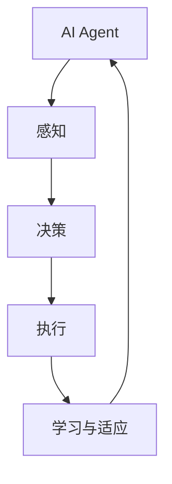

                 

# 工具使用在AI Agent中的重要性

> 关键词：AI Agent，工具使用，开发环境，核心算法，性能优化，实战案例

> 摘要：本文将深入探讨工具在AI Agent开发中的重要性，从概念解析、开发环境搭建、核心算法讲解、性能优化和实战案例等多个方面进行阐述。通过逐步分析推理，帮助读者全面理解AI Agent的开发过程和工具应用，提高开发效率和性能。

## 第一部分：AI Agent概述

### 1.1 AI Agent的概念与类型

#### 1.1.1 AI Agent的定义

AI Agent，即人工智能代理，是指具备一定智能能力，能够自主感知环境、做出决策并执行任务的计算机系统。AI Agent旨在模拟人类智能，实现智能化、自动化和自主化的操作。

#### 1.1.2 AI Agent的分类

AI Agent主要分为以下几类：

1. **基于规则的Agent**：这类Agent基于预定义的规则进行决策和执行，如专家系统。
2. **基于模型的Agent**：这类Agent基于数据驱动的模型进行决策和执行，如深度学习Agent。
3. **基于混合推理的Agent**：这类Agent结合了规则和模型的优势，既能利用规则快速响应，又能利用模型进行复杂决策。

#### 1.1.3 AI Agent的应用场景

AI Agent广泛应用于各个领域，包括但不限于：

1. **智能客服**：通过自然语言处理和对话管理，实现与用户的智能交互。
2. **自动驾驶**：通过感知、决策和执行，实现无人驾驶汽车的自动化驾驶。
3. **智能家居**：通过感知家居环境和用户需求，实现智能化的家居管理。

### 1.2 AI Agent的核心功能

#### 1.2.1 监控与感知

AI Agent需要实时监控和感知环境，获取各种传感器数据，如视觉、音频、温度、湿度等，以便进行后续的决策和执行。

#### 1.2.2 决策与执行

AI Agent根据感知到的环境和目标，利用决策算法生成具体的行动指令，并通过执行模块实现这些指令。

#### 1.2.3 学习与适应

AI Agent在执行任务过程中，不断积累经验和知识，通过学习和适应，提高任务完成的效率和准确性。

### 1.3 AI Agent的架构与发展趋势

#### 1.3.1 AI Agent的基本架构

AI Agent的基本架构包括感知模块、决策模块和执行模块。感知模块负责收集环境数据，决策模块负责处理数据并生成行动指令，执行模块负责执行这些指令。

#### 1.3.2 AI Agent的发展历程

AI Agent的发展经历了从规则驱动到数据驱动，再到混合驱动的演进过程。当前，AI Agent正朝着更加智能化、自适应化和高效化的方向发展。

#### 1.3.3 AI Agent的未来趋势

未来，AI Agent将在更多领域得到应用，如医疗、金融、农业等。同时，AI Agent的架构将更加模块化，功能将更加丰富，实现更加智能化和自主化。

## 第二部分：工具使用与AI Agent开发

### 2.1 AI Agent开发环境搭建

#### 2.1.1 开发工具的选择

在AI Agent开发中，选择合适的开发工具至关重要。常见的开发工具包括：

1. **Python**：Python因其简洁易读的语法和丰富的库资源，成为AI Agent开发的常用语言。
2. **TensorFlow**：TensorFlow是Google开发的强大机器学习框架，广泛应用于深度学习领域。
3. **PyTorch**：PyTorch是Facebook开发的另一个深度学习框架，以其动态图模型和灵活的接口受到开发者喜爱。

#### 2.1.2 环境配置与调试

开发环境的配置和调试是AI Agent开发的重要环节。以下为常见步骤：

1. **安装Python**：下载并安装Python，配置环境变量。
2. **安装TensorFlow或PyTorch**：通过pip命令安装TensorFlow或PyTorch。
3. **调试环境**：运行示例代码，检查环境是否配置正确。

#### 2.1.3 常用库与框架介绍

在AI Agent开发中，常用的库和框架包括：

1. **NumPy**：用于科学计算和数据分析。
2. **Pandas**：用于数据操作和分析。
3. **Scikit-learn**：用于机器学习和数据挖掘。
4. **Keras**：用于构建和训练深度学习模型。

### 2.2 AI Agent核心算法讲解

#### 2.2.1 机器学习算法基础

机器学习算法是AI Agent的核心组成部分。以下为常见机器学习算法：

1. **监督学习**：通过已标记的数据进行训练，预测未知数据的标签。
2. **无监督学习**：在无标签数据上进行训练，发现数据中的模式和规律。
3. **强化学习**：通过不断尝试和反馈，学习最优策略。

#### 2.2.2 特征工程

特征工程是机器学习算法的重要组成部分。以下为特征工程的关键步骤：

1. **特征提取**：从原始数据中提取有用的信息。
2. **特征选择**：从大量特征中筛选出最有用的特征。
3. **特征降维**：减少特征数量，提高计算效率和模型性能。

#### 2.2.3 模型评估与调优

模型评估与调优是确保模型性能的关键步骤。以下为常见方法：

1. **模型评估指标**：如准确率、召回率、F1分数等。
2. **超参数调优**：通过调整模型参数，优化模型性能。

### 2.3 AI Agent开发实战

#### 2.3.1 AI Agent项目实战

以下为AI Agent开发的一些实战项目：

1. **智能客服机器人**：基于自然语言处理和对话管理技术，实现智能客服功能。
2. **自动驾驶汽车**：基于计算机视觉、传感器融合和决策算法，实现自动驾驶功能。
3. **智能家居控制系统**：基于物联网技术和机器学习算法，实现智能家居功能。

### 2.4 工具使用案例分析

#### 2.4.1 工具使用在AI Agent开发中的重要性

工具的使用在AI Agent开发中具有重要意义。以下为工具使用的重要性：

1. **提高开发效率**：工具能够简化开发过程，减少人工干预，提高开发效率。
2. **优化模型性能**：工具能够提供丰富的库和框架，方便模型开发和调优。
3. **降低开发成本**：工具能够减少硬件和人力资源的投入，降低开发成本。

#### 2.4.2 工具选择与最佳实践

在AI Agent开发中，选择合适的工具至关重要。以下为工具选择和最佳实践：

1. **Python**：作为通用编程语言，Python适用于各种AI Agent开发任务。
2. **TensorFlow**：适用于深度学习和复杂模型的开发。
3. **PyTorch**：适用于研究型和实验型项目，尤其在动态图模型方面具有优势。

### 2.4.3 Python在AI Agent开发中的应用

Python在AI Agent开发中具有广泛的应用。以下为Python在AI Agent开发中的应用：

1. **数据分析与处理**：Python的NumPy和Pandas库用于数据清洗、预处理和统计分析。
2. **机器学习与深度学习**：Python的Scikit-learn和Keras库用于机器学习和深度学习模型的开发。
3. **自然语言处理**：Python的NLTK和spaCy库用于自然语言处理任务。

### 2.4.4 TensorFlow在AI Agent开发中的应用

TensorFlow在AI Agent开发中具有广泛的应用。以下为TensorFlow在AI Agent开发中的应用：

1. **深度学习模型开发**：TensorFlow提供了丰富的API和工具，方便深度学习模型的开发。
2. **模型训练与优化**：TensorFlow支持分布式训练和模型优化，提高训练效率和性能。
3. **模型部署与推理**：TensorFlow提供了模型部署和推理工具，方便将模型应用于实际场景。

### 2.4.5 PyTorch在AI Agent开发中的应用

PyTorch在AI Agent开发中具有广泛的应用。以下为PyTorch在AI Agent开发中的应用：

1. **动态图模型开发**：PyTorch的动态图模型具有更强的灵活性和可解释性。
2. **模型训练与优化**：PyTorch支持分布式训练和模型优化，提高训练效率和性能。
3. **模型部署与推理**：PyTorch提供了模型部署和推理工具，方便将模型应用于实际场景。

## 第三部分：工具优化与性能提升

### 3.1 工具优化策略

#### 3.1.1 算法优化

算法优化是提升AI Agent性能的关键。以下为常见的算法优化策略：

1. **深度学习算法优化**：通过改进神经网络结构、优化训练算法和超参数，提高模型性能。
2. **神经网络结构优化**：通过设计更高效的神经网络结构，减少计算量和参数数量，提高模型性能。
3. **算法并行化与分布式计算**：通过并行计算和分布式计算，提高训练和推理速度。

#### 3.1.2 资源管理优化

资源管理优化是提高AI Agent性能的重要手段。以下为常见的资源管理优化策略：

1. **GPU资源管理**：通过合理分配GPU资源，提高GPU利用率，加快模型训练和推理速度。
2. **CPU资源管理**：通过优化CPU调度策略和并行计算，提高CPU利用率，加快模型训练和推理速度。
3. **内存管理**：通过优化内存分配和释放策略，减少内存占用和碎片化，提高系统稳定性。

### 3.2 性能提升方法

#### 3.2.1 模型压缩与量化

模型压缩与量化是提高AI Agent性能的重要方法。以下为常见的模型压缩与量化方法：

1. **模型压缩技术**：通过剪枝、量化、蒸馏等技术，减少模型参数数量和计算量，提高模型性能。
2. **模型量化技术**：通过将浮点模型转换为整数模型，降低模型存储和计算成本，提高模型性能。
3. **模型压缩与量化的应用场景**：在资源受限的设备上部署高性能模型，如嵌入式设备、移动设备等。

#### 3.2.2 加速与并行计算

加速与并行计算是提高AI Agent性能的关键。以下为常见的加速与并行计算方法：

1. **矩阵计算加速**：通过优化矩阵计算算法和数据布局，提高矩阵计算速度。
2. **神经网络并行计算**：通过数据并行、模型并行和算法并行，提高神经网络计算速度。
3. **GPU计算优化**：通过优化GPU调度策略、数据传输和内存访问，提高GPU计算性能。

### 3.3 案例分析

#### 3.3.1 工具优化与性能提升案例分析

以下为工具优化与性能提升的一些案例分析：

1. **加速自动驾驶算法**：通过优化深度学习模型和GPU资源管理，提高自动驾驶算法的实时性和准确性。
2. **优化智能家居控制系统**：通过模型压缩和量化技术，降低智能家居控制系统的计算和存储成本，提高系统稳定性。
3. **提升智能客服机器人性能**：通过优化自然语言处理模型和资源管理策略，提高智能客服机器人的响应速度和服务质量。

## 附录

### A.1 常用工具与资源

#### A.1.1 Python

- 官网：[https://www.python.org/](https://www.python.org/)
- 文档：[https://docs.python.org/](https://docs.python.org/)

#### A.1.2 TensorFlow

- 官网：[https://www.tensorflow.org/](https://www.tensorflow.org/)
- 文档：[https://www.tensorflow.org/api\_guide](https://www.tensorflow.org/api_guide)

#### A.1.3 PyTorch

- 官网：[https://pytorch.org/](https://pytorch.org/)
- 文档：[https://pytorch.org/docs/](https://pytorch.org/docs/)

#### A.1.4 其他工具与库

- NumPy：[https://numpy.org/](https://numpy.org/)
- Pandas：[https://pandas.pydata.org/](https://pandas.pydata.org/)
- Scikit-learn：[https://scikit-learn.org/](https://scikit-learn.org/)
- Keras：[https://keras.io/](https://keras.io/)

### A.2 实践项目资源

#### A.2.1 智能客服机器人项目资源

- GitHub：[https://github.com/](https://github.com/)
- AI Scholar：[https://aischolar.com/](https://aischolar.com/)

#### A.2.2 自动驾驶汽车项目资源

- GitHub：[https://github.com/](https://github.com/)
- AI Scholar：[https://aischolar.com/](https://aischolar.com/)

#### A.2.3 智能家居控制系统项目资源

- GitHub：[https://github.com/](https://github.com/)
- AI Scholar：[https://aischolar.com/](https://aischolar.com/)

### A.3 学习资源与参考资料

#### A.3.1 书籍推荐

- 《深度学习》（Goodfellow, I., Bengio, Y., Courville, A.）
- 《Python机器学习》（Raschka, S.）
- 《强化学习：原理与Python实现》（Sutton, R. S., Barto, A. G.）

#### A.3.2 在线课程

- Coursera：[https://www.coursera.org/](https://www.coursera.org/)
- edX：[https://www.edx.org/](https://www.edx.org/)
- Udacity：[https://www.udacity.com/](https://www.udacity.com/)

#### A.3.3 论文与研究报告

- arXiv：[https://arxiv.org/](https://arxiv.org/)
- IEEE Xplore：[https://ieeexplore.ieee.org/](https://ieeexplore.ieee.org/)
- Google Scholar：[https://scholar.google.com/](https://scholar.google.com/)

### B.1 AI Agent架构流程图



### B.2 伪代码示例：监督学习算法

```python
函数监督学习算法(数据集D, 标签集L, 模型M, 学习率α):
    初始化模型M
    对于每个训练样本(x, y) in D:
        计算模型M在样本x上的预测y'
        计算损失函数L(y, y')
        计算梯度∇L(y, y')
        更新模型M的参数: M = M - α * ∇L(y, y')
    返回训练完成的模型M
```

### 附录C：作者信息

作者：AI天才研究院/AI Genius Institute & 禅与计算机程序设计艺术 /Zen And The Art of Computer Programming

