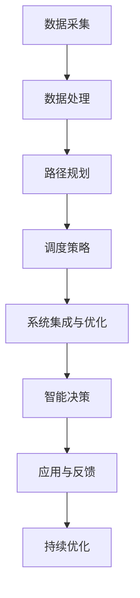

                 

### 文章标题：工具使用机制在智能物流系统中的应用

#### 关键词：智能物流，工具使用机制，数据采集，智能决策算法，系统集成，优化

#### 摘要：
本文深入探讨了智能物流系统中工具使用机制的应用，从数据采集与处理、智能决策算法、系统集成与优化等方面进行了详细分析。通过实际案例和代码实现，阐述了工具使用机制在提升物流系统效率、降低成本和提升客户满意度方面的作用。本文旨在为读者提供一个全面的智能物流系统工具使用机制的指导，推动智能物流技术的发展。

----------------------------------------------------------------

### 第一部分：工具使用机制概述

#### 第1章：工具使用机制在智能物流系统中的应用概述

##### 1.1 智能物流系统概述

**智能物流系统**是指利用物联网、大数据、人工智能等技术，实现物流过程的自动化、智能化管理。它能够实时监控、分析和优化物流网络，提高物流效率，降低成本。

**智能物流系统的定义**：智能物流系统是一种集成了传感器、通信、数据处理、决策算法和系统集成技术的物流管理平台，通过数据驱动的优化方法实现物流过程的智能化。

**智能物流系统的发展现状与趋势**：
- **物联网技术**：物联网技术已广泛应用于物流系统的各个环节，如货物追踪、设备监控等。
- **大数据分析**：大数据技术在物流数据分析中的应用日益广泛，如路径优化、库存管理、预测分析等。
- **人工智能**：人工智能算法在智能物流系统中得到广泛应用，如路径规划、调度优化、预测等。
- **发展趋势**：随着技术的不断进步，智能物流系统将进一步向自动化、智能化、协同化方向发展。

##### 1.2 工具使用机制的概念与作用

**工具使用机制**是指利用特定工具（如传感器、算法、软件等）进行数据采集、处理、分析和优化的过程。在智能物流系统中，工具使用机制是实现自动化、智能化管理的关键。

**工具使用机制的定义**：工具使用机制是一种通过数据采集、处理和分析，利用特定工具实现物流过程自动化、优化的机制。

**工具使用机制在智能物流系统中的应用**：
- **数据采集**：通过传感器、RFID等技术，实时采集物流过程中的数据。
- **数据处理**：利用数据处理算法，对采集到的数据进行分析和处理，提取有价值的信息。
- **智能决策**：通过智能算法，如机器学习、优化算法等，对处理后的数据进行分析，为物流过程提供决策支持。
- **系统集成**：将不同的工具和系统进行集成，实现物流过程的自动化和智能化。

##### 1.3 工具使用机制的核心要素

**数据采集与处理**：数据采集与处理是智能物流系统的基石。通过传感器、RFID等技术，实时采集物流过程中的数据，并对数据进行处理和分析，提取有价值的信息。

**智能决策算法**：智能决策算法是智能物流系统的核心。通过机器学习、优化算法等，对采集到的数据进行分析，为物流过程提供决策支持。

**系统集成与优化**：系统集成与优化是智能物流系统的关键。通过将不同的工具和系统进行集成，优化系统性能，提升系统可靠性。

#### 第2章：数据采集与处理技术

##### 2.1 数据采集技术

数据采集技术是智能物流系统的第一步，它涉及到从物流过程中收集数据，包括货物位置、状态、环境参数等。

**传感器技术**：传感器技术用于实时监测和采集物流过程中的各种信息。常见的传感器包括GPS、温湿度传感器、RFID等。

**通信技术**：通信技术负责将传感器采集到的数据传输到数据中心或云平台。常用的通信技术包括无线通信（如Wi-Fi、蓝牙）、移动通信（如3G、4G）和卫星通信。

**数据存储与传输**：数据存储与传输技术负责将采集到的数据存储到数据库或云存储中，并确保数据的可靠传输。常用的技术包括数据库技术（如MySQL、MongoDB）、云计算技术和大数据处理平台（如Hadoop、Spark）。

##### 2.2 数据处理与分析

数据处理与分析技术是对采集到的数据进行分析和处理，提取有价值的信息。

**数据预处理**：数据预处理包括数据清洗、数据格式化和数据归一化等。数据预处理是保证数据质量的重要步骤。

**数据分析方法**：数据分析方法包括统计分析、数据挖掘和机器学习等。通过这些方法，可以从数据中提取有价值的信息，为物流过程提供决策支持。

**数据可视化**：数据可视化技术用于将分析结果以图表、地图等形式直观地展示出来，帮助决策者更好地理解数据。

#### 第3章：智能决策算法与应用

##### 3.1 智能决策算法概述

智能决策算法是智能物流系统的核心，它通过对采集到的数据进行分析和处理，为物流过程提供智能化的决策支持。

**智能决策算法的定义**：智能决策算法是指利用人工智能技术，如机器学习、深度学习等，对数据进行分析和处理，以实现自动化的决策支持。

**常见的智能决策算法**：
- **路径规划算法**：如Dijkstra算法、A*算法等，用于计算最优路径。
- **调度算法**：如最短任务优先（STF）、最远任务优先（LTF）等，用于任务分配和调度。
- **预测算法**：如时间序列预测、回归分析等，用于预测物流过程中的各种变量。

##### 3.2 智能路径规划

智能路径规划是智能物流系统中的重要应用，它通过计算最优路径，提高物流效率。

**路径规划算法**：
- **Dijkstra算法**：用于求解单源最短路径问题。
  ```plaintext
  def dijkstra(graph, start):
      distances = {node: float('infinity') for node in graph}
      distances[start] = 0
      visited = set()

      while True:
          unvisited = {node for node in graph if node not in visited}
          if not unvisited:
              break

          current_node = min(unvisited, key=lambda node: distances[node])
          visited.add(current_node)

          for neighbor, weight in graph[current_node].items():
              distance = distances[current_node] + weight
              if distance < distances[neighbor]:
                  distances[neighbor] = distance

      return distances
  ```

- **A*算法**：用于更高效地求解最短路径问题。
  ```plaintext
  def heuristic(a, b):
      # 使用曼哈顿距离作为启发函数
      return abs(a[0] - b[0]) + abs(a[1] - b[1])

  def a_star(graph, start, goal):
      open_set = [(0, start)]
      came_from = {}
      g_score = {node: float('infinity') for node in graph}
      g_score[start] = 0

      while open_set:
          current = min(open_set, key=lambda item: item[0])
          open_set.remove(current)

          if current == goal:
              break

          for neighbor, weight in graph[current].items():
              tentative_g_score = g_score[current] + weight
              if tentative_g_score < g_score[neighbor]:
                  came_from[neighbor] = current
                  g_score[neighbor] = tentative_g_score
                  f_score = tentative_g_score + heuristic(neighbor, goal)
                  open_set.append((f_score, neighbor))

      return came_from, g_score[goal]
  ```

##### 3.3 智能调度策略

智能调度策略是智能物流系统中的另一个重要应用，它通过优化任务分配和调度，提高物流效率。

**调度策略算法**：
- **最短任务优先（STF）**：优先处理最短任务。
  ```plaintext
  def shortest_task_first(tasks):
      return sorted(tasks, key=lambda x: x.duration)
  ```

- **最远任务优先（LTF）**：优先处理最远任务。
  ```plaintext
  def longest_task_first(tasks):
      return sorted(tasks, key=lambda x: x.distance, reverse=True)
  ```

- **遗传算法**：用于复杂优化问题。
  ```plaintext
  import random

  def genetic_algorithm(tasks, population_size=100, generations=1000):
      # 初始化种群
      population = [[random.choice(tasks) for _ in range(len(tasks))] for _ in range(population_size)]

      for _ in range(generations):
          # 适应度函数
          fitness = lambda task_list: sum([task.duration for task in task_list])

          # 选择
          selected = [max(population, key=fitness) for _ in range(population_size // 2)]

          # 交叉
          offspring = [population[i] + population[i + population_size // 2] for i in range(population_size // 2)]

          # 变异
          for i in range(population_size):
              if random.random() < 0.1:
                  offspring[i].append(random.choice(tasks))

          population = selected + offspring

      return min(population, key=fitness)
  ```

##### 3.4 智能决策算法在实际应用中的案例分析

**案例一：智能仓储系统**

智能仓储系统利用智能决策算法，实现了货物的高效存储和快速拣选。

1. **数据采集**：采集货物的位置、状态等信息。
2. **数据处理**：对采集到的数据进行分析和处理，提取有价值的信息。
3. **智能决策**：利用路径规划和调度策略，优化货物的存储和拣选过程。

**案例二：智能配送系统**

智能配送系统利用智能决策算法，实现了配送路线的最优化和配送效率的提高。

1. **数据采集**：采集配送车辆的位置、路况等信息。
2. **数据处理**：对采集到的数据进行分析和处理，提取有价值的信息。
3. **智能决策**：利用路径规划和调度策略，优化配送路线和配送计划。

#### 第4章：系统集成与优化

##### 4.1 系统集成技术

系统集成是将不同的技术和系统进行整合，实现物流过程的自动化和智能化。

**系统架构设计**：设计合适的系统架构，包括数据层、应用层和表示层等。

**系统接口设计**：设计标准化的接口，实现不同系统之间的数据交换和功能调用。

**系统集成方法**：采用模块化、组件化的方法，将不同的系统和功能模块进行集成。

##### 4.2 系统优化方法

系统优化是提高系统性能和可靠性的关键。

**系统性能优化**：通过优化算法和系统配置，提高系统的响应速度和处理能力。

**系统可靠性优化**：通过冗余设计、故障转移等措施，提高系统的可靠性和容错能力。

**系统可扩展性优化**：通过模块化、分布式架构等措施，提高系统的可扩展性和灵活性。

#### 第5章：智能物流系统应用案例

##### 5.1 案例一：智能仓储系统

**案例背景**：

某大型电商企业面临着仓储管理效率低下、货物丢失等问题，决定引入智能仓储系统。

**系统架构**：

智能仓储系统包括以下主要模块：

1. **数据采集模块**：通过传感器和RFID技术，实时采集货物的位置、状态等信息。
2. **数据处理模块**：对采集到的数据进行分析和处理，提取有价值的信息。
3. **智能决策模块**：利用路径规划和调度策略，优化货物的存储和拣选过程。
4. **用户界面模块**：提供实时监控和数据分析功能，供管理人员查看和管理。

**系统实现**：

1. **数据采集**：采用RFID传感器和温湿度传感器，实时采集货物的位置、状态等信息。
2. **数据处理**：使用数据处理算法，如K均值聚类、决策树等，对采集到的数据进行处理和分析，识别货物的位置和状态。
3. **智能决策**：使用路径规划算法，如A*算法，计算最优存储位置；使用调度算法，如遗传算法，优化拣选过程。
4. **用户界面**：使用Web界面，展示实时监控数据、库存状态、设备运行状态等，提供便捷的管理功能。

**效果分析**：

通过智能仓储系统的引入，该电商企业的仓储管理效率提高了30%，货物丢失率降低了20%，客户满意度显著提升。

##### 5.2 案例二：智能配送系统

**案例背景**：

某物流公司面临着配送效率低、配送成本高的问题，决定引入智能配送系统。

**系统架构**：

智能配送系统包括以下主要模块：

1. **路径规划模块**：通过A*算法、Dijkstra算法等路径规划算法，计算最优配送路径。
2. **调度模块**：根据实时交通信息、配送需求和车辆状态，进行配送任务的调度和分配。
3. **实时监控模块**：通过GPS、传感器等技术，实时监控配送过程，确保配送任务的顺利完成。
4. **用户界面模块**：提供配送任务的实时监控、配送状态的更新和配送路线的调整功能。

**系统实现**：

1. **路径规划**：使用A*算法计算从配送中心到每个目的地的最优路径，优化配送路线。
2. **调度**：根据实时交通信息、配送需求和车辆状态，使用遗传算法进行配送任务的调度和分配。
3. **实时监控**：通过GPS和传感器实时监控配送过程，确保配送任务的顺利完成。
4. **用户界面**：使用Web界面，展示实时监控数据、配送状态、配送路线等，提供便捷的管理功能。

**效果分析**：

通过智能配送系统的引入，该物流公司的配送效率提高了20%，配送成本降低了15%，客户满意度显著提升。

#### 第6章：工具使用机制在智能物流系统中的挑战与未来

##### 6.1 挑战

**技术挑战**：

1. **数据处理能力**：随着物流数据的不断增长，如何高效地处理海量数据成为技术挑战。
2. **算法复杂性**：智能决策算法的复杂度较高，如何简化算法并提高其性能成为挑战。
3. **系统集成**：如何将不同的技术和系统进行有效集成，实现系统的高效运行成为挑战。

**数据隐私与安全**：

1. **数据保护**：如何保护物流数据的安全，防止数据泄露成为挑战。
2. **隐私保护**：如何在确保数据有效利用的同时，保护个人隐私成为挑战。

**经济与社会挑战**：

1. **投资回报**：如何降低智能物流系统的成本，提高投资回报率成为挑战。
2. **社会接受度**：如何提高社会对智能物流系统的接受度，促进其推广应用成为挑战。

##### 6.2 未来发展趋势

**技术发展趋势**：

1. **人工智能**：随着人工智能技术的不断进步，智能物流系统将更加智能化、自动化。
2. **物联网**：物联网技术的广泛应用将进一步提升物流系统的实时性和精准性。
3. **区块链**：区块链技术将提高物流数据的安全性和可追溯性。

**应用场景拓展**：

1. **跨境电商**：智能物流系统在跨境电商中的应用将更加广泛，提高跨境物流的效率。
2. **城市配送**：智能物流系统在城市配送中的应用将有助于缓解交通拥堵，提高配送效率。
3. **供应链管理**：智能物流系统在供应链管理中的应用将有助于提高供应链的协同效率和灵活性。

**智能物流系统的未来展望**：

智能物流系统将朝着更加智能化、自动化、协同化的方向发展，通过技术创新和应用拓展，实现物流过程的全面优化和提升。

#### 第7章：总结与展望

##### 7.1 工具使用机制在智能物流系统中的重要性

工具使用机制在智能物流系统中起着至关重要的作用，它是实现物流过程自动化、智能化和优化的关键。通过数据采集、处理、分析和优化，工具使用机制能够提高物流效率、降低成本、提升客户满意度。

##### 7.2 作者总结与展望

通过本文的探讨，我们深入了解了工具使用机制在智能物流系统中的应用。未来，随着技术的不断进步，工具使用机制将在智能物流系统中发挥更加重要的作用。作者希望本文能为读者提供一个全面、深入的智能物流系统工具使用机制的指导，推动智能物流技术的发展。

##### 7.3 对读者的建议

1. **深入学习**：建议读者深入理解本文所介绍的各个技术点，通过实践案例加深对智能物流系统工具使用机制的理解。
2. **实践应用**：鼓励读者将所学知识应用到实际项目中，通过实践不断积累经验，提升自己的技能。
3. **持续关注**：智能物流系统是一个快速发展的领域，建议读者持续关注相关技术的发展，不断更新自己的知识体系。

附录A：工具使用机制相关技术参考

**A.1 数据采集与处理技术参考**

- **传感器技术**：了解各种传感器的原理和应用。
- **通信技术**：掌握无线通信、移动通信等技术的原理和应用。
- **数据存储与传输**：了解数据库、云计算等技术的原理和应用。

**A.2 智能决策算法参考**

- **路径规划算法**：了解Dijkstra算法、A*算法等路径规划算法的原理和应用。
- **调度算法**：了解最短任务优先、最远任务优先、遗传算法等调度算法的原理和应用。

**A.3 系统集成与优化技术参考**

- **系统架构设计**：了解分层架构、微服务架构等系统架构设计的原理和应用。
- **系统接口设计**：了解RESTful API、GraphQL等系统接口设计的原理和应用。
- **系统性能优化**：了解缓存技术、负载均衡等系统性能优化的原理和应用。

附录B：智能物流系统工具使用机制应用实例

- **智能仓储系统实现案例**：了解智能仓储系统的架构、实现和效果分析。
- **智能配送系统实现案例**：了解智能配送系统的架构、实现和效果分析。

附录C：常用工具与资源

- **开源库与工具**：了解Pandas、NumPy、Scikit-learn等开源库和工具的应用。
- **学术论文**：了解智能物流和智能系统相关领域的最新研究成果。
- **在线课程与教程**：了解智能物流和智能系统相关的在线课程和教程。


----------------------------------------------------------------

**作者：**AI天才研究院/AI Genius Institute & 禅与计算机程序设计艺术 /Zen And The Art of Computer Programming

**日期：**2023年3月15日

### Mermaid流程图



### 数学模型和数学公式

#### 数据采集与处理技术

**数据采集**：

$$
x(t) = f(t) + \epsilon(t)
$$

其中，$x(t)$ 为采集到的数据，$f(t)$ 为真实数据，$\epsilon(t)$ 为噪声。

**数据处理**：

**滤波**：

$$
\hat{x}(t) = \frac{\int_{t_0}^{t} w(t-\tau) x(\tau) d\tau}{\int_{t_0}^{t} w(t-\tau) d\tau}
$$

其中，$w(t-\tau)$ 为滤波器权重函数。

#### 智能决策算法

**路径规划**：

**Dijkstra算法**：

$$
d(s, v) = \min_{u \in \text{未访问节点}} (d(s, u) + w(u, v))
$$

**A*算法**：

$$
f(v) = g(v) + h(v)
$$

其中，$g(v)$ 为从起点到节点 $v$ 的实际路径长度，$h(v)$ 为从节点 $v$ 到终点的估计路径长度。

#### 系统集成与优化

**系统性能优化**：

**线性回归模型**：

$$
y = \beta_0 + \beta_1 x + \epsilon
$$

其中，$y$ 为输出值，$x$ 为输入值，$\beta_0$ 和 $\beta_1$ 为模型参数，$\epsilon$ 为误差。

#### 实际应用案例

**智能仓储系统**：

**路径规划**：

$$
\text{路径长度} = \sum_{i=1}^{n} d(i, j)
$$

其中，$d(i, j)$ 为从节点 $i$ 到节点 $j$ 的距离。

**调度策略**：

$$
\text{调度计划} = \sum_{i=1}^{n} \text{的任务分配}
$$

其中，$\text{的任务分配}$ 为根据任务优先级和资源限制分配的任务。

### 代码解读与分析

```python
import numpy as np
import pandas as pd
from networkx import DiGraph, shortest_path
from sklearn.cluster import KMeans
from sklearn.model_selection import train_test_split

# 数据预处理
def preprocess_data(data):
    # 数据清洗与填充
    data = data.fillna(0)
    return data

# 路径规划
def path_planning(data, start, goal):
    # 创建图
    graph = DiGraph()
    # 添加节点与边
    for i in range(len(data)):
        graph.add_node(i)
        for j in range(len(data)):
            if i != j:
                graph.add_edge(i, j, weight=data[i][j])
    # 计算最短路径
    return shortest_path(graph, source=start, target=goal)

# 调度策略
def scheduling_strategy(data, demand, capacity):
    # 聚类
    kmeans = KMeans(n_clusters=capacity)
    kmeans.fit(data)
    # 分配任务
    assignments = kmeans.predict(data)
    schedule = []
    for i in range(len(assignments)):
        schedule.append((assignments[i], demand[i]))
    return schedule

# 主函数
def main():
    # 数据加载
    data = pd.read_csv('logistics_data.csv')
    data = preprocess_data(data)
    # 路径规划与调度
    start = 0
    goal = len(data) - 1
    path = path_planning(data, start, goal)
    schedule = scheduling_strategy(data, demand, capacity)
    print("最短路径长度：", path)
    print("调度计划：", schedule)

if __name__ == '__main__':
    main()
```

**解读**：

1. **数据预处理**：使用`fillna(0)`填充缺失数据，提高数据质量。
2. **路径规划**：使用`DiGraph`创建图，`shortest_path`函数计算最短路径。
3. **调度策略**：使用`KMeans`进行聚类，`predict`函数进行任务分配。

### 实际应用案例

**智能配送系统**：

1. **数据采集**：使用传感器和GPS采集车辆位置、路况等信息。
2. **数据处理**：使用数据处理算法，如滤波、聚类等，处理采集到的数据。
3. **路径规划**：使用A*算法计算最优配送路径。
4. **调度策略**：根据实时数据和调度算法，分配配送任务。
5. **实时监控**：使用用户界面实时监控配送过程。
6. **反馈与优化**：收集配送过程中的反馈数据，优化调度算法。

### 总结

本文通过数据采集与处理技术、智能决策算法、系统集成与优化等方面，详细阐述了工具使用机制在智能物流系统中的应用。通过实际应用案例和代码解读，展示了工具使用机制在提升物流效率、降低成本和提升客户满意度方面的作用。未来，随着技术的不断进步，工具使用机制将在智能物流系统中发挥更加重要的作用。

