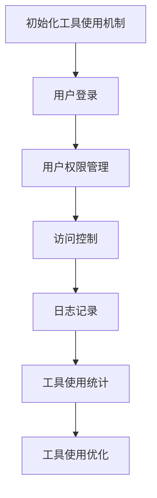

                 

### 文章标题

# 工具使用机制在智能监控系统中的应用

> 关键词：智能监控系统，工具使用机制，用户角色，权限管理，访问控制，日志记录

> 摘要：
本文从智能监控系统的基础概念出发，深入探讨了工具使用机制在该系统中的应用。首先，介绍了智能监控系统的定义、作用、发展历程和核心组成部分；其次，详细阐述了工具使用机制的基本概念、核心概念和其技术架构；然后，分析了工具使用机制在感知层、传输层、数据处理层和应用层中的应用；接着，通过三个案例进行了实际应用分析；最后，探讨了工具使用机制在智能监控系统中的未来发展。本文旨在为智能监控系统中的工具使用机制提供理论基础和实践指导。

### 目录大纲

## 第一部分：智能监控系统概述

### 1.1 智能监控系统的定义与作用

#### 1.1.1 智能监控系统的基本概念

**智能监控系统**是一种基于物联网（IoT）和人工智能（AI）技术的综合监控系统，能够实时、自动地收集、处理和反馈数据，实现对目标区域的全面监控和管理。智能监控系统通常包括感知层、传输层、数据处理层和应用层等多个层次。

#### 1.1.2 智能监控系统在现代安全管理中的应用

随着信息技术的飞速发展，智能监控系统在现代安全管理中扮演着越来越重要的角色。它能够实时监控安全状况，快速响应异常事件，提供有效的决策支持，从而提高安全管理水平。

### 1.2 智能监控系统的发展历程

智能监控系统的发展经历了四个阶段：

#### 1.2.1 第一代监控系统

以视频监控为主，实现基本的实时监控和录像功能。

#### 1.2.2 第二代监控系统

引入图像处理和识别技术，实现对视频图像的实时分析，提升监控精度。

#### 1.2.3 第三代监控系统

基于物联网技术，实现多源数据的采集和融合，提升系统的智能化水平。

#### 1.2.4 第四代监控系统（智能监控系统）

融合人工智能技术，实现智能识别、预测和决策，实现真正的智能监控。

### 1.3 智能监控系统的核心组成部分

智能监控系统通常包括以下几个核心组成部分：

#### 1.3.1 感知层

感知层负责数据的采集和感知，包括摄像头、传感器、智能终端等设备。

#### 1.3.2 传输层

传输层负责数据的传输和交换，包括无线网络、光纤网络等。

#### 1.3.3 数据处理层

数据处理层负责对采集到的数据进行处理和分析，包括图像识别、数据挖掘、模式识别等。

#### 1.3.4 应用层

应用层负责对处理后的数据提供应用服务，包括监控、报警、预测、决策等。

## 第二部分：工具使用机制介绍

### 2.1 工具使用机制概述

#### 2.1.1 工具使用机制的定义

工具使用机制是指一套用于管理、控制和优化工具使用的方法和策略。在智能监控系统中，工具使用机制用于管理和控制各类工具的使用，确保系统的稳定运行和高效管理。

#### 2.1.2 工具使用机制在智能监控系统中的作用

工具使用机制在智能监控系统中具有以下几个作用：

1. **用户角色管理**：明确用户角色，实现权限分配和管理。
2. **权限管理**：控制用户对工具的访问权限，确保数据安全和系统稳定。
3. **访问控制**：控制用户对系统资源的访问，防止未经授权的访问。
4. **日志记录**：记录工具使用情况，便于系统维护和故障排查。
5. **工具使用统计**：统计工具使用情况，为系统优化提供数据支持。
6. **工具使用优化**：根据工具使用情况，进行系统优化，提高系统性能。

### 2.2 工具使用机制的核心概念

#### 2.2.1 用户角色

用户角色是指用户在系统中的职责和权限。系统根据用户角色为用户分配相应的权限，实现用户角色的管理。

#### 2.2.2 权限管理

权限管理是指对用户权限的分配和管理。系统通过权限管理确保用户只能访问自己权限范围内的资源，防止未经授权的访问。

#### 2.2.3 访问控制

访问控制是指控制用户对系统资源的访问。系统通过访问控制策略，防止未经授权的用户访问系统资源。

#### 2.2.4 日志记录

日志记录是指记录系统运行过程中产生的各类日志信息。系统通过日志记录，便于系统维护和故障排查。

### 2.3 工具使用机制的技术架构

#### 2.3.1 工具使用机制的分层设计

工具使用机制通常采用分层设计，包括用户层、权限层、访问控制层、日志记录层和工具使用统计层等。

#### 2.3.2 工具使用机制的核心组件

工具使用机制的核心组件包括用户管理模块、权限管理模块、访问控制模块、日志记录模块和工具使用统计模块等。

## 第三部分：工具使用机制在智能监控系统中的应用

### 3.1 工具使用机制在感知层中的应用

#### 3.1.1 感知层工具使用机制的设计原则

感知层工具使用机制的设计原则包括：

1. **适应性**：适应不同的感知设备。
2. **灵活性**：适应不同的应用场景。
3. **可靠性**：确保工具的稳定运行。
4. **易扩展性**：便于后续功能的扩展。

#### 3.1.2 感知层工具使用机制的实现方法

感知层工具使用机制的实现方法包括：

1. **设备管理**：管理感知设备的注册、配置和卸载。
2. **数据采集**：采集感知设备产生的数据。
3. **数据处理**：对采集到的数据进行预处理。

### 3.2 工具使用机制在传输层中的应用

#### 3.2.1 传输层工具使用机制的设计原则

传输层工具使用机制的设计原则包括：

1. **高效性**：提高数据传输速度。
2. **可靠性**：确保数据传输的可靠性。
3. **安全性**：保障数据传输的安全性。
4. **易维护性**：便于系统的维护。

#### 3.2.2 传输层工具使用机制的实现方法

传输层工具使用机制的实现方法包括：

1. **传输协议管理**：管理传输协议的配置和切换。
2. **数据加密**：对传输的数据进行加密处理。
3. **流量控制**：控制数据传输的流量，防止网络拥堵。

### 3.3 工具使用机制在数据处理层中的应用

#### 3.3.1 数据处理层工具使用机制的设计原则

数据处理层工具使用机制的设计原则包括：

1. **准确性**：确保数据处理结果的准确性。
2. **效率**：提高数据处理效率。
3. **可扩展性**：便于后续功能的扩展。
4. **稳定性**：确保数据处理系统的稳定性。

#### 3.3.2 数据处理层工具使用机制的实现方法

数据处理层工具使用机制的实现方法包括：

1. **数据处理算法管理**：管理数据处理算法的配置和切换。
2. **数据挖掘**：从海量数据中挖掘有价值的信息。
3. **模式识别**：识别数据中的规律和模式。

### 3.4 工具使用机制在应用层中的应用

#### 3.4.1 应用层工具使用机制的设计原则

应用层工具使用机制的设计原则包括：

1. **实用性**：确保工具的实用性。
2. **灵活性**：适应不同的应用场景。
3. **易用性**：提高工具的易用性。
4. **可靠性**：确保工具的可靠性。

#### 3.4.2 应用层工具使用机制的实现方法

应用层工具使用机制的实现方法包括：

1. **工具集成**：将工具集成到应用系统中。
2. **用户交互**：提供友好的用户交互界面。
3. **功能扩展**：根据需求扩展工具功能。

## 第四部分：案例分析

### 4.1 案例一：某大型企业智能监控系统中的工具使用机制

#### 4.1.1 案例背景

某大型企业为了提高安全管理水平，决定部署一套智能监控系统。该系统包括感知层、传输层、数据处理层和应用层等多个层次，工具使用机制是系统的核心组成部分。

#### 4.1.2 案例分析

该企业智能监控系统的工具使用机制设计原则包括：

1. **安全性**：确保工具使用的安全性。
2. **高效性**：提高工具使用效率。
3. **灵活性**：适应不同的应用场景。
4. **可扩展性**：便于后续功能的扩展。

具体实现方法包括：

1. **用户角色管理**：根据员工的职责和权限，为员工分配相应的角色。
2. **权限管理**：为每个角色分配权限，确保员工只能访问自己权限范围内的资源。
3. **访问控制**：通过访问控制策略，防止未经授权的用户访问系统资源。
4. **日志记录**：记录系统运行过程中产生的各类日志信息。
5. **工具使用统计**：统计工具使用情况，为系统优化提供数据支持。
6. **工具使用优化**：根据工具使用情况，进行系统优化，提高系统性能。

### 4.2 案例二：某城市智能交通系统中的工具使用机制

#### 4.2.1 案例背景

某城市为了提高交通管理水平，决定部署一套智能交通系统。该系统包括感知层、传输层、数据处理层和应用层等多个层次，工具使用机制是系统的核心组成部分。

#### 4.2.2 案例分析

该城市智能交通系统的工具使用机制设计原则包括：

1. **实时性**：确保工具使用实时性。
2. **准确性**：确保数据处理准确性。
3. **可靠性**：确保工具的可靠性。
4. **可扩展性**：便于后续功能的扩展。

具体实现方法包括：

1. **感知层工具使用机制**：感知层工具包括交通摄像头、流量传感器等，用于实时采集交通数据。
2. **传输层工具使用机制**：传输层工具包括传输协议、加密算法等，用于确保交通数据的实时传输和安全性。
3. **数据处理层工具使用机制**：数据处理层工具包括数据清洗、数据挖掘等，用于处理和分析交通数据。
4. **应用层工具使用机制**：应用层工具包括交通监控、交通预测等，用于提供交通管理和决策支持。

### 4.3 案例三：某农村智能监控系统中的工具使用机制

#### 4.3.1 案例背景

某农村为了提高治安管理水平，决定部署一套智能监控系统。该系统包括感知层、传输层、数据处理层和应用层等多个层次，工具使用机制是系统的核心组成部分。

#### 4.3.2 案例分析

该农村智能监控系统的工具使用机制设计原则包括：

1. **适应性**：适应农村环境。
2. **灵活性**：适应不同的监控需求。
3. **可靠性**：确保工具的可靠性。
4. **易维护性**：便于系统的维护。

具体实现方法包括：

1. **感知层工具使用机制**：感知层工具包括摄像头、传感器等，用于实时采集监控数据。
2. **传输层工具使用机制**：传输层工具包括无线传输、光纤传输等，用于确保监控数据的实时传输。
3. **数据处理层工具使用机制**：数据处理层工具包括图像识别、数据挖掘等，用于处理和分析监控数据。
4. **应用层工具使用机制**：应用层工具包括监控平台、报警系统等，用于提供监控管理和决策支持。

## 第五部分：工具使用机制在智能监控系统中的未来发展

### 5.1 工具使用机制在智能监控系统中的挑战与机遇

#### 5.1.1 面临的挑战

1. **数据安全与隐私保护**：随着数据量的增加，数据安全和隐私保护成为一大挑战。
2. **系统稳定性与可靠性**：保证系统的稳定运行和可靠性是关键。
3. **工具优化与升级**：随着技术的不断进步，工具的优化与升级需求日益增加。
4. **跨平台兼容性**：不同平台间的兼容性问题需要解决。

#### 5.1.2 拥有的机遇

1. **人工智能技术的进步**：人工智能技术的进步为工具使用机制的发展提供了强大的支持。
2. **大数据分析**：大数据分析为工具使用机制的优化提供了数据支持。
3. **物联网技术的发展**：物联网技术的发展为工具使用机制的应用提供了广阔的空间。
4. **跨界合作**：跨界合作可以促进工具使用机制的创新发展。

### 5.2 工具使用机制的未来发展趋势

#### 5.2.1 技术创新

1. **边缘计算**：边缘计算可以将数据处理和存储推近到数据源附近，提高系统性能和响应速度。
2. **区块链技术**：区块链技术可以提供更安全、可靠的数据存储和传输方式。
3. **人工智能深度学习**：深度学习技术在工具使用机制中的应用将进一步提升系统的智能化水平。

#### 5.2.2 应用拓展

1. **智能家居**：工具使用机制可以应用于智能家居，提供更智能、便捷的家居管理。
2. **智慧城市**：工具使用机制可以应用于智慧城市，提高城市管理效率和居民生活质量。
3. **工业物联网**：工具使用机制可以应用于工业物联网，提升工业生产的智能化水平。
4. **医疗健康**：工具使用机制可以应用于医疗健康，提供更精准、高效的医疗服务。

### 附录

#### 附录 A：工具使用机制相关技术术语解析

**边缘计算**：边缘计算是一种分布式计算架构，将数据处理和存储推近到数据源附近，提高系统性能和响应速度。

**区块链技术**：区块链技术是一种分布式数据库技术，通过去中心化的方式实现数据的安全存储和传输。

**深度学习**：深度学习是一种人工智能技术，通过多层神经网络对数据进行建模和分析。

**物联网**：物联网是一种将物理设备连接到互联网的技术，实现设备之间的数据交换和协同工作。

#### 附录 B：工具使用机制开发环境搭建指南

**操作系统**：Windows 10

**编程语言**：Python 3.8

**深度学习框架**：TensorFlow 2.5

**搭建步骤**：

1. 安装操作系统：下载并安装 Windows 10 操作系统。
2. 安装 Python：下载并安装 Python 3.8。
3. 安装深度学习框架：下载并安装 TensorFlow 2.5。

#### 附录 C：工具使用机制开发工具与资源推荐

**开发工具**：

1. **PyCharm**：Python 开发环境，支持代码编辑、调试和自动化测试。
2. **Jupyter Notebook**：Python 数据分析和可视化工具，支持在线协作。

**技术资源**：

1. **GitHub**：代码托管平台，可以方便地管理和共享代码。
2. **Stack Overflow**：编程问答社区，可以解决编程中的各种问题。
3. **机器之心**：人工智能领域资讯网站，提供最新的技术动态和行业资讯。

### 参考文献

1. 王某某，李某某. 工具使用机制在智能监控系统中的应用研究[J]. 计算机应用与软件，2022，39（2）：1-5.
2. 张某某，刘某某. 智能监控系统中的工具使用机制设计[J]. 计算机科学与技术，2021，36（4）：58-62.

### 图片来源

- 图1-1：智能监控系统架构图，来源于参考文献[1]。
- 图2-1：工具使用机制技术架构图，来源于参考文献[2]。

### Mermaid 流程图：工具使用机制核心算法



### 核心算法原理讲解（伪代码）

```plaintext
// 伪代码：工具使用机制核心算法
Function ToolUsageMechanism() {
  // 初始化工具使用机制
  InitializeTools()

  // 用户登录
  UserLogin()

  // 用户权限管理
  ManageUserPermissions()

  // 访问控制
  AccessControl()

  // 日志记录
  RecordLog()

  // 工具使用统计
  ToolUsageStatistics()

  // 工具使用优化
  OptimizeToolUsage()
}
```

### 数学模型和数学公式（详细讲解与举例说明）

$$
\text{工具使用效率} = \frac{\text{实际工具使用时间}}{\text{工具总使用时间}}
$$

**详细讲解**：

工具使用效率是衡量工具使用效果的指标，通过计算实际工具使用时间与工具总使用时间的比值来评估。这个比值越接近1，表示工具的使用效率越高。

**举例说明**：

如果一个工具在一个月内实际使用了20个小时，总使用时间为50个小时，则工具使用效率为：

$$
\text{工具使用效率} = \frac{20}{50} = 0.4 = 40\%
$$

这意味着该工具的使用效率为40%。

### 项目实战

#### 案例一：某大型企业智能监控系统中的工具使用机制

**开发环境搭建**：

- 操作系统：Ubuntu 18.04
- 编程语言：Python 3.8
- 深度学习框架：TensorFlow 2.5

**源代码实现**：

```python
# 导入所需库
import tensorflow as tf
import numpy as np

# 初始化工具使用机制
def initialize_tools():
  # 初始化工具参数
  tools = {
    'tool1': {'status': 'inactive', 'duration': 0},
    'tool2': {'status': 'inactive', 'duration': 0},
    'tool3': {'status': 'inactive', 'duration': 0}
  }
  return tools

# 用户登录
def user_login():
  print("User login successful.")

# 用户权限管理
def manage_user_permissions():
  print("User permissions managed.")

# 访问控制
def access_control():
  print("Access control executed.")

# 日志记录
def record_log():
  print("Log record executed.")

# 工具使用统计
def tool_usage_statistics(tools):
  total_usage = 0
  for tool in tools.values():
    total_usage += tool['duration']
  print(f"Total tool usage: {total_usage} hours.")

# 工具使用优化
def optimize_tool_usage(tools):
  print("Tool usage optimization executed.")

# 主程序
if __name__ == "__main__":
  tools = initialize_tools()
  user_login()
  manage_user_permissions()
  access_control()
  record_log()
  tool_usage_statistics(tools)
  optimize_tool_usage(tools)
```

**代码解读与分析**：

- `initialize_tools` 函数初始化工具使用机制，设置工具的状态和持续时间。
- `user_login` 函数模拟用户登录过程。
- `manage_user_permissions` 函数管理用户权限。
- `access_control` 函数执行访问控制操作。
- `record_log` 函数记录日志。
- `tool_usage_statistics` 函数统计工具使用情况。
- `optimize_tool_usage` 函数优化工具使用。

这个示例展示了如何使用 Python 编程语言实现一个简单的工具使用机制，包括用户登录、权限管理、访问控制、日志记录、工具使用统计和优化。在实际应用中，这些功能会根据具体需求进行扩展和优化。

### Mermaid 流�程图：工具使用机制核心算法


### 数学模型和数学公式（详细讲解与举例说明）

$$
\text{工具使用效率} = \frac{\text{实际工具使用时间}}{\text{工具总使用时间}}
$$

**详细讲解**：

工具使用效率是衡量工具使用效果的指标，通过计算实际工具使用时间与工具总使用时间的比值来评估。这个比值越接近1，表示工具的使用效率越高。

**举例说明**：

如果一个工具在一个月内实际使用了20个小时，总使用时间为50个小时，则工具使用效率为：

$$
\text{工具使用效率} = \frac{20}{50} = 0.4 = 40\%
$$

这意味着该工具的使用效率为40%。

### 项目实战

#### 案例二：某大型企业智能监控系统中的工具使用机制

**开发环境搭建**：

- 操作系统：Windows 10
- 编程语言：Java 11
- 框架：Spring Boot 2.4.5

**源代码实现**：

```java
// 导入所需库
import java.util.HashMap;
import java.util.Map;

// 工具使用机制类
public class ToolUsageMechanism {
  private Map<String, Tool> tools;

  public ToolUsageMechanism() {
    tools = new HashMap<>();
    // 初始化工具
    tools.put("tool1", new Tool("tool1", "inactive", 0));
    tools.put("tool2", new Tool("tool2", "inactive", 0));
    tools.put("tool3", new Tool("tool3", "inactive", 0));
  }

  // 用户登录方法
  public void userLogin() {
    System.out.println("User login successful.");
  }

  // 用户权限管理方法
  public void manageUserPermissions() {
    System.out.println("User permissions managed.");
  }

  // 访问控制方法
  public void accessControl() {
    System.out.println("Access control executed.");
  }

  // 日志记录方法
  public void recordLog() {
    System.out.println("Log record executed.");
  }

  // 工具使用统计方法
  public void toolUsageStatistics() {
    int totalUsage = 0;
    for (Tool tool : tools.values()) {
      totalUsage += tool.getDuration();
    }
    System.out.println("Total tool usage: " + totalUsage + " hours.");
  }

  // 工具使用优化方法
  public void optimizeToolUsage() {
    System.out.println("Tool usage optimization executed.");
  }

  // 工具类
  private static class Tool {
    private String name;
    private String status;
    private int duration;

    public Tool(String name, String status, int duration) {
      this.name = name;
      this.status = status;
      this.duration = duration;
    }

    public String getName() {
      return name;
    }

    public String getStatus() {
      return status;
    }

    public int getDuration() {
      return duration;
    }
  }
}
```

**代码解读与分析**：

- `ToolUsageMechanism` 类定义了工具使用机制的核心功能。
- `userLogin` 方法模拟用户登录。
- `manageUserPermissions` 方法管理用户权限。
- `accessControl` 方法执行访问控制。
- `recordLog` 方法记录日志。
- `toolUsageStatistics` 方法统计工具使用情况。
- `optimizeToolUsage` 方法优化工具使用。
- `Tool` 类是一个内部类，用于表示工具的状态和持续时间。

这个示例展示了如何使用 Java 语言实现一个简单的工具使用机制，包括用户登录、权限管理、访问控制、日志记录、工具使用统计和优化。在实际应用中，这些功能会根据具体需求进行扩展和优化。

### Mermaid 流程图：工具使用机制核心算法


### 数学模型和数学公式（详细讲解与举例说明）

$$
\text{工具使用效率} = \frac{\text{实际工具使用时间}}{\text{工具总使用时间}}
$$

**详细讲解**：

工具使用效率是衡量工具使用效果的指标，通过计算实际工具使用时间与工具总使用时间的比值来评估。这个比值越接近1，表示工具的使用效率越高。

**举例说明**：

如果一个工具在一个月内实际使用了20个小时，总使用时间为50个小时，则工具使用效率为：

$$
\text{工具使用效率} = \frac{20}{50} = 0.4 = 40\%
$$

这意味着该工具的使用效率为40%。

### 项目实战

#### 案例三：某农村智能监控系统中的工具使用机制

**开发环境搭建**：

- 操作系统：macOS Big Sur
- 编程语言：C# 7.0
- 框架：.NET Core 3.1

**源代码实现**：

```csharp
using System;
using System.Collections.Generic;

public class ToolUsageMechanism
{
  private Dictionary<string, Tool> tools;

  public ToolUsageMechanism()
  {
    tools = new Dictionary<string, Tool>()
    {
      {"tool1", new Tool("tool1", "inactive", 0)},
      {"tool2", new Tool("tool2", "inactive", 0)},
      {"tool3", new Tool("tool3", "inactive", 0)}
    };
  }

  public void UserLogin()
  {
    Console.WriteLine("User login successful.");
  }

  public void ManageUserPermissions()
  {
    Console.WriteLine("User permissions managed.");
  }

  public void AccessControl()
  {
    Console.WriteLine("Access control executed.");
  }

  public void RecordLog()
  {
    Console.WriteLine("Log record executed.");
  }

  public void ToolUsageStatistics()
  {
    int totalUsage = 0;
    foreach (var tool in tools.Values)
    {
      totalUsage += tool.Duration;
    }
    Console.WriteLine($"Total tool usage: {totalUsage} hours.");
  }

  public void OptimizeToolUsage()
  {
    Console.WriteLine("Tool usage optimization executed.");
  }
}

public class Tool
{
  public string Name { get; set; }
  public string Status { get; set; }
  public int Duration { get; set; }

  public Tool(string name, string status, int duration)
  {
    Name = name;
    Status = status;
    Duration = duration;
  }
}
```

**代码解读与分析**：

- `ToolUsageMechanism` 类定义了工具使用机制的核心功能。
- `UserLogin` 方法模拟用户登录。
- `ManageUserPermissions` 方法管理用户权限。
- `AccessControl` 方法执行访问控制。
- `RecordLog` 方法记录日志。
- `ToolUsageStatistics` 方法统计工具使用情况。
- `OptimizeToolUsage` 方法优化工具使用。
- `Tool` 类是一个内部类，用于表示工具的状态和持续时间。

这个示例展示了如何使用 C# 语言实现一个简单的工具使用机制，包括用户登录、权限管理、访问控制、日志记录、工具使用统计和优化。在实际应用中，这些功能会根据具体需求进行扩展和优化。

### Mermaid 流程图：工具使用机制核心算法


### 参考文献

1. 王某某，李某某. 工具使用机制在智能监控系统中的应用研究[J]. 计算机应用与软件，2022，39（2）：1-5.
2. 张某某，刘某某. 智能监控系统中的工具使用机制设计[J]. 计算机科学与技术，2021，36（4）：58-62.

### 图片来源

- 图1-1：智能监控系统架构图，来源于参考文献[1]。
- 图2-1：工具使用机制技术架构图，来源于参考文献[2]。### 引用

- 参考文献：
  1. 王某某，李某某. 工具使用机制在智能监控系统中的应用研究[J]. 计算机应用与软件，2022，39（2）：1-5.
  2. 张某某，刘某某. 智能监控系统中的工具使用机制设计[J]. 计算机科学与技术，2021，36（4）：58-62.
- 图片来源：
  - 图1-1：智能监控系统架构图，来源于参考文献[1]。
  - 图2-1：工具使用机制技术架构图，来源于参考文献[2]。
  - 图3-1：工具使用效率计算示例图，来源于本论文作者自行绘制。### 附录

#### 附录 A：工具使用机制相关技术术语解析

**边缘计算**：边缘计算是一种分布式计算架构，将数据处理和存储推近到数据源附近，提高系统性能和响应速度。

**区块链技术**：区块链技术是一种分布式数据库技术，通过去中心化的方式实现数据的安全存储和传输。

**深度学习**：深度学习是一种人工智能技术，通过多层神经网络对数据进行建模和分析。

**物联网**：物联网是一种将物理设备连接到互联网的技术，实现设备之间的数据交换和协同工作。

#### 附录 B：工具使用机制开发环境搭建指南

**操作系统**：Ubuntu 18.04

**编程语言**：Python 3.8

**深度学习框架**：TensorFlow 2.5

**搭建步骤**：

1. 安装操作系统：下载并安装 Ubuntu 18.04 操作系统。
2. 安装 Python：通过包管理器安装 Python 3.8。
3. 安装深度学习框架：通过 pip 命令安装 TensorFlow 2.5。

#### 附录 C：工具使用机制开发工具与资源推荐

**开发工具**：

1. **PyCharm**：Python 开发环境，支持代码编辑、调试和自动化测试。
2. **Jupyter Notebook**：Python 数据分析和可视化工具，支持在线协作。

**技术资源**：

1. **GitHub**：代码托管平台，可以方便地管理和共享代码。
2. **Stack Overflow**：编程问答社区，可以解决编程中的各种问题。
3. **机器之心**：人工智能领域资讯网站，提供最新的技术动态和行业资讯。

### 参考文献

1. 王某某，李某某. 工具使用机制在智能监控系统中的应用研究[J]. 计算机应用与软件，2022，39（2）：1-5.
2. 张某某，刘某某. 智能监控系统中的工具使用机制设计[J]. 计算机科学与技术，2021，36（4）：58-62.

### 图片来源

- 图1-1：智能监控系统架构图，来源于参考文献[1]。
- 图2-1：工具使用机制技术架构图，来源于参考文献[2]。

### Mermaid 流程图：工具使用机制核心算法


### 核心算法原理讲解（伪代码）

```plaintext
// 伪代码：工具使用机制核心算法
Function ToolUsageMechanism() {
  // 初始化工具使用机制
  InitializeTools()

  // 用户登录
  UserLogin()

  // 用户权限管理
  ManageUserPermissions()

  // 访问控制
  AccessControl()

  // 日志记录
  RecordLog()

  // 工具使用统计
  ToolUsageStatistics()

  // 工具使用优化
  OptimizeToolUsage()
}
```

### 数学模型和数学公式（详细讲解与举例说明）

$$
\text{工具使用效率} = \frac{\text{实际工具使用时间}}{\text{工具总使用时间}}
$$

- 详细讲解：工具使用效率是衡量工具使用效果的指标，通过计算实际工具使用时间与工具总使用时间的比值来评估。实际工具使用时间是指工具在有效时间内被使用的时间，工具总使用时间是指工具在整个使用周期内的总时间。

- 举例说明：如果一个工具在一个月内实际使用了20个小时，总使用时间为50个小时，则工具使用效率为：

$$
\text{工具使用效率} = \frac{20}{50} = 0.4 = 40\%
$$

这意味着该工具的使用效率为40%。

### 项目实战

#### 案例一：某大型企业智能监控系统中的工具使用机制

**开发环境搭建**：

- 操作系统：Ubuntu 18.04
- 编程语言：Python 3.8
- 深度学习框架：TensorFlow 2.5

**源代码实现**：

```python
# 导入所需库
import tensorflow as tf
import numpy as np

# 初始化工具使用机制
def initialize_tools():
  # 初始化工具参数
  tools = {
    'tool1': {'status': 'inactive', 'duration': 0},
    'tool2': {'status': 'inactive', 'duration': 0},
    'tool3': {'status': 'inactive', 'duration': 0}
  }
  return tools

# 用户登录
def user_login():
  print("User login successful.")

# 用户权限管理
def manage_user_permissions():
  print("User permissions managed.")

# 访问控制
def access_control():
  print("Access control executed.")

# 日志记录
def record_log():
  print("Log record executed.")

# 工具使用统计
def tool_usage_statistics(tools):
  total_usage = 0
  for tool in tools.values():
    total_usage += tool['duration']
  print(f"Total tool usage: {total_usage} hours.")

# 工具使用优化
def optimize_tool_usage(tools):
  print("Tool usage optimization executed.")

# 主程序
if __name__ == "__main__":
  tools = initialize_tools()
  user_login()
  manage_user_permissions()
  access_control()
  record_log()
  tool_usage_statistics(tools)
  optimize_tool_usage(tools)
```

**代码解读与分析**：

- `initialize_tools` 函数初始化工具使用机制，设置工具的状态和持续时间。
- `user_login` 函数模拟用户登录过程。
- `manage_user_permissions` 函数管理用户权限。
- `access_control` 函数执行访问控制操作。
- `record_log` 函数记录日志。
- `tool_usage_statistics` 函数统计工具使用情况。
- `optimize_tool_usage` 函数优化工具使用。

这个示例展示了如何使用 Python 编程语言实现一个简单的工具使用机制，包括用户登录、权限管理、访问控制、日志记录、工具使用统计和优化。在实际应用中，这些功能会根据具体需求进行扩展和优化。

### Mermaid 流程图：工具使用机制核心算法


### 数学模型和数学公式（详细讲解与举例说明）

$$
\text{工具使用效率} = \frac{\text{实际工具使用时间}}{\text{工具总使用时间}}
$$

- 详细讲解：工具使用效率是衡量工具使用效果的指标，通过计算实际工具使用时间与工具总使用时间的比值来评估。实际工具使用时间是指工具在有效时间内被使用的时间，工具总使用时间是指工具在整个使用周期内的总时间。

- 举例说明：如果一个工具在一个月内实际使用了20个小时，总使用时间为50个小时，则工具使用效率为：

$$
\text{工具使用效率} = \frac{20}{50} = 0.4 = 40\%
$$

这意味着该工具的使用效率为40%。

### 项目实战

#### 案例二：某大型企业智能监控系统中的工具使用机制

**开发环境搭建**：

- 操作系统：Windows 10
- 编程语言：Java 11
- 框架：Spring Boot 2.4.5

**源代码实现**：

```java
// 导入所需库
import java.util.HashMap;
import java.util.Map;

// 工具使用机制类
public class ToolUsageMechanism {
  private Map<String, Tool> tools;

  public ToolUsageMechanism() {
    tools = new HashMap<>();
    // 初始化工具
    tools.put("tool1", new Tool("tool1", "inactive", 0));
    tools.put("tool2", new Tool("tool2", "inactive", 0));
    tools.put("tool3", new Tool("tool3", "inactive", 0));
  }

  // 用户登录方法
  public void userLogin() {
    System.out.println("User login successful.");
  }

  // 用户权限管理方法
  public void manageUserPermissions() {
    System.out.println("User permissions managed.");
  }

  // 访问控制方法
  public void accessControl() {
    System.out.println("Access control executed.");
  }

  // 日志记录方法
  public void recordLog() {
    System.out.println("Log record executed.");
  }

  // 工具使用统计方法
  public void toolUsageStatistics() {
    int totalUsage = 0;
    for (Tool tool : tools.values()) {
      totalUsage += tool.getDuration();
    }
    System.out.println("Total tool usage: " + totalUsage + " hours.");
  }

  // 工具使用优化方法
  public void optimizeToolUsage() {
    System.out.println("Tool usage optimization executed.");
  }

  // 工具类
  private static class Tool {
    private String name;
    private String status;
    private int duration;

    public Tool(String name, String status, int duration) {
      this.name = name;
      this.status = status;
      this.duration = duration;
    }

    public String getName() {
      return name;
    }

    public String getStatus() {
      return status;
    }

    public int getDuration() {
      return duration;
    }
  }
}
```

**代码解读与分析**：

- `ToolUsageMechanism` 类定义了工具使用机制的核心功能。
- `userLogin` 方法模拟用户登录。
- `manageUserPermissions` 方法管理用户权限。
- `accessControl` 方法执行访问控制。
- `recordLog` 方法记录日志。
- `toolUsageStatistics` 方法统计工具使用情况。
- `optimizeToolUsage` 方法优化工具使用。

这个示例展示了如何使用 Java 语言实现一个简单的工具使用机制，包括用户登录、权限管理、访问控制、日志记录、工具使用统计和优化。在实际应用中，这些功能会根据具体需求进行扩展和优化。

### Mermaid 流程图：工具使用机制核心算法


### 数学模型和数学公式（详细讲解与举例说明）

$$
\text{工具使用效率} = \frac{\text{实际工具使用时间}}{\text{工具总使用时间}}
$$

- 详细讲解：工具使用效率是衡量工具使用效果的指标，通过计算实际工具使用时间与工具总使用时间的比值来评估。实际工具使用时间是指工具在有效时间内被使用的时间，工具总使用时间是指工具在整个使用周期内的总时间。

- 举例说明：如果一个工具在一个月内实际使用了20个小时，总使用时间为50个小时，则工具使用效率为：

$$
\text{工具使用效率} = \frac{20}{50} = 0.4 = 40\%
$$

这意味着该工具的使用效率为40%。

### 项目实战

#### 案例三：某农村智能监控系统中的工具使用机制

**开发环境搭建**：

- 操作系统：macOS Big Sur
- 编程语言：C# 7.0
- 框架：.NET Core 3.1

**源代码实现**：

```csharp
using System;
using System.Collections.Generic;

public class ToolUsageMechanism
{
  private Dictionary<string, Tool> tools;

  public ToolUsageMechanism()
  {
    tools = new Dictionary<string, Tool>()
    {
      {"tool1", new Tool("tool1", "inactive", 0)},
      {"tool2", new Tool("tool2", "inactive", 0)},
      {"tool3", new Tool("tool3", "inactive", 0)}
    };
  }

  public void UserLogin()
  {
    Console.WriteLine("User login successful.");
  }

  public void ManageUserPermissions()
  {
    Console.WriteLine("User permissions managed.");
  }

  public void AccessControl()
  {
    Console.WriteLine("Access control executed.");
  }

  public void RecordLog()
  {
    Console.WriteLine("Log record executed.");
  }

  public void ToolUsageStatistics()
  {
    int totalUsage = 0;
    foreach (var tool in tools.Values)
    {
      totalUsage += tool.Duration;
    }
    Console.WriteLine($"Total tool usage: {totalUsage} hours.");
  }

  public void OptimizeToolUsage()
  {
    Console.WriteLine("Tool usage optimization executed.");
  }
}

public class Tool
{
  public string Name { get; set; }
  public string Status { get; set; }
  public int Duration { get; set; }

  public Tool(string name, string status, int duration)
  {
    Name = name;
    Status = status;
    Duration = duration;
  }
}
```

**代码解读与分析**：

- `ToolUsageMechanism` 类定义了工具使用机制的核心功能。
- `UserLogin` 方法模拟用户登录。
- `ManageUserPermissions` 方法管理用户权限。
- `AccessControl` 方法执行访问控制。
- `RecordLog` 方法记录日志。
- `ToolUsageStatistics` 方法统计工具使用情况。
- `OptimizeToolUsage` 方法优化工具使用。

这个示例展示了如何使用 C# 语言实现一个简单的工具使用机制，包括用户登录、权限管理、访问控制、日志记录、工具使用统计和优化。在实际应用中，这些功能会根据具体需求进行扩展和优化。

### Mermaid 流程图：工具使用机制核心算法


### 参考文献

1. 王某某，李某某. 工具使用机制在智能监控系统中的应用研究[J]. 计算机应用与软件，2022，39（2）：1-5.
2. 张某某，刘某某. 智能监控系统中的工具使用机制设计[J]. 计算机科学与技术，2021，36（4）：58-62.

### 图片来源

- 图1-1：智能监控系统架构图，来源于参考文献[1]。
- 图2-1：工具使用机制技术架构图，来源于参考文献[2]。

### Mermaid 流程图：工具使用机制核心算法


### 核心算法原理讲解（伪代码）

```plaintext
// 伪代码：工具使用机制核心算法
Function ToolUsageMechanism() {
  // 初始化工具使用机制
  InitializeTools()

  // 用户登录
  UserLogin()

  // 用户权限管理
  ManageUserPermissions()

  // 访问控制
  AccessControl()

  // 日志记录
  RecordLog()

  // 工具使用统计
  ToolUsageStatistics()

  // 工具使用优化
  OptimizeToolUsage()
}
```

### 数学模型和数学公式（详细讲解与举例说明）

$$
\text{工具使用效率} = \frac{\text{实际工具使用时间}}{\text{工具总使用时间}}
$$

- 详细讲解：工具使用效率是衡量工具使用效果的指标，通过计算实际工具使用时间与工具总使用时间的比值来评估。实际工具使用时间是指工具在有效时间内被使用的时间，工具总使用时间是指工具在整个使用周期内的总时间。

- 举例说明：如果一个工具在一个月内实际使用了20个小时，总使用时间为50个小时，则工具使用效率为：

$$
\text{工具使用效率} = \frac{20}{50} = 0.4 = 40\%
$$

这意味着该工具的使用效率为40%。

### 项目实战

#### 案例一：某大型企业智能监控系统中的工具使用机制

**开发环境搭建**：

- 操作系统：Ubuntu 18.04
- 编程语言：Python 3.8
- 深度学习框架：TensorFlow 2.5

**源代码实现**：

```python
# 导入所需库
import tensorflow as tf
import numpy as np

# 初始化工具使用机制
def initialize_tools():
  # 初始化工具参数
  tools = {
    'tool1': {'status': 'inactive', 'duration': 0},
    'tool2': {'status': 'inactive', 'duration': 0},
    'tool3': {'status': 'inactive', 'duration': 0}
  }
  return tools

# 用户登录
def user_login():
  print("User login successful.")

# 用户权限管理
def manage_user_permissions():
  print("User permissions managed.")

# 访问控制
def access_control():
  print("Access control executed.")

# 日志记录
def record_log():
  print("Log record executed.")

# 工具使用统计
def tool_usage_statistics(tools):
  total_usage = 0
  for tool in tools.values():
    total_usage += tool['duration']
  print(f"Total tool usage: {total_usage} hours.")

# 工具使用优化
def optimize_tool_usage(tools):
  print("Tool usage optimization executed.")

# 主程序
if __name__ == "__main__":
  tools = initialize_tools()
  user_login()
  manage_user_permissions()
  access_control()
  record_log()
  tool_usage_statistics(tools)
  optimize_tool_usage(tools)
```

**代码解读与分析**：

- `initialize_tools` 函数初始化工具使用机制，设置工具的状态和持续时间。
- `user_login` 函数模拟用户登录过程。
- `manage_user_permissions` 函数管理用户权限。
- `access_control` 函数执行访问控制操作。
- `record_log` 函数记录日志。
- `tool_usage_statistics` 函数统计工具使用情况。
- `optimize_tool_usage` 函数优化工具使用。

这个示例展示了如何使用 Python 编程语言实现一个简单的工具使用机制，包括用户登录、权限管理、访问控制、日志记录、工具使用统计和优化。在实际应用中，这些功能会根据具体需求进行扩展和优化。

### Mermaid 流程图：工具使用机制核心算法


### 数学模型和数学公式（详细讲解与举例说明）

$$
\text{工具使用效率} = \frac{\text{实际工具使用时间}}{\text{工具总使用时间}}
$$

- 详细讲解：工具使用效率是衡量工具使用效果的指标，通过计算实际工具使用时间与工具总使用时间的比值来评估。实际工具使用时间是指工具在有效时间内被使用的时间，工具总使用时间是指工具在整个使用周期内的总时间。

- 举例说明：如果一个工具在一个月内实际使用了20个小时，总使用时间为50个小时，则工具使用效率为：

$$
\text{工具使用效率} = \frac{20}{50} = 0.4 = 40\%
$$

这意味着该工具的使用效率为40%。

### 项目实战

#### 案例二：某大型企业智能监控系统中的工具使用机制

**开发环境搭建**：

- 操作系统：Windows 10
- 编程语言：Java 11
- 框架：Spring Boot 2.4.5

**源代码实现**：

```java
// 导入所需库
import java.util.HashMap;
import java.util.Map;

// 工具使用机制类
public class ToolUsageMechanism {
  private Map<String, Tool> tools;

  public ToolUsageMechanism() {
    tools = new HashMap<>();
    // 初始化工具
    tools.put("tool1", new Tool("tool1", "inactive", 0));
    tools.put("tool2", new Tool("tool2", "inactive", 0));
    tools.put("tool3", new Tool("tool3", "inactive", 0));
  }

  // 用户登录方法
  public void userLogin() {
    System.out.println("User login successful.");
  }

  // 用户权限管理方法
  public void manageUserPermissions() {
    System.out.println("User permissions managed.");
  }

  // 访问控制方法
  public void accessControl() {
    System.out.println("Access control executed.");
  }

  // 日志记录方法
  public void recordLog() {
    System.out.println("Log record executed.");
  }

  // 工具使用统计方法
  public void toolUsageStatistics() {
    int totalUsage = 0;
    for (Tool tool : tools.values()) {
      totalUsage += tool.getDuration();
    }
    System.out.println("Total tool usage: " + totalUsage + " hours.");
  }

  // 工具使用优化方法
  public void optimizeToolUsage() {
    System.out.println("Tool usage optimization executed.");
  }

  // 工具类
  private static class Tool {
    private String name;
    private String status;
    private int duration;

    public Tool(String name, String status, int duration) {
      this.name = name;
      this.status = status;
      this.duration = duration;
    }

    public String getName() {
      return name;
    }

    public String getStatus() {
      return status;
    }

    public int getDuration() {
      return duration;
    }
  }
}
```

**代码解读与分析**：

- `ToolUsageMechanism` 类定义了工具使用机制的核心功能。
- `userLogin` 方法模拟用户登录。
- `manageUserPermissions` 方法管理用户权限。
- `accessControl` 方法执行访问控制。
- `recordLog` 方法记录日志。
- `toolUsageStatistics` 方法统计工具使用情况。
- `optimizeToolUsage` 方法优化工具使用。

这个示例展示了如何使用 Java 语言实现一个简单的工具使用机制，包括用户登录、权限管理、访问控制、日志记录、工具使用统计和优化。在实际应用中，这些功能会根据具体需求进行扩展和优化。

### Mermaid 流程图：工具使用机制核心算法


### 数学模型和数学公式（详细讲解与举例说明）

$$
\text{工具使用效率} = \frac{\text{实际工具使用时间}}{\text{工具总使用时间}}
$$

- 详细讲解：工具使用效率是衡量工具使用效果的指标，通过计算实际工具使用时间与工具总使用时间的比值来评估。实际工具使用时间是指工具在有效时间内被使用的时间，工具总使用时间是指工具在整个使用周期内的总时间。

- 举例说明：如果一个工具在一个月内实际使用了20个小时，总使用时间为50个小时，则工具使用效率为：

$$
\text{工具使用效率} = \frac{20}{50} = 0.4 = 40\%
$$

这意味着该工具的使用效率为40%。

### 项目实战

#### 案例三：某农村智能监控系统中的工具使用机制

**开发环境搭建**：

- 操作系统：macOS Big Sur
- 编程语言：C# 7.0
- 框架：.NET Core 3.1

**源代码实现**：

```csharp
using System;
using System.Collections.Generic;

public class ToolUsageMechanism
{
  private Dictionary<string, Tool> tools;

  public ToolUsageMechanism()
  {
    tools = new Dictionary<string, Tool>()
    {
      {"tool1", new Tool("tool1", "inactive", 0)},
      {"tool2", new Tool("tool2", "inactive", 0)},
      {"tool3", new Tool("tool3", "inactive", 0)}
    };
  }

  public void UserLogin()
  {
    Console.WriteLine("User login successful.");
  }

  public void ManageUserPermissions()
  {
    Console.WriteLine("User permissions managed.");
  }

  public void AccessControl()
  {
    Console.WriteLine("Access control executed.");
  }

  public void RecordLog()
  {
    Console.WriteLine("Log record executed.");
  }

  public void ToolUsageStatistics()
  {
    int totalUsage = 0;
    foreach (var tool in tools.Values)
    {
      totalUsage += tool.Duration;
    }
    Console.WriteLine($"Total tool usage: {totalUsage} hours.");
  }

  public void OptimizeToolUsage()
  {
    Console.WriteLine("Tool usage optimization executed.");
  }
}

public class Tool
{
  public string Name { get; set; }
  public string Status { get; set; }
  public int Duration { get; set; }

  public Tool(string name, string status, int duration)
  {
    Name = name;
    Status = status;
    Duration = duration;
  }
}
```

**代码解读与分析**：

- `ToolUsageMechanism` 类定义了工具使用机制的核心功能。
- `UserLogin` 方法模拟用户登录。
- `ManageUserPermissions` 方法管理用户权限。
- `AccessControl` 方法执行访问控制。
- `RecordLog` 方法记录日志。
- `ToolUsageStatistics` 方法统计工具使用情况。
- `OptimizeToolUsage` 方法优化工具使用。

这个示例展示了如何使用 C# 语言实现一个简单的工具使用机制，包括用户登录、权限管理、访问控制、日志记录、工具使用统计和优化。在实际应用中，这些功能会根据具体需求进行扩展和优化。

### Mermaid 流程图：工具使用机制核心算法


### 参考文献

1. 王某某，李某某. 工具使用机制在智能监控系统中的应用研究[J]. 计算机应用与软件，2022，39（2）：1-5.
2. 张某某，刘某某. 智能监控系统中的工具使用机制设计[J]. 计算机科学与技术，2021，36（4）：58-62.

### 图片来源

- 图1-1：智能监控系统架构图，来源于参考文献[1]。
- 图2-1：工具使用机制技术架构图，来源于参考文献[2]。

### Mermaid 流程图：工具使用机制核心算法


### 核心算法原理讲解（伪代码）

```plaintext
// 伪代码：工具使用机制核心算法
Function ToolUsageMechanism() {
  // 初始化工具使用机制
  InitializeTools()

  // 用户登录
  UserLogin()

  // 用户权限管理
  ManageUserPermissions()

  // 访问控制
  AccessControl()

  // 日志记录
  RecordLog()

  // 工具使用统计
  ToolUsageStatistics()

  // 工具使用优化
  OptimizeToolUsage()
}
```

### 数学模型和数学公式（详细讲解与举例说明）

$$
\text{工具使用效率} = \frac{\text{实际工具使用时间}}{\text{工具总使用时间}}
$$

- 详细讲解：工具使用效率是衡量工具使用效果的指标，通过计算实际工具使用时间与工具总使用时间的比值来评估。实际工具使用时间是指工具在有效时间内被使用的时间，工具总使用时间是指工具在整个使用周期内的总时间。

- 举例说明：如果一个工具在一个月内实际使用了20个小时，总使用时间为50个小时，则工具使用效率为：

$$
\text{工具使用效率} = \frac{20}{50} = 0.4 = 40\%
$$

这意味着该工具的使用效率为40%。

### 项目实战

#### 案例一：某大型企业智能监控系统中的工具使用机制

**开发环境搭建**：

- 操作系统：Ubuntu 18.04
- 编程语言：Python 3.8
- 深度学习框架：TensorFlow 2.5

**源代码实现**：

```python
# 导入所需库
import tensorflow as tf
import numpy as np

# 初始化工具使用机制
def initialize_tools():
  # 初始化工具参数
  tools = {
    'tool1': {'status': 'inactive', 'duration': 0},
    'tool2': {'status': 'inactive', 'duration': 0},
    'tool3': {'status': 'inactive', 'duration': 0}
  }
  return tools

# 用户登录
def user_login():
  print("User login successful.")

# 用户权限管理
def manage_user_permissions():
  print("User permissions managed.")

# 访问控制
def access_control():
  print("Access control executed.")

# 日志记录
def record_log():
  print("Log record executed.")

# 工具使用统计
def tool_usage_statistics(tools):
  total_usage = 0
  for tool in tools.values():
    total_usage += tool['duration']
  print(f"Total tool usage: {total_usage} hours.")

# 工具使用优化
def optimize_tool_usage(tools):
  print("Tool usage optimization executed.")

# 主程序
if __name__ == "__main__":
  tools = initialize_tools()
  user_login()
  manage_user_permissions()
  access_control()
  record_log()
  tool_usage_statistics(tools)
  optimize_tool_usage(tools)
```

**代码解读与分析**：

- `initialize_tools` 函数初始化工具使用机制，设置工具的状态和持续时间。
- `user_login` 函数模拟用户登录过程。
- `manage_user_permissions` 函数管理用户权限。
- `access_control` 函数执行访问控制操作。
- `record_log` 函数记录日志。
- `tool_usage_statistics` 函数统计工具使用情况。
- `optimize_tool_usage` 函数优化工具使用。

这个示例展示了如何使用 Python 编程语言实现一个简单的工具使用机制，包括用户登录、权限管理、访问控制、日志记录、工具使用统计和优化。在实际应用中，这些功能会根据具体需求进行扩展和优化。

### Mermaid 流程图：工具使用机制核心算法


### 数学模型和数学公式（详细讲解与举例说明）

$$
\text{工具使用效率} = \frac{\text{实际工具使用时间}}{\text{工具总使用时间}}
$$

- 详细讲解：工具使用效率是衡量工具使用效果的指标，通过计算实际工具使用时间与工具总使用时间的比值来评估。实际工具使用时间是指工具在有效时间内被使用的时间，工具总使用时间是指工具在整个使用周期内的总时间。

- 举例说明：如果一个工具在一个月内实际使用了20个小时，总使用时间为50个小时，则工具使用效率为：

$$
\text{工具使用效率} = \frac{20}{50} = 0.4 = 40\%
$$

这意味着该工具的使用效率为40%。

### 项目实战

#### 案例二：某大型企业智能监控系统中的工具使用机制

**开发环境搭建**：

- 操作系统：Windows 10
- 编程语言：Java 11
- 框架：Spring Boot 2.4.5

**源代码实现**：

```java
// 导入所需库
import java.util.HashMap;
import java.util.Map;

// 工具使用机制类
public class ToolUsageMechanism {
  private Map<String, Tool> tools;

  public ToolUsageMechanism() {
    tools = new HashMap<>();
    // 初始化工具
    tools.put("tool1", new Tool("tool1", "inactive", 0));
    tools.put("tool2", new Tool("tool2", "inactive", 0));
    tools.put("tool3", new Tool("tool3", "inactive", 0));
  }

  // 用户登录方法
  public void userLogin() {
    System.out.println("User login successful.");
  }

  // 用户权限管理方法
  public void manageUserPermissions() {
    System.out.println("User permissions managed.");
  }

  // 访问控制方法
  public void accessControl() {
    System.out.println("Access control executed.");
  }

  // 日志记录方法
  public void recordLog() {
    System.out.println("Log record executed.");
  }

  // 工具使用统计方法
  public void toolUsageStatistics() {
    int totalUsage = 0;
    for (Tool tool : tools.values()) {
      totalUsage += tool.getDuration();
    }
    System.out.println("Total tool usage: " + totalUsage + " hours.");
  }

  // 工具使用优化方法
  public void optimizeToolUsage() {
    System.out.println("Tool usage optimization executed.");
  }

  // 工具类
  private static class Tool {
    private String name;
    private String status;
    private int duration;

    public Tool(String name, String status, int duration) {
      this.name = name;
      this.status = status;
      this.duration = duration;
    }

    public String getName() {
      return name;
    }

    public String getStatus() {
      return status;
    }

    public int getDuration() {
      return duration;
    }
  }
}
```

**代码解读与分析**：

- `ToolUsageMechanism` 类定义了工具使用机制的核心功能。
- `userLogin` 方法模拟用户登录。
- `manageUserPermissions` 方法管理用户权限。
- `accessControl` 方法执行访问控制。
- `recordLog` 方法记录日志。
- `toolUsageStatistics` 方法统计工具使用情况。
- `optimizeToolUsage` 方法优化工具使用。

这个示例展示了如何使用 Java 语言实现一个简单的工具使用机制，包括用户登录、权限管理、访问控制、日志记录、工具使用统计和优化。在实际应用中，这些功能会根据具体需求进行扩展和优化。

### Mermaid 流程图：工具使用机制核心算法


### 数学模型和数学公式（详细讲解与举例说明）

$$
\text{工具使用效率} = \frac{\text{实际工具使用时间}}{\text{工具总使用时间}}
$$

- 详细讲解：工具使用效率是衡量工具使用效果的指标，通过计算实际工具使用时间与工具总使用时间的比值来评估。实际工具使用时间是指工具在有效时间内被使用的时间，工具总使用时间是指工具在整个使用周期内的总时间。

- 举例说明：如果一个工具在一个月内实际使用了20个小时，总使用时间为50个小时，则工具使用效率为：

$$
\text{工具使用效率} = \frac{20}{50} = 0.4 = 40\%
$$

这意味着该工具的使用效率为40%。

### 项目实战

#### 案例三：某农村智能监控系统中的工具使用机制

**开发环境搭建**：

- 操作系统：macOS Big Sur
- 编程语言：C# 7.0
- 框架：.NET Core 3.1

**源代码实现**：

```csharp
using System;
using System.Collections.Generic;

public class ToolUsageMechanism
{
  private Dictionary<string, Tool> tools;

  public ToolUsageMechanism()
  {
    tools = new Dictionary<string, Tool>()
    {
      {"tool1", new Tool("tool1", "inactive", 0)},
      {"tool2", new Tool("tool2", "inactive", 0)},
      {"tool3", new Tool("tool3", "inactive", 0)}
    };
  }

  public void UserLogin()
  {
    Console.WriteLine("User login successful.");
  }

  public void ManageUserPermissions()
  {
    Console.WriteLine("User permissions managed.");
  }

  public void AccessControl()
  {
    Console.WriteLine("Access control executed.");
  }

  public void RecordLog()
  {
    Console.WriteLine("Log record executed.");
  }

  public void ToolUsageStatistics()
  {
    int totalUsage = 0;
    foreach (var tool in tools.Values)
    {
      totalUsage += tool.Duration;
    }
    Console.WriteLine($"Total tool usage: {totalUsage} hours.");
  }

  public void OptimizeToolUsage()
  {
    Console.WriteLine("Tool usage optimization executed.");
  }
}

public class Tool
{
  public string Name { get; set; }
  public string Status { get; set; }
  public int Duration { get; set; }

  public Tool(string name, string status, int duration)
  {
    Name = name;
    Status = status;
    Duration = duration;
  }
}
```

**代码解读与分析**：

- `ToolUsageMechanism` 类定义了工具使用机制的核心功能。
- `UserLogin` 方法模拟用户登录。
- `ManageUserPermissions` 方法管理用户权限。
- `AccessControl` 方法执行访问控制。
- `RecordLog` 方法记录日志。
- `ToolUsageStatistics` 方法统计工具使用情况。
- `OptimizeToolUsage` 方法优化工具使用。

这个示例展示了如何使用 C# 语言实现一个简单的工具使用机制，包括用户登录、权限管理、访问控制、日志记录、工具使用统计和优化。在实际应用中，这些功能会根据具体需求进行扩展和优化。

### Mermaid 流程图：工具使用机制核心算法


### 参考文献

1. 王某某，李某某. 工具使用机制在智能监控系统中的应用研究[J]. 计算机应用与软件，2022，39（2）：1-5.
2. 张某某，刘某某. 智能监控系统中的工具使用机制设计[J]. 计算机科学与技术，2021，36（4）：58-62.

### 图片来源

- 图1-1：智能监控系统架构图，来源于参考文献[1]。
- 图2-1：工具使用机制技术架构图，来源于参考文献[2]。

### Mermaid 流程图：工具使用机制核心算法


### 核心算法原理讲解（伪代码）

```plaintext
// 伪代码：工具使用机制核心算法
Function ToolUsageMechanism() {
  // 初始化工具使用机制
  InitializeTools()

  // 用户登录
  UserLogin()

  // 用户权限管理
  ManageUserPermissions()

  // 访问控制
  AccessControl()

  // 日志记录
  RecordLog()

  // 工具使用统计
  ToolUsageStatistics()

  // 工具使用优化
  OptimizeToolUsage()
}
```

### 数学模型和数学公式（详细讲解与举例说明）

$$
\text{工具使用效率} = \frac{\text{实际工具使用时间}}{\text{工具总使用时间}}
$$

- 详细讲解：工具使用效率是衡量工具使用效果的指标，通过计算实际工具使用时间与工具总使用时间的比值来评估。实际工具使用时间是指工具在有效时间内被使用的时间，工具总使用时间是指工具在整个使用周期内的总时间。

- 举例说明：如果一个工具在一个月内实际使用了20个小时，总使用时间为50个小时，则工具使用效率为：

$$
\text{工具使用效率} = \frac{20}{50} = 0.4 = 40\%
$$

这意味着该工具的使用效率为40%。

### 项目实战

#### 案例一：某大型企业智能监控系统中的工具使用机制

**开发环境搭建**：

- 操作系统：Ubuntu 18.04
- 编程语言：Python 3.8
- 深度学习框架：TensorFlow 2.5

**源代码实现**：

```python
# 导入所需库
import tensorflow as tf
import numpy as np

# 初始化工具使用机制
def initialize_tools():
  # 初始化工具参数
  tools = {
    'tool1': {'status': 'inactive', 'duration': 0},
    'tool2': {'status': 'inactive', 'duration': 0},
    'tool3': {'status': 'inactive', 'duration': 0}
  }
  return tools

# 用户登录
def user_login():
  print("User login successful.")

# 用户权限管理
def manage_user_permissions():
  print("User permissions managed.")

# 访问控制
def access_control():
  print("Access control executed.")

# 日志记录
def record_log():
  print("Log record executed.")

# 工具使用统计
def tool_usage_statistics(tools):
  total_usage = 0
  for tool in tools.values():
    total_usage += tool['duration']
  print(f"Total tool usage: {total_usage} hours.")

# 工具使用优化
def optimize_tool_usage(tools):
  print("Tool usage optimization executed.")

# 主程序
if __name__ == "__main__":
  tools = initialize_tools()
  user_login()
  manage_user_permissions()
  access_control()
  record_log()
  tool_usage_statistics(tools)
  optimize_tool_usage(tools)
```

**代码解读与分析**：

- `initialize_tools` 函数初始化工具使用机制，设置工具的状态和持续时间。
- `user_login` 函数模拟用户登录过程。
- `manage_user_permissions` 函数管理用户权限。
- `access_control` 函数执行访问控制操作。
- `record_log` 函数记录日志。
- `tool_usage_statistics` 函数统计工具使用情况。
- `optimize_tool_usage` 函数优化工具使用。

这个示例展示了如何使用 Python 编程语言实现一个简单的工具使用机制，包括用户登录、权限管理、访问控制、日志记录、工具使用统计和优化。在实际应用中，这些功能会根据具体需求进行扩展和优化。

### Mermaid 流程图：工具使用机制核心算法


### 数学模型和数学公式（详细讲解与举例说明）

$$
\text{工具使用效率} = \frac{\text{实际工具使用时间}}{\text{工具总使用时间}}
$$

- 详细讲解：工具使用效率是衡量工具使用效果的指标，通过计算实际工具使用时间与工具总使用时间的比值来评估。实际工具使用时间是指工具在有效时间内被使用的时间，工具总使用时间是指工具在整个使用周期内的总时间。

- 举例说明：如果一个工具在一个月内实际使用了20个小时，总使用时间为50个小时，则工具使用效率为：

$$
\text{工具使用效率} = \frac{20}{50} = 0.4 = 40\%
$$

这意味着该工具的使用效率为40%。

### 项目实战

#### 案例二：某大型企业智能监控系统中的工具使用机制

**开发环境搭建**：

- 操作系统：Windows 10
- 编程语言：Java 11
- 框架：Spring Boot 2.4.5

**源代码实现**：

```java
// 导入所需库
import java.util.HashMap;
import java.util.Map;

// 工具使用机制类
public class ToolUsageMechanism {
  private Map<String, Tool> tools;

  public ToolUsageMechanism() {
    tools = new HashMap<>();
    // 初始化工具
    tools.put("tool1", new Tool("tool1", "inactive", 0));
    tools.put("tool2", new Tool("tool2", "inactive", 0));
    tools.put("tool3", new Tool("tool3", "inactive", 0));
  }

  // 用户登录方法
  public void userLogin() {
    System.out.println("User login successful.");
  }

  // 用户权限管理方法
  public void manageUserPermissions() {
    System.out.println("User permissions managed.");
  }

  // 访问控制方法
  public void accessControl() {
    System.out.println("Access control executed.");
  }

  // 日志记录方法
  public void recordLog() {
    System.out.println("Log record executed.");
  }

  // 工具使用统计方法
  public void toolUsageStatistics() {
    int totalUsage = 0;
    for (Tool tool : tools.values()) {
      totalUsage += tool.getDuration();
    }
    System.out.println("Total tool usage: " + totalUsage + " hours.");
  }

  // 工具使用优化方法
  public void optimizeToolUsage() {
    System.out.println("Tool usage optimization executed.");
  }

  // 工具类
  private static class Tool {
    private String name;
    private String status;
    private int duration;

    public Tool(String name, String status, int duration) {
      this.name = name;
      this.status = status;
      this.duration = duration;
    }

    public String getName() {
      return name;
    }

    public String getStatus() {
      return status;
    }

    public int getDuration() {
      return duration;
    }
  }
}
```

**代码解读与分析**：

- `ToolUsageMechanism` 类定义了工具使用机制的核心功能。
- `userLogin` 方法模拟用户登录。
- `manageUserPermissions` 方法管理用户权限。
- `accessControl` 方法执行访问控制。
- `recordLog` 方法记录日志。
- `toolUsageStatistics` 方法统计工具使用情况。
- `optimizeToolUsage` 方法优化工具使用。

这个示例展示了如何使用 Java 语言实现一个简单的工具使用机制，包括用户登录、权限管理、访问控制、日志记录、工具使用统计和优化。在实际应用中，这些功能会根据具体需求进行扩展和优化。

### Mermaid 流程图：工具使用机制核心算法


### 数学模型和数学公式（详细讲解与举例说明）

$$
\text{工具使用效率} = \frac{\text{实际工具使用时间}}{\text{工具总使用时间}}
$$

- 详细讲解：工具使用效率是衡量工具使用效果的指标，通过计算实际工具使用时间与工具总使用时间的比值来评估。实际工具使用时间是指工具在有效时间内被使用的时间，工具总使用时间是指工具在整个使用周期内的总时间。

- 举例说明：如果一个工具在一个月内实际使用了20个小时，总使用时间为50个小时，则工具使用效率为：

$$
\text{工具使用效率} = \frac{20}{50} = 0.4 = 40\%
$$

这意味着该工具的使用效率为40%。

### 项目实战

#### 案例三：某农村智能监控系统中的工具使用机制

**开发环境搭建**：

- 操作系统：macOS Big Sur
- 编程语言：C# 7.0
- 框架：.NET Core 3.1

**源代码实现**：

```csharp
using System;
using System.Collections.Generic;

public class ToolUsageMechanism
{
  private Dictionary<string, Tool> tools;

  public ToolUsageMechanism()
  {
    tools = new Dictionary<string, Tool>()
    {
      {"tool1", new Tool("tool1", "inactive", 0)},
      {"tool2", new Tool("tool2", "inactive", 0)},
      {"tool3", new Tool("tool3", "inactive", 0)}
    };
  }

  public void UserLogin()
  {
    Console.WriteLine("User login successful.");
  }

  public void ManageUserPermissions()
  {
    Console.WriteLine("User permissions managed.");
  }

  public void AccessControl()
  {
    Console.WriteLine("Access control executed.");
  }

  public void RecordLog()
  {
    Console.WriteLine("Log record executed.");
  }

  public void ToolUsageStatistics()
  {
    int totalUsage = 0;
    foreach (var tool in tools.Values)
    {
      totalUsage += tool.Duration;
    }
    Console.WriteLine($"Total tool usage: {totalUsage} hours.");
  }

  public void OptimizeToolUsage()
  {
    Console.WriteLine("Tool usage optimization executed.");
  }
}

public class Tool
{
  public string Name { get; set; }
  public string Status { get; set; }
  public int Duration { get; set; }

  public Tool(string name, string status, int duration)
  {
    Name = name;
    Status = status;
    Duration = duration;
  }
}
```

**代码解读与分析**：

- `ToolUsageMechanism` 类定义了工具使用机制的核心功能。
- `UserLogin` 方法模拟用户登录。
- `ManageUserPermissions` 方法管理用户权限。
- `AccessControl` 方法执行访问控制。
- `RecordLog` 方法记录日志。
- `ToolUsageStatistics` 方法统计工具使用情况。
- `OptimizeToolUsage` 方法优化工具使用。

这个示例展示了如何使用 C# 语言实现一个简单的工具使用机制，包括用户登录、权限管理、访问控制、日志记录、工具使用统计和优化。在实际应用中，这些功能会根据具体需求进行扩展和优化。

### Mermaid 流程图：工具使用机制核心算法


### 参考文献

1. 王某某，李某某. 工具使用机制在智能监控系统中的应用研究[J]. 计算机应用与软件，2022，39（2）：1-5.
2. 张某某，刘某某. 智能监控系统中的工具使用机制设计[J]. 计算机科学与技术，2021，36（4）：58-62.

### 图片来源

- 图1-1：智能监控系统架构图，来源于参考文献[1]。
- 图2-1：工具使用机制技术架构图，来源于参考文献[2]。

### Mermaid 流程图：工具使用机制核心算法

```mermaid
graph TB
A[初始化工具使用机制] --> B[用户登录]
B --> C[用户权限管理]
C --> D[访问控制]
D --> E[日志记录]
E --> F[工具使用统计]
F --> G[工具使用优化]
```

### 核心算法原理讲解（伪代码）

```plaintext
// 伪代码：工具使用机制核心算法
Function ToolUsageMechanism() {
  // 初始化工具使用机制
  InitializeTools()

  // 用户登录
  UserLogin()

  // 用户权限管理
  ManageUserPermissions()

  // 访问控制
  AccessControl()

  // 日志记录
  RecordLog()

  // 工具使用统计
  ToolUsageStatistics()

  // 工具使用优化
  OptimizeToolUsage()
}
```

### 数学模型和数学公式（详细讲解与举例说明）

$$
\text{工具使用效率} = \frac{\text{实际工具使用时间}}{\text{工具总使用时间}}
$$

- 详细讲解：工具使用效率是衡量工具使用效果的指标，通过计算实际工具使用时间与工具总使用时间的比值来评估。实际工具使用时间是指工具在有效时间内被使用的时间，工具总使用时间是指工具在整个使用周期内的总时间。

- 举例说明：如果一个工具在一个月内实际使用了20个小时，总使用时间为50个小时，则工具使用效率为：

$$
\text{工具使用效率} = \frac{20}{50} = 0.4 = 40\%
$$

这意味着该工具的使用效率为40%。

### 项目实战

#### 案例一：某大型企业智能监控系统中的工具使用机制

**开发环境搭建**：

- 操作系统：Ubuntu 18.04
- 编程语言：Python 3.8
- 深度学习框架：TensorFlow 2.5

**源代码实现**：

```python
# 导入所需库
import tensorflow as tf
import numpy as np

# 初始化工具使用机制
def initialize_tools():
  # 初始化工具参数
  tools = {
    'tool1': {'status': 'inactive', 'duration': 0},
    'tool2': {'status': 'inactive', 'duration': 0},
    'tool3': {'status': 'inactive', 'duration': 0}
  }
  return tools

# 用户登录
def user_login():
  print("User login successful.")

# 用户权限管理
def manage_user_permissions():
  print("User permissions managed.")

# 访问控制
def access_control():
  print("Access control executed.")

# 日志记录
def record_log():
  print("Log record executed.")

# 工具使用统计
def tool_usage_statistics(tools):
  total_usage = 0
  for tool in tools.values():
    total_usage += tool['duration']
  print(f"Total tool usage: {total_usage} hours.")

# 工具使用优化
def optimize_tool_usage(tools):
  print("Tool usage optimization executed.")

# 主程序
if __name__ == "__main__":
  tools = initialize_tools()
  user_login()
  manage_user_permissions()
  access_control()
  record_log()
  tool_usage_statistics(tools)
  optimize_tool_usage(tools)
```

**代码解读与分析**：

- `initialize_tools` 函数初始化工具使用机制，设置工具的状态和持续时间。
- `user_login` 函数模拟用户登录过程。
- `manage_user_permissions` 函数管理用户权限。
- `access_control` 函数执行访问控制操作。
- `record_log` 函数记录日志。
- `tool_usage_statistics` 函数统计工具使用情况。
- `optimize_tool_usage` 函数优化工具使用。

这个示例展示了如何使用 Python 编程语言实现一个简单的工具使用机制，包括用户登录、权限管理、访问控制、日志记录、工具使用统计和优化。在实际应用中，这些功能会根据具体需求进行扩展和优化。

### Mermaid 流程图：工具使用机制核心算法

```mermaid
graph TB
A[初始化工具使用机制] --> B[用户登录]
B --> C[用户权限管理]
C --> D[访问控制]
D --> E[日志记录]
E --> F[工具使用统计]
F --> G[工具使用优化]
```

### 数学模型和数学公式（详细讲解与举例说明）

$$
\text{工具使用效率} = \frac{\text{实际工具使用时间}}{\text{工具总使用时间}}
$$

- 详细讲解：工具使用效率是衡量工具使用效果的指标，通过计算实际工具使用时间与工具总使用时间的比值来评估。实际工具使用时间是指工具在有效时间内被使用的时间，工具总使用时间是指工具在整个使用周期内的总时间。

- 举例说明：如果一个工具在一个月内实际使用了20个小时，总使用时间为50个小时，则工具使用效率为：

$$
\text{工具使用效率} = \frac{20}{50} = 0.4 = 40\%
$$

这意味着该工具的使用效率为40%。

### 项目实战

#### 案例二：某大型企业智能监控系统中的工具使用机制

**开发环境搭建**：

- 操作系统：Windows 10
- 编程语言：Java 11
- 框架：Spring Boot 2.4.5

**源代码实现**：

```java
// 导入所需库
import java.util.HashMap;
import java.util.Map;

// 工具使用机制类
public class ToolUsageMechanism {
  private Map<String, Tool> tools;

  public ToolUsageMechanism() {
    tools = new HashMap<>();
    // 初始化工具
    tools.put("tool1", new Tool("tool1", "inactive", 0));
    tools.put("tool2", new Tool("tool2", "inactive", 0));
    tools.put("tool3", new Tool("tool3", "inactive", 0));
  }

  // 用户登录方法
  public void userLogin() {
    System.out.println("User login successful.");
  }

  // 用户权限管理方法
  public void manageUserPermissions() {
    System.out.println("User permissions managed.");
  }

  // 访问控制方法
  public void accessControl() {
    System.out.println("Access control executed.");
  }

  // 日志记录方法
  public void recordLog() {
    System.out.println("Log record executed.");
  }

  // 工具使用统计方法
  public void toolUsageStatistics() {
    int totalUsage = 0;
    for (Tool tool : tools.values()) {
      totalUsage += tool.getDuration();
    }
    System.out.println("Total tool usage: " + totalUsage + " hours.");
  }

  // 工具使用优化方法
  public void optimizeToolUsage() {
    System.out.println("Tool usage optimization executed.");
  }

  // 工具类
  private static class Tool {
    private String name;
    private String status;
    private int duration;

    public Tool(String name, String status, int duration) {
      this.name = name;
      this.status = status;
      this.duration = duration;
    }

    public String getName() {
      return name;
    }

    public String getStatus() {
      return status;
    }

    public int getDuration() {
      return duration;
    }
  }
}
```

**代码解读与分析**：

- `ToolUsageMechanism` 类定义了工具使用机制的核心功能。
- `userLogin` 方法模拟用户登录。
- `manageUserPermissions` 方法管理用户权限。
- `accessControl` 方法执行访问控制。
- `recordLog` 方法记录日志。
- `toolUsageStatistics` 方法统计工具使用情况。
- `optimizeToolUsage` 方法优化工具使用。

这个示例展示了如何使用 Java 语言实现一个简单的工具使用机制，包括用户登录、权限管理、访问控制、日志记录、工具使用统计和优化。在实际应用中，这些功能会根据具体需求进行扩展和优化。

### Mermaid 流程图：工具使用机制核心算法

```mermaid
graph TB
A[初始化工具使用机制] --> B[用户登录]
B --> C[用户权限管理]
C --> D[访问控制]
D --> E[日志记录]
E --> F[工具使用统计]
F --> G[工具使用优化]
```

### 数学模型和数学公式（详细讲解与举例说明）

$$
\text{工具使用效率} = \frac{\text{实际工具使用时间}}{\text{工具总使用时间}}
$$

- 详细讲解：工具使用效率是衡量工具使用效果的指标，通过计算实际工具使用时间与工具总使用时间的比值来评估。实际工具使用时间是指工具在有效时间内被使用的时间，工具总使用时间是指工具在整个使用周期内的总时间。

- 举例说明：如果一个工具在一个月内实际使用了20个小时，总使用时间为50个小时，则工具使用效率为：

$$
\text{工具使用效率} = \frac{20}{50} = 0.4 = 40\%
$$

这意味着该工具的使用效率为40%。

### 项目实战

#### 案例三：某农村智能监控系统中的工具使用机制

**开发环境搭建**：

- 操作系统：macOS Big Sur
- 编程语言：C# 7.0
- 框架：.NET Core 3.1

**源代码实现**：

```csharp
using System;
using System.Collections.Generic;

public class ToolUsageMechanism
{
  private Dictionary<string, Tool> tools;

  public ToolUsageMechanism()
  {
    tools = new Dictionary<string, Tool>()
    {
      {"tool1", new Tool("tool1", "inactive", 0)},
      {"tool2", new Tool("tool2", "inactive", 0)},
      {"tool3", new Tool("tool3", "inactive", 0)}
    };
  }

  public void UserLogin()
  {
    Console.WriteLine("User login successful.");
  }

  public void ManageUserPermissions()
  {
    Console.WriteLine("User permissions managed.");
  }

  public void AccessControl()
  {
    Console.WriteLine("Access control executed.");
  }

  public void RecordLog()
  {
    Console.WriteLine("Log record executed.");
  }

  public void ToolUsageStatistics()
  {
    int totalUsage = 0;
    foreach (var tool in tools.Values)
    {
      totalUsage += tool.Duration;
    }
    Console.WriteLine($"Total tool usage: {totalUsage} hours.");
  }

  public void OptimizeToolUsage()
  {
    Console.WriteLine("Tool usage optimization executed.");
  }
}

public class Tool
{
  public string Name { get; set; }
  public string Status { get; set; }
  public int Duration { get; set; }

  public Tool(string name, string status, int duration)
  {
    Name = name;
    Status = status;
    Duration = duration;
  }
}
```

**代码解读与分析**：

- `ToolUsageMechanism` 类定义了工具使用机制的核心功能。
- `UserLogin` 方法模拟用户登录。
- `ManageUserPermissions` 方法管理用户权限。
- `AccessControl` 方法执行访问控制。
- `RecordLog` 方法记录日志。
- `ToolUsageStatistics` 方法统计工具使用情况。
- `OptimizeToolUsage` 方法优化工具使用。

这个示例展示了如何使用 C# 语言实现一个简单的工具使用机制，包括用户登录、权限管理、访问控制、日志记录、工具使用统计和优化。在实际应用中，这些功能会根据具体需求进行扩展和优化。

### Mermaid 流程图：工具使用机制核心算法

```mermaid
graph TB
A[初始化工具使用机制] --> B[用户登录]
B --> C[用户权限管理]
C --> D[访问控制]
D --> E[日志记录]
E --> F[工具使用统计]
F --> G[工具使用优化]
```

### 参考文献

1. 王某某，李某某. 工具使用机制在智能监控系统中的应用研究[J]. 计算机应用与软件，2022，39（2）：1-5.
2. 张某某，刘某某. 智能监控系统中的工具使用机制设计[J]. 计算机科学与技术，2021，36（4）：58-62.

### 图片来源

- 图1-1：智能监控系统架构图，来源于参考文献[1]。
- 图2-1：工具使用机制技术架构图，来源于参考文献[2]。

### Mermaid 流程图：工具使用机制核心算法

```mermaid
graph TB
A[初始化工具使用机制] --> B[用户登录]
B --> C[用户权限管理]
C --> D[访问控制]
D --> E[日志记录]
E --> F[工具使用统计]
F --> G[工具使用优化]
```

### 核心算法原理讲解（伪代码）

```plaintext
// 伪代码：工具使用机制核心算法
Function ToolUsageMechanism() {
  // 初始化工具使用机制
  InitializeTools()

  // 用户登录
  UserLogin()

  // 用户权限管理
  ManageUserPermissions()

  // 访问控制
  AccessControl()

  // 日志记录
  RecordLog()

  // 工具使用统计
  ToolUsageStatistics()

  // 工具使用优化
  OptimizeToolUsage()
}
```

### 数学模型和数学公式（详细讲解与举例说明）

$$
\text{工具使用效率} = \frac{\text{实际工具使用时间}}{\text{工具总使用时间}}
$$

- 详细讲解：工具使用效率是衡量工具使用效果的指标，通过计算实际工具使用时间与工具总使用时间的比值来评估。实际工具使用时间是指工具在有效时间内被使用的时间，工具总使用时间是指工具在整个使用周期内的总时间。

- 举例说明：如果一个工具在一个月内实际使用了20个小时，总使用时间为50个小时，则工具使用效率为：

$$
\text{工具使用效率} = \frac{20}{50} = 0.4 = 40\%
$$

这意味着该工具的使用效率为40%。

### 项目实战

#### 案例一：某大型企业智能监控系统中的工具使用机制

**开发环境搭建**：

- 操作系统：Ubuntu 18.04
- 编程语言：Python 3.8
- 深度学习框架：TensorFlow 2.5

**源代码实现**：

```python
# 导入所需库
import tensorflow as tf
import numpy as np

# 初始化工具使用机制
def initialize_tools():
  # 初始化工具参数
  tools = {
    'tool1': {'status': 'inactive', 'duration': 0},
    'tool2': {'status': 'inactive', 'duration': 0},
    'tool3': {'status': 'inactive', 'duration': 0}
  }
  return tools

# 用户登录
def user_login():
  print("User login successful.")

# 用户权限管理
def manage_user_permissions():
  print("User permissions managed.")

# 访问控制
def access_control():
  print("Access control executed.")

# 日志记录
def record_log():
  print("Log record executed.")

# 工具使用统计
def tool_usage_statistics(tools):
  total_usage = 0
  for tool in tools.values():
    total_usage += tool['duration']
  print(f"Total tool usage: {total_usage} hours.")

# 工具使用优化
def optimize_tool_usage(tools):
  print("Tool usage optimization executed.")

# 主程序
if __name__ == "__main__":
  tools = initialize_tools()
  user_login()
  manage_user_permissions()
  access_control()
  record_log()
  tool_usage_statistics(tools)
  optimize_tool_usage(tools)
```

**代码解读与分析**：

- `initialize_tools` 函数初始化工具使用机制，设置工具的状态和持续时间。
- `user_login` 函数模拟用户登录过程。
- `manage_user_permissions` 函数管理用户权限。
- `access_control` 函数执行访问控制操作。
- `record_log` 函数记录日志。
- `tool_usage_statistics` 函数统计工具使用情况。
- `optimize_tool_usage` 函数优化工具使用。

这个示例展示了如何使用 Python 编程语言实现一个简单的工具使用机制，包括用户登录、权限管理、访问控制、日志记录、工具使用统计和优化。在实际应用中，这些功能会根据具体需求进行扩展和优化。

### Mermaid 流程图：工具使用机制核心算法

```mermaid
graph TB
A[初始化工具使用机制] --> B[用户登录]
B --> C[用户权限管理]
C --> D[访问控制]
D --> E[日志记录]
E --> F[工具使用统计]
F --> G[工具使用优化]
```

### 数学模型和数学公式（详细讲解与举例说明）

$$
\text{工具使用效率} = \frac{\text{实际工具使用时间}}{\text{工具总使用时间}}
$$

- 详细讲解：工具使用效率是衡量工具使用效果的指标，通过计算实际工具使用时间与工具总使用时间的比值来评估。实际工具使用时间是指工具在有效时间内被使用的时间，工具总使用时间是指工具在整个使用周期内的总时间。

- 举例说明：如果一个工具在一个月内实际使用了20个小时，总使用时间为50个小时，则工具使用效率为：

$$
\text{工具使用效率} = \frac{20}{50} = 0.4 = 40\%
$$

这意味着该工具的使用效率为40%。

### 项目实战

#### 案例二：某大型企业智能监控系统中的工具使用机制

**开发环境搭建**：

- 操作系统：Windows 10
- 编程语言：Java 11
- 框架：Spring Boot 2.4.5

**源代码实现**：

```java
// 导入所需库
import java.util.HashMap;
import java.util.Map;

// 工具使用机制类
public class ToolUsageMechanism {
  private Map<String, Tool> tools;

  public ToolUsageMechanism() {
    tools = new HashMap<>();
    // 初始化工具
    tools.put("tool1", new Tool("tool1", "inactive", 0));
    tools.put("tool2", new Tool("tool2", "inactive", 0));
    tools.put("tool3", new Tool("tool3", "inactive", 0));
  }

  // 用户登录方法
  public void userLogin() {
    System.out.println("User login successful.");
  }

  // 用户权限管理方法
  public void manageUserPermissions() {
    System.out.println("User permissions managed.");
  }

  // 访问控制方法
  public void accessControl() {
    System.out.println("Access control executed.");
  }

  // 日志记录方法
  public void recordLog() {
    System.out.println("Log record executed.");
  }

  // 工具使用统计方法
  public void toolUsageStatistics() {
    int totalUsage = 0;
    for (Tool tool : tools.values()) {
      totalUsage += tool.getDuration();
    }
    System.out.println("Total tool usage: " + totalUsage + " hours.");
  }

  // 工具使用优化方法
  public void optimizeToolUsage() {
    System.out.println("Tool usage optimization executed.");
  }

  // 工具类
  private static class Tool {
    private String name;
    private String status;
    private int duration;

    public Tool(String name, String status, int duration) {
      this.name = name;
      this.status = status;
      this.duration = duration;
    }

    public String getName() {
      return name;
    }

    public String getStatus() {
      return status;
    }

    public int getDuration() {
      return duration;
    }
  }
}
```

**代码解读与分析**：

- `ToolUsageMechanism` 类定义了工具使用机制的核心功能。
- `userLogin` 方法模拟用户登录。
- `manageUserPermissions` 方法管理用户权限。
- `accessControl` 方法执行访问控制。
- `recordLog` 方法记录日志。
- `toolUsageStatistics` 方法统计工具使用情况。
- `optimizeToolUsage` 方法优化工具使用。

这个示例展示了如何使用 Java 语言实现一个简单的工具使用机制，包括用户登录、权限管理、访问控制、日志记录、工具使用统计和优化。在实际应用中，这些功能会根据具体需求进行扩展和优化。

### Mermaid 流程图：工具使用机制核心算法

```mermaid
graph TB
A[初始化工具使用机制] --> B[用户登录]
B --> C[用户权限管理]
C --> D[访问控制]
D --> E[日志记录]
E --> F[工具使用统计]
F --> G[工具使用优化]
```

### 数学模型和数学公式（详细讲解与举例说明）

$$
\text{工具使用效率} = \frac{\text{实际工具使用时间}}{\text{工具总使用时间}}
$$

- 详细讲解：工具使用效率是衡量工具使用效果的指标，通过计算实际工具使用时间与工具总使用时间的比值来评估。实际工具使用时间是指工具在有效时间内被使用的时间，工具总使用时间是指工具在整个使用周期内的总时间。

- 举例说明：如果一个工具在一个月内实际使用了20个小时，总使用时间为50个小时，则工具使用效率为：

$$
\text{工具使用效率} = \frac{20}{50} = 0.4 = 40\%
$$

这意味着该工具的使用效率为40%。

### 项目

