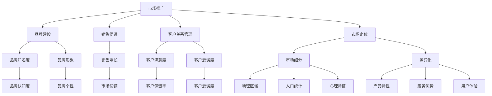

                 

### 文章标题：市场推广：高效触达用户

在当今数字化时代，市场推广已经成为了企业成功的关键因素。无论是新兴创业公司还是成熟大企业，都需要通过有效的市场推广策略来触达目标用户，提升品牌知名度，增加市场份额。本文将深入探讨市场推广的各个方面，包括其基础概念、策略、实战技巧以及效果评估方法，旨在帮助读者构建全面而深入的市场推广知识体系。

### 关键词

- 市场推广
- 用户触达
- 品牌建设
- 广告策略
- 社交媒体营销
- 项目管理

### 摘要

本文首先对市场推广进行概述，解释其概念与目标，并探讨市场推广在商业活动中的重要性。接着，详细介绍了市场调研的方法和数据分析，以及市场定位与目标客户分析。随后，文章重点讨论了品牌推广、广告推广和社交媒体营销等具体策略，提供了丰富的实战案例和优化建议。最后，文章总结了市场推广项目管理的要点，并提出了有效的效果评估和优化策略。通过这篇文章，读者将能够掌握市场推广的核心理论和实践方法，为企业的发展提供有力支持。

### 第一部分：市场推广基础

#### 第1章：市场推广概述

##### 1.1 市场推广的概念与目标

市场推广，即营销传播（Marketing Communication），是企业通过一系列有计划、有目的的传播活动，向目标市场和潜在用户传递产品或服务的价值信息，以促进销售和提升品牌知名度。其核心目标包括增加市场份额、提升品牌形象、增强用户忠诚度以及实现销售增长。

**市场推广的基本概念**：

1. **定位**：企业在市场中的位置和角色，即如何通过差异化来在用户心中建立独特的品牌形象。
2. **目标市场**：企业选择并致力于服务的市场细分，通常包括地理区域、人口统计特征、心理特征和生活方式等。
3. **市场细分**：将整个市场划分为具有相似需求和行为特征的子市场，以便企业能够更精准地满足不同用户群体的需求。
4. **差异化**：通过产品特性、服务优势或用户体验等方面的差异来吸引和保留客户。

**市场推广的目标**：

1. **品牌知名度**：提升品牌在目标市场中的知名度和认知度。
2. **销售增长**：通过市场推广活动直接促进销售业绩的提升。
3. **客户忠诚度**：增强用户对品牌的忠诚度，减少客户流失率。
4. **市场份额**：扩大企业产品或服务的市场份额，提高行业竞争力。

##### 1.2 市场推广的历史与发展

市场推广的概念和实践可以追溯到19世纪末20世纪初，当时的主要形式是广告和销售推广。随着技术的发展和消费者行为的变迁，市场推广经历了多次重要的演变：

- **19世纪末到20世纪初期**：广告和销售推广成为主要的市场推广手段，报纸、杂志和广播成为主要传播渠道。
- **20世纪中期**：市场营销学开始兴起，企业开始注重市场调研和数据分析，市场细分和定位策略得到广泛应用。
- **20世纪末到21世纪初**：随着互联网和数字技术的发展，市场推广进入数字化时代，电子邮件营销、社交媒体营销、搜索引擎营销等新形式涌现。
- **21世纪**：大数据、人工智能和物联网技术的应用进一步推动了市场推广的变革，个性化营销、精准营销成为新的趋势。

##### 1.3 市场推广在商业中的作用

市场推广在商业活动中扮演着至关重要的角色，具体体现在以下几个方面：

- **品牌建设**：通过有效的市场推广策略，企业可以树立品牌形象，提高品牌知名度，从而在竞争激烈的市场中脱颖而出。
- **销售促进**：市场推广活动可以刺激消费者的购买欲望，直接推动销售增长。
- **客户关系管理**：通过市场推广，企业可以与客户建立良好的关系，增强客户满意度和忠诚度，减少客户流失。
- **市场定位**：市场推广帮助企业确定其在市场中的位置，从而制定有针对性的营销策略，实现差异化竞争。
- **风险分散**：通过多渠道、多策略的市场推广，企业可以降低市场风险，避免过度依赖单一市场或销售渠道。

总之，市场推广是企业实现长期发展的关键手段，它不仅能够提升企业的市场竞争力，还能够为企业带来持续的商业价值。通过深入理解市场推广的基本概念和目标，企业可以更好地制定和实施有效的市场推广策略，从而在激烈的市场竞争中立于不败之地。

##### 1.4 市场推广的核心概念联系

为了更好地理解市场推广的核心概念及其相互关系，我们可以使用Mermaid流程图来描绘这些概念之间的联系。



通过这个Mermaid流程图，我们可以清晰地看到市场推广的核心概念及其之间的相互关系。品牌建设、销售促进、客户关系管理和市场定位是市场推广的四大支柱，它们共同作用，帮助企业实现市场推广的目标。每个支柱又由一系列子概念构成，这些子概念进一步细化了市场推广的各个方面。

##### 1.5 市场推广的核心算法原理讲解

在市场推广中，核心算法原理对于优化推广效果至关重要。以下是一个简单的算法流程，用于指导市场推广策略的制定和执行：

```plaintext
1. 数据收集：收集市场数据、用户行为数据、销售数据等。
2. 数据预处理：清洗和整合数据，确保数据质量。
3. 市场细分：使用聚类算法（如K-means）将市场划分为不同的用户群体。
4. 用户行为分析：分析用户在网站、APP等平台上的行为，识别用户兴趣和需求。
5. 定位策略制定：根据市场细分和用户行为分析结果，确定品牌定位和推广策略。
6. 优化策略：使用机器学习算法（如回归分析、协同过滤等）不断调整和优化推广策略。
7. 实施与监控：执行推广策略，并实时监控推广效果，根据反馈进行进一步调整。
```

以上流程中的每一步都涉及到特定的算法原理和应用，如聚类算法用于市场细分，回归分析用于预测销售趋势，协同过滤用于推荐系统。这些算法的运用不仅能够提高市场推广的精确性，还能够帮助企业更高效地实现市场目标。

##### 1.6 市场推广的数学模型和公式讲解及举例说明

在市场推广中，数学模型和公式可以帮助我们量化市场推广效果，优化决策过程。以下是一个简单的数学模型示例，用于计算市场推广ROI（投资回报率）：

$$
ROI = \frac{净利润}{总投入成本}
$$

其中，净利润是指通过市场推广活动实现的销售额减去营销成本，总投入成本包括广告费用、人力成本和其他相关费用。

**举例说明**：

假设一家企业通过市场推广活动实现了100万元的销售收入，营销成本为50万元，则其市场推广的ROI计算如下：

$$
ROI = \frac{100万元}{50万元} = 2
$$

这意味着每投入1元，企业可以获得2元的净利润，ROI为2表示市场推广活动是有效的。

通过类似的数学模型，企业可以进一步分析市场推广的效果，调整推广策略，实现资源的最优配置。

### 第2章：市场调研

市场调研是市场推广的基础环节，通过系统地收集、分析和解读市场信息，企业可以更准确地了解市场需求、竞争态势以及目标客户的行为特征。以下将详细探讨市场调研的方法、数据分析和市场定位与目标客户分析。

##### 2.1 市场调研的方法

市场调研的方法可以分为定性调研和定量调研两种。

**定性调研**：

1. **深度访谈**：通过与目标用户进行一对一访谈，深入了解用户的需求、偏好和行为。
2. **小组讨论**：邀请一组具有相似特征的用户，进行集体讨论，收集多角度的观点和建议。
3. **观察法**：在真实环境中观察用户的行为，获取直观的市场信息。
4. **内容分析**：分析相关内容（如社交媒体帖子、新闻报道等），了解市场趋势和用户态度。

**定量调研**：

1. **问卷调查**：通过设计问卷，收集大量用户的数据，用于统计分析。
2. **实验研究**：通过实验方法，控制变量，观察不同推广策略对市场反应的影响。
3. **数据分析**：利用统计软件对调研数据进行处理和分析，提取有价值的信息。

**定量调研与定性调研的比较**：

- **数据类型**：定量调研侧重于量化数据，定性调研侧重于深入理解和发现。
- **样本规模**：定量调研通常需要较大规模的样本，以提高数据的代表性；定性调研则更注重深度，样本量相对较小。
- **应用场景**：定量调研适用于大规模市场分析，定性调研适用于深入了解特定问题或用户群体。

##### 2.2 市场数据分析

市场数据分析是市场调研的核心环节，通过分析市场趋势、竞争对手和目标客户，企业可以制定更有效的市场推广策略。

**市场趋势分析**：

1. **行业趋势**：分析所处行业的整体发展趋势，包括市场规模、增长速度、技术变革等。
2. **市场细分趋势**：了解不同市场细分领域的发展状况和未来趋势。
3. **消费者行为趋势**：分析消费者购买行为、消费偏好和需求变化。

**竞争对手分析**：

1. **市场份额**：了解竞争对手的市场份额、增长速度和市场地位。
2. **产品特点**：分析竞争对手的产品特点、优势和劣势。
3. **营销策略**：研究竞争对手的市场推广策略，包括广告、促销、公关等。

**目标客户分析**：

1. **人口统计特征**：分析目标客户的人口统计特征，如年龄、性别、收入、教育程度等。
2. **心理特征**：了解目标客户的心理需求、价值观和行为模式。
3. **生活方式**：分析目标客户的生活方式、消费习惯和兴趣爱好。

##### 2.3 市场定位与目标客户分析

市场定位是市场推广策略的核心，通过明确市场定位和目标客户，企业可以更精准地制定市场推广方案。

**市场定位策略**：

1. **差异化定位**：通过产品特性、服务质量或用户体验等差异化因素，在市场中建立独特的品牌形象。
2. **成本领先定位**：以较低的成本提供优质的产品或服务，吸引价格敏感的客户群体。
3. **细分市场定位**：针对特定市场细分领域，提供定制化的解决方案。

**目标客户分析**：

1. **需求分析**：深入了解目标客户的需求，包括核心需求、潜在需求和期望需求。
2. **客户价值**：评估目标客户对企业盈利的贡献，识别高价值客户群体。
3. **客户细分**：根据不同特征将目标客户划分为不同的群体，制定有针对性的推广策略。

通过市场调研和数据分析，企业可以更全面地了解市场环境、竞争对手和目标客户，从而制定更有效的市场推广策略，实现长期发展。

### 第3章：市场推广策略

市场推广策略是企业在市场推广过程中采用的一系列方法和手段，旨在实现品牌知名度提升、市场份额增加等目标。本章将详细探讨品牌推广、广告推广和社交媒体营销等市场推广策略，并分析其优缺点和适用场景。

##### 3.1 品牌推广策略

品牌推广是市场推广的重要组成部分，通过一系列策略和活动，企业可以在目标市场中建立和提升品牌形象。

**品牌定位**：

品牌定位是品牌推广的第一步，它决定了品牌在市场中的地位和角色。成功的品牌定位需要考虑以下几个方面：

1. **目标市场**：明确品牌目标市场，包括目标客户群体和其需求。
2. **差异化**：通过独特的产品特性、服务质量或用户体验，与其他竞争对手区分开来。
3. **价值主张**：明确品牌的核心价值，传递给目标客户，使其产生共鸣。

**品牌形象设计**：

品牌形象设计是品牌推广的重要环节，它包括品牌名称、标志、色彩方案、字体等视觉元素。成功的品牌形象设计需要具备以下特点：

1. **一致性**：品牌形象设计应与品牌定位一致，传达品牌的核心价值和理念。
2. **辨识度**：设计应具有高辨识度，能够在竞争激烈的市场中脱颖而出。
3. **适应性**：设计应具备一定的灵活性，能够适应不同渠道和场景的需求。

**品牌传播渠道**：

品牌传播渠道是品牌信息传递给目标客户的重要途径，常见的品牌传播渠道包括：

1. **广告**：通过电视、广播、报纸、杂志等传统媒体进行品牌广告投放。
2. **社交媒体**：利用Facebook、Instagram、微博、微信等社交媒体平台进行品牌推广。
3. **内容营销**：通过博客、视频、白皮书、案例分析等高质量内容，提升品牌知名度和影响力。
4. **公关活动**：通过新闻发布会、产品发布会、赞助活动等公关活动，提升品牌曝光度。

**品牌推广实战案例**：

- **案例1：小米**：小米通过“发烧友营销”策略，在社交媒体上与用户互动，建立了强大的品牌社区，提高了品牌知名度和用户忠诚度。
- **案例2：苹果**：苹果通过独特的产品设计和创新的广告创意，成功塑造了高端品牌形象，吸引了大量消费者。

**品牌推广的优缺点**：

- **优点**：品牌推广有助于提升品牌知名度、塑造品牌形象、增强客户忠诚度。
- **缺点**：品牌推广需要较高的投入和长期的持续投入，效果可能较慢显现。

**适用场景**：品牌推广适用于所有类型的企业，特别是那些希望提升品牌形象和市场份额的企业。

##### 3.2 广告推广策略

广告推广是企业通过付费方式向目标客户传递产品或服务信息的一种市场推广手段。有效的广告推广策略可以迅速提升品牌知名度和销售业绩。

**广告定位**：

广告定位是广告推广的核心，决定了广告的目标受众和传播内容。广告定位需要考虑以下几个方面：

1. **目标受众**：明确广告的目标受众，包括其年龄、性别、收入、兴趣等。
2. **传播内容**：根据目标受众的特点，设计有针对性的广告内容和传播策略。
3. **广告形式**：选择适合目标受众的广告形式，如视频广告、图文广告、互动广告等。

**广告创意**：

广告创意是广告推广成功的关键，它需要具备吸引力、独特性和创新性。优秀的广告创意可以引发用户的兴趣和共鸣，从而提高广告的点击率和转化率。

1. **故事性**：通过讲述一个有趣、感人的故事，引起用户的情感共鸣。
2. **互动性**：设计互动式广告，如问答、抽奖等，吸引用户参与。
3. **创新性**：采用新颖的创意形式，如VR、AR等，提升广告的趣味性和吸引力。

**广告投放策略**：

广告投放策略决定了广告的投放渠道、时间和预算。以下是一些常见的广告投放策略：

1. **精准投放**：根据用户行为、兴趣和地理位置等数据，精准定位广告投放。
2. **多渠道投放**：通过多种广告渠道（如搜索引擎、社交媒体、视频平台等）进行广告投放，提高广告覆盖面。
3. **季节性投放**：根据市场趋势和消费者行为，合理安排广告投放时间，提高广告效果。

**广告推广实战案例**：

- **案例1：可口可乐**：可口可乐通过创意广告，如“分享快乐”系列广告，成功塑造了其积极、快乐的品牌形象。
- **案例2：耐克**：耐克通过明星代言和体育赛事赞助，成功提升了品牌知名度和市场占有率。

**广告推广的优缺点**：

- **优点**：广告推广能够迅速提升品牌知名度、增加销售量，具有较强的传播效果。
- **缺点**：广告成本较高，且效果可能因广告创意和定位不当而大打折扣。

**适用场景**：广告推广适用于所有类型的企业，特别是那些希望快速提升品牌知名度和销售业绩的企业。

##### 3.3 社交媒体营销策略

社交媒体营销是利用社交媒体平台（如Facebook、Instagram、微博、微信等）进行品牌推广和用户互动的一种市场推广手段。随着社交媒体的普及，社交媒体营销已经成为企业重要的市场推广渠道。

**社交媒体平台类型**：

1. **社交媒体平台**：如Facebook、Instagram、微博等，用于发布品牌内容、与用户互动。
2. **社交网络平台**：如LinkedIn、Twitter等，用于建立职业网络、分享行业动态。
3. **社交论坛**：如Reddit、知乎等，用于讨论行业话题、解答用户问题。

**社交媒体营销的优势**：

1. **互动性强**：社交媒体平台提供丰富的互动功能，如评论、点赞、分享等，有利于品牌与用户建立良好的互动关系。
2. **传播速度快**：社交媒体平台的用户数量庞大，一条优质内容可以迅速传播，提高品牌曝光度。
3. **精准投放**：通过用户行为和兴趣数据，可以精准定位目标受众，提高广告投放效果。

**社交媒体营销策略**：

1. **内容策略**：发布高质量、有价值的内容，吸引用户关注和互动。
2. **互动策略**：积极与用户互动，回复评论、参与讨论，提升用户满意度。
3. **KOL营销**：与行业意见领袖合作，利用其影响力和用户基础，提升品牌知名度和影响力。

**社交媒体营销实战案例**：

- **案例1：红牛**：红牛通过社交媒体平台发布极限运动视频和赛事报道，成功吸引了大量年轻用户，提升了品牌形象。
- **案例2：Nike**：Nike通过Instagram发布明星运动员的训练和生活照片，利用粉丝效应提升了品牌知名度和用户互动率。

**社交媒体营销的优缺点**：

- **优点**：互动性强、传播速度快、精准投放，能够快速提升品牌知名度和用户参与度。
- **缺点**：需要持续投入时间和资源进行内容创作和用户互动，效果可能因内容质量不足而大打折扣。

**适用场景**：社交媒体营销适用于所有类型的企业，特别是那些希望提高品牌知名度和用户互动度的企业。

### 第4章：广告推广

广告推广是企业通过付费方式在媒体上展示其产品或服务信息，以吸引潜在客户和提升品牌知名度的重要手段。本章将详细探讨广告推广的策略、网络广告推广的方法以及不同类型的广告效果对比。

#### 4.1 广告推广策略

广告推广策略的核心在于精准定位目标受众、创造有吸引力的广告内容，并选择合适的投放渠道以最大化广告效果。以下是一些关键策略：

**广告定位**：

广告定位是广告推广的基础，决定了广告的目标受众和传播内容。成功的广告定位应考虑以下几个方面：

1. **目标受众**：明确广告的目标受众，包括其年龄、性别、收入水平、兴趣爱好等。通过精准定位，确保广告信息能够触及潜在客户。
2. **产品特性**：根据产品特性选择合适的广告定位，如高端产品可能选择高端定位，大众产品则可采取大众化定位。
3. **市场竞争**：分析竞争对手的广告定位和策略，避免与其正面冲突，寻找差异化的定位点。

**广告创意**：

广告创意是吸引受众注意力、激发兴趣的关键。优秀的广告创意应具备以下特点：

1. **独特性**：以独特的方式展现产品或服务的特点，避免与竞争对手的雷同。
2. **情感性**：通过情感共鸣，如感人故事、幽默元素等，增强广告的吸引力和记忆度。
3. **互动性**：设计互动式广告，如问答、投票等，提高用户参与度。

**广告投放策略**：

广告投放策略决定了广告的投放渠道、时间和预算。以下是一些常见的广告投放策略：

1. **多渠道投放**：利用多种广告渠道（如搜索引擎、社交媒体、视频平台等），提高广告覆盖面和曝光度。
2. **精准投放**：根据用户行为、兴趣和地理位置等数据，进行精准定位，提高广告投放效果。
3. **季节性投放**：根据市场趋势和消费者行为，合理安排广告投放时间，如在节假日或促销季节增加广告投放。

#### 4.2 网络广告推广

随着互联网的普及，网络广告已经成为企业广告推广的重要渠道。以下是一些常见的网络广告推广方法和类型：

**搜索引擎广告**：

搜索引擎广告（如Google AdWords、百度推广）是按点击付费的广告形式，广告出现在搜索结果页面的顶部或侧边栏，当用户点击广告时，企业需要支付费用。

1. **关键词选择**：选择与产品或服务相关的关键词，确保广告能够精准展示给有需求的用户。
2. **广告创意**：设计吸引人的广告文案和图片，提高点击率。
3. **投放策略**：根据用户搜索习惯和地域分布，合理安排广告投放时间和地域。

**社交媒体广告**：

社交媒体广告（如Facebook广告、Instagram广告、微博广告）是按曝光或点击付费的广告形式，广告出现在社交媒体平台的信息流中，用户可以点击广告进入产品或服务页面。

1. **目标定位**：根据用户兴趣、行为和人口统计信息，精准定位目标受众。
2. **广告内容**：设计引人注目的广告内容，包括图片、视频、文案等，吸引用户关注。
3. **广告投放**：选择合适的广告形式（如横幅广告、视频广告、故事广告等）和投放渠道，提高广告效果。

**显示广告**：

显示广告（如横幅广告、弹窗广告、插页广告等）是按展示次数付费的广告形式，广告出现在网站或APP的页面上，用户浏览页面时可以看到。

1. **广告位置**：选择合适的广告位置，确保广告能够被用户看到，如页面顶部、底部或侧边栏。
2. **广告形式**：设计吸引人的广告形式，提高用户点击率。
3. **投放策略**：根据用户浏览行为和广告效果，不断调整广告投放策略。

#### 4.3 不同类型广告效果对比

不同类型的广告推广各有优缺点，企业在选择广告类型时需综合考虑广告目标、预算和受众特性。

1. **搜索引擎广告**：

   - **优点**：精准度高，可以迅速将潜在客户引导至产品或服务页面。
   - **缺点**：成本较高，且需要持续投入，效果可能因竞争激烈而受到影响。

2. **社交媒体广告**：

   - **优点**：覆盖面广，互动性强，广告效果易于衡量。
   - **缺点**：用户注意力分散，广告容易被忽略，效果可能因广告创意不足而大打折扣。

3. **显示广告**：

   - **优点**：成本低，广告展示频率高，能够吸引大量用户关注。
   - **缺点**：广告精准度较低，用户点击率可能较低，且效果难以衡量。

**总结**：

广告推广是企业提升品牌知名度、增加销售量的重要手段。通过合理的广告定位、创意设计和投放策略，企业可以最大化广告效果，实现营销目标。同时，企业应根据不同广告类型的优缺点，结合自身需求和预算，选择合适的广告推广方式。

### 第5章：社交媒体营销

社交媒体营销已经成为现代市场推广的重要组成部分。通过有效的社交媒体营销策略，企业可以与目标用户建立紧密的联系，提升品牌影响力，并实现销售目标。本章将详细探讨社交媒体营销的概述、策略及其在市场推广中的优势。

#### 5.1 社交媒体营销概述

社交媒体营销是指企业利用社交媒体平台（如Facebook、Instagram、微博、微信等）进行品牌推广、用户互动和内容传播的一系列营销活动。其核心目标是通过社交媒体平台与用户建立互动关系，增强用户参与度和忠诚度，从而提升品牌知名度和市场占有率。

**社交媒体平台类型**：

1. **社交媒体平台**：如Facebook、Instagram、微博等，用于发布品牌内容、与用户互动。
2. **社交网络平台**：如LinkedIn、Twitter等，用于建立职业网络、分享行业动态。
3. **社交论坛**：如Reddit、知乎等，用于讨论行业话题、解答用户问题。

**社交媒体营销的优势**：

1. **覆盖面广**：社交媒体平台拥有庞大的用户基础，企业可以通过这些平台接触到广泛的潜在用户。
2. **互动性强**：社交媒体平台提供丰富的互动功能，如评论、点赞、分享等，有助于企业与用户建立良好的互动关系。
3. **精准投放**：通过用户行为和兴趣数据，企业可以精准定位目标受众，提高广告投放效果。
4. **成本效益高**：相较于传统广告形式，社交媒体营销的成本较低，且效果易于衡量和优化。

#### 5.2 社交媒体营销策略

成功的社交媒体营销策略需要综合考虑内容策略、互动策略和KOL营销等多个方面。

**内容策略**：

内容策略是社交媒体营销的核心，优质的内容可以吸引用户关注并增强用户参与度。以下是一些关键内容策略：

1. **原创内容**：发布原创、有价值的内容，如文章、图片、视频等，以吸引和留住用户。
2. **多样内容**：结合多种内容形式，如文字、图片、视频、直播等，增加用户的参与感和兴趣。
3. **定期更新**：保持定期更新，确保内容的新鲜度和活跃度。
4. **用户参与**：鼓励用户参与内容创作和互动，如发起话题讨论、用户投票等。

**互动策略**：

互动策略是社交媒体营销的重要组成部分，通过积极的互动，企业可以提升用户满意度和忠诚度。以下是一些关键互动策略：

1. **及时回复**：及时回复用户评论和私信，展现企业的专业性和关注用户的态度。
2. **互动活动**：举办互动活动，如抽奖、问答、竞赛等，增加用户参与度和品牌曝光度。
3. **用户反馈**：积极收集用户反馈，了解用户需求和意见，不断优化产品和营销策略。
4. **内容分享**：鼓励用户分享品牌内容，扩大品牌传播范围。

**KOL营销**：

KOL（Key Opinion Leader）营销是指通过与行业意见领袖合作，利用其影响力和用户基础，提升品牌知名度和影响力。以下是一些关键KOL营销策略：

1. **选择合适的KOL**：根据品牌定位和目标受众，选择合适的KOL进行合作，确保其粉丝群体与品牌目标用户相符。
2. **内容合作**：与KOL合作创作内容，如联合发布文章、视频等，增强内容的影响力和可信度。
3. **品牌代言**：邀请KOL作为品牌代言人，利用其知名度和影响力，提升品牌形象和用户认知。
4. **互动引导**：通过KOL引导用户参与品牌活动，如转发、评论等，增强品牌互动和用户参与度。

#### 5.3 社交媒体营销案例分析

以下是一些社交媒体营销的成功案例，通过分析这些案例，我们可以了解成功的社交媒体营销策略和经验。

**案例1：杜蕾斯**：

杜蕾斯是中国社交媒体营销的典范，其成功的关键在于巧妙地利用热点事件和用户话题，进行创意广告和内容营销。以下是一些成功策略：

1. **热点营销**：杜蕾斯善于捕捉和利用热点事件，如节日、时事新闻等，发布相关内容，吸引用户关注。
2. **幽默营销**：杜蕾斯的内容通常以幽默风趣的方式呈现，引发用户共鸣和转发。
3. **互动营销**：杜蕾斯积极与用户互动，回复评论和私信，提高用户满意度和忠诚度。

**案例2：可口可乐**：

可口可乐通过社交媒体平台进行全球品牌推广，其成功策略包括：

1. **全球一致性**：可口可乐在全球范围内保持品牌一致性，确保其社交媒体营销策略与全球品牌形象相符。
2. **内容多样化**：可口可乐通过多种内容形式，如图片、视频、直播等，吸引用户关注。
3. **用户参与**：可口可乐鼓励用户参与内容创作和互动，如发起全球性挑战、用户投票等。

**案例3：Nike**：

Nike通过社交媒体平台与用户建立紧密联系，其成功策略包括：

1. **品牌故事**：Nike通过讲述品牌故事，传递品牌价值观和使命，增强用户情感共鸣。
2. **明星代言**：Nike与知名运动员和时尚偶像合作，利用其影响力和粉丝基础，提升品牌知名度和用户参与度。
3. **互动活动**：Nike定期举办互动活动，如线上竞赛、抽奖等，提高用户参与度和品牌忠诚度。

#### 5.4 社交媒体营销的挑战和风险

尽管社交媒体营销具有众多优势，但企业也面临一些挑战和风险：

1. **内容审核**：社交媒体平台对广告内容有严格的审核标准，企业需确保内容合规，避免违规。
2. **数据隐私**：社交媒体平台收集和处理大量用户数据，企业需注意数据隐私和合规性问题。
3. **用户反馈**：社交媒体平台上的负面反馈可能会影响品牌形象，企业需积极应对和解决用户问题。
4. **依赖性**：过度依赖社交媒体营销可能会忽视其他市场推广渠道，导致市场策略单一。

总之，成功的社交媒体营销需要企业深入了解目标受众、制定合适的内容和互动策略，并积极应对挑战和风险。通过不断创新和优化，企业可以在社交媒体平台上取得显著的市场推广成果。

### 第6章：市场推广项目管理

市场推广项目管理是确保市场推广活动高效执行和成功实现目标的关键。有效的项目管理不仅能够提高市场推广的效率，还能降低成本和风险。本章将详细探讨市场推广项目管理的各个关键环节，包括项目规划、团队管理和市场推广效果评估。

#### 6.1 市场推广项目规划

市场推广项目规划是项目管理的基础，包括设定项目目标、制定预算和时间表以及进行风险评估。

**项目目标设定**：

项目目标应明确、具体和可衡量，以便于后续的评估和监控。以下是一些关键目标：

1. **品牌知名度**：提升品牌在目标市场中的认知度和知名度。
2. **销售增长**：实现销售目标，如增加销售额或提高市场占有率。
3. **客户获取**：吸引新客户，增加用户注册量或下载量。
4. **客户忠诚度**：提高现有客户的满意度和忠诚度，减少客户流失率。

**项目预算与时间规划**：

制定合理的预算和时间表是市场推广项目成功的关键。以下是一些建议：

1. **预算分配**：根据项目目标，合理分配预算，包括广告费用、人力资源、技术支持等。
2. **时间规划**：制定详细的项目时间表，明确每个阶段的时间节点和任务，确保项目按时完成。
3. **风险评估**：识别项目可能面临的风险，如市场变化、预算超支、技术问题等，并制定相应的应对策略。

**项目风险评估**：

项目风险评估是项目管理的重要组成部分，旨在识别潜在风险，评估其可能带来的影响，并制定应对措施。以下是一些常见的风险评估步骤：

1. **风险识别**：列出所有可能影响项目的风险因素，如市场不稳定、技术障碍、资源限制等。
2. **风险分析**：评估每个风险的严重程度和发生概率，确定其优先级。
3. **风险应对**：针对不同风险，制定相应的应对策略，如风险规避、风险减轻、风险接受等。

#### 6.2 市场推广团队管理

有效的团队管理是市场推广项目成功的关键。以下是一些团队管理的要点：

**团队组建**：

1. **明确角色和职责**：根据项目需求，明确团队成员的角色和职责，确保每个成员都了解自己的任务和期望成果。
2. **人员选拔**：选拔具备相关技能和经验的人员，确保团队具备完成项目所需的能力。
3. **团队培训**：定期进行培训，提升团队成员的专业技能和团队协作能力。

**团队协作与沟通**：

1. **建立有效的沟通机制**：确保团队内部的信息传递畅通无阻，避免信息孤岛和误解。
2. **定期会议**：定期召开项目会议，讨论项目进展、解决问题和制定下一步计划。
3. **协同工具**：使用协作工具（如Trello、Slack等），提高团队协作效率和透明度。

**团队激励机制**：

1. **明确奖励机制**：制定明确的奖励机制，对表现优秀的团队成员给予奖励和认可。
2. **团队建设**：定期组织团队建设活动，增强团队凝聚力和合作精神。
3. **职业发展**：提供职业发展机会，激励团队成员不断提升自身能力。

#### 6.3 市场推广效果评估

市场推广效果评估是衡量市场推广活动成功与否的重要环节。以下是一些常见的评估方法：

**销售数据分析**：

通过分析销售数据，如销售额、销售增长率、客户转化率等，评估市场推广活动对销售业绩的影响。以下是一些关键指标：

1. **销售额**：市场推广活动直接带来的销售额增长。
2. **销售增长率**：市场推广活动导致的销售增长率。
3. **客户转化率**：市场推广活动成功吸引的新客户的转化率。

**品牌认知度分析**：

通过调查和数据分析，了解市场推广活动对品牌认知度的影响。以下是一些关键指标：

1. **品牌知名度**：市场推广活动提高的品牌知名度。
2. **品牌认知度**：市场推广活动增强的品牌认知度。
3. **品牌印象**：市场推广活动塑造的品牌印象。

**用户反馈分析**：

通过用户反馈，了解市场推广活动的实际效果和用户满意度。以下是一些常见的方法：

1. **问卷调查**：通过设计问卷，收集用户对市场推广活动的反馈。
2. **在线调查**：在社交媒体平台或网站上进行在线调查，获取用户反馈。
3. **用户评论**：分析用户在社交媒体平台或论坛上的评论，了解用户对市场推广活动的态度。

**数据驱动的策略调整**：

基于效果评估结果，对市场推广策略进行数据驱动的调整和优化。以下是一些关键步骤：

1. **分析评估数据**：深入分析评估数据，识别成功和失败的环节。
2. **制定优化策略**：根据分析结果，制定具体的优化策略，如调整广告定位、优化内容策略等。
3. **持续监控和调整**：在实施优化策略后，持续监控和评估效果，根据实际情况进行进一步调整。

通过有效的市场推广项目管理，企业可以确保市场推广活动的成功实施和持续优化，实现长期的市场竞争优势。

### 第7章：市场推广效果评估

市场推广效果评估是确保市场推广策略有效性和优化推广活动的重要环节。通过科学的方法评估市场推广效果，企业可以了解各项推广活动的实际效果，并根据评估结果调整和优化推广策略。本章将详细探讨市场推广效果评估的方法、数据分析以及优化策略。

#### 7.1 市场推广效果评估方法

市场推广效果评估方法可以分为定量评估和定性评估两类。

**定量评估**：

定量评估主要通过数据分析和关键绩效指标（KPI）来衡量市场推广活动的效果。以下是一些常见的定量评估方法：

1. **销售数据分析**：通过分析销售数据，如销售额、销售增长率、客户转化率等，评估市场推广活动对销售业绩的影响。
2. **网站流量分析**：通过分析网站访问量、访客来源、页面浏览量等数据，评估市场推广活动对网站流量的贡献。
3. **社交媒体分析**：通过分析社交媒体平台的关注者数量、互动率、转发率等数据，评估市场推广活动在社交媒体上的效果。

**定性评估**：

定性评估主要通过用户反馈和调查来了解市场推广活动的实际效果。以下是一些常见的定性评估方法：

1. **用户满意度调查**：通过设计问卷或在线调查，收集用户对市场推广活动的满意度和反馈。
2. **深度访谈**：通过与目标用户进行一对一访谈，深入了解用户对市场推广活动的看法和体验。
3. **焦点小组**：邀请一组目标用户进行集体讨论，收集多角度的观点和建议。

**综合评估**：

为了全面了解市场推广效果，企业通常采用综合评估方法，结合定量和定性评估结果，从多个维度分析市场推广活动的效果。

#### 7.2 销售数据分析

销售数据是评估市场推广效果的重要依据。以下是一些关键的指标和计算方法：

**销售额**：

销售额是市场推广活动直接带来的收益，可以通过以下公式计算：

$$
销售额 = 活动前销售额 + 活动期间新增销售额 - 活动期间减少的销售额
$$

**销售增长率**：

销售增长率用于衡量市场推广活动对销售业绩的影响，计算公式如下：

$$
销售增长率 = \frac{活动期间新增销售额}{活动前销售额}
$$

**客户转化率**：

客户转化率是衡量市场推广活动成功吸引和转化客户的能力，计算公式如下：

$$
客户转化率 = \frac{活动期间新客户数量}{活动期间访问量}
$$

**客户保留率**：

客户保留率用于衡量市场推广活动对客户忠诚度的影响，计算公式如下：

$$
客户保留率 = \frac{活动后仍然活跃的客户数量}{活动前活跃客户数量}
$$

**示例**：

假设一家企业在进行市场推广活动前一个月的销售额为100万元，活动期间新增销售额为20万元，活动后一个月的销售额为120万元，活动期间新客户数量为1000人，活动期间访问量为10000人，活动前活跃客户数量为500人，活动后仍然活跃客户数量为600人。则：

- **销售额**：120万元
- **销售增长率**：20%
- **客户转化率**：10%
- **客户保留率**：20%

#### 7.3 品牌认知度分析

品牌认知度是市场推广效果的另一个重要指标，可以通过以下方法进行评估：

**品牌知名度**：

品牌知名度用于衡量市场推广活动提高品牌在目标市场中的认知度。可以通过以下指标进行评估：

1. **品牌提及率**：市场推广活动期间，品牌在社交媒体、新闻报道等渠道中被提及的频率。
2. **品牌搜索量**：市场推广活动期间，品牌在搜索引擎中的搜索量变化。

**品牌认知度**：

品牌认知度用于衡量市场推广活动增强品牌在用户心中的认知程度。可以通过以下方法进行评估：

1. **品牌评价**：通过用户评价、调查问卷等了解用户对品牌的整体评价和认知。
2. **品牌偏好**：通过用户选择、市场调研等了解用户对品牌的偏好程度。

**示例**：

假设市场推广活动前，品牌在社交媒体上的提及率为100次/月，品牌搜索量为500次/天；活动后，品牌在社交媒体上的提及率为300次/月，品牌搜索量为800次/天。则：

- **品牌提及率**：增加了150%
- **品牌搜索量**：增加了60%

这些数据表明市场推广活动有效提高了品牌的知名度和用户认知度。

#### 7.4 用户反馈分析

用户反馈是了解市场推广活动实际效果的重要途径。以下是一些常见的方法和指标：

**用户满意度调查**：

通过设计问卷或在线调查，收集用户对市场推广活动的满意度。以下是一些关键指标：

1. **总体满意度**：用户对市场推广活动的整体满意度。
2. **具体满意度**：用户对市场推广活动中的不同方面（如广告内容、促销活动、互动体验等）的满意度。

**深度访谈**：

通过与目标用户进行一对一访谈，深入了解用户对市场推广活动的看法和体验。以下是一些关键问题：

1. **活动效果**：用户对市场推广活动效果的评价。
2. **活动体验**：用户对市场推广活动的体验感受。
3. **改进建议**：用户对市场推广活动的改进建议。

**焦点小组**：

邀请一组目标用户进行集体讨论，收集多角度的观点和建议。以下是一些关键步骤：

1. **讨论引导**：通过引导性问题，引导用户讨论市场推广活动的效果和体验。
2. **记录反馈**：记录用户在讨论中的观点和建议，用于后续分析和改进。

#### 7.5 数据驱动的策略调整

基于市场推广效果评估结果，企业可以通过数据驱动的策略调整，优化市场推广活动。以下是一些关键步骤：

**分析评估数据**：

深入分析评估数据，识别成功和失败的环节，找出存在的问题和机会。

**制定优化策略**：

根据分析结果，制定具体的优化策略，如调整广告定位、优化内容策略、增加用户互动等。

**实施优化策略**：

将优化策略付诸实施，并在实施过程中持续监控和评估效果。

**持续优化**：

根据优化策略的实施效果，不断调整和优化市场推广活动，实现持续改进。

通过科学的市场推广效果评估和数据驱动的策略调整，企业可以不断提高市场推广活动的效果，实现长期的市场竞争优势。

### 附录

#### 附录A：市场推广工具与资源

在市场推广过程中，选择合适的工具和资源是确保推广活动顺利进行的关键。以下是一些常用的市场推广工具和资源，涵盖了市场调研、社交媒体营销、广告推广等多个方面。

**市场调研工具**：

1. **Google Analytics**：一款强大的网站流量分析工具，可以帮助企业了解用户行为、流量来源和用户转化等关键数据。
2. **SurveyMonkey**：一款在线调查工具，可用于设计问卷、收集用户反馈和市场调研。
3. **Ahrefs**：一款SEO工具，用于网站排名分析、关键字研究和竞争对手监测。

**社交媒体营销工具**：

1. **Hootsuite**：一款社交媒体管理工具，可以帮助企业统一管理和发布社交媒体内容，并监控互动。
2. **Buffer**：一款社交媒体发布和管理工具，提供灵活的发布时间和自动化功能。
3. **Canva**：一款图形设计工具，适用于创建社交媒体图像和宣传材料。

**广告推广平台与资源**：

1. **Google AdWords**：谷歌的广告平台，提供多种广告类型，如搜索广告、展示广告和视频广告。
2. **Facebook Ads Manager**：Facebook的广告管理工具，帮助企业创建、管理广告系列和跟踪广告效果。
3. **AdRoll**：一款再营销工具，通过在用户浏览网站后的多个渠道上展示广告，提高转化率。

**内容营销工具**：

1. **HubSpot**：一款营销自动化工具，提供内容管理、SEO优化、邮件营销等功能。
2. **SEOmoz**：一款SEO工具，用于网站优化、关键字研究和竞争对手分析。
3. **ContentCal**：一款内容规划工具，可以帮助企业制定和发布内容计划。

**数据分析和可视化工具**：

1. **Tableau**：一款数据可视化工具，用于创建交互式报表和仪表板。
2. **Domo**：一款企业级数据分析平台，提供实时数据监控和可视化功能。
3. **Google Data Studio**：一款数据报表工具，可以将多个数据源整合到一起，创建专业的报表和仪表板。

通过使用这些工具和资源，企业可以更加高效地执行市场推广活动，优化推广效果，实现营销目标。

### 总结与展望

本文系统性地探讨了市场推广的各个方面，从基础概念到具体策略，再到效果评估和项目管理，为读者提供了一个全面的市场推广知识体系。通过了解市场推广的基本概念和目标，读者可以明确市场推广在企业运营中的重要性。在市场调研部分，读者学会了如何通过定性和定量调研来获取市场信息，并进行深入的数据分析。品牌推广、广告推广和社交媒体营销等策略的介绍，帮助读者掌握了不同市场推广手段的优缺点及其适用场景。通过实际案例的分析，读者可以看到成功市场推广策略的实践效果。

在市场推广项目管理部分，读者了解了如何制定项目规划、组建和管理团队，以及如何通过科学的方法评估市场推广效果并进行优化。这不仅提升了市场推广活动的效率，也为企业的长期发展提供了有力支持。

展望未来，随着科技的不断进步，市场推广将面临新的机遇和挑战。人工智能和大数据技术的应用，将使市场推广更加精准和高效。个性化营销、智能广告投放和智能客户服务将成为市场推广的新趋势。同时，企业需要不断适应市场变化，创新推广策略，以满足不断变化的目标客户需求。通过持续学习和实践，企业可以不断提升市场推广能力，实现可持续发展。

最后，感谢读者的耐心阅读。希望本文能够为您的市场推广实践提供有益的启示和指导。如果您有任何问题或建议，欢迎在评论区留言交流。让我们共同探索市场推广的无限可能！作者：AI天才研究院/AI Genius Institute & 禅与计算机程序设计艺术/Zen And The Art of Computer Programming。

