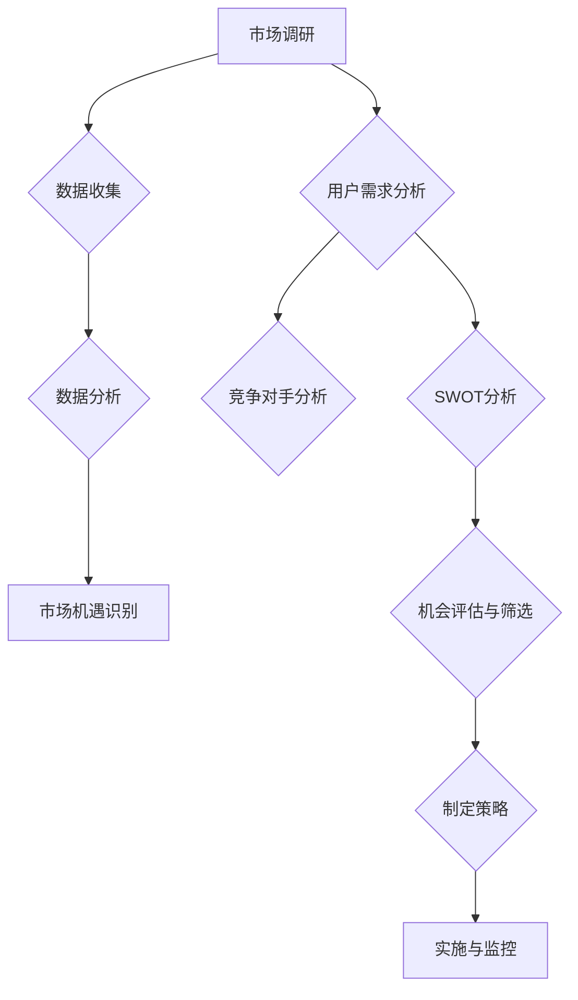

                 

# 市场机遇把握：大模型创业的关键所在

> 关键词：市场机遇、大模型、创业、技术趋势、风险与挑战

> 摘要：本文深入探讨了市场机遇与大模型创业的关系，分析了大模型技术的基础知识、市场机遇识别方法以及创业实践中的关键要素。通过详细阐述核心概念、算法原理、项目实战案例，本文旨在为创业者提供洞察力和实用策略，以把握大模型领域的市场机遇，应对风险与挑战。

### 第一部分：市场机遇概述

#### 第1章：市场机遇与创业环境

##### 1.1 市场机遇的概念与分类

**1.1.1 市场机遇的定义**

市场机遇是指在企业外部环境中出现的，能够为企业带来潜在利益的机会。这些机会可能是由于技术进步、市场需求变化、政策支持等多种因素引发的。

**1.1.2 市场机遇的分类**

市场机遇可以按照其来源和性质进行分类：

1. **技术机遇**：源于技术革新，如人工智能、大数据、物联网等。
2. **市场机遇**：由市场需求的变化引发，如新兴市场的需求、消费者偏好的变化等。
3. **政策机遇**：由政府政策支持带来的机会，如税收优惠、补贴政策等。
4. **社会机遇**：由社会变化带来的机会，如老龄化社会的需求、环保意识的提升等。

**1.1.3 创业机会与市场机遇的关系**

创业机会是市场机遇的一种表现形式，是创业者发现并利用市场机遇的机会。创业机会具有以下特征：

- **独特性**：具有独特的价值主张和竞争优势。
- **可验证性**：可以通过市场测试验证其可行性。
- **时效性**：机遇往往是短暂的，需要快速行动。
- **资源需求**：需要创业者具备一定的资源，如资金、技术、团队等。

##### 1.2 创业环境分析

**1.2.1 政策环境分析**

政策环境对创业具有重要影响。政府的政策支持、法律法规的完善程度以及税收政策等，都为创业者提供了良好的外部环境。

- **政策支持**：政府对创新创业的支持政策，如创业补贴、税收减免等，有助于降低创业成本，激发创业活力。
- **法律法规**：法律法规的完善程度决定了创业的合法性、合规性。创业者应关注与业务相关的法律法规，确保经营合法。
- **税收政策**：税收政策对创业企业的财务状况具有重要影响。合理的税收政策可以为创业者提供财政支持。

**1.2.2 经济环境分析**

经济环境是影响创业的重要因素。宏观经济状况、产业发展趋势、市场竞争状况等，都会对创业产生深远影响。

- **宏观经济状况**：稳定的宏观经济环境有助于创业项目的顺利实施。经济增长、就业率上升等指标均有利于创业。
- **产业发展趋势**：新兴产业的发展趋势为创业者提供了广阔的市场空间。例如，人工智能、物联网、生物科技等领域的快速发展，为创业者提供了新的机遇。
- **市场竞争状况**：市场竞争状况决定了创业项目的成功几率。在竞争激烈的市场中，创业者需要具备独特的竞争优势，才能脱颖而出。

**1.2.3 社会环境分析**

社会环境对创业也具有重要影响。人口结构、文化氛围、消费者需求等，都会对创业产生深远影响。

- **人口结构**：人口结构的变化会影响市场需求。例如，老龄化社会的到来，为养老、医疗等产业提供了新的机遇。
- **文化氛围**：文化氛围对创业项目的接受程度具有重要影响。开放、创新的文化氛围有利于创业项目的推广和实施。
- **消费者需求**：消费者需求的变化是创业项目成功的关键。了解消费者需求，有助于创业者开发出符合市场需求的产品。

##### 1.3 大模型创业的优势与挑战

**1.3.1 大模型创业的优势**

大模型创业具有以下优势：

- **技术创新**：大模型技术具有较高的技术含量，有助于提升企业的核心竞争力。
- **市场需求**：大模型技术广泛应用于各个领域，市场需求旺盛。
- **投资潜力**：大模型创业项目通常具有较好的投资回报潜力。
- **政策支持**：政府高度重视人工智能等前沿技术，为创业项目提供了政策支持。

**1.3.2 大模型创业的挑战**

大模型创业也面临以下挑战：

- **技术门槛**：大模型技术要求高，创业团队需要具备较强的技术实力。
- **数据资源**：大模型训练需要大量高质量数据，数据获取和清洗是关键问题。
- **计算资源**：大模型训练和推理需要大量计算资源，硬件设施和算法优化是关键。
- **法律合规**：大模型应用涉及隐私保护、数据安全等问题，需要严格遵守法律法规。

### 第二部分：大模型技术基础

#### 第2章：大模型技术概述

##### 2.1 大模型的基本原理

**2.1.1 大模型的定义**

大模型是指参数规模达到亿级以上的深度学习模型。这些模型具有强大的表征能力和灵活性，可以处理复杂的数据类型和任务。

**2.1.2 大模型的结构**

大模型通常由多层神经网络组成，包括输入层、隐藏层和输出层。隐藏层中的神经元数量往往较多，以实现复杂的非线性变换。

**2.1.3 大模型的工作原理**

大模型的工作原理基于深度学习技术。深度学习是一种机器学习范式，通过构建多层神经网络，实现对数据的自动特征提取和表示。

1. **数据输入**：将数据输入到输入层，数据经过神经网络的多层处理。
2. **特征提取**：隐藏层中的神经元对输入数据进行特征提取和变换，形成高层次的抽象表示。
3. **输出生成**：输出层根据隐藏层的特征生成预测结果或决策。

##### 2.2 大模型的核心算法

**2.2.1 深度学习算法**

深度学习算法是构建大模型的基础。常见的深度学习算法包括：

1. **神经网络**：神经网络是一种基于生物神经元工作原理的模型，通过多层非线性变换实现数据的表征。
2. **卷积神经网络（CNN）**：CNN 是专门用于处理图像数据的深度学习模型，通过卷积操作提取图像特征。
3. **循环神经网络（RNN）**：RNN 是用于处理序列数据的深度学习模型，通过循环结构实现长时记忆。
4. **生成对抗网络（GAN）**：GAN 是一种无监督学习模型，通过生成器和判别器的对抗训练生成高质量数据。

**2.2.2 自然语言处理算法**

自然语言处理算法是处理文本数据的关键技术。常见的自然语言处理算法包括：

1. **词向量表示**：将文本数据转化为向量表示，如 Word2Vec、GloVe 等。
2. **序列标注**：对文本序列进行分类和标注，如命名实体识别、情感分析等。
3. **文本生成**：基于深度学习模型生成高质量的文本，如生成式模型、序列到序列模型等。

**2.2.3 计算机视觉算法**

计算机视觉算法是处理图像数据的关键技术。常见的计算机视觉算法包括：

1. **图像分类**：对图像进行分类，如卷积神经网络、支持向量机等。
2. **目标检测**：检测图像中的物体，如 R-CNN、Faster R-CNN 等。
3. **图像分割**：对图像进行像素级别的分割，如 U-Net、SegNet 等。

##### 2.3 大模型的训练与优化

**2.3.1 数据集的收集与预处理**

数据集是训练大模型的基础。收集数据后，需要进行数据预处理，包括数据清洗、数据增强、数据标准化等。

**2.3.2 模型的训练策略**

大模型的训练需要采用合适的训练策略，包括：

1. **批量大小**：批量大小影响模型的训练速度和效果，通常采用较小的批量大小。
2. **学习率**：学习率影响模型的收敛速度和稳定性，需要根据实验结果调整。
3. **正则化**：正则化用于防止模型过拟合，包括 L1、L2 正则化等。

**2.3.3 模型的优化技巧**

大模型的优化技巧包括：

1. **梯度下降算法**：梯度下降算法是一种常用的优化方法，通过迭代更新模型参数。
2. **随机梯度下降（SGD）**：SGD 是梯度下降算法的一种变体，适用于大规模数据集。
3. **动量法**：动量法通过引入动量参数，加速模型的收敛速度。

### 第三部分：市场机遇识别

#### 第3章：市场机遇识别方法

##### 3.1 SWOT分析

**3.1.1 SWOT分析的概念**

SWOT分析是一种战略分析工具，用于评估企业的优势（Strengths）、劣势（Weaknesses）、机会（Opportunities）和威胁（Threats）。

**3.1.2 SWOT分析的应用**

SWOT分析可以应用于以下方面：

1. **企业战略规划**：帮助企业识别自身的优势、劣势、机会和威胁，制定合适的战略。
2. **市场机会识别**：通过分析市场环境，识别潜在的市场机会。
3. **竞争对手分析**：评估竞争对手的优势、劣势，制定相应的竞争策略。

**3.1.3 SWOT分析在市场机遇识别中的运用**

SWOT分析可以应用于市场机遇识别，具体步骤如下：

1. **分析优势**：识别企业内部的优势，如技术、品牌、资金等。
2. **分析劣势**：识别企业内部的劣势，如人才短缺、技术落后等。
3. **分析机会**：识别外部市场环境中的机会，如政策支持、市场需求等。
4. **分析威胁**：识别外部市场环境中的威胁，如竞争加剧、技术变革等。
5. **制定策略**：根据SWOT分析结果，制定相应的市场机遇识别和应对策略。

##### 3.2 市场调研

**3.2.1 市场调研的方法**

市场调研是识别市场机遇的重要手段。常见的方法包括：

1. **问卷调查**：通过设计问卷，收集消费者的意见和需求。
2. **访谈法**：通过与消费者、专家等进行深入访谈，获取有价值的信息。
3. **观察法**：通过观察消费者的行为，了解市场需求。
4. **实验法**：通过实验验证产品的市场表现和消费者接受程度。

**3.2.2 市场调研的数据分析**

市场调研的数据需要进行科学的分析，以识别市场机遇。数据分析的方法包括：

1. **描述性分析**：对调研数据的基本特征进行描述，如平均值、标准差等。
2. **相关性分析**：分析不同变量之间的相关性，如市场需求与价格之间的关系。
3. **回归分析**：建立变量之间的回归模型，预测市场需求等。
4. **聚类分析**：将消费者划分为不同的群体，分析不同群体的需求特征。

**3.2.3 市场调研在市场机遇识别中的运用**

市场调研可以应用于市场机遇识别，具体步骤如下：

1. **确定调研目标**：明确调研的目的和范围，如市场需求分析、竞争对手分析等。
2. **设计调研问卷**：根据调研目标，设计有针对性的调研问卷。
3. **实施调研**：通过问卷调查、访谈、观察等方式收集数据。
4. **数据分析**：对收集到的数据进行分析，识别市场机遇。
5. **制定策略**：根据调研结果，制定相应的市场机遇识别和应对策略。

##### 3.3 创业机会发现

**3.3.1 创业机会的类型**

创业机会可以分为以下几种类型：

1. **技术机会**：源于技术革新，如人工智能、大数据等。
2. **市场机会**：源于市场需求的变化，如新兴市场的需求、消费者偏好的变化等。
3. **政策机会**：源于政府政策支持，如创业补贴、税收减免等。
4. **社会机会**：源于社会变化，如老龄化社会的需求、环保意识的提升等。

**3.3.2 创业机会的识别**

创业机会的识别是创业者的重要任务。以下方法可以帮助创业者识别创业机会：

1. **市场分析**：通过市场调研，了解市场需求和竞争状况。
2. **技术分析**：跟踪技术发展趋势，识别潜在的技术机会。
3. **政策分析**：关注政府政策，识别政策机会。
4. **社会分析**：关注社会变化，识别社会机会。

**3.3.3 创业机会的评价**

创业机会的评价是创业者决策的重要依据。以下方法可以帮助创业者评价创业机会：

1. **商业潜力**：评估创业项目的市场前景和盈利能力。
2. **技术可行性**：评估创业项目所需的技术实力和研发能力。
3. **资源需求**：评估创业项目所需的资源，如资金、人才等。
4. **风险分析**：评估创业项目面临的风险，如市场风险、技术风险等。

### 第四部分：创业实践

#### 第4章：大模型创业实战

##### 4.1 创业团队组建

**4.1.1 创业团队的组建原则**

创业团队组建应遵循以下原则：

1. **互补性**：团队成员在技能、经验等方面具有互补性，能够共同完成任务。
2. **共同目标**：团队成员对创业项目具有共同的目标和愿景，能够齐心协力。
3. **沟通协作**：团队成员之间具备良好的沟通协作能力，能够有效分工合作。
4. **责任担当**：团队成员勇于承担责任，能够面对困难和挑战。

**4.1.2 创业团队的组建流程**

创业团队组建通常包括以下流程：

1. **确定创业方向**：根据市场需求、技术趋势等因素，确定创业方向。
2. **招募团队成员**：通过招聘、合作等方式，招募具备相关技能和经验的团队成员。
3. **组建团队**：明确团队成员的角色和职责，建立团队组织架构。
4. **培训和磨合**：对团队成员进行培训和磨合，提高团队的协作能力和执行力。

**4.1.3 创业团队的协作与沟通

创业团队的协作与沟通至关重要。以下方法可以帮助团队提高协作与沟通效率：

1. **明确目标**：确保团队成员对创业项目的目标有清晰的认识。
2. **定期会议**：定期召开团队会议，讨论项目进展、问题解决等。
3. **分工明确**：明确团队成员的职责和任务，避免重复工作和资源浪费。
4. **信息共享**：建立信息共享平台，确保团队成员能够及时获取相关信息。
5. **鼓励反馈**：鼓励团队成员提出意见和建议，促进团队的不断改进和进步。

##### 4.2 创业项目规划

**4.2.1 创业项目的立项**

创业项目的立项是创业团队的重要任务。以下方法可以帮助创业团队进行立项：

1. **确定项目目标**：明确创业项目的目标，如解决什么问题、满足什么需求等。
2. **市场调研**：进行市场调研，了解市场需求、竞争状况等。
3. **技术评估**：评估创业项目所需的技术可行性，如技术储备、研发周期等。
4. **资源需求**：评估创业项目所需的资源，如资金、人力等。
5. **风险评估**：评估创业项目面临的风险，如市场风险、技术风险等。

**4.2.2 创业项目的规划**

创业项目规划是确保创业项目顺利进行的重要步骤。以下方法可以帮助创业团队进行项目规划：

1. **制定项目计划**：明确创业项目的进度、任务、责任等。
2. **资源分配**：合理分配项目所需的资源，如资金、人力等。
3. **风险管理**：制定风险应对措施，降低项目风险。
4. **质量控制**：确保创业项目的质量符合预期。
5. **沟通协作**：确保团队成员之间的沟通与协作。

**4.2.3 创业项目的执行与监控**

创业项目的执行与监控是确保项目顺利推进的关键。以下方法可以帮助创业团队进行项目执行与监控：

1. **任务分解**：将项目任务分解为具体的可执行任务。
2. **进度跟踪**：定期跟踪项目进度，确保任务按时完成。
3. **问题解决**：及时解决项目执行过程中出现的问题。
4. **质量检查**：对项目成果进行质量检查，确保项目符合预期。
5. **反馈改进**：收集项目反馈，不断改进项目执行过程。

##### 4.3 创业资金管理

**4.3.1 创业资金的筹集**

创业资金的筹集是创业过程中的一项重要任务。以下方法可以帮助创业团队筹集资金：

1. **自筹资金**：通过创业者个人资金、家庭资金等自筹资金。
2. **天使投资**：寻找天使投资人，通过股权融资等方式筹集资金。
3. **风险投资**：与风险投资机构合作，通过股权融资等方式筹集资金。
4. **政府资金**：申请政府创业扶持资金、科技创新基金等。

**4.3.2 创业资金的分配**

创业资金的分配需要合理规划，以下方法可以帮助创业团队进行资金分配：

1. **固定成本**：包括房租、员工工资、设备采购等固定支出。
2. **可变成本**：包括研发费用、市场推广费用、运营费用等可变支出。
3. **资金储备**：为应对突发事件和风险，设立一定的资金储备。

**4.3.3 创业资金的监控与风险管理**

创业资金的监控与风险管理是确保资金安全的重要环节。以下方法可以帮助创业团队进行资金监控与风险管理：

1. **定期审计**：定期对资金使用情况进行审计，确保资金使用合理。
2. **预算管理**：制定预算计划，监控预算执行情况。
3. **风险预警**：建立风险预警机制，及时发现和处理风险。
4. **应急准备**：为应对突发事件，制定应急预案。

### 第五部分：风险与挑战应对

#### 第5章：创业风险与挑战应对

##### 5.1 风险管理

**5.1.1 风险管理的概念**

风险管理是指企业通过系统的方法识别、评估、控制和监控风险，以实现企业的战略目标。风险管理包括以下步骤：

1. **风险识别**：识别企业可能面临的风险，包括市场风险、技术风险、财务风险等。
2. **风险评估**：评估风险的可能性和影响程度，确定风险等级。
3. **风险控制**：采取控制措施，降低风险的发生概率和影响程度。
4. **风险监控**：对风险进行持续监控，确保风险控制措施的有效性。

**5.1.2 风险管理的流程**

风险管理的流程包括以下步骤：

1. **确定风险管理目标**：明确企业希望达到的风险管理目标。
2. **风险识别**：通过问卷调查、访谈、观察等方法识别企业面临的风险。
3. **风险评估**：对识别出的风险进行评估，确定风险的可能性和影响程度。
4. **风险控制**：制定风险控制措施，包括风险规避、风险转移、风险接受等。
5. **风险监控**：对风险控制措施进行监控，确保其有效性。

**5.1.3 风险管理在创业中的应用**

风险管理在创业中的应用主要体现在以下几个方面：

1. **初创期风险控制**：在初创期，企业需要重点关注市场风险、技术风险和财务风险，确保企业稳定发展。
2. **项目风险识别与评估**：在项目实施过程中，对项目风险进行识别和评估，确保项目顺利进行。
3. **风险管理策略制定**：根据风险识别和评估结果，制定相应的风险管理策略，降低风险对企业的影响。
4. **风险监控与调整**：对风险管理策略进行监控和调整，确保其持续有效。

##### 5.2 挑战应对

**5.2.1 挑战的类型**

创业过程中可能面临以下类型的挑战：

1. **市场挑战**：市场需求变化、竞争加剧等。
2. **技术挑战**：技术瓶颈、研发难度等。
3. **财务挑战**：资金不足、融资困难等。
4. **团队挑战**：人才流失、团队协作问题等。
5. **法律挑战**：合规风险、法律纠纷等。

**5.2.2 挑战的应对策略**

应对创业挑战的策略包括以下几个方面：

1. **市场挑战**：通过市场调研、产品创新、营销策略等应对市场变化和竞争压力。
2. **技术挑战**：加大技术研发投入，培养技术团队，提升企业技术实力。
3. **财务挑战**：通过融资、成本控制、财务管理等策略应对财务压力。
4. **团队挑战**：建立有效的团队管理机制，提高团队协作效率，加强人才培养。
5. **法律挑战**：遵守法律法规，建立法律风险防范机制，及时解决法律纠纷。

**5.2.3 挑战应对的案例分析**

以下是一个创业团队应对市场挑战的案例分析：

**案例背景**：一家初创公司致力于开发人工智能辅助的智能客服系统，面对市场竞争激烈、客户需求多变等挑战。

**应对策略**：

1. **市场调研**：通过定期进行市场调研，了解客户需求和市场动态。
2. **产品创新**：根据市场调研结果，不断优化产品功能，提高客户满意度。
3. **营销策略**：通过线上线下渠道，开展针对性营销活动，提高品牌知名度。
4. **客户关系管理**：建立完善的客户关系管理体系，提高客户忠诚度。

**案例结果**：通过有效的市场应对策略，该初创公司在竞争激烈的市场中取得了良好的业绩，赢得了客户的认可。

### 第六部分：成功案例分析

#### 第6章：大模型创业成功案例

##### 6.1 成功案例概述

**6.1.1 成功案例的背景**

以下是一个大模型创业成功案例的背景：

某初创公司致力于利用人工智能技术提供智能客服解决方案。公司成立于2018年，团队成员来自知名互联网公司和人工智能研究机构。

**6.1.2 成功案例的业务模式**

该公司的业务模式主要包括以下几个方面：

1. **产品服务**：提供基于人工智能的智能客服系统，包括语音识别、自然语言处理、智能回复等功能。
2. **解决方案**：为客户提供定制化的智能客服解决方案，包括系统部署、培训支持、后期维护等。
3. **数据服务**：为客户提供数据分析和挖掘服务，帮助客户优化业务流程和提升用户体验。

**6.1.3 成功案例的市场表现**

自成立以来，该公司迅速在市场上取得了优异的成绩：

1. **客户数量**：短短三年内，公司客户数量从几十家增长到上千家。
2. **市场份额**：在国内智能客服市场占据了重要地位。
3. **收入增长**：公司收入持续增长，年复合增长率超过100%。

##### 6.2 成功经验分析

**6.2.1 成功经验的核心要素**

该公司的成功主要得益于以下核心要素：

1. **技术创新**：公司具备强大的技术实力，研发出了高性能的智能客服系统。
2. **市场需求**：公司抓住了市场需求，为客户提供优质的产品和服务。
3. **团队协作**：公司团队协作高效，团队成员在技术、市场、销售等方面各司其职，共同推动公司发展。
4. **持续创新**：公司持续进行产品创新和研发投入，不断提升产品竞争力。

**6.2.2 成功经验的借鉴意义**

该公司的成功经验对其他创业者具有借鉴意义：

1. **技术优势**：创业者应重视技术创新，不断提升自身技术实力，以在激烈的市场竞争中脱颖而出。
2. **市场需求**：创业者应密切关注市场需求，了解客户需求，开发出符合市场需求的产品和服务。
3. **团队协作**：创业者应建立高效团队，发挥团队成员的专长，共同推动企业发展。
4. **持续创新**：创业者应持续进行产品创新和研发投入，以保持企业的竞争优势。

**6.2.3 成功经验的实践策略**

以下是一些实践策略，帮助其他创业者借鉴成功经验：

1. **市场调研**：定期进行市场调研，了解市场需求和竞争状况。
2. **产品创新**：根据市场调研结果，不断优化产品功能和性能。
3. **团队建设**：招聘具备相关技能和经验的人才，建立高效的团队协作机制。
4. **持续研发**：持续进行产品创新和研发投入，不断提升企业技术实力。

### 第七部分：未来趋势与展望

#### 第7章：大模型创业的未来趋势与展望

##### 7.1 大模型创业的未来趋势

**7.1.1 技术发展趋势**

大模型创业的未来技术趋势主要体现在以下几个方面：

1. **模型规模**：大模型将继续向更大规模发展，参数规模将达到千亿甚至万亿级别。
2. **模型效率**：随着硬件和算法的进步，大模型的训练和推理效率将显著提升。
3. **泛化能力**：大模型的泛化能力将得到提高，能够处理更多样化的任务和数据类型。
4. **可解释性**：大模型的可解释性将受到更多关注，研究者将致力于提高模型的透明度和可解释性。

**7.1.2 市场发展趋势**

大模型创业的市场发展趋势包括：

1. **行业应用**：大模型将在更多行业得到应用，如金融、医疗、教育、零售等。
2. **国际化**：随着全球市场的扩大，大模型创业将呈现国际化趋势。
3. **商业模式创新**：大模型创业将涌现出更多创新商业模式，如数据服务、解决方案提供、平台化运营等。

**7.1.3 政策发展趋势**

政策发展趋势对大模型创业的影响包括：

1. **政策支持**：政府将继续加大对人工智能等前沿技术的支持力度，为创业者提供政策优惠和资金支持。
2. **法规规范**：随着大模型应用的普及，相关法律法规将逐步完善，以保障数据安全、隐私保护等。

##### 7.2 大模型创业的挑战与机遇

**7.2.1 挑战分析**

大模型创业面临的挑战主要包括：

1. **技术挑战**：大模型的技术要求高，创业团队需要具备强大的技术实力。
2. **数据挑战**：大模型训练需要大量高质量数据，数据获取和清洗是关键问题。
3. **计算资源挑战**：大模型训练和推理需要大量计算资源，硬件设施和算法优化是关键。
4. **法律挑战**：大模型应用涉及隐私保护、数据安全等问题，需要严格遵守法律法规。

**7.2.2 机遇分析**

大模型创业的机遇包括：

1. **市场机遇**：大模型在各个行业都有广泛应用，市场需求巨大。
2. **投资机遇**：大模型创业项目通常具有较好的投资回报潜力。
3. **技术进步**：随着技术的不断进步，大模型将更具竞争力，为创业者提供更多机会。

**7.2.3 创业者在应对挑战与把握机遇中的策略**

创业者在应对挑战与把握机遇中应采取以下策略：

1. **技术积累**：加强技术积累，提升自身技术实力，以应对技术挑战。
2. **数据积累**：积极积累高质量数据，提高数据利用效率，以应对数据挑战。
3. **合作共赢**：与行业内的合作伙伴建立合作关系，共同应对计算资源挑战。
4. **合规经营**：严格遵守法律法规，确保企业合规经营。

### 附录

#### 附录A：大模型创业工具与资源

**A.1 开源框架与工具**

**A.1.1 TensorFlow**

TensorFlow 是由 Google 开发的一款开源深度学习框架，广泛应用于各类深度学习任务。以下是其主要特点：

- **灵活的架构**：支持动态图和静态图，适用于不同类型的深度学习任务。
- **广泛的生态系统**：拥有丰富的预训练模型和工具，方便开发者快速搭建应用。
- **硬件优化**：支持多种硬件设备，如 GPU、TPU 等，提高计算效率。

**A.1.2 PyTorch**

PyTorch 是由 Facebook 开发的一款开源深度学习框架，以其简洁和灵活著称。以下是其主要特点：

- **动态图**：采用动态计算图，易于调试和理解。
- **强大的社区支持**：拥有庞大的开发者社区，资源丰富。
- **兼容性**：支持多种编程语言，如 Python、C++ 等。

**A.1.3 其他开源框架**

除了 TensorFlow 和 PyTorch，还有其他一些流行的开源深度学习框架，如：

- **Keras**：简化深度学习模型搭建，易于入门。
- **MXNet**：Apache 软件基金会维护的深度学习框架，支持多种编程语言。
- **Theano**：基于 Python 的深度学习框架，已逐渐被 TensorFlow 取代。

**A.2 数据集与资源**

**A.2.1 数据集**

大模型训练需要大量高质量数据集。以下是一些常用的数据集：

- **ImageNet**：大规模的图像分类数据集，包含超过 1400 万个标注图像。
- **COCO 数据集**：用于目标检测和图像分割的多任务数据集。
- **GPT-3 数据集**：OpenAI 发布的文本生成数据集，用于训练大型语言模型。

**A.2.2 资源**

大模型创业需要使用到各种资源，如计算资源、存储资源等。以下是一些常用的资源：

- **GPU**：高性能计算设备，用于加速深度学习模型训练。
- **云计算平台**：如 AWS、Google Cloud、Azure 等，提供强大的计算和存储资源。
- **专用硬件**：如 Google 的 TPU、NVIDIA 的 A100 等，专为深度学习设计。

#### 附录B：参考资料

**B.1 学术论文**

以下是一些建议阅读的学术论文，涵盖了大模型技术的基础知识和前沿研究：

- **"Distributed Deep Learning: Scaling Training Speed with Multiple GPUs and Multiple Nodes"**，Y. LeCun, K. Kavukcuoglu, and P. Haffner.
- **"A Theoretically Grounded Application of Dropout in Recurrent Neural Networks"**，S. Gouws, D. Balduzzi, and Y. LeCun.
- **"Attention Is All You Need"**，A. Vaswani, N. Shazeer, N. Parmar, J. Uszkoreit, L. Jones, A. N. Gomez, L. Kaiser, and I. Polosukhin.

**B.2 行业报告**

以下是一些建议阅读的行业报告，分析了大模型创业的市场趋势和商业前景：

- **"The Future of Artificial Intelligence: Impacts on the World"**，PwC.
- **"AI in China: The Next Wave"**，McKinsey & Company.
- **"Global Artificial Intelligence Market Report, 2020-2025"**，Statista.

**B.3 书籍推荐**

以下是一些建议阅读的书籍，涵盖了人工智能、深度学习等领域的基础知识和应用：

- **"Deep Learning"**，I. Goodfellow, Y. Bengio, and A. Courville.
- **"Artificial Intelligence: A Modern Approach"**，S. Russell and P. Norvig.
- **"Machine Learning Yearning"**，A. Ng.

**B.4 在线课程与讲座**

以下是一些推荐的在线课程与讲座，涵盖了大模型技术的基础知识和应用：

- **"Deep Learning Specialization"**，Coursera.
- **"Neural Networks and Deep Learning"**，Udacity.
- **"AI with TensorFlow on Google Cloud Platform"**，Google Cloud.

#### 附录 C：市场机遇识别与把握 Mermaid 流程图

以下是一个使用 Mermaid 语法绘制的市场机遇识别与把握流程图：



#### 附录 D：大模型创业算法伪代码示例

以下是一个大模型训练的伪代码示例：

```plaintext
// 初始化模型
model = initialize_model()

// 准备训练数据
train_data = prepare_training_data()

// 设置训练参数
batch_size = 64
epochs = 100
learning_rate = 0.001

// 开始训练
for epoch in 1 to epochs:
    for batch in train_data:
        // 前向传播
        predictions = model(batch.inputs)
        
        // 计算损失
        loss = calculate_loss(predictions, batch.targets)
        
        // 反向传播
        model.backward(loss)
        
        // 更新模型参数
        model.update_params(learning_rate)
        
    print("Epoch", epoch, "completed.")
```

#### 附录 E：数学模型与公式

以下是一些常见的数学模型与公式：

- **线性回归公式**：
  $$ y = \beta_0 + \beta_1 \cdot x + \epsilon $$
  
- **损失函数（均方误差）**：
  $$ \text{Loss} = \frac{1}{2n} \sum_{i=1}^{n} (y_i - \hat{y_i})^2 $$
  
- **梯度下降算法更新公式**：
  $$ \theta_j := \theta_j - \alpha \cdot \frac{\partial}{\partial \theta_j} \text{Loss} $$

#### 附录 F：项目实战

**F.1：基于TensorFlow搭建的文本分类项目**

**环境搭建**：

- 安装 TensorFlow 和必要的库。

```bash
pip install tensorflow
```

**数据准备**：

- 收集并预处理文本数据。数据集可以选择常见的数据集，如 IMDb 评论数据集。

**模型构建**：

- 定义模型结构，包括输入层、隐藏层和输出层。

```python
import tensorflow as tf

model = tf.keras.Sequential([
    tf.keras.layers.Embedding(input_dim=vocab_size, output_dim=embedding_size),
    tf.keras.layers.GlobalAveragePooling1D(),
    tf.keras.layers.Dense(units=1, activation='sigmoid')
])
```

**模型训练**：

- 使用训练数据训练模型。

```python
model.compile(optimizer='adam', loss='binary_crossentropy', metrics=['accuracy'])

history = model.fit(train_data, train_labels, epochs=epochs, validation_data=(validation_data, validation_labels))
```

**模型评估**：

- 使用测试数据评估模型性能。

```python
test_loss, test_acc = model.evaluate(test_data, test_labels)
print("Test accuracy:", test_acc)
```

**代码解读与分析**：

- **代码解读**：本代码段首先定义了一个简单的文本分类模型，使用 TensorFlow 的 Keras API。模型包括一个嵌入层，用于将文本转换为向量表示；一个全局平均池化层，用于将序列数据转换为固定大小的向量；以及一个密集层，用于分类。训练过程中，模型使用随机梯度下降优化算法，通过前向传播和反向传播更新模型参数。

- **分析**：文本分类项目需要大量高质量的文本数据。在模型训练过程中，通过不断迭代优化模型参数，提高分类准确率。模型评估时，使用测试数据验证模型性能，确保模型在未知数据上的表现良好。

**F.2：使用PyTorch实现图像识别项目**

**环境搭建**：

- 安装 PyTorch 和必要的库。

```bash
pip install torch torchvision
```

**数据准备**：

- 收集并预处理图像数据。数据集可以选择常见的数据集，如 CIFAR-10。

**模型构建**：

- 定义卷积神经网络结构。

```python
import torch
import torch.nn as nn
import torch.optim as optim

class ConvNet(nn.Module):
    def __init__(self):
        super(ConvNet, self).__init__()
        self.conv1 = nn.Conv2d(3, 32, 3, 1, 1)
        self.relu = nn.ReLU()
        self.maxpool = nn.MaxPool2d(2, 2)
        self.fc1 = nn.Linear(32 * 6 * 6, 128)
        self.fc2 = nn.Linear(128, 10)
    
    def forward(self, x):
        x = self.maxpool(self.relu(self.conv1(x)))
        x = x.view(x.size(0), -1)
        x = self.relu(self.fc1(x))
        x = self.fc2(x)
        return x

model = ConvNet()
```

**模型训练**：

- 使用训练数据训练模型。

```python
optimizer = optim.Adam(model.parameters(), lr=0.001)
criterion = nn.CrossEntropyLoss()

for epoch in range(epochs):
    for inputs, labels in train_loader:
        optimizer.zero_grad()
        outputs = model(inputs)
        loss = criterion(outputs, labels)
        loss.backward()
        optimizer.step()
    print(f"Epoch {epoch + 1}/{epochs} - Loss: {loss.item()}")
```

**模型评估**：

- 使用测试数据评估模型性能。

```python
correct = 0
total = 0
with torch.no_grad():
    for inputs, labels in test_loader:
        outputs = model(inputs)
        _, predicted = torch.max(outputs.data, 1)
        total += labels.size(0)
        correct += (predicted == labels).sum().item()

print(f"Test Accuracy: {100 * correct / total}%")
```

**代码解读与分析**：

- **代码解读**：本代码段定义了一个简单的卷积神经网络模型，用于图像识别任务。模型包括卷积层、ReLU激活函数、最大池化层、全连接层等。训练过程中，使用随机梯度下降优化算法更新模型参数，通过交叉熵损失函数评估模型性能。

- **分析**：图像识别项目需要大量的图像数据集。在模型训练过程中，通过不断迭代优化模型参数，提高分类准确率。模型评估时，使用测试数据验证模型性能，确保模型在未知数据上的表现良好。

