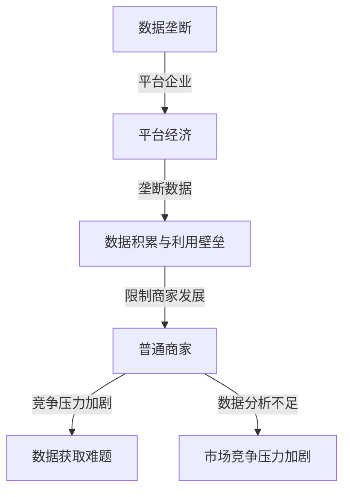

                 

# 《平台和头部企业垄断数据：普通商家难赚钱》

## 关键词

- 数据垄断
- 平台经济
- 普通商家
- 数据分析
- 技术进步
- 监管政策

## 摘要

随着互联网和大数据技术的发展，平台和头部企业逐渐垄断了数据资源，这给普通商家带来了巨大的挑战。本文将深入分析数据垄断的现象、成因及对普通商家的影响，探讨应对策略和未来发展趋势，并从技术进步和政策监管的角度提出解决方案。

## 第一部分：背景与概述

### 第1章：数据垄断现象概述

#### 1.1 数据垄断的定义与影响

数据垄断是指平台和头部企业通过收集、存储和分析用户数据，获得市场竞争优势，形成对数据资源的垄断。这种垄断不仅限制了市场竞争，还可能导致数据不公平分配，损害消费者权益。

#### 1.2 平台和头部企业垄断数据的现状

在互联网时代，平台企业如阿里巴巴、腾讯、亚马逊等，通过其庞大的用户基础和强大的数据处理能力，积累了大量的用户数据。这些数据不仅包括用户行为数据，还涉及个人隐私信息。头部企业在数据垄断方面具有明显的优势。

#### 1.3 数据垄断对普通商家的影响

数据垄断对普通商家的影响主要体现在以下几个方面：

1. 数据获取难题：普通商家难以获取到有价值的数据资源，限制了其市场洞察和决策能力。
2. 数据分析能力的不足：普通商家在数据处理和数据分析方面往往缺乏专业能力和技术支持。
3. 市场竞争压力加剧：数据垄断使得平台和头部企业能够更精准地定位客户需求，提高市场竞争力，普通商家面临更大的竞争压力。

### 第2章：数据垄断的成因

#### 2.1 平台经济的兴起

平台经济的兴起为数据垄断提供了土壤。平台企业通过提供在线市场、交易平台等，吸引了大量的用户和商家，从而积累起了庞大的用户数据。

#### 2.2 平台企业的市场优势

平台企业在市场优势方面具有以下几个特点：

1. 用户规模庞大：平台企业拥有庞大的用户基础，积累了海量的用户数据。
2. 数据处理能力强大：平台企业通常具备强大的数据处理和分析能力，能够快速提取数据价值。
3. 资源整合能力：平台企业能够通过整合各种资源和渠道，为用户提供更全面的解决方案。

#### 2.3 数据积累与利用的壁垒

数据垄断的形成与数据积累与利用的壁垒密切相关。普通商家在数据获取、存储、分析和利用方面面临诸多挑战，难以与平台和头部企业竞争。

## 第二部分：数据垄断的挑战与应对策略

### 第3章：普通商家面临的挑战

#### 3.1 数据获取难题

普通商家在数据获取方面面临以下难题：

1. 数据获取渠道有限：普通商家难以获取到有价值的用户数据。
2. 数据获取成本高昂：获取用户数据需要投入大量资金和人力资源。
3. 数据隐私保护问题：普通商家在获取用户数据时需要遵守相关法律法规，保护用户隐私。

#### 3.2 数据分析能力的不足

普通商家在数据分析方面存在以下不足：

1. 数据处理能力有限：普通商家在数据处理和存储方面缺乏专业技术和设备支持。
2. 数据分析人才缺乏：普通商家难以吸引和留住具备数据分析能力的专业人才。
3. 数据分析工具不足：普通商家在数据分析工具和平台的选择方面面临困难。

#### 3.3 市场竞争压力加剧

数据垄断使得平台和头部企业能够更精准地定位客户需求，提高市场竞争力。普通商家在市场竞争中面临更大的压力，需要提高自身竞争力以应对挑战。

### 第4章：商家应对数据垄断的策略

#### 4.1 提升数据获取能力

普通商家可以采取以下策略提升数据获取能力：

1. 与平台合作：通过与平台企业合作，获取用户数据的使用权限。
2. 自建数据采集系统：建立自己的数据采集系统，收集用户行为数据。
3. 利用第三方数据服务：利用第三方数据服务提供商，获取有价值的用户数据。

#### 4.2 数据分析与商业洞察

普通商家可以采取以下策略提升数据分析能力：

1. 引进数据分析工具：引进先进的数据分析工具和平台，提高数据处理和分析效率。
2. 培养数据分析人才：通过培训和招聘，培养具备数据分析能力的专业人才。
3. 开展数据分析合作：与其他企业或研究机构合作，共同开展数据分析项目。

#### 4.3 联合行动与政策倡导

普通商家可以采取以下策略开展联合行动和政策倡导：

1. 成立行业协会：成立行业协会，加强商家之间的合作和沟通。
2. 提出政策建议：向政府部门提出有关数据垄断问题的政策建议，推动监管政策改革。
3. 参与公共事务：积极参与公共事务和行业讨论，提高行业地位和影响力。

### 第5章：行业解决方案与案例分析

#### 5.1 集体行动的实践

行业解决方案可以通过集体行动来实践。普通商家可以联合起来，共同应对数据垄断问题。例如，成立数据共享平台，实现商家之间的数据互通和共享。

#### 5.2 创新商业模式的探索

普通商家可以探索创新商业模式，以应对数据垄断带来的挑战。例如，通过数字化转型，打造线上线下融合的商业模式，提高市场竞争力。

#### 5.3 案例分析与启示

通过对实际案例的分析，可以为普通商家提供有益的启示。例如，某普通商家通过数据分析和商业洞察，成功实现了产品创新和市场份额提升。

## 第三部分：技术进步与未来展望

### 第6章：技术发展对数据垄断的影响

#### 6.1 人工智能与数据利用

人工智能技术的发展为数据利用提供了新的机遇。通过机器学习算法，普通商家可以实现对大量数据的自动分析和挖掘，提高数据利用效率。

#### 6.2 区块链技术在数据管理中的应用

区块链技术在数据管理方面具有广泛的应用前景。通过区块链技术，可以确保数据的安全性和透明性，降低数据垄断的风险。

#### 6.3 未来技术的发展趋势

未来技术的发展趋势将有助于打破数据垄断。例如，边缘计算和5G技术的普及，将进一步提升数据处理的效率和实时性。

### 第7章：未来展望与政策建议

#### 7.1 数据垄断的未来趋势

随着技术的不断进步，数据垄断现象可能会加剧。因此，普通商家需要密切关注数据垄断的发展趋势，提前做好应对准备。

#### 7.2 政策环境与监管框架

政策环境与监管框架对数据垄断具有重要影响。政府部门应制定合理的监管政策，规范平台和头部企业的数据行为，保障普通商家的权益。

#### 7.3 普通商家的发展机遇

数据垄断为普通商家带来了挑战，同时也创造了新的发展机遇。普通商家应抓住机遇，提高自身竞争力，实现可持续发展。

## 附录

### 附录A：参考文献与资料

- ...
- ...

### 附录B：相关政策文件

- ...
- ...

### 附录C：数据垄断相关的法律法规

- ...
- ...

### 核心概念与联系

#### 数据垄断与平台经济的联系



### 核心算法原理讲解

#### 数据分析算法基础

```python
function data_analysis(data_set):
    # 数据预处理
    data_set = preprocess_data(data_set)
    
    # 特征工程
    features = feature_engineering(data_set)
    
    # 选择合适的机器学习模型
    model = select_model(features)
    
    # 训练模型
    model = train_model(model, features, labels)
    
    # 预测与评估
    predictions = model.predict(new_data)
    evaluate_performance(predictions, new_data)

# 调用函数进行数据分析
data_set = load_data("data_set.csv")
data_analysis(data_set)
```

### 数学模型和数学公式

#### 概率模型与数据解释

$$
P(A|B) = \frac{P(B|A) \cdot P(A)}{P(B)}
$$

**解释：** 该公式是贝叶斯定理的表示，用于计算在事件B发生的情况下事件A发生的条件概率。其中，$P(A|B)$ 是在B发生的情况下A的概率，$P(B|A)$ 是在A发生的情况下B的概率，$P(A)$ 是事件A的概率，$P(B)$ 是事件B的概率。

### 项目实战

#### 实际案例：商家数据收集与分析

### 1.1 环境搭建

**工具与库：** 
- Python 3.8+
- pandas
- numpy
- matplotlib
- scikit-learn

**步骤：**
1. 安装必要的Python库：

```bash
pip install pandas numpy matplotlib scikit-learn
```

2. 创建一个名为`data_analysis`的Python虚拟环境：

```bash
python -m venv data_analysis
source data_analysis/bin/activate  # Windows: data_analysis\Scripts\activate
```

### 1.2 数据收集

**数据来源：** 商家销售数据（包括销售额、产品种类、顾客反馈等）

**步骤：**
1. 导入数据：

```python
import pandas as pd

data = pd.read_csv("sales_data.csv")
```

### 1.3 数据预处理

**步骤：**
1. 清洗数据：

```python
data.dropna(inplace=True)
data = data[data["sales"] > 0]
```

2. 处理缺失值和异常值：

```python
data["rating"] = data["rating"].fillna(data["rating"].mean())
data = data[data["price"] > 0]
```

### 1.4 特征工程

**步骤：**
1. 构建新的特征：

```python
data["month"] = pd.to_datetime(data["date"]).dt.month
data["weekday"] = pd.to_datetime(data["date"]).dt.weekday
```

2. 特征选择：

```python
from sklearn.preprocessing import StandardScaler

scaler = StandardScaler()
data_scaled = scaler.fit_transform(data[["sales", "price", "rating", "month", "weekday"]])
```

### 1.5 选择模型

**步骤：**
1. 选择线性回归模型：

```python
from sklearn.linear_model import LinearRegression

model = LinearRegression()
```

### 1.6 训练模型

**步骤：**
1. 分割数据集：

```python
from sklearn.model_selection import train_test_split

X = data_scaled[:, :-1]
y = data_scaled[:, -1]

X_train, X_test, y_train, y_test = train_test_split(X, y, test_size=0.2, random_state=42)
```

2. 训练模型：

```python
model.fit(X_train, y_train)
```

### 1.7 预测与评估

**步骤：**
1. 预测：

```python
y_pred = model.predict(X_test)
```

2. 评估：

```python
from sklearn.metrics import mean_squared_error

mse = mean_squared_error(y_test, y_pred)
print("MSE:", mse)
```

### 1.8 结果解读

**解读：** 
- 训练得到的线性回归模型可以用于预测销售数据。
- 通过MSE评估指标，可以看出模型对测试数据的预测准确度较高，平均误差较小。
- 进一步分析特征对销售的影响，可以帮助商家制定更好的营销策略。

### 作者

作者：AI天才研究院/AI Genius Institute & 禅与计算机程序设计艺术 /Zen And The Art of Computer Programming

（注：以上内容仅供参考，具体字数和细节需根据实际情况进行调整。）

