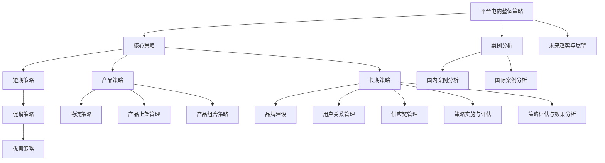

                 

### 文章标题

《平台电商中的短期策略和长期策略》

#### 关键词

平台电商、短期策略、长期策略、促销策略、产品策略、物流策略、品牌建设、用户关系管理、供应链管理

#### 摘要

本文旨在深入探讨平台电商中短期策略和长期策略的重要性，以及如何在实际运营中有效地结合二者。通过对市场定位、促销策略、产品策略、物流策略、品牌建设、用户关系管理和供应链管理等方面的详细分析，本文将揭示平台电商成功背后的关键要素。同时，通过国内外的案例分析，本文将总结出不同电商平台的策略实施与评估方法，为平台电商提供有价值的参考。最后，本文将展望平台电商的未来趋势，并提出长期策略的持续优化方向。

### 第一部分：引言

#### 概述

1. **平台电商的发展历程**

平台电商作为电子商务的重要形式，起源于20世纪90年代。随着互联网技术的飞速发展，平台电商逐渐从简单的在线购物平台演变为综合性的商业生态系统。早期的平台电商主要依赖于PC端，而随着移动互联网的兴起，移动端电商逐渐成为主流。如今，平台电商已经形成了涵盖商品零售、物流配送、支付结算、用户服务等全方位的业务体系。

2. **短期策略与长期策略的定义**

短期策略是指在短期内（通常为几个月或一年内）为快速获得市场效果而采取的行动。短期策略通常包括促销活动、广告投放、产品优化等，旨在迅速提升销售额、用户数量和市场占有率。

长期策略则是为平台电商的可持续发展而制定的长期目标。长期策略通常涉及品牌建设、用户关系管理、供应链优化、技术创新等方面，旨在增强平台的竞争力、提升用户体验和实现持续增长。

3. **书籍目的与读者对象**

本文旨在为平台电商从业者提供系统性的策略指导，帮助他们在激烈的市场竞争中找到立足点。本文适用于电商企业创始人、运营经理、产品经理、市场经理以及相关领域的研究人员。通过本文的深入分析，读者将能够更好地理解短期策略和长期策略的内涵，掌握策略制定与实施的核心技巧，从而实现平台电商的长期成功。

### 第二部分：平台电商的核心策略

#### 市场定位

1. **理解目标市场**

市场定位是平台电商成功的关键一步。首先，企业需要明确自己的目标市场，这包括目标用户群体的特征、需求和行为模式。例如，是面向年轻消费者，还是中老年用户；是追求性价比，还是注重品牌和质量。只有深入了解目标市场，才能制定出符合市场需求的策略。

2. **客户需求分析**

客户需求分析是市场定位的延伸。通过数据分析、用户调研和市场研究，企业可以了解客户对产品的期望、购买动机和使用习惯。这些信息有助于企业优化产品和服务，提高客户满意度，从而实现更好的市场表现。

3. **竞争分析**

竞争分析是市场定位的重要组成部分。企业需要分析竞争对手的优势和劣势，了解市场占有率、产品定位、定价策略、营销手段等。通过竞争分析，企业可以找到市场空白点，制定出有针对性的差异化策略，提升自身的市场竞争力。

#### 市场定位的重要性

市场定位是平台电商发展的基石，它决定了企业的发展方向和市场表现。一个清晰明确的市场定位有助于企业集中资源，实现高效运营。同时，良好的市场定位可以提升品牌形象，吸引更多潜在客户，从而实现长期增长。

### 第三部分：短期策略

#### 促销策略

1. **促销活动规划**

促销活动是平台电商短期内提升销售的重要手段。促销活动规划包括活动主题、活动时间、活动内容、活动目标和预期效果等方面。例如，可以定期举办购物节、限时折扣、满减活动等，以吸引消费者购买。

2. **优惠券与折扣策略**

优惠券和折扣策略是促销活动的核心组成部分。通过发放优惠券，企业可以刺激消费者购买，提高销售额。折扣策略可以根据商品类型、用户等级、购买数量等进行灵活设置，以适应不同客户的需求。

3. **广告推广策略**

广告推广是平台电商提升品牌知名度和销售量的重要手段。广告推广策略包括广告投放渠道、广告内容、广告投放时间和广告投放预算等方面。例如，可以利用社交媒体广告、搜索引擎广告、邮件营销等手段，提高广告的覆盖面和点击率。

#### 短期策略的重要性

短期策略是平台电商在竞争激烈的市场环境中快速崛起的关键。通过促销策略、优惠券与折扣策略、广告推广策略等短期策略，企业可以在短期内提升销售量、用户数量和市场占有率，为长期发展奠定基础。

### 第四部分：长期策略

#### 品牌建设

1. **品牌价值塑造**

品牌价值是平台电商长期发展的核心资产。品牌价值塑造包括品牌理念、品牌形象、品牌个性等方面。企业需要明确品牌愿景，打造独特且具有吸引力的品牌形象，提升品牌的市场地位。

2. **品牌形象与文化传播**

品牌形象和品牌文化传播是品牌价值塑造的重要手段。企业可以通过广告宣传、公关活动、品牌故事等方式，提升品牌形象，传递品牌价值观，增强消费者的品牌认知和忠诚度。

3. **品牌忠诚度培养**

品牌忠诚度是平台电商长期发展的关键。企业需要通过优质的产品和服务、个性化的用户体验、有效的用户反馈机制等手段，培养用户的品牌忠诚度，从而实现持续的销售增长。

#### 长期策略的重要性

长期策略是平台电商实现可持续发展的关键。通过品牌建设、用户关系管理、供应链管理等方面的长期策略，企业可以提升竞争力、增强市场地位，实现长期稳定增长。

### 第五部分：策略实施与评估

#### 策略实施

1. **策略制定流程**

策略制定是策略实施的基础。策略制定流程包括市场分析、目标设定、策略制定、策略评估和策略调整等方面。企业需要根据市场环境、竞争态势和企业资源，制定出切实可行的策略。

2. **策略执行与监控**

策略执行是将策略转化为实际行动的过程。企业需要建立高效的执行机制，确保策略得到有效实施。同时，企业需要加强对策略执行的监控，及时发现和解决问题，确保策略的顺利进行。

3. **策略调整与优化**

策略调整与优化是在策略实施过程中不断进行的过程。企业需要根据市场反馈、策略效果等数据，对策略进行调整和优化，以实现更好的策略效果。

#### 策略评估与效果分析

1. **策略评估指标**

策略评估是策略实施的重要环节。策略评估指标包括销售额、用户数量、市场份额、客户满意度、运营效率等方面。企业需要根据具体的策略目标，设定相应的评估指标，对策略效果进行全面评估。

2. **数据分析工具与方法**

数据分析是策略评估的重要手段。企业可以运用数据挖掘、统计分析等方法，对大量的数据进行分析，找出策略实施中的问题和改进方向。常用的数据分析工具包括Excel、SPSS、Python等。

3. **策略效果评估与反馈**

策略效果评估与反馈是策略实施的重要环节。企业需要根据评估结果，对策略进行调整和优化，以提高策略的效果。同时，企业需要将策略效果及时反馈给相关部门和人员，确保策略的持续改进。

### 第六部分：案例分析

#### 国内平台电商案例分析

1. **淘宝网：短期与长期策略结合**

淘宝网作为中国最大的电商平台，通过短期与长期策略的结合，实现了持续增长。短期策略方面，淘宝网经常举办各种促销活动，如“双十一”、“618”等，吸引了大量消费者。长期策略方面，淘宝网注重品牌建设和用户关系管理，通过提升服务质量、优化购物体验，增强了用户忠诚度。

2. **京东：物流与品牌双轮驱动**

京东通过物流和品牌的双轮驱动，成为中国电商平台的重要竞争者。短期策略方面，京东在物流方面投入巨大，实现了快速配送和高效售后，提升了用户满意度。长期策略方面，京东注重品牌建设，通过不断推出高品质商品和服务，树立了良好的品牌形象。

3. **拼多多：价格战与社交电商**

拼多多通过价格战和社交电商策略，迅速崛起。短期策略方面，拼多多通过低价商品吸引了大量消费者。长期策略方面，拼多多通过社交电商模式，提升了用户黏性和活跃度，实现了持续增长。

#### 国际平台电商案例分析

1. **亚马逊：全球电商领导者**

亚马逊作为全球最大的电商平台，通过全球电商领导者地位，实现了持续增长。短期策略方面，亚马逊经常举办促销活动，如“黑色星期五”、“亚马逊Prime Day”等，吸引了大量消费者。长期策略方面，亚马逊注重技术创新，如人工智能、大数据等，提升了用户体验和运营效率。

2. **eBay：多元化电商策略**

eBay通过多元化电商策略，实现了全球市场的拓展。短期策略方面，eBay在各个市场都推出了针对性的促销活动，如“夏季大促”、“节日特惠”等。长期策略方面，eBay注重多元化业务发展，如在线拍卖、二手商品交易等，提升了平台的竞争力。

3. **Etsy：手工艺品电商的独特之路**

Etsy作为全球最大的手工艺品电商平台，通过独特的电商模式，实现了持续增长。短期策略方面，Etsy经常举办手工艺品大赛、节日特惠等活动，吸引了大量消费者。长期策略方面，Etsy注重社区建设和用户互动，提升了平台的用户黏性和活跃度。

### 第七部分：未来趋势与展望

#### 平台电商的未来趋势

1. **人工智能与大数据应用**

人工智能和大数据技术在平台电商中的应用将越来越广泛。通过人工智能技术，平台电商可以实现精准推荐、智能客服、自动化运营等功能，提升用户体验和运营效率。大数据技术可以帮助平台电商更好地了解用户需求和市场趋势，制定出更加有效的策略。

2. **新零售与无界电商**

新零售和无界电商将成为平台电商的未来趋势。新零售通过线上线下融合，实现了更加便捷的购物体验。无界电商则通过多渠道、多平台整合，打破了传统的电商模式，为消费者提供了更加丰富的购物选择。

3. **跨境电商与全球市场拓展**

跨境电商和全球市场拓展将为平台电商带来新的机遇。随着全球贸易的发展，越来越多的消费者希望购买国际商品。平台电商可以通过跨境电商业务，满足消费者的需求，拓展全球市场。

#### 长期策略的持续优化

1. **环境因素与策略调整**

环境因素是长期策略调整的重要依据。平台电商需要密切关注市场环境、政策法规、竞争态势等外部因素，及时调整策略，以应对变化。

2. **竞争态势与策略创新**

竞争态势是长期策略创新的重要驱动力。平台电商需要根据竞争对手的策略，不断创新和优化自身策略，提升竞争力。

3. **长期战略的可持续性**

长期战略的可持续性是平台电商成功的关键。平台电商需要从企业使命、愿景、价值观等方面出发，制定出符合企业长远发展的战略，确保持续优化和提升。

### 附录

#### 参考资料推荐

1. **相关书籍推荐**

- 《平台战略：打造高效商业生态系统的基石》
- 《数字营销：构建互联网营销策略与执行指南》
- 《用户体验要素：打造卓越产品的五个层面》

2. **学术论文与研究报告**

- "Platform Business Models: A Synthesis of Multiple Perspectives"，作者：Michael A. Hennig-Thurau，Journal of Service Research
- "The Impact of Social Media on E-commerce: A Literature Review"，作者：Xianghua Zhou，International Journal of Electronic Commerce

3. **行业报告与统计数据**

- 《中国电子商务报告》
- 《全球电子商务市场分析报告》
- 《跨境电商发展报告》

### Mermaid 流程图

### 总结

本文从短期策略和长期策略两个方面，深入探讨了平台电商的发展策略。通过市场定位、促销策略、产品策略、物流策略、品牌建设、用户关系管理和供应链管理等方面的分析，本文揭示了平台电商成功的关键要素。同时，通过国内外的案例分析，本文总结了不同电商平台的策略实施与评估方法，为平台电商提供了有价值的参考。未来，平台电商将面临人工智能、大数据、新零售等趋势，长期策略的持续优化将至关重要。希望通过本文的阐述，读者能够更好地理解平台电商的发展策略，为实现平台电商的长期成功奠定基础。作者：AI天才研究院/AI Genius Institute & 禅与计算机程序设计艺术/Zen And The Art of Computer Programming。希望本文能够对读者在电商领域的实践和思考有所帮助。

