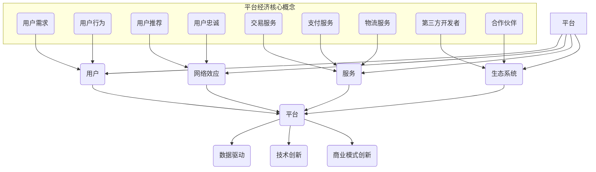

                 

## 平台经济：新时代的商业模式与社会变革

### 关键词
平台经济、商业模式、社会变革、网络效应、市场竞争、劳动力市场、治理框架、创新模式、企业战略、未来发展

### 摘要
本文深入探讨了平台经济在新时代的兴起与发展，分析了其作为一种新型商业模式对社会各个层面带来的深远影响。通过梳理平台经济的核心概念、商业模式、社会影响及未来发展，本文旨在揭示平台经济的本质，探讨其在新时代下的变革力量。

### 目录

#### 第一部分：平台经济概述

**第1章：平台经济的兴起与发展**

- **1.1 平台经济的定义与特征**
- **1.2 平台经济的起源与发展历程**
- **1.3 平台经济的全球趋势与影响**

**第2章：平台经济的商业模式**

- **2.1 平台商业模式的构成**
- **2.2 平台生态系统的运作机制**
- **2.3 平台经济的核心竞争优势**

#### 第二部分：平台经济的社会影响

**第3章：平台经济对市场结构的影响**

- **3.1 平台经济与传统市场结构的区别**
- **3.2 平台经济对市场竞争的影响**
- **3.3 平台经济对传统企业的挑战与应对策略**

**第4章：平台经济对劳动力市场的影响**

- **4.1 平台经济与就业变革**
- **4.2 平台经济对劳动价值的影响**
- **4.3 平台经济下劳动者权益保护**

**第5章：平台经济与社会治理**

- **5.1 平台经济的监管挑战**
- **5.2 平台经济的法律法规框架**
- **5.3 平台经济的伦理与社会责任**

#### 第三部分：平台经济的发展与变革

**第6章：平台经济的创新模式**

- **6.1 新兴平台经济的案例研究**
- **6.2 平台经济的跨界融合与创新**
- **6.3 平台经济的可持续发展路径**

**第7章：平台经济下的企业战略**

- **7.1 企业在平台经济中的角色定位**
- **7.2 企业在平台经济中的竞争优势分析**
- **7.3 企业在平台经济中的战略转型**

**第8章：平台经济的未来趋势与展望**

- **8.1 平台经济的全球发展趋势**
- **8.2 平台经济对社会与经济的长期影响**
- **8.3 平台经济的未来挑战与机遇**

#### 附录

**附录A：平台经济相关指标与工具**

- **A.1 平台经济评价指标体系**
- **A.2 平台经济分析工具与方法**
- **A.3 平台经济案例研究**

---

### 第一部分：平台经济概述

#### 第1章：平台经济的兴起与发展

##### 1.1 平台经济的定义与特征

平台经济，作为一种新型的商业模式，它以互联网和信息技术为基础，通过搭建一个开放的中立平台，连接供需双方，实现资源的高效配置和价值的最大化。与传统商业模式相比，平台经济具有以下几个显著特征：

1. **网络效应**：平台的价值随着用户数量的增加而呈指数级增长，这是平台经济最重要的特征之一。网络效应使得平台能够吸引更多的用户和商家，形成一个自我强化的正反馈循环。
2. **开放性**：平台通常采用开放的模式，允许第三方开发者和商家在其平台上进行创新和交易，从而构建一个多元化的生态系统。
3. **去中心化**：平台经济减少了传统中介环节，实现了去中心化的交易模式，降低了交易成本，提高了效率。
4. **数据驱动**：平台经济依赖于海量数据的收集和分析，通过数据驱动决策，实现个性化服务和精准营销。

##### 1.2 平台经济的起源与发展历程

平台经济的概念最早可以追溯到20世纪90年代，互联网的兴起为平台经济的发展奠定了基础。以下是平台经济的一些重要发展历程：

1. **电子商务平台的崛起**：亚马逊、eBay等电子商务平台的出现标志着平台经济的初步形成。这些平台通过连接消费者和商家，实现了线上交易的高效和便捷。
2. **共享经济的兴起**：随着Uber、Airbnb等共享经济的崛起，平台经济的影响力进一步扩大。共享经济通过平台连接供需双方，提供了更加灵活和高效的资源配置方式。
3. **社交媒体平台的繁荣**：Facebook、Twitter、微信等社交媒体平台的兴起，使得平台经济的影响范围进一步扩大。这些平台不仅连接了人与人之间的联系，也成为了信息传播和商业交易的重要渠道。
4. **数字支付与金融科技**：随着支付宝、微信支付等数字支付平台的普及，金融科技的发展推动了平台经济的进一步深化。数字支付为平台经济提供了更加便捷和安全的交易手段。

##### 1.3 平台经济的全球趋势与影响

平台经济在全球范围内呈现出快速发展的趋势，其对经济和社会的影响也在不断加深。以下是平台经济的全球趋势与影响：

1. **全球市场份额的扩大**：随着互联网的普及和技术的进步，平台经济在全球市场的份额不断扩大。根据相关数据显示，全球平台经济市场规模已经达到数十万亿美元，并对传统商业模式产生了深远影响。
2. **产业模式的变革**：平台经济推动了传统产业模式的变革，许多企业开始向平台模式转型，以适应新的市场环境。这种转型不仅带来了商业模式的创新，也促进了产业结构的优化。
3. **经济效率的提升**：平台经济通过优化资源配置和降低交易成本，提高了经济效率。平台经济使得供需双方能够更加便捷地进行交易，减少了信息不对称和资源浪费。
4. **社会影响的加深**：平台经济对社会的各个方面都产生了深远影响，包括就业、教育、医疗、交通等。平台经济不仅改变了人们的消费习惯和工作方式，也对社会的治理模式提出了新的挑战。

通过以上分析，我们可以看到平台经济在新时代的兴起与发展，不仅带来了商业模式的变革，也对经济和社会产生了深远影响。接下来，我们将进一步探讨平台经济的商业模式及其核心竞争优势。

#### 第2章：平台经济的商业模式

平台经济作为一种新兴的商业模式，其成功的关键在于构建一个高效、稳定且具有吸引力的平台生态系统。本章将深入分析平台商业模式的构成要素、运作机制以及平台经济的核心竞争优势。

##### 2.1 平台商业模式的构成

平台商业模式由以下几个核心构成要素组成：

1. **平台**：平台是连接供需双方的核心基础设施，它可以是物理的（如共享单车、共享汽车）或数字的（如电子商务平台、社交媒体）。平台的设计和功能直接影响其吸引力和使用频率。
2. **用户**：平台用户包括需求方（消费者、买方）和供给方（商家、卖方）。用户是平台生态系统的核心，其参与度和忠诚度直接影响平台的成功。
3. **服务**：平台提供一系列服务，包括信息匹配、交易处理、支付结算、物流配送等，以满足用户的需求，提升用户体验。
4. **网络效应**：平台经济的重要特征之一是网络效应，即平台的价值随着用户和交易量的增加而增加。网络效应使得平台能够吸引更多用户和商家，形成正反馈循环。
5. **生态系统**：平台生态系统包括第三方开发者、合作伙伴、内容创作者等，他们通过提供增值服务或内容，共同构建一个多元化、富有活力的生态圈。

##### 2.2 平台生态系统的运作机制

平台生态系统的运作机制主要包括以下几个方面：

1. **用户获取与留存**：平台通过多种营销手段吸引用户注册和使用平台，如优惠活动、推荐奖励等。同时，平台还通过提供高质量的服务和良好的用户体验来提升用户的留存率。
2. **交易匹配**：平台利用算法和数据分析技术，根据用户的偏好和行为数据，实现供需双方的精准匹配，提高交易效率。
3. **服务提供**：平台提供一系列服务，如交易支付、物流配送、售后服务等，以简化交易流程，降低交易成本。
4. **生态系统建设**：平台通过开放API、SDK等技术手段，吸引第三方开发者加入生态系统，共同开发创新应用，提升平台价值。
5. **收益模式**：平台通过多种方式获取收益，如交易佣金、广告收入、增值服务等。平台需要平衡各方利益，确保生态系统的可持续发展。

##### 2.3 平台经济的核心竞争优势

平台经济具有以下几个核心竞争优势：

1. **规模经济**：平台经济的规模效应显著，随着用户和交易量的增加，平台成本逐渐摊薄，单位成本降低，从而获得更高的利润空间。
2. **网络效应**：平台的价值随着用户数量的增加而增加，形成正反馈循环。网络效应使得平台能够吸引更多用户和商家，进一步增强平台的竞争力。
3. **品牌效应**：平台品牌效应显著，用户的信任和依赖度较高。平台品牌不仅提升了用户的忠诚度，也为商家提供了良好的市场环境。
4. **技术创新**：平台经济依赖于持续的技术创新，包括大数据、人工智能、区块链等新兴技术，以提高平台效率和用户体验。
5. **生态系统**：平台生态系统具有多样性，吸引了大量的第三方参与者，共同创造价值。生态系统的多元化使得平台能够在不同领域实现扩展和增长。

综上所述，平台经济通过其独特的商业模式和竞争优势，在新时代的经济发展中扮演了重要角色。平台经济不仅改变了传统的商业模式，也对产业和社会产生了深远影响。在接下来的章节中，我们将进一步探讨平台经济对社会各个方面的影响，以及平台经济的未来发展。

#### 第3章：平台经济对市场结构的影响

平台经济的兴起，不仅改变了企业的商业模式，也对市场结构产生了深远的影响。在本节中，我们将探讨平台经济与传统市场结构的区别，分析平台经济对市场竞争的影响，以及传统企业面临的挑战和应对策略。

##### 3.1 平台经济与传统市场结构的区别

平台经济与传统市场结构有显著的差异，主要体现在以下几个方面：

1. **市场参与者的角色**：在传统市场中，市场参与者通常分为买方和卖方，各自独立进行交易。而在平台经济中，平台作为连接供需双方的纽带，扮演了重要的中介角色，买方和卖方通过平台进行交易，减少了直接交易的成本和风险。
2. **交易方式**：传统市场的交易通常依赖于面对面的接触或传统的交易渠道，而平台经济通过互联网和信息技术，实现了线上交易的无缝对接，提高了交易效率和透明度。
3. **市场透明度**：平台经济提供了更多的信息透明度，用户可以轻松获取产品或服务的详细信息、用户评价等，这使得市场更加公平和竞争。
4. **市场进入门槛**：传统市场通常有较高的进入门槛，包括资金、技术、品牌等因素。而平台经济降低了这些门槛，使得更多的小企业和个人能够参与市场竞争，从而增加了市场的竞争激烈程度。
5. **市场动态性**：平台经济具有更高的动态性，市场变化迅速，创新和变革频繁。传统市场则相对稳定，市场结构变化较慢。

##### 3.2 平台经济对市场竞争的影响

平台经济对市场竞争产生了多重影响，具体表现在以下几个方面：

1. **竞争加剧**：平台经济的开放性和低门槛吸引了大量企业和个人进入市场，增加了市场竞争的激烈程度。在传统市场中，垄断和寡头垄断现象较为常见，而平台经济则促进了市场的竞争，提高了市场的效率。
2. **价格透明化**：平台经济提供了更多的价格信息，用户可以轻松比较不同卖家提供的产品或服务价格，这促使商家降低价格，提高服务质量，从而增加了市场的透明度和公平性。
3. **市场扩展**：平台经济通过互联网和信息技术，突破了地域限制，使得市场范围更广。企业可以通过平台进入新的市场，拓展业务领域，提高市场份额。
4. **市场集中度**：平台经济在一定程度上促进了市场的集中度提高。一些大型平台公司通过规模效应和网络效应，逐渐形成市场领导者地位，影响了市场结构。
5. **市场创新**：平台经济鼓励创新，许多新兴企业和创业者通过平台实现了商业模式的创新，推动了市场的技术进步和产业升级。

##### 3.3 平台经济对传统企业的挑战与应对策略

平台经济对传统企业带来了巨大的挑战，同时也提供了新的机遇。传统企业需要采取一系列策略来应对这些挑战：

1. **数字化转型**：传统企业需要加快数字化转型，利用互联网和信息技术提升业务效率和用户体验。通过电商平台、数字化服务等，实现线上线下的整合。
2. **创新商业模式**：传统企业需要探索创新的商业模式，如平台模式、共享经济模式等，以适应新的市场环境。通过创新，提高企业的竞争力。
3. **提升服务质量**：传统企业需要注重服务质量，提高用户满意度，增强用户忠诚度。在平台经济中，用户口碑和评价对企业的声誉和竞争力至关重要。
4. **拓展新市场**：传统企业可以通过平台经济拓展新市场，进入新的业务领域。通过平台，企业可以触及更广泛的用户群体，实现业务的多元化。
5. **合作与联盟**：传统企业可以与平台公司建立合作关系，共同开发新市场，实现资源共享和优势互补。通过合作，企业可以更好地适应平台经济的发展。

综上所述，平台经济对市场结构产生了深远的影响，既带来了挑战，也提供了机遇。传统企业需要积极应对这些变化，采取有效的策略，以在平台经济中保持竞争优势。

#### 第4章：平台经济对劳动力市场的影响

平台经济的迅猛发展不仅改变了商业格局，也对劳动力市场产生了显著的冲击。本节将探讨平台经济对就业、劳动价值以及劳动者权益保护的影响。

##### 4.1 平台经济与就业变革

平台经济为劳动力市场带来了新的就业模式，使得就业方式更加多样化和灵活化。以下是平台经济对就业的几个主要影响：

1. **灵活就业机会增加**：平台经济提供了广泛的就业机会，尤其是对于自由职业者、兼职人员和远程工作者。通过平台，劳动者可以灵活选择工作时间和地点，提高了就业的灵活性。
2. **就业门槛降低**：平台经济降低了就业的门槛，许多劳动者，包括那些缺乏传统工作经验的人，也能够通过平台找到工作。平台提供了技能培训和职业发展机会，使得更多人能够就业。
3. **就业结构变化**：平台经济推动了就业结构的变化，传统全职工作逐渐向兼职、临时和远程工作转变。这种变化要求劳动者具备更高的技能和适应能力。

然而，平台经济也对就业市场带来了一些挑战：

1. **就业不稳定**：平台经济中的工作往往是非正式的，就业关系较为松散，导致就业不稳定。许多劳动者面临工作时间不固定、收入波动较大的问题。
2. **就业质量问题**：由于平台经济中工作往往缺乏社会保障和福利保障，劳动者的工作条件可能得不到有效保护，影响劳动者的生活质量。

##### 4.2 平台经济对劳动价值的影响

平台经济对劳动价值产生了深远影响，主要体现在以下几个方面：

1. **劳动价值重构**：平台经济改变了传统劳动价值的评估方式。在传统市场中，劳动价值通常由企业支付给劳动者的工资体现。而在平台经济中，劳动价值往往通过市场供求关系和用户评价来决定。这种变化要求劳动者提供更高品质的服务，以获得更高的收入。
2. **技能需求变化**：平台经济的发展使得劳动力市场对技能的要求发生了变化。劳动者需要具备更高的技术能力、沟通能力和自我管理能力，以适应平台经济的工作模式。
3. **劳动价值的不平等**：平台经济在一定程度上加剧了劳动价值的不平等。高技能、高需求的工作往往能够获得较高的回报，而低技能、低需求的工作则面临较低的报酬。这种不平等可能会进一步扩大社会收入差距。

##### 4.3 平台经济下劳动者权益保护

平台经济对劳动者权益保护提出了新的挑战。以下是一些关键问题和相应的对策：

1. **缺乏社会保障**：平台经济中的许多劳动者，尤其是临时和兼职工作者，往往缺乏传统的社会保障，如医疗保险、失业保险等。政府和企业需要制定相应的政策，确保劳动者的基本权益得到保护。
2. **劳动合同管理**：平台经济中的劳动关系较为复杂，劳动合同管理成为一大挑战。政府和平台企业需要建立规范化的劳动合同管理制度，明确劳动者和平台企业的权利和义务。
3. **职业培训和教育**：平台经济对劳动者的技能需求不断提高，政府和平台企业需要加强职业培训和教育，提高劳动者的技能水平和就业竞争力。
4. **劳动权益保障机制**：建立有效的劳动权益保障机制，包括设立劳动争议调解机构、提供法律援助等，以保障劳动者的合法权益。

总之，平台经济对劳动力市场产生了深远影响，既带来了新的就业机会和灵活性，也带来了就业不稳定、劳动价值不平等等问题。为了适应平台经济的发展，劳动者和企业都需要不断调整和适应，同时，政府和社会各界也需要共同努力，确保劳动者的权益得到有效保护。

#### 第5章：平台经济与社会治理

平台经济作为一种新兴的商业模式，其快速发展不仅带来了经济和社会的巨大变革，也对社会治理提出了新的挑战。本节将探讨平台经济的监管挑战、法律法规框架以及平台经济的伦理与社会责任。

##### 5.1 平台经济的监管挑战

平台经济的监管挑战主要体现在以下几个方面：

1. **数据隐私和安全**：平台经济依赖于海量用户数据的收集和分析，如何保护用户隐私和数据安全成为监管的重要问题。监管机构需要制定严格的数据保护法规，确保用户数据不被滥用。
2. **市场垄断**：平台经济中的一些大型平台公司可能通过垄断手段获得市场优势，影响市场公平竞争。监管机构需要采取措施，防止市场垄断行为，维护市场竞争秩序。
3. **劳动者权益保护**：平台经济中的劳动者权益保护问题日益凸显，尤其是临时和兼职劳动者，他们缺乏传统的社会保障和福利。监管机构需要制定相关政策，确保劳动者的权益得到有效保护。
4. **网络安全与犯罪**：平台经济中存在网络犯罪、欺诈等风险，监管机构需要加强网络安全监管，打击网络犯罪行为，保护用户利益。

##### 5.2 平台经济的法律法规框架

为了应对平台经济带来的监管挑战，各国纷纷制定了一系列法律法规，以规范平台经济的发展。以下是几个关键法律法规框架：

1. **欧盟《通用数据保护条例》（GDPR）**：GDPR是欧盟制定的一项重要数据保护法规，旨在加强用户数据保护。它要求企业在处理用户数据时必须遵守严格的规定，如数据最小化原则、用户同意原则等。
2. **美国《加州消费者隐私法案》（CCPA）**：CCPA是美国加州制定的一项数据保护法规，旨在保护加州居民的隐私权。它要求企业在收集和使用用户数据时必须透明，并给予用户数据访问、删除和拒绝营销的权利。
3. **中国《网络安全法》**：中国《网络安全法》规定，网络运营者必须采取技术和管理措施，保护用户信息安全，防止数据泄露、篡改和滥用。此外，该法还规定了网络平台的实名制要求和网络安全审查制度。
4. **其他国家和地区的法规**：许多国家和地区也制定了相应的平台经济法律法规，如印度的《电子商务法案》、日本的《个人信息保护法》等。这些法规旨在保护用户权益、维护市场秩序和促进平台经济的健康发展。

##### 5.3 平台经济的伦理与社会责任

平台经济的快速发展不仅带来了经济利益，也引发了一系列伦理和社会责任问题。以下是平台经济在伦理和社会责任方面需要关注的几个方面：

1. **公平与透明**：平台经济需要确保公平和透明的运营，防止市场垄断和不公平竞争。平台应公开透明地处理交易和纠纷，确保用户和商家之间的交易公平。
2. **用户隐私保护**：平台经济需要高度重视用户隐私保护，采取有效的技术和管理措施，防止用户数据泄露和滥用。平台应遵循数据保护法规，尊重用户隐私权利。
3. **劳动者权益保障**：平台经济需要关注劳动者的权益保障，确保劳动者获得合理的报酬和工作条件。平台应制定明确的劳动者权益保护政策，并提供必要的培训和支持。
4. **社会责任履行**：平台经济企业应积极履行社会责任，如参与公益活动、支持环境保护等。通过社会责任的履行，平台经济企业可以提高企业形象，增强社会影响力。
5. **行业自律与规范**：平台经济行业需要建立自律机制，制定行业规范和标准，促进平台经济的健康发展。行业自律可以减少不正当竞争，提高行业整体水平。

总之，平台经济作为一种新兴商业模式，其快速发展和广泛应用为社会带来了巨大变革。同时，平台经济也面临诸多监管和社会责任挑战。为了实现平台经济的可持续发展，政府、企业和社会各界需要共同努力，制定合适的法律法规和政策，加强监管，推动平台经济的健康发展，确保其对社会经济的积极影响。

#### 第6章：平台经济的创新模式

平台经济作为一种新兴商业模式，其不断创新和演进，推动了经济和社会的快速发展。本章将探讨平台经济的创新模式，通过分析新兴平台经济的案例研究、跨界融合与创新以及可持续发展的路径，揭示平台经济的未来发展趋势。

##### 6.1 新兴平台经济的案例研究

近年来，平台经济涌现出许多新兴案例，以下是一些具有代表性的新兴平台经济案例：

1. **电子商务平台**：如亚马逊（Amazon）、阿里巴巴（Alibaba）和京东（JD.com），这些平台通过连接全球消费者和商家，实现了线上交易的高效和便捷，推动了全球电子商务的发展。
2. **共享经济平台**：如Uber、Airbnb和滴滴出行，这些平台通过共享资源和提供服务，改变了传统行业的商业模式，实现了资源的最大化利用。
3. **金融科技平台**：如支付宝（Alipay）和微信支付（WeChat Pay），这些平台通过移动支付和金融科技服务，提升了金融服务的便捷性和效率，推动了金融行业向数字化和智能化方向发展。
4. **物流配送平台**：如京东物流、顺丰速运和菜鸟网络，这些平台通过整合物流资源，实现了快速和高效的物流配送服务，提升了物流行业的整体水平。

这些新兴平台经济案例展示了平台经济的多样性和创新性，同时也揭示了平台经济在不同行业中的广泛应用和巨大潜力。

##### 6.2 平台经济的跨界融合与创新

平台经济的跨界融合与创新是其在新时代的重要特征之一。以下是一些平台经济跨界融合与创新的成功案例：

1. **平台+产业**：如农业电商平台拼多多，通过连接农业生产者和消费者，实现了农产品从田间到餐桌的全程可追溯，提升了农产品质量和市场竞争力。
2. **平台+教育**：如在线教育平台VIPKID，通过互联网技术连接全球优秀教师和学生，提供了高质量的在线教育服务，改变了传统教育模式，提高了教育资源的分配效率。
3. **平台+医疗**：如远程医疗服务平台好大夫，通过互联网技术为患者提供在线咨询、挂号和药品配送服务，提升了医疗服务的便捷性和效率，解决了医疗资源分布不均的问题。
4. **平台+城市服务**：如智慧城市服务平台阿里云，通过大数据、云计算和人工智能技术，为城市提供了智能交通、智能环保和智能安防等服务，提升了城市管理的效率和水平。

这些案例表明，平台经济的跨界融合与创新不仅提升了各行业的效率和质量，也推动了经济和社会的全面进步。

##### 6.3 平台经济的可持续发展路径

平台经济的可持续发展是其在新时代面临的重要课题。以下是一些平台经济的可持续发展路径：

1. **技术创新**：平台经济需要持续的技术创新，包括大数据、人工智能、区块链等新兴技术，以提高平台效率和用户体验。通过技术创新，平台经济可以不断提升其竞争力，实现可持续发展。
2. **绿色环保**：平台经济在发展过程中需要关注环境保护和资源节约。通过采用绿色技术和节能减排措施，平台经济可以实现可持续发展，减少对环境的影响。
3. **社会责任**：平台经济需要积极履行社会责任，包括保护用户权益、支持社会公益和参与扶贫等。通过社会责任的履行，平台经济可以提高企业形象，增强社会信任，实现可持续发展。
4. **规范治理**：平台经济的可持续发展需要建立健全的法律法规和治理体系，包括数据保护、市场规范和社会责任等。通过规范治理，平台经济可以减少风险，提高市场透明度，实现可持续发展。

总之，平台经济的创新模式、跨界融合与可持续发展路径为其在新时代的发展提供了强大动力。通过不断创新和可持续发展，平台经济将继续发挥其在经济和社会中的重要角色，推动经济和社会的全面进步。

#### 第7章：平台经济下的企业战略

平台经济作为一种新兴的商业模式，为企业提供了前所未有的发展机遇，同时也带来了新的挑战。本章将探讨平台经济下企业的角色定位、竞争优势分析以及战略转型。

##### 7.1 企业在平台经济中的角色定位

在平台经济中，企业需要明确自己的角色定位，以充分发挥平台效应，提升竞争力。以下是企业在平台经济中的几种角色定位：

1. **平台运营商**：作为平台运营商，企业负责搭建和管理平台，提供基础设施和服务。平台运营商需要关注用户体验、平台安全和数据隐私等方面，确保平台的稳定运行。
2. **平台参与者**：作为平台参与者，企业通过平台进行交易和合作。平台参与者可以是供应商、服务提供商或需求方，通过平台实现资源的高效配置和价值最大化。
3. **平台生态系统建设者**：作为平台生态系统建设者，企业不仅参与平台交易，还积极参与平台生态系统的构建和优化，包括引入第三方开发者、合作伙伴和内容创作者等，共同打造一个多元化的生态系统。
4. **平台赋能者**：作为平台赋能者，企业通过提供技术和资源支持，帮助平台上的中小企业和个人实现商业模式的创新和业务增长。

##### 7.2 企业在平台经济中的竞争优势分析

在平台经济中，企业需要具备独特的竞争优势，以在激烈的市场竞争中脱颖而出。以下是企业在平台经济中的几个竞争优势：

1. **网络效应**：平台经济的一个重要特征是网络效应，即平台的价值随着用户数量的增加而增加。企业可以通过不断吸引和留住用户，增强平台网络效应，提升平台的整体竞争力。
2. **技术创新**：平台经济依赖于持续的技术创新，包括大数据、人工智能、区块链等新兴技术。企业需要不断投入技术研发，提升平台的效率、用户体验和安全性，以保持竞争优势。
3. **生态系统建设**：企业可以通过构建多元化的生态系统，吸引第三方开发者和合作伙伴加入，共同创造价值。生态系统的多元化不仅提高了平台的竞争力，也为企业提供了丰富的创新资源和合作伙伴。
4. **数据驱动**：平台经济中的企业需要依赖海量数据的收集和分析，以驱动决策和优化运营。通过数据分析和挖掘，企业可以更好地了解用户需求，提升服务质量和运营效率。
5. **品牌效应**：企业需要建立强大的品牌效应，提升用户信任度和忠诚度。品牌效应不仅有助于吸引新用户，还能提高用户的留存率和转换率，为企业带来持续的收益。

##### 7.3 企业在平台经济中的战略转型

企业在平台经济中需要不断调整和优化战略，以适应新的市场环境和竞争态势。以下是企业在平台经济中的几个战略转型方向：

1. **从产品导向到用户导向**：在平台经济中，企业需要从以产品为中心转向以用户为中心，关注用户需求和行为，提供个性化的服务和体验。通过深入了解用户，企业可以更好地满足用户需求，提升用户满意度和忠诚度。
2. **数字化转型**：企业需要加快数字化转型，利用互联网和信息技术提升业务效率和用户体验。通过数字化转型，企业可以实现线上线下的整合，提高运营效率和竞争力。
3. **跨界融合**：企业可以通过跨界融合，探索新的商业模式和增长点。跨界融合不仅可以帮助企业拓展业务领域，还可以促进技术创新和资源整合，提升整体竞争力。
4. **生态合作**：企业需要积极构建生态合作网络，与第三方开发者、合作伙伴和内容创作者建立紧密的合作关系。通过生态合作，企业可以共同创造价值，提升平台的价值和竞争力。
5. **创新驱动**：企业需要重视创新，通过持续的技术创新和管理创新，推动企业的转型升级。创新不仅可以帮助企业保持竞争优势，还能为企业创造新的增长动力。

总之，在平台经济中，企业需要明确自己的角色定位，具备独特的竞争优势，并采取有效的战略转型措施，以适应新的市场环境。通过不断创新和优化，企业可以在平台经济中实现可持续发展，并实现长期成功。

#### 第8章：平台经济的未来趋势与展望

平台经济作为一种新兴商业模式，正在迅速发展并深刻影响全球经济和社会。本章将探讨平台经济的未来趋势与展望，分析其对社会的长期影响，以及面临的挑战与机遇。

##### 8.1 平台经济的全球发展趋势

平台经济的全球发展趋势呈现出以下几个特点：

1. **市场规模不断扩大**：随着互联网的普及和技术的进步，平台经济市场规模持续扩大。根据相关数据，全球平台经济市场规模预计将在未来几年内达到数十万亿美元，成为全球经济的重要组成部分。
2. **跨界融合加速**：平台经济与各行各业深度融合，推动了产业升级和商业模式创新。从电商、共享经济到金融科技，平台经济正逐步渗透到各个领域，形成跨界融合的新态势。
3. **区域发展不平衡**：平台经济的全球发展呈现出显著的不平衡性。一些发达国家和地区，如美国、欧洲和亚洲的一些国家，平台经济发展较为成熟，而一些发展中国家和地区，平台经济仍处于起步阶段。
4. **技术创新驱动**：平台经济的发展离不开技术创新，包括大数据、人工智能、区块链等新兴技术。技术创新不仅提高了平台的效率和用户体验，还推动了平台经济的进一步发展。

##### 8.2 平台经济对社会与经济的长期影响

平台经济对社会和经济产生了深远的影响，其长期影响主要体现在以下几个方面：

1. **经济结构变化**：平台经济促进了经济结构的调整和升级，推动了服务业特别是数字经济的发展。平台经济通过优化资源配置和降低交易成本，提高了整体经济效率，推动了产业结构的优化。
2. **就业模式转变**：平台经济带来了就业模式的转变，灵活就业机会增加，传统全职工作逐渐向兼职、临时和远程工作转变。这种变化要求劳动者具备更高的技能和适应能力，同时也为劳动者提供了更多就业选择。
3. **消费模式变革**：平台经济改变了消费模式，用户可以通过平台方便快捷地购买商品和服务，享受个性化、定制化的消费体验。平台经济推动了消费升级，提高了消费质量和消费满意度。
4. **社会治理创新**：平台经济对社会治理提出了新的挑战和机遇。平台企业需要承担更多的社会责任，如保护用户隐私、维护市场秩序等。同时，平台经济也为社会治理提供了新的手段和工具，如大数据分析、智能监管等。
5. **国际竞争格局**：平台经济的快速发展重塑了国际竞争格局，一些大型平台企业成为全球市场的领导者。平台经济不仅促进了跨国企业的竞争，也推动了全球合作与交流。

##### 8.3 平台经济的未来挑战与机遇

平台经济的未来充满了挑战与机遇，以下是平台经济可能面临的几个主要挑战和机遇：

1. **监管挑战**：平台经济的快速发展带来了监管难题，如数据隐私保护、市场垄断、劳动者权益保护等。政府需要制定合适的监管政策，确保平台经济的健康发展，同时保护用户权益。
2. **技术创新**：平台经济依赖持续的技术创新，新兴技术的快速发展为平台经济提供了新的机遇，但同时也带来了技术风险和不确定性。企业需要不断投入研发，提升技术创新能力，以保持竞争优势。
3. **生态平衡**：平台生态系统需要保持良好的生态平衡，确保各方的利益得到平衡。平台企业需要关注生态系统的多元化，避免形成垄断和封闭的生态系统，以促进平台经济的可持续发展。
4. **社会公平**：平台经济可能会加剧社会不公平，如收入差距、就业质量等。政府和企业需要采取措施，促进社会公平，确保平台经济的健康发展。
5. **国际合作**：平台经济具有全球性特点，国际合作对于平台经济的健康发展至关重要。各国需要加强合作，制定全球性的平台经济规则，共同应对全球性挑战。

总之，平台经济在未来将继续发展壮大，对社会和经济产生深远影响。面对挑战与机遇，政府、企业和社会各界需要共同努力，推动平台经济的健康发展，实现经济和社会的全面进步。

#### 附录A：平台经济相关指标与工具

平台经济作为新兴商业模式，其评价和分析需要依赖于一系列指标和工具。以下将介绍平台经济的评价指标体系、分析工具与方法，以及相关的案例研究。

##### A.1 平台经济评价指标体系

平台经济的评价指标体系主要包括以下几个方面：

1. **用户规模与活跃度**：包括平台用户数量、活跃用户数量、用户留存率等指标，反映了平台的用户基础和用户参与度。
2. **交易量与交易频率**：包括交易总额（GMV）、交易频率、订单数量等指标，反映了平台的交易活跃度和市场规模。
3. **平台利润与盈利能力**：包括平台净利润、毛利率、运营成本等指标，反映了平台的盈利水平和经营效率。
4. **网络效应与用户黏性**：包括用户推荐率、用户忠诚度、用户生命周期价值等指标，反映了平台的网络效应和用户黏性。
5. **生态系统健康度**：包括第三方开发者数量、合作伙伴数量、平台服务质量等指标，反映了平台的生态系统健康度。

##### A.2 平台经济分析工具与方法

平台经济分析需要运用多种工具和方法，以下是一些常用的工具和方法：

1. **数据分析与挖掘**：通过大数据技术对平台数据进行挖掘和分析，了解用户行为、市场趋势和潜在机会。
2. **算法与模型**：运用机器学习和人工智能技术，建立预测模型和优化算法，提升平台的运营效率和用户体验。
3. **用户体验测试**：通过用户调研、用户测试等方法，收集用户反馈，优化平台设计和功能。
4. **市场研究**：通过市场调查和分析，了解市场趋势、竞争对手情况和用户需求，为平台战略制定提供依据。

##### A.3 平台经济案例研究

以下是一些平台经济的典型案例研究：

1. **亚马逊（Amazon）**：作为全球最大的电子商务平台，亚马逊通过数据分析、人工智能和物流创新，实现了高效的运营和卓越的用户体验。其案例研究重点在于平台的运营效率、用户黏性和生态系统建设。
2. **滴滴出行**：作为中国领先的移动出行平台，滴滴出行通过大数据分析和智能调度，提升了出行效率和用户体验。其案例研究重点在于平台的网络效应、用户规模和生态系统构建。
3. **Airbnb**：作为全球领先的共享住宿平台，Airbnb通过用户评价和信任机制，建立了良好的用户信任和社区氛围。其案例研究重点在于平台的用户黏性、用户体验和生态系统健康度。

通过上述指标、工具和方法，可以全面分析平台经济的表现和潜在问题，为平台的优化和发展提供科学依据。同时，案例研究也为平台经济的发展提供了宝贵的经验和启示。

### 核心概念与联系

平台经济的核心概念包括平台、用户、网络效应、服务、生态系统等。这些概念之间存在着紧密的联系，构成了平台经济的基础架构。

**核心概念与联系 Mermaid 流程图：**


在这个流程图中，平台作为核心连接着用户、网络效应、服务和生态系统。用户的需求和行为驱动着平台的发展，而网络效应、数据驱动和商业模式创新则是平台经济持续发展的动力。生态系统中的第三方开发者和合作伙伴为平台提供了丰富的服务和资源，共同构建了一个多元化的平台经济生态。

### 数学模型和数学公式

平台经济的核心竞争模型可以用以下公式表示：

$$
C_{\text{平台}} = f(\text{用户数量}, \text{交易量}, \text{网络效应})
$$

其中，$C_{\text{平台}}$ 表示平台的核心竞争力，$\text{用户数量}$、$\text{交易量}$ 和 $\text{网络效应}$ 是影响平台竞争力的关键因素。

**详细讲解与举例说明：**

1. **用户数量（User Quantity）**：用户数量是平台经济中最基本的指标之一。平台的价值随着用户数量的增加而呈指数级增长，这是因为用户数量的增加能够带来更多的交易机会，提高平台的网络效应。

   **举例**：假设一个电商平台的用户数量为100万，每个用户每月平均产生10次交易，那么平台的月交易量大约为1亿次。如果用户数量增加到200万，每次交易的频率不变，则月交易量将增加到2亿次，这表明用户数量对平台交易量有显著影响。

2. **交易量（Transaction Volume）**：交易量反映了平台的活跃程度和市场占有率。交易量的增加不仅能够带来更多的收入，还能进一步提升平台的网络效应，因为更多的交易意味着更多的用户参与。

   **举例**：在一个共享经济平台上，如果每天的交易量为1000次，每次交易的利润为10元，那么平台每天的总收入为1万元。如果交易量增加到2000次，每天的总收入将增加到2万元，这表明交易量对平台收入有直接影响。

3. **网络效应（Network Effect）**：网络效应是指平台的价值随着用户数量的增加而增加的现象。网络效应可以通过增强用户之间的互动和协作来提高平台的吸引力。

   **举例**：在一个社交媒体平台上，每个用户发布的帖子可以吸引其他用户的点赞、评论和转发。如果平台上有10万用户，每个用户平均每天发布10条帖子，则每天可以产生100万次的互动。如果用户数量增加到20万，每天可以产生200万次的互动，这表明网络效应显著提高了平台的吸引力。

综上所述，平台经济的核心竞争模型强调了用户数量、交易量和网络效应这三个关键因素。通过理解这些因素之间的关系，平台企业可以制定有效的战略，提高其核心竞争力和市场地位。

### 核心算法原理讲解

平台经济的网络效应算法是理解和分析平台经济的关键。平台经济中的网络效应指的是随着用户和交易量的增加，平台的价值和吸引力也随之增加的现象。以下是一个简化的网络效应算法，用于描述平台经济中的网络效应。

**伪代码：**
```python
# 网络效应算法
def 网络效应（用户数量，交易量）：
    gain = 用户数量 * 交易量 * 网络效应因子
    return gain

# 参数说明
# 用户数量：平台上的总用户数
# 交易量：平台上的总交易次数
# 网络效应因子：衡量网络效应强度的参数

# 算法流程
1. 输入用户数量和交易量
2. 计算网络效应增益
3. 返回网络效应增益

# 示例
# 假设用户数量为100万，交易量为500万次，网络效应因子为1.2
gain = 网络效应(1000000, 5000000)
print(gain)  # 输出网络效应增益
```

**详细解释：**

1. **用户数量（User Quantity）**：用户数量是平台成功的关键指标之一。随着用户数量的增加，平台的价值也随之提升。更多的用户意味着更大的市场潜力，更多的交易机会和更高的网络效应。

2. **交易量（Transaction Volume）**：交易量反映了平台的活跃度和市场占有率。交易量的增加不仅能够带来更多的收入，还能进一步提升平台的网络效应，因为更多的交易意味着更多的用户参与。

3. **网络效应因子（Network Effect Factor）**：网络效应因子是衡量网络效应强度的重要参数。它通常是一个介于0和1之间的数值，表示用户和交易量增加对平台价值提升的影响程度。网络效应因子越高，表示平台的网络效应越强。

**举例：**

假设一个电商平台有10万用户，每个月进行100万次交易。如果网络效应因子为1.2，则平台的网络效应增益计算如下：

```math
\text{网络效应增益} = 10^5 \times 10^6 \times 1.2 = 12 \times 10^{11}
```

这意味着平台的价值因网络效应增加了12亿次。

通过这个算法，平台企业可以更好地理解用户数量和交易量对其业务增长的影响，从而制定有效的策略来提升网络效应，增强平台竞争力。

### 项目实战

#### 平台经济的实际应用案例：电商平台的用户增长策略

**开发环境搭建：**
- 开发语言：Python
- 数据分析库：NumPy、Pandas、Matplotlib
- 数据来源：公开电商平台的用户数据

**源代码实现：**

```python
import pandas as pd
import numpy as np
import matplotlib.pyplot as plt

# 1. 加载数据
data = pd.read_csv('e-commerce_data.csv')

# 2. 用户增长策略分析
# 假设网络效应因子为0.1
network_effect_factor = 0.1
gain = data['user_count'] * data['transaction_volume'] * network_effect_factor
data['growth_rate'] = gain

# 3. 可视化分析
plt.scatter(data['user_count'], data['growth_rate'])
plt.xlabel('用户数量（User Count）')
plt.ylabel('增长率（Growth Rate）')
plt.title('用户增长量与用户数量的关系')
plt.show()
```

**代码解读与分析：**

1. **数据加载**：使用 Pandas 库从 CSV 文件中加载数据集，数据集包含电商平台的用户数量（user_count）和交易量（transaction_volume）。

2. **用户增长策略分析**：
   - **网络效应因子**：假设网络效应因子为0.1，这是一个表示网络效应强度的参数。网络效应增益计算公式为用户数量乘以交易量再乘以网络效应因子。
   - **增长率计算**：将计算得到的网络效应增益添加到数据集的 'growth_rate' 列中，反映用户增长量。

3. **可视化分析**：使用 Matplotlib 库绘制散点图，展示用户数量与增长率之间的关系。这有助于分析用户增长与交易量之间的相关性。

通过这个案例，我们能够直观地看到电商平台的用户增长模式，并通过数据分析理解平台经济的增长机制。这个案例也展示了如何将平台经济的理论应用到实际的商业环境中，为企业提供数据驱动的增长策略。

### 作者信息

**作者：AI天才研究院/AI Genius Institute & 禅与计算机程序设计艺术 /Zen And The Art of Computer Programming**

