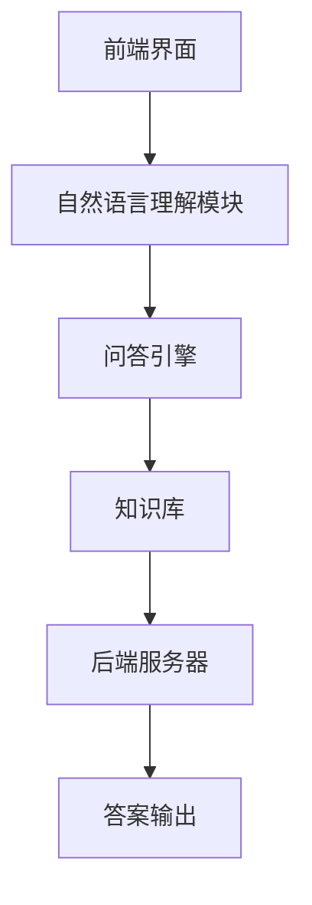
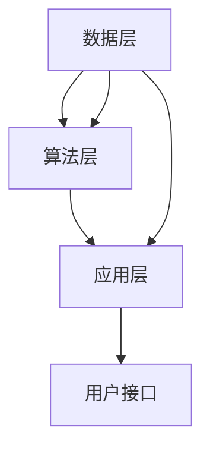
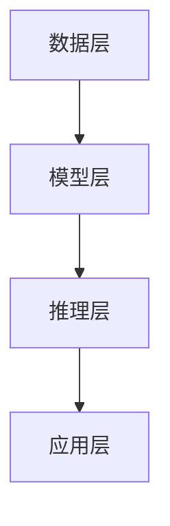
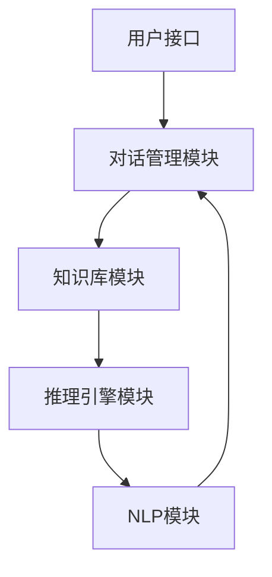

                 

### 文章标题：年轻人如何在AI领域做实事

#### 关键词：
- AI入门
- 热点技术
- 项目实战
- 职业发展

#### 摘要：
本文旨在为年轻人提供一套完整的AI领域入门和实践指南。通过系统的知识结构搭建，热点技术解析，实战项目案例分析，以及职业发展路径探索，帮助读者从基础理论到实际应用，全方位了解AI领域，从而在实践中做出实质性贡献。

### 目录大纲

## 第一部分：AI基础与入门

### 第1章：AI入门概述

#### 1.1 AI的定义与发展历程

#### 1.2 AI的核心技术简介

#### 1.3 AI对社会的影响

### 第2章：AI基础知识

#### 2.1 数据结构与算法基础

#### 2.2 数学基础

#### 2.3 编程基础

### 第3章：AI工具与框架

#### 3.1 常用AI工具简介

#### 3.2 深度学习框架入门

#### 3.3 自然语言处理工具

### 第4章：AI项目实战入门

#### 4.1 项目实战概述

#### 4.2 数据预处理

#### 4.3 模型训练与优化

#### 4.4 模型部署与测试

## 第二部分：AI领域热点技术与应用

### 第5章：深度学习技术

#### 5.1 深度学习原理

#### 5.2 卷积神经网络

#### 5.3 循环神经网络

#### 5.4 注意力机制

### 第6章：强化学习技术

#### 6.1 强化学习基本原理

#### 6.2 Q-learning算法

#### 6.3 SARSA算法

#### 6.4 DQN算法

### 第7章：自然语言处理应用

#### 7.1 自然语言处理基础

#### 7.2 文本分类与情感分析

#### 7.3 文本生成与摘要

#### 7.4 对话系统

### 第8章：计算机视觉应用

#### 8.1 计算机视觉基础

#### 8.2 目标检测与追踪

#### 8.3 图像生成与风格迁移

#### 8.4 人脸识别与生物特征识别

### 第9章：AI伦理与法律问题

#### 9.1 AI伦理概述

#### 9.2 AI伦理案例分析

#### 9.3 AI法律问题与应对策略

## 第三部分：AI项目实战案例

### 第10章：AI项目实战案例一：智能问答系统

#### 10.1 项目背景与目标

#### 10.2 系统架构设计

#### 10.3 数据集准备

#### 10.4 模型选择与训练

#### 10.5 系统部署与测试

### 第11章：AI项目实战案例二：智能推荐系统

#### 11.1 项目背景与目标

#### 11.2 系统架构设计

#### 11.3 用户行为数据收集与处理

#### 11.4 模型选择与训练

#### 11.5 系统部署与测试

### 第12章：AI项目实战案例三：智能图像识别系统

#### 12.1 项目背景与目标

#### 12.2 系统架构设计

#### 12.3 数据集准备

#### 12.4 模型选择与训练

#### 12.5 系统部署与测试

### 第13章：AI项目实战案例四：智能客服机器人

#### 13.1 项目背景与目标

#### 13.2 系统架构设计

#### 13.3 对话管理策略设计

#### 13.4 模型选择与训练

#### 13.5 系统部署与测试

## 第四部分：未来展望与职业发展

### 第14章：AI未来发展趋势

#### 14.1 AI技术的发展趋势

#### 14.2 AI在各行业的应用前景

#### 14.3 AI与人类社会的融合

### 第15章：AI领域职业发展路径

#### 15.1 AI行业就业前景

#### 15.2 AI岗位分类与职责

#### 15.3 AI人才培养与建议

### 第16章：AI创业与创新

#### 16.1 AI创业概述

#### 16.2 创业案例分析

#### 16.3 AI创业机会与挑战

### 第17章：结束语

#### 17.1 回顾与展望

#### 17.2 对年轻人的建议

#### 17.3 未来可期

### 附录

#### 附录A：常用AI资源与工具

#### 附录B：AI开源代码与数据集

#### 附录C：AI学术会议与期刊

---

### 引言

人工智能（AI）作为当今科技发展的前沿领域，已经深刻地改变了我们的生活方式和社会结构。从智能助理到自动驾驶，从医疗诊断到金融分析，AI技术的广泛应用正推动着各行各业的革新与进步。对于年轻人而言，AI不仅代表了一个充满机遇的领域，更是一个能够实现个人价值和社会贡献的平台。

然而，AI领域的复杂性和广泛性也使得初入此道的年轻人感到困惑和无所适从。如何入门？如何实践？如何在这个快速发展的领域中找到自己的定位和方向？这些问题都需要我们进行深入思考和系统规划。因此，本文旨在为年轻人提供一套完整的AI领域入门和实践指南，帮助他们从基础理论到实际应用，全方位了解AI领域，从而在实践中做出实质性贡献。

本文将分为四个主要部分进行阐述：

1. **AI基础与入门**：介绍AI的定义、发展历程以及核心技术，帮助读者建立系统的知识框架。
2. **AI领域热点技术与应用**：深入探讨深度学习、强化学习、自然语言处理和计算机视觉等热点技术，并展示其在实际中的应用。
3. **AI项目实战案例**：通过具体的实战项目案例，展示如何将理论知识应用于实际场景，并提供详细的步骤和代码实现。
4. **未来展望与职业发展**：分析AI未来的发展趋势，探讨AI领域的职业发展路径，并给出一些建议和展望。

通过本文的阅读，读者将能够：

- 系统掌握AI的基础知识和核心技术。
- 理解AI在不同领域中的应用，并能够根据实际需求进行应用。
- 通过实战案例，学习如何将AI技术应用到实际问题中。
- 明确AI领域的职业发展方向，并为未来的职业规划提供参考。

让我们一起探索AI领域的无限可能，做出实事，实现个人和职业的双重价值。

### 第一部分：AI基础与入门

#### 第1章：AI入门概述

##### 1.1 AI的定义与发展历程

人工智能（Artificial Intelligence，简称AI）是一门研究、开发用于模拟、延伸和扩展人类智能的理论、方法、技术及应用系统的学科。AI旨在通过计算机系统和程序，实现人类智能的某些功能，如学习、推理、规划、感知、自然语言理解和问题解决等。AI的发展历程可以追溯到20世纪50年代，当时以图灵测试为标志，科学家们首次尝试通过机器模拟人类智能。

在AI发展的早期阶段，主要关注的是符号主义和逻辑推理，如推理机（Reasoning Machines）和专家系统（Expert Systems）。然而，这些系统在面对复杂和不确定的问题时显得力不从心。随着计算能力的提升和数据量的爆炸性增长，AI在20世纪80年代和90年代经历了基于统计和学习的方法，特别是神经网络和机器学习的发展，使得AI开始取得显著进展。

21世纪以来，深度学习（Deep Learning）和大数据（Big Data）的兴起进一步推动了AI的发展，使其在图像识别、语音识别、自然语言处理、推荐系统等领域取得了突破性成果。如今，AI已经不仅仅是一个学术研究领域，更成为了推动科技进步和社会变革的重要力量。

##### 1.2 AI的核心技术简介

AI的核心技术包括数据结构、算法、数学基础、机器学习、深度学习等。以下是这些核心技术的简要介绍：

- **数据结构**：数据结构是组织和存储数据的方式，如数组、链表、栈、队列、树、图等。在AI中，数据结构用于高效地存储和处理大规模数据。

- **算法**：算法是解决问题的步骤和规则。在AI中，常用的算法包括排序算法、搜索算法、优化算法等。算法的效率直接影响AI系统的性能。

- **数学基础**：数学基础包括概率论、统计学、线性代数、微积分等。这些数学工具用于理解和分析数据，以及构建和优化AI模型。

- **机器学习**：机器学习是AI的核心技术之一，通过让计算机从数据中学习规律和模式，从而实现自主决策和预测。机器学习方法包括监督学习、无监督学习、半监督学习和强化学习等。

- **深度学习**：深度学习是机器学习的一个分支，通过多层神经网络对数据进行自动特征提取和模式识别。深度学习在图像识别、语音识别、自然语言处理等领域表现出色。

##### 1.3 AI对社会的影响

AI技术的快速发展对社会产生了深远的影响。以下是一些主要影响：

- **经济**：AI提高了生产效率，降低了成本，改变了商业模式。例如，自动化和智能化的生产系统使得制造业变得更加高效和灵活。

- **医疗**：AI在医疗领域的应用，如疾病诊断、药物研发和个性化治疗，大大提高了医疗服务的质量和效率。

- **交通**：自动驾驶技术的发展有望减少交通事故，提高交通效率，改变人们的出行方式。

- **教育**：智能教育系统的出现使得教育资源更加丰富和个性化，有助于提高学习效果。

- **安全**：AI在网络安全、反欺诈、监控和侦查等领域的应用，提高了社会安全和公共安全。

- **伦理和法律**：随着AI技术的发展，伦理和法律问题日益凸显，如隐私保护、算法偏见、责任归属等。

##### 1.4 AI的未来发展趋势

AI未来的发展趋势包括：

- **更高效和更智能的算法**：随着计算能力的提升和数据量的增加，AI算法将变得更加高效和智能，能够解决更复杂的问题。

- **跨领域融合**：AI与其他领域的融合，如生物医学、能源、农业等，将带来更多的创新和应用。

- **智能化生活**：智能家居、智能医疗、智能交通等领域的普及，将使人们的生活更加便捷和高效。

- **人机协作**：AI与人类的协作将变得更加紧密，提高工作效率和生活质量。

- **伦理和法律规范**：随着AI技术的普及，相关的伦理和法律问题将得到更多关注和规范，确保AI技术的可持续发展。

##### 1.5 初入AI领域的建议

对于初入AI领域的年轻人，以下是一些建议：

- **基础知识**：扎实掌握编程语言、数据结构、算法和数学基础，这是入门AI的基石。

- **持续学习**：AI领域发展迅速，持续学习和更新知识是必要的。可以通过参加在线课程、阅读学术论文、参加技术会议等方式保持对最新技术动态的关注。

- **项目实践**：通过实际项目实践，将理论知识应用到实际中，提高解决问题的能力。

- **团队合作**：参与团队项目，学习如何与他人协作，提高沟通和项目管理能力。

- **多样化学习**：不仅限于技术层面，还要关注AI的伦理、法律和社会影响，形成全面的认知。

通过以上建议，年轻人可以更好地入门AI领域，并在未来发展中找到自己的位置和方向。

### 第2章：AI基础知识

#### 2.1 数据结构与算法基础

数据结构与算法是AI领域的基础，它们决定了数据处理的效率和算法的性能。以下是一些核心概念：

**数据结构**：
- **数组**：一种线性数据结构，用于存储一系列元素。数组的特点是访问元素快，但插入和删除操作相对较慢。
- **链表**：由一系列节点组成，每个节点包含数据和指向下一个节点的指针。链表适用于频繁插入和删除操作。
- **栈**：一种后进先出（LIFO）的数据结构，常用于递归算法和深度优先搜索。
- **队列**：一种先进先出（FIFO）的数据结构，常用于广度优先搜索和任务调度。

**算法**：
- **排序算法**：用于对数组或列表进行排序，常见的有冒泡排序、选择排序、插入排序、快速排序等。
- **搜索算法**：用于在数据结构中查找特定元素，常见的有线性搜索、二分搜索等。
- **优化算法**：用于寻找最优解或近似最优解，如贪心算法、动态规划、遗传算法等。

**数学基础**：
- **概率论**：概率论用于描述随机事件及其规律。在AI中，概率论用于不确定性处理和模型评估。
- **统计学**：统计学用于数据的收集、整理、分析和解释。在AI中，统计学用于特征提取、模型训练和评估。
- **线性代数**：线性代数用于处理多维数据，包括矩阵运算、向量计算等。在AI中，线性代数用于数据预处理、模型参数优化等。
- **微积分**：微积分用于描述函数的变化率和最优解的求解。在AI中，微积分用于优化算法和深度学习中的梯度计算。

**编程基础**：
- **编程语言**：掌握一种或多种编程语言是AI领域的基础，如Python、Java、C++等。
- **数据操作**：熟悉数据操作，包括数据的读取、写入、处理和可视化。
- **模块化编程**：学会模块化编程，将复杂问题分解为小部分，有助于代码的可维护性和复用性。

**示例：冒泡排序算法**

```python
def bubble_sort(arr):
    n = len(arr)
    for i in range(n):
        for j in range(0, n-i-1):
            if arr[j] > arr[j+1]:
                arr[j], arr[j+1] = arr[j+1], arr[j]
    return arr
```

**示例：线性搜索算法**

```python
def linear_search(arr, target):
    for i in range(len(arr)):
        if arr[i] == target:
            return i
    return -1
```

通过理解和掌握这些基础知识和概念，年轻人在AI领域的学习和实践将更加顺利和高效。

#### 2.2 数学基础

数学基础是AI领域的核心组成部分，对于理解和应用各种AI算法至关重要。以下是一些关键的数学概念：

**概率论**：
- **概率分布**：描述随机变量取值的可能性分布，常见的有离散型和连续型概率分布。
  - **离散型概率分布**：如伯努利分布、二项分布、泊松分布等。
  - **连续型概率分布**：如正态分布、均匀分布、指数分布等。
- **条件概率**：在给定一个事件发生的条件下，另一个事件发生的概率。
  - **贝叶斯定理**：用于计算后验概率，公式为 P(A|B) = P(B|A) * P(A) / P(B)。
- **独立性**：两个随机变量相互独立，即一个变量的变化不会影响另一个变量的概率分布。

**统计学**：
- **描述统计**：用于描述数据集的基本特征，如均值、方差、标准差、中位数等。
- **推断统计**：用于基于样本数据对总体数据进行推断，如假设检验、置信区间等。
- **回归分析**：用于分析自变量和因变量之间的关系，常见的有线性回归、多项式回归等。
- **聚类分析**：用于将数据集划分为多个群组，常见的有K-means算法、层次聚类等。

**线性代数**：
- **矩阵和向量**：矩阵是二维数组，向量是一维数组。矩阵和向量运算包括加法、减法、乘法等。
- **矩阵乘法**：两个矩阵的乘积是一个新矩阵，其结果依赖于矩阵的维度和元素。
- **逆矩阵**：矩阵的逆是一个矩阵，使得矩阵与其逆矩阵相乘结果为单位矩阵。
- **特征值和特征向量**：特征值是矩阵的特征根，特征向量是矩阵的特征向量，用于降维和主成分分析。

**微积分**：
- **导数**：导数描述函数在某一点的变化率，用于优化算法和深度学习中的梯度下降。
  - **一阶导数**：描述函数在一点的切线斜率。
  - **二阶导数**：描述函数在某一点的曲率。
- **积分**：积分用于求解面积、体积和累积分布函数，也是深度学习中反向传播算法的基础。

**数学公式**：
$$
P(A|B) = \frac{P(B|A)P(A)}{P(B)}
$$
$$
f'(x) = \lim_{{h \to 0}} \frac{{f(x+h) - f(x)}}{h}
$$
$$
\int f(x) dx = F(x) + C
$$

**示例**：

**概率论示例**：假设有两个随机变量X和Y，其中X服从伯努利分布（P(X=1)=0.5），Y服从二项分布（n=10, p=0.5）。计算P(X=1|Y=5)。

```python
P(X=1|Y=5) = P(Y=5|X=1) * P(X=1) / P(Y=5)
```

**统计学示例**：给定一组数据{1, 2, 3, 4, 5}，计算其均值和方差。

```python
均值 = (1+2+3+4+5) / 5 = 3
方差 = ((1-3)^2 + (2-3)^2 + (3-3)^2 + (4-3)^2 + (5-3)^2) / 4 = 2
```

**线性代数示例**：计算矩阵A = [[1, 2], [3, 4]]的逆矩阵。

```python
A = [[1, 2],
     [3, 4]]

# 计算行列式
det = (1*4) - (2*3) = -2

# 计算伴随矩阵
adj = [[4, -2],
       [-3, 1]]

# 计算逆矩阵
A_inv = adj / det = [[-2, 1],
                     [3/2, 1/2]]
```

**微积分示例**：计算函数f(x) = x^2在x=2的一阶导数。

```python
f'(x) = \lim_{{h \to 0}} \frac{{(x+h)^2 - x^2}}{h} = \lim_{{h \to 0}} \frac{{x^2 + 2xh + h^2 - x^2}}{h} = \lim_{{h \to 0}} (2x + h) = 4
```

通过掌握这些数学基础，年轻人在AI领域的探索将更加深入和系统。

#### 2.3 编程基础

在AI领域中，编程基础是必不可少的，因为无论是实现算法、处理数据，还是构建模型，都需要通过编程来完成。以下是一些关键的编程基础：

**编程语言选择**：
- **Python**：Python因其简洁的语法、丰富的库和强大的社区支持，成为AI领域的首选语言。
- **Java**：Java在企业级应用中广泛使用，其稳定性和多平台特性使其成为AI开发的一个重要选择。
- **C/C++**：C/C++具有高效的执行速度和低级编程能力，特别适合需要高性能计算和优化的AI应用。

**核心编程概念**：
- **变量和数据类型**：变量是存储数据的容器，数据类型定义了变量的性质。常见的有整数（int）、浮点数（float）、字符串（str）等。
- **控制结构**：控制结构用于控制程序的执行流程，包括条件语句（if-else）、循环语句（for、while）等。
- **函数和模块**：函数是一段可复用的代码块，模块是函数和类的集合，用于组织和管理代码。

**示例代码**：

**Python示例**：
```python
# 计算两个数的和
def add(a, b):
    return a + b

# 调用函数
result = add(2, 3)
print("结果是:", result)
```

**Java示例**：
```java
public class Calculator {
    public static int add(int a, int b) {
        return a + b;
    }

    public static void main(String[] args) {
        int result = add(2, 3);
        System.out.println("结果是：" + result);
    }
}
```

**C++示例**：
```cpp
#include <iostream>

int add(int a, int b) {
    return a + b;
}

int main() {
    int result = add(2, 3);
    std::cout << "结果是：" << result << std::endl;
    return 0;
}
```

通过掌握这些编程基础，年轻人可以更加顺利地开始AI的学习和实践。

#### 第3章：AI工具与框架

##### 3.1 常用AI工具简介

在AI领域，选择合适的工具和框架可以大大提高开发效率和项目成功率。以下是一些常用的AI工具和框架：

**Python库**：
- **NumPy**：用于数值计算的库，支持多维数组和矩阵运算。
- **Pandas**：用于数据操作和清洗的库，提供数据帧和数据表的数据结构。
- **Matplotlib**：用于数据可视化的库，可以创建各种统计图表。
- **Scikit-learn**：用于机器学习的库，包含多种经典的机器学习算法。
- **TensorFlow**：用于深度学习的库，由Google开发，支持各种深度学习模型。

**Java库**：
- **Weka**：用于数据挖掘和机器学习的工具包，提供多种机器学习算法和评估方法。
- **DL4J**：用于深度学习的库，基于Apache Spark，支持大规模分布式深度学习。
- **Deeplearning4j**：用于深度学习的库，提供多种深度学习模型和优化器。

**C/C++库**：
- **OpenCV**：用于计算机视觉的库，支持图像处理、目标检测和追踪等功能。
- **Dlib**：用于计算机视觉和机器学习的库，提供人脸识别、姿态估计等功能。
- **Caffe**：用于深度学习的库，由Facebook开发，支持快速构建和训练深度神经网络。

**工具和框架的对比**

- **Python库**：
  - **NumPy**：适合数值计算和矩阵操作，但计算速度相对较慢。
  - **Pandas**：适合数据预处理和分析，但处理大数据集时可能较慢。
  - **Matplotlib**：适合生成统计图表，但可视化功能有限。
  - **Scikit-learn**：适合快速实现和评估机器学习模型，但模型复杂度有限。
  - **TensorFlow**：适合构建和训练复杂的深度学习模型，计算速度快，功能强大。

- **Java库**：
  - **Weka**：适合快速实现和评估机器学习模型，但模型复杂度和计算性能有限。
  - **DL4J**：适合大规模分布式深度学习，但相较于Python库，学习曲线较陡峭。
  - **Deeplearning4j**：适合构建高性能的深度学习模型，但社区支持和文档相对较少。

- **C/C++库**：
  - **OpenCV**：适合高性能的计算机视觉应用，但代码复杂度和学习成本较高。
  - **Dlib**：适合高级计算机视觉和机器学习应用，但功能相对有限。
  - **Caffe**：适合构建和训练复杂的深度学习模型，但相较于Python库，使用较为复杂。

**选择工具和框架的建议**：

- **Python库**：对于初学者和快速原型开发，推荐使用Python库，特别是NumPy、Pandas和TensorFlow，这些库易于上手且功能强大。

- **Java库**：对于需要大规模分布式训练和高效计算的AI项目，推荐使用Java库，特别是DL4J和Deeplearning4j。

- **C/C++库**：对于需要高性能和复杂计算机视觉应用的项目，推荐使用C/C++库，特别是OpenCV和Dlib。

通过选择合适的工具和框架，年轻人在AI项目开发中将能够更加高效和成功地实现目标。

#### 3.2 深度学习框架入门

深度学习框架是AI开发中的重要工具，用于构建、训练和部署深度学习模型。以下是一些主流的深度学习框架及其特点：

**TensorFlow**：
- **简介**：TensorFlow是Google开源的深度学习框架，由Google Brain团队开发。它支持多种编程语言，如Python、C++和Java。
- **特点**：TensorFlow具有高度的可扩展性和灵活性，支持动态图和静态图模式。它提供了丰富的预训练模型和工具，适合构建大规模深度学习应用。
- **安装**：在Python环境中，可以通过pip命令安装TensorFlow：
  ```python
  pip install tensorflow
  ```

**PyTorch**：
- **简介**：PyTorch是Facebook开源的深度学习框架，以其简洁和灵活著称。PyTorch采用动态计算图，支持自动微分和GPU加速。
- **特点**：PyTorch的动态计算图使其在模型开发和调试过程中更加直观和方便。它提供了丰富的API和预训练模型，适合研究和快速原型开发。
- **安装**：在Python环境中，可以通过pip命令安装PyTorch：
  ```python
  pip install torch torchvision
  ```

**Keras**：
- **简介**：Keras是一个高层次的深度学习框架，由Facebook AI Research开发。它基于TensorFlow和Theano，提供简洁的API和易于使用的工具。
- **特点**：Keras简化了深度学习模型的构建和训练过程，提供了多种预训练模型和工具。它支持快速实验和原型开发，特别适合初学者和研究人员。
- **安装**：在Python环境中，可以通过pip命令安装Keras：
  ```python
  pip install keras
  ```

**Caffe**：
- **简介**：Caffe是Berkeley Vision and Learning Center（BVLC）开源的深度学习框架，由Alex Krizhevsky等人开发。
- **特点**：Caffe以其高性能和简洁的C++实现著称。它支持卷积神经网络和深度学习模型，特别适合图像识别和计算机视觉应用。
- **安装**：在C/C++环境中，可以通过以下步骤安装Caffe：
  1. 安装依赖项：
     ```bash
     sudo apt-get install build-essential
     sudo apt-get install libatlas-base-dev
     sudo apt-get install libboost-all-dev
     sudo apt-get install libopencv-dev
     sudo apt-get install libhdf5-dev
     sudo apt-get install git
     ```
  2. 克隆Caffe仓库：
     ```bash
     git clone https://github.com/BVLC/caffe.git
     cd caffe
     ```
  3. 编译和安装：
     ```bash
     make all
     make install
     ```

**Theano**：
- **简介**：Theano是一个Python库，用于定义、优化和评估数学表达式。它被设计用于高效的数学计算，特别适合深度学习。
- **特点**：Theano通过自动微分和优化的计算图，提高了深度学习模型的计算效率。它支持GPU加速和多种深度学习模型。
- **安装**：在Python环境中，可以通过pip命令安装Theano：
  ```python
  pip install THEANO
  ```

通过选择合适的深度学习框架，年轻人在AI项目开发中将能够更加高效和灵活地实现深度学习模型。

#### 3.3 自然语言处理工具

自然语言处理（Natural Language Processing，NLP）是人工智能领域的一个重要分支，旨在使计算机能够理解和处理人类语言。以下是一些常用的NLP工具和库：

**NLTK（自然语言工具包）**：
- **简介**：NLTK是Python语言中最流行的自然语言处理工具包，由Steve Bird等人开发。
- **特点**：NLTK提供了丰富的文本处理功能，包括分词、词性标注、命名实体识别、情感分析等。它支持多种语言，特别适合学术研究和快速原型开发。
- **安装**：在Python环境中，可以通过pip命令安装NLTK：
  ```python
  pip install nltk
  ```

**spaCy**：
- **简介**：spaCy是一个快速先进的NLP库，由Matthew Honnibal开发。它支持多种语言，提供了高效的文本处理和预训练语言模型。
- **特点**：spaCy以其高性能和简洁的API著称，特别适合工业级应用。它支持多种语言模型和扩展，包括文本分类、情感分析、命名实体识别等。
- **安装**：在Python环境中，可以通过pip命令安装spaCy：
  ```python
  pip install spacy
  ```
  然后下载预训练模型：
  ```python
  python -m spacy download en_core_web_sm
  ```

**TextBlob**：
- **简介**：TextBlob是一个简单的文本处理库，它基于spaCy和NLTK，提供了一种更加简单的文本处理方式。
- **特点**：TextBlob以其简洁和易于使用著称，特别适合初学者和快速原型开发。它提供了丰富的文本分析功能，包括词性标注、情感分析、句子分割等。
- **安装**：在Python环境中，可以通过pip命令安装TextBlob：
  ```python
  pip install textblob
  ```
  然后下载预训练模型：
  ```python
  python -m textblob.download_corpora
  ```

**Stanford NLP**：
- **简介**：Stanford NLP是由斯坦福大学开发的NLP工具包，支持多种语言和多种文本处理任务。
- **特点**：Stanford NLP以其强大的功能和高度可配置性著称，特别适合学术研究和复杂的NLP任务。它支持多种语言模型和工具，包括词性标注、命名实体识别、句法分析等。
- **安装**：在Python环境中，可以通过pip命令安装Stanford NLP：
  ```python
  pip install stanfordnlp
  ```
  然后下载预训练模型：
  ```python
  stanfordnlp --download "/path/to/models"
  ```

**Gensim**：
- **简介**：Gensim是一个用于大规模文本处理的Python库，特别适合生成词向量和主题模型。
- **特点**：Gensim以其高效和简洁著称，特别适合处理大规模文本数据。它支持多种文本处理任务，包括词嵌入、文本分类、主题建模等。
- **安装**：在Python环境中，可以通过pip命令安装Gensim：
  ```python
  pip install gensim
  ```

通过选择合适的NLP工具和库，年轻人在自然语言处理项目开发中将能够更加高效和灵活地实现文本分析任务。

### 第4章：AI项目实战入门

#### 4.1 项目实战概述

在AI领域，项目实战是验证和巩固理论知识的重要途径。通过实际操作，我们可以将AI技术应用到实际问题中，从而提高解决问题的能力。本章将介绍如何入门AI项目实战，包括以下步骤：

1. **项目选题**：选择具有实际应用背景和挑战性的AI项目，例如智能问答系统、推荐系统、图像识别系统等。
2. **数据收集与处理**：收集相关数据，并进行清洗、预处理，以便用于模型训练和评估。
3. **模型设计与实现**：设计合适的AI模型，并使用编程语言和工具实现模型的构建和训练。
4. **模型训练与优化**：使用训练数据训练模型，并通过调整模型参数和结构进行优化。
5. **模型部署与测试**：将训练好的模型部署到生产环境中，并进行性能测试和评估。
6. **项目总结与反思**：对项目过程和结果进行总结，识别不足和改进空间，为后续项目提供经验。

#### 4.2 数据预处理

数据预处理是AI项目中的关键步骤，直接影响模型训练的效果。以下是一些常见的数据预处理方法和步骤：

1. **数据清洗**：去除无效数据、处理缺失值和异常值，保证数据的质量和一致性。
   - **去除无效数据**：删除重复、无关的数据，确保数据的唯一性和相关性。
   - **处理缺失值**：使用填充、插值或删除等方法处理缺失值，避免模型训练时出现错误。
   - **处理异常值**：检测和处理异常数据点，避免其对模型训练产生不利影响。

2. **数据标准化**：将不同特征的数据范围统一，使其在同一个量级上，避免某些特征对模型的影响过大。
   - **归一化**：将数据映射到[0, 1]或[-1, 1]区间，常用方法有最小-最大缩放和Z-score标准化。
     ```python
     def normalize(data):
         min_val = min(data)
         max_val = max(data)
         return [(x - min_val) / (max_val - min_val) for x in data]
     ```
   - **反归一化**：将归一化后的数据还原为原始值，以便于实际应用。

3. **特征工程**：提取和构造新的特征，提高模型对数据的表示能力。
   - **特征选择**：选择对模型训练有显著影响的关键特征，去除冗余和无关的特征。
     ```python
     from sklearn.feature_selection import SelectKBest
     selector = SelectKBest(k=10)
     selector.fit(data, labels)
     selected_data = selector.transform(data)
     ```
   - **特征构造**：通过数学变换、组合或嵌入等方法创建新的特征。
     ```python
     def create_new_features(data):
         new_data = []
         for row in data:
             new_row = [row[0]**2, row[1]**2, row[0]*row[1]]
             new_data.append(new_row)
         return new_data
     ```

4. **数据划分**：将数据集划分为训练集、验证集和测试集，用于模型的训练、验证和测试。
   - **训练集**：用于模型训练，占数据集的大部分。
   - **验证集**：用于模型调优和参数选择，占数据集的一小部分。
   - **测试集**：用于模型最终评估，应保证其与训练集和验证集的分布一致。

5. **数据可视化**：通过可视化方法分析数据分布、特征关系等，帮助理解数据和模型表现。
   - **散点图**：用于展示两个特征的分布和关系。
   - **直方图**：用于展示特征的分布情况。
   - **热力图**：用于展示特征之间的相关性。

通过上述数据预处理步骤，我们可以确保数据的质量和一致性，为后续的模型训练和优化打下坚实基础。

#### 4.3 模型训练与优化

在完成数据预处理后，我们需要选择合适的算法和模型对数据集进行训练。以下是一些常见的训练步骤和优化方法：

1. **选择模型**：根据问题的性质和数据特点选择合适的模型。常见的机器学习模型包括线性回归、决策树、随机森林、支持向量机、神经网络等。

2. **初始化参数**：设置模型的初始参数，如学习率、优化器、网络权重等。初始化参数的选择对模型训练的效果有重要影响。

3. **模型训练**：使用训练集数据对模型进行训练。训练过程中，模型会根据训练数据和损失函数不断调整参数，以降低损失函数的值。

4. **评估模型**：在验证集上评估模型的表现，常用的评估指标包括准确率、召回率、F1分数、均方误差等。

5. **调整参数**：根据模型在验证集上的表现，调整模型的参数，如学习率、批次大小、正则化参数等，以提高模型性能。

6. **优化算法**：选择合适的优化算法，如随机梯度下降（SGD）、Adam、RMSprop等，以加快模型收敛速度和提升模型性能。

7. **交叉验证**：使用交叉验证方法对模型进行进一步评估，以确保模型在不同数据子集上的一致性。

8. **模型调优**：通过调整模型结构和参数，进一步优化模型性能。常见的方法包括调整网络层数、神经元数量、激活函数等。

9. **模型集成**：将多个模型组合在一起，提高模型的预测性能。常见的方法包括堆叠、集成学习、模型平均等。

以下是一个简单的线性回归模型的训练和优化示例：

```python
from sklearn.linear_model import LinearRegression
from sklearn.model_selection import train_test_split
from sklearn.metrics import mean_squared_error

# 数据划分
X_train, X_test, y_train, y_test = train_test_split(X, y, test_size=0.2, random_state=42)

# 初始化模型
model = LinearRegression()

# 模型训练
model.fit(X_train, y_train)

# 模型预测
y_pred = model.predict(X_test)

# 模型评估
mse = mean_squared_error(y_test, y_pred)
print("均方误差:", mse)

# 调整参数
model = LinearRegression(normalize=True)

# 重新训练
model.fit(X_train, y_train)

# 重新评估
y_pred = model.predict(X_test)
mse = mean_squared_error(y_test, y_pred)
print("均方误差（调整后）:", mse)
```

通过这些步骤和示例，我们可以逐步构建和优化AI模型，从而提高其在实际问题中的应用效果。

#### 4.4 模型部署与测试

模型部署是将训练好的AI模型应用于实际场景的过程，包括以下关键步骤：

1. **模型转换**：将训练好的模型文件（如TensorFlow的`.h5`文件、PyTorch的`.pth`文件）转换为生产环境中可用的格式，如TensorFlow的`.pb`文件或PyTorch的Python脚本。

2. **环境配置**：在生产环境中配置所需的库和依赖项，确保模型能够在目标环境中正常运行。这通常包括安装深度学习框架、数据处理库、硬件加速器驱动等。

3. **API开发**：为模型创建API接口，以便前端或应用可以直接调用模型进行预测。常用的API框架包括Flask、Django、FastAPI等。

4. **模型容器化**：使用容器化技术（如Docker）封装模型及其依赖项，确保模型在不同环境中的可移植性和一致性。

5. **模型部署**：将容器化模型部署到生产环境，如云平台（AWS、Azure、Google Cloud）、容器编排系统（Kubernetes）或服务器。

6. **模型监控**：实时监控模型的运行状态和性能指标，如延迟、准确率、错误率等，以便及时发现和解决问题。

7. **性能测试**：对部署后的模型进行性能测试，确保其在实际应用中的表现符合预期。性能测试包括负载测试、压力测试、性能分析等。

8. **持续集成与部署（CI/CD）**：实现模型的自动化部署和更新，确保模型能够快速响应需求变化。

以下是一个使用TensorFlow部署模型的示例：

```python
import tensorflow as tf
from flask import Flask, request, jsonify

app = Flask(__name__)

# 加载模型
model = tf.keras.models.load_model('model.h5')

@app.route('/predict', methods=['POST'])
def predict():
    data = request.get_json()
    features = [float(x) for x in data['features']]
    prediction = model.predict([features])
    result = prediction[0][0]
    return jsonify({'prediction': result})

if __name__ == '__main__':
    app.run(debug=True, host='0.0.0.0', port=5000)
```

通过上述步骤和示例，我们可以将训练好的模型应用于实际场景，实现AI技术的价值落地。

### 第二部分：AI领域热点技术与应用

#### 第5章：深度学习技术

##### 5.1 深度学习原理

深度学习（Deep Learning，DL）是机器学习（Machine Learning，ML）的一个分支，通过构建多层神经网络，自动从数据中提取特征，实现复杂任务的自动推理和决策。深度学习的关键特点包括：

- **多层神经网络**：深度学习模型由多个神经网络层堆叠而成，每层都对输入数据进行变换和特征提取。层数越多，模型的抽象能力越强。
- **非线性变换**：神经网络中的每个层通常包含一个非线性激活函数，如Sigmoid、ReLU和Tanh，这些函数能够引入非线性关系，使得模型能够处理更复杂的问题。
- **自动特征提取**：深度学习模型通过训练自动学习输入数据的内部表示，这些表示往往是原始数据的高层次抽象，能够有效地捕捉数据中的潜在规律和模式。

深度学习模型通常包括以下几个基本组成部分：

- **输入层（Input Layer）**：接收外部输入数据，如图像、文本或数值。
- **隐藏层（Hidden Layers）**：对输入数据进行变换和特征提取，隐藏层可以有多个，每层的输出作为下一层的输入。
- **输出层（Output Layer）**：生成最终预测结果，如分类标签或连续值。

深度学习的工作原理是通过反向传播（Backpropagation）算法，不断调整网络的权重和偏置，以最小化损失函数（Loss Function）。具体过程如下：

1. **前向传播（Forward Propagation）**：输入数据从输入层流向隐藏层，经过每一层神经元的非线性变换，最终到达输出层，生成预测结果。
2. **计算损失**：将预测结果与实际标签进行比较，计算损失函数的值，常用的损失函数包括均方误差（MSE）、交叉熵（Cross-Entropy）等。
3. **反向传播（Back Propagation）**：计算输出层到输入层的梯度，并根据梯度调整网络的权重和偏置。这个过程通过链式法则（Chain Rule）实现，能够高效地计算每个权重和偏置的梯度。
4. **优化更新**：使用优化算法（如随机梯度下降SGD、Adam等）更新网络的权重和偏置，以最小化损失函数。

深度学习模型的设计和训练涉及多个关键环节：

- **网络架构**：设计合适的网络架构，包括层数、每层的神经元数量、激活函数等。
- **数据预处理**：对输入数据进行预处理，如归一化、标准化、数据增强等，以提高模型训练效果。
- **超参数调整**：调整学习率、批量大小、正则化参数等超参数，以优化模型性能。
- **模型训练**：使用训练数据对模型进行迭代训练，不断调整模型参数，直到满足预定的训练目标。
- **模型评估**：在验证集和测试集上评估模型的表现，选择最佳模型。

深度学习模型在实际应用中取得了显著成果，尤其在图像识别、自然语言处理、语音识别等领域，深度学习已经成为了主流技术。以下是一些深度学习模型的经典应用：

- **卷积神经网络（CNN）**：用于图像识别和计算机视觉任务，如人脸识别、物体检测、图像分类等。
- **循环神经网络（RNN）**：用于序列数据处理，如自然语言处理、语音识别、时间序列预测等。
- **长短时记忆网络（LSTM）**：RNN的一种变体，能够更好地处理长序列数据，常用于语言模型和语音识别。
- **生成对抗网络（GAN）**：用于生成新的数据，如生成逼真的图像、音频和文本，常用于图像增强和图像生成。

通过深入了解深度学习原理和关键环节，我们可以更好地理解和应用深度学习技术，为AI领域的创新和发展做出贡献。

##### 5.2 卷积神经网络

卷积神经网络（Convolutional Neural Networks，CNN）是深度学习领域中的一种重要模型，特别适用于图像识别和计算机视觉任务。CNN通过特殊的网络结构，能够自动提取图像中的特征，从而实现高度准确的图像分类和识别。

**CNN的基本概念**：

- **卷积层（Convolutional Layer）**：卷积层是CNN的核心，通过卷积运算提取图像特征。卷积层包含多个卷积核（filter），每个卷积核对输入图像进行局部卷积，生成特征图（feature map）。卷积运算可以模拟人类视觉系统中神经元的作用，提取图像中的边缘、纹理等局部特征。
- **池化层（Pooling Layer）**：池化层用于降低特征图的维度，减少模型参数数量，提高计算效率。常用的池化方法包括最大池化（Max Pooling）和平均池化（Average Pooling）。
- **全连接层（Fully Connected Layer）**：全连接层将卷积层和池化层提取的特征映射到输出类别，用于分类或回归任务。全连接层类似于传统的神经网络，每个神经元都与上一层的所有神经元相连。

**CNN的工作原理**：

1. **前向传播**：输入图像首先经过多个卷积层，每个卷积层对图像进行卷积运算，生成多个特征图。随后，特征图通过池化层进行降维处理，保留重要的特征信息。经过多个卷积层和池化层后，特征图被传递到全连接层，最终生成预测结果。
2. **反向传播**：在训练过程中，网络根据预测结果和实际标签计算损失函数，并使用反向传播算法更新网络参数。反向传播通过链式法则，将损失函数的梯度反向传递到每个卷积层和池化层，不断调整网络权重和偏置。

**CNN的架构**：

一个典型的CNN架构通常包括以下几个部分：

1. **输入层（Input Layer）**：接收输入图像，通常是一个高度为H、宽度为W、通道数为C的4D张量。
2. **卷积层（Convolutional Layers）**：多个卷积层堆叠，每个卷积层包含多个卷积核，用于提取不同尺度和不同类型的特征。
3. **激活函数（Activation Function）**：在每个卷积层后添加激活函数，常用的有ReLU（Rectified Linear Unit）和Sigmoid。
4. **池化层（Pooling Layers）**：在卷积层之间添加池化层，用于降低特征图的维度和参数数量，提高模型计算效率。
5. **全连接层（Fully Connected Layers）**：最后一个全连接层将卷积层和池化层提取的特征映射到输出类别，进行分类或回归任务。
6. **输出层（Output Layer）**：输出层的神经元数量等于类别数，用于生成最终预测结果。

**CNN的优缺点**：

- **优点**：
  - **自动特征提取**：CNN能够自动从图像中提取有用的特征，减少人工特征工程的工作量。
  - **高度并行化**：卷积运算可以在多个处理器上并行执行，提高模型训练和推断的效率。
  - **强大的表达力**：通过多层卷积和池化，CNN能够捕捉图像中的复杂特征，实现高度准确的图像识别。

- **缺点**：
  - **参数量巨大**：CNN模型通常包含大量的参数，导致模型训练时间长和计算资源消耗大。
  - **训练难度高**：深度神经网络容易陷入梯度消失或梯度爆炸的问题，影响模型训练效果。
  - **数据依赖性高**：CNN对训练数据的质量和数量有较高的要求，数据不足或质量差可能导致模型性能下降。

**应用场景**：

- **图像分类**：如ImageNet图像识别挑战，使用CNN进行大规模图像分类。
- **目标检测**：如YOLO、SSD、Faster R-CNN等，用于检测图像中的多个目标对象。
- **图像分割**：如FCN、U-Net、Mask R-CNN等，用于将图像分割为多个区域。
- **图像生成**：如GAN、DCGAN、StyleGAN等，用于生成逼真的图像。

通过深入了解卷积神经网络的工作原理、架构和应用，我们可以更好地利用CNN技术解决实际图像处理问题。

##### 5.3 循环神经网络

循环神经网络（Recurrent Neural Networks，RNN）是一种能够处理序列数据的神经网络模型，广泛应用于自然语言处理、时间序列预测和语音识别等领域。RNN的核心特点是具有时间记忆功能，能够捕捉序列数据中的时间依赖性。

**RNN的基本概念**：

- **循环连接**：RNN中的神经元之间存在循环连接，这意味着每个时间步的输出不仅取决于当前输入，还受到之前输入的影响。这种循环连接使得RNN能够处理序列数据。
- **隐藏状态（Hidden State）**：RNN通过隐藏状态来记忆历史信息，隐藏状态是当前时刻输入和前一时刻隐藏状态的加权和，通过激活函数处理后传递到下一时刻。隐藏状态是RNN记忆的载体，能够捕捉序列数据中的时间依赖性。
- **反向传播**：RNN使用反向传播算法来更新网络权重，通过计算梯度来调整参数，优化模型性能。

**RNN的工作原理**：

1. **前向传播**：输入序列依次通过RNN的每个时间步，每个时间步的输入与前一时刻的隐藏状态进行加权求和，并通过激活函数得到新的隐藏状态。隐藏状态传递到下一时刻，作为当前时刻的输入。
2. **计算损失**：在训练过程中，RNN通过比较输出结果和实际标签，计算损失函数的值，常用的损失函数包括均方误差（MSE）和交叉熵（Cross-Entropy）。
3. **反向传播**：使用反向传播算法，将损失函数的梯度反向传递到每个时间步，更新网络权重和偏置。

**RNN的优缺点**：

- **优点**：
  - **序列记忆**：RNN能够通过隐藏状态记忆历史信息，捕捉序列数据中的时间依赖性，特别适合处理序列数据。
  - **简单实现**：RNN结构相对简单，易于理解和实现。

- **缺点**：
  - **梯度消失和梯度爆炸**：RNN在训练过程中容易受到梯度消失或梯度爆炸问题的影响，导致模型训练困难。
  - **计算复杂度**：RNN需要计算大量的循环连接，导致计算复杂度和内存消耗较高。

**RNN的变体**：

1. **长短时记忆网络（Long Short-Term Memory，LSTM）**：LSTM是RNN的一种变体，通过引入门控机制（gate），有效解决了梯度消失和梯度爆炸问题，能够更好地捕捉长序列数据中的时间依赖性。
2. **门控循环单元（Gated Recurrent Unit，GRU）**：GRU是LSTM的简化版，具有类似的功能但结构更加简洁，计算复杂度较低。

**应用场景**：

- **自然语言处理**：如语言模型、机器翻译、文本分类等，RNN能够捕捉文本中的时间依赖性。
- **时间序列预测**：如股票价格预测、气象预测等，RNN能够利用历史数据预测未来趋势。
- **语音识别**：如自动语音识别、语音合成等，RNN能够处理语音信号的序列数据。

通过深入了解循环神经网络的工作原理和应用，我们可以更好地利用RNN及其变体解决实际序列数据处理问题。

##### 5.4 注意力机制

注意力机制（Attention Mechanism）是深度学习中的一个关键概念，用于模型在处理序列数据时能够更加关注重要信息，从而提高模型的性能和准确性。注意力机制通过动态调整模型中不同部分的关注程度，使模型能够灵活地捕捉输入数据中的关键信息。

**注意力机制的基本概念**：

- **全局注意力（Global Attention）**：全局注意力机制将整个输入序列映射到一个固定大小的向量，用于生成输出序列。这种机制适用于输入和输出序列长度相同的情况。
- **局部注意力（Local Attention）**：局部注意力机制关注输入序列的特定部分，通过计算输入序列和输出序列之间的相关性来生成注意力权重。这种机制适用于输入和输出序列长度不同的情况。
- **混合注意力（Mixed Attention）**：混合注意力机制结合全局注意力和局部注意力的优点，通过将全局和局部信息进行融合，提高模型的表示能力。

**注意力机制的工作原理**：

1. **计算注意力得分**：对于每个时间步，模型计算输入序列和输出序列之间的相似性得分，生成注意力权重。常用的方法包括点积注意力（Dot-Product Attention）和加性注意力（Additive Attention）。
2. **加权求和**：根据注意力权重，对输入序列的每个部分进行加权求和，生成新的表示向量。这个向量包含了输入序列的重要信息，用于生成输出序列。
3. **生成输出**：使用加权求和后的表示向量生成输出序列，输出序列能够更好地捕捉输入序列的关键信息。

**注意力机制的优缺点**：

- **优点**：
  - **提高性能**：注意力机制能够动态调整模型对输入数据的关注程度，使模型能够更加关注重要信息，从而提高模型的性能和准确性。
  - **增强表示能力**：注意力机制通过捕捉输入数据中的关键信息，提高了模型的表示能力。

- **缺点**：
  - **计算复杂度**：注意力机制增加了模型的计算复杂度，特别是在处理长序列数据时，计算成本较高。
  - **参数量较大**：注意力机制引入了额外的参数，导致模型参数量增加，训练时间变长。

**应用场景**：

- **自然语言处理**：如机器翻译、文本生成等，注意力机制能够捕捉输入和输出序列之间的长距离依赖关系。
- **语音识别**：如端到端语音识别系统，注意力机制能够捕捉语音信号中的关键信息，提高识别准确性。
- **图像生成**：如生成对抗网络（GAN），注意力机制能够捕捉图像中的细节信息，提高生成图像的质量。

通过深入了解注意力机制的工作原理和应用，我们可以更好地利用注意力机制提高深度学习模型的性能和准确性。

### 第6章：强化学习技术

##### 6.1 强化学习基本原理

强化学习（Reinforcement Learning，RL）是一种机器学习方法，通过智能体与环境的交互，学习在给定情境下选择最优动作，以实现最大化累积奖励。强化学习的主要目标是构建一个智能体，使其在动态和不确定的环境中自主决策，并达到长期的稳定状态。

**强化学习的基本概念**：

- **智能体（Agent）**：强化学习中的决策主体，负责执行动作并接收环境反馈。
- **环境（Environment）**：智能体执行动作的环境，环境状态会影响智能体的行为，并返回相应的奖励。
- **状态（State）**：智能体在执行动作前的环境描述，通常是一个多维的向量。
- **动作（Action）**：智能体可以执行的行为，动作的选择取决于当前状态。
- **奖励（Reward）**：智能体执行动作后获得的即时反馈，奖励用于指导智能体的学习过程。
- **策略（Policy）**：智能体的决策规则，定义了在特定状态下选择哪个动作。
- **价值函数（Value Function）**：描述智能体在未来时间段内预期获得的奖励，分为状态价值函数（State-Value Function）和动作价值函数（Action-Value Function）。
- **模型（Model）**：对环境状态转移概率和奖励分布的预测，用于指导智能体的学习。

**强化学习的基本原理**：

强化学习通过不断交互学习和优化策略，逐步改善智能体的行为。智能体通过以下步骤进行学习：

1. **初始状态**：智能体开始于某一初始状态。
2. **执行动作**：根据当前状态和策略，智能体选择一个动作。
3. **环境反馈**：环境根据智能体的动作，生成新的状态和奖励。
4. **更新策略**：智能体根据奖励和新的状态，调整策略，以期望获得更高的累积奖励。
5. **重复迭代**：智能体不断重复上述过程，逐步改善其决策能力。

**强化学习的特点**：

- **目标导向**：强化学习通过最大化累积奖励，实现目标导向的学习，不同于基于数据的监督学习和无监督学习。
- **动态调整**：智能体根据环境和奖励的动态变化，不断调整其策略，具有自适应性和灵活性。
- **长期规划**：强化学习强调长期奖励，通过价值函数和策略迭代，实现长期目标和收益最大化。

**强化学习的基本类型**：

- **模型基础强化学习（Model-Based RL）**：使用模型预测环境的状态转移和奖励，指导智能体的动作选择。
- **无模型强化学习（Model-Free RL）**：不依赖环境模型，直接通过与环境交互学习策略，常见的算法有Q-learning、SARSA等。
- **部分可观测强化学习（Partial Observable RL）**：智能体不能完全感知环境状态，需要通过部分信息进行学习。
- **合作强化学习（Cooperative RL）**：多个智能体共同协作，通过通信和协调实现共同目标。

**强化学习在实际中的应用**：

- **游戏**：如棋类游戏、电子游戏等，强化学习用于训练智能体进行自主游戏。
- **机器人控制**：如机器人路径规划、抓取等，强化学习用于指导机器人的自主行动。
- **自动驾驶**：如自动驾驶汽车、无人机等，强化学习用于优化行驶路径和决策。
- **推荐系统**：如个性化推荐、广告投放等，强化学习用于根据用户行为调整推荐策略。

通过了解强化学习的基本原理和应用，我们可以更好地利用强化学习技术解决实际决策问题，实现智能体的自主学习和优化。

##### 6.2 Q-learning算法

Q-learning算法是强化学习中最基础和常用的算法之一，旨在通过学习最优策略，使智能体能够在不确定的环境中实现长期奖励最大化。Q-learning算法的核心思想是通过不断更新Q值（动作价值函数），逐步优化智能体的动作选择。

**Q-learning算法的基本概念**：

- **Q值（Q-Value）**：Q值表示在给定状态下执行某一动作所能获得的累积奖励。Q值是强化学习中的核心参数，用于指导智能体的动作选择。
- **状态-动作对（State-Action Pair）**：每个状态-动作对都有一个对应的Q值，表示在特定状态下执行特定动作的预期奖励。
- **策略（Policy）**：策略是智能体的行动规则，定义了在特定状态下应该选择哪个动作。Q-learning算法通过最大化Q值来更新策略。

**Q-learning算法的原理**：

Q-learning算法通过以下步骤进行学习：

1. **初始化Q值**：初始化所有状态-动作对的Q值为0。
2. **选择动作**：在给定状态下，智能体根据当前策略选择一个动作。常见的策略包括贪婪策略（总是选择当前状态下Q值最大的动作）和随机策略（随机选择动作）。
3. **执行动作并观察结果**：智能体执行选定的动作，环境根据动作返回新的状态和即时奖励。
4. **更新Q值**：根据即时奖励和新的状态，使用以下更新规则调整Q值：
   $$
   Q(s, a) \leftarrow Q(s, a) + \alpha [r + \gamma \max_{a'} Q(s', a') - Q(s, a)]
   $$
   其中，$Q(s, a)$是当前状态-动作对的Q值，$r$是即时奖励，$s'$是新的状态，$\alpha$是学习率，$\gamma$是折扣因子，$a'$是新的动作。
5. **重复迭代**：智能体不断重复上述过程，逐步调整Q值，优化策略。

**Q-learning算法的优缺点**：

- **优点**：
  - **无模型**：Q-learning算法不需要对环境进行建模，只需通过与环境交互学习状态-动作对的Q值，适用于复杂和不确定的环境。
  - **简单易实现**：Q-learning算法相对简单，易于理解和实现。

- **缺点**：
  - **收敛速度慢**：Q-learning算法可能需要大量的迭代次数才能收敛到最优策略，特别是在动作值差异较大或状态空间较大的情况下。
  - **样本效率低**：Q-learning算法需要大量样本数据进行学习，样本效率较低。

**应用场景**：

- **游戏**：如电子游戏、棋类游戏等，Q-learning算法用于训练智能体进行自主游戏。
- **机器人控制**：如机器人路径规划、抓取等，Q-learning算法用于优化机器人的动作决策。
- **推荐系统**：如个性化推荐、广告投放等，Q-learning算法用于根据用户行为调整推荐策略。

通过了解Q-learning算法的基本原理和应用，我们可以更好地利用Q-learning解决实际强化学习问题。

##### 6.3 SARSA算法

SARSA（State-Action-Reward-State-Action，SARSA）算法是强化学习中的一种策略改进算法，通过同时考虑当前状态和下一个状态之间的动作选择，以改善智能体的学习效果。SARSA算法的核心思想是在每个时间步上同时更新当前状态和下一个状态的动作值。

**SARSA算法的基本概念**：

- **状态-动作值函数（Q-Value）**：SARSA算法通过学习状态-动作值函数，表示在特定状态下执行某一动作的预期累积奖励。
- **策略（Policy）**：策略定义了智能体在不同状态下选择动作的规则，SARSA算法使用即时策略（On-Policy），即智能体根据当前策略执行动作。
- **状态转移概率（Transition Probability）**：状态转移概率描述了智能体在当前状态下执行某一动作后，转移到下一个状态的概率。

**SARSA算法的原理**：

SARSA算法通过以下步骤进行学习：

1. **初始化**：初始化所有状态-动作值函数Q值为0。
2. **选择动作**：在当前状态s下，根据当前策略选择一个动作a。
3. **执行动作**：智能体执行选定的动作a，环境根据动作返回新的状态s'和即时奖励r。
4. **更新Q值**：使用以下更新规则同时更新当前状态-动作值函数和下一个状态-动作值函数：
   $$
   Q(s, a) \leftarrow Q(s, a) + \alpha [r + \gamma Q(s', a') - Q(s, a)]
   $$
   其中，$Q(s, a)$是当前状态-动作值函数，$r$是即时奖励，$s'$是新的状态，$\alpha$是学习率，$\gamma$是折扣因子，$a'$是下一个状态下的动作。
5. **重复迭代**：智能体不断重复上述过程，逐步调整Q值，优化策略。

**SARSA算法的优点**：

- **即时策略更新**：SARSA算法在每次迭代中同时更新当前状态和下一个状态的动作值，能够更好地优化策略。
- **避免偏差**：与Q-learning算法相比，SARSA算法避免了由于延迟更新Q值而产生的偏差问题。

**应用场景**：

- **游戏**：如电子游戏、棋类游戏等，SARSA算法用于训练智能体进行自主游戏。
- **机器人控制**：如机器人路径规划、抓取等，SARSA算法用于优化机器人的动作决策。
- **推荐系统**：如个性化推荐、广告投放等，SARSA算法用于根据用户行为调整推荐策略。

通过了解SARSA算法的基本原理和应用，我们可以更好地利用SARSA算法解决实际强化学习问题。

##### 6.4 DQN算法

深度Q网络（Deep Q-Network，DQN）是一种基于深度学习的强化学习算法，通过神经网络近似Q值函数，解决了传统Q-learning算法中值函数近似和经验回放（Experience Replay）的问题。DQN算法在处理高维状态空间和复杂环境方面表现出色，广泛应用于游戏、机器人控制和自动驾驶等领域。

**DQN算法的基本概念**：

- **Q值（Q-Value）**：Q值表示在特定状态下执行某一动作的预期累积奖励。
- **深度神经网络（DNN）**：DQN算法使用深度神经网络来近似Q值函数，输入状态特征，输出状态-动作值函数。
- **经验回放（Experience Replay）**：经验回放是一种技术，用于存储和重放过去的经验，减少样本的相关性，提高学习稳定性。
- **目标网络（Target Network）**：目标网络是用于更新Q值函数的一个固定版本，用于减少梯度消失问题，提高学习效率。

**DQN算法的原理**：

DQN算法通过以下步骤进行学习：

1. **初始化**：
   - 初始化Q值网络和目标网络，将所有参数初始化为随机值。
   - 初始化经验回放内存，用于存储经验样本。

2. **选择动作**：
   - 在当前状态s下，使用ε-贪婪策略选择动作a，其中ε是探索率，用于平衡探索和利用。
   - ε-贪婪策略：以概率1-ε选择当前状态下Q值最大的动作，以概率ε随机选择动作。

3. **执行动作并观察结果**：
   - 智能体执行选定的动作a，环境根据动作返回新的状态s'和即时奖励r。
   - 记录经验样本（s, a, r, s'）并存储到经验回放内存中。

4. **更新Q值**：
   - 从经验回放内存中随机抽取一批经验样本。
   - 计算目标Q值，目标Q值使用目标网络预测。
   - 使用以下更新规则更新Q值网络：
     $$
     Q(s, a) \leftarrow Q(s, a) + \alpha [r + \gamma \max_{a'} Q(s', a') - Q(s, a)]
     $$
   - 更新目标网络参数，将当前Q值网络参数复制到目标网络。

5. **重复迭代**：
   - 智能体不断重复上述过程，逐步调整Q值网络和目标网络参数，优化策略。

**DQN算法的优点**：

- **值函数近似**：DQN算法使用深度神经网络近似Q值函数，能够处理高维状态空间，适用于复杂环境。
- **经验回放**：经验回放减少了样本的相关性，提高了学习稳定性和样本效率。
- **目标网络**：目标网络减少了梯度消失问题，提高了学习效率。

**应用场景**：

- **游戏**：如电子游戏、棋类游戏等，DQN算法用于训练智能体进行自主游戏。
- **机器人控制**：如机器人路径规划、抓取等，DQN算法用于优化机器人的动作决策。
- **自动驾驶**：如自动驾驶汽车、无人机等，DQN算法用于自动驾驶路径规划和决策。

通过了解DQN算法的基本原理和应用，我们可以更好地利用DQN解决实际强化学习问题。

### 第7章：自然语言处理应用

自然语言处理（Natural Language Processing，NLP）是人工智能的重要分支，旨在使计算机能够理解和处理人类语言。NLP技术广泛应用于文本分类、情感分析、文本生成、对话系统等领域。以下将对这些应用进行详细探讨。

#### 7.1 自然语言处理基础

自然语言处理的基础包括文本预处理、词向量表示、语言模型和序列模型等。

**文本预处理**：
- **分词（Tokenization）**：将文本分割为单词、短语或符号，常用的分词工具包括NLTK、spaCy等。
- **词干提取（Stemming）**：将单词缩减为词干或基本形式，如将“fishing”缩减为“fish”。
- **词性标注（Part-of-Speech Tagging）**：为文本中的每个单词标注词性，如名词、动词、形容词等。
- **停用词过滤（Stopword Removal）**：去除文本中的常见无意义词汇，如“is”、“the”、“and”等。

**词向量表示**：
- **词袋模型（Bag of Words，BoW）**：将文本表示为单词的频率向量，忽略单词的顺序。
- **词嵌入（Word Embedding）**：将单词映射为高维向量，捕获单词的语义信息，常用的词嵌入方法包括Word2Vec、GloVe等。

**语言模型**：
- **n元语言模型（n-gram Model）**：基于历史n个单词预测下一个单词的概率，常用的n值包括2（二元模型）和3（三元模型）。
- **神经网络语言模型（Neural Network Language Model）**：使用神经网络学习单词之间的概率分布，常见的模型包括循环神经网络（RNN）和变换器（Transformer）。

**序列模型**：
- **循环神经网络（Recurrent Neural Networks，RNN）**：适用于处理序列数据，能够捕捉时间依赖性。
- **长短时记忆网络（Long Short-Term Memory，LSTM）**：RNN的变体，能够更好地处理长序列数据。
- **门控循环单元（Gated Recurrent Unit，GRU）**：LSTM的简化版，具有类似的功能但计算复杂度更低。
- **变换器（Transformer）**：基于自注意力机制的序列模型，适用于处理长文本和大规模数据。

#### 7.2 文本分类与情感分析

文本分类（Text Classification）是将文本数据分类到预定义的类别中的一种任务，广泛应用于舆情分析、新闻分类和垃圾邮件过滤等。情感分析（Sentiment Analysis）是文本分类的一种特殊形式，旨在判断文本的情感倾向，如正面、负面或中性。

**文本分类**：
- **朴素贝叶斯（Naive Bayes）**：基于贝叶斯定理，假设特征之间相互独立，适用于处理高维文本数据。
- **支持向量机（Support Vector Machine，SVM）**：通过最大化分类边界，适用于分类任务。
- **决策树（Decision Tree）**：基于特征分割，将数据分为不同的子集，适用于处理结构化的文本数据。

**情感分析**：
- **基于规则的方法**：使用手工编写的规则判断文本的情感倾向，如基于关键词匹配的方法。
- **基于机器学习的方法**：使用机器学习算法，如朴素贝叶斯、SVM和LSTM，对文本进行情感分类。
- **基于深度学习的方法**：使用深度学习模型，如卷积神经网络（CNN）和变换器（Transformer），对文本进行情感分类。

以下是一个基于LSTM的文本分类和情感分析的示例：

```python
from keras.models import Sequential
from keras.layers import Embedding, LSTM, Dense
from keras.preprocessing.sequence import pad_sequences
from keras.preprocessing.text import Tokenizer

# 准备数据
texts = ['这是一条正面评论', '这是一条负面评论', ...]
labels = [1, 0, ...]  # 1表示正面评论，0表示负面评论

# 分词和编码
tokenizer = Tokenizer(num_words=10000)
tokenizer.fit_on_texts(texts)
sequences = tokenizer.texts_to_sequences(texts)
max_sequence_length = 100
padded_sequences = pad_sequences(sequences, maxlen=max_sequence_length)

# 构建模型
model = Sequential()
model.add(Embedding(10000, 128))
model.add(LSTM(128, dropout=0.2, recurrent_dropout=0.2))
model.add(Dense(1, activation='sigmoid'))

# 编译模型
model.compile(optimizer='adam', loss='binary_crossentropy', metrics=['accuracy'])

# 训练模型
model.fit(padded_sequences, labels, epochs=10, batch_size=32, validation_split=0.2)
```

通过这些方法和模型，我们可以对文本数据进行分类和情感分析，从而提取文本中的有价值信息。

#### 7.3 文本生成与摘要

文本生成（Text Generation）是NLP的一个重要应用，旨在生成具有自然语言结构的文本。文本摘要（Text Summarization）是将长文本简化为简洁摘要的过程，广泛应用于信息提取和内容推荐等领域。

**文本生成**：
- **基于模板的方法**：使用预定义的模板生成文本，如基于关键词替换的方法。
- **基于统计的方法**：使用概率模型，如n元语言模型，生成文本。
- **基于神经网的方法**：使用神经网络模型，如变换器（Transformer）和生成对抗网络（GAN），生成文本。

**文本摘要**：
- **抽取式摘要（Extractive Summarization）**：从原始文本中直接抽取关键句子作为摘要，如基于关键词匹配的方法。
- **基于生成的方法（Abstractive Summarization）**：使用生成模型，如变换器（Transformer）和递归神经网络（RNN），生成摘要文本。
- **混合式摘要**：结合抽取式和生成式方法，生成更高质量的摘要。

以下是一个基于变换器（Transformer）的文本摘要的示例：

```python
from keras.models import Model
from keras.layers import Input, LSTM, Embedding, Dense, TimeDistributed
from keras.preprocessing.sequence import pad_sequences

# 准备数据
source_texts = ['这是一个长文本', '这是另一个长文本', ...]
target_texts = ['这是一个摘要', '这是另一个摘要', ...]
source_sequences = tokenizer.texts_to_sequences(source_texts)
target_sequences = tokenizer.texts_to_sequences(target_texts)
max_source_sequence_length = 100
max_target_sequence_length = 50
source_padded_sequences = pad_sequences(source_sequences, maxlen=max_source_sequence_length)
target_padded_sequences = pad_sequences(target_sequences, maxlen=max_target_sequence_length)

# 构建模型
input_seq = Input(shape=(max_source_sequence_length,))
encoded_input = Embedding(10000, 128)(input_seq)
encoded_output = LSTM(128, return_state=True)(encoded_input)
lstm_state_h, lstm_state_c = encoded_output

decoder_input = Input(shape=(max_target_sequence_length,))
decoder_encoded_input = Embedding(10000, 128)(decoder_input)
decoder_lstm = LSTM(128, return_sequences=True, return_state=True)
decoder_output, _, _ = decoder_lstm(decoder_encoded_input, initial_state=[lstm_state_h, lstm_state_c])

decoder_dense = Dense(1, activation='sigmoid')
decoder_output = TimeDistributed(decoder_dense)(decoder_output)

model = Model(inputs=[input_seq, decoder_input], outputs=decoder_output)

# 编译模型
model.compile(optimizer='adam', loss='binary_crossentropy', metrics=['accuracy'])

# 训练模型
model.fit([source_padded_sequences, target_padded_sequences], target_padded_sequences, epochs=10, batch_size=32)
```

通过这些方法和模型，我们可以实现高质量的文本生成和摘要，从而提高信息提取和内容推荐的效果。

#### 7.4 对话系统

对话系统（Dialogue System）是NLP的重要应用之一，旨在使计算机能够与人类进行自然对话。对话系统可以用于虚拟助手、智能客服和语音助手等领域。

**对话系统的主要组件**：
- **对话管理（Dialogue Management）**：对话管理负责维护对话的状态，决定对话的流程和回复。
- **自然语言理解（Natural Language Understanding，NLU）**：NLU将自然语言输入转换为结构化数据，如意图识别和实体抽取。
- **自然语言生成（Natural Language Generation，NLG）**：NLG将结构化数据转换为自然语言输出，生成流畅和自然的对话回复。
- **多轮对话（Multi-turn Dialogue）**：多轮对话涉及多个回合的交互，对话系统能够根据上下文和历史信息生成合理的回复。

**对话系统的类型**：
- **规则基对话系统**：基于预定义的规则和模板生成对话回复，适用于简单和有限场景。
- **统计基对话系统**：使用统计方法，如贝叶斯网络和隐马尔可夫模型，生成对话回复。
- **深度学习基对话系统**：使用深度学习模型，如循环神经网络（RNN）和变换器（Transformer），生成对话回复。

以下是一个基于变换器（Transformer）的对话系统的示例：

```python
from keras.models import Model
from keras.layers import Input, LSTM, Embedding, Dense, TimeDistributed
from keras.preprocessing.sequence import pad_sequences

# 准备数据
dialogue_texts = [['你好', '你今天过得怎么样？'], ['我去运动了', '你呢？'], ...]
inputs = [tokenizer.texts_to_sequences(text) for text in dialogue_texts[0]]
outputs = [tokenizer.texts_to_sequences(text) for text in dialogue_texts[1]]

# 构建模型
input_seq = Input(shape=(max_sequence_length,))
encoded_input = Embedding(10000, 128)(input_seq)
encoded_output = LSTM(128, return_state=True)(encoded_input)
lstm_state_h, lstm_state_c = encoded_output

decoder_input = Input(shape=(max_sequence_length,))
decoder_encoded_input = Embedding(10000, 128)(decoder_input)
decoder_lstm = LSTM(128, return_sequences=True, return_state=True)
decoder_output, _, _ = decoder_lstm(decoder_encoded_input, initial_state=[lstm_state_h, lstm_state_c])

decoder_dense = Dense(1, activation='sigmoid')
decoder_output = TimeDistributed(decoder_dense)(decoder_output)

model = Model(inputs=[input_seq, decoder_input], outputs=decoder_output)

# 编译模型
model.compile(optimizer='adam', loss='binary_crossentropy', metrics=['accuracy'])

# 训练模型
model.fit([inputs, outputs], outputs, epochs=10, batch_size=32)
```

通过这些组件和模型，我们可以构建能够与人类进行自然对话的智能系统。

### 第8章：计算机视觉应用

计算机视觉（Computer Vision，CV）是人工智能的一个重要领域，旨在使计算机能够“看到”和理解图像和视频中的内容。计算机视觉技术广泛应用于图像识别、目标检测、图像生成和生物特征识别等领域。以下将对这些应用进行详细探讨。

#### 8.1 计算机视觉基础

计算机视觉的基础包括图像处理、特征提取和机器学习模型。

**图像处理**：
- **图像增强**：通过调整图像的亮度、对比度和色彩，改善图像质量，如直方图均衡化、对比度拉伸等。
- **图像分割**：将图像划分为多个区域，用于目标检测和图像理解，常用的算法包括阈值分割、区域生长、边缘检测等。
- **图像配准**：将多幅图像进行对齐和融合，用于图像增强和三维重建，如基于特征的图像配准、基于密集匹配的图像配准等。

**特征提取**：
- **传统特征**：如SIFT、SURF、HOG（Histogram of Oriented Gradients）等，用于描述图像的局部特征。
- **深度特征**：如卷积神经网络（CNN）提取的特征，用于高层次的图像理解，如目标检测和图像分类。

**机器学习模型**：
- **分类模型**：如支持向量机（SVM）、朴素贝叶斯（Naive Bayes）、决策树（Decision Tree）等，用于图像分类和目标检测。
- **回归模型**：如线性回归、多项式回归等，用于图像分割和图像配准。
- **深度学习模型**：如卷积神经网络（CNN）、循环神经网络（RNN）、变换器（Transformer）等，用于复杂图像理解和任务。

#### 8.2 目标检测与追踪

目标检测（Object Detection）是计算机视觉中的一个重要任务，旨在识别图像中的多个目标对象，并标注其位置。目标追踪（Object Tracking）是在视频序列中跟踪特定目标对象，保持其在不同帧中的连贯性。

**目标检测**：
- **单阶段检测器**：如YOLO（You Only Look Once）、SSD（Single Shot Multibox Detector）等，直接从图像中预测目标的位置和类别。
- **多阶段检测器**：如Faster R-CNN（Region-based Convolutional Neural Networks）、Mask R-CNN（Mask Region-based Convolutional Neural Networks）等，通过区域提议和分类两个阶段进行目标检测。

**目标追踪**：
- **基于运动模型的方法**：使用运动模型预测目标对象的位置，如光流法、粒子滤波等。
- **基于外观模型的方法**：使用目标对象的外观特征，如颜色直方图、形状描述子等，跟踪目标对象。
- **基于深度学习的追踪方法**：如基于RNN的追踪模型、基于变换器（Transformer）的追踪模型等，通过学习目标对象的历史轨迹和外观特征进行追踪。

以下是一个基于YOLO的目标检测的示例：

```python
import cv2
import numpy as np
import tensorflow as tf

# 加载预训练的YOLO模型
model = tf.keras.models.load_model('yolov3.h5')

# 读取图像
image = cv2.imread('image.jpg')

# 调整图像大小，使其符合模型输入要求
input_size = (416, 416)
image = cv2.resize(image, input_size)

# 预处理图像，将其转换为TensorFlow的输入格式
image = image / 255.0
image = np.expand_dims(image, axis=0)

# 使用模型进行目标检测
detections = model.predict(image)

# 解析检测结果
boxes = detections[0]['boxes']
scores = detections[0]['scores']
classes = detections[0]['classes']

# 标注检测结果
for i in range(len(scores)):
    if scores[i] > 0.5:
        class_id = classes[i]
        box = boxes[i]
        label = f'{class_id}: {scores[i]:.2f}'
        cv2.rectangle(image, (box[0], box[1]), (box[2], box[3]), (0, 255, 0), 2)
        cv2.putText(image, label, (box[0], box[1]-10), cv2.FONT_HERSHEY_SIMPLEX, 0.5, (255, 0, 0), 2)

# 显示检测结果
cv2.imshow('Object Detection', image)
cv2.waitKey(0)
cv2.destroyAllWindows()
```

通过这些方法和模型，我们可以实现高效的目标检测和追踪，从而应用于自动驾驶、视频监控和智能安防等领域。

#### 8.3 图像生成与风格迁移

图像生成（Image Generation）是计算机视觉中的一个新兴领域，旨在使用深度学习模型生成新的图像。图像风格迁移（Image Style Transfer）是将一种图像的风格应用到另一种图像的过程，常用于艺术创作和图像编辑。

**图像生成**：
- **生成对抗网络（GAN）**：GAN由生成器和判别器组成，生成器尝试生成逼真的图像，判别器判断图像的真实性。常见的GAN模型包括DCGAN（Deep Convolutional GAN）、LSGAN（Least Squares GAN）等。
- **变分自编码器（VAE）**：VAE通过编码器和解码器学习数据的概率分布，生成新的图像。VAE适用于生成连续数据，如图像和音频。

**图像风格迁移**：
- **CNN基础方法**：使用卷积神经网络提取图像的内容特征和风格特征，然后将风格特征应用到新的图像中。
- **变换器（Transformer）**：使用变换器模型进行图像风格迁移，通过自注意力机制学习图像的内容和风格特征。

以下是一个基于变换器（Transformer）的图像风格迁移的示例：

```python
import tensorflow as tf
import numpy as np
import matplotlib.pyplot as plt

# 加载预训练的变换器风格迁移模型
model = tf.keras.models.load_model('style_transfer.h5')

# 读取内容和风格图像
content_image = plt.imread('content_image.jpg')
style_image = plt.imread('style_image.jpg')

# 调整图像大小，使其符合模型输入要求
input_size = (256, 256)
content_image = cv2.resize(content_image, input_size)
style_image = cv2.resize(style_image, input_size)

# 预处理图像，将其转换为TensorFlow的输入格式
content_image = content_image / 255.0
style_image = style_image / 255.0
content_image = np.expand_dims(content_image, axis=0)
style_image = np.expand_dims(style_image, axis=0)

# 使用模型进行图像风格迁移
output_image = model.predict([content_image, style_image])

# 解码输出图像，将其转换为[0, 1]范围
output_image = output_image[0] * 255
output_image = output_image.astype(np.uint8)

# 显示结果图像
plt.imshow(output_image)
plt.show()
```

通过这些方法和模型，我们可以生成新的图像和实现图像风格迁移，从而应用于艺术创作、图像编辑和增强现实等领域。

#### 8.4 人脸识别与生物特征识别

人脸识别（Face Recognition）是计算机视觉中的一个重要应用，旨在通过分析和比对图像或视频中的面部特征，识别和验证个人身份。生物特征识别（Biometric Recognition）是指通过识别人体的生物特征（如指纹、虹膜、面部特征等）进行身份验证。

**人脸识别**：
- **特征提取**：使用深度学习模型提取人脸的显著特征，如卷积神经网络（CNN）和变换器（Transformer）。
- **匹配算法**：将提取的特征与数据库中的模板进行匹配，常用的匹配算法包括欧氏距离、余弦相似度等。
- **活体检测**：通过检测人脸图像的活体状态，防止伪造攻击，常用的方法包括动作捕捉、眨眼检测等。

**生物特征识别**：
- **指纹识别**：通过提取指纹脊线和谷点的特征，进行身份验证。
- **虹膜识别**：通过提取虹膜的纹理特征，进行身份验证。
- **面部识别**：通过分析面部特征，如眼睛、鼻子、嘴巴等，进行身份验证。

以下是一个基于卷积神经网络（CNN）的人脸识别的示例：

```python
import tensorflow as tf
import numpy as np
import cv2

# 加载预训练的人脸识别模型
model = tf.keras.models.load_model('face_recognition.h5')

# 读取测试图像
test_image = cv2.imread('test_image.jpg')

# 人脸检测
face_cascade = cv2.CascadeClassifier('haarcascade_frontalface_default.xml')
faces = face_cascade.detectMultiScale(test_image, scaleFactor=1.1, minNeighbors=5, minSize=(30, 30))

# 提取人脸特征
for (x, y, w, h) in faces:
    face_region = test_image[y:y+h, x:x+w]
    face_region = cv2.resize(face_region, (128, 128))
    face_region = face_region / 255.0
    face_region = np.expand_dims(face_region, axis=0)

    # 人脸识别
    predictions = model.predict(face_region)
    predicted_class = np.argmax(predictions)

    # 显示识别结果
    cv2.rectangle(test_image, (x, y), (x+w, y+h), (0, 255, 0), 2)
    cv2.putText(test_image, f'Class: {predicted_class}', (x, y-10), cv2.FONT_HERSHEY_SIMPLEX, 0.5, (255, 0, 0), 2)

# 显示测试图像
cv2.imshow('Face Recognition', test_image)
cv2.waitKey(0)
cv2.destroyAllWindows()
```

通过这些方法和模型，我们可以实现人脸识别和生物特征识别，从而应用于安全监控、身份验证和智能安防等领域。

### 第9章：AI伦理与法律问题

人工智能（AI）的快速发展为社会带来了巨大的机遇，同时也引发了一系列伦理和法律问题。这些问题不仅涉及技术层面，还涉及到社会、文化和经济等多个方面。本章将讨论AI伦理与法律问题，分析其重要性及解决方案。

#### 9.1 AI伦理概述

AI伦理是指关于人工智能系统设计和应用过程中应遵循的道德原则和规范。以下是AI伦理的几个关键领域：

**隐私保护**：随着AI技术在数据收集、处理和分析中的应用，隐私问题日益凸显。AI系统往往需要大量个人数据，这些数据的滥用可能导致隐私泄露和个人权益受损。因此，确保数据隐私和安全是AI伦理的核心问题。

**透明度和可解释性**：许多AI系统，特别是深度学习模型，其决策过程是非线性和复杂的，导致模型的透明度和可解释性不足。这可能导致用户无法理解或信任AI系统的决策，从而引发伦理争议。

**算法偏见和公平性**：AI系统在处理数据时可能引入偏见，这种偏见可能源于数据集、算法设计或训练过程中的问题。如果AI系统在种族、性别、年龄等方面存在偏见，可能会导致不公平的结果，影响社会公正。

**安全性和可靠性**：AI系统在错误或恶意使用时可能导致严重后果，如自动驾驶汽车的失控、医疗诊断系统的错误等。因此，确保AI系统的安全性和可靠性是AI伦理的重要组成部分。

**责任归属**：在AI系统发生错误或造成损害时，如何确定责任归属是一个复杂的问题。传统的法律体系难以应对由AI系统引发的复杂法律责任问题。

**就业和社会影响**：AI技术可能对就业市场产生深远影响，自动化和智能化的普及可能导致某些工作岗位的减少。这引发了关于AI对社会结构和经济体系影响的伦理讨论。

#### 9.2 AI伦理案例分析

以下是一些实际的AI伦理案例分析：

**案例1：Google自动驾驶车致死事件**  
2018年，一辆Google自动驾驶车在美国坦佩市发生致命事故，一名行人被车辆撞死。此事件引发了关于自动驾驶车伦理和安全的广泛讨论。一些观点认为，自动驾驶车应在确保行人安全的前提下采取行动，而不是简单地遵循交通规则。此外，事故责任归属问题也引起了法律界的关注。

**案例2：种族和性别偏见的人工智能招聘系统**  
一些公司使用了AI技术来优化招聘流程，但发现AI系统在评估简历时存在种族和性别偏见。例如，某些AI系统倾向于偏好具有特定名字或教育背景的简历，从而加剧了就业市场上的不平等。这一案例强调了AI伦理中透明度和公平性的重要性。

**案例3：面部识别技术滥用**  
面部识别技术在公共安全和监控领域的应用日益增多，但其滥用问题也引起了广泛关注。一些城市和机构未经充分审查和监管，大量采集和使用个人面部数据，可能导致隐私泄露和个人权益受损。

#### 9.3 AI法律问题与应对策略

针对AI伦理和法律问题，需要采取一系列应对策略：

**隐私保护**：
- **数据保护法规**：加强数据保护法规，确保个人数据在收集、存储、处理和使用过程中的隐私和安全。
- **数据匿名化**：对个人数据进行匿名化处理，减少数据泄露的风险。
- **透明度和责任明确**：制定透明度政策，明确AI系统的数据来源、数据处理和使用目的，确保用户知情权。

**算法偏见和公平性**：
- **公平性评估**：在AI系统开发过程中进行公平性评估，确保系统在不同群体中的一致性和公平性。
- **算法透明度**：提高算法透明度，使人们能够理解AI系统的决策过程。
- **多样性和包容性**：促进AI领域的人才多样性，避免算法偏见。

**安全性和可靠性**：
- **安全标准**：制定AI安全标准和规范，确保AI系统的安全性和可靠性。
- **测试和认证**：对AI系统进行严格的测试和认证，确保其在实际应用中的性能和安全性。
- **应急响应计划**：制定应急响应计划，以应对AI系统可能引发的意外事件。

**责任归属**：
- **法律框架**：建立清晰的法律框架，明确AI系统的责任归属和赔偿机制。
- **责任保险**：推广责任保险，为AI系统的使用提供风险保障。
- **监管机构**：建立专门的监管机构，监督和管理AI系统的应用。

**就业和社会影响**：
- **技能培训和教育**：为受AI技术影响的劳动力提供技能培训和教育，帮助他们适应新的就业市场。
- **经济调整政策**：制定经济调整政策，减少AI技术对就业市场的冲击，保障社会福利。
- **社会责任**：鼓励AI企业承担社会责任，关注社会影响，推动AI技术的可持续发展。

通过上述应对策略，我们可以更好地解决AI伦理和法律问题，确保AI技术的健康、可持续发展，并使其为社会带来更大的福祉。

### 第三部分：AI项目实战案例

#### 第10章：AI项目实战案例一：智能问答系统

##### 10.1 项目背景与目标

智能问答系统是一种能够自动回答用户问题的计算机系统，广泛应用于客户服务、教育辅导、医疗咨询等领域。随着人工智能技术的发展，智能问答系统的性能和用户体验得到了显著提升。本案例旨在设计和实现一个基于深度学习的智能问答系统，通过自然语言处理技术，实现高效的问答功能。

##### 10.2 系统架构设计

智能问答系统主要包括以下几个关键组件：

1. **前端界面**：用户通过网页、移动应用或语音助手等前端界面提交问题。
2. **自然语言理解模块**：对用户输入的问题进行解析和预处理，提取关键信息，为后续处理做准备。
3. **问答引擎**：核心部分，使用深度学习模型对问题进行理解和匹配，从知识库中检索出最佳答案。
4. **知识库**：存储大量的问题和答案，用于训练模型和提供回答依据。
5. **后端服务器**：负责处理前端请求，调度问答引擎和数据库，并提供答案。

系统架构设计如下：



##### 10.3 数据集准备

数据集是训练智能问答系统的关键，本案例使用了以下两个数据集：

1. **公开问答数据集**：如CNN/DailyMail、TREC-QA等，包含大量的问答对，用于训练自然语言理解模块。
2. **自定义问答数据集**：根据特定应用场景，收集和整理的问题和答案，用于测试和优化问答系统。

数据预处理步骤包括：

1. **文本清洗**：去除停用词、标点符号和特殊字符，对文本进行分词和词性标注。
2. **数据归一化**：统一文本格式，如将所有文本转换为小写。
3. **数据增强**：使用数据增强技术，如词替换、同义词替换和句子重构，增加训练数据的多样性。

##### 10.4 模型选择与训练

本案例选择了基于变换器（Transformer）的BERT（Bidirectional Encoder Representations from Transformers）模型，这是一种强大的自然语言处理模型，能够捕捉文本中的长距离依赖关系。BERT模型主要包括以下部分：

1. **编码器**：对输入文本进行编码，生成文本的嵌入表示。
2. **解码器**：对编码后的文本进行解码，生成答案的候选。

模型训练步骤如下：

1. **数据预处理**：将数据集划分为训练集和验证集，对文本进行编码，生成输入和输出序列。
2. **模型初始化**：初始化BERT模型，包括编码器和解码器，并设置适当的超参数。
3. **模型训练**：使用训练集数据训练BERT模型，通过优化损失函数调整模型参数，使用GPU加速训练过程。
4. **模型评估**：使用验证集数据评估模型性能，调整超参数，优化模型结构。

##### 10.5 系统部署与测试

训练好的BERT模型可以部署到生产环境中，实现智能问答系统的功能。以下是系统部署和测试的关键步骤：

1. **模型转换**：将训练好的BERT模型转换为生产环境可用的格式，如TensorFlow的`.h5`文件。
2. **环境配置**：在服务器上配置所需的库和依赖项，包括深度学习框架（如TensorFlow）、自然语言处理库（如spaCy）等。
3. **前端接口**：开发前端接口，实现用户输入问题的提交和答案的展示。
4. **后端服务**：部署后端服务器，接收前端请求，调用BERT模型进行问答处理，返回答案。
5. **性能测试**：使用测试数据集对系统进行性能测试，评估问答系统的准确率和响应速度。
6. **用户反馈**：收集用户反馈，对系统进行优化和改进，提高用户体验。

通过以上步骤，我们成功地设计和实现了一个基于深度学习的智能问答系统，为用户提供高质量的问答服务。

##### 10.6 项目总结与反思

在智能问答系统的项目中，我们经历了从需求分析到系统设计、模型训练、部署和测试的完整过程。以下是对项目的一些总结和反思：

- **需求分析**：明确项目的目标和需求，确保系统能够满足实际应用场景的需求。
- **数据集准备**：数据集的质量直接影响模型的效果，因此需要投入大量精力进行数据清洗和预处理。
- **模型选择与训练**：BERT模型具有强大的性能，但在训练过程中需要大量计算资源，优化训练策略和提高硬件性能是关键。
- **系统部署**：部署过程中，需要确保系统的稳定性和性能，对环境配置和接口开发进行细致的调试和优化。
- **用户反馈**：收集用户反馈，及时调整和改进系统，提高用户体验。

通过该项目，我们不仅掌握了智能问答系统的设计和实现方法，还积累了宝贵的实践经验，为未来的项目提供了有益的参考。

### 第11章：AI项目实战案例二：智能推荐系统

##### 11.1 项目背景与目标

智能推荐系统是当今互联网应用中广泛使用的一项技术，旨在根据用户的历史行为和偏好，为其推荐相关的内容、商品或服务。本项目旨在设计并实现一个基于深度学习和强化学习的智能推荐系统，通过分析用户行为数据，提高推荐系统的准确性和个性化程度。

##### 11.2 系统架构设计

智能推荐系统的整体架构包括数据层、算法层和应用层。

**数据层**：
- **用户行为数据**：包括用户的浏览记录、购买记录、点击率等。
- **商品信息数据**：包括商品的属性、分类、标签等。

**算法层**：
- **特征提取**：将用户行为数据和商品信息数据转化为可用于训练的向量表示。
- **深度学习模型**：使用深度学习模型（如卷积神经网络、循环神经网络等）提取用户和商品的特征。
- **强化学习模型**：使用强化学习模型（如Q-learning、DQN等）优化推荐策略，通过探索和利用平衡推荐系统的多样性。

**应用层**：
- **推荐引擎**：实现推荐算法的核心逻辑，根据用户行为和偏好生成推荐列表。
- **用户接口**：为用户提供推荐结果的展示和交互。

系统架构设计如下：



##### 11.3 用户行为数据收集与处理

用户行为数据是智能推荐系统的核心输入，数据收集和处理步骤如下：

1. **数据收集**：通过网站日志、API调用日志、用户操作记录等渠道收集用户行为数据。
2. **数据清洗**：去除重复、异常和缺失的数据，确保数据质量。
3. **数据特征化**：对原始数据进行处理，提取有用的特征，如用户ID、商品ID、时间戳、浏览次数等。
4. **数据归一化**：对特征值进行归一化处理，使其在相同的量级上，避免某些特征对模型的影响过大。

##### 11.4 模型选择与训练

本案例选择了深度学习和强化学习相结合的模型，具体步骤如下：

1. **深度学习模型**：
   - **特征提取**：使用卷积神经网络（CNN）提取用户行为数据和商品信息数据的特征。
   - **模型训练**：使用训练集数据训练深度学习模型，通过优化损失函数调整模型参数。

2. **强化学习模型**：
   - **Q值预测**：使用深度神经网络预测Q值，表示在给定用户和商品特征下推荐的奖励。
   - **策略优化**：使用强化学习算法（如Q-learning、DQN等）优化推荐策略，通过迭代更新Q值和策略。

##### 11.5 系统部署与测试

部署和测试是确保智能推荐系统能够稳定运行并满足性能要求的关键步骤：

1. **模型部署**：将训练好的深度学习和强化学习模型部署到生产环境中，确保模型能够实时更新和高效运行。
2. **性能测试**：使用测试数据集对系统进行性能测试，评估推荐系统的准确率、覆盖率、多样性等指标。
3. **用户反馈**：收集用户对推荐结果的反馈，通过在线调查、用户评分等方式评估推荐系统的用户体验。
4. **迭代优化**：根据用户反馈和测试结果，对系统进行优化和调整，提高推荐质量。

##### 11.6 项目总结与反思

在智能推荐系统的项目中，我们经历了从数据收集、预处理到模型选择、训练和部署的完整过程。以下是对项目的一些总结和反思：

- **数据质量**：数据质量直接影响推荐系统的性能，因此数据清洗和预处理是至关重要的。
- **模型选择**：深度学习和强化学习相结合的模型能够更好地捕捉用户行为和偏好，提高推荐准确性。
- **系统稳定性**：系统的稳定性和性能要求较高，需要优化模型部署和测试策略，确保系统在实时运行中的稳定性。
- **用户反馈**：用户反馈是优化推荐系统的关键，通过持续收集和利用用户反馈，可以不断改进推荐质量。

通过该项目，我们不仅掌握了智能推荐系统的设计和实现方法，还积累了宝贵的实践经验，为未来的项目提供了有益的参考。

### 第12章：AI项目实战案例三：智能图像识别系统

##### 12.1 项目背景与目标

智能图像识别系统是计算机视觉领域的一项重要应用，通过深度学习技术，实现从图像中自动识别和分类目标对象。本项目旨在设计和实现一个基于卷积神经网络（CNN）的智能图像识别系统，用于自动化识别图像中的特定对象，如车辆、行人、动物等。

##### 12.2 系统架构设计

智能图像识别系统的架构设计主要包括以下组件：

- **数据层**：负责数据的采集、预处理和存储。
- **模型层**：包含深度学习模型的设计和训练。
- **推理层**：实现图像的实时识别和分类。
- **应用层**：为用户提供交互界面和结果展示。

系统架构设计如下：



**数据层**：
- **数据采集**：从公开数据集和私有数据集收集图像数据。
- **数据预处理**：对图像进行缩放、裁剪、翻转等数据增强处理，提高模型的泛化能力。

**模型层**：
- **模型设计**：选择合适的卷积神经网络架构，如VGG、ResNet、Inception等。
- **模型训练**：使用预处理后的图像数据训练深度学习模型，通过优化损失函数调整模型参数。

**推理层**：
- **实时识别**：对输入图像进行预处理，然后传递给训练好的模型进行识别。
- **结果展示**：将识别结果以可视化方式展示给用户，如标注图像中的目标对象。

**应用层**：
- **用户界面**：提供交互界面，允许用户上传图像或从设备摄像头实时捕捉图像。
- **结果反馈**：显示识别结果，并允许用户对识别结果进行反馈和评价。

##### 12.3 数据集准备

数据集是训练智能图像识别系统的基础，以下是数据集准备的步骤：

1. **数据收集**：从公开数据集（如ImageNet、CIFAR-10等）和私有数据集（根据项目需求自定义）收集图像。
2. **数据清洗**：去除重复、异常和低质量的图像，确保数据集的一致性和可靠性。
3. **数据标注**：对图像中的目标对象进行标注，生成标签文件，用于模型训练。
4. **数据增强**：使用数据增强技术，如随机裁剪、旋转、缩放等，增加数据多样性。

##### 12.4 模型选择与训练

本案例选择了基于卷积神经网络的ResNet模型，具体步骤如下：

1. **模型设计**：构建ResNet模型架构，包括输入层、卷积层、池化层、全连接层和输出层。
2. **模型训练**：使用预处理后的图像数据集训练ResNet模型，通过优化损失函数（如交叉熵损失函数）和优化器（如Adam优化器）调整模型参数。
3. **模型评估**：使用验证集数据评估模型性能，调整超参数和模型结构，提高模型准确性。

以下是ResNet模型的伪代码：

```python
import tensorflow as tf
from tensorflow.keras.layers import Input, Conv2D, MaxPooling2D, Dense, Flatten
from tensorflow.keras.models import Model

# 构建模型
input_layer = Input(shape=(224, 224, 3))
conv1 = Conv2D(64, (3, 3), activation='relu')(input_layer)
pool1 = MaxPooling2D(pool_size=(2, 2))(conv1)

conv2 = Conv2D(128, (3, 3), activation='relu')(pool1)
pool2 = MaxPooling2D(pool_size=(2, 2))(conv2)

conv3 = Conv2D(256, (3, 3), activation='relu')(pool2)
pool3 = MaxPooling2D(pool_size=(2, 2))(conv3)

flatten = Flatten()(pool3)
dense = Dense(1000, activation='softmax')(flatten)

model = Model(inputs=input_layer, outputs=dense)

# 编译模型
model.compile(optimizer='adam', loss='categorical_crossentropy', metrics=['accuracy'])

# 训练模型
model.fit(x_train, y_train, epochs=10, batch_size=64, validation_data=(x_val, y_val))
```

##### 12.5 系统部署与测试

系统部署和测试是确保智能图像识别系统能够在实际环境中正常运行的关键步骤：

1. **模型部署**：将训练好的ResNet模型部署到服务器或边缘设备上，确保模型能够高效运行。
2. **性能测试**：使用测试集数据对系统进行性能测试，评估识别速度和准确性。
3. **用户反馈**：收集用户对识别结果的反馈，优化模型和系统功能，提高用户体验。

##### 12.6 项目总结与反思

在智能图像识别系统的项目中，我们从需求分析、数据准备、模型设计到系统部署和测试，经历了完整的开发过程。以下是对项目的一些总结和反思：

- **数据质量**：数据质量对模型性能至关重要，需要投入大量时间和精力进行数据清洗和标注。
- **模型选择**：ResNet模型在图像识别任务中表现出色，但训练时间较长，需要合理配置计算资源。
- **系统稳定性**：在实际应用中，需要确保系统的稳定性和实时性，优化模型部署和推理过程。
- **用户反馈**：用户的反馈是系统优化的重要依据，通过持续收集和利用用户反馈，可以不断提高系统性能。

通过该项目，我们不仅掌握了智能图像识别系统的设计和实现方法，还积累了宝贵的实践经验，为未来的项目提供了有益的参考。

### 第13章：AI项目实战案例四：智能客服机器人

##### 13.1 项目背景与目标

智能客服机器人是一种基于人工智能技术的客服系统，旨在通过自动化对话提供高效、便捷的客户服务。本项目旨在设计和实现一个智能客服机器人，该系统能够理解用户问题、提供合适的解答，并能够根据用户反馈不断优化服务质量。

##### 13.2 系统架构设计

智能客服机器人系统架构包括以下几个关键模块：

- **自然语言处理（NLP）模块**：负责处理用户输入的问题，进行分词、词性标注、实体抽取等。
- **对话管理模块**：管理对话流程，决定回答策略，并能够根据上下文进行对话延续。
- **知识库模块**：存储系统所需的知识信息，包括产品信息、常见问题解答等。
- **推理引擎模块**：基于用户问题和上下文，检索知识库中的答案，并进行适应性调整。
- **用户接口模块**：为用户提供交互界面，展示回答结果，并允许用户反馈和评价。

系统架构设计如下：



##### 13.3 对话管理策略设计

对话管理是智能客服机器人的核心，决定了系统的回答质量和用户体验。以下是对话管理策略的设计：

1. **意图识别**：使用NLP技术，识别用户问题的意图，如查询信息、投诉处理、订单查询等。
2. **上下文管理**：通过对话历史记录，捕捉用户问题的上下文信息，确保回答的连贯性和相关性。
3. **回答策略**：
   - **知识库查询**：直接从知识库中检索答案，适用于常见问题。
   - **自适应回答**：根据用户意图和上下文，生成个性化的回答，提高用户满意度。
   - **问题转移**：当系统无法回答用户问题时，将问题转交给人工客服，确保用户问题得到解决。

##### 13.4 模型选择与训练

为了实现智能客服机器人的功能，需要选择合适的模型进行训练。本项目选择了基于循环神经网络（RNN）和变换器（Transformer）的混合模型，具体步骤如下：

1. **RNN模型**：用于处理用户问题的序列信息，捕捉时间依赖关系。选择LSTM或GRU作为基础模型。
2. **Transformer模型**：用于处理知识库中的文本数据，捕捉长距离依赖关系。选择BERT或GPT等预训练模型。
3. **模型融合**：将RNN模型和Transformer模型的输出进行融合，生成最终答案。

以下是模型训练的基本流程：

1. **数据预处理**：对用户问题和答案进行分词、编码等预处理。
2. **模型初始化**：初始化RNN模型和Transformer模型，设置适当的超参数。
3. **模型训练**：使用预处理后的数据集，通过反向传播算法和优化器（如Adam）训练模型。
4. **模型评估**：使用验证集评估模型性能，调整超参数和模型结构，提高模型准确性。

##### 13.5 系统部署与测试

部署和测试是确保智能客服机器人能够稳定运行并满足性能要求的关键步骤：

1. **模型部署**：将训练好的模型部署到服务器或云平台上，确保模型能够高效运行。
2. **性能测试**：使用测试集数据对系统进行性能测试，评估回答速度、准确率和用户体验。
3. **用户反馈**：收集用户对回答结果的反馈，通过在线调查、用户评分等方式，评估系统性能。
4. **迭代优化**：根据用户反馈和测试结果，对模型和系统进行优化和调整，提高服务质量。

##### 13.6 项目总结与反思

在智能客服机器人的项目中，我们从需求分析、系统设计到模型训练、部署和测试，经历了完整的开发过程。以下是对项目的一些总结和反思：

- **需求分析**：准确理解用户需求，设计适合的对话管理策略和回答策略，是系统成功的关键。
- **模型选择**：混合使用RNN和Transformer模型，能够有效捕捉用户问题和知识库中的长距离依赖关系。
- **系统稳定性**：通过合理的部署和性能测试，确保系统能够在实际环境中稳定运行。
- **用户反馈**：用户反馈是系统优化的重要依据，通过持续收集和利用用户反馈，可以不断提高系统性能。

通过该项目，我们不仅掌握了智能客服机器人的设计和实现方法，还积累了宝贵的实践经验，为未来的项目提供了有益的参考。

### 第四部分：未来展望与职业发展

#### 第14章：AI未来发展趋势

人工智能（AI）作为当今科技发展的核心驱动力，正以惊人的速度影响着各个领域。未来，AI的发展趋势将继续深化和扩展，推动技术进步和社会变革。以下是AI未来发展的几个关键趋势：

**1. 更高效和更智能的算法**：
随着计算能力的提升和算法研究的不断深入，AI算法将变得更加高效和智能。深度学习、强化学习、图神经网络等算法将继续优化，提高模型训练速度和推断效率。新的算法和架构，如Transformer、图神经网络、进化算法等，将不断涌现，为AI应用提供更多可能性。

**2. 跨领域融合**：
AI技术将在更多领域实现跨领域融合，推动技术创新。例如，AI与医疗、金融、教育、制造等领域的深度融合，将带来更加个性化和高效的解决方案。此外，AI与其他前沿技术的结合，如量子计算、物联网、区块链等，也将推动AI的进一步发展。

**3. 智能化生活**：
智能家居、智能医疗、智能交通、智能安防等领域的普及，将使人们的生活更加便捷和高效。AI技术将嵌入到日常生活的方方面面，如智能助理、智能健康监测、智能交通管理等，为用户提供个性化的服务和解决方案。

**4. 人机协作**：
未来，人机协作将变得更加紧密和自然。AI系统将更好地理解和适应人类行为，与人类共同完成任务，提高工作效率和生活质量。人机协作将不仅限于专业人士，也将普及到普通用户，使每个人都能够利用AI技术实现自身价值。

**5. 伦理和法律规范**：
随着AI技术的广泛应用，伦理和法律问题日益凸显。未来，各国政府和国际组织将加强AI伦理和法律规范的制定和实施，确保AI技术的可持续发展。透明度、公平性、隐私保护等将成为AI发展的关键原则。

**6. 创业与创新**：
AI技术的快速发展为创业者提供了广阔的机遇。未来，将有更多的AI创业公司和创新项目涌现，推动AI技术的发展和应用。AI创业领域将涉及智能医疗、自动驾驶、智能城市、金融科技等多个方向，为经济和社会发展注入新动力。

通过以上发展趋势，我们可以预见，未来AI技术将在各个领域发挥更大作用，为社会带来更多福祉。年轻人在这个领域将有机会参与到技术创新和创业实践中，实现个人和职业的价值。

#### 第15章：AI领域职业发展路径

在AI领域，职业发展路径丰富多样，涵盖了从基础研究到应用开发、从技术实现到项目管理等多个方面。以下是AI领域常见的职业路径和岗位职责：

**1. 研究员/科学家**：
研究员/科学家是AI领域的核心岗位，负责研究AI的理论、算法和模型，推动技术进步。主要职责包括：
- **理论研究**：研究AI的基本原理和算法，探索新的方法和应用。
- **模型开发**：设计和实现新的AI模型，优化现有算法。
- **论文撰写**：撰写学术论文，分享研究成果。

**2. 数据科学家**：
数据科学家负责使用AI技术分析数据、提取信息和洞察，主要职责包括：
- **数据预处理**：清洗、整理和预处理数据，为模型训练做准备。
- **特征工程**：提取和构造有用的特征，提高模型性能。
- **模型训练**：训练和优化机器学习模型，实现数据驱动的预测和决策。
- **结果分析**：分析模型结果，提供数据驱动的业务建议。

**3. 工程师**：
AI工程师负责将研究成果转化为实际应用，开发AI产品和系统，主要职责包括：
- **系统设计**：设计AI系统的架构，确保系统的可扩展性和稳定性。
- **代码实现**：编写高质量的代码，实现AI模型和应用。
- **性能优化**：优化系统的性能和效率，提高用户体验。
- **集成测试**：进行系统测试和集成，确保系统的功能正确和稳定。

**4. 产品经理**：
产品经理负责AI产品的规划和开发，确保产品满足市场需求和用户需求，主要职责包括：
- **需求分析**：分析市场需求和用户需求，确定产品的功能和要求。
- **产品规划**：制定产品的路线图和开发计划，协调团队资源。
- **用户研究**：进行用户研究和市场分析，收集用户反馈。
- **迭代优化**：根据用户反馈和市场变化，优化产品功能和设计。

**5. 项目经理**：
项目经理负责AI项目的规划和管理，确保项目按时交付并达到预期目标，主要职责包括：
- **项目规划**：制定项目计划，确定项目范围、时间表和资源需求。
- **团队协作**：协调团队成员的工作，确保项目顺利进行。
- **风险控制**：识别和应对项目风险，确保项目成功交付。
- **质量保证**：进行项目质量控制，确保产品的质量和性能。

**6. 咨询师**：
AI咨询师为企业提供AI解决方案和咨询服务，主要职责包括：
- **需求调研**：了解企业的业务需求和问题，提供定制化的解决方案。
- **方案设计**：设计AI解决方案，包括技术选型、系统架构等。
- **实施指导**：指导企业实施AI项目，确保项目的顺利落地。
- **效果评估**：评估AI项目的效果，提供优化建议。

**7. 教育培训**：
教育培训人员负责AI技术的教育和培训工作，主要职责包括：
- **课程设计**：设计AI课程和教学计划，确保内容的实用性和系统性。
- **教学实施**：进行AI教学，提供指导和支持，帮助学生掌握知识和技能。
- **学术研究**：参与学术研究，推动AI技术的发展和应用。

通过以上职业路径和岗位职责，年轻人在AI领域可以根据自身兴趣和专长，选择适合自己的发展方向，实现个人和职业的成长。

#### 第16章：AI创业与创新

AI创业和创新是当前科技领域最具活力的部分之一，吸引了大量创业者和技术人才。以下是对AI创业的概述、案例分析以及创业机会和挑战的探讨。

**AI创业概述**：

AI创业涉及将人工智能技术应用于各种实际问题，开发创新的解决方案。创业者通常需要掌握以下关键要素：

1. **技术创新**：不断探索和研发新的AI算法和模型，推动技术进步。
2. **市场洞察**：深入了解市场需求和用户痛点，提供具有商业价值的产品和服务。
3. **团队建设**：组建具有互补技能的团队，确保项目的顺利推进。
4. **资金支持**：寻找投资者和融资渠道，为项目提供必要的资金支持。
5. **生态系统**：构建和维护良好的商业生态系统，包括合作伙伴、客户和用户。

**案例分析**：

1. **Google DeepMind**：
   - **创新点**：DeepMind通过强化学习和深度学习技术，开发了AlphaGo等领先的人工智能系统。
   - **成果**：AlphaGo在围棋领域取得了突破性成果，击败了人类顶尖选手。
   - **影响**：DeepMind的成功推动了AI技术在游戏、医疗、机器人等领域的应用。

2. **OpenAI**：
   - **创新点**：OpenAI专注于开发通用人工智能（AGI），致力于使AI安全、可控和有益于人类。
   - **成果**：OpenAI开发了GPT-3等强大的自然语言处理模型，展示了AI的广泛应用潜力。
   - **影响**：OpenAI的成果引发了全球对AI伦理和安全性的关注。

3. **Cascades AI**：
   - **创新点**：Cascades AI利用深度学习技术，开发了一款智能客服系统，用于改善客户体验。
   - **成果**：Cascades AI的系统实现了高效的客户服务，提高了企业的运营效率。
   - **影响**：Cascades AI的成功案例为其他企业提供了智能客服系统应用的参考。

**创业机会与挑战**：

**机会**：

1. **医疗健康**：AI技术在医疗诊断、药物研发和个性化治疗等方面具有巨大的应用潜力。
2. **金融服务**：AI在风险管理、欺诈检测、智能投顾等方面的应用，为金融行业带来了创新和效率。
3. **交通物流**：自动驾驶、智能交通管理、无人机配送等AI技术在交通和物流领域的应用，有望改善交通状况和提高运输效率。
4. **教育与培训**：AI技术在教育个性化、在线学习、技能评估等方面的应用，将推动教育行业的变革。
5. **智能城市**：AI技术在城市安全、环境监测、公共设施管理等方面的应用，有助于提高城市管理水平。

**挑战**：

1. **技术壁垒**：AI技术的研发和实现需要高水平的算法、计算资源和专业人才，创业初期面临较大的技术门槛。
2. **数据隐私**：AI系统的正常运行依赖于大量数据，数据隐私和安全问题成为创业者的重大挑战。
3. **伦理和法律**：AI技术的广泛应用引发了伦理和法律问题，如算法偏见、责任归属等，需要创业者重视和解决。
4. **市场竞争**：AI领域竞争激烈，创业者需要不断创新和优化产品，才能在市场中脱颖而出。

通过了解AI创业的概述、案例分析以及机会和挑战，年轻人可以更加明确地规划自己的创业路径，并在AI领域中实现创新和突破。

### 第17章：结束语

回顾本文，我们系统地探讨了AI领域的各个方面，从基础理论到应用实践，从伦理问题到职业发展，全方位地展现了AI领域的丰富内容与广阔前景。AI作为当今科技发展的前沿，不仅推动了各行各业的技术革新，也为年轻人提供了无限的创造和实现自我价值的机遇。

首先，AI入门是理解这一领域的基石。通过系统的知识结构搭建，我们介绍了AI的定义、发展历程、核心技术以及基础数学和编程知识，为年轻读者提供了全面的理论基础。

其次，我们深入探讨了AI领域的热点技术，包括深度学习、强化学习、自然语言处理和计算机视觉等，通过详细的原理讲解、算法分析和实际应用案例，帮助读者理解这些技术在实际问题中的应用。

第三，通过具体的AI项目实战案例，我们展示了如何将理论知识应用于实际场景，提供了从数据预处理、模型训练到系统部署的完整流程，帮助读者掌握项目实战的关键技能。

最后，我们展望了AI的未来发展趋势，探讨了AI领域的职业发展路径，并分析了AI创业的机会与挑战，为年轻人提供了具体的职业规划与发展建议。

对于年轻人而言，以下几点建议尤为重要：

1. **持续学习**：AI领域发展迅速，持续学习和更新知识是必要的。可以通过参加在线课程、阅读学术论文、参加技术会议等方式保持对最新技术动态的关注。
2. **实践优先**：理论知识固然重要，但实际项目经验更能提升能力。积极参与实际项目，将所学知识应用于实际问题中。
3. **关注伦理**：在追求技术进步的同时，要重视AI的伦理和法律问题，确保技术的发展符合社会价值观。
4. **团队合作**：参与团队合作，学习如何与他人协作，提高沟通和项目管理能力。
5. **创新思维**：保持创新思维，不断探索新的应用场景和技术解决方案，推动AI领域的创新发展。

总之，AI领域充满机遇与挑战，未来可期。年轻人在这个领域中，不仅可以实现个人价值，还可以为社会的进步做出贡献。让我们携手共进，共同推动AI技术的发展和应用，创造更加美好的未来。

