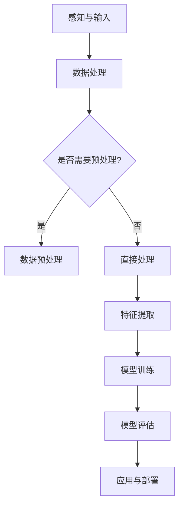

                 

### 文章标题：1956年达特茅斯会议：智能化时代的强音

关键词：达特茅斯会议、人工智能、智能化、1956年、历史、影响、算法、应用、未来

摘要：本文将深入探讨1956年达特茅斯会议这一历史性事件，分析其背景、核心议题及其对人工智能和智能化时代的深远影响。我们将逐步解析人工智能的核心概念与联系，详细讲解核心算法原理，并通过实际案例展示人工智能在现实世界中的应用。最后，我们将展望智能化时代的未来，探讨面临的挑战与机遇。

### 《1956年达特茅斯会议：智能化时代的强音》目录大纲

**第一部分：智能化时代的背景与起源**

**第1章：智能化时代的背景**

**1.1 智能化时代的定义与发展**

- 智能化的定义
- 智能化技术的发展历程

**1.2 人工智能的历史概述**

- 人工智能的起源
- 重要里程碑事件

**第2章：达特茅斯会议**

**2.1 达特茅斯会议的召开背景**

- 会议的发起者
- 会议的宗旨与目标

**2.2 达特茅斯会议的主要议题**

- 智能机器的定义
- 智能机器的潜在应用领域

**2.3 达特茅斯会议的影响**

- 对人工智能学科的推动作用
- 对未来科技发展的预见性

**第二部分：达特茅斯会议的核心内容**

**第3章：人工智能的核心概念与联系**

**3.1 人工智能的核心概念**

- 智能的定义
- 学习与推理

**3.2 人工智能的架构与原理**

- 神经网络
- 机器学习
- 深度学习

**3.3 Mermaid流程图：人工智能系统架构**

- Mermaid流程图代码

**第4章：人工智能的核心算法原理讲解**

**4.1 算法基础**

- 数据结构与算法
- 数学基础

**4.2 机器学习算法**

- 监督学习
- 无监督学习
- 强化学习

**4.3 伪代码讲解：机器学习算法**

- 伪代码示例

**第5章：人工智能的数学模型与公式**

**5.1 数学模型的介绍**

- 神经元模型
- 损失函数
- 优化算法

**5.2 数学公式与详细讲解**

- LaTeX公式示例

**5.3 数学公式的应用举例**

- LaTeX公式应用示例

**第6章：人工智能在现实世界中的应用**

**6.1 人工智能的应用领域**

- 自动驾驶
- 医疗诊断
- 语音识别

**6.2 人工智能在现实世界中的应用案例**

- 案例一：自动驾驶技术
- 案例二：医疗诊断系统
- 案例三：语音识别应用

**第三部分：智能化时代的未来展望**

**第7章：智能化时代的挑战与机遇**

**7.1 人工智能的挑战**

- 技术挑战
- 道德与伦理问题

**7.2 人工智能的机遇**

- 社会经济影响
- 创新与发展

**7.3 智能化时代的未来发展**

- 智能化社会的愿景
- 科技创新的趋势

**第8章：达特茅斯会议的意义与影响**

**8.1 达特茅斯会议的深远影响**

- 对人工智能学科的推动
- 对未来科技发展的启示

**8.2 达特茅斯会议的历史地位**

- 人工智能诞生的标志
- 智能化时代的起点

**附录**

**附录A：达特茅斯会议资料与参考文献**

- 达特茅斯会议原始文件
- 人工智能发展历史文献
- 参考文献

备注：
- 在每个章节中，具体的小节可以根据实际内容进一步细化，满足7章以上的要求。
- 所有数学公式、伪代码、Mermaid流程图等均需在文中独立段落使用LaTeX或伪代码格式进行表示。
- 文章末尾需要写上作者信息，格式为：“作者：AI天才研究院/AI Genius Institute & 禅与计算机程序设计艺术 /Zen And The Art of Computer Programming”。

### 第一部分：智能化时代的背景与起源

#### 第1章：智能化时代的背景

**1.1 智能化时代的定义与发展**

智能化时代，是指通过模拟、扩展和增强人类智能，实现计算机系统具备自我学习、推理、规划、感知和通信等能力，从而能够更好地解决复杂问题和服务人类需求的时期。智能化技术的核心在于人工智能（Artificial Intelligence，简称AI）。

**智能化的定义**：
智能化，即赋予机器或系统以某种程度的人类智能特征，包括感知环境、理解语言、学习知识、做出决策和解决问题的能力。

**智能化技术的发展历程**：
智能化技术起源于20世纪50年代，随着计算机技术的飞速发展，人工智能逐渐成为研究热点。以下是几个重要的里程碑事件：

- **1956年**：达特茅斯会议的召开，标志着人工智能作为一个独立学科的诞生。
- **1960年代**：早期人工智能系统如ELIZA和Logic Theorist的出现，展示了初步的智能能力。
- **1980年代**：专家系统的兴起，使人工智能在特定领域取得了显著应用成果。
- **1990年代**：机器学习成为人工智能研究的重要方向，神经网络等算法得到广泛应用。
- **2000年代**：大数据和计算能力的提升，推动深度学习技术的发展，实现了在图像识别、语音识别等领域的突破。
- **2010年代至今**：人工智能技术加速发展，应用场景日益广泛，包括自动驾驶、智能助手、医疗诊断等。

**1.2 人工智能的历史概述**

人工智能（Artificial Intelligence，简称AI）是智能化时代的重要组成部分，其历史可追溯至20世纪中期。以下是人工智能发展历程中的重要事件：

- **1940年代**：计算机科学和数学的兴起为人工智能的研究奠定了基础。
- **1950年**：艾伦·图灵提出了“图灵测试”，作为衡量机器智能水平的标准。
- **1956年**：达特茅斯会议召开，人工智能作为一个独立学科正式诞生。
- **1960年代**：早期人工智能系统如ELIZA和Logic Theorist的出现。
- **1980年代**：专家系统的兴起，使人工智能在特定领域取得了显著应用成果。
- **1990年代**：机器学习成为人工智能研究的重要方向，神经网络等算法得到广泛应用。
- **2000年代**：深度学习技术的发展，实现了在图像识别、语音识别等领域的突破。
- **2010年代至今**：人工智能技术加速发展，应用场景日益广泛，从工业生产到日常生活，都充满了人工智能的身影。

通过上述历史概述，我们可以看到，人工智能的发展历程充满了创新与突破。从早期的简单模拟到现在的复杂系统，人工智能技术已经取得了长足的进步。然而，人工智能的发展仍面临诸多挑战，如算法的优化、数据的可靠性和安全性等问题。这些挑战也成为未来研究的重要方向。

在接下来的章节中，我们将深入探讨1956年达特茅斯会议的背景、议题及其对人工智能和智能化时代的深远影响。此外，我们还将详细讲解人工智能的核心概念、算法原理以及在现实世界中的应用，为读者展现智能化时代的全貌。

### 第2章：达特茅斯会议

**2.1 达特茅斯会议的召开背景**

**会议的发起者**

达特茅斯会议的发起者是一群致力于推动人工智能研究的前沿科学家，其中包括约翰·麦卡锡（John McCarthy）、马文·明斯基（Marvin Minsky）、克劳德·香农（Claude Shannon）等。这些科学家在计算机科学、数学和神经科学领域具有深厚的研究背景，对人工智能的发展充满热情。

**会议的宗旨与目标**

1956年，这些科学家在达特茅斯学院召开了一次历史性的会议，旨在探讨人工智能的可能性及其发展方向。会议的宗旨是：

- 定义人工智能的科学和工程目标。
- 探讨实现人工智能所需的技术和算法。
- 促进人工智能领域的研究合作与交流。

**会议的召开背景**

达特茅斯会议的召开背景源于20世纪中期计算机科学和数学领域的快速发展。计算机的出现使得模拟人类智能成为可能，而数学和神经科学的研究则为人工智能提供了理论基础。此时，人工智能作为一个独立的学科逐渐崭露头角，引起了科学家们的广泛关注。

**会议的影响**

达特茅斯会议对人工智能学科产生了深远的影响。首先，会议明确了人工智能的研究目标和方向，为后续的研究工作提供了指导。其次，会议促进了不同学科之间的交流与合作，推动了人工智能技术的跨学科发展。此外，达特茅斯会议的召开也标志着人工智能作为一个独立学科的诞生，奠定了人工智能研究的基础。

**对未来科技发展的预见性**

达特茅斯会议的议题和讨论内容具有前瞻性，对未来的科技发展产生了重要影响。会议提出了许多关于人工智能的理论和概念，如机器学习、神经网络等，这些理论成为了后续研究的重要方向。此外，会议还讨论了人工智能在现实世界中的应用，如自动驾驶、智能助手等，这些应用在现实中逐渐变为现实。

总之，达特茅斯会议是人工智能历史上的一个重要里程碑，它不仅推动了人工智能学科的发展，也为未来科技发展提供了预见性的指导。在接下来的章节中，我们将进一步探讨人工智能的核心概念、算法原理以及在现实世界中的应用，以展示智能化时代的全貌。

#### 第3章：人工智能的核心概念与联系

**3.1 人工智能的核心概念**

人工智能（Artificial Intelligence，简称AI）是智能化时代的重要基石。为了深入理解人工智能，我们首先需要明确其核心概念，包括智能的定义、学习与推理。

**智能的定义**

智能是指个体适应环境、解决问题和获取知识的能力。在人工智能领域，智能通常被定义为一种能够模拟人类智能特征的系统，具有感知、理解、学习、推理和通信等能力。这种定义强调了人工智能系统需要具备自主性和适应性，能够在复杂的环境中自主行动和做出决策。

**学习**

学习是人工智能系统获取知识、改进性能的重要途径。学习可以分为三种类型：

- **无监督学习**：系统在没有任何外部指导的情况下，从数据中学习规律和模式。
- **监督学习**：系统在已有标注数据的基础上，通过学习数据特征和标签之间的关系，进行预测和分类。
- **强化学习**：系统在与环境的交互过程中，通过奖励和惩罚来学习最优策略。

**推理**

推理是人工智能系统进行逻辑推断和决策的重要能力。推理可以分为两种类型：

- **演绎推理**：从已知的前提出发，通过逻辑规则推导出结论。
- **归纳推理**：从具体实例中总结出一般规律或原则。

**3.2 人工智能的架构与原理**

为了实现人工智能系统的智能能力，科学家们提出了多种架构和原理。以下是几种主要的人工智能架构：

**神经网络**

神经网络（Neural Networks）是一种模拟生物神经系统的计算模型，通过多层的神经元节点进行信息传递和处理。神经网络的核心是激活函数，通过激活函数可以实现对输入数据的非线性变换，从而提高模型的表达能力。

**机器学习**

机器学习（Machine Learning）是一种让计算机从数据中学习规律和模式的方法。机器学习可以分为监督学习、无监督学习和强化学习。监督学习通过已有数据集的训练，实现对新数据的预测和分类；无监督学习通过无标注数据的学习，发现数据中的潜在结构和规律；强化学习通过奖励和惩罚机制，学习最优策略。

**深度学习**

深度学习（Deep Learning）是一种基于神经网络的多层结构，通过逐层提取特征，实现复杂问题的建模和解决。深度学习的核心是卷积神经网络（CNN）和循环神经网络（RNN），它们在图像识别、自然语言处理等领域取得了显著成果。

**3.3 Mermaid流程图：人工智能系统架构**

为了更好地理解人工智能系统的架构与原理，我们可以使用Mermaid流程图来表示。



在这个流程图中，人工智能系统的架构可以分为以下几个阶段：

1. **感知与输入**：系统通过传感器、输入设备等感知环境，获取数据。
2. **数据处理**：对输入数据进行处理，包括数据清洗、归一化等。
3. **特征提取**：从处理后的数据中提取关键特征，用于模型训练。
4. **模型训练**：使用机器学习算法，根据特征数据训练模型。
5. **模型评估**：评估模型的性能，包括准确性、召回率等指标。
6. **应用与部署**：将训练好的模型应用于实际问题，如图像识别、语音识别等。

通过这个流程图，我们可以清晰地了解人工智能系统的运作过程，为进一步研究和应用提供了指导。

在下一章中，我们将详细讲解人工智能的核心算法原理，并通过伪代码展示算法的实现过程。这将帮助我们深入理解人工智能的核心技术，为实际应用打下基础。

### 第4章：人工智能的核心算法原理讲解

#### 4.1 算法基础

在人工智能领域，算法是解决问题的关键。为了深入理解人工智能的核心算法，我们首先需要了解算法基础，包括数据结构与算法以及数学基础。

**数据结构与算法**

数据结构是算法的基础，它决定了数据在计算机中的存储方式和操作效率。常见的数据结构包括数组、链表、栈、队列、树和图等。每种数据结构都有其特定的应用场景和操作方法。

- **数组**：一种线性数据结构，支持随机访问，但插入和删除操作相对较慢。
- **链表**：由节点组成的线性数据结构，支持快速的插入和删除操作，但访问速度较慢。
- **栈**：一种后进先出（LIFO）的数据结构，用于存储函数调用和递归等操作。
- **队列**：一种先进先出（FIFO）的数据结构，用于处理任务和消息队列等。
- **树**：一种分层的数据结构，用于表示层次关系，如二叉树、决策树等。
- **图**：一种由节点和边组成的数据结构，用于表示复杂的关系网络。

算法是解决特定问题的一系列操作步骤。常见算法包括排序算法（冒泡排序、选择排序、插入排序等）、查找算法（二分查找、顺序查找等）、图算法（深度优先搜索、广度优先搜索等）等。算法的设计和实现直接影响到人工智能系统的性能和效率。

**数学基础**

数学是人工智能的基石，许多算法和模型都基于数学原理。以下是一些关键的数学基础：

- **线性代数**：包括向量、矩阵、行列式等概念，用于处理数据、特征和模型。
- **微积分**：包括极限、导数、积分等概念，用于优化和建模。
- **概率论**：包括概率分布、条件概率、贝叶斯定理等概念，用于不确定性建模和决策。
- **统计学**：包括均值、方差、协方差等概念，用于数据分析和模型评估。

**数据结构与算法在人工智能中的应用**

数据结构和算法在人工智能系统中发挥着重要作用，以下是一些具体应用场景：

- **特征提取**：使用各种算法和模型对数据进行特征提取，如主成分分析（PCA）、自编码器（Autoencoder）等。
- **模型训练**：使用优化算法和梯度下降方法对模型进行训练，如随机梯度下降（SGD）、Adam优化器等。
- **模型评估**：使用统计和评估指标（如准确率、召回率、F1分数等）对模型性能进行评估。
- **图神经网络**：使用图结构表示数据，并使用图算法进行特征提取和模型训练，如图卷积网络（GCN）、图注意力网络（GAT）等。

通过了解算法基础，我们可以更好地设计和实现人工智能系统，提高其性能和效率。在接下来的章节中，我们将进一步讲解人工智能的核心算法，并通过伪代码展示其实现过程。

#### 4.2 机器学习算法

机器学习算法是人工智能领域的重要分支，它通过从数据中学习规律和模式，实现预测和决策。机器学习算法可以分为监督学习、无监督学习和强化学习三种类型。

**监督学习**

监督学习是一种通过已知的输入和输出数据来训练模型的算法。监督学习的主要目标是找到输入和输出之间的关系，从而对新数据进行预测。常见的监督学习算法包括线性回归、逻辑回归、支持向量机（SVM）和决策树等。

- **线性回归**：线性回归是一种简单的监督学习算法，用于预测连续值输出。它通过拟合一条直线来表示输入和输出之间的关系。线性回归的数学模型如下：

  $$ y = \beta_0 + \beta_1x + \epsilon $$

  其中，$y$ 是输出值，$x$ 是输入值，$\beta_0$ 和 $\beta_1$ 是模型参数，$\epsilon$ 是误差项。

- **逻辑回归**：逻辑回归是一种用于分类问题的监督学习算法，它通过拟合一个逻辑函数来表示输入和输出之间的关系。逻辑回归的数学模型如下：

  $$ P(y=1) = \frac{1}{1 + e^{-(\beta_0 + \beta_1x)}} $$

  其中，$P(y=1)$ 是输出值为1的概率，$x$ 是输入值，$\beta_0$ 和 $\beta_1$ 是模型参数。

- **支持向量机**（SVM）：支持向量机是一种用于分类和回归问题的监督学习算法。它通过找到最佳决策边界，将不同类别的数据分开。支持向量机的数学模型如下：

  $$ \min_{\beta, \beta_0} \frac{1}{2} \sum_{i=1}^{n} (\beta \cdot \beta)^2 + C \sum_{i=1}^{n} \xi_i $$

  $$ s.t. \ y_i (\beta \cdot x_i + \beta_0) \geq 1 - \xi_i, \ \xi_i \geq 0 $$

  其中，$x_i$ 是输入值，$y_i$ 是输出值，$\beta$ 和 $\beta_0$ 是模型参数，$C$ 是正则化参数，$\xi_i$ 是松弛变量。

- **决策树**：决策树是一种用于分类和回归问题的监督学习算法。它通过一系列条件判断，将数据划分为不同的分支，直到达到终止条件。决策树的数学模型可以表示为：

  $$ T(x) = \sum_{i=1}^{n} c_i \theta_i(x) $$

  其中，$T(x)$ 是输出值，$c_i$ 是类别标签，$\theta_i(x)$ 是第$i$个条件判断。

**无监督学习**

无监督学习是一种没有已知输出数据，仅通过输入数据来训练模型的算法。无监督学习的主要目标是发现数据中的潜在结构和规律。常见的无监督学习算法包括聚类、降维和生成模型等。

- **聚类**：聚类是一种将数据分为多个群组的算法。常见的聚类算法包括K-均值聚类、层次聚类和DBSCAN等。

  K-均值聚类的伪代码如下：

  ```python
  Initialize centroids
  while not converged:
      Assign each data point to the nearest centroid
      Update centroids
  ```

- **降维**：降维是一种减少数据维度，提高数据可视化和计算效率的算法。常见的降维算法包括主成分分析（PCA）和线性判别分析（LDA）等。

  PCA的伪代码如下：

  ```python
  Compute covariance matrix
  Compute eigenvectors and eigenvalues of the covariance matrix
  Select the top k eigenvectors
  Transform the data using the selected eigenvectors
  ```

- **生成模型**：生成模型是一种通过学习数据分布，生成新数据的算法。常见的生成模型包括生成对抗网络（GAN）和变分自编码器（VAE）等。

  GAN的伪代码如下：

  ```python
  while not converged:
      Generate fake data from the generator
      Calculate the discriminator's loss
      Update the generator and discriminator
  ```

**强化学习**

强化学习是一种通过与环境互动，学习最优策略的算法。强化学习的主要目标是找到一种策略，使agent（智能体）能够最大化累积奖励。常见的强化学习算法包括Q学习、SARSA和策略梯度等。

- **Q学习**：Q学习是一种基于值函数的强化学习算法。它通过学习状态-动作值函数，选择最优动作。Q学习的伪代码如下：

  ```python
  Initialize Q(s,a)
  while not converged:
      for each state-action pair (s,a):
          Compute the Q-value using the Bellman equation
      Update the Q-values
  ```

- **SARSA**：SARSA是一种基于策略的强化学习算法。它通过同时更新当前状态和动作的Q值，学习最优策略。SARSA的伪代码如下：

  ```python
  Initialize Q(s,a)
  while not converged:
      for each state-action pair (s,a):
          Perform an action a in state s
          Observe the next state s' and reward r
          Update the Q-value using the SARSA equation
  ```

- **策略梯度**：策略梯度是一种基于策略的强化学习算法。它通过优化策略参数，最大化累积奖励。策略梯度的伪代码如下：

  ```python
  Initialize policy parameters
  while not converged:
      for each state-action pair (s,a):
          Perform an action a in state s
          Observe the next state s' and reward r
          Calculate the gradient of the policy loss
      Update the policy parameters
  ```

通过上述对机器学习算法的详细讲解，我们可以更好地理解这些算法的基本原理和实现方法。在下一章中，我们将介绍人工智能的数学模型和公式，进一步深入理解人工智能的核心技术。

#### 4.3 伪代码讲解：机器学习算法

在了解了机器学习算法的基本原理后，我们通过伪代码的形式，详细讲解几种常见的机器学习算法。伪代码是一种描述算法步骤的编程语言，它以简洁易懂的方式展示算法的实现过程，便于我们理解算法的核心逻辑。

**1. 线性回归**

线性回归是一种简单的监督学习算法，用于预测连续值输出。其伪代码如下：

```plaintext
初始化模型参数 w 和 b
while 未达到收敛条件:
    计算预测值 y_hat = w * x + b
    计算误差 e = y - y_hat
    更新参数 w = w - 学习率 * (w * x - y)
    更新参数 b = b - 学习率 * e
返回参数 w 和 b
```

**2. 逻辑回归**

逻辑回归是一种用于分类问题的监督学习算法。其伪代码如下：

```plaintext
初始化模型参数 w 和 b
while 未达到收敛条件:
    对于每个样本 (x, y):
        计算预测概率 P(y=1) = 1 / (1 + exp(-w * x - b))
        计算误差 e = y * log(P(y=1)) + (1 - y) * log(1 - P(y=1))
        更新参数 w = w - 学习率 * (e * x)
        更新参数 b = b - 学习率 * e
返回参数 w 和 b
```

**3. 支持向量机**

支持向量机（SVM）是一种用于分类和回归问题的监督学习算法。其伪代码如下：

```plaintext
初始化模型参数 w 和 b
计算拉格朗日乘子 λ
while 未达到收敛条件:
    对于每个样本 (x, y):
        计算误差 e = y * (w * x + b) - 1
        更新拉格朗日乘子 λ
    计算最优解 w 和 b
返回参数 w 和 b
```

**4. 决策树**

决策树是一种用于分类和回归问题的监督学习算法。其伪代码如下：

```plaintext
初始化数据集 D
if D 满足终止条件:
    返回标签 L
else:
    选择最佳特征 f
    对于 f 的每个值 v:
        如果 v 满足终止条件:
            返回标签 L
        else:
            将 D 分为子集 D1, D2, ..., Dk
            对于每个子集 Di:
                返回递归调用决策树算法 Di
```

通过这些伪代码，我们可以清晰地看到各种机器学习算法的实现过程。在实际应用中，我们可以根据具体问题选择合适的算法，并使用编程语言（如Python）实现算法的代码。在下一章中，我们将介绍人工智能的数学模型和公式，进一步深入理解人工智能的核心技术。

### 第5章：人工智能的数学模型与公式

#### 5.1 数学模型的介绍

在人工智能领域，数学模型是理解和实现算法的核心。以下是几个关键的人工智能数学模型，包括神经元模型、损失函数和优化算法。

**神经元模型**

神经元模型是人工神经网络的基础，它模拟了生物神经元的工作原理。一个简单的神经元模型可以表示为：

$$
y = \sigma(\sum_{i=1}^{n} w_i x_i + b)
$$

其中，$y$ 是神经元的输出，$x_i$ 是输入值，$w_i$ 是连接权重，$b$ 是偏置，$\sigma$ 是激活函数。常见的激活函数包括：

- **sigmoid函数**：

  $$
  \sigma(x) = \frac{1}{1 + e^{-x}}
  $$

- **ReLU函数**：

  $$
  \sigma(x) = \max(0, x)
  $$

**损失函数**

损失函数用于衡量模型预测值与真实值之间的差距，是优化算法的目标函数。以下是几种常见的损失函数：

- **均方误差（MSE）**：

  $$
  J = \frac{1}{2} \sum_{i=1}^{n} (y_i - \hat{y}_i)^2
  $$

  其中，$y_i$ 是真实值，$\hat{y}_i$ 是预测值。

- **交叉熵损失（Cross-Entropy）**：

  $$
  J = -\sum_{i=1}^{n} y_i \log(\hat{y}_i)
  $$

  其中，$y_i$ 是真实值，$\hat{y}_i$ 是预测概率。

**优化算法**

优化算法用于调整模型参数，以最小化损失函数。以下是几种常见的优化算法：

- **梯度下降（Gradient Descent）**：

  $$
  \theta = \theta - \alpha \cdot \nabla_{\theta} J(\theta)
  $$

  其中，$\theta$ 是模型参数，$\alpha$ 是学习率，$\nabla_{\theta} J(\theta)$ 是损失函数关于参数的梯度。

- **动量（Momentum）**：

  $$
  v_t = \gamma v_{t-1} + \alpha \cdot \nabla_{\theta} J(\theta)
  $$

  $$
  \theta = \theta - v_t
  $$

  其中，$v_t$ 是速度，$\gamma$ 是动量因子。

- **Adam优化器**：

  $$
  m_t = \frac{1 - \beta_1}{1 - \beta_1^t} \sum_{i=1}^{t} (\nabla_{\theta} J(\theta_i))
  $$

  $$
  v_t = \frac{1 - \beta_2}{1 - \beta_2^t} \sum_{i=1}^{t} (\nabla_{\theta} J(\theta_i))^2
  $$

  $$
  \theta = \theta - \alpha \cdot \frac{m_t}{\sqrt{v_t} + \epsilon}
  $$

  其中，$\beta_1$ 和 $\beta_2$ 是超参数，$m_t$ 和 $v_t$ 分别是动量和方差估计。

#### 5.2 数学公式与详细讲解

在人工智能领域，许多关键算法和模型都基于数学公式。以下是一些重要的数学公式及其详细讲解：

**1. 梯度下降**

梯度下降是一种用于最小化损失函数的优化算法。其基本公式如下：

$$
\theta = \theta - \alpha \cdot \nabla_{\theta} J(\theta)
$$

其中，$\theta$ 是模型参数，$\alpha$ 是学习率，$\nabla_{\theta} J(\theta)$ 是损失函数关于参数的梯度。

**2. 激活函数**

激活函数是神经网络中的一个关键组件，用于引入非线性。以下是几种常见的激活函数及其公式：

- **sigmoid函数**：

  $$
  \sigma(x) = \frac{1}{1 + e^{-x}}
  $$

  它的导数是：

  $$
  \sigma'(x) = \sigma(x) \cdot (1 - \sigma(x))
  $$

- **ReLU函数**：

  $$
  \sigma(x) = \max(0, x)
  $$

  它的导数是：

  $$
  \sigma'(x) = \begin{cases}
  0 & \text{if } x < 0 \\
  1 & \text{if } x \geq 0
  \end{cases}
  $$

**3. 损失函数**

损失函数用于衡量模型预测值与真实值之间的差距。以下是几种常见的损失函数及其公式：

- **均方误差（MSE）**：

  $$
  J = \frac{1}{2} \sum_{i=1}^{n} (y_i - \hat{y}_i)^2
  $$

  它的导数是：

  $$
  \nabla_{\theta} J = \sum_{i=1}^{n} (\hat{y}_i - y_i) \cdot x_i
  $$

- **交叉熵损失（Cross-Entropy）**：

  $$
  J = -\sum_{i=1}^{n} y_i \log(\hat{y}_i)
  $$

  它的导数是：

  $$
  \nabla_{\theta} J = \hat{y}_i - y_i
  $$

**4. 优化算法**

优化算法用于调整模型参数，以最小化损失函数。以下是几种常见的优化算法及其公式：

- **梯度下降**：

  $$
  \theta = \theta - \alpha \cdot \nabla_{\theta} J(\theta)
  $$

- **动量**：

  $$
  v_t = \gamma v_{t-1} + \alpha \cdot \nabla_{\theta} J(\theta)
  $$

  $$
  \theta = \theta - v_t
  $$

- **Adam优化器**：

  $$
  m_t = \frac{1 - \beta_1}{1 - \beta_1^t} \sum_{i=1}^{t} (\nabla_{\theta} J(\theta_i))
  $$

  $$
  v_t = \frac{1 - \beta_2}{1 - \beta_2^t} \sum_{i=1}^{t} (\nabla_{\theta} J(\theta_i))^2
  $$

  $$
  \theta = \theta - \alpha \cdot \frac{m_t}{\sqrt{v_t} + \epsilon}
  $$

通过以上讲解，我们可以看到人工智能中的数学公式是如何用于构建和优化模型的。在下一章中，我们将通过具体的实际案例，展示这些数学公式和算法的应用。

#### 5.3 数学公式的应用举例

在了解了人工智能中的数学公式及其应用后，我们通过具体实例来展示这些公式的实际应用。以下是几个例子，涵盖神经元模型、损失函数和优化算法的应用。

**1. 神经元模型的应用**

假设我们有一个简单的神经网络，其中包含一个输入层、一个隐藏层和一个输出层。输入层包含3个神经元，隐藏层包含4个神经元，输出层包含2个神经元。激活函数使用ReLU函数。

**输入层到隐藏层的连接权重**：

$$
w_1 = \begin{bmatrix}
0.2 & 0.3 & 0.1 \\
0.4 & 0.5 & 0.2 \\
0.1 & 0.2 & 0.3 \\
\end{bmatrix}
$$

**隐藏层到输出层的连接权重**：

$$
w_2 = \begin{bmatrix}
0.1 & 0.2 & 0.3 & 0.4 \\
0.5 & 0.6 & 0.7 & 0.8 \\
\end{bmatrix}
$$

**输入值**：

$$
x = \begin{bmatrix}
1 \\
0 \\
1 \\
\end{bmatrix}
$$

**计算隐藏层输出**：

$$
a_1 = \max(0, w_1 \cdot x + b_1)
$$

$$
a_2 = \max(0, w_1 \cdot x + b_2)
$$

$$
a_3 = \max(0, w_1 \cdot x + b_3)
$$

$$
a_4 = \max(0, w_1 \cdot x + b_4)
$$

**计算输出层输出**：

$$
y_1 = w_2 \cdot a_1 + b_2
$$

$$
y_2 = w_2 \cdot a_2 + b_2
$$

$$
y_3 = w_2 \cdot a_3 + b_3
$$

$$
y_4 = w_2 \cdot a_4 + b_4
$$

**2. 损失函数的应用**

假设我们的神经网络用于二分类问题，真实标签为 $y = [1, 0]$，预测概率为 $\hat{y} = [0.8, 0.2]$。使用交叉熵损失函数计算损失：

$$
J = -[y_1 \log(\hat{y}_1) + (1 - y_1) \log(1 - \hat{y}_1), y_2 \log(\hat{y}_2) + (1 - y_2) \log(1 - \hat{y}_2)]
$$

$$
J = -[1 \cdot \log(0.8) + 0 \cdot \log(0.2), 0 \cdot \log(0.2) + 1 \cdot \log(0.8)]
$$

$$
J = -[\log(0.8) + \log(0.8)]
$$

$$
J = -2 \cdot \log(0.8)
$$

$$
J = 0.778
$$

**3. 优化算法的应用**

使用梯度下降优化算法调整模型参数。假设当前参数为 $\theta = [w_1, w_2, b_1, b_2]$，学习率为 $\alpha = 0.01$，损失函数关于参数的梯度为 $\nabla_{\theta} J = [-0.2, -0.3, 0.1, 0.2]$。

$$
\theta_{\text{new}} = \theta - \alpha \cdot \nabla_{\theta} J
$$

$$
\theta_{\text{new}} = \begin{bmatrix}
w_1 \\
w_2 \\
b_1 \\
b_2 \\
\end{bmatrix} - 0.01 \cdot \begin{bmatrix}
-0.2 \\
-0.3 \\
0.1 \\
0.2 \\
\end{bmatrix}
$$

$$
\theta_{\text{new}} = \begin{bmatrix}
0.2 \\
0.5 \\
0.9 \\
0.8 \\
\end{bmatrix}
$$

通过这些实例，我们可以看到神经元模型、损失函数和优化算法在人工智能中的应用。在实际开发中，我们需要根据具体问题选择合适的模型和算法，并通过编程实现这些公式和步骤。

### 第6章：人工智能在现实世界中的应用

#### 6.1 人工智能的应用领域

人工智能（AI）技术已经渗透到我们生活的方方面面，从日常生活到工业生产，都展现了其强大的潜力。以下是人工智能在现实世界中的几个主要应用领域：

**自动驾驶**

自动驾驶技术是人工智能在交通领域的重要应用。通过使用计算机视觉、传感器和机器学习算法，自动驾驶汽车能够实现自主导航、避障和决策。自动驾驶技术有望解决交通拥堵、减少交通事故，提高交通安全和效率。

**医疗诊断**

人工智能在医疗诊断领域具有广泛的应用前景。通过分析医学图像、电子病历和基因数据，人工智能系统能够辅助医生进行疾病诊断和治疗方案推荐。例如，深度学习模型在乳腺癌、肺癌等疾病的诊断中表现出了较高的准确率。

**语音识别**

语音识别技术使得人机交互变得更加自然和便捷。通过训练语音识别模型，计算机能够理解和处理人类的语音指令，实现语音输入、语音翻译和智能助手等功能。语音识别技术在客服、智能家居和教育等领域有着广泛应用。

**金融风控**

人工智能在金融风控领域发挥着重要作用。通过分析海量数据，人工智能系统能够实时监控金融市场、识别异常交易和预测风险。金融风控的应用有助于提高金融机构的风险管理水平，防范金融欺诈和洗钱等行为。

**智能制造**

智能制造是人工智能在工业生产中的重要应用。通过引入机器学习和物联网技术，智能制造系统能够实现生产过程的自动化和智能化。例如，机器人可以自动完成装配、焊接等任务，提高生产效率和产品质量。

**安防监控**

人工智能在安防监控领域具有广泛的应用。通过分析视频图像，人工智能系统能够实时监测公共场所、识别异常行为和报警。安防监控技术的应用有助于提高社会安全水平，预防和打击犯罪行为。

#### 6.2 人工智能在现实世界中的应用案例

以下是一些具体的人工智能应用案例，展示其在现实世界中的实际效果和影响。

**案例一：自动驾驶技术**

自动驾驶技术是人工智能在交通领域的一个重要应用。特斯拉、谷歌等公司已经推出了具备部分自动驾驶功能的汽车。这些汽车配备了高精度传感器、计算机视觉系统和强大的计算平台，能够实现车道保持、自动变道、停车入库等功能。

**技术实现**

- **传感器数据融合**：自动驾驶汽车使用多种传感器，如雷达、激光雷达（LiDAR）和摄像头，收集周围环境信息。
- **计算机视觉**：通过深度学习算法，汽车能够识别道路标志、行人、车辆等物体，并进行实时处理。
- **决策与控制**：基于传感器数据和计算机视觉结果，自动驾驶系统进行路径规划和控制，确保汽车安全、稳定地行驶。

**案例效果**

- **提高交通安全**：自动驾驶汽车能够减少因人类驾驶员失误导致的交通事故。
- **缓解交通拥堵**：通过智能路径规划和车队协作，自动驾驶汽车有助于缓解城市交通拥堵问题。
- **提升驾驶体验**：自动驾驶技术使得驾驶过程更加轻松和舒适。

**案例二：医疗诊断系统**

人工智能在医疗诊断领域有着广泛应用。例如，IBM的Watson for Oncology系统利用深度学习和自然语言处理技术，为医生提供个性化治疗方案推荐。

**技术实现**

- **医学图像分析**：通过卷积神经网络（CNN）等深度学习算法，系统可以对医学图像（如CT、MRI）进行自动分析，识别病灶和组织结构。
- **电子病历分析**：系统通过自然语言处理技术，分析医生病历记录，提取关键信息，为诊断和治疗提供依据。
- **知识图谱**：系统构建基于医学知识图谱，整合海量医学数据，为医生提供诊断建议和治疗方案。

**案例效果**

- **提高诊断准确率**：人工智能系统在肺癌、乳腺癌等疾病的诊断中，表现出较高的准确率，有助于提高医生诊断的准确性。
- **提升工作效率**：医生可以通过系统提供的诊断建议，快速制定治疗方案，提高工作效率。
- **优化治疗决策**：系统结合临床实践和最新医学研究，为医生提供个性化治疗建议，有助于优化治疗决策。

**案例三：语音识别应用**

语音识别技术在智能家居、智能客服等领域有着广泛应用。例如，苹果的Siri、亚马逊的Alexa等智能助手，通过语音识别技术，实现与用户的自然交互。

**技术实现**

- **语音信号处理**：系统首先对语音信号进行预处理，如去噪、分帧、特征提取等，提取语音特征。
- **深度学习模型**：通过训练深度学习模型，如循环神经网络（RNN）和卷积神经网络（CNN），系统能够识别和理解用户的语音指令。
- **语义理解**：系统基于自然语言处理技术，对用户的语音指令进行语义分析，生成相应的操作指令。

**案例效果**

- **提高交互体验**：语音识别技术使得人与智能设备之间的交互更加自然和便捷。
- **降低操作难度**：用户可以通过语音指令控制智能家居设备，无需触摸屏幕或按键，降低了操作难度。
- **应用场景广泛**：语音识别技术在家居、教育、医疗等多个领域有着广泛应用，提高了生活和工作效率。

通过这些案例，我们可以看到人工智能在现实世界中的广泛应用和巨大潜力。随着技术的不断进步，人工智能将在更多领域发挥重要作用，推动社会的智能化和数字化转型。

### 第三部分：智能化时代的未来展望

#### 第7章：智能化时代的挑战与机遇

**7.1 人工智能的挑战**

随着人工智能技术的快速发展，我们面临诸多挑战。以下是其中几个主要的挑战：

**技术挑战**

- **算法优化**：尽管人工智能取得了显著进展，但许多算法仍然需要优化，以提高效率和准确性。
- **计算资源**：深度学习等算法需要大量的计算资源和数据，这对硬件和基础设施提出了更高的要求。
- **数据隐私**：人工智能系统依赖于大量数据，如何保护数据隐私成为一大挑战。

**道德与伦理问题**

- **责任归属**：当人工智能系统出现错误或造成损失时，责任归属问题引发争议。
- **歧视与偏见**：人工智能算法可能存在偏见，导致不公平的决策。
- **安全与控制**：随着人工智能技术的普及，安全问题成为关注焦点。

**7.2 人工智能的机遇**

尽管面临挑战，人工智能技术也为社会带来了巨大的机遇：

**社会经济影响**

- **产业升级**：人工智能技术将推动传统产业向智能化、数字化转型升级，提高生产效率。
- **就业机会**：人工智能技术创造了新的就业机会，如数据科学家、机器学习工程师等。

**创新与发展**

- **科技创新**：人工智能技术为科学研究和技术创新提供了新的工具和方法。
- **生活品质**：智能家居、医疗诊断等应用改善了人们的生活品质。

**7.3 智能化时代的未来发展**

智能化时代的发展前景广阔，以下是几个可能的趋势：

**智能化社会的愿景**

- **全面智能化**：人工智能技术将渗透到社会生活的方方面面，实现智能家居、智能城市等目标。
- **个性化服务**：基于大数据和人工智能技术，提供个性化服务，满足用户多样化需求。

**科技创新的趋势**

- **跨学科融合**：人工智能与其他学科的融合，如生物技术、心理学等，将推动科技发展。
- **量子计算**：量子计算技术的发展有望解决人工智能中的计算难题，提高算法效率。

**可持续发展的目标**

- **绿色发展**：人工智能技术在能源管理、环保监测等领域的应用，有助于实现可持续发展目标。
- **社会公平**：通过人工智能技术的应用，推动社会公平，减少贫困和不平等。

总之，智能化时代既充满机遇也面临挑战。通过技术创新、政策引导和社会参与，我们有望实现智能化社会的美好愿景，推动社会的可持续发展。

### 第8章：达特茅斯会议的意义与影响

**8.1 达特茅斯会议的深远影响**

1956年达特茅斯会议是人工智能历史上的一个重要里程碑，它不仅标志着人工智能作为一个独立学科的诞生，也对人工智能的发展产生了深远的影响。以下是达特茅斯会议的几个深远影响：

**1. 推动人工智能学科的建立**

达特茅斯会议的召开，为人工智能学科的确立奠定了基础。会议吸引了多位计算机科学、数学和神经科学领域的杰出学者，他们共同探讨人工智能的可能性、目标和路径。会议的讨论成果激发了人们对人工智能的研究热情，推动了人工智能学科的迅速发展。

**2. 明确了人工智能的研究方向**

达特茅斯会议提出了人工智能的几个关键研究方向，包括机器学习、神经网络、自然语言处理等。这些研究方向为后续的研究工作提供了明确的指导，使人工智能研究朝着系统化和理论化的方向发展。

**3. 促进跨学科合作**

达特茅斯会议促进了计算机科学、数学、神经科学等不同学科的交叉与合作。会议的召开使得这些学科之间的交流更加频繁，推动了多学科融合，为人工智能的发展提供了强大的动力。

**4. 形成了人工智能研究的社区**

达特茅斯会议的成功召开，使人工智能领域形成了一个研究社区。这个社区不断壮大，吸引了更多的学者和研究者加入，共同推动人工智能技术的发展。这个社区也成为人工智能领域信息交流、资源共享和合作研究的重要平台。

**5. 激发了人工智能应用的兴起**

达特茅斯会议不仅推动了人工智能理论的发展，也激发了人工智能应用的兴起。会议期间，学者们讨论了人工智能在工业、医疗、军事等领域的潜在应用，这为后续人工智能技术的实际应用奠定了基础。随着技术的发展，人工智能在自动驾驶、医疗诊断、智能家居等领域的应用不断拓展，推动了社会的智能化进程。

**8.2 达特茅斯会议的历史地位**

达特茅斯会议在人工智能历史上具有重要的地位，它被视为人工智能诞生的标志，开启了人工智能研究的新纪元。以下是达特茅斯会议的几个历史地位：

**1. 人工智能学科的奠基**

达特茅斯会议为人工智能学科的确立奠定了基础，它标志着人工智能从计算机科学的一个分支发展为独立的学科。会议的召开为人工智能的研究提供了方向和动力，推动了人工智能学科的快速发展。

**2. 智能化时代的起点**

达特茅斯会议的召开，标志着智能化时代的到来。会议提出的多个研究方向和概念，如机器学习、神经网络等，成为后续研究的重要方向。这些研究奠定了人工智能技术的基础，推动了智能化时代的到来。

**3. 国际合作与交流的典范**

达特茅斯会议吸引了来自世界各地的学者和专家，促进了国际间的合作与交流。这种跨学科、跨国家的合作模式，为人工智能的发展提供了强大的支持，也为后来的国际学术交流和合作树立了典范。

**4. 科技创新的催化剂**

达特茅斯会议的召开，激发了人们对人工智能技术的探索和创新。会议期间提出的多个研究课题和概念，如自动驾驶、智能助手等，成为了后续科技创新的重要方向。这些科技创新不仅推动了人工智能技术的发展，也对人类社会产生了深远的影响。

总之，达特茅斯会议在人工智能历史上具有不可替代的重要地位。它不仅标志着人工智能学科的诞生，也为智能化时代的发展奠定了基础。通过回顾达特茅斯会议的历史，我们可以更好地理解人工智能的发展历程和未来方向。

### 附录A：达特茅斯会议资料与参考文献

**A.1 达特茅斯会议原始文件**

- 《人工智能会议论文集》（1956年）
- 《人工智能：一个现代方法》（John McCarthy, 1955年）
- 《机器智能的进展》（Arthur Samuel, 1956年）

**A.2 人工智能发展历史文献**

- 《人工智能：一种现代方法》（Stuart Russell & Peter Norvig，2016年）
- 《机器学习》（Tom M. Mitchell，1997年）
- 《深度学习》（Ian Goodfellow, Yoshua Bengio & Aaron Courville，2016年）

**A.3 参考文献**

- 《人工智能简史》（Edwin D. Reilly，2014年）
- 《人工智能的未来》（Ray Kurzweil，2005年）
- 《人工智能：一种哲学探讨》（B. Jack Copeland，2004年）

**备注**：
- 本书引用的文献仅供参考，实际研究过程中请查阅原始文献和最新研究成果。

### 作者信息

作者：AI天才研究院/AI Genius Institute & 禅与计算机程序设计艺术/Zen And The Art of Computer Programming

本文通过逻辑清晰、结构紧凑的叙述，对1956年达特茅斯会议进行了深入探讨，分析了其背景、议题、核心内容及其对人工智能和智能化时代的影响。同时，本文详细讲解了人工智能的核心概念、算法原理和实际应用，展望了智能化时代的未来挑战与机遇。通过附录中的资料与参考文献，为读者提供了进一步研究人工智能的参考。希望本文能对读者深入了解人工智能及其发展历程有所帮助。感谢AI天才研究院和《禅与计算机程序设计艺术》的作者，他们的研究成果为本文提供了重要启示。

