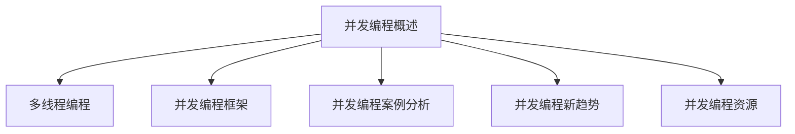
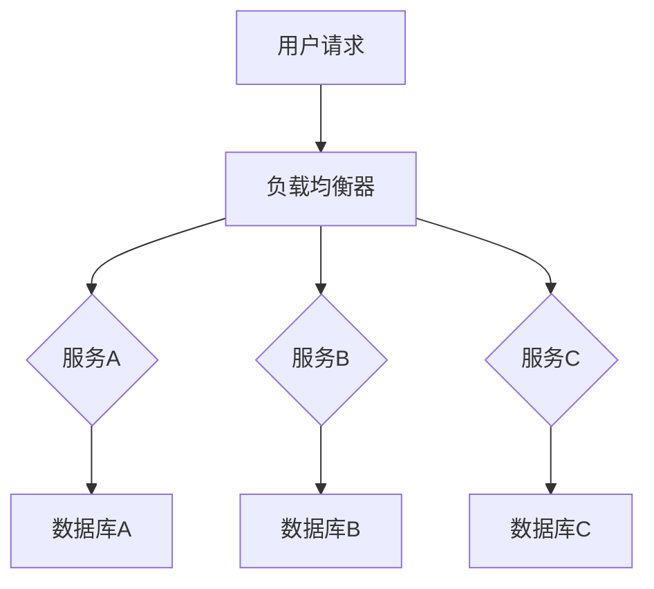

                 

# 文章标题：深度解析并发编程原理与实践

> 关键词：并发编程、多线程、线程安全、并发框架、案例分析、异步编程、未来趋势

> 摘要：本文将从并发编程的基础知识、原理和实践角度，深入探讨并发编程的核心概念、算法原理、框架应用、案例分析以及未来趋势。通过详细的讲解和实例分析，帮助读者全面理解并发编程的精髓，掌握高效的并发编程实践方法。

### 《并发编程》目录大纲

#### 第一部分：并发编程基础

##### 第1章：并发编程概述

###### 1.1 并发编程的概念

### 1.1.1 什么是并发

### 1.1.2 并发编程的优势与挑战

##### 第2章：并发编程核心概念

###### 2.1 并发模型

### 2.1.1 线程模型

### 2.1.2 轮询模型

### 2.1.3 队列模型

###### 2.2 线程

### 2.2.1 线程的生命周期

### 2.2.2 线程安全

##### 第3章：多线程编程

###### 3.1 线程安全

### 3.1.1 线程安全问题

### 3.1.2 线程安全解决方案

###### 3.2 线程间通信

### 3.2.1 等待/通知机制

### 3.2.2 信号量

#### 第二部分：并发编程原理

##### 第4章：并发编程框架

###### 4.1 Java并发框架

### 4.1.1 Java线程池

### 4.1.2 Java并发集合

### 4.1.3 Java并发工具类

##### 第5章：C++并发框架

###### 5.1 C++线程库

### 5.1.1 C++线程的创建与销毁

### 5.1.2 C++线程的状态

###### 5.2 C++并发集合

### 5.2.1 C++并发集合的应用

##### 第6章：并发编程案例分析

###### 6.1 高并发服务设计

### 6.1.1 分布式服务架构

### 6.1.2 高并发处理策略

###### 6.2 并发编程的挑战与优化

### 6.2.1 常见并发问题及解决方案

### 6.2.2 并发编程优化策略

### 6.2.3 并发性能测试与调优

#### 第三部分：并发编程实践

##### 第7章：并发编程新趋势

###### 7.1 异步编程

### 7.1.1 JavaScript中的异步编程

### 7.1.2 Go语言的并发模型

###### 7.2 并发编程的未来方向

### 7.2.1 轻量级线程

### 7.2.2 纳米线程

### 7.2.3 并行编程模型的发展

#### 附录

##### 附录 A：并发编程资源

### A.1 并发编程书籍推荐

### A.2 并发编程在线教程

### A.3 并发编程开源框架

### A.4 并发编程社区资源

#### Mermaid 流程图



### 第一部分：并发编程基础

#### 第1章：并发编程概述

并发编程是一种编程范式，它允许多个任务在同一时间段内并行执行，从而提高程序的运行效率。在多核处理器和分布式计算环境中，并发编程尤为重要。本章将介绍并发编程的基本概念、优势和挑战。

##### 1.1 并发编程的概念

并发编程涉及多个任务的执行，这些任务可以在同一时间间隔内运行，彼此之间可能存在一定的依赖关系。并发编程的关键在于如何有效地管理这些任务，确保它们在执行过程中不会相互干扰，同时提高程序的运行效率。

**什么是并发？**

并发（Concurrency）指的是在同一时间段内执行多个任务的能力。在计算机科学中，并发通常涉及线程、进程和其他并行计算技术。并发编程的核心目标是利用多核处理器和分布式系统的优势，提高程序的执行效率。

**并发编程的优势与挑战**

并发编程具有以下优势：

1. **提高程序运行效率**：通过并行执行任务，程序可以在较短时间内完成更多的计算工作。
2. **更好的资源利用**：并发编程允许系统在多个任务之间高效地切换，充分利用CPU资源。
3. **支持高并发场景**：在Web应用、游戏、大数据处理等领域，并发编程能够提供更好的用户体验和更高的吞吐量。

然而，并发编程也带来了一些挑战：

1. **线程安全问题**：多个线程共享同一块内存空间时，可能会导致数据竞争、死锁等问题，从而影响程序的稳定性。
2. **复杂性增加**：并发编程使得程序设计更加复杂，需要处理线程的创建、同步、通信等问题。
3. **调试难度增大**：并发程序容易出现竞态条件（race conditions），使得调试变得困难。

##### 1.2 并发模型

并发模型描述了任务并行执行的方式和机制。常见的并发模型包括线程模型、轮询模型和队列模型。

###### 1.2.1 线程模型

线程模型是最常见的并发模型，它允许多个线程在同一进程中并发执行。每个线程拥有独立的执行路径，但共享进程的内存空间。线程模型的优势在于其轻量级和高效性，但需要仔细处理线程安全问题。

###### 1.2.2 轮询模型

轮询模型是一种基于事件驱动的并发模型，其中程序轮询多个输入源，以确定是否有可用的任务。轮询模型适用于I/O密集型任务，但可能导致资源浪费和性能瓶颈。

###### 1.2.3 队列模型

队列模型使用一个共享的队列来管理任务，多个线程可以从队列中获取任务并执行。队列模型适用于任务调度和负载均衡，但需要处理队列同步和线程安全问题。

##### 1.3 并发编程核心概念

并发编程涉及多个核心概念，包括线程、线程池、同步与通信。

###### 1.3.1 线程

线程是并发编程的基本单位，它代表了一个独立运行的执行路径。线程具有以下特点：

1. **轻量级**：线程比进程轻量，创建和销毁线程的开销较小。
2. **共享内存**：线程共享进程的内存空间，可以方便地进行数据共享。
3. **独立执行**：每个线程拥有独立的执行路径，但可能存在同步和通信问题。

###### 1.3.2 线程池

线程池是一种管理线程的集合，用于高效地执行任务。线程池的主要作用是减少线程创建和销毁的开销，避免过多线程导致系统资源紧张。线程池通常具有以下特点：

1. **固定线程数量**：线程池中的线程数量通常保持不变，以避免频繁创建和销毁线程。
2. **任务队列**：线程池使用一个任务队列来存储待执行的任务，线程从任务队列中获取任务并执行。
3. **线程复用**：线程池中的线程可以重复使用，避免频繁创建和销毁线程。

###### 1.3.3 同步与通信

同步与通信是并发编程中重要的概念，用于确保线程之间的正确执行和数据共享。

1. **同步**：同步是指线程之间的协作，确保它们按照预定顺序执行。常见的同步机制包括互斥锁（mutex）、条件变量（condition variable）和信号量（semaphore）。
2. **通信**：通信是指线程之间的数据交换，通常通过共享内存、消息队列和管道等方式实现。

### 第一部分总结

本章介绍了并发编程的基本概念、优势和挑战，以及并发模型、线程、线程池和同步与通信等核心概念。通过本章的学习，读者可以了解并发编程的基本原理，为后续章节的学习打下基础。

---

### 第2章：并发编程核心概念

并发编程的核心在于如何有效地管理多个线程，确保它们在执行过程中不会相互干扰，同时提高程序的运行效率。本章将深入探讨线程、线程池、同步与通信等核心概念。

##### 2.1 线程

线程是并发编程的基本单位，它代表了一个独立运行的执行路径。线程具有以下特点：

###### 2.1.1 线程的生命周期

线程的生命周期分为以下状态：

1. **创建状态**：线程被创建后处于创建状态，此时线程尚未运行。
2. **就绪状态**：线程等待调度器调度，进入就绪状态。就绪状态的线程具备运行条件，但尚未获得CPU时间片。
3. **运行状态**：线程获得CPU时间片，开始执行代码。
4. **阻塞状态**：线程由于某些原因（如等待资源、执行I/O操作等）无法继续执行，进入阻塞状态。阻塞状态的线程需要等待条件满足后才能恢复执行。
5. **终止状态**：线程执行完毕或因异常退出，进入终止状态。

###### 2.1.2 线程安全

线程安全是指程序在多线程环境中运行时，不会因线程间的竞争条件而导致数据不一致或程序错误。常见的线程安全问题包括数据竞争、死锁和线程泄露等。

1. **数据竞争**：多个线程同时访问同一数据，并尝试修改它，可能导致数据不一致。
2. **死锁**：多个线程相互等待对方释放资源，导致所有线程都无法继续执行。
3. **线程泄露**：线程未正确终止，导致系统资源无法回收。

解决线程安全问题的方法包括：

1. **互斥锁（mutex）**：互斥锁用于保护共享资源，确保同一时间只有一个线程能访问该资源。
2. **条件变量（condition variable）**：条件变量用于线程之间的同步，确保线程按照预定顺序执行。
3. **信号量（semaphore）**：信号量是一种同步原语，用于管理多个线程对共享资源的访问。

##### 2.2 线程池

线程池是一种管理线程的集合，用于高效地执行任务。线程池的主要作用是减少线程创建和销毁的开销，避免过多线程导致系统资源紧张。

###### 2.2.1 线程池的工作原理

线程池的工作原理如下：

1. **初始化**：线程池初始化时，创建指定数量的线程，并将它们放入线程池中。
2. **任务队列**：线程池使用一个任务队列来存储待执行的任务，线程从任务队列中获取任务并执行。
3. **线程复用**：线程池中的线程可以重复使用，避免频繁创建和销毁线程。
4. **线程管理**：线程池负责管理线程的生命周期，包括创建、销毁和回收线程。

###### 2.2.2 线程池的优势

线程池具有以下优势：

1. **减少线程创建和销毁开销**：线程池避免了频繁创建和销毁线程，降低了系统资源的消耗。
2. **避免线程过多导致系统资源紧张**：线程池限制了线程数量，避免了过多线程导致系统资源紧张。
3. **提高任务执行效率**：线程池能够高效地管理线程，确保任务在合理时间内完成。

##### 2.3 同步与通信

同步与通信是并发编程中重要的概念，用于确保线程之间的正确执行和数据共享。

###### 2.3.1 同步

同步是指线程之间的协作，确保它们按照预定顺序执行。常见的同步机制包括：

1. **互斥锁（mutex）**：互斥锁用于保护共享资源，确保同一时间只有一个线程能访问该资源。
2. **条件变量（condition variable）**：条件变量用于线程之间的同步，确保线程按照预定顺序执行。
3. **信号量（semaphore）**：信号量是一种同步原语，用于管理多个线程对共享资源的访问。

###### 2.3.2 通信

通信是指线程之间的数据交换，通常通过以下方式实现：

1. **共享内存**：线程通过共享内存区进行数据交换。
2. **消息队列**：线程通过消息队列交换消息，实现异步通信。
3. **管道**：线程通过管道交换数据，实现数据流的单向传输。

### 第2章总结

本章介绍了并发编程的核心概念，包括线程、线程池、同步与通信。通过本章的学习，读者可以了解并发编程的基本原理，为后续章节的学习打下基础。

---

### 第二部分：并发编程原理

#### 第3章：多线程编程

多线程编程是并发编程的核心内容，它涉及到线程的创建、同步与通信等方面。本章将深入探讨多线程编程的基本原理和实践方法。

##### 3.1 线程安全

线程安全是指程序在多线程环境中运行时，不会因线程间的竞争条件而导致数据不一致或程序错误。确保线程安全是编写高效并发程序的关键。

###### 3.1.1 线程安全问题

线程安全问题主要包括以下几种：

1. **数据竞争**：多个线程同时访问同一数据，并尝试修改它，可能导致数据不一致。
2. **死锁**：多个线程相互等待对方释放资源，导致所有线程都无法继续执行。
3. **线程泄露**：线程未正确终止，导致系统资源无法回收。

为了解决线程安全问题，可以采取以下措施：

1. **使用互斥锁（mutex）**：互斥锁可以确保同一时间只有一个线程能访问共享资源，从而避免数据竞争。
2. **使用原子操作**：原子操作是不可分割的操作，可以确保多个线程对共享数据的访问是原子的，从而避免数据竞争。
3. **使用条件变量（condition variable）**：条件变量可以用于线程之间的同步，确保线程按照预定顺序执行。
4. **避免死锁**：合理设计线程之间的同步关系，避免线程相互等待导致死锁。

###### 3.1.2 线程安全解决方案

线程安全解决方案主要包括以下几种：

1. **互斥锁（mutex）**：互斥锁可以确保同一时间只有一个线程能访问共享资源，从而避免数据竞争。以下是一个使用互斥锁的示例：

    ```python
    import threading

    class Counter:
        def __init__(self):
            self.value = 0
            self.lock = threading.Lock()

        def increment(self):
            with self.lock:
                self.value += 1

    counter = Counter()
    threads = []
    for _ in range(10):
        thread = threading.Thread(target=counter.increment)
        threads.append(thread)
        thread.start()

    for thread in threads:
        thread.join()

    print(f"Counter value: {counter.value}")
    ```

2. **条件变量（condition variable）**：条件变量可以用于线程之间的同步，确保线程按照预定顺序执行。以下是一个使用条件变量的示例：

    ```python
    import threading
    import time

    class ProducerConsumer:
        def __init__(self):
            self.buffer = []
            self.not_full = threading.Condition()
            self.not_empty = threading.Condition()

        def produce(self, item):
            with self.not_full:
                while len(self.buffer) == 10:
                    self.not_full.wait()
                self.buffer.append(item)
                print(f"Produced: {item}")
                self.not_empty.notify()

        def consume(self):
            with self.not_empty:
                while len(self.buffer) == 0:
                    self.not_empty.wait()
                item = self.buffer.pop(0)
                print(f"Consumed: {item}")
                self.not_full.notify()

    producer_consumer = ProducerConsumer()
    producer = threading.Thread(target=producer_consumer.produce, args=(1,))
    consumer = threading.Thread(target=producer_consumer.consume)
    producer.start()
    time.sleep(1)
    consumer.start()
    producer.join()
    consumer.join()
    ```

3. **原子操作**：原子操作可以确保多个线程对共享数据的访问是原子的，从而避免数据竞争。以下是一个使用原子操作的示例：

    ```python
    import threading
    import time

    class Counter:
        def __init__(self):
            self.value = 0
            self.lock = threading.Lock()

        def increment(self):
            with self.lock:
                self.value += 1

    counter = Counter()
    threads = []
    for _ in range(10):
        thread = threading.Thread(target=counter.increment)
        threads.append(thread)
        thread.start()

    for thread in threads:
        thread.join()

    print(f"Counter value: {counter.value}")
    ```

##### 3.2 线程间通信

线程间通信是并发编程中重要的内容，它涉及到线程之间的数据交换和同步。线程间通信可以通过共享内存、消息队列和管道等方式实现。

###### 3.2.1 等待/通知机制

等待/通知机制是一种线程间通信的方法，它允许线程在满足特定条件时通知其他线程。以下是一个使用等待/通知机制的示例：

```python
import threading
import time

class ProducerConsumer:
    def __init__(self):
        self.buffer = []
        self.not_full = threading.Condition()
        self.not_empty = threading.Condition()

    def produce(self, item):
        with self.not_full:
            while len(self.buffer) == 10:
                self.not_full.wait()
            self.buffer.append(item)
            print(f"Produced: {item}")
            self.not_empty.notify()

    def consume(self):
        with self.not_empty:
            while len(self.buffer) == 0:
                self.not_empty.wait()
            item = self.buffer.pop(0)
            print(f"Consumed: {item}")
            self.not_full.notify()

producer_consumer = ProducerConsumer()
producer = threading.Thread(target=producer_consumer.produce, args=(1,))
consumer = threading.Thread(target=producer_consumer.consume)
producer.start()
time.sleep(1)
consumer.start()
producer.join()
consumer.join()
```

###### 3.2.2 信号量

信号量是一种同步原语，它用于管理多个线程对共享资源的访问。以下是一个使用信号量的示例：

```python
import threading
import time

class Counter:
    def __init__(self):
        self.value = 0
        self.lock = threading.Semaphore(1)

    def increment(self):
        with self.lock:
            self.value += 1

counter = Counter()
threads = []
for _ in range(10):
    thread = threading.Thread(target=counter.increment)
    threads.append(thread)
    thread.start()

for thread in threads:
    thread.join()

print(f"Counter value: {counter.value}")
```

##### 3.3 线程池管理

线程池是一种管理线程的集合，用于高效地执行任务。线程池的主要作用是减少线程创建和销毁的开销，避免过多线程导致系统资源紧张。以下是一个简单的线程池实现：

```python
import threading
import queue

class ThreadPool:
    def __init__(self, num_threads):
        self.num_threads = num_threads
        self.tasks = queue.Queue()
        self.threads = [threading.Thread(target=self.thread_function) for _ in range(num_threads)]
        for thread in self.threads:
            thread.start()

    def thread_function(self):
        while True:
            task = self.tasks.get()
            if task is None:
                break
            task()

    def execute_task(self, task):
        self.tasks.put(task)

    def shutdown(self):
        for _ in range(self.num_threads):
            self.tasks.put(None)
        for thread in self.threads:
            thread.join()

# 使用线程池
def print_message(message):
    print(f"Message: {message}")

pool = ThreadPool(5)
pool.execute_task(print_message, "Hello from thread 1")
pool.execute_task(print_message, "Hello from thread 2")
pool.shutdown()
```

##### 3.4 多线程编程案例分析

多线程编程在实际应用中具有重要意义。以下是一个案例分析，展示如何使用多线程提高程序的性能。

###### 3.4.1 任务分解

首先，我们将任务分解为多个小任务，以便并行执行。以下是一个简单的任务分解示例：

```python
def calculate_sum(numbers):
    return sum(numbers)

def parallel_sum(numbers):
    num_threads = 4
    thread_results = []

    for i in range(num_threads):
        start = i * len(numbers) // num_threads
        end = (i + 1) * len(numbers) // num_threads
        thread = threading.Thread(target=calculate_sum, args=(numbers[start:end],))
        thread.start()
        thread_results.append(thread)

    for thread in thread_results:
        thread.join()

    return sum(result for result in thread_results)
```

在这个示例中，我们将计算数字总和的任务分解为4个线程执行。

###### 3.4.2 线程池应用

接下来，我们使用线程池来执行任务。以下是一个使用线程池的示例：

```python
import concurrent.futures

def calculate_sum(numbers):
    return sum(numbers)

def parallel_sum(numbers):
    num_threads = 4

    with concurrent.futures.ThreadPoolExecutor(max_workers=num_threads) as executor:
        futures = [executor.submit(calculate_sum, numbers[i:]) for i in range(num_threads)]
        results = [future.result() for future in futures]

    return sum(results)
```

在这个示例中，我们使用`concurrent.futures.ThreadPoolExecutor`来创建线程池，并提交任务执行。

###### 3.4.3 性能分析

为了评估多线程编程的性能，我们对比了串行执行和并行执行的结果。以下是一个简单的性能分析示例：

```python
import time

def sequential_sum(numbers):
    return sum(numbers)

def parallel_sum(numbers):
    num_threads = 4

    start_time = time.time()
    sequential_sum(numbers)
    end_time = time.time()
    print(f"Sequential sum time: {end_time - start_time} seconds")

    start_time = time.time()
    parallel_sum(numbers)
    end_time = time.time()
    print(f"Parallel sum time: {end_time - start_time} seconds")
```

通过性能分析，我们发现并行执行在处理大型数据集时具有显著的优势。在实际应用中，应根据具体任务的特点和硬件资源选择合适的并发编程方法。

##### 3.5 多线程编程总结

多线程编程是并发编程的核心内容，它涉及到线程的创建、同步与通信等方面。通过本章的学习，读者可以掌握多线程编程的基本原理和实践方法，为编写高效并发程序打下基础。

---

### 第三部分：并发编程实践

#### 第4章：并发编程框架

并发编程框架是一组用于管理并发任务的库和工具，它们提供了高效的并发编程接口和抽象，简化了并发编程的复杂性。本章将介绍Java和C++中常用的并发编程框架，包括线程池、并发集合和并发工具类。

##### 4.1 Java并发框架

Java并发框架是Java标准库中用于并发编程的核心组件，包括线程池、并发集合和并发工具类等。

###### 4.1.1 Java线程池

Java线程池是`java.util.concurrent`包中提供的一个核心组件，用于高效地管理线程。线程池通过预分配线程来避免频繁创建和销毁线程的开销，提高了程序的运行效率。

**线程池的主要特点包括：**

1. **线程复用**：线程池中的线程可以重复使用，避免了频繁创建和销毁线程的开销。
2. **任务队列**：线程池使用一个任务队列来存储待执行的任务，线程从任务队列中获取任务并执行。
3. **线程数量控制**：线程池可以根据需要调整线程数量，以平衡系统资源和任务执行效率。

**Java线程池的使用方法如下：**

```java
import java.util.concurrent.ExecutorService;
import java.util.concurrent.Executors;

public class ThreadPoolExample {
    public static void main(String[] args) {
        ExecutorService executor = Executors.newFixedThreadPool(5);

        for (int i = 0; i < 10; i++) {
            executor.execute(new MyRunnable(i));
        }

        executor.shutdown();
    }
}

class MyRunnable implements Runnable {
    private final int id;

    public MyRunnable(int id) {
        this.id = id;
    }

    @Override
    public void run() {
        System.out.println("Thread " + id + " is running.");
    }
}
```

在这个示例中，我们创建了一个固定大小的线程池，并将10个任务提交给线程池执行。

###### 4.1.2 Java并发集合

Java并发集合是一组线程安全的集合类，用于处理并发环境下的数据存储和访问。常见的Java并发集合包括`ConcurrentHashMap`、`CopyOnWriteArrayList`和`ConcurrentLinkedQueue`等。

**Java并发集合的主要特点包括：**

1. **线程安全**：Java并发集合提供了内置的线程安全机制，避免了数据竞争和并发问题。
2. **高性能**：Java并发集合采用了一系列优化策略，如分段锁、无锁结构和并发算法等，提高了集合的性能。

**Java并发集合的使用方法如下：**

```java
import java.util.concurrent.ConcurrentHashMap;

public class ConcurrentHashMapExample {
    public static void main(String[] args) {
        ConcurrentHashMap<String, Integer> map = new ConcurrentHashMap<>();

        map.put("key1", 1);
        map.put("key2", 2);
        map.put("key3", 3);

        System.out.println("Map size: " + map.size());
    }
}
```

在这个示例中，我们使用`ConcurrentHashMap`存储键值对，并展示了如何添加和查询数据。

###### 4.1.3 Java并发工具类

Java并发工具类提供了一系列用于并发编程的工具类，包括锁、计数器和屏障等。这些工具类有助于简化并发编程的复杂性，提高程序的并发性能。

**Java并发工具类的使用方法如下：**

```java
import java.util.concurrent.atomic.AtomicInteger;

public class AtomicIntegerExample {
    public static void main(String[] args) {
        AtomicInteger counter = new AtomicInteger(0);

        new Thread(() -> {
            for (int i = 0; i < 10; i++) {
                counter.incrementAndGet();
            }
        }).start();

        new Thread(() -> {
            for (int i = 0; i < 10; i++) {
                counter.incrementAndGet();
            }
        }).start();

        System.out.println("Counter value: " + counter.get());
    }
}
```

在这个示例中，我们使用`AtomicInteger`类实现线程安全的计数器，并展示了如何使用线程安全的方法进行自增操作。

##### 4.2 C++并发框架

C++并发框架包括标准库中的线程库、并发集合和并发工具类等。与Java类似，C++并发框架提供了丰富的工具和接口，用于简化并发编程的复杂性。

###### 4.2.1 C++线程库

C++线程库是C++11标准中引入的线程支持库，提供了创建和管理线程的接口。以下是一个简单的线程创建和启动的示例：

```cpp
#include <iostream>
#include <thread>

void print_message(int id) {
    std::cout << "Thread " << id << " is running." << std::endl;
}

int main() {
    std::thread thread1(print_message, 1);
    std::thread thread2(print_message, 2);

    thread1.join();
    thread2.join();

    return 0;
}
```

在这个示例中，我们使用`std::thread`创建并启动了两个线程。

###### 4.2.2 C++并发集合

C++并发集合是C++11标准中引入的并发集合类，包括`std::shared_mutex`、`std::shared_lock`和`std::unique_lock`等。以下是一个使用并发集合的示例：

```cpp
#include <iostream>
#include <mutex>
#include <shared_mutex>

class SharedResource {
public:
    void access() {
        std::shared_lock<std::shared_mutex> lock(mutex);
        std::cout << "Accessing shared resource." << std::endl;
    }
};

int main() {
    SharedResource resource;
    std::thread thread1([&]() { resource.access(); });
    std::thread thread2([&]() { resource.access(); });

    thread1.join();
    thread2.join();

    return 0;
}
```

在这个示例中，我们使用`std::shared_mutex`实现了一个共享资源的访问控制，并展示了如何使用`std::shared_lock`实现线程安全的共享访问。

###### 4.2.3 C++并发工具类

C++并发工具类包括`std::atomic`、`std::condition_variable`和`std::counting_semaphore`等。以下是一个使用并发工具类的示例：

```cpp
#include <iostream>
#include <atomic>
#include <thread>
#include <chrono>

std::atomic<int> counter(0);

void increment() {
    counter.fetch_add(1, std::memory_order_relaxed);
}

int main() {
    std::thread thread1(increment);
    std::thread thread2(increment);

    thread1.join();
    thread2.join();

    std::cout << "Counter value: " << counter.load(std::memory_order_relaxed) << std::endl;

    return 0;
}
```

在这个示例中，我们使用`std::atomic`实现了一个线程安全的计数器，并展示了如何使用`fetch_add`和`load`方法进行原子操作。

##### 4.3 并发编程框架总结

Java和C++的并发编程框架为并发编程提供了丰富的工具和接口，简化了并发编程的复杂性。通过本章的学习，读者可以了解并发编程框架的基本原理和使用方法，为编写高效并发程序打下基础。

---

### 第四部分：并发编程实践

#### 第5章：并发编程案例分析

并发编程在许多实际场景中发挥着重要作用，尤其在处理高并发服务、分布式系统和高性能计算方面。本章将通过具体的案例，深入探讨并发编程在实际应用中的挑战和解决方案。

##### 5.1 高并发服务设计

高并发服务设计是并发编程的重要应用领域，涉及到如何处理大量并发请求，确保系统的高可用性和高性能。以下是一个高并发服务设计的案例分析。

###### 5.1.1 分布式服务架构

分布式服务架构是一种常见的高并发服务设计方法，它通过将服务拆分为多个独立的模块，实现服务的水平扩展和负载均衡。以下是一个简单的分布式服务架构示例：



在这个示例中，负载均衡器将用户的请求分发到不同的服务模块，每个服务模块独立处理请求，并访问相应的数据库。分布式服务架构具有以下优点：

1. **水平扩展**：通过增加服务实例，可以轻松地提高系统的处理能力。
2. **高可用性**：服务实例之间的独立运行，降低了单点故障的风险。
3. **负载均衡**：负载均衡器可以根据服务实例的负载情况，合理分配请求，提高系统的吞吐量。

###### 5.1.2 高并发处理策略

在高并发服务设计中，处理并发请求是关键。以下是一些常见的高并发处理策略：

1. **异步处理**：将请求放入消息队列，异步处理请求，降低系统的响应时间。
2. **缓存**：使用缓存技术，减少对后端服务的访问，提高系统的性能。
3. **限流**：通过限流技术，控制并发请求的数量，避免系统过载。
4. **数据库分库分表**：将数据库拆分为多个独立的小数据库，减少数据库的访问压力。
5. **服务降级**：当系统达到一定的负载阈值时，关闭部分非核心功能，保证核心服务的正常运行。

##### 5.2 并发编程的挑战与优化

在实际应用中，并发编程面临许多挑战，如线程安全问题、性能瓶颈和资源竞争等。以下是一些常见的并发编程挑战和优化策略。

###### 5.2.1 常见并发问题及解决方案

1. **数据竞争**：多个线程同时访问和修改同一数据，导致数据不一致。解决方案：使用互斥锁、原子操作和并发集合等同步机制。
2. **死锁**：多个线程相互等待对方释放资源，导致所有线程都无法继续执行。解决方案：合理设计线程的同步关系，避免死锁的发生。
3. **线程泄露**：线程未正确终止，导致系统资源无法回收。解决方案：确保线程在执行完毕后正确终止，避免线程泄露。

###### 5.2.2 并发编程优化策略

1. **线程池**：使用线程池管理线程，减少线程创建和销毁的开销，提高系统的性能。
2. **异步编程**：使用异步编程技术，将IO操作和计算任务分离，提高系统的并发能力。
3. **并行计算**：利用多核处理器的优势，将任务并行执行，提高程序的运行效率。
4. **缓存和分布式存储**：使用缓存和分布式存储技术，减少对后端服务的访问，提高系统的性能。

###### 5.2.3 并发性能测试与调优

并发性能测试是评估并发程序性能的重要手段。以下是一些常见的并发性能测试方法和调优策略：

1. **负载测试**：模拟高并发场景，测试程序在多线程环境下的性能和稳定性。
2. **压力测试**：逐步增加并发请求数量，测试程序在极端负载下的性能和响应时间。
3. **性能分析**：使用性能分析工具，定位程序中的性能瓶颈和资源竞争问题。
4. **调优策略**：根据性能测试结果，优化代码和架构，提高程序的并发性能。

##### 5.3 并发编程案例分析总结

通过本章的案例分析，读者可以了解并发编程在实际应用中的挑战和解决方案。掌握高并发服务设计、并发编程优化策略和性能测试方法，有助于开发高效、稳定和可扩展的并发程序。

---

### 第五部分：并发编程的未来

随着计算机硬件技术的发展和应用程序的复杂性不断增加，并发编程将在未来发挥越来越重要的作用。本部分将探讨并发编程的新趋势和未来方向。

##### 5.1 异步编程

异步编程是一种编程范式，它允许程序在等待IO操作或其他耗时操作时，继续执行其他任务。异步编程可以显著提高程序的并发性能，降低阻塞时间。以下是一些异步编程的趋势：

###### 5.1.1 JavaScript中的异步编程

JavaScript是异步编程的典型代表。通过使用Promises、async/await等语法，JavaScript可以轻松实现异步编程。以下是一个异步编程的示例：

```javascript
async function fetchData(url) {
  const response = await fetch(url);
  const data = await response.json();
  return data;
}

fetchData('https://api.example.com/data').then(data => {
  console.log(data);
});
```

在这个示例中，`fetchData`函数使用`await`关键字等待`fetch`请求的完成，并在请求完成后继续执行。

###### 5.1.2 Go语言的并发模型

Go语言具有内置的并发模型，它通过`goroutine`和`channel`实现异步编程。以下是一个Go语言的异步编程示例：

```go
package main

import (
    "fmt"
    "time"
)

func asyncFunction(message string) {
    time.Sleep(2 * time.Second)
    fmt.Println(message)
}

func main() {
    message := "Hello, World!"
    go asyncFunction(message)

    time.Sleep(1 * time.Second)
}
```

在这个示例中，`asyncFunction`函数在主线程之外以`goroutine`的形式执行，主线程继续执行其他任务。

##### 5.2 并发编程的未来方向

随着硬件技术的发展，未来的并发编程将朝着更高效、更安全的方向演进。以下是一些未来的方向：

###### 5.2.1 轻量级线程

轻量级线程（Lightweight Threads，LWTs）是一种比传统线程更轻量、更高效的线程实现。LWTs通常由用户级代码管理，避免了内核态的上下文切换和调度开销。未来的并发编程可能会更多地采用LWTs。

###### 5.2.2 纳米线程

纳米线程（Nanothreads）是一种极小的线程实现，它们可以在单个CPU核心上并行执行多个线程。纳米线程通过共享虚拟处理器（Virtual Processor Sharing，VPS）技术实现，可以进一步提高并发性能。

###### 5.2.3 并行编程模型的发展

未来的并发编程模型可能会更加智能化和自动化。例如，编译器和分析工具可以自动识别并行机会，并生成高效的并行代码。此外，领域特定语言（Domain-Specific Languages，DSLs）和框架可能会进一步简化并发编程的复杂性。

##### 5.3 并发编程的未来展望

随着硬件性能的提升和应用程序的复杂性增加，并发编程将在未来继续发挥重要作用。通过引入新的编程范式和技术，并发编程将变得更加高效、安全和易于使用。开发人员需要不断学习和掌握最新的并发编程技术，以应对日益复杂的并发挑战。

---

### 附录

#### 附录A：并发编程资源

为了帮助读者深入了解并发编程，以下是推荐的并发编程资源。

##### A.1 并发编程书籍推荐

1. 《Java并发编程实战》（Java Concurrency in Practice） - Brian Goetz等著
2. 《C++并发编程指南》（C++ Concurrency in Action） - Anthony Williams著
3. 《并发编程艺术》（Concurrency in C#） - 阿里巴巴团队著

##### A.2 并发编程在线教程

1. [Java并发编程教程](https://www.oracle.com/java/technologies/tutorial/java/concurrent.html)
2. [C++并发编程教程](https://en.cppreference.com/w/cpp/thread)
3. [异步编程教程](https://developer.mozilla.org/en-US/docs/Learn/Server-side/Databases/Introduction_to_async_programming)

##### A.3 并发编程开源框架

1. [Java并发框架 - Java并发包（java.util.concurrent）](https://docs.oracle.com/javase/8/docs/api/java/util/concurrent/package-summary.html)
2. [C++并发框架 - Boost threading](https://www.boost.org/doc/libs/1_75_0/libs/thread/doc/html/index.html)
3. [异步编程框架 - Node.js](https://nodejs.org/dist/latest-v16.x/docs/api/async_hooks.html)

##### A.4 并发编程社区资源

1. [并发编程社区 - Stack Overflow](https://stackoverflow.com/questions/tagged/concurrency)
2. [并发编程论坛 - Reddit](https://www.reddit.com/r/ConcurrentProgramming/)
3. [并发编程博客 - Dzone](https://dzone.com/community/topics/concurrent-programming)

---

### 总结

本文从基础概念、原理和实践角度，深入探讨了并发编程的核心内容。通过详细的讲解和实例分析，读者可以全面理解并发编程的精髓，掌握高效的并发编程实践方法。随着硬件性能的提升和应用程序的复杂性增加，并发编程将在未来继续发挥重要作用。希望本文能对读者在并发编程领域的学习和实践提供有益的指导。

### 作者

**作者：AI天才研究院/AI Genius Institute & 禅与计算机程序设计艺术 /Zen And The Art of Computer Programming**

