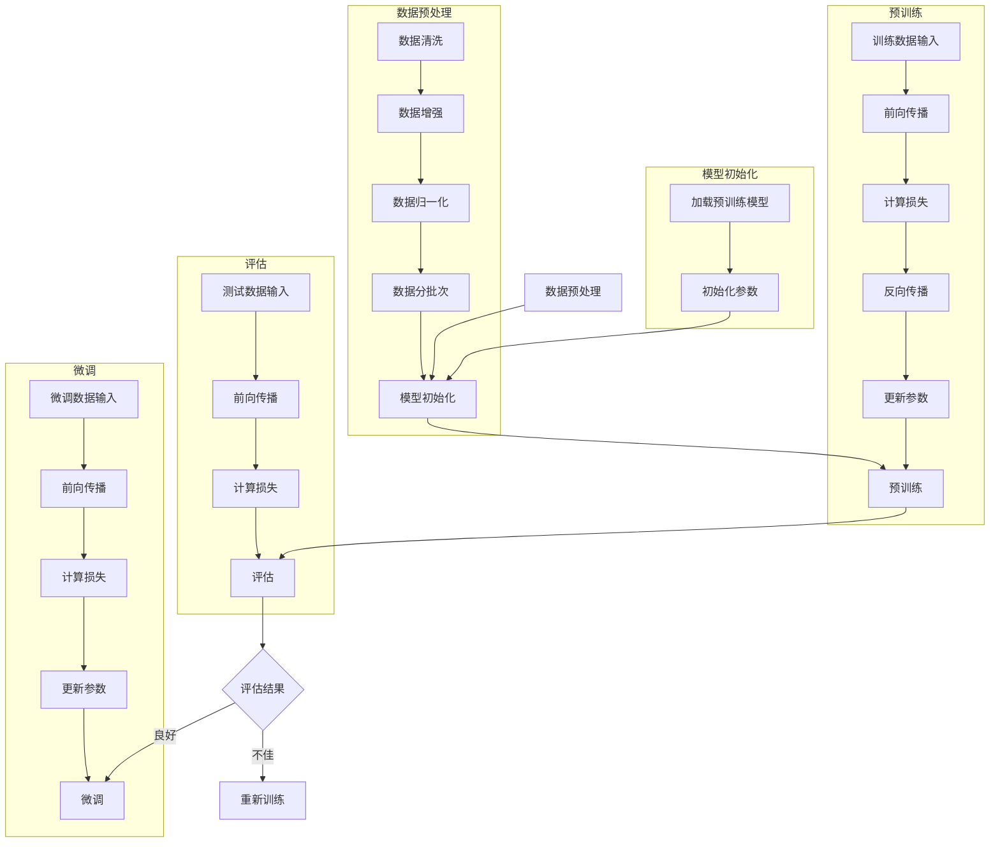
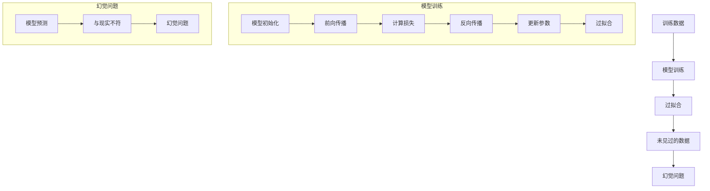

                 

### 文章标题: 幻觉问题在大模型中的应用

关键词：幻觉问题、大模型、深度学习、算法处理、应用场景

摘要：本文深入探讨了幻觉问题在大模型中的应用。首先，文章介绍了幻觉问题的定义、分类及其在大模型中的重要性。接着，文章回顾了深度学习的基础知识，包括神经网络、深度学习框架和优化算法等。随后，文章详细分析了大模型训练原理和幻觉问题的产生机制。在此基础上，文章提出了幻觉问题识别、修正和抑制的算法原理，并通过伪代码和数学模型进行了详细阐述。最后，文章讨论了幻觉问题在语言模型、图像模型和语音模型中的应用场景，并通过实战案例和代码解析展示了如何解决幻觉问题。本文旨在为研究人员和开发者提供关于幻觉问题在大模型中的应用的全面理解和实践指导。

### 第一部分：引言与背景

#### 1.1 书籍概述

**书籍目标**

本书籍旨在为研究人员和开发者提供一个关于幻觉问题在大模型中的全面理解和实践指南。随着深度学习和大模型技术的迅速发展，幻觉问题已成为一个关键挑战。本文书通过系统地介绍幻觉问题的概念、理论基础、算法处理方法以及应用场景，帮助读者深入了解幻觉问题的本质，掌握有效的解决策略。

**书籍结构**

本书结构如下：

1. 引言与背景：介绍幻觉问题的定义、分类及其在大模型中的重要性。
2. 理论基础：回顾深度学习基础知识，包括神经网络、深度学习框架和优化算法等。
3. 幻觉问题的理论基础：详细分析大模型训练原理和幻觉问题的产生机制。
4. 算法处理：提出幻觉问题识别、修正和抑制的算法原理，并通过伪代码和数学模型进行详细阐述。
5. 幻觉问题的应用场景：讨论幻觉问题在语言模型、图像模型和语音模型中的应用场景。
6. 实战与案例分析：通过实战案例和代码解析展示如何解决幻觉问题。
7. 总结与展望：回顾书籍内容，总结关键知识点，并对幻觉问题研究的发展方向进行展望。

#### 1.2 幻觉问题概述

**幻觉问题的定义**

幻觉问题是指在大模型训练和预测过程中，模型产生的一些与现实不符的预测或输出。这些幻觉可能是由于模型在训练过程中过度拟合训练数据，导致在未见过的数据上产生不准确的结果。幻觉问题在大模型中普遍存在，对模型的可靠性和实用性带来了挑战。

**幻觉问题在大模型中的重要性**

幻觉问题在大模型中具有重要意义，原因如下：

1. **影响模型的实用性**：幻觉问题可能导致模型在真实应用场景中产生错误预测，从而影响其可靠性。例如，在医疗诊断中，模型产生的幻觉可能导致错误的诊断结果，危及患者生命。

2. **降低模型的可靠性**：幻觉问题使得模型在未见过的数据上表现不佳，从而降低了模型的泛化能力。这对于模型在复杂、动态环境中的实际应用构成了限制。

3. **制约模型的推广**：幻觉问题使得模型在某些特定领域（如金融、法律等）的应用受到限制，无法充分发挥其潜力。

因此，解决幻觉问题对于提高大模型的实用性和可靠性具有重要意义。

**幻觉问题的分类**

幻觉问题可以按照不同标准进行分类，以下为常见的分类方法：

1. **根据幻觉类型分类**：幻觉问题可以细分为事实性幻觉、语义幻觉、图像幻觉等。例如，事实性幻觉是指模型在事实性陈述上产生错误，而语义幻觉是指模型在理解语义时出现错误。

2. **根据幻觉来源分类**：幻觉问题可以源自模型训练过程中的不同环节。例如，幻觉问题可能源自过拟合、数据标注错误或训练数据集的选择等。

3. **根据幻觉影响分类**：幻觉问题可以按照其对模型的影响程度进行分类。例如，一些幻觉问题可能对模型的整体性能产生较小影响，而另一些幻觉问题可能导致模型完全失效。

通过分类理解幻觉问题，有助于我们更好地分析和解决这一问题。

#### 1.3 大模型的发展背景

**大模型的研究历史**

大模型的发展可以追溯到20世纪90年代，随着计算机性能的不断提升，研究人员开始尝试训练更大规模的神经网络。这一时期，一些里程碑性的研究如Hinton等人提出的深度信念网络（DBN）和LeCun等人提出的卷积神经网络（CNN）为深度学习的发展奠定了基础。

进入21世纪，随着大数据和云计算的兴起，深度学习技术得到了广泛关注和应用。2012年，AlexNet在ImageNet竞赛中取得了突破性成绩，标志着深度学习在计算机视觉领域的崛起。随后，一系列大模型如GPT、BERT、ViT等相继出现，推动了深度学习在自然语言处理、计算机视觉等领域的快速发展。

**大模型的应用现状**

目前，大模型已在多个领域取得了显著的成果。例如，在自然语言处理领域，GPT和BERT等预训练模型在语言生成、文本分类、机器翻译等方面表现优异。在计算机视觉领域，ViT等模型在图像分类、目标检测、图像生成等方面取得了突破性进展。在语音识别和生成领域，大模型也在语音合成、语音识别等方面取得了显著成果。

大模型的应用现状表明，随着技术的不断进步，深度学习和大模型技术将在更多领域发挥重要作用，为人类生活带来更多便利。

**大模型的发展趋势**

未来，大模型的发展趋势将体现在以下几个方面：

1. **模型规模的增大**：随着计算资源和数据资源的不断扩展，大模型的规模将逐渐增大。研究人员将致力于训练更大规模的模型，以提升模型的表现能力。

2. **模型结构的优化**：为了提高模型效率，研究人员将不断探索新的模型结构，如自注意力机制、图神经网络等。这些新结构有望进一步提升大模型的表现能力。

3. **多模态学习**：随着多模态数据（如图像、文本、语音等）的广泛应用，多模态学习将成为大模型研究的重要方向。研究人员将致力于开发适用于多模态学习的大模型，以实现更丰富的应用场景。

4. **模型的可解释性**：为了提高模型的可解释性，研究人员将致力于开发可解释性算法，以帮助用户更好地理解模型的工作原理和决策过程。

总之，随着技术的不断进步，大模型将在更多领域发挥重要作用，为人类生活带来更多变革。

### 第二部分：幻觉问题的理论基础

#### 2.1 深度学习基础

**神经网络基础**

神经网络是深度学习的基础，由大量简单的人工神经元组成。每个神经元接收多个输入，通过加权求和后激活函数进行处理，最终输出一个结果。神经网络的主要目的是通过学习输入和输出之间的映射关系，实现对数据的建模和预测。

**深度学习框架**

深度学习框架是用于实现和优化神经网络模型的一系列工具。常见的深度学习框架包括TensorFlow、PyTorch、Keras等。这些框架提供了丰富的API和功能，帮助开发者高效地构建、训练和优化神经网络模型。

**深度学习优化算法**

深度学习优化算法是用于调整神经网络模型参数，以优化模型性能的一类算法。常见的优化算法包括随机梯度下降（SGD）、Adam、RMSProp等。这些算法通过不断调整模型参数，使模型在训练数据上达到最优性能。

#### 2.2 大模型训练原理

**预训练与微调**

预训练是指在大规模数据集上对神经网络模型进行训练，以学习通用的特征表示。微调是在预训练模型的基础上，在特定任务上对模型进行进一步训练，以适应具体应用场景。

**大模型训练策略**

大模型训练策略主要包括以下几个方面：

1. **数据增强**：通过数据增强方法，如旋转、翻转、裁剪等，增加训练数据的多样性，提高模型的泛化能力。
2. **批次归一化**：在训练过程中，对每个批次的数据进行归一化处理，使模型在训练过程中更加稳定。
3. **学习率调度**：通过调整学习率，使模型在训练过程中逐渐收敛，避免过早陷入局部最优。

**训练数据集与标注**

训练数据集的质量直接影响大模型的表现。高质量的数据集应具备以下特点：

1. **代表性**：数据集应涵盖各种场景和样本，以保证模型在各种环境下都有良好的表现。
2. **多样性**：数据集应包含多种类型的数据，如文本、图像、语音等，以支持多模态学习。
3. **准确性**：数据集的标注应准确可靠，以保证模型在训练过程中能够学习到有效的特征。

#### 2.3 数学模型与公式

**损失函数**

损失函数是评估模型预测结果与真实结果之间差异的指标。常见的损失函数包括均方误差（MSE）、交叉熵损失（Cross-Entropy Loss）等。

**激活函数**

激活函数是神经网络中的关键组成部分，用于将输入映射到输出。常见的激活函数包括ReLU、Sigmoid、Tanh等。

**正则化方法**

正则化方法是一种用于防止模型过拟合的技术。常见的正则化方法包括L1正则化、L2正则化、Dropout等。

#### 2.4 大模型中的幻觉问题

**幻觉问题的定义**

幻觉问题是指在大模型训练和预测过程中，模型产生的与现实不符的预测或输出。这些幻觉可能是由于模型在训练过程中过度拟合训练数据，导致在未见过的数据上产生不准确的结果。

**幻觉问题的来源**

幻觉问题的来源主要包括以下几个方面：

1. **数据集偏差**：训练数据集的选取不当可能导致模型在特定数据上产生幻觉。
2. **过拟合**：模型在训练数据上表现良好，但在未见过的数据上产生幻觉。
3. **数据分布变化**：训练数据集与实际应用场景的数据分布存在差异，可能导致模型在真实场景中产生幻觉。

**幻觉问题的分类**

幻觉问题可以按照不同标准进行分类，以下为常见的分类方法：

1. **事实性幻觉**：模型在事实性陈述上产生错误，如将“太阳是绿色的”视为正确。
2. **语义幻觉**：模型在理解语义时产生错误，如将“狗是猫”视为正确。
3. **图像幻觉**：模型在图像处理过程中产生错误，如将“人脸图像”识别为“风景图像”。

#### 2.5 幻觉问题的度量方法

**真实性与幻觉的区分**

真实性与幻觉的区分是解决幻觉问题的关键。常见的区分方法包括：

1. **对比测试**：将模型在训练数据集和测试数据集上的表现进行对比，发现模型在测试数据集上的幻觉。
2. **异常检测**：通过异常检测算法，发现模型在预测过程中产生的异常结果，这些异常结果很可能是幻觉。

**幻觉问题的影响评估**

幻觉问题的影响评估是衡量幻觉问题严重程度的重要指标。常见的评估方法包括：

1. **准确率**：评估模型在未见过的数据集上的准确率，准确率越高，幻觉问题越严重。
2. **召回率**：评估模型在未见过的数据集上检测出幻觉问题的能力，召回率越高，幻觉问题越严重。
3. **F1值**：综合考虑准确率和召回率，用于综合评估幻觉问题的严重程度。

#### 2.6 Mermaid 流程图

**大模型训练流程**

以下是一个简化的大模型训练流程的Mermaid流程图：



**幻觉问题产生机制**

以下是一个简化的幻觉问题产生机制的Mermaid流程图：



通过上述流程图，我们可以更直观地了解大模型训练过程和幻觉问题的产生机制。

### 第三部分：幻觉问题的算法处理

#### 3.1 算法原理讲解

**幻觉问题识别算法**

**原理**：识别算法通过比较模型在训练数据集和未见过的数据集上的表现，发现模型产生的幻觉。具体来说，算法首先计算模型在训练数据集上的损失函数，然后计算模型在未见过的数据集上的损失函数。如果两个损失函数之间存在显著差异，则认为模型产生了幻觉。

**伪代码**：

```python
def identify_hallucination(model, train_dataset, test_dataset):
    train_loss = compute_loss(model, train_dataset)
    test_loss = compute_loss(model, test_dataset)
    
    if abs(train_loss - test_loss) > threshold:
        return True
    else:
        return False
```

**数学模型**：

假设模型为 $f(x;\theta)$，其中 $x$ 为输入数据，$\theta$ 为模型参数。损失函数为 $L(f(x;\theta), y)$，其中 $y$ 为真实标签。

$$
train\_loss = \frac{1}{n}\sum_{i=1}^{n}L(f(x^{(i)};\theta), y^{(i)})
$$

$$
test\_loss = \frac{1}{m}\sum_{i=1}^{m}L(f(x^{(i)};\theta), y^{(i)})
$$

其中，$n$ 和 $m$ 分别为训练数据和未见过的数据集的大小。

**幻觉问题修正算法**

**原理**：修正算法通过修改模型参数，使模型在未见过的数据集上的表现更接近真实情况。具体来说，算法首先识别出模型产生的幻觉，然后通过优化算法调整模型参数，以降低幻觉问题的发生。

**伪代码**：

```python
def correct_hallucination(model, train_dataset, test_dataset, optimizer):
    if identify_hallucination(model, train_dataset, test_dataset):
        optimizer.step()
        return True
    else:
        return False
```

**数学模型**：

假设优化算法为 $\theta_{t+1} = \theta_t - \alpha \nabla_{\theta_t}L(f(x;\theta_t), y)$，其中 $\alpha$ 为学习率。

**幻觉问题抑制算法**

**原理**：抑制算法通过调整模型结构或训练策略，使模型在训练过程中减少幻觉问题的发生。具体来说，算法可以通过以下几种方法实现：

1. **数据增强**：增加训练数据的多样性，使模型在更广泛的场景下学习到有效特征。
2. **正则化**：添加正则化项，使模型在训练过程中避免过拟合。
3. **提前停止**：在模型训练过程中，当损失函数不再显著下降时，提前停止训练，以防止过拟合。

**伪代码**：

```python
def suppress_hallucination(model, train_dataset, test_dataset, regularization):
    if identify_hallucination(model, train_dataset, test_dataset):
        apply_regularization(model, regularization)
        return True
    else:
        return False
```

**数学模型**：

假设正则化项为 $R(\theta)$，则损失函数可以表示为：

$$
L(f(x;\theta), y) + \lambda R(\theta)
$$

其中，$\lambda$ 为正则化参数。

#### 3.2 伪代码阐述

**幻觉问题识别算法伪代码**

```python
def identify_hallucination(model, train_dataset, test_dataset, threshold):
    train_loss = compute_loss(model, train_dataset)
    test_loss = compute_loss(model, test_dataset)
    
    if abs(train_loss - test_loss) > threshold:
        return True
    else:
        return False
```

**幻觉问题修正算法伪代码**

```python
def correct_hallucination(model, train_dataset, test_dataset, optimizer, threshold):
    while True:
        if identify_hallucination(model, train_dataset, test_dataset, threshold):
            optimizer.step()
            if not identify_hallucination(model, train_dataset, test_dataset, threshold):
                break
        else:
            break
```

**幻觉问题抑制算法伪代码**

```python
def suppress_hallucination(model, train_dataset, test_dataset, regularization, threshold):
    while True:
        if identify_hallucination(model, train_dataset, test_dataset, threshold):
            apply_regularization(model, regularization)
            if not identify_hallucination(model, train_dataset, test_dataset, threshold):
                break
        else:
            break
```

#### 3.3 数学模型与公式

**幻觉问题识别算法的数学模型**

假设模型为 $f(x;\theta)$，损失函数为 $L(f(x;\theta), y)$，其中 $x$ 为输入数据，$y$ 为真实标签。

$$
train\_loss = \frac{1}{n}\sum_{i=1}^{n}L(f(x^{(i)};\theta), y^{(i)})
$$

$$
test\_loss = \frac{1}{m}\sum_{i=1}^{m}L(f(x^{(i)};\theta), y^{(i)})
$$

识别算法通过计算 $train\_loss$ 和 $test\_loss$ 的差异来判断是否存在幻觉问题。

**幻觉问题修正算法的数学模型**

修正算法通过优化模型参数 $\theta$ 来降低幻觉问题的发生。假设优化算法为随机梯度下降（SGD），则参数更新公式为：

$$
\theta_{t+1} = \theta_t - \alpha \nabla_{\theta_t}L(f(x;\theta_t), y)
$$

其中，$\alpha$ 为学习率。

**幻觉问题抑制算法的数学模型**

抑制算法通过添加正则化项来减少幻觉问题的发生。假设正则化项为 $R(\theta)$，则损失函数可以表示为：

$$
L(f(x;\theta), y) + \lambda R(\theta)
$$

其中，$\lambda$ 为正则化参数。

通过优化损失函数，可以找到最优的模型参数 $\theta$，从而抑制幻觉问题的发生。

#### 3.4 实例分析

**幻觉问题识别实例**

假设我们有一个简单的神经网络模型，用于分类任务。训练数据集包含1000个样本，测试数据集包含200个样本。我们使用均方误差（MSE）作为损失函数。

训练数据集的损失函数为：

$$
train\_loss = \frac{1}{1000}\sum_{i=1}^{1000}MSE(f(x^{(i)}, \theta), y^{(i)})
$$

测试数据集的损失函数为：

$$
test\_loss = \frac{1}{200}\sum_{i=1}^{200}MSE(f(x^{(i)}, \theta), y^{(i)})
$$

我们设置阈值 $\theta

