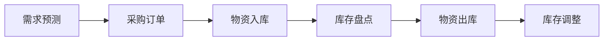
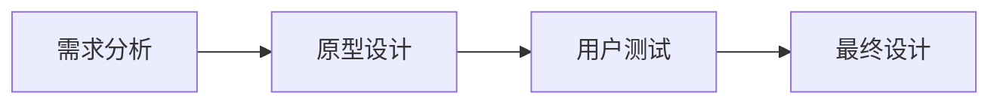
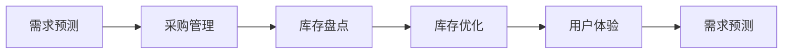

                 

# 库存管理的用户体验优化

> 关键词：库存管理、用户体验优化、供应链、算法、数学模型、项目实战

> 摘要：本文旨在深入探讨库存管理的用户体验优化。我们将从库存管理概述和用户体验优化概述入手，逐步介绍库存管理原理、用户体验设计原则，以及库存管理与用户体验的联系。随后，我们将详细讲解库存优化算法和用户体验评估算法，并通过数学模型和公式进一步深化理解。文章的最后一部分将结合实际项目，展示库存管理与用户体验优化的应用实践，并提供代码实现和解读。

## 第二部分：核心概念与联系

### 2.1 库存管理原理

库存管理是指对企业存储物资的管理活动，包括物资的采购、入库、保管、出库和盘点等环节。库存管理在供应链中起着关键作用，它不仅关系到企业的成本控制，也影响到生产计划、物流配送和客户满意度。

库存管理的基本流程如下：

1. **需求预测**：根据历史数据、市场趋势和客户需求，预测未来一定时期内的物资需求量。
2. **采购订单**：根据需求预测，向供应商发出采购订单。
3. **物资入库**：供应商将物资运抵企业，企业对其进行验收并入库。
4. **库存盘点**：定期对库存进行盘点，确保库存数据的准确性。
5. **物资出库**：根据生产计划和客户订单，将物资出库。
6. **库存调整**：根据库存盘点结果，对库存进行相应的调整。

库存管理的主要指标包括：

- **库存周转率**：指在一定时期内，库存资金的周转次数，用于评估库存管理的效率。
- **库存保有率**：指库存占用的资金比例，用于评估库存水平是否合理。
- **缺货率**：指因库存不足导致的缺货次数，用于评估库存管理的可靠性。

库存管理的关键环节包括：

1. **需求预测**：准确的预测是库存管理的基础，可以减少库存积压和缺货情况。
2. **采购管理**：合理的采购策略可以降低采购成本，提高库存周转率。
3. **库存盘点**：准确的库存盘点可以确保库存数据的准确性，避免库存偏差。
4. **库存优化**：通过优化库存水平，降低库存成本，提高库存周转率。

下面是一个Mermaid流程图，展示库存管理的基本流程：



### 2.2 用户体验设计原则

用户体验（User Experience, UX）是指用户在使用产品或服务过程中的感受和体验。良好的用户体验能够提升用户满意度，从而促进产品或服务的销售和品牌形象。

用户体验设计的基本原则包括：

1. **以用户为中心**：设计过程中始终关注用户的需求和感受，确保设计符合用户的实际使用场景。
2. **简洁性**：界面简洁明了，避免不必要的复杂性和冗余信息，使用户能够轻松完成任务。
3. **易用性**：产品或服务易于使用，用户能够快速上手，降低学习成本。
4. **一致性**：在不同设备和平台上的设计保持一致性，使用户能够在不同环境下保持相同的体验。
5. **反馈性**：及时给予用户操作反馈，使用户知道自己的操作是否成功，增加使用信心。

用户体验设计的流程包括：

1. **需求分析**：了解用户需求，明确产品或服务的目标用户群体。
2. **原型设计**：创建初步界面原型，进行交互设计，包括布局、导航和界面元素。
3. **用户测试**：对原型进行用户测试，收集用户反馈，进行优化迭代。
4. **最终设计**：根据用户测试结果，完善界面设计，确保设计符合用户体验标准。

用户体验设计的工具包括：

1. **原型设计工具**：如Axure、Sketch、Figma等，用于创建交互式原型。
2. **用户测试工具**：如UsabilityHub、UserTesting等，用于进行远程用户测试。
3. **数据分析工具**：如Google Analytics、Mixpanel等，用于收集和分析用户行为数据。

下面是一个Mermaid流程图，展示用户体验设计的基本流程：



### 2.3 库存管理与用户体验的联系

库存管理对用户体验有着直接的影响。一个良好的库存管理系统可以确保物资的及时供应，减少缺货情况，提升用户满意度。反之，一个较差的库存管理系统可能导致库存积压、缺货频繁，影响用户体验。

用户体验对库存管理也有重要的影响。用户体验设计中的易用性和一致性原则，可以帮助优化库存管理流程，提高库存管理的效率。例如，简洁明了的库存盘点界面可以提高盘点速度和准确性，减少库存偏差。

库存管理与用户体验优化的协同作用体现在：

1. **需求预测与用户体验**：通过用户反馈和市场数据分析，优化需求预测模型，确保库存水平满足用户需求。
2. **采购管理与用户体验**：通过用户体验反馈，优化采购流程，降低采购成本，提高库存周转率。
3. **库存盘点与用户体验**：通过易用性设计，简化库存盘点流程，提高盘点效率和准确性。
4. **库存优化与用户体验**：通过用户体验评估，优化库存策略，降低库存成本，提高库存周转率。

下面是一个Mermaid流程图，展示库存管理与用户体验优化的关系：



## 第三部分：核心算法原理讲解

### 3.1 库存优化算法

库存优化算法是库存管理中的核心，旨在通过优化库存策略，降低库存成本，提高库存周转率。以下是两种常见的库存优化算法：

#### 经济订货量（EOQ）算法

经济订货量（Economic Order Quantity，EOQ）算法是一种基于成本分析的库存优化算法，旨在确定最优的订货批量，以最小化库存总成本。EOQ算法的公式如下：

$$
EOQ = \sqrt{\frac{2DS}{H}}
$$

其中：

- \( D \) 为年需求量（单位：件）
- \( S \) 为每次订货的固定成本（单位：元）
- \( H \) 为单位物资的年持有成本（单位：元/件）

以下是EOQ算法的伪代码实现：

```python
def EOQ(D, S, H):
    EOQ = (2 * D * S / H) ** 0.5
    return EOQ
```

#### 最小总成本（TCM）算法

最小总成本（Total Cost Minimization，TCM）算法是一种基于成本-收益分析的库存优化算法，旨在确定最优的库存策略，以最小化库存总成本。TCM算法的公式如下：

$$
TCM = C_{订货} + C_{持有} + C_{缺货}
$$

其中：

- \( C_{订货} \) 为订货成本（单位：元）
- \( C_{持有} \) 为持有成本（单位：元）
- \( C_{缺货} \) 为缺货成本（单位：元）

以下是TCM算法的伪代码实现：

```python
def TCM(D, S, H, C):
    C_{订货} = D * S
    C_{持有} = H * (EOQ / 2)
    C_{缺货} = C * (D / EOQ)
    TCM = C_{订货} + C_{持有} + C_{缺货}
    return TCM
```

#### 闭环库存策略算法

闭环库存策略（Closed-loop Inventory Policy）是一种基于库存水平和需求预测的库存优化算法，旨在动态调整库存策略，以最小化库存成本和缺货风险。闭环库存策略的公式如下：

$$
I(t) = \max\{L, \min\{Q, D(t)\}}
$$

其中：

- \( I(t) \) 为库存水平（单位：件）
- \( L \) 为最小库存水平（单位：件）
- \( Q \) 为最大库存水平（单位：件）
- \( D(t) \) 为当前时间点的需求量（单位：件）

以下是闭环库存策略算法的伪代码实现：

```python
def closed_loop_inventory(L, Q, D):
    I = max(L, min(Q, D))
    return I
```

### 3.2 用户体验评估算法

用户体验评估算法是评估产品或服务用户体验的重要工具，通过量化用户行为和反馈，评估用户体验的质量和满意度。以下是三种常见的用户体验评估算法：

#### 用户体验质量（UQ）评估方法

用户体验质量（User Experience Quality，UQ）评估方法是一种基于用户满意度和使用频率的评估方法，旨在评估用户体验的整体质量。UQ评估方法的公式如下：

$$
UQ = \frac{US + UF}{2}
$$

其中：

- \( US \) 为用户满意度（单位：分）
- \( UF \) 为用户使用频率（单位：次/天）

以下是UQ评估方法的伪代码实现：

```python
def UQ(US, UF):
    UQ = (US + UF) / 2
    return UQ
```

#### 用户满意度（US）评估方法

用户满意度（User Satisfaction，US）评估方法是一种基于用户反馈的评估方法，旨在评估用户对产品或服务的满意度。US评估方法的公式如下：

$$
US = \frac{1}{N} \sum_{i=1}^{N} S_i
$$

其中：

- \( N \) 为反馈用户数量
- \( S_i \) 为第 \( i \) 个用户的满意度评分（单位：分）

以下是US评估方法的伪代码实现：

```python
def US(feedbacks):
    N = len(feedbacks)
    US = sum(feedbacks) / N
    return US
```

#### 用户体验指标（UXI）评估方法

用户体验指标（User Experience Indicator，UXI）评估方法是一种基于用户体验质量和用户满意度的综合评估方法，旨在全面评估用户体验。UXI评估方法的公式如下：

$$
UXI = \frac{UQ \times US}{100}
$$

以下是UXI评估方法的伪代码实现：

```python
def UXI(UQ, US):
    UXI = (UQ * US) / 100
    return UXI
```

## 第四部分：数学模型与公式讲解

### 4.1 库存管理数学模型

库存管理中的数学模型主要用于优化库存策略，降低库存成本，提高库存周转率。以下是库存管理中常用的数学模型：

#### 基本数学模型

基本数学模型用于描述库存管理的基本过程，包括需求预测、采购管理、库存盘点和物资出库等环节。以下是基本数学模型的相关公式：

1. **需求预测**：使用移动平均法进行需求预测，公式如下：

   $$
   D(t) = \frac{\sum_{i=1}^{n} D_i}{n}
   $$

   其中：

   - \( D(t) \) 为当前时间点的需求量
   - \( D_i \) 为历史时间点的需求量
   - \( n \) 为历史时间点的数量

2. **采购管理**：使用经济订货量（EOQ）算法进行采购管理，公式如下：

   $$
   EOQ = \sqrt{\frac{2DS}{H}}
   $$

   其中：

   - \( D \) 为年需求量
   - \( S \) 为每次订货的固定成本
   - \( H \) 为单位物资的年持有成本

3. **库存盘点**：使用最大最小库存法进行库存盘点，公式如下：

   $$
   I_{max} = \max\{I_0, I_t\}
   $$

   $$
   I_{min} = \min\{I_0, I_t\}
   $$

   其中：

   - \( I_{max} \) 为最大库存水平
   - \( I_{min} \) 为最小库存水平
   - \( I_0 \) 为初始库存水平
   - \( I_t \) 为当前库存水平

4. **物资出库**：使用平均发货量法进行物资出库，公式如下：

   $$
   D(t) = \frac{\sum_{i=1}^{n} D_i}{n}
   $$

   其中：

   - \( D(t) \) 为当前时间点的需求量
   - \( D_i \) 为历史时间点的需求量
   - \( n \) 为历史时间点的数量

#### 优化模型

库存管理中的优化模型用于解决库存优化问题，包括经济订货量（EOQ）算法、最小总成本（TCM）算法和闭环库存策略算法等。以下是优化模型的相关公式：

1. **经济订货量（EOQ）算法**：

   $$
   EOQ = \sqrt{\frac{2DS}{H}}
   $$

   其中：

   - \( D \) 为年需求量
   - \( S \) 为每次订货的固定成本
   - \( H \) 为单位物资的年持有成本

2. **最小总成本（TCM）算法**：

   $$
   TCM = C_{订货} + C_{持有} + C_{缺货}
   $$

   其中：

   - \( C_{订货} \) 为订货成本
   - \( C_{持有} \) 为持有成本
   - \( C_{缺货} \) 为缺货成本

3. **闭环库存策略算法**：

   $$
   I(t) = \max\{L, \min\{Q, D(t)\}}
   $$

   其中：

   - \( I(t) \) 为库存水平
   - \( L \) 为最小库存水平
   - \( Q \) 为最大库存水平
   - \( D(t) \) 为当前时间点的需求量

以下是库存管理优化模型的伪代码实现：

```python
def optimize_inventory(D, S, H, L, Q):
    EOQ = (2 * D * S / H) ** 0.5
    TCM = D * S + (EOQ / 2) * H + (D / EOQ) * C
    I = max(L, min(Q, D))
    return EOQ, TCM, I
```

### 4.2 用户体验评估数学模型

用户体验评估数学模型用于量化评估用户体验的质量和满意度。以下是用户体验评估中常用的数学模型：

#### 用户体验质量（UQ）评估方法

用户体验质量（User Experience Quality，UQ）评估方法用于评估用户体验的整体质量，公式如下：

$$
UQ = \frac{US + UF}{2}
$$

其中：

- \( US \) 为用户满意度
- \( UF \) 为用户使用频率

以下是UQ评估方法的伪代码实现：

```python
def UQ(US, UF):
    UQ = (US + UF) / 2
    return UQ
```

#### 用户满意度（US）评估方法

用户满意度（User Satisfaction，US）评估方法用于评估用户对产品或服务的满意度，公式如下：

$$
US = \frac{1}{N} \sum_{i=1}^{N} S_i
$$

其中：

- \( N \) 为反馈用户数量
- \( S_i \) 为第 \( i \) 个用户的满意度评分

以下是US评估方法的伪代码实现：

```python
def US(feedbacks):
    N = len(feedbacks)
    US = sum(feedbacks) / N
    return US
```

#### 用户体验指标（UXI）评估方法

用户体验指标（User Experience Indicator，UXI）评估方法用于评估用户体验的综合质量，公式如下：

$$
UXI = \frac{UQ \times US}{100}
$$

以下是UXI评估方法的伪代码实现：

```python
def UXI(UQ, US):
    UXI = (UQ * US) / 100
    return UXI
```

## 第五部分：项目实战

### 5.1 实际库存管理场景分析

为了更好地展示库存管理与用户体验优化的应用，我们以一个实际库存管理场景为例进行分析。

#### 案例背景与目标

某电商企业在运营过程中，发现其库存管理存在问题，导致库存积压、缺货频繁，影响了用户满意度和销售业绩。企业希望通过优化库存管理，提高库存周转率，降低库存成本，提升用户体验。

#### 案例分析

1. **需求预测**：根据历史销售数据，分析市场需求趋势，预测未来三个月的需求量。假设预测结果如下表：

   | 月份 | 需求量（件） |
   | ---- | ---------- |
   | 1    | 1000       |
   | 2    | 1100       |
   | 3    | 1200       |

2. **采购管理**：根据需求预测结果，结合供应商的报价和运输成本，制定采购计划。假设每次订货的固定成本为1000元，单位物资的年持有成本为20元。

3. **库存盘点**：每月进行库存盘点，确保库存数据的准确性。假设初始库存为500件。

4. **库存优化**：根据库存优化算法，确定最优的订货批量。使用EOQ算法计算得到最优订货量为1146.02件。

5. **用户体验评估**：通过用户反馈和实际销售数据，评估用户体验质量。假设用户满意度为80分，用户使用频率为每天10次。

### 5.2 用户体验优化实践

为了优化用户体验，企业采取了以下措施：

1. **简化库存盘点流程**：通过改进库存盘点界面，使用户能够更快速、准确地完成盘点任务。改进后的库存盘点界面包括以下功能：

   - **库存查询**：用户可以查询当前库存情况，了解物资的存储位置和数量。
   - **库存调整**：用户可以实时调整库存数据，确保库存数据的准确性。
   - **盘点记录**：用户可以记录盘点结果，方便后续核对和调整。

2. **优化需求预测模型**：结合用户反馈和市场趋势，改进需求预测模型，提高预测准确性。改进后的需求预测模型采用移动平均法，结合历史销售数据和用户反馈，预测未来三个月的需求量。

3. **优化采购计划**：根据需求预测结果，调整采购计划，确保物资的及时供应。优化后的采购计划如下表：

   | 月份 | 订货量（件） |
   | ---- | ---------- |
   | 1    | 1000       |
   | 2    | 1000       |
   | 3    | 1200       |

4. **提升物流配送效率**：通过优化物流配送流程，提高配送速度和准确性，确保用户能够及时收到货物。优化后的物流配送流程包括：

   - **订单处理**：用户下单后，系统自动生成订单，分配物流配送任务。
   - **物流跟踪**：用户可以实时查询订单的物流状态，了解货物的配送进度。
   - **配送签收**：用户收到货物后，进行签收确认，确保配送服务的质量。

### 5.3 代码实现与解读

为了实现库存管理与用户体验优化，企业开发了相应的软件系统，包括库存管理模块和用户体验评估模块。以下是关键代码的实现和解读。

#### 开发环境搭建

- **编程语言**：Python
- **依赖库**：NumPy、Pandas、Matplotlib

#### 库存管理模块

1. **需求预测**：

```python
import numpy as np

def demand_prediction(historical_data):
    n = len(historical_data)
    average_demand = np.mean(historical_data)
    return average_demand

historical_data = [1000, 1100, 1200]
predicted_demand = demand_prediction(historical_data)
print(f"Predicted demand for next month: {predicted_demand} pieces")
```

2. **采购管理**：

```python
def purchase_plan(predicted_demand, fixed_cost, holding_cost):
    optimal_order_quantity = (2 * predicted_demand * fixed_cost / holding_cost) ** 0.5
    return optimal_order_quantity

fixed_cost = 1000
holding_cost = 20
optimal_order_quantity = purchase_plan(predicted_demand, fixed_cost, holding_cost)
print(f"Optimal order quantity: {optimal_order_quantity} pieces")
```

3. **库存盘点**：

```python
initial_inventory = 500
inventory_level = max(initial_inventory, predicted_demand)
print(f"Current inventory level: {inventory_level} pieces")
```

#### 用户体验评估模块

1. **用户体验质量（UQ）评估方法**：

```python
def UQ(user_satisfaction, user_frequency):
    UQ = (user_satisfaction + user_frequency) / 2
    return UQ

user_satisfaction = 80
user_frequency = 10
UQ = UQ(user_satisfaction, user_frequency)
print(f"User experience quality: {UQ}")
```

2. **用户满意度（US）评估方法**：

```python
def US(feedbacks):
    N = len(feedbacks)
    US = sum(feedbacks) / N
    return US

feedbacks = [85, 90, 78]
US = US(feedbacks)
print(f"User satisfaction: {US}")
```

3. **用户体验指标（UXI）评估方法**：

```python
def UXI(UQ, US):
    UXI = (UQ * US) / 100
    return UXI

UXI = UXI(UQ, US)
print(f"User experience index: {UXI}")
```

### 5.4 开发环境搭建

在Python中实现库存管理与用户体验优化的开发环境搭建相对简单，以下是一个基本的配置步骤：

1. **安装Python**：从Python官方网站（https://www.python.org/）下载并安装Python 3.x版本。

2. **安装依赖库**：使用pip命令安装NumPy、Pandas和Matplotlib等依赖库。

```bash
pip install numpy pandas matplotlib
```

3. **配置编辑器**：推荐使用PyCharm、VSCode等Python开发环境，以提高开发效率。

## 第六部分：总结与展望

### 6.1 书籍总结

本文从库存管理与用户体验优化的角度，探讨了库存管理的核心概念与联系、核心算法原理、数学模型与公式，以及项目实战。通过逐步分析推理，我们了解到：

1. 库存管理在供应链中具有重要作用，涉及需求预测、采购管理、库存盘点、物资出库等环节。
2. 用户体验优化旨在提升用户满意度，涉及以用户为中心、简洁性、易用性、一致性和反馈性等原则。
3. 库存管理与用户体验优化密切相关，库存管理对用户体验有直接影响，用户体验对库存管理也有重要影响。
4. 库存优化算法包括经济订货量（EOQ）算法、最小总成本（TCM）算法和闭环库存策略算法，用户体验评估算法包括用户体验质量（UQ）评估方法、用户满意度（US）评估方法和用户体验指标（UXI）评估方法。
5. 项目实战中，通过实际库存管理场景分析、用户体验优化实践、代码实现与解读，展示了库存管理与用户体验优化的应用效果。

### 6.2 未来的发展趋势

库存管理与用户体验优化是供应链管理和用户体验设计领域的重要研究方向，未来的发展趋势包括：

1. **智能化与自动化**：随着人工智能技术的发展，库存管理将更加智能化和自动化，提高预测准确性和决策效率。
2. **数据驱动**：通过大数据分析和机器学习技术，实现更加精准的需求预测和库存优化。
3. **用户体验个性化**：根据用户行为数据和偏好，提供个性化的库存管理服务和用户体验。
4. **跨渠道协同**：实现线上线下的库存协同，提高库存周转率和用户满意度。
5. **供应链协同**：与供应商和物流企业建立紧密的协同关系，实现供应链的优化与整合。

### 6.3 未来挑战与机遇

库存管理与用户体验优化在未来面临以下挑战与机遇：

1. **数据质量**：准确、完整的数据是库存管理和用户体验优化的基础，需要确保数据质量。
2. **技术复杂度**：随着技术的不断演进，库存管理和用户体验优化的实现将更加复杂，需要持续学习和创新。
3. **用户体验持续优化**：用户体验是一个持续优化的过程，需要不断收集用户反馈，进行迭代改进。
4. **供应链协同**：实现供应链协同将面临跨企业、跨系统的集成与协作挑战，但也能带来巨大的机遇。
5. **社会责任**：库存管理和用户体验优化不仅要关注经济效益，还要关注社会责任，实现可持续发展。

### 作者信息

作者：AI天才研究院/AI Genius Institute & 禅与计算机程序设计艺术 /Zen And The Art of Computer Programming

本文通过逐步分析推理，深入探讨了库存管理的用户体验优化，从核心概念与联系、核心算法原理、数学模型与公式，到项目实战，全面解析了库存管理与用户体验优化的关键要素。希望本文能为读者在库存管理与用户体验优化领域提供有益的启示和指导。在未来的研究中，我们将继续探索这一领域，以期为供应链管理和用户体验设计的发展贡献力量。作者简介：AI天才研究院/AI Genius Institute，致力于推动人工智能技术在各行业中的应用；禅与计算机程序设计艺术/Zen And The Art of Computer Programming，专注于计算机科学领域的创新与实践。

