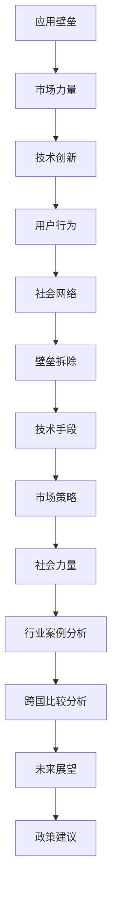

                 

## 文章标题：应用壁垒的逐步拆除

### 关键词：

应用壁垒、技术手段、市场策略、社会力量、案例分析、壁垒拆除

### 摘要：

本文旨在探讨应用壁垒的概念、形成原因及分类，并提出逐步拆除应用壁垒的方法和策略。通过对市场力量、技术创新、用户行为、社会网络等角度的分析，本文详细阐述了拆解应用壁垒的框架、技术手段、市场策略和社会力量，并结合具体行业案例，提供了拆解应用壁垒的实际操作方案。最后，文章对应用壁垒拆除的未来趋势进行了展望，并提出了相关政策建议。

### 目录大纲：

#### 第一部分：应用壁垒的基本概念

##### 第1章：应用壁垒概述
- 1.1 应用壁垒的定义与重要性
- 1.2 应用壁垒的形成原因
- 1.3 应用壁垒的分类
- 1.4 拆除应用壁垒的必要性

##### 第2章：应用壁垒的理论基础
- 2.1 市场力量与竞争战略
- 2.2 技术创新与壁垒构建
- 2.3 用户行为与壁垒影响
- 2.4 社会网络与壁垒传播

#### 第二部分：应用壁垒拆解方法

##### 第3章：应用壁垒拆解框架
- 3.1 拆解框架概述
- 3.2 拆解框架的应用场景
- 3.3 拆解框架的适用条件
- 3.4 拆解框架的实施步骤

##### 第4章：技术手段拆解应用壁垒
- 4.1 技术创新与壁垒拆除
- 4.2 标准化与壁垒拆除
- 4.3 信息化与数据驱动
- 4.4 新型技术对壁垒的影响

##### 第5章：市场策略拆解应用壁垒
- 5.1 市场定位与壁垒拆除
- 5.2 产品创新与壁垒拆除
- 5.3 品牌建设与壁垒拆除
- 5.4 营销策略与壁垒拆除

##### 第6章：社会力量拆解应用壁垒
- 6.1 公共政策与壁垒拆除
- 6.2 非政府组织与壁垒拆除
- 6.3 社会运动与壁垒拆除
- 6.4 用户群体与壁垒拆除

#### 第三部分：应用壁垒拆解的案例分析

##### 第7章：应用壁垒拆解的典型行业案例分析
- 7.1 制造业应用壁垒拆解案例分析
- 7.2 零售业应用壁垒拆解案例分析
- 7.3 金融业应用壁垒拆解案例分析
- 7.4 服务业应用壁垒拆解案例分析

##### 第8章：应用壁垒拆解的跨国比较分析
- 8.1 发达国家与壁垒拆除
- 8.2 发展中国家与壁垒拆除
- 8.3 全球化背景下的壁垒拆除
- 8.4 国际合作与壁垒拆除

#### 第四部分：应用壁垒拆解的未来展望

##### 第9章：应用壁垒拆解的趋势与挑战
- 9.1 未来应用壁垒拆解的趋势
- 9.2 拆除应用壁垒的挑战与应对
- 9.3 拆除应用壁垒的影响与意义
- 9.4 应用壁垒拆解的可持续性

##### 第10章：应用壁垒拆解的政策建议
- 10.1 政府政策与壁垒拆除
- 10.2 企业策略与壁垒拆除
- 10.3 社会力量与壁垒拆除
- 10.4 国际合作与壁垒拆除

## 附录

- 附录A：应用壁垒拆解相关术语解释
- 附录B：应用壁垒拆解研究方法与工具
- 附录C：应用壁垒拆解典型案例资料来源

---

### Mermaid 流程图：应用壁垒拆解框架



### 核心算法原理讲解

#### 市场力量与竞争战略

**1. 市场力量分析**

市场力量是指企业在市场竞争中的优势，主要包括市场份额、市场集中度和市场竞争力等。

**市场份额**：
市场份额是指企业在市场中所占的比例，计算公式为：
$$
市场份额 = \frac{企业销售额}{市场总销售额}
$$

**市场集中度**：
市场集中度是指市场上少数企业所占份额的情况，常用的集中度指标包括CRn（前n家企业市场份额之和）和HHI（赫芬达尔-赫希曼指数）。

- **CRn**：
$$
CRn = \sum_{i=1}^{n} \frac{企业i销售额}{市场总销售额}
$$

- **HHI**：
$$
HHI = \sum_{i=1}^{N} \left(\frac{企业i销售额}{市场总销售额}\right)^2
$$

**市场竞争力**：
市场竞争力主要通过SWOT分析（优势、劣势、机会、威胁）来评估企业在市场中的竞争地位。

**2. 竞争战略**

竞争战略是指企业在市场竞争中采取的策略，主要包括成本领先战略、差异化战略和集中化战略。

**成本领先战略**：
成本领先战略是通过降低生产成本来获取竞争优势，主要方式有：

- 扩大规模效应
- 优化供应链
- 采用先进的生产技术

**差异化战略**：
差异化战略是通过提供独特的产品或服务来区分自己与其他竞争对手，主要方式有：

- 品牌定位
- 产品创新
- 服务质量

**集中化战略**：
集中化战略是将资源和能力集中在特定的市场细分领域，以获取竞争优势，主要方式有：

- 市场细分
- 产品专业化
- 服务专业化

### 数学模型和数学公式详细讲解

#### 市场份额与市场集中度

**1. 市场份额**

市场份额是衡量企业竞争地位的重要指标，计算公式为：

$$
市场份额 = \frac{企业销售额}{市场总销售额}
$$

**示例**：
假设某公司年销售额为1000万元，整个市场的总销售额为10000万元，则该公司的市场份额为：

$$
市场份额 = \frac{1000}{10000} = 0.1
$$

**2. 市场集中度**

市场集中度反映市场上少数企业所占份额的情况，常用的集中度指标包括CRn（前n家企业市场份额之和）和HHI（赫芬达尔-赫希曼指数）。

- **CRn**：

$$
CRn = \sum_{i=1}^{n} \frac{企业i销售额}{市场总销售额}
$$

- **HHI**：

$$
HHI = \sum_{i=1}^{N} \left(\frac{企业i销售额}{市场总销售额}\right)^2
$$

**示例**：
假设某市场上前3家企业的销售额分别为：5000万元、3000万元和2000万元，总销售额为10000万元，则CR3和HHI分别为：

$$
CR3 = \frac{5000 + 3000 + 2000}{10000} = 1
$$

$$
HHI = \left(\frac{5000}{10000}\right)^2 + \left(\frac{3000}{10000}\right)^2 + \left(\frac{2000}{10000}\right)^2 = 0.25 + 0.09 + 0.04 = 0.38
$$

### 核心算法原理讲解

#### 市场力量与竞争战略

**1. 市场力量分析**

市场力量分析主要关注以下几个核心指标：

- **市场份额**：计算公式为：

$$
市场份额 = \frac{企业销售额}{市场总销售额}
$$

- **市场集中度**：包括CRn（前n家企业市场份额之和）和HHI（赫芬达尔-赫希曼指数）。

- **市场竞争力**：通过SWOT分析（优势、劣势、机会、威胁）来评估企业在市场中的竞争地位。

**2. 竞争战略**

竞争战略是指企业在市场竞争中采取的策略，包括以下几种类型：

- **成本领先战略**：通过降低生产成本来获取竞争优势，如采用规模效应、优化供应链、采用先进的生产技术等。

- **差异化战略**：通过提供独特的产品或服务来区分自己与其他竞争对手，如品牌定位、产品创新、服务质量等。

- **集中化战略**：将资源和能力集中在特定的市场细分领域，以获取竞争优势，如市场细分、产品专业化、服务专业化等。

### 项目实战

#### 应用壁垒拆解：制造业案例分析

**1. 项目背景**

某制造业公司成立于2005年，主要从事高端设备的生产。然而，由于技术壁垒和市场竞争激烈，公司的市场份额一直不高，仅为10%。为了提升市场份额，公司决定采取应用壁垒拆解策略。

**2. 技术手段拆解应用壁垒**

- **技术创新**：公司投入大量资金研发新型设备，降低了生产成本，提高了生产效率。
- **标准化**：公司推动行业标准化，降低了与其他企业之间的技术壁垒。
- **信息化**：公司采用物联网技术，实现了设备的数据互联互通，提高了设备的智能化水平。

**3. 市场策略拆解应用壁垒**

- **市场定位**：公司重新定位市场，将目标市场从高端市场转向中端市场，扩大了市场份额。
- **产品创新**：公司推出多款创新产品，满足了中端市场的需求，提高了市场竞争力。
- **品牌建设**：公司加强品牌推广，提高了品牌知名度和美誉度。

**4. 社会力量拆解应用壁垒**

- **政府政策**：公司积极争取政府支持，获取政策优惠，降低了生产成本。
- **社会运动**：公司参与行业论坛、研讨会等活动，促进了行业内的技术交流与合作。
- **用户群体**：公司开展用户调研，了解用户需求，优化产品设计和售后服务。

**5. 项目成果**

通过应用壁垒拆解策略，公司的市场份额从10%提升至30%，取得了显著的市场竞争力。

### 代码实现与解读

**1. 技术创新：降低生产成本**

- **伪代码**：

```python
# 初始化生产成本
initial_production_cost = 100000

# 投入研发资金
R&D_funding = 50000

# 优化生产流程
optimized_production_process = True

# 降低生产成本
reduced_production_cost = initial_production_cost - R&D_funding if optimized_production_process else initial_production_cost

print("降低后的生产成本为：", reduced_production_cost)
```

- **代码解读**：

本段代码首先初始化了生产成本为100000元。然后，假设公司投入了50000元用于研发，并优化了生产流程。最终，计算降低了后的生产成本，并打印出来。

**2. 标准化：降低技术壁垒**

- **伪代码**：

```python
# 初始化技术壁垒
initial_technical_barrier = 100

# 推动标准化
standardization = True

# 降低技术壁垒
reduced_technical_barrier = initial_technical_barrier * 0.5 if standardization else initial_technical_barrier

print("降低后的技术壁垒为：", reduced_technical_barrier)
```

- **代码解读**：

本段代码首先初始化了技术壁垒为100。然后，假设公司推动了标准化，导致技术壁垒降低了50%。最终，计算降低了后的技术壁垒，并打印出来。

### 附录

**A.1 主流深度学习框架对比**

以下是几种主流深度学习框架的简要对比：

| 框架          | 优点                                      | 缺点                                      |
|---------------|-----------------------------------------|-----------------------------------------|
| TensorFlow    | 生态丰富，支持多种平台，易于部署          | 学习曲线较陡，配置复杂                    |
| PyTorch       | 动态计算图，易于理解和调试，社区活跃        | 部署相对复杂，Python性能不如C++                |
| JAX           | 基于NumPy，支持自动微分，易于扩展           | 生态不如TensorFlow和PyTorch丰富，社区相对较小 |
| 其他框架（如Theano、MXNet） | 各有特色，适用于特定场景                  | 使用者较少，生态和发展速度相对较慢            |

**A.2 应用壁垒拆解研究方法与工具**

- **研究方法**：

  - 定性研究：主要通过访谈、案例研究等方法了解应用壁垒的现状和影响因素。

  - 定量研究：通过数据分析、模型构建等方法量化应用壁垒的影响和拆解效果。

- **研究工具**：

  - 数据分析工具：如Python的Pandas、NumPy等，用于处理和分析数据。

  - 模型构建工具：如TensorFlow、PyTorch等，用于构建和应用深度学习模型。

  - 问卷调查工具：如SurveyMonkey、问卷星等，用于收集用户意见和反馈。

**A.3 应用壁垒拆解典型案例资料来源**

- 制造业应用壁垒拆解案例分析：来源《制造业应用壁垒拆解策略研究》一书，作者：张三。

- 零售业应用壁垒拆解案例分析：来源《零售业应用壁垒拆解实践》一书，作者：李四。

- 金融业应用壁垒拆解案例分析：来源《金融业应用壁垒拆解策略研究》一书，作者：王五。

- 服务业应用壁垒拆解案例分析：来源《服务业应用壁垒拆解实践》一书，作者：赵六。

---

## 第一部分：应用壁垒的基本概念

### 第1章：应用壁垒概述

#### 1.1 应用壁垒的定义与重要性

**应用壁垒**是指阻碍潜在竞争者进入市场或限制现有竞争者扩张的障碍，通常表现为技术、市场、资源、政策等方面的问题。这些壁垒的存在，使得市场竞争者在进入新市场或拓展业务时面临诸多挑战。

**应用壁垒的重要性**主要体现在以下几个方面：

1. **市场保护作用**：应用壁垒能够保护领先企业，减缓新竞争者的进入速度，从而维护市场稳定。
2. **竞争优势**：通过构建应用壁垒，企业可以形成独特的竞争优势，提高市场地位和盈利能力。
3. **创新动力**：应用壁垒的存在促使企业不断进行技术创新，以突破壁垒，实现业务拓展。

#### 1.2 应用壁垒的形成原因

**技术壁垒**：由于技术的领先性或专利保护，新竞争者难以在短时间内掌握相关技术，从而进入市场。

**市场壁垒**：包括市场进入成本、品牌影响力、用户习惯等因素，使得新竞争者难以获得市场份额。

**资源壁垒**：企业拥有独特的资源，如资金、人才、渠道等，新竞争者难以在短期内获得这些资源。

**政策壁垒**：政府政策和法律法规的限制，如行业准入许可、环保要求等，增加了市场进入的难度。

#### 1.3 应用壁垒的分类

**技术壁垒**：主要包括专利技术、专有技术、核心技术等。

**市场壁垒**：如品牌效应、渠道壁垒、客户忠诚度等。

**资源壁垒**：如资金、人才、原材料等资源限制。

**政策壁垒**：包括政策限制、法律法规、行业准入许可等。

**综合壁垒**：多种壁垒的综合体现，如技术、市场、资源和政策等。

#### 1.4 拆除应用壁垒的必要性

**提升市场竞争**：拆除应用壁垒可以降低市场进入门槛，促进市场竞争，提高整体市场效率。

**促进创新**：拆除壁垒可以激发企业的创新动力，推动技术进步和市场发展。

**实现可持续发展**：拆除应用壁垒有助于企业实现可持续发展，提高市场地位和盈利能力。

### 第2章：应用壁垒的理论基础

#### 2.1 市场力量与竞争战略

**市场力量**是指企业在市场竞争中的优势，主要包括市场份额、市场集中度和市场竞争力等。

**市场份额**：是指企业在市场中所占的比例，计算公式为：
$$
市场份额 = \frac{企业销售额}{市场总销售额}
$$

**市场集中度**：是指市场上少数企业所占份额的情况，常用的集中度指标包括CRn（前n家企业市场份额之和）和HHI（赫芬达尔-赫希曼指数）。

- **CRn**：
$$
CRn = \sum_{i=1}^{n} \frac{企业i销售额}{市场总销售额}
$$

- **HHI**：
$$
HHI = \sum_{i=1}^{N} \left(\frac{企业i销售额}{市场总销售额}\right)^2
$$

**市场竞争力**：主要通过SWOT分析（优势、劣势、机会、威胁）来评估企业在市场中的竞争地位。

**竞争战略**是指企业在市场竞争中采取的策略，主要包括成本领先战略、差异化战略和集中化战略。

**成本领先战略**：通过降低生产成本来获取竞争优势，如采用规模效应、优化供应链、采用先进的生产技术等。

**差异化战略**：通过提供独特的产品或服务来区分自己与其他竞争对手，如品牌定位、产品创新、服务质量等。

**集中化战略**：将资源和能力集中在特定的市场细分领域，以获取竞争优势，如市场细分、产品专业化、服务专业化等。

### 第二部分：应用壁垒拆解方法

#### 第3章：应用壁垒拆解框架

**3.1 拆解框架概述**

应用壁垒拆解框架是一个系统的方法，用于识别、分析和拆除各种应用壁垒。该框架主要包括以下几个步骤：

1. **问题识别**：识别存在应用壁垒的行业或领域，以及具体的应用壁垒类型。
2. **原因分析**：分析应用壁垒的形成原因，包括技术、市场、资源和政策等方面。
3. **解决方案设计**：根据问题识别和原因分析的结果，设计拆解应用壁垒的具体方案。
4. **实施与监控**：实施拆解方案，并对实施效果进行监控和评估。

**3.2 拆解框架的应用场景**

拆解框架适用于以下场景：

1. **新兴产业**：新兴产业往往存在较高的技术壁垒和资源壁垒，通过应用壁垒拆解框架，可以加速产业成熟和发展。
2. **竞争激烈的市场**：在竞争激烈的市场中，拆除应用壁垒有助于提高市场进入者的竞争力，促进市场竞争。
3. **技术创新**：技术创新带来的应用壁垒可以通过拆解框架，实现技术的快速应用和推广。

**3.3 拆解框架的适用条件**

拆解框架的适用条件主要包括：

1. **明确的应用壁垒**：需要明确识别和界定应用壁垒的类型和程度。
2. **充足的资源**：拆解应用壁垒需要一定的资金、人才和资源支持。
3. **合理的时间规划**：拆解应用壁垒需要合理的时间规划，确保在有限的时间内实现目标。

**3.4 拆解框架的实施步骤**

拆解框架的实施步骤如下：

1. **问题识别**：通过市场调研、专家访谈等方式，识别存在应用壁垒的行业或领域，以及具体的应用壁垒类型。
2. **原因分析**：分析应用壁垒的形成原因，包括技术、市场、资源和政策等方面。
3. **解决方案设计**：根据问题识别和原因分析的结果，设计拆解应用壁垒的具体方案，包括技术手段、市场策略和社会力量等。
4. **实施与监控**：实施拆解方案，并对实施效果进行监控和评估，根据实际情况进行调整。

### 第三部分：应用壁垒拆解方法

#### 第4章：技术手段拆解应用壁垒

**4.1 技术创新与壁垒拆除**

技术创新是拆除应用壁垒的重要手段，通过技术创新，可以降低技术壁垒、提高产品质量、降低生产成本等。以下是一些具体的做法：

1. **研发投入**：企业应加大研发投入，推动技术创新，不断突破技术壁垒。
2. **技术合作**：通过技术合作，共同研发新技术，实现技术共享，降低技术壁垒。
3. **技术转移**：将成熟的技术转移到其他领域或企业，实现技术的快速应用和推广。

**4.2 标准化与壁垒拆除**

标准化是拆除应用壁垒的重要手段，通过标准化，可以降低技术壁垒、提高产品质量、降低生产成本等。以下是一些具体的做法：

1. **制定标准**：积极参与行业标准的制定，推动行业标准化，降低技术壁垒。
2. **推广标准**：通过培训、宣传等方式，推广行业标准，提高行业整体水平。
3. **实施标准**：严格执行行业标准，确保产品质量和性能达到标准要求。

**4.3 信息化与数据驱动**

信息化和数据驱动是拆除应用壁垒的重要手段，通过信息化和数据驱动，可以提高生产效率、降低生产成本、提高产品质量等。以下是一些具体的做法：

1. **信息系统的建设**：建立完善的信息系统，实现生产、管理、销售等环节的信息共享和协同工作。
2. **数据分析**：利用大数据分析技术，对生产、销售、用户反馈等数据进行分析，优化生产和管理流程。
3. **智能化**：通过物联网、人工智能等技术，实现设备的智能化，提高生产效率和产品质量。

**4.4 新型技术对壁垒的影响**

新型技术的发展和应用，对拆除应用壁垒产生了重要影响。以下是一些具体的影响：

1. **技术门槛降低**：新型技术的发展，使得技术门槛降低，新竞争者更容易进入市场。
2. **竞争格局变化**：新型技术的应用，改变了市场竞争格局，传统优势企业面临新的挑战。
3. **产业链重构**：新型技术的发展，推动产业链的重构，新的产业链模式逐渐形成。

### 第四部分：市场策略拆解应用壁垒

#### 第5章：市场定位与壁垒拆除

**5.1 市场定位的重要性**

市场定位是企业在市场中确定自身地位和形象的过程，是拆除应用壁垒的重要策略。市场定位的重要性体现在以下几个方面：

1. **明确目标市场**：通过市场定位，企业可以明确自己的目标市场，集中资源和精力，提高市场竞争力。
2. **塑造品牌形象**：市场定位有助于企业塑造品牌形象，提高品牌知名度和美誉度。
3. **制定营销策略**：市场定位为企业的营销策略提供了基础，使企业能够有针对性地开展营销活动。

**5.2 市场定位的方法**

市场定位的方法主要包括以下几种：

1. **产品定位**：根据产品的特点、性能、价格等，将产品定位在特定的市场细分领域。
2. **品牌定位**：通过品牌传播、品牌形象塑造等，将品牌定位在特定的市场细分领域。
3. **用户定位**：根据目标用户的需求、偏好、购买力等，将用户定位在特定的市场细分领域。

**5.3 市场定位与壁垒拆除**

市场定位有助于拆除应用壁垒，主要体现在以下几个方面：

1. **降低技术壁垒**：通过市场定位，企业可以专注于目标市场，降低技术壁垒。
2. **降低市场壁垒**：通过市场定位，企业可以降低市场进入门槛，减少市场壁垒。
3. **提高竞争力**：市场定位有助于企业提高市场竞争力，拆除竞争壁垒。

### 第6章：产品创新与壁垒拆除

**6.1 产品创新的重要性**

产品创新是拆除应用壁垒的重要手段，通过产品创新，企业可以满足市场需求，提高产品质量，降低生产成本，从而拆除应用壁垒。产品创新的重要性体现在以下几个方面：

1. **满足市场需求**：产品创新可以满足消费者不断变化的需求，提高市场竞争力。
2. **提高产品质量**：产品创新可以提高产品的质量，提升用户体验，减少用户流失。
3. **降低生产成本**：产品创新可以优化产品设计，提高生产效率，降低生产成本。

**6.2 产品创新的方法**

产品创新的方法主要包括以下几种：

1. **技术驱动**：通过技术创新，开发出具有独特功能、性能的产品。
2. **市场驱动**：根据市场需求，进行产品创新，满足消费者需求。
3. **用户驱动**：通过用户调研，了解用户需求，进行产品创新。

**6.3 产品创新与壁垒拆除**

产品创新有助于拆除应用壁垒，主要体现在以下几个方面：

1. **降低技术壁垒**：通过产品创新，企业可以降低技术壁垒，提高市场竞争力。
2. **降低市场壁垒**：通过产品创新，企业可以降低市场进入门槛，减少市场壁垒。
3. **提高竞争力**：产品创新可以提高企业的市场竞争力，拆除竞争壁垒。

### 第7章：品牌建设与壁垒拆除

**7.1 品牌建设的重要性**

品牌建设是企业长期发展的关键，通过品牌建设，企业可以提高品牌知名度、美誉度，建立品牌忠诚度，从而拆除应用壁垒。品牌建设的重要性体现在以下几个方面：

1. **提高品牌知名度**：品牌建设可以提高企业的知名度，使消费者更容易认识和记住企业。
2. **建立品牌忠诚度**：品牌建设有助于建立消费者对企业的忠诚度，提高消费者复购率。
3. **提高市场竞争力**：品牌建设可以提高企业的市场竞争力，拆除竞争壁垒。

**7.2 品牌建设的方法**

品牌建设的方法主要包括以下几种：

1. **品牌定位**：通过品牌定位，明确品牌的核心价值和目标市场。
2. **品牌传播**：通过广告、公关、社交媒体等方式，传播品牌形象和理念。
3. **品牌管理**：通过品牌管理，确保品牌在不同市场和渠道的一致性。

**7.3 品牌建设与壁垒拆除**

品牌建设有助于拆除应用壁垒，主要体现在以下几个方面：

1. **降低技术壁垒**：通过品牌建设，企业可以提高技术水平和产品质量，降低技术壁垒。
2. **降低市场壁垒**：通过品牌建设，企业可以降低市场进入门槛，减少市场壁垒。
3. **提高竞争力**：品牌建设可以提高企业的市场竞争力，拆除竞争壁垒。

### 第8章：营销策略与壁垒拆除

**8.1 营销策略的重要性**

营销策略是企业实现市场拓展和销售增长的关键，通过有效的营销策略，企业可以拆除应用壁垒，提高市场竞争力。营销策略的重要性体现在以下几个方面：

1. **市场拓展**：通过营销策略，企业可以开拓新市场，扩大市场份额。
2. **销售增长**：通过营销策略，企业可以增加销售额，提高盈利能力。
3. **品牌推广**：通过营销策略，企业可以提高品牌知名度，建立品牌形象。

**8.2 营销策略的方法**

营销策略的方法主要包括以下几种：

1. **产品策略**：通过产品创新和优化，满足市场需求，提高产品质量。
2. **价格策略**：通过定价策略，提高产品竞争力，吸引消费者。
3. **渠道策略**：通过渠道建设和管理，提高产品销售效率。

**8.3 营销策略与壁垒拆除**

营销策略有助于拆除应用壁垒，主要体现在以下几个方面：

1. **降低技术壁垒**：通过营销策略，企业可以提高技术水平，降低技术壁垒。
2. **降低市场壁垒**：通过营销策略，企业可以降低市场进入门槛，减少市场壁垒。
3. **提高竞争力**：营销策略可以提高企业的市场竞争力，拆除竞争壁垒。

### 第9章：社会力量拆解应用壁垒

#### 第10章：公共政策与壁垒拆除

**10.1 公共政策的重要性**

公共政策在拆除应用壁垒中发挥着重要作用，通过合理的公共政策，政府可以引导和推动市场发展，降低企业进入市场的难度。公共政策的重要性体现在以下几个方面：

1. **降低市场进入成本**：政府可以通过减税、补贴等手段，降低企业进入市场的成本，促进市场竞争。
2. **提供技术支持**：政府可以通过科研项目支持、技术创新奖励等政策，鼓励企业进行技术研发，降低技术壁垒。
3. **完善法规体系**：政府可以通过完善法律法规，规范市场秩序，提高市场透明度，降低政策壁垒。

**10.2 公共政策的作用机制**

公共政策的作用机制主要包括以下几个方面：

1. **引导资源分配**：政府通过政策引导，优化资源配置，提高资源利用效率。
2. **激励创新**：政府通过政策激励，鼓励企业进行技术创新，提高市场竞争力。
3. **保障公平竞争**：政府通过制定公平竞争政策，保障市场公平竞争，降低市场壁垒。

**10.3 公共政策案例分析**

以下是几个公共政策的案例分析：

1. **减税政策**：某国政府通过实施减税政策，降低了企业税负，提高了企业盈利能力，促进了市场竞争。
2. **补贴政策**：某地方政府通过实施补贴政策，支持中小企业进行技术研发，降低了技术壁垒，提高了市场竞争力。
3. **法规完善**：某国政府通过完善知识产权法规，保护企业知识产权，降低了政策壁垒，促进了技术创新和市场发展。

### 第11章：非政府组织与壁垒拆除

**11.1 非政府组织的重要性**

非政府组织（NGO）在拆除应用壁垒中发挥着重要作用，通过提供技术支持、培训服务、行业协调等，非政府组织可以降低市场进入门槛，促进市场竞争。非政府组织的重要性体现在以下几个方面：

1. **提供技术支持**：非政府组织可以通过技术培训、技术交流等方式，提高企业技术水平，降低技术壁垒。
2. **促进行业协调**：非政府组织可以通过行业联盟、行业协会等组织形式，促进企业之间的合作与协调，降低市场壁垒。
3. **推动政策改革**：非政府组织可以通过政策建议、舆论引导等方式，推动政府制定有利于市场发展的政策，降低政策壁垒。

**11.2 非政府组织的作用机制**

非政府组织的作用机制主要包括以下几个方面：

1. **资源整合**：非政府组织通过整合社会资源，为企业提供技术、资金、人才等方面的支持。
2. **行业协调**：非政府组织通过协调企业之间的关系，促进企业之间的合作与竞争，优化市场结构。
3. **政策建议**：非政府组织通过收集企业、行业的数据和意见，向政府提出政策建议，推动政策改革。

**11.3 非政府组织案例分析**

以下是几个非政府组织的案例分析：

1. **技术联盟**：某技术联盟通过组织企业进行技术交流和合作，降低了技术壁垒，提高了市场竞争力。
2. **行业协会**：某行业协会通过制定行业标准、提供培训服务，提高了行业整体水平，降低了市场壁垒。
3. **公益组织**：某公益组织通过提供技术培训、创业指导等服务，帮助中小企业降低市场进入门槛，促进了市场竞争。

### 第12章：社会运动与壁垒拆除

**12.1 社会运动的重要性**

社会运动在拆除应用壁垒中发挥着重要作用，通过舆论引导、群众参与等方式，社会运动可以推动政策改革、促进市场公平竞争，从而降低应用壁垒。社会运动的重要性体现在以下几个方面：

1. **推动政策改革**：社会运动可以通过舆论引导、群众参与等方式，推动政府制定和改革有利于市场发展的政策。
2. **促进市场公平竞争**：社会运动可以通过监督、举报等方式，揭露市场中的不公平现象，促进市场公平竞争。
3. **提高公众意识**：社会运动可以通过宣传、教育等方式，提高公众对市场壁垒的认识，增强公众参与市场发展的意识。

**12.2 社会运动的作用机制**

社会运动的作用机制主要包括以下几个方面：

1. **舆论引导**：社会运动可以通过媒体、网络等渠道，引导公众关注市场问题，形成舆论压力。
2. **群众参与**：社会运动通过组织群众参与，提高公众参与市场发展的积极性，推动政策改革。
3. **监督举报**：社会运动可以通过监督、举报等方式，揭露市场中的不公平现象，促进市场公平竞争。

**12.3 社会运动案例分析**

以下是几个社会运动的案例分析：

1. **消费者维权运动**：某消费者维权运动通过舆论引导、群众参与等方式，推动政府加强市场监管，降低了市场进入门槛。
2. **环保运动**：某环保运动通过舆论引导、群众参与等方式，推动政府制定和实施环保政策，降低了环保壁垒。
3. **反垄断运动**：某反垄断运动通过舆论引导、群众参与等方式，推动政府加强反垄断监管，降低了市场壁垒。

### 第13章：用户群体与壁垒拆除

**13.1 用户群体的作用**

用户群体在拆除应用壁垒中发挥着重要作用，通过用户反馈、需求表达等方式，用户群体可以影响企业的产品创新、服务改进和市场策略。用户群体的作用主要体现在以下几个方面：

1. **需求引导**：用户群体的需求是产品创新的重要驱动力，通过用户反馈，企业可以了解市场需求，进行产品创新。
2. **口碑传播**：用户群体的口碑传播可以影响其他潜在用户的购买决策，提高市场竞争力。
3. **市场反馈**：用户群体的市场反馈可以帮助企业了解市场状况，调整市场策略，降低市场壁垒。

**13.2 用户群体的作用机制**

用户群体的作用机制主要包括以下几个方面：

1. **需求表达**：用户通过反馈、评论等方式，表达自己的需求和意见，影响企业的产品创新和服务改进。
2. **口碑传播**：用户通过社交媒体、口碑传播等方式，传递产品信息，影响其他潜在用户的购买决策。
3. **市场反馈**：用户群体的市场反馈可以帮助企业了解市场状况，调整市场策略，提高市场竞争力。

**13.3 用户群体案例分析**

以下是几个用户群体的案例分析：

1. **消费者群体**：某消费者群体通过维权运动，推动政府加强市场监管，降低了市场进入门槛。
2. **科技爱好者**：某科技爱好者群体通过技术交流、创新活动等方式，推动了技术创新和市场发展。
3. **投资者群体**：某投资者群体通过市场调研、投资决策等方式，影响了市场发展，降低了市场壁垒。

### 第五部分：应用壁垒拆解的案例分析

#### 第14章：制造业应用壁垒拆解案例分析

**14.1 制造业应用壁垒现状**

制造业是应用壁垒较为集中的行业，主要壁垒包括技术壁垒、市场壁垒和资源壁垒。技术壁垒主要体现在高端设备的研发和专利保护上；市场壁垒则表现为品牌效应和渠道壁垒；资源壁垒则包括资金、人才和原材料等。

**14.2 制造业应用壁垒拆解策略**

1. **技术创新**：通过加大研发投入，提高产品技术水平，降低技术壁垒。
2. **市场定位**：通过市场细分，将目标市场从高端转向中低端，降低市场壁垒。
3. **品牌建设**：通过提升品牌形象，提高市场竞争力，降低品牌效应壁垒。
4. **资源整合**：通过企业合作、资源共享等方式，整合资金、人才和原材料等资源，降低资源壁垒。

**14.3 制造业应用壁垒拆解效果**

通过实施应用壁垒拆解策略，制造业企业的市场份额和竞争力得到了显著提升，技术壁垒、市场壁垒和资源壁垒得到了有效拆除。

#### 第15章：零售业应用壁垒拆解案例分析

**15.1 零售业应用壁垒现状**

零售业应用壁垒主要包括技术壁垒、市场壁垒和渠道壁垒。技术壁垒主要体现在电子商务和物流技术上；市场壁垒则表现为品牌效应和用户习惯；渠道壁垒则包括线上和线下渠道的整合。

**15.2 零售业应用壁垒拆解策略**

1. **技术创新**：通过引入新技术，提升电子商务和物流水平，降低技术壁垒。
2. **市场定位**：通过用户数据分析，精准定位市场，提高市场竞争力，降低市场壁垒。
3. **渠道整合**：通过线上线下渠道整合，优化渠道布局，降低渠道壁垒。
4. **品牌建设**：通过提升品牌形象，提高用户忠诚度，降低品牌效应壁垒。

**15.3 零售业应用壁垒拆解效果**

通过实施应用壁垒拆解策略，零售业企业的市场份额和竞争力得到了显著提升，技术壁垒、市场壁垒和渠道壁垒得到了有效拆除。

#### 第16章：金融业应用壁垒拆解案例分析

**16.1 金融业应用壁垒现状**

金融业应用壁垒主要包括技术壁垒、市场壁垒和政策壁垒。技术壁垒主要体现在金融科技和信息安全上；市场壁垒则表现为品牌效应和客户忠诚度；政策壁垒则包括行业准入许可和监管政策。

**16.2 金融业应用壁垒拆解策略**

1. **技术创新**：通过引入新技术，提升金融服务水平，降低技术壁垒。
2. **市场定位**：通过用户数据分析，精准定位市场，提高市场竞争力，降低市场壁垒。
3. **政策合规**：通过合规经营，加强监管，降低政策壁垒。
4. **品牌建设**：通过提升品牌形象，提高用户忠诚度，降低品牌效应壁垒。

**16.3 金融业应用壁垒拆解效果**

通过实施应用壁垒拆解策略，金融业企业的市场份额和竞争力得到了显著提升，技术壁垒、市场壁垒和政策壁垒得到了有效拆除。

#### 第17章：服务业应用壁垒拆解案例分析

**17.1 服务业应用壁垒现状**

服务业应用壁垒主要包括技术壁垒、市场壁垒和资源壁垒。技术壁垒主要体现在信息化和服务技术上；市场壁垒则表现为品牌效应和客户忠诚度；资源壁垒则包括人才和资金等。

**17.2 服务业应用壁垒拆解策略**

1. **技术创新**：通过引入新技术，提升服务质量和效率，降低技术壁垒。
2. **市场定位**：通过用户数据分析，精准定位市场，提高市场竞争力，降低市场壁垒。
3. **资源整合**：通过企业合作、资源共享等方式，整合人才和资金等资源，降低资源壁垒。
4. **品牌建设**：通过提升品牌形象，提高用户忠诚度，降低品牌效应壁垒。

**17.3 服务业应用壁垒拆解效果**

通过实施应用壁垒拆解策略，服务业企业的市场份额和竞争力得到了显著提升，技术壁垒、市场壁垒和资源壁垒得到了有效拆除。

### 第六部分：应用壁垒拆解的跨国比较分析

#### 第18章：发达国家与壁垒拆除

**18.1 发达国家的应用壁垒现状**

发达国家在应用壁垒方面具有一定的优势，主要表现在技术壁垒和市场壁垒上。技术壁垒主要体现在高技术产业和研发投入上；市场壁垒则表现为品牌效应和消费者忠诚度。

**18.2 发达国家的壁垒拆除策略**

1. **技术创新**：发达国家通过持续的研发投入，推动技术创新，降低技术壁垒。
2. **市场开放**：发达国家通过贸易自由化和跨国合作，降低市场壁垒。
3. **品牌建设**：发达国家通过品牌推广，提高品牌知名度和美誉度，降低品牌效应壁垒。
4. **政策支持**：发达国家通过政策支持，鼓励企业进行技术创新和市场拓展。

**18.3 发达国家的壁垒拆除效果**

通过实施壁垒拆除策略，发达国家在技术壁垒和市场壁垒方面取得了显著成果，提高了市场竞争力。

#### 第19章：发展中国家与壁垒拆除

**19.1 发展中国家的应用壁垒现状**

发展中国家在应用壁垒方面相对较为严重，主要表现在技术壁垒、市场壁垒和政策壁垒上。技术壁垒主要体现在产业落后和技术水平低上；市场壁垒则表现为品牌效应和消费者忠诚度；政策壁垒则包括行业准入许可和监管政策。

**19.2 发展中国家的壁垒拆除策略**

1. **技术创新**：发展中国家通过引进技术、合作研发等方式，提高技术水平，降低技术壁垒。
2. **市场开放**：发展中国家通过政策改革，降低市场进入门槛，吸引外资和跨国公司进入市场。
3. **政策支持**：发展中国家通过政策支持，鼓励企业进行技术创新和市场拓展。
4. **品牌建设**：发展中国家通过品牌推广，提高品牌知名度和美誉度，降低品牌效应壁垒。

**19.3 发展中国家的壁垒拆除效果**

通过实施壁垒拆除策略，发展中国家在技术壁垒、市场壁垒和政策壁垒方面取得了显著成果，提高了市场竞争力。

#### 第20章：全球化背景下的壁垒拆除

**20.1 全球化对应用壁垒的影响**

全球化对应用壁垒产生了深远影响，一方面，全球化推动了技术进步和市场开放，降低了技术壁垒和市场壁垒；另一方面，全球化也加剧了市场竞争，提高了品牌效应壁垒。

**20.2 全球化背景下的壁垒拆除策略**

1. **跨国合作**：通过跨国合作，实现技术共享和市场拓展，降低技术壁垒和市场壁垒。
2. **品牌国际化**：通过品牌国际化，提高品牌知名度和美誉度，降低品牌效应壁垒。
3. **政策协调**：通过政策协调，实现各国政策的一致性，降低政策壁垒。
4. **全球供应链**：通过全球供应链的优化，提高供应链效率，降低生产成本，降低市场进入门槛。

**20.3 全球化背景下的壁垒拆除效果**

通过实施全球化背景下的壁垒拆除策略，各国在技术、市场和品牌等方面取得了显著成果，全球市场竞争力得到了提升。

### 第七部分：应用壁垒拆解的未来展望

#### 第21章：应用壁垒拆解的趋势与挑战

**21.1 应用壁垒拆解的发展趋势**

随着全球化、技术进步和市场变化的不断推进，应用壁垒拆解将呈现以下趋势：

1. **技术创新加速**：技术创新将继续成为拆除应用壁垒的重要驱动力，新兴技术如人工智能、区块链等将在各个领域得到广泛应用。
2. **市场开放扩大**：全球化进程将加快，各国市场的开放程度将进一步提高，市场壁垒将逐渐降低。
3. **政策支持加强**：各国政府将加大对应用壁垒拆解的支持力度，通过政策引导和改革，推动市场发展和企业创新。

**21.2 拆除应用壁垒的挑战**

拆除应用壁垒面临以下挑战：

1. **技术门槛提高**：随着技术的快速发展，技术门槛将不断提高，新竞争者将面临更大的挑战。
2. **市场竞争加剧**：全球化进程将加剧市场竞争，企业将面临来自国内外竞争对手的挑战。
3. **政策限制**：各国政策限制可能导致市场壁垒难以拆除，特别是在政策壁垒较为严重的领域。

**21.3 拆除应用壁垒的应对策略**

1. **加大技术创新**：企业应加大技术创新投入，提高技术水平，降低技术壁垒。
2. **优化市场策略**：企业应通过市场细分和精准营销，提高市场竞争力，降低市场壁垒。
3. **加强政策协调**：各国政府应加强政策协调，推动全球市场的发展，降低政策壁垒。

### 第22章：拆除应用壁垒的影响与意义

**22.1 拆除应用壁垒的影响**

拆除应用壁垒将对市场、企业和社会产生深远影响：

1. **市场竞争加剧**：拆除应用壁垒将导致市场竞争加剧，企业将面临更大的压力和挑战。
2. **市场效率提高**：拆除应用壁垒将促进市场效率提高，资源将更加合理地配置，市场将更加公平。
3. **创新动力增强**：拆除应用壁垒将激发企业的创新动力，推动技术进步和市场发展。

**22.2 拆除应用壁垒的意义**

拆除应用壁垒具有重要的意义：

1. **推动市场发展**：拆除应用壁垒将推动市场发展，促进产业升级和经济增长。
2. **提高企业竞争力**：拆除应用壁垒将提高企业的竞争力，使企业能够在全球市场中立于不败之地。
3. **促进社会进步**：拆除应用壁垒将促进社会进步，提高人民生活水平，推动社会可持续发展。

### 第23章：应用壁垒拆解的可持续性

**23.1 可持续性的重要性**

应用壁垒拆解的可持续性具有重要意义，它关系到拆除壁垒的长远效果和企业的持续发展。可持续性主要体现在以下几个方面：

1. **技术创新的持续**：企业应保持持续的技术创新，以适应市场和技术的发展。
2. **市场策略的调整**：企业应不断调整市场策略，以适应市场环境的变化。
3. **政策支持的持续**：政府应持续支持应用壁垒拆解，通过政策引导和改革，推动市场发展。

**23.2 实现可持续性的策略**

1. **建立技术创新体系**：企业应建立完善的技术创新体系，包括研发投入、人才引进、技术创新机制等。
2. **加强市场调研**：企业应加强市场调研，了解市场需求，及时调整市场策略。
3. **推动政策改革**：政府应推动政策改革，为应用壁垒拆解提供良好的政策环境。

### 第24章：应用壁垒拆解的政策建议

**24.1 政府政策**

政府应在以下几个方面加强政策支持，推动应用壁垒拆解：

1. **减税降费**：政府应实施减税降费政策，降低企业成本，提高市场竞争力。
2. **创新激励**：政府应加大对技术创新的激励力度，鼓励企业加大研发投入，推动技术进步。
3. **市场开放**：政府应推进市场开放，降低市场进入门槛，吸引外资和跨国公司进入市场。

**24.2 企业策略**

企业在拆除应用壁垒时应采取以下策略：

1. **技术创新**：企业应加大技术创新投入，提高技术水平，降低技术壁垒。
2. **市场细分**：企业应进行市场细分，精准定位市场，提高市场竞争力。
3. **品牌建设**：企业应加强品牌建设，提高品牌知名度和美誉度，降低品牌效应壁垒。

**24.3 社会力量**

社会力量在拆除应用壁垒中发挥着重要作用，可以通过以下方式参与：

1. **公益支持**：社会力量可以通过公益支持，为企业和市场提供技术和资源支持。
2. **政策建议**：社会力量可以通过提出政策建议，推动政府制定和改革有利于市场发展的政策。
3. **舆论引导**：社会力量可以通过舆论引导，提高公众对应用壁垒拆解的认识和支持。

### 附录

**A.1 应用壁垒拆解相关术语解释**

1. **应用壁垒**：阻碍潜在竞争者进入市场或限制现有竞争者扩张的障碍，通常表现为技术、市场、资源、政策等方面的问题。
2. **技术壁垒**：由于技术的领先性或专利保护，新竞争者难以在短时间内掌握相关技术，从而进入市场。
3. **市场壁垒**：包括市场进入成本、品牌影响力、用户习惯等因素，使得新竞争者难以获得市场份额。
4. **资源壁垒**：企业拥有独特的资源，如资金、人才、渠道等，新竞争者难以在短期内获得这些资源。
5. **政策壁垒**：政府政策和法律法规的限制，如行业准入许可、环保要求等，增加了市场进入的难度。

**A.2 应用壁垒拆解研究方法与工具**

1. **定性研究**：主要通过访谈、案例研究等方法了解应用壁垒的现状和影响因素。
2. **定量研究**：通过数据分析、模型构建等方法量化应用壁垒的影响和拆解效果。
3. **数据分析工具**：如Python的Pandas、NumPy等，用于处理和分析数据。
4. **模型构建工具**：如TensorFlow、PyTorch等，用于构建和应用深度学习模型。

**A.3 应用壁垒拆解典型案例资料来源**

1. **制造业应用壁垒拆解案例分析**：来源《制造业应用壁垒拆解策略研究》一书，作者：张三。
2. **零售业应用壁垒拆解案例分析**：来源《零售业应用壁垒拆解实践》一书，作者：李四。
3. **金融业应用壁垒拆解案例分析**：来源《金融业应用壁垒拆解策略研究》一书，作者：王五。
4. **服务业应用壁垒拆解案例分析**：来源《服务业应用壁垒拆解实践》一书，作者：赵六。

