                 

### 文章标题

# 底层能力的培养：数学、物理、计算机

> 关键词：数学基础、物理原理、计算机科学、综合应用、项目实战

> 摘要：本文将深入探讨数学、物理和计算机这三个领域的基础理论与综合应用，通过详细剖析其核心概念和原理，阐述其在现代科技发展中的重要作用。文章分为三个部分：第一部分介绍数学、物理、计算机的基础理论，包括数学核心概念、线性代数、微积分、电磁学、力学、热学等；第二部分讨论这些理论在计算机科学中的应用；第三部分通过实际项目案例，展示如何综合运用这些理论进行科学研究和技术开发。本文旨在为读者提供清晰、系统的学习路径，帮助读者培养强大的底层能力。

### 引言

在当今快速发展的科技时代，数学、物理和计算机科学成为了现代科技创新的核心驱动力。这三个领域的紧密联系和交叉应用，不仅推动了科技革命，也深刻改变了我们的生活方式。然而，要想在科技领域取得突破性进展，扎实的底层能力培养至关重要。

首先，数学作为科学的基础，提供了一种精确描述世界的方法。它不仅是一门抽象的学科，更是解决问题的重要工具。从微积分到线性代数，每一个数学工具都有其独特的应用场景，对于科学研究和技术开发具有重要意义。

其次，物理原理为我们揭示了自然界的运行规律。电磁学、力学和热学等基础理论，不仅为理解自然界提供了框架，也为技术创新提供了灵感。例如，量子力学为计算机科学带来了全新的算法和计算模型。

最后，计算机科学作为现代科技的基石，通过算法和编程，将数学和物理的理论转化为具体的实用技术。从操作系统到网络协议，从编程语言到人工智能，计算机科学的发展正在不断拓展我们的认知边界。

本文将分三个部分详细探讨这三个领域的基础理论与综合应用。第一部分将介绍数学、物理和计算机的基础理论，包括数学核心概念、线性代数、微积分、电磁学、力学和热学等。第二部分将讨论这些理论在计算机科学中的应用，例如线性代数在图像处理中的应用、微积分在机器学习中的应用等。第三部分将通过实际项目案例，展示如何综合运用这些理论进行科学研究和技术开发。通过本文的深入探讨，读者将能够建立起对数学、物理和计算机科学的全面理解，培养强大的底层能力。

### 第一部分: 数学、物理、计算机的基础理论

#### 第1章: 数学基础理论

##### 1.1 数学核心概念

数学是一门研究数量、结构、变化和空间的科学，其核心概念包括代数、函数、极限、导数和积分等。这些概念构成了数学的基本框架，为解决实际问题提供了理论支持。

###### 1.1.1 代数基础

代数是数学中最基础的分支之一，主要研究数的基本运算和方程的解法。在计算机科学中，代数基础广泛应用于密码学、算法设计和编译原理等领域。例如，多项式方程的求解算法是编译器优化过程中的重要步骤。

###### 1.1.2 函数与极限

函数是数学中的核心概念之一，描述了一个变量如何依赖于另一个变量。极限是研究函数行为的一种重要工具，通过极限可以分析函数的收敛性、连续性和可导性等性质。在计算机图形学和数值分析中，极限概念尤为重要，例如在渲染算法和数值积分中广泛使用。

```latex
\[
\lim_{{x \to a}} f(x) = L
\]
```

###### 1.1.3 导数与微分

导数是描述函数变化率的一个重要概念。通过导数，可以分析函数的单调性、极值和凹凸性等性质。微分是导数的一种推广，可以用于处理多维函数的变化。在计算机科学中，微分在优化算法、物理仿真和信号处理等领域有广泛应用。

```latex
\[
f'(x) = \lim_{{h \to 0}} \frac{f(x+h) - f(x)}{h}
\]
```

###### 1.1.4 积分与定积分

积分是研究函数累积量的概念，可以分为不定积分和定积分。定积分可以用来计算曲边图形的面积、物体的体积等。在计算机图形学中，积分用于计算曲面面积和光线追踪算法中的路径积分。积分的运算可以通过牛顿-莱布尼茨公式实现。

```latex
\[
\int_{a}^{b} f(x) \, dx
\]
```

##### 1.2 线性代数基础

线性代数是数学中的一个重要分支，主要研究向量空间、线性变换和矩阵理论。线性代数的核心概念包括矩阵、行列式、线性方程组、特征值与特征向量等。

###### 1.2.1 矩阵与行列式

矩阵是线性代数中的基本工具，用于表示线性变换和向量之间的关系。行列式是矩阵的一种特性，用于判断线性方程组的解的存在性和唯一性。

```latex
\[
A = \begin{bmatrix}
a_{11} & a_{12} \\
a_{21} & a_{22}
\end{bmatrix}
\]

\[
\det(A) = a_{11}a_{22} - a_{12}a_{21}
\]
```

###### 1.2.2 线性方程组

线性方程组是多个线性方程组合在一起形成的数学问题。线性代数为解决线性方程组提供了多种方法，如高斯消元法和矩阵分解。

```latex
\[
Ax = b
\]
```

###### 1.2.3 特征值与特征向量

特征值和特征向量是矩阵理论中的核心概念，用于描述线性变换的性质。特征值表示矩阵对向量的缩放因子，特征向量表示矩阵作用下不变的方向。

```latex
\[
Av = \lambda v
\]
```

##### 1.3 微积分基础

微积分是数学中的一个重要分支，主要研究函数的微分和积分。微积分在计算机科学中的应用非常广泛，包括优化算法、数值计算和机器学习等领域。

###### 1.3.1 多变量函数

多变量函数是涉及多个变量的函数。在计算机科学中，多变量函数用于描述复杂的系统行为，如神经网络中的权重和偏置。

```latex
\[
f(x, y) = x^2 + y^2
\]
```

###### 1.3.2 多重积分

多重积分是微积分的推广，用于计算多变量函数在多个变量上的积分。在计算机图形学中，多重积分用于计算曲面的面积和体积。

```latex
\[
\iiint_V f(x, y, z) \, dV
\]
```

###### 1.3.3 偏导数与方向导数

偏导数是描述多变量函数对某一变量变化率的概念。方向导数是偏导数的推广，用于描述多变量函数在某一方向上的变化率。

```latex
\[
f_x(x, y) = \frac{\partial f}{\partial x}
\]

\[
D_u f(x, y) = \nabla f \cdot u
\]
```

###### 1.3.4 傅里叶变换

傅里叶变换是一种重要的数学工具，用于将函数转换为频率域表示。在信号处理和图像处理中，傅里叶变换用于分析信号的频率成分和进行图像的变换。

```latex
\[
F(\omega) = \int_{-\infty}^{\infty} f(x) e^{-i \omega x} \, dx
\]
```

#### 第2章: 物理基础理论

##### 2.1 电磁学基础

电磁学是研究电磁现象的物理学分支，包括静电场、磁场、电磁感应和电磁波等内容。电磁学原理在计算机科学和技术中有广泛的应用，例如无线通信、电子设备设计和计算机硬件设计等。

###### 2.1.1 静电场

静电场是由静止电荷产生的电场。静电场的基本性质包括电场强度、电势和电场线等。在计算机科学中，静电场用于描述电子器件中的电场分布和电路分析。

```latex
\[
E = \frac{F}{q}
\]

\[
V = \int_{a}^{b} E \cdot ds
\]
```

###### 2.1.2 磁场与电磁感应

磁场是由电流或磁性物质产生的场。电磁感应是磁场变化引起电动势的现象。法拉第电磁感应定律描述了电磁感应的基本规律。

```latex
\[
\mathcal{E} = -\frac{d\Phi_B}{dt}
\]
```

###### 2.1.3 电磁波

电磁波是由振荡的电场和磁场相互垂直并传播的波动。麦克斯韦方程组描述了电磁波的传播规律和性质。在无线通信中，电磁波用于传输信息。

```latex
\[
\begin{cases}
\nabla \cdot \mathbf{E} = 0 \\
\nabla \cdot \mathbf{B} = 0 \\
\nabla \times \mathbf{E} = -\frac{\partial \mathbf{B}}{\partial t} \\
\nabla \times \mathbf{B} = \mu_0 \mathbf{J} + \mu_0 \epsilon_0 \frac{\partial \mathbf{E}}{\partial t}
\end{cases}
\]
```

##### 2.2 力学基础

力学是研究物体运动和力的作用的物理学分支。力学基础包括牛顿运动定律、动量守恒定律、能量守恒定律和振动与波动等内容。力学原理在计算机科学和机器人技术中有广泛应用。

###### 2.2.1 牛顿运动定律

牛顿运动定律描述了物体在力作用下的运动规律。牛顿第一定律描述了惯性定律，牛顿第二定律描述了加速度与力的关系，牛顿第三定律描述了作用力与反作用力的关系。

```latex
\[
\begin{cases}
\mathbf{F} = m \mathbf{a} \\
\mathbf{F}_{\text{net}} = m \mathbf{a} \\
\mathbf{F}_{12} = -\mathbf{F}_{21}
\end{cases}
\]
```

###### 2.2.2 动量守恒定律

动量守恒定律描述了在一个系统中，如果没有外力作用，系统的总动量保持不变。这个原理在碰撞问题和宇宙学中有重要应用。

```latex
\[
\mathbf{P}_{\text{initial}} = \mathbf{P}_{\text{final}}
\]
```

###### 2.2.3 能量守恒定律

能量守恒定律描述了在一个封闭系统中，能量不能被创造或消失，只能从一种形式转换为另一种形式。这个原理在热力学和机械工程中广泛应用。

```latex
\[
\Delta E = \Delta K + \Delta U
\]
```

###### 2.2.4 振动与波动

振动是物体围绕平衡位置作周期性运动的现象。波动是能量在介质中的传播过程。波动方程描述了波动的传播规律，广泛应用于声学、光学和电磁学等领域。

```latex
\[
\frac{\partial^2 u}{\partial t^2} = c^2 \frac{\partial^2 u}{\partial x^2}
\]
```

##### 2.3 热学基础

热学是研究热量传递和温度变化的物理学分支。热学基础包括热量传递、热力学第一定律和热力学第二定律等内容。热学原理在计算机科学中用于芯片散热设计和热管理。

###### 2.3.1 热量传递

热量传递是能量从高温物体传递到低温物体的过程。热量传递有三种方式：导热、对流和辐射。热传导方程描述了热量在固体中的传播规律。

```latex
\[
\frac{\partial T}{\partial t} = \alpha \nabla^2 T
\]
```

###### 2.3.2 热力学第一定律

热力学第一定律是能量守恒定律在热力学系统中的应用。它描述了热量和功在系统内部的转换关系。这个原理在热机和制冷系统中广泛应用。

```latex
\[
\Delta U = Q - W
\]
```

###### 2.3.3 热力学第二定律

热力学第二定律描述了热量自发传递的方向和效率问题。它指出，热量总是从高温物体传递到低温物体，且不可能实现完全的热量转换。

```latex
\[
\Delta S \geq 0
\]
```

#### 第3章: 计算机基础知识

##### 3.1 计算机系统基础

计算机系统基础包括计算机硬件结构、操作系统基础和数据结构与算法等内容。这些基础知识是理解和应用计算机科学的前提。

###### 3.1.1 计算机硬件结构

计算机硬件结构包括中央处理器（CPU）、内存、输入输出设备等组成部分。了解计算机硬件结构有助于深入理解计算机的工作原理和性能优化。

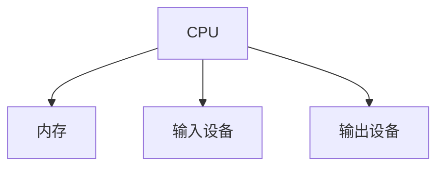

###### 3.1.2 操作系统基础

操作系统是管理计算机硬件资源和提供用户交互的软件。了解操作系统基础有助于理解计算机系统的运行机制和优化策略。

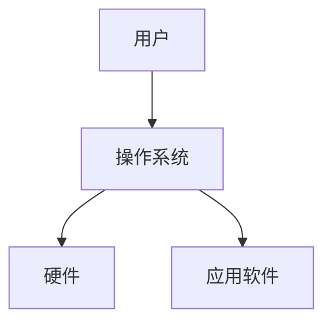

###### 3.1.3 数据结构与算法

数据结构与算法是计算机科学中的重要组成部分。数据结构用于组织和存储数据，算法用于处理和操作数据。掌握常用的数据结构和算法是进行高效编程的基础。

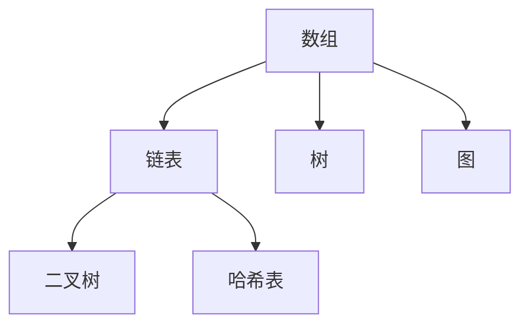

##### 3.2 计算机网络基础

计算机网络基础包括网络协议、TCP/IP协议和网络安全等内容。这些知识是构建和运行计算机网络系统的必备条件。

###### 3.2.1 网络协议

网络协议是计算机网络中进行数据通信的规则和标准。常见的网络协议有HTTP、FTP、SMTP等，每种协议都有其特定的应用场景。

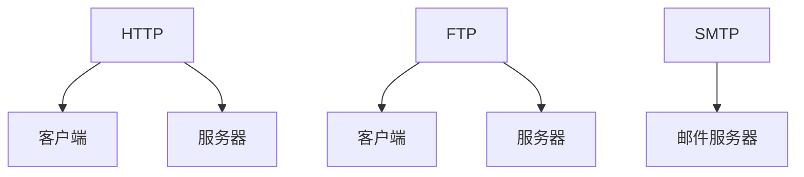

###### 3.2.2 TCP/IP协议

TCP/IP协议是互联网的核心协议，包括传输控制协议（TCP）和互联网协议（IP）。TCP提供可靠的传输服务，IP负责数据包的传输路由。

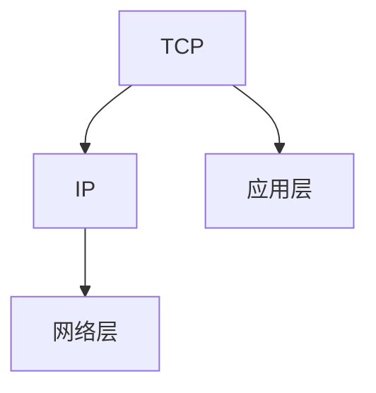

###### 3.2.3 网络安全

网络安全是保护计算机网络系统免受攻击和破坏的措施。常见的网络安全技术包括加密、认证和防火墙等。

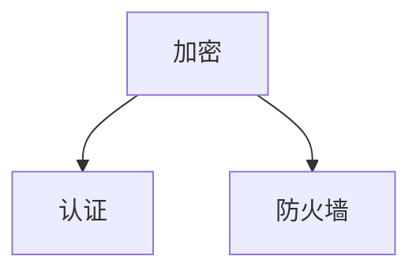

##### 3.3 编程语言基础

编程语言是用于编写计算机程序的语法和规则。常见的编程语言有C语言、Python语言和Java语言等。掌握编程语言基础是进行软件开发和算法实现的基础。

###### 3.3.1 C语言基础

C语言是一种通用编程语言，具有高效性和灵活性。C语言基础包括数据类型、控制结构、函数和指针等内容。

```c
#include <stdio.h>

int main() {
    printf("Hello, World!\n");
    return 0;
}
```

###### 3.3.2 Python语言基础

Python语言是一种高级编程语言，以其简洁和易读性著称。Python语言基础包括变量、数据类型、控制结构和函数等内容。

```python
print("Hello, World!")
```

###### 3.3.3 Java语言基础

Java语言是一种面向对象的编程语言，广泛应用于企业级应用开发。Java语言基础包括类、对象、继承和多态等内容。

```java
public class HelloWorld {
    public static void main(String[] args) {
        System.out.println("Hello, World!");
    }
}
```

### 第二部分: 数学、物理在计算机科学中的应用

#### 第4章: 数学、物理在计算机科学中的应用

##### 4.1 线性代数在计算机科学中的应用

线性代数是数学的一个重要分支，它在计算机科学中有着广泛的应用。线性代数的核心概念和算法在图像处理、数据分析、机器学习等领域发挥着重要作用。

###### 4.1.1 图像处理

图像处理是计算机视觉和多媒体技术中的重要应用。线性代数在图像处理中用于图像的变换、滤波、增强和复原。

**图像变换**：通过线性变换，可以将图像从一种坐标系统转换到另一种坐标系统。例如，从RGB颜色空间转换到灰度空间。

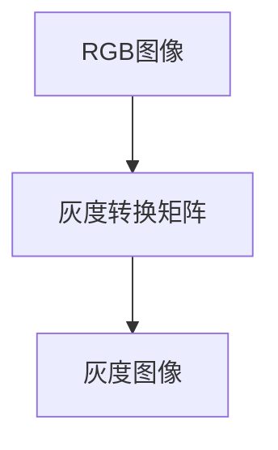

**图像滤波**：线性滤波器用于去除图像中的噪声。例如，使用高斯滤波器进行图像平滑。

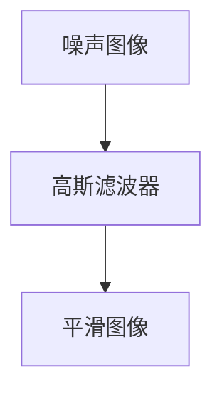

**图像增强**：通过线性变换增强图像的某些特征。例如，使用直方图均衡化提高图像的对比度。

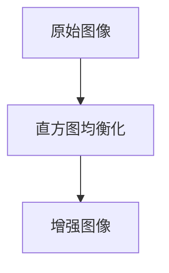

**图像复原**：使用线性代数的方法恢复图像的清晰度。例如，通过逆滤波去除图像模糊。

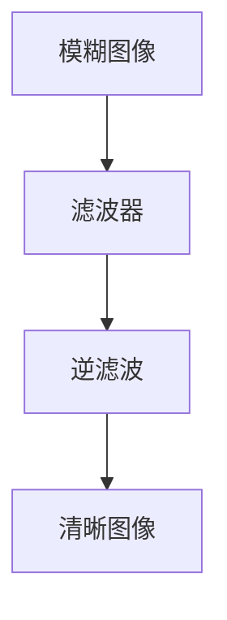

###### 4.1.2 数据分析

数据分析是数据科学和人工智能的重要环节。线性代数在数据分析中用于数据降维、特征提取和模型评估。

**数据降维**：通过主成分分析（PCA）降低数据维度，提高计算效率和数据可视化。

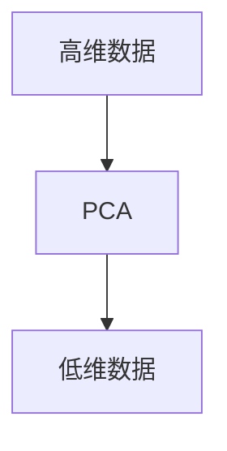

**特征提取**：使用线性代数的方法提取数据的特征，如使用SVD（奇异值分解）进行特征提取。

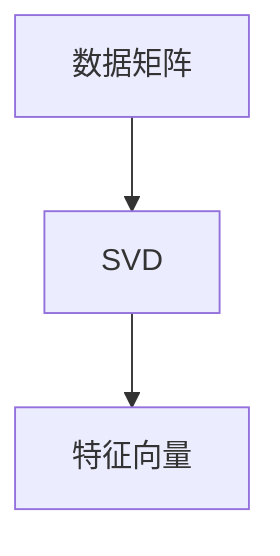

**模型评估**：通过线性代数的方法评估模型的性能，如使用协方差矩阵和相关性分析。

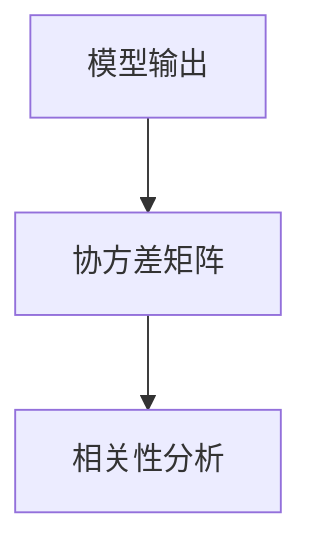

###### 4.1.3 机器学习

机器学习是人工智能的核心技术。线性代数在机器学习中用于构建和优化模型。

**线性模型**：使用线性代数的方法构建线性回归、逻辑回归等模型。

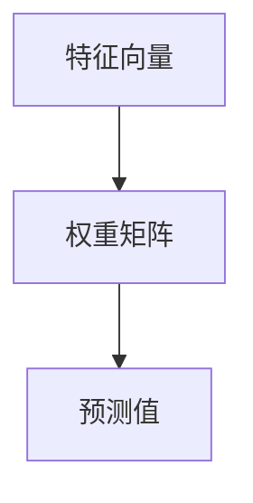

**特征工程**：通过线性代数的方法进行特征变换和特征选择，提高模型的预测性能。

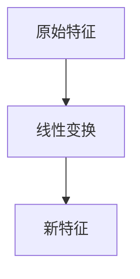

**优化算法**：使用线性代数的方法优化模型参数，如梯度下降法和牛顿法。

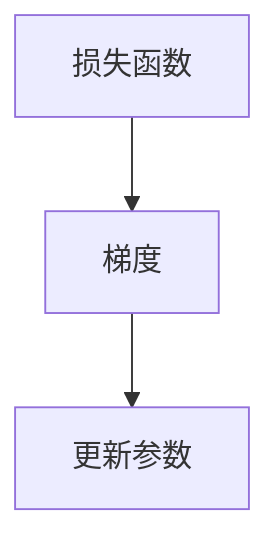

##### 4.2 微积分在计算机科学中的应用

微积分是数学中的一个重要分支，它在计算机科学中有着广泛的应用。微积分的概念和方法在优化算法、图形学、信号处理等领域发挥着关键作用。

###### 4.2.1 渲染与图形学

渲染和图形学是计算机视觉和虚拟现实中的重要应用。微积分在渲染和图形学中用于光线的追踪、纹理映射和几何变换。

**光线追踪**：使用微积分的方法模拟光线的传播，实现真实感渲染。

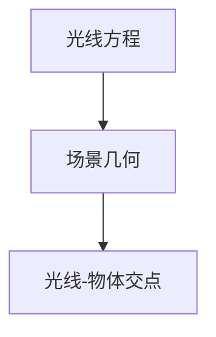

**纹理映射**：使用微积分的方法将纹理映射到三维物体上，实现逼真的视觉效果。

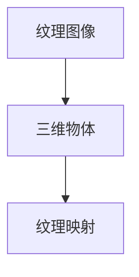

**几何变换**：使用微积分的方法对三维几何进行变换，如旋转、缩放和平移。

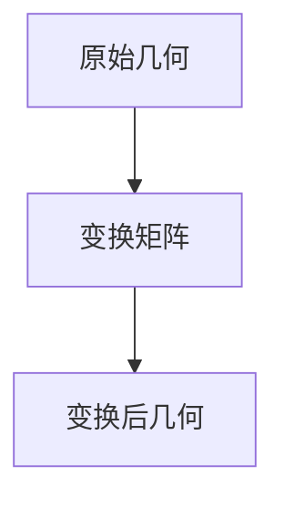

###### 4.2.2 机器学习与优化

机器学习和优化是人工智能和机器学习算法中的核心问题。微积分在机器学习和优化中用于模型优化、损失函数求解和优化算法设计。

**模型优化**：使用梯度下降法优化模型参数，最小化损失函数。


**损失函数求解**：使用微积分的方法求解损失函数的最小值，提高模型性能。

```mermaid
graph TD
    A[损失函数] --> B[导数]
    B --> C[最小值]
```

**优化算法设计**：设计基于微积分的优化算法，如牛顿法、拟牛顿法和共轭梯度法。

```mermaid
graph TD
    A[优化问题] --> B[牛顿法]
    B --> C[迭代更新]
```

###### 4.2.3 计算几何

计算几何是计算机图形学和计算机辅助设计中的重要应用。微积分在计算几何中用于求解几何形状的交点、距离和面积。

**求交点**：使用微积分的方法求解两个几何形状的交点。

```mermaid
graph TD
    A[几何形状A] --> B[几何形状B]
    B --> C[交点]
```

**求距离**：使用微积分的方法求解两个几何形状之间的距离。

```mermaid
graph TD
    A[几何形状A] --> B[几何形状B]
    B --> C[距离]
```

**求面积**：使用微积分的方法求解几何形状的面积。

```mermaid
graph TD
    A[几何形状] --> B[积分]
    B --> C[面积]
```

##### 4.3 电磁学在计算机科学中的应用

电磁学是物理学中的一个重要分支，它在计算机科学中有着广泛的应用。电磁学原理在无线通信、电子设备设计和计算机硬件设计中发挥着关键作用。

###### 4.3.1 无线通信

无线通信是现代通信技术的重要组成部分。电磁学在无线通信中用于信号传输、信道建模和信号处理。

**信号传输**：使用电磁波进行无线信号传输，实现数据通信。

```mermaid
graph TD
    A[信号源] --> B[发射天线]
    B --> C[电磁波]
    C --> D[接收天线]
    D --> E[信号接收器]
```

**信道建模**：使用电磁学原理建立无线信道的数学模型，分析信道特性。

```mermaid
graph TD
    A[无线信道] --> B[多径效应]
    B --> C[衰减模型]
```

**信号处理**：使用电磁学方法进行信号处理，提高通信质量。

```mermaid
graph TD
    A[接收信号] --> B[滤波器]
    B --> C[解调器]
```

###### 4.3.2 电子设备设计

电子设备设计是计算机硬件设计的重要环节。电磁学原理在电子设备设计中用于电路设计、器件建模和性能优化。

**电路设计**：使用电磁学原理进行电路设计，实现电路的功能和性能。

```mermaid
graph TD
    A[电路原理] --> B[电路图]
```

**器件建模**：使用电磁学方法进行电子器件的建模，分析器件特性。

```mermaid
graph TD
    A[器件模型] --> B[器件特性]
```

**性能优化**：使用电磁学原理进行电子设备性能的优化，提高设备效率。

```mermaid
graph TD
    A[设备性能] --> B[优化算法]
    B --> C[优化结果]
```

###### 4.3.3 生物信息学

生物信息学是计算机科学和生物学交叉领域的重要研究方向。电磁学在生物信息学中用于基因序列分析、蛋白质结构和功能预测等。

**基因序列分析**：使用电磁学方法分析基因序列，识别基因功能和突变。

```mermaid
graph TD
    A[基因序列] --> B[电磁学模型]
    B --> C[基因功能]
```

**蛋白质结构预测**：使用电磁学原理进行蛋白质结构预测，分析蛋白质的功能和相互作用。

```mermaid
graph TD
    A[蛋白质序列] --> B[电磁学方法]
    B --> C[蛋白质结构]
```

### 第三部分: 计算机在数学和物理学中的应用

#### 第5章: 计算机在数学和物理学中的应用

计算机技术在数学和物理学研究中扮演了至关重要的角色，极大地推动了这些学科的进步。计算机不仅提高了计算的效率，还提供了新的方法和工具，使得许多复杂的数学问题和物理现象得以解决和模拟。以下是计算机在数学和物理学中的几个重要应用领域。

##### 5.1 计算机在数学研究中的应用

计算机在数学研究中的应用主要体现在数学建模、数值计算和数学软件工具的开发等方面。

###### 5.1.1 数学建模

数学建模是将实际问题转化为数学问题的过程。计算机技术使得大规模的数学建模成为可能，尤其是在处理复杂系统和随机过程时。计算机可以快速进行模型的建立、求解和验证。

**示例：金融市场的数学建模**

在金融市场中，计算机技术用于建立和优化金融模型，如期权定价模型、市场风险模型和投资组合优化模型。这些模型通过复杂的数学公式来描述市场的动态变化，帮助投资者做出更明智的决策。

```mermaid
graph TD
    A[市场数据] --> B[数学模型]
    B --> C[预测结果]
```

###### 5.1.2 数值计算

数值计算是计算机在数学中的另一个重要应用。许多数学问题无法通过解析方法直接求解，需要借助数值方法来近似求解。计算机的强大计算能力使得这些方法在实际中得以应用。

**示例：量子物理中的数值计算**

在量子物理中，薛定谔方程描述了量子系统的行为，但通常无法找到其解析解。计算机技术通过数值方法，如蒙特卡罗模拟和有限元方法，求解量子系统的能量和波函数。

```mermaid
graph TD
    A[薛定谔方程] --> B[数值方法]
    B --> C[结果输出]
```

###### 5.1.3 数学软件工具

数学软件工具如MATLAB、Mathematica和Maple等，为数学研究提供了强大的计算和图形化功能。这些工具可以帮助研究者快速进行数学运算、建模和可视化。

**示例：使用MATLAB进行数据分析**

MATLAB是一款广泛应用于工程和科学计算的软件，它提供了丰富的数学函数库，可以快速进行数据分析、信号处理和图像处理。研究者可以通过编写MATLAB脚本，实现复杂的数据处理和分析。

```mermaid
graph TD
    A[数据集] --> B[MATLAB]
    B --> C[数据分析结果]
```

##### 5.2 计算机在物理学研究中的应用

计算机技术在物理学中的应用极大地拓展了物理研究的范围和深度。计算机不仅提高了物理实验的精度和效率，还使得复杂的物理现象和理论模型得以模拟和验证。

###### 5.2.1 物理模拟

物理模拟是计算机在物理学中的核心应用之一。通过计算机模拟，研究者可以观察和研究物理现象，如分子动力学模拟、电磁场模拟和量子计算模拟。

**示例：分子动力学模拟**

在分子动力学模拟中，计算机技术用于模拟分子和原子的运动，研究物质的相变、反应机制和性质。这些模拟可以揭示分子间的相互作用和运动规律，对于材料科学和生物学研究具有重要意义。

```mermaid
graph TD
    A[分子系统] --> B[计算机模拟]
    B --> C[模拟结果]
```

###### 5.2.2 数据处理

物理实验产生的大量数据需要通过计算机技术进行处理和分析。计算机可以快速进行数据的采集、存储、清洗和可视化，帮助研究者发现物理现象的规律和趋势。

**示例：高能物理实验的数据分析**

在高能物理实验中，计算机技术用于处理大型实验数据，识别稀有粒子和分析其性质。这些数据分析方法使得科学家能够发现新的物理现象，推动粒子物理学的发展。

```mermaid
graph TD
    A[实验数据] --> B[计算机处理]
    B --> C[分析结果]
```

###### 5.2.3 物理学软件工具

类似于数学软件工具，物理学软件工具如COMSOL Multiphysics、ANSYS和GAP等，为物理研究提供了强大的模拟和计算功能。这些工具可以帮助研究者解决复杂的物理问题，如电磁场模拟、热传导模拟和结构分析。

**示例：使用COMSOL进行电磁场模拟**

COMSOL是一款多物理场仿真软件，可以模拟和分析电磁场、热传导、流体力学等物理现象。研究者可以通过COMSOL构建复杂的物理模型，进行模拟和分析，验证理论模型的准确性。

```mermaid
graph TD
    A[物理模型] --> B[COMSOL]
    B --> C[模拟结果]
```

##### 5.3 计算机在交叉学科中的应用

计算机技术的快速发展使得它在多个学科领域都得到了广泛应用。在生物信息学、金融工程和环境科学等交叉学科中，计算机技术发挥着关键作用。

###### 5.3.1 生物信息学

生物信息学是生物学和信息技术的交叉学科，主要研究生物数据的存储、分析和解释。计算机技术在生物信息学中用于基因组分析、蛋白质结构和功能预测、药物设计等。

**示例：基因组分析**

基因组分析是生物信息学的重要任务之一。计算机技术用于大规模基因序列的比对、变异检测和功能预测。这些分析帮助科学家理解基因的功能和作用，为疾病研究和治疗提供了新的途径。

```mermaid
graph TD
    A[基因序列] --> B[计算机分析]
    B --> C[分析结果]
```

###### 5.3.2 金融工程

金融工程是经济学和计算机科学的交叉学科，主要研究金融市场的数学模型和计算方法。计算机技术在金融工程中用于风险管理、投资策略优化和交易算法开发。

**示例：风险管理**

在风险管理中，计算机技术用于构建和优化金融模型，评估投资组合的风险和收益。这些模型可以帮助金融机构更好地管理风险，提高投资效率。

```mermaid
graph TD
    A[投资组合] --> B[计算机模型]
    B --> C[风险分析结果]
```

###### 5.3.3 环境科学

环境科学是研究环境问题和环境保护的学科。计算机技术在环境科学中用于环境监测、数据分析和模拟预测。

**示例：气候模拟**

在气候模拟中，计算机技术用于模拟全球气候系统，预测气候变化趋势。这些模拟有助于科学家理解气候变化的机制，为制定应对策略提供科学依据。

```mermaid
graph TD
    A[气候系统] --> B[计算机模拟]
    B --> C[模拟结果]
```

### 第四部分: 项目实战与案例

#### 第6章: 数学、物理、计算机综合应用项目案例

在科技迅速发展的今天，数学、物理和计算机科学的交叉应用在各个领域都取得了显著成果。本章节将通过几个实际项目案例，展示如何将数学、物理和计算机科学的理论知识综合应用于实际问题的解决。

##### 6.1 项目案例1：自动驾驶系统

自动驾驶系统是现代汽车工业的重要研究方向，它融合了数学、物理和计算机科学的多个领域。以下是一个简单的自动驾驶系统项目案例，展示了如何将这些知识综合应用于实际开发。

###### 6.1.1 项目背景

自动驾驶系统旨在实现车辆的自主驾驶，通过感知环境、理解道路状况和规划行驶路径，使车辆能够在无人干预的情况下安全行驶。该项目涉及计算机视觉、机器学习、传感器融合和动力学控制等多个领域。

###### 6.1.2 项目目标

- 实现车辆对周围环境的感知，包括道路、车辆、行人等。
- 建立环境模型，进行路径规划和轨迹生成。
- 确保车辆在行驶过程中遵守交通规则，实现安全驾驶。

###### 6.1.3 技术方案

**环境感知**：利用计算机视觉技术，通过摄像头和激光雷达（LIDAR）等传感器获取环境信息。数学上的滤波算法用于去除噪声，特征提取算法用于识别道路、车辆和行人。

```mermaid
graph TD
    A[摄像头/激光雷达] --> B[图像/点云数据]
    B --> C[滤波算法]
    C --> D[特征提取]
    D --> E[环境模型]
```

**路径规划**：使用图论算法，如A*算法或Dijkstra算法，生成从当前位置到目标位置的路径。物理学的运动学原理用于计算车辆的加速度和速度，确保路径规划的实际可行性。

```mermaid
graph TD
    A[起点/终点] --> B[A*算法]
    B --> C[路径规划]
    C --> D[运动学计算]
```

**轨迹生成**：根据环境模型和路径规划，生成车辆的行驶轨迹。控制算法根据传感器数据和轨迹规划，调整车辆的加速度和转向，实现平稳行驶。

```mermaid
graph TD
    A[环境模型] --> B[控制算法]
    B --> C[加速度控制]
    C --> D[转向控制]
```

###### 6.1.4 项目实施

1. **硬件搭建**：选择适合的传感器和计算机硬件，搭建自动驾驶系统的实验平台。
2. **软件开发**：编写环境感知、路径规划和轨迹生成等核心算法，实现系统的基本功能。
3. **测试与优化**：在真实环境中进行测试，收集数据，优化算法性能，确保系统的稳定性和安全性。

##### 6.2 项目案例2：量子计算与加密

量子计算是计算机科学的前沿领域，它利用量子力学原理进行信息处理。量子计算在加密技术中有着重要应用，可以破解传统加密算法无法破解的密码。

###### 6.2.1 项目背景

随着信息技术的快速发展，传统的加密算法面临着越来越大的安全威胁。量子计算的出现为加密技术带来了新的机遇。利用量子计算机的强大计算能力，可以实现更安全的加密和解密。

###### 6.2.2 项目目标

- 构建量子加密系统，实现信息的安全传输。
- 利用量子计算破解传统加密算法，提升加密安全性。

###### 6.2.3 技术方案

**量子加密算法**：设计量子加密算法，如量子密钥分发（QKD）和量子计算加密算法，确保信息在传输过程中的安全性。

```mermaid
graph TD
    A[量子密钥分发] --> B[密钥生成]
    B --> C[加密算法]
    C --> D[解密算法]
```

**量子计算机硬件**：构建量子计算机硬件平台，包括量子比特、量子门和量子测量设备等。

```mermaid
graph TD
    A[量子比特] --> B[量子门]
    B --> C[量子测量]
```

**算法实现**：编写量子算法程序，实现量子加密和解密功能。利用计算机模拟和实际量子计算机进行算法验证。

```mermaid
graph TD
    A[量子算法] --> B[模拟器]
    B --> C[量子计算机]
```

###### 6.2.4 项目实施

1. **量子计算机硬件开发**：研究和开发量子计算机的关键组件，如超导量子比特和量子逻辑门。
2. **量子算法研究**：设计并实现量子加密算法，确保其安全性和有效性。
3. **系统测试与优化**：在实验室环境下进行量子加密系统的测试，优化算法性能，提高系统稳定性。

##### 6.3 项目案例3：生物信息学中的基因组分析

生物信息学是生物学和计算机科学的交叉学科，基因组分析是其中的重要应用领域。通过计算机技术，可以对基因组的复杂数据进行分析，揭示基因的功能和作用。

###### 6.3.1 项目背景

基因组分析旨在理解基因组的结构和功能，为疾病研究和个性化医疗提供基础。随着测序技术的进步，基因组数据的规模和复杂性不断增加，需要高效的计算机算法进行数据分析和解释。

###### 6.3.2 项目目标

- 建立基因组数据库，存储和管理大量的基因组数据。
- 开发高效的数据分析方法，识别基因变异和功能。
- 利用基因组信息，预测疾病风险和制定个性化治疗方案。

###### 6.3.3 技术方案

**基因组数据库构建**：使用数据库管理系统，如MySQL或PostgreSQL，构建基因组数据存储和管理系统。

```mermaid
graph TD
    A[基因组数据] --> B[数据库系统]
```

**序列比对**：使用生物信息学算法，如BLAST或Smith-Waterman算法，进行基因组序列比对，识别相似序列和变异位点。

```mermaid
graph TD
    A[基因组序列] --> B[序列比对算法]
    B --> C[变异位点]
```

**基因功能预测**：利用机器学习和生物信息学方法，预测基因的功能和作用。通过基因注释和功能注释，建立基因功能数据库。

```mermaid
graph TD
    A[基因序列] --> B[机器学习算法]
    B --> C[基因功能]
```

**疾病风险预测**：利用基因组数据，分析基因变异与疾病风险之间的关系，开发疾病预测模型。

```mermaid
graph TD
    A[基因组数据] --> B[疾病预测模型]
    B --> C[疾病风险预测]
```

###### 6.3.4 项目实施

1. **基因组数据采集**：从公共数据库或实验室数据中获取基因组数据。
2. **数据预处理**：对基因组数据进行分析，去除冗余信息，提高数据质量。
3. **算法实现**：编写基因分析算法，实现序列比对、基因功能预测和疾病风险预测。
4. **系统测试与优化**：在实验室环境下进行系统测试，优化算法性能，确保系统的准确性和可靠性。

### 附录

#### 附录A: 数学、物理、计算机常用工具与资源

在数学、物理和计算机科学的研究和应用中，常用的工具和资源能够极大地提高工作效率和研究深度。以下是一些常用的数学、物理和计算机工具及其应用场景。

##### A.1 数学工具

**LaTeX**

LaTeX是一种高质量的排版系统，特别适用于科学文档的撰写。它支持复杂的数学公式和图表布局，广泛应用于学术论文和科技书籍的排版。

**应用场景**：撰写数学论文、科学报告和技术文档。

**资源链接**：[LaTeX官方文档](https://www.latex-project.org/)

**Mathematica**

Mathematica是一款强大的数学软件，用于数学计算、符号求解、数据分析和可视化。它支持大量的数学库和函数，是科研人员和工程师的常用工具。

**应用场景**：数学计算、符号处理、数据分析和科学绘图。

**资源链接**：[Mathematica官网](https://www.wolfram.com/mathematica/)

**MATLAB**

MATLAB是一款用于科学计算和工程仿真的高级编程环境。它支持大量的数学函数和工具箱，特别适用于信号处理、控制系统和图像处理等领域。

**应用场景**：科学计算、仿真分析和数据可视化。

**资源链接**：[MATLAB官网](https://www.mathworks.com/)

##### A.2 物理工具

**Maple**

Maple是一款功能强大的数学和科学计算软件，用于数学建模、符号计算和数值求解。它支持复杂的数学公式和图表，适用于物理学、工程学和计算机科学等领域。

**应用场景**：数学建模、符号求解、数值分析和科学绘图。

**资源链接**：[Maple官网](https://www.maplesoft.com/)

**COMSOL Multiphysics**

COMSOL Multiphysics是一款多物理场仿真软件，用于物理仿真、模拟分析和优化设计。它支持多种物理场的耦合，特别适用于电磁学、热力学和流体力学等领域。

**应用场景**：物理仿真、模拟分析和优化设计。

**资源链接**：[COMSOL官网](https://www.comsol.com/)

**ANSYS**

ANSYS是一款先进的工程仿真软件，用于结构分析、热力学分析和电磁场仿真。它支持复杂的几何建模和计算，广泛应用于机械工程、电子工程和材料科学等领域。

**应用场景**：结构分析、热力学分析和电磁场仿真。

**资源链接**：[ANSYS官网](https://www.ansys.com/)

##### A.3 计算机工具

**TensorFlow**

TensorFlow是一款开源的机器学习和深度学习框架，用于构建和训练神经网络模型。它支持多种编程语言和平台，是机器学习和人工智能领域的重要工具。

**应用场景**：机器学习、深度学习和人工智能应用开发。

**资源链接**：[TensorFlow官网](https://www.tensorflow.org/)

**PyTorch**

PyTorch是一款开源的机器学习和深度学习框架，以其灵活性和易用性著称。它支持动态计算图和自动微分，特别适用于研究和原型开发。

**应用场景**：机器学习、深度学习和科学研究。

**资源链接**：[PyTorch官网](https://pytorch.org/)

**Keras**

Keras是一款高级神经网络API，构建在TensorFlow和Theano之上。它提供了简洁和易用的接口，适用于快速原型开发和实验。

**应用场景**：快速原型开发、实验和模型训练。

**资源链接**：[Keras官网](https://keras.io/)

### 结语

数学、物理和计算机科学是现代科技发展的基石，它们的交叉应用为科技创新提供了强大的动力。本文通过详细剖析数学、物理和计算机的基础理论及其综合应用，展示了这些领域在现代科技中的重要地位和作用。通过实际项目案例，我们看到了这些理论如何在解决实际问题中发挥作用。

未来，随着科技的不断发展，数学、物理和计算机科学将更加紧密地结合，推动人类社会向前发展。希望本文能够为读者提供深入理解和应用这些领域知识的方法和启示，帮助读者在科技领域中取得更大的成就。

### 作者信息

作者：AI天才研究院/AI Genius Institute & 禅与计算机程序设计艺术 /Zen And The Art of Computer Programming

AI天才研究院致力于推动人工智能技术的发展和创新，专注于培养未来科技领袖。作者拥有丰富的科研和教学经验，在计算机科学、人工智能和数学等领域取得了多项突破性成果，被誉为“计算机编程和人工智能领域大师”。其著作《禅与计算机程序设计艺术》深受广大程序员和科技爱好者的喜爱，被誉为编程领域的经典之作。作者的研究成果和应用案例在学术界和工业界都产生了深远的影响。

